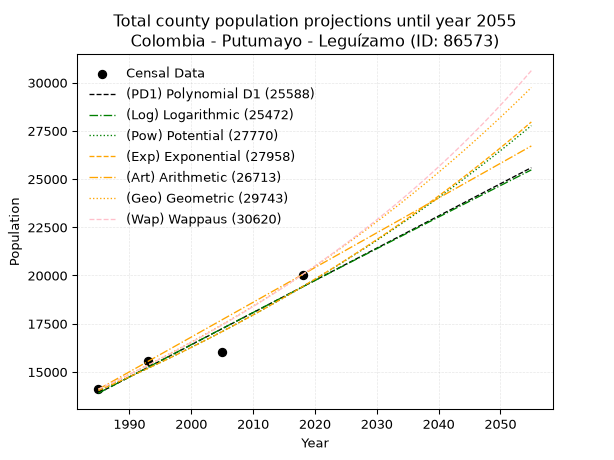
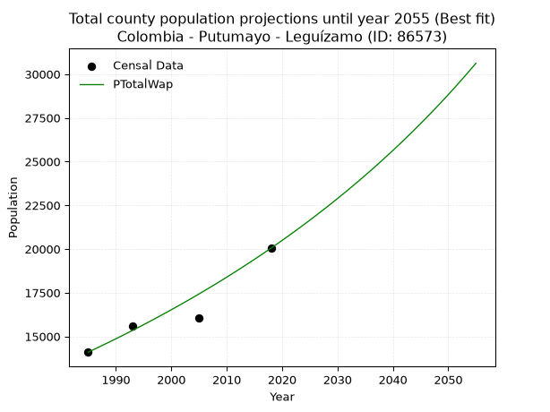
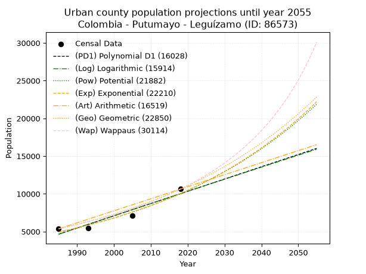
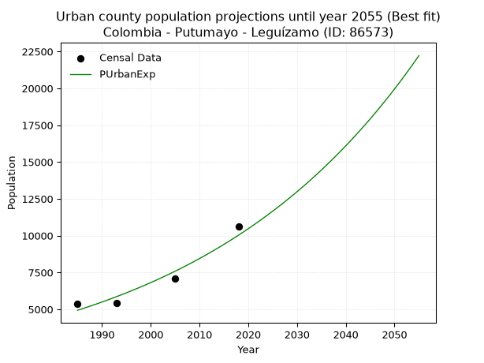
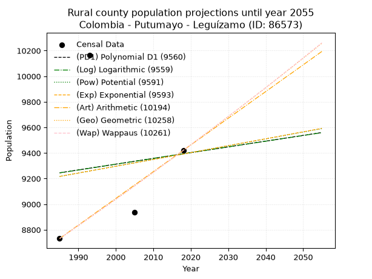
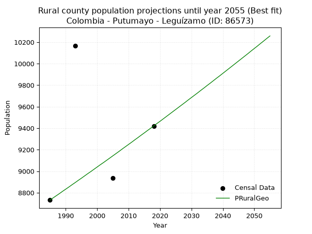

<div align="center">


</div>

# _“Population and Public Services Demand Projections (PPSD) until Year 2050 for Colombia - Putumayo - Leguízamo (ID: 86573)”_
Keywords: `population` `public-service` `projection` `lineal` `polynomial` `logarithmic` `potential` `exponential` `arithmetic` `geometric` `wappaus` `dane` `colombia` `south-america`

PPSD are analytical estimates used by governments and planners to anticipate future changes in population size, age distribution, and the resulting community needs for utilities, healthcare, education, and infrastructure as sizing future water treatment facilities, electrical grids, and road networks based on spatial growth.

> **General running parameters**: • app_version: _v20260806_. • Python version: _3.14.7_. • Pandas version: _3.0.5_. • NumPy version: _2.5.1_. • Creates, save and include plots into reports (create_plot): _True_. • Projection until year: _2050_. • Process polynomial degree 2 and up: _False_. • Process Wappaus: _True_. • Process Wappaus: _True_. • Set negative values to zero: _True_. • Set infinite values to zero: _True_. • Drop dataset notes: _True_. 
<div align="center">

Dynamic map: [:earth_americas:Google](http://maps.google.com/maps?q=-0.19231772,-74.7818418) [:earth_americas:OSM](https://www.openstreetmap.org/#map=18/-0.19231772/-74.7818418&layers=P) [:earth_americas:Bing](https://www.bing.com/maps?cp=-0.19231772~-74.7818418&lvl=18) [:earth_americas:Apple](https://maps.apple.com/frame?center=-0.19231772%2C-74.7818418&span=0.003%2C0.006)

</div>


<div align="center">

```geojson
{
  "type": "Feature",
  "geometry": {
    "type": "Point", 
    "coordinates": [-74.7818418, -0.19231772]
  }, 
  "properties": {
    "Name": "Colombia - Putumayo - Leguízamo (ID: 86573)"
  }
}
```

</div>


## 0. Census Data (4 records)

Census data are official statistics collected by a government about the people and housing in a country. They usually include counts of total population, age, sex, race, income, education, and jobs.

📅Global census file: [Population.xlsx](../data/Population.xlsx)

| Source   |   Year |   CountryID | CountryName   |   StateID | StateName   |   CountyID | CountyName   |   PTotal |   PUrban |   PRural |
|:---------|-------:|------------:|:--------------|----------:|:------------|-----------:|:-------------|---------:|---------:|---------:|
| DANE     |   1985 |          57 | Colombia      |        86 | Putumayo    |      86573 | Leguízamo    |    14098 |     5366 |     8732 |
| DANE     |   1993 |          57 | Colombia      |        86 | Putumayo    |      86573 | Leguízamo    |    15586 |     5420 |    10166 |
| DANE     |   2005 |          57 | Colombia      |        86 | Putumayo    |      86573 | Leguízamo    |    16044 |     7108 |     8936 |
| DANE     |   2018 |          57 | Colombia      |        86 | Putumayo    |      86573 | Leguízamo    |    20045 |    10624 |     9421 |

> 🔥Some records could had specific notes about the registered values or the corresponding urban or rural distribution.

## 1. Total

### 1.1. Coefficients and Parameters

* (PD1) Polynomial Deg 1: 167.02488960256667, -317648.285427534 (lineal)
* (Log) Logarithmic: 334128.74509016454, -2523272.018970063
* (Pow) Potential: 19.706089215059418, -60.838992229826474
* (Exp) Exponential: 0.009849497090037346, 4.529693910558966e-05
* (Art) Arithmetic: Year diff. 2018 - 1985 = 33, Population diff. 20045 - 14098 = 5947, Annual growth = 180.21212121212122
* (Geo) Geometric: Year diff. 2018 - 1985 = 33, Population diff. 20045 - 14098 = 5947, Annual growth % = 0.010722129043813089
* (Wap) Wappaus: i = 1.0556314396047284, Condition values only valid for < 200)

<sub>
Wappaus condition values: ['0.00', '1.06', '2.11', '3.17', '4.22', '5.28', '6.33', '7.39', '8.45', '9.50', '10.56', '11.61', '12.67', '13.72', '14.78', '15.83', '16.89', '17.95', '19.00', '20.06', '21.11', '22.17', '23.22', '24.28', '25.34', '26.39', '27.45', '28.50', '29.56', '30.61', '31.67', '32.72', '33.78', '34.84', '35.89', '36.95', '38.00', '39.06', '40.11', '41.17', '42.23', '43.28', '44.34', '45.39', '46.45', '47.50', '48.56', '49.61', '50.67', '51.73', '52.78', '53.84', '54.89', '55.95', '57.00', '58.06', '59.12', '60.17', '61.23', '62.28', '63.34', '64.39', '65.45', '66.50', '67.56', '68.62']
</sub>


### 1.2. Projected Dataset

|   Year |   CountyID |   PTotalPD1 |   PTotalLog |   PTotalPow |   PTotalExp |   PTotalArt |   PTotalGeo |   PTotalWap |
|-------:|-----------:|------------:|------------:|------------:|------------:|------------:|------------:|------------:|
|   1985 |      86573 |       13896 |       13893 |       14027 |       14030 |       14098 |       14098 |       14098 |
|   1986 |      86573 |       14063 |       14061 |       14167 |       14169 |       14278 |       14249 |       14248 |
|   1987 |      86573 |       14230 |       14229 |       14308 |       14310 |       14458 |       14402 |       14399 |
|   1988 |      86573 |       14397 |       14397 |       14451 |       14451 |       14639 |       14556 |       14552 |
|   1989 |      86573 |       14564 |       14565 |       14595 |       14594 |       14819 |       14712 |       14706 |
|   1990 |      86573 |       14731 |       14733 |       14740 |       14739 |       14999 |       14870 |       14862 |
|   1991 |      86573 |       14898 |       14901 |       14887 |       14885 |       15179 |       15030 |       15020 |
|   1992 |      86573 |       15065 |       15069 |       15035 |       15032 |       15359 |       15191 |       15180 |
|   1993 |      86573 |       15232 |       15236 |       15184 |       15181 |       15540 |       15354 |       15341 |
|   1994 |      86573 |       15399 |       15404 |       15335 |       15331 |       15720 |       15518 |       15504 |
|   1995 |      86573 |       15566 |       15572 |       15487 |       15483 |       15900 |       15685 |       15669 |
|   1996 |      86573 |       15733 |       15739 |       15641 |       15636 |       16080 |       15853 |       15836 |
|   1997 |      86573 |       15900 |       15906 |       15796 |       15791 |       16261 |       16023 |       16005 |
|   1998 |      86573 |       16067 |       16074 |       15953 |       15947 |       16441 |       16195 |       16175 |
|   1999 |      86573 |       16234 |       16241 |       16111 |       16105 |       16621 |       16368 |       16348 |
|   2000 |      86573 |       16401 |       16408 |       16270 |       16264 |       16801 |       16544 |       16522 |
|   2001 |      86573 |       16569 |       16575 |       16432 |       16425 |       16981 |       16721 |       16699 |
|   2002 |      86573 |       16736 |       16742 |       16594 |       16588 |       17162 |       16900 |       16877 |
|   2003 |      86573 |       16903 |       16909 |       16758 |       16752 |       17342 |       17082 |       17058 |
|   2004 |      86573 |       17070 |       17076 |       16924 |       16918 |       17522 |       17265 |       17241 |
|   2005 |      86573 |       17237 |       17242 |       17091 |       17085 |       17702 |       17450 |       17426 |
|   2006 |      86573 |       17404 |       17409 |       17260 |       17254 |       17882 |       17637 |       17613 |
|   2007 |      86573 |       17571 |       17575 |       17430 |       17425 |       18063 |       17826 |       17802 |
|   2008 |      86573 |       17738 |       17742 |       17602 |       17598 |       18243 |       18017 |       17994 |
|   2009 |      86573 |       17905 |       17908 |       17776 |       17772 |       18423 |       18210 |       18188 |
|   2010 |      86573 |       18072 |       18074 |       17951 |       17948 |       18603 |       18406 |       18384 |
|   2011 |      86573 |       18239 |       18241 |       18128 |       18125 |       18784 |       18603 |       18583 |
|   2012 |      86573 |       18406 |       18407 |       18306 |       18305 |       18964 |       18802 |       18784 |
|   2013 |      86573 |       18573 |       18573 |       18486 |       18486 |       19144 |       19004 |       18988 |
|   2014 |      86573 |       18740 |       18739 |       18668 |       18669 |       19324 |       19208 |       19194 |
|   2015 |      86573 |       18907 |       18905 |       18852 |       18854 |       19504 |       19414 |       19403 |
|   2016 |      86573 |       19074 |       19070 |       19037 |       19040 |       19685 |       19622 |       19614 |
|   2017 |      86573 |       19241 |       19236 |       19224 |       19229 |       19865 |       19832 |       19828 |
|   2018 |      86573 |       19408 |       19402 |       19412 |       19419 |       20045 |       20045 |       20045 |
|   2019 |      86573 |       19575 |       19567 |       19603 |       19611 |       20225 |       20260 |       20265 |
|   2020 |      86573 |       19742 |       19733 |       19795 |       19805 |       20405 |       20477 |       20487 |
|   2021 |      86573 |       19909 |       19898 |       19989 |       20001 |       20586 |       20697 |       20712 |
|   2022 |      86573 |       20076 |       20063 |       20185 |       20199 |       20766 |       20919 |       20941 |
|   2023 |      86573 |       20243 |       20229 |       20383 |       20399 |       20946 |       21143 |       21172 |
|   2024 |      86573 |       20410 |       20394 |       20582 |       20601 |       21126 |       21370 |       21407 |
|   2025 |      86573 |       20577 |       20559 |       20783 |       20805 |       21306 |       21599 |       21644 |
|   2026 |      86573 |       20744 |       20724 |       20986 |       21011 |       21487 |       21830 |       21885 |
|   2027 |      86573 |       20911 |       20889 |       21192 |       21219 |       21667 |       22064 |       22129 |
|   2028 |      86573 |       21078 |       21053 |       21399 |       21429 |       21847 |       22301 |       22376 |
|   2029 |      86573 |       21245 |       21218 |       21607 |       21641 |       22027 |       22540 |       22627 |
|   2030 |      86573 |       21412 |       21383 |       21818 |       21856 |       22208 |       22782 |       22881 |
|   2031 |      86573 |       21579 |       21547 |       22031 |       22072 |       22388 |       23026 |       23139 |
|   2032 |      86573 |       21746 |       21712 |       22246 |       22290 |       22568 |       23273 |       23400 |
|   2033 |      86573 |       21913 |       21876 |       22462 |       22511 |       22748 |       23522 |       23665 |
|   2034 |      86573 |       22080 |       22040 |       22681 |       22734 |       22928 |       23775 |       23934 |
|   2035 |      86573 |       22247 |       22205 |       22902 |       22959 |       23109 |       24030 |       24207 |
|   2036 |      86573 |       22414 |       22369 |       23125 |       23186 |       23289 |       24287 |       24484 |
|   2037 |      86573 |       22581 |       22533 |       23350 |       23416 |       23469 |       24548 |       24764 |
|   2038 |      86573 |       22748 |       22697 |       23577 |       23647 |       23649 |       24811 |       25049 |
|   2039 |      86573 |       22915 |       22861 |       23806 |       23881 |       23829 |       25077 |       25338 |
|   2040 |      86573 |       23082 |       23025 |       24037 |       24118 |       24010 |       25346 |       25631 |
|   2041 |      86573 |       23250 |       23188 |       24270 |       24356 |       24190 |       25618 |       25929 |
|   2042 |      86573 |       23417 |       23352 |       24505 |       24598 |       24370 |       25892 |       26231 |
|   2043 |      86573 |       23584 |       23516 |       24743 |       24841 |       24550 |       26170 |       26538 |
|   2044 |      86573 |       23751 |       23679 |       24983 |       25087 |       24731 |       26450 |       26850 |
|   2045 |      86573 |       23918 |       23843 |       25225 |       25335 |       24911 |       26734 |       27166 |
|   2046 |      86573 |       24085 |       24006 |       25469 |       25586 |       25091 |       27021 |       27487 |
|   2047 |      86573 |       24252 |       24169 |       25715 |       25839 |       25271 |       27310 |       27813 |
|   2048 |      86573 |       24419 |       24332 |       25964 |       26095 |       25451 |       27603 |       28145 |
|   2049 |      86573 |       24586 |       24495 |       26215 |       26353 |       25632 |       27899 |       28481 |
|   2050 |      86573 |       24753 |       24658 |       26468 |       26614 |       25812 |       28198 |       28824 |
<div align="center">

</img>

</div>


### 1.3. Best fit with absolute error and relative error (%)

Relative error puts that difference into context by dividing the absolute error by the true value, creating a unitless ratio or percentage that shows the scale of the mistake.

Absolute and relative error

|   Year | Source   |   CountryID | CountryName   |   StateID | StateName   |   CountyID_x | CountyName   |   PTotal |   PUrban |   PRural |   CountyID_y |   PTotalPD1 |   PTotalLog |   PTotalPow |   PTotalExp |   PTotalArt |   PTotalGeo |   PTotalWap |   PTotalPD1AbsError |   PTotalLogAbsError |   PTotalPowAbsError |   PTotalExpAbsError |   PTotalArtAbsError |   PTotalGeoAbsError |   PTotalWapAbsError |   PTotalPD1RelError |   PTotalLogRelError |   PTotalPowRelError |   PTotalExpRelError |   PTotalArtRelError |   PTotalGeoRelError |   PTotalWapRelError |
|-------:|:---------|------------:|:--------------|----------:|:------------|-------------:|:-------------|---------:|---------:|---------:|-------------:|------------:|------------:|------------:|------------:|------------:|------------:|------------:|--------------------:|--------------------:|--------------------:|--------------------:|--------------------:|--------------------:|--------------------:|--------------------:|--------------------:|--------------------:|--------------------:|--------------------:|--------------------:|--------------------:|
|   1985 | DANE     |          57 | Colombia      |        86 | Putumayo    |        86573 | Leguízamo    |    14098 |     5366 |     8732 |        86573 |       13896 |       13893 |       14027 |       14030 |       14098 |       14098 |       14098 |                 202 |                 205 |                  71 |                  68 |                   0 |                   0 |                   0 |             1.43283 |             1.45411 |            0.503618 |            0.482338 |            0        |             0       |             0       |
|   1993 | DANE     |          57 | Colombia      |        86 | Putumayo    |        86573 | Leguízamo    |    15586 |     5420 |    10166 |        86573 |       15232 |       15236 |       15184 |       15181 |       15540 |       15354 |       15341 |                 354 |                 350 |                 402 |                 405 |                  46 |                 232 |                 245 |             2.27127 |             2.24561 |            2.57924  |            2.59849  |            0.295137 |             1.48852 |             1.57192 |
|   2005 | DANE     |          57 | Colombia      |        86 | Putumayo    |        86573 | Leguízamo    |    16044 |     7108 |     8936 |        86573 |       17237 |       17242 |       17091 |       17085 |       17702 |       17450 |       17426 |                1193 |                1198 |                1047 |                1041 |                1658 |                1406 |                1382 |             7.4358  |             7.46697 |            6.5258   |            6.48841  |           10.3341   |             8.7634  |             8.61381 |
|   2018 | DANE     |          57 | Colombia      |        86 | Putumayo    |        86573 | Leguízamo    |    20045 |    10624 |     9421 |        86573 |       19408 |       19402 |       19412 |       19419 |       20045 |       20045 |       20045 |                 637 |                 643 |                 633 |                 626 |                   0 |                   0 |                   0 |             3.17785 |             3.20778 |            3.15789  |            3.12297  |            0        |             0       |             0       |

Relative error mean

| Method    |   RelError | Best   |
|:----------|-----------:|:-------|
| PTotalPD1 |    3.57944 |        |
| PTotalLog |    3.59362 |        |
| PTotalPow |    3.19164 |        |
| PTotalExp |    3.17305 |        |
| PTotalArt |    2.6573  |        |
| PTotalGeo |    2.56298 |        |
| PTotalWap |    2.54643 | True   |

💙Best method: _**PTotalWap**_
<div align="center">

</img>

</div>


### 1.4. Fresh water supply demand in liters per capita per day (lpcd)

The fresh water supply demand typically ranges from 100 to 300 liters per capita per day (lpcd) for standard domestic and municipal planning, though absolute survival minimums set by the World Health Organization are as low as 7.5 to 20 liters per day, and total consumption in high-income nations can exceed 400 liters.

> `CZ`: Level in meters above the sea level (masl).<br> `WS`: Fresh water supply demand in liters per capita per day (lpcd or l/h/d).<br> `WSAll`: Zonal fresh water supply demand in liters per second (l/s).<br> `A`: Zonal area in square meters.

Reference values (RAS Colombia)

|    CZ |   WS |
|------:|-----:|
|  1000 |  120 |
|  2000 |  130 |
| 99999 |  140 |

County shapefile geometry properties and water supply values

|   CountyID |      ATotal |   CZTotal |   WSTotal |
|-----------:|------------:|----------:|----------:|
|      86573 | 1.06512e+10 |   214.991 |       120 |

Projected values for best method: PTotalWap

|   CountyID |   Year |   PTotalWap |   WSTotal |   WSTotalAll |
|-----------:|-------:|------------:|----------:|-------------:|
|      86573 |   1985 |       14098 |       120 |      19.5806 |
|      86573 |   1986 |       14248 |       120 |      19.7889 |
|      86573 |   1987 |       14399 |       120 |      19.9986 |
|      86573 |   1988 |       14552 |       120 |      20.2111 |
|      86573 |   1989 |       14706 |       120 |      20.425  |
|      86573 |   1990 |       14862 |       120 |      20.6417 |
|      86573 |   1991 |       15020 |       120 |      20.8611 |
|      86573 |   1992 |       15180 |       120 |      21.0833 |
|      86573 |   1993 |       15341 |       120 |      21.3069 |
|      86573 |   1994 |       15504 |       120 |      21.5333 |
|      86573 |   1995 |       15669 |       120 |      21.7625 |
|      86573 |   1996 |       15836 |       120 |      21.9944 |
|      86573 |   1997 |       16005 |       120 |      22.2292 |
|      86573 |   1998 |       16175 |       120 |      22.4653 |
|      86573 |   1999 |       16348 |       120 |      22.7056 |
|      86573 |   2000 |       16522 |       120 |      22.9472 |
|      86573 |   2001 |       16699 |       120 |      23.1931 |
|      86573 |   2002 |       16877 |       120 |      23.4403 |
|      86573 |   2003 |       17058 |       120 |      23.6917 |
|      86573 |   2004 |       17241 |       120 |      23.9458 |
|      86573 |   2005 |       17426 |       120 |      24.2028 |
|      86573 |   2006 |       17613 |       120 |      24.4625 |
|      86573 |   2007 |       17802 |       120 |      24.725  |
|      86573 |   2008 |       17994 |       120 |      24.9917 |
|      86573 |   2009 |       18188 |       120 |      25.2611 |
|      86573 |   2010 |       18384 |       120 |      25.5333 |
|      86573 |   2011 |       18583 |       120 |      25.8097 |
|      86573 |   2012 |       18784 |       120 |      26.0889 |
|      86573 |   2013 |       18988 |       120 |      26.3722 |
|      86573 |   2014 |       19194 |       120 |      26.6583 |
|      86573 |   2015 |       19403 |       120 |      26.9486 |
|      86573 |   2016 |       19614 |       120 |      27.2417 |
|      86573 |   2017 |       19828 |       120 |      27.5389 |
|      86573 |   2018 |       20045 |       120 |      27.8403 |
|      86573 |   2019 |       20265 |       120 |      28.1458 |
|      86573 |   2020 |       20487 |       120 |      28.4542 |
|      86573 |   2021 |       20712 |       120 |      28.7667 |
|      86573 |   2022 |       20941 |       120 |      29.0847 |
|      86573 |   2023 |       21172 |       120 |      29.4056 |
|      86573 |   2024 |       21407 |       120 |      29.7319 |
|      86573 |   2025 |       21644 |       120 |      30.0611 |
|      86573 |   2026 |       21885 |       120 |      30.3958 |
|      86573 |   2027 |       22129 |       120 |      30.7347 |
|      86573 |   2028 |       22376 |       120 |      31.0778 |
|      86573 |   2029 |       22627 |       120 |      31.4264 |
|      86573 |   2030 |       22881 |       120 |      31.7792 |
|      86573 |   2031 |       23139 |       120 |      32.1375 |
|      86573 |   2032 |       23400 |       120 |      32.5    |
|      86573 |   2033 |       23665 |       120 |      32.8681 |
|      86573 |   2034 |       23934 |       120 |      33.2417 |
|      86573 |   2035 |       24207 |       120 |      33.6208 |
|      86573 |   2036 |       24484 |       120 |      34.0056 |
|      86573 |   2037 |       24764 |       120 |      34.3944 |
|      86573 |   2038 |       25049 |       120 |      34.7903 |
|      86573 |   2039 |       25338 |       120 |      35.1917 |
|      86573 |   2040 |       25631 |       120 |      35.5986 |
|      86573 |   2041 |       25929 |       120 |      36.0125 |
|      86573 |   2042 |       26231 |       120 |      36.4319 |
|      86573 |   2043 |       26538 |       120 |      36.8583 |
|      86573 |   2044 |       26850 |       120 |      37.2917 |
|      86573 |   2045 |       27166 |       120 |      37.7306 |
|      86573 |   2046 |       27487 |       120 |      38.1764 |
|      86573 |   2047 |       27813 |       120 |      38.6292 |
|      86573 |   2048 |       28145 |       120 |      39.0903 |
|      86573 |   2049 |       28481 |       120 |      39.5569 |
|      86573 |   2050 |       28824 |       120 |      40.0333 |

## 2. Urban

### 2.1. Coefficients and Parameters

* (PD1) Polynomial Deg 1: 162.52509032516835, -317961.31192291796 (lineal)
* (Log) Logarithmic: 325062.5696599349, -2463673.6968731177
* (Pow) Potential: 43.00090813042825, -138.1138374464655
* (Exp) Exponential: 0.02149601680424327, 1.4517254707940359e-15
* (Art) Arithmetic: Year diff. 2018 - 1985 = 33, Population diff. 10624 - 5366 = 5258, Annual growth = 159.33333333333334
* (Geo) Geometric: Year diff. 2018 - 1985 = 33, Population diff. 10624 - 5366 = 5258, Annual growth % = 0.02091365327895578
* (Wap) Wappaus: i = 1.9929122368146759, Condition values only valid for < 200)

<sub>
Wappaus condition values: ['0.00', '1.99', '3.99', '5.98', '7.97', '9.96', '11.96', '13.95', '15.94', '17.94', '19.93', '21.92', '23.91', '25.91', '27.90', '29.89', '31.89', '33.88', '35.87', '37.87', '39.86', '41.85', '43.84', '45.84', '47.83', '49.82', '51.82', '53.81', '55.80', '57.79', '59.79', '61.78', '63.77', '65.77', '67.76', '69.75', '71.74', '73.74', '75.73', '77.72', '79.72', '81.71', '83.70', '85.70', '87.69', '89.68', '91.67', '93.67', '95.66', '97.65', '99.65', '101.64', '103.63', '105.62', '107.62', '109.61', '111.60', '113.60', '115.59', '117.58', '119.57', '121.57', '123.56', '125.55', '127.55', '129.54']
</sub>


### 2.2. Projected Dataset

|   Year |   CountyID |   PUrbanPD1 |   PUrbanLog |   PUrbanPow |   PUrbanExp |   PUrbanArt |   PUrbanGeo |   PUrbanWap |
|-------:|-----------:|------------:|------------:|------------:|------------:|------------:|------------:|------------:|
|   1985 |      86573 |        4651 |        4648 |        4930 |        4932 |        5366 |        5366 |        5366 |
|   1986 |      86573 |        4814 |        4812 |        5038 |        5040 |        5525 |        5478 |        5474 |
|   1987 |      86573 |        4976 |        4975 |        5148 |        5149 |        5685 |        5593 |        5584 |
|   1988 |      86573 |        5139 |        5139 |        5261 |        5261 |        5844 |        5710 |        5697 |
|   1989 |      86573 |        5301 |        5302 |        5376 |        5375 |        6003 |        5829 |        5812 |
|   1990 |      86573 |        5464 |        5466 |        5493 |        5492 |        6163 |        5951 |        5929 |
|   1991 |      86573 |        5626 |        5629 |        5613 |        5611 |        6322 |        6076 |        6048 |
|   1992 |      86573 |        5789 |        5792 |        5736 |        5733 |        6481 |        6203 |        6171 |
|   1993 |      86573 |        5951 |        5955 |        5861 |        5858 |        6641 |        6332 |        6296 |
|   1994 |      86573 |        6114 |        6119 |        5989 |        5985 |        6800 |        6465 |        6423 |
|   1995 |      86573 |        6276 |        6282 |        6119 |        6115 |        6959 |        6600 |        6554 |
|   1996 |      86573 |        6439 |        6444 |        6253 |        6248 |        7119 |        6738 |        6687 |
|   1997 |      86573 |        6601 |        6607 |        6389 |        6384 |        7278 |        6879 |        6824 |
|   1998 |      86573 |        6764 |        6770 |        6528 |        6523 |        7437 |        7023 |        6963 |
|   1999 |      86573 |        6926 |        6933 |        6670 |        6664 |        7597 |        7170 |        7106 |
|   2000 |      86573 |        7089 |        7095 |        6815 |        6809 |        7756 |        7320 |        7252 |
|   2001 |      86573 |        7251 |        7258 |        6963 |        6957 |        7915 |        7473 |        7402 |
|   2002 |      86573 |        7414 |        7420 |        7114 |        7108 |        8075 |        7629 |        7555 |
|   2003 |      86573 |        7576 |        7582 |        7268 |        7263 |        8234 |        7788 |        7712 |
|   2004 |      86573 |        7739 |        7745 |        7426 |        7420 |        8393 |        7951 |        7872 |
|   2005 |      86573 |        7901 |        7907 |        7587 |        7582 |        8553 |        8118 |        8037 |
|   2006 |      86573 |        8064 |        8069 |        7752 |        7746 |        8712 |        8287 |        8206 |
|   2007 |      86573 |        8227 |        8231 |        7920 |        7915 |        8871 |        8461 |        8379 |
|   2008 |      86573 |        8389 |        8393 |        8091 |        8087 |        9031 |        8638 |        8557 |
|   2009 |      86573 |        8552 |        8555 |        8266 |        8262 |        9190 |        8818 |        8739 |
|   2010 |      86573 |        8714 |        8716 |        8445 |        8442 |        9349 |        9003 |        8926 |
|   2011 |      86573 |        8877 |        8878 |        8627 |        8625 |        9509 |        9191 |        9119 |
|   2012 |      86573 |        9039 |        9040 |        8814 |        8813 |        9668 |        9383 |        9316 |
|   2013 |      86573 |        9202 |        9201 |        9004 |        9004 |        9827 |        9580 |        9519 |
|   2014 |      86573 |        9364 |        9363 |        9199 |        9200 |        9987 |        9780 |        9728 |
|   2015 |      86573 |        9527 |        9524 |        9397 |        9400 |       10146 |        9984 |        9942 |
|   2016 |      86573 |        9689 |        9685 |        9600 |        9604 |       10305 |       10193 |       10163 |
|   2017 |      86573 |        9852 |        9847 |        9807 |        9813 |       10465 |       10406 |       10390 |
|   2018 |      86573 |       10014 |       10008 |       10018 |       10026 |       10624 |       10624 |       10624 |
|   2019 |      86573 |       10177 |       10169 |       10234 |       10244 |       10783 |       10846 |       10865 |
|   2020 |      86573 |       10339 |       10330 |       10454 |       10466 |       10943 |       11073 |       11113 |
|   2021 |      86573 |       10502 |       10491 |       10679 |       10694 |       11102 |       11305 |       11369 |
|   2022 |      86573 |       10664 |       10651 |       10908 |       10926 |       11261 |       11541 |       11634 |
|   2023 |      86573 |       10827 |       10812 |       11143 |       11164 |       11421 |       11782 |       11906 |
|   2024 |      86573 |       10989 |       10973 |       11382 |       11406 |       11580 |       12029 |       12188 |
|   2025 |      86573 |       11152 |       11133 |       11626 |       11654 |       11739 |       12280 |       12479 |
|   2026 |      86573 |       11315 |       11294 |       11876 |       11907 |       11899 |       12537 |       12779 |
|   2027 |      86573 |       11477 |       11454 |       12130 |       12166 |       12058 |       12799 |       13090 |
|   2028 |      86573 |       11640 |       11615 |       12390 |       12430 |       12217 |       13067 |       13412 |
|   2029 |      86573 |       11802 |       11775 |       12656 |       12700 |       12377 |       13340 |       13745 |
|   2030 |      86573 |       11965 |       11935 |       12927 |       12976 |       12536 |       13619 |       14090 |
|   2031 |      86573 |       12127 |       12095 |       13204 |       13258 |       12695 |       13904 |       14448 |
|   2032 |      86573 |       12290 |       12255 |       13486 |       13546 |       12855 |       14195 |       14820 |
|   2033 |      86573 |       12452 |       12415 |       13774 |       13841 |       13014 |       14492 |       15205 |
|   2034 |      86573 |       12615 |       12575 |       14069 |       14142 |       13173 |       14795 |       15606 |
|   2035 |      86573 |       12777 |       12735 |       14369 |       14449 |       13333 |       15104 |       16022 |
|   2036 |      86573 |       12940 |       12894 |       14676 |       14763 |       13492 |       15420 |       16456 |
|   2037 |      86573 |       13102 |       13054 |       14989 |       15084 |       13651 |       15743 |       16907 |
|   2038 |      86573 |       13265 |       13213 |       15309 |       15411 |       13811 |       16072 |       17377 |
|   2039 |      86573 |       13427 |       13373 |       15635 |       15746 |       13970 |       16408 |       17868 |
|   2040 |      86573 |       13590 |       13532 |       15969 |       16088 |       14129 |       16751 |       18380 |
|   2041 |      86573 |       13752 |       13692 |       16309 |       16438 |       14289 |       17102 |       18915 |
|   2042 |      86573 |       13915 |       13851 |       16656 |       16795 |       14448 |       17459 |       19475 |
|   2043 |      86573 |       14077 |       14010 |       17010 |       17160 |       14607 |       17824 |       20062 |
|   2044 |      86573 |       14240 |       14169 |       17372 |       17533 |       14767 |       18197 |       20677 |
|   2045 |      86573 |       14402 |       14328 |       17741 |       17914 |       14926 |       18578 |       21322 |
|   2046 |      86573 |       14565 |       14487 |       18118 |       18303 |       15085 |       18966 |       22000 |
|   2047 |      86573 |       14728 |       14646 |       18503 |       18701 |       15245 |       19363 |       22714 |
|   2048 |      86573 |       14890 |       14805 |       18895 |       19107 |       15404 |       19768 |       23465 |
|   2049 |      86573 |       15053 |       14963 |       19296 |       19522 |       15563 |       20181 |       24258 |
|   2050 |      86573 |       15215 |       15122 |       19705 |       19947 |       15723 |       20603 |       25096 |
<div align="center">

</img>

</div>


### 2.3. Best fit with absolute error and relative error (%)

Relative error puts that difference into context by dividing the absolute error by the true value, creating a unitless ratio or percentage that shows the scale of the mistake.

Absolute and relative error

|   Year | Source   |   CountryID | CountryName   |   StateID | StateName   |   CountyID_x | CountyName   |   PTotal |   PUrban |   PRural |   CountyID_y |   PUrbanPD1 |   PUrbanLog |   PUrbanPow |   PUrbanExp |   PUrbanArt |   PUrbanGeo |   PUrbanWap |   PUrbanPD1AbsError |   PUrbanLogAbsError |   PUrbanPowAbsError |   PUrbanExpAbsError |   PUrbanArtAbsError |   PUrbanGeoAbsError |   PUrbanWapAbsError |   PUrbanPD1RelError |   PUrbanLogRelError |   PUrbanPowRelError |   PUrbanExpRelError |   PUrbanArtRelError |   PUrbanGeoRelError |   PUrbanWapRelError |
|-------:|:---------|------------:|:--------------|----------:|:------------|-------------:|:-------------|---------:|---------:|---------:|-------------:|------------:|------------:|------------:|------------:|------------:|------------:|------------:|--------------------:|--------------------:|--------------------:|--------------------:|--------------------:|--------------------:|--------------------:|--------------------:|--------------------:|--------------------:|--------------------:|--------------------:|--------------------:|--------------------:|
|   1985 | DANE     |          57 | Colombia      |        86 | Putumayo    |        86573 | Leguízamo    |    14098 |     5366 |     8732 |        86573 |        4651 |        4648 |        4930 |        4932 |        5366 |        5366 |        5366 |                 715 |                 718 |                 436 |                 434 |                   0 |                   0 |                   0 |            13.3246  |            13.3805  |             8.12523 |             8.08796 |              0      |              0      |              0      |
|   1993 | DANE     |          57 | Colombia      |        86 | Putumayo    |        86573 | Leguízamo    |    15586 |     5420 |    10166 |        86573 |        5951 |        5955 |        5861 |        5858 |        6641 |        6332 |        6296 |                 531 |                 535 |                 441 |                 438 |                1221 |                 912 |                 876 |             9.79705 |             9.87085 |             8.13653 |             8.08118 |             22.5277 |             16.8266 |             16.1624 |
|   2005 | DANE     |          57 | Colombia      |        86 | Putumayo    |        86573 | Leguízamo    |    16044 |     7108 |     8936 |        86573 |        7901 |        7907 |        7587 |        7582 |        8553 |        8118 |        8037 |                 793 |                 799 |                 479 |                 474 |                1445 |                1010 |                 929 |            11.1564  |            11.2409  |             6.73889 |             6.66854 |             20.3292 |             14.2093 |             13.0698 |
|   2018 | DANE     |          57 | Colombia      |        86 | Putumayo    |        86573 | Leguízamo    |    20045 |    10624 |     9421 |        86573 |       10014 |       10008 |       10018 |       10026 |       10624 |       10624 |       10624 |                 610 |                 616 |                 606 |                 598 |                   0 |                   0 |                   0 |             5.74172 |             5.79819 |             5.70407 |             5.62877 |              0      |              0      |              0      |

Relative error mean

| Method    |   RelError | Best   |
|:----------|-----------:|:-------|
| PUrbanPD1 |   10.005   |        |
| PUrbanLog |   10.0726  |        |
| PUrbanPow |    7.17618 |        |
| PUrbanExp |    7.11661 | True   |
| PUrbanArt |   10.7142  |        |
| PUrbanGeo |    7.75898 |        |
| PUrbanWap |    7.30804 |        |

💙Best method: _**PUrbanExp**_
<div align="center">

</img>

</div>


### 2.4. Fresh water supply demand in liters per capita per day (lpcd)

The fresh water supply demand typically ranges from 100 to 300 liters per capita per day (lpcd) for standard domestic and municipal planning, though absolute survival minimums set by the World Health Organization are as low as 7.5 to 20 liters per day, and total consumption in high-income nations can exceed 400 liters.

> `CZ`: Level in meters above the sea level (masl).<br> `WS`: Fresh water supply demand in liters per capita per day (lpcd or l/h/d).<br> `WSAll`: Zonal fresh water supply demand in liters per second (l/s).<br> `A`: Zonal area in square meters.

Reference values (RAS Colombia)

|    CZ |   WS |
|------:|-----:|
|  1000 |  120 |
|  2000 |  130 |
| 99999 |  140 |

County shapefile geometry properties and water supply values

|   CountyID |      AUrban |   CZUrban |   WSUrban |
|-----------:|------------:|----------:|----------:|
|      86573 | 2.54248e+06 |   184.039 |       120 |

Projected values for best method: PUrbanExp

|   CountyID |   Year |   PUrbanExp |   WSUrban |   WSUrbanAll |
|-----------:|-------:|------------:|----------:|-------------:|
|      86573 |   1985 |        4932 |       120 |      6.85    |
|      86573 |   1986 |        5040 |       120 |      7       |
|      86573 |   1987 |        5149 |       120 |      7.15139 |
|      86573 |   1988 |        5261 |       120 |      7.30694 |
|      86573 |   1989 |        5375 |       120 |      7.46528 |
|      86573 |   1990 |        5492 |       120 |      7.62778 |
|      86573 |   1991 |        5611 |       120 |      7.79306 |
|      86573 |   1992 |        5733 |       120 |      7.9625  |
|      86573 |   1993 |        5858 |       120 |      8.13611 |
|      86573 |   1994 |        5985 |       120 |      8.3125  |
|      86573 |   1995 |        6115 |       120 |      8.49306 |
|      86573 |   1996 |        6248 |       120 |      8.67778 |
|      86573 |   1997 |        6384 |       120 |      8.86667 |
|      86573 |   1998 |        6523 |       120 |      9.05972 |
|      86573 |   1999 |        6664 |       120 |      9.25556 |
|      86573 |   2000 |        6809 |       120 |      9.45694 |
|      86573 |   2001 |        6957 |       120 |      9.6625  |
|      86573 |   2002 |        7108 |       120 |      9.87222 |
|      86573 |   2003 |        7263 |       120 |     10.0875  |
|      86573 |   2004 |        7420 |       120 |     10.3056  |
|      86573 |   2005 |        7582 |       120 |     10.5306  |
|      86573 |   2006 |        7746 |       120 |     10.7583  |
|      86573 |   2007 |        7915 |       120 |     10.9931  |
|      86573 |   2008 |        8087 |       120 |     11.2319  |
|      86573 |   2009 |        8262 |       120 |     11.475   |
|      86573 |   2010 |        8442 |       120 |     11.725   |
|      86573 |   2011 |        8625 |       120 |     11.9792  |
|      86573 |   2012 |        8813 |       120 |     12.2403  |
|      86573 |   2013 |        9004 |       120 |     12.5056  |
|      86573 |   2014 |        9200 |       120 |     12.7778  |
|      86573 |   2015 |        9400 |       120 |     13.0556  |
|      86573 |   2016 |        9604 |       120 |     13.3389  |
|      86573 |   2017 |        9813 |       120 |     13.6292  |
|      86573 |   2018 |       10026 |       120 |     13.925   |
|      86573 |   2019 |       10244 |       120 |     14.2278  |
|      86573 |   2020 |       10466 |       120 |     14.5361  |
|      86573 |   2021 |       10694 |       120 |     14.8528  |
|      86573 |   2022 |       10926 |       120 |     15.175   |
|      86573 |   2023 |       11164 |       120 |     15.5056  |
|      86573 |   2024 |       11406 |       120 |     15.8417  |
|      86573 |   2025 |       11654 |       120 |     16.1861  |
|      86573 |   2026 |       11907 |       120 |     16.5375  |
|      86573 |   2027 |       12166 |       120 |     16.8972  |
|      86573 |   2028 |       12430 |       120 |     17.2639  |
|      86573 |   2029 |       12700 |       120 |     17.6389  |
|      86573 |   2030 |       12976 |       120 |     18.0222  |
|      86573 |   2031 |       13258 |       120 |     18.4139  |
|      86573 |   2032 |       13546 |       120 |     18.8139  |
|      86573 |   2033 |       13841 |       120 |     19.2236  |
|      86573 |   2034 |       14142 |       120 |     19.6417  |
|      86573 |   2035 |       14449 |       120 |     20.0681  |
|      86573 |   2036 |       14763 |       120 |     20.5042  |
|      86573 |   2037 |       15084 |       120 |     20.95    |
|      86573 |   2038 |       15411 |       120 |     21.4042  |
|      86573 |   2039 |       15746 |       120 |     21.8694  |
|      86573 |   2040 |       16088 |       120 |     22.3444  |
|      86573 |   2041 |       16438 |       120 |     22.8306  |
|      86573 |   2042 |       16795 |       120 |     23.3264  |
|      86573 |   2043 |       17160 |       120 |     23.8333  |
|      86573 |   2044 |       17533 |       120 |     24.3514  |
|      86573 |   2045 |       17914 |       120 |     24.8806  |
|      86573 |   2046 |       18303 |       120 |     25.4208  |
|      86573 |   2047 |       18701 |       120 |     25.9736  |
|      86573 |   2048 |       19107 |       120 |     26.5375  |
|      86573 |   2049 |       19522 |       120 |     27.1139  |
|      86573 |   2050 |       19947 |       120 |     27.7042  |

## 3. Rural

### 3.1. Coefficients and Parameters

* (PD1) Polynomial Deg 1: 4.49979927739844, 313.02649538376966 (lineal)
* (Log) Logarithmic: 9066.175430229654, -59598.322096945936
* (Pow) Potential: 1.1483787723736394, 0.17749058168148363
* (Exp) Exponential: 0.0005706241295176137, 2969.4514085242727
* (Art) Arithmetic: Year diff. 2018 - 1985 = 33, Population diff. 9421 - 8732 = 689, Annual growth = 20.87878787878788
* (Geo) Geometric: Year diff. 2018 - 1985 = 33, Population diff. 9421 - 8732 = 689, Annual growth % = 0.0023040685192772248
* (Wap) Wappaus: i = 0.23003126622363113, Condition values only valid for < 200)

<sub>
Wappaus condition values: ['0.00', '0.23', '0.46', '0.69', '0.92', '1.15', '1.38', '1.61', '1.84', '2.07', '2.30', '2.53', '2.76', '2.99', '3.22', '3.45', '3.68', '3.91', '4.14', '4.37', '4.60', '4.83', '5.06', '5.29', '5.52', '5.75', '5.98', '6.21', '6.44', '6.67', '6.90', '7.13', '7.36', '7.59', '7.82', '8.05', '8.28', '8.51', '8.74', '8.97', '9.20', '9.43', '9.66', '9.89', '10.12', '10.35', '10.58', '10.81', '11.04', '11.27', '11.50', '11.73', '11.96', '12.19', '12.42', '12.65', '12.88', '13.11', '13.34', '13.57', '13.80', '14.03', '14.26', '14.49', '14.72', '14.95']
</sub>


### 3.2. Projected Dataset

|   Year |   CountyID |   PRuralPD1 |   PRuralLog |   PRuralPow |   PRuralExp |   PRuralArt |   PRuralGeo |   PRuralWap |
|-------:|-----------:|------------:|------------:|------------:|------------:|------------:|------------:|------------:|
|   1985 |      86573 |        9245 |        9245 |        9217 |        9217 |        8732 |        8732 |        8732 |
|   1986 |      86573 |        9250 |        9249 |        9222 |        9222 |        8753 |        8752 |        8752 |
|   1987 |      86573 |        9254 |        9254 |        9227 |        9228 |        8774 |        8772 |        8772 |
|   1988 |      86573 |        9259 |        9258 |        9233 |        9233 |        8795 |        8792 |        8792 |
|   1989 |      86573 |        9263 |        9263 |        9238 |        9238 |        8816 |        8813 |        8813 |
|   1990 |      86573 |        9268 |        9267 |        9243 |        9243 |        8836 |        8833 |        8833 |
|   1991 |      86573 |        9272 |        9272 |        9249 |        9249 |        8857 |        8853 |        8853 |
|   1992 |      86573 |        9277 |        9276 |        9254 |        9254 |        8878 |        8874 |        8874 |
|   1993 |      86573 |        9281 |        9281 |        9259 |        9259 |        8899 |        8894 |        8894 |
|   1994 |      86573 |        9286 |        9286 |        9265 |        9265 |        8920 |        8915 |        8915 |
|   1995 |      86573 |        9290 |        9290 |        9270 |        9270 |        8941 |        8935 |        8935 |
|   1996 |      86573 |        9295 |        9295 |        9275 |        9275 |        8962 |        8956 |        8956 |
|   1997 |      86573 |        9299 |        9299 |        9281 |        9280 |        8983 |        8977 |        8976 |
|   1998 |      86573 |        9304 |        9304 |        9286 |        9286 |        9003 |        8997 |        8997 |
|   1999 |      86573 |        9308 |        9308 |        9291 |        9291 |        9024 |        9018 |        9018 |
|   2000 |      86573 |        9313 |        9313 |        9297 |        9296 |        9045 |        9039 |        9039 |
|   2001 |      86573 |        9317 |        9317 |        9302 |        9302 |        9066 |        9060 |        9059 |
|   2002 |      86573 |        9322 |        9322 |        9307 |        9307 |        9087 |        9080 |        9080 |
|   2003 |      86573 |        9326 |        9326 |        9313 |        9312 |        9108 |        9101 |        9101 |
|   2004 |      86573 |        9331 |        9331 |        9318 |        9318 |        9129 |        9122 |        9122 |
|   2005 |      86573 |        9335 |        9335 |        9323 |        9323 |        9150 |        9143 |        9143 |
|   2006 |      86573 |        9340 |        9340 |        9329 |        9328 |        9170 |        9164 |        9164 |
|   2007 |      86573 |        9344 |        9344 |        9334 |        9334 |        9191 |        9185 |        9185 |
|   2008 |      86573 |        9349 |        9349 |        9339 |        9339 |        9212 |        9207 |        9207 |
|   2009 |      86573 |        9353 |        9353 |        9345 |        9344 |        9233 |        9228 |        9228 |
|   2010 |      86573 |        9358 |        9358 |        9350 |        9350 |        9254 |        9249 |        9249 |
|   2011 |      86573 |        9362 |        9363 |        9355 |        9355 |        9275 |        9270 |        9270 |
|   2012 |      86573 |        9367 |        9367 |        9361 |        9360 |        9296 |        9292 |        9292 |
|   2013 |      86573 |        9371 |        9372 |        9366 |        9366 |        9317 |        9313 |        9313 |
|   2014 |      86573 |        9376 |        9376 |        9371 |        9371 |        9337 |        9335 |        9335 |
|   2015 |      86573 |        9380 |        9381 |        9377 |        9376 |        9358 |        9356 |        9356 |
|   2016 |      86573 |        9385 |        9385 |        9382 |        9382 |        9379 |        9378 |        9378 |
|   2017 |      86573 |        9389 |        9390 |        9387 |        9387 |        9400 |        9399 |        9399 |
|   2018 |      86573 |        9394 |        9394 |        9393 |        9392 |        9421 |        9421 |        9421 |
|   2019 |      86573 |        9398 |        9399 |        9398 |        9398 |        9442 |        9443 |        9443 |
|   2020 |      86573 |        9403 |        9403 |        9403 |        9403 |        9463 |        9464 |        9465 |
|   2021 |      86573 |        9407 |        9407 |        9409 |        9408 |        9484 |        9486 |        9486 |
|   2022 |      86573 |        9412 |        9412 |        9414 |        9414 |        9505 |        9508 |        9508 |
|   2023 |      86573 |        9416 |        9416 |        9419 |        9419 |        9525 |        9530 |        9530 |
|   2024 |      86573 |        9421 |        9421 |        9425 |        9425 |        9546 |        9552 |        9552 |
|   2025 |      86573 |        9425 |        9425 |        9430 |        9430 |        9567 |        9574 |        9574 |
|   2026 |      86573 |        9430 |        9430 |        9436 |        9435 |        9588 |        9596 |        9596 |
|   2027 |      86573 |        9434 |        9434 |        9441 |        9441 |        9609 |        9618 |        9618 |
|   2028 |      86573 |        9439 |        9439 |        9446 |        9446 |        9630 |        9640 |        9641 |
|   2029 |      86573 |        9443 |        9443 |        9452 |        9452 |        9651 |        9663 |        9663 |
|   2030 |      86573 |        9448 |        9448 |        9457 |        9457 |        9672 |        9685 |        9685 |
|   2031 |      86573 |        9452 |        9452 |        9462 |        9462 |        9692 |        9707 |        9708 |
|   2032 |      86573 |        9457 |        9457 |        9468 |        9468 |        9713 |        9729 |        9730 |
|   2033 |      86573 |        9461 |        9461 |        9473 |        9473 |        9734 |        9752 |        9752 |
|   2034 |      86573 |        9466 |        9466 |        9478 |        9479 |        9755 |        9774 |        9775 |
|   2035 |      86573 |        9470 |        9470 |        9484 |        9484 |        9776 |        9797 |        9798 |
|   2036 |      86573 |        9475 |        9475 |        9489 |        9489 |        9797 |        9819 |        9820 |
|   2037 |      86573 |        9479 |        9479 |        9494 |        9495 |        9818 |        9842 |        9843 |
|   2038 |      86573 |        9484 |        9483 |        9500 |        9500 |        9839 |        9865 |        9866 |
|   2039 |      86573 |        9488 |        9488 |        9505 |        9506 |        9859 |        9887 |        9888 |
|   2040 |      86573 |        9493 |        9492 |        9510 |        9511 |        9880 |        9910 |        9911 |
|   2041 |      86573 |        9497 |        9497 |        9516 |        9516 |        9901 |        9933 |        9934 |
|   2042 |      86573 |        9502 |        9501 |        9521 |        9522 |        9922 |        9956 |        9957 |
|   2043 |      86573 |        9506 |        9506 |        9526 |        9527 |        9943 |        9979 |        9980 |
|   2044 |      86573 |        9511 |        9510 |        9532 |        9533 |        9964 |       10002 |       10003 |
|   2045 |      86573 |        9515 |        9515 |        9537 |        9538 |        9985 |       10025 |       10027 |
|   2046 |      86573 |        9520 |        9519 |        9543 |        9544 |       10006 |       10048 |       10050 |
|   2047 |      86573 |        9524 |        9523 |        9548 |        9549 |       10026 |       10071 |       10073 |
|   2048 |      86573 |        9529 |        9528 |        9553 |        9555 |       10047 |       10094 |       10096 |
|   2049 |      86573 |        9533 |        9532 |        9559 |        9560 |       10068 |       10118 |       10120 |
|   2050 |      86573 |        9538 |        9537 |        9564 |        9565 |       10089 |       10141 |       10143 |
<div align="center">

</img>

</div>


### 3.3. Best fit with absolute error and relative error (%)

Relative error puts that difference into context by dividing the absolute error by the true value, creating a unitless ratio or percentage that shows the scale of the mistake.

Absolute and relative error

|   Year | Source   |   CountryID | CountryName   |   StateID | StateName   |   CountyID_x | CountyName   |   PTotal |   PUrban |   PRural |   CountyID_y |   PRuralPD1 |   PRuralLog |   PRuralPow |   PRuralExp |   PRuralArt |   PRuralGeo |   PRuralWap |   PRuralPD1AbsError |   PRuralLogAbsError |   PRuralPowAbsError |   PRuralExpAbsError |   PRuralArtAbsError |   PRuralGeoAbsError |   PRuralWapAbsError |   PRuralPD1RelError |   PRuralLogRelError |   PRuralPowRelError |   PRuralExpRelError |   PRuralArtRelError |   PRuralGeoRelError |   PRuralWapRelError |
|-------:|:---------|------------:|:--------------|----------:|:------------|-------------:|:-------------|---------:|---------:|---------:|-------------:|------------:|------------:|------------:|------------:|------------:|------------:|------------:|--------------------:|--------------------:|--------------------:|--------------------:|--------------------:|--------------------:|--------------------:|--------------------:|--------------------:|--------------------:|--------------------:|--------------------:|--------------------:|--------------------:|
|   1985 | DANE     |          57 | Colombia      |        86 | Putumayo    |        86573 | Leguízamo    |    14098 |     5366 |     8732 |        86573 |        9245 |        9245 |        9217 |        9217 |        8732 |        8732 |        8732 |                 513 |                 513 |                 485 |                 485 |                   0 |                   0 |                   0 |            5.87494  |            5.87494  |            5.55428  |            5.55428  |             0       |             0       |             0       |
|   1993 | DANE     |          57 | Colombia      |        86 | Putumayo    |        86573 | Leguízamo    |    15586 |     5420 |    10166 |        86573 |        9281 |        9281 |        9259 |        9259 |        8899 |        8894 |        8894 |                 885 |                 885 |                 907 |                 907 |                1267 |                1272 |                1272 |            8.70549  |            8.70549  |            8.9219   |            8.9219   |            12.4631  |            12.5123  |            12.5123  |
|   2005 | DANE     |          57 | Colombia      |        86 | Putumayo    |        86573 | Leguízamo    |    16044 |     7108 |     8936 |        86573 |        9335 |        9335 |        9323 |        9323 |        9150 |        9143 |        9143 |                 399 |                 399 |                 387 |                 387 |                 214 |                 207 |                 207 |            4.46509  |            4.46509  |            4.3308   |            4.3308   |             2.39481 |             2.31647 |             2.31647 |
|   2018 | DANE     |          57 | Colombia      |        86 | Putumayo    |        86573 | Leguízamo    |    20045 |    10624 |     9421 |        86573 |        9394 |        9394 |        9393 |        9392 |        9421 |        9421 |        9421 |                  27 |                  27 |                  28 |                  29 |                   0 |                   0 |                   0 |            0.286594 |            0.286594 |            0.297208 |            0.307823 |             0       |             0       |             0       |

Relative error mean

| Method    |   RelError | Best   |
|:----------|-----------:|:-------|
| PRuralPD1 |    4.83303 |        |
| PRuralLog |    4.83303 |        |
| PRuralPow |    4.77605 |        |
| PRuralExp |    4.7787  |        |
| PRuralArt |    3.71448 |        |
| PRuralGeo |    3.70719 | True   |
| PRuralWap |    3.70719 | True   |

💙Best method: _**PRuralGeo**_
<div align="center">

</img>

</div>


### 3.4. Fresh water supply demand in liters per capita per day (lpcd)

The fresh water supply demand typically ranges from 100 to 300 liters per capita per day (lpcd) for standard domestic and municipal planning, though absolute survival minimums set by the World Health Organization are as low as 7.5 to 20 liters per day, and total consumption in high-income nations can exceed 400 liters.

> `CZ`: Level in meters above the sea level (masl).<br> `WS`: Fresh water supply demand in liters per capita per day (lpcd or l/h/d).<br> `WSAll`: Zonal fresh water supply demand in liters per second (l/s).<br> `A`: Zonal area in square meters.

Reference values (RAS Colombia)

|    CZ |   WS |
|------:|-----:|
|  1000 |  120 |
|  2000 |  130 |
| 99999 |  140 |

County shapefile geometry properties and water supply values

|   CountyID |      ARural |   CZRural |   WSRural |
|-----------:|------------:|----------:|----------:|
|      86573 | 1.06487e+10 |   214.996 |       120 |

Projected values for best method: PRuralGeo

|   CountyID |   Year |   PRuralGeo |   WSRural |   WSRuralAll |
|-----------:|-------:|------------:|----------:|-------------:|
|      86573 |   1985 |        8732 |       120 |      12.1278 |
|      86573 |   1986 |        8752 |       120 |      12.1556 |
|      86573 |   1987 |        8772 |       120 |      12.1833 |
|      86573 |   1988 |        8792 |       120 |      12.2111 |
|      86573 |   1989 |        8813 |       120 |      12.2403 |
|      86573 |   1990 |        8833 |       120 |      12.2681 |
|      86573 |   1991 |        8853 |       120 |      12.2958 |
|      86573 |   1992 |        8874 |       120 |      12.325  |
|      86573 |   1993 |        8894 |       120 |      12.3528 |
|      86573 |   1994 |        8915 |       120 |      12.3819 |
|      86573 |   1995 |        8935 |       120 |      12.4097 |
|      86573 |   1996 |        8956 |       120 |      12.4389 |
|      86573 |   1997 |        8977 |       120 |      12.4681 |
|      86573 |   1998 |        8997 |       120 |      12.4958 |
|      86573 |   1999 |        9018 |       120 |      12.525  |
|      86573 |   2000 |        9039 |       120 |      12.5542 |
|      86573 |   2001 |        9060 |       120 |      12.5833 |
|      86573 |   2002 |        9080 |       120 |      12.6111 |
|      86573 |   2003 |        9101 |       120 |      12.6403 |
|      86573 |   2004 |        9122 |       120 |      12.6694 |
|      86573 |   2005 |        9143 |       120 |      12.6986 |
|      86573 |   2006 |        9164 |       120 |      12.7278 |
|      86573 |   2007 |        9185 |       120 |      12.7569 |
|      86573 |   2008 |        9207 |       120 |      12.7875 |
|      86573 |   2009 |        9228 |       120 |      12.8167 |
|      86573 |   2010 |        9249 |       120 |      12.8458 |
|      86573 |   2011 |        9270 |       120 |      12.875  |
|      86573 |   2012 |        9292 |       120 |      12.9056 |
|      86573 |   2013 |        9313 |       120 |      12.9347 |
|      86573 |   2014 |        9335 |       120 |      12.9653 |
|      86573 |   2015 |        9356 |       120 |      12.9944 |
|      86573 |   2016 |        9378 |       120 |      13.025  |
|      86573 |   2017 |        9399 |       120 |      13.0542 |
|      86573 |   2018 |        9421 |       120 |      13.0847 |
|      86573 |   2019 |        9443 |       120 |      13.1153 |
|      86573 |   2020 |        9464 |       120 |      13.1444 |
|      86573 |   2021 |        9486 |       120 |      13.175  |
|      86573 |   2022 |        9508 |       120 |      13.2056 |
|      86573 |   2023 |        9530 |       120 |      13.2361 |
|      86573 |   2024 |        9552 |       120 |      13.2667 |
|      86573 |   2025 |        9574 |       120 |      13.2972 |
|      86573 |   2026 |        9596 |       120 |      13.3278 |
|      86573 |   2027 |        9618 |       120 |      13.3583 |
|      86573 |   2028 |        9640 |       120 |      13.3889 |
|      86573 |   2029 |        9663 |       120 |      13.4208 |
|      86573 |   2030 |        9685 |       120 |      13.4514 |
|      86573 |   2031 |        9707 |       120 |      13.4819 |
|      86573 |   2032 |        9729 |       120 |      13.5125 |
|      86573 |   2033 |        9752 |       120 |      13.5444 |
|      86573 |   2034 |        9774 |       120 |      13.575  |
|      86573 |   2035 |        9797 |       120 |      13.6069 |
|      86573 |   2036 |        9819 |       120 |      13.6375 |
|      86573 |   2037 |        9842 |       120 |      13.6694 |
|      86573 |   2038 |        9865 |       120 |      13.7014 |
|      86573 |   2039 |        9887 |       120 |      13.7319 |
|      86573 |   2040 |        9910 |       120 |      13.7639 |
|      86573 |   2041 |        9933 |       120 |      13.7958 |
|      86573 |   2042 |        9956 |       120 |      13.8278 |
|      86573 |   2043 |        9979 |       120 |      13.8597 |
|      86573 |   2044 |       10002 |       120 |      13.8917 |
|      86573 |   2045 |       10025 |       120 |      13.9236 |
|      86573 |   2046 |       10048 |       120 |      13.9556 |
|      86573 |   2047 |       10071 |       120 |      13.9875 |
|      86573 |   2048 |       10094 |       120 |      14.0194 |
|      86573 |   2049 |       10118 |       120 |      14.0528 |
|      86573 |   2050 |       10141 |       120 |      14.0847 |

<div align="center"><br><sub>Share this research</sub></div><br>

<sub>**APPS & TOOLS & CONTENT DISCLAIMER**: • NO WARRANTY - This content and software is provided by <a href="https://github.com/rcfdtools" target="_blank">github.com/rcfdtools</a> "as is", without any express or implied warranty, including warranties of merchantability, fitness for a particular purpose, or non-infringement. There is no guarantee that the software will be error-free or operate without interruption. • LIMITATION OF LIABILITY - Neither the authors nor copyright holders will be liable for claims or damages arising from the software or its use. You are responsible for determining if the software is appropriate for your use and assume all associated risks, including errors, legal compliance, and data loss. • NO PROFESSIONAL ADVICE - The software provides general information and does not offer professional advice. It should not replace consultation with professional advisors. [Clauses and global license for rcfdtools use.](https://github.com/rcfdtools/rcfdtools/blob/main/LICENSE.md)</sub>