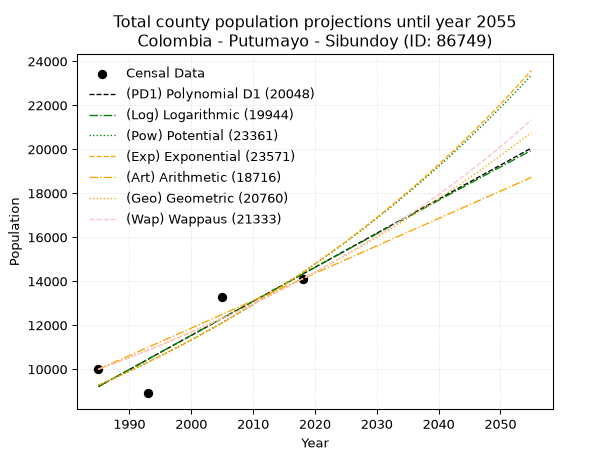
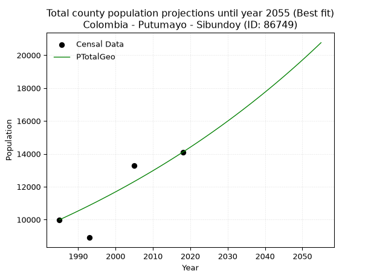
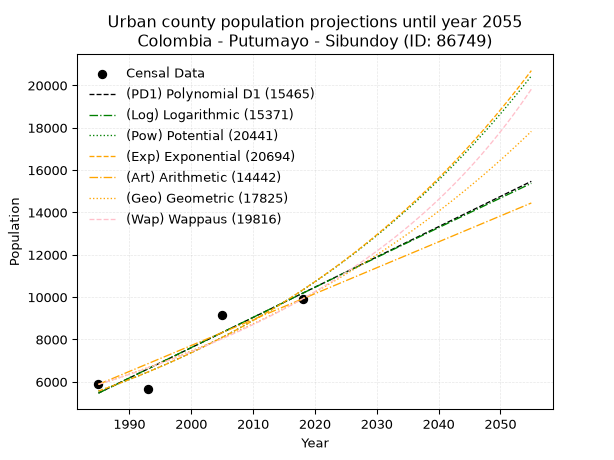
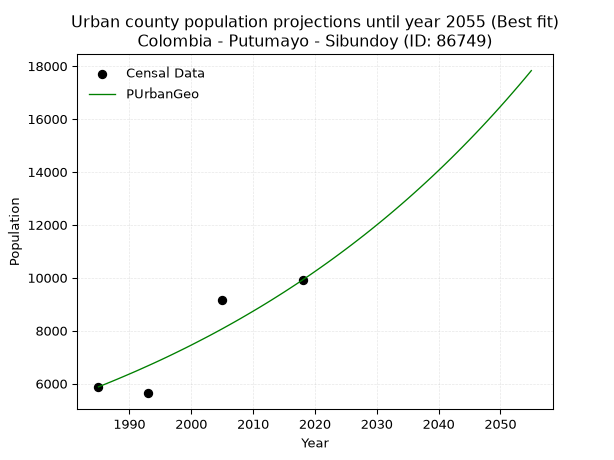
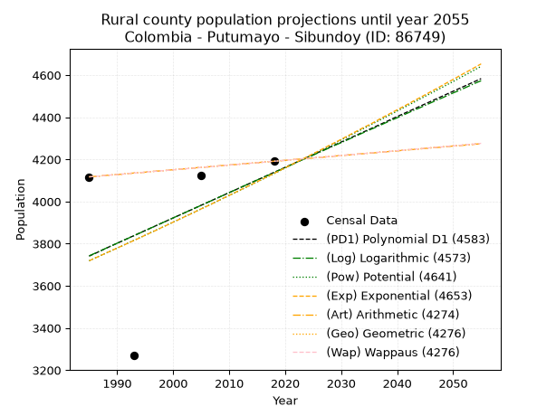
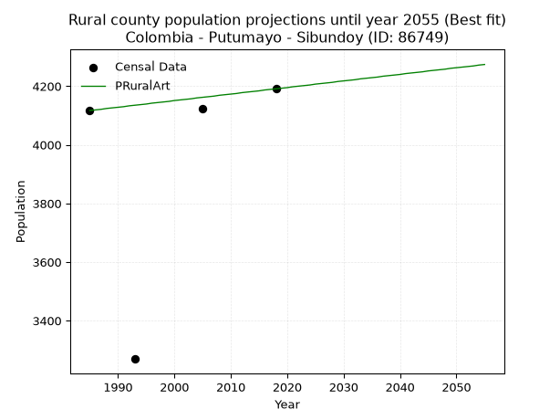

<div align="center">


</div>

# 📜 _“Population and Public Services Demand Projections (PPSD) until Year 2050 for Colombia - Putumayo - Sibundoy (ID: 86749)”_
Keywords: `population` `public-service` `projection` `lineal` `polynomial` `logarithmic` `potential` `exponential` `arithmetic` `geometric` `wappaus` `dane` `colombia` `south-america`

PPSD are analytical estimates used by governments and planners to anticipate future changes in population size, age distribution, and the resulting community needs for utilities, healthcare, education, and infrastructure as sizing future water treatment facilities, electrical grids, and road networks based on spatial growth.

<div align="center">

</img>

</div>


> **General running parameters**: • app_version: _v20260806_. • Python version: _3.14.7_. • Pandas version: _3.0.5_. • NumPy version: _2.5.1_. • Creates, save and include plots into reports (create_plot): _False_. • Projection until year: _2050_. • Process polynomial degree 2 and up: _False_. • Process Wappaus: _True_. • Process Wappaus: _True_. • Set negative values to zero: _True_. • Set infinite values to zero: _True_. • Drop dataset notes: _True_. 
<div align="center">

Dynamic map: [:earth_americas:Google](http://maps.google.com/maps?q=1.200259934,-76.9178144) [:earth_americas:OSM](https://www.openstreetmap.org/#map=18/1.200259934/-76.9178144&layers=P) [:earth_americas:Bing](https://www.bing.com/maps?cp=1.200259934~-76.9178144&lvl=18) [:earth_americas:Apple](https://maps.apple.com/frame?center=1.200259934%2C-76.9178144&span=0.003%2C0.006)

</div>


<div align="center">

```geojson
{
  "type": "Feature",
  "geometry": {
    "type": "Point", 
    "coordinates": [-76.9178144, 1.200259934]
  }, 
  "properties": {
    "Name": "Colombia - Putumayo - Sibundoy (ID: 86749)"
  }
}
```

</div>


## 0. Census Data (4 records)

Census data are official statistics collected by a government about the people and housing in a country. They usually include counts of total population, age, sex, race, income, education, and jobs.

📅Global census file: [Population.xlsx](../data/Population.xlsx)

| Source   |   Year |   CountryID | CountryName   |   StateID | StateName   |   CountyID | CountyName   |   PTotal |   PUrban |   PRural |
|:---------|-------:|------------:|:--------------|----------:|:------------|-----------:|:-------------|---------:|---------:|---------:|
| DANE     |   1985 |          57 | Colombia      |        86 | Putumayo    |      86749 | Sibundoy     |     9991 |     5874 |     4117 |
| DANE     |   1993 |          57 | Colombia      |        86 | Putumayo    |      86749 | Sibundoy     |     8904 |     5635 |     3269 |
| DANE     |   2005 |          57 | Colombia      |        86 | Putumayo    |      86749 | Sibundoy     |    13270 |     9148 |     4122 |
| DANE     |   2018 |          57 | Colombia      |        86 | Putumayo    |      86749 | Sibundoy     |    14104 |     9913 |     4191 |

> 🔥Some records could had specific notes about the registered values or the corresponding urban or rural distribution.

📅[SUI-RUPS](https://www.datos.gov.co/Hacienda-y-Cr-dito-P-blico/Registro-nico-de-Prestadores-de-Servicios-P-blicos/4qkq-csdn/about_data) - Local public utility companies: [RUPS.csv](../data/RUPS.csv)

 | SERVICIO       | ESTADO    | NOMBRE                                                                    | NIT         | DEPARTAMENTO_DOMICILIO   | MUNICIPIO_DOMICILIO   | DIRECCION           |   TELEFONO | EMAIL                         | TIPO_PRESTADOR                             | CLASIFICACION                  |
|:---------------|:----------|:--------------------------------------------------------------------------|:------------|:-------------------------|:----------------------|:--------------------|-----------:|:------------------------------|:-------------------------------------------|:-------------------------------|
| ACUEDUCTO      | OPERATIVA | JUNTA ADMINISTRADORA DE ACUEDUCTO Y ALCANTARILLADO DE SIBUNDOY            | 891201645-6 | PUTUMAYO                 | SIBUNDOY              | Calle 18 N. 15 - 41 |    4260251 | jaaasibundoy@hotmail.com      | MUNICIPIO (PRESTACIÓN DIRECTA)             | HASTA 2500 SUSCRIPTORES        |
| ALCANTARILLADO | OPERATIVA | JUNTA ADMINISTRADORA DE ACUEDUCTO Y ALCANTARILLADO DE SIBUNDOY            | 891201645-6 | PUTUMAYO                 | SIBUNDOY              | Calle 18 N. 15 - 41 |    4260251 | jaaasibundoy@hotmail.com      | MUNICIPIO (PRESTACIÓN DIRECTA)             | HASTA 2500 SUSCRIPTORES        |
| ACUEDUCTO      | OPERATIVA | ASOCIACION JUNTA ADMINISTRADORA DE ACUEDUCTO Y ALCANTARILLADO DE SIBUNDOY | 900577107-0 | PUTUMAYO                 | SIBUNDOY              | cll 18 N° 15- 41    |    4260575 | asjaaas@gmail.com             | SOCIEDADES (EMPRESA DE SERVICIOS PUBLICOS) | HASTA 2500 SUSCRIPTORES        |
| ALCANTARILLADO | OPERATIVA | ASOCIACION JUNTA ADMINISTRADORA DE ACUEDUCTO Y ALCANTARILLADO DE SIBUNDOY | 900577107-0 | PUTUMAYO                 | SIBUNDOY              | cll 18 N° 15- 41    |    4260575 | asjaaas@gmail.com             | SOCIEDADES (EMPRESA DE SERVICIOS PUBLICOS) | HASTA 2500 SUSCRIPTORES        |
| ACUEDUCTO      | OPERATIVA | AQUASIBUNDOY SA ESP                                                       | 901001680-1 | PUTUMAYO                 | SIBUNDOY              | CRA 12 No 15-16     |    3166901 | aquasibundoysaesp@hotmail.com | SOCIEDADES (EMPRESA DE SERVICIOS PUBLICOS) | DESDE 2501 HASTA 5000 USUARIOS |
| ALCANTARILLADO | OPERATIVA | AQUASIBUNDOY SA ESP                                                       | 901001680-1 | PUTUMAYO                 | SIBUNDOY              | CRA 12 No 15-16     |    3166901 | aquasibundoysaesp@hotmail.com | SOCIEDADES (EMPRESA DE SERVICIOS PUBLICOS) | MENOR O IGUAL A 2500 USUARIOS  |

## 1. Total

### 1.1. Coefficients and Parameters

* (PD1) Polynomial Deg 1: 154.8964271376948, -298264.328382174 (lineal)
* (Log) Logarithmic: 309997.49503594596, -2344726.193932246
* (Pow) Potential: 26.68266602945132, -84.02615226782977
* (Exp) Exponential: 0.013332748680166824, 2.973212072265345e-08
* (Art) Arithmetic: Year diff. 2018 - 1985 = 33, Population diff. 14104 - 9991 = 4113, Annual growth = 124.63636363636364
* (Geo) Geometric: Year diff. 2018 - 1985 = 33, Population diff. 14104 - 9991 = 4113, Annual growth % = 0.010502457291381884
* (Wap) Wappaus: i = 1.034541304306816, Condition values only valid for < 200)

<sub>
Wappaus condition values: ['0.00', '1.03', '2.07', '3.10', '4.14', '5.17', '6.21', '7.24', '8.28', '9.31', '10.35', '11.38', '12.41', '13.45', '14.48', '15.52', '16.55', '17.59', '18.62', '19.66', '20.69', '21.73', '22.76', '23.79', '24.83', '25.86', '26.90', '27.93', '28.97', '30.00', '31.04', '32.07', '33.11', '34.14', '35.17', '36.21', '37.24', '38.28', '39.31', '40.35', '41.38', '42.42', '43.45', '44.49', '45.52', '46.55', '47.59', '48.62', '49.66', '50.69', '51.73', '52.76', '53.80', '54.83', '55.87', '56.90', '57.93', '58.97', '60.00', '61.04', '62.07', '63.11', '64.14', '65.18', '66.21', '67.25']
</sub>


### 1.2. Projected Dataset

|   Year |   CountyID |   PTotalPD1 |   PTotalLog |   PTotalPow |   PTotalExp |   PTotalArt |   PTotalGeo |   PTotalWap |
|-------:|-----------:|------------:|------------:|------------:|------------:|------------:|------------:|------------:|
|   1985 |      86749 |        9205 |        9201 |        9266 |        9269 |        9991 |        9991 |        9991 |
|   1986 |      86749 |        9360 |        9357 |        9391 |        9394 |       10116 |       10096 |       10095 |
|   1987 |      86749 |        9515 |        9513 |        9518 |        9520 |       10240 |       10202 |       10200 |
|   1988 |      86749 |        9670 |        9669 |        9647 |        9648 |       10365 |       10309 |       10306 |
|   1989 |      86749 |        9825 |        9825 |        9777 |        9777 |       10490 |       10417 |       10413 |
|   1990 |      86749 |        9980 |        9981 |        9909 |        9908 |       10614 |       10527 |       10522 |
|   1991 |      86749 |       10134 |       10136 |       10043 |       10041 |       10739 |       10637 |       10631 |
|   1992 |      86749 |       10289 |       10292 |       10178 |       10176 |       10863 |       10749 |       10742 |
|   1993 |      86749 |       10444 |       10448 |       10316 |       10313 |       10988 |       10862 |       10854 |
|   1994 |      86749 |       10599 |       10603 |       10455 |       10451 |       11113 |       10976 |       10967 |
|   1995 |      86749 |       10754 |       10759 |       10596 |       10591 |       11237 |       11091 |       11081 |
|   1996 |      86749 |       10909 |       10914 |       10738 |       10734 |       11362 |       11208 |       11197 |
|   1997 |      86749 |       11064 |       11069 |       10883 |       10878 |       11487 |       11326 |       11313 |
|   1998 |      86749 |       11219 |       11224 |       11029 |       11024 |       11611 |       11444 |       11432 |
|   1999 |      86749 |       11374 |       11379 |       11177 |       11172 |       11736 |       11565 |       11551 |
|   2000 |      86749 |       11529 |       11535 |       11327 |       11322 |       11861 |       11686 |       11672 |
|   2001 |      86749 |       11683 |       11689 |       11479 |       11473 |       11985 |       11809 |       11794 |
|   2002 |      86749 |       11838 |       11844 |       11634 |       11627 |       12110 |       11933 |       11918 |
|   2003 |      86749 |       11993 |       11999 |       11790 |       11784 |       12234 |       12058 |       12043 |
|   2004 |      86749 |       12148 |       12154 |       11948 |       11942 |       12359 |       12185 |       12169 |
|   2005 |      86749 |       12303 |       12309 |       12108 |       12102 |       12484 |       12313 |       12297 |
|   2006 |      86749 |       12458 |       12463 |       12270 |       12264 |       12608 |       12442 |       12426 |
|   2007 |      86749 |       12613 |       12618 |       12434 |       12429 |       12733 |       12573 |       12557 |
|   2008 |      86749 |       12768 |       12772 |       12601 |       12596 |       12858 |       12705 |       12689 |
|   2009 |      86749 |       12923 |       12926 |       12769 |       12765 |       12982 |       12838 |       12823 |
|   2010 |      86749 |       13077 |       13081 |       12940 |       12936 |       13107 |       12973 |       12959 |
|   2011 |      86749 |       13232 |       13235 |       13113 |       13110 |       13232 |       13109 |       13096 |
|   2012 |      86749 |       13387 |       13389 |       13288 |       13286 |       13356 |       13247 |       13235 |
|   2013 |      86749 |       13542 |       13543 |       13465 |       13464 |       13481 |       13386 |       13375 |
|   2014 |      86749 |       13697 |       13697 |       13645 |       13645 |       13605 |       13527 |       13517 |
|   2015 |      86749 |       13852 |       13851 |       13827 |       13828 |       13730 |       13669 |       13661 |
|   2016 |      86749 |       14007 |       14005 |       14011 |       14014 |       13855 |       13812 |       13807 |
|   2017 |      86749 |       14162 |       14158 |       14197 |       14202 |       13979 |       13957 |       13955 |
|   2018 |      86749 |       14317 |       14312 |       14387 |       14392 |       14104 |       14104 |       14104 |
|   2019 |      86749 |       14472 |       14466 |       14578 |       14585 |       14229 |       14252 |       14255 |
|   2020 |      86749 |       14626 |       14619 |       14772 |       14781 |       14353 |       14402 |       14408 |
|   2021 |      86749 |       14781 |       14773 |       14968 |       14980 |       14478 |       14553 |       14563 |
|   2022 |      86749 |       14936 |       14926 |       15167 |       15181 |       14603 |       14706 |       14721 |
|   2023 |      86749 |       15091 |       15079 |       15369 |       15384 |       14727 |       14860 |       14880 |
|   2024 |      86749 |       15246 |       15232 |       15573 |       15591 |       14852 |       15016 |       15041 |
|   2025 |      86749 |       15401 |       15385 |       15779 |       15800 |       14976 |       15174 |       15204 |
|   2026 |      86749 |       15556 |       15539 |       15988 |       16012 |       15101 |       15333 |       15369 |
|   2027 |      86749 |       15711 |       15691 |       16200 |       16227 |       15226 |       15495 |       15537 |
|   2028 |      86749 |       15866 |       15844 |       16415 |       16445 |       15350 |       15657 |       15707 |
|   2029 |      86749 |       16021 |       15997 |       16632 |       16666 |       15475 |       15822 |       15879 |
|   2030 |      86749 |       16175 |       16150 |       16852 |       16889 |       15600 |       15988 |       16053 |
|   2031 |      86749 |       16330 |       16303 |       17075 |       17116 |       15724 |       16156 |       16230 |
|   2032 |      86749 |       16485 |       16455 |       17301 |       17346 |       15849 |       16325 |       16409 |
|   2033 |      86749 |       16640 |       16608 |       17530 |       17579 |       15974 |       16497 |       16591 |
|   2034 |      86749 |       16795 |       16760 |       17761 |       17815 |       16098 |       16670 |       16775 |
|   2035 |      86749 |       16950 |       16913 |       17996 |       18054 |       16223 |       16845 |       16962 |
|   2036 |      86749 |       17105 |       17065 |       18233 |       18296 |       16347 |       17022 |       17151 |
|   2037 |      86749 |       17260 |       17217 |       18474 |       18542 |       16472 |       17201 |       17343 |
|   2038 |      86749 |       17415 |       17369 |       18717 |       18790 |       16597 |       17382 |       17538 |
|   2039 |      86749 |       17569 |       17521 |       18964 |       19043 |       16721 |       17564 |       17736 |
|   2040 |      86749 |       17724 |       17673 |       19213 |       19298 |       16846 |       17749 |       17936 |
|   2041 |      86749 |       17879 |       17825 |       19466 |       19557 |       16971 |       17935 |       18140 |
|   2042 |      86749 |       18034 |       17977 |       19722 |       19820 |       17095 |       18123 |       18346 |
|   2043 |      86749 |       18189 |       18129 |       19982 |       20086 |       17220 |       18314 |       18555 |
|   2044 |      86749 |       18344 |       18281 |       20244 |       20355 |       17345 |       18506 |       18768 |
|   2045 |      86749 |       18499 |       18432 |       20510 |       20629 |       17469 |       18700 |       18984 |
|   2046 |      86749 |       18654 |       18584 |       20780 |       20905 |       17594 |       18897 |       19203 |
|   2047 |      86749 |       18809 |       18735 |       21052 |       21186 |       17718 |       19095 |       19425 |
|   2048 |      86749 |       18964 |       18887 |       21328 |       21470 |       17843 |       19296 |       19651 |
|   2049 |      86749 |       19118 |       19038 |       21608 |       21759 |       17968 |       19498 |       19880 |
|   2050 |      86749 |       19273 |       19189 |       21891 |       22051 |       18092 |       19703 |       20113 |
<div align="center">

</img>

</div>


### 1.3. Best fit with absolute and relative error (%)

Relative error puts that difference into context by dividing the absolute error by the true value, creating a unitless ratio or percentage that shows the scale of the mistake.

Absolute and relative error

|   Year | Source   |   CountryID | CountryName   |   StateID | StateName   |   CountyID_x | CountyName   |   PTotal |   PUrban |   PRural |   CountyID_y |   PTotalPD1 |   PTotalLog |   PTotalPow |   PTotalExp |   PTotalArt |   PTotalGeo |   PTotalWap |   PTotalPD1AbsError |   PTotalLogAbsError |   PTotalPowAbsError |   PTotalExpAbsError |   PTotalArtAbsError |   PTotalGeoAbsError |   PTotalWapAbsError |   PTotalPD1RelError |   PTotalLogRelError |   PTotalPowRelError |   PTotalExpRelError |   PTotalArtRelError |   PTotalGeoRelError |   PTotalWapRelError |
|-------:|:---------|------------:|:--------------|----------:|:------------|-------------:|:-------------|---------:|---------:|---------:|-------------:|------------:|------------:|------------:|------------:|------------:|------------:|------------:|--------------------:|--------------------:|--------------------:|--------------------:|--------------------:|--------------------:|--------------------:|--------------------:|--------------------:|--------------------:|--------------------:|--------------------:|--------------------:|--------------------:|
|   1985 | DANE     |          57 | Colombia      |        86 | Putumayo    |        86749 | Sibundoy     |     9991 |     5874 |     4117 |        86749 |        9205 |        9201 |        9266 |        9269 |        9991 |        9991 |        9991 |                 786 |                 790 |                 725 |                 722 |                   0 |                   0 |                   0 |             7.86708 |             7.90712 |             7.25653 |             7.2265  |             0       |             0       |             0       |
|   1993 | DANE     |          57 | Colombia      |        86 | Putumayo    |        86749 | Sibundoy     |     8904 |     5635 |     3269 |        86749 |       10444 |       10448 |       10316 |       10313 |       10988 |       10862 |       10854 |                1540 |                1544 |                1412 |                1409 |                2084 |                1958 |                1950 |            17.2956  |            17.3405  |            15.858   |            15.8243  |            23.4052  |            21.9901  |            21.9003  |
|   2005 | DANE     |          57 | Colombia      |        86 | Putumayo    |        86749 | Sibundoy     |    13270 |     9148 |     4122 |        86749 |       12303 |       12309 |       12108 |       12102 |       12484 |       12313 |       12297 |                 967 |                 961 |                1162 |                1168 |                 786 |                 957 |                 973 |             7.28711 |             7.2419  |             8.75659 |             8.80181 |             5.92313 |             7.21176 |             7.33233 |
|   2018 | DANE     |          57 | Colombia      |        86 | Putumayo    |        86749 | Sibundoy     |    14104 |     9913 |     4191 |        86749 |       14317 |       14312 |       14387 |       14392 |       14104 |       14104 |       14104 |                 213 |                 208 |                 283 |                 288 |                   0 |                   0 |                   0 |             1.51021 |             1.47476 |             2.00652 |             2.04197 |             0       |             0       |             0       |

Relative error mean

| Method    |   RelError | Best   |
|:----------|-----------:|:-------|
| PTotalPD1 |    8.49    |        |
| PTotalLog |    8.49107 |        |
| PTotalPow |    8.46942 |        |
| PTotalExp |    8.47366 |        |
| PTotalArt |    7.33209 |        |
| PTotalGeo |    7.30047 | True   |
| PTotalWap |    7.30815 |        |

💙Best method: _**PTotalGeo**_
<div align="center">

</img>

</div>


### 1.4. Fresh water supply demand in liters per capita per day (lpcd)

The fresh water supply demand typically ranges from 100 to 300 liters per capita per day (lpcd) for standard domestic and municipal planning, though absolute survival minimums set by the World Health Organization are as low as 7.5 to 20 liters per day, and total consumption in high-income nations can exceed 400 liters.

> `CZ`: Level in meters above the sea level (masl)<br> `WS`: Fresh water supply demand in liters per capita per day (lpcd or l/h/d)<br> `WSAll`: Zonal fresh water supply demand in liters per second (l/s)<br> `A`: Zonal area in square meters<br> `DP`: Population density (people/hectare or p/ha)

Reference values (RAS Colombia)

|    CZ |   WS |
|------:|-----:|
|  1000 |  120 |
|  2000 |  130 |
| 99999 |  140 |

County shapefile geometry properties and water supply values

|   CountyID |      ATotal |   CZTotal |   WSTotal |
|-----------:|------------:|----------:|----------:|
|      86749 | 9.77909e+07 |   2587.84 |       140 |

Projected values for best method: PTotalGeo

|   CountyID |   Year |   PTotalGeo |   DPTotal |   WSTotal |   WSTotalAll |
|-----------:|-------:|------------:|----------:|----------:|-------------:|
|      86749 |   1985 |        9991 |      1.02 |       140 |      16.1891 |
|      86749 |   1986 |       10096 |      1.03 |       140 |      16.3593 |
|      86749 |   1987 |       10202 |      1.04 |       140 |      16.531  |
|      86749 |   1988 |       10309 |      1.05 |       140 |      16.7044 |
|      86749 |   1989 |       10417 |      1.07 |       140 |      16.8794 |
|      86749 |   1990 |       10527 |      1.08 |       140 |      17.0576 |
|      86749 |   1991 |       10637 |      1.09 |       140 |      17.2359 |
|      86749 |   1992 |       10749 |      1.1  |       140 |      17.4174 |
|      86749 |   1993 |       10862 |      1.11 |       140 |      17.6005 |
|      86749 |   1994 |       10976 |      1.12 |       140 |      17.7852 |
|      86749 |   1995 |       11091 |      1.13 |       140 |      17.9715 |
|      86749 |   1996 |       11208 |      1.15 |       140 |      18.1611 |
|      86749 |   1997 |       11326 |      1.16 |       140 |      18.3523 |
|      86749 |   1998 |       11444 |      1.17 |       140 |      18.5435 |
|      86749 |   1999 |       11565 |      1.18 |       140 |      18.7396 |
|      86749 |   2000 |       11686 |      1.19 |       140 |      18.9356 |
|      86749 |   2001 |       11809 |      1.21 |       140 |      19.135  |
|      86749 |   2002 |       11933 |      1.22 |       140 |      19.3359 |
|      86749 |   2003 |       12058 |      1.23 |       140 |      19.5384 |
|      86749 |   2004 |       12185 |      1.25 |       140 |      19.7442 |
|      86749 |   2005 |       12313 |      1.26 |       140 |      19.9516 |
|      86749 |   2006 |       12442 |      1.27 |       140 |      20.1606 |
|      86749 |   2007 |       12573 |      1.29 |       140 |      20.3729 |
|      86749 |   2008 |       12705 |      1.3  |       140 |      20.5868 |
|      86749 |   2009 |       12838 |      1.31 |       140 |      20.8023 |
|      86749 |   2010 |       12973 |      1.33 |       140 |      21.0211 |
|      86749 |   2011 |       13109 |      1.34 |       140 |      21.2414 |
|      86749 |   2012 |       13247 |      1.35 |       140 |      21.465  |
|      86749 |   2013 |       13386 |      1.37 |       140 |      21.6903 |
|      86749 |   2014 |       13527 |      1.38 |       140 |      21.9187 |
|      86749 |   2015 |       13669 |      1.4  |       140 |      22.1488 |
|      86749 |   2016 |       13812 |      1.41 |       140 |      22.3806 |
|      86749 |   2017 |       13957 |      1.43 |       140 |      22.6155 |
|      86749 |   2018 |       14104 |      1.44 |       140 |      22.8537 |
|      86749 |   2019 |       14252 |      1.46 |       140 |      23.0935 |
|      86749 |   2020 |       14402 |      1.47 |       140 |      23.3366 |
|      86749 |   2021 |       14553 |      1.49 |       140 |      23.5813 |
|      86749 |   2022 |       14706 |      1.5  |       140 |      23.8292 |
|      86749 |   2023 |       14860 |      1.52 |       140 |      24.0787 |
|      86749 |   2024 |       15016 |      1.54 |       140 |      24.3315 |
|      86749 |   2025 |       15174 |      1.55 |       140 |      24.5875 |
|      86749 |   2026 |       15333 |      1.57 |       140 |      24.8451 |
|      86749 |   2027 |       15495 |      1.58 |       140 |      25.1076 |
|      86749 |   2028 |       15657 |      1.6  |       140 |      25.3701 |
|      86749 |   2029 |       15822 |      1.62 |       140 |      25.6375 |
|      86749 |   2030 |       15988 |      1.63 |       140 |      25.9065 |
|      86749 |   2031 |       16156 |      1.65 |       140 |      26.1787 |
|      86749 |   2032 |       16325 |      1.67 |       140 |      26.4525 |
|      86749 |   2033 |       16497 |      1.69 |       140 |      26.7312 |
|      86749 |   2034 |       16670 |      1.7  |       140 |      27.0116 |
|      86749 |   2035 |       16845 |      1.72 |       140 |      27.2951 |
|      86749 |   2036 |       17022 |      1.74 |       140 |      27.5819 |
|      86749 |   2037 |       17201 |      1.76 |       140 |      27.872  |
|      86749 |   2038 |       17382 |      1.78 |       140 |      28.1653 |
|      86749 |   2039 |       17564 |      1.8  |       140 |      28.4602 |
|      86749 |   2040 |       17749 |      1.81 |       140 |      28.76   |
|      86749 |   2041 |       17935 |      1.83 |       140 |      29.0613 |
|      86749 |   2042 |       18123 |      1.85 |       140 |      29.366  |
|      86749 |   2043 |       18314 |      1.87 |       140 |      29.6755 |
|      86749 |   2044 |       18506 |      1.89 |       140 |      29.9866 |
|      86749 |   2045 |       18700 |      1.91 |       140 |      30.3009 |
|      86749 |   2046 |       18897 |      1.93 |       140 |      30.6201 |
|      86749 |   2047 |       19095 |      1.95 |       140 |      30.941  |
|      86749 |   2048 |       19296 |      1.97 |       140 |      31.2667 |
|      86749 |   2049 |       19498 |      1.99 |       140 |      31.594  |
|      86749 |   2050 |       19703 |      2.01 |       140 |      31.9262 |

## 2. Urban

### 2.1. Coefficients and Parameters

* (PD1) Polynomial Deg 1: 142.87675632276125, -278146.7318346032 (lineal)
* (Log) Logarithmic: 286001.0233679937, -2166253.570488486
* (Pow) Potential: 37.59057444871095, -120.21999723659042
* (Exp) Exponential: 0.018778284259747605, 3.603217578943263e-13
* (Art) Arithmetic: Year diff. 2018 - 1985 = 33, Population diff. 9913 - 5874 = 4039, Annual growth = 122.39393939393939
* (Geo) Geometric: Year diff. 2018 - 1985 = 33, Population diff. 9913 - 5874 = 4039, Annual growth % = 0.015984318995879487
* (Wap) Wappaus: i = 1.5505661543540812, Condition values only valid for < 200)

<sub>
Wappaus condition values: ['0.00', '1.55', '3.10', '4.65', '6.20', '7.75', '9.30', '10.85', '12.40', '13.96', '15.51', '17.06', '18.61', '20.16', '21.71', '23.26', '24.81', '26.36', '27.91', '29.46', '31.01', '32.56', '34.11', '35.66', '37.21', '38.76', '40.31', '41.87', '43.42', '44.97', '46.52', '48.07', '49.62', '51.17', '52.72', '54.27', '55.82', '57.37', '58.92', '60.47', '62.02', '63.57', '65.12', '66.67', '68.22', '69.78', '71.33', '72.88', '74.43', '75.98', '77.53', '79.08', '80.63', '82.18', '83.73', '85.28', '86.83', '88.38', '89.93', '91.48', '93.03', '94.58', '96.14', '97.69', '99.24', '100.79']
</sub>


### 2.2. Projected Dataset

|   Year |   CountyID |   PUrbanPD1 |   PUrbanLog |   PUrbanPow |   PUrbanExp |   PUrbanArt |   PUrbanGeo |   PUrbanWap |
|-------:|-----------:|------------:|------------:|------------:|------------:|------------:|------------:|------------:|
|   1985 |      86749 |        5464 |        5459 |        5555 |        5559 |        5874 |        5874 |        5874 |
|   1986 |      86749 |        5607 |        5603 |        5662 |        5664 |        5996 |        5968 |        5966 |
|   1987 |      86749 |        5749 |        5747 |        5770 |        5771 |        6119 |        6063 |        6059 |
|   1988 |      86749 |        5892 |        5891 |        5880 |        5881 |        6241 |        6160 |        6154 |
|   1989 |      86749 |        6035 |        6035 |        5992 |        5992 |        6364 |        6259 |        6250 |
|   1990 |      86749 |        6178 |        6179 |        6106 |        6106 |        6486 |        6359 |        6348 |
|   1991 |      86749 |        6321 |        6322 |        6223 |        6222 |        6608 |        6460 |        6447 |
|   1992 |      86749 |        6464 |        6466 |        6341 |        6340 |        6731 |        6564 |        6548 |
|   1993 |      86749 |        6607 |        6610 |        6462 |        6460 |        6853 |        6669 |        6651 |
|   1994 |      86749 |        6750 |        6753 |        6585 |        6582 |        6976 |        6775 |        6755 |
|   1995 |      86749 |        6892 |        6896 |        6710 |        6707 |        7098 |        6883 |        6861 |
|   1996 |      86749 |        7035 |        7040 |        6838 |        6834 |        7220 |        6993 |        6969 |
|   1997 |      86749 |        7178 |        7183 |        6968 |        6964 |        7343 |        7105 |        7079 |
|   1998 |      86749 |        7321 |        7326 |        7100 |        7096 |        7465 |        7219 |        7191 |
|   1999 |      86749 |        7464 |        7469 |        7235 |        7230 |        7588 |        7334 |        7304 |
|   2000 |      86749 |        7607 |        7612 |        7373 |        7367 |        7710 |        7451 |        7420 |
|   2001 |      86749 |        7750 |        7755 |        7512 |        7507 |        7832 |        7571 |        7538 |
|   2002 |      86749 |        7893 |        7898 |        7655 |        7649 |        7955 |        7692 |        7657 |
|   2003 |      86749 |        8035 |        8041 |        7800 |        7794 |        8077 |        7814 |        7779 |
|   2004 |      86749 |        8178 |        8184 |        7948 |        7942 |        8199 |        7939 |        7903 |
|   2005 |      86749 |        8321 |        8326 |        8098 |        8092 |        8322 |        8066 |        8030 |
|   2006 |      86749 |        8464 |        8469 |        8251 |        8246 |        8444 |        8195 |        8159 |
|   2007 |      86749 |        8607 |        8612 |        8407 |        8402 |        8567 |        8326 |        8290 |
|   2008 |      86749 |        8750 |        8754 |        8566 |        8561 |        8689 |        8459 |        8423 |
|   2009 |      86749 |        8893 |        8896 |        8728 |        8724 |        8811 |        8595 |        8560 |
|   2010 |      86749 |        9036 |        9039 |        8893 |        8889 |        8934 |        8732 |        8698 |
|   2011 |      86749 |        9178 |        9181 |        9061 |        9058 |        9056 |        8871 |        8840 |
|   2012 |      86749 |        9321 |        9323 |        9232 |        9229 |        9179 |        9013 |        8984 |
|   2013 |      86749 |        9464 |        9465 |        9406 |        9404 |        9301 |        9157 |        9131 |
|   2014 |      86749 |        9607 |        9607 |        9583 |        9582 |        9423 |        9304 |        9281 |
|   2015 |      86749 |        9750 |        9749 |        9763 |        9764 |        9546 |        9452 |        9435 |
|   2016 |      86749 |        9893 |        9891 |        9947 |        9949 |        9668 |        9604 |        9591 |
|   2017 |      86749 |       10036 |       10033 |       10134 |       10138 |        9791 |        9757 |        9750 |
|   2018 |      86749 |       10179 |       10175 |       10325 |       10330 |        9913 |        9913 |        9913 |
|   2019 |      86749 |       10321 |       10316 |       10519 |       10526 |       10035 |       10071 |       10079 |
|   2020 |      86749 |       10464 |       10458 |       10717 |       10725 |       10158 |       10232 |       10249 |
|   2021 |      86749 |       10607 |       10600 |       10918 |       10929 |       10280 |       10396 |       10422 |
|   2022 |      86749 |       10750 |       10741 |       11123 |       11136 |       10403 |       10562 |       10600 |
|   2023 |      86749 |       10893 |       10883 |       11331 |       11347 |       10525 |       10731 |       10781 |
|   2024 |      86749 |       11036 |       11024 |       11544 |       11562 |       10647 |       10903 |       10966 |
|   2025 |      86749 |       11179 |       11165 |       11760 |       11781 |       10770 |       11077 |       11155 |
|   2026 |      86749 |       11322 |       11306 |       11981 |       12004 |       10892 |       11254 |       11348 |
|   2027 |      86749 |       11464 |       11447 |       12205 |       12232 |       11015 |       11434 |       11546 |
|   2028 |      86749 |       11607 |       11589 |       12433 |       12464 |       11137 |       11616 |       11749 |
|   2029 |      86749 |       11750 |       11730 |       12666 |       12700 |       11259 |       11802 |       11956 |
|   2030 |      86749 |       11893 |       11870 |       12903 |       12941 |       11382 |       11991 |       12169 |
|   2031 |      86749 |       12036 |       12011 |       13144 |       13186 |       11504 |       12182 |       12386 |
|   2032 |      86749 |       12179 |       12152 |       13389 |       13436 |       11627 |       12377 |       12609 |
|   2033 |      86749 |       12322 |       12293 |       13639 |       13691 |       11749 |       12575 |       12837 |
|   2034 |      86749 |       12465 |       12433 |       13894 |       13950 |       11871 |       12776 |       13071 |
|   2035 |      86749 |       12607 |       12574 |       14153 |       14215 |       11994 |       12980 |       13311 |
|   2036 |      86749 |       12750 |       12715 |       14417 |       14484 |       12116 |       13188 |       13557 |
|   2037 |      86749 |       12893 |       12855 |       14685 |       14759 |       12238 |       13399 |       13809 |
|   2038 |      86749 |       13036 |       12995 |       14959 |       15038 |       12361 |       13613 |       14068 |
|   2039 |      86749 |       13179 |       13136 |       15237 |       15323 |       12483 |       13830 |       14334 |
|   2040 |      86749 |       13322 |       13276 |       15520 |       15614 |       12606 |       14051 |       14607 |
|   2041 |      86749 |       13465 |       13416 |       15809 |       15910 |       12728 |       14276 |       14888 |
|   2042 |      86749 |       13608 |       13556 |       16103 |       16212 |       12850 |       14504 |       15176 |
|   2043 |      86749 |       13750 |       13696 |       16402 |       16519 |       12973 |       14736 |       15473 |
|   2044 |      86749 |       13893 |       13836 |       16706 |       16832 |       13095 |       14972 |       15778 |
|   2045 |      86749 |       14036 |       13976 |       17016 |       17151 |       13218 |       15211 |       16092 |
|   2046 |      86749 |       14179 |       14116 |       17332 |       17476 |       13340 |       15454 |       16415 |
|   2047 |      86749 |       14322 |       14256 |       17653 |       17807 |       13462 |       15701 |       16748 |
|   2048 |      86749 |       14465 |       14395 |       17980 |       18145 |       13585 |       15952 |       17091 |
|   2049 |      86749 |       14608 |       14535 |       18313 |       18489 |       13707 |       16207 |       17444 |
|   2050 |      86749 |       14751 |       14674 |       18652 |       18839 |       13830 |       16466 |       17808 |
<div align="center">

</img>

</div>


### 2.3. Best fit with absolute and relative error (%)

Relative error puts that difference into context by dividing the absolute error by the true value, creating a unitless ratio or percentage that shows the scale of the mistake.

Absolute and relative error

|   Year | Source   |   CountryID | CountryName   |   StateID | StateName   |   CountyID_x | CountyName   |   PTotal |   PUrban |   PRural |   CountyID_y |   PUrbanPD1 |   PUrbanLog |   PUrbanPow |   PUrbanExp |   PUrbanArt |   PUrbanGeo |   PUrbanWap |   PUrbanPD1AbsError |   PUrbanLogAbsError |   PUrbanPowAbsError |   PUrbanExpAbsError |   PUrbanArtAbsError |   PUrbanGeoAbsError |   PUrbanWapAbsError |   PUrbanPD1RelError |   PUrbanLogRelError |   PUrbanPowRelError |   PUrbanExpRelError |   PUrbanArtRelError |   PUrbanGeoRelError |   PUrbanWapRelError |
|-------:|:---------|------------:|:--------------|----------:|:------------|-------------:|:-------------|---------:|---------:|---------:|-------------:|------------:|------------:|------------:|------------:|------------:|------------:|------------:|--------------------:|--------------------:|--------------------:|--------------------:|--------------------:|--------------------:|--------------------:|--------------------:|--------------------:|--------------------:|--------------------:|--------------------:|--------------------:|--------------------:|
|   1985 | DANE     |          57 | Colombia      |        86 | Putumayo    |        86749 | Sibundoy     |     9991 |     5874 |     4117 |        86749 |        5464 |        5459 |        5555 |        5559 |        5874 |        5874 |        5874 |                 410 |                 415 |                 319 |                 315 |                   0 |                   0 |                   0 |             6.97991 |             7.06503 |             5.43071 |             5.36261 |              0      |              0      |              0      |
|   1993 | DANE     |          57 | Colombia      |        86 | Putumayo    |        86749 | Sibundoy     |     8904 |     5635 |     3269 |        86749 |        6607 |        6610 |        6462 |        6460 |        6853 |        6669 |        6651 |                 972 |                 975 |                 827 |                 825 |                1218 |                1034 |                1016 |            17.2493  |            17.3026  |            14.6761  |            14.6406  |             21.6149 |             18.3496 |             18.0302 |
|   2005 | DANE     |          57 | Colombia      |        86 | Putumayo    |        86749 | Sibundoy     |    13270 |     9148 |     4122 |        86749 |        8321 |        8326 |        8098 |        8092 |        8322 |        8066 |        8030 |                 827 |                 822 |                1050 |                1056 |                 826 |                1082 |                1118 |             9.04023 |             8.98557 |            11.4779  |            11.5435  |              9.0293 |             11.8277 |             12.2213 |
|   2018 | DANE     |          57 | Colombia      |        86 | Putumayo    |        86749 | Sibundoy     |    14104 |     9913 |     4191 |        86749 |       10179 |       10175 |       10325 |       10330 |        9913 |        9913 |        9913 |                 266 |                 262 |                 412 |                 417 |                   0 |                   0 |                   0 |             2.68335 |             2.64299 |             4.15616 |             4.2066  |              0      |              0      |              0      |

Relative error mean

| Method    |   RelError | Best   |
|:----------|-----------:|:-------|
| PUrbanPD1 |    8.9882  |        |
| PUrbanLog |    8.99904 |        |
| PUrbanPow |    8.93523 |        |
| PUrbanExp |    8.93834 |        |
| PUrbanArt |    7.66105 |        |
| PUrbanGeo |    7.54433 | True   |
| PUrbanWap |    7.56285 |        |

💙Best method: _**PUrbanGeo**_
<div align="center">

</img>

</div>


### 2.4. Fresh water supply demand in liters per capita per day (lpcd)

The fresh water supply demand typically ranges from 100 to 300 liters per capita per day (lpcd) for standard domestic and municipal planning, though absolute survival minimums set by the World Health Organization are as low as 7.5 to 20 liters per day, and total consumption in high-income nations can exceed 400 liters.

> `CZ`: Level in meters above the sea level (masl)<br> `WS`: Fresh water supply demand in liters per capita per day (lpcd or l/h/d)<br> `WSAll`: Zonal fresh water supply demand in liters per second (l/s)<br> `A`: Zonal area in square meters<br> `DP`: Population density (people/hectare or p/ha)

Reference values (RAS Colombia)

|    CZ |   WS |
|------:|-----:|
|  1000 |  120 |
|  2000 |  130 |
| 99999 |  140 |

County shapefile geometry properties and water supply values

|   CountyID |      AUrban |   CZUrban |   WSUrban |
|-----------:|------------:|----------:|----------:|
|      86749 | 2.91613e+06 |   2108.57 |       140 |

Projected values for best method: PUrbanGeo

|   CountyID |   Year |   PUrbanGeo |   DPUrban |   WSUrban |   WSUrbanAll |
|-----------:|-------:|------------:|----------:|----------:|-------------:|
|      86749 |   1985 |        5874 |     20.14 |       140 |      9.51806 |
|      86749 |   1986 |        5968 |     20.47 |       140 |      9.67037 |
|      86749 |   1987 |        6063 |     20.79 |       140 |      9.82431 |
|      86749 |   1988 |        6160 |     21.12 |       140 |      9.98148 |
|      86749 |   1989 |        6259 |     21.46 |       140 |     10.1419  |
|      86749 |   1990 |        6359 |     21.81 |       140 |     10.3039  |
|      86749 |   1991 |        6460 |     22.15 |       140 |     10.4676  |
|      86749 |   1992 |        6564 |     22.51 |       140 |     10.6361  |
|      86749 |   1993 |        6669 |     22.87 |       140 |     10.8063  |
|      86749 |   1994 |        6775 |     23.23 |       140 |     10.978   |
|      86749 |   1995 |        6883 |     23.6  |       140 |     11.153   |
|      86749 |   1996 |        6993 |     23.98 |       140 |     11.3313  |
|      86749 |   1997 |        7105 |     24.36 |       140 |     11.5127  |
|      86749 |   1998 |        7219 |     24.76 |       140 |     11.6975  |
|      86749 |   1999 |        7334 |     25.15 |       140 |     11.8838  |
|      86749 |   2000 |        7451 |     25.55 |       140 |     12.0734  |
|      86749 |   2001 |        7571 |     25.96 |       140 |     12.2678  |
|      86749 |   2002 |        7692 |     26.38 |       140 |     12.4639  |
|      86749 |   2003 |        7814 |     26.8  |       140 |     12.6616  |
|      86749 |   2004 |        7939 |     27.22 |       140 |     12.8641  |
|      86749 |   2005 |        8066 |     27.66 |       140 |     13.0699  |
|      86749 |   2006 |        8195 |     28.1  |       140 |     13.2789  |
|      86749 |   2007 |        8326 |     28.55 |       140 |     13.4912  |
|      86749 |   2008 |        8459 |     29.01 |       140 |     13.7067  |
|      86749 |   2009 |        8595 |     29.47 |       140 |     13.9271  |
|      86749 |   2010 |        8732 |     29.94 |       140 |     14.1491  |
|      86749 |   2011 |        8871 |     30.42 |       140 |     14.3743  |
|      86749 |   2012 |        9013 |     30.91 |       140 |     14.6044  |
|      86749 |   2013 |        9157 |     31.4  |       140 |     14.8377  |
|      86749 |   2014 |        9304 |     31.91 |       140 |     15.0759  |
|      86749 |   2015 |        9452 |     32.41 |       140 |     15.3157  |
|      86749 |   2016 |        9604 |     32.93 |       140 |     15.562   |
|      86749 |   2017 |        9757 |     33.46 |       140 |     15.81    |
|      86749 |   2018 |        9913 |     33.99 |       140 |     16.0627  |
|      86749 |   2019 |       10071 |     34.54 |       140 |     16.3188  |
|      86749 |   2020 |       10232 |     35.09 |       140 |     16.5796  |
|      86749 |   2021 |       10396 |     35.65 |       140 |     16.8454  |
|      86749 |   2022 |       10562 |     36.22 |       140 |     17.1144  |
|      86749 |   2023 |       10731 |     36.8  |       140 |     17.3882  |
|      86749 |   2024 |       10903 |     37.39 |       140 |     17.6669  |
|      86749 |   2025 |       11077 |     37.99 |       140 |     17.9488  |
|      86749 |   2026 |       11254 |     38.59 |       140 |     18.2356  |
|      86749 |   2027 |       11434 |     39.21 |       140 |     18.5273  |
|      86749 |   2028 |       11616 |     39.83 |       140 |     18.8222  |
|      86749 |   2029 |       11802 |     40.47 |       140 |     19.1236  |
|      86749 |   2030 |       11991 |     41.12 |       140 |     19.4299  |
|      86749 |   2031 |       12182 |     41.77 |       140 |     19.7394  |
|      86749 |   2032 |       12377 |     42.44 |       140 |     20.0553  |
|      86749 |   2033 |       12575 |     43.12 |       140 |     20.3762  |
|      86749 |   2034 |       12776 |     43.81 |       140 |     20.7019  |
|      86749 |   2035 |       12980 |     44.51 |       140 |     21.0324  |
|      86749 |   2036 |       13188 |     45.22 |       140 |     21.3694  |
|      86749 |   2037 |       13399 |     45.95 |       140 |     21.7113  |
|      86749 |   2038 |       13613 |     46.68 |       140 |     22.0581  |
|      86749 |   2039 |       13830 |     47.43 |       140 |     22.4097  |
|      86749 |   2040 |       14051 |     48.18 |       140 |     22.7678  |
|      86749 |   2041 |       14276 |     48.96 |       140 |     23.1324  |
|      86749 |   2042 |       14504 |     49.74 |       140 |     23.5019  |
|      86749 |   2043 |       14736 |     50.53 |       140 |     23.8778  |
|      86749 |   2044 |       14972 |     51.34 |       140 |     24.2602  |
|      86749 |   2045 |       15211 |     52.16 |       140 |     24.6475  |
|      86749 |   2046 |       15454 |     52.99 |       140 |     25.0412  |
|      86749 |   2047 |       15701 |     53.84 |       140 |     25.4414  |
|      86749 |   2048 |       15952 |     54.7  |       140 |     25.8481  |
|      86749 |   2049 |       16207 |     55.58 |       140 |     26.2613  |
|      86749 |   2050 |       16466 |     56.47 |       140 |     26.681   |

## 3. Rural

### 3.1. Coefficients and Parameters

* (PD1) Polynomial Deg 1: 12.019670814933692, -20117.59654757112 (lineal)
* (Log) Logarithmic: 23996.471667952224, -178472.62344376053
* (Pow) Potential: 6.392653451530589, -17.511028485248094
* (Exp) Exponential: 0.0032021185657452864, 6.455544011830139
* (Art) Arithmetic: Year diff. 2018 - 1985 = 33, Population diff. 4191 - 4117 = 74, Annual growth = 2.242424242424242
* (Geo) Geometric: Year diff. 2018 - 1985 = 33, Population diff. 4191 - 4117 = 74, Annual growth % = 0.0005399828945185092
* (Wap) Wappaus: i = 0.053982287973621625, Condition values only valid for < 200)

<sub>
Wappaus condition values: ['0.00', '0.05', '0.11', '0.16', '0.22', '0.27', '0.32', '0.38', '0.43', '0.49', '0.54', '0.59', '0.65', '0.70', '0.76', '0.81', '0.86', '0.92', '0.97', '1.03', '1.08', '1.13', '1.19', '1.24', '1.30', '1.35', '1.40', '1.46', '1.51', '1.57', '1.62', '1.67', '1.73', '1.78', '1.84', '1.89', '1.94', '2.00', '2.05', '2.11', '2.16', '2.21', '2.27', '2.32', '2.38', '2.43', '2.48', '2.54', '2.59', '2.65', '2.70', '2.75', '2.81', '2.86', '2.92', '2.97', '3.02', '3.08', '3.13', '3.18', '3.24', '3.29', '3.35', '3.40', '3.45', '3.51']
</sub>


### 3.2. Projected Dataset

|   Year |   CountyID |   PRuralPD1 |   PRuralLog |   PRuralPow |   PRuralExp |   PRuralArt |   PRuralGeo |   PRuralWap |
|-------:|-----------:|------------:|------------:|------------:|------------:|------------:|------------:|------------:|
|   1985 |      86749 |        3741 |        3742 |        3719 |        3719 |        4117 |        4117 |        4117 |
|   1986 |      86749 |        3753 |        3754 |        3731 |        3731 |        4119 |        4119 |        4119 |
|   1987 |      86749 |        3765 |        3766 |        3743 |        3743 |        4121 |        4121 |        4121 |
|   1988 |      86749 |        3778 |        3778 |        3755 |        3755 |        4124 |        4124 |        4124 |
|   1989 |      86749 |        3790 |        3790 |        3767 |        3767 |        4126 |        4126 |        4126 |
|   1990 |      86749 |        3802 |        3802 |        3779 |        3779 |        4128 |        4128 |        4128 |
|   1991 |      86749 |        3814 |        3814 |        3791 |        3791 |        4130 |        4130 |        4130 |
|   1992 |      86749 |        3826 |        3826 |        3804 |        3803 |        4133 |        4133 |        4133 |
|   1993 |      86749 |        3838 |        3838 |        3816 |        3815 |        4135 |        4135 |        4135 |
|   1994 |      86749 |        3850 |        3850 |        3828 |        3827 |        4137 |        4137 |        4137 |
|   1995 |      86749 |        3862 |        3862 |        3840 |        3840 |        4139 |        4139 |        4139 |
|   1996 |      86749 |        3874 |        3874 |        3853 |        3852 |        4142 |        4142 |        4142 |
|   1997 |      86749 |        3886 |        3886 |        3865 |        3864 |        4144 |        4144 |        4144 |
|   1998 |      86749 |        3898 |        3898 |        3877 |        3877 |        4146 |        4146 |        4146 |
|   1999 |      86749 |        3910 |        3910 |        3890 |        3889 |        4148 |        4148 |        4148 |
|   2000 |      86749 |        3922 |        3922 |        3902 |        3902 |        4151 |        4150 |        4150 |
|   2001 |      86749 |        3934 |        3934 |        3915 |        3914 |        4153 |        4153 |        4153 |
|   2002 |      86749 |        3946 |        3946 |        3927 |        3927 |        4155 |        4155 |        4155 |
|   2003 |      86749 |        3958 |        3958 |        3940 |        3939 |        4157 |        4157 |        4157 |
|   2004 |      86749 |        3970 |        3970 |        3952 |        3952 |        4160 |        4159 |        4159 |
|   2005 |      86749 |        3982 |        3982 |        3965 |        3965 |        4162 |        4162 |        4162 |
|   2006 |      86749 |        3994 |        3994 |        3978 |        3977 |        4164 |        4164 |        4164 |
|   2007 |      86749 |        4006 |        4006 |        3990 |        3990 |        4166 |        4166 |        4166 |
|   2008 |      86749 |        4018 |        4018 |        4003 |        4003 |        4169 |        4168 |        4168 |
|   2009 |      86749 |        4030 |        4030 |        4016 |        4016 |        4171 |        4171 |        4171 |
|   2010 |      86749 |        4042 |        4042 |        4029 |        4029 |        4173 |        4173 |        4173 |
|   2011 |      86749 |        4054 |        4054 |        4041 |        4042 |        4175 |        4175 |        4175 |
|   2012 |      86749 |        4066 |        4066 |        4054 |        4055 |        4178 |        4177 |        4177 |
|   2013 |      86749 |        4078 |        4078 |        4067 |        4068 |        4180 |        4180 |        4180 |
|   2014 |      86749 |        4090 |        4090 |        4080 |        4081 |        4182 |        4182 |        4182 |
|   2015 |      86749 |        4102 |        4102 |        4093 |        4094 |        4184 |        4184 |        4184 |
|   2016 |      86749 |        4114 |        4113 |        4106 |        4107 |        4187 |        4186 |        4186 |
|   2017 |      86749 |        4126 |        4125 |        4119 |        4120 |        4189 |        4189 |        4189 |
|   2018 |      86749 |        4138 |        4137 |        4132 |        4133 |        4191 |        4191 |        4191 |
|   2019 |      86749 |        4150 |        4149 |        4145 |        4146 |        4193 |        4193 |        4193 |
|   2020 |      86749 |        4162 |        4161 |        4159 |        4160 |        4195 |        4196 |        4196 |
|   2021 |      86749 |        4174 |        4173 |        4172 |        4173 |        4198 |        4198 |        4198 |
|   2022 |      86749 |        4186 |        4185 |        4185 |        4187 |        4200 |        4200 |        4200 |
|   2023 |      86749 |        4198 |        4197 |        4198 |        4200 |        4202 |        4202 |        4202 |
|   2024 |      86749 |        4210 |        4208 |        4211 |        4213 |        4204 |        4205 |        4205 |
|   2025 |      86749 |        4222 |        4220 |        4225 |        4227 |        4207 |        4207 |        4207 |
|   2026 |      86749 |        4234 |        4232 |        4238 |        4240 |        4209 |        4209 |        4209 |
|   2027 |      86749 |        4246 |        4244 |        4251 |        4254 |        4211 |        4211 |        4211 |
|   2028 |      86749 |        4258 |        4256 |        4265 |        4268 |        4213 |        4214 |        4214 |
|   2029 |      86749 |        4270 |        4268 |        4278 |        4281 |        4216 |        4216 |        4216 |
|   2030 |      86749 |        4282 |        4279 |        4292 |        4295 |        4218 |        4218 |        4218 |
|   2031 |      86749 |        4294 |        4291 |        4305 |        4309 |        4220 |        4221 |        4221 |
|   2032 |      86749 |        4306 |        4303 |        4319 |        4323 |        4222 |        4223 |        4223 |
|   2033 |      86749 |        4318 |        4315 |        4333 |        4337 |        4225 |        4225 |        4225 |
|   2034 |      86749 |        4330 |        4327 |        4346 |        4351 |        4227 |        4227 |        4227 |
|   2035 |      86749 |        4342 |        4339 |        4360 |        4364 |        4229 |        4230 |        4230 |
|   2036 |      86749 |        4354 |        4350 |        4374 |        4378 |        4231 |        4232 |        4232 |
|   2037 |      86749 |        4366 |        4362 |        4387 |        4393 |        4234 |        4234 |        4234 |
|   2038 |      86749 |        4378 |        4374 |        4401 |        4407 |        4236 |        4236 |        4236 |
|   2039 |      86749 |        4391 |        4386 |        4415 |        4421 |        4238 |        4239 |        4239 |
|   2040 |      86749 |        4403 |        4397 |        4429 |        4435 |        4240 |        4241 |        4241 |
|   2041 |      86749 |        4415 |        4409 |        4443 |        4449 |        4243 |        4243 |        4243 |
|   2042 |      86749 |        4427 |        4421 |        4457 |        4463 |        4245 |        4246 |        4246 |
|   2043 |      86749 |        4439 |        4433 |        4471 |        4478 |        4247 |        4248 |        4248 |
|   2044 |      86749 |        4451 |        4444 |        4485 |        4492 |        4249 |        4250 |        4250 |
|   2045 |      86749 |        4463 |        4456 |        4499 |        4506 |        4252 |        4253 |        4253 |
|   2046 |      86749 |        4475 |        4468 |        4513 |        4521 |        4254 |        4255 |        4255 |
|   2047 |      86749 |        4487 |        4480 |        4527 |        4535 |        4256 |        4257 |        4257 |
|   2048 |      86749 |        4499 |        4491 |        4541 |        4550 |        4258 |        4259 |        4259 |
|   2049 |      86749 |        4511 |        4503 |        4555 |        4565 |        4261 |        4262 |        4262 |
|   2050 |      86749 |        4523 |        4515 |        4569 |        4579 |        4263 |        4264 |        4264 |
<div align="center">

</img>

</div>


### 3.3. Best fit with absolute and relative error (%)

Relative error puts that difference into context by dividing the absolute error by the true value, creating a unitless ratio or percentage that shows the scale of the mistake.

Absolute and relative error

|   Year | Source   |   CountryID | CountryName   |   StateID | StateName   |   CountyID_x | CountyName   |   PTotal |   PUrban |   PRural |   CountyID_y |   PRuralPD1 |   PRuralLog |   PRuralPow |   PRuralExp |   PRuralArt |   PRuralGeo |   PRuralWap |   PRuralPD1AbsError |   PRuralLogAbsError |   PRuralPowAbsError |   PRuralExpAbsError |   PRuralArtAbsError |   PRuralGeoAbsError |   PRuralWapAbsError |   PRuralPD1RelError |   PRuralLogRelError |   PRuralPowRelError |   PRuralExpRelError |   PRuralArtRelError |   PRuralGeoRelError |   PRuralWapRelError |
|-------:|:---------|------------:|:--------------|----------:|:------------|-------------:|:-------------|---------:|---------:|---------:|-------------:|------------:|------------:|------------:|------------:|------------:|------------:|------------:|--------------------:|--------------------:|--------------------:|--------------------:|--------------------:|--------------------:|--------------------:|--------------------:|--------------------:|--------------------:|--------------------:|--------------------:|--------------------:|--------------------:|
|   1985 | DANE     |          57 | Colombia      |        86 | Putumayo    |        86749 | Sibundoy     |     9991 |     5874 |     4117 |        86749 |        3741 |        3742 |        3719 |        3719 |        4117 |        4117 |        4117 |                 376 |                 375 |                 398 |                 398 |                   0 |                   0 |                   0 |             9.13286 |             9.10857 |             9.66723 |             9.66723 |            0        |            0        |            0        |
|   1993 | DANE     |          57 | Colombia      |        86 | Putumayo    |        86749 | Sibundoy     |     8904 |     5635 |     3269 |        86749 |        3838 |        3838 |        3816 |        3815 |        4135 |        4135 |        4135 |                 569 |                 569 |                 547 |                 546 |                 866 |                 866 |                 866 |            17.4059  |            17.4059  |            16.7329  |            16.7024  |           26.4913   |           26.4913   |           26.4913   |
|   2005 | DANE     |          57 | Colombia      |        86 | Putumayo    |        86749 | Sibundoy     |    13270 |     9148 |     4122 |        86749 |        3982 |        3982 |        3965 |        3965 |        4162 |        4162 |        4162 |                 140 |                 140 |                 157 |                 157 |                  40 |                  40 |                  40 |             3.39641 |             3.39641 |             3.80883 |             3.80883 |            0.970403 |            0.970403 |            0.970403 |
|   2018 | DANE     |          57 | Colombia      |        86 | Putumayo    |        86749 | Sibundoy     |    14104 |     9913 |     4191 |        86749 |        4138 |        4137 |        4132 |        4133 |        4191 |        4191 |        4191 |                  53 |                  54 |                  59 |                  58 |                   0 |                   0 |                   0 |             1.26461 |             1.28848 |             1.40778 |             1.38392 |            0        |            0        |            0        |

Relative error mean

| Method    |   RelError | Best   |
|:----------|-----------:|:-------|
| PRuralPD1 |    7.79996 |        |
| PRuralLog |    7.79985 |        |
| PRuralPow |    7.9042  |        |
| PRuralExp |    7.89058 |        |
| PRuralArt |    6.86542 | True   |
| PRuralGeo |    6.86542 | True   |
| PRuralWap |    6.86542 | True   |

💙Best method: _**PRuralArt**_
<div align="center">

</img>

</div>


### 3.4. Fresh water supply demand in liters per capita per day (lpcd)

The fresh water supply demand typically ranges from 100 to 300 liters per capita per day (lpcd) for standard domestic and municipal planning, though absolute survival minimums set by the World Health Organization are as low as 7.5 to 20 liters per day, and total consumption in high-income nations can exceed 400 liters.

> `CZ`: Level in meters above the sea level (masl)<br> `WS`: Fresh water supply demand in liters per capita per day (lpcd or l/h/d)<br> `WSAll`: Zonal fresh water supply demand in liters per second (l/s)<br> `A`: Zonal area in square meters<br> `DP`: Population density (people/hectare or p/ha)

Reference values (RAS Colombia)

|    CZ |   WS |
|------:|-----:|
|  1000 |  120 |
|  2000 |  130 |
| 99999 |  140 |

County shapefile geometry properties and water supply values

|   CountyID |      ARural |   CZRural |   WSRural |
|-----------:|------------:|----------:|----------:|
|      86749 | 9.48747e+07 |   2602.52 |       140 |

Projected values for best method: PRuralArt

|   CountyID |   Year |   PRuralArt |   DPRural |   WSRural |   WSRuralAll |
|-----------:|-------:|------------:|----------:|----------:|-------------:|
|      86749 |   1985 |        4117 |      0.43 |       140 |      6.67106 |
|      86749 |   1986 |        4119 |      0.43 |       140 |      6.67431 |
|      86749 |   1987 |        4121 |      0.43 |       140 |      6.67755 |
|      86749 |   1988 |        4124 |      0.43 |       140 |      6.68241 |
|      86749 |   1989 |        4126 |      0.43 |       140 |      6.68565 |
|      86749 |   1990 |        4128 |      0.44 |       140 |      6.68889 |
|      86749 |   1991 |        4130 |      0.44 |       140 |      6.69213 |
|      86749 |   1992 |        4133 |      0.44 |       140 |      6.69699 |
|      86749 |   1993 |        4135 |      0.44 |       140 |      6.70023 |
|      86749 |   1994 |        4137 |      0.44 |       140 |      6.70347 |
|      86749 |   1995 |        4139 |      0.44 |       140 |      6.70671 |
|      86749 |   1996 |        4142 |      0.44 |       140 |      6.71157 |
|      86749 |   1997 |        4144 |      0.44 |       140 |      6.71481 |
|      86749 |   1998 |        4146 |      0.44 |       140 |      6.71806 |
|      86749 |   1999 |        4148 |      0.44 |       140 |      6.7213  |
|      86749 |   2000 |        4151 |      0.44 |       140 |      6.72616 |
|      86749 |   2001 |        4153 |      0.44 |       140 |      6.7294  |
|      86749 |   2002 |        4155 |      0.44 |       140 |      6.73264 |
|      86749 |   2003 |        4157 |      0.44 |       140 |      6.73588 |
|      86749 |   2004 |        4160 |      0.44 |       140 |      6.74074 |
|      86749 |   2005 |        4162 |      0.44 |       140 |      6.74398 |
|      86749 |   2006 |        4164 |      0.44 |       140 |      6.74722 |
|      86749 |   2007 |        4166 |      0.44 |       140 |      6.75046 |
|      86749 |   2008 |        4169 |      0.44 |       140 |      6.75532 |
|      86749 |   2009 |        4171 |      0.44 |       140 |      6.75856 |
|      86749 |   2010 |        4173 |      0.44 |       140 |      6.76181 |
|      86749 |   2011 |        4175 |      0.44 |       140 |      6.76505 |
|      86749 |   2012 |        4178 |      0.44 |       140 |      6.76991 |
|      86749 |   2013 |        4180 |      0.44 |       140 |      6.77315 |
|      86749 |   2014 |        4182 |      0.44 |       140 |      6.77639 |
|      86749 |   2015 |        4184 |      0.44 |       140 |      6.77963 |
|      86749 |   2016 |        4187 |      0.44 |       140 |      6.78449 |
|      86749 |   2017 |        4189 |      0.44 |       140 |      6.78773 |
|      86749 |   2018 |        4191 |      0.44 |       140 |      6.79097 |
|      86749 |   2019 |        4193 |      0.44 |       140 |      6.79421 |
|      86749 |   2020 |        4195 |      0.44 |       140 |      6.79745 |
|      86749 |   2021 |        4198 |      0.44 |       140 |      6.80231 |
|      86749 |   2022 |        4200 |      0.44 |       140 |      6.80556 |
|      86749 |   2023 |        4202 |      0.44 |       140 |      6.8088  |
|      86749 |   2024 |        4204 |      0.44 |       140 |      6.81204 |
|      86749 |   2025 |        4207 |      0.44 |       140 |      6.8169  |
|      86749 |   2026 |        4209 |      0.44 |       140 |      6.82014 |
|      86749 |   2027 |        4211 |      0.44 |       140 |      6.82338 |
|      86749 |   2028 |        4213 |      0.44 |       140 |      6.82662 |
|      86749 |   2029 |        4216 |      0.44 |       140 |      6.83148 |
|      86749 |   2030 |        4218 |      0.44 |       140 |      6.83472 |
|      86749 |   2031 |        4220 |      0.44 |       140 |      6.83796 |
|      86749 |   2032 |        4222 |      0.45 |       140 |      6.8412  |
|      86749 |   2033 |        4225 |      0.45 |       140 |      6.84606 |
|      86749 |   2034 |        4227 |      0.45 |       140 |      6.84931 |
|      86749 |   2035 |        4229 |      0.45 |       140 |      6.85255 |
|      86749 |   2036 |        4231 |      0.45 |       140 |      6.85579 |
|      86749 |   2037 |        4234 |      0.45 |       140 |      6.86065 |
|      86749 |   2038 |        4236 |      0.45 |       140 |      6.86389 |
|      86749 |   2039 |        4238 |      0.45 |       140 |      6.86713 |
|      86749 |   2040 |        4240 |      0.45 |       140 |      6.87037 |
|      86749 |   2041 |        4243 |      0.45 |       140 |      6.87523 |
|      86749 |   2042 |        4245 |      0.45 |       140 |      6.87847 |
|      86749 |   2043 |        4247 |      0.45 |       140 |      6.88171 |
|      86749 |   2044 |        4249 |      0.45 |       140 |      6.88495 |
|      86749 |   2045 |        4252 |      0.45 |       140 |      6.88981 |
|      86749 |   2046 |        4254 |      0.45 |       140 |      6.89306 |
|      86749 |   2047 |        4256 |      0.45 |       140 |      6.8963  |
|      86749 |   2048 |        4258 |      0.45 |       140 |      6.89954 |
|      86749 |   2049 |        4261 |      0.45 |       140 |      6.9044  |
|      86749 |   2050 |        4263 |      0.45 |       140 |      6.90764 |

#

<div align="center"><br><sub>Share this research</sub></div><br>

<sub>**APPS & TOOLS & CONTENT DISCLAIMER**: • NO WARRANTY - This content and software is provided by <a href="https://github.com/rcfdtools" target="_blank">github.com/rcfdtools</a> "as is", without any express or implied warranty, including warranties of merchantability, fitness for a particular purpose, or non-infringement. There is no guarantee that the software will be error-free or operate without interruption. • LIMITATION OF LIABILITY - Neither the authors nor copyright holders will be liable for claims or damages arising from the software or its use. You are responsible for determining if the software is appropriate for your use and assume all associated risks, including errors, legal compliance, and data loss. • NO PROFESSIONAL ADVICE - The software provides general information and does not offer professional advice. It should not replace consultation with professional advisors. [Clauses and global license for rcfdtools use.](https://github.com/rcfdtools/rcfdtools/blob/main/LICENSE.md)</sub>

| [:house: Home](Readme.md)  | [:beginner: Help / Collab](https://github.com/rcfdtools/R.HydroTools/discussions/31) |
|----------------------------|-------------------------------------------------------------------------------------------|