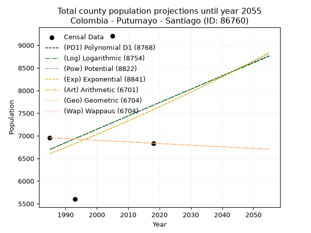
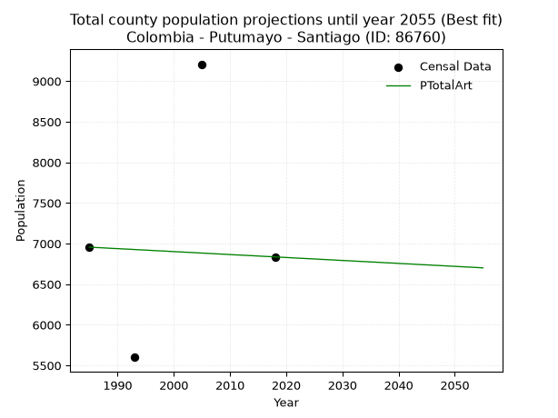
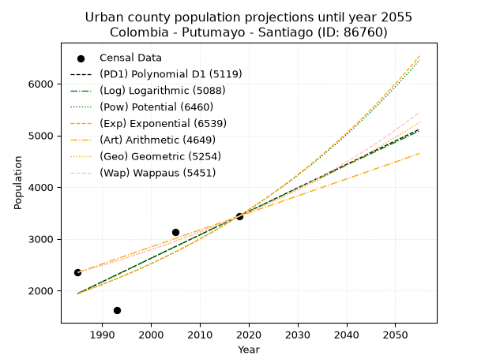
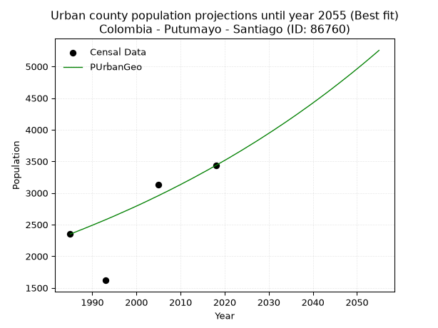
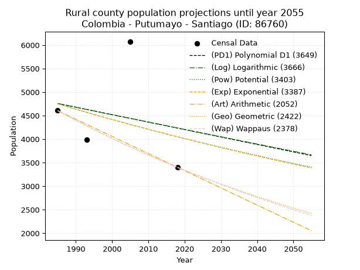
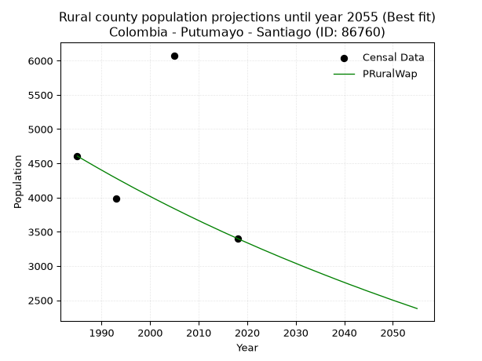

<div align="center">


</div>

# _“Population and Public Services Demand Projections (PPSD) until Year 2050 for Colombia - Putumayo - Santiago (ID: 86760)”_
Keywords: `population` `public-service` `projection` `lineal` `polynomial` `logarithmic` `potential` `exponential` `arithmetic` `geometric` `wappaus` `dane` `colombia` `south-america`

PPSD are analytical estimates used by governments and planners to anticipate future changes in population size, age distribution, and the resulting community needs for utilities, healthcare, education, and infrastructure as sizing future water treatment facilities, electrical grids, and road networks based on spatial growth.

> **General running parameters**: • app_version: _v20260806_. • Python version: _3.14.7_. • Pandas version: _3.0.5_. • NumPy version: _2.5.1_. • Creates, save and include plots into reports (create_plot): _False_. • Projection until year: _2050_. • Process polynomial degree 2 and up: _False_. • Process Wappaus: _True_. • Process Wappaus: _True_. • Set negative values to zero: _True_. • Set infinite values to zero: _True_. • Drop dataset notes: _True_. 
<div align="center">

Dynamic map: [:earth_americas:Google](http://maps.google.com/maps?q=1.147075854,-77.002641) [:earth_americas:OSM](https://www.openstreetmap.org/#map=18/1.147075854/-77.002641&layers=P) [:earth_americas:Bing](https://www.bing.com/maps?cp=1.147075854~-77.002641&lvl=18) [:earth_americas:Apple](https://maps.apple.com/frame?center=1.147075854%2C-77.002641&span=0.003%2C0.006)

</div>


<div align="center">

```geojson
{
  "type": "Feature",
  "geometry": {
    "type": "Point", 
    "coordinates": [-77.002641, 1.147075854]
  }, 
  "properties": {
    "Name": "Colombia - Putumayo - Santiago (ID: 86760)"
  }
}
```

</div>


## 0. Census Data (4 records)

Census data are official statistics collected by a government about the people and housing in a country. They usually include counts of total population, age, sex, race, income, education, and jobs.

📅Global census file: [Population.xlsx](../data/Population.xlsx)

| Source   |   Year |   CountryID | CountryName   |   StateID | StateName   |   CountyID | CountyName   |   PTotal |   PUrban |   PRural |
|:---------|-------:|------------:|:--------------|----------:|:------------|-----------:|:-------------|---------:|---------:|---------:|
| DANE     |   1985 |          57 | Colombia      |        86 | Putumayo    |      86760 | Santiago     |     6956 |     2350 |     4606 |
| DANE     |   1993 |          57 | Colombia      |        86 | Putumayo    |      86760 | Santiago     |     5600 |     1618 |     3982 |
| DANE     |   2005 |          57 | Colombia      |        86 | Putumayo    |      86760 | Santiago     |     9209 |     3133 |     6076 |
| DANE     |   2018 |          57 | Colombia      |        86 | Putumayo    |      86760 | Santiago     |     6836 |     3434 |     3402 |

> 🔥Some records has specific notes about the registered values or the corresponding urban or rural distribution.

## 1. Total

### 1.1. Coefficients and Parameters

* (PD1) Polynomial Deg 1: 29.55078281814657, -51958.703331997676 (lineal)
* (Log) Logarithmic: 59334.34748194491, -443850.6006858835
* (Pow) Potential: 8.363797209377669, -23.76213834297896
* (Exp) Exponential: 0.004168498065245698, 1.6835519719823335
* (Art) Arithmetic: Year diff. 2018 - 1985 = 33, Population diff. 6836 - 6956 = -120, Annual growth = -3.6363636363636362
* (Geo) Geometric: Year diff. 2018 - 1985 = 33, Population diff. 6836 - 6956 = -120, Annual growth % = -0.0005271892062650441
* (Wap) Wappaus: i = -0.052731491246572455, Condition values only valid for < 200)

<sub>
Wappaus condition values: ['-0.00', '-0.05', '-0.11', '-0.16', '-0.21', '-0.26', '-0.32', '-0.37', '-0.42', '-0.47', '-0.53', '-0.58', '-0.63', '-0.69', '-0.74', '-0.79', '-0.84', '-0.90', '-0.95', '-1.00', '-1.05', '-1.11', '-1.16', '-1.21', '-1.27', '-1.32', '-1.37', '-1.42', '-1.48', '-1.53', '-1.58', '-1.63', '-1.69', '-1.74', '-1.79', '-1.85', '-1.90', '-1.95', '-2.00', '-2.06', '-2.11', '-2.16', '-2.21', '-2.27', '-2.32', '-2.37', '-2.43', '-2.48', '-2.53', '-2.58', '-2.64', '-2.69', '-2.74', '-2.79', '-2.85', '-2.90', '-2.95', '-3.01', '-3.06', '-3.11', '-3.16', '-3.22', '-3.27', '-3.32', '-3.37', '-3.43']
</sub>


### 1.2. Projected Dataset

|   Year |   CountyID |   PTotalPD1 |   PTotalLog |   PTotalPow |   PTotalExp |   PTotalArt |   PTotalGeo |   PTotalWap |
|-------:|-----------:|------------:|------------:|------------:|------------:|------------:|------------:|------------:|
|   1985 |      86760 |        6700 |        6697 |        6602 |        6604 |        6956 |        6956 |        6956 |
|   1986 |      86760 |        6729 |        6727 |        6630 |        6631 |        6952 |        6952 |        6952 |
|   1987 |      86760 |        6759 |        6757 |        6658 |        6659 |        6949 |        6949 |        6949 |
|   1988 |      86760 |        6788 |        6787 |        6686 |        6687 |        6945 |        6945 |        6945 |
|   1989 |      86760 |        6818 |        6817 |        6714 |        6715 |        6941 |        6941 |        6941 |
|   1990 |      86760 |        6847 |        6847 |        6742 |        6743 |        6938 |        6938 |        6938 |
|   1991 |      86760 |        6877 |        6876 |        6771 |        6771 |        6934 |        6934 |        6934 |
|   1992 |      86760 |        6906 |        6906 |        6799 |        6799 |        6931 |        6930 |        6930 |
|   1993 |      86760 |        6936 |        6936 |        6828 |        6828 |        6927 |        6927 |        6927 |
|   1994 |      86760 |        6966 |        6966 |        6856 |        6856 |        6923 |        6923 |        6923 |
|   1995 |      86760 |        6995 |        6995 |        6885 |        6885 |        6920 |        6919 |        6919 |
|   1996 |      86760 |        7025 |        7025 |        6914 |        6913 |        6916 |        6916 |        6916 |
|   1997 |      86760 |        7054 |        7055 |        6943 |        6942 |        6912 |        6912 |        6912 |
|   1998 |      86760 |        7084 |        7085 |        6972 |        6971 |        6909 |        6908 |        6908 |
|   1999 |      86760 |        7113 |        7114 |        7001 |        7000 |        6905 |        6905 |        6905 |
|   2000 |      86760 |        7143 |        7144 |        7031 |        7030 |        6901 |        6901 |        6901 |
|   2001 |      86760 |        7172 |        7174 |        7060 |        7059 |        6898 |        6898 |        6898 |
|   2002 |      86760 |        7202 |        7203 |        7090 |        7089 |        6894 |        6894 |        6894 |
|   2003 |      86760 |        7232 |        7233 |        7120 |        7118 |        6891 |        6890 |        6890 |
|   2004 |      86760 |        7261 |        7263 |        7149 |        7148 |        6887 |        6887 |        6887 |
|   2005 |      86760 |        7291 |        7292 |        7179 |        7178 |        6883 |        6883 |        6883 |
|   2006 |      86760 |        7320 |        7322 |        7209 |        7208 |        6880 |        6879 |        6879 |
|   2007 |      86760 |        7350 |        7351 |        7239 |        7238 |        6876 |        6876 |        6876 |
|   2008 |      86760 |        7379 |        7381 |        7270 |        7268 |        6872 |        6872 |        6872 |
|   2009 |      86760 |        7409 |        7410 |        7300 |        7298 |        6869 |        6869 |        6869 |
|   2010 |      86760 |        7438 |        7440 |        7330 |        7329 |        6865 |        6865 |        6865 |
|   2011 |      86760 |        7468 |        7469 |        7361 |        7360 |        6861 |        6861 |        6861 |
|   2012 |      86760 |        7497 |        7499 |        7392 |        7390 |        6858 |        6858 |        6858 |
|   2013 |      86760 |        7527 |        7528 |        7422 |        7421 |        6854 |        6854 |        6854 |
|   2014 |      86760 |        7557 |        7558 |        7453 |        7452 |        6851 |        6850 |        6850 |
|   2015 |      86760 |        7586 |        7587 |        7484 |        7483 |        6847 |        6847 |        6847 |
|   2016 |      86760 |        7616 |        7617 |        7515 |        7515 |        6843 |        6843 |        6843 |
|   2017 |      86760 |        7645 |        7646 |        7547 |        7546 |        6840 |        6840 |        6840 |
|   2018 |      86760 |        7675 |        7676 |        7578 |        7577 |        6836 |        6836 |        6836 |
|   2019 |      86760 |        7704 |        7705 |        7609 |        7609 |        6832 |        6832 |        6832 |
|   2020 |      86760 |        7734 |        7734 |        7641 |        7641 |        6829 |        6829 |        6829 |
|   2021 |      86760 |        7763 |        7764 |        7673 |        7673 |        6825 |        6825 |        6825 |
|   2022 |      86760 |        7793 |        7793 |        7705 |        7705 |        6821 |        6822 |        6822 |
|   2023 |      86760 |        7823 |        7822 |        7736 |        7737 |        6818 |        6818 |        6818 |
|   2024 |      86760 |        7852 |        7852 |        7768 |        7769 |        6814 |        6814 |        6814 |
|   2025 |      86760 |        7882 |        7881 |        7801 |        7802 |        6811 |        6811 |        6811 |
|   2026 |      86760 |        7911 |        7910 |        7833 |        7834 |        6807 |        6807 |        6807 |
|   2027 |      86760 |        7941 |        7940 |        7865 |        7867 |        6803 |        6804 |        6804 |
|   2028 |      86760 |        7970 |        7969 |        7898 |        7900 |        6800 |        6800 |        6800 |
|   2029 |      86760 |        8000 |        7998 |        7930 |        7933 |        6796 |        6796 |        6796 |
|   2030 |      86760 |        8029 |        8027 |        7963 |        7966 |        6792 |        6793 |        6793 |
|   2031 |      86760 |        8059 |        8057 |        7996 |        7999 |        6789 |        6789 |        6789 |
|   2032 |      86760 |        8088 |        8086 |        8029 |        8033 |        6785 |        6786 |        6786 |
|   2033 |      86760 |        8118 |        8115 |        8062 |        8066 |        6781 |        6782 |        6782 |
|   2034 |      86760 |        8148 |        8144 |        8095 |        8100 |        6778 |        6779 |        6779 |
|   2035 |      86760 |        8177 |        8173 |        8129 |        8134 |        6774 |        6775 |        6775 |
|   2036 |      86760 |        8207 |        8203 |        8162 |        8168 |        6771 |        6771 |        6771 |
|   2037 |      86760 |        8236 |        8232 |        8196 |        8202 |        6767 |        6768 |        6768 |
|   2038 |      86760 |        8266 |        8261 |        8230 |        8236 |        6763 |        6764 |        6764 |
|   2039 |      86760 |        8295 |        8290 |        8263 |        8271 |        6760 |        6761 |        6761 |
|   2040 |      86760 |        8325 |        8319 |        8297 |        8305 |        6756 |        6757 |        6757 |
|   2041 |      86760 |        8354 |        8348 |        8331 |        8340 |        6752 |        6754 |        6754 |
|   2042 |      86760 |        8384 |        8377 |        8366 |        8375 |        6749 |        6750 |        6750 |
|   2043 |      86760 |        8414 |        8406 |        8400 |        8410 |        6745 |        6746 |        6746 |
|   2044 |      86760 |        8443 |        8435 |        8434 |        8445 |        6741 |        6743 |        6743 |
|   2045 |      86760 |        8473 |        8464 |        8469 |        8480 |        6738 |        6739 |        6739 |
|   2046 |      86760 |        8502 |        8493 |        8504 |        8516 |        6734 |        6736 |        6736 |
|   2047 |      86760 |        8532 |        8522 |        8538 |        8551 |        6731 |        6732 |        6732 |
|   2048 |      86760 |        8561 |        8551 |        8573 |        8587 |        6727 |        6729 |        6729 |
|   2049 |      86760 |        8591 |        8580 |        8608 |        8623 |        6723 |        6725 |        6725 |
|   2050 |      86760 |        8620 |        8609 |        8644 |        8659 |        6720 |        6722 |        6722 |
<div align="center">

</img>

</div>


### 1.3. Best fit with absolute error and relative error (%)

Relative error puts that difference into context by dividing the absolute error by the true value, creating a unitless ratio or percentage that shows the scale of the mistake.

Absolute and relative error

|   Year | Source   |   CountryID | CountryName   |   StateID | StateName   |   CountyID_x | CountyName   |   PTotal |   PUrban |   PRural |   CountyID_y |   PTotalPD1 |   PTotalLog |   PTotalPow |   PTotalExp |   PTotalArt |   PTotalGeo |   PTotalWap |   PTotalPD1AbsError |   PTotalLogAbsError |   PTotalPowAbsError |   PTotalExpAbsError |   PTotalArtAbsError |   PTotalGeoAbsError |   PTotalWapAbsError |   PTotalPD1RelError |   PTotalLogRelError |   PTotalPowRelError |   PTotalExpRelError |   PTotalArtRelError |   PTotalGeoRelError |   PTotalWapRelError |
|-------:|:---------|------------:|:--------------|----------:|:------------|-------------:|:-------------|---------:|---------:|---------:|-------------:|------------:|------------:|------------:|------------:|------------:|------------:|------------:|--------------------:|--------------------:|--------------------:|--------------------:|--------------------:|--------------------:|--------------------:|--------------------:|--------------------:|--------------------:|--------------------:|--------------------:|--------------------:|--------------------:|
|   1985 | DANE     |          57 | Colombia      |        86 | Putumayo    |        86760 | Santiago     |     6956 |     2350 |     4606 |        86760 |        6700 |        6697 |        6602 |        6604 |        6956 |        6956 |        6956 |                 256 |                 259 |                 354 |                 352 |                   0 |                   0 |                   0 |             3.68028 |              3.7234 |             5.08913 |             5.06038 |              0      |              0      |              0      |
|   1993 | DANE     |          57 | Colombia      |        86 | Putumayo    |        86760 | Santiago     |     5600 |     1618 |     3982 |        86760 |        6936 |        6936 |        6828 |        6828 |        6927 |        6927 |        6927 |                1336 |                1336 |                1228 |                1228 |                1327 |                1327 |                1327 |            23.8571  |             23.8571 |            21.9286  |            21.9286  |             23.6964 |             23.6964 |             23.6964 |
|   2005 | DANE     |          57 | Colombia      |        86 | Putumayo    |        86760 | Santiago     |     9209 |     3133 |     6076 |        86760 |        7291 |        7292 |        7179 |        7178 |        6883 |        6883 |        6883 |                1918 |                1917 |                2030 |                2031 |                2326 |                2326 |                2326 |            20.8275  |             20.8166 |            22.0437  |            22.0545  |             25.2579 |             25.2579 |             25.2579 |
|   2018 | DANE     |          57 | Colombia      |        86 | Putumayo    |        86760 | Santiago     |     6836 |     3434 |     3402 |        86760 |        7675 |        7676 |        7578 |        7577 |        6836 |        6836 |        6836 |                 839 |                 840 |                 742 |                 741 |                   0 |                   0 |                   0 |            12.2733  |             12.2879 |            10.8543  |            10.8397  |              0      |              0      |              0      |

Relative error mean

| Method    |   RelError | Best   |
|:----------|-----------:|:-------|
| PTotalPD1 |    15.1595 |        |
| PTotalLog |    15.1713 |        |
| PTotalPow |    14.9789 |        |
| PTotalExp |    14.9708 |        |
| PTotalArt |    12.2386 | True   |
| PTotalGeo |    12.2386 | True   |
| PTotalWap |    12.2386 | True   |

💙Best method: _**PTotalArt**_
<div align="center">

</img>

</div>


### 1.4. Fresh water supply demand in liters per capita per day (lpcd)

The fresh water supply demand typically ranges from 100 to 300 liters per capita per day (lpcd) for standard domestic and municipal planning, though absolute survival minimums set by the World Health Organization are as low as 7.5 to 20 liters per day, and total consumption in high-income nations can exceed 400 liters.

> `CZ`: Level in meters above the sea level (masl).<br> `WS`: Fresh water supply demand in liters per capita per day (lpcd or l/h/d).<br> `WSAll`: Zonal fresh water supply demand in liters per second (l/s).<br> `A`: Zonal area in square meters.

Reference values (RAS Colombia)

|    CZ |   WS |
|------:|-----:|
|  1000 |  120 |
|  2000 |  130 |
| 99999 |  140 |

County shapefile geometry properties and water supply values

|   CountyID |      ATotal |   CZTotal |   WSTotal |
|-----------:|------------:|----------:|----------:|
|      86760 | 3.42161e+08 |   2675.35 |       140 |

Projected values for best method: PTotalArt

|   CountyID |   Year |   PTotalArt |   WSTotal |   WSTotalAll |
|-----------:|-------:|------------:|----------:|-------------:|
|      86760 |   1985 |        6956 |       140 |      11.2713 |
|      86760 |   1986 |        6952 |       140 |      11.2648 |
|      86760 |   1987 |        6949 |       140 |      11.26   |
|      86760 |   1988 |        6945 |       140 |      11.2535 |
|      86760 |   1989 |        6941 |       140 |      11.247  |
|      86760 |   1990 |        6938 |       140 |      11.2421 |
|      86760 |   1991 |        6934 |       140 |      11.2356 |
|      86760 |   1992 |        6931 |       140 |      11.2308 |
|      86760 |   1993 |        6927 |       140 |      11.2243 |
|      86760 |   1994 |        6923 |       140 |      11.2178 |
|      86760 |   1995 |        6920 |       140 |      11.213  |
|      86760 |   1996 |        6916 |       140 |      11.2065 |
|      86760 |   1997 |        6912 |       140 |      11.2    |
|      86760 |   1998 |        6909 |       140 |      11.1951 |
|      86760 |   1999 |        6905 |       140 |      11.1887 |
|      86760 |   2000 |        6901 |       140 |      11.1822 |
|      86760 |   2001 |        6898 |       140 |      11.1773 |
|      86760 |   2002 |        6894 |       140 |      11.1708 |
|      86760 |   2003 |        6891 |       140 |      11.166  |
|      86760 |   2004 |        6887 |       140 |      11.1595 |
|      86760 |   2005 |        6883 |       140 |      11.153  |
|      86760 |   2006 |        6880 |       140 |      11.1481 |
|      86760 |   2007 |        6876 |       140 |      11.1417 |
|      86760 |   2008 |        6872 |       140 |      11.1352 |
|      86760 |   2009 |        6869 |       140 |      11.1303 |
|      86760 |   2010 |        6865 |       140 |      11.1238 |
|      86760 |   2011 |        6861 |       140 |      11.1174 |
|      86760 |   2012 |        6858 |       140 |      11.1125 |
|      86760 |   2013 |        6854 |       140 |      11.106  |
|      86760 |   2014 |        6851 |       140 |      11.1012 |
|      86760 |   2015 |        6847 |       140 |      11.0947 |
|      86760 |   2016 |        6843 |       140 |      11.0882 |
|      86760 |   2017 |        6840 |       140 |      11.0833 |
|      86760 |   2018 |        6836 |       140 |      11.0769 |
|      86760 |   2019 |        6832 |       140 |      11.0704 |
|      86760 |   2020 |        6829 |       140 |      11.0655 |
|      86760 |   2021 |        6825 |       140 |      11.059  |
|      86760 |   2022 |        6821 |       140 |      11.0525 |
|      86760 |   2023 |        6818 |       140 |      11.0477 |
|      86760 |   2024 |        6814 |       140 |      11.0412 |
|      86760 |   2025 |        6811 |       140 |      11.0363 |
|      86760 |   2026 |        6807 |       140 |      11.0299 |
|      86760 |   2027 |        6803 |       140 |      11.0234 |
|      86760 |   2028 |        6800 |       140 |      11.0185 |
|      86760 |   2029 |        6796 |       140 |      11.012  |
|      86760 |   2030 |        6792 |       140 |      11.0056 |
|      86760 |   2031 |        6789 |       140 |      11.0007 |
|      86760 |   2032 |        6785 |       140 |      10.9942 |
|      86760 |   2033 |        6781 |       140 |      10.9877 |
|      86760 |   2034 |        6778 |       140 |      10.9829 |
|      86760 |   2035 |        6774 |       140 |      10.9764 |
|      86760 |   2036 |        6771 |       140 |      10.9715 |
|      86760 |   2037 |        6767 |       140 |      10.965  |
|      86760 |   2038 |        6763 |       140 |      10.9586 |
|      86760 |   2039 |        6760 |       140 |      10.9537 |
|      86760 |   2040 |        6756 |       140 |      10.9472 |
|      86760 |   2041 |        6752 |       140 |      10.9407 |
|      86760 |   2042 |        6749 |       140 |      10.9359 |
|      86760 |   2043 |        6745 |       140 |      10.9294 |
|      86760 |   2044 |        6741 |       140 |      10.9229 |
|      86760 |   2045 |        6738 |       140 |      10.9181 |
|      86760 |   2046 |        6734 |       140 |      10.9116 |
|      86760 |   2047 |        6731 |       140 |      10.9067 |
|      86760 |   2048 |        6727 |       140 |      10.9002 |
|      86760 |   2049 |        6723 |       140 |      10.8938 |
|      86760 |   2050 |        6720 |       140 |      10.8889 |

## 2. Urban

### 2.1. Coefficients and Parameters

* (PD1) Polynomial Deg 1: 45.39100762745857, -88159.613006824 (lineal)
* (Log) Logarithmic: 90804.14183959014, -687569.2597814503
* (Pow) Potential: 34.70362960964004, -111.15636139996442
* (Exp) Exponential: 0.017349855321237707, 2.1437551170993534e-12
* (Art) Arithmetic: Year diff. 2018 - 1985 = 33, Population diff. 3434 - 2350 = 1084, Annual growth = 32.84848484848485
* (Geo) Geometric: Year diff. 2018 - 1985 = 33, Population diff. 3434 - 2350 = 1084, Annual growth % = 0.011560568369642032
* (Wap) Wappaus: i = 1.1358397250513432, Condition values only valid for < 200)

<sub>
Wappaus condition values: ['0.00', '1.14', '2.27', '3.41', '4.54', '5.68', '6.82', '7.95', '9.09', '10.22', '11.36', '12.49', '13.63', '14.77', '15.90', '17.04', '18.17', '19.31', '20.45', '21.58', '22.72', '23.85', '24.99', '26.12', '27.26', '28.40', '29.53', '30.67', '31.80', '32.94', '34.08', '35.21', '36.35', '37.48', '38.62', '39.75', '40.89', '42.03', '43.16', '44.30', '45.43', '46.57', '47.71', '48.84', '49.98', '51.11', '52.25', '53.38', '54.52', '55.66', '56.79', '57.93', '59.06', '60.20', '61.34', '62.47', '63.61', '64.74', '65.88', '67.01', '68.15', '69.29', '70.42', '71.56', '72.69', '73.83']
</sub>


### 2.2. Projected Dataset

|   Year |   CountyID |   PUrbanPD1 |   PUrbanLog |   PUrbanPow |   PUrbanExp |   PUrbanArt |   PUrbanGeo |   PUrbanWap |
|-------:|-----------:|------------:|------------:|------------:|------------:|------------:|------------:|------------:|
|   1985 |      86760 |        1942 |        1941 |        1940 |        1941 |        2350 |        2350 |        2350 |
|   1986 |      86760 |        1987 |        1986 |        1975 |        1975 |        2383 |        2377 |        2377 |
|   1987 |      86760 |        2032 |        2032 |        2009 |        2010 |        2416 |        2405 |        2404 |
|   1988 |      86760 |        2078 |        2078 |        2045 |        2045 |        2449 |        2432 |        2431 |
|   1989 |      86760 |        2123 |        2123 |        2081 |        2081 |        2481 |        2461 |        2459 |
|   1990 |      86760 |        2168 |        2169 |        2117 |        2117 |        2514 |        2489 |        2487 |
|   1991 |      86760 |        2214 |        2215 |        2155 |        2154 |        2547 |        2518 |        2516 |
|   1992 |      86760 |        2259 |        2260 |        2193 |        2192 |        2580 |        2547 |        2545 |
|   1993 |      86760 |        2305 |        2306 |        2231 |        2230 |        2613 |        2576 |        2574 |
|   1994 |      86760 |        2350 |        2351 |        2270 |        2269 |        2646 |        2606 |        2603 |
|   1995 |      86760 |        2395 |        2397 |        2310 |        2309 |        2678 |        2636 |        2633 |
|   1996 |      86760 |        2441 |        2442 |        2351 |        2349 |        2711 |        2667 |        2663 |
|   1997 |      86760 |        2486 |        2488 |        2392 |        2390 |        2744 |        2698 |        2694 |
|   1998 |      86760 |        2532 |        2533 |        2434 |        2432 |        2777 |        2729 |        2725 |
|   1999 |      86760 |        2577 |        2579 |        2476 |        2475 |        2810 |        2760 |        2756 |
|   2000 |      86760 |        2622 |        2624 |        2520 |        2518 |        2843 |        2792 |        2788 |
|   2001 |      86760 |        2668 |        2670 |        2564 |        2562 |        2876 |        2824 |        2820 |
|   2002 |      86760 |        2713 |        2715 |        2609 |        2607 |        2908 |        2857 |        2852 |
|   2003 |      86760 |        2759 |        2760 |        2654 |        2653 |        2941 |        2890 |        2885 |
|   2004 |      86760 |        2804 |        2806 |        2701 |        2699 |        2974 |        2924 |        2918 |
|   2005 |      86760 |        2849 |        2851 |        2748 |        2746 |        3007 |        2957 |        2952 |
|   2006 |      86760 |        2895 |        2896 |        2796 |        2794 |        3040 |        2992 |        2986 |
|   2007 |      86760 |        2940 |        2941 |        2845 |        2843 |        3073 |        3026 |        3021 |
|   2008 |      86760 |        2986 |        2987 |        2894 |        2893 |        3106 |        3061 |        3056 |
|   2009 |      86760 |        3031 |        3032 |        2945 |        2944 |        3138 |        3097 |        3092 |
|   2010 |      86760 |        3076 |        3077 |        2996 |        2995 |        3171 |        3132 |        3128 |
|   2011 |      86760 |        3122 |        3122 |        3048 |        3048 |        3204 |        3169 |        3164 |
|   2012 |      86760 |        3167 |        3167 |        3101 |        3101 |        3237 |        3205 |        3201 |
|   2013 |      86760 |        3212 |        3212 |        3155 |        3155 |        3270 |        3242 |        3239 |
|   2014 |      86760 |        3258 |        3258 |        3210 |        3210 |        3303 |        3280 |        3277 |
|   2015 |      86760 |        3303 |        3303 |        3266 |        3267 |        3335 |        3318 |        3315 |
|   2016 |      86760 |        3349 |        3348 |        3322 |        3324 |        3368 |        3356 |        3354 |
|   2017 |      86760 |        3394 |        3393 |        3380 |        3382 |        3401 |        3395 |        3394 |
|   2018 |      86760 |        3439 |        3438 |        3439 |        3441 |        3434 |        3434 |        3434 |
|   2019 |      86760 |        3485 |        3483 |        3498 |        3501 |        3467 |        3474 |        3475 |
|   2020 |      86760 |        3530 |        3528 |        3559 |        3563 |        3500 |        3514 |        3516 |
|   2021 |      86760 |        3576 |        3573 |        3621 |        3625 |        3533 |        3554 |        3558 |
|   2022 |      86760 |        3621 |        3618 |        3683 |        3688 |        3565 |        3596 |        3600 |
|   2023 |      86760 |        3666 |        3662 |        3747 |        3753 |        3598 |        3637 |        3643 |
|   2024 |      86760 |        3712 |        3707 |        3812 |        3819 |        3631 |        3679 |        3687 |
|   2025 |      86760 |        3757 |        3752 |        3878 |        3885 |        3664 |        3722 |        3732 |
|   2026 |      86760 |        3803 |        3797 |        3945 |        3953 |        3697 |        3765 |        3777 |
|   2027 |      86760 |        3848 |        3842 |        4013 |        4023 |        3730 |        3808 |        3822 |
|   2028 |      86760 |        3893 |        3887 |        4082 |        4093 |        3762 |        3852 |        3869 |
|   2029 |      86760 |        3939 |        3931 |        4153 |        4165 |        3795 |        3897 |        3916 |
|   2030 |      86760 |        3984 |        3976 |        4224 |        4238 |        3828 |        3942 |        3964 |
|   2031 |      86760 |        4030 |        4021 |        4297 |        4312 |        3861 |        3987 |        4012 |
|   2032 |      86760 |        4075 |        4066 |        4371 |        4387 |        3894 |        4034 |        4061 |
|   2033 |      86760 |        4120 |        4110 |        4446 |        4464 |        3927 |        4080 |        4111 |
|   2034 |      86760 |        4166 |        4155 |        4523 |        4542 |        3960 |        4127 |        4162 |
|   2035 |      86760 |        4211 |        4199 |        4601 |        4622 |        3992 |        4175 |        4214 |
|   2036 |      86760 |        4256 |        4244 |        4680 |        4702 |        4025 |        4223 |        4266 |
|   2037 |      86760 |        4302 |        4289 |        4760 |        4785 |        4058 |        4272 |        4320 |
|   2038 |      86760 |        4347 |        4333 |        4842 |        4869 |        4091 |        4322 |        4374 |
|   2039 |      86760 |        4393 |        4378 |        4925 |        4954 |        4124 |        4371 |        4429 |
|   2040 |      86760 |        4438 |        4422 |        5010 |        5040 |        4157 |        4422 |        4485 |
|   2041 |      86760 |        4483 |        4467 |        5096 |        5129 |        4190 |        4473 |        4542 |
|   2042 |      86760 |        4529 |        4511 |        5183 |        5218 |        4222 |        4525 |        4600 |
|   2043 |      86760 |        4574 |        4556 |        5272 |        5310 |        4255 |        4577 |        4659 |
|   2044 |      86760 |        4620 |        4600 |        5362 |        5403 |        4288 |        4630 |        4718 |
|   2045 |      86760 |        4665 |        4645 |        5454 |        5497 |        4321 |        4684 |        4779 |
|   2046 |      86760 |        4710 |        4689 |        5547 |        5593 |        4354 |        4738 |        4841 |
|   2047 |      86760 |        4756 |        4733 |        5642 |        5691 |        4387 |        4793 |        4904 |
|   2048 |      86760 |        4801 |        4778 |        5739 |        5791 |        4419 |        4848 |        4968 |
|   2049 |      86760 |        4847 |        4822 |        5837 |        5892 |        4452 |        4904 |        5034 |
|   2050 |      86760 |        4892 |        4866 |        5936 |        5995 |        4485 |        4961 |        5100 |
<div align="center">

</img>

</div>


### 2.3. Best fit with absolute error and relative error (%)

Relative error puts that difference into context by dividing the absolute error by the true value, creating a unitless ratio or percentage that shows the scale of the mistake.

Absolute and relative error

|   Year | Source   |   CountryID | CountryName   |   StateID | StateName   |   CountyID_x | CountyName   |   PTotal |   PUrban |   PRural |   CountyID_y |   PUrbanPD1 |   PUrbanLog |   PUrbanPow |   PUrbanExp |   PUrbanArt |   PUrbanGeo |   PUrbanWap |   PUrbanPD1AbsError |   PUrbanLogAbsError |   PUrbanPowAbsError |   PUrbanExpAbsError |   PUrbanArtAbsError |   PUrbanGeoAbsError |   PUrbanWapAbsError |   PUrbanPD1RelError |   PUrbanLogRelError |   PUrbanPowRelError |   PUrbanExpRelError |   PUrbanArtRelError |   PUrbanGeoRelError |   PUrbanWapRelError |
|-------:|:---------|------------:|:--------------|----------:|:------------|-------------:|:-------------|---------:|---------:|---------:|-------------:|------------:|------------:|------------:|------------:|------------:|------------:|------------:|--------------------:|--------------------:|--------------------:|--------------------:|--------------------:|--------------------:|--------------------:|--------------------:|--------------------:|--------------------:|--------------------:|--------------------:|--------------------:|--------------------:|
|   1985 | DANE     |          57 | Colombia      |        86 | Putumayo    |        86760 | Santiago     |     6956 |     2350 |     4606 |        86760 |        1942 |        1941 |        1940 |        1941 |        2350 |        2350 |        2350 |                 408 |                 409 |                 410 |                 409 |                   0 |                   0 |                   0 |           17.3617   |           17.4043   |           17.4468   |           17.4043   |              0      |             0       |             0       |
|   1993 | DANE     |          57 | Colombia      |        86 | Putumayo    |        86760 | Santiago     |     5600 |     1618 |     3982 |        86760 |        2305 |        2306 |        2231 |        2230 |        2613 |        2576 |        2574 |                 687 |                 688 |                 613 |                 612 |                 995 |                 958 |                 956 |           42.4598   |           42.5216   |           37.8863   |           37.8245   |             61.4957 |            59.2089  |            59.0853  |
|   2005 | DANE     |          57 | Colombia      |        86 | Putumayo    |        86760 | Santiago     |     9209 |     3133 |     6076 |        86760 |        2849 |        2851 |        2748 |        2746 |        3007 |        2957 |        2952 |                 284 |                 282 |                 385 |                 387 |                 126 |                 176 |                 181 |            9.06479  |            9.00096  |           12.2885   |           12.3524   |              4.0217 |             5.61762 |             5.77721 |
|   2018 | DANE     |          57 | Colombia      |        86 | Putumayo    |        86760 | Santiago     |     6836 |     3434 |     3402 |        86760 |        3439 |        3438 |        3439 |        3441 |        3434 |        3434 |        3434 |                   5 |                   4 |                   5 |                   7 |                   0 |                   0 |                   0 |            0.145603 |            0.116482 |            0.145603 |            0.203844 |              0      |             0       |             0       |

Relative error mean

| Method    |   RelError | Best   |
|:----------|-----------:|:-------|
| PUrbanPD1 |    17.258  |        |
| PUrbanLog |    17.2608 |        |
| PUrbanPow |    16.9418 |        |
| PUrbanExp |    16.9462 |        |
| PUrbanArt |    16.3793 |        |
| PUrbanGeo |    16.2066 | True   |
| PUrbanWap |    16.2156 |        |

💙Best method: _**PUrbanGeo**_
<div align="center">

</img>

</div>


### 2.4. Fresh water supply demand in liters per capita per day (lpcd)

The fresh water supply demand typically ranges from 100 to 300 liters per capita per day (lpcd) for standard domestic and municipal planning, though absolute survival minimums set by the World Health Organization are as low as 7.5 to 20 liters per day, and total consumption in high-income nations can exceed 400 liters.

> `CZ`: Level in meters above the sea level (masl).<br> `WS`: Fresh water supply demand in liters per capita per day (lpcd or l/h/d).<br> `WSAll`: Zonal fresh water supply demand in liters per second (l/s).<br> `A`: Zonal area in square meters.

Reference values (RAS Colombia)

|    CZ |   WS |
|------:|-----:|
|  1000 |  120 |
|  2000 |  130 |
| 99999 |  140 |

County shapefile geometry properties and water supply values

|   CountyID |   AUrban |   CZUrban |   WSUrban |
|-----------:|---------:|----------:|----------:|
|      86760 |   800817 |   2110.62 |       140 |

Projected values for best method: PUrbanGeo

|   CountyID |   Year |   PUrbanGeo |   WSUrban |   WSUrbanAll |
|-----------:|-------:|------------:|----------:|-------------:|
|      86760 |   1985 |        2350 |       140 |      3.80787 |
|      86760 |   1986 |        2377 |       140 |      3.85162 |
|      86760 |   1987 |        2405 |       140 |      3.89699 |
|      86760 |   1988 |        2432 |       140 |      3.94074 |
|      86760 |   1989 |        2461 |       140 |      3.98773 |
|      86760 |   1990 |        2489 |       140 |      4.0331  |
|      86760 |   1991 |        2518 |       140 |      4.08009 |
|      86760 |   1992 |        2547 |       140 |      4.12708 |
|      86760 |   1993 |        2576 |       140 |      4.17407 |
|      86760 |   1994 |        2606 |       140 |      4.22269 |
|      86760 |   1995 |        2636 |       140 |      4.2713  |
|      86760 |   1996 |        2667 |       140 |      4.32153 |
|      86760 |   1997 |        2698 |       140 |      4.37176 |
|      86760 |   1998 |        2729 |       140 |      4.42199 |
|      86760 |   1999 |        2760 |       140 |      4.47222 |
|      86760 |   2000 |        2792 |       140 |      4.52407 |
|      86760 |   2001 |        2824 |       140 |      4.57593 |
|      86760 |   2002 |        2857 |       140 |      4.6294  |
|      86760 |   2003 |        2890 |       140 |      4.68287 |
|      86760 |   2004 |        2924 |       140 |      4.73796 |
|      86760 |   2005 |        2957 |       140 |      4.79144 |
|      86760 |   2006 |        2992 |       140 |      4.84815 |
|      86760 |   2007 |        3026 |       140 |      4.90324 |
|      86760 |   2008 |        3061 |       140 |      4.95995 |
|      86760 |   2009 |        3097 |       140 |      5.01829 |
|      86760 |   2010 |        3132 |       140 |      5.075   |
|      86760 |   2011 |        3169 |       140 |      5.13495 |
|      86760 |   2012 |        3205 |       140 |      5.19329 |
|      86760 |   2013 |        3242 |       140 |      5.25324 |
|      86760 |   2014 |        3280 |       140 |      5.31481 |
|      86760 |   2015 |        3318 |       140 |      5.37639 |
|      86760 |   2016 |        3356 |       140 |      5.43796 |
|      86760 |   2017 |        3395 |       140 |      5.50116 |
|      86760 |   2018 |        3434 |       140 |      5.56435 |
|      86760 |   2019 |        3474 |       140 |      5.62917 |
|      86760 |   2020 |        3514 |       140 |      5.69398 |
|      86760 |   2021 |        3554 |       140 |      5.7588  |
|      86760 |   2022 |        3596 |       140 |      5.82685 |
|      86760 |   2023 |        3637 |       140 |      5.89329 |
|      86760 |   2024 |        3679 |       140 |      5.96134 |
|      86760 |   2025 |        3722 |       140 |      6.03102 |
|      86760 |   2026 |        3765 |       140 |      6.10069 |
|      86760 |   2027 |        3808 |       140 |      6.17037 |
|      86760 |   2028 |        3852 |       140 |      6.24167 |
|      86760 |   2029 |        3897 |       140 |      6.31458 |
|      86760 |   2030 |        3942 |       140 |      6.3875  |
|      86760 |   2031 |        3987 |       140 |      6.46042 |
|      86760 |   2032 |        4034 |       140 |      6.53657 |
|      86760 |   2033 |        4080 |       140 |      6.61111 |
|      86760 |   2034 |        4127 |       140 |      6.68727 |
|      86760 |   2035 |        4175 |       140 |      6.76505 |
|      86760 |   2036 |        4223 |       140 |      6.84282 |
|      86760 |   2037 |        4272 |       140 |      6.92222 |
|      86760 |   2038 |        4322 |       140 |      7.00324 |
|      86760 |   2039 |        4371 |       140 |      7.08264 |
|      86760 |   2040 |        4422 |       140 |      7.16528 |
|      86760 |   2041 |        4473 |       140 |      7.24792 |
|      86760 |   2042 |        4525 |       140 |      7.33218 |
|      86760 |   2043 |        4577 |       140 |      7.41644 |
|      86760 |   2044 |        4630 |       140 |      7.50231 |
|      86760 |   2045 |        4684 |       140 |      7.58981 |
|      86760 |   2046 |        4738 |       140 |      7.67731 |
|      86760 |   2047 |        4793 |       140 |      7.76644 |
|      86760 |   2048 |        4848 |       140 |      7.85556 |
|      86760 |   2049 |        4904 |       140 |      7.9463  |
|      86760 |   2050 |        4961 |       140 |      8.03866 |

## 3. Rural

### 3.1. Coefficients and Parameters

* (PD1) Polynomial Deg 1: -15.840224809312012, 36200.909674826355 (lineal)
* (Log) Logarithmic: -31469.794357645205, 243718.6590955664
* (Pow) Potential: -9.615914053027161, 35.38755584864215
* (Exp) Exponential: -0.004828701993921307, 69083740.95719263
* (Art) Arithmetic: Year diff. 2018 - 1985 = 33, Population diff. 3402 - 4606 = -1204, Annual growth = -36.484848484848484
* (Geo) Geometric: Year diff. 2018 - 1985 = 33, Population diff. 3402 - 4606 = -1204, Annual growth % = -0.009139683133537968
* (Wap) Wappaus: i = -0.911210002119093, Condition values only valid for < 200)

<sub>
Wappaus condition values: ['-0.00', '-0.91', '-1.82', '-2.73', '-3.64', '-4.56', '-5.47', '-6.38', '-7.29', '-8.20', '-9.11', '-10.02', '-10.93', '-11.85', '-12.76', '-13.67', '-14.58', '-15.49', '-16.40', '-17.31', '-18.22', '-19.14', '-20.05', '-20.96', '-21.87', '-22.78', '-23.69', '-24.60', '-25.51', '-26.43', '-27.34', '-28.25', '-29.16', '-30.07', '-30.98', '-31.89', '-32.80', '-33.71', '-34.63', '-35.54', '-36.45', '-37.36', '-38.27', '-39.18', '-40.09', '-41.00', '-41.92', '-42.83', '-43.74', '-44.65', '-45.56', '-46.47', '-47.38', '-48.29', '-49.21', '-50.12', '-51.03', '-51.94', '-52.85', '-53.76', '-54.67', '-55.58', '-56.50', '-57.41', '-58.32', '-59.23']
</sub>


### 3.2. Projected Dataset

|   Year |   CountyID |   PRuralPD1 |   PRuralLog |   PRuralPow |   PRuralExp |   PRuralArt |   PRuralGeo |   PRuralWap |
|-------:|-----------:|------------:|------------:|------------:|------------:|------------:|------------:|------------:|
|   1985 |      86760 |        4758 |        4757 |        4749 |        4750 |        4606 |        4606 |        4606 |
|   1986 |      86760 |        4742 |        4741 |        4726 |        4727 |        4570 |        4564 |        4564 |
|   1987 |      86760 |        4726 |        4725 |        4703 |        4704 |        4533 |        4522 |        4523 |
|   1988 |      86760 |        4711 |        4709 |        4680 |        4681 |        4497 |        4481 |        4482 |
|   1989 |      86760 |        4695 |        4693 |        4658 |        4659 |        4460 |        4440 |        4441 |
|   1990 |      86760 |        4679 |        4678 |        4635 |        4636 |        4424 |        4399 |        4401 |
|   1991 |      86760 |        4663 |        4662 |        4613 |        4614 |        4387 |        4359 |        4361 |
|   1992 |      86760 |        4647 |        4646 |        4591 |        4592 |        4351 |        4319 |        4321 |
|   1993 |      86760 |        4631 |        4630 |        4569 |        4570 |        4314 |        4280 |        4282 |
|   1994 |      86760 |        4616 |        4614 |        4547 |        4548 |        4278 |        4241 |        4243 |
|   1995 |      86760 |        4600 |        4599 |        4525 |        4526 |        4241 |        4202 |        4205 |
|   1996 |      86760 |        4584 |        4583 |        4503 |        4504 |        4205 |        4164 |        4166 |
|   1997 |      86760 |        4568 |        4567 |        4481 |        4482 |        4168 |        4125 |        4128 |
|   1998 |      86760 |        4552 |        4551 |        4460 |        4461 |        4132 |        4088 |        4091 |
|   1999 |      86760 |        4536 |        4536 |        4438 |        4439 |        4095 |        4050 |        4054 |
|   2000 |      86760 |        4520 |        4520 |        4417 |        4418 |        4059 |        4013 |        4017 |
|   2001 |      86760 |        4505 |        4504 |        4396 |        4397 |        4022 |        3977 |        3980 |
|   2002 |      86760 |        4489 |        4488 |        4375 |        4375 |        3986 |        3940 |        3944 |
|   2003 |      86760 |        4473 |        4473 |        4354 |        4354 |        3949 |        3904 |        3908 |
|   2004 |      86760 |        4457 |        4457 |        4333 |        4333 |        3913 |        3869 |        3872 |
|   2005 |      86760 |        4441 |        4441 |        4312 |        4313 |        3876 |        3833 |        3837 |
|   2006 |      86760 |        4425 |        4426 |        4292 |        4292 |        3840 |        3798 |        3802 |
|   2007 |      86760 |        4410 |        4410 |        4271 |        4271 |        3803 |        3764 |        3767 |
|   2008 |      86760 |        4394 |        4394 |        4251 |        4251 |        3767 |        3729 |        3732 |
|   2009 |      86760 |        4378 |        4379 |        4230 |        4230 |        3730 |        3695 |        3698 |
|   2010 |      86760 |        4362 |        4363 |        4210 |        4210 |        3694 |        3661 |        3664 |
|   2011 |      86760 |        4346 |        4347 |        4190 |        4189 |        3657 |        3628 |        3630 |
|   2012 |      86760 |        4330 |        4332 |        4170 |        4169 |        3621 |        3595 |        3597 |
|   2013 |      86760 |        4315 |        4316 |        4150 |        4149 |        3584 |        3562 |        3564 |
|   2014 |      86760 |        4299 |        4300 |        4131 |        4129 |        3548 |        3529 |        3531 |
|   2015 |      86760 |        4283 |        4285 |        4111 |        4109 |        3511 |        3497 |        3498 |
|   2016 |      86760 |        4267 |        4269 |        4091 |        4089 |        3475 |        3465 |        3466 |
|   2017 |      86760 |        4251 |        4253 |        4072 |        4070 |        3438 |        3433 |        3434 |
|   2018 |      86760 |        4235 |        4238 |        4052 |        4050 |        3402 |        3402 |        3402 |
|   2019 |      86760 |        4219 |        4222 |        4033 |        4031 |        3366 |        3371 |        3370 |
|   2020 |      86760 |        4204 |        4207 |        4014 |        4011 |        3329 |        3340 |        3339 |
|   2021 |      86760 |        4188 |        4191 |        3995 |        3992 |        3293 |        3310 |        3308 |
|   2022 |      86760 |        4172 |        4176 |        3976 |        3973 |        3256 |        3279 |        3277 |
|   2023 |      86760 |        4156 |        4160 |        3957 |        3954 |        3220 |        3249 |        3246 |
|   2024 |      86760 |        4140 |        4144 |        3938 |        3934 |        3183 |        3220 |        3216 |
|   2025 |      86760 |        4124 |        4129 |        3920 |        3916 |        3147 |        3190 |        3186 |
|   2026 |      86760 |        4109 |        4113 |        3901 |        3897 |        3110 |        3161 |        3156 |
|   2027 |      86760 |        4093 |        4098 |        3883 |        3878 |        3074 |        3132 |        3126 |
|   2028 |      86760 |        4077 |        4082 |        3864 |        3859 |        3037 |        3104 |        3097 |
|   2029 |      86760 |        4061 |        4067 |        3846 |        3841 |        3001 |        3075 |        3068 |
|   2030 |      86760 |        4045 |        4051 |        3828 |        3822 |        2964 |        3047 |        3039 |
|   2031 |      86760 |        4029 |        4036 |        3810 |        3804 |        2928 |        3019 |        3010 |
|   2032 |      86760 |        4014 |        4020 |        3792 |        3785 |        2891 |        2992 |        2981 |
|   2033 |      86760 |        3998 |        4005 |        3774 |        3767 |        2855 |        2964 |        2953 |
|   2034 |      86760 |        3982 |        3989 |        3756 |        3749 |        2818 |        2937 |        2925 |
|   2035 |      86760 |        3966 |        3974 |        3738 |        3731 |        2782 |        2910 |        2897 |
|   2036 |      86760 |        3950 |        3958 |        3721 |        3713 |        2745 |        2884 |        2869 |
|   2037 |      86760 |        3934 |        3943 |        3703 |        3695 |        2709 |        2857 |        2842 |
|   2038 |      86760 |        3919 |        3928 |        3686 |        3677 |        2672 |        2831 |        2814 |
|   2039 |      86760 |        3903 |        3912 |        3668 |        3660 |        2636 |        2805 |        2787 |
|   2040 |      86760 |        3887 |        3897 |        3651 |        3642 |        2599 |        2780 |        2760 |
|   2041 |      86760 |        3871 |        3881 |        3634 |        3624 |        2563 |        2754 |        2733 |
|   2042 |      86760 |        3855 |        3866 |        3617 |        3607 |        2526 |        2729 |        2707 |
|   2043 |      86760 |        3839 |        3850 |        3600 |        3590 |        2490 |        2704 |        2681 |
|   2044 |      86760 |        3823 |        3835 |        3583 |        3572 |        2453 |        2680 |        2654 |
|   2045 |      86760 |        3808 |        3820 |        3566 |        3555 |        2417 |        2655 |        2628 |
|   2046 |      86760 |        3792 |        3804 |        3550 |        3538 |        2380 |        2631 |        2603 |
|   2047 |      86760 |        3776 |        3789 |        3533 |        3521 |        2344 |        2607 |        2577 |
|   2048 |      86760 |        3760 |        3773 |        3516 |        3504 |        2307 |        2583 |        2552 |
|   2049 |      86760 |        3744 |        3758 |        3500 |        3487 |        2271 |        2559 |        2526 |
|   2050 |      86760 |        3728 |        3743 |        3483 |        3470 |        2234 |        2536 |        2501 |
<div align="center">

</img>

</div>


### 3.3. Best fit with absolute error and relative error (%)

Relative error puts that difference into context by dividing the absolute error by the true value, creating a unitless ratio or percentage that shows the scale of the mistake.

Absolute and relative error

|   Year | Source   |   CountryID | CountryName   |   StateID | StateName   |   CountyID_x | CountyName   |   PTotal |   PUrban |   PRural |   CountyID_y |   PRuralPD1 |   PRuralLog |   PRuralPow |   PRuralExp |   PRuralArt |   PRuralGeo |   PRuralWap |   PRuralPD1AbsError |   PRuralLogAbsError |   PRuralPowAbsError |   PRuralExpAbsError |   PRuralArtAbsError |   PRuralGeoAbsError |   PRuralWapAbsError |   PRuralPD1RelError |   PRuralLogRelError |   PRuralPowRelError |   PRuralExpRelError |   PRuralArtRelError |   PRuralGeoRelError |   PRuralWapRelError |
|-------:|:---------|------------:|:--------------|----------:|:------------|-------------:|:-------------|---------:|---------:|---------:|-------------:|------------:|------------:|------------:|------------:|------------:|------------:|------------:|--------------------:|--------------------:|--------------------:|--------------------:|--------------------:|--------------------:|--------------------:|--------------------:|--------------------:|--------------------:|--------------------:|--------------------:|--------------------:|--------------------:|
|   1985 | DANE     |          57 | Colombia      |        86 | Putumayo    |        86760 | Santiago     |     6956 |     2350 |     4606 |        86760 |        4758 |        4757 |        4749 |        4750 |        4606 |        4606 |        4606 |                 152 |                 151 |                 143 |                 144 |                   0 |                   0 |                   0 |             3.30004 |             3.27833 |             3.10465 |             3.12636 |             0       |             0       |              0      |
|   1993 | DANE     |          57 | Colombia      |        86 | Putumayo    |        86760 | Santiago     |     5600 |     1618 |     3982 |        86760 |        4631 |        4630 |        4569 |        4570 |        4314 |        4280 |        4282 |                 649 |                 648 |                 587 |                 588 |                 332 |                 298 |                 300 |            16.2983  |            16.2732  |            14.7413  |            14.7664  |             8.33752 |             7.48368 |              7.5339 |
|   2005 | DANE     |          57 | Colombia      |        86 | Putumayo    |        86760 | Santiago     |     9209 |     3133 |     6076 |        86760 |        4441 |        4441 |        4312 |        4313 |        3876 |        3833 |        3837 |                1635 |                1635 |                1764 |                1763 |                2200 |                2243 |                2239 |            26.9092  |            26.9092  |            29.0323  |            29.0158  |            36.208   |            36.9157  |             36.8499 |
|   2018 | DANE     |          57 | Colombia      |        86 | Putumayo    |        86760 | Santiago     |     6836 |     3434 |     3402 |        86760 |        4235 |        4238 |        4052 |        4050 |        3402 |        3402 |        3402 |                 833 |                 836 |                 650 |                 648 |                   0 |                   0 |                   0 |            24.4856  |            24.5738  |            19.1064  |            19.0476  |             0       |             0       |              0      |

Relative error mean

| Method    |   RelError | Best   |
|:----------|-----------:|:-------|
| PRuralPD1 |    17.7483 |        |
| PRuralLog |    17.7586 |        |
| PRuralPow |    16.4962 |        |
| PRuralExp |    16.4891 |        |
| PRuralArt |    11.1364 |        |
| PRuralGeo |    11.0999 |        |
| PRuralWap |    11.096  | True   |

💙Best method: _**PRuralWap**_
<div align="center">

</img>

</div>


### 3.4. Fresh water supply demand in liters per capita per day (lpcd)

The fresh water supply demand typically ranges from 100 to 300 liters per capita per day (lpcd) for standard domestic and municipal planning, though absolute survival minimums set by the World Health Organization are as low as 7.5 to 20 liters per day, and total consumption in high-income nations can exceed 400 liters.

> `CZ`: Level in meters above the sea level (masl).<br> `WS`: Fresh water supply demand in liters per capita per day (lpcd or l/h/d).<br> `WSAll`: Zonal fresh water supply demand in liters per second (l/s).<br> `A`: Zonal area in square meters.

Reference values (RAS Colombia)

|    CZ |   WS |
|------:|-----:|
|  1000 |  120 |
|  2000 |  130 |
| 99999 |  140 |

County shapefile geometry properties and water supply values

|   CountyID |     ARural |   CZRural |   WSRural |
|-----------:|-----------:|----------:|----------:|
|      86760 | 3.4136e+08 |   2676.74 |       140 |

Projected values for best method: PRuralWap

|   CountyID |   Year |   PRuralWap |   WSRural |   WSRuralAll |
|-----------:|-------:|------------:|----------:|-------------:|
|      86760 |   1985 |        4606 |       140 |      7.46343 |
|      86760 |   1986 |        4564 |       140 |      7.39537 |
|      86760 |   1987 |        4523 |       140 |      7.32894 |
|      86760 |   1988 |        4482 |       140 |      7.2625  |
|      86760 |   1989 |        4441 |       140 |      7.19606 |
|      86760 |   1990 |        4401 |       140 |      7.13125 |
|      86760 |   1991 |        4361 |       140 |      7.06644 |
|      86760 |   1992 |        4321 |       140 |      7.00162 |
|      86760 |   1993 |        4282 |       140 |      6.93843 |
|      86760 |   1994 |        4243 |       140 |      6.87523 |
|      86760 |   1995 |        4205 |       140 |      6.81366 |
|      86760 |   1996 |        4166 |       140 |      6.75046 |
|      86760 |   1997 |        4128 |       140 |      6.68889 |
|      86760 |   1998 |        4091 |       140 |      6.62894 |
|      86760 |   1999 |        4054 |       140 |      6.56898 |
|      86760 |   2000 |        4017 |       140 |      6.50903 |
|      86760 |   2001 |        3980 |       140 |      6.44907 |
|      86760 |   2002 |        3944 |       140 |      6.39074 |
|      86760 |   2003 |        3908 |       140 |      6.33241 |
|      86760 |   2004 |        3872 |       140 |      6.27407 |
|      86760 |   2005 |        3837 |       140 |      6.21736 |
|      86760 |   2006 |        3802 |       140 |      6.16065 |
|      86760 |   2007 |        3767 |       140 |      6.10394 |
|      86760 |   2008 |        3732 |       140 |      6.04722 |
|      86760 |   2009 |        3698 |       140 |      5.99213 |
|      86760 |   2010 |        3664 |       140 |      5.93704 |
|      86760 |   2011 |        3630 |       140 |      5.88194 |
|      86760 |   2012 |        3597 |       140 |      5.82847 |
|      86760 |   2013 |        3564 |       140 |      5.775   |
|      86760 |   2014 |        3531 |       140 |      5.72153 |
|      86760 |   2015 |        3498 |       140 |      5.66806 |
|      86760 |   2016 |        3466 |       140 |      5.6162  |
|      86760 |   2017 |        3434 |       140 |      5.56435 |
|      86760 |   2018 |        3402 |       140 |      5.5125  |
|      86760 |   2019 |        3370 |       140 |      5.46065 |
|      86760 |   2020 |        3339 |       140 |      5.41042 |
|      86760 |   2021 |        3308 |       140 |      5.36019 |
|      86760 |   2022 |        3277 |       140 |      5.30995 |
|      86760 |   2023 |        3246 |       140 |      5.25972 |
|      86760 |   2024 |        3216 |       140 |      5.21111 |
|      86760 |   2025 |        3186 |       140 |      5.1625  |
|      86760 |   2026 |        3156 |       140 |      5.11389 |
|      86760 |   2027 |        3126 |       140 |      5.06528 |
|      86760 |   2028 |        3097 |       140 |      5.01829 |
|      86760 |   2029 |        3068 |       140 |      4.9713  |
|      86760 |   2030 |        3039 |       140 |      4.92431 |
|      86760 |   2031 |        3010 |       140 |      4.87731 |
|      86760 |   2032 |        2981 |       140 |      4.83032 |
|      86760 |   2033 |        2953 |       140 |      4.78495 |
|      86760 |   2034 |        2925 |       140 |      4.73958 |
|      86760 |   2035 |        2897 |       140 |      4.69421 |
|      86760 |   2036 |        2869 |       140 |      4.64884 |
|      86760 |   2037 |        2842 |       140 |      4.60509 |
|      86760 |   2038 |        2814 |       140 |      4.55972 |
|      86760 |   2039 |        2787 |       140 |      4.51597 |
|      86760 |   2040 |        2760 |       140 |      4.47222 |
|      86760 |   2041 |        2733 |       140 |      4.42847 |
|      86760 |   2042 |        2707 |       140 |      4.38634 |
|      86760 |   2043 |        2681 |       140 |      4.34421 |
|      86760 |   2044 |        2654 |       140 |      4.30046 |
|      86760 |   2045 |        2628 |       140 |      4.25833 |
|      86760 |   2046 |        2603 |       140 |      4.21782 |
|      86760 |   2047 |        2577 |       140 |      4.17569 |
|      86760 |   2048 |        2552 |       140 |      4.13519 |
|      86760 |   2049 |        2526 |       140 |      4.09306 |
|      86760 |   2050 |        2501 |       140 |      4.05255 |

<div align="center"><br><sub>Share this research</sub></div><br>

<sub>**APPS & TOOLS & CONTENT DISCLAIMER**: • NO WARRANTY - This content and software is provided by <a href="https://github.com/rcfdtools" target="_blank">github.com/rcfdtools</a> "as is", without any express or implied warranty, including warranties of merchantability, fitness for a particular purpose, or non-infringement. There is no guarantee that the software will be error-free or operate without interruption. • LIMITATION OF LIABILITY - Neither the authors nor copyright holders will be liable for claims or damages arising from the software or its use. You are responsible for determining if the software is appropriate for your use and assume all associated risks, including errors, legal compliance, and data loss. • NO PROFESSIONAL ADVICE - The software provides general information and does not offer professional advice. It should not replace consultation with professional advisors. [Clauses and global license for rcfdtools use.](https://github.com/rcfdtools/rcfdtools/blob/main/LICENSE.md)</sub>