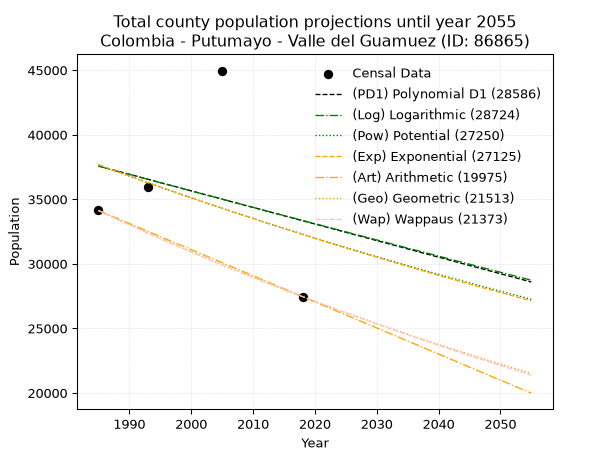
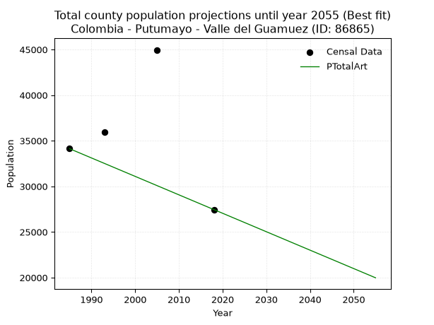
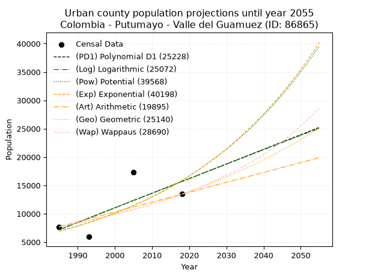
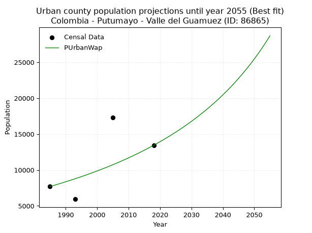
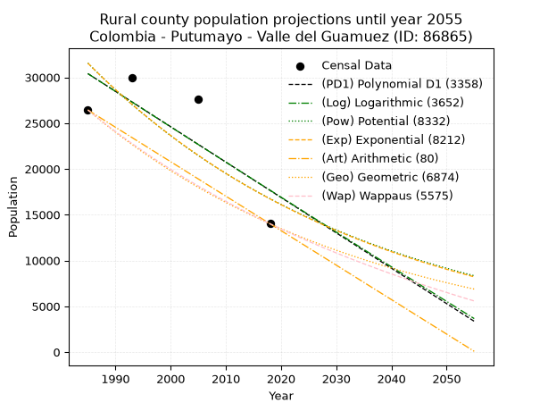
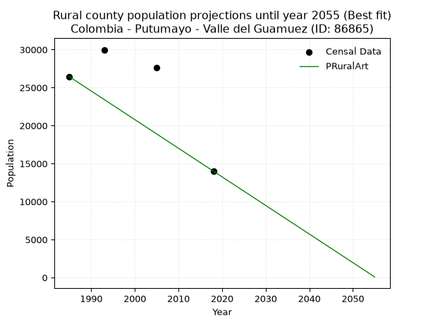

<div align="center">


</div>

# _“Population and Public Services Demand Projections (PPSD) until Year 2050 for Colombia - Putumayo - Valle del Guamuez (ID: 86865)”_
Keywords: `population` `public-service` `projection` `lineal` `polynomial` `logarithmic` `potential` `exponential` `arithmetic` `geometric` `wappaus` `dane` `colombia` `south-america`

PPSD are analytical estimates used by governments and planners to anticipate future changes in population size, age distribution, and the resulting community needs for utilities, healthcare, education, and infrastructure as sizing future water treatment facilities, electrical grids, and road networks based on spatial growth.

> **General running parameters**: • app_version: _v20260806_. • Python version: _3.14.7_. • Pandas version: _3.0.5_. • NumPy version: _2.5.1_. • Creates, save and include plots into reports (create_plot): _False_. • Projection until year: _2050_. • Process polynomial degree 2 and up: _False_. • Process Wappaus: _True_. • Process Wappaus: _True_. • Set negative values to zero: _True_. • Set infinite values to zero: _True_. • Drop dataset notes: _True_. 
<div align="center">

Dynamic map: [:earth_americas:Google](http://maps.google.com/maps?q=0.423506201,-76.9067513) [:earth_americas:OSM](https://www.openstreetmap.org/#map=18/0.423506201/-76.9067513&layers=P) [:earth_americas:Bing](https://www.bing.com/maps?cp=0.423506201~-76.9067513&lvl=18) [:earth_americas:Apple](https://maps.apple.com/frame?center=0.423506201%2C-76.9067513&span=0.003%2C0.006)

</div>


<div align="center">

```geojson
{
  "type": "Feature",
  "geometry": {
    "type": "Point", 
    "coordinates": [-76.9067513, 0.423506201]
  }, 
  "properties": {
    "Name": "Colombia - Putumayo - Valle del Guamuez (ID: 86865)"
  }
}
```

</div>


## 0. Census Data (4 records)

Census data are official statistics collected by a government about the people and housing in a country. They usually include counts of total population, age, sex, race, income, education, and jobs.

📅Global census file: [Population.xlsx](../data/Population.xlsx)

| Source   |   Year |   CountryID | CountryName   |   StateID | StateName   |   CountyID | CountyName        |   PTotal |   PUrban |   PRural |
|:---------|-------:|------------:|:--------------|----------:|:------------|-----------:|:------------------|---------:|---------:|---------:|
| DANE     |   1985 |          57 | Colombia      |        86 | Putumayo    |      86865 | Valle del Guamuez |    34126 |     7696 |    26430 |
| DANE     |   1993 |          57 | Colombia      |        86 | Putumayo    |      86865 | Valle Del Guamuez |    35919 |     5939 |    29980 |
| DANE     |   2005 |          57 | Colombia      |        86 | Putumayo    |      86865 | Valle del Guamuez |    44959 |    17341 |    27618 |
| DANE     |   2018 |          57 | Colombia      |        86 | Putumayo    |      86865 | Valle Del Guamuez |    27455 |    13447 |    14008 |

> 🔥Some records could had specific notes about the registered values or the corresponding urban or rural distribution.

## 1. Total

### 1.1. Coefficients and Parameters

* (PD1) Polynomial Deg 1: -128.38659173021838, 292420.0301083693 (lineal)
* (Log) Logarithmic: -255006.34059459416, 1973919.9883520762
* (Pow) Potential: -9.33872245818559, 35.37279298534594
* (Exp) Exponential: -0.004692959063284812, 418527414.1417975
* (Art) Arithmetic: Year diff. 2018 - 1985 = 33, Population diff. 27455 - 34126 = -6671, Annual growth = -202.15151515151516
* (Geo) Geometric: Year diff. 2018 - 1985 = 33, Population diff. 27455 - 34126 = -6671, Annual growth % = -0.006569575550746665
* (Wap) Wappaus: i = -0.6565385919407452, Condition values only valid for < 200)

<sub>
Wappaus condition values: ['-0.00', '-0.66', '-1.31', '-1.97', '-2.63', '-3.28', '-3.94', '-4.60', '-5.25', '-5.91', '-6.57', '-7.22', '-7.88', '-8.54', '-9.19', '-9.85', '-10.50', '-11.16', '-11.82', '-12.47', '-13.13', '-13.79', '-14.44', '-15.10', '-15.76', '-16.41', '-17.07', '-17.73', '-18.38', '-19.04', '-19.70', '-20.35', '-21.01', '-21.67', '-22.32', '-22.98', '-23.64', '-24.29', '-24.95', '-25.61', '-26.26', '-26.92', '-27.57', '-28.23', '-28.89', '-29.54', '-30.20', '-30.86', '-31.51', '-32.17', '-32.83', '-33.48', '-34.14', '-34.80', '-35.45', '-36.11', '-36.77', '-37.42', '-38.08', '-38.74', '-39.39', '-40.05', '-40.71', '-41.36', '-42.02', '-42.68']
</sub>


### 1.2. Projected Dataset

|   Year |   CountyID |   PTotalPD1 |   PTotalLog |   PTotalPow |   PTotalExp |   PTotalArt |   PTotalGeo |   PTotalWap |
|-------:|-----------:|------------:|------------:|------------:|------------:|------------:|------------:|------------:|
|   1985 |      86865 |       37573 |       37561 |       37664 |       37674 |       34126 |       34126 |       34126 |
|   1986 |      86865 |       37444 |       37433 |       37487 |       37498 |       33924 |       33902 |       33903 |
|   1987 |      86865 |       37316 |       37305 |       37311 |       37322 |       33722 |       33679 |       33681 |
|   1988 |      86865 |       37187 |       37176 |       37136 |       37147 |       33520 |       33458 |       33460 |
|   1989 |      86865 |       37059 |       37048 |       36962 |       36974 |       33317 |       33238 |       33241 |
|   1990 |      86865 |       36931 |       36920 |       36789 |       36800 |       33115 |       33020 |       33024 |
|   1991 |      86865 |       36802 |       36792 |       36617 |       36628 |       32913 |       32803 |       32808 |
|   1992 |      86865 |       36674 |       36664 |       36446 |       36457 |       32711 |       32587 |       32593 |
|   1993 |      86865 |       36546 |       36536 |       36275 |       36286 |       32509 |       32373 |       32379 |
|   1994 |      86865 |       36417 |       36408 |       36106 |       36116 |       32307 |       32160 |       32167 |
|   1995 |      86865 |       36289 |       36280 |       35937 |       35947 |       32104 |       31949 |       31957 |
|   1996 |      86865 |       36160 |       36152 |       35769 |       35779 |       31902 |       31739 |       31747 |
|   1997 |      86865 |       36032 |       36024 |       35602 |       35611 |       31700 |       31531 |       31539 |
|   1998 |      86865 |       35904 |       35897 |       35436 |       35444 |       31498 |       31324 |       31333 |
|   1999 |      86865 |       35775 |       35769 |       35271 |       35278 |       31296 |       31118 |       31127 |
|   2000 |      86865 |       35647 |       35642 |       35107 |       35113 |       31094 |       30913 |       30923 |
|   2001 |      86865 |       35518 |       35514 |       34943 |       34949 |       30892 |       30710 |       30720 |
|   2002 |      86865 |       35390 |       35387 |       34781 |       34785 |       30689 |       30509 |       30518 |
|   2003 |      86865 |       35262 |       35259 |       34619 |       34622 |       30487 |       30308 |       30318 |
|   2004 |      86865 |       35133 |       35132 |       34458 |       34460 |       30285 |       30109 |       30119 |
|   2005 |      86865 |       35005 |       35005 |       34298 |       34299 |       30083 |       29911 |       29921 |
|   2006 |      86865 |       34877 |       34878 |       34138 |       34138 |       29881 |       29715 |       29724 |
|   2007 |      86865 |       34748 |       34751 |       33980 |       33979 |       29679 |       29520 |       29529 |
|   2008 |      86865 |       34620 |       34624 |       33822 |       33819 |       29477 |       29326 |       29335 |
|   2009 |      86865 |       34491 |       34497 |       33665 |       33661 |       29274 |       29133 |       29141 |
|   2010 |      86865 |       34363 |       34370 |       33509 |       33504 |       29072 |       28942 |       28950 |
|   2011 |      86865 |       34235 |       34243 |       33354 |       33347 |       28870 |       28751 |       28759 |
|   2012 |      86865 |       34106 |       34116 |       33199 |       33191 |       28668 |       28563 |       28569 |
|   2013 |      86865 |       33978 |       33989 |       33046 |       33035 |       28466 |       28375 |       28381 |
|   2014 |      86865 |       33849 |       33863 |       32893 |       32880 |       28264 |       28188 |       28193 |
|   2015 |      86865 |       33721 |       33736 |       32741 |       32727 |       28061 |       28003 |       28007 |
|   2016 |      86865 |       33593 |       33610 |       32589 |       32573 |       27859 |       27819 |       27822 |
|   2017 |      86865 |       33464 |       33483 |       32439 |       32421 |       27657 |       27637 |       27638 |
|   2018 |      86865 |       33336 |       33357 |       32289 |       32269 |       27455 |       27455 |       27455 |
|   2019 |      86865 |       33208 |       33231 |       32140 |       32118 |       27253 |       27275 |       27273 |
|   2020 |      86865 |       33079 |       33104 |       31991 |       31968 |       27051 |       27095 |       27092 |
|   2021 |      86865 |       32951 |       32978 |       31844 |       31818 |       26849 |       26917 |       26913 |
|   2022 |      86865 |       32822 |       32852 |       31697 |       31669 |       26646 |       26741 |       26734 |
|   2023 |      86865 |       32694 |       32726 |       31551 |       31521 |       26444 |       26565 |       26556 |
|   2024 |      86865 |       32566 |       32600 |       31406 |       31373 |       26242 |       26390 |       26380 |
|   2025 |      86865 |       32437 |       32474 |       31261 |       31226 |       26040 |       26217 |       26204 |
|   2026 |      86865 |       32309 |       32348 |       31118 |       31080 |       25838 |       26045 |       26030 |
|   2027 |      86865 |       32180 |       32222 |       30974 |       30934 |       25636 |       25874 |       25856 |
|   2028 |      86865 |       32052 |       32096 |       30832 |       30790 |       25433 |       25704 |       25684 |
|   2029 |      86865 |       31924 |       31971 |       30690 |       30645 |       25231 |       25535 |       25512 |
|   2030 |      86865 |       31795 |       31845 |       30550 |       30502 |       25029 |       25367 |       25341 |
|   2031 |      86865 |       31667 |       31719 |       30409 |       30359 |       24827 |       25200 |       25172 |
|   2032 |      86865 |       31538 |       31594 |       30270 |       30217 |       24625 |       25035 |       25003 |
|   2033 |      86865 |       31410 |       31468 |       30131 |       30076 |       24423 |       24870 |       24835 |
|   2034 |      86865 |       31282 |       31343 |       29993 |       29935 |       24221 |       24707 |       24669 |
|   2035 |      86865 |       31153 |       31218 |       29856 |       29795 |       24018 |       24545 |       24503 |
|   2036 |      86865 |       31025 |       31092 |       29719 |       29655 |       23816 |       24383 |       24338 |
|   2037 |      86865 |       30897 |       30967 |       29583 |       29516 |       23614 |       24223 |       24174 |
|   2038 |      86865 |       30768 |       30842 |       29448 |       29378 |       23412 |       24064 |       24011 |
|   2039 |      86865 |       30640 |       30717 |       29313 |       29240 |       23210 |       23906 |       23849 |
|   2040 |      86865 |       30511 |       30592 |       29179 |       29104 |       23008 |       23749 |       23688 |
|   2041 |      86865 |       30383 |       30467 |       29046 |       28967 |       22806 |       23593 |       23528 |
|   2042 |      86865 |       30255 |       30342 |       28914 |       28832 |       22603 |       23438 |       23368 |
|   2043 |      86865 |       30126 |       30217 |       28782 |       28697 |       22401 |       23284 |       23210 |
|   2044 |      86865 |       29998 |       30092 |       28650 |       28562 |       22199 |       23131 |       23052 |
|   2045 |      86865 |       29869 |       29968 |       28520 |       28429 |       21997 |       22979 |       22895 |
|   2046 |      86865 |       29741 |       29843 |       28390 |       28296 |       21795 |       22828 |       22739 |
|   2047 |      86865 |       29613 |       29718 |       28261 |       28163 |       21593 |       22678 |       22584 |
|   2048 |      86865 |       29484 |       29594 |       28132 |       28031 |       21390 |       22529 |       22430 |
|   2049 |      86865 |       29356 |       29469 |       28004 |       27900 |       21188 |       22381 |       22276 |
|   2050 |      86865 |       29228 |       29345 |       27877 |       27769 |       20986 |       22234 |       22124 |
<div align="center">

</img>

</div>


### 1.3. Best fit with absolute and relative error (%)

Relative error puts that difference into context by dividing the absolute error by the true value, creating a unitless ratio or percentage that shows the scale of the mistake.

Absolute and relative error

|   Year | Source   |   CountryID | CountryName   |   StateID | StateName   |   CountyID_x | CountyName        |   PTotal |   PUrban |   PRural |   CountyID_y |   PTotalPD1 |   PTotalLog |   PTotalPow |   PTotalExp |   PTotalArt |   PTotalGeo |   PTotalWap |   PTotalPD1AbsError |   PTotalLogAbsError |   PTotalPowAbsError |   PTotalExpAbsError |   PTotalArtAbsError |   PTotalGeoAbsError |   PTotalWapAbsError |   PTotalPD1RelError |   PTotalLogRelError |   PTotalPowRelError |   PTotalExpRelError |   PTotalArtRelError |   PTotalGeoRelError |   PTotalWapRelError |
|-------:|:---------|------------:|:--------------|----------:|:------------|-------------:|:------------------|---------:|---------:|---------:|-------------:|------------:|------------:|------------:|------------:|------------:|------------:|------------:|--------------------:|--------------------:|--------------------:|--------------------:|--------------------:|--------------------:|--------------------:|--------------------:|--------------------:|--------------------:|--------------------:|--------------------:|--------------------:|--------------------:|
|   1985 | DANE     |          57 | Colombia      |        86 | Putumayo    |        86865 | Valle del Guamuez |    34126 |     7696 |    26430 |        86865 |       37573 |       37561 |       37664 |       37674 |       34126 |       34126 |       34126 |                3447 |                3435 |                3538 |                3548 |                   0 |                   0 |                   0 |            10.1008  |            10.0656  |           10.3675   |            10.3968  |             0       |             0       |             0       |
|   1993 | DANE     |          57 | Colombia      |        86 | Putumayo    |        86865 | Valle Del Guamuez |    35919 |     5939 |    29980 |        86865 |       36546 |       36536 |       36275 |       36286 |       32509 |       32373 |       32379 |                 627 |                 617 |                 356 |                 367 |                3410 |                3546 |                3540 |             1.74559 |             1.71775 |            0.991119 |             1.02174 |             9.49358 |             9.87221 |             9.85551 |
|   2005 | DANE     |          57 | Colombia      |        86 | Putumayo    |        86865 | Valle del Guamuez |    44959 |    17341 |    27618 |        86865 |       35005 |       35005 |       34298 |       34299 |       30083 |       29911 |       29921 |                9954 |                9954 |               10661 |               10660 |               14876 |               15048 |               15038 |            22.1402  |            22.1402  |           23.7127   |            23.7105  |            33.0879  |            33.4705  |            33.4483  |
|   2018 | DANE     |          57 | Colombia      |        86 | Putumayo    |        86865 | Valle Del Guamuez |    27455 |    13447 |    14008 |        86865 |       33336 |       33357 |       32289 |       32269 |       27455 |       27455 |       27455 |                5881 |                5902 |                4834 |                4814 |                   0 |                   0 |                   0 |            21.4205  |            21.497   |           17.607    |            17.5341  |             0       |             0       |             0       |

Relative error mean

| Method    |   RelError | Best   |
|:----------|-----------:|:-------|
| PTotalPD1 |    13.8518 |        |
| PTotalLog |    13.8551 |        |
| PTotalPow |    13.1696 |        |
| PTotalExp |    13.1658 |        |
| PTotalArt |    10.6454 | True   |
| PTotalGeo |    10.8357 |        |
| PTotalWap |    10.8259 |        |

💙Best method: _**PTotalArt**_
<div align="center">

</img>

</div>


### 1.4. Fresh water supply demand in liters per capita per day (lpcd)

The fresh water supply demand typically ranges from 100 to 300 liters per capita per day (lpcd) for standard domestic and municipal planning, though absolute survival minimums set by the World Health Organization are as low as 7.5 to 20 liters per day, and total consumption in high-income nations can exceed 400 liters.

> `CZ`: Level in meters above the sea level (masl).<br> `WS`: Fresh water supply demand in liters per capita per day (lpcd or l/h/d).<br> `WSAll`: Zonal fresh water supply demand in liters per second (l/s).<br> `A`: Zonal area in square meters.

Reference values (RAS Colombia)

|    CZ |   WS |
|------:|-----:|
|  1000 |  120 |
|  2000 |  130 |
| 99999 |  140 |

County shapefile geometry properties and water supply values

|   CountyID |      ATotal |   CZTotal |   WSTotal |
|-----------:|------------:|----------:|----------:|
|      86865 | 8.14515e+08 |   330.749 |       120 |

Projected values for best method: PTotalArt

|   CountyID |   Year |   PTotalArt |   WSTotal |   WSTotalAll |
|-----------:|-------:|------------:|----------:|-------------:|
|      86865 |   1985 |       34126 |       120 |      47.3972 |
|      86865 |   1986 |       33924 |       120 |      47.1167 |
|      86865 |   1987 |       33722 |       120 |      46.8361 |
|      86865 |   1988 |       33520 |       120 |      46.5556 |
|      86865 |   1989 |       33317 |       120 |      46.2736 |
|      86865 |   1990 |       33115 |       120 |      45.9931 |
|      86865 |   1991 |       32913 |       120 |      45.7125 |
|      86865 |   1992 |       32711 |       120 |      45.4319 |
|      86865 |   1993 |       32509 |       120 |      45.1514 |
|      86865 |   1994 |       32307 |       120 |      44.8708 |
|      86865 |   1995 |       32104 |       120 |      44.5889 |
|      86865 |   1996 |       31902 |       120 |      44.3083 |
|      86865 |   1997 |       31700 |       120 |      44.0278 |
|      86865 |   1998 |       31498 |       120 |      43.7472 |
|      86865 |   1999 |       31296 |       120 |      43.4667 |
|      86865 |   2000 |       31094 |       120 |      43.1861 |
|      86865 |   2001 |       30892 |       120 |      42.9056 |
|      86865 |   2002 |       30689 |       120 |      42.6236 |
|      86865 |   2003 |       30487 |       120 |      42.3431 |
|      86865 |   2004 |       30285 |       120 |      42.0625 |
|      86865 |   2005 |       30083 |       120 |      41.7819 |
|      86865 |   2006 |       29881 |       120 |      41.5014 |
|      86865 |   2007 |       29679 |       120 |      41.2208 |
|      86865 |   2008 |       29477 |       120 |      40.9403 |
|      86865 |   2009 |       29274 |       120 |      40.6583 |
|      86865 |   2010 |       29072 |       120 |      40.3778 |
|      86865 |   2011 |       28870 |       120 |      40.0972 |
|      86865 |   2012 |       28668 |       120 |      39.8167 |
|      86865 |   2013 |       28466 |       120 |      39.5361 |
|      86865 |   2014 |       28264 |       120 |      39.2556 |
|      86865 |   2015 |       28061 |       120 |      38.9736 |
|      86865 |   2016 |       27859 |       120 |      38.6931 |
|      86865 |   2017 |       27657 |       120 |      38.4125 |
|      86865 |   2018 |       27455 |       120 |      38.1319 |
|      86865 |   2019 |       27253 |       120 |      37.8514 |
|      86865 |   2020 |       27051 |       120 |      37.5708 |
|      86865 |   2021 |       26849 |       120 |      37.2903 |
|      86865 |   2022 |       26646 |       120 |      37.0083 |
|      86865 |   2023 |       26444 |       120 |      36.7278 |
|      86865 |   2024 |       26242 |       120 |      36.4472 |
|      86865 |   2025 |       26040 |       120 |      36.1667 |
|      86865 |   2026 |       25838 |       120 |      35.8861 |
|      86865 |   2027 |       25636 |       120 |      35.6056 |
|      86865 |   2028 |       25433 |       120 |      35.3236 |
|      86865 |   2029 |       25231 |       120 |      35.0431 |
|      86865 |   2030 |       25029 |       120 |      34.7625 |
|      86865 |   2031 |       24827 |       120 |      34.4819 |
|      86865 |   2032 |       24625 |       120 |      34.2014 |
|      86865 |   2033 |       24423 |       120 |      33.9208 |
|      86865 |   2034 |       24221 |       120 |      33.6403 |
|      86865 |   2035 |       24018 |       120 |      33.3583 |
|      86865 |   2036 |       23816 |       120 |      33.0778 |
|      86865 |   2037 |       23614 |       120 |      32.7972 |
|      86865 |   2038 |       23412 |       120 |      32.5167 |
|      86865 |   2039 |       23210 |       120 |      32.2361 |
|      86865 |   2040 |       23008 |       120 |      31.9556 |
|      86865 |   2041 |       22806 |       120 |      31.675  |
|      86865 |   2042 |       22603 |       120 |      31.3931 |
|      86865 |   2043 |       22401 |       120 |      31.1125 |
|      86865 |   2044 |       22199 |       120 |      30.8319 |
|      86865 |   2045 |       21997 |       120 |      30.5514 |
|      86865 |   2046 |       21795 |       120 |      30.2708 |
|      86865 |   2047 |       21593 |       120 |      29.9903 |
|      86865 |   2048 |       21390 |       120 |      29.7083 |
|      86865 |   2049 |       21188 |       120 |      29.4278 |
|      86865 |   2050 |       20986 |       120 |      29.1472 |

## 2. Urban

### 2.1. Coefficients and Parameters

* (PD1) Polynomial Deg 1: 257.94018466479486, -504839.1043757559 (lineal)
* (Log) Logarithmic: 516812.27533243626, -3917188.496275507
* (Pow) Potential: 50.3091359005046, -162.06735342791004
* (Exp) Exponential: 0.02511949083545952, 1.533485421757539e-18
* (Art) Arithmetic: Year diff. 2018 - 1985 = 33, Population diff. 13447 - 7696 = 5751, Annual growth = 174.27272727272728
* (Geo) Geometric: Year diff. 2018 - 1985 = 33, Population diff. 13447 - 7696 = 5751, Annual growth % = 0.017054563707398218
* (Wap) Wappaus: i = 1.6485146599132317, Condition values only valid for < 200)

<sub>
Wappaus condition values: ['0.00', '1.65', '3.30', '4.95', '6.59', '8.24', '9.89', '11.54', '13.19', '14.84', '16.49', '18.13', '19.78', '21.43', '23.08', '24.73', '26.38', '28.02', '29.67', '31.32', '32.97', '34.62', '36.27', '37.92', '39.56', '41.21', '42.86', '44.51', '46.16', '47.81', '49.46', '51.10', '52.75', '54.40', '56.05', '57.70', '59.35', '61.00', '62.64', '64.29', '65.94', '67.59', '69.24', '70.89', '72.53', '74.18', '75.83', '77.48', '79.13', '80.78', '82.43', '84.07', '85.72', '87.37', '89.02', '90.67', '92.32', '93.97', '95.61', '97.26', '98.91', '100.56', '102.21', '103.86', '105.50', '107.15']
</sub>


### 2.2. Projected Dataset

|   Year |   CountyID |   PUrbanPD1 |   PUrbanLog |   PUrbanPow |   PUrbanExp |   PUrbanArt |   PUrbanGeo |   PUrbanWap |
|-------:|-----------:|------------:|------------:|------------:|------------:|------------:|------------:|------------:|
|   1985 |      86865 |        7172 |        7160 |        6920 |        6927 |        7696 |        7696 |        7696 |
|   1986 |      86865 |        7430 |        7421 |        7098 |        7103 |        7870 |        7827 |        7824 |
|   1987 |      86865 |        7688 |        7681 |        7280 |        7284 |        8045 |        7961 |        7954 |
|   1988 |      86865 |        7946 |        7941 |        7467 |        7469 |        8219 |        8097 |        8086 |
|   1989 |      86865 |        8204 |        8201 |        7658 |        7659 |        8393 |        8235 |        8221 |
|   1990 |      86865 |        8462 |        8461 |        7854 |        7854 |        8567 |        8375 |        8358 |
|   1991 |      86865 |        8720 |        8720 |        8055 |        8054 |        8742 |        8518 |        8497 |
|   1992 |      86865 |        8978 |        8980 |        8261 |        8259 |        8916 |        8663 |        8638 |
|   1993 |      86865 |        9236 |        9239 |        8472 |        8469 |        9090 |        8811 |        8783 |
|   1994 |      86865 |        9494 |        9498 |        8689 |        8684 |        9264 |        8961 |        8929 |
|   1995 |      86865 |        9752 |        9758 |        8911 |        8905 |        9439 |        9114 |        9079 |
|   1996 |      86865 |       10010 |       10017 |        9138 |        9132 |        9613 |        9269 |        9231 |
|   1997 |      86865 |       10267 |       10275 |        9372 |        9364 |        9787 |        9427 |        9386 |
|   1998 |      86865 |       10525 |       10534 |        9611 |        9602 |        9962 |        9588 |        9543 |
|   1999 |      86865 |       10783 |       10793 |        9856 |        9847 |       10136 |        9752 |        9704 |
|   2000 |      86865 |       11041 |       11051 |       10107 |       10097 |       10310 |        9918 |        9868 |
|   2001 |      86865 |       11299 |       11310 |       10364 |       10354 |       10484 |       10087 |       10034 |
|   2002 |      86865 |       11557 |       11568 |       10628 |       10617 |       10659 |       10259 |       10204 |
|   2003 |      86865 |       11815 |       11826 |       10898 |       10887 |       10833 |       10434 |       10377 |
|   2004 |      86865 |       12073 |       12084 |       11176 |       11164 |       11007 |       10612 |       10554 |
|   2005 |      86865 |       12331 |       12342 |       11460 |       11448 |       11181 |       10793 |       10734 |
|   2006 |      86865 |       12589 |       12599 |       11751 |       11739 |       11356 |       10977 |       10918 |
|   2007 |      86865 |       12847 |       12857 |       12049 |       12038 |       11530 |       11164 |       11105 |
|   2008 |      86865 |       13105 |       13114 |       12355 |       12344 |       11704 |       11355 |       11297 |
|   2009 |      86865 |       13363 |       13372 |       12668 |       12658 |       11879 |       11549 |       11492 |
|   2010 |      86865 |       13621 |       13629 |       12989 |       12980 |       12053 |       11745 |       11691 |
|   2011 |      86865 |       13879 |       13886 |       13318 |       13310 |       12227 |       11946 |       11894 |
|   2012 |      86865 |       14137 |       14143 |       13656 |       13649 |       12401 |       12150 |       12102 |
|   2013 |      86865 |       14394 |       14400 |       14001 |       13996 |       12576 |       12357 |       12314 |
|   2014 |      86865 |       14652 |       14656 |       14356 |       14352 |       12750 |       12567 |       12531 |
|   2015 |      86865 |       14910 |       14913 |       14719 |       14717 |       12924 |       12782 |       12752 |
|   2016 |      86865 |       15168 |       15169 |       15091 |       15092 |       13098 |       13000 |       12979 |
|   2017 |      86865 |       15426 |       15426 |       15472 |       15476 |       13273 |       13222 |       13210 |
|   2018 |      86865 |       15684 |       15682 |       15863 |       15869 |       13447 |       13447 |       13447 |
|   2019 |      86865 |       15942 |       15938 |       16263 |       16273 |       13621 |       13676 |       13689 |
|   2020 |      86865 |       16200 |       16194 |       16673 |       16687 |       13796 |       13910 |       13937 |
|   2021 |      86865 |       16458 |       16449 |       17094 |       17111 |       13970 |       14147 |       14190 |
|   2022 |      86865 |       16716 |       16705 |       17524 |       17547 |       14144 |       14388 |       14450 |
|   2023 |      86865 |       16974 |       16961 |       17966 |       17993 |       14318 |       14633 |       14716 |
|   2024 |      86865 |       17232 |       17216 |       18418 |       18451 |       14493 |       14883 |       14988 |
|   2025 |      86865 |       17490 |       17471 |       18881 |       18920 |       14667 |       15137 |       15267 |
|   2026 |      86865 |       17748 |       17726 |       19356 |       19401 |       14841 |       15395 |       15553 |
|   2027 |      86865 |       18006 |       17981 |       19843 |       19895 |       15015 |       15658 |       15846 |
|   2028 |      86865 |       18264 |       18236 |       20341 |       20401 |       15190 |       15925 |       16147 |
|   2029 |      86865 |       18522 |       18491 |       20852 |       20920 |       15364 |       16196 |       16455 |
|   2030 |      86865 |       18779 |       18746 |       21375 |       21452 |       15538 |       16472 |       16771 |
|   2031 |      86865 |       19037 |       19000 |       21912 |       21998 |       15713 |       16753 |       17096 |
|   2032 |      86865 |       19295 |       19255 |       22461 |       22557 |       15887 |       17039 |       17430 |
|   2033 |      86865 |       19553 |       19509 |       23024 |       23131 |       16061 |       17330 |       17772 |
|   2034 |      86865 |       19811 |       19763 |       23601 |       23720 |       16235 |       17625 |       18125 |
|   2035 |      86865 |       20069 |       20017 |       24192 |       24323 |       16410 |       17926 |       18487 |
|   2036 |      86865 |       20327 |       20271 |       24797 |       24942 |       16584 |       18231 |       18859 |
|   2037 |      86865 |       20585 |       20525 |       25417 |       25576 |       16758 |       18542 |       19242 |
|   2038 |      86865 |       20843 |       20779 |       26052 |       26227 |       16932 |       18859 |       19636 |
|   2039 |      86865 |       21101 |       21032 |       26703 |       26894 |       17107 |       19180 |       20042 |
|   2040 |      86865 |       21359 |       21285 |       27370 |       27578 |       17281 |       19507 |       20461 |
|   2041 |      86865 |       21617 |       21539 |       28054 |       28279 |       17455 |       19840 |       20892 |
|   2042 |      86865 |       21875 |       21792 |       28753 |       28999 |       17630 |       20178 |       21336 |
|   2043 |      86865 |       22133 |       22045 |       29471 |       29737 |       17804 |       20523 |       21795 |
|   2044 |      86865 |       22391 |       22298 |       30205 |       30493 |       17978 |       20873 |       22268 |
|   2045 |      86865 |       22649 |       22551 |       30958 |       31269 |       18152 |       21229 |       22756 |
|   2046 |      86865 |       22907 |       22803 |       31728 |       32064 |       18327 |       21591 |       23261 |
|   2047 |      86865 |       23164 |       23056 |       32518 |       32880 |       18501 |       21959 |       23783 |
|   2048 |      86865 |       23422 |       23308 |       33327 |       33716 |       18675 |       22333 |       24323 |
|   2049 |      86865 |       23680 |       23560 |       34156 |       34574 |       18849 |       22714 |       24881 |
|   2050 |      86865 |       23938 |       23813 |       35004 |       35453 |       19024 |       23102 |       25460 |
<div align="center">

</img>

</div>


### 2.3. Best fit with absolute and relative error (%)

Relative error puts that difference into context by dividing the absolute error by the true value, creating a unitless ratio or percentage that shows the scale of the mistake.

Absolute and relative error

|   Year | Source   |   CountryID | CountryName   |   StateID | StateName   |   CountyID_x | CountyName        |   PTotal |   PUrban |   PRural |   CountyID_y |   PUrbanPD1 |   PUrbanLog |   PUrbanPow |   PUrbanExp |   PUrbanArt |   PUrbanGeo |   PUrbanWap |   PUrbanPD1AbsError |   PUrbanLogAbsError |   PUrbanPowAbsError |   PUrbanExpAbsError |   PUrbanArtAbsError |   PUrbanGeoAbsError |   PUrbanWapAbsError |   PUrbanPD1RelError |   PUrbanLogRelError |   PUrbanPowRelError |   PUrbanExpRelError |   PUrbanArtRelError |   PUrbanGeoRelError |   PUrbanWapRelError |
|-------:|:---------|------------:|:--------------|----------:|:------------|-------------:|:------------------|---------:|---------:|---------:|-------------:|------------:|------------:|------------:|------------:|------------:|------------:|------------:|--------------------:|--------------------:|--------------------:|--------------------:|--------------------:|--------------------:|--------------------:|--------------------:|--------------------:|--------------------:|--------------------:|--------------------:|--------------------:|--------------------:|
|   1985 | DANE     |          57 | Colombia      |        86 | Putumayo    |        86865 | Valle del Guamuez |    34126 |     7696 |    26430 |        86865 |        7172 |        7160 |        6920 |        6927 |        7696 |        7696 |        7696 |                 524 |                 536 |                 776 |                 769 |                   0 |                   0 |                   0 |             6.80873 |             6.96466 |             10.0832 |              9.9922 |              0      |              0      |              0      |
|   1993 | DANE     |          57 | Colombia      |        86 | Putumayo    |        86865 | Valle Del Guamuez |    35919 |     5939 |    29980 |        86865 |        9236 |        9239 |        8472 |        8469 |        9090 |        8811 |        8783 |                3297 |                3300 |                2533 |                2530 |                3151 |                2872 |                2844 |            55.5144  |            55.5649  |             42.6503 |             42.5998 |             53.0561 |             48.3583 |             47.8868 |
|   2005 | DANE     |          57 | Colombia      |        86 | Putumayo    |        86865 | Valle del Guamuez |    44959 |    17341 |    27618 |        86865 |       12331 |       12342 |       11460 |       11448 |       11181 |       10793 |       10734 |                5010 |                4999 |                5881 |                5893 |                6160 |                6548 |                6607 |            28.8911  |            28.8276  |             33.9138 |             33.983  |             35.5227 |             37.7602 |             38.1005 |
|   2018 | DANE     |          57 | Colombia      |        86 | Putumayo    |        86865 | Valle Del Guamuez |    27455 |    13447 |    14008 |        86865 |       15684 |       15682 |       15863 |       15869 |       13447 |       13447 |       13447 |                2237 |                2235 |                2416 |                2422 |                   0 |                   0 |                   0 |            16.6357  |            16.6208  |             17.9668 |             18.0115 |              0      |              0      |              0      |

Relative error mean

| Method    |   RelError | Best   |
|:----------|-----------:|:-------|
| PUrbanPD1 |    26.9625 |        |
| PUrbanLog |    26.9945 |        |
| PUrbanPow |    26.1535 |        |
| PUrbanExp |    26.1466 |        |
| PUrbanArt |    22.1447 |        |
| PUrbanGeo |    21.5296 |        |
| PUrbanWap |    21.4968 | True   |

💙Best method: _**PUrbanWap**_
<div align="center">

</img>

</div>


### 2.4. Fresh water supply demand in liters per capita per day (lpcd)

The fresh water supply demand typically ranges from 100 to 300 liters per capita per day (lpcd) for standard domestic and municipal planning, though absolute survival minimums set by the World Health Organization are as low as 7.5 to 20 liters per day, and total consumption in high-income nations can exceed 400 liters.

> `CZ`: Level in meters above the sea level (masl).<br> `WS`: Fresh water supply demand in liters per capita per day (lpcd or l/h/d).<br> `WSAll`: Zonal fresh water supply demand in liters per second (l/s).<br> `A`: Zonal area in square meters.

Reference values (RAS Colombia)

|    CZ |   WS |
|------:|-----:|
|  1000 |  120 |
|  2000 |  130 |
| 99999 |  140 |

County shapefile geometry properties and water supply values

|   CountyID |      AUrban |   CZUrban |   WSUrban |
|-----------:|------------:|----------:|----------:|
|      86865 | 2.74668e+06 |   320.146 |       120 |

Projected values for best method: PUrbanWap

|   CountyID |   Year |   PUrbanWap |   WSUrban |   WSUrbanAll |
|-----------:|-------:|------------:|----------:|-------------:|
|      86865 |   1985 |        7696 |       120 |      10.6889 |
|      86865 |   1986 |        7824 |       120 |      10.8667 |
|      86865 |   1987 |        7954 |       120 |      11.0472 |
|      86865 |   1988 |        8086 |       120 |      11.2306 |
|      86865 |   1989 |        8221 |       120 |      11.4181 |
|      86865 |   1990 |        8358 |       120 |      11.6083 |
|      86865 |   1991 |        8497 |       120 |      11.8014 |
|      86865 |   1992 |        8638 |       120 |      11.9972 |
|      86865 |   1993 |        8783 |       120 |      12.1986 |
|      86865 |   1994 |        8929 |       120 |      12.4014 |
|      86865 |   1995 |        9079 |       120 |      12.6097 |
|      86865 |   1996 |        9231 |       120 |      12.8208 |
|      86865 |   1997 |        9386 |       120 |      13.0361 |
|      86865 |   1998 |        9543 |       120 |      13.2542 |
|      86865 |   1999 |        9704 |       120 |      13.4778 |
|      86865 |   2000 |        9868 |       120 |      13.7056 |
|      86865 |   2001 |       10034 |       120 |      13.9361 |
|      86865 |   2002 |       10204 |       120 |      14.1722 |
|      86865 |   2003 |       10377 |       120 |      14.4125 |
|      86865 |   2004 |       10554 |       120 |      14.6583 |
|      86865 |   2005 |       10734 |       120 |      14.9083 |
|      86865 |   2006 |       10918 |       120 |      15.1639 |
|      86865 |   2007 |       11105 |       120 |      15.4236 |
|      86865 |   2008 |       11297 |       120 |      15.6903 |
|      86865 |   2009 |       11492 |       120 |      15.9611 |
|      86865 |   2010 |       11691 |       120 |      16.2375 |
|      86865 |   2011 |       11894 |       120 |      16.5194 |
|      86865 |   2012 |       12102 |       120 |      16.8083 |
|      86865 |   2013 |       12314 |       120 |      17.1028 |
|      86865 |   2014 |       12531 |       120 |      17.4042 |
|      86865 |   2015 |       12752 |       120 |      17.7111 |
|      86865 |   2016 |       12979 |       120 |      18.0264 |
|      86865 |   2017 |       13210 |       120 |      18.3472 |
|      86865 |   2018 |       13447 |       120 |      18.6764 |
|      86865 |   2019 |       13689 |       120 |      19.0125 |
|      86865 |   2020 |       13937 |       120 |      19.3569 |
|      86865 |   2021 |       14190 |       120 |      19.7083 |
|      86865 |   2022 |       14450 |       120 |      20.0694 |
|      86865 |   2023 |       14716 |       120 |      20.4389 |
|      86865 |   2024 |       14988 |       120 |      20.8167 |
|      86865 |   2025 |       15267 |       120 |      21.2042 |
|      86865 |   2026 |       15553 |       120 |      21.6014 |
|      86865 |   2027 |       15846 |       120 |      22.0083 |
|      86865 |   2028 |       16147 |       120 |      22.4264 |
|      86865 |   2029 |       16455 |       120 |      22.8542 |
|      86865 |   2030 |       16771 |       120 |      23.2931 |
|      86865 |   2031 |       17096 |       120 |      23.7444 |
|      86865 |   2032 |       17430 |       120 |      24.2083 |
|      86865 |   2033 |       17772 |       120 |      24.6833 |
|      86865 |   2034 |       18125 |       120 |      25.1736 |
|      86865 |   2035 |       18487 |       120 |      25.6764 |
|      86865 |   2036 |       18859 |       120 |      26.1931 |
|      86865 |   2037 |       19242 |       120 |      26.725  |
|      86865 |   2038 |       19636 |       120 |      27.2722 |
|      86865 |   2039 |       20042 |       120 |      27.8361 |
|      86865 |   2040 |       20461 |       120 |      28.4181 |
|      86865 |   2041 |       20892 |       120 |      29.0167 |
|      86865 |   2042 |       21336 |       120 |      29.6333 |
|      86865 |   2043 |       21795 |       120 |      30.2708 |
|      86865 |   2044 |       22268 |       120 |      30.9278 |
|      86865 |   2045 |       22756 |       120 |      31.6056 |
|      86865 |   2046 |       23261 |       120 |      32.3069 |
|      86865 |   2047 |       23783 |       120 |      33.0319 |
|      86865 |   2048 |       24323 |       120 |      33.7819 |
|      86865 |   2049 |       24881 |       120 |      34.5569 |
|      86865 |   2050 |       25460 |       120 |      35.3611 |

## 3. Rural

### 3.1. Coefficients and Parameters

* (PD1) Polynomial Deg 1: -386.32677639501327, 797259.1344841253 (lineal)
* (Log) Logarithmic: -771818.6159270295, 5891108.484627576
* (Pow) Potential: -38.41686428224607, 131.18860670923732
* (Exp) Exponential: -0.019227358708195096, 1.1868161528427223e+21
* (Art) Arithmetic: Year diff. 2018 - 1985 = 33, Population diff. 14008 - 26430 = -12422, Annual growth = -376.42424242424244
* (Geo) Geometric: Year diff. 2018 - 1985 = 33, Population diff. 14008 - 26430 = -12422, Annual growth % = -0.019054639966583964
* (Wap) Wappaus: i = -1.8617352115546884, Condition values only valid for < 200)

<sub>
Wappaus condition values: ['-0.00', '-1.86', '-3.72', '-5.59', '-7.45', '-9.31', '-11.17', '-13.03', '-14.89', '-16.76', '-18.62', '-20.48', '-22.34', '-24.20', '-26.06', '-27.93', '-29.79', '-31.65', '-33.51', '-35.37', '-37.23', '-39.10', '-40.96', '-42.82', '-44.68', '-46.54', '-48.41', '-50.27', '-52.13', '-53.99', '-55.85', '-57.71', '-59.58', '-61.44', '-63.30', '-65.16', '-67.02', '-68.88', '-70.75', '-72.61', '-74.47', '-76.33', '-78.19', '-80.05', '-81.92', '-83.78', '-85.64', '-87.50', '-89.36', '-91.23', '-93.09', '-94.95', '-96.81', '-98.67', '-100.53', '-102.40', '-104.26', '-106.12', '-107.98', '-109.84', '-111.70', '-113.57', '-115.43', '-117.29', '-119.15', '-121.01']
</sub>


### 3.2. Projected Dataset

|   Year |   CountyID |   PRuralPD1 |   PRuralLog |   PRuralPow |   PRuralExp |   PRuralArt |   PRuralGeo |   PRuralWap |
|-------:|-----------:|------------:|------------:|------------:|------------:|------------:|------------:|------------:|
|   1985 |      86865 |       30400 |       30401 |       31549 |       31548 |       26430 |       26430 |       26430 |
|   1986 |      86865 |       30014 |       30012 |       30945 |       30947 |       26054 |       25926 |       25942 |
|   1987 |      86865 |       29628 |       29624 |       30352 |       30358 |       25677 |       25432 |       25464 |
|   1988 |      86865 |       29242 |       29235 |       29771 |       29779 |       25301 |       24948 |       24994 |
|   1989 |      86865 |       28855 |       28847 |       29201 |       29212 |       24924 |       24472 |       24532 |
|   1990 |      86865 |       28469 |       28459 |       28643 |       28656 |       24548 |       24006 |       24079 |
|   1991 |      86865 |       28083 |       28071 |       28095 |       28110 |       24171 |       23549 |       23634 |
|   1992 |      86865 |       27696 |       27684 |       27559 |       27575 |       23795 |       23100 |       23196 |
|   1993 |      86865 |       27310 |       27297 |       27032 |       27050 |       23419 |       22660 |       22766 |
|   1994 |      86865 |       26924 |       26909 |       26516 |       26535 |       23042 |       22228 |       22344 |
|   1995 |      86865 |       26537 |       26522 |       26010 |       26029 |       22666 |       21804 |       21928 |
|   1996 |      86865 |       26151 |       26136 |       25515 |       25534 |       22289 |       21389 |       21520 |
|   1997 |      86865 |       25765 |       25749 |       25028 |       25047 |       21913 |       20981 |       21119 |
|   1998 |      86865 |       25378 |       25363 |       24551 |       24570 |       21536 |       20582 |       20724 |
|   1999 |      86865 |       24992 |       24976 |       24084 |       24103 |       21160 |       20189 |       20335 |
|   2000 |      86865 |       24606 |       24590 |       23626 |       23644 |       20784 |       19805 |       19953 |
|   2001 |      86865 |       24219 |       24205 |       23176 |       23193 |       20407 |       19427 |       19578 |
|   2002 |      86865 |       23833 |       23819 |       22736 |       22752 |       20031 |       19057 |       19208 |
|   2003 |      86865 |       23447 |       23434 |       22304 |       22318 |       19654 |       18694 |       18844 |
|   2004 |      86865 |       23060 |       23048 |       21880 |       21893 |       19278 |       18338 |       18486 |
|   2005 |      86865 |       22674 |       22663 |       21465 |       21476 |       18902 |       17988 |       18133 |
|   2006 |      86865 |       22288 |       22278 |       21058 |       21067 |       18525 |       17646 |       17786 |
|   2007 |      86865 |       21901 |       21894 |       20658 |       20666 |       18149 |       17309 |       17445 |
|   2008 |      86865 |       21515 |       21509 |       20267 |       20273 |       17772 |       16980 |       17108 |
|   2009 |      86865 |       21129 |       21125 |       19883 |       19887 |       17396 |       16656 |       16777 |
|   2010 |      86865 |       20742 |       20741 |       19506 |       19508 |       17019 |       16339 |       16451 |
|   2011 |      86865 |       20356 |       20357 |       19137 |       19136 |       16643 |       16027 |       16130 |
|   2012 |      86865 |       19970 |       19973 |       18775 |       18772 |       16267 |       15722 |       15813 |
|   2013 |      86865 |       19583 |       19590 |       18420 |       18414 |       15890 |       15422 |       15501 |
|   2014 |      86865 |       19197 |       19207 |       18072 |       18064 |       15514 |       15129 |       15194 |
|   2015 |      86865 |       18811 |       18823 |       17730 |       17720 |       15137 |       14840 |       14891 |
|   2016 |      86865 |       18424 |       18440 |       17396 |       17382 |       14761 |       14557 |       14592 |
|   2017 |      86865 |       18038 |       18058 |       17067 |       17051 |       14384 |       14280 |       14298 |
|   2018 |      86865 |       17652 |       17675 |       16746 |       16727 |       14008 |       14008 |       14008 |
|   2019 |      86865 |       17265 |       17293 |       16430 |       16408 |       13632 |       13741 |       13722 |
|   2020 |      86865 |       16879 |       16911 |       16120 |       16096 |       13255 |       13479 |       13440 |
|   2021 |      86865 |       16493 |       16529 |       15817 |       15789 |       12879 |       13222 |       13162 |
|   2022 |      86865 |       16106 |       16147 |       15519 |       15488 |       12502 |       12970 |       12888 |
|   2023 |      86865 |       15720 |       15765 |       15227 |       15193 |       12126 |       12723 |       12618 |
|   2024 |      86865 |       15334 |       15384 |       14941 |       14904 |       11749 |       12481 |       12351 |
|   2025 |      86865 |       14947 |       15003 |       14660 |       14620 |       11373 |       12243 |       12088 |
|   2026 |      86865 |       14561 |       14621 |       14384 |       14342 |       10997 |       12010 |       11828 |
|   2027 |      86865 |       14175 |       14241 |       14114 |       14069 |       10620 |       11781 |       11572 |
|   2028 |      86865 |       13788 |       13860 |       13849 |       13801 |       10244 |       11556 |       11320 |
|   2029 |      86865 |       13402 |       13479 |       13589 |       13538 |        9867 |       11336 |       11070 |
|   2030 |      86865 |       13016 |       13099 |       13335 |       13280 |        9491 |       11120 |       10824 |
|   2031 |      86865 |       12629 |       12719 |       13085 |       13027 |        9114 |       10908 |       10582 |
|   2032 |      86865 |       12243 |       12339 |       12840 |       12779 |        8738 |       10700 |       10342 |
|   2033 |      86865 |       11857 |       11959 |       12599 |       12536 |        8362 |       10497 |       10105 |
|   2034 |      86865 |       11470 |       11580 |       12363 |       12297 |        7985 |       10297 |        9872 |
|   2035 |      86865 |       11084 |       11200 |       12132 |       12063 |        7609 |       10100 |        9641 |
|   2036 |      86865 |       10698 |       10821 |       11905 |       11833 |        7232 |        9908 |        9414 |
|   2037 |      86865 |       10311 |       10442 |       11683 |       11608 |        6856 |        9719 |        9189 |
|   2038 |      86865 |        9925 |       10063 |       11465 |       11387 |        6480 |        9534 |        8967 |
|   2039 |      86865 |        9539 |        9685 |       11251 |       11170 |        6103 |        9352 |        8747 |
|   2040 |      86865 |        9153 |        9306 |       11041 |       10957 |        5727 |        9174 |        8531 |
|   2041 |      86865 |        8766 |        8928 |       10835 |       10749 |        5350 |        8999 |        8317 |
|   2042 |      86865 |        8380 |        8550 |       10633 |       10544 |        4974 |        8828 |        8106 |
|   2043 |      86865 |        7994 |        8172 |       10435 |       10343 |        4597 |        8660 |        7897 |
|   2044 |      86865 |        7607 |        7795 |       10240 |       10146 |        4221 |        8495 |        7691 |
|   2045 |      86865 |        7221 |        7417 |       10050 |        9953 |        3845 |        8333 |        7487 |
|   2046 |      86865 |        6835 |        7040 |        9863 |        9763 |        3468 |        8174 |        7285 |
|   2047 |      86865 |        6448 |        6663 |        9679 |        9577 |        3092 |        8018 |        7086 |
|   2048 |      86865 |        6062 |        6286 |        9499 |        9395 |        2715 |        7865 |        6890 |
|   2049 |      86865 |        5676 |        5909 |        9323 |        9216 |        2339 |        7716 |        6695 |
|   2050 |      86865 |        5289 |        5532 |        9150 |        9041 |        1962 |        7569 |        6503 |
<div align="center">

</img>

</div>


### 3.3. Best fit with absolute and relative error (%)

Relative error puts that difference into context by dividing the absolute error by the true value, creating a unitless ratio or percentage that shows the scale of the mistake.

Absolute and relative error

|   Year | Source   |   CountryID | CountryName   |   StateID | StateName   |   CountyID_x | CountyName        |   PTotal |   PUrban |   PRural |   CountyID_y |   PRuralPD1 |   PRuralLog |   PRuralPow |   PRuralExp |   PRuralArt |   PRuralGeo |   PRuralWap |   PRuralPD1AbsError |   PRuralLogAbsError |   PRuralPowAbsError |   PRuralExpAbsError |   PRuralArtAbsError |   PRuralGeoAbsError |   PRuralWapAbsError |   PRuralPD1RelError |   PRuralLogRelError |   PRuralPowRelError |   PRuralExpRelError |   PRuralArtRelError |   PRuralGeoRelError |   PRuralWapRelError |
|-------:|:---------|------------:|:--------------|----------:|:------------|-------------:|:------------------|---------:|---------:|---------:|-------------:|------------:|------------:|------------:|------------:|------------:|------------:|------------:|--------------------:|--------------------:|--------------------:|--------------------:|--------------------:|--------------------:|--------------------:|--------------------:|--------------------:|--------------------:|--------------------:|--------------------:|--------------------:|--------------------:|
|   1985 | DANE     |          57 | Colombia      |        86 | Putumayo    |        86865 | Valle del Guamuez |    34126 |     7696 |    26430 |        86865 |       30400 |       30401 |       31549 |       31548 |       26430 |       26430 |       26430 |                3970 |                3971 |                5119 |                5118 |                   0 |                   0 |                   0 |            15.0208  |             15.0246 |            19.3681  |            19.3644  |              0      |              0      |              0      |
|   1993 | DANE     |          57 | Colombia      |        86 | Putumayo    |        86865 | Valle Del Guamuez |    35919 |     5939 |    29980 |        86865 |       27310 |       27297 |       27032 |       27050 |       23419 |       22660 |       22766 |                2670 |                2683 |                2948 |                2930 |                6561 |                7320 |                7214 |             8.90594 |              8.9493 |             9.83322 |             9.77318 |             21.8846 |             24.4163 |             24.0627 |
|   2005 | DANE     |          57 | Colombia      |        86 | Putumayo    |        86865 | Valle del Guamuez |    44959 |    17341 |    27618 |        86865 |       22674 |       22663 |       21465 |       21476 |       18902 |       17988 |       18133 |                4944 |                4955 |                6153 |                6142 |                8716 |                9630 |                9485 |            17.9014  |             17.9412 |            22.2789  |            22.2391  |             31.5591 |             34.8686 |             34.3435 |
|   2018 | DANE     |          57 | Colombia      |        86 | Putumayo    |        86865 | Valle Del Guamuez |    27455 |    13447 |    14008 |        86865 |       17652 |       17675 |       16746 |       16727 |       14008 |       14008 |       14008 |                3644 |                3667 |                2738 |                2719 |                   0 |                   0 |                   0 |            26.0137  |             26.1779 |            19.546   |            19.4103  |              0      |              0      |              0      |

Relative error mean

| Method    |   RelError | Best   |
|:----------|-----------:|:-------|
| PRuralPD1 |    16.9605 |        |
| PRuralLog |    17.0232 |        |
| PRuralPow |    17.7566 |        |
| PRuralExp |    17.6967 |        |
| PRuralArt |    13.3609 | True   |
| PRuralGeo |    14.8212 |        |
| PRuralWap |    14.6016 |        |

💙Best method: _**PRuralArt**_
<div align="center">

</img>

</div>


### 3.4. Fresh water supply demand in liters per capita per day (lpcd)

The fresh water supply demand typically ranges from 100 to 300 liters per capita per day (lpcd) for standard domestic and municipal planning, though absolute survival minimums set by the World Health Organization are as low as 7.5 to 20 liters per day, and total consumption in high-income nations can exceed 400 liters.

> `CZ`: Level in meters above the sea level (masl).<br> `WS`: Fresh water supply demand in liters per capita per day (lpcd or l/h/d).<br> `WSAll`: Zonal fresh water supply demand in liters per second (l/s).<br> `A`: Zonal area in square meters.

Reference values (RAS Colombia)

|    CZ |   WS |
|------:|-----:|
|  1000 |  120 |
|  2000 |  130 |
| 99999 |  140 |

County shapefile geometry properties and water supply values

|   CountyID |      ARural |   CZRural |   WSRural |
|-----------:|------------:|----------:|----------:|
|      86865 | 8.11769e+08 |   330.784 |       120 |

Projected values for best method: PRuralArt

|   CountyID |   Year |   PRuralArt |   WSRural |   WSRuralAll |
|-----------:|-------:|------------:|----------:|-------------:|
|      86865 |   1985 |       26430 |       120 |     36.7083  |
|      86865 |   1986 |       26054 |       120 |     36.1861  |
|      86865 |   1987 |       25677 |       120 |     35.6625  |
|      86865 |   1988 |       25301 |       120 |     35.1403  |
|      86865 |   1989 |       24924 |       120 |     34.6167  |
|      86865 |   1990 |       24548 |       120 |     34.0944  |
|      86865 |   1991 |       24171 |       120 |     33.5708  |
|      86865 |   1992 |       23795 |       120 |     33.0486  |
|      86865 |   1993 |       23419 |       120 |     32.5264  |
|      86865 |   1994 |       23042 |       120 |     32.0028  |
|      86865 |   1995 |       22666 |       120 |     31.4806  |
|      86865 |   1996 |       22289 |       120 |     30.9569  |
|      86865 |   1997 |       21913 |       120 |     30.4347  |
|      86865 |   1998 |       21536 |       120 |     29.9111  |
|      86865 |   1999 |       21160 |       120 |     29.3889  |
|      86865 |   2000 |       20784 |       120 |     28.8667  |
|      86865 |   2001 |       20407 |       120 |     28.3431  |
|      86865 |   2002 |       20031 |       120 |     27.8208  |
|      86865 |   2003 |       19654 |       120 |     27.2972  |
|      86865 |   2004 |       19278 |       120 |     26.775   |
|      86865 |   2005 |       18902 |       120 |     26.2528  |
|      86865 |   2006 |       18525 |       120 |     25.7292  |
|      86865 |   2007 |       18149 |       120 |     25.2069  |
|      86865 |   2008 |       17772 |       120 |     24.6833  |
|      86865 |   2009 |       17396 |       120 |     24.1611  |
|      86865 |   2010 |       17019 |       120 |     23.6375  |
|      86865 |   2011 |       16643 |       120 |     23.1153  |
|      86865 |   2012 |       16267 |       120 |     22.5931  |
|      86865 |   2013 |       15890 |       120 |     22.0694  |
|      86865 |   2014 |       15514 |       120 |     21.5472  |
|      86865 |   2015 |       15137 |       120 |     21.0236  |
|      86865 |   2016 |       14761 |       120 |     20.5014  |
|      86865 |   2017 |       14384 |       120 |     19.9778  |
|      86865 |   2018 |       14008 |       120 |     19.4556  |
|      86865 |   2019 |       13632 |       120 |     18.9333  |
|      86865 |   2020 |       13255 |       120 |     18.4097  |
|      86865 |   2021 |       12879 |       120 |     17.8875  |
|      86865 |   2022 |       12502 |       120 |     17.3639  |
|      86865 |   2023 |       12126 |       120 |     16.8417  |
|      86865 |   2024 |       11749 |       120 |     16.3181  |
|      86865 |   2025 |       11373 |       120 |     15.7958  |
|      86865 |   2026 |       10997 |       120 |     15.2736  |
|      86865 |   2027 |       10620 |       120 |     14.75    |
|      86865 |   2028 |       10244 |       120 |     14.2278  |
|      86865 |   2029 |        9867 |       120 |     13.7042  |
|      86865 |   2030 |        9491 |       120 |     13.1819  |
|      86865 |   2031 |        9114 |       120 |     12.6583  |
|      86865 |   2032 |        8738 |       120 |     12.1361  |
|      86865 |   2033 |        8362 |       120 |     11.6139  |
|      86865 |   2034 |        7985 |       120 |     11.0903  |
|      86865 |   2035 |        7609 |       120 |     10.5681  |
|      86865 |   2036 |        7232 |       120 |     10.0444  |
|      86865 |   2037 |        6856 |       120 |      9.52222 |
|      86865 |   2038 |        6480 |       120 |      9       |
|      86865 |   2039 |        6103 |       120 |      8.47639 |
|      86865 |   2040 |        5727 |       120 |      7.95417 |
|      86865 |   2041 |        5350 |       120 |      7.43056 |
|      86865 |   2042 |        4974 |       120 |      6.90833 |
|      86865 |   2043 |        4597 |       120 |      6.38472 |
|      86865 |   2044 |        4221 |       120 |      5.8625  |
|      86865 |   2045 |        3845 |       120 |      5.34028 |
|      86865 |   2046 |        3468 |       120 |      4.81667 |
|      86865 |   2047 |        3092 |       120 |      4.29444 |
|      86865 |   2048 |        2715 |       120 |      3.77083 |
|      86865 |   2049 |        2339 |       120 |      3.24861 |
|      86865 |   2050 |        1962 |       120 |      2.725   |

<div align="center"><br><sub>Share this research</sub></div><br>

<sub>**APPS & TOOLS & CONTENT DISCLAIMER**: • NO WARRANTY - This content and software is provided by <a href="https://github.com/rcfdtools" target="_blank">github.com/rcfdtools</a> "as is", without any express or implied warranty, including warranties of merchantability, fitness for a particular purpose, or non-infringement. There is no guarantee that the software will be error-free or operate without interruption. • LIMITATION OF LIABILITY - Neither the authors nor copyright holders will be liable for claims or damages arising from the software or its use. You are responsible for determining if the software is appropriate for your use and assume all associated risks, including errors, legal compliance, and data loss. • NO PROFESSIONAL ADVICE - The software provides general information and does not offer professional advice. It should not replace consultation with professional advisors. [Clauses and global license for rcfdtools use.](https://github.com/rcfdtools/rcfdtools/blob/main/LICENSE.md)</sub>