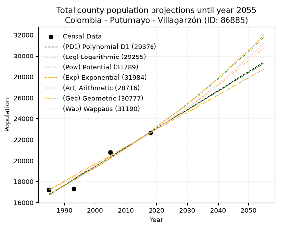
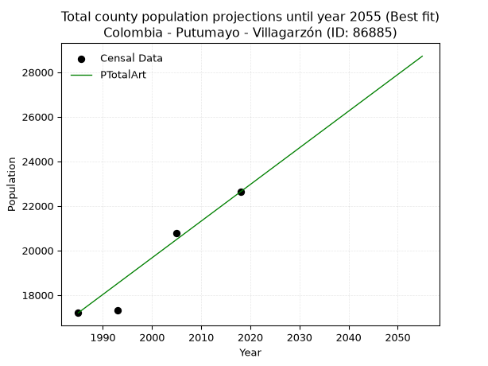
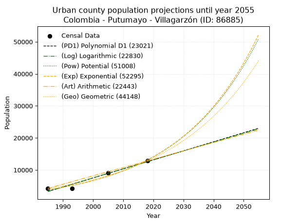
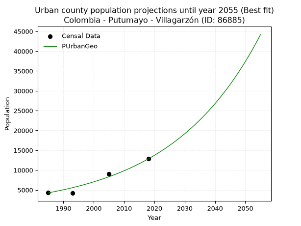
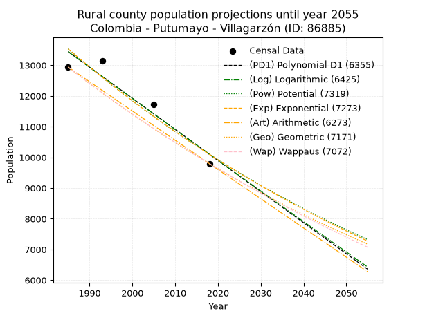
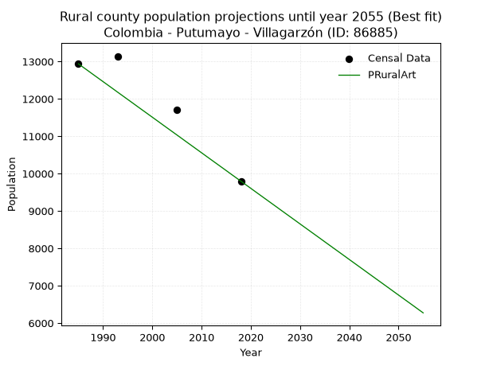

<div align="center">


</div>

# _“Population and Public Services Demand Projections (PPSD) until Year 2050 for Colombia - Putumayo - Villagarzón (ID: 86885)”_
Keywords: `population` `public-service` `projection` `lineal` `polynomial` `logarithmic` `potential` `exponential` `arithmetic` `geometric` `wappaus` `dane` `colombia` `south-america`

PPSD are analytical estimates used by governments and planners to anticipate future changes in population size, age distribution, and the resulting community needs for utilities, healthcare, education, and infrastructure as sizing future water treatment facilities, electrical grids, and road networks based on spatial growth.

> **General running parameters**: • app_version: _v20260806_. • Python version: _3.14.7_. • Pandas version: _3.0.5_. • NumPy version: _2.5.1_. • Creates, save and include plots into reports (create_plot): _False_. • Projection until year: _2050_. • Process polynomial degree 2 and up: _False_. • Process Wappaus: _True_. • Process Wappaus: _True_. • Set negative values to zero: _True_. • Set infinite values to zero: _True_. • Drop dataset notes: _True_. 
<div align="center">

Dynamic map: [:earth_americas:Google](http://maps.google.com/maps?q=1.028821136,-76.6172097) [:earth_americas:OSM](https://www.openstreetmap.org/#map=18/1.028821136/-76.6172097&layers=P) [:earth_americas:Bing](https://www.bing.com/maps?cp=1.028821136~-76.6172097&lvl=18) [:earth_americas:Apple](https://maps.apple.com/frame?center=1.028821136%2C-76.6172097&span=0.003%2C0.006)

</div>


<div align="center">

```geojson
{
  "type": "Feature",
  "geometry": {
    "type": "Point", 
    "coordinates": [-76.6172097, 1.028821136]
  }, 
  "properties": {
    "Name": "Colombia - Putumayo - Villagarzón (ID: 86885)"
  }
}
```

</div>


## 0. Census Data (4 records)

Census data are official statistics collected by a government about the people and housing in a country. They usually include counts of total population, age, sex, race, income, education, and jobs.

📅Global census file: [Population.xlsx](../data/Population.xlsx)

| Source   |   Year |   CountryID | CountryName   |   StateID | StateName   |   CountyID | CountyName   |   PTotal |   PUrban |   PRural |
|:---------|-------:|------------:|:--------------|----------:|:------------|-----------:|:-------------|---------:|---------:|---------:|
| DANE     |   1985 |          57 | Colombia      |        86 | Putumayo    |      86885 | Villagarzón  |    17202 |     4264 |    12938 |
| DANE     |   1993 |          57 | Colombia      |        86 | Putumayo    |      86885 | Villagarzón  |    17320 |     4178 |    13142 |
| DANE     |   2005 |          57 | Colombia      |        86 | Putumayo    |      86885 | Villagarzón  |    20785 |     9069 |    11716 |
| DANE     |   2018 |          57 | Colombia      |        86 | Putumayo    |      86885 | Villagarzón  |    22630 |    12834 |     9796 |

> 🔥Some records could had specific notes about the registered values or the corresponding urban or rural distribution.

## 1. Total

### 1.1. Coefficients and Parameters

* (PD1) Polynomial Deg 1: 180.6676033721382, -341896.1236451195 (lineal)
* (Log) Logarithmic: 361582.7167228065, -2728908.877352097
* (Pow) Potential: 18.374482454697, -56.368919698145305
* (Exp) Exponential: 0.009180436893389423, 0.0002049356113544531
* (Art) Arithmetic: Year diff. 2018 - 1985 = 33, Population diff. 22630 - 17202 = 5428, Annual growth = 164.4848484848485
* (Geo) Geometric: Year diff. 2018 - 1985 = 33, Population diff. 22630 - 17202 = 5428, Annual growth % = 0.008345259562038576
* (Wap) Wappaus: i = 0.8258929929948207, Condition values only valid for < 200)

<sub>
Wappaus condition values: ['0.00', '0.83', '1.65', '2.48', '3.30', '4.13', '4.96', '5.78', '6.61', '7.43', '8.26', '9.08', '9.91', '10.74', '11.56', '12.39', '13.21', '14.04', '14.87', '15.69', '16.52', '17.34', '18.17', '19.00', '19.82', '20.65', '21.47', '22.30', '23.13', '23.95', '24.78', '25.60', '26.43', '27.25', '28.08', '28.91', '29.73', '30.56', '31.38', '32.21', '33.04', '33.86', '34.69', '35.51', '36.34', '37.17', '37.99', '38.82', '39.64', '40.47', '41.29', '42.12', '42.95', '43.77', '44.60', '45.42', '46.25', '47.08', '47.90', '48.73', '49.55', '50.38', '51.21', '52.03', '52.86', '53.68']
</sub>


### 1.2. Projected Dataset

|   Year |   CountyID |   PTotalPD1 |   PTotalLog |   PTotalPow |   PTotalExp |   PTotalArt |   PTotalGeo |   PTotalWap |
|-------:|-----------:|------------:|------------:|------------:|------------:|------------:|------------:|------------:|
|   1985 |      86885 |       16729 |       16724 |       16816 |       16820 |       17202 |       17202 |       17202 |
|   1986 |      86885 |       16910 |       16906 |       16972 |       16976 |       17366 |       17346 |       17345 |
|   1987 |      86885 |       17090 |       17088 |       17130 |       17132 |       17531 |       17490 |       17489 |
|   1988 |      86885 |       17271 |       17270 |       17289 |       17290 |       17695 |       17636 |       17634 |
|   1989 |      86885 |       17452 |       17452 |       17450 |       17450 |       17860 |       17783 |       17780 |
|   1990 |      86885 |       17632 |       17634 |       17612 |       17611 |       18024 |       17932 |       17927 |
|   1991 |      86885 |       17813 |       17815 |       17775 |       17773 |       18189 |       18082 |       18076 |
|   1992 |      86885 |       17994 |       17997 |       17940 |       17937 |       18353 |       18232 |       18226 |
|   1993 |      86885 |       18174 |       18178 |       18106 |       18102 |       18518 |       18385 |       18377 |
|   1994 |      86885 |       18355 |       18360 |       18274 |       18269 |       18682 |       18538 |       18530 |
|   1995 |      86885 |       18536 |       18541 |       18443 |       18438 |       18847 |       18693 |       18684 |
|   1996 |      86885 |       18716 |       18722 |       18613 |       18608 |       19011 |       18849 |       18839 |
|   1997 |      86885 |       18897 |       18903 |       18785 |       18779 |       19176 |       19006 |       18996 |
|   1998 |      86885 |       19078 |       19084 |       18959 |       18953 |       19340 |       19165 |       19154 |
|   1999 |      86885 |       19258 |       19265 |       19134 |       19127 |       19505 |       19325 |       19313 |
|   2000 |      86885 |       19439 |       19446 |       19311 |       19304 |       19669 |       19486 |       19474 |
|   2001 |      86885 |       19620 |       19627 |       19489 |       19482 |       19834 |       19648 |       19636 |
|   2002 |      86885 |       19800 |       19807 |       19669 |       19662 |       19998 |       19812 |       19800 |
|   2003 |      86885 |       19981 |       19988 |       19850 |       19843 |       20163 |       19978 |       19965 |
|   2004 |      86885 |       20162 |       20169 |       20033 |       20026 |       20327 |       20144 |       20131 |
|   2005 |      86885 |       20342 |       20349 |       20217 |       20211 |       20492 |       20313 |       20299 |
|   2006 |      86885 |       20523 |       20529 |       20403 |       20397 |       20656 |       20482 |       20469 |
|   2007 |      86885 |       20704 |       20709 |       20591 |       20585 |       20821 |       20653 |       20640 |
|   2008 |      86885 |       20884 |       20890 |       20780 |       20775 |       20985 |       20825 |       20813 |
|   2009 |      86885 |       21065 |       21070 |       20971 |       20967 |       21150 |       20999 |       20987 |
|   2010 |      86885 |       21246 |       21249 |       21164 |       21160 |       21314 |       21174 |       21163 |
|   2011 |      86885 |       21426 |       21429 |       21358 |       21355 |       21479 |       21351 |       21340 |
|   2012 |      86885 |       21607 |       21609 |       21554 |       21552 |       21643 |       21529 |       21519 |
|   2013 |      86885 |       21788 |       21789 |       21752 |       21751 |       21808 |       21709 |       21700 |
|   2014 |      86885 |       21968 |       21968 |       21951 |       21951 |       21972 |       21890 |       21883 |
|   2015 |      86885 |       22149 |       22148 |       22153 |       22154 |       22137 |       22073 |       22067 |
|   2016 |      86885 |       22330 |       22327 |       22355 |       22358 |       22301 |       22257 |       22253 |
|   2017 |      86885 |       22510 |       22507 |       22560 |       22564 |       22466 |       22443 |       22440 |
|   2018 |      86885 |       22691 |       22686 |       22766 |       22772 |       22630 |       22630 |       22630 |
|   2019 |      86885 |       22872 |       22865 |       22975 |       22982 |       22794 |       22819 |       22821 |
|   2020 |      86885 |       23052 |       23044 |       23185 |       23194 |       22959 |       23009 |       23015 |
|   2021 |      86885 |       23233 |       23223 |       23396 |       23408 |       23123 |       23201 |       23210 |
|   2022 |      86885 |       23414 |       23402 |       23610 |       23624 |       23288 |       23395 |       23407 |
|   2023 |      86885 |       23594 |       23581 |       23826 |       23842 |       23452 |       23590 |       23605 |
|   2024 |      86885 |       23775 |       23759 |       24043 |       24062 |       23617 |       23787 |       23806 |
|   2025 |      86885 |       23956 |       23938 |       24262 |       24284 |       23781 |       23986 |       24009 |
|   2026 |      86885 |       24136 |       24116 |       24483 |       24508 |       23946 |       24186 |       24214 |
|   2027 |      86885 |       24317 |       24295 |       24706 |       24734 |       24110 |       24388 |       24421 |
|   2028 |      86885 |       24498 |       24473 |       24931 |       24962 |       24275 |       24591 |       24630 |
|   2029 |      86885 |       24678 |       24651 |       25158 |       25192 |       24439 |       24796 |       24841 |
|   2030 |      86885 |       24859 |       24830 |       25387 |       25425 |       24604 |       25003 |       25054 |
|   2031 |      86885 |       25040 |       25008 |       25618 |       25659 |       24768 |       25212 |       25270 |
|   2032 |      86885 |       25220 |       25186 |       25850 |       25896 |       24933 |       25422 |       25487 |
|   2033 |      86885 |       25401 |       25364 |       26085 |       26135 |       25097 |       25634 |       25707 |
|   2034 |      86885 |       25582 |       25541 |       26322 |       26376 |       25262 |       25848 |       25929 |
|   2035 |      86885 |       25762 |       25719 |       26561 |       26619 |       25426 |       26064 |       26154 |
|   2036 |      86885 |       25943 |       25897 |       26802 |       26864 |       25591 |       26282 |       26381 |
|   2037 |      86885 |       26124 |       26074 |       27044 |       27112 |       25755 |       26501 |       26610 |
|   2038 |      86885 |       26304 |       26252 |       27289 |       27362 |       25920 |       26722 |       26841 |
|   2039 |      86885 |       26485 |       26429 |       27537 |       27614 |       26084 |       26945 |       27075 |
|   2040 |      86885 |       26666 |       26606 |       27786 |       27869 |       26249 |       27170 |       27312 |
|   2041 |      86885 |       26846 |       26784 |       28037 |       28126 |       26413 |       27397 |       27551 |
|   2042 |      86885 |       27027 |       26961 |       28291 |       28386 |       26578 |       27625 |       27793 |
|   2043 |      86885 |       27208 |       27138 |       28546 |       28647 |       26742 |       27856 |       28037 |
|   2044 |      86885 |       27388 |       27315 |       28804 |       28912 |       26907 |       28088 |       28284 |
|   2045 |      86885 |       27569 |       27492 |       29064 |       29178 |       27071 |       28323 |       28534 |
|   2046 |      86885 |       27750 |       27668 |       29326 |       29447 |       27236 |       28559 |       28786 |
|   2047 |      86885 |       27930 |       27845 |       29591 |       29719 |       27400 |       28797 |       29042 |
|   2048 |      86885 |       28111 |       28022 |       29858 |       29993 |       27565 |       29038 |       29300 |
|   2049 |      86885 |       28292 |       28198 |       30127 |       30270 |       27729 |       29280 |       29561 |
|   2050 |      86885 |       28472 |       28375 |       30398 |       30549 |       27894 |       29524 |       29825 |
<div align="center">

</img>

</div>


### 1.3. Best fit with absolute and relative error (%)

Relative error puts that difference into context by dividing the absolute error by the true value, creating a unitless ratio or percentage that shows the scale of the mistake.

Absolute and relative error

|   Year | Source   |   CountryID | CountryName   |   StateID | StateName   |   CountyID_x | CountyName   |   PTotal |   PUrban |   PRural |   CountyID_y |   PTotalPD1 |   PTotalLog |   PTotalPow |   PTotalExp |   PTotalArt |   PTotalGeo |   PTotalWap |   PTotalPD1AbsError |   PTotalLogAbsError |   PTotalPowAbsError |   PTotalExpAbsError |   PTotalArtAbsError |   PTotalGeoAbsError |   PTotalWapAbsError |   PTotalPD1RelError |   PTotalLogRelError |   PTotalPowRelError |   PTotalExpRelError |   PTotalArtRelError |   PTotalGeoRelError |   PTotalWapRelError |
|-------:|:---------|------------:|:--------------|----------:|:------------|-------------:|:-------------|---------:|---------:|---------:|-------------:|------------:|------------:|------------:|------------:|------------:|------------:|------------:|--------------------:|--------------------:|--------------------:|--------------------:|--------------------:|--------------------:|--------------------:|--------------------:|--------------------:|--------------------:|--------------------:|--------------------:|--------------------:|--------------------:|
|   1985 | DANE     |          57 | Colombia      |        86 | Putumayo    |        86885 | Villagarzón  |    17202 |     4264 |    12938 |        86885 |       16729 |       16724 |       16816 |       16820 |       17202 |       17202 |       17202 |                 473 |                 478 |                 386 |                 382 |                   0 |                   0 |                   0 |            2.74968  |            2.77875  |            2.24393  |            2.22067  |             0       |             0       |             0       |
|   1993 | DANE     |          57 | Colombia      |        86 | Putumayo    |        86885 | Villagarzón  |    17320 |     4178 |    13142 |        86885 |       18174 |       18178 |       18106 |       18102 |       18518 |       18385 |       18377 |                 854 |                 858 |                 786 |                 782 |                1198 |                1065 |                1057 |            4.93072  |            4.95381  |            4.53811  |            4.51501  |             6.91686 |             6.14896 |             6.10277 |
|   2005 | DANE     |          57 | Colombia      |        86 | Putumayo    |        86885 | Villagarzón  |    20785 |     9069 |    11716 |        86885 |       20342 |       20349 |       20217 |       20211 |       20492 |       20313 |       20299 |                 443 |                 436 |                 568 |                 574 |                 293 |                 472 |                 486 |            2.13134  |            2.09767  |            2.73274  |            2.76161  |             1.40967 |             2.27087 |             2.33822 |
|   2018 | DANE     |          57 | Colombia      |        86 | Putumayo    |        86885 | Villagarzón  |    22630 |    12834 |     9796 |        86885 |       22691 |       22686 |       22766 |       22772 |       22630 |       22630 |       22630 |                  61 |                  56 |                 136 |                 142 |                   0 |                   0 |                   0 |            0.269554 |            0.247459 |            0.600972 |            0.627486 |             0       |             0       |             0       |

Relative error mean

| Method    |   RelError | Best   |
|:----------|-----------:|:-------|
| PTotalPD1 |    2.52032 |        |
| PTotalLog |    2.51942 |        |
| PTotalPow |    2.52894 |        |
| PTotalExp |    2.53119 |        |
| PTotalArt |    2.08163 | True   |
| PTotalGeo |    2.10496 |        |
| PTotalWap |    2.11025 |        |

💙Best method: _**PTotalArt**_
<div align="center">

</img>

</div>


### 1.4. Fresh water supply demand in liters per capita per day (lpcd)

The fresh water supply demand typically ranges from 100 to 300 liters per capita per day (lpcd) for standard domestic and municipal planning, though absolute survival minimums set by the World Health Organization are as low as 7.5 to 20 liters per day, and total consumption in high-income nations can exceed 400 liters.

> `CZ`: Level in meters above the sea level (masl).<br> `WS`: Fresh water supply demand in liters per capita per day (lpcd or l/h/d).<br> `WSAll`: Zonal fresh water supply demand in liters per second (l/s).<br> `A`: Zonal area in square meters.

Reference values (RAS Colombia)

|    CZ |   WS |
|------:|-----:|
|  1000 |  120 |
|  2000 |  130 |
| 99999 |  140 |

County shapefile geometry properties and water supply values

|   CountyID |      ATotal |   CZTotal |   WSTotal |
|-----------:|------------:|----------:|----------:|
|      86885 | 1.39769e+09 |   925.702 |       120 |

Projected values for best method: PTotalArt

|   CountyID |   Year |   PTotalArt |   WSTotal |   WSTotalAll |
|-----------:|-------:|------------:|----------:|-------------:|
|      86885 |   1985 |       17202 |       120 |      23.8917 |
|      86885 |   1986 |       17366 |       120 |      24.1194 |
|      86885 |   1987 |       17531 |       120 |      24.3486 |
|      86885 |   1988 |       17695 |       120 |      24.5764 |
|      86885 |   1989 |       17860 |       120 |      24.8056 |
|      86885 |   1990 |       18024 |       120 |      25.0333 |
|      86885 |   1991 |       18189 |       120 |      25.2625 |
|      86885 |   1992 |       18353 |       120 |      25.4903 |
|      86885 |   1993 |       18518 |       120 |      25.7194 |
|      86885 |   1994 |       18682 |       120 |      25.9472 |
|      86885 |   1995 |       18847 |       120 |      26.1764 |
|      86885 |   1996 |       19011 |       120 |      26.4042 |
|      86885 |   1997 |       19176 |       120 |      26.6333 |
|      86885 |   1998 |       19340 |       120 |      26.8611 |
|      86885 |   1999 |       19505 |       120 |      27.0903 |
|      86885 |   2000 |       19669 |       120 |      27.3181 |
|      86885 |   2001 |       19834 |       120 |      27.5472 |
|      86885 |   2002 |       19998 |       120 |      27.775  |
|      86885 |   2003 |       20163 |       120 |      28.0042 |
|      86885 |   2004 |       20327 |       120 |      28.2319 |
|      86885 |   2005 |       20492 |       120 |      28.4611 |
|      86885 |   2006 |       20656 |       120 |      28.6889 |
|      86885 |   2007 |       20821 |       120 |      28.9181 |
|      86885 |   2008 |       20985 |       120 |      29.1458 |
|      86885 |   2009 |       21150 |       120 |      29.375  |
|      86885 |   2010 |       21314 |       120 |      29.6028 |
|      86885 |   2011 |       21479 |       120 |      29.8319 |
|      86885 |   2012 |       21643 |       120 |      30.0597 |
|      86885 |   2013 |       21808 |       120 |      30.2889 |
|      86885 |   2014 |       21972 |       120 |      30.5167 |
|      86885 |   2015 |       22137 |       120 |      30.7458 |
|      86885 |   2016 |       22301 |       120 |      30.9736 |
|      86885 |   2017 |       22466 |       120 |      31.2028 |
|      86885 |   2018 |       22630 |       120 |      31.4306 |
|      86885 |   2019 |       22794 |       120 |      31.6583 |
|      86885 |   2020 |       22959 |       120 |      31.8875 |
|      86885 |   2021 |       23123 |       120 |      32.1153 |
|      86885 |   2022 |       23288 |       120 |      32.3444 |
|      86885 |   2023 |       23452 |       120 |      32.5722 |
|      86885 |   2024 |       23617 |       120 |      32.8014 |
|      86885 |   2025 |       23781 |       120 |      33.0292 |
|      86885 |   2026 |       23946 |       120 |      33.2583 |
|      86885 |   2027 |       24110 |       120 |      33.4861 |
|      86885 |   2028 |       24275 |       120 |      33.7153 |
|      86885 |   2029 |       24439 |       120 |      33.9431 |
|      86885 |   2030 |       24604 |       120 |      34.1722 |
|      86885 |   2031 |       24768 |       120 |      34.4    |
|      86885 |   2032 |       24933 |       120 |      34.6292 |
|      86885 |   2033 |       25097 |       120 |      34.8569 |
|      86885 |   2034 |       25262 |       120 |      35.0861 |
|      86885 |   2035 |       25426 |       120 |      35.3139 |
|      86885 |   2036 |       25591 |       120 |      35.5431 |
|      86885 |   2037 |       25755 |       120 |      35.7708 |
|      86885 |   2038 |       25920 |       120 |      36      |
|      86885 |   2039 |       26084 |       120 |      36.2278 |
|      86885 |   2040 |       26249 |       120 |      36.4569 |
|      86885 |   2041 |       26413 |       120 |      36.6847 |
|      86885 |   2042 |       26578 |       120 |      36.9139 |
|      86885 |   2043 |       26742 |       120 |      37.1417 |
|      86885 |   2044 |       26907 |       120 |      37.3708 |
|      86885 |   2045 |       27071 |       120 |      37.5986 |
|      86885 |   2046 |       27236 |       120 |      37.8278 |
|      86885 |   2047 |       27400 |       120 |      38.0556 |
|      86885 |   2048 |       27565 |       120 |      38.2847 |
|      86885 |   2049 |       27729 |       120 |      38.5125 |
|      86885 |   2050 |       27894 |       120 |      38.7417 |

## 2. Urban

### 2.1. Coefficients and Parameters

* (PD1) Polynomial Deg 1: 281.91850662384326, -556321.2428743425 (lineal)
* (Log) Logarithmic: 564104.1587522901, -4280173.981123186
* (Pow) Potential: 74.8517648141094, -243.26217542982357
* (Exp) Exponential: 0.03740004528606203, 2.1870037487775174e-29
* (Art) Arithmetic: Year diff. 2018 - 1985 = 33, Population diff. 12834 - 4264 = 8570, Annual growth = 259.6969696969697
* (Geo) Geometric: Year diff. 2018 - 1985 = 33, Population diff. 12834 - 4264 = 8570, Annual growth % = 0.03395433585908059
* (Wap) Wappaus: i = 3.0377467504616877, Condition values only valid for < 200)

<sub>
Wappaus condition values: ['0.00', '3.04', '6.08', '9.11', '12.15', '15.19', '18.23', '21.26', '24.30', '27.34', '30.38', '33.42', '36.45', '39.49', '42.53', '45.57', '48.60', '51.64', '54.68', '57.72', '60.75', '63.79', '66.83', '69.87', '72.91', '75.94', '78.98', '82.02', '85.06', '88.09', '91.13', '94.17', '97.21', '100.25', '103.28', '106.32', '109.36', '112.40', '115.43', '118.47', '121.51', '124.55', '127.59', '130.62', '133.66', '136.70', '139.74', '142.77', '145.81', '148.85', '151.89', '154.93', '157.96', '161.00', '164.04', '167.08', '170.11', '173.15', '176.19', '179.23', '182.26', '185.30', '188.34', '191.38', '194.42', '197.45']
</sub>


### 2.2. Projected Dataset

|   Year |   CountyID |   PUrbanPD1 |   PUrbanLog |   PUrbanPow |   PUrbanExp |   PUrbanArt |   PUrbanGeo |   PUrbanWap |
|-------:|-----------:|------------:|------------:|------------:|------------:|------------:|------------:|------------:|
|   1985 |      86885 |        3287 |        3280 |        3811 |        3815 |        4264 |        4264 |        4264 |
|   1986 |      86885 |        3569 |        3564 |        3957 |        3960 |        4524 |        4409 |        4396 |
|   1987 |      86885 |        3851 |        3848 |        4109 |        4111 |        4783 |        4558 |        4531 |
|   1988 |      86885 |        4133 |        4132 |        4267 |        4268 |        5043 |        4713 |        4671 |
|   1989 |      86885 |        4415 |        4416 |        4431 |        4430 |        5303 |        4873 |        4816 |
|   1990 |      86885 |        4697 |        4699 |        4600 |        4599 |        5562 |        5039 |        4965 |
|   1991 |      86885 |        4979 |        4983 |        4777 |        4775 |        5822 |        5210 |        5119 |
|   1992 |      86885 |        5260 |        5266 |        4960 |        4956 |        6082 |        5387 |        5279 |
|   1993 |      86885 |        5542 |        5549 |        5150 |        5145 |        6342 |        5570 |        5444 |
|   1994 |      86885 |        5824 |        5832 |        5347 |        5341 |        6601 |        5759 |        5614 |
|   1995 |      86885 |        6106 |        6115 |        5551 |        5545 |        6861 |        5954 |        5791 |
|   1996 |      86885 |        6388 |        6397 |        5763 |        5756 |        7121 |        6156 |        5975 |
|   1997 |      86885 |        6670 |        6680 |        5983 |        5976 |        7380 |        6366 |        6165 |
|   1998 |      86885 |        6952 |        6962 |        6212 |        6203 |        7640 |        6582 |        6362 |
|   1999 |      86885 |        7234 |        7245 |        6449 |        6440 |        7900 |        6805 |        6567 |
|   2000 |      86885 |        7516 |        7527 |        6695 |        6685 |        8159 |        7036 |        6780 |
|   2001 |      86885 |        7798 |        7809 |        6950 |        6940 |        8419 |        7275 |        7002 |
|   2002 |      86885 |        8080 |        8091 |        7215 |        7204 |        8679 |        7522 |        7232 |
|   2003 |      86885 |        8362 |        8372 |        7490 |        7479 |        8939 |        7778 |        7473 |
|   2004 |      86885 |        8643 |        8654 |        7775 |        7764 |        9198 |        8042 |        7723 |
|   2005 |      86885 |        8925 |        8935 |        8071 |        8060 |        9458 |        8315 |        7985 |
|   2006 |      86885 |        9207 |        9216 |        8378 |        8367 |        9718 |        8597 |        8258 |
|   2007 |      86885 |        9489 |        9498 |        8696 |        8686 |        9977 |        8889 |        8544 |
|   2008 |      86885 |        9771 |        9779 |        9026 |        9017 |       10237 |        9191 |        8843 |
|   2009 |      86885 |       10053 |       10059 |        9369 |        9361 |       10497 |        9503 |        9156 |
|   2010 |      86885 |       10335 |       10340 |        9725 |        9717 |       10756 |        9825 |        9485 |
|   2011 |      86885 |       10617 |       10621 |       10094 |       10088 |       11016 |       10159 |        9830 |
|   2012 |      86885 |       10899 |       10901 |       10476 |       10472 |       11276 |       10504 |       10193 |
|   2013 |      86885 |       11181 |       11182 |       10873 |       10871 |       11536 |       10861 |       10575 |
|   2014 |      86885 |       11463 |       11462 |       11285 |       11285 |       11795 |       11229 |       10977 |
|   2015 |      86885 |       11745 |       11742 |       11712 |       11715 |       12055 |       11611 |       11403 |
|   2016 |      86885 |       12026 |       12022 |       12155 |       12162 |       12315 |       12005 |       11852 |
|   2017 |      86885 |       12308 |       12301 |       12615 |       12625 |       12574 |       12413 |       12329 |
|   2018 |      86885 |       12590 |       12581 |       13092 |       13106 |       12834 |       12834 |       12834 |
|   2019 |      86885 |       12872 |       12860 |       13587 |       13606 |       13094 |       13270 |       13371 |
|   2020 |      86885 |       13154 |       13140 |       14100 |       14124 |       13353 |       13720 |       13943 |
|   2021 |      86885 |       13436 |       13419 |       14632 |       14663 |       13613 |       14186 |       14553 |
|   2022 |      86885 |       13718 |       13698 |       15184 |       15221 |       13873 |       14668 |       15206 |
|   2023 |      86885 |       14000 |       13977 |       15756 |       15801 |       14132 |       15166 |       15905 |
|   2024 |      86885 |       14282 |       14256 |       16350 |       16404 |       14392 |       15681 |       16656 |
|   2025 |      86885 |       14564 |       14534 |       16966 |       17029 |       14652 |       16213 |       17466 |
|   2026 |      86885 |       14846 |       14813 |       17604 |       17678 |       14912 |       16764 |       18341 |
|   2027 |      86885 |       15128 |       15091 |       18267 |       18351 |       15171 |       17333 |       19289 |
|   2028 |      86885 |       15409 |       15369 |       18954 |       19051 |       15431 |       17922 |       20321 |
|   2029 |      86885 |       15691 |       15647 |       19666 |       19777 |       15691 |       18530 |       21446 |
|   2030 |      86885 |       15973 |       15925 |       20405 |       20530 |       15950 |       19159 |       22680 |
|   2031 |      86885 |       16255 |       16203 |       21171 |       21313 |       16210 |       19810 |       24038 |
|   2032 |      86885 |       16537 |       16481 |       21966 |       22125 |       16470 |       20482 |       25541 |
|   2033 |      86885 |       16819 |       16758 |       22790 |       22968 |       16729 |       21178 |       27212 |
|   2034 |      86885 |       17101 |       17036 |       23645 |       23843 |       16989 |       21897 |       29081 |
|   2035 |      86885 |       17383 |       17313 |       24531 |       24752 |       17249 |       22640 |       31186 |
|   2036 |      86885 |       17665 |       17590 |       25450 |       25695 |       17509 |       23409 |       33575 |
|   2037 |      86885 |       17947 |       17867 |       26402 |       26674 |       17768 |       24204 |       36310 |
|   2038 |      86885 |       18229 |       18144 |       27390 |       27691 |       18028 |       25026 |       39470 |
|   2039 |      86885 |       18511 |       18421 |       28415 |       28746 |       18288 |       25876 |       43164 |
|   2040 |      86885 |       18793 |       18697 |       29477 |       29842 |       18547 |       26754 |       47540 |
|   2041 |      86885 |       19074 |       18974 |       30578 |       30979 |       18807 |       27663 |       52806 |
|   2042 |      86885 |       19356 |       19250 |       31720 |       32159 |       19067 |       28602 |       59263 |
|   2043 |      86885 |       19638 |       19526 |       32904 |       33385 |       19326 |       29573 |       67368 |
|   2044 |      86885 |       19920 |       19802 |       34132 |       34657 |       19586 |       30577 |       77843 |
|   2045 |      86885 |       20202 |       20078 |       35405 |       35978 |       19846 |       31615 |       91906 |
|   2046 |      86885 |       20484 |       20354 |       36724 |       37349 |       20106 |       32689 |      111783 |
|   2047 |      86885 |       20766 |       20630 |       38092 |       38772 |       20365 |       33799 |      142018 |
|   2048 |      86885 |       21048 |       20905 |       39511 |       40250 |       20625 |       34946 |      193557 |
|   2049 |      86885 |       21330 |       21181 |       40981 |       41784 |       20885 |       36133 |      301169 |
|   2050 |      86885 |       21612 |       21456 |       42506 |       43376 |       21144 |       37360 |      665528 |
<div align="center">

</img>

</div>


### 2.3. Best fit with absolute and relative error (%)

Relative error puts that difference into context by dividing the absolute error by the true value, creating a unitless ratio or percentage that shows the scale of the mistake.

Absolute and relative error

|   Year | Source   |   CountryID | CountryName   |   StateID | StateName   |   CountyID_x | CountyName   |   PTotal |   PUrban |   PRural |   CountyID_y |   PUrbanPD1 |   PUrbanLog |   PUrbanPow |   PUrbanExp |   PUrbanArt |   PUrbanGeo |   PUrbanWap |   PUrbanPD1AbsError |   PUrbanLogAbsError |   PUrbanPowAbsError |   PUrbanExpAbsError |   PUrbanArtAbsError |   PUrbanGeoAbsError |   PUrbanWapAbsError |   PUrbanPD1RelError |   PUrbanLogRelError |   PUrbanPowRelError |   PUrbanExpRelError |   PUrbanArtRelError |   PUrbanGeoRelError |   PUrbanWapRelError |
|-------:|:---------|------------:|:--------------|----------:|:------------|-------------:|:-------------|---------:|---------:|---------:|-------------:|------------:|------------:|------------:|------------:|------------:|------------:|------------:|--------------------:|--------------------:|--------------------:|--------------------:|--------------------:|--------------------:|--------------------:|--------------------:|--------------------:|--------------------:|--------------------:|--------------------:|--------------------:|--------------------:|
|   1985 | DANE     |          57 | Colombia      |        86 | Putumayo    |        86885 | Villagarzón  |    17202 |     4264 |    12938 |        86885 |        3287 |        3280 |        3811 |        3815 |        4264 |        4264 |        4264 |                 977 |                 984 |                 453 |                 449 |                   0 |                   0 |                   0 |            22.9128  |            23.0769  |            10.6238  |            10.53    |             0       |             0       |              0      |
|   1993 | DANE     |          57 | Colombia      |        86 | Putumayo    |        86885 | Villagarzón  |    17320 |     4178 |    13142 |        86885 |        5542 |        5549 |        5150 |        5145 |        6342 |        5570 |        5444 |                1364 |                1371 |                 972 |                 967 |                2164 |                1392 |                1266 |            32.6472  |            32.8147  |            23.2647  |            23.145   |            51.7951  |            33.3174  |             30.3016 |
|   2005 | DANE     |          57 | Colombia      |        86 | Putumayo    |        86885 | Villagarzón  |    20785 |     9069 |    11716 |        86885 |        8925 |        8935 |        8071 |        8060 |        9458 |        8315 |        7985 |                 144 |                 134 |                 998 |                1009 |                 389 |                 754 |                1084 |             1.58783 |             1.47756 |            11.0045  |            11.1258  |             4.28934 |             8.31404 |             11.9528 |
|   2018 | DANE     |          57 | Colombia      |        86 | Putumayo    |        86885 | Villagarzón  |    22630 |    12834 |     9796 |        86885 |       12590 |       12581 |       13092 |       13106 |       12834 |       12834 |       12834 |                 244 |                 253 |                 258 |                 272 |                   0 |                   0 |                   0 |             1.9012  |             1.97133 |             2.01029 |             2.11937 |             0       |             0       |              0      |

Relative error mean

| Method    |   RelError | Best   |
|:----------|-----------:|:-------|
| PUrbanPD1 |    14.7622 |        |
| PUrbanLog |    14.8351 |        |
| PUrbanPow |    11.7258 |        |
| PUrbanExp |    11.7301 |        |
| PUrbanArt |    14.0211 |        |
| PUrbanGeo |    10.4079 | True   |
| PUrbanWap |    10.5636 |        |

💙Best method: _**PUrbanGeo**_
<div align="center">

</img>

</div>


### 2.4. Fresh water supply demand in liters per capita per day (lpcd)

The fresh water supply demand typically ranges from 100 to 300 liters per capita per day (lpcd) for standard domestic and municipal planning, though absolute survival minimums set by the World Health Organization are as low as 7.5 to 20 liters per day, and total consumption in high-income nations can exceed 400 liters.

> `CZ`: Level in meters above the sea level (masl).<br> `WS`: Fresh water supply demand in liters per capita per day (lpcd or l/h/d).<br> `WSAll`: Zonal fresh water supply demand in liters per second (l/s).<br> `A`: Zonal area in square meters.

Reference values (RAS Colombia)

|    CZ |   WS |
|------:|-----:|
|  1000 |  120 |
|  2000 |  130 |
| 99999 |  140 |

County shapefile geometry properties and water supply values

|   CountyID |      AUrban |   CZUrban |   WSUrban |
|-----------:|------------:|----------:|----------:|
|      86885 | 2.44839e+06 |   422.082 |       120 |

Projected values for best method: PUrbanGeo

|   CountyID |   Year |   PUrbanGeo |   WSUrban |   WSUrbanAll |
|-----------:|-------:|------------:|----------:|-------------:|
|      86885 |   1985 |        4264 |       120 |      5.92222 |
|      86885 |   1986 |        4409 |       120 |      6.12361 |
|      86885 |   1987 |        4558 |       120 |      6.33056 |
|      86885 |   1988 |        4713 |       120 |      6.54583 |
|      86885 |   1989 |        4873 |       120 |      6.76806 |
|      86885 |   1990 |        5039 |       120 |      6.99861 |
|      86885 |   1991 |        5210 |       120 |      7.23611 |
|      86885 |   1992 |        5387 |       120 |      7.48194 |
|      86885 |   1993 |        5570 |       120 |      7.73611 |
|      86885 |   1994 |        5759 |       120 |      7.99861 |
|      86885 |   1995 |        5954 |       120 |      8.26944 |
|      86885 |   1996 |        6156 |       120 |      8.55    |
|      86885 |   1997 |        6366 |       120 |      8.84167 |
|      86885 |   1998 |        6582 |       120 |      9.14167 |
|      86885 |   1999 |        6805 |       120 |      9.45139 |
|      86885 |   2000 |        7036 |       120 |      9.77222 |
|      86885 |   2001 |        7275 |       120 |     10.1042  |
|      86885 |   2002 |        7522 |       120 |     10.4472  |
|      86885 |   2003 |        7778 |       120 |     10.8028  |
|      86885 |   2004 |        8042 |       120 |     11.1694  |
|      86885 |   2005 |        8315 |       120 |     11.5486  |
|      86885 |   2006 |        8597 |       120 |     11.9403  |
|      86885 |   2007 |        8889 |       120 |     12.3458  |
|      86885 |   2008 |        9191 |       120 |     12.7653  |
|      86885 |   2009 |        9503 |       120 |     13.1986  |
|      86885 |   2010 |        9825 |       120 |     13.6458  |
|      86885 |   2011 |       10159 |       120 |     14.1097  |
|      86885 |   2012 |       10504 |       120 |     14.5889  |
|      86885 |   2013 |       10861 |       120 |     15.0847  |
|      86885 |   2014 |       11229 |       120 |     15.5958  |
|      86885 |   2015 |       11611 |       120 |     16.1264  |
|      86885 |   2016 |       12005 |       120 |     16.6736  |
|      86885 |   2017 |       12413 |       120 |     17.2403  |
|      86885 |   2018 |       12834 |       120 |     17.825   |
|      86885 |   2019 |       13270 |       120 |     18.4306  |
|      86885 |   2020 |       13720 |       120 |     19.0556  |
|      86885 |   2021 |       14186 |       120 |     19.7028  |
|      86885 |   2022 |       14668 |       120 |     20.3722  |
|      86885 |   2023 |       15166 |       120 |     21.0639  |
|      86885 |   2024 |       15681 |       120 |     21.7792  |
|      86885 |   2025 |       16213 |       120 |     22.5181  |
|      86885 |   2026 |       16764 |       120 |     23.2833  |
|      86885 |   2027 |       17333 |       120 |     24.0736  |
|      86885 |   2028 |       17922 |       120 |     24.8917  |
|      86885 |   2029 |       18530 |       120 |     25.7361  |
|      86885 |   2030 |       19159 |       120 |     26.6097  |
|      86885 |   2031 |       19810 |       120 |     27.5139  |
|      86885 |   2032 |       20482 |       120 |     28.4472  |
|      86885 |   2033 |       21178 |       120 |     29.4139  |
|      86885 |   2034 |       21897 |       120 |     30.4125  |
|      86885 |   2035 |       22640 |       120 |     31.4444  |
|      86885 |   2036 |       23409 |       120 |     32.5125  |
|      86885 |   2037 |       24204 |       120 |     33.6167  |
|      86885 |   2038 |       25026 |       120 |     34.7583  |
|      86885 |   2039 |       25876 |       120 |     35.9389  |
|      86885 |   2040 |       26754 |       120 |     37.1583  |
|      86885 |   2041 |       27663 |       120 |     38.4208  |
|      86885 |   2042 |       28602 |       120 |     39.725   |
|      86885 |   2043 |       29573 |       120 |     41.0736  |
|      86885 |   2044 |       30577 |       120 |     42.4681  |
|      86885 |   2045 |       31615 |       120 |     43.9097  |
|      86885 |   2046 |       32689 |       120 |     45.4014  |
|      86885 |   2047 |       33799 |       120 |     46.9431  |
|      86885 |   2048 |       34946 |       120 |     48.5361  |
|      86885 |   2049 |       36133 |       120 |     50.1847  |
|      86885 |   2050 |       37360 |       120 |     51.8889  |

## 3. Rural

### 3.1. Coefficients and Parameters

* (PD1) Polynomial Deg 1: -101.25090325170488, 214425.11922922274 (lineal)
* (Log) Logarithmic: -202521.44202948362, 1551265.103771089
* (Pow) Potential: -17.73698431476471, 62.62371953291014
* (Exp) Exponential: -0.008868148452426693, 597486241964.9238
* (Art) Arithmetic: Year diff. 2018 - 1985 = 33, Population diff. 9796 - 12938 = -3142, Annual growth = -95.21212121212122
* (Geo) Geometric: Year diff. 2018 - 1985 = 33, Population diff. 9796 - 12938 = -3142, Annual growth % = -0.008394704764802752
* (Wap) Wappaus: i = -0.8376187315221361, Condition values only valid for < 200)

<sub>
Wappaus condition values: ['-0.00', '-0.84', '-1.68', '-2.51', '-3.35', '-4.19', '-5.03', '-5.86', '-6.70', '-7.54', '-8.38', '-9.21', '-10.05', '-10.89', '-11.73', '-12.56', '-13.40', '-14.24', '-15.08', '-15.91', '-16.75', '-17.59', '-18.43', '-19.27', '-20.10', '-20.94', '-21.78', '-22.62', '-23.45', '-24.29', '-25.13', '-25.97', '-26.80', '-27.64', '-28.48', '-29.32', '-30.15', '-30.99', '-31.83', '-32.67', '-33.50', '-34.34', '-35.18', '-36.02', '-36.86', '-37.69', '-38.53', '-39.37', '-40.21', '-41.04', '-41.88', '-42.72', '-43.56', '-44.39', '-45.23', '-46.07', '-46.91', '-47.74', '-48.58', '-49.42', '-50.26', '-51.09', '-51.93', '-52.77', '-53.61', '-54.45']
</sub>


### 3.2. Projected Dataset

|   Year |   CountyID |   PRuralPD1 |   PRuralLog |   PRuralPow |   PRuralExp |   PRuralArt |   PRuralGeo |   PRuralWap |
|-------:|-----------:|------------:|------------:|------------:|------------:|------------:|------------:|------------:|
|   1985 |      86885 |       13442 |       13444 |       13533 |       13531 |       12938 |       12938 |       12938 |
|   1986 |      86885 |       13341 |       13342 |       13413 |       13411 |       12843 |       12829 |       12830 |
|   1987 |      86885 |       13240 |       13240 |       13293 |       13293 |       12748 |       12722 |       12723 |
|   1988 |      86885 |       13138 |       13138 |       13175 |       13176 |       12652 |       12615 |       12617 |
|   1989 |      86885 |       13037 |       13036 |       13058 |       13059 |       12557 |       12509 |       12512 |
|   1990 |      86885 |       12936 |       12935 |       12942 |       12944 |       12462 |       12404 |       12407 |
|   1991 |      86885 |       12835 |       12833 |       12828 |       12830 |       12367 |       12300 |       12304 |
|   1992 |      86885 |       12733 |       12731 |       12714 |       12716 |       12272 |       12197 |       12201 |
|   1993 |      86885 |       12632 |       12629 |       12601 |       12604 |       12176 |       12094 |       12099 |
|   1994 |      86885 |       12531 |       12528 |       12490 |       12493 |       12081 |       11993 |       11998 |
|   1995 |      86885 |       12430 |       12426 |       12379 |       12383 |       11986 |       11892 |       11898 |
|   1996 |      86885 |       12328 |       12325 |       12269 |       12273 |       11891 |       11792 |       11798 |
|   1997 |      86885 |       12227 |       12223 |       12161 |       12165 |       11795 |       11693 |       11700 |
|   1998 |      86885 |       12126 |       12122 |       12053 |       12057 |       11700 |       11595 |       11602 |
|   1999 |      86885 |       12025 |       12021 |       11947 |       11951 |       11605 |       11498 |       11505 |
|   2000 |      86885 |       11923 |       11919 |       11841 |       11845 |       11510 |       11401 |       11409 |
|   2001 |      86885 |       11822 |       11818 |       11737 |       11741 |       11415 |       11305 |       11313 |
|   2002 |      86885 |       11721 |       11717 |       11633 |       11637 |       11319 |       11211 |       11218 |
|   2003 |      86885 |       11620 |       11616 |       11531 |       11534 |       11224 |       11116 |       11124 |
|   2004 |      86885 |       11518 |       11515 |       11429 |       11433 |       11129 |       11023 |       11031 |
|   2005 |      86885 |       11417 |       11414 |       11328 |       11332 |       11034 |       10931 |       10938 |
|   2006 |      86885 |       11316 |       11313 |       11229 |       11232 |       10939 |       10839 |       10846 |
|   2007 |      86885 |       11215 |       11212 |       11130 |       11132 |       10843 |       10748 |       10755 |
|   2008 |      86885 |       11113 |       11111 |       11032 |       11034 |       10748 |       10658 |       10664 |
|   2009 |      86885 |       11012 |       11010 |       10935 |       10937 |       10653 |       10568 |       10575 |
|   2010 |      86885 |       10911 |       10909 |       10839 |       10840 |       10558 |       10479 |       10486 |
|   2011 |      86885 |       10810 |       10809 |       10744 |       10745 |       10462 |       10391 |       10397 |
|   2012 |      86885 |       10708 |       10708 |       10649 |       10650 |       10367 |       10304 |       10309 |
|   2013 |      86885 |       10607 |       10607 |       10556 |       10556 |       10272 |       10218 |       10222 |
|   2014 |      86885 |       10506 |       10507 |       10463 |       10462 |       10177 |       10132 |       10136 |
|   2015 |      86885 |       10405 |       10406 |       10372 |       10370 |       10082 |       10047 |       10050 |
|   2016 |      86885 |       10303 |       10306 |       10281 |       10279 |        9986 |        9963 |        9965 |
|   2017 |      86885 |       10202 |       10205 |       10191 |       10188 |        9891 |        9879 |        9880 |
|   2018 |      86885 |       10101 |       10105 |       10101 |       10098 |        9796 |        9796 |        9796 |
|   2019 |      86885 |       10000 |       10005 |       10013 |       10009 |        9701 |        9714 |        9713 |
|   2020 |      86885 |        9898 |        9904 |        9926 |        9920 |        9606 |        9632 |        9630 |
|   2021 |      86885 |        9797 |        9804 |        9839 |        9833 |        9510 |        9551 |        9548 |
|   2022 |      86885 |        9696 |        9704 |        9753 |        9746 |        9415 |        9471 |        9466 |
|   2023 |      86885 |        9595 |        9604 |        9668 |        9660 |        9320 |        9392 |        9385 |
|   2024 |      86885 |        9493 |        9504 |        9583 |        9575 |        9225 |        9313 |        9305 |
|   2025 |      86885 |        9392 |        9404 |        9500 |        9490 |        9130 |        9235 |        9225 |
|   2026 |      86885 |        9291 |        9304 |        9417 |        9406 |        9034 |        9157 |        9146 |
|   2027 |      86885 |        9190 |        9204 |        9335 |        9323 |        8939 |        9080 |        9067 |
|   2028 |      86885 |        9088 |        9104 |        9254 |        9241 |        8844 |        9004 |        8989 |
|   2029 |      86885 |        8987 |        9004 |        9173 |        9159 |        8749 |        8928 |        8912 |
|   2030 |      86885 |        8886 |        8904 |        9093 |        9078 |        8653 |        8853 |        8835 |
|   2031 |      86885 |        8785 |        8804 |        9014 |        8998 |        8558 |        8779 |        8758 |
|   2032 |      86885 |        8683 |        8705 |        8936 |        8919 |        8463 |        8705 |        8682 |
|   2033 |      86885 |        8582 |        8605 |        8858 |        8840 |        8368 |        8632 |        8607 |
|   2034 |      86885 |        8481 |        8505 |        8781 |        8762 |        8273 |        8560 |        8532 |
|   2035 |      86885 |        8380 |        8406 |        8705 |        8685 |        8177 |        8488 |        8458 |
|   2036 |      86885 |        8278 |        8306 |        8629 |        8608 |        8082 |        8417 |        8384 |
|   2037 |      86885 |        8177 |        8207 |        8555 |        8532 |        7987 |        8346 |        8310 |
|   2038 |      86885 |        8076 |        8108 |        8480 |        8457 |        7892 |        8276 |        8238 |
|   2039 |      86885 |        7975 |        8008 |        8407 |        8382 |        7797 |        8207 |        8165 |
|   2040 |      86885 |        7873 |        7909 |        8334 |        8308 |        7701 |        8138 |        8093 |
|   2041 |      86885 |        7772 |        7810 |        8262 |        8235 |        7606 |        8069 |        8022 |
|   2042 |      86885 |        7671 |        7710 |        8191 |        8162 |        7511 |        8002 |        7951 |
|   2043 |      86885 |        7570 |        7611 |        8120 |        8090 |        7416 |        7935 |        7881 |
|   2044 |      86885 |        7468 |        7512 |        8050 |        8018 |        7320 |        7868 |        7811 |
|   2045 |      86885 |        7367 |        7413 |        7980 |        7948 |        7225 |        7802 |        7742 |
|   2046 |      86885 |        7266 |        7314 |        7911 |        7877 |        7130 |        7736 |        7673 |
|   2047 |      86885 |        7165 |        7215 |        7843 |        7808 |        7035 |        7671 |        7604 |
|   2048 |      86885 |        7063 |        7116 |        7775 |        7739 |        6940 |        7607 |        7536 |
|   2049 |      86885 |        6962 |        7017 |        7708 |        7671 |        6844 |        7543 |        7468 |
|   2050 |      86885 |        6861 |        6919 |        7642 |        7603 |        6749 |        7480 |        7401 |
<div align="center">

</img>

</div>


### 3.3. Best fit with absolute and relative error (%)

Relative error puts that difference into context by dividing the absolute error by the true value, creating a unitless ratio or percentage that shows the scale of the mistake.

Absolute and relative error

|   Year | Source   |   CountryID | CountryName   |   StateID | StateName   |   CountyID_x | CountyName   |   PTotal |   PUrban |   PRural |   CountyID_y |   PRuralPD1 |   PRuralLog |   PRuralPow |   PRuralExp |   PRuralArt |   PRuralGeo |   PRuralWap |   PRuralPD1AbsError |   PRuralLogAbsError |   PRuralPowAbsError |   PRuralExpAbsError |   PRuralArtAbsError |   PRuralGeoAbsError |   PRuralWapAbsError |   PRuralPD1RelError |   PRuralLogRelError |   PRuralPowRelError |   PRuralExpRelError |   PRuralArtRelError |   PRuralGeoRelError |   PRuralWapRelError |
|-------:|:---------|------------:|:--------------|----------:|:------------|-------------:|:-------------|---------:|---------:|---------:|-------------:|------------:|------------:|------------:|------------:|------------:|------------:|------------:|--------------------:|--------------------:|--------------------:|--------------------:|--------------------:|--------------------:|--------------------:|--------------------:|--------------------:|--------------------:|--------------------:|--------------------:|--------------------:|--------------------:|
|   1985 | DANE     |          57 | Colombia      |        86 | Putumayo    |        86885 | Villagarzón  |    17202 |     4264 |    12938 |        86885 |       13442 |       13444 |       13533 |       13531 |       12938 |       12938 |       12938 |                 504 |                 506 |                 595 |                 593 |                   0 |                   0 |                   0 |             3.8955  |             3.91096 |             4.59886 |             4.5834  |             0       |             0       |             0       |
|   1993 | DANE     |          57 | Colombia      |        86 | Putumayo    |        86885 | Villagarzón  |    17320 |     4178 |    13142 |        86885 |       12632 |       12629 |       12601 |       12604 |       12176 |       12094 |       12099 |                 510 |                 513 |                 541 |                 538 |                 966 |                1048 |                1043 |             3.88069 |             3.90352 |             4.11657 |             4.09375 |             7.35048 |             7.97443 |             7.93639 |
|   2005 | DANE     |          57 | Colombia      |        86 | Putumayo    |        86885 | Villagarzón  |    20785 |     9069 |    11716 |        86885 |       11417 |       11414 |       11328 |       11332 |       11034 |       10931 |       10938 |                 299 |                 302 |                 388 |                 384 |                 682 |                 785 |                 778 |             2.55207 |             2.57767 |             3.31171 |             3.27757 |             5.8211  |             6.70024 |             6.64049 |
|   2018 | DANE     |          57 | Colombia      |        86 | Putumayo    |        86885 | Villagarzón  |    22630 |    12834 |     9796 |        86885 |       10101 |       10105 |       10101 |       10098 |        9796 |        9796 |        9796 |                 305 |                 309 |                 305 |                 302 |                   0 |                   0 |                   0 |             3.11352 |             3.15435 |             3.11352 |             3.08289 |             0       |             0       |             0       |

Relative error mean

| Method    |   RelError | Best   |
|:----------|-----------:|:-------|
| PRuralPD1 |    3.36044 |        |
| PRuralLog |    3.38662 |        |
| PRuralPow |    3.78516 |        |
| PRuralExp |    3.7594  |        |
| PRuralArt |    3.29289 | True   |
| PRuralGeo |    3.66867 |        |
| PRuralWap |    3.64422 |        |

💙Best method: _**PRuralArt**_
<div align="center">

</img>

</div>


### 3.4. Fresh water supply demand in liters per capita per day (lpcd)

The fresh water supply demand typically ranges from 100 to 300 liters per capita per day (lpcd) for standard domestic and municipal planning, though absolute survival minimums set by the World Health Organization are as low as 7.5 to 20 liters per day, and total consumption in high-income nations can exceed 400 liters.

> `CZ`: Level in meters above the sea level (masl).<br> `WS`: Fresh water supply demand in liters per capita per day (lpcd or l/h/d).<br> `WSAll`: Zonal fresh water supply demand in liters per second (l/s).<br> `A`: Zonal area in square meters.

Reference values (RAS Colombia)

|    CZ |   WS |
|------:|-----:|
|  1000 |  120 |
|  2000 |  130 |
| 99999 |  140 |

County shapefile geometry properties and water supply values

|   CountyID |      ARural |   CZRural |   WSRural |
|-----------:|------------:|----------:|----------:|
|      86885 | 1.39524e+09 |   926.596 |       120 |

Projected values for best method: PRuralArt

|   CountyID |   Year |   PRuralArt |   WSRural |   WSRuralAll |
|-----------:|-------:|------------:|----------:|-------------:|
|      86885 |   1985 |       12938 |       120 |     17.9694  |
|      86885 |   1986 |       12843 |       120 |     17.8375  |
|      86885 |   1987 |       12748 |       120 |     17.7056  |
|      86885 |   1988 |       12652 |       120 |     17.5722  |
|      86885 |   1989 |       12557 |       120 |     17.4403  |
|      86885 |   1990 |       12462 |       120 |     17.3083  |
|      86885 |   1991 |       12367 |       120 |     17.1764  |
|      86885 |   1992 |       12272 |       120 |     17.0444  |
|      86885 |   1993 |       12176 |       120 |     16.9111  |
|      86885 |   1994 |       12081 |       120 |     16.7792  |
|      86885 |   1995 |       11986 |       120 |     16.6472  |
|      86885 |   1996 |       11891 |       120 |     16.5153  |
|      86885 |   1997 |       11795 |       120 |     16.3819  |
|      86885 |   1998 |       11700 |       120 |     16.25    |
|      86885 |   1999 |       11605 |       120 |     16.1181  |
|      86885 |   2000 |       11510 |       120 |     15.9861  |
|      86885 |   2001 |       11415 |       120 |     15.8542  |
|      86885 |   2002 |       11319 |       120 |     15.7208  |
|      86885 |   2003 |       11224 |       120 |     15.5889  |
|      86885 |   2004 |       11129 |       120 |     15.4569  |
|      86885 |   2005 |       11034 |       120 |     15.325   |
|      86885 |   2006 |       10939 |       120 |     15.1931  |
|      86885 |   2007 |       10843 |       120 |     15.0597  |
|      86885 |   2008 |       10748 |       120 |     14.9278  |
|      86885 |   2009 |       10653 |       120 |     14.7958  |
|      86885 |   2010 |       10558 |       120 |     14.6639  |
|      86885 |   2011 |       10462 |       120 |     14.5306  |
|      86885 |   2012 |       10367 |       120 |     14.3986  |
|      86885 |   2013 |       10272 |       120 |     14.2667  |
|      86885 |   2014 |       10177 |       120 |     14.1347  |
|      86885 |   2015 |       10082 |       120 |     14.0028  |
|      86885 |   2016 |        9986 |       120 |     13.8694  |
|      86885 |   2017 |        9891 |       120 |     13.7375  |
|      86885 |   2018 |        9796 |       120 |     13.6056  |
|      86885 |   2019 |        9701 |       120 |     13.4736  |
|      86885 |   2020 |        9606 |       120 |     13.3417  |
|      86885 |   2021 |        9510 |       120 |     13.2083  |
|      86885 |   2022 |        9415 |       120 |     13.0764  |
|      86885 |   2023 |        9320 |       120 |     12.9444  |
|      86885 |   2024 |        9225 |       120 |     12.8125  |
|      86885 |   2025 |        9130 |       120 |     12.6806  |
|      86885 |   2026 |        9034 |       120 |     12.5472  |
|      86885 |   2027 |        8939 |       120 |     12.4153  |
|      86885 |   2028 |        8844 |       120 |     12.2833  |
|      86885 |   2029 |        8749 |       120 |     12.1514  |
|      86885 |   2030 |        8653 |       120 |     12.0181  |
|      86885 |   2031 |        8558 |       120 |     11.8861  |
|      86885 |   2032 |        8463 |       120 |     11.7542  |
|      86885 |   2033 |        8368 |       120 |     11.6222  |
|      86885 |   2034 |        8273 |       120 |     11.4903  |
|      86885 |   2035 |        8177 |       120 |     11.3569  |
|      86885 |   2036 |        8082 |       120 |     11.225   |
|      86885 |   2037 |        7987 |       120 |     11.0931  |
|      86885 |   2038 |        7892 |       120 |     10.9611  |
|      86885 |   2039 |        7797 |       120 |     10.8292  |
|      86885 |   2040 |        7701 |       120 |     10.6958  |
|      86885 |   2041 |        7606 |       120 |     10.5639  |
|      86885 |   2042 |        7511 |       120 |     10.4319  |
|      86885 |   2043 |        7416 |       120 |     10.3     |
|      86885 |   2044 |        7320 |       120 |     10.1667  |
|      86885 |   2045 |        7225 |       120 |     10.0347  |
|      86885 |   2046 |        7130 |       120 |      9.90278 |
|      86885 |   2047 |        7035 |       120 |      9.77083 |
|      86885 |   2048 |        6940 |       120 |      9.63889 |
|      86885 |   2049 |        6844 |       120 |      9.50556 |
|      86885 |   2050 |        6749 |       120 |      9.37361 |

<div align="center"><br><sub>Share this research</sub></div><br>

<sub>**APPS & TOOLS & CONTENT DISCLAIMER**: • NO WARRANTY - This content and software is provided by <a href="https://github.com/rcfdtools" target="_blank">github.com/rcfdtools</a> "as is", without any express or implied warranty, including warranties of merchantability, fitness for a particular purpose, or non-infringement. There is no guarantee that the software will be error-free or operate without interruption. • LIMITATION OF LIABILITY - Neither the authors nor copyright holders will be liable for claims or damages arising from the software or its use. You are responsible for determining if the software is appropriate for your use and assume all associated risks, including errors, legal compliance, and data loss. • NO PROFESSIONAL ADVICE - The software provides general information and does not offer professional advice. It should not replace consultation with professional advisors. [Clauses and global license for rcfdtools use.](https://github.com/rcfdtools/rcfdtools/blob/main/LICENSE.md)</sub>