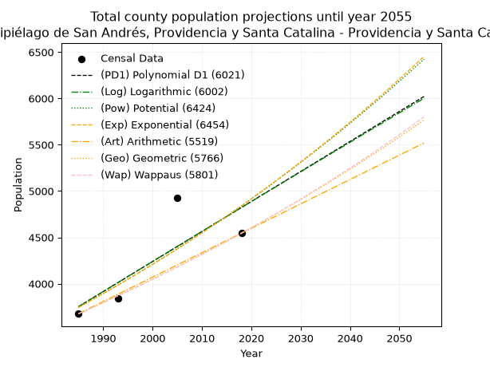
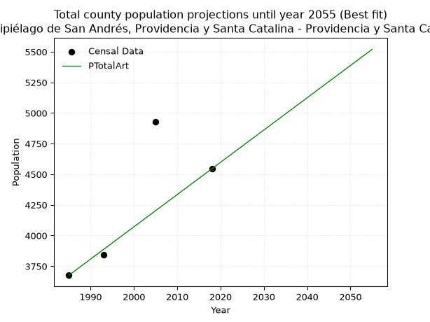
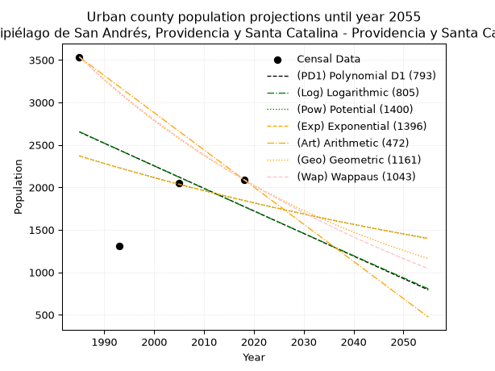
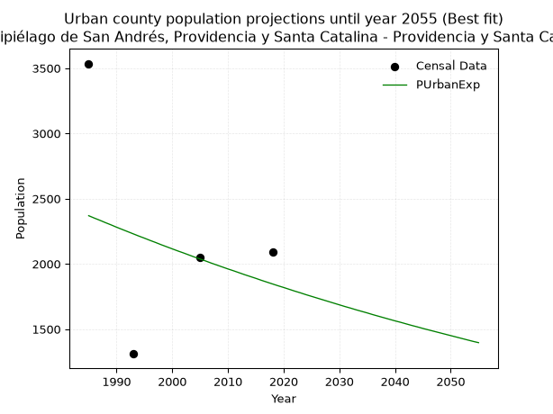
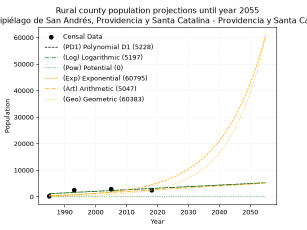
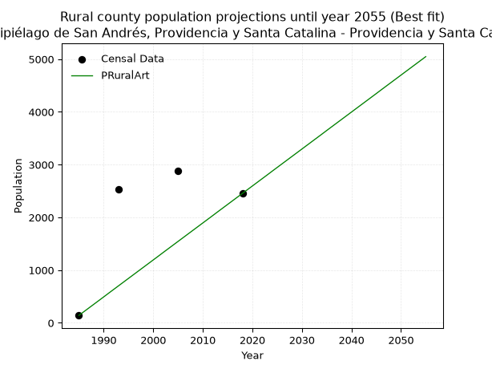

<div align="center">


</div>

# 📜 _“Population and Public Services Demand Projections (PPSD) until Year 2050 for Colombia - Archipiélago de San Andrés, Providencia y Santa Catalina - Providencia y Santa Catalina (ID: 88564)”_
Keywords: `population` `public-service` `projection` `lineal` `polynomial` `logarithmic` `potential` `exponential` `arithmetic` `geometric` `wappaus` `dane` `colombia` `south-america`

PPSD are analytical estimates used by governments and planners to anticipate future changes in population size, age distribution, and the resulting community needs for utilities, healthcare, education, and infrastructure as sizing future water treatment facilities, electrical grids, and road networks based on spatial growth.

<div align="center">

</img>

</div>


> **General running parameters**: • app_version: _v20260806_. • Python version: _3.14.7_. • Pandas version: _3.0.5_. • NumPy version: _2.5.1_. • Creates, save and include plots into reports (create_plot): _False_. • Projection until year: _2050_. • Process polynomial degree 2 and up: _False_. • Process Wappaus: _True_. • Process Wappaus: _True_. • Set negative values to zero: _True_. • Set infinite values to zero: _True_. • Drop dataset notes: _True_. 
<div align="center">

Maps & GIS Layers: [:earth_americas:Google](http://maps.google.com/maps?q=13.37318472,-81.3683855) [:earth_americas:OSM](https://www.openstreetmap.org/#map=18/13.37318472/-81.3683855&layers=P) [:earth_americas:Bing](https://www.bing.com/maps?cp=13.37318472~-81.3683855&lvl=18) [:earth_americas:Apple](https://maps.apple.com/frame?center=13.37318472%2C-81.3683855&span=0.003%2C0.006) [:earth_americas:GISMobile](https://github.com/rcfdtools/R.GISMobile/blob/main/file/gis/CountyLayer_CO/Readme.md)

</div>


<div align="center">

```geojson
{
  "type": "Feature",
  "geometry": {
    "type": "Point", 
    "coordinates": [-81.3683855, 13.37318472]
  }, 
  "properties": {
    "Name": "Colombia - Archipiélago de San Andrés, Providencia y Santa Catalina - Providencia y Santa Catalina (ID: 88564)"
  }
}
```

</div>


## 0. Census Data (4 records)

Census data are official statistics collected by a government about the people and housing in a country. They usually include counts of total population, age, sex, race, income, education, and jobs.

📅Global census file: [Population.xlsx](../data/Population.xlsx)

| Source   |   Year |   CountryID | CountryName   |   StateID | StateName                                                |   CountyID | CountyName                   |   PTotal |   PUrban |   PRural |
|:---------|-------:|------------:|:--------------|----------:|:---------------------------------------------------------|-----------:|:-----------------------------|---------:|---------:|---------:|
| DANE     |   1985 |          57 | Colombia      |        88 | Archipiélago de San Andrés, Providencia y Santa Catalina |      88564 | Providencia y Santa Catalina |     3676 |     3535 |      141 |
| DANE     |   1993 |          57 | Colombia      |        88 | Archipiélago de San Andrés, Providencia y Santa Catalina |      88564 | Providencia y Santa Catalina |     3840 |     1310 |     2530 |
| DANE     |   2005 |          57 | Colombia      |        88 | Archipiélago de San Andrés, Providencia y Santa Catalina |      88564 | Providencia y Santa Catalina |     4927 |     2052 |     2875 |
| DANE     |   2018 |          57 | Colombia      |        88 | Archipiélago de San Andrés, Providencia y Santa Catalina |      88564 | Providencia y Santa Catalina |     4545 |     2091 |     2454 |

> 🔥Some records could had specific notes about the registered values or the corresponding urban or rural distribution.

## 1. Total

### 1.1. Coefficients and Parameters

* (PD1) Polynomial Deg 1: 32.401445202729995, -60563.99076676068 (lineal)
* (Log) Logarithmic: 64937.40218344855, -489342.7143720752
* (Pow) Potential: 15.580006453645103, -47.805827052761195
* (Exp) Exponential: 0.007774310696056108, 0.0007437572931526334
* (Art) Arithmetic: Year diff. 2018 - 1985 = 33, Population diff. 4545 - 3676 = 869, Annual growth = 26.333333333333332
* (Geo) Geometric: Year diff. 2018 - 1985 = 33, Population diff. 4545 - 3676 = 869, Annual growth % = 0.006451098766286023
* (Wap) Wappaus: i = 0.6406357701820541, Condition values only valid for < 200)

<sub>
Wappaus condition values: ['0.00', '0.64', '1.28', '1.92', '2.56', '3.20', '3.84', '4.48', '5.13', '5.77', '6.41', '7.05', '7.69', '8.33', '8.97', '9.61', '10.25', '10.89', '11.53', '12.17', '12.81', '13.45', '14.09', '14.73', '15.38', '16.02', '16.66', '17.30', '17.94', '18.58', '19.22', '19.86', '20.50', '21.14', '21.78', '22.42', '23.06', '23.70', '24.34', '24.98', '25.63', '26.27', '26.91', '27.55', '28.19', '28.83', '29.47', '30.11', '30.75', '31.39', '32.03', '32.67', '33.31', '33.95', '34.59', '35.23', '35.88', '36.52', '37.16', '37.80', '38.44', '39.08', '39.72', '40.36', '41.00', '41.64']
</sub>


### 1.2. Projected Dataset

|   Year |   CountyID |   PTotalPD1 |   PTotalLog |   PTotalPow |   PTotalExp |   PTotalArt |   PTotalGeo |   PTotalWap |
|-------:|-----------:|------------:|------------:|------------:|------------:|------------:|------------:|------------:|
|   1985 |      88564 |        3753 |        3751 |        3744 |        3745 |        3676 |        3676 |        3676 |
|   1986 |      88564 |        3785 |        3784 |        3773 |        3774 |        3702 |        3700 |        3700 |
|   1987 |      88564 |        3818 |        3817 |        3803 |        3804 |        3729 |        3724 |        3723 |
|   1988 |      88564 |        3850 |        3849 |        3833 |        3834 |        3755 |        3748 |        3747 |
|   1989 |      88564 |        3882 |        3882 |        3863 |        3863 |        3781 |        3772 |        3771 |
|   1990 |      88564 |        3915 |        3915 |        3893 |        3894 |        3808 |        3796 |        3796 |
|   1991 |      88564 |        3947 |        3947 |        3924 |        3924 |        3834 |        3821 |        3820 |
|   1992 |      88564 |        3980 |        3980 |        3955 |        3955 |        3860 |        3845 |        3845 |
|   1993 |      88564 |        4012 |        4012 |        3986 |        3985 |        3887 |        3870 |        3869 |
|   1994 |      88564 |        4044 |        4045 |        4017 |        4017 |        3913 |        3895 |        3894 |
|   1995 |      88564 |        4077 |        4078 |        4049 |        4048 |        3939 |        3920 |        3919 |
|   1996 |      88564 |        4109 |        4110 |        4080 |        4079 |        3966 |        3945 |        3945 |
|   1997 |      88564 |        4142 |        4143 |        4112 |        4111 |        3992 |        3971 |        3970 |
|   1998 |      88564 |        4174 |        4175 |        4144 |        4143 |        4018 |        3997 |        3995 |
|   1999 |      88564 |        4206 |        4208 |        4177 |        4176 |        4045 |        4022 |        4021 |
|   2000 |      88564 |        4239 |        4240 |        4210 |        4208 |        4071 |        4048 |        4047 |
|   2001 |      88564 |        4271 |        4273 |        4243 |        4241 |        4097 |        4074 |        4073 |
|   2002 |      88564 |        4304 |        4305 |        4276 |        4274 |        4124 |        4101 |        4099 |
|   2003 |      88564 |        4336 |        4337 |        4309 |        4308 |        4150 |        4127 |        4126 |
|   2004 |      88564 |        4369 |        4370 |        4343 |        4341 |        4176 |        4154 |        4152 |
|   2005 |      88564 |        4401 |        4402 |        4377 |        4375 |        4203 |        4181 |        4179 |
|   2006 |      88564 |        4433 |        4435 |        4411 |        4409 |        4229 |        4207 |        4206 |
|   2007 |      88564 |        4466 |        4467 |        4445 |        4444 |        4255 |        4235 |        4233 |
|   2008 |      88564 |        4498 |        4499 |        4480 |        4478 |        4282 |        4262 |        4261 |
|   2009 |      88564 |        4531 |        4532 |        4515 |        4513 |        4308 |        4289 |        4288 |
|   2010 |      88564 |        4563 |        4564 |        4550 |        4549 |        4334 |        4317 |        4316 |
|   2011 |      88564 |        4595 |        4596 |        4585 |        4584 |        4361 |        4345 |        4344 |
|   2012 |      88564 |        4628 |        4629 |        4621 |        4620 |        4387 |        4373 |        4372 |
|   2013 |      88564 |        4660 |        4661 |        4657 |        4656 |        4413 |        4401 |        4400 |
|   2014 |      88564 |        4693 |        4693 |        4693 |        4692 |        4440 |        4430 |        4429 |
|   2015 |      88564 |        4725 |        4725 |        4729 |        4729 |        4466 |        4458 |        4458 |
|   2016 |      88564 |        4757 |        4758 |        4766 |        4766 |        4492 |        4487 |        4487 |
|   2017 |      88564 |        4790 |        4790 |        4803 |        4803 |        4519 |        4516 |        4516 |
|   2018 |      88564 |        4822 |        4822 |        4840 |        4840 |        4545 |        4545 |        4545 |
|   2019 |      88564 |        4855 |        4854 |        4878 |        4878 |        4571 |        4574 |        4575 |
|   2020 |      88564 |        4887 |        4886 |        4916 |        4916 |        4598 |        4604 |        4604 |
|   2021 |      88564 |        4919 |        4918 |        4954 |        4955 |        4624 |        4634 |        4634 |
|   2022 |      88564 |        4952 |        4951 |        4992 |        4993 |        4650 |        4663 |        4664 |
|   2023 |      88564 |        4984 |        4983 |        5030 |        5032 |        4677 |        4694 |        4695 |
|   2024 |      88564 |        5017 |        5015 |        5069 |        5072 |        4703 |        4724 |        4726 |
|   2025 |      88564 |        5049 |        5047 |        5109 |        5111 |        4729 |        4754 |        4756 |
|   2026 |      88564 |        5081 |        5079 |        5148 |        5151 |        4756 |        4785 |        4788 |
|   2027 |      88564 |        5114 |        5111 |        5188 |        5191 |        4782 |        4816 |        4819 |
|   2028 |      88564 |        5146 |        5143 |        5228 |        5232 |        4808 |        4847 |        4850 |
|   2029 |      88564 |        5179 |        5175 |        5268 |        5273 |        4835 |        4878 |        4882 |
|   2030 |      88564 |        5211 |        5207 |        5309 |        5314 |        4861 |        4910 |        4914 |
|   2031 |      88564 |        5243 |        5239 |        5350 |        5355 |        4887 |        4941 |        4946 |
|   2032 |      88564 |        5276 |        5271 |        5391 |        5397 |        4914 |        4973 |        4979 |
|   2033 |      88564 |        5308 |        5303 |        5432 |        5439 |        4940 |        5005 |        5012 |
|   2034 |      88564 |        5341 |        5335 |        5474 |        5482 |        4966 |        5038 |        5045 |
|   2035 |      88564 |        5373 |        5367 |        5516 |        5524 |        4993 |        5070 |        5078 |
|   2036 |      88564 |        5405 |        5399 |        5558 |        5567 |        5019 |        5103 |        5112 |
|   2037 |      88564 |        5438 |        5431 |        5601 |        5611 |        5045 |        5136 |        5145 |
|   2038 |      88564 |        5470 |        5462 |        5644 |        5655 |        5072 |        5169 |        5179 |
|   2039 |      88564 |        5503 |        5494 |        5687 |        5699 |        5098 |        5202 |        5214 |
|   2040 |      88564 |        5535 |        5526 |        5731 |        5743 |        5124 |        5236 |        5248 |
|   2041 |      88564 |        5567 |        5558 |        5775 |        5788 |        5151 |        5269 |        5283 |
|   2042 |      88564 |        5600 |        5590 |        5819 |        5833 |        5177 |        5303 |        5318 |
|   2043 |      88564 |        5632 |        5622 |        5864 |        5879 |        5203 |        5338 |        5354 |
|   2044 |      88564 |        5665 |        5653 |        5909 |        5925 |        5230 |        5372 |        5389 |
|   2045 |      88564 |        5697 |        5685 |        5954 |        5971 |        5256 |        5407 |        5425 |
|   2046 |      88564 |        5729 |        5717 |        5999 |        6018 |        5282 |        5442 |        5461 |
|   2047 |      88564 |        5762 |        5749 |        6045 |        6065 |        5309 |        5477 |        5498 |
|   2048 |      88564 |        5794 |        5780 |        6091 |        6112 |        5335 |        5512 |        5535 |
|   2049 |      88564 |        5827 |        5812 |        6138 |        6160 |        5361 |        5548 |        5572 |
|   2050 |      88564 |        5859 |        5844 |        6185 |        6208 |        5388 |        5583 |        5609 |
<div align="center">

</img>

</div>


### 1.3. Best fit with absolute and relative error (%)

Relative error puts that difference into context by dividing the absolute error by the true value, creating a unitless ratio or percentage that shows the scale of the mistake.

Absolute and relative error

|   Year | Source   |   CountryID | CountryName   |   StateID | StateName                                                |   CountyID_x | CountyName                   |   PTotal |   PUrban |   PRural |   CountyID_y |   PTotalPD1 |   PTotalLog |   PTotalPow |   PTotalExp |   PTotalArt |   PTotalGeo |   PTotalWap |   PTotalPD1AbsError |   PTotalLogAbsError |   PTotalPowAbsError |   PTotalExpAbsError |   PTotalArtAbsError |   PTotalGeoAbsError |   PTotalWapAbsError |   PTotalPD1RelError |   PTotalLogRelError |   PTotalPowRelError |   PTotalExpRelError |   PTotalArtRelError |   PTotalGeoRelError |   PTotalWapRelError |
|-------:|:---------|------------:|:--------------|----------:|:---------------------------------------------------------|-------------:|:-----------------------------|---------:|---------:|---------:|-------------:|------------:|------------:|------------:|------------:|------------:|------------:|------------:|--------------------:|--------------------:|--------------------:|--------------------:|--------------------:|--------------------:|--------------------:|--------------------:|--------------------:|--------------------:|--------------------:|--------------------:|--------------------:|--------------------:|
|   1985 | DANE     |          57 | Colombia      |        88 | Archipiélago de San Andrés, Providencia y Santa Catalina |        88564 | Providencia y Santa Catalina |     3676 |     3535 |      141 |        88564 |        3753 |        3751 |        3744 |        3745 |        3676 |        3676 |        3676 |                  77 |                  75 |                  68 |                  69 |                   0 |                   0 |                   0 |             2.09467 |             2.04026 |             1.84984 |             1.87704 |             0       |             0       |            0        |
|   1993 | DANE     |          57 | Colombia      |        88 | Archipiélago de San Andrés, Providencia y Santa Catalina |        88564 | Providencia y Santa Catalina |     3840 |     1310 |     2530 |        88564 |        4012 |        4012 |        3986 |        3985 |        3887 |        3870 |        3869 |                 172 |                 172 |                 146 |                 145 |                  47 |                  30 |                  29 |             4.47917 |             4.47917 |             3.80208 |             3.77604 |             1.22396 |             0.78125 |            0.755208 |
|   2005 | DANE     |          57 | Colombia      |        88 | Archipiélago de San Andrés, Providencia y Santa Catalina |        88564 | Providencia y Santa Catalina |     4927 |     2052 |     2875 |        88564 |        4401 |        4402 |        4377 |        4375 |        4203 |        4181 |        4179 |                 526 |                 525 |                 550 |                 552 |                 724 |                 746 |                 748 |            10.6759  |            10.6556  |            11.163   |            11.2036  |            14.6945  |            15.1411  |           15.1817   |
|   2018 | DANE     |          57 | Colombia      |        88 | Archipiélago de San Andrés, Providencia y Santa Catalina |        88564 | Providencia y Santa Catalina |     4545 |     2091 |     2454 |        88564 |        4822 |        4822 |        4840 |        4840 |        4545 |        4545 |        4545 |                 277 |                 277 |                 295 |                 295 |                   0 |                   0 |                   0 |             6.09461 |             6.09461 |             6.49065 |             6.49065 |             0       |             0       |            0        |

Relative error mean

| Method    |   RelError | Best   |
|:----------|-----------:|:-------|
| PTotalPD1 |    5.83608 |        |
| PTotalLog |    5.8174  |        |
| PTotalPow |    5.82639 |        |
| PTotalExp |    5.83683 |        |
| PTotalArt |    3.97962 | True   |
| PTotalGeo |    3.98058 |        |
| PTotalWap |    3.98422 |        |

💙Best method: _**PTotalArt**_
<div align="center">

</img>

</div>


### 1.4. Fresh water supply demand in liters per capita per day (lpcd)

The fresh water supply demand typically ranges from 100 to 300 liters per capita per day (lpcd) for standard domestic and municipal planning, though absolute survival minimums set by the World Health Organization are as low as 7.5 to 20 liters per day, and total consumption in high-income nations can exceed 400 liters.

> `CZ`: Level in meters above the sea level (masl)<br> `WS`: Fresh water supply demand in liters per capita per day (lpcd or l/h/d)<br> `WSAll`: Zonal fresh water supply demand in liters per second (l/s)<br> `A`: Zonal area in square meters<br> `DP`: Population density (people/hectare or p/ha)

Reference values (RAS Colombia)

|    CZ |   WS |
|------:|-----:|
|  1000 |  120 |
|  2000 |  130 |
| 99999 |  140 |

County shapefile geometry properties and water supply values

|   CountyID |      ATotal |   CZTotal |   WSTotal |
|-----------:|------------:|----------:|----------:|
|      88564 | 2.24898e+07 |   80.8032 |       120 |

Projected values for best method: PTotalArt

|   CountyID |   Year |   PTotalArt |   DPTotal |   WSTotal |   WSTotalAll |
|-----------:|-------:|------------:|----------:|----------:|-------------:|
|      88564 |   1985 |        3676 |      1.63 |       120 |      5.10556 |
|      88564 |   1986 |        3702 |      1.65 |       120 |      5.14167 |
|      88564 |   1987 |        3729 |      1.66 |       120 |      5.17917 |
|      88564 |   1988 |        3755 |      1.67 |       120 |      5.21528 |
|      88564 |   1989 |        3781 |      1.68 |       120 |      5.25139 |
|      88564 |   1990 |        3808 |      1.69 |       120 |      5.28889 |
|      88564 |   1991 |        3834 |      1.7  |       120 |      5.325   |
|      88564 |   1992 |        3860 |      1.72 |       120 |      5.36111 |
|      88564 |   1993 |        3887 |      1.73 |       120 |      5.39861 |
|      88564 |   1994 |        3913 |      1.74 |       120 |      5.43472 |
|      88564 |   1995 |        3939 |      1.75 |       120 |      5.47083 |
|      88564 |   1996 |        3966 |      1.76 |       120 |      5.50833 |
|      88564 |   1997 |        3992 |      1.78 |       120 |      5.54444 |
|      88564 |   1998 |        4018 |      1.79 |       120 |      5.58056 |
|      88564 |   1999 |        4045 |      1.8  |       120 |      5.61806 |
|      88564 |   2000 |        4071 |      1.81 |       120 |      5.65417 |
|      88564 |   2001 |        4097 |      1.82 |       120 |      5.69028 |
|      88564 |   2002 |        4124 |      1.83 |       120 |      5.72778 |
|      88564 |   2003 |        4150 |      1.85 |       120 |      5.76389 |
|      88564 |   2004 |        4176 |      1.86 |       120 |      5.8     |
|      88564 |   2005 |        4203 |      1.87 |       120 |      5.8375  |
|      88564 |   2006 |        4229 |      1.88 |       120 |      5.87361 |
|      88564 |   2007 |        4255 |      1.89 |       120 |      5.90972 |
|      88564 |   2008 |        4282 |      1.9  |       120 |      5.94722 |
|      88564 |   2009 |        4308 |      1.92 |       120 |      5.98333 |
|      88564 |   2010 |        4334 |      1.93 |       120 |      6.01944 |
|      88564 |   2011 |        4361 |      1.94 |       120 |      6.05694 |
|      88564 |   2012 |        4387 |      1.95 |       120 |      6.09306 |
|      88564 |   2013 |        4413 |      1.96 |       120 |      6.12917 |
|      88564 |   2014 |        4440 |      1.97 |       120 |      6.16667 |
|      88564 |   2015 |        4466 |      1.99 |       120 |      6.20278 |
|      88564 |   2016 |        4492 |      2    |       120 |      6.23889 |
|      88564 |   2017 |        4519 |      2.01 |       120 |      6.27639 |
|      88564 |   2018 |        4545 |      2.02 |       120 |      6.3125  |
|      88564 |   2019 |        4571 |      2.03 |       120 |      6.34861 |
|      88564 |   2020 |        4598 |      2.04 |       120 |      6.38611 |
|      88564 |   2021 |        4624 |      2.06 |       120 |      6.42222 |
|      88564 |   2022 |        4650 |      2.07 |       120 |      6.45833 |
|      88564 |   2023 |        4677 |      2.08 |       120 |      6.49583 |
|      88564 |   2024 |        4703 |      2.09 |       120 |      6.53194 |
|      88564 |   2025 |        4729 |      2.1  |       120 |      6.56806 |
|      88564 |   2026 |        4756 |      2.11 |       120 |      6.60556 |
|      88564 |   2027 |        4782 |      2.13 |       120 |      6.64167 |
|      88564 |   2028 |        4808 |      2.14 |       120 |      6.67778 |
|      88564 |   2029 |        4835 |      2.15 |       120 |      6.71528 |
|      88564 |   2030 |        4861 |      2.16 |       120 |      6.75139 |
|      88564 |   2031 |        4887 |      2.17 |       120 |      6.7875  |
|      88564 |   2032 |        4914 |      2.18 |       120 |      6.825   |
|      88564 |   2033 |        4940 |      2.2  |       120 |      6.86111 |
|      88564 |   2034 |        4966 |      2.21 |       120 |      6.89722 |
|      88564 |   2035 |        4993 |      2.22 |       120 |      6.93472 |
|      88564 |   2036 |        5019 |      2.23 |       120 |      6.97083 |
|      88564 |   2037 |        5045 |      2.24 |       120 |      7.00694 |
|      88564 |   2038 |        5072 |      2.26 |       120 |      7.04444 |
|      88564 |   2039 |        5098 |      2.27 |       120 |      7.08056 |
|      88564 |   2040 |        5124 |      2.28 |       120 |      7.11667 |
|      88564 |   2041 |        5151 |      2.29 |       120 |      7.15417 |
|      88564 |   2042 |        5177 |      2.3  |       120 |      7.19028 |
|      88564 |   2043 |        5203 |      2.31 |       120 |      7.22639 |
|      88564 |   2044 |        5230 |      2.33 |       120 |      7.26389 |
|      88564 |   2045 |        5256 |      2.34 |       120 |      7.3     |
|      88564 |   2046 |        5282 |      2.35 |       120 |      7.33611 |
|      88564 |   2047 |        5309 |      2.36 |       120 |      7.37361 |
|      88564 |   2048 |        5335 |      2.37 |       120 |      7.40972 |
|      88564 |   2049 |        5361 |      2.38 |       120 |      7.44583 |
|      88564 |   2050 |        5388 |      2.4  |       120 |      7.48333 |

## 2. Urban

### 2.1. Coefficients and Parameters

* (PD1) Polynomial Deg 1: -26.5660377358491, 55385.716981132166 (lineal)
* (Log) Logarithmic: -53371.41752706828, 407923.57231494447
* (Pow) Potential: -15.211775253875798, 53.53977175670292
* (Exp) Exponential: -0.007557688787184422, 7760570772.756691
* (Art) Arithmetic: Year diff. 2018 - 1985 = 33, Population diff. 2091 - 3535 = -1444, Annual growth = -43.75757575757576
* (Geo) Geometric: Year diff. 2018 - 1985 = 33, Population diff. 2091 - 3535 = -1444, Annual growth % = -0.015785323701294596
* (Wap) Wappaus: i = -1.5555483738917795, Condition values only valid for < 200)

<sub>
Wappaus condition values: ['-0.00', '-1.56', '-3.11', '-4.67', '-6.22', '-7.78', '-9.33', '-10.89', '-12.44', '-14.00', '-15.56', '-17.11', '-18.67', '-20.22', '-21.78', '-23.33', '-24.89', '-26.44', '-28.00', '-29.56', '-31.11', '-32.67', '-34.22', '-35.78', '-37.33', '-38.89', '-40.44', '-42.00', '-43.56', '-45.11', '-46.67', '-48.22', '-49.78', '-51.33', '-52.89', '-54.44', '-56.00', '-57.56', '-59.11', '-60.67', '-62.22', '-63.78', '-65.33', '-66.89', '-68.44', '-70.00', '-71.56', '-73.11', '-74.67', '-76.22', '-77.78', '-79.33', '-80.89', '-82.44', '-84.00', '-85.56', '-87.11', '-88.67', '-90.22', '-91.78', '-93.33', '-94.89', '-96.44', '-98.00', '-99.56', '-101.11']
</sub>


### 2.2. Projected Dataset

|   Year |   CountyID |   PUrbanPD1 |   PUrbanLog |   PUrbanPow |   PUrbanExp |   PUrbanArt |   PUrbanGeo |   PUrbanWap |
|-------:|-----------:|------------:|------------:|------------:|------------:|------------:|------------:|------------:|
|   1985 |      88564 |        2652 |        2654 |        2371 |        2369 |        3535 |        3535 |        3535 |
|   1986 |      88564 |        2626 |        2628 |        2353 |        2351 |        3491 |        3479 |        3480 |
|   1987 |      88564 |        2599 |        2601 |        2335 |        2334 |        3447 |        3424 |        3427 |
|   1988 |      88564 |        2572 |        2574 |        2317 |        2316 |        3404 |        3370 |        3374 |
|   1989 |      88564 |        2546 |        2547 |        2300 |        2299 |        3360 |        3317 |        3322 |
|   1990 |      88564 |        2519 |        2520 |        2282 |        2281 |        3316 |        3265 |        3270 |
|   1991 |      88564 |        2493 |        2493 |        2265 |        2264 |        3272 |        3213 |        3220 |
|   1992 |      88564 |        2466 |        2467 |        2248 |        2247 |        3229 |        3162 |        3170 |
|   1993 |      88564 |        2440 |        2440 |        2231 |        2230 |        3185 |        3112 |        3121 |
|   1994 |      88564 |        2413 |        2413 |        2214 |        2213 |        3141 |        3063 |        3072 |
|   1995 |      88564 |        2386 |        2386 |        2197 |        2197 |        3097 |        3015 |        3025 |
|   1996 |      88564 |        2360 |        2359 |        2180 |        2180 |        3054 |        2967 |        2978 |
|   1997 |      88564 |        2333 |        2333 |        2164 |        2164 |        3010 |        2921 |        2931 |
|   1998 |      88564 |        2307 |        2306 |        2147 |        2147 |        2966 |        2874 |        2886 |
|   1999 |      88564 |        2280 |        2279 |        2131 |        2131 |        2922 |        2829 |        2841 |
|   2000 |      88564 |        2254 |        2253 |        2115 |        2115 |        2879 |        2784 |        2796 |
|   2001 |      88564 |        2227 |        2226 |        2099 |        2099 |        2835 |        2740 |        2753 |
|   2002 |      88564 |        2201 |        2199 |        2083 |        2084 |        2791 |        2697 |        2709 |
|   2003 |      88564 |        2174 |        2173 |        2067 |        2068 |        2747 |        2655 |        2667 |
|   2004 |      88564 |        2147 |        2146 |        2051 |        2052 |        2704 |        2613 |        2625 |
|   2005 |      88564 |        2121 |        2119 |        2036 |        2037 |        2660 |        2571 |        2583 |
|   2006 |      88564 |        2094 |        2093 |        2020 |        2022 |        2616 |        2531 |        2542 |
|   2007 |      88564 |        2068 |        2066 |        2005 |        2006 |        2572 |        2491 |        2502 |
|   2008 |      88564 |        2041 |        2040 |        1990 |        1991 |        2529 |        2452 |        2462 |
|   2009 |      88564 |        2015 |        2013 |        1975 |        1976 |        2485 |        2413 |        2423 |
|   2010 |      88564 |        1988 |        1986 |        1960 |        1961 |        2441 |        2375 |        2384 |
|   2011 |      88564 |        1961 |        1960 |        1945 |        1947 |        2397 |        2337 |        2346 |
|   2012 |      88564 |        1935 |        1933 |        1931 |        1932 |        2354 |        2300 |        2308 |
|   2013 |      88564 |        1908 |        1907 |        1916 |        1917 |        2310 |        2264 |        2271 |
|   2014 |      88564 |        1882 |        1880 |        1902 |        1903 |        2266 |        2228 |        2234 |
|   2015 |      88564 |        1855 |        1854 |        1887 |        1889 |        2222 |        2193 |        2197 |
|   2016 |      88564 |        1829 |        1827 |        1873 |        1874 |        2179 |        2159 |        2162 |
|   2017 |      88564 |        1802 |        1801 |        1859 |        1860 |        2135 |        2125 |        2126 |
|   2018 |      88564 |        1775 |        1774 |        1845 |        1846 |        2091 |        2091 |        2091 |
|   2019 |      88564 |        1749 |        1748 |        1831 |        1832 |        2047 |        2058 |        2056 |
|   2020 |      88564 |        1722 |        1722 |        1818 |        1819 |        2003 |        2026 |        2022 |
|   2021 |      88564 |        1696 |        1695 |        1804 |        1805 |        1960 |        1994 |        1988 |
|   2022 |      88564 |        1669 |        1669 |        1790 |        1791 |        1916 |        1962 |        1955 |
|   2023 |      88564 |        1643 |        1642 |        1777 |        1778 |        1872 |        1931 |        1922 |
|   2024 |      88564 |        1616 |        1616 |        1764 |        1764 |        1828 |        1901 |        1890 |
|   2025 |      88564 |        1589 |        1590 |        1751 |        1751 |        1785 |        1871 |        1857 |
|   2026 |      88564 |        1563 |        1563 |        1737 |        1738 |        1741 |        1841 |        1826 |
|   2027 |      88564 |        1536 |        1537 |        1724 |        1725 |        1697 |        1812 |        1794 |
|   2028 |      88564 |        1510 |        1511 |        1712 |        1712 |        1653 |        1783 |        1763 |
|   2029 |      88564 |        1483 |        1484 |        1699 |        1699 |        1610 |        1755 |        1732 |
|   2030 |      88564 |        1457 |        1458 |        1686 |        1686 |        1566 |        1728 |        1702 |
|   2031 |      88564 |        1430 |        1432 |        1674 |        1673 |        1522 |        1700 |        1672 |
|   2032 |      88564 |        1404 |        1405 |        1661 |        1661 |        1478 |        1673 |        1642 |
|   2033 |      88564 |        1377 |        1379 |        1649 |        1648 |        1435 |        1647 |        1613 |
|   2034 |      88564 |        1350 |        1353 |        1636 |        1636 |        1391 |        1621 |        1584 |
|   2035 |      88564 |        1324 |        1327 |        1624 |        1624 |        1347 |        1595 |        1555 |
|   2036 |      88564 |        1297 |        1300 |        1612 |        1611 |        1303 |        1570 |        1527 |
|   2037 |      88564 |        1271 |        1274 |        1600 |        1599 |        1260 |        1545 |        1499 |
|   2038 |      88564 |        1244 |        1248 |        1588 |        1587 |        1216 |        1521 |        1471 |
|   2039 |      88564 |        1218 |        1222 |        1576 |        1575 |        1172 |        1497 |        1444 |
|   2040 |      88564 |        1191 |        1196 |        1565 |        1563 |        1128 |        1473 |        1417 |
|   2041 |      88564 |        1164 |        1170 |        1553 |        1552 |        1085 |        1450 |        1390 |
|   2042 |      88564 |        1138 |        1143 |        1542 |        1540 |        1041 |        1427 |        1363 |
|   2043 |      88564 |        1111 |        1117 |        1530 |        1528 |         997 |        1405 |        1337 |
|   2044 |      88564 |        1085 |        1091 |        1519 |        1517 |         953 |        1383 |        1311 |
|   2045 |      88564 |        1058 |        1065 |        1507 |        1505 |         910 |        1361 |        1285 |
|   2046 |      88564 |        1032 |        1039 |        1496 |        1494 |         866 |        1339 |        1260 |
|   2047 |      88564 |        1005 |        1013 |        1485 |        1483 |         822 |        1318 |        1235 |
|   2048 |      88564 |         978 |         987 |        1474 |        1472 |         778 |        1297 |        1210 |
|   2049 |      88564 |         952 |         961 |        1463 |        1461 |         735 |        1277 |        1185 |
|   2050 |      88564 |         925 |         935 |        1453 |        1450 |         691 |        1257 |        1161 |
<div align="center">

</img>

</div>


### 2.3. Best fit with absolute and relative error (%)

Relative error puts that difference into context by dividing the absolute error by the true value, creating a unitless ratio or percentage that shows the scale of the mistake.

Absolute and relative error

|   Year | Source   |   CountryID | CountryName   |   StateID | StateName                                                |   CountyID_x | CountyName                   |   PTotal |   PUrban |   PRural |   CountyID_y |   PUrbanPD1 |   PUrbanLog |   PUrbanPow |   PUrbanExp |   PUrbanArt |   PUrbanGeo |   PUrbanWap |   PUrbanPD1AbsError |   PUrbanLogAbsError |   PUrbanPowAbsError |   PUrbanExpAbsError |   PUrbanArtAbsError |   PUrbanGeoAbsError |   PUrbanWapAbsError |   PUrbanPD1RelError |   PUrbanLogRelError |   PUrbanPowRelError |   PUrbanExpRelError |   PUrbanArtRelError |   PUrbanGeoRelError |   PUrbanWapRelError |
|-------:|:---------|------------:|:--------------|----------:|:---------------------------------------------------------|-------------:|:-----------------------------|---------:|---------:|---------:|-------------:|------------:|------------:|------------:|------------:|------------:|------------:|------------:|--------------------:|--------------------:|--------------------:|--------------------:|--------------------:|--------------------:|--------------------:|--------------------:|--------------------:|--------------------:|--------------------:|--------------------:|--------------------:|--------------------:|
|   1985 | DANE     |          57 | Colombia      |        88 | Archipiélago de San Andrés, Providencia y Santa Catalina |        88564 | Providencia y Santa Catalina |     3676 |     3535 |      141 |        88564 |        2652 |        2654 |        2371 |        2369 |        3535 |        3535 |        3535 |                 883 |                 881 |                1164 |                1166 |                   0 |                   0 |                   0 |            24.9788  |            24.9222  |           32.9279   |           32.9844   |              0      |              0      |              0      |
|   1993 | DANE     |          57 | Colombia      |        88 | Archipiélago de San Andrés, Providencia y Santa Catalina |        88564 | Providencia y Santa Catalina |     3840 |     1310 |     2530 |        88564 |        2440 |        2440 |        2231 |        2230 |        3185 |        3112 |        3121 |                1130 |                1130 |                 921 |                 920 |                1875 |                1802 |                1811 |            86.2595  |            86.2595  |           70.3053   |           70.229    |            143.13   |            137.557  |            138.244  |
|   2005 | DANE     |          57 | Colombia      |        88 | Archipiélago de San Andrés, Providencia y Santa Catalina |        88564 | Providencia y Santa Catalina |     4927 |     2052 |     2875 |        88564 |        2121 |        2119 |        2036 |        2037 |        2660 |        2571 |        2583 |                  69 |                  67 |                  16 |                  15 |                 608 |                 519 |                 531 |             3.36257 |             3.26511 |            0.779727 |            0.730994 |             29.6296 |             25.2924 |             25.8772 |
|   2018 | DANE     |          57 | Colombia      |        88 | Archipiélago de San Andrés, Providencia y Santa Catalina |        88564 | Providencia y Santa Catalina |     4545 |     2091 |     2454 |        88564 |        1775 |        1774 |        1845 |        1846 |        2091 |        2091 |        2091 |                 316 |                 317 |                 246 |                 245 |                   0 |                   0 |                   0 |            15.1124  |            15.1602  |           11.7647   |           11.7169   |              0      |              0      |              0      |

Relative error mean

| Method    |   RelError | Best   |
|:----------|-----------:|:-------|
| PUrbanPD1 |    32.4283 |        |
| PUrbanLog |    32.4018 |        |
| PUrbanPow |    28.9444 |        |
| PUrbanExp |    28.9153 | True   |
| PUrbanArt |    43.1899 |        |
| PUrbanGeo |    40.7124 |        |
| PUrbanWap |    41.0304 |        |

💙Best method: _**PUrbanExp**_
<div align="center">

</img>

</div>


### 2.4. Fresh water supply demand in liters per capita per day (lpcd)

The fresh water supply demand typically ranges from 100 to 300 liters per capita per day (lpcd) for standard domestic and municipal planning, though absolute survival minimums set by the World Health Organization are as low as 7.5 to 20 liters per day, and total consumption in high-income nations can exceed 400 liters.

> `CZ`: Level in meters above the sea level (masl)<br> `WS`: Fresh water supply demand in liters per capita per day (lpcd or l/h/d)<br> `WSAll`: Zonal fresh water supply demand in liters per second (l/s)<br> `A`: Zonal area in square meters<br> `DP`: Population density (people/hectare or p/ha)

Reference values (RAS Colombia)

|    CZ |   WS |
|------:|-----:|
|  1000 |  120 |
|  2000 |  130 |
| 99999 |  140 |

County shapefile geometry properties and water supply values

|   CountyID |      AUrban |   CZUrban |   WSUrban |
|-----------:|------------:|----------:|----------:|
|      88564 | 2.41744e+06 |   15.5306 |       120 |

Projected values for best method: PUrbanExp

|   CountyID |   Year |   PUrbanExp |   DPUrban |   WSUrban |   WSUrbanAll |
|-----------:|-------:|------------:|----------:|----------:|-------------:|
|      88564 |   1985 |        2369 |      9.8  |       120 |      3.29028 |
|      88564 |   1986 |        2351 |      9.73 |       120 |      3.26528 |
|      88564 |   1987 |        2334 |      9.65 |       120 |      3.24167 |
|      88564 |   1988 |        2316 |      9.58 |       120 |      3.21667 |
|      88564 |   1989 |        2299 |      9.51 |       120 |      3.19306 |
|      88564 |   1990 |        2281 |      9.44 |       120 |      3.16806 |
|      88564 |   1991 |        2264 |      9.37 |       120 |      3.14444 |
|      88564 |   1992 |        2247 |      9.29 |       120 |      3.12083 |
|      88564 |   1993 |        2230 |      9.22 |       120 |      3.09722 |
|      88564 |   1994 |        2213 |      9.15 |       120 |      3.07361 |
|      88564 |   1995 |        2197 |      9.09 |       120 |      3.05139 |
|      88564 |   1996 |        2180 |      9.02 |       120 |      3.02778 |
|      88564 |   1997 |        2164 |      8.95 |       120 |      3.00556 |
|      88564 |   1998 |        2147 |      8.88 |       120 |      2.98194 |
|      88564 |   1999 |        2131 |      8.82 |       120 |      2.95972 |
|      88564 |   2000 |        2115 |      8.75 |       120 |      2.9375  |
|      88564 |   2001 |        2099 |      8.68 |       120 |      2.91528 |
|      88564 |   2002 |        2084 |      8.62 |       120 |      2.89444 |
|      88564 |   2003 |        2068 |      8.55 |       120 |      2.87222 |
|      88564 |   2004 |        2052 |      8.49 |       120 |      2.85    |
|      88564 |   2005 |        2037 |      8.43 |       120 |      2.82917 |
|      88564 |   2006 |        2022 |      8.36 |       120 |      2.80833 |
|      88564 |   2007 |        2006 |      8.3  |       120 |      2.78611 |
|      88564 |   2008 |        1991 |      8.24 |       120 |      2.76528 |
|      88564 |   2009 |        1976 |      8.17 |       120 |      2.74444 |
|      88564 |   2010 |        1961 |      8.11 |       120 |      2.72361 |
|      88564 |   2011 |        1947 |      8.05 |       120 |      2.70417 |
|      88564 |   2012 |        1932 |      7.99 |       120 |      2.68333 |
|      88564 |   2013 |        1917 |      7.93 |       120 |      2.6625  |
|      88564 |   2014 |        1903 |      7.87 |       120 |      2.64306 |
|      88564 |   2015 |        1889 |      7.81 |       120 |      2.62361 |
|      88564 |   2016 |        1874 |      7.75 |       120 |      2.60278 |
|      88564 |   2017 |        1860 |      7.69 |       120 |      2.58333 |
|      88564 |   2018 |        1846 |      7.64 |       120 |      2.56389 |
|      88564 |   2019 |        1832 |      7.58 |       120 |      2.54444 |
|      88564 |   2020 |        1819 |      7.52 |       120 |      2.52639 |
|      88564 |   2021 |        1805 |      7.47 |       120 |      2.50694 |
|      88564 |   2022 |        1791 |      7.41 |       120 |      2.4875  |
|      88564 |   2023 |        1778 |      7.35 |       120 |      2.46944 |
|      88564 |   2024 |        1764 |      7.3  |       120 |      2.45    |
|      88564 |   2025 |        1751 |      7.24 |       120 |      2.43194 |
|      88564 |   2026 |        1738 |      7.19 |       120 |      2.41389 |
|      88564 |   2027 |        1725 |      7.14 |       120 |      2.39583 |
|      88564 |   2028 |        1712 |      7.08 |       120 |      2.37778 |
|      88564 |   2029 |        1699 |      7.03 |       120 |      2.35972 |
|      88564 |   2030 |        1686 |      6.97 |       120 |      2.34167 |
|      88564 |   2031 |        1673 |      6.92 |       120 |      2.32361 |
|      88564 |   2032 |        1661 |      6.87 |       120 |      2.30694 |
|      88564 |   2033 |        1648 |      6.82 |       120 |      2.28889 |
|      88564 |   2034 |        1636 |      6.77 |       120 |      2.27222 |
|      88564 |   2035 |        1624 |      6.72 |       120 |      2.25556 |
|      88564 |   2036 |        1611 |      6.66 |       120 |      2.2375  |
|      88564 |   2037 |        1599 |      6.61 |       120 |      2.22083 |
|      88564 |   2038 |        1587 |      6.56 |       120 |      2.20417 |
|      88564 |   2039 |        1575 |      6.52 |       120 |      2.1875  |
|      88564 |   2040 |        1563 |      6.47 |       120 |      2.17083 |
|      88564 |   2041 |        1552 |      6.42 |       120 |      2.15556 |
|      88564 |   2042 |        1540 |      6.37 |       120 |      2.13889 |
|      88564 |   2043 |        1528 |      6.32 |       120 |      2.12222 |
|      88564 |   2044 |        1517 |      6.28 |       120 |      2.10694 |
|      88564 |   2045 |        1505 |      6.23 |       120 |      2.09028 |
|      88564 |   2046 |        1494 |      6.18 |       120 |      2.075   |
|      88564 |   2047 |        1483 |      6.13 |       120 |      2.05972 |
|      88564 |   2048 |        1472 |      6.09 |       120 |      2.04444 |
|      88564 |   2049 |        1461 |      6.04 |       120 |      2.02917 |
|      88564 |   2050 |        1450 |      6    |       120 |      2.01389 |

## 3. Rural

### 3.1. Coefficients and Parameters

* (PD1) Polynomial Deg 1: 58.9674829385791, -115949.70774789285 (lineal)
* (Log) Logarithmic: 118308.81971051681, -897266.2866870194
* (Pow) Potential: 142.0283177654564, -465.74603495831195
* (Exp) Exponential: 0.07080828314838815, 3.8835760119387346e-59
* (Art) Arithmetic: Year diff. 2018 - 1985 = 33, Population diff. 2454 - 141 = 2313, Annual growth = 70.0909090909091
* (Geo) Geometric: Year diff. 2018 - 1985 = 33, Population diff. 2454 - 141 = 2313, Annual growth % = 0.0904245471194447
* (Wap) Wappaus: i = 5.401996847083552, Condition values only valid for < 200)

<sub>
Wappaus condition values: ['0.00', '5.40', '10.80', '16.21', '21.61', '27.01', '32.41', '37.81', '43.22', '48.62', '54.02', '59.42', '64.82', '70.23', '75.63', '81.03', '86.43', '91.83', '97.24', '102.64', '108.04', '113.44', '118.84', '124.25', '129.65', '135.05', '140.45', '145.85', '151.26', '156.66', '162.06', '167.46', '172.86', '178.27', '183.67', '189.07', '194.47', '199.87', '205.28', '210.68', '216.08', '221.48', '226.88', '232.29', '237.69', '243.09', '248.49', '253.89', '259.30', '264.70', '270.10', '275.50', '280.90', '286.31', '291.71', '297.11', '302.51', '307.91', '313.32', '318.72', '324.12', '329.52', '334.92', '340.33', '345.73', '351.13']
</sub>


### 3.2. Projected Dataset

|   Year |   CountyID |   PRuralPD1 |   PRuralLog |   PRuralPow |   PRuralExp |   PRuralArt |   PRuralGeo |
|-------:|-----------:|------------:|------------:|------------:|------------:|------------:|------------:|
|   1985 |      88564 |        1101 |        1097 |           0 |         428 |         141 |         141 |
|   1986 |      88564 |        1160 |        1156 |           0 |         459 |         211 |         154 |
|   1987 |      88564 |        1219 |        1216 |           0 |         493 |         281 |         168 |
|   1988 |      88564 |        1278 |        1276 |           0 |         529 |         351 |         183 |
|   1989 |      88564 |        1337 |        1335 |           0 |         568 |         421 |         199 |
|   1990 |      88564 |        1396 |        1394 |           0 |         610 |         491 |         217 |
|   1991 |      88564 |        1455 |        1454 |           0 |         654 |         562 |         237 |
|   1992 |      88564 |        1514 |        1513 |           0 |         702 |         632 |         258 |
|   1993 |      88564 |        1572 |        1573 |           0 |         754 |         702 |         282 |
|   1994 |      88564 |        1631 |        1632 |           0 |         809 |         772 |         307 |
|   1995 |      88564 |        1690 |        1691 |           0 |         868 |         842 |         335 |
|   1996 |      88564 |        1749 |        1751 |           0 |         932 |         912 |         365 |
|   1997 |      88564 |        1808 |        1810 |           0 |        1001 |         982 |         398 |
|   1998 |      88564 |        1867 |        1869 |           0 |        1074 |        1052 |         434 |
|   1999 |      88564 |        1926 |        1928 |           0 |        1153 |        1122 |         474 |
|   2000 |      88564 |        1985 |        1988 |           0 |        1237 |        1192 |         517 |
|   2001 |      88564 |        2044 |        2047 |           0 |        1328 |        1262 |         563 |
|   2002 |      88564 |        2103 |        2106 |           0 |        1426 |        1333 |         614 |
|   2003 |      88564 |        2162 |        2165 |           0 |        1530 |        1403 |         670 |
|   2004 |      88564 |        2221 |        2224 |           0 |        1643 |        1473 |         730 |
|   2005 |      88564 |        2280 |        2283 |           0 |        1763 |        1543 |         796 |
|   2006 |      88564 |        2339 |        2342 |           0 |        1892 |        1613 |         868 |
|   2007 |      88564 |        2398 |        2401 |           0 |        2031 |        1683 |         947 |
|   2008 |      88564 |        2457 |        2460 |           0 |        2180 |        1753 |        1033 |
|   2009 |      88564 |        2516 |        2519 |           0 |        2340 |        1823 |        1126 |
|   2010 |      88564 |        2575 |        2578 |           0 |        2512 |        1893 |        1228 |
|   2011 |      88564 |        2634 |        2636 |           0 |        2696 |        1963 |        1339 |
|   2012 |      88564 |        2693 |        2695 |           0 |        2894 |        2033 |        1460 |
|   2013 |      88564 |        2752 |        2754 |           0 |        3107 |        2104 |        1592 |
|   2014 |      88564 |        2811 |        2813 |           0 |        3335 |        2174 |        1736 |
|   2015 |      88564 |        2870 |        2872 |           0 |        3579 |        2244 |        1893 |
|   2016 |      88564 |        2929 |        2930 |           0 |        3842 |        2314 |        2064 |
|   2017 |      88564 |        2988 |        2989 |           0 |        4124 |        2384 |        2250 |
|   2018 |      88564 |        3047 |        3048 |           0 |        4426 |        2454 |        2454 |
|   2019 |      88564 |        3106 |        3106 |           0 |        4751 |        2524 |        2676 |
|   2020 |      88564 |        3165 |        3165 |           0 |        5100 |        2594 |        2918 |
|   2021 |      88564 |        3224 |        3223 |           0 |        5474 |        2664 |        3182 |
|   2022 |      88564 |        3283 |        3282 |           0 |        5876 |        2734 |        3469 |
|   2023 |      88564 |        3342 |        3340 |           0 |        6307 |        2804 |        3783 |
|   2024 |      88564 |        3400 |        3399 |           0 |        6770 |        2875 |        4125 |
|   2025 |      88564 |        3459 |        3457 |           0 |        7266 |        2945 |        4498 |
|   2026 |      88564 |        3518 |        3516 |           0 |        7800 |        3015 |        4905 |
|   2027 |      88564 |        3577 |        3574 |           0 |        8372 |        3085 |        5349 |
|   2028 |      88564 |        3636 |        3632 |           0 |        8986 |        3155 |        5832 |
|   2029 |      88564 |        3695 |        3691 |           0 |        9645 |        3225 |        6360 |
|   2030 |      88564 |        3754 |        3749 |           0 |       10353 |        3295 |        6935 |
|   2031 |      88564 |        3813 |        3807 |           0 |       11113 |        3365 |        7562 |
|   2032 |      88564 |        3872 |        3865 |           0 |       11928 |        3435 |        8245 |
|   2033 |      88564 |        3931 |        3924 |           0 |       12804 |        3505 |        8991 |
|   2034 |      88564 |        3990 |        3982 |           0 |       13743 |        3575 |        9804 |
|   2035 |      88564 |        4049 |        4040 |           0 |       14751 |        3646 |       10691 |
|   2036 |      88564 |        4108 |        4098 |           0 |       15834 |        3716 |       11657 |
|   2037 |      88564 |        4167 |        4156 |           0 |       16996 |        3786 |       12711 |
|   2038 |      88564 |        4226 |        4214 |           0 |       18243 |        3856 |       13861 |
|   2039 |      88564 |        4285 |        4272 |           0 |       19581 |        3926 |       15114 |
|   2040 |      88564 |        4344 |        4330 |           0 |       21018 |        3996 |       16481 |
|   2041 |      88564 |        4403 |        4388 |           0 |       22560 |        4066 |       17971 |
|   2042 |      88564 |        4462 |        4446 |           0 |       24216 |        4136 |       19596 |
|   2043 |      88564 |        4521 |        4504 |           0 |       25992 |        4206 |       21368 |
|   2044 |      88564 |        4580 |        4562 |           0 |       27900 |        4276 |       23300 |
|   2045 |      88564 |        4639 |        4620 |           0 |       29947 |        4346 |       25407 |
|   2046 |      88564 |        4698 |        4678 |           0 |       32144 |        4417 |       27705 |
|   2047 |      88564 |        4757 |        4736 |           0 |       34503 |        4487 |       30210 |
|   2048 |      88564 |        4816 |        4793 |           0 |       37034 |        4557 |       32941 |
|   2049 |      88564 |        4875 |        4851 |           0 |       39752 |        4627 |       35920 |
|   2050 |      88564 |        4934 |        4909 |           0 |       42669 |        4697 |       39168 |
<div align="center">

</img>

</div>


### 3.3. Best fit with absolute and relative error (%)

Relative error puts that difference into context by dividing the absolute error by the true value, creating a unitless ratio or percentage that shows the scale of the mistake.

Absolute and relative error

|   Year | Source   |   CountryID | CountryName   |   StateID | StateName                                                |   CountyID_x | CountyName                   |   PTotal |   PUrban |   PRural |   CountyID_y |   PRuralPD1 |   PRuralLog |   PRuralPow |   PRuralExp |   PRuralArt |   PRuralGeo |   PRuralPD1AbsError |   PRuralLogAbsError |   PRuralPowAbsError |   PRuralExpAbsError |   PRuralArtAbsError |   PRuralGeoAbsError |   PRuralPD1RelError |   PRuralLogRelError |   PRuralPowRelError |   PRuralExpRelError |   PRuralArtRelError |   PRuralGeoRelError |
|-------:|:---------|------------:|:--------------|----------:|:---------------------------------------------------------|-------------:|:-----------------------------|---------:|---------:|---------:|-------------:|------------:|------------:|------------:|------------:|------------:|------------:|--------------------:|--------------------:|--------------------:|--------------------:|--------------------:|--------------------:|--------------------:|--------------------:|--------------------:|--------------------:|--------------------:|--------------------:|
|   1985 | DANE     |          57 | Colombia      |        88 | Archipiélago de San Andrés, Providencia y Santa Catalina |        88564 | Providencia y Santa Catalina |     3676 |     3535 |      141 |        88564 |        1101 |        1097 |           0 |         428 |         141 |         141 |                 960 |                 956 |                 141 |                 287 |                   0 |                   0 |            680.851  |            678.014  |                 100 |            203.546  |              0      |              0      |
|   1993 | DANE     |          57 | Colombia      |        88 | Archipiélago de San Andrés, Providencia y Santa Catalina |        88564 | Providencia y Santa Catalina |     3840 |     1310 |     2530 |        88564 |        1572 |        1573 |           0 |         754 |         702 |         282 |                 958 |                 957 |                2530 |                1776 |                1828 |                2248 |             37.8656 |             37.8261 |                 100 |             70.1976 |             72.253  |             88.8538 |
|   2005 | DANE     |          57 | Colombia      |        88 | Archipiélago de San Andrés, Providencia y Santa Catalina |        88564 | Providencia y Santa Catalina |     4927 |     2052 |     2875 |        88564 |        2280 |        2283 |           0 |        1763 |        1543 |         796 |                 595 |                 592 |                2875 |                1112 |                1332 |                2079 |             20.6957 |             20.5913 |                 100 |             38.6783 |             46.3304 |             72.313  |
|   2018 | DANE     |          57 | Colombia      |        88 | Archipiélago de San Andrés, Providencia y Santa Catalina |        88564 | Providencia y Santa Catalina |     4545 |     2091 |     2454 |        88564 |        3047 |        3048 |           0 |        4426 |        2454 |        2454 |                 593 |                 594 |                2454 |                1972 |                   0 |                   0 |             24.1646 |             24.2054 |                 100 |             80.3586 |              0      |              0      |

Relative error mean

| Method    |   RelError | Best   |
|:----------|-----------:|:-------|
| PRuralPD1 |   190.894  |        |
| PRuralLog |   190.159  |        |
| PRuralPow |   100      |        |
| PRuralExp |    98.1951 |        |
| PRuralArt |    29.6458 | True   |
| PRuralGeo |    40.2917 |        |

💙Best method: _**PRuralArt**_
<div align="center">

</img>

</div>


### 3.4. Fresh water supply demand in liters per capita per day (lpcd)

The fresh water supply demand typically ranges from 100 to 300 liters per capita per day (lpcd) for standard domestic and municipal planning, though absolute survival minimums set by the World Health Organization are as low as 7.5 to 20 liters per day, and total consumption in high-income nations can exceed 400 liters.

> `CZ`: Level in meters above the sea level (masl)<br> `WS`: Fresh water supply demand in liters per capita per day (lpcd or l/h/d)<br> `WSAll`: Zonal fresh water supply demand in liters per second (l/s)<br> `A`: Zonal area in square meters<br> `DP`: Population density (people/hectare or p/ha)

Reference values (RAS Colombia)

|    CZ |   WS |
|------:|-----:|
|  1000 |  120 |
|  2000 |  130 |
| 99999 |  140 |

County shapefile geometry properties and water supply values

|   CountyID |      ARural |   CZRural |   WSRural |
|-----------:|------------:|----------:|----------:|
|      88564 | 2.00723e+07 |   88.5221 |       120 |

Projected values for best method: PRuralArt

|   CountyID |   Year |   PRuralArt |   DPRural |   WSRural |   WSRuralAll |
|-----------:|-------:|------------:|----------:|----------:|-------------:|
|      88564 |   1985 |         141 |      0.07 |       120 |     0.195833 |
|      88564 |   1986 |         211 |      0.11 |       120 |     0.293056 |
|      88564 |   1987 |         281 |      0.14 |       120 |     0.390278 |
|      88564 |   1988 |         351 |      0.17 |       120 |     0.4875   |
|      88564 |   1989 |         421 |      0.21 |       120 |     0.584722 |
|      88564 |   1990 |         491 |      0.24 |       120 |     0.681944 |
|      88564 |   1991 |         562 |      0.28 |       120 |     0.780556 |
|      88564 |   1992 |         632 |      0.31 |       120 |     0.877778 |
|      88564 |   1993 |         702 |      0.35 |       120 |     0.975    |
|      88564 |   1994 |         772 |      0.38 |       120 |     1.07222  |
|      88564 |   1995 |         842 |      0.42 |       120 |     1.16944  |
|      88564 |   1996 |         912 |      0.45 |       120 |     1.26667  |
|      88564 |   1997 |         982 |      0.49 |       120 |     1.36389  |
|      88564 |   1998 |        1052 |      0.52 |       120 |     1.46111  |
|      88564 |   1999 |        1122 |      0.56 |       120 |     1.55833  |
|      88564 |   2000 |        1192 |      0.59 |       120 |     1.65556  |
|      88564 |   2001 |        1262 |      0.63 |       120 |     1.75278  |
|      88564 |   2002 |        1333 |      0.66 |       120 |     1.85139  |
|      88564 |   2003 |        1403 |      0.7  |       120 |     1.94861  |
|      88564 |   2004 |        1473 |      0.73 |       120 |     2.04583  |
|      88564 |   2005 |        1543 |      0.77 |       120 |     2.14306  |
|      88564 |   2006 |        1613 |      0.8  |       120 |     2.24028  |
|      88564 |   2007 |        1683 |      0.84 |       120 |     2.3375   |
|      88564 |   2008 |        1753 |      0.87 |       120 |     2.43472  |
|      88564 |   2009 |        1823 |      0.91 |       120 |     2.53194  |
|      88564 |   2010 |        1893 |      0.94 |       120 |     2.62917  |
|      88564 |   2011 |        1963 |      0.98 |       120 |     2.72639  |
|      88564 |   2012 |        2033 |      1.01 |       120 |     2.82361  |
|      88564 |   2013 |        2104 |      1.05 |       120 |     2.92222  |
|      88564 |   2014 |        2174 |      1.08 |       120 |     3.01944  |
|      88564 |   2015 |        2244 |      1.12 |       120 |     3.11667  |
|      88564 |   2016 |        2314 |      1.15 |       120 |     3.21389  |
|      88564 |   2017 |        2384 |      1.19 |       120 |     3.31111  |
|      88564 |   2018 |        2454 |      1.22 |       120 |     3.40833  |
|      88564 |   2019 |        2524 |      1.26 |       120 |     3.50556  |
|      88564 |   2020 |        2594 |      1.29 |       120 |     3.60278  |
|      88564 |   2021 |        2664 |      1.33 |       120 |     3.7      |
|      88564 |   2022 |        2734 |      1.36 |       120 |     3.79722  |
|      88564 |   2023 |        2804 |      1.4  |       120 |     3.89444  |
|      88564 |   2024 |        2875 |      1.43 |       120 |     3.99306  |
|      88564 |   2025 |        2945 |      1.47 |       120 |     4.09028  |
|      88564 |   2026 |        3015 |      1.5  |       120 |     4.1875   |
|      88564 |   2027 |        3085 |      1.54 |       120 |     4.28472  |
|      88564 |   2028 |        3155 |      1.57 |       120 |     4.38194  |
|      88564 |   2029 |        3225 |      1.61 |       120 |     4.47917  |
|      88564 |   2030 |        3295 |      1.64 |       120 |     4.57639  |
|      88564 |   2031 |        3365 |      1.68 |       120 |     4.67361  |
|      88564 |   2032 |        3435 |      1.71 |       120 |     4.77083  |
|      88564 |   2033 |        3505 |      1.75 |       120 |     4.86806  |
|      88564 |   2034 |        3575 |      1.78 |       120 |     4.96528  |
|      88564 |   2035 |        3646 |      1.82 |       120 |     5.06389  |
|      88564 |   2036 |        3716 |      1.85 |       120 |     5.16111  |
|      88564 |   2037 |        3786 |      1.89 |       120 |     5.25833  |
|      88564 |   2038 |        3856 |      1.92 |       120 |     5.35556  |
|      88564 |   2039 |        3926 |      1.96 |       120 |     5.45278  |
|      88564 |   2040 |        3996 |      1.99 |       120 |     5.55     |
|      88564 |   2041 |        4066 |      2.03 |       120 |     5.64722  |
|      88564 |   2042 |        4136 |      2.06 |       120 |     5.74444  |
|      88564 |   2043 |        4206 |      2.1  |       120 |     5.84167  |
|      88564 |   2044 |        4276 |      2.13 |       120 |     5.93889  |
|      88564 |   2045 |        4346 |      2.17 |       120 |     6.03611  |
|      88564 |   2046 |        4417 |      2.2  |       120 |     6.13472  |
|      88564 |   2047 |        4487 |      2.24 |       120 |     6.23194  |
|      88564 |   2048 |        4557 |      2.27 |       120 |     6.32917  |
|      88564 |   2049 |        4627 |      2.31 |       120 |     6.42639  |
|      88564 |   2050 |        4697 |      2.34 |       120 |     6.52361  |

#

<div align="center"><br><sub>Share this research</sub></div><br>

<sub>**APPS & TOOLS & CONTENT DISCLAIMER**: • NO WARRANTY - This content and software is provided by <a href="https://github.com/rcfdtools" target="_blank">github.com/rcfdtools</a> "as is", without any express or implied warranty, including warranties of merchantability, fitness for a particular purpose, or non-infringement. There is no guarantee that the software will be error-free or operate without interruption. • LIMITATION OF LIABILITY - Neither the authors nor copyright holders will be liable for claims or damages arising from the software or its use. You are responsible for determining if the software is appropriate for your use and assume all associated risks, including errors, legal compliance, and data loss. • NO PROFESSIONAL ADVICE - The software provides general information and does not offer professional advice. It should not replace consultation with professional advisors. [Clauses and global license for rcfdtools use.](https://github.com/rcfdtools/rcfdtools/blob/main/LICENSE.md)</sub>

| [:house: Home](Readme.md)  | [:beginner: Help / Collab](https://github.com/rcfdtools/R.HydroTools/discussions/31) |
|----------------------------|-------------------------------------------------------------------------------------------|