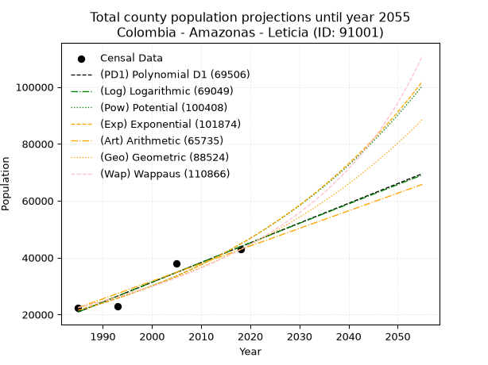
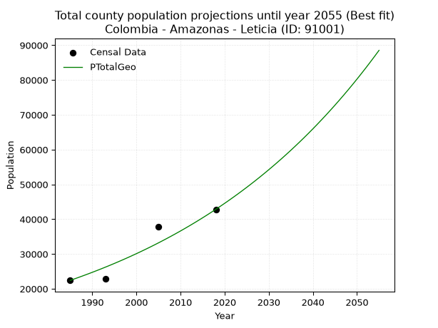
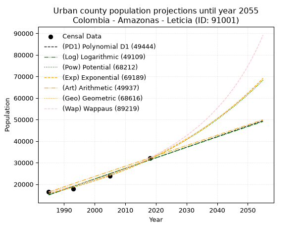
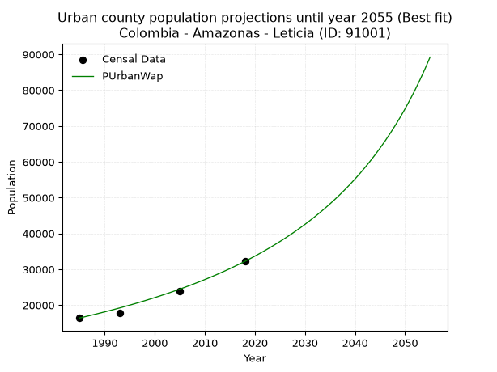
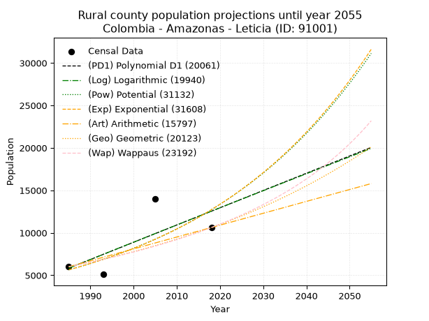
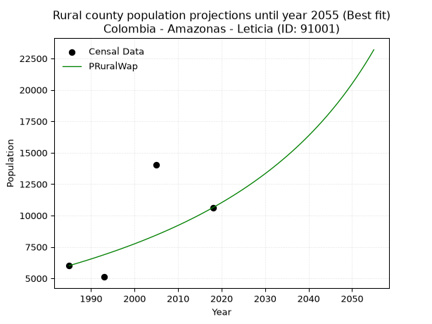

<div align="center">


</div>

# 📜 _“Population and Public Services Demand Projections (PPSD) until Year 2050 for Colombia - Amazonas - Leticia (ID: 91001)”_
Keywords: `population` `public-service` `projection` `lineal` `polynomial` `logarithmic` `potential` `exponential` `arithmetic` `geometric` `wappaus` `dane` `colombia` `south-america`

PPSD are analytical estimates used by governments and planners to anticipate future changes in population size, age distribution, and the resulting community needs for utilities, healthcare, education, and infrastructure as sizing future water treatment facilities, electrical grids, and road networks based on spatial growth.

<div align="center">

</img>

</div>


> **General running parameters**: • app_version: _v20260806_. • Python version: _3.14.7_. • Pandas version: _3.0.5_. • NumPy version: _2.5.1_. • Creates, save and include plots into reports (create_plot): _False_. • Projection until year: _2050_. • Process polynomial degree 2 and up: _False_. • Process Wappaus: _True_. • Process Wappaus: _True_. • Set negative values to zero: _True_. • Set infinite values to zero: _True_. • Drop dataset notes: _True_. 
<div align="center">

Dynamic map: [:earth_americas:Google](http://maps.google.com/maps?q=-4.19895025,-69.9417212) [:earth_americas:OSM](https://www.openstreetmap.org/#map=18/-4.19895025/-69.9417212&layers=P) [:earth_americas:Bing](https://www.bing.com/maps?cp=-4.19895025~-69.9417212&lvl=18) [:earth_americas:Apple](https://maps.apple.com/frame?center=-4.19895025%2C-69.9417212&span=0.003%2C0.006)

</div>


<div align="center">

```geojson
{
  "type": "Feature",
  "geometry": {
    "type": "Point", 
    "coordinates": [-69.9417212, -4.19895025]
  }, 
  "properties": {
    "Name": "Colombia - Amazonas - Leticia (ID: 91001)"
  }
}
```

</div>


## 0. Census Data (4 records)

Census data are official statistics collected by a government about the people and housing in a country. They usually include counts of total population, age, sex, race, income, education, and jobs.

📅Global census file: [Population.xlsx](../data/Population.xlsx)

| Source   |   Year |   CountryID | CountryName   |   StateID | StateName   |   CountyID | CountyName   |   PTotal |   PUrban |   PRural |
|:---------|-------:|------------:|:--------------|----------:|:------------|-----------:|:-------------|---------:|---------:|---------:|
| DANE     |   1985 |          57 | Colombia      |        91 | Amazonas    |      91001 | Leticia      |    22428 |    16418 |     6010 |
| DANE     |   1993 |          57 | Colombia      |        91 | Amazonas    |      91001 | Leticia      |    22866 |    17758 |     5108 |
| DANE     |   2005 |          57 | Colombia      |        91 | Amazonas    |      91001 | Leticia      |    37832 |    23811 |    14021 |
| DANE     |   2018 |          57 | Colombia      |        91 | Amazonas    |      91001 | Leticia      |    42844 |    32220 |    10624 |

> 🔥Some records could had specific notes about the registered values or the corresponding urban or rural distribution.

📅[SUI-RUPS](https://www.datos.gov.co/Hacienda-y-Cr-dito-P-blico/Registro-nico-de-Prestadores-de-Servicios-P-blicos/4qkq-csdn/about_data) - Local public utility companies: [RUPS.csv](../data/RUPS.csv)

 | SERVICIO       | ESTADO    | NOMBRE              | NIT         | DEPARTAMENTO_DOMICILIO   | MUNICIPIO_DOMICILIO   | DIRECCION         |   TELEFONO | EMAIL             | TIPO_PRESTADOR                 | CLASIFICACION                 |
|:---------------|:----------|:--------------------|:------------|:-------------------------|:----------------------|:------------------|-----------:|:------------------|:-------------------------------|:------------------------------|
| ACUEDUCTO      | OPERATIVA | ALCALDIA DE LETICIA | 899999302-9 | AMAZONAS                 | LETICIA               | Calle 10 N. 10-47 |    5928064 | sippdbg@gmail.com | MUNICIPIO (PRESTACIÓN DIRECTA) | MAYOR O IGUAL A 5001 USUARIOS |
| ALCANTARILLADO | OPERATIVA | ALCALDIA DE LETICIA | 899999302-9 | AMAZONAS                 | LETICIA               | Calle 10 N. 10-47 |    5928064 | sippdbg@gmail.com | MUNICIPIO (PRESTACIÓN DIRECTA) | MAYOR O IGUAL A 5001 USUARIOS |

## 1. Total

### 1.1. Coefficients and Parameters

* (PD1) Polynomial Deg 1: 694.3034925732597, -1357288.061019663 (lineal)
* (Log) Logarithmic: 1389787.9441843587, -10532296.800806943
* (Pow) Potential: 44.46474560792567, -142.3015648174184
* (Exp) Exponential: 0.022211283311978403, 1.5312475200713004e-15
* (Art) Arithmetic: Year diff. 2018 - 1985 = 33, Population diff. 42844 - 22428 = 20416, Annual growth = 618.6666666666666
* (Geo) Geometric: Year diff. 2018 - 1985 = 33, Population diff. 42844 - 22428 = 20416, Annual growth % = 0.019807415380798554
* (Wap) Wappaus: i = 1.8956571475262491, Condition values only valid for < 200)

<sub>
Wappaus condition values: ['0.00', '1.90', '3.79', '5.69', '7.58', '9.48', '11.37', '13.27', '15.17', '17.06', '18.96', '20.85', '22.75', '24.64', '26.54', '28.43', '30.33', '32.23', '34.12', '36.02', '37.91', '39.81', '41.70', '43.60', '45.50', '47.39', '49.29', '51.18', '53.08', '54.97', '56.87', '58.77', '60.66', '62.56', '64.45', '66.35', '68.24', '70.14', '72.03', '73.93', '75.83', '77.72', '79.62', '81.51', '83.41', '85.30', '87.20', '89.10', '90.99', '92.89', '94.78', '96.68', '98.57', '100.47', '102.37', '104.26', '106.16', '108.05', '109.95', '111.84', '113.74', '115.64', '117.53', '119.43', '121.32', '123.22']
</sub>


### 1.2. Projected Dataset

|   Year |   CountyID |   PTotalPD1 |   PTotalLog |   PTotalPow |   PTotalExp |   PTotalArt |   PTotalGeo |   PTotalWap |
|-------:|-----------:|------------:|------------:|------------:|------------:|------------:|------------:|------------:|
|   1985 |      91001 |       20904 |       20883 |       21504 |       21519 |       22428 |       22428 |       22428 |
|   1986 |      91001 |       21599 |       21583 |       21991 |       22003 |       23047 |       22872 |       22857 |
|   1987 |      91001 |       22293 |       22283 |       22489 |       22497 |       23665 |       23325 |       23295 |
|   1988 |      91001 |       22987 |       22982 |       22997 |       23002 |       24284 |       23787 |       23741 |
|   1989 |      91001 |       23682 |       23681 |       23518 |       23519 |       24903 |       24258 |       24196 |
|   1990 |      91001 |       24376 |       24379 |       24049 |       24047 |       25521 |       24739 |       24660 |
|   1991 |      91001 |       25070 |       25078 |       24592 |       24587 |       26140 |       25229 |       25133 |
|   1992 |      91001 |       25764 |       25776 |       25148 |       25139 |       26759 |       25729 |       25616 |
|   1993 |      91001 |       26459 |       26473 |       25715 |       25704 |       27377 |       26238 |       26108 |
|   1994 |      91001 |       27153 |       27170 |       26295 |       26281 |       27996 |       26758 |       26611 |
|   1995 |      91001 |       27847 |       27867 |       26888 |       26871 |       28615 |       27288 |       27125 |
|   1996 |      91001 |       28542 |       28563 |       27494 |       27475 |       29233 |       27829 |       27649 |
|   1997 |      91001 |       29236 |       29260 |       28113 |       28092 |       29852 |       28380 |       28185 |
|   1998 |      91001 |       29930 |       29955 |       28746 |       28723 |       30471 |       28942 |       28732 |
|   1999 |      91001 |       30625 |       30651 |       29392 |       29368 |       31089 |       29515 |       29291 |
|   2000 |      91001 |       31319 |       31346 |       30053 |       30028 |       31708 |       30100 |       29862 |
|   2001 |      91001 |       32013 |       32041 |       30729 |       30702 |       32327 |       30696 |       30447 |
|   2002 |      91001 |       32708 |       32735 |       31419 |       31392 |       32945 |       31304 |       31044 |
|   2003 |      91001 |       33402 |       33429 |       32125 |       32097 |       33564 |       31924 |       31655 |
|   2004 |      91001 |       34096 |       34123 |       32846 |       32818 |       34183 |       32556 |       32280 |
|   2005 |      91001 |       34790 |       34816 |       33582 |       33555 |       34801 |       33201 |       32920 |
|   2006 |      91001 |       35485 |       35509 |       34335 |       34308 |       35420 |       33859 |       33575 |
|   2007 |      91001 |       36179 |       36202 |       35105 |       35079 |       36039 |       34529 |       34246 |
|   2008 |      91001 |       36873 |       36894 |       35891 |       35867 |       36657 |       35213 |       34933 |
|   2009 |      91001 |       37568 |       37586 |       36694 |       36672 |       37276 |       35911 |       35636 |
|   2010 |      91001 |       38262 |       38277 |       37515 |       37496 |       37895 |       36622 |       36358 |
|   2011 |      91001 |       38956 |       38969 |       38354 |       38338 |       38513 |       37348 |       37097 |
|   2012 |      91001 |       39651 |       39660 |       39211 |       39199 |       39132 |       38087 |       37855 |
|   2013 |      91001 |       40345 |       40350 |       40087 |       40079 |       39751 |       38842 |       38633 |
|   2014 |      91001 |       41039 |       41040 |       40983 |       40980 |       40369 |       39611 |       39431 |
|   2015 |      91001 |       41733 |       41730 |       41897 |       41900 |       40988 |       40396 |       40251 |
|   2016 |      91001 |       42428 |       42420 |       42832 |       42841 |       41607 |       41196 |       41092 |
|   2017 |      91001 |       43122 |       43109 |       43787 |       43803 |       42225 |       42012 |       41956 |
|   2018 |      91001 |       43816 |       43798 |       44762 |       44787 |       42844 |       42844 |       42844 |
|   2019 |      91001 |       44511 |       44486 |       45759 |       45793 |       43463 |       43693 |       43757 |
|   2020 |      91001 |       45205 |       45175 |       46778 |       46822 |       44081 |       44558 |       44696 |
|   2021 |      91001 |       45899 |       45862 |       47819 |       47873 |       44700 |       45441 |       45661 |
|   2022 |      91001 |       46594 |       46550 |       48882 |       48948 |       45319 |       46341 |       46655 |
|   2023 |      91001 |       47288 |       47237 |       49969 |       50048 |       45937 |       47259 |       47679 |
|   2024 |      91001 |       47982 |       47924 |       51079 |       51172 |       46556 |       48195 |       48733 |
|   2025 |      91001 |       48677 |       48610 |       52214 |       52321 |       47175 |       49149 |       49819 |
|   2026 |      91001 |       49371 |       49297 |       53372 |       53496 |       47793 |       50123 |       50939 |
|   2027 |      91001 |       50065 |       49982 |       54556 |       54698 |       48412 |       51116 |       52095 |
|   2028 |      91001 |       50759 |       50668 |       55766 |       55926 |       49031 |       52128 |       53287 |
|   2029 |      91001 |       51454 |       51353 |       57002 |       57182 |       49649 |       53161 |       54518 |
|   2030 |      91001 |       52148 |       52038 |       58265 |       58467 |       50268 |       54214 |       55790 |
|   2031 |      91001 |       52842 |       52722 |       59555 |       59780 |       50887 |       55287 |       57104 |
|   2032 |      91001 |       53537 |       53406 |       60873 |       61122 |       51505 |       56382 |       58463 |
|   2033 |      91001 |       54231 |       54090 |       62219 |       62495 |       52124 |       57499 |       59870 |
|   2034 |      91001 |       54925 |       54774 |       63594 |       63899 |       52743 |       58638 |       61327 |
|   2035 |      91001 |       55620 |       55457 |       65000 |       65334 |       53361 |       59800 |       62836 |
|   2036 |      91001 |       56314 |       56140 |       66435 |       66801 |       53980 |       60984 |       64400 |
|   2037 |      91001 |       57008 |       56822 |       67902 |       68302 |       54599 |       62192 |       66023 |
|   2038 |      91001 |       57702 |       57504 |       69400 |       69836 |       55217 |       63424 |       67707 |
|   2039 |      91001 |       58397 |       58186 |       70930 |       71404 |       55836 |       64680 |       69458 |
|   2040 |      91001 |       59091 |       58867 |       72493 |       73008 |       56455 |       65961 |       71277 |
|   2041 |      91001 |       59785 |       59548 |       74090 |       74648 |       57073 |       67268 |       73170 |
|   2042 |      91001 |       60480 |       60229 |       75722 |       76324 |       57692 |       68600 |       75141 |
|   2043 |      91001 |       61174 |       60910 |       77388 |       78039 |       58311 |       69959 |       77195 |
|   2044 |      91001 |       61868 |       61590 |       79091 |       79791 |       58929 |       71345 |       79337 |
|   2045 |      91001 |       62563 |       62269 |       80830 |       81583 |       59548 |       72758 |       81573 |
|   2046 |      91001 |       63257 |       62949 |       82606 |       83416 |       60167 |       74199 |       83910 |
|   2047 |      91001 |       63951 |       63628 |       84420 |       85289 |       60785 |       75669 |       86354 |
|   2048 |      91001 |       64645 |       64307 |       86274 |       87205 |       61404 |       77168 |       88914 |
|   2049 |      91001 |       65340 |       64985 |       88167 |       89163 |       62023 |       78696 |       91596 |
|   2050 |      91001 |       66034 |       65663 |       90101 |       91166 |       62641 |       80255 |       94411 |
<div align="center">

</img>

</div>


### 1.3. Best fit with absolute and relative error (%)

Relative error puts that difference into context by dividing the absolute error by the true value, creating a unitless ratio or percentage that shows the scale of the mistake.

Absolute and relative error

|   Year | Source   |   CountryID | CountryName   |   StateID | StateName   |   CountyID_x | CountyName   |   PTotal |   PUrban |   PRural |   CountyID_y |   PTotalPD1 |   PTotalLog |   PTotalPow |   PTotalExp |   PTotalArt |   PTotalGeo |   PTotalWap |   PTotalPD1AbsError |   PTotalLogAbsError |   PTotalPowAbsError |   PTotalExpAbsError |   PTotalArtAbsError |   PTotalGeoAbsError |   PTotalWapAbsError |   PTotalPD1RelError |   PTotalLogRelError |   PTotalPowRelError |   PTotalExpRelError |   PTotalArtRelError |   PTotalGeoRelError |   PTotalWapRelError |
|-------:|:---------|------------:|:--------------|----------:|:------------|-------------:|:-------------|---------:|---------:|---------:|-------------:|------------:|------------:|------------:|------------:|------------:|------------:|------------:|--------------------:|--------------------:|--------------------:|--------------------:|--------------------:|--------------------:|--------------------:|--------------------:|--------------------:|--------------------:|--------------------:|--------------------:|--------------------:|--------------------:|
|   1985 | DANE     |          57 | Colombia      |        91 | Amazonas    |        91001 | Leticia      |    22428 |    16418 |     6010 |        91001 |       20904 |       20883 |       21504 |       21519 |       22428 |       22428 |       22428 |                1524 |                1545 |                 924 |                 909 |                   0 |                   0 |                   0 |             6.79508 |             6.88871 |             4.11985 |             4.05297 |             0       |              0      |              0      |
|   1993 | DANE     |          57 | Colombia      |        91 | Amazonas    |        91001 | Leticia      |    22866 |    17758 |     5108 |        91001 |       26459 |       26473 |       25715 |       25704 |       27377 |       26238 |       26108 |                3593 |                3607 |                2849 |                2838 |                4511 |                3372 |                3242 |            15.7133  |            15.7745  |            12.4595  |            12.4114  |            19.728   |             14.7468 |             14.1783 |
|   2005 | DANE     |          57 | Colombia      |        91 | Amazonas    |        91001 | Leticia      |    37832 |    23811 |    14021 |        91001 |       34790 |       34816 |       33582 |       33555 |       34801 |       33201 |       32920 |                3042 |                3016 |                4250 |                4277 |                3031 |                4631 |                4912 |             8.04081 |             7.97209 |            11.2339  |            11.3052  |             8.01174 |             12.241  |             12.9837 |
|   2018 | DANE     |          57 | Colombia      |        91 | Amazonas    |        91001 | Leticia      |    42844 |    32220 |    10624 |        91001 |       43816 |       43798 |       44762 |       44787 |       42844 |       42844 |       42844 |                 972 |                 954 |                1918 |                1943 |                   0 |                   0 |                   0 |             2.2687  |             2.22668 |             4.47671 |             4.53506 |             0       |              0      |              0      |

Relative error mean

| Method    |   RelError | Best   |
|:----------|-----------:|:-------|
| PTotalPD1 |    8.20447 |        |
| PTotalLog |    8.2155  |        |
| PTotalPow |    8.07249 |        |
| PTotalExp |    8.07618 |        |
| PTotalArt |    6.93493 |        |
| PTotalGeo |    6.74694 | True   |
| PTotalWap |    6.79049 |        |

💙Best method: _**PTotalGeo**_
<div align="center">

</img>

</div>


### 1.4. Fresh water supply demand in liters per capita per day (lpcd)

The fresh water supply demand typically ranges from 100 to 300 liters per capita per day (lpcd) for standard domestic and municipal planning, though absolute survival minimums set by the World Health Organization are as low as 7.5 to 20 liters per day, and total consumption in high-income nations can exceed 400 liters.

> `CZ`: Level in meters above the sea level (masl)<br> `WS`: Fresh water supply demand in liters per capita per day (lpcd or l/h/d)<br> `WSAll`: Zonal fresh water supply demand in liters per second (l/s)<br> `A`: Zonal area in square meters<br> `DP`: Population density (people/hectare or p/ha)

Reference values (RAS Colombia)

|    CZ |   WS |
|------:|-----:|
|  1000 |  120 |
|  2000 |  130 |
| 99999 |  140 |

County shapefile geometry properties and water supply values

|   CountyID |     ATotal |   CZTotal |   WSTotal |
|-----------:|-----------:|----------:|----------:|
|      91001 | 6.0103e+09 |   124.915 |       120 |

Projected values for best method: PTotalGeo

|   CountyID |   Year |   PTotalGeo |   DPTotal |   WSTotal |   WSTotalAll |
|-----------:|-------:|------------:|----------:|----------:|-------------:|
|      91001 |   1985 |       22428 |      0.04 |       120 |      31.15   |
|      91001 |   1986 |       22872 |      0.04 |       120 |      31.7667 |
|      91001 |   1987 |       23325 |      0.04 |       120 |      32.3958 |
|      91001 |   1988 |       23787 |      0.04 |       120 |      33.0375 |
|      91001 |   1989 |       24258 |      0.04 |       120 |      33.6917 |
|      91001 |   1990 |       24739 |      0.04 |       120 |      34.3597 |
|      91001 |   1991 |       25229 |      0.04 |       120 |      35.0403 |
|      91001 |   1992 |       25729 |      0.04 |       120 |      35.7347 |
|      91001 |   1993 |       26238 |      0.04 |       120 |      36.4417 |
|      91001 |   1994 |       26758 |      0.04 |       120 |      37.1639 |
|      91001 |   1995 |       27288 |      0.05 |       120 |      37.9    |
|      91001 |   1996 |       27829 |      0.05 |       120 |      38.6514 |
|      91001 |   1997 |       28380 |      0.05 |       120 |      39.4167 |
|      91001 |   1998 |       28942 |      0.05 |       120 |      40.1972 |
|      91001 |   1999 |       29515 |      0.05 |       120 |      40.9931 |
|      91001 |   2000 |       30100 |      0.05 |       120 |      41.8056 |
|      91001 |   2001 |       30696 |      0.05 |       120 |      42.6333 |
|      91001 |   2002 |       31304 |      0.05 |       120 |      43.4778 |
|      91001 |   2003 |       31924 |      0.05 |       120 |      44.3389 |
|      91001 |   2004 |       32556 |      0.05 |       120 |      45.2167 |
|      91001 |   2005 |       33201 |      0.06 |       120 |      46.1125 |
|      91001 |   2006 |       33859 |      0.06 |       120 |      47.0264 |
|      91001 |   2007 |       34529 |      0.06 |       120 |      47.9569 |
|      91001 |   2008 |       35213 |      0.06 |       120 |      48.9069 |
|      91001 |   2009 |       35911 |      0.06 |       120 |      49.8764 |
|      91001 |   2010 |       36622 |      0.06 |       120 |      50.8639 |
|      91001 |   2011 |       37348 |      0.06 |       120 |      51.8722 |
|      91001 |   2012 |       38087 |      0.06 |       120 |      52.8986 |
|      91001 |   2013 |       38842 |      0.06 |       120 |      53.9472 |
|      91001 |   2014 |       39611 |      0.07 |       120 |      55.0153 |
|      91001 |   2015 |       40396 |      0.07 |       120 |      56.1056 |
|      91001 |   2016 |       41196 |      0.07 |       120 |      57.2167 |
|      91001 |   2017 |       42012 |      0.07 |       120 |      58.35   |
|      91001 |   2018 |       42844 |      0.07 |       120 |      59.5056 |
|      91001 |   2019 |       43693 |      0.07 |       120 |      60.6847 |
|      91001 |   2020 |       44558 |      0.07 |       120 |      61.8861 |
|      91001 |   2021 |       45441 |      0.08 |       120 |      63.1125 |
|      91001 |   2022 |       46341 |      0.08 |       120 |      64.3625 |
|      91001 |   2023 |       47259 |      0.08 |       120 |      65.6375 |
|      91001 |   2024 |       48195 |      0.08 |       120 |      66.9375 |
|      91001 |   2025 |       49149 |      0.08 |       120 |      68.2625 |
|      91001 |   2026 |       50123 |      0.08 |       120 |      69.6153 |
|      91001 |   2027 |       51116 |      0.09 |       120 |      70.9944 |
|      91001 |   2028 |       52128 |      0.09 |       120 |      72.4    |
|      91001 |   2029 |       53161 |      0.09 |       120 |      73.8347 |
|      91001 |   2030 |       54214 |      0.09 |       120 |      75.2972 |
|      91001 |   2031 |       55287 |      0.09 |       120 |      76.7875 |
|      91001 |   2032 |       56382 |      0.09 |       120 |      78.3083 |
|      91001 |   2033 |       57499 |      0.1  |       120 |      79.8597 |
|      91001 |   2034 |       58638 |      0.1  |       120 |      81.4417 |
|      91001 |   2035 |       59800 |      0.1  |       120 |      83.0556 |
|      91001 |   2036 |       60984 |      0.1  |       120 |      84.7    |
|      91001 |   2037 |       62192 |      0.1  |       120 |      86.3778 |
|      91001 |   2038 |       63424 |      0.11 |       120 |      88.0889 |
|      91001 |   2039 |       64680 |      0.11 |       120 |      89.8333 |
|      91001 |   2040 |       65961 |      0.11 |       120 |      91.6125 |
|      91001 |   2041 |       67268 |      0.11 |       120 |      93.4278 |
|      91001 |   2042 |       68600 |      0.11 |       120 |      95.2778 |
|      91001 |   2043 |       69959 |      0.12 |       120 |      97.1653 |
|      91001 |   2044 |       71345 |      0.12 |       120 |      99.0903 |
|      91001 |   2045 |       72758 |      0.12 |       120 |     101.053  |
|      91001 |   2046 |       74199 |      0.12 |       120 |     103.054  |
|      91001 |   2047 |       75669 |      0.13 |       120 |     105.096  |
|      91001 |   2048 |       77168 |      0.13 |       120 |     107.178  |
|      91001 |   2049 |       78696 |      0.13 |       120 |     109.3    |
|      91001 |   2050 |       80255 |      0.13 |       120 |     111.465  |

## 2. Urban

### 2.1. Coefficients and Parameters

* (PD1) Polynomial Deg 1: 491.18787635487183, -959946.7996788324 (lineal)
* (Log) Logarithmic: 982749.3869661829, -7447334.215589299
* (Pow) Potential: 42.302222724343, -135.30544092514342
* (Exp) Exponential: 0.021138974696002386, 9.419527239879144e-15
* (Art) Arithmetic: Year diff. 2018 - 1985 = 33, Population diff. 32220 - 16418 = 15802, Annual growth = 478.8484848484849
* (Geo) Geometric: Year diff. 2018 - 1985 = 33, Population diff. 32220 - 16418 = 15802, Annual growth % = 0.020640711168065096
* (Wap) Wappaus: i = 1.969030325459455, Condition values only valid for < 200)

<sub>
Wappaus condition values: ['0.00', '1.97', '3.94', '5.91', '7.88', '9.85', '11.81', '13.78', '15.75', '17.72', '19.69', '21.66', '23.63', '25.60', '27.57', '29.54', '31.50', '33.47', '35.44', '37.41', '39.38', '41.35', '43.32', '45.29', '47.26', '49.23', '51.19', '53.16', '55.13', '57.10', '59.07', '61.04', '63.01', '64.98', '66.95', '68.92', '70.89', '72.85', '74.82', '76.79', '78.76', '80.73', '82.70', '84.67', '86.64', '88.61', '90.58', '92.54', '94.51', '96.48', '98.45', '100.42', '102.39', '104.36', '106.33', '108.30', '110.27', '112.23', '114.20', '116.17', '118.14', '120.11', '122.08', '124.05', '126.02', '127.99']
</sub>


### 2.2. Projected Dataset

|   Year |   CountyID |   PUrbanPD1 |   PUrbanLog |   PUrbanPow |   PUrbanExp |   PUrbanArt |   PUrbanGeo |   PUrbanWap |
|-------:|-----------:|------------:|------------:|------------:|------------:|------------:|------------:|------------:|
|   1985 |      91001 |       15061 |       15050 |       15746 |       15754 |       16418 |       16418 |       16418 |
|   1986 |      91001 |       15552 |       15545 |       16085 |       16091 |       16897 |       16757 |       16744 |
|   1987 |      91001 |       16044 |       16039 |       16431 |       16435 |       17376 |       17103 |       17078 |
|   1988 |      91001 |       16535 |       16534 |       16784 |       16786 |       17855 |       17456 |       17417 |
|   1989 |      91001 |       17026 |       17028 |       17145 |       17144 |       18333 |       17816 |       17764 |
|   1990 |      91001 |       17517 |       17522 |       17514 |       17511 |       18812 |       18184 |       18118 |
|   1991 |      91001 |       18008 |       18016 |       17890 |       17885 |       19291 |       18559 |       18479 |
|   1992 |      91001 |       18499 |       18509 |       18274 |       18267 |       19770 |       18942 |       18848 |
|   1993 |      91001 |       18991 |       19002 |       18666 |       18657 |       20249 |       19333 |       19225 |
|   1994 |      91001 |       19482 |       19495 |       19066 |       19056 |       20728 |       19732 |       19610 |
|   1995 |      91001 |       19973 |       19988 |       19475 |       19463 |       21206 |       20140 |       20004 |
|   1996 |      91001 |       20464 |       20481 |       19892 |       19879 |       21685 |       20555 |       20406 |
|   1997 |      91001 |       20955 |       20973 |       20318 |       20303 |       22164 |       20979 |       20817 |
|   1998 |      91001 |       21447 |       21465 |       20753 |       20737 |       22643 |       21413 |       21237 |
|   1999 |      91001 |       21938 |       21957 |       21197 |       21180 |       23122 |       21854 |       21667 |
|   2000 |      91001 |       22429 |       22448 |       21650 |       21633 |       23601 |       22306 |       22107 |
|   2001 |      91001 |       22920 |       22939 |       22113 |       22095 |       24080 |       22766 |       22558 |
|   2002 |      91001 |       23411 |       23430 |       22585 |       22567 |       24558 |       23236 |       23018 |
|   2003 |      91001 |       23903 |       23921 |       23068 |       23049 |       25037 |       23715 |       23490 |
|   2004 |      91001 |       24394 |       24412 |       23560 |       23541 |       25516 |       24205 |       23974 |
|   2005 |      91001 |       24885 |       24902 |       24062 |       24044 |       25995 |       24705 |       24469 |
|   2006 |      91001 |       25376 |       25392 |       24575 |       24558 |       26474 |       25215 |       24976 |
|   2007 |      91001 |       25867 |       25882 |       25099 |       25083 |       26953 |       25735 |       25496 |
|   2008 |      91001 |       26358 |       26371 |       25633 |       25618 |       27432 |       26266 |       26030 |
|   2009 |      91001 |       26850 |       26860 |       26179 |       26166 |       27910 |       26808 |       26577 |
|   2010 |      91001 |       27341 |       27350 |       26736 |       26725 |       28389 |       27362 |       27139 |
|   2011 |      91001 |       27832 |       27838 |       27304 |       27296 |       28868 |       27926 |       27715 |
|   2012 |      91001 |       28323 |       28327 |       27885 |       27879 |       29347 |       28503 |       28307 |
|   2013 |      91001 |       28814 |       28815 |       28477 |       28475 |       29826 |       29091 |       28915 |
|   2014 |      91001 |       29306 |       29303 |       29082 |       29083 |       30305 |       29692 |       29539 |
|   2015 |      91001 |       29797 |       29791 |       29699 |       29704 |       30783 |       30304 |       30181 |
|   2016 |      91001 |       30288 |       30279 |       30329 |       30339 |       31262 |       30930 |       30842 |
|   2017 |      91001 |       30779 |       30766 |       30972 |       30987 |       31741 |       31568 |       31521 |
|   2018 |      91001 |       31270 |       31253 |       31628 |       31649 |       32220 |       32220 |       32220 |
|   2019 |      91001 |       31762 |       31740 |       32298 |       32325 |       32699 |       32885 |       32940 |
|   2020 |      91001 |       32253 |       32227 |       32981 |       33016 |       33178 |       33564 |       33681 |
|   2021 |      91001 |       32744 |       32713 |       33679 |       33721 |       33657 |       34257 |       34445 |
|   2022 |      91001 |       33235 |       33199 |       34391 |       34441 |       34135 |       34964 |       35233 |
|   2023 |      91001 |       33726 |       33685 |       35118 |       35177 |       34614 |       35685 |       36045 |
|   2024 |      91001 |       34217 |       34171 |       35860 |       35929 |       35093 |       36422 |       36884 |
|   2025 |      91001 |       34709 |       34656 |       36617 |       36696 |       35572 |       37174 |       37749 |
|   2026 |      91001 |       35200 |       35141 |       37390 |       37480 |       36051 |       37941 |       38644 |
|   2027 |      91001 |       35691 |       35626 |       38179 |       38281 |       36530 |       38724 |       39568 |
|   2028 |      91001 |       36182 |       36111 |       38984 |       39099 |       37008 |       39523 |       40524 |
|   2029 |      91001 |       36673 |       36596 |       39805 |       39934 |       37487 |       40339 |       41513 |
|   2030 |      91001 |       37165 |       37080 |       40644 |       40787 |       37966 |       41172 |       42537 |
|   2031 |      91001 |       37656 |       37564 |       41499 |       41659 |       38445 |       42022 |       43598 |
|   2032 |      91001 |       38147 |       38048 |       42373 |       42549 |       38924 |       42889 |       44697 |
|   2033 |      91001 |       38638 |       38531 |       43264 |       43458 |       39403 |       43774 |       45838 |
|   2034 |      91001 |       39129 |       39014 |       44173 |       44386 |       39882 |       44678 |       47022 |
|   2035 |      91001 |       39621 |       39497 |       45101 |       45334 |       40360 |       45600 |       48253 |
|   2036 |      91001 |       40112 |       39980 |       46048 |       46303 |       40839 |       46541 |       49531 |
|   2037 |      91001 |       40603 |       40463 |       47015 |       47292 |       41318 |       47502 |       50862 |
|   2038 |      91001 |       41094 |       40945 |       48001 |       48303 |       41797 |       48482 |       52247 |
|   2039 |      91001 |       41585 |       41427 |       49008 |       49334 |       42276 |       49483 |       53690 |
|   2040 |      91001 |       42076 |       41909 |       50035 |       50388 |       42755 |       50504 |       55196 |
|   2041 |      91001 |       42568 |       42391 |       51083 |       51465 |       43234 |       51547 |       56767 |
|   2042 |      91001 |       43059 |       42872 |       52152 |       52564 |       43712 |       52611 |       58409 |
|   2043 |      91001 |       43550 |       43353 |       53244 |       53687 |       44191 |       53697 |       60126 |
|   2044 |      91001 |       44041 |       43834 |       54357 |       54834 |       44670 |       54805 |       61924 |
|   2045 |      91001 |       44532 |       44315 |       55494 |       56006 |       45149 |       55936 |       63809 |
|   2046 |      91001 |       45024 |       44795 |       56653 |       57202 |       45628 |       57091 |       65786 |
|   2047 |      91001 |       45515 |       45275 |       57837 |       58424 |       46107 |       58269 |       67863 |
|   2048 |      91001 |       46006 |       45755 |       59044 |       59673 |       46585 |       59472 |       70048 |
|   2049 |      91001 |       46497 |       46235 |       60276 |       60947 |       47064 |       60699 |       72349 |
|   2050 |      91001 |       46988 |       46715 |       61533 |       62250 |       47543 |       61952 |       74777 |
<div align="center">

</img>

</div>


### 2.3. Best fit with absolute and relative error (%)

Relative error puts that difference into context by dividing the absolute error by the true value, creating a unitless ratio or percentage that shows the scale of the mistake.

Absolute and relative error

|   Year | Source   |   CountryID | CountryName   |   StateID | StateName   |   CountyID_x | CountyName   |   PTotal |   PUrban |   PRural |   CountyID_y |   PUrbanPD1 |   PUrbanLog |   PUrbanPow |   PUrbanExp |   PUrbanArt |   PUrbanGeo |   PUrbanWap |   PUrbanPD1AbsError |   PUrbanLogAbsError |   PUrbanPowAbsError |   PUrbanExpAbsError |   PUrbanArtAbsError |   PUrbanGeoAbsError |   PUrbanWapAbsError |   PUrbanPD1RelError |   PUrbanLogRelError |   PUrbanPowRelError |   PUrbanExpRelError |   PUrbanArtRelError |   PUrbanGeoRelError |   PUrbanWapRelError |
|-------:|:---------|------------:|:--------------|----------:|:------------|-------------:|:-------------|---------:|---------:|---------:|-------------:|------------:|------------:|------------:|------------:|------------:|------------:|------------:|--------------------:|--------------------:|--------------------:|--------------------:|--------------------:|--------------------:|--------------------:|--------------------:|--------------------:|--------------------:|--------------------:|--------------------:|--------------------:|--------------------:|
|   1985 | DANE     |          57 | Colombia      |        91 | Amazonas    |        91001 | Leticia      |    22428 |    16418 |     6010 |        91001 |       15061 |       15050 |       15746 |       15754 |       16418 |       16418 |       16418 |                1357 |                1368 |                 672 |                 664 |                   0 |                   0 |                   0 |             8.26532 |             8.33232 |             4.09307 |            4.04434  |             0       |             0       |             0       |
|   1993 | DANE     |          57 | Colombia      |        91 | Amazonas    |        91001 | Leticia      |    22866 |    17758 |     5108 |        91001 |       18991 |       19002 |       18666 |       18657 |       20249 |       19333 |       19225 |                1233 |                1244 |                 908 |                 899 |                2491 |                1575 |                1467 |             6.94335 |             7.00529 |             5.11319 |            5.06251  |            14.0275  |             8.86924 |             8.26107 |
|   2005 | DANE     |          57 | Colombia      |        91 | Amazonas    |        91001 | Leticia      |    37832 |    23811 |    14021 |        91001 |       24885 |       24902 |       24062 |       24044 |       25995 |       24705 |       24469 |                1074 |                1091 |                 251 |                 233 |                2184 |                 894 |                 658 |             4.51052 |             4.58192 |             1.05413 |            0.978539 |             9.17223 |             3.75457 |             2.76343 |
|   2018 | DANE     |          57 | Colombia      |        91 | Amazonas    |        91001 | Leticia      |    42844 |    32220 |    10624 |        91001 |       31270 |       31253 |       31628 |       31649 |       32220 |       32220 |       32220 |                 950 |                 967 |                 592 |                 571 |                   0 |                   0 |                   0 |             2.94848 |             3.00124 |             1.83737 |            1.77219  |             0       |             0       |             0       |

Relative error mean

| Method    |   RelError | Best   |
|:----------|-----------:|:-------|
| PUrbanPD1 |    5.66692 |        |
| PUrbanLog |    5.73019 |        |
| PUrbanPow |    3.02444 |        |
| PUrbanExp |    2.96439 |        |
| PUrbanArt |    5.79993 |        |
| PUrbanGeo |    3.15595 |        |
| PUrbanWap |    2.75612 | True   |

💙Best method: _**PUrbanWap**_
<div align="center">

</img>

</div>


### 2.4. Fresh water supply demand in liters per capita per day (lpcd)

The fresh water supply demand typically ranges from 100 to 300 liters per capita per day (lpcd) for standard domestic and municipal planning, though absolute survival minimums set by the World Health Organization are as low as 7.5 to 20 liters per day, and total consumption in high-income nations can exceed 400 liters.

> `CZ`: Level in meters above the sea level (masl)<br> `WS`: Fresh water supply demand in liters per capita per day (lpcd or l/h/d)<br> `WSAll`: Zonal fresh water supply demand in liters per second (l/s)<br> `A`: Zonal area in square meters<br> `DP`: Population density (people/hectare or p/ha)

Reference values (RAS Colombia)

|    CZ |   WS |
|------:|-----:|
|  1000 |  120 |
|  2000 |  130 |
| 99999 |  140 |

County shapefile geometry properties and water supply values

|   CountyID |    AUrban |   CZUrban |   WSUrban |
|-----------:|----------:|----------:|----------:|
|      91001 | 1.279e+07 |   77.8862 |       120 |

Projected values for best method: PUrbanWap

|   CountyID |   Year |   PUrbanWap |   DPUrban |   WSUrban |   WSUrbanAll |
|-----------:|-------:|------------:|----------:|----------:|-------------:|
|      91001 |   1985 |       16418 |     12.84 |       120 |      22.8028 |
|      91001 |   1986 |       16744 |     13.09 |       120 |      23.2556 |
|      91001 |   1987 |       17078 |     13.35 |       120 |      23.7194 |
|      91001 |   1988 |       17417 |     13.62 |       120 |      24.1903 |
|      91001 |   1989 |       17764 |     13.89 |       120 |      24.6722 |
|      91001 |   1990 |       18118 |     14.17 |       120 |      25.1639 |
|      91001 |   1991 |       18479 |     14.45 |       120 |      25.6653 |
|      91001 |   1992 |       18848 |     14.74 |       120 |      26.1778 |
|      91001 |   1993 |       19225 |     15.03 |       120 |      26.7014 |
|      91001 |   1994 |       19610 |     15.33 |       120 |      27.2361 |
|      91001 |   1995 |       20004 |     15.64 |       120 |      27.7833 |
|      91001 |   1996 |       20406 |     15.95 |       120 |      28.3417 |
|      91001 |   1997 |       20817 |     16.28 |       120 |      28.9125 |
|      91001 |   1998 |       21237 |     16.6  |       120 |      29.4958 |
|      91001 |   1999 |       21667 |     16.94 |       120 |      30.0931 |
|      91001 |   2000 |       22107 |     17.28 |       120 |      30.7042 |
|      91001 |   2001 |       22558 |     17.64 |       120 |      31.3306 |
|      91001 |   2002 |       23018 |     18    |       120 |      31.9694 |
|      91001 |   2003 |       23490 |     18.37 |       120 |      32.625  |
|      91001 |   2004 |       23974 |     18.74 |       120 |      33.2972 |
|      91001 |   2005 |       24469 |     19.13 |       120 |      33.9847 |
|      91001 |   2006 |       24976 |     19.53 |       120 |      34.6889 |
|      91001 |   2007 |       25496 |     19.93 |       120 |      35.4111 |
|      91001 |   2008 |       26030 |     20.35 |       120 |      36.1528 |
|      91001 |   2009 |       26577 |     20.78 |       120 |      36.9125 |
|      91001 |   2010 |       27139 |     21.22 |       120 |      37.6931 |
|      91001 |   2011 |       27715 |     21.67 |       120 |      38.4931 |
|      91001 |   2012 |       28307 |     22.13 |       120 |      39.3153 |
|      91001 |   2013 |       28915 |     22.61 |       120 |      40.1597 |
|      91001 |   2014 |       29539 |     23.1  |       120 |      41.0264 |
|      91001 |   2015 |       30181 |     23.6  |       120 |      41.9181 |
|      91001 |   2016 |       30842 |     24.11 |       120 |      42.8361 |
|      91001 |   2017 |       31521 |     24.64 |       120 |      43.7792 |
|      91001 |   2018 |       32220 |     25.19 |       120 |      44.75   |
|      91001 |   2019 |       32940 |     25.75 |       120 |      45.75   |
|      91001 |   2020 |       33681 |     26.33 |       120 |      46.7792 |
|      91001 |   2021 |       34445 |     26.93 |       120 |      47.8403 |
|      91001 |   2022 |       35233 |     27.55 |       120 |      48.9347 |
|      91001 |   2023 |       36045 |     28.18 |       120 |      50.0625 |
|      91001 |   2024 |       36884 |     28.84 |       120 |      51.2278 |
|      91001 |   2025 |       37749 |     29.51 |       120 |      52.4292 |
|      91001 |   2026 |       38644 |     30.21 |       120 |      53.6722 |
|      91001 |   2027 |       39568 |     30.94 |       120 |      54.9556 |
|      91001 |   2028 |       40524 |     31.68 |       120 |      56.2833 |
|      91001 |   2029 |       41513 |     32.46 |       120 |      57.6569 |
|      91001 |   2030 |       42537 |     33.26 |       120 |      59.0792 |
|      91001 |   2031 |       43598 |     34.09 |       120 |      60.5528 |
|      91001 |   2032 |       44697 |     34.95 |       120 |      62.0792 |
|      91001 |   2033 |       45838 |     35.84 |       120 |      63.6639 |
|      91001 |   2034 |       47022 |     36.76 |       120 |      65.3083 |
|      91001 |   2035 |       48253 |     37.73 |       120 |      67.0181 |
|      91001 |   2036 |       49531 |     38.73 |       120 |      68.7931 |
|      91001 |   2037 |       50862 |     39.77 |       120 |      70.6417 |
|      91001 |   2038 |       52247 |     40.85 |       120 |      72.5653 |
|      91001 |   2039 |       53690 |     41.98 |       120 |      74.5694 |
|      91001 |   2040 |       55196 |     43.16 |       120 |      76.6611 |
|      91001 |   2041 |       56767 |     44.38 |       120 |      78.8431 |
|      91001 |   2042 |       58409 |     45.67 |       120 |      81.1236 |
|      91001 |   2043 |       60126 |     47.01 |       120 |      83.5083 |
|      91001 |   2044 |       61924 |     48.42 |       120 |      86.0056 |
|      91001 |   2045 |       63809 |     49.89 |       120 |      88.6236 |
|      91001 |   2046 |       65786 |     51.44 |       120 |      91.3694 |
|      91001 |   2047 |       67863 |     53.06 |       120 |      94.2542 |
|      91001 |   2048 |       70048 |     54.77 |       120 |      97.2889 |
|      91001 |   2049 |       72349 |     56.57 |       120 |     100.485  |
|      91001 |   2050 |       74777 |     58.47 |       120 |     103.857  |

## 3. Rural

### 3.1. Coefficients and Parameters

* (PD1) Polynomial Deg 1: 203.11561621838777, -397341.2613408302 (lineal)
* (Log) Logarithmic: 407038.5572181756, -3084962.5852176426
* (Pow) Potential: 49.26340948824508, -158.70720261498892
* (Exp) Exponential: 0.024592306352809352, 3.562641599260375e-18
* (Art) Arithmetic: Year diff. 2018 - 1985 = 33, Population diff. 10624 - 6010 = 4614, Annual growth = 139.8181818181818
* (Geo) Geometric: Year diff. 2018 - 1985 = 33, Population diff. 10624 - 6010 = 4614, Annual growth % = 0.017413231890115455
* (Wap) Wappaus: i = 1.6811131636188748, Condition values only valid for < 200)

<sub>
Wappaus condition values: ['0.00', '1.68', '3.36', '5.04', '6.72', '8.41', '10.09', '11.77', '13.45', '15.13', '16.81', '18.49', '20.17', '21.85', '23.54', '25.22', '26.90', '28.58', '30.26', '31.94', '33.62', '35.30', '36.98', '38.67', '40.35', '42.03', '43.71', '45.39', '47.07', '48.75', '50.43', '52.11', '53.80', '55.48', '57.16', '58.84', '60.52', '62.20', '63.88', '65.56', '67.24', '68.93', '70.61', '72.29', '73.97', '75.65', '77.33', '79.01', '80.69', '82.37', '84.06', '85.74', '87.42', '89.10', '90.78', '92.46', '94.14', '95.82', '97.50', '99.19', '100.87', '102.55', '104.23', '105.91', '107.59', '109.27']
</sub>


### 3.2. Projected Dataset

|   Year |   CountyID |   PRuralPD1 |   PRuralLog |   PRuralPow |   PRuralExp |   PRuralArt |   PRuralGeo |   PRuralWap |
|-------:|-----------:|------------:|------------:|------------:|------------:|------------:|------------:|------------:|
|   1985 |      91001 |        5843 |        5833 |        5646 |        5652 |        6010 |        6010 |        6010 |
|   1986 |      91001 |        6046 |        6038 |        5788 |        5792 |        6150 |        6115 |        6112 |
|   1987 |      91001 |        6249 |        6243 |        5933 |        5937 |        6290 |        6221 |        6216 |
|   1988 |      91001 |        6453 |        6448 |        6082 |        6084 |        6429 |        6329 |        6321 |
|   1989 |      91001 |        6656 |        6653 |        6234 |        6236 |        6569 |        6440 |        6428 |
|   1990 |      91001 |        6859 |        6857 |        6391 |        6391 |        6709 |        6552 |        6537 |
|   1991 |      91001 |        7062 |        7062 |        6551 |        6550 |        6849 |        6666 |        6648 |
|   1992 |      91001 |        7265 |        7266 |        6715 |        6713 |        6989 |        6782 |        6761 |
|   1993 |      91001 |        7468 |        7471 |        6883 |        6880 |        7129 |        6900 |        6877 |
|   1994 |      91001 |        7671 |        7675 |        7055 |        7052 |        7268 |        7020 |        6994 |
|   1995 |      91001 |        7874 |        7879 |        7232 |        7227 |        7408 |        7142 |        7113 |
|   1996 |      91001 |        8078 |        8083 |        7412 |        7407 |        7548 |        7267 |        7235 |
|   1997 |      91001 |        8281 |        8287 |        7598 |        7592 |        7688 |        7393 |        7358 |
|   1998 |      91001 |        8484 |        8491 |        7787 |        7781 |        7828 |        7522 |        7485 |
|   1999 |      91001 |        8687 |        8694 |        7982 |        7974 |        7967 |        7653 |        7613 |
|   2000 |      91001 |        8890 |        8898 |        8181 |        8173 |        8107 |        7786 |        7744 |
|   2001 |      91001 |        9093 |        9101 |        8385 |        8376 |        8247 |        7922 |        7878 |
|   2002 |      91001 |        9296 |        9305 |        8594 |        8585 |        8387 |        8060 |        8014 |
|   2003 |      91001 |        9499 |        9508 |        8808 |        8799 |        8527 |        8200 |        8153 |
|   2004 |      91001 |        9702 |        9711 |        9027 |        9018 |        8667 |        8343 |        8295 |
|   2005 |      91001 |        9906 |        9914 |        9251 |        9242 |        8806 |        8488 |        8439 |
|   2006 |      91001 |       10109 |       10117 |        9482 |        9472 |        8946 |        8636 |        8587 |
|   2007 |      91001 |       10312 |       10320 |        9717 |        9708 |        9086 |        8787 |        8737 |
|   2008 |      91001 |       10515 |       10523 |        9959 |        9950 |        9226 |        8940 |        8891 |
|   2009 |      91001 |       10718 |       10725 |       10206 |       10198 |        9366 |        9095 |        9048 |
|   2010 |      91001 |       10921 |       10928 |       10459 |       10452 |        9505 |        9254 |        9208 |
|   2011 |      91001 |       11124 |       11130 |       10719 |       10712 |        9645 |        9415 |        9372 |
|   2012 |      91001 |       11327 |       11333 |       10984 |       10978 |        9785 |        9579 |        9539 |
|   2013 |      91001 |       11530 |       11535 |       11257 |       11252 |        9925 |        9745 |        9710 |
|   2014 |      91001 |       11734 |       11737 |       11535 |       11532 |       10065 |        9915 |        9884 |
|   2015 |      91001 |       11937 |       11939 |       11821 |       11819 |       10205 |       10088 |       10063 |
|   2016 |      91001 |       12140 |       12141 |       12113 |       12113 |       10344 |       10263 |       10246 |
|   2017 |      91001 |       12343 |       12343 |       12413 |       12415 |       10484 |       10442 |       10433 |
|   2018 |      91001 |       12546 |       12545 |       12720 |       12724 |       10624 |       10624 |       10624 |
|   2019 |      91001 |       12749 |       12746 |       13034 |       13041 |       10764 |       10809 |       10820 |
|   2020 |      91001 |       12952 |       12948 |       13356 |       13365 |       10904 |       10997 |       11020 |
|   2021 |      91001 |       13155 |       13149 |       13686 |       13698 |       11043 |       11189 |       11225 |
|   2022 |      91001 |       13359 |       13351 |       14023 |       14039 |       11183 |       11384 |       11436 |
|   2023 |      91001 |       13562 |       13552 |       14369 |       14389 |       11323 |       11582 |       11651 |
|   2024 |      91001 |       13765 |       13753 |       14723 |       14747 |       11463 |       11783 |       11872 |
|   2025 |      91001 |       13968 |       13954 |       15086 |       15114 |       11603 |       11989 |       12098 |
|   2026 |      91001 |       14171 |       14155 |       15457 |       15491 |       11743 |       12197 |       12331 |
|   2027 |      91001 |       14374 |       14356 |       15838 |       15876 |       11882 |       12410 |       12569 |
|   2028 |      91001 |       14577 |       14557 |       16227 |       16271 |       12022 |       12626 |       12814 |
|   2029 |      91001 |       14780 |       14757 |       16626 |       16677 |       12162 |       12846 |       13065 |
|   2030 |      91001 |       14983 |       14958 |       17034 |       17092 |       12302 |       13069 |       13323 |
|   2031 |      91001 |       15187 |       15158 |       17453 |       17517 |       12442 |       13297 |       13587 |
|   2032 |      91001 |       15390 |       15359 |       17881 |       17953 |       12581 |       13529 |       13860 |
|   2033 |      91001 |       15593 |       15559 |       18320 |       18400 |       12721 |       13764 |       14140 |
|   2034 |      91001 |       15796 |       15759 |       18769 |       18859 |       12861 |       14004 |       14428 |
|   2035 |      91001 |       15999 |       15959 |       19229 |       19328 |       13001 |       14248 |       14724 |
|   2036 |      91001 |       16202 |       16159 |       19700 |       19809 |       13141 |       14496 |       15029 |
|   2037 |      91001 |       16405 |       16359 |       20183 |       20302 |       13281 |       14748 |       15343 |
|   2038 |      91001 |       16608 |       16559 |       20677 |       20808 |       13420 |       15005 |       15667 |
|   2039 |      91001 |       16811 |       16759 |       21182 |       21326 |       13560 |       15266 |       16001 |
|   2040 |      91001 |       17015 |       16958 |       21700 |       21857 |       13700 |       15532 |       16345 |
|   2041 |      91001 |       17218 |       17158 |       22230 |       22401 |       13840 |       15803 |       16700 |
|   2042 |      91001 |       17421 |       17357 |       22773 |       22959 |       13980 |       16078 |       17066 |
|   2043 |      91001 |       17624 |       17556 |       23329 |       23530 |       14119 |       16358 |       17445 |
|   2044 |      91001 |       17827 |       17756 |       23899 |       24116 |       14259 |       16643 |       17836 |
|   2045 |      91001 |       18030 |       17955 |       24481 |       24717 |       14399 |       16932 |       18240 |
|   2046 |      91001 |       18233 |       18154 |       25078 |       25332 |       14539 |       17227 |       18659 |
|   2047 |      91001 |       18436 |       18353 |       25689 |       25963 |       14679 |       17527 |       19092 |
|   2048 |      91001 |       18640 |       18551 |       26315 |       26609 |       14819 |       17832 |       19540 |
|   2049 |      91001 |       18843 |       18750 |       26955 |       27272 |       14958 |       18143 |       20005 |
|   2050 |      91001 |       19046 |       18949 |       27611 |       27951 |       15098 |       18459 |       20487 |
<div align="center">

</img>

</div>


### 3.3. Best fit with absolute and relative error (%)

Relative error puts that difference into context by dividing the absolute error by the true value, creating a unitless ratio or percentage that shows the scale of the mistake.

Absolute and relative error

|   Year | Source   |   CountryID | CountryName   |   StateID | StateName   |   CountyID_x | CountyName   |   PTotal |   PUrban |   PRural |   CountyID_y |   PRuralPD1 |   PRuralLog |   PRuralPow |   PRuralExp |   PRuralArt |   PRuralGeo |   PRuralWap |   PRuralPD1AbsError |   PRuralLogAbsError |   PRuralPowAbsError |   PRuralExpAbsError |   PRuralArtAbsError |   PRuralGeoAbsError |   PRuralWapAbsError |   PRuralPD1RelError |   PRuralLogRelError |   PRuralPowRelError |   PRuralExpRelError |   PRuralArtRelError |   PRuralGeoRelError |   PRuralWapRelError |
|-------:|:---------|------------:|:--------------|----------:|:------------|-------------:|:-------------|---------:|---------:|---------:|-------------:|------------:|------------:|------------:|------------:|------------:|------------:|------------:|--------------------:|--------------------:|--------------------:|--------------------:|--------------------:|--------------------:|--------------------:|--------------------:|--------------------:|--------------------:|--------------------:|--------------------:|--------------------:|--------------------:|
|   1985 | DANE     |          57 | Colombia      |        91 | Amazonas    |        91001 | Leticia      |    22428 |    16418 |     6010 |        91001 |        5843 |        5833 |        5646 |        5652 |        6010 |        6010 |        6010 |                 167 |                 177 |                 364 |                 358 |                   0 |                   0 |                   0 |              2.7787 |             2.94509 |             6.05657 |             5.95674 |              0      |              0      |              0      |
|   1993 | DANE     |          57 | Colombia      |        91 | Amazonas    |        91001 | Leticia      |    22866 |    17758 |     5108 |        91001 |        7468 |        7471 |        6883 |        6880 |        7129 |        6900 |        6877 |                2360 |                2363 |                1775 |                1772 |                2021 |                1792 |                1769 |             46.202  |            46.2608  |            34.7494  |            34.6907  |             39.5654 |             35.0822 |             34.6319 |
|   2005 | DANE     |          57 | Colombia      |        91 | Amazonas    |        91001 | Leticia      |    37832 |    23811 |    14021 |        91001 |        9906 |        9914 |        9251 |        9242 |        8806 |        8488 |        8439 |                4115 |                4107 |                4770 |                4779 |                5215 |                5533 |                5582 |             29.3488 |            29.2918  |            34.0204  |            34.0846  |             37.1942 |             39.4622 |             39.8117 |
|   2018 | DANE     |          57 | Colombia      |        91 | Amazonas    |        91001 | Leticia      |    42844 |    32220 |    10624 |        91001 |       12546 |       12545 |       12720 |       12724 |       10624 |       10624 |       10624 |                1922 |                1921 |                2096 |                2100 |                   0 |                   0 |                   0 |             18.0911 |            18.0817  |            19.7289  |            19.7666  |              0      |              0      |              0      |

Relative error mean

| Method    |   RelError | Best   |
|:----------|-----------:|:-------|
| PRuralPD1 |    24.1052 |        |
| PRuralLog |    24.1448 |        |
| PRuralPow |    23.6388 |        |
| PRuralExp |    23.6246 |        |
| PRuralArt |    19.1899 |        |
| PRuralGeo |    18.6361 |        |
| PRuralWap |    18.6109 | True   |

💙Best method: _**PRuralWap**_
<div align="center">

</img>

</div>


### 3.4. Fresh water supply demand in liters per capita per day (lpcd)

The fresh water supply demand typically ranges from 100 to 300 liters per capita per day (lpcd) for standard domestic and municipal planning, though absolute survival minimums set by the World Health Organization are as low as 7.5 to 20 liters per day, and total consumption in high-income nations can exceed 400 liters.

> `CZ`: Level in meters above the sea level (masl)<br> `WS`: Fresh water supply demand in liters per capita per day (lpcd or l/h/d)<br> `WSAll`: Zonal fresh water supply demand in liters per second (l/s)<br> `A`: Zonal area in square meters<br> `DP`: Population density (people/hectare or p/ha)

Reference values (RAS Colombia)

|    CZ |   WS |
|------:|-----:|
|  1000 |  120 |
|  2000 |  130 |
| 99999 |  140 |

County shapefile geometry properties and water supply values

|   CountyID |      ARural |   CZRural |   WSRural |
|-----------:|------------:|----------:|----------:|
|      91001 | 5.99751e+09 |   125.004 |       120 |

Projected values for best method: PRuralWap

|   CountyID |   Year |   PRuralWap |   DPRural |   WSRural |   WSRuralAll |
|-----------:|-------:|------------:|----------:|----------:|-------------:|
|      91001 |   1985 |        6010 |      0.01 |       120 |      8.34722 |
|      91001 |   1986 |        6112 |      0.01 |       120 |      8.48889 |
|      91001 |   1987 |        6216 |      0.01 |       120 |      8.63333 |
|      91001 |   1988 |        6321 |      0.01 |       120 |      8.77917 |
|      91001 |   1989 |        6428 |      0.01 |       120 |      8.92778 |
|      91001 |   1990 |        6537 |      0.01 |       120 |      9.07917 |
|      91001 |   1991 |        6648 |      0.01 |       120 |      9.23333 |
|      91001 |   1992 |        6761 |      0.01 |       120 |      9.39028 |
|      91001 |   1993 |        6877 |      0.01 |       120 |      9.55139 |
|      91001 |   1994 |        6994 |      0.01 |       120 |      9.71389 |
|      91001 |   1995 |        7113 |      0.01 |       120 |      9.87917 |
|      91001 |   1996 |        7235 |      0.01 |       120 |     10.0486  |
|      91001 |   1997 |        7358 |      0.01 |       120 |     10.2194  |
|      91001 |   1998 |        7485 |      0.01 |       120 |     10.3958  |
|      91001 |   1999 |        7613 |      0.01 |       120 |     10.5736  |
|      91001 |   2000 |        7744 |      0.01 |       120 |     10.7556  |
|      91001 |   2001 |        7878 |      0.01 |       120 |     10.9417  |
|      91001 |   2002 |        8014 |      0.01 |       120 |     11.1306  |
|      91001 |   2003 |        8153 |      0.01 |       120 |     11.3236  |
|      91001 |   2004 |        8295 |      0.01 |       120 |     11.5208  |
|      91001 |   2005 |        8439 |      0.01 |       120 |     11.7208  |
|      91001 |   2006 |        8587 |      0.01 |       120 |     11.9264  |
|      91001 |   2007 |        8737 |      0.01 |       120 |     12.1347  |
|      91001 |   2008 |        8891 |      0.01 |       120 |     12.3486  |
|      91001 |   2009 |        9048 |      0.02 |       120 |     12.5667  |
|      91001 |   2010 |        9208 |      0.02 |       120 |     12.7889  |
|      91001 |   2011 |        9372 |      0.02 |       120 |     13.0167  |
|      91001 |   2012 |        9539 |      0.02 |       120 |     13.2486  |
|      91001 |   2013 |        9710 |      0.02 |       120 |     13.4861  |
|      91001 |   2014 |        9884 |      0.02 |       120 |     13.7278  |
|      91001 |   2015 |       10063 |      0.02 |       120 |     13.9764  |
|      91001 |   2016 |       10246 |      0.02 |       120 |     14.2306  |
|      91001 |   2017 |       10433 |      0.02 |       120 |     14.4903  |
|      91001 |   2018 |       10624 |      0.02 |       120 |     14.7556  |
|      91001 |   2019 |       10820 |      0.02 |       120 |     15.0278  |
|      91001 |   2020 |       11020 |      0.02 |       120 |     15.3056  |
|      91001 |   2021 |       11225 |      0.02 |       120 |     15.5903  |
|      91001 |   2022 |       11436 |      0.02 |       120 |     15.8833  |
|      91001 |   2023 |       11651 |      0.02 |       120 |     16.1819  |
|      91001 |   2024 |       11872 |      0.02 |       120 |     16.4889  |
|      91001 |   2025 |       12098 |      0.02 |       120 |     16.8028  |
|      91001 |   2026 |       12331 |      0.02 |       120 |     17.1264  |
|      91001 |   2027 |       12569 |      0.02 |       120 |     17.4569  |
|      91001 |   2028 |       12814 |      0.02 |       120 |     17.7972  |
|      91001 |   2029 |       13065 |      0.02 |       120 |     18.1458  |
|      91001 |   2030 |       13323 |      0.02 |       120 |     18.5042  |
|      91001 |   2031 |       13587 |      0.02 |       120 |     18.8708  |
|      91001 |   2032 |       13860 |      0.02 |       120 |     19.25    |
|      91001 |   2033 |       14140 |      0.02 |       120 |     19.6389  |
|      91001 |   2034 |       14428 |      0.02 |       120 |     20.0389  |
|      91001 |   2035 |       14724 |      0.02 |       120 |     20.45    |
|      91001 |   2036 |       15029 |      0.03 |       120 |     20.8736  |
|      91001 |   2037 |       15343 |      0.03 |       120 |     21.3097  |
|      91001 |   2038 |       15667 |      0.03 |       120 |     21.7597  |
|      91001 |   2039 |       16001 |      0.03 |       120 |     22.2236  |
|      91001 |   2040 |       16345 |      0.03 |       120 |     22.7014  |
|      91001 |   2041 |       16700 |      0.03 |       120 |     23.1944  |
|      91001 |   2042 |       17066 |      0.03 |       120 |     23.7028  |
|      91001 |   2043 |       17445 |      0.03 |       120 |     24.2292  |
|      91001 |   2044 |       17836 |      0.03 |       120 |     24.7722  |
|      91001 |   2045 |       18240 |      0.03 |       120 |     25.3333  |
|      91001 |   2046 |       18659 |      0.03 |       120 |     25.9153  |
|      91001 |   2047 |       19092 |      0.03 |       120 |     26.5167  |
|      91001 |   2048 |       19540 |      0.03 |       120 |     27.1389  |
|      91001 |   2049 |       20005 |      0.03 |       120 |     27.7847  |
|      91001 |   2050 |       20487 |      0.03 |       120 |     28.4542  |

#

<div align="center"><br><sub>Share this research</sub></div><br>

<sub>**APPS & TOOLS & CONTENT DISCLAIMER**: • NO WARRANTY - This content and software is provided by <a href="https://github.com/rcfdtools" target="_blank">github.com/rcfdtools</a> "as is", without any express or implied warranty, including warranties of merchantability, fitness for a particular purpose, or non-infringement. There is no guarantee that the software will be error-free or operate without interruption. • LIMITATION OF LIABILITY - Neither the authors nor copyright holders will be liable for claims or damages arising from the software or its use. You are responsible for determining if the software is appropriate for your use and assume all associated risks, including errors, legal compliance, and data loss. • NO PROFESSIONAL ADVICE - The software provides general information and does not offer professional advice. It should not replace consultation with professional advisors. [Clauses and global license for rcfdtools use.](https://github.com/rcfdtools/rcfdtools/blob/main/LICENSE.md)</sub>

| [:house: Home](Readme.md)  | [:beginner: Help / Collab](https://github.com/rcfdtools/R.HydroTools/discussions/31) |
|----------------------------|-------------------------------------------------------------------------------------------|