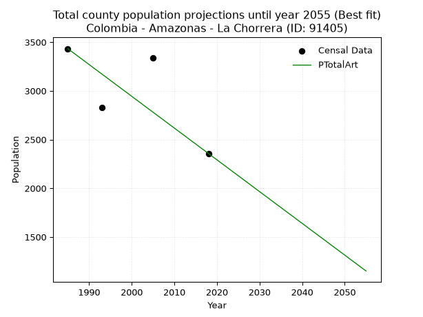
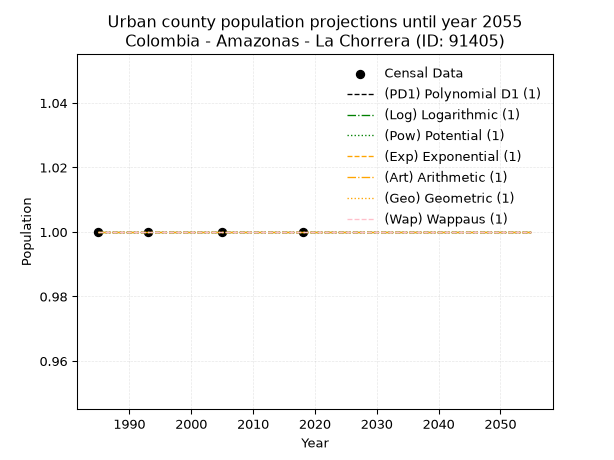
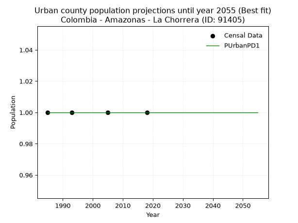
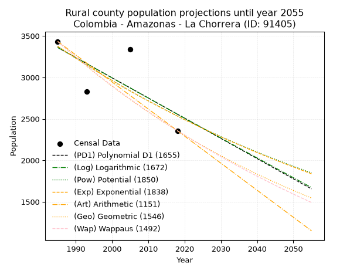

<div align="center">


</div>

# _“Population and Public Services Demand Projections (PPSD) until Year 2050 for Colombia - Amazonas - La Chorrera (ID: 91405)”_
Keywords: `population` `public-service` `projection` `lineal` `polynomial` `logarithmic` `potential` `exponential` `arithmetic` `geometric` `wappaus` `dane` `colombia` `south-america`

PPSD are analytical estimates used by governments and planners to anticipate future changes in population size, age distribution, and the resulting community needs for utilities, healthcare, education, and infrastructure as sizing future water treatment facilities, electrical grids, and road networks based on spatial growth.

> **General running parameters**: • app_version: _v20260806_. • Python version: _3.14.7_. • Pandas version: _3.0.5_. • NumPy version: _2.5.1_. • Creates, save and include plots into reports (create_plot): _False_. • Projection until year: _2050_. • Process polynomial degree 2 and up: _False_. • Process Wappaus: _True_. • Process Wappaus: _True_. • Set negative values to zero: _True_. • Set infinite values to zero: _True_. • Drop dataset notes: _True_. 
<div align="center">

Dynamic map: [:earth_americas:Google](http://maps.google.com/maps?q=-1.23808221,-72.7640223) [:earth_americas:OSM](https://www.openstreetmap.org/#map=18/-1.23808221/-72.7640223&layers=P) [:earth_americas:Bing](https://www.bing.com/maps?cp=-1.23808221~-72.7640223&lvl=18) [:earth_americas:Apple](https://maps.apple.com/frame?center=-1.23808221%2C-72.7640223&span=0.003%2C0.006)

</div>


<div align="center">

```geojson
{
  "type": "Feature",
  "geometry": {
    "type": "Point", 
    "coordinates": [-72.7640223, -1.23808221]
  }, 
  "properties": {
    "Name": "Colombia - Amazonas - La Chorrera (ID: 91405)"
  }
}
```

</div>


## 0. Census Data (4 records)

Census data are official statistics collected by a government about the people and housing in a country. They usually include counts of total population, age, sex, race, income, education, and jobs.

📅Global census file: [Population.xlsx](../data/Population.xlsx)

| Source   |   Year |   CountryID | CountryName   |   StateID | StateName   |   CountyID | CountyName   |   PTotal |   PUrban |   PRural |
|:---------|-------:|------------:|:--------------|----------:|:------------|-----------:|:-------------|---------:|---------:|---------:|
| DANE     |   1985 |          57 | Colombia      |        91 | Amazonas    |      91405 | La Chorrera  |     3433 |        1 |     3433 |
| DANE     |   1993 |          57 | Colombia      |        91 | Amazonas    |      91405 | La Chorrera  |     2828 |        1 |     2828 |
| DANE     |   2005 |          57 | Colombia      |        91 | Amazonas    |      91405 | La Chorrera  |     3337 |        1 |     3337 |
| DANE     |   2018 |          57 | Colombia      |        91 | Amazonas    |      91405 | La Chorrera  |     2357 |        1 |     2357 |

> 🔥Some records could had specific notes about the registered values or the corresponding urban or rural distribution.

## 1. Total

### 1.1. Coefficients and Parameters

* (PD1) Polynomial Deg 1: -24.357687675631684, 51710.214773182284 (lineal)
* (Log) Logarithmic: -48712.43384452697, 373252.3500091958
* (Pow) Potential: -17.352732912851994, 60.753404576811725
* (Exp) Exponential: -0.00867763668392398, 102084279387.05873
* (Art) Arithmetic: Year diff. 2018 - 1985 = 33, Population diff. 2357 - 3433 = -1076, Annual growth = -32.60606060606061
* (Geo) Geometric: Year diff. 2018 - 1985 = 33, Population diff. 2357 - 3433 = -1076, Annual growth % = -0.011330619202728487
* (Wap) Wappaus: i = -1.126288794682577, Condition values only valid for < 200)

<sub>
Wappaus condition values: ['-0.00', '-1.13', '-2.25', '-3.38', '-4.51', '-5.63', '-6.76', '-7.88', '-9.01', '-10.14', '-11.26', '-12.39', '-13.52', '-14.64', '-15.77', '-16.89', '-18.02', '-19.15', '-20.27', '-21.40', '-22.53', '-23.65', '-24.78', '-25.90', '-27.03', '-28.16', '-29.28', '-30.41', '-31.54', '-32.66', '-33.79', '-34.91', '-36.04', '-37.17', '-38.29', '-39.42', '-40.55', '-41.67', '-42.80', '-43.93', '-45.05', '-46.18', '-47.30', '-48.43', '-49.56', '-50.68', '-51.81', '-52.94', '-54.06', '-55.19', '-56.31', '-57.44', '-58.57', '-59.69', '-60.82', '-61.95', '-63.07', '-64.20', '-65.32', '-66.45', '-67.58', '-68.70', '-69.83', '-70.96', '-72.08', '-73.21']
</sub>


### 1.2. Projected Dataset

|   Year |   CountyID |   PTotalPD1 |   PTotalLog |   PTotalPow |   PTotalExp |   PTotalArt |   PTotalGeo |   PTotalWap |
|-------:|-----------:|------------:|------------:|------------:|------------:|------------:|------------:|------------:|
|   1985 |      91405 |        3360 |        3361 |        3375 |        3374 |        3433 |        3433 |        3433 |
|   1986 |      91405 |        3336 |        3336 |        3345 |        3345 |        3400 |        3394 |        3395 |
|   1987 |      91405 |        3311 |        3312 |        3316 |        3316 |        3368 |        3356 |        3357 |
|   1988 |      91405 |        3287 |        3287 |        3288 |        3288 |        3335 |        3318 |        3319 |
|   1989 |      91405 |        3263 |        3263 |        3259 |        3259 |        3303 |        3280 |        3282 |
|   1990 |      91405 |        3238 |        3238 |        3231 |        3231 |        3270 |        3243 |        3245 |
|   1991 |      91405 |        3214 |        3214 |        3203 |        3203 |        3237 |        3206 |        3209 |
|   1992 |      91405 |        3190 |        3189 |        3175 |        3175 |        3205 |        3170 |        3173 |
|   1993 |      91405 |        3165 |        3165 |        3147 |        3148 |        3172 |        3134 |        3137 |
|   1994 |      91405 |        3141 |        3140 |        3120 |        3121 |        3140 |        3098 |        3102 |
|   1995 |      91405 |        3117 |        3116 |        3093 |        3094 |        3107 |        3063 |        3067 |
|   1996 |      91405 |        3092 |        3091 |        3066 |        3067 |        3074 |        3029 |        3032 |
|   1997 |      91405 |        3068 |        3067 |        3040 |        3041 |        3042 |        2994 |        2998 |
|   1998 |      91405 |        3044 |        3043 |        3013 |        3014 |        3009 |        2960 |        2965 |
|   1999 |      91405 |        3019 |        3018 |        2987 |        2988 |        2977 |        2927 |        2931 |
|   2000 |      91405 |        2995 |        2994 |        2962 |        2963 |        2944 |        2894 |        2898 |
|   2001 |      91405 |        2970 |        2970 |        2936 |        2937 |        2911 |        2861 |        2865 |
|   2002 |      91405 |        2946 |        2945 |        2911 |        2912 |        2879 |        2828 |        2833 |
|   2003 |      91405 |        2922 |        2921 |        2885 |        2886 |        2846 |        2796 |        2801 |
|   2004 |      91405 |        2897 |        2897 |        2861 |        2861 |        2813 |        2765 |        2769 |
|   2005 |      91405 |        2873 |        2872 |        2836 |        2837 |        2781 |        2733 |        2738 |
|   2006 |      91405 |        2849 |        2848 |        2811 |        2812 |        2748 |        2702 |        2707 |
|   2007 |      91405 |        2824 |        2824 |        2787 |        2788 |        2716 |        2672 |        2676 |
|   2008 |      91405 |        2800 |        2799 |        2763 |        2764 |        2683 |        2641 |        2646 |
|   2009 |      91405 |        2776 |        2775 |        2740 |        2740 |        2650 |        2612 |        2616 |
|   2010 |      91405 |        2751 |        2751 |        2716 |        2716 |        2618 |        2582 |        2586 |
|   2011 |      91405 |        2727 |        2727 |        2693 |        2693 |        2585 |        2553 |        2556 |
|   2012 |      91405 |        2703 |        2702 |        2670 |        2670 |        2553 |        2524 |        2527 |
|   2013 |      91405 |        2678 |        2678 |        2647 |        2646 |        2520 |        2495 |        2498 |
|   2014 |      91405 |        2654 |        2654 |        2624 |        2624 |        2487 |        2467 |        2469 |
|   2015 |      91405 |        2629 |        2630 |        2601 |        2601 |        2455 |        2439 |        2441 |
|   2016 |      91405 |        2605 |        2606 |        2579 |        2578 |        2422 |        2411 |        2413 |
|   2017 |      91405 |        2581 |        2582 |        2557 |        2556 |        2390 |        2384 |        2385 |
|   2018 |      91405 |        2556 |        2557 |        2535 |        2534 |        2357 |        2357 |        2357 |
|   2019 |      91405 |        2532 |        2533 |        2513 |        2512 |        2324 |        2330 |        2330 |
|   2020 |      91405 |        2508 |        2509 |        2492 |        2490 |        2292 |        2304 |        2303 |
|   2021 |      91405 |        2483 |        2485 |        2471 |        2469 |        2259 |        2278 |        2276 |
|   2022 |      91405 |        2459 |        2461 |        2449 |        2448 |        2227 |        2252 |        2249 |
|   2023 |      91405 |        2435 |        2437 |        2429 |        2427 |        2194 |        2226 |        2223 |
|   2024 |      91405 |        2410 |        2413 |        2408 |        2406 |        2161 |        2201 |        2197 |
|   2025 |      91405 |        2386 |        2389 |        2387 |        2385 |        2129 |        2176 |        2171 |
|   2026 |      91405 |        2362 |        2365 |        2367 |        2364 |        2096 |        2152 |        2145 |
|   2027 |      91405 |        2337 |        2341 |        2347 |        2344 |        2064 |        2127 |        2120 |
|   2028 |      91405 |        2313 |        2317 |        2327 |        2323 |        2031 |        2103 |        2095 |
|   2029 |      91405 |        2288 |        2293 |        2307 |        2303 |        1998 |        2079 |        2070 |
|   2030 |      91405 |        2264 |        2269 |        2287 |        2283 |        1966 |        2056 |        2045 |
|   2031 |      91405 |        2240 |        2245 |        2268 |        2264 |        1933 |        2032 |        2020 |
|   2032 |      91405 |        2215 |        2221 |        2248 |        2244 |        1901 |        2009 |        1996 |
|   2033 |      91405 |        2191 |        2197 |        2229 |        2225 |        1868 |        1987 |        1972 |
|   2034 |      91405 |        2167 |        2173 |        2210 |        2206 |        1835 |        1964 |        1948 |
|   2035 |      91405 |        2142 |        2149 |        2192 |        2187 |        1803 |        1942 |        1924 |
|   2036 |      91405 |        2118 |        2125 |        2173 |        2168 |        1770 |        1920 |        1901 |
|   2037 |      91405 |        2094 |        2101 |        2155 |        2149 |        1737 |        1898 |        1878 |
|   2038 |      91405 |        2069 |        2077 |        2136 |        2130 |        1705 |        1877 |        1855 |
|   2039 |      91405 |        2045 |        2053 |        2118 |        2112 |        1672 |        1855 |        1832 |
|   2040 |      91405 |        2021 |        2029 |        2100 |        2094 |        1640 |        1834 |        1809 |
|   2041 |      91405 |        1996 |        2005 |        2082 |        2076 |        1607 |        1814 |        1787 |
|   2042 |      91405 |        1972 |        1982 |        2065 |        2058 |        1574 |        1793 |        1765 |
|   2043 |      91405 |        1947 |        1958 |        2047 |        2040 |        1542 |        1773 |        1743 |
|   2044 |      91405 |        1923 |        1934 |        2030 |        2022 |        1509 |        1753 |        1721 |
|   2045 |      91405 |        1899 |        1910 |        2013 |        2005 |        1477 |        1733 |        1699 |
|   2046 |      91405 |        1874 |        1886 |        1996 |        1987 |        1444 |        1713 |        1677 |
|   2047 |      91405 |        1850 |        1862 |        1979 |        1970 |        1411 |        1694 |        1656 |
|   2048 |      91405 |        1826 |        1839 |        1962 |        1953 |        1379 |        1675 |        1635 |
|   2049 |      91405 |        1801 |        1815 |        1946 |        1936 |        1346 |        1656 |        1614 |
|   2050 |      91405 |        1777 |        1791 |        1929 |        1920 |        1314 |        1637 |        1593 |
<div align="center">

</img>

</div>


### 1.3. Best fit with absolute and relative error (%)

Relative error puts that difference into context by dividing the absolute error by the true value, creating a unitless ratio or percentage that shows the scale of the mistake.

Absolute and relative error

|   Year | Source   |   CountryID | CountryName   |   StateID | StateName   |   CountyID_x | CountyName   |   PTotal |   PUrban |   PRural |   CountyID_y |   PTotalPD1 |   PTotalLog |   PTotalPow |   PTotalExp |   PTotalArt |   PTotalGeo |   PTotalWap |   PTotalPD1AbsError |   PTotalLogAbsError |   PTotalPowAbsError |   PTotalExpAbsError |   PTotalArtAbsError |   PTotalGeoAbsError |   PTotalWapAbsError |   PTotalPD1RelError |   PTotalLogRelError |   PTotalPowRelError |   PTotalExpRelError |   PTotalArtRelError |   PTotalGeoRelError |   PTotalWapRelError |
|-------:|:---------|------------:|:--------------|----------:|:------------|-------------:|:-------------|---------:|---------:|---------:|-------------:|------------:|------------:|------------:|------------:|------------:|------------:|------------:|--------------------:|--------------------:|--------------------:|--------------------:|--------------------:|--------------------:|--------------------:|--------------------:|--------------------:|--------------------:|--------------------:|--------------------:|--------------------:|--------------------:|
|   1985 | DANE     |          57 | Colombia      |        91 | Amazonas    |        91405 | La Chorrera  |     3433 |        1 |     3433 |        91405 |        3360 |        3361 |        3375 |        3374 |        3433 |        3433 |        3433 |                  73 |                  72 |                  58 |                  59 |                   0 |                   0 |                   0 |             2.12642 |             2.09729 |             1.68948 |             1.71861 |              0      |              0      |              0      |
|   1993 | DANE     |          57 | Colombia      |        91 | Amazonas    |        91405 | La Chorrera  |     2828 |        1 |     2828 |        91405 |        3165 |        3165 |        3147 |        3148 |        3172 |        3134 |        3137 |                 337 |                 337 |                 319 |                 320 |                 344 |                 306 |                 309 |            11.9165  |            11.9165  |            11.2801  |            11.3154  |             12.1641 |             10.8204 |             10.9264 |
|   2005 | DANE     |          57 | Colombia      |        91 | Amazonas    |        91405 | La Chorrera  |     3337 |        1 |     3337 |        91405 |        2873 |        2872 |        2836 |        2837 |        2781 |        2733 |        2738 |                 464 |                 465 |                 501 |                 500 |                 556 |                 604 |                 599 |            13.9047  |            13.9347  |            15.0135  |            14.9835  |             16.6617 |             18.1001 |             17.9503 |
|   2018 | DANE     |          57 | Colombia      |        91 | Amazonas    |        91405 | La Chorrera  |     2357 |        1 |     2357 |        91405 |        2556 |        2557 |        2535 |        2534 |        2357 |        2357 |        2357 |                 199 |                 200 |                 178 |                 177 |                   0 |                   0 |                   0 |             8.44294 |             8.48536 |             7.55197 |             7.50955 |              0      |              0      |              0      |

Relative error mean

| Method    |   RelError | Best   |
|:----------|-----------:|:-------|
| PTotalPD1 |    9.09765 |        |
| PTotalLog |    9.10847 |        |
| PTotalPow |    8.88375 |        |
| PTotalExp |    8.88177 |        |
| PTotalArt |    7.20644 | True   |
| PTotalGeo |    7.23011 |        |
| PTotalWap |    7.21918 |        |

💙Best method: _**PTotalArt**_
<div align="center">

</img>

</div>


### 1.4. Fresh water supply demand in liters per capita per day (lpcd)

The fresh water supply demand typically ranges from 100 to 300 liters per capita per day (lpcd) for standard domestic and municipal planning, though absolute survival minimums set by the World Health Organization are as low as 7.5 to 20 liters per day, and total consumption in high-income nations can exceed 400 liters.

> `CZ`: Level in meters above the sea level (masl)<br> `WS`: Fresh water supply demand in liters per capita per day (lpcd or l/h/d)<br> `WSAll`: Zonal fresh water supply demand in liters per second (l/s)<br> `A`: Zonal area in square meters<br> `DP`: Population density (people/hectare)

Reference values (RAS Colombia)

|    CZ |   WS |
|------:|-----:|
|  1000 |  120 |
|  2000 |  130 |
| 99999 |  140 |

County shapefile geometry properties and water supply values

|   CountyID |      ATotal |   CZTotal |   WSTotal |
|-----------:|------------:|----------:|----------:|
|      91405 | 1.26415e+10 |   165.876 |       120 |

Projected values for best method: PTotalArt

|   CountyID |   Year |   PTotalArt |   DPTotal |   WSTotal |   WSTotalAll |
|-----------:|-------:|------------:|----------:|----------:|-------------:|
|      91405 |   1985 |        3433 |         0 |       120 |      4.76806 |
|      91405 |   1986 |        3400 |         0 |       120 |      4.72222 |
|      91405 |   1987 |        3368 |         0 |       120 |      4.67778 |
|      91405 |   1988 |        3335 |         0 |       120 |      4.63194 |
|      91405 |   1989 |        3303 |         0 |       120 |      4.5875  |
|      91405 |   1990 |        3270 |         0 |       120 |      4.54167 |
|      91405 |   1991 |        3237 |         0 |       120 |      4.49583 |
|      91405 |   1992 |        3205 |         0 |       120 |      4.45139 |
|      91405 |   1993 |        3172 |         0 |       120 |      4.40556 |
|      91405 |   1994 |        3140 |         0 |       120 |      4.36111 |
|      91405 |   1995 |        3107 |         0 |       120 |      4.31528 |
|      91405 |   1996 |        3074 |         0 |       120 |      4.26944 |
|      91405 |   1997 |        3042 |         0 |       120 |      4.225   |
|      91405 |   1998 |        3009 |         0 |       120 |      4.17917 |
|      91405 |   1999 |        2977 |         0 |       120 |      4.13472 |
|      91405 |   2000 |        2944 |         0 |       120 |      4.08889 |
|      91405 |   2001 |        2911 |         0 |       120 |      4.04306 |
|      91405 |   2002 |        2879 |         0 |       120 |      3.99861 |
|      91405 |   2003 |        2846 |         0 |       120 |      3.95278 |
|      91405 |   2004 |        2813 |         0 |       120 |      3.90694 |
|      91405 |   2005 |        2781 |         0 |       120 |      3.8625  |
|      91405 |   2006 |        2748 |         0 |       120 |      3.81667 |
|      91405 |   2007 |        2716 |         0 |       120 |      3.77222 |
|      91405 |   2008 |        2683 |         0 |       120 |      3.72639 |
|      91405 |   2009 |        2650 |         0 |       120 |      3.68056 |
|      91405 |   2010 |        2618 |         0 |       120 |      3.63611 |
|      91405 |   2011 |        2585 |         0 |       120 |      3.59028 |
|      91405 |   2012 |        2553 |         0 |       120 |      3.54583 |
|      91405 |   2013 |        2520 |         0 |       120 |      3.5     |
|      91405 |   2014 |        2487 |         0 |       120 |      3.45417 |
|      91405 |   2015 |        2455 |         0 |       120 |      3.40972 |
|      91405 |   2016 |        2422 |         0 |       120 |      3.36389 |
|      91405 |   2017 |        2390 |         0 |       120 |      3.31944 |
|      91405 |   2018 |        2357 |         0 |       120 |      3.27361 |
|      91405 |   2019 |        2324 |         0 |       120 |      3.22778 |
|      91405 |   2020 |        2292 |         0 |       120 |      3.18333 |
|      91405 |   2021 |        2259 |         0 |       120 |      3.1375  |
|      91405 |   2022 |        2227 |         0 |       120 |      3.09306 |
|      91405 |   2023 |        2194 |         0 |       120 |      3.04722 |
|      91405 |   2024 |        2161 |         0 |       120 |      3.00139 |
|      91405 |   2025 |        2129 |         0 |       120 |      2.95694 |
|      91405 |   2026 |        2096 |         0 |       120 |      2.91111 |
|      91405 |   2027 |        2064 |         0 |       120 |      2.86667 |
|      91405 |   2028 |        2031 |         0 |       120 |      2.82083 |
|      91405 |   2029 |        1998 |         0 |       120 |      2.775   |
|      91405 |   2030 |        1966 |         0 |       120 |      2.73056 |
|      91405 |   2031 |        1933 |         0 |       120 |      2.68472 |
|      91405 |   2032 |        1901 |         0 |       120 |      2.64028 |
|      91405 |   2033 |        1868 |         0 |       120 |      2.59444 |
|      91405 |   2034 |        1835 |         0 |       120 |      2.54861 |
|      91405 |   2035 |        1803 |         0 |       120 |      2.50417 |
|      91405 |   2036 |        1770 |         0 |       120 |      2.45833 |
|      91405 |   2037 |        1737 |         0 |       120 |      2.4125  |
|      91405 |   2038 |        1705 |         0 |       120 |      2.36806 |
|      91405 |   2039 |        1672 |         0 |       120 |      2.32222 |
|      91405 |   2040 |        1640 |         0 |       120 |      2.27778 |
|      91405 |   2041 |        1607 |         0 |       120 |      2.23194 |
|      91405 |   2042 |        1574 |         0 |       120 |      2.18611 |
|      91405 |   2043 |        1542 |         0 |       120 |      2.14167 |
|      91405 |   2044 |        1509 |         0 |       120 |      2.09583 |
|      91405 |   2045 |        1477 |         0 |       120 |      2.05139 |
|      91405 |   2046 |        1444 |         0 |       120 |      2.00556 |
|      91405 |   2047 |        1411 |         0 |       120 |      1.95972 |
|      91405 |   2048 |        1379 |         0 |       120 |      1.91528 |
|      91405 |   2049 |        1346 |         0 |       120 |      1.86944 |
|      91405 |   2050 |        1314 |         0 |       120 |      1.825   |

## 2. Urban

### 2.1. Coefficients and Parameters

* (PD1) Polynomial Deg 1: -1.3233529347183512e-19, 1.0000000000000004 (lineal)
* (Log) Logarithmic: 3.215569112241165e-17, 0.9999999999999996
* (Pow) Potential: 0.0, 0.0
* (Exp) Exponential: 0.0, 1.0
* (Art) Arithmetic: Year diff. 2018 - 1985 = 33, Population diff. 1 - 1 = 0, Annual growth = 0.0
* (Geo) Geometric: Year diff. 2018 - 1985 = 33, Population diff. 1 - 1 = 0, Annual growth % = 0.0
* (Wap) Wappaus: i = 0.0, Condition values only valid for < 200)

<sub>
Wappaus condition values: ['0.00', '0.00', '0.00', '0.00', '0.00', '0.00', '0.00', '0.00', '0.00', '0.00', '0.00', '0.00', '0.00', '0.00', '0.00', '0.00', '0.00', '0.00', '0.00', '0.00', '0.00', '0.00', '0.00', '0.00', '0.00', '0.00', '0.00', '0.00', '0.00', '0.00', '0.00', '0.00', '0.00', '0.00', '0.00', '0.00', '0.00', '0.00', '0.00', '0.00', '0.00', '0.00', '0.00', '0.00', '0.00', '0.00', '0.00', '0.00', '0.00', '0.00', '0.00', '0.00', '0.00', '0.00', '0.00', '0.00', '0.00', '0.00', '0.00', '0.00', '0.00', '0.00', '0.00', '0.00', '0.00', '0.00']
</sub>


### 2.2. Projected Dataset

|   Year |   CountyID |   PUrbanPD1 |   PUrbanLog |   PUrbanPow |   PUrbanExp |   PUrbanArt |   PUrbanGeo |   PUrbanWap |
|-------:|-----------:|------------:|------------:|------------:|------------:|------------:|------------:|------------:|
|   1985 |      91405 |           1 |           1 |           1 |           1 |           1 |           1 |           1 |
|   1986 |      91405 |           1 |           1 |           1 |           1 |           1 |           1 |           1 |
|   1987 |      91405 |           1 |           1 |           1 |           1 |           1 |           1 |           1 |
|   1988 |      91405 |           1 |           1 |           1 |           1 |           1 |           1 |           1 |
|   1989 |      91405 |           1 |           1 |           1 |           1 |           1 |           1 |           1 |
|   1990 |      91405 |           1 |           1 |           1 |           1 |           1 |           1 |           1 |
|   1991 |      91405 |           1 |           1 |           1 |           1 |           1 |           1 |           1 |
|   1992 |      91405 |           1 |           1 |           1 |           1 |           1 |           1 |           1 |
|   1993 |      91405 |           1 |           1 |           1 |           1 |           1 |           1 |           1 |
|   1994 |      91405 |           1 |           1 |           1 |           1 |           1 |           1 |           1 |
|   1995 |      91405 |           1 |           1 |           1 |           1 |           1 |           1 |           1 |
|   1996 |      91405 |           1 |           1 |           1 |           1 |           1 |           1 |           1 |
|   1997 |      91405 |           1 |           1 |           1 |           1 |           1 |           1 |           1 |
|   1998 |      91405 |           1 |           1 |           1 |           1 |           1 |           1 |           1 |
|   1999 |      91405 |           1 |           1 |           1 |           1 |           1 |           1 |           1 |
|   2000 |      91405 |           1 |           1 |           1 |           1 |           1 |           1 |           1 |
|   2001 |      91405 |           1 |           1 |           1 |           1 |           1 |           1 |           1 |
|   2002 |      91405 |           1 |           1 |           1 |           1 |           1 |           1 |           1 |
|   2003 |      91405 |           1 |           1 |           1 |           1 |           1 |           1 |           1 |
|   2004 |      91405 |           1 |           1 |           1 |           1 |           1 |           1 |           1 |
|   2005 |      91405 |           1 |           1 |           1 |           1 |           1 |           1 |           1 |
|   2006 |      91405 |           1 |           1 |           1 |           1 |           1 |           1 |           1 |
|   2007 |      91405 |           1 |           1 |           1 |           1 |           1 |           1 |           1 |
|   2008 |      91405 |           1 |           1 |           1 |           1 |           1 |           1 |           1 |
|   2009 |      91405 |           1 |           1 |           1 |           1 |           1 |           1 |           1 |
|   2010 |      91405 |           1 |           1 |           1 |           1 |           1 |           1 |           1 |
|   2011 |      91405 |           1 |           1 |           1 |           1 |           1 |           1 |           1 |
|   2012 |      91405 |           1 |           1 |           1 |           1 |           1 |           1 |           1 |
|   2013 |      91405 |           1 |           1 |           1 |           1 |           1 |           1 |           1 |
|   2014 |      91405 |           1 |           1 |           1 |           1 |           1 |           1 |           1 |
|   2015 |      91405 |           1 |           1 |           1 |           1 |           1 |           1 |           1 |
|   2016 |      91405 |           1 |           1 |           1 |           1 |           1 |           1 |           1 |
|   2017 |      91405 |           1 |           1 |           1 |           1 |           1 |           1 |           1 |
|   2018 |      91405 |           1 |           1 |           1 |           1 |           1 |           1 |           1 |
|   2019 |      91405 |           1 |           1 |           1 |           1 |           1 |           1 |           1 |
|   2020 |      91405 |           1 |           1 |           1 |           1 |           1 |           1 |           1 |
|   2021 |      91405 |           1 |           1 |           1 |           1 |           1 |           1 |           1 |
|   2022 |      91405 |           1 |           1 |           1 |           1 |           1 |           1 |           1 |
|   2023 |      91405 |           1 |           1 |           1 |           1 |           1 |           1 |           1 |
|   2024 |      91405 |           1 |           1 |           1 |           1 |           1 |           1 |           1 |
|   2025 |      91405 |           1 |           1 |           1 |           1 |           1 |           1 |           1 |
|   2026 |      91405 |           1 |           1 |           1 |           1 |           1 |           1 |           1 |
|   2027 |      91405 |           1 |           1 |           1 |           1 |           1 |           1 |           1 |
|   2028 |      91405 |           1 |           1 |           1 |           1 |           1 |           1 |           1 |
|   2029 |      91405 |           1 |           1 |           1 |           1 |           1 |           1 |           1 |
|   2030 |      91405 |           1 |           1 |           1 |           1 |           1 |           1 |           1 |
|   2031 |      91405 |           1 |           1 |           1 |           1 |           1 |           1 |           1 |
|   2032 |      91405 |           1 |           1 |           1 |           1 |           1 |           1 |           1 |
|   2033 |      91405 |           1 |           1 |           1 |           1 |           1 |           1 |           1 |
|   2034 |      91405 |           1 |           1 |           1 |           1 |           1 |           1 |           1 |
|   2035 |      91405 |           1 |           1 |           1 |           1 |           1 |           1 |           1 |
|   2036 |      91405 |           1 |           1 |           1 |           1 |           1 |           1 |           1 |
|   2037 |      91405 |           1 |           1 |           1 |           1 |           1 |           1 |           1 |
|   2038 |      91405 |           1 |           1 |           1 |           1 |           1 |           1 |           1 |
|   2039 |      91405 |           1 |           1 |           1 |           1 |           1 |           1 |           1 |
|   2040 |      91405 |           1 |           1 |           1 |           1 |           1 |           1 |           1 |
|   2041 |      91405 |           1 |           1 |           1 |           1 |           1 |           1 |           1 |
|   2042 |      91405 |           1 |           1 |           1 |           1 |           1 |           1 |           1 |
|   2043 |      91405 |           1 |           1 |           1 |           1 |           1 |           1 |           1 |
|   2044 |      91405 |           1 |           1 |           1 |           1 |           1 |           1 |           1 |
|   2045 |      91405 |           1 |           1 |           1 |           1 |           1 |           1 |           1 |
|   2046 |      91405 |           1 |           1 |           1 |           1 |           1 |           1 |           1 |
|   2047 |      91405 |           1 |           1 |           1 |           1 |           1 |           1 |           1 |
|   2048 |      91405 |           1 |           1 |           1 |           1 |           1 |           1 |           1 |
|   2049 |      91405 |           1 |           1 |           1 |           1 |           1 |           1 |           1 |
|   2050 |      91405 |           1 |           1 |           1 |           1 |           1 |           1 |           1 |
<div align="center">

</img>

</div>


### 2.3. Best fit with absolute and relative error (%)

Relative error puts that difference into context by dividing the absolute error by the true value, creating a unitless ratio or percentage that shows the scale of the mistake.

Absolute and relative error

|   Year | Source   |   CountryID | CountryName   |   StateID | StateName   |   CountyID_x | CountyName   |   PTotal |   PUrban |   PRural |   CountyID_y |   PUrbanPD1 |   PUrbanLog |   PUrbanPow |   PUrbanExp |   PUrbanArt |   PUrbanGeo |   PUrbanWap |   PUrbanPD1AbsError |   PUrbanLogAbsError |   PUrbanPowAbsError |   PUrbanExpAbsError |   PUrbanArtAbsError |   PUrbanGeoAbsError |   PUrbanWapAbsError |   PUrbanPD1RelError |   PUrbanLogRelError |   PUrbanPowRelError |   PUrbanExpRelError |   PUrbanArtRelError |   PUrbanGeoRelError |   PUrbanWapRelError |
|-------:|:---------|------------:|:--------------|----------:|:------------|-------------:|:-------------|---------:|---------:|---------:|-------------:|------------:|------------:|------------:|------------:|------------:|------------:|------------:|--------------------:|--------------------:|--------------------:|--------------------:|--------------------:|--------------------:|--------------------:|--------------------:|--------------------:|--------------------:|--------------------:|--------------------:|--------------------:|--------------------:|
|   1985 | DANE     |          57 | Colombia      |        91 | Amazonas    |        91405 | La Chorrera  |     3433 |        1 |     3433 |        91405 |           1 |           1 |           1 |           1 |           1 |           1 |           1 |                   0 |                   0 |                   0 |                   0 |                   0 |                   0 |                   0 |                   0 |                   0 |                   0 |                   0 |                   0 |                   0 |                   0 |
|   1993 | DANE     |          57 | Colombia      |        91 | Amazonas    |        91405 | La Chorrera  |     2828 |        1 |     2828 |        91405 |           1 |           1 |           1 |           1 |           1 |           1 |           1 |                   0 |                   0 |                   0 |                   0 |                   0 |                   0 |                   0 |                   0 |                   0 |                   0 |                   0 |                   0 |                   0 |                   0 |
|   2005 | DANE     |          57 | Colombia      |        91 | Amazonas    |        91405 | La Chorrera  |     3337 |        1 |     3337 |        91405 |           1 |           1 |           1 |           1 |           1 |           1 |           1 |                   0 |                   0 |                   0 |                   0 |                   0 |                   0 |                   0 |                   0 |                   0 |                   0 |                   0 |                   0 |                   0 |                   0 |
|   2018 | DANE     |          57 | Colombia      |        91 | Amazonas    |        91405 | La Chorrera  |     2357 |        1 |     2357 |        91405 |           1 |           1 |           1 |           1 |           1 |           1 |           1 |                   0 |                   0 |                   0 |                   0 |                   0 |                   0 |                   0 |                   0 |                   0 |                   0 |                   0 |                   0 |                   0 |                   0 |

Relative error mean

| Method    |   RelError | Best   |
|:----------|-----------:|:-------|
| PUrbanPD1 |          0 | True   |
| PUrbanLog |          0 | True   |
| PUrbanPow |          0 | True   |
| PUrbanExp |          0 | True   |
| PUrbanArt |          0 | True   |
| PUrbanGeo |          0 | True   |
| PUrbanWap |          0 | True   |

💙Best method: _**PUrbanPD1**_
<div align="center">

</img>

</div>


### 2.4. Fresh water supply demand in liters per capita per day (lpcd)

The fresh water supply demand typically ranges from 100 to 300 liters per capita per day (lpcd) for standard domestic and municipal planning, though absolute survival minimums set by the World Health Organization are as low as 7.5 to 20 liters per day, and total consumption in high-income nations can exceed 400 liters.

> `CZ`: Level in meters above the sea level (masl)<br> `WS`: Fresh water supply demand in liters per capita per day (lpcd or l/h/d)<br> `WSAll`: Zonal fresh water supply demand in liters per second (l/s)<br> `A`: Zonal area in square meters<br> `DP`: Population density (people/hectare)

Reference values (RAS Colombia)

|    CZ |   WS |
|------:|-----:|
|  1000 |  120 |
|  2000 |  130 |
| 99999 |  140 |

County shapefile geometry properties and water supply values

|   CountyID |   AUrban |   CZUrban |   WSUrban |
|-----------:|---------:|----------:|----------:|
|      91405 |        0 |         0 |       120 |

Projected values for best method: PUrbanPD1

|   CountyID |   Year |   PUrbanPD1 |   DPUrban |   WSUrban |   WSUrbanAll |
|-----------:|-------:|------------:|----------:|----------:|-------------:|
|      91405 |   1985 |           1 |       inf |       120 |   0.00138889 |
|      91405 |   1986 |           1 |       inf |       120 |   0.00138889 |
|      91405 |   1987 |           1 |       inf |       120 |   0.00138889 |
|      91405 |   1988 |           1 |       inf |       120 |   0.00138889 |
|      91405 |   1989 |           1 |       inf |       120 |   0.00138889 |
|      91405 |   1990 |           1 |       inf |       120 |   0.00138889 |
|      91405 |   1991 |           1 |       inf |       120 |   0.00138889 |
|      91405 |   1992 |           1 |       inf |       120 |   0.00138889 |
|      91405 |   1993 |           1 |       inf |       120 |   0.00138889 |
|      91405 |   1994 |           1 |       inf |       120 |   0.00138889 |
|      91405 |   1995 |           1 |       inf |       120 |   0.00138889 |
|      91405 |   1996 |           1 |       inf |       120 |   0.00138889 |
|      91405 |   1997 |           1 |       inf |       120 |   0.00138889 |
|      91405 |   1998 |           1 |       inf |       120 |   0.00138889 |
|      91405 |   1999 |           1 |       inf |       120 |   0.00138889 |
|      91405 |   2000 |           1 |       inf |       120 |   0.00138889 |
|      91405 |   2001 |           1 |       inf |       120 |   0.00138889 |
|      91405 |   2002 |           1 |       inf |       120 |   0.00138889 |
|      91405 |   2003 |           1 |       inf |       120 |   0.00138889 |
|      91405 |   2004 |           1 |       inf |       120 |   0.00138889 |
|      91405 |   2005 |           1 |       inf |       120 |   0.00138889 |
|      91405 |   2006 |           1 |       inf |       120 |   0.00138889 |
|      91405 |   2007 |           1 |       inf |       120 |   0.00138889 |
|      91405 |   2008 |           1 |       inf |       120 |   0.00138889 |
|      91405 |   2009 |           1 |       inf |       120 |   0.00138889 |
|      91405 |   2010 |           1 |       inf |       120 |   0.00138889 |
|      91405 |   2011 |           1 |       inf |       120 |   0.00138889 |
|      91405 |   2012 |           1 |       inf |       120 |   0.00138889 |
|      91405 |   2013 |           1 |       inf |       120 |   0.00138889 |
|      91405 |   2014 |           1 |       inf |       120 |   0.00138889 |
|      91405 |   2015 |           1 |       inf |       120 |   0.00138889 |
|      91405 |   2016 |           1 |       inf |       120 |   0.00138889 |
|      91405 |   2017 |           1 |       inf |       120 |   0.00138889 |
|      91405 |   2018 |           1 |       inf |       120 |   0.00138889 |
|      91405 |   2019 |           1 |       inf |       120 |   0.00138889 |
|      91405 |   2020 |           1 |       inf |       120 |   0.00138889 |
|      91405 |   2021 |           1 |       inf |       120 |   0.00138889 |
|      91405 |   2022 |           1 |       inf |       120 |   0.00138889 |
|      91405 |   2023 |           1 |       inf |       120 |   0.00138889 |
|      91405 |   2024 |           1 |       inf |       120 |   0.00138889 |
|      91405 |   2025 |           1 |       inf |       120 |   0.00138889 |
|      91405 |   2026 |           1 |       inf |       120 |   0.00138889 |
|      91405 |   2027 |           1 |       inf |       120 |   0.00138889 |
|      91405 |   2028 |           1 |       inf |       120 |   0.00138889 |
|      91405 |   2029 |           1 |       inf |       120 |   0.00138889 |
|      91405 |   2030 |           1 |       inf |       120 |   0.00138889 |
|      91405 |   2031 |           1 |       inf |       120 |   0.00138889 |
|      91405 |   2032 |           1 |       inf |       120 |   0.00138889 |
|      91405 |   2033 |           1 |       inf |       120 |   0.00138889 |
|      91405 |   2034 |           1 |       inf |       120 |   0.00138889 |
|      91405 |   2035 |           1 |       inf |       120 |   0.00138889 |
|      91405 |   2036 |           1 |       inf |       120 |   0.00138889 |
|      91405 |   2037 |           1 |       inf |       120 |   0.00138889 |
|      91405 |   2038 |           1 |       inf |       120 |   0.00138889 |
|      91405 |   2039 |           1 |       inf |       120 |   0.00138889 |
|      91405 |   2040 |           1 |       inf |       120 |   0.00138889 |
|      91405 |   2041 |           1 |       inf |       120 |   0.00138889 |
|      91405 |   2042 |           1 |       inf |       120 |   0.00138889 |
|      91405 |   2043 |           1 |       inf |       120 |   0.00138889 |
|      91405 |   2044 |           1 |       inf |       120 |   0.00138889 |
|      91405 |   2045 |           1 |       inf |       120 |   0.00138889 |
|      91405 |   2046 |           1 |       inf |       120 |   0.00138889 |
|      91405 |   2047 |           1 |       inf |       120 |   0.00138889 |
|      91405 |   2048 |           1 |       inf |       120 |   0.00138889 |
|      91405 |   2049 |           1 |       inf |       120 |   0.00138889 |
|      91405 |   2050 |           1 |       inf |       120 |   0.00138889 |

## 3. Rural

### 3.1. Coefficients and Parameters

* (PD1) Polynomial Deg 1: -24.357687675631684, 51710.214773182284 (lineal)
* (Log) Logarithmic: -48712.43384452697, 373252.3500091958
* (Pow) Potential: -17.352732912851994, 60.753404576811725
* (Exp) Exponential: -0.00867763668392398, 102084279387.05873
* (Art) Arithmetic: Year diff. 2018 - 1985 = 33, Population diff. 2357 - 3433 = -1076, Annual growth = -32.60606060606061
* (Geo) Geometric: Year diff. 2018 - 1985 = 33, Population diff. 2357 - 3433 = -1076, Annual growth % = -0.011330619202728487
* (Wap) Wappaus: i = -1.126288794682577, Condition values only valid for < 200)

<sub>
Wappaus condition values: ['-0.00', '-1.13', '-2.25', '-3.38', '-4.51', '-5.63', '-6.76', '-7.88', '-9.01', '-10.14', '-11.26', '-12.39', '-13.52', '-14.64', '-15.77', '-16.89', '-18.02', '-19.15', '-20.27', '-21.40', '-22.53', '-23.65', '-24.78', '-25.90', '-27.03', '-28.16', '-29.28', '-30.41', '-31.54', '-32.66', '-33.79', '-34.91', '-36.04', '-37.17', '-38.29', '-39.42', '-40.55', '-41.67', '-42.80', '-43.93', '-45.05', '-46.18', '-47.30', '-48.43', '-49.56', '-50.68', '-51.81', '-52.94', '-54.06', '-55.19', '-56.31', '-57.44', '-58.57', '-59.69', '-60.82', '-61.95', '-63.07', '-64.20', '-65.32', '-66.45', '-67.58', '-68.70', '-69.83', '-70.96', '-72.08', '-73.21']
</sub>


### 3.2. Projected Dataset

|   Year |   CountyID |   PRuralPD1 |   PRuralLog |   PRuralPow |   PRuralExp |   PRuralArt |   PRuralGeo |   PRuralWap |
|-------:|-----------:|------------:|------------:|------------:|------------:|------------:|------------:|------------:|
|   1985 |      91405 |        3360 |        3361 |        3375 |        3374 |        3433 |        3433 |        3433 |
|   1986 |      91405 |        3336 |        3336 |        3345 |        3345 |        3400 |        3394 |        3395 |
|   1987 |      91405 |        3311 |        3312 |        3316 |        3316 |        3368 |        3356 |        3357 |
|   1988 |      91405 |        3287 |        3287 |        3288 |        3288 |        3335 |        3318 |        3319 |
|   1989 |      91405 |        3263 |        3263 |        3259 |        3259 |        3303 |        3280 |        3282 |
|   1990 |      91405 |        3238 |        3238 |        3231 |        3231 |        3270 |        3243 |        3245 |
|   1991 |      91405 |        3214 |        3214 |        3203 |        3203 |        3237 |        3206 |        3209 |
|   1992 |      91405 |        3190 |        3189 |        3175 |        3175 |        3205 |        3170 |        3173 |
|   1993 |      91405 |        3165 |        3165 |        3147 |        3148 |        3172 |        3134 |        3137 |
|   1994 |      91405 |        3141 |        3140 |        3120 |        3121 |        3140 |        3098 |        3102 |
|   1995 |      91405 |        3117 |        3116 |        3093 |        3094 |        3107 |        3063 |        3067 |
|   1996 |      91405 |        3092 |        3091 |        3066 |        3067 |        3074 |        3029 |        3032 |
|   1997 |      91405 |        3068 |        3067 |        3040 |        3041 |        3042 |        2994 |        2998 |
|   1998 |      91405 |        3044 |        3043 |        3013 |        3014 |        3009 |        2960 |        2965 |
|   1999 |      91405 |        3019 |        3018 |        2987 |        2988 |        2977 |        2927 |        2931 |
|   2000 |      91405 |        2995 |        2994 |        2962 |        2963 |        2944 |        2894 |        2898 |
|   2001 |      91405 |        2970 |        2970 |        2936 |        2937 |        2911 |        2861 |        2865 |
|   2002 |      91405 |        2946 |        2945 |        2911 |        2912 |        2879 |        2828 |        2833 |
|   2003 |      91405 |        2922 |        2921 |        2885 |        2886 |        2846 |        2796 |        2801 |
|   2004 |      91405 |        2897 |        2897 |        2861 |        2861 |        2813 |        2765 |        2769 |
|   2005 |      91405 |        2873 |        2872 |        2836 |        2837 |        2781 |        2733 |        2738 |
|   2006 |      91405 |        2849 |        2848 |        2811 |        2812 |        2748 |        2702 |        2707 |
|   2007 |      91405 |        2824 |        2824 |        2787 |        2788 |        2716 |        2672 |        2676 |
|   2008 |      91405 |        2800 |        2799 |        2763 |        2764 |        2683 |        2641 |        2646 |
|   2009 |      91405 |        2776 |        2775 |        2740 |        2740 |        2650 |        2612 |        2616 |
|   2010 |      91405 |        2751 |        2751 |        2716 |        2716 |        2618 |        2582 |        2586 |
|   2011 |      91405 |        2727 |        2727 |        2693 |        2693 |        2585 |        2553 |        2556 |
|   2012 |      91405 |        2703 |        2702 |        2670 |        2670 |        2553 |        2524 |        2527 |
|   2013 |      91405 |        2678 |        2678 |        2647 |        2646 |        2520 |        2495 |        2498 |
|   2014 |      91405 |        2654 |        2654 |        2624 |        2624 |        2487 |        2467 |        2469 |
|   2015 |      91405 |        2629 |        2630 |        2601 |        2601 |        2455 |        2439 |        2441 |
|   2016 |      91405 |        2605 |        2606 |        2579 |        2578 |        2422 |        2411 |        2413 |
|   2017 |      91405 |        2581 |        2582 |        2557 |        2556 |        2390 |        2384 |        2385 |
|   2018 |      91405 |        2556 |        2557 |        2535 |        2534 |        2357 |        2357 |        2357 |
|   2019 |      91405 |        2532 |        2533 |        2513 |        2512 |        2324 |        2330 |        2330 |
|   2020 |      91405 |        2508 |        2509 |        2492 |        2490 |        2292 |        2304 |        2303 |
|   2021 |      91405 |        2483 |        2485 |        2471 |        2469 |        2259 |        2278 |        2276 |
|   2022 |      91405 |        2459 |        2461 |        2449 |        2448 |        2227 |        2252 |        2249 |
|   2023 |      91405 |        2435 |        2437 |        2429 |        2427 |        2194 |        2226 |        2223 |
|   2024 |      91405 |        2410 |        2413 |        2408 |        2406 |        2161 |        2201 |        2197 |
|   2025 |      91405 |        2386 |        2389 |        2387 |        2385 |        2129 |        2176 |        2171 |
|   2026 |      91405 |        2362 |        2365 |        2367 |        2364 |        2096 |        2152 |        2145 |
|   2027 |      91405 |        2337 |        2341 |        2347 |        2344 |        2064 |        2127 |        2120 |
|   2028 |      91405 |        2313 |        2317 |        2327 |        2323 |        2031 |        2103 |        2095 |
|   2029 |      91405 |        2288 |        2293 |        2307 |        2303 |        1998 |        2079 |        2070 |
|   2030 |      91405 |        2264 |        2269 |        2287 |        2283 |        1966 |        2056 |        2045 |
|   2031 |      91405 |        2240 |        2245 |        2268 |        2264 |        1933 |        2032 |        2020 |
|   2032 |      91405 |        2215 |        2221 |        2248 |        2244 |        1901 |        2009 |        1996 |
|   2033 |      91405 |        2191 |        2197 |        2229 |        2225 |        1868 |        1987 |        1972 |
|   2034 |      91405 |        2167 |        2173 |        2210 |        2206 |        1835 |        1964 |        1948 |
|   2035 |      91405 |        2142 |        2149 |        2192 |        2187 |        1803 |        1942 |        1924 |
|   2036 |      91405 |        2118 |        2125 |        2173 |        2168 |        1770 |        1920 |        1901 |
|   2037 |      91405 |        2094 |        2101 |        2155 |        2149 |        1737 |        1898 |        1878 |
|   2038 |      91405 |        2069 |        2077 |        2136 |        2130 |        1705 |        1877 |        1855 |
|   2039 |      91405 |        2045 |        2053 |        2118 |        2112 |        1672 |        1855 |        1832 |
|   2040 |      91405 |        2021 |        2029 |        2100 |        2094 |        1640 |        1834 |        1809 |
|   2041 |      91405 |        1996 |        2005 |        2082 |        2076 |        1607 |        1814 |        1787 |
|   2042 |      91405 |        1972 |        1982 |        2065 |        2058 |        1574 |        1793 |        1765 |
|   2043 |      91405 |        1947 |        1958 |        2047 |        2040 |        1542 |        1773 |        1743 |
|   2044 |      91405 |        1923 |        1934 |        2030 |        2022 |        1509 |        1753 |        1721 |
|   2045 |      91405 |        1899 |        1910 |        2013 |        2005 |        1477 |        1733 |        1699 |
|   2046 |      91405 |        1874 |        1886 |        1996 |        1987 |        1444 |        1713 |        1677 |
|   2047 |      91405 |        1850 |        1862 |        1979 |        1970 |        1411 |        1694 |        1656 |
|   2048 |      91405 |        1826 |        1839 |        1962 |        1953 |        1379 |        1675 |        1635 |
|   2049 |      91405 |        1801 |        1815 |        1946 |        1936 |        1346 |        1656 |        1614 |
|   2050 |      91405 |        1777 |        1791 |        1929 |        1920 |        1314 |        1637 |        1593 |
<div align="center">

</img>

</div>


### 3.3. Best fit with absolute and relative error (%)

Relative error puts that difference into context by dividing the absolute error by the true value, creating a unitless ratio or percentage that shows the scale of the mistake.

Absolute and relative error

|   Year | Source   |   CountryID | CountryName   |   StateID | StateName   |   CountyID_x | CountyName   |   PTotal |   PUrban |   PRural |   CountyID_y |   PRuralPD1 |   PRuralLog |   PRuralPow |   PRuralExp |   PRuralArt |   PRuralGeo |   PRuralWap |   PRuralPD1AbsError |   PRuralLogAbsError |   PRuralPowAbsError |   PRuralExpAbsError |   PRuralArtAbsError |   PRuralGeoAbsError |   PRuralWapAbsError |   PRuralPD1RelError |   PRuralLogRelError |   PRuralPowRelError |   PRuralExpRelError |   PRuralArtRelError |   PRuralGeoRelError |   PRuralWapRelError |
|-------:|:---------|------------:|:--------------|----------:|:------------|-------------:|:-------------|---------:|---------:|---------:|-------------:|------------:|------------:|------------:|------------:|------------:|------------:|------------:|--------------------:|--------------------:|--------------------:|--------------------:|--------------------:|--------------------:|--------------------:|--------------------:|--------------------:|--------------------:|--------------------:|--------------------:|--------------------:|--------------------:|
|   1985 | DANE     |          57 | Colombia      |        91 | Amazonas    |        91405 | La Chorrera  |     3433 |        1 |     3433 |        91405 |        3360 |        3361 |        3375 |        3374 |        3433 |        3433 |        3433 |                  73 |                  72 |                  58 |                  59 |                   0 |                   0 |                   0 |             2.12642 |             2.09729 |             1.68948 |             1.71861 |              0      |              0      |              0      |
|   1993 | DANE     |          57 | Colombia      |        91 | Amazonas    |        91405 | La Chorrera  |     2828 |        1 |     2828 |        91405 |        3165 |        3165 |        3147 |        3148 |        3172 |        3134 |        3137 |                 337 |                 337 |                 319 |                 320 |                 344 |                 306 |                 309 |            11.9165  |            11.9165  |            11.2801  |            11.3154  |             12.1641 |             10.8204 |             10.9264 |
|   2005 | DANE     |          57 | Colombia      |        91 | Amazonas    |        91405 | La Chorrera  |     3337 |        1 |     3337 |        91405 |        2873 |        2872 |        2836 |        2837 |        2781 |        2733 |        2738 |                 464 |                 465 |                 501 |                 500 |                 556 |                 604 |                 599 |            13.9047  |            13.9347  |            15.0135  |            14.9835  |             16.6617 |             18.1001 |             17.9503 |
|   2018 | DANE     |          57 | Colombia      |        91 | Amazonas    |        91405 | La Chorrera  |     2357 |        1 |     2357 |        91405 |        2556 |        2557 |        2535 |        2534 |        2357 |        2357 |        2357 |                 199 |                 200 |                 178 |                 177 |                   0 |                   0 |                   0 |             8.44294 |             8.48536 |             7.55197 |             7.50955 |              0      |              0      |              0      |

Relative error mean

| Method    |   RelError | Best   |
|:----------|-----------:|:-------|
| PRuralPD1 |    9.09765 |        |
| PRuralLog |    9.10847 |        |
| PRuralPow |    8.88375 |        |
| PRuralExp |    8.88177 |        |
| PRuralArt |    7.20644 | True   |
| PRuralGeo |    7.23011 |        |
| PRuralWap |    7.21918 |        |

💙Best method: _**PRuralArt**_
<div align="center">

</img>

</div>


### 3.4. Fresh water supply demand in liters per capita per day (lpcd)

The fresh water supply demand typically ranges from 100 to 300 liters per capita per day (lpcd) for standard domestic and municipal planning, though absolute survival minimums set by the World Health Organization are as low as 7.5 to 20 liters per day, and total consumption in high-income nations can exceed 400 liters.

> `CZ`: Level in meters above the sea level (masl)<br> `WS`: Fresh water supply demand in liters per capita per day (lpcd or l/h/d)<br> `WSAll`: Zonal fresh water supply demand in liters per second (l/s)<br> `A`: Zonal area in square meters<br> `DP`: Population density (people/hectare)

Reference values (RAS Colombia)

|    CZ |   WS |
|------:|-----:|
|  1000 |  120 |
|  2000 |  130 |
| 99999 |  140 |

County shapefile geometry properties and water supply values

|   CountyID |      ARural |   CZRural |   WSRural |
|-----------:|------------:|----------:|----------:|
|      91405 | 1.26415e+10 |   165.876 |       120 |

Projected values for best method: PRuralArt

|   CountyID |   Year |   PRuralArt |   DPRural |   WSRural |   WSRuralAll |
|-----------:|-------:|------------:|----------:|----------:|-------------:|
|      91405 |   1985 |        3433 |         0 |       120 |      4.76806 |
|      91405 |   1986 |        3400 |         0 |       120 |      4.72222 |
|      91405 |   1987 |        3368 |         0 |       120 |      4.67778 |
|      91405 |   1988 |        3335 |         0 |       120 |      4.63194 |
|      91405 |   1989 |        3303 |         0 |       120 |      4.5875  |
|      91405 |   1990 |        3270 |         0 |       120 |      4.54167 |
|      91405 |   1991 |        3237 |         0 |       120 |      4.49583 |
|      91405 |   1992 |        3205 |         0 |       120 |      4.45139 |
|      91405 |   1993 |        3172 |         0 |       120 |      4.40556 |
|      91405 |   1994 |        3140 |         0 |       120 |      4.36111 |
|      91405 |   1995 |        3107 |         0 |       120 |      4.31528 |
|      91405 |   1996 |        3074 |         0 |       120 |      4.26944 |
|      91405 |   1997 |        3042 |         0 |       120 |      4.225   |
|      91405 |   1998 |        3009 |         0 |       120 |      4.17917 |
|      91405 |   1999 |        2977 |         0 |       120 |      4.13472 |
|      91405 |   2000 |        2944 |         0 |       120 |      4.08889 |
|      91405 |   2001 |        2911 |         0 |       120 |      4.04306 |
|      91405 |   2002 |        2879 |         0 |       120 |      3.99861 |
|      91405 |   2003 |        2846 |         0 |       120 |      3.95278 |
|      91405 |   2004 |        2813 |         0 |       120 |      3.90694 |
|      91405 |   2005 |        2781 |         0 |       120 |      3.8625  |
|      91405 |   2006 |        2748 |         0 |       120 |      3.81667 |
|      91405 |   2007 |        2716 |         0 |       120 |      3.77222 |
|      91405 |   2008 |        2683 |         0 |       120 |      3.72639 |
|      91405 |   2009 |        2650 |         0 |       120 |      3.68056 |
|      91405 |   2010 |        2618 |         0 |       120 |      3.63611 |
|      91405 |   2011 |        2585 |         0 |       120 |      3.59028 |
|      91405 |   2012 |        2553 |         0 |       120 |      3.54583 |
|      91405 |   2013 |        2520 |         0 |       120 |      3.5     |
|      91405 |   2014 |        2487 |         0 |       120 |      3.45417 |
|      91405 |   2015 |        2455 |         0 |       120 |      3.40972 |
|      91405 |   2016 |        2422 |         0 |       120 |      3.36389 |
|      91405 |   2017 |        2390 |         0 |       120 |      3.31944 |
|      91405 |   2018 |        2357 |         0 |       120 |      3.27361 |
|      91405 |   2019 |        2324 |         0 |       120 |      3.22778 |
|      91405 |   2020 |        2292 |         0 |       120 |      3.18333 |
|      91405 |   2021 |        2259 |         0 |       120 |      3.1375  |
|      91405 |   2022 |        2227 |         0 |       120 |      3.09306 |
|      91405 |   2023 |        2194 |         0 |       120 |      3.04722 |
|      91405 |   2024 |        2161 |         0 |       120 |      3.00139 |
|      91405 |   2025 |        2129 |         0 |       120 |      2.95694 |
|      91405 |   2026 |        2096 |         0 |       120 |      2.91111 |
|      91405 |   2027 |        2064 |         0 |       120 |      2.86667 |
|      91405 |   2028 |        2031 |         0 |       120 |      2.82083 |
|      91405 |   2029 |        1998 |         0 |       120 |      2.775   |
|      91405 |   2030 |        1966 |         0 |       120 |      2.73056 |
|      91405 |   2031 |        1933 |         0 |       120 |      2.68472 |
|      91405 |   2032 |        1901 |         0 |       120 |      2.64028 |
|      91405 |   2033 |        1868 |         0 |       120 |      2.59444 |
|      91405 |   2034 |        1835 |         0 |       120 |      2.54861 |
|      91405 |   2035 |        1803 |         0 |       120 |      2.50417 |
|      91405 |   2036 |        1770 |         0 |       120 |      2.45833 |
|      91405 |   2037 |        1737 |         0 |       120 |      2.4125  |
|      91405 |   2038 |        1705 |         0 |       120 |      2.36806 |
|      91405 |   2039 |        1672 |         0 |       120 |      2.32222 |
|      91405 |   2040 |        1640 |         0 |       120 |      2.27778 |
|      91405 |   2041 |        1607 |         0 |       120 |      2.23194 |
|      91405 |   2042 |        1574 |         0 |       120 |      2.18611 |
|      91405 |   2043 |        1542 |         0 |       120 |      2.14167 |
|      91405 |   2044 |        1509 |         0 |       120 |      2.09583 |
|      91405 |   2045 |        1477 |         0 |       120 |      2.05139 |
|      91405 |   2046 |        1444 |         0 |       120 |      2.00556 |
|      91405 |   2047 |        1411 |         0 |       120 |      1.95972 |
|      91405 |   2048 |        1379 |         0 |       120 |      1.91528 |
|      91405 |   2049 |        1346 |         0 |       120 |      1.86944 |
|      91405 |   2050 |        1314 |         0 |       120 |      1.825   |

<div align="center"><br><sub>Share this research</sub></div><br>

<sub>**APPS & TOOLS & CONTENT DISCLAIMER**: • NO WARRANTY - This content and software is provided by <a href="https://github.com/rcfdtools" target="_blank">github.com/rcfdtools</a> "as is", without any express or implied warranty, including warranties of merchantability, fitness for a particular purpose, or non-infringement. There is no guarantee that the software will be error-free or operate without interruption. • LIMITATION OF LIABILITY - Neither the authors nor copyright holders will be liable for claims or damages arising from the software or its use. You are responsible for determining if the software is appropriate for your use and assume all associated risks, including errors, legal compliance, and data loss. • NO PROFESSIONAL ADVICE - The software provides general information and does not offer professional advice. It should not replace consultation with professional advisors. [Clauses and global license for rcfdtools use.](https://github.com/rcfdtools/rcfdtools/blob/main/LICENSE.md)</sub>

| [:house: Home](Readme.md)  | [:beginner: Help / Collaborate](https://github.com/rcfdtools/R.HydroTools/discussions/31) |
|----------------------------|-------------------------------------------------------------------------------------------|