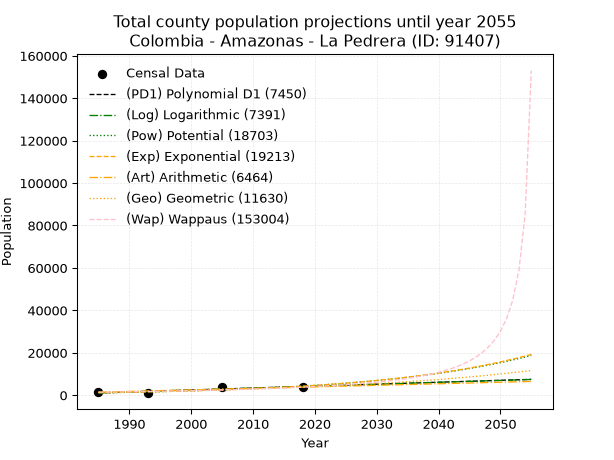
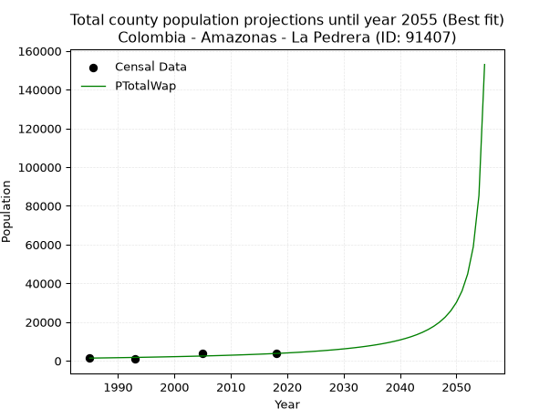
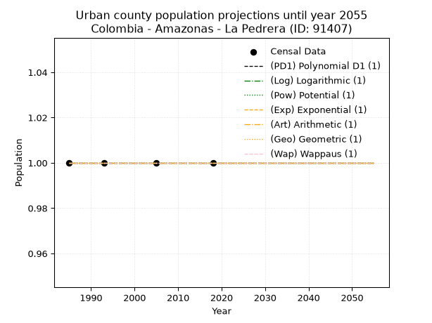
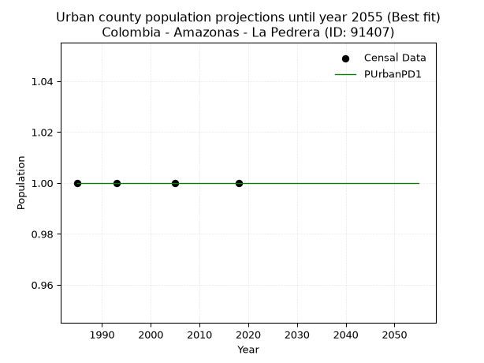

<div align="center">


</div>

# _“Population and Public Services Demand Projections (PPSD) until Year 2050 for Colombia - Amazonas - La Pedrera (ID: 91407)”_
Keywords: `population` `public-service` `projection` `lineal` `polynomial` `logarithmic` `potential` `exponential` `arithmetic` `geometric` `wappaus` `dane` `colombia` `south-america`

PPSD are analytical estimates used by governments and planners to anticipate future changes in population size, age distribution, and the resulting community needs for utilities, healthcare, education, and infrastructure as sizing future water treatment facilities, electrical grids, and road networks based on spatial growth.

> **General running parameters**: • app_version: _v20260806_. • Python version: _3.14.7_. • Pandas version: _3.0.5_. • NumPy version: _2.5.1_. • Creates, save and include plots into reports (create_plot): _True_. • Projection until year: _2050_. • Process polynomial degree 2 and up: _False_. • Process Wappaus: _True_. • Process Wappaus: _True_. • Set negative values to zero: _True_. • Set infinite values to zero: _True_. • Drop dataset notes: _True_. 
<div align="center">

Dynamic map: [:earth_americas:Google](http://maps.google.com/maps?q=-1.42724366,-70.0399142) [:earth_americas:OSM](https://www.openstreetmap.org/#map=18/-1.42724366/-70.0399142&layers=P) [:earth_americas:Bing](https://www.bing.com/maps?cp=-1.42724366~-70.0399142&lvl=18) [:earth_americas:Apple](https://maps.apple.com/frame?center=-1.42724366%2C-70.0399142&span=0.003%2C0.006)

</div>


<div align="center">

```geojson
{
  "type": "Feature",
  "geometry": {
    "type": "Point", 
    "coordinates": [-70.0399142, -1.42724366]
  }, 
  "properties": {
    "Name": "Colombia - Amazonas - La Pedrera (ID: 91407)"
  }
}
```

</div>


## 0. Census Data (4 records)

Census data are official statistics collected by a government about the people and housing in a country. They usually include counts of total population, age, sex, race, income, education, and jobs.

📅Global census file: [Population.xlsx](../data/Population.xlsx)

| Source   |   Year |   CountryID | CountryName   |   StateID | StateName   |   CountyID | CountyName   |   PTotal |   PUrban |   PRural |
|:---------|-------:|------------:|:--------------|----------:|:------------|-----------:|:-------------|---------:|---------:|---------:|
| DANE     |   1985 |          57 | Colombia      |        91 | Amazonas    |      91407 | La Pedrera   |     1388 |        1 |     1388 |
| DANE     |   1993 |          57 | Colombia      |        91 | Amazonas    |      91407 | La Pedrera   |      926 |        1 |      926 |
| DANE     |   2005 |          57 | Colombia      |        91 | Amazonas    |      91407 | La Pedrera   |     3711 |        1 |     3711 |
| DANE     |   2018 |          57 | Colombia      |        91 | Amazonas    |      91407 | La Pedrera   |     3781 |        1 |     3781 |

> 🔥Some records could had specific notes about the registered values or the corresponding urban or rural distribution.

## 1. Total

### 1.1. Coefficients and Parameters

* (PD1) Polynomial Deg 1: 91.30389401846625, -180179.11401043713 (lineal)
* (Log) Logarithmic: 182788.90525956766, -1386928.433656332
* (Pow) Potential: 81.61974571713715, -266.11894590119783
* (Exp) Exponential: 0.04077630117486811, 7.793851112820597e-33
* (Art) Arithmetic: Year diff. 2018 - 1985 = 33, Population diff. 3781 - 1388 = 2393, Annual growth = 72.51515151515152
* (Geo) Geometric: Year diff. 2018 - 1985 = 33, Population diff. 3781 - 1388 = 2393, Annual growth % = 0.030833206962017856
* (Wap) Wappaus: i = 2.8057710007797065, Condition values only valid for < 200)

<sub>
Wappaus condition values: ['0.00', '2.81', '5.61', '8.42', '11.22', '14.03', '16.83', '19.64', '22.45', '25.25', '28.06', '30.86', '33.67', '36.48', '39.28', '42.09', '44.89', '47.70', '50.50', '53.31', '56.12', '58.92', '61.73', '64.53', '67.34', '70.14', '72.95', '75.76', '78.56', '81.37', '84.17', '86.98', '89.78', '92.59', '95.40', '98.20', '101.01', '103.81', '106.62', '109.43', '112.23', '115.04', '117.84', '120.65', '123.45', '126.26', '129.07', '131.87', '134.68', '137.48', '140.29', '143.09', '145.90', '148.71', '151.51', '154.32', '157.12', '159.93', '162.73', '165.54', '168.35', '171.15', '173.96', '176.76', '179.57', '182.38']
</sub>


### 1.2. Projected Dataset

|   Year |   CountyID |   PTotalPD1 |   PTotalLog |   PTotalPow |   PTotalExp |   PTotalArt |   PTotalGeo |   PTotalWap |
|-------:|-----------:|------------:|------------:|------------:|------------:|------------:|------------:|------------:|
|   1985 |      91407 |        1059 |        1056 |        1105 |        1107 |        1388 |        1388 |        1388 |
|   1986 |      91407 |        1150 |        1148 |        1152 |        1153 |        1461 |        1431 |        1427 |
|   1987 |      91407 |        1242 |        1240 |        1200 |        1201 |        1533 |        1475 |        1468 |
|   1988 |      91407 |        1333 |        1332 |        1250 |        1251 |        1606 |        1520 |        1510 |
|   1989 |      91407 |        1424 |        1424 |        1303 |        1303 |        1678 |        1567 |        1553 |
|   1990 |      91407 |        1516 |        1516 |        1357 |        1357 |        1751 |        1616 |        1597 |
|   1991 |      91407 |        1607 |        1608 |        1414 |        1413 |        1823 |        1665 |        1643 |
|   1992 |      91407 |        1698 |        1700 |        1473 |        1472 |        1896 |        1717 |        1690 |
|   1993 |      91407 |        1790 |        1791 |        1535 |        1533 |        1968 |        1770 |        1739 |
|   1994 |      91407 |        1881 |        1883 |        1599 |        1597 |        2041 |        1824 |        1789 |
|   1995 |      91407 |        1972 |        1975 |        1666 |        1664 |        2113 |        1881 |        1841 |
|   1996 |      91407 |        2063 |        2066 |        1735 |        1733 |        2186 |        1938 |        1895 |
|   1997 |      91407 |        2155 |        2158 |        1807 |        1805 |        2258 |        1998 |        1950 |
|   1998 |      91407 |        2246 |        2249 |        1883 |        1880 |        2331 |        2060 |        2007 |
|   1999 |      91407 |        2337 |        2341 |        1961 |        1958 |        2403 |        2123 |        2066 |
|   2000 |      91407 |        2429 |        2432 |        2043 |        2040 |        2476 |        2189 |        2128 |
|   2001 |      91407 |        2520 |        2524 |        2128 |        2125 |        2548 |        2256 |        2191 |
|   2002 |      91407 |        2611 |        2615 |        2217 |        2213 |        2621 |        2326 |        2257 |
|   2003 |      91407 |        2703 |        2706 |        2309 |        2305 |        2693 |        2398 |        2326 |
|   2004 |      91407 |        2794 |        2797 |        2405 |        2401 |        2766 |        2472 |        2397 |
|   2005 |      91407 |        2885 |        2889 |        2505 |        2501 |        2838 |        2548 |        2471 |
|   2006 |      91407 |        2976 |        2980 |        2609 |        2605 |        2911 |        2626 |        2547 |
|   2007 |      91407 |        3068 |        3071 |        2717 |        2714 |        2983 |        2707 |        2627 |
|   2008 |      91407 |        3159 |        3162 |        2830 |        2827 |        3056 |        2791 |        2710 |
|   2009 |      91407 |        3250 |        3253 |        2947 |        2944 |        3128 |        2877 |        2797 |
|   2010 |      91407 |        3342 |        3344 |        3070 |        3067 |        3201 |        2966 |        2888 |
|   2011 |      91407 |        3433 |        3435 |        3197 |        3194 |        3273 |        3057 |        2982 |
|   2012 |      91407 |        3524 |        3526 |        3329 |        3327 |        3346 |        3151 |        3081 |
|   2013 |      91407 |        3616 |        3616 |        3467 |        3466 |        3418 |        3248 |        3184 |
|   2014 |      91407 |        3707 |        3707 |        3610 |        3610 |        3491 |        3349 |        3292 |
|   2015 |      91407 |        3798 |        3798 |        3760 |        3760 |        3563 |        3452 |        3405 |
|   2016 |      91407 |        3890 |        3889 |        3915 |        3917 |        3636 |        3558 |        3524 |
|   2017 |      91407 |        3981 |        3979 |        4077 |        4080 |        3708 |        3668 |        3649 |
|   2018 |      91407 |        4072 |        4070 |        4245 |        4250 |        3781 |        3781 |        3781 |
|   2019 |      91407 |        4163 |        4161 |        4420 |        4427 |        3854 |        3898 |        3920 |
|   2020 |      91407 |        4255 |        4251 |        4602 |        4611 |        3926 |        4018 |        4066 |
|   2021 |      91407 |        4346 |        4341 |        4792 |        4803 |        3999 |        4142 |        4221 |
|   2022 |      91407 |        4437 |        4432 |        4990 |        5003 |        4071 |        4269 |        4384 |
|   2023 |      91407 |        4529 |        4522 |        5195 |        5211 |        4144 |        4401 |        4558 |
|   2024 |      91407 |        4620 |        4613 |        5409 |        5428 |        4216 |        4537 |        4742 |
|   2025 |      91407 |        4711 |        4703 |        5631 |        5654 |        4289 |        4677 |        4938 |
|   2026 |      91407 |        4803 |        4793 |        5863 |        5889 |        4361 |        4821 |        5147 |
|   2027 |      91407 |        4894 |        4883 |        6104 |        6134 |        4434 |        4969 |        5370 |
|   2028 |      91407 |        4985 |        4974 |        6355 |        6389 |        4506 |        5123 |        5609 |
|   2029 |      91407 |        5076 |        5064 |        6616 |        6655 |        4579 |        5281 |        5865 |
|   2030 |      91407 |        5168 |        5154 |        6887 |        6932 |        4651 |        5443 |        6141 |
|   2031 |      91407 |        5259 |        5244 |        7170 |        7221 |        4724 |        5611 |        6439 |
|   2032 |      91407 |        5350 |        5334 |        7464 |        7521 |        4796 |        5784 |        6761 |
|   2033 |      91407 |        5442 |        5424 |        7769 |        7834 |        4869 |        5963 |        7111 |
|   2034 |      91407 |        5533 |        5513 |        8088 |        8160 |        4941 |        6146 |        7493 |
|   2035 |      91407 |        5624 |        5603 |        8419 |        8500 |        5014 |        6336 |        7910 |
|   2036 |      91407 |        5716 |        5693 |        8763 |        8854 |        5086 |        6531 |        8368 |
|   2037 |      91407 |        5807 |        5783 |        9121 |        9222 |        5159 |        6733 |        8874 |
|   2038 |      91407 |        5898 |        5873 |        9494 |        9606 |        5231 |        6940 |        9436 |
|   2039 |      91407 |        5990 |        5962 |        9882 |       10006 |        5304 |        7154 |       10062 |
|   2040 |      91407 |        6081 |        6052 |       10286 |       10422 |        5376 |        7375 |       10765 |
|   2041 |      91407 |        6172 |        6141 |       10705 |       10856 |        5449 |        7602 |       11561 |
|   2042 |      91407 |        6263 |        6231 |       11142 |       11308 |        5521 |        7837 |       12467 |
|   2043 |      91407 |        6355 |        6321 |       11596 |       11778 |        5594 |        8078 |       13511 |
|   2044 |      91407 |        6446 |        6410 |       12069 |       12268 |        5666 |        8327 |       14724 |
|   2045 |      91407 |        6537 |        6499 |       12560 |       12779 |        5739 |        8584 |       16152 |
|   2046 |      91407 |        6629 |        6589 |       13072 |       13311 |        5811 |        8849 |       17858 |
|   2047 |      91407 |        6720 |        6678 |       13603 |       13865 |        5884 |        9122 |       19931 |
|   2048 |      91407 |        6811 |        6767 |       14157 |       14442 |        5956 |        9403 |       22506 |
|   2049 |      91407 |        6903 |        6857 |       14732 |       15043 |        6029 |        9693 |       25787 |
|   2050 |      91407 |        6994 |        6946 |       15331 |       15669 |        6101 |        9992 |       30113 |
<div align="center">

</img>

</div>


### 1.3. Best fit with absolute error and relative error (%)

Relative error puts that difference into context by dividing the absolute error by the true value, creating a unitless ratio or percentage that shows the scale of the mistake.

Absolute and relative error

|   Year | Source   |   CountryID | CountryName   |   StateID | StateName   |   CountyID_x | CountyName   |   PTotal |   PUrban |   PRural |   CountyID_y |   PTotalPD1 |   PTotalLog |   PTotalPow |   PTotalExp |   PTotalArt |   PTotalGeo |   PTotalWap |   PTotalPD1AbsError |   PTotalLogAbsError |   PTotalPowAbsError |   PTotalExpAbsError |   PTotalArtAbsError |   PTotalGeoAbsError |   PTotalWapAbsError |   PTotalPD1RelError |   PTotalLogRelError |   PTotalPowRelError |   PTotalExpRelError |   PTotalArtRelError |   PTotalGeoRelError |   PTotalWapRelError |
|-------:|:---------|------------:|:--------------|----------:|:------------|-------------:|:-------------|---------:|---------:|---------:|-------------:|------------:|------------:|------------:|------------:|------------:|------------:|------------:|--------------------:|--------------------:|--------------------:|--------------------:|--------------------:|--------------------:|--------------------:|--------------------:|--------------------:|--------------------:|--------------------:|--------------------:|--------------------:|--------------------:|
|   1985 | DANE     |          57 | Colombia      |        91 | Amazonas    |        91407 | La Pedrera   |     1388 |        1 |     1388 |        91407 |        1059 |        1056 |        1105 |        1107 |        1388 |        1388 |        1388 |                 329 |                 332 |                 283 |                 281 |                   0 |                   0 |                   0 |            23.7032  |            23.9193  |             20.389  |             20.245  |              0      |              0      |              0      |
|   1993 | DANE     |          57 | Colombia      |        91 | Amazonas    |        91407 | La Pedrera   |      926 |        1 |      926 |        91407 |        1790 |        1791 |        1535 |        1533 |        1968 |        1770 |        1739 |                 864 |                 865 |                 609 |                 607 |                1042 |                 844 |                 813 |            93.3045  |            93.4125  |             65.7667 |             65.5508 |            112.527  |             91.1447 |             87.797  |
|   2005 | DANE     |          57 | Colombia      |        91 | Amazonas    |        91407 | La Pedrera   |     3711 |        1 |     3711 |        91407 |        2885 |        2889 |        2505 |        2501 |        2838 |        2548 |        2471 |                 826 |                 822 |                1206 |                1210 |                 873 |                1163 |                1240 |            22.2582  |            22.1504  |             32.498  |             32.6058 |             23.5247 |             31.3393 |             33.4142 |
|   2018 | DANE     |          57 | Colombia      |        91 | Amazonas    |        91407 | La Pedrera   |     3781 |        1 |     3781 |        91407 |        4072 |        4070 |        4245 |        4250 |        3781 |        3781 |        3781 |                 291 |                 289 |                 464 |                 469 |                   0 |                   0 |                   0 |             7.69638 |             7.64348 |             12.2719 |             12.4041 |              0      |              0      |              0      |

Relative error mean

| Method    |   RelError | Best   |
|:----------|-----------:|:-------|
| PTotalPD1 |    36.7406 |        |
| PTotalLog |    36.7814 |        |
| PTotalPow |    32.7314 |        |
| PTotalExp |    32.7014 |        |
| PTotalArt |    34.0129 |        |
| PTotalGeo |    30.621  |        |
| PTotalWap |    30.3028 | True   |

💙Best method: _**PTotalWap**_
<div align="center">

</img>

</div>


### 1.4. Fresh water supply demand in liters per capita per day (lpcd)

The fresh water supply demand typically ranges from 100 to 300 liters per capita per day (lpcd) for standard domestic and municipal planning, though absolute survival minimums set by the World Health Organization are as low as 7.5 to 20 liters per day, and total consumption in high-income nations can exceed 400 liters.

> `CZ`: Level in meters above the sea level (masl).<br> `WS`: Fresh water supply demand in liters per capita per day (lpcd or l/h/d).<br> `WSAll`: Zonal fresh water supply demand in liters per second (l/s).<br> `A`: Zonal area in square meters.

Reference values (RAS Colombia)

|    CZ |   WS |
|------:|-----:|
|  1000 |  120 |
|  2000 |  130 |
| 99999 |  140 |

County shapefile geometry properties and water supply values

|   CountyID |      ATotal |   CZTotal |   WSTotal |
|-----------:|------------:|----------:|----------:|
|      91407 | 1.35799e+10 |   121.081 |       120 |

Projected values for best method: PTotalWap

|   CountyID |   Year |   PTotalWap |   WSTotal |   WSTotalAll |
|-----------:|-------:|------------:|----------:|-------------:|
|      91407 |   1985 |        1388 |       120 |      1.92778 |
|      91407 |   1986 |        1427 |       120 |      1.98194 |
|      91407 |   1987 |        1468 |       120 |      2.03889 |
|      91407 |   1988 |        1510 |       120 |      2.09722 |
|      91407 |   1989 |        1553 |       120 |      2.15694 |
|      91407 |   1990 |        1597 |       120 |      2.21806 |
|      91407 |   1991 |        1643 |       120 |      2.28194 |
|      91407 |   1992 |        1690 |       120 |      2.34722 |
|      91407 |   1993 |        1739 |       120 |      2.41528 |
|      91407 |   1994 |        1789 |       120 |      2.48472 |
|      91407 |   1995 |        1841 |       120 |      2.55694 |
|      91407 |   1996 |        1895 |       120 |      2.63194 |
|      91407 |   1997 |        1950 |       120 |      2.70833 |
|      91407 |   1998 |        2007 |       120 |      2.7875  |
|      91407 |   1999 |        2066 |       120 |      2.86944 |
|      91407 |   2000 |        2128 |       120 |      2.95556 |
|      91407 |   2001 |        2191 |       120 |      3.04306 |
|      91407 |   2002 |        2257 |       120 |      3.13472 |
|      91407 |   2003 |        2326 |       120 |      3.23056 |
|      91407 |   2004 |        2397 |       120 |      3.32917 |
|      91407 |   2005 |        2471 |       120 |      3.43194 |
|      91407 |   2006 |        2547 |       120 |      3.5375  |
|      91407 |   2007 |        2627 |       120 |      3.64861 |
|      91407 |   2008 |        2710 |       120 |      3.76389 |
|      91407 |   2009 |        2797 |       120 |      3.88472 |
|      91407 |   2010 |        2888 |       120 |      4.01111 |
|      91407 |   2011 |        2982 |       120 |      4.14167 |
|      91407 |   2012 |        3081 |       120 |      4.27917 |
|      91407 |   2013 |        3184 |       120 |      4.42222 |
|      91407 |   2014 |        3292 |       120 |      4.57222 |
|      91407 |   2015 |        3405 |       120 |      4.72917 |
|      91407 |   2016 |        3524 |       120 |      4.89444 |
|      91407 |   2017 |        3649 |       120 |      5.06806 |
|      91407 |   2018 |        3781 |       120 |      5.25139 |
|      91407 |   2019 |        3920 |       120 |      5.44444 |
|      91407 |   2020 |        4066 |       120 |      5.64722 |
|      91407 |   2021 |        4221 |       120 |      5.8625  |
|      91407 |   2022 |        4384 |       120 |      6.08889 |
|      91407 |   2023 |        4558 |       120 |      6.33056 |
|      91407 |   2024 |        4742 |       120 |      6.58611 |
|      91407 |   2025 |        4938 |       120 |      6.85833 |
|      91407 |   2026 |        5147 |       120 |      7.14861 |
|      91407 |   2027 |        5370 |       120 |      7.45833 |
|      91407 |   2028 |        5609 |       120 |      7.79028 |
|      91407 |   2029 |        5865 |       120 |      8.14583 |
|      91407 |   2030 |        6141 |       120 |      8.52917 |
|      91407 |   2031 |        6439 |       120 |      8.94306 |
|      91407 |   2032 |        6761 |       120 |      9.39028 |
|      91407 |   2033 |        7111 |       120 |      9.87639 |
|      91407 |   2034 |        7493 |       120 |     10.4069  |
|      91407 |   2035 |        7910 |       120 |     10.9861  |
|      91407 |   2036 |        8368 |       120 |     11.6222  |
|      91407 |   2037 |        8874 |       120 |     12.325   |
|      91407 |   2038 |        9436 |       120 |     13.1056  |
|      91407 |   2039 |       10062 |       120 |     13.975   |
|      91407 |   2040 |       10765 |       120 |     14.9514  |
|      91407 |   2041 |       11561 |       120 |     16.0569  |
|      91407 |   2042 |       12467 |       120 |     17.3153  |
|      91407 |   2043 |       13511 |       120 |     18.7653  |
|      91407 |   2044 |       14724 |       120 |     20.45    |
|      91407 |   2045 |       16152 |       120 |     22.4333  |
|      91407 |   2046 |       17858 |       120 |     24.8028  |
|      91407 |   2047 |       19931 |       120 |     27.6819  |
|      91407 |   2048 |       22506 |       120 |     31.2583  |
|      91407 |   2049 |       25787 |       120 |     35.8153  |
|      91407 |   2050 |       30113 |       120 |     41.8236  |

## 2. Urban

### 2.1. Coefficients and Parameters

* (PD1) Polynomial Deg 1: -1.3233529347183512e-19, 1.0000000000000004 (lineal)
* (Log) Logarithmic: 3.215569112241165e-17, 0.9999999999999996
* (Pow) Potential: 0.0, 0.0
* (Exp) Exponential: 0.0, 1.0
* (Art) Arithmetic: Year diff. 2018 - 1985 = 33, Population diff. 1 - 1 = 0, Annual growth = 0.0
* (Geo) Geometric: Year diff. 2018 - 1985 = 33, Population diff. 1 - 1 = 0, Annual growth % = 0.0
* (Wap) Wappaus: i = 0.0, Condition values only valid for < 200)

<sub>
Wappaus condition values: ['0.00', '0.00', '0.00', '0.00', '0.00', '0.00', '0.00', '0.00', '0.00', '0.00', '0.00', '0.00', '0.00', '0.00', '0.00', '0.00', '0.00', '0.00', '0.00', '0.00', '0.00', '0.00', '0.00', '0.00', '0.00', '0.00', '0.00', '0.00', '0.00', '0.00', '0.00', '0.00', '0.00', '0.00', '0.00', '0.00', '0.00', '0.00', '0.00', '0.00', '0.00', '0.00', '0.00', '0.00', '0.00', '0.00', '0.00', '0.00', '0.00', '0.00', '0.00', '0.00', '0.00', '0.00', '0.00', '0.00', '0.00', '0.00', '0.00', '0.00', '0.00', '0.00', '0.00', '0.00', '0.00', '0.00']
</sub>


### 2.2. Projected Dataset

|   Year |   CountyID |   PUrbanPD1 |   PUrbanLog |   PUrbanPow |   PUrbanExp |   PUrbanArt |   PUrbanGeo |   PUrbanWap |
|-------:|-----------:|------------:|------------:|------------:|------------:|------------:|------------:|------------:|
|   1985 |      91407 |           1 |           1 |           1 |           1 |           1 |           1 |           1 |
|   1986 |      91407 |           1 |           1 |           1 |           1 |           1 |           1 |           1 |
|   1987 |      91407 |           1 |           1 |           1 |           1 |           1 |           1 |           1 |
|   1988 |      91407 |           1 |           1 |           1 |           1 |           1 |           1 |           1 |
|   1989 |      91407 |           1 |           1 |           1 |           1 |           1 |           1 |           1 |
|   1990 |      91407 |           1 |           1 |           1 |           1 |           1 |           1 |           1 |
|   1991 |      91407 |           1 |           1 |           1 |           1 |           1 |           1 |           1 |
|   1992 |      91407 |           1 |           1 |           1 |           1 |           1 |           1 |           1 |
|   1993 |      91407 |           1 |           1 |           1 |           1 |           1 |           1 |           1 |
|   1994 |      91407 |           1 |           1 |           1 |           1 |           1 |           1 |           1 |
|   1995 |      91407 |           1 |           1 |           1 |           1 |           1 |           1 |           1 |
|   1996 |      91407 |           1 |           1 |           1 |           1 |           1 |           1 |           1 |
|   1997 |      91407 |           1 |           1 |           1 |           1 |           1 |           1 |           1 |
|   1998 |      91407 |           1 |           1 |           1 |           1 |           1 |           1 |           1 |
|   1999 |      91407 |           1 |           1 |           1 |           1 |           1 |           1 |           1 |
|   2000 |      91407 |           1 |           1 |           1 |           1 |           1 |           1 |           1 |
|   2001 |      91407 |           1 |           1 |           1 |           1 |           1 |           1 |           1 |
|   2002 |      91407 |           1 |           1 |           1 |           1 |           1 |           1 |           1 |
|   2003 |      91407 |           1 |           1 |           1 |           1 |           1 |           1 |           1 |
|   2004 |      91407 |           1 |           1 |           1 |           1 |           1 |           1 |           1 |
|   2005 |      91407 |           1 |           1 |           1 |           1 |           1 |           1 |           1 |
|   2006 |      91407 |           1 |           1 |           1 |           1 |           1 |           1 |           1 |
|   2007 |      91407 |           1 |           1 |           1 |           1 |           1 |           1 |           1 |
|   2008 |      91407 |           1 |           1 |           1 |           1 |           1 |           1 |           1 |
|   2009 |      91407 |           1 |           1 |           1 |           1 |           1 |           1 |           1 |
|   2010 |      91407 |           1 |           1 |           1 |           1 |           1 |           1 |           1 |
|   2011 |      91407 |           1 |           1 |           1 |           1 |           1 |           1 |           1 |
|   2012 |      91407 |           1 |           1 |           1 |           1 |           1 |           1 |           1 |
|   2013 |      91407 |           1 |           1 |           1 |           1 |           1 |           1 |           1 |
|   2014 |      91407 |           1 |           1 |           1 |           1 |           1 |           1 |           1 |
|   2015 |      91407 |           1 |           1 |           1 |           1 |           1 |           1 |           1 |
|   2016 |      91407 |           1 |           1 |           1 |           1 |           1 |           1 |           1 |
|   2017 |      91407 |           1 |           1 |           1 |           1 |           1 |           1 |           1 |
|   2018 |      91407 |           1 |           1 |           1 |           1 |           1 |           1 |           1 |
|   2019 |      91407 |           1 |           1 |           1 |           1 |           1 |           1 |           1 |
|   2020 |      91407 |           1 |           1 |           1 |           1 |           1 |           1 |           1 |
|   2021 |      91407 |           1 |           1 |           1 |           1 |           1 |           1 |           1 |
|   2022 |      91407 |           1 |           1 |           1 |           1 |           1 |           1 |           1 |
|   2023 |      91407 |           1 |           1 |           1 |           1 |           1 |           1 |           1 |
|   2024 |      91407 |           1 |           1 |           1 |           1 |           1 |           1 |           1 |
|   2025 |      91407 |           1 |           1 |           1 |           1 |           1 |           1 |           1 |
|   2026 |      91407 |           1 |           1 |           1 |           1 |           1 |           1 |           1 |
|   2027 |      91407 |           1 |           1 |           1 |           1 |           1 |           1 |           1 |
|   2028 |      91407 |           1 |           1 |           1 |           1 |           1 |           1 |           1 |
|   2029 |      91407 |           1 |           1 |           1 |           1 |           1 |           1 |           1 |
|   2030 |      91407 |           1 |           1 |           1 |           1 |           1 |           1 |           1 |
|   2031 |      91407 |           1 |           1 |           1 |           1 |           1 |           1 |           1 |
|   2032 |      91407 |           1 |           1 |           1 |           1 |           1 |           1 |           1 |
|   2033 |      91407 |           1 |           1 |           1 |           1 |           1 |           1 |           1 |
|   2034 |      91407 |           1 |           1 |           1 |           1 |           1 |           1 |           1 |
|   2035 |      91407 |           1 |           1 |           1 |           1 |           1 |           1 |           1 |
|   2036 |      91407 |           1 |           1 |           1 |           1 |           1 |           1 |           1 |
|   2037 |      91407 |           1 |           1 |           1 |           1 |           1 |           1 |           1 |
|   2038 |      91407 |           1 |           1 |           1 |           1 |           1 |           1 |           1 |
|   2039 |      91407 |           1 |           1 |           1 |           1 |           1 |           1 |           1 |
|   2040 |      91407 |           1 |           1 |           1 |           1 |           1 |           1 |           1 |
|   2041 |      91407 |           1 |           1 |           1 |           1 |           1 |           1 |           1 |
|   2042 |      91407 |           1 |           1 |           1 |           1 |           1 |           1 |           1 |
|   2043 |      91407 |           1 |           1 |           1 |           1 |           1 |           1 |           1 |
|   2044 |      91407 |           1 |           1 |           1 |           1 |           1 |           1 |           1 |
|   2045 |      91407 |           1 |           1 |           1 |           1 |           1 |           1 |           1 |
|   2046 |      91407 |           1 |           1 |           1 |           1 |           1 |           1 |           1 |
|   2047 |      91407 |           1 |           1 |           1 |           1 |           1 |           1 |           1 |
|   2048 |      91407 |           1 |           1 |           1 |           1 |           1 |           1 |           1 |
|   2049 |      91407 |           1 |           1 |           1 |           1 |           1 |           1 |           1 |
|   2050 |      91407 |           1 |           1 |           1 |           1 |           1 |           1 |           1 |
<div align="center">

</img>

</div>


### 2.3. Best fit with absolute error and relative error (%)

Relative error puts that difference into context by dividing the absolute error by the true value, creating a unitless ratio or percentage that shows the scale of the mistake.

Absolute and relative error

|   Year | Source   |   CountryID | CountryName   |   StateID | StateName   |   CountyID_x | CountyName   |   PTotal |   PUrban |   PRural |   CountyID_y |   PUrbanPD1 |   PUrbanLog |   PUrbanPow |   PUrbanExp |   PUrbanArt |   PUrbanGeo |   PUrbanWap |   PUrbanPD1AbsError |   PUrbanLogAbsError |   PUrbanPowAbsError |   PUrbanExpAbsError |   PUrbanArtAbsError |   PUrbanGeoAbsError |   PUrbanWapAbsError |   PUrbanPD1RelError |   PUrbanLogRelError |   PUrbanPowRelError |   PUrbanExpRelError |   PUrbanArtRelError |   PUrbanGeoRelError |   PUrbanWapRelError |
|-------:|:---------|------------:|:--------------|----------:|:------------|-------------:|:-------------|---------:|---------:|---------:|-------------:|------------:|------------:|------------:|------------:|------------:|------------:|------------:|--------------------:|--------------------:|--------------------:|--------------------:|--------------------:|--------------------:|--------------------:|--------------------:|--------------------:|--------------------:|--------------------:|--------------------:|--------------------:|--------------------:|
|   1985 | DANE     |          57 | Colombia      |        91 | Amazonas    |        91407 | La Pedrera   |     1388 |        1 |     1388 |        91407 |           1 |           1 |           1 |           1 |           1 |           1 |           1 |                   0 |                   0 |                   0 |                   0 |                   0 |                   0 |                   0 |                   0 |                   0 |                   0 |                   0 |                   0 |                   0 |                   0 |
|   1993 | DANE     |          57 | Colombia      |        91 | Amazonas    |        91407 | La Pedrera   |      926 |        1 |      926 |        91407 |           1 |           1 |           1 |           1 |           1 |           1 |           1 |                   0 |                   0 |                   0 |                   0 |                   0 |                   0 |                   0 |                   0 |                   0 |                   0 |                   0 |                   0 |                   0 |                   0 |
|   2005 | DANE     |          57 | Colombia      |        91 | Amazonas    |        91407 | La Pedrera   |     3711 |        1 |     3711 |        91407 |           1 |           1 |           1 |           1 |           1 |           1 |           1 |                   0 |                   0 |                   0 |                   0 |                   0 |                   0 |                   0 |                   0 |                   0 |                   0 |                   0 |                   0 |                   0 |                   0 |
|   2018 | DANE     |          57 | Colombia      |        91 | Amazonas    |        91407 | La Pedrera   |     3781 |        1 |     3781 |        91407 |           1 |           1 |           1 |           1 |           1 |           1 |           1 |                   0 |                   0 |                   0 |                   0 |                   0 |                   0 |                   0 |                   0 |                   0 |                   0 |                   0 |                   0 |                   0 |                   0 |

Relative error mean

| Method    |   RelError | Best   |
|:----------|-----------:|:-------|
| PUrbanPD1 |          0 | True   |
| PUrbanLog |          0 | True   |
| PUrbanPow |          0 | True   |
| PUrbanExp |          0 | True   |
| PUrbanArt |          0 | True   |
| PUrbanGeo |          0 | True   |
| PUrbanWap |          0 | True   |

💙Best method: _**PUrbanPD1**_
<div align="center">

</img>

</div>


### 2.4. Fresh water supply demand in liters per capita per day (lpcd)

The fresh water supply demand typically ranges from 100 to 300 liters per capita per day (lpcd) for standard domestic and municipal planning, though absolute survival minimums set by the World Health Organization are as low as 7.5 to 20 liters per day, and total consumption in high-income nations can exceed 400 liters.

> `CZ`: Level in meters above the sea level (masl).<br> `WS`: Fresh water supply demand in liters per capita per day (lpcd or l/h/d).<br> `WSAll`: Zonal fresh water supply demand in liters per second (l/s).<br> `A`: Zonal area in square meters.

Reference values (RAS Colombia)

|    CZ |   WS |
|------:|-----:|
|  1000 |  120 |
|  2000 |  130 |
| 99999 |  140 |

County shapefile geometry properties and water supply values

|   CountyID |   AUrban |   CZUrban |   WSUrban |
|-----------:|---------:|----------:|----------:|
|      91407 |        0 |         0 |       120 |

Projected values for best method: PUrbanPD1

|   CountyID |   Year |   PUrbanPD1 |   WSUrban |   WSUrbanAll |
|-----------:|-------:|------------:|----------:|-------------:|
|      91407 |   1985 |           1 |       120 |   0.00138889 |
|      91407 |   1986 |           1 |       120 |   0.00138889 |
|      91407 |   1987 |           1 |       120 |   0.00138889 |
|      91407 |   1988 |           1 |       120 |   0.00138889 |
|      91407 |   1989 |           1 |       120 |   0.00138889 |
|      91407 |   1990 |           1 |       120 |   0.00138889 |
|      91407 |   1991 |           1 |       120 |   0.00138889 |
|      91407 |   1992 |           1 |       120 |   0.00138889 |
|      91407 |   1993 |           1 |       120 |   0.00138889 |
|      91407 |   1994 |           1 |       120 |   0.00138889 |
|      91407 |   1995 |           1 |       120 |   0.00138889 |
|      91407 |   1996 |           1 |       120 |   0.00138889 |
|      91407 |   1997 |           1 |       120 |   0.00138889 |
|      91407 |   1998 |           1 |       120 |   0.00138889 |
|      91407 |   1999 |           1 |       120 |   0.00138889 |
|      91407 |   2000 |           1 |       120 |   0.00138889 |
|      91407 |   2001 |           1 |       120 |   0.00138889 |
|      91407 |   2002 |           1 |       120 |   0.00138889 |
|      91407 |   2003 |           1 |       120 |   0.00138889 |
|      91407 |   2004 |           1 |       120 |   0.00138889 |
|      91407 |   2005 |           1 |       120 |   0.00138889 |
|      91407 |   2006 |           1 |       120 |   0.00138889 |
|      91407 |   2007 |           1 |       120 |   0.00138889 |
|      91407 |   2008 |           1 |       120 |   0.00138889 |
|      91407 |   2009 |           1 |       120 |   0.00138889 |
|      91407 |   2010 |           1 |       120 |   0.00138889 |
|      91407 |   2011 |           1 |       120 |   0.00138889 |
|      91407 |   2012 |           1 |       120 |   0.00138889 |
|      91407 |   2013 |           1 |       120 |   0.00138889 |
|      91407 |   2014 |           1 |       120 |   0.00138889 |
|      91407 |   2015 |           1 |       120 |   0.00138889 |
|      91407 |   2016 |           1 |       120 |   0.00138889 |
|      91407 |   2017 |           1 |       120 |   0.00138889 |
|      91407 |   2018 |           1 |       120 |   0.00138889 |
|      91407 |   2019 |           1 |       120 |   0.00138889 |
|      91407 |   2020 |           1 |       120 |   0.00138889 |
|      91407 |   2021 |           1 |       120 |   0.00138889 |
|      91407 |   2022 |           1 |       120 |   0.00138889 |
|      91407 |   2023 |           1 |       120 |   0.00138889 |
|      91407 |   2024 |           1 |       120 |   0.00138889 |
|      91407 |   2025 |           1 |       120 |   0.00138889 |
|      91407 |   2026 |           1 |       120 |   0.00138889 |
|      91407 |   2027 |           1 |       120 |   0.00138889 |
|      91407 |   2028 |           1 |       120 |   0.00138889 |
|      91407 |   2029 |           1 |       120 |   0.00138889 |
|      91407 |   2030 |           1 |       120 |   0.00138889 |
|      91407 |   2031 |           1 |       120 |   0.00138889 |
|      91407 |   2032 |           1 |       120 |   0.00138889 |
|      91407 |   2033 |           1 |       120 |   0.00138889 |
|      91407 |   2034 |           1 |       120 |   0.00138889 |
|      91407 |   2035 |           1 |       120 |   0.00138889 |
|      91407 |   2036 |           1 |       120 |   0.00138889 |
|      91407 |   2037 |           1 |       120 |   0.00138889 |
|      91407 |   2038 |           1 |       120 |   0.00138889 |
|      91407 |   2039 |           1 |       120 |   0.00138889 |
|      91407 |   2040 |           1 |       120 |   0.00138889 |
|      91407 |   2041 |           1 |       120 |   0.00138889 |
|      91407 |   2042 |           1 |       120 |   0.00138889 |
|      91407 |   2043 |           1 |       120 |   0.00138889 |
|      91407 |   2044 |           1 |       120 |   0.00138889 |
|      91407 |   2045 |           1 |       120 |   0.00138889 |
|      91407 |   2046 |           1 |       120 |   0.00138889 |
|      91407 |   2047 |           1 |       120 |   0.00138889 |
|      91407 |   2048 |           1 |       120 |   0.00138889 |
|      91407 |   2049 |           1 |       120 |   0.00138889 |
|      91407 |   2050 |           1 |       120 |   0.00138889 |

## 3. Rural

### 3.1. Coefficients and Parameters

* (PD1) Polynomial Deg 1: 91.30389401846625, -180179.11401043713 (lineal)
* (Log) Logarithmic: 182788.90525956766, -1386928.433656332
* (Pow) Potential: 81.61974571713715, -266.11894590119783
* (Exp) Exponential: 0.04077630117486811, 7.793851112820597e-33
* (Art) Arithmetic: Year diff. 2018 - 1985 = 33, Population diff. 3781 - 1388 = 2393, Annual growth = 72.51515151515152
* (Geo) Geometric: Year diff. 2018 - 1985 = 33, Population diff. 3781 - 1388 = 2393, Annual growth % = 0.030833206962017856
* (Wap) Wappaus: i = 2.8057710007797065, Condition values only valid for < 200)

<sub>
Wappaus condition values: ['0.00', '2.81', '5.61', '8.42', '11.22', '14.03', '16.83', '19.64', '22.45', '25.25', '28.06', '30.86', '33.67', '36.48', '39.28', '42.09', '44.89', '47.70', '50.50', '53.31', '56.12', '58.92', '61.73', '64.53', '67.34', '70.14', '72.95', '75.76', '78.56', '81.37', '84.17', '86.98', '89.78', '92.59', '95.40', '98.20', '101.01', '103.81', '106.62', '109.43', '112.23', '115.04', '117.84', '120.65', '123.45', '126.26', '129.07', '131.87', '134.68', '137.48', '140.29', '143.09', '145.90', '148.71', '151.51', '154.32', '157.12', '159.93', '162.73', '165.54', '168.35', '171.15', '173.96', '176.76', '179.57', '182.38']
</sub>


### 3.2. Projected Dataset

|   Year |   CountyID |   PRuralPD1 |   PRuralLog |   PRuralPow |   PRuralExp |   PRuralArt |   PRuralGeo |   PRuralWap |
|-------:|-----------:|------------:|------------:|------------:|------------:|------------:|------------:|------------:|
|   1985 |      91407 |        1059 |        1056 |        1105 |        1107 |        1388 |        1388 |        1388 |
|   1986 |      91407 |        1150 |        1148 |        1152 |        1153 |        1461 |        1431 |        1427 |
|   1987 |      91407 |        1242 |        1240 |        1200 |        1201 |        1533 |        1475 |        1468 |
|   1988 |      91407 |        1333 |        1332 |        1250 |        1251 |        1606 |        1520 |        1510 |
|   1989 |      91407 |        1424 |        1424 |        1303 |        1303 |        1678 |        1567 |        1553 |
|   1990 |      91407 |        1516 |        1516 |        1357 |        1357 |        1751 |        1616 |        1597 |
|   1991 |      91407 |        1607 |        1608 |        1414 |        1413 |        1823 |        1665 |        1643 |
|   1992 |      91407 |        1698 |        1700 |        1473 |        1472 |        1896 |        1717 |        1690 |
|   1993 |      91407 |        1790 |        1791 |        1535 |        1533 |        1968 |        1770 |        1739 |
|   1994 |      91407 |        1881 |        1883 |        1599 |        1597 |        2041 |        1824 |        1789 |
|   1995 |      91407 |        1972 |        1975 |        1666 |        1664 |        2113 |        1881 |        1841 |
|   1996 |      91407 |        2063 |        2066 |        1735 |        1733 |        2186 |        1938 |        1895 |
|   1997 |      91407 |        2155 |        2158 |        1807 |        1805 |        2258 |        1998 |        1950 |
|   1998 |      91407 |        2246 |        2249 |        1883 |        1880 |        2331 |        2060 |        2007 |
|   1999 |      91407 |        2337 |        2341 |        1961 |        1958 |        2403 |        2123 |        2066 |
|   2000 |      91407 |        2429 |        2432 |        2043 |        2040 |        2476 |        2189 |        2128 |
|   2001 |      91407 |        2520 |        2524 |        2128 |        2125 |        2548 |        2256 |        2191 |
|   2002 |      91407 |        2611 |        2615 |        2217 |        2213 |        2621 |        2326 |        2257 |
|   2003 |      91407 |        2703 |        2706 |        2309 |        2305 |        2693 |        2398 |        2326 |
|   2004 |      91407 |        2794 |        2797 |        2405 |        2401 |        2766 |        2472 |        2397 |
|   2005 |      91407 |        2885 |        2889 |        2505 |        2501 |        2838 |        2548 |        2471 |
|   2006 |      91407 |        2976 |        2980 |        2609 |        2605 |        2911 |        2626 |        2547 |
|   2007 |      91407 |        3068 |        3071 |        2717 |        2714 |        2983 |        2707 |        2627 |
|   2008 |      91407 |        3159 |        3162 |        2830 |        2827 |        3056 |        2791 |        2710 |
|   2009 |      91407 |        3250 |        3253 |        2947 |        2944 |        3128 |        2877 |        2797 |
|   2010 |      91407 |        3342 |        3344 |        3070 |        3067 |        3201 |        2966 |        2888 |
|   2011 |      91407 |        3433 |        3435 |        3197 |        3194 |        3273 |        3057 |        2982 |
|   2012 |      91407 |        3524 |        3526 |        3329 |        3327 |        3346 |        3151 |        3081 |
|   2013 |      91407 |        3616 |        3616 |        3467 |        3466 |        3418 |        3248 |        3184 |
|   2014 |      91407 |        3707 |        3707 |        3610 |        3610 |        3491 |        3349 |        3292 |
|   2015 |      91407 |        3798 |        3798 |        3760 |        3760 |        3563 |        3452 |        3405 |
|   2016 |      91407 |        3890 |        3889 |        3915 |        3917 |        3636 |        3558 |        3524 |
|   2017 |      91407 |        3981 |        3979 |        4077 |        4080 |        3708 |        3668 |        3649 |
|   2018 |      91407 |        4072 |        4070 |        4245 |        4250 |        3781 |        3781 |        3781 |
|   2019 |      91407 |        4163 |        4161 |        4420 |        4427 |        3854 |        3898 |        3920 |
|   2020 |      91407 |        4255 |        4251 |        4602 |        4611 |        3926 |        4018 |        4066 |
|   2021 |      91407 |        4346 |        4341 |        4792 |        4803 |        3999 |        4142 |        4221 |
|   2022 |      91407 |        4437 |        4432 |        4990 |        5003 |        4071 |        4269 |        4384 |
|   2023 |      91407 |        4529 |        4522 |        5195 |        5211 |        4144 |        4401 |        4558 |
|   2024 |      91407 |        4620 |        4613 |        5409 |        5428 |        4216 |        4537 |        4742 |
|   2025 |      91407 |        4711 |        4703 |        5631 |        5654 |        4289 |        4677 |        4938 |
|   2026 |      91407 |        4803 |        4793 |        5863 |        5889 |        4361 |        4821 |        5147 |
|   2027 |      91407 |        4894 |        4883 |        6104 |        6134 |        4434 |        4969 |        5370 |
|   2028 |      91407 |        4985 |        4974 |        6355 |        6389 |        4506 |        5123 |        5609 |
|   2029 |      91407 |        5076 |        5064 |        6616 |        6655 |        4579 |        5281 |        5865 |
|   2030 |      91407 |        5168 |        5154 |        6887 |        6932 |        4651 |        5443 |        6141 |
|   2031 |      91407 |        5259 |        5244 |        7170 |        7221 |        4724 |        5611 |        6439 |
|   2032 |      91407 |        5350 |        5334 |        7464 |        7521 |        4796 |        5784 |        6761 |
|   2033 |      91407 |        5442 |        5424 |        7769 |        7834 |        4869 |        5963 |        7111 |
|   2034 |      91407 |        5533 |        5513 |        8088 |        8160 |        4941 |        6146 |        7493 |
|   2035 |      91407 |        5624 |        5603 |        8419 |        8500 |        5014 |        6336 |        7910 |
|   2036 |      91407 |        5716 |        5693 |        8763 |        8854 |        5086 |        6531 |        8368 |
|   2037 |      91407 |        5807 |        5783 |        9121 |        9222 |        5159 |        6733 |        8874 |
|   2038 |      91407 |        5898 |        5873 |        9494 |        9606 |        5231 |        6940 |        9436 |
|   2039 |      91407 |        5990 |        5962 |        9882 |       10006 |        5304 |        7154 |       10062 |
|   2040 |      91407 |        6081 |        6052 |       10286 |       10422 |        5376 |        7375 |       10765 |
|   2041 |      91407 |        6172 |        6141 |       10705 |       10856 |        5449 |        7602 |       11561 |
|   2042 |      91407 |        6263 |        6231 |       11142 |       11308 |        5521 |        7837 |       12467 |
|   2043 |      91407 |        6355 |        6321 |       11596 |       11778 |        5594 |        8078 |       13511 |
|   2044 |      91407 |        6446 |        6410 |       12069 |       12268 |        5666 |        8327 |       14724 |
|   2045 |      91407 |        6537 |        6499 |       12560 |       12779 |        5739 |        8584 |       16152 |
|   2046 |      91407 |        6629 |        6589 |       13072 |       13311 |        5811 |        8849 |       17858 |
|   2047 |      91407 |        6720 |        6678 |       13603 |       13865 |        5884 |        9122 |       19931 |
|   2048 |      91407 |        6811 |        6767 |       14157 |       14442 |        5956 |        9403 |       22506 |
|   2049 |      91407 |        6903 |        6857 |       14732 |       15043 |        6029 |        9693 |       25787 |
|   2050 |      91407 |        6994 |        6946 |       15331 |       15669 |        6101 |        9992 |       30113 |
<div align="center">

</img>

</div>


### 3.3. Best fit with absolute error and relative error (%)

Relative error puts that difference into context by dividing the absolute error by the true value, creating a unitless ratio or percentage that shows the scale of the mistake.

Absolute and relative error

|   Year | Source   |   CountryID | CountryName   |   StateID | StateName   |   CountyID_x | CountyName   |   PTotal |   PUrban |   PRural |   CountyID_y |   PRuralPD1 |   PRuralLog |   PRuralPow |   PRuralExp |   PRuralArt |   PRuralGeo |   PRuralWap |   PRuralPD1AbsError |   PRuralLogAbsError |   PRuralPowAbsError |   PRuralExpAbsError |   PRuralArtAbsError |   PRuralGeoAbsError |   PRuralWapAbsError |   PRuralPD1RelError |   PRuralLogRelError |   PRuralPowRelError |   PRuralExpRelError |   PRuralArtRelError |   PRuralGeoRelError |   PRuralWapRelError |
|-------:|:---------|------------:|:--------------|----------:|:------------|-------------:|:-------------|---------:|---------:|---------:|-------------:|------------:|------------:|------------:|------------:|------------:|------------:|------------:|--------------------:|--------------------:|--------------------:|--------------------:|--------------------:|--------------------:|--------------------:|--------------------:|--------------------:|--------------------:|--------------------:|--------------------:|--------------------:|--------------------:|
|   1985 | DANE     |          57 | Colombia      |        91 | Amazonas    |        91407 | La Pedrera   |     1388 |        1 |     1388 |        91407 |        1059 |        1056 |        1105 |        1107 |        1388 |        1388 |        1388 |                 329 |                 332 |                 283 |                 281 |                   0 |                   0 |                   0 |            23.7032  |            23.9193  |             20.389  |             20.245  |              0      |              0      |              0      |
|   1993 | DANE     |          57 | Colombia      |        91 | Amazonas    |        91407 | La Pedrera   |      926 |        1 |      926 |        91407 |        1790 |        1791 |        1535 |        1533 |        1968 |        1770 |        1739 |                 864 |                 865 |                 609 |                 607 |                1042 |                 844 |                 813 |            93.3045  |            93.4125  |             65.7667 |             65.5508 |            112.527  |             91.1447 |             87.797  |
|   2005 | DANE     |          57 | Colombia      |        91 | Amazonas    |        91407 | La Pedrera   |     3711 |        1 |     3711 |        91407 |        2885 |        2889 |        2505 |        2501 |        2838 |        2548 |        2471 |                 826 |                 822 |                1206 |                1210 |                 873 |                1163 |                1240 |            22.2582  |            22.1504  |             32.498  |             32.6058 |             23.5247 |             31.3393 |             33.4142 |
|   2018 | DANE     |          57 | Colombia      |        91 | Amazonas    |        91407 | La Pedrera   |     3781 |        1 |     3781 |        91407 |        4072 |        4070 |        4245 |        4250 |        3781 |        3781 |        3781 |                 291 |                 289 |                 464 |                 469 |                   0 |                   0 |                   0 |             7.69638 |             7.64348 |             12.2719 |             12.4041 |              0      |              0      |              0      |

Relative error mean

| Method    |   RelError | Best   |
|:----------|-----------:|:-------|
| PRuralPD1 |    36.7406 |        |
| PRuralLog |    36.7814 |        |
| PRuralPow |    32.7314 |        |
| PRuralExp |    32.7014 |        |
| PRuralArt |    34.0129 |        |
| PRuralGeo |    30.621  |        |
| PRuralWap |    30.3028 | True   |

💙Best method: _**PRuralWap**_
<div align="center">

</img>

</div>


### 3.4. Fresh water supply demand in liters per capita per day (lpcd)

The fresh water supply demand typically ranges from 100 to 300 liters per capita per day (lpcd) for standard domestic and municipal planning, though absolute survival minimums set by the World Health Organization are as low as 7.5 to 20 liters per day, and total consumption in high-income nations can exceed 400 liters.

> `CZ`: Level in meters above the sea level (masl).<br> `WS`: Fresh water supply demand in liters per capita per day (lpcd or l/h/d).<br> `WSAll`: Zonal fresh water supply demand in liters per second (l/s).<br> `A`: Zonal area in square meters.

Reference values (RAS Colombia)

|    CZ |   WS |
|------:|-----:|
|  1000 |  120 |
|  2000 |  130 |
| 99999 |  140 |

County shapefile geometry properties and water supply values

|   CountyID |      ARural |   CZRural |   WSRural |
|-----------:|------------:|----------:|----------:|
|      91407 | 1.35799e+10 |   121.081 |       120 |

Projected values for best method: PRuralWap

|   CountyID |   Year |   PRuralWap |   WSRural |   WSRuralAll |
|-----------:|-------:|------------:|----------:|-------------:|
|      91407 |   1985 |        1388 |       120 |      1.92778 |
|      91407 |   1986 |        1427 |       120 |      1.98194 |
|      91407 |   1987 |        1468 |       120 |      2.03889 |
|      91407 |   1988 |        1510 |       120 |      2.09722 |
|      91407 |   1989 |        1553 |       120 |      2.15694 |
|      91407 |   1990 |        1597 |       120 |      2.21806 |
|      91407 |   1991 |        1643 |       120 |      2.28194 |
|      91407 |   1992 |        1690 |       120 |      2.34722 |
|      91407 |   1993 |        1739 |       120 |      2.41528 |
|      91407 |   1994 |        1789 |       120 |      2.48472 |
|      91407 |   1995 |        1841 |       120 |      2.55694 |
|      91407 |   1996 |        1895 |       120 |      2.63194 |
|      91407 |   1997 |        1950 |       120 |      2.70833 |
|      91407 |   1998 |        2007 |       120 |      2.7875  |
|      91407 |   1999 |        2066 |       120 |      2.86944 |
|      91407 |   2000 |        2128 |       120 |      2.95556 |
|      91407 |   2001 |        2191 |       120 |      3.04306 |
|      91407 |   2002 |        2257 |       120 |      3.13472 |
|      91407 |   2003 |        2326 |       120 |      3.23056 |
|      91407 |   2004 |        2397 |       120 |      3.32917 |
|      91407 |   2005 |        2471 |       120 |      3.43194 |
|      91407 |   2006 |        2547 |       120 |      3.5375  |
|      91407 |   2007 |        2627 |       120 |      3.64861 |
|      91407 |   2008 |        2710 |       120 |      3.76389 |
|      91407 |   2009 |        2797 |       120 |      3.88472 |
|      91407 |   2010 |        2888 |       120 |      4.01111 |
|      91407 |   2011 |        2982 |       120 |      4.14167 |
|      91407 |   2012 |        3081 |       120 |      4.27917 |
|      91407 |   2013 |        3184 |       120 |      4.42222 |
|      91407 |   2014 |        3292 |       120 |      4.57222 |
|      91407 |   2015 |        3405 |       120 |      4.72917 |
|      91407 |   2016 |        3524 |       120 |      4.89444 |
|      91407 |   2017 |        3649 |       120 |      5.06806 |
|      91407 |   2018 |        3781 |       120 |      5.25139 |
|      91407 |   2019 |        3920 |       120 |      5.44444 |
|      91407 |   2020 |        4066 |       120 |      5.64722 |
|      91407 |   2021 |        4221 |       120 |      5.8625  |
|      91407 |   2022 |        4384 |       120 |      6.08889 |
|      91407 |   2023 |        4558 |       120 |      6.33056 |
|      91407 |   2024 |        4742 |       120 |      6.58611 |
|      91407 |   2025 |        4938 |       120 |      6.85833 |
|      91407 |   2026 |        5147 |       120 |      7.14861 |
|      91407 |   2027 |        5370 |       120 |      7.45833 |
|      91407 |   2028 |        5609 |       120 |      7.79028 |
|      91407 |   2029 |        5865 |       120 |      8.14583 |
|      91407 |   2030 |        6141 |       120 |      8.52917 |
|      91407 |   2031 |        6439 |       120 |      8.94306 |
|      91407 |   2032 |        6761 |       120 |      9.39028 |
|      91407 |   2033 |        7111 |       120 |      9.87639 |
|      91407 |   2034 |        7493 |       120 |     10.4069  |
|      91407 |   2035 |        7910 |       120 |     10.9861  |
|      91407 |   2036 |        8368 |       120 |     11.6222  |
|      91407 |   2037 |        8874 |       120 |     12.325   |
|      91407 |   2038 |        9436 |       120 |     13.1056  |
|      91407 |   2039 |       10062 |       120 |     13.975   |
|      91407 |   2040 |       10765 |       120 |     14.9514  |
|      91407 |   2041 |       11561 |       120 |     16.0569  |
|      91407 |   2042 |       12467 |       120 |     17.3153  |
|      91407 |   2043 |       13511 |       120 |     18.7653  |
|      91407 |   2044 |       14724 |       120 |     20.45    |
|      91407 |   2045 |       16152 |       120 |     22.4333  |
|      91407 |   2046 |       17858 |       120 |     24.8028  |
|      91407 |   2047 |       19931 |       120 |     27.6819  |
|      91407 |   2048 |       22506 |       120 |     31.2583  |
|      91407 |   2049 |       25787 |       120 |     35.8153  |
|      91407 |   2050 |       30113 |       120 |     41.8236  |

<div align="center"><br><sub>Share this research</sub></div><br>

<sub>**APPS & TOOLS & CONTENT DISCLAIMER**: • NO WARRANTY - This content and software is provided by <a href="https://github.com/rcfdtools" target="_blank">github.com/rcfdtools</a> "as is", without any express or implied warranty, including warranties of merchantability, fitness for a particular purpose, or non-infringement. There is no guarantee that the software will be error-free or operate without interruption. • LIMITATION OF LIABILITY - Neither the authors nor copyright holders will be liable for claims or damages arising from the software or its use. You are responsible for determining if the software is appropriate for your use and assume all associated risks, including errors, legal compliance, and data loss. • NO PROFESSIONAL ADVICE - The software provides general information and does not offer professional advice. It should not replace consultation with professional advisors. [Clauses and global license for rcfdtools use.](https://github.com/rcfdtools/rcfdtools/blob/main/LICENSE.md)</sub>