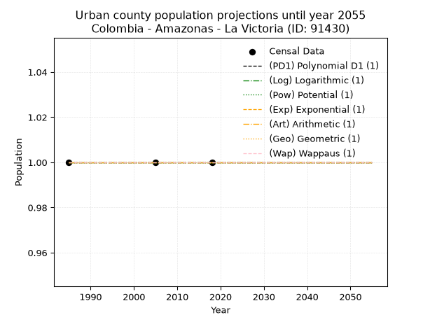
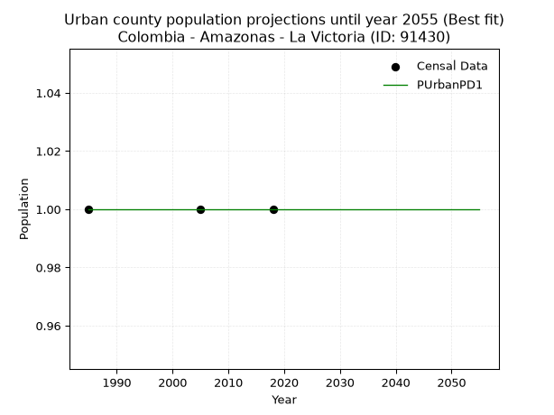
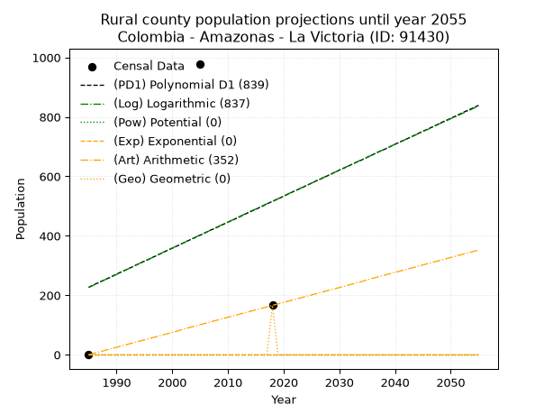
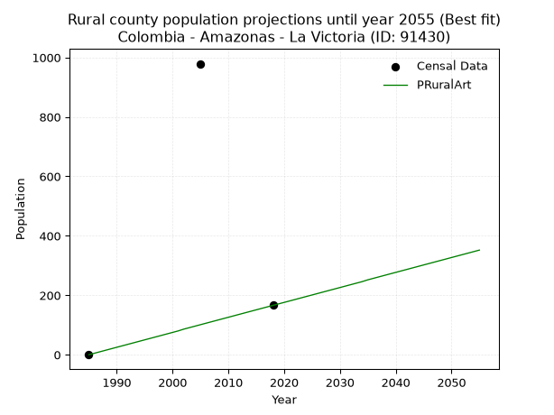

<div align="center">


</div>

# 📜 _“Population and Public Services Demand Projections (PPSD) until Year 2050 for Colombia - Amazonas - La Victoria (ID: 91430)”_
Keywords: `population` `public-service` `projection` `lineal` `polynomial` `logarithmic` `potential` `exponential` `arithmetic` `geometric` `wappaus` `dane` `colombia` `south-america`

PPSD are analytical estimates used by governments and planners to anticipate future changes in population size, age distribution, and the resulting community needs for utilities, healthcare, education, and infrastructure as sizing future water treatment facilities, electrical grids, and road networks based on spatial growth.

<div align="center">

</img>

</div>


> **General running parameters**: • app_version: _v20260806_. • Python version: _3.14.7_. • Pandas version: _3.0.5_. • NumPy version: _2.5.1_. • Creates, save and include plots into reports (create_plot): _False_. • Projection until year: _2050_. • Process polynomial degree 2 and up: _False_. • Process Wappaus: _True_. • Process Wappaus: _True_. • Set negative values to zero: _True_. • Set infinite values to zero: _True_. • Drop dataset notes: _True_. 
<div align="center">

Maps & GIS Layers: [:earth_americas:Google](http://maps.google.com/maps?q=-0.12501638,-71.104878) [:earth_americas:OSM](https://www.openstreetmap.org/#map=18/-0.12501638/-71.104878&layers=P) [:earth_americas:Bing](https://www.bing.com/maps?cp=-0.12501638~-71.104878&lvl=18) [:earth_americas:Apple](https://maps.apple.com/frame?center=-0.12501638%2C-71.104878&span=0.003%2C0.006) [:earth_americas:GISMobile](https://github.com/rcfdtools/R.GISMobile/blob/main/file/gis/CountyLayer_CO/Readme.md)

</div>


<div align="center">

```geojson
{
  "type": "Feature",
  "geometry": {
    "type": "Point", 
    "coordinates": [-71.104878, -0.12501638]
  }, 
  "properties": {
    "Name": "Colombia - Amazonas - La Victoria (ID: 91430)"
  }
}
```

</div>


## 0. Census Data (3 records)

Census data are official statistics collected by a government about the people and housing in a country. They usually include counts of total population, age, sex, race, income, education, and jobs.

📅Global census file: [Population.xlsx](../data/Population.xlsx)

| Source   |   Year |   CountryID | CountryName   |   StateID | StateName   |   CountyID | CountyName   |   PTotal |   PUrban |   PRural |
|:---------|-------:|------------:|:--------------|----------:|:------------|-----------:|:-------------|---------:|---------:|---------:|
| DANE     |   1985 |          57 | Colombia      |        91 | Amazonas    |      91430 | La Victoria  |        0 |        1 |        0 |
| DANE     |   2005 |          57 | Colombia      |        91 | Amazonas    |      91430 | La Victoria  |      979 |        1 |      979 |
| DANE     |   2018 |          57 | Colombia      |        91 | Amazonas    |      91430 | La Victoria  |      166 |        1 |      166 |

> 🔥Some records could had specific notes about the registered values or the corresponding urban or rural distribution.

## 1. Total

### 1.1. Coefficients and Parameters

* (PD1) Polynomial Deg 1: 8.738841978286878, -17119.320868515857 (lineal)
* (Log) Logarithmic: 17620.995013133503, -133576.8715104035
* (Pow) Potential: nan, nan
* (Exp) Exponential: nan, nan
* (Art) Arithmetic: Year diff. 2018 - 1985 = 33, Population diff. 166 - 0 = 166, Annual growth = 5.03030303030303
* (Geo) Geometric: Year diff. 2018 - 1985 = 33, Population diff. 166 - 0 = 166, Annual growth % = inf
* (Wap) Wappaus: i = 6.0606060606060606, Condition values only valid for < 200)

<sub>
Wappaus condition values: ['0.00', '6.06', '12.12', '18.18', '24.24', '30.30', '36.36', '42.42', '48.48', '54.55', '60.61', '66.67', '72.73', '78.79', '84.85', '90.91', '96.97', '103.03', '109.09', '115.15', '121.21', '127.27', '133.33', '139.39', '145.45', '151.52', '157.58', '163.64', '169.70', '175.76', '181.82', '187.88', '193.94', '200.00', '206.06', '212.12', '218.18', '224.24', '230.30', '236.36', '242.42', '248.48', '254.55', '260.61', '266.67', '272.73', '278.79', '284.85', '290.91', '296.97', '303.03', '309.09', '315.15', '321.21', '327.27', '333.33', '339.39', '345.45', '351.52', '357.58', '363.64', '369.70', '375.76', '381.82', '387.88', '393.94']
</sub>


### 1.2. Projected Dataset

|   Year |   CountyID |   PTotalPD1 |   PTotalLog |   PTotalPow |   PTotalExp |   PTotalArt |   PTotalGeo |
|-------:|-----------:|------------:|------------:|------------:|------------:|------------:|------------:|
|   1985 |      91430 |         227 |         226 |           0 |           0 |           0 |           0 |
|   1986 |      91430 |         236 |         235 |           0 |           0 |           5 |           0 |
|   1987 |      91430 |         245 |         244 |           0 |           0 |          10 |           0 |
|   1988 |      91430 |         253 |         253 |           0 |           0 |          15 |           0 |
|   1989 |      91430 |         262 |         261 |           0 |           0 |          20 |           0 |
|   1990 |      91430 |         271 |         270 |           0 |           0 |          25 |           0 |
|   1991 |      91430 |         280 |         279 |           0 |           0 |          30 |           0 |
|   1992 |      91430 |         288 |         288 |           0 |           0 |          35 |           0 |
|   1993 |      91430 |         297 |         297 |           0 |           0 |          40 |           0 |
|   1994 |      91430 |         306 |         306 |           0 |           0 |          45 |           0 |
|   1995 |      91430 |         315 |         314 |           0 |           0 |          50 |           0 |
|   1996 |      91430 |         323 |         323 |           0 |           0 |          55 |           0 |
|   1997 |      91430 |         332 |         332 |           0 |           0 |          60 |           0 |
|   1998 |      91430 |         341 |         341 |           0 |           0 |          65 |           0 |
|   1999 |      91430 |         350 |         350 |           0 |           0 |          70 |           0 |
|   2000 |      91430 |         358 |         359 |           0 |           0 |          75 |           0 |
|   2001 |      91430 |         367 |         367 |           0 |           0 |          80 |           0 |
|   2002 |      91430 |         376 |         376 |           0 |           0 |          86 |           0 |
|   2003 |      91430 |         385 |         385 |           0 |           0 |          91 |           0 |
|   2004 |      91430 |         393 |         394 |           0 |           0 |          96 |           0 |
|   2005 |      91430 |         402 |         403 |           0 |           0 |         101 |           0 |
|   2006 |      91430 |         411 |         411 |           0 |           0 |         106 |           0 |
|   2007 |      91430 |         420 |         420 |           0 |           0 |         111 |           0 |
|   2008 |      91430 |         428 |         429 |           0 |           0 |         116 |           0 |
|   2009 |      91430 |         437 |         438 |           0 |           0 |         121 |           0 |
|   2010 |      91430 |         446 |         446 |           0 |           0 |         126 |           0 |
|   2011 |      91430 |         454 |         455 |           0 |           0 |         131 |           0 |
|   2012 |      91430 |         463 |         464 |           0 |           0 |         136 |           0 |
|   2013 |      91430 |         472 |         473 |           0 |           0 |         141 |           0 |
|   2014 |      91430 |         481 |         482 |           0 |           0 |         146 |           0 |
|   2015 |      91430 |         489 |         490 |           0 |           0 |         151 |           0 |
|   2016 |      91430 |         498 |         499 |           0 |           0 |         156 |           0 |
|   2017 |      91430 |         507 |         508 |           0 |           0 |         161 |           0 |
|   2018 |      91430 |         516 |         516 |           0 |           0 |         166 |         166 |
|   2019 |      91430 |         524 |         525 |           0 |           0 |         171 |         inf |
|   2020 |      91430 |         533 |         534 |           0 |           0 |         176 |         inf |
|   2021 |      91430 |         542 |         543 |           0 |           0 |         181 |         inf |
|   2022 |      91430 |         551 |         551 |           0 |           0 |         186 |         inf |
|   2023 |      91430 |         559 |         560 |           0 |           0 |         191 |         inf |
|   2024 |      91430 |         568 |         569 |           0 |           0 |         196 |         inf |
|   2025 |      91430 |         577 |         577 |           0 |           0 |         201 |         inf |
|   2026 |      91430 |         586 |         586 |           0 |           0 |         206 |         inf |
|   2027 |      91430 |         594 |         595 |           0 |           0 |         211 |         inf |
|   2028 |      91430 |         603 |         604 |           0 |           0 |         216 |         inf |
|   2029 |      91430 |         612 |         612 |           0 |           0 |         221 |         inf |
|   2030 |      91430 |         621 |         621 |           0 |           0 |         226 |         inf |
|   2031 |      91430 |         629 |         630 |           0 |           0 |         231 |         inf |
|   2032 |      91430 |         638 |         638 |           0 |           0 |         236 |         inf |
|   2033 |      91430 |         647 |         647 |           0 |           0 |         241 |         inf |
|   2034 |      91430 |         655 |         656 |           0 |           0 |         246 |         inf |
|   2035 |      91430 |         664 |         664 |           0 |           0 |         252 |         inf |
|   2036 |      91430 |         673 |         673 |           0 |           0 |         257 |         inf |
|   2037 |      91430 |         682 |         682 |           0 |           0 |         262 |         inf |
|   2038 |      91430 |         690 |         690 |           0 |           0 |         267 |         inf |
|   2039 |      91430 |         699 |         699 |           0 |           0 |         272 |         inf |
|   2040 |      91430 |         708 |         708 |           0 |           0 |         277 |         inf |
|   2041 |      91430 |         717 |         716 |           0 |           0 |         282 |         inf |
|   2042 |      91430 |         725 |         725 |           0 |           0 |         287 |         inf |
|   2043 |      91430 |         734 |         733 |           0 |           0 |         292 |         inf |
|   2044 |      91430 |         743 |         742 |           0 |           0 |         297 |         inf |
|   2045 |      91430 |         752 |         751 |           0 |           0 |         302 |         inf |
|   2046 |      91430 |         760 |         759 |           0 |           0 |         307 |         inf |
|   2047 |      91430 |         769 |         768 |           0 |           0 |         312 |         inf |
|   2048 |      91430 |         778 |         777 |           0 |           0 |         317 |         inf |
|   2049 |      91430 |         787 |         785 |           0 |           0 |         322 |         inf |
|   2050 |      91430 |         795 |         794 |           0 |           0 |         327 |         inf |
<div align="center">

</img>

</div>


### 1.3. Best fit with absolute and relative error (%)

Relative error puts that difference into context by dividing the absolute error by the true value, creating a unitless ratio or percentage that shows the scale of the mistake.

Absolute and relative error

|   Year | Source   |   CountryID | CountryName   |   StateID | StateName   |   CountyID_x | CountyName   |   PTotal |   PUrban |   PRural |   CountyID_y |   PTotalPD1 |   PTotalLog |   PTotalPow |   PTotalExp |   PTotalArt |   PTotalGeo |   PTotalPD1AbsError |   PTotalLogAbsError |   PTotalPowAbsError |   PTotalExpAbsError |   PTotalArtAbsError |   PTotalGeoAbsError |   PTotalPD1RelError |   PTotalLogRelError |   PTotalPowRelError |   PTotalExpRelError |   PTotalArtRelError |   PTotalGeoRelError |
|-------:|:---------|------------:|:--------------|----------:|:------------|-------------:|:-------------|---------:|---------:|---------:|-------------:|------------:|------------:|------------:|------------:|------------:|------------:|--------------------:|--------------------:|--------------------:|--------------------:|--------------------:|--------------------:|--------------------:|--------------------:|--------------------:|--------------------:|--------------------:|--------------------:|
|   1985 | DANE     |          57 | Colombia      |        91 | Amazonas    |        91430 | La Victoria  |        0 |        1 |        0 |        91430 |         227 |         226 |           0 |           0 |           0 |           0 |                 227 |                 226 |                   0 |                   0 |                   0 |                   0 |            inf      |            inf      |                 nan |                 nan |            nan      |                 nan |
|   2005 | DANE     |          57 | Colombia      |        91 | Amazonas    |        91430 | La Victoria  |      979 |        1 |      979 |        91430 |         402 |         403 |           0 |           0 |         101 |           0 |                 577 |                 576 |                 979 |                 979 |                 878 |                 979 |             58.9377 |             58.8355 |                 100 |                 100 |             89.6834 |                 100 |
|   2018 | DANE     |          57 | Colombia      |        91 | Amazonas    |        91430 | La Victoria  |      166 |        1 |      166 |        91430 |         516 |         516 |           0 |           0 |         166 |         166 |                 350 |                 350 |                 166 |                 166 |                   0 |                   0 |            210.843  |            210.843  |                 100 |                 100 |              0      |                   0 |

Relative error mean

| Method    |   RelError | Best   |
|:----------|-----------:|:-------|
| PTotalPD1 |   inf      |        |
| PTotalLog |   inf      |        |
| PTotalPow |   100      |        |
| PTotalExp |   100      |        |
| PTotalArt |    44.8417 | True   |
| PTotalGeo |    50      |        |

💙Best method: _**PTotalArt**_
<div align="center">

</img>

</div>


### 1.4. Fresh water supply demand in liters per capita per day (lpcd)

The fresh water supply demand typically ranges from 100 to 300 liters per capita per day (lpcd) for standard domestic and municipal planning, though absolute survival minimums set by the World Health Organization are as low as 7.5 to 20 liters per day, and total consumption in high-income nations can exceed 400 liters.

> `CZ`: Level in meters above the sea level (masl)<br> `WS`: Fresh water supply demand in liters per capita per day (lpcd or l/h/d)<br> `WSAll`: Zonal fresh water supply demand in liters per second (l/s)<br> `A`: Zonal area in square meters<br> `DP`: Population density (people/hectare or p/ha)

Reference values (RAS Colombia)

|    CZ |   WS |
|------:|-----:|
|  1000 |  120 |
|  2000 |  130 |
| 99999 |  140 |

County shapefile geometry properties and water supply values

|   CountyID |     ATotal |   CZTotal |   WSTotal |
|-----------:|-----------:|----------:|----------:|
|      91430 | 1.4282e+09 |   173.752 |       120 |

Projected values for best method: PTotalArt

|   CountyID |   Year |   PTotalArt |   DPTotal |   WSTotal |   WSTotalAll |
|-----------:|-------:|------------:|----------:|----------:|-------------:|
|      91430 |   1985 |           0 |         0 |       120 |   0          |
|      91430 |   1986 |           5 |         0 |       120 |   0.00694444 |
|      91430 |   1987 |          10 |         0 |       120 |   0.0138889  |
|      91430 |   1988 |          15 |         0 |       120 |   0.0208333  |
|      91430 |   1989 |          20 |         0 |       120 |   0.0277778  |
|      91430 |   1990 |          25 |         0 |       120 |   0.0347222  |
|      91430 |   1991 |          30 |         0 |       120 |   0.0416667  |
|      91430 |   1992 |          35 |         0 |       120 |   0.0486111  |
|      91430 |   1993 |          40 |         0 |       120 |   0.0555556  |
|      91430 |   1994 |          45 |         0 |       120 |   0.0625     |
|      91430 |   1995 |          50 |         0 |       120 |   0.0694444  |
|      91430 |   1996 |          55 |         0 |       120 |   0.0763889  |
|      91430 |   1997 |          60 |         0 |       120 |   0.0833333  |
|      91430 |   1998 |          65 |         0 |       120 |   0.0902778  |
|      91430 |   1999 |          70 |         0 |       120 |   0.0972222  |
|      91430 |   2000 |          75 |         0 |       120 |   0.104167   |
|      91430 |   2001 |          80 |         0 |       120 |   0.111111   |
|      91430 |   2002 |          86 |         0 |       120 |   0.119444   |
|      91430 |   2003 |          91 |         0 |       120 |   0.126389   |
|      91430 |   2004 |          96 |         0 |       120 |   0.133333   |
|      91430 |   2005 |         101 |         0 |       120 |   0.140278   |
|      91430 |   2006 |         106 |         0 |       120 |   0.147222   |
|      91430 |   2007 |         111 |         0 |       120 |   0.154167   |
|      91430 |   2008 |         116 |         0 |       120 |   0.161111   |
|      91430 |   2009 |         121 |         0 |       120 |   0.168056   |
|      91430 |   2010 |         126 |         0 |       120 |   0.175      |
|      91430 |   2011 |         131 |         0 |       120 |   0.181944   |
|      91430 |   2012 |         136 |         0 |       120 |   0.188889   |
|      91430 |   2013 |         141 |         0 |       120 |   0.195833   |
|      91430 |   2014 |         146 |         0 |       120 |   0.202778   |
|      91430 |   2015 |         151 |         0 |       120 |   0.209722   |
|      91430 |   2016 |         156 |         0 |       120 |   0.216667   |
|      91430 |   2017 |         161 |         0 |       120 |   0.223611   |
|      91430 |   2018 |         166 |         0 |       120 |   0.230556   |
|      91430 |   2019 |         171 |         0 |       120 |   0.2375     |
|      91430 |   2020 |         176 |         0 |       120 |   0.244444   |
|      91430 |   2021 |         181 |         0 |       120 |   0.251389   |
|      91430 |   2022 |         186 |         0 |       120 |   0.258333   |
|      91430 |   2023 |         191 |         0 |       120 |   0.265278   |
|      91430 |   2024 |         196 |         0 |       120 |   0.272222   |
|      91430 |   2025 |         201 |         0 |       120 |   0.279167   |
|      91430 |   2026 |         206 |         0 |       120 |   0.286111   |
|      91430 |   2027 |         211 |         0 |       120 |   0.293056   |
|      91430 |   2028 |         216 |         0 |       120 |   0.3        |
|      91430 |   2029 |         221 |         0 |       120 |   0.306944   |
|      91430 |   2030 |         226 |         0 |       120 |   0.313889   |
|      91430 |   2031 |         231 |         0 |       120 |   0.320833   |
|      91430 |   2032 |         236 |         0 |       120 |   0.327778   |
|      91430 |   2033 |         241 |         0 |       120 |   0.334722   |
|      91430 |   2034 |         246 |         0 |       120 |   0.341667   |
|      91430 |   2035 |         252 |         0 |       120 |   0.35       |
|      91430 |   2036 |         257 |         0 |       120 |   0.356944   |
|      91430 |   2037 |         262 |         0 |       120 |   0.363889   |
|      91430 |   2038 |         267 |         0 |       120 |   0.370833   |
|      91430 |   2039 |         272 |         0 |       120 |   0.377778   |
|      91430 |   2040 |         277 |         0 |       120 |   0.384722   |
|      91430 |   2041 |         282 |         0 |       120 |   0.391667   |
|      91430 |   2042 |         287 |         0 |       120 |   0.398611   |
|      91430 |   2043 |         292 |         0 |       120 |   0.405556   |
|      91430 |   2044 |         297 |         0 |       120 |   0.4125     |
|      91430 |   2045 |         302 |         0 |       120 |   0.419444   |
|      91430 |   2046 |         307 |         0 |       120 |   0.426389   |
|      91430 |   2047 |         312 |         0 |       120 |   0.433333   |
|      91430 |   2048 |         317 |         0 |       120 |   0.440278   |
|      91430 |   2049 |         322 |         0 |       120 |   0.447222   |
|      91430 |   2050 |         327 |         0 |       120 |   0.454167   |

## 2. Urban

### 2.1. Coefficients and Parameters

* (PD1) Polynomial Deg 1: -1.552800494883905e-18, 1.000000000000003 (lineal)
* (Log) Logarithmic: 9.649371307553518e-15, 0.9999999999999262
* (Pow) Potential: 0.0, 0.0
* (Exp) Exponential: 0.0, 1.0
* (Art) Arithmetic: Year diff. 2018 - 1985 = 33, Population diff. 1 - 1 = 0, Annual growth = 0.0
* (Geo) Geometric: Year diff. 2018 - 1985 = 33, Population diff. 1 - 1 = 0, Annual growth % = 0.0
* (Wap) Wappaus: i = 0.0, Condition values only valid for < 200)

<sub>
Wappaus condition values: ['0.00', '0.00', '0.00', '0.00', '0.00', '0.00', '0.00', '0.00', '0.00', '0.00', '0.00', '0.00', '0.00', '0.00', '0.00', '0.00', '0.00', '0.00', '0.00', '0.00', '0.00', '0.00', '0.00', '0.00', '0.00', '0.00', '0.00', '0.00', '0.00', '0.00', '0.00', '0.00', '0.00', '0.00', '0.00', '0.00', '0.00', '0.00', '0.00', '0.00', '0.00', '0.00', '0.00', '0.00', '0.00', '0.00', '0.00', '0.00', '0.00', '0.00', '0.00', '0.00', '0.00', '0.00', '0.00', '0.00', '0.00', '0.00', '0.00', '0.00', '0.00', '0.00', '0.00', '0.00', '0.00', '0.00']
</sub>


### 2.2. Projected Dataset

|   Year |   CountyID |   PUrbanPD1 |   PUrbanLog |   PUrbanPow |   PUrbanExp |   PUrbanArt |   PUrbanGeo |   PUrbanWap |
|-------:|-----------:|------------:|------------:|------------:|------------:|------------:|------------:|------------:|
|   1985 |      91430 |           1 |           1 |           1 |           1 |           1 |           1 |           1 |
|   1986 |      91430 |           1 |           1 |           1 |           1 |           1 |           1 |           1 |
|   1987 |      91430 |           1 |           1 |           1 |           1 |           1 |           1 |           1 |
|   1988 |      91430 |           1 |           1 |           1 |           1 |           1 |           1 |           1 |
|   1989 |      91430 |           1 |           1 |           1 |           1 |           1 |           1 |           1 |
|   1990 |      91430 |           1 |           1 |           1 |           1 |           1 |           1 |           1 |
|   1991 |      91430 |           1 |           1 |           1 |           1 |           1 |           1 |           1 |
|   1992 |      91430 |           1 |           1 |           1 |           1 |           1 |           1 |           1 |
|   1993 |      91430 |           1 |           1 |           1 |           1 |           1 |           1 |           1 |
|   1994 |      91430 |           1 |           1 |           1 |           1 |           1 |           1 |           1 |
|   1995 |      91430 |           1 |           1 |           1 |           1 |           1 |           1 |           1 |
|   1996 |      91430 |           1 |           1 |           1 |           1 |           1 |           1 |           1 |
|   1997 |      91430 |           1 |           1 |           1 |           1 |           1 |           1 |           1 |
|   1998 |      91430 |           1 |           1 |           1 |           1 |           1 |           1 |           1 |
|   1999 |      91430 |           1 |           1 |           1 |           1 |           1 |           1 |           1 |
|   2000 |      91430 |           1 |           1 |           1 |           1 |           1 |           1 |           1 |
|   2001 |      91430 |           1 |           1 |           1 |           1 |           1 |           1 |           1 |
|   2002 |      91430 |           1 |           1 |           1 |           1 |           1 |           1 |           1 |
|   2003 |      91430 |           1 |           1 |           1 |           1 |           1 |           1 |           1 |
|   2004 |      91430 |           1 |           1 |           1 |           1 |           1 |           1 |           1 |
|   2005 |      91430 |           1 |           1 |           1 |           1 |           1 |           1 |           1 |
|   2006 |      91430 |           1 |           1 |           1 |           1 |           1 |           1 |           1 |
|   2007 |      91430 |           1 |           1 |           1 |           1 |           1 |           1 |           1 |
|   2008 |      91430 |           1 |           1 |           1 |           1 |           1 |           1 |           1 |
|   2009 |      91430 |           1 |           1 |           1 |           1 |           1 |           1 |           1 |
|   2010 |      91430 |           1 |           1 |           1 |           1 |           1 |           1 |           1 |
|   2011 |      91430 |           1 |           1 |           1 |           1 |           1 |           1 |           1 |
|   2012 |      91430 |           1 |           1 |           1 |           1 |           1 |           1 |           1 |
|   2013 |      91430 |           1 |           1 |           1 |           1 |           1 |           1 |           1 |
|   2014 |      91430 |           1 |           1 |           1 |           1 |           1 |           1 |           1 |
|   2015 |      91430 |           1 |           1 |           1 |           1 |           1 |           1 |           1 |
|   2016 |      91430 |           1 |           1 |           1 |           1 |           1 |           1 |           1 |
|   2017 |      91430 |           1 |           1 |           1 |           1 |           1 |           1 |           1 |
|   2018 |      91430 |           1 |           1 |           1 |           1 |           1 |           1 |           1 |
|   2019 |      91430 |           1 |           1 |           1 |           1 |           1 |           1 |           1 |
|   2020 |      91430 |           1 |           1 |           1 |           1 |           1 |           1 |           1 |
|   2021 |      91430 |           1 |           1 |           1 |           1 |           1 |           1 |           1 |
|   2022 |      91430 |           1 |           1 |           1 |           1 |           1 |           1 |           1 |
|   2023 |      91430 |           1 |           1 |           1 |           1 |           1 |           1 |           1 |
|   2024 |      91430 |           1 |           1 |           1 |           1 |           1 |           1 |           1 |
|   2025 |      91430 |           1 |           1 |           1 |           1 |           1 |           1 |           1 |
|   2026 |      91430 |           1 |           1 |           1 |           1 |           1 |           1 |           1 |
|   2027 |      91430 |           1 |           1 |           1 |           1 |           1 |           1 |           1 |
|   2028 |      91430 |           1 |           1 |           1 |           1 |           1 |           1 |           1 |
|   2029 |      91430 |           1 |           1 |           1 |           1 |           1 |           1 |           1 |
|   2030 |      91430 |           1 |           1 |           1 |           1 |           1 |           1 |           1 |
|   2031 |      91430 |           1 |           1 |           1 |           1 |           1 |           1 |           1 |
|   2032 |      91430 |           1 |           1 |           1 |           1 |           1 |           1 |           1 |
|   2033 |      91430 |           1 |           1 |           1 |           1 |           1 |           1 |           1 |
|   2034 |      91430 |           1 |           1 |           1 |           1 |           1 |           1 |           1 |
|   2035 |      91430 |           1 |           1 |           1 |           1 |           1 |           1 |           1 |
|   2036 |      91430 |           1 |           1 |           1 |           1 |           1 |           1 |           1 |
|   2037 |      91430 |           1 |           1 |           1 |           1 |           1 |           1 |           1 |
|   2038 |      91430 |           1 |           1 |           1 |           1 |           1 |           1 |           1 |
|   2039 |      91430 |           1 |           1 |           1 |           1 |           1 |           1 |           1 |
|   2040 |      91430 |           1 |           1 |           1 |           1 |           1 |           1 |           1 |
|   2041 |      91430 |           1 |           1 |           1 |           1 |           1 |           1 |           1 |
|   2042 |      91430 |           1 |           1 |           1 |           1 |           1 |           1 |           1 |
|   2043 |      91430 |           1 |           1 |           1 |           1 |           1 |           1 |           1 |
|   2044 |      91430 |           1 |           1 |           1 |           1 |           1 |           1 |           1 |
|   2045 |      91430 |           1 |           1 |           1 |           1 |           1 |           1 |           1 |
|   2046 |      91430 |           1 |           1 |           1 |           1 |           1 |           1 |           1 |
|   2047 |      91430 |           1 |           1 |           1 |           1 |           1 |           1 |           1 |
|   2048 |      91430 |           1 |           1 |           1 |           1 |           1 |           1 |           1 |
|   2049 |      91430 |           1 |           1 |           1 |           1 |           1 |           1 |           1 |
|   2050 |      91430 |           1 |           1 |           1 |           1 |           1 |           1 |           1 |
<div align="center">

</img>

</div>


### 2.3. Best fit with absolute and relative error (%)

Relative error puts that difference into context by dividing the absolute error by the true value, creating a unitless ratio or percentage that shows the scale of the mistake.

Absolute and relative error

|   Year | Source   |   CountryID | CountryName   |   StateID | StateName   |   CountyID_x | CountyName   |   PTotal |   PUrban |   PRural |   CountyID_y |   PUrbanPD1 |   PUrbanLog |   PUrbanPow |   PUrbanExp |   PUrbanArt |   PUrbanGeo |   PUrbanWap |   PUrbanPD1AbsError |   PUrbanLogAbsError |   PUrbanPowAbsError |   PUrbanExpAbsError |   PUrbanArtAbsError |   PUrbanGeoAbsError |   PUrbanWapAbsError |   PUrbanPD1RelError |   PUrbanLogRelError |   PUrbanPowRelError |   PUrbanExpRelError |   PUrbanArtRelError |   PUrbanGeoRelError |   PUrbanWapRelError |
|-------:|:---------|------------:|:--------------|----------:|:------------|-------------:|:-------------|---------:|---------:|---------:|-------------:|------------:|------------:|------------:|------------:|------------:|------------:|------------:|--------------------:|--------------------:|--------------------:|--------------------:|--------------------:|--------------------:|--------------------:|--------------------:|--------------------:|--------------------:|--------------------:|--------------------:|--------------------:|--------------------:|
|   1985 | DANE     |          57 | Colombia      |        91 | Amazonas    |        91430 | La Victoria  |        0 |        1 |        0 |        91430 |           1 |           1 |           1 |           1 |           1 |           1 |           1 |                   0 |                   0 |                   0 |                   0 |                   0 |                   0 |                   0 |                   0 |                   0 |                   0 |                   0 |                   0 |                   0 |                   0 |
|   2005 | DANE     |          57 | Colombia      |        91 | Amazonas    |        91430 | La Victoria  |      979 |        1 |      979 |        91430 |           1 |           1 |           1 |           1 |           1 |           1 |           1 |                   0 |                   0 |                   0 |                   0 |                   0 |                   0 |                   0 |                   0 |                   0 |                   0 |                   0 |                   0 |                   0 |                   0 |
|   2018 | DANE     |          57 | Colombia      |        91 | Amazonas    |        91430 | La Victoria  |      166 |        1 |      166 |        91430 |           1 |           1 |           1 |           1 |           1 |           1 |           1 |                   0 |                   0 |                   0 |                   0 |                   0 |                   0 |                   0 |                   0 |                   0 |                   0 |                   0 |                   0 |                   0 |                   0 |

Relative error mean

| Method    |   RelError | Best   |
|:----------|-----------:|:-------|
| PUrbanPD1 |          0 | True   |
| PUrbanLog |          0 | True   |
| PUrbanPow |          0 | True   |
| PUrbanExp |          0 | True   |
| PUrbanArt |          0 | True   |
| PUrbanGeo |          0 | True   |
| PUrbanWap |          0 | True   |

💙Best method: _**PUrbanPD1**_
<div align="center">

</img>

</div>


### 2.4. Fresh water supply demand in liters per capita per day (lpcd)

The fresh water supply demand typically ranges from 100 to 300 liters per capita per day (lpcd) for standard domestic and municipal planning, though absolute survival minimums set by the World Health Organization are as low as 7.5 to 20 liters per day, and total consumption in high-income nations can exceed 400 liters.

> `CZ`: Level in meters above the sea level (masl)<br> `WS`: Fresh water supply demand in liters per capita per day (lpcd or l/h/d)<br> `WSAll`: Zonal fresh water supply demand in liters per second (l/s)<br> `A`: Zonal area in square meters<br> `DP`: Population density (people/hectare or p/ha)

Reference values (RAS Colombia)

|    CZ |   WS |
|------:|-----:|
|  1000 |  120 |
|  2000 |  130 |
| 99999 |  140 |

County shapefile geometry properties and water supply values

|   CountyID |   AUrban |   CZUrban |   WSUrban |
|-----------:|---------:|----------:|----------:|
|      91430 |        0 |         0 |       120 |

Projected values for best method: PUrbanPD1

|   CountyID |   Year |   PUrbanPD1 |   DPUrban |   WSUrban |   WSUrbanAll |
|-----------:|-------:|------------:|----------:|----------:|-------------:|
|      91430 |   1985 |           1 |       inf |       120 |   0.00138889 |
|      91430 |   1986 |           1 |       inf |       120 |   0.00138889 |
|      91430 |   1987 |           1 |       inf |       120 |   0.00138889 |
|      91430 |   1988 |           1 |       inf |       120 |   0.00138889 |
|      91430 |   1989 |           1 |       inf |       120 |   0.00138889 |
|      91430 |   1990 |           1 |       inf |       120 |   0.00138889 |
|      91430 |   1991 |           1 |       inf |       120 |   0.00138889 |
|      91430 |   1992 |           1 |       inf |       120 |   0.00138889 |
|      91430 |   1993 |           1 |       inf |       120 |   0.00138889 |
|      91430 |   1994 |           1 |       inf |       120 |   0.00138889 |
|      91430 |   1995 |           1 |       inf |       120 |   0.00138889 |
|      91430 |   1996 |           1 |       inf |       120 |   0.00138889 |
|      91430 |   1997 |           1 |       inf |       120 |   0.00138889 |
|      91430 |   1998 |           1 |       inf |       120 |   0.00138889 |
|      91430 |   1999 |           1 |       inf |       120 |   0.00138889 |
|      91430 |   2000 |           1 |       inf |       120 |   0.00138889 |
|      91430 |   2001 |           1 |       inf |       120 |   0.00138889 |
|      91430 |   2002 |           1 |       inf |       120 |   0.00138889 |
|      91430 |   2003 |           1 |       inf |       120 |   0.00138889 |
|      91430 |   2004 |           1 |       inf |       120 |   0.00138889 |
|      91430 |   2005 |           1 |       inf |       120 |   0.00138889 |
|      91430 |   2006 |           1 |       inf |       120 |   0.00138889 |
|      91430 |   2007 |           1 |       inf |       120 |   0.00138889 |
|      91430 |   2008 |           1 |       inf |       120 |   0.00138889 |
|      91430 |   2009 |           1 |       inf |       120 |   0.00138889 |
|      91430 |   2010 |           1 |       inf |       120 |   0.00138889 |
|      91430 |   2011 |           1 |       inf |       120 |   0.00138889 |
|      91430 |   2012 |           1 |       inf |       120 |   0.00138889 |
|      91430 |   2013 |           1 |       inf |       120 |   0.00138889 |
|      91430 |   2014 |           1 |       inf |       120 |   0.00138889 |
|      91430 |   2015 |           1 |       inf |       120 |   0.00138889 |
|      91430 |   2016 |           1 |       inf |       120 |   0.00138889 |
|      91430 |   2017 |           1 |       inf |       120 |   0.00138889 |
|      91430 |   2018 |           1 |       inf |       120 |   0.00138889 |
|      91430 |   2019 |           1 |       inf |       120 |   0.00138889 |
|      91430 |   2020 |           1 |       inf |       120 |   0.00138889 |
|      91430 |   2021 |           1 |       inf |       120 |   0.00138889 |
|      91430 |   2022 |           1 |       inf |       120 |   0.00138889 |
|      91430 |   2023 |           1 |       inf |       120 |   0.00138889 |
|      91430 |   2024 |           1 |       inf |       120 |   0.00138889 |
|      91430 |   2025 |           1 |       inf |       120 |   0.00138889 |
|      91430 |   2026 |           1 |       inf |       120 |   0.00138889 |
|      91430 |   2027 |           1 |       inf |       120 |   0.00138889 |
|      91430 |   2028 |           1 |       inf |       120 |   0.00138889 |
|      91430 |   2029 |           1 |       inf |       120 |   0.00138889 |
|      91430 |   2030 |           1 |       inf |       120 |   0.00138889 |
|      91430 |   2031 |           1 |       inf |       120 |   0.00138889 |
|      91430 |   2032 |           1 |       inf |       120 |   0.00138889 |
|      91430 |   2033 |           1 |       inf |       120 |   0.00138889 |
|      91430 |   2034 |           1 |       inf |       120 |   0.00138889 |
|      91430 |   2035 |           1 |       inf |       120 |   0.00138889 |
|      91430 |   2036 |           1 |       inf |       120 |   0.00138889 |
|      91430 |   2037 |           1 |       inf |       120 |   0.00138889 |
|      91430 |   2038 |           1 |       inf |       120 |   0.00138889 |
|      91430 |   2039 |           1 |       inf |       120 |   0.00138889 |
|      91430 |   2040 |           1 |       inf |       120 |   0.00138889 |
|      91430 |   2041 |           1 |       inf |       120 |   0.00138889 |
|      91430 |   2042 |           1 |       inf |       120 |   0.00138889 |
|      91430 |   2043 |           1 |       inf |       120 |   0.00138889 |
|      91430 |   2044 |           1 |       inf |       120 |   0.00138889 |
|      91430 |   2045 |           1 |       inf |       120 |   0.00138889 |
|      91430 |   2046 |           1 |       inf |       120 |   0.00138889 |
|      91430 |   2047 |           1 |       inf |       120 |   0.00138889 |
|      91430 |   2048 |           1 |       inf |       120 |   0.00138889 |
|      91430 |   2049 |           1 |       inf |       120 |   0.00138889 |
|      91430 |   2050 |           1 |       inf |       120 |   0.00138889 |

## 3. Rural

### 3.1. Coefficients and Parameters

* (PD1) Polynomial Deg 1: 8.738841978286878, -17119.320868515857 (lineal)
* (Log) Logarithmic: 17620.995013133503, -133576.8715104035
* (Pow) Potential: nan, nan
* (Exp) Exponential: nan, nan
* (Art) Arithmetic: Year diff. 2018 - 1985 = 33, Population diff. 166 - 0 = 166, Annual growth = 5.03030303030303
* (Geo) Geometric: Year diff. 2018 - 1985 = 33, Population diff. 166 - 0 = 166, Annual growth % = inf
* (Wap) Wappaus: i = 6.0606060606060606, Condition values only valid for < 200)

<sub>
Wappaus condition values: ['0.00', '6.06', '12.12', '18.18', '24.24', '30.30', '36.36', '42.42', '48.48', '54.55', '60.61', '66.67', '72.73', '78.79', '84.85', '90.91', '96.97', '103.03', '109.09', '115.15', '121.21', '127.27', '133.33', '139.39', '145.45', '151.52', '157.58', '163.64', '169.70', '175.76', '181.82', '187.88', '193.94', '200.00', '206.06', '212.12', '218.18', '224.24', '230.30', '236.36', '242.42', '248.48', '254.55', '260.61', '266.67', '272.73', '278.79', '284.85', '290.91', '296.97', '303.03', '309.09', '315.15', '321.21', '327.27', '333.33', '339.39', '345.45', '351.52', '357.58', '363.64', '369.70', '375.76', '381.82', '387.88', '393.94']
</sub>


### 3.2. Projected Dataset

|   Year |   CountyID |   PRuralPD1 |   PRuralLog |   PRuralPow |   PRuralExp |   PRuralArt |   PRuralGeo |
|-------:|-----------:|------------:|------------:|------------:|------------:|------------:|------------:|
|   1985 |      91430 |         227 |         226 |           0 |           0 |           0 |           0 |
|   1986 |      91430 |         236 |         235 |           0 |           0 |           5 |           0 |
|   1987 |      91430 |         245 |         244 |           0 |           0 |          10 |           0 |
|   1988 |      91430 |         253 |         253 |           0 |           0 |          15 |           0 |
|   1989 |      91430 |         262 |         261 |           0 |           0 |          20 |           0 |
|   1990 |      91430 |         271 |         270 |           0 |           0 |          25 |           0 |
|   1991 |      91430 |         280 |         279 |           0 |           0 |          30 |           0 |
|   1992 |      91430 |         288 |         288 |           0 |           0 |          35 |           0 |
|   1993 |      91430 |         297 |         297 |           0 |           0 |          40 |           0 |
|   1994 |      91430 |         306 |         306 |           0 |           0 |          45 |           0 |
|   1995 |      91430 |         315 |         314 |           0 |           0 |          50 |           0 |
|   1996 |      91430 |         323 |         323 |           0 |           0 |          55 |           0 |
|   1997 |      91430 |         332 |         332 |           0 |           0 |          60 |           0 |
|   1998 |      91430 |         341 |         341 |           0 |           0 |          65 |           0 |
|   1999 |      91430 |         350 |         350 |           0 |           0 |          70 |           0 |
|   2000 |      91430 |         358 |         359 |           0 |           0 |          75 |           0 |
|   2001 |      91430 |         367 |         367 |           0 |           0 |          80 |           0 |
|   2002 |      91430 |         376 |         376 |           0 |           0 |          86 |           0 |
|   2003 |      91430 |         385 |         385 |           0 |           0 |          91 |           0 |
|   2004 |      91430 |         393 |         394 |           0 |           0 |          96 |           0 |
|   2005 |      91430 |         402 |         403 |           0 |           0 |         101 |           0 |
|   2006 |      91430 |         411 |         411 |           0 |           0 |         106 |           0 |
|   2007 |      91430 |         420 |         420 |           0 |           0 |         111 |           0 |
|   2008 |      91430 |         428 |         429 |           0 |           0 |         116 |           0 |
|   2009 |      91430 |         437 |         438 |           0 |           0 |         121 |           0 |
|   2010 |      91430 |         446 |         446 |           0 |           0 |         126 |           0 |
|   2011 |      91430 |         454 |         455 |           0 |           0 |         131 |           0 |
|   2012 |      91430 |         463 |         464 |           0 |           0 |         136 |           0 |
|   2013 |      91430 |         472 |         473 |           0 |           0 |         141 |           0 |
|   2014 |      91430 |         481 |         482 |           0 |           0 |         146 |           0 |
|   2015 |      91430 |         489 |         490 |           0 |           0 |         151 |           0 |
|   2016 |      91430 |         498 |         499 |           0 |           0 |         156 |           0 |
|   2017 |      91430 |         507 |         508 |           0 |           0 |         161 |           0 |
|   2018 |      91430 |         516 |         516 |           0 |           0 |         166 |         166 |
|   2019 |      91430 |         524 |         525 |           0 |           0 |         171 |         inf |
|   2020 |      91430 |         533 |         534 |           0 |           0 |         176 |         inf |
|   2021 |      91430 |         542 |         543 |           0 |           0 |         181 |         inf |
|   2022 |      91430 |         551 |         551 |           0 |           0 |         186 |         inf |
|   2023 |      91430 |         559 |         560 |           0 |           0 |         191 |         inf |
|   2024 |      91430 |         568 |         569 |           0 |           0 |         196 |         inf |
|   2025 |      91430 |         577 |         577 |           0 |           0 |         201 |         inf |
|   2026 |      91430 |         586 |         586 |           0 |           0 |         206 |         inf |
|   2027 |      91430 |         594 |         595 |           0 |           0 |         211 |         inf |
|   2028 |      91430 |         603 |         604 |           0 |           0 |         216 |         inf |
|   2029 |      91430 |         612 |         612 |           0 |           0 |         221 |         inf |
|   2030 |      91430 |         621 |         621 |           0 |           0 |         226 |         inf |
|   2031 |      91430 |         629 |         630 |           0 |           0 |         231 |         inf |
|   2032 |      91430 |         638 |         638 |           0 |           0 |         236 |         inf |
|   2033 |      91430 |         647 |         647 |           0 |           0 |         241 |         inf |
|   2034 |      91430 |         655 |         656 |           0 |           0 |         246 |         inf |
|   2035 |      91430 |         664 |         664 |           0 |           0 |         252 |         inf |
|   2036 |      91430 |         673 |         673 |           0 |           0 |         257 |         inf |
|   2037 |      91430 |         682 |         682 |           0 |           0 |         262 |         inf |
|   2038 |      91430 |         690 |         690 |           0 |           0 |         267 |         inf |
|   2039 |      91430 |         699 |         699 |           0 |           0 |         272 |         inf |
|   2040 |      91430 |         708 |         708 |           0 |           0 |         277 |         inf |
|   2041 |      91430 |         717 |         716 |           0 |           0 |         282 |         inf |
|   2042 |      91430 |         725 |         725 |           0 |           0 |         287 |         inf |
|   2043 |      91430 |         734 |         733 |           0 |           0 |         292 |         inf |
|   2044 |      91430 |         743 |         742 |           0 |           0 |         297 |         inf |
|   2045 |      91430 |         752 |         751 |           0 |           0 |         302 |         inf |
|   2046 |      91430 |         760 |         759 |           0 |           0 |         307 |         inf |
|   2047 |      91430 |         769 |         768 |           0 |           0 |         312 |         inf |
|   2048 |      91430 |         778 |         777 |           0 |           0 |         317 |         inf |
|   2049 |      91430 |         787 |         785 |           0 |           0 |         322 |         inf |
|   2050 |      91430 |         795 |         794 |           0 |           0 |         327 |         inf |
<div align="center">

</img>

</div>


### 3.3. Best fit with absolute and relative error (%)

Relative error puts that difference into context by dividing the absolute error by the true value, creating a unitless ratio or percentage that shows the scale of the mistake.

Absolute and relative error

|   Year | Source   |   CountryID | CountryName   |   StateID | StateName   |   CountyID_x | CountyName   |   PTotal |   PUrban |   PRural |   CountyID_y |   PRuralPD1 |   PRuralLog |   PRuralPow |   PRuralExp |   PRuralArt |   PRuralGeo |   PRuralPD1AbsError |   PRuralLogAbsError |   PRuralPowAbsError |   PRuralExpAbsError |   PRuralArtAbsError |   PRuralGeoAbsError |   PRuralPD1RelError |   PRuralLogRelError |   PRuralPowRelError |   PRuralExpRelError |   PRuralArtRelError |   PRuralGeoRelError |
|-------:|:---------|------------:|:--------------|----------:|:------------|-------------:|:-------------|---------:|---------:|---------:|-------------:|------------:|------------:|------------:|------------:|------------:|------------:|--------------------:|--------------------:|--------------------:|--------------------:|--------------------:|--------------------:|--------------------:|--------------------:|--------------------:|--------------------:|--------------------:|--------------------:|
|   1985 | DANE     |          57 | Colombia      |        91 | Amazonas    |        91430 | La Victoria  |        0 |        1 |        0 |        91430 |         227 |         226 |           0 |           0 |           0 |           0 |                 227 |                 226 |                   0 |                   0 |                   0 |                   0 |            inf      |            inf      |                 nan |                 nan |            nan      |                 nan |
|   2005 | DANE     |          57 | Colombia      |        91 | Amazonas    |        91430 | La Victoria  |      979 |        1 |      979 |        91430 |         402 |         403 |           0 |           0 |         101 |           0 |                 577 |                 576 |                 979 |                 979 |                 878 |                 979 |             58.9377 |             58.8355 |                 100 |                 100 |             89.6834 |                 100 |
|   2018 | DANE     |          57 | Colombia      |        91 | Amazonas    |        91430 | La Victoria  |      166 |        1 |      166 |        91430 |         516 |         516 |           0 |           0 |         166 |         166 |                 350 |                 350 |                 166 |                 166 |                   0 |                   0 |            210.843  |            210.843  |                 100 |                 100 |              0      |                   0 |

Relative error mean

| Method    |   RelError | Best   |
|:----------|-----------:|:-------|
| PRuralPD1 |   inf      |        |
| PRuralLog |   inf      |        |
| PRuralPow |   100      |        |
| PRuralExp |   100      |        |
| PRuralArt |    44.8417 | True   |
| PRuralGeo |    50      |        |

💙Best method: _**PRuralArt**_
<div align="center">

</img>

</div>


### 3.4. Fresh water supply demand in liters per capita per day (lpcd)

The fresh water supply demand typically ranges from 100 to 300 liters per capita per day (lpcd) for standard domestic and municipal planning, though absolute survival minimums set by the World Health Organization are as low as 7.5 to 20 liters per day, and total consumption in high-income nations can exceed 400 liters.

> `CZ`: Level in meters above the sea level (masl)<br> `WS`: Fresh water supply demand in liters per capita per day (lpcd or l/h/d)<br> `WSAll`: Zonal fresh water supply demand in liters per second (l/s)<br> `A`: Zonal area in square meters<br> `DP`: Population density (people/hectare or p/ha)

Reference values (RAS Colombia)

|    CZ |   WS |
|------:|-----:|
|  1000 |  120 |
|  2000 |  130 |
| 99999 |  140 |

County shapefile geometry properties and water supply values

|   CountyID |     ARural |   CZRural |   WSRural |
|-----------:|-----------:|----------:|----------:|
|      91430 | 1.4282e+09 |   173.752 |       120 |

Projected values for best method: PRuralArt

|   CountyID |   Year |   PRuralArt |   DPRural |   WSRural |   WSRuralAll |
|-----------:|-------:|------------:|----------:|----------:|-------------:|
|      91430 |   1985 |           0 |         0 |       120 |   0          |
|      91430 |   1986 |           5 |         0 |       120 |   0.00694444 |
|      91430 |   1987 |          10 |         0 |       120 |   0.0138889  |
|      91430 |   1988 |          15 |         0 |       120 |   0.0208333  |
|      91430 |   1989 |          20 |         0 |       120 |   0.0277778  |
|      91430 |   1990 |          25 |         0 |       120 |   0.0347222  |
|      91430 |   1991 |          30 |         0 |       120 |   0.0416667  |
|      91430 |   1992 |          35 |         0 |       120 |   0.0486111  |
|      91430 |   1993 |          40 |         0 |       120 |   0.0555556  |
|      91430 |   1994 |          45 |         0 |       120 |   0.0625     |
|      91430 |   1995 |          50 |         0 |       120 |   0.0694444  |
|      91430 |   1996 |          55 |         0 |       120 |   0.0763889  |
|      91430 |   1997 |          60 |         0 |       120 |   0.0833333  |
|      91430 |   1998 |          65 |         0 |       120 |   0.0902778  |
|      91430 |   1999 |          70 |         0 |       120 |   0.0972222  |
|      91430 |   2000 |          75 |         0 |       120 |   0.104167   |
|      91430 |   2001 |          80 |         0 |       120 |   0.111111   |
|      91430 |   2002 |          86 |         0 |       120 |   0.119444   |
|      91430 |   2003 |          91 |         0 |       120 |   0.126389   |
|      91430 |   2004 |          96 |         0 |       120 |   0.133333   |
|      91430 |   2005 |         101 |         0 |       120 |   0.140278   |
|      91430 |   2006 |         106 |         0 |       120 |   0.147222   |
|      91430 |   2007 |         111 |         0 |       120 |   0.154167   |
|      91430 |   2008 |         116 |         0 |       120 |   0.161111   |
|      91430 |   2009 |         121 |         0 |       120 |   0.168056   |
|      91430 |   2010 |         126 |         0 |       120 |   0.175      |
|      91430 |   2011 |         131 |         0 |       120 |   0.181944   |
|      91430 |   2012 |         136 |         0 |       120 |   0.188889   |
|      91430 |   2013 |         141 |         0 |       120 |   0.195833   |
|      91430 |   2014 |         146 |         0 |       120 |   0.202778   |
|      91430 |   2015 |         151 |         0 |       120 |   0.209722   |
|      91430 |   2016 |         156 |         0 |       120 |   0.216667   |
|      91430 |   2017 |         161 |         0 |       120 |   0.223611   |
|      91430 |   2018 |         166 |         0 |       120 |   0.230556   |
|      91430 |   2019 |         171 |         0 |       120 |   0.2375     |
|      91430 |   2020 |         176 |         0 |       120 |   0.244444   |
|      91430 |   2021 |         181 |         0 |       120 |   0.251389   |
|      91430 |   2022 |         186 |         0 |       120 |   0.258333   |
|      91430 |   2023 |         191 |         0 |       120 |   0.265278   |
|      91430 |   2024 |         196 |         0 |       120 |   0.272222   |
|      91430 |   2025 |         201 |         0 |       120 |   0.279167   |
|      91430 |   2026 |         206 |         0 |       120 |   0.286111   |
|      91430 |   2027 |         211 |         0 |       120 |   0.293056   |
|      91430 |   2028 |         216 |         0 |       120 |   0.3        |
|      91430 |   2029 |         221 |         0 |       120 |   0.306944   |
|      91430 |   2030 |         226 |         0 |       120 |   0.313889   |
|      91430 |   2031 |         231 |         0 |       120 |   0.320833   |
|      91430 |   2032 |         236 |         0 |       120 |   0.327778   |
|      91430 |   2033 |         241 |         0 |       120 |   0.334722   |
|      91430 |   2034 |         246 |         0 |       120 |   0.341667   |
|      91430 |   2035 |         252 |         0 |       120 |   0.35       |
|      91430 |   2036 |         257 |         0 |       120 |   0.356944   |
|      91430 |   2037 |         262 |         0 |       120 |   0.363889   |
|      91430 |   2038 |         267 |         0 |       120 |   0.370833   |
|      91430 |   2039 |         272 |         0 |       120 |   0.377778   |
|      91430 |   2040 |         277 |         0 |       120 |   0.384722   |
|      91430 |   2041 |         282 |         0 |       120 |   0.391667   |
|      91430 |   2042 |         287 |         0 |       120 |   0.398611   |
|      91430 |   2043 |         292 |         0 |       120 |   0.405556   |
|      91430 |   2044 |         297 |         0 |       120 |   0.4125     |
|      91430 |   2045 |         302 |         0 |       120 |   0.419444   |
|      91430 |   2046 |         307 |         0 |       120 |   0.426389   |
|      91430 |   2047 |         312 |         0 |       120 |   0.433333   |
|      91430 |   2048 |         317 |         0 |       120 |   0.440278   |
|      91430 |   2049 |         322 |         0 |       120 |   0.447222   |
|      91430 |   2050 |         327 |         0 |       120 |   0.454167   |

#

<div align="center"><br><sub>Share this research</sub></div><br>

<sub>**APPS & TOOLS & CONTENT DISCLAIMER**: • NO WARRANTY - This content and software is provided by <a href="https://github.com/rcfdtools" target="_blank">github.com/rcfdtools</a> "as is", without any express or implied warranty, including warranties of merchantability, fitness for a particular purpose, or non-infringement. There is no guarantee that the software will be error-free or operate without interruption. • LIMITATION OF LIABILITY - Neither the authors nor copyright holders will be liable for claims or damages arising from the software or its use. You are responsible for determining if the software is appropriate for your use and assume all associated risks, including errors, legal compliance, and data loss. • NO PROFESSIONAL ADVICE - The software provides general information and does not offer professional advice. It should not replace consultation with professional advisors. [Clauses and global license for rcfdtools use.](https://github.com/rcfdtools/rcfdtools/blob/main/LICENSE.md)</sub>

| [:house: Home](Readme.md)  | [:beginner: Help / Collab](https://github.com/rcfdtools/R.HydroTools/discussions/31) |
|----------------------------|-------------------------------------------------------------------------------------------|