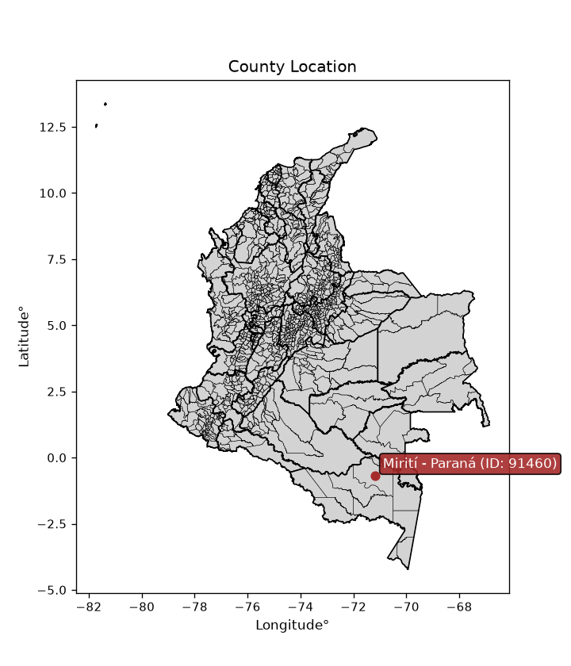
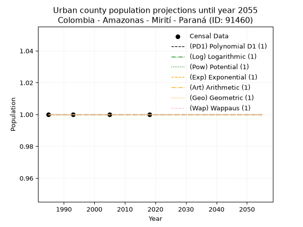
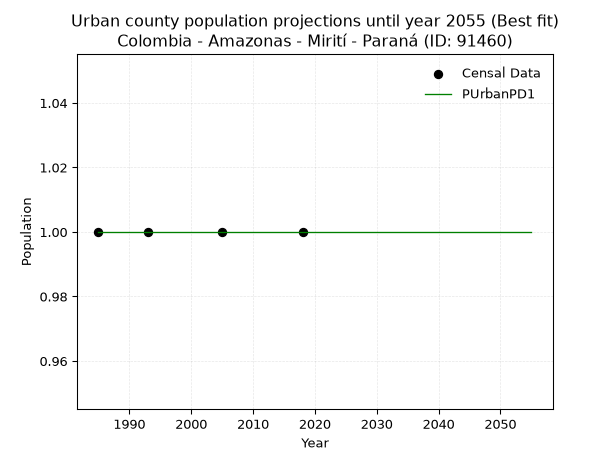
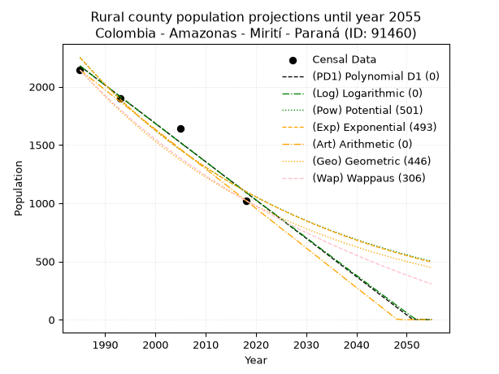
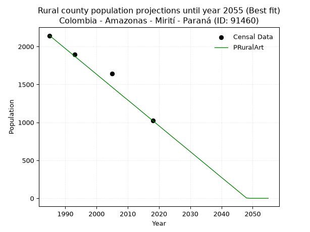

<div align="center">


</div>

# _“Population and Public Services Demand Projections (PPSD) until Year 2050 for Colombia - Amazonas - Mirití - Paraná (ID: 91460)”_
Keywords: `population` `public-service` `projection` `lineal` `polynomial` `logarithmic` `potential` `exponential` `arithmetic` `geometric` `wappaus` `dane` `colombia` `south-america`

PPSD are analytical estimates used by governments and planners to anticipate future changes in population size, age distribution, and the resulting community needs for utilities, healthcare, education, and infrastructure as sizing future water treatment facilities, electrical grids, and road networks based on spatial growth.

> **General running parameters**: • app_version: _v20260806_. • Python version: _3.14.7_. • Pandas version: _3.0.5_. • NumPy version: _2.5.1_. • Creates, save and include plots into reports (create_plot): _False_. • Projection until year: _2050_. • Process polynomial degree 2 and up: _False_. • Process Wappaus: _True_. • Process Wappaus: _True_. • Set negative values to zero: _True_. • Set infinite values to zero: _True_. • Drop dataset notes: _True_. 
<div align="center">

Dynamic map: [:earth_americas:Google](http://maps.google.com/maps?q=-0.68703755,-71.1855045) [:earth_americas:OSM](https://www.openstreetmap.org/#map=18/-0.68703755/-71.1855045&layers=P) [:earth_americas:Bing](https://www.bing.com/maps?cp=-0.68703755~-71.1855045&lvl=18) [:earth_americas:Apple](https://maps.apple.com/frame?center=-0.68703755%2C-71.1855045&span=0.003%2C0.006)

</div>


<div align="center">

```geojson
{
  "type": "Feature",
  "geometry": {
    "type": "Point", 
    "coordinates": [-71.1855045, -0.68703755]
  }, 
  "properties": {
    "Name": "Colombia - Amazonas - Mirití - Paraná (ID: 91460)"
  }
}
```

</div>


<div align="center">

</img>

</div>


## 0. Census Data (4 records)

Census data are official statistics collected by a government about the people and housing in a country. They usually include counts of total population, age, sex, race, income, education, and jobs.

📅Global census file: [Population.xlsx](../data/Population.xlsx)

| Source   |   Year |   CountryID | CountryName   |   StateID | StateName   |   CountyID | CountyName      |   PTotal |   PUrban |   PRural |
|:---------|-------:|------------:|:--------------|----------:|:------------|-----------:|:----------------|---------:|---------:|---------:|
| DANE     |   1985 |          57 | Colombia      |        91 | Amazonas    |      91460 | Mirití - Paraná |     2143 |        1 |     2143 |
| DANE     |   1993 |          57 | Colombia      |        91 | Amazonas    |      91460 | Mirití - Paraná |     1897 |        1 |     1897 |
| DANE     |   2005 |          57 | Colombia      |        91 | Amazonas    |      91460 | Mirití - Paraná |     1643 |        1 |     1643 |
| DANE     |   2018 |          57 | Colombia      |        91 | Amazonas    |      91460 | Mirití - Paraná |     1023 |        1 |     1023 |

> 🔥Some records could had specific notes about the registered values or the corresponding urban or rural distribution.

## 1. Total

### 1.1. Coefficients and Parameters

* (PD1) Polynomial Deg 1: -32.872741870734245, 67430.20192693618 (lineal)
* (Log) Logarithmic: -65776.05823724612, 501640.8457575584
* (Pow) Potential: -43.37728156455457, 146.40034672938768
* (Exp) Exponential: -0.02168369740133655, 1.1097501429044984e+22
* (Art) Arithmetic: Year diff. 2018 - 1985 = 33, Population diff. 1023 - 2143 = -1120, Annual growth = -33.93939393939394
* (Geo) Geometric: Year diff. 2018 - 1985 = 33, Population diff. 1023 - 2143 = -1120, Annual growth % = -0.022158901250612484
* (Wap) Wappaus: i = -2.143992036601007, Condition values only valid for < 200)

<sub>
Wappaus condition values: ['-0.00', '-2.14', '-4.29', '-6.43', '-8.58', '-10.72', '-12.86', '-15.01', '-17.15', '-19.30', '-21.44', '-23.58', '-25.73', '-27.87', '-30.02', '-32.16', '-34.30', '-36.45', '-38.59', '-40.74', '-42.88', '-45.02', '-47.17', '-49.31', '-51.46', '-53.60', '-55.74', '-57.89', '-60.03', '-62.18', '-64.32', '-66.46', '-68.61', '-70.75', '-72.90', '-75.04', '-77.18', '-79.33', '-81.47', '-83.62', '-85.76', '-87.90', '-90.05', '-92.19', '-94.34', '-96.48', '-98.62', '-100.77', '-102.91', '-105.06', '-107.20', '-109.34', '-111.49', '-113.63', '-115.78', '-117.92', '-120.06', '-122.21', '-124.35', '-126.50', '-128.64', '-130.78', '-132.93', '-135.07', '-137.22', '-139.36']
</sub>


### 1.2. Projected Dataset

|   Year |   CountyID |   PTotalPD1 |   PTotalLog |   PTotalPow |   PTotalExp |   PTotalArt |   PTotalGeo |   PTotalWap |
|-------:|-----------:|------------:|------------:|------------:|------------:|------------:|------------:|------------:|
|   1985 |      91460 |        2178 |        2179 |        2251 |        2250 |        2143 |        2143 |        2143 |
|   1986 |      91460 |        2145 |        2145 |        2203 |        2202 |        2109 |        2096 |        2098 |
|   1987 |      91460 |        2112 |        2112 |        2155 |        2155 |        2075 |        2049 |        2053 |
|   1988 |      91460 |        2079 |        2079 |        2109 |        2109 |        2041 |        2004 |        2009 |
|   1989 |      91460 |        2046 |        2046 |        2063 |        2063 |        2007 |        1959 |        1967 |
|   1990 |      91460 |        2013 |        2013 |        2019 |        2019 |        1973 |        1916 |        1925 |
|   1991 |      91460 |        1981 |        1980 |        1975 |        1976 |        1939 |        1873 |        1884 |
|   1992 |      91460 |        1948 |        1947 |        1933 |        1933 |        1905 |        1832 |        1844 |
|   1993 |      91460 |        1915 |        1914 |        1891 |        1892 |        1871 |        1791 |        1804 |
|   1994 |      91460 |        1882 |        1881 |        1850 |        1851 |        1838 |        1752 |        1766 |
|   1995 |      91460 |        1849 |        1848 |        1810 |        1812 |        1804 |        1713 |        1728 |
|   1996 |      91460 |        1816 |        1815 |        1772 |        1773 |        1770 |        1675 |        1691 |
|   1997 |      91460 |        1783 |        1782 |        1733 |        1735 |        1736 |        1638 |        1654 |
|   1998 |      91460 |        1750 |        1749 |        1696 |        1698 |        1702 |        1601 |        1619 |
|   1999 |      91460 |        1718 |        1716 |        1660 |        1661 |        1668 |        1566 |        1584 |
|   2000 |      91460 |        1685 |        1683 |        1624 |        1626 |        1634 |        1531 |        1549 |
|   2001 |      91460 |        1652 |        1651 |        1589 |        1591 |        1600 |        1497 |        1515 |
|   2002 |      91460 |        1619 |        1618 |        1555 |        1557 |        1566 |        1464 |        1482 |
|   2003 |      91460 |        1586 |        1585 |        1522 |        1523 |        1532 |        1432 |        1450 |
|   2004 |      91460 |        1553 |        1552 |        1489 |        1491 |        1498 |        1400 |        1418 |
|   2005 |      91460 |        1520 |        1519 |        1457 |        1459 |        1464 |        1369 |        1386 |
|   2006 |      91460 |        1487 |        1486 |        1426 |        1427 |        1430 |        1339 |        1355 |
|   2007 |      91460 |        1455 |        1454 |        1396 |        1397 |        1396 |        1309 |        1325 |
|   2008 |      91460 |        1422 |        1421 |        1366 |        1367 |        1362 |        1280 |        1295 |
|   2009 |      91460 |        1389 |        1388 |        1337 |        1337 |        1328 |        1252 |        1266 |
|   2010 |      91460 |        1356 |        1355 |        1308 |        1309 |        1295 |        1224 |        1237 |
|   2011 |      91460 |        1323 |        1323 |        1280 |        1281 |        1261 |        1197 |        1209 |
|   2012 |      91460 |        1290 |        1290 |        1253 |        1253 |        1227 |        1170 |        1181 |
|   2013 |      91460 |        1257 |        1257 |        1226 |        1226 |        1193 |        1144 |        1154 |
|   2014 |      91460 |        1224 |        1225 |        1200 |        1200 |        1159 |        1119 |        1127 |
|   2015 |      91460 |        1192 |        1192 |        1175 |        1174 |        1125 |        1094 |        1100 |
|   2016 |      91460 |        1159 |        1159 |        1150 |        1149 |        1091 |        1070 |        1074 |
|   2017 |      91460 |        1126 |        1127 |        1125 |        1124 |        1057 |        1046 |        1048 |
|   2018 |      91460 |        1093 |        1094 |        1101 |        1100 |        1023 |        1023 |        1023 |
|   2019 |      91460 |        1060 |        1062 |        1078 |        1077 |         989 |        1000 |         998 |
|   2020 |      91460 |        1027 |        1029 |        1055 |        1054 |         955 |         978 |         974 |
|   2021 |      91460 |         994 |         996 |        1032 |        1031 |         921 |         956 |         950 |
|   2022 |      91460 |         962 |         964 |        1011 |        1009 |         887 |         935 |         926 |
|   2023 |      91460 |         929 |         931 |         989 |         987 |         853 |         915 |         902 |
|   2024 |      91460 |         896 |         899 |         968 |         966 |         819 |         894 |         879 |
|   2025 |      91460 |         863 |         866 |         948 |         945 |         785 |         874 |         857 |
|   2026 |      91460 |         830 |         834 |         928 |         925 |         751 |         855 |         834 |
|   2027 |      91460 |         797 |         801 |         908 |         905 |         718 |         836 |         812 |
|   2028 |      91460 |         764 |         769 |         889 |         886 |         684 |         818 |         791 |
|   2029 |      91460 |         731 |         737 |         870 |         867 |         650 |         800 |         769 |
|   2030 |      91460 |         699 |         704 |         851 |         848 |         616 |         782 |         748 |
|   2031 |      91460 |         666 |         672 |         833 |         830 |         582 |         764 |         728 |
|   2032 |      91460 |         633 |         639 |         816 |         812 |         548 |         748 |         707 |
|   2033 |      91460 |         600 |         607 |         799 |         795 |         514 |         731 |         687 |
|   2034 |      91460 |         567 |         575 |         782 |         778 |         480 |         715 |         667 |
|   2035 |      91460 |         534 |         542 |         765 |         761 |         446 |         699 |         647 |
|   2036 |      91460 |         501 |         510 |         749 |         745 |         412 |         683 |         628 |
|   2037 |      91460 |         468 |         478 |         733 |         729 |         378 |         668 |         609 |
|   2038 |      91460 |         436 |         445 |         718 |         713 |         344 |         653 |         590 |
|   2039 |      91460 |         403 |         413 |         703 |         698 |         310 |         639 |         572 |
|   2040 |      91460 |         370 |         381 |         688 |         683 |         276 |         625 |         553 |
|   2041 |      91460 |         337 |         349 |         674 |         668 |         242 |         611 |         535 |
|   2042 |      91460 |         304 |         316 |         659 |         654 |         208 |         597 |         517 |
|   2043 |      91460 |         271 |         284 |         646 |         640 |         175 |         584 |         500 |
|   2044 |      91460 |         238 |         252 |         632 |         626 |         141 |         571 |         482 |
|   2045 |      91460 |         205 |         220 |         619 |         613 |         107 |         559 |         465 |
|   2046 |      91460 |         173 |         188 |         606 |         600 |          73 |         546 |         448 |
|   2047 |      91460 |         140 |         156 |         593 |         587 |          39 |         534 |         432 |
|   2048 |      91460 |         107 |         123 |         581 |         574 |           5 |         522 |         415 |
|   2049 |      91460 |          74 |          91 |         568 |         562 |           0 |         511 |         399 |
|   2050 |      91460 |          41 |          59 |         557 |         550 |           0 |         499 |         383 |
<div align="center">

</img>

</div>


### 1.3. Best fit with absolute and relative error (%)

Relative error puts that difference into context by dividing the absolute error by the true value, creating a unitless ratio or percentage that shows the scale of the mistake.

Absolute and relative error

|   Year | Source   |   CountryID | CountryName   |   StateID | StateName   |   CountyID_x | CountyName      |   PTotal |   PUrban |   PRural |   CountyID_y |   PTotalPD1 |   PTotalLog |   PTotalPow |   PTotalExp |   PTotalArt |   PTotalGeo |   PTotalWap |   PTotalPD1AbsError |   PTotalLogAbsError |   PTotalPowAbsError |   PTotalExpAbsError |   PTotalArtAbsError |   PTotalGeoAbsError |   PTotalWapAbsError |   PTotalPD1RelError |   PTotalLogRelError |   PTotalPowRelError |   PTotalExpRelError |   PTotalArtRelError |   PTotalGeoRelError |   PTotalWapRelError |
|-------:|:---------|------------:|:--------------|----------:|:------------|-------------:|:----------------|---------:|---------:|---------:|-------------:|------------:|------------:|------------:|------------:|------------:|------------:|------------:|--------------------:|--------------------:|--------------------:|--------------------:|--------------------:|--------------------:|--------------------:|--------------------:|--------------------:|--------------------:|--------------------:|--------------------:|--------------------:|--------------------:|
|   1985 | DANE     |          57 | Colombia      |        91 | Amazonas    |        91460 | Mirití - Paraná |     2143 |        1 |     2143 |        91460 |        2178 |        2179 |        2251 |        2250 |        2143 |        2143 |        2143 |                  35 |                  36 |                 108 |                 107 |                   0 |                   0 |                   0 |            1.63322  |            1.67989  |            5.03966  |            4.993    |             0       |             0       |             0       |
|   1993 | DANE     |          57 | Colombia      |        91 | Amazonas    |        91460 | Mirití - Paraná |     1897 |        1 |     1897 |        91460 |        1915 |        1914 |        1891 |        1892 |        1871 |        1791 |        1804 |                  18 |                  17 |                   6 |                   5 |                  26 |                 106 |                  93 |            0.948867 |            0.896152 |            0.316289 |            0.263574 |             1.37059 |             5.58777 |             4.90248 |
|   2005 | DANE     |          57 | Colombia      |        91 | Amazonas    |        91460 | Mirití - Paraná |     1643 |        1 |     1643 |        91460 |        1520 |        1519 |        1457 |        1459 |        1464 |        1369 |        1386 |                 123 |                 124 |                 186 |                 184 |                 179 |                 274 |                 257 |            7.48631  |            7.54717  |           11.3208   |           11.199    |            10.8947  |            16.6768  |            15.6421  |
|   2018 | DANE     |          57 | Colombia      |        91 | Amazonas    |        91460 | Mirití - Paraná |     1023 |        1 |     1023 |        91460 |        1093 |        1094 |        1101 |        1100 |        1023 |        1023 |        1023 |                  70 |                  71 |                  78 |                  77 |                   0 |                   0 |                   0 |            6.84262  |            6.94037  |            7.62463  |            7.52688  |             0       |             0       |             0       |

Relative error mean

| Method    |   RelError | Best   |
|:----------|-----------:|:-------|
| PTotalPD1 |    4.22775 |        |
| PTotalLog |    4.2659  |        |
| PTotalPow |    6.07534 |        |
| PTotalExp |    5.99562 |        |
| PTotalArt |    3.06632 | True   |
| PTotalGeo |    5.56615 |        |
| PTotalWap |    5.13615 |        |

💙Best method: _**PTotalArt**_
<div align="center">

</img>

</div>


### 1.4. Fresh water supply demand in liters per capita per day (lpcd)

The fresh water supply demand typically ranges from 100 to 300 liters per capita per day (lpcd) for standard domestic and municipal planning, though absolute survival minimums set by the World Health Organization are as low as 7.5 to 20 liters per day, and total consumption in high-income nations can exceed 400 liters.

> `CZ`: Level in meters above the sea level (masl)<br> `WS`: Fresh water supply demand in liters per capita per day (lpcd or l/h/d)<br> `WSAll`: Zonal fresh water supply demand in liters per second (l/s)<br> `A`: Zonal area in square meters<br> `DP`: Population density (people/hectare or p/ha)

Reference values (RAS Colombia)

|    CZ |   WS |
|------:|-----:|
|  1000 |  120 |
|  2000 |  130 |
| 99999 |  140 |

County shapefile geometry properties and water supply values

|   CountyID |      ATotal |   CZTotal |   WSTotal |
|-----------:|------------:|----------:|----------:|
|      91460 | 1.68134e+10 |   156.624 |       120 |

Projected values for best method: PTotalArt

|   CountyID |   Year |   PTotalArt |   DPTotal |   WSTotal |   WSTotalAll |
|-----------:|-------:|------------:|----------:|----------:|-------------:|
|      91460 |   1985 |        2143 |         0 |       120 |   2.97639    |
|      91460 |   1986 |        2109 |         0 |       120 |   2.92917    |
|      91460 |   1987 |        2075 |         0 |       120 |   2.88194    |
|      91460 |   1988 |        2041 |         0 |       120 |   2.83472    |
|      91460 |   1989 |        2007 |         0 |       120 |   2.7875     |
|      91460 |   1990 |        1973 |         0 |       120 |   2.74028    |
|      91460 |   1991 |        1939 |         0 |       120 |   2.69306    |
|      91460 |   1992 |        1905 |         0 |       120 |   2.64583    |
|      91460 |   1993 |        1871 |         0 |       120 |   2.59861    |
|      91460 |   1994 |        1838 |         0 |       120 |   2.55278    |
|      91460 |   1995 |        1804 |         0 |       120 |   2.50556    |
|      91460 |   1996 |        1770 |         0 |       120 |   2.45833    |
|      91460 |   1997 |        1736 |         0 |       120 |   2.41111    |
|      91460 |   1998 |        1702 |         0 |       120 |   2.36389    |
|      91460 |   1999 |        1668 |         0 |       120 |   2.31667    |
|      91460 |   2000 |        1634 |         0 |       120 |   2.26944    |
|      91460 |   2001 |        1600 |         0 |       120 |   2.22222    |
|      91460 |   2002 |        1566 |         0 |       120 |   2.175      |
|      91460 |   2003 |        1532 |         0 |       120 |   2.12778    |
|      91460 |   2004 |        1498 |         0 |       120 |   2.08056    |
|      91460 |   2005 |        1464 |         0 |       120 |   2.03333    |
|      91460 |   2006 |        1430 |         0 |       120 |   1.98611    |
|      91460 |   2007 |        1396 |         0 |       120 |   1.93889    |
|      91460 |   2008 |        1362 |         0 |       120 |   1.89167    |
|      91460 |   2009 |        1328 |         0 |       120 |   1.84444    |
|      91460 |   2010 |        1295 |         0 |       120 |   1.79861    |
|      91460 |   2011 |        1261 |         0 |       120 |   1.75139    |
|      91460 |   2012 |        1227 |         0 |       120 |   1.70417    |
|      91460 |   2013 |        1193 |         0 |       120 |   1.65694    |
|      91460 |   2014 |        1159 |         0 |       120 |   1.60972    |
|      91460 |   2015 |        1125 |         0 |       120 |   1.5625     |
|      91460 |   2016 |        1091 |         0 |       120 |   1.51528    |
|      91460 |   2017 |        1057 |         0 |       120 |   1.46806    |
|      91460 |   2018 |        1023 |         0 |       120 |   1.42083    |
|      91460 |   2019 |         989 |         0 |       120 |   1.37361    |
|      91460 |   2020 |         955 |         0 |       120 |   1.32639    |
|      91460 |   2021 |         921 |         0 |       120 |   1.27917    |
|      91460 |   2022 |         887 |         0 |       120 |   1.23194    |
|      91460 |   2023 |         853 |         0 |       120 |   1.18472    |
|      91460 |   2024 |         819 |         0 |       120 |   1.1375     |
|      91460 |   2025 |         785 |         0 |       120 |   1.09028    |
|      91460 |   2026 |         751 |         0 |       120 |   1.04306    |
|      91460 |   2027 |         718 |         0 |       120 |   0.997222   |
|      91460 |   2028 |         684 |         0 |       120 |   0.95       |
|      91460 |   2029 |         650 |         0 |       120 |   0.902778   |
|      91460 |   2030 |         616 |         0 |       120 |   0.855556   |
|      91460 |   2031 |         582 |         0 |       120 |   0.808333   |
|      91460 |   2032 |         548 |         0 |       120 |   0.761111   |
|      91460 |   2033 |         514 |         0 |       120 |   0.713889   |
|      91460 |   2034 |         480 |         0 |       120 |   0.666667   |
|      91460 |   2035 |         446 |         0 |       120 |   0.619444   |
|      91460 |   2036 |         412 |         0 |       120 |   0.572222   |
|      91460 |   2037 |         378 |         0 |       120 |   0.525      |
|      91460 |   2038 |         344 |         0 |       120 |   0.477778   |
|      91460 |   2039 |         310 |         0 |       120 |   0.430556   |
|      91460 |   2040 |         276 |         0 |       120 |   0.383333   |
|      91460 |   2041 |         242 |         0 |       120 |   0.336111   |
|      91460 |   2042 |         208 |         0 |       120 |   0.288889   |
|      91460 |   2043 |         175 |         0 |       120 |   0.243056   |
|      91460 |   2044 |         141 |         0 |       120 |   0.195833   |
|      91460 |   2045 |         107 |         0 |       120 |   0.148611   |
|      91460 |   2046 |          73 |         0 |       120 |   0.101389   |
|      91460 |   2047 |          39 |         0 |       120 |   0.0541667  |
|      91460 |   2048 |           5 |         0 |       120 |   0.00694444 |
|      91460 |   2049 |           0 |         0 |       120 |   0          |
|      91460 |   2050 |           0 |         0 |       120 |   0          |

## 2. Urban

### 2.1. Coefficients and Parameters

* (PD1) Polynomial Deg 1: -1.3233529347183512e-19, 1.0000000000000004 (lineal)
* (Log) Logarithmic: 3.215569112241165e-17, 0.9999999999999996
* (Pow) Potential: 0.0, 0.0
* (Exp) Exponential: 0.0, 1.0
* (Art) Arithmetic: Year diff. 2018 - 1985 = 33, Population diff. 1 - 1 = 0, Annual growth = 0.0
* (Geo) Geometric: Year diff. 2018 - 1985 = 33, Population diff. 1 - 1 = 0, Annual growth % = 0.0
* (Wap) Wappaus: i = 0.0, Condition values only valid for < 200)

<sub>
Wappaus condition values: ['0.00', '0.00', '0.00', '0.00', '0.00', '0.00', '0.00', '0.00', '0.00', '0.00', '0.00', '0.00', '0.00', '0.00', '0.00', '0.00', '0.00', '0.00', '0.00', '0.00', '0.00', '0.00', '0.00', '0.00', '0.00', '0.00', '0.00', '0.00', '0.00', '0.00', '0.00', '0.00', '0.00', '0.00', '0.00', '0.00', '0.00', '0.00', '0.00', '0.00', '0.00', '0.00', '0.00', '0.00', '0.00', '0.00', '0.00', '0.00', '0.00', '0.00', '0.00', '0.00', '0.00', '0.00', '0.00', '0.00', '0.00', '0.00', '0.00', '0.00', '0.00', '0.00', '0.00', '0.00', '0.00', '0.00']
</sub>


### 2.2. Projected Dataset

|   Year |   CountyID |   PUrbanPD1 |   PUrbanLog |   PUrbanPow |   PUrbanExp |   PUrbanArt |   PUrbanGeo |   PUrbanWap |
|-------:|-----------:|------------:|------------:|------------:|------------:|------------:|------------:|------------:|
|   1985 |      91460 |           1 |           1 |           1 |           1 |           1 |           1 |           1 |
|   1986 |      91460 |           1 |           1 |           1 |           1 |           1 |           1 |           1 |
|   1987 |      91460 |           1 |           1 |           1 |           1 |           1 |           1 |           1 |
|   1988 |      91460 |           1 |           1 |           1 |           1 |           1 |           1 |           1 |
|   1989 |      91460 |           1 |           1 |           1 |           1 |           1 |           1 |           1 |
|   1990 |      91460 |           1 |           1 |           1 |           1 |           1 |           1 |           1 |
|   1991 |      91460 |           1 |           1 |           1 |           1 |           1 |           1 |           1 |
|   1992 |      91460 |           1 |           1 |           1 |           1 |           1 |           1 |           1 |
|   1993 |      91460 |           1 |           1 |           1 |           1 |           1 |           1 |           1 |
|   1994 |      91460 |           1 |           1 |           1 |           1 |           1 |           1 |           1 |
|   1995 |      91460 |           1 |           1 |           1 |           1 |           1 |           1 |           1 |
|   1996 |      91460 |           1 |           1 |           1 |           1 |           1 |           1 |           1 |
|   1997 |      91460 |           1 |           1 |           1 |           1 |           1 |           1 |           1 |
|   1998 |      91460 |           1 |           1 |           1 |           1 |           1 |           1 |           1 |
|   1999 |      91460 |           1 |           1 |           1 |           1 |           1 |           1 |           1 |
|   2000 |      91460 |           1 |           1 |           1 |           1 |           1 |           1 |           1 |
|   2001 |      91460 |           1 |           1 |           1 |           1 |           1 |           1 |           1 |
|   2002 |      91460 |           1 |           1 |           1 |           1 |           1 |           1 |           1 |
|   2003 |      91460 |           1 |           1 |           1 |           1 |           1 |           1 |           1 |
|   2004 |      91460 |           1 |           1 |           1 |           1 |           1 |           1 |           1 |
|   2005 |      91460 |           1 |           1 |           1 |           1 |           1 |           1 |           1 |
|   2006 |      91460 |           1 |           1 |           1 |           1 |           1 |           1 |           1 |
|   2007 |      91460 |           1 |           1 |           1 |           1 |           1 |           1 |           1 |
|   2008 |      91460 |           1 |           1 |           1 |           1 |           1 |           1 |           1 |
|   2009 |      91460 |           1 |           1 |           1 |           1 |           1 |           1 |           1 |
|   2010 |      91460 |           1 |           1 |           1 |           1 |           1 |           1 |           1 |
|   2011 |      91460 |           1 |           1 |           1 |           1 |           1 |           1 |           1 |
|   2012 |      91460 |           1 |           1 |           1 |           1 |           1 |           1 |           1 |
|   2013 |      91460 |           1 |           1 |           1 |           1 |           1 |           1 |           1 |
|   2014 |      91460 |           1 |           1 |           1 |           1 |           1 |           1 |           1 |
|   2015 |      91460 |           1 |           1 |           1 |           1 |           1 |           1 |           1 |
|   2016 |      91460 |           1 |           1 |           1 |           1 |           1 |           1 |           1 |
|   2017 |      91460 |           1 |           1 |           1 |           1 |           1 |           1 |           1 |
|   2018 |      91460 |           1 |           1 |           1 |           1 |           1 |           1 |           1 |
|   2019 |      91460 |           1 |           1 |           1 |           1 |           1 |           1 |           1 |
|   2020 |      91460 |           1 |           1 |           1 |           1 |           1 |           1 |           1 |
|   2021 |      91460 |           1 |           1 |           1 |           1 |           1 |           1 |           1 |
|   2022 |      91460 |           1 |           1 |           1 |           1 |           1 |           1 |           1 |
|   2023 |      91460 |           1 |           1 |           1 |           1 |           1 |           1 |           1 |
|   2024 |      91460 |           1 |           1 |           1 |           1 |           1 |           1 |           1 |
|   2025 |      91460 |           1 |           1 |           1 |           1 |           1 |           1 |           1 |
|   2026 |      91460 |           1 |           1 |           1 |           1 |           1 |           1 |           1 |
|   2027 |      91460 |           1 |           1 |           1 |           1 |           1 |           1 |           1 |
|   2028 |      91460 |           1 |           1 |           1 |           1 |           1 |           1 |           1 |
|   2029 |      91460 |           1 |           1 |           1 |           1 |           1 |           1 |           1 |
|   2030 |      91460 |           1 |           1 |           1 |           1 |           1 |           1 |           1 |
|   2031 |      91460 |           1 |           1 |           1 |           1 |           1 |           1 |           1 |
|   2032 |      91460 |           1 |           1 |           1 |           1 |           1 |           1 |           1 |
|   2033 |      91460 |           1 |           1 |           1 |           1 |           1 |           1 |           1 |
|   2034 |      91460 |           1 |           1 |           1 |           1 |           1 |           1 |           1 |
|   2035 |      91460 |           1 |           1 |           1 |           1 |           1 |           1 |           1 |
|   2036 |      91460 |           1 |           1 |           1 |           1 |           1 |           1 |           1 |
|   2037 |      91460 |           1 |           1 |           1 |           1 |           1 |           1 |           1 |
|   2038 |      91460 |           1 |           1 |           1 |           1 |           1 |           1 |           1 |
|   2039 |      91460 |           1 |           1 |           1 |           1 |           1 |           1 |           1 |
|   2040 |      91460 |           1 |           1 |           1 |           1 |           1 |           1 |           1 |
|   2041 |      91460 |           1 |           1 |           1 |           1 |           1 |           1 |           1 |
|   2042 |      91460 |           1 |           1 |           1 |           1 |           1 |           1 |           1 |
|   2043 |      91460 |           1 |           1 |           1 |           1 |           1 |           1 |           1 |
|   2044 |      91460 |           1 |           1 |           1 |           1 |           1 |           1 |           1 |
|   2045 |      91460 |           1 |           1 |           1 |           1 |           1 |           1 |           1 |
|   2046 |      91460 |           1 |           1 |           1 |           1 |           1 |           1 |           1 |
|   2047 |      91460 |           1 |           1 |           1 |           1 |           1 |           1 |           1 |
|   2048 |      91460 |           1 |           1 |           1 |           1 |           1 |           1 |           1 |
|   2049 |      91460 |           1 |           1 |           1 |           1 |           1 |           1 |           1 |
|   2050 |      91460 |           1 |           1 |           1 |           1 |           1 |           1 |           1 |
<div align="center">

</img>

</div>


### 2.3. Best fit with absolute and relative error (%)

Relative error puts that difference into context by dividing the absolute error by the true value, creating a unitless ratio or percentage that shows the scale of the mistake.

Absolute and relative error

|   Year | Source   |   CountryID | CountryName   |   StateID | StateName   |   CountyID_x | CountyName      |   PTotal |   PUrban |   PRural |   CountyID_y |   PUrbanPD1 |   PUrbanLog |   PUrbanPow |   PUrbanExp |   PUrbanArt |   PUrbanGeo |   PUrbanWap |   PUrbanPD1AbsError |   PUrbanLogAbsError |   PUrbanPowAbsError |   PUrbanExpAbsError |   PUrbanArtAbsError |   PUrbanGeoAbsError |   PUrbanWapAbsError |   PUrbanPD1RelError |   PUrbanLogRelError |   PUrbanPowRelError |   PUrbanExpRelError |   PUrbanArtRelError |   PUrbanGeoRelError |   PUrbanWapRelError |
|-------:|:---------|------------:|:--------------|----------:|:------------|-------------:|:----------------|---------:|---------:|---------:|-------------:|------------:|------------:|------------:|------------:|------------:|------------:|------------:|--------------------:|--------------------:|--------------------:|--------------------:|--------------------:|--------------------:|--------------------:|--------------------:|--------------------:|--------------------:|--------------------:|--------------------:|--------------------:|--------------------:|
|   1985 | DANE     |          57 | Colombia      |        91 | Amazonas    |        91460 | Mirití - Paraná |     2143 |        1 |     2143 |        91460 |           1 |           1 |           1 |           1 |           1 |           1 |           1 |                   0 |                   0 |                   0 |                   0 |                   0 |                   0 |                   0 |                   0 |                   0 |                   0 |                   0 |                   0 |                   0 |                   0 |
|   1993 | DANE     |          57 | Colombia      |        91 | Amazonas    |        91460 | Mirití - Paraná |     1897 |        1 |     1897 |        91460 |           1 |           1 |           1 |           1 |           1 |           1 |           1 |                   0 |                   0 |                   0 |                   0 |                   0 |                   0 |                   0 |                   0 |                   0 |                   0 |                   0 |                   0 |                   0 |                   0 |
|   2005 | DANE     |          57 | Colombia      |        91 | Amazonas    |        91460 | Mirití - Paraná |     1643 |        1 |     1643 |        91460 |           1 |           1 |           1 |           1 |           1 |           1 |           1 |                   0 |                   0 |                   0 |                   0 |                   0 |                   0 |                   0 |                   0 |                   0 |                   0 |                   0 |                   0 |                   0 |                   0 |
|   2018 | DANE     |          57 | Colombia      |        91 | Amazonas    |        91460 | Mirití - Paraná |     1023 |        1 |     1023 |        91460 |           1 |           1 |           1 |           1 |           1 |           1 |           1 |                   0 |                   0 |                   0 |                   0 |                   0 |                   0 |                   0 |                   0 |                   0 |                   0 |                   0 |                   0 |                   0 |                   0 |

Relative error mean

| Method    |   RelError | Best   |
|:----------|-----------:|:-------|
| PUrbanPD1 |          0 | True   |
| PUrbanLog |          0 | True   |
| PUrbanPow |          0 | True   |
| PUrbanExp |          0 | True   |
| PUrbanArt |          0 | True   |
| PUrbanGeo |          0 | True   |
| PUrbanWap |          0 | True   |

💙Best method: _**PUrbanPD1**_
<div align="center">

</img>

</div>


### 2.4. Fresh water supply demand in liters per capita per day (lpcd)

The fresh water supply demand typically ranges from 100 to 300 liters per capita per day (lpcd) for standard domestic and municipal planning, though absolute survival minimums set by the World Health Organization are as low as 7.5 to 20 liters per day, and total consumption in high-income nations can exceed 400 liters.

> `CZ`: Level in meters above the sea level (masl)<br> `WS`: Fresh water supply demand in liters per capita per day (lpcd or l/h/d)<br> `WSAll`: Zonal fresh water supply demand in liters per second (l/s)<br> `A`: Zonal area in square meters<br> `DP`: Population density (people/hectare or p/ha)

Reference values (RAS Colombia)

|    CZ |   WS |
|------:|-----:|
|  1000 |  120 |
|  2000 |  130 |
| 99999 |  140 |

County shapefile geometry properties and water supply values

|   CountyID |   AUrban |   CZUrban |   WSUrban |
|-----------:|---------:|----------:|----------:|
|      91460 |        0 |         0 |       120 |

Projected values for best method: PUrbanPD1

|   CountyID |   Year |   PUrbanPD1 |   DPUrban |   WSUrban |   WSUrbanAll |
|-----------:|-------:|------------:|----------:|----------:|-------------:|
|      91460 |   1985 |           1 |       inf |       120 |   0.00138889 |
|      91460 |   1986 |           1 |       inf |       120 |   0.00138889 |
|      91460 |   1987 |           1 |       inf |       120 |   0.00138889 |
|      91460 |   1988 |           1 |       inf |       120 |   0.00138889 |
|      91460 |   1989 |           1 |       inf |       120 |   0.00138889 |
|      91460 |   1990 |           1 |       inf |       120 |   0.00138889 |
|      91460 |   1991 |           1 |       inf |       120 |   0.00138889 |
|      91460 |   1992 |           1 |       inf |       120 |   0.00138889 |
|      91460 |   1993 |           1 |       inf |       120 |   0.00138889 |
|      91460 |   1994 |           1 |       inf |       120 |   0.00138889 |
|      91460 |   1995 |           1 |       inf |       120 |   0.00138889 |
|      91460 |   1996 |           1 |       inf |       120 |   0.00138889 |
|      91460 |   1997 |           1 |       inf |       120 |   0.00138889 |
|      91460 |   1998 |           1 |       inf |       120 |   0.00138889 |
|      91460 |   1999 |           1 |       inf |       120 |   0.00138889 |
|      91460 |   2000 |           1 |       inf |       120 |   0.00138889 |
|      91460 |   2001 |           1 |       inf |       120 |   0.00138889 |
|      91460 |   2002 |           1 |       inf |       120 |   0.00138889 |
|      91460 |   2003 |           1 |       inf |       120 |   0.00138889 |
|      91460 |   2004 |           1 |       inf |       120 |   0.00138889 |
|      91460 |   2005 |           1 |       inf |       120 |   0.00138889 |
|      91460 |   2006 |           1 |       inf |       120 |   0.00138889 |
|      91460 |   2007 |           1 |       inf |       120 |   0.00138889 |
|      91460 |   2008 |           1 |       inf |       120 |   0.00138889 |
|      91460 |   2009 |           1 |       inf |       120 |   0.00138889 |
|      91460 |   2010 |           1 |       inf |       120 |   0.00138889 |
|      91460 |   2011 |           1 |       inf |       120 |   0.00138889 |
|      91460 |   2012 |           1 |       inf |       120 |   0.00138889 |
|      91460 |   2013 |           1 |       inf |       120 |   0.00138889 |
|      91460 |   2014 |           1 |       inf |       120 |   0.00138889 |
|      91460 |   2015 |           1 |       inf |       120 |   0.00138889 |
|      91460 |   2016 |           1 |       inf |       120 |   0.00138889 |
|      91460 |   2017 |           1 |       inf |       120 |   0.00138889 |
|      91460 |   2018 |           1 |       inf |       120 |   0.00138889 |
|      91460 |   2019 |           1 |       inf |       120 |   0.00138889 |
|      91460 |   2020 |           1 |       inf |       120 |   0.00138889 |
|      91460 |   2021 |           1 |       inf |       120 |   0.00138889 |
|      91460 |   2022 |           1 |       inf |       120 |   0.00138889 |
|      91460 |   2023 |           1 |       inf |       120 |   0.00138889 |
|      91460 |   2024 |           1 |       inf |       120 |   0.00138889 |
|      91460 |   2025 |           1 |       inf |       120 |   0.00138889 |
|      91460 |   2026 |           1 |       inf |       120 |   0.00138889 |
|      91460 |   2027 |           1 |       inf |       120 |   0.00138889 |
|      91460 |   2028 |           1 |       inf |       120 |   0.00138889 |
|      91460 |   2029 |           1 |       inf |       120 |   0.00138889 |
|      91460 |   2030 |           1 |       inf |       120 |   0.00138889 |
|      91460 |   2031 |           1 |       inf |       120 |   0.00138889 |
|      91460 |   2032 |           1 |       inf |       120 |   0.00138889 |
|      91460 |   2033 |           1 |       inf |       120 |   0.00138889 |
|      91460 |   2034 |           1 |       inf |       120 |   0.00138889 |
|      91460 |   2035 |           1 |       inf |       120 |   0.00138889 |
|      91460 |   2036 |           1 |       inf |       120 |   0.00138889 |
|      91460 |   2037 |           1 |       inf |       120 |   0.00138889 |
|      91460 |   2038 |           1 |       inf |       120 |   0.00138889 |
|      91460 |   2039 |           1 |       inf |       120 |   0.00138889 |
|      91460 |   2040 |           1 |       inf |       120 |   0.00138889 |
|      91460 |   2041 |           1 |       inf |       120 |   0.00138889 |
|      91460 |   2042 |           1 |       inf |       120 |   0.00138889 |
|      91460 |   2043 |           1 |       inf |       120 |   0.00138889 |
|      91460 |   2044 |           1 |       inf |       120 |   0.00138889 |
|      91460 |   2045 |           1 |       inf |       120 |   0.00138889 |
|      91460 |   2046 |           1 |       inf |       120 |   0.00138889 |
|      91460 |   2047 |           1 |       inf |       120 |   0.00138889 |
|      91460 |   2048 |           1 |       inf |       120 |   0.00138889 |
|      91460 |   2049 |           1 |       inf |       120 |   0.00138889 |
|      91460 |   2050 |           1 |       inf |       120 |   0.00138889 |

## 3. Rural

### 3.1. Coefficients and Parameters

* (PD1) Polynomial Deg 1: -32.872741870734245, 67430.20192693618 (lineal)
* (Log) Logarithmic: -65776.05823724612, 501640.8457575584
* (Pow) Potential: -43.37728156455457, 146.40034672938768
* (Exp) Exponential: -0.02168369740133655, 1.1097501429044984e+22
* (Art) Arithmetic: Year diff. 2018 - 1985 = 33, Population diff. 1023 - 2143 = -1120, Annual growth = -33.93939393939394
* (Geo) Geometric: Year diff. 2018 - 1985 = 33, Population diff. 1023 - 2143 = -1120, Annual growth % = -0.022158901250612484
* (Wap) Wappaus: i = -2.143992036601007, Condition values only valid for < 200)

<sub>
Wappaus condition values: ['-0.00', '-2.14', '-4.29', '-6.43', '-8.58', '-10.72', '-12.86', '-15.01', '-17.15', '-19.30', '-21.44', '-23.58', '-25.73', '-27.87', '-30.02', '-32.16', '-34.30', '-36.45', '-38.59', '-40.74', '-42.88', '-45.02', '-47.17', '-49.31', '-51.46', '-53.60', '-55.74', '-57.89', '-60.03', '-62.18', '-64.32', '-66.46', '-68.61', '-70.75', '-72.90', '-75.04', '-77.18', '-79.33', '-81.47', '-83.62', '-85.76', '-87.90', '-90.05', '-92.19', '-94.34', '-96.48', '-98.62', '-100.77', '-102.91', '-105.06', '-107.20', '-109.34', '-111.49', '-113.63', '-115.78', '-117.92', '-120.06', '-122.21', '-124.35', '-126.50', '-128.64', '-130.78', '-132.93', '-135.07', '-137.22', '-139.36']
</sub>


### 3.2. Projected Dataset

|   Year |   CountyID |   PRuralPD1 |   PRuralLog |   PRuralPow |   PRuralExp |   PRuralArt |   PRuralGeo |   PRuralWap |
|-------:|-----------:|------------:|------------:|------------:|------------:|------------:|------------:|------------:|
|   1985 |      91460 |        2178 |        2179 |        2251 |        2250 |        2143 |        2143 |        2143 |
|   1986 |      91460 |        2145 |        2145 |        2203 |        2202 |        2109 |        2096 |        2098 |
|   1987 |      91460 |        2112 |        2112 |        2155 |        2155 |        2075 |        2049 |        2053 |
|   1988 |      91460 |        2079 |        2079 |        2109 |        2109 |        2041 |        2004 |        2009 |
|   1989 |      91460 |        2046 |        2046 |        2063 |        2063 |        2007 |        1959 |        1967 |
|   1990 |      91460 |        2013 |        2013 |        2019 |        2019 |        1973 |        1916 |        1925 |
|   1991 |      91460 |        1981 |        1980 |        1975 |        1976 |        1939 |        1873 |        1884 |
|   1992 |      91460 |        1948 |        1947 |        1933 |        1933 |        1905 |        1832 |        1844 |
|   1993 |      91460 |        1915 |        1914 |        1891 |        1892 |        1871 |        1791 |        1804 |
|   1994 |      91460 |        1882 |        1881 |        1850 |        1851 |        1838 |        1752 |        1766 |
|   1995 |      91460 |        1849 |        1848 |        1810 |        1812 |        1804 |        1713 |        1728 |
|   1996 |      91460 |        1816 |        1815 |        1772 |        1773 |        1770 |        1675 |        1691 |
|   1997 |      91460 |        1783 |        1782 |        1733 |        1735 |        1736 |        1638 |        1654 |
|   1998 |      91460 |        1750 |        1749 |        1696 |        1698 |        1702 |        1601 |        1619 |
|   1999 |      91460 |        1718 |        1716 |        1660 |        1661 |        1668 |        1566 |        1584 |
|   2000 |      91460 |        1685 |        1683 |        1624 |        1626 |        1634 |        1531 |        1549 |
|   2001 |      91460 |        1652 |        1651 |        1589 |        1591 |        1600 |        1497 |        1515 |
|   2002 |      91460 |        1619 |        1618 |        1555 |        1557 |        1566 |        1464 |        1482 |
|   2003 |      91460 |        1586 |        1585 |        1522 |        1523 |        1532 |        1432 |        1450 |
|   2004 |      91460 |        1553 |        1552 |        1489 |        1491 |        1498 |        1400 |        1418 |
|   2005 |      91460 |        1520 |        1519 |        1457 |        1459 |        1464 |        1369 |        1386 |
|   2006 |      91460 |        1487 |        1486 |        1426 |        1427 |        1430 |        1339 |        1355 |
|   2007 |      91460 |        1455 |        1454 |        1396 |        1397 |        1396 |        1309 |        1325 |
|   2008 |      91460 |        1422 |        1421 |        1366 |        1367 |        1362 |        1280 |        1295 |
|   2009 |      91460 |        1389 |        1388 |        1337 |        1337 |        1328 |        1252 |        1266 |
|   2010 |      91460 |        1356 |        1355 |        1308 |        1309 |        1295 |        1224 |        1237 |
|   2011 |      91460 |        1323 |        1323 |        1280 |        1281 |        1261 |        1197 |        1209 |
|   2012 |      91460 |        1290 |        1290 |        1253 |        1253 |        1227 |        1170 |        1181 |
|   2013 |      91460 |        1257 |        1257 |        1226 |        1226 |        1193 |        1144 |        1154 |
|   2014 |      91460 |        1224 |        1225 |        1200 |        1200 |        1159 |        1119 |        1127 |
|   2015 |      91460 |        1192 |        1192 |        1175 |        1174 |        1125 |        1094 |        1100 |
|   2016 |      91460 |        1159 |        1159 |        1150 |        1149 |        1091 |        1070 |        1074 |
|   2017 |      91460 |        1126 |        1127 |        1125 |        1124 |        1057 |        1046 |        1048 |
|   2018 |      91460 |        1093 |        1094 |        1101 |        1100 |        1023 |        1023 |        1023 |
|   2019 |      91460 |        1060 |        1062 |        1078 |        1077 |         989 |        1000 |         998 |
|   2020 |      91460 |        1027 |        1029 |        1055 |        1054 |         955 |         978 |         974 |
|   2021 |      91460 |         994 |         996 |        1032 |        1031 |         921 |         956 |         950 |
|   2022 |      91460 |         962 |         964 |        1011 |        1009 |         887 |         935 |         926 |
|   2023 |      91460 |         929 |         931 |         989 |         987 |         853 |         915 |         902 |
|   2024 |      91460 |         896 |         899 |         968 |         966 |         819 |         894 |         879 |
|   2025 |      91460 |         863 |         866 |         948 |         945 |         785 |         874 |         857 |
|   2026 |      91460 |         830 |         834 |         928 |         925 |         751 |         855 |         834 |
|   2027 |      91460 |         797 |         801 |         908 |         905 |         718 |         836 |         812 |
|   2028 |      91460 |         764 |         769 |         889 |         886 |         684 |         818 |         791 |
|   2029 |      91460 |         731 |         737 |         870 |         867 |         650 |         800 |         769 |
|   2030 |      91460 |         699 |         704 |         851 |         848 |         616 |         782 |         748 |
|   2031 |      91460 |         666 |         672 |         833 |         830 |         582 |         764 |         728 |
|   2032 |      91460 |         633 |         639 |         816 |         812 |         548 |         748 |         707 |
|   2033 |      91460 |         600 |         607 |         799 |         795 |         514 |         731 |         687 |
|   2034 |      91460 |         567 |         575 |         782 |         778 |         480 |         715 |         667 |
|   2035 |      91460 |         534 |         542 |         765 |         761 |         446 |         699 |         647 |
|   2036 |      91460 |         501 |         510 |         749 |         745 |         412 |         683 |         628 |
|   2037 |      91460 |         468 |         478 |         733 |         729 |         378 |         668 |         609 |
|   2038 |      91460 |         436 |         445 |         718 |         713 |         344 |         653 |         590 |
|   2039 |      91460 |         403 |         413 |         703 |         698 |         310 |         639 |         572 |
|   2040 |      91460 |         370 |         381 |         688 |         683 |         276 |         625 |         553 |
|   2041 |      91460 |         337 |         349 |         674 |         668 |         242 |         611 |         535 |
|   2042 |      91460 |         304 |         316 |         659 |         654 |         208 |         597 |         517 |
|   2043 |      91460 |         271 |         284 |         646 |         640 |         175 |         584 |         500 |
|   2044 |      91460 |         238 |         252 |         632 |         626 |         141 |         571 |         482 |
|   2045 |      91460 |         205 |         220 |         619 |         613 |         107 |         559 |         465 |
|   2046 |      91460 |         173 |         188 |         606 |         600 |          73 |         546 |         448 |
|   2047 |      91460 |         140 |         156 |         593 |         587 |          39 |         534 |         432 |
|   2048 |      91460 |         107 |         123 |         581 |         574 |           5 |         522 |         415 |
|   2049 |      91460 |          74 |          91 |         568 |         562 |           0 |         511 |         399 |
|   2050 |      91460 |          41 |          59 |         557 |         550 |           0 |         499 |         383 |
<div align="center">

</img>

</div>


### 3.3. Best fit with absolute and relative error (%)

Relative error puts that difference into context by dividing the absolute error by the true value, creating a unitless ratio or percentage that shows the scale of the mistake.

Absolute and relative error

|   Year | Source   |   CountryID | CountryName   |   StateID | StateName   |   CountyID_x | CountyName      |   PTotal |   PUrban |   PRural |   CountyID_y |   PRuralPD1 |   PRuralLog |   PRuralPow |   PRuralExp |   PRuralArt |   PRuralGeo |   PRuralWap |   PRuralPD1AbsError |   PRuralLogAbsError |   PRuralPowAbsError |   PRuralExpAbsError |   PRuralArtAbsError |   PRuralGeoAbsError |   PRuralWapAbsError |   PRuralPD1RelError |   PRuralLogRelError |   PRuralPowRelError |   PRuralExpRelError |   PRuralArtRelError |   PRuralGeoRelError |   PRuralWapRelError |
|-------:|:---------|------------:|:--------------|----------:|:------------|-------------:|:----------------|---------:|---------:|---------:|-------------:|------------:|------------:|------------:|------------:|------------:|------------:|------------:|--------------------:|--------------------:|--------------------:|--------------------:|--------------------:|--------------------:|--------------------:|--------------------:|--------------------:|--------------------:|--------------------:|--------------------:|--------------------:|--------------------:|
|   1985 | DANE     |          57 | Colombia      |        91 | Amazonas    |        91460 | Mirití - Paraná |     2143 |        1 |     2143 |        91460 |        2178 |        2179 |        2251 |        2250 |        2143 |        2143 |        2143 |                  35 |                  36 |                 108 |                 107 |                   0 |                   0 |                   0 |            1.63322  |            1.67989  |            5.03966  |            4.993    |             0       |             0       |             0       |
|   1993 | DANE     |          57 | Colombia      |        91 | Amazonas    |        91460 | Mirití - Paraná |     1897 |        1 |     1897 |        91460 |        1915 |        1914 |        1891 |        1892 |        1871 |        1791 |        1804 |                  18 |                  17 |                   6 |                   5 |                  26 |                 106 |                  93 |            0.948867 |            0.896152 |            0.316289 |            0.263574 |             1.37059 |             5.58777 |             4.90248 |
|   2005 | DANE     |          57 | Colombia      |        91 | Amazonas    |        91460 | Mirití - Paraná |     1643 |        1 |     1643 |        91460 |        1520 |        1519 |        1457 |        1459 |        1464 |        1369 |        1386 |                 123 |                 124 |                 186 |                 184 |                 179 |                 274 |                 257 |            7.48631  |            7.54717  |           11.3208   |           11.199    |            10.8947  |            16.6768  |            15.6421  |
|   2018 | DANE     |          57 | Colombia      |        91 | Amazonas    |        91460 | Mirití - Paraná |     1023 |        1 |     1023 |        91460 |        1093 |        1094 |        1101 |        1100 |        1023 |        1023 |        1023 |                  70 |                  71 |                  78 |                  77 |                   0 |                   0 |                   0 |            6.84262  |            6.94037  |            7.62463  |            7.52688  |             0       |             0       |             0       |

Relative error mean

| Method    |   RelError | Best   |
|:----------|-----------:|:-------|
| PRuralPD1 |    4.22775 |        |
| PRuralLog |    4.2659  |        |
| PRuralPow |    6.07534 |        |
| PRuralExp |    5.99562 |        |
| PRuralArt |    3.06632 | True   |
| PRuralGeo |    5.56615 |        |
| PRuralWap |    5.13615 |        |

💙Best method: _**PRuralArt**_
<div align="center">

</img>

</div>


### 3.4. Fresh water supply demand in liters per capita per day (lpcd)

The fresh water supply demand typically ranges from 100 to 300 liters per capita per day (lpcd) for standard domestic and municipal planning, though absolute survival minimums set by the World Health Organization are as low as 7.5 to 20 liters per day, and total consumption in high-income nations can exceed 400 liters.

> `CZ`: Level in meters above the sea level (masl)<br> `WS`: Fresh water supply demand in liters per capita per day (lpcd or l/h/d)<br> `WSAll`: Zonal fresh water supply demand in liters per second (l/s)<br> `A`: Zonal area in square meters<br> `DP`: Population density (people/hectare or p/ha)

Reference values (RAS Colombia)

|    CZ |   WS |
|------:|-----:|
|  1000 |  120 |
|  2000 |  130 |
| 99999 |  140 |

County shapefile geometry properties and water supply values

|   CountyID |      ARural |   CZRural |   WSRural |
|-----------:|------------:|----------:|----------:|
|      91460 | 1.68134e+10 |   156.624 |       120 |

Projected values for best method: PRuralArt

|   CountyID |   Year |   PRuralArt |   DPRural |   WSRural |   WSRuralAll |
|-----------:|-------:|------------:|----------:|----------:|-------------:|
|      91460 |   1985 |        2143 |         0 |       120 |   2.97639    |
|      91460 |   1986 |        2109 |         0 |       120 |   2.92917    |
|      91460 |   1987 |        2075 |         0 |       120 |   2.88194    |
|      91460 |   1988 |        2041 |         0 |       120 |   2.83472    |
|      91460 |   1989 |        2007 |         0 |       120 |   2.7875     |
|      91460 |   1990 |        1973 |         0 |       120 |   2.74028    |
|      91460 |   1991 |        1939 |         0 |       120 |   2.69306    |
|      91460 |   1992 |        1905 |         0 |       120 |   2.64583    |
|      91460 |   1993 |        1871 |         0 |       120 |   2.59861    |
|      91460 |   1994 |        1838 |         0 |       120 |   2.55278    |
|      91460 |   1995 |        1804 |         0 |       120 |   2.50556    |
|      91460 |   1996 |        1770 |         0 |       120 |   2.45833    |
|      91460 |   1997 |        1736 |         0 |       120 |   2.41111    |
|      91460 |   1998 |        1702 |         0 |       120 |   2.36389    |
|      91460 |   1999 |        1668 |         0 |       120 |   2.31667    |
|      91460 |   2000 |        1634 |         0 |       120 |   2.26944    |
|      91460 |   2001 |        1600 |         0 |       120 |   2.22222    |
|      91460 |   2002 |        1566 |         0 |       120 |   2.175      |
|      91460 |   2003 |        1532 |         0 |       120 |   2.12778    |
|      91460 |   2004 |        1498 |         0 |       120 |   2.08056    |
|      91460 |   2005 |        1464 |         0 |       120 |   2.03333    |
|      91460 |   2006 |        1430 |         0 |       120 |   1.98611    |
|      91460 |   2007 |        1396 |         0 |       120 |   1.93889    |
|      91460 |   2008 |        1362 |         0 |       120 |   1.89167    |
|      91460 |   2009 |        1328 |         0 |       120 |   1.84444    |
|      91460 |   2010 |        1295 |         0 |       120 |   1.79861    |
|      91460 |   2011 |        1261 |         0 |       120 |   1.75139    |
|      91460 |   2012 |        1227 |         0 |       120 |   1.70417    |
|      91460 |   2013 |        1193 |         0 |       120 |   1.65694    |
|      91460 |   2014 |        1159 |         0 |       120 |   1.60972    |
|      91460 |   2015 |        1125 |         0 |       120 |   1.5625     |
|      91460 |   2016 |        1091 |         0 |       120 |   1.51528    |
|      91460 |   2017 |        1057 |         0 |       120 |   1.46806    |
|      91460 |   2018 |        1023 |         0 |       120 |   1.42083    |
|      91460 |   2019 |         989 |         0 |       120 |   1.37361    |
|      91460 |   2020 |         955 |         0 |       120 |   1.32639    |
|      91460 |   2021 |         921 |         0 |       120 |   1.27917    |
|      91460 |   2022 |         887 |         0 |       120 |   1.23194    |
|      91460 |   2023 |         853 |         0 |       120 |   1.18472    |
|      91460 |   2024 |         819 |         0 |       120 |   1.1375     |
|      91460 |   2025 |         785 |         0 |       120 |   1.09028    |
|      91460 |   2026 |         751 |         0 |       120 |   1.04306    |
|      91460 |   2027 |         718 |         0 |       120 |   0.997222   |
|      91460 |   2028 |         684 |         0 |       120 |   0.95       |
|      91460 |   2029 |         650 |         0 |       120 |   0.902778   |
|      91460 |   2030 |         616 |         0 |       120 |   0.855556   |
|      91460 |   2031 |         582 |         0 |       120 |   0.808333   |
|      91460 |   2032 |         548 |         0 |       120 |   0.761111   |
|      91460 |   2033 |         514 |         0 |       120 |   0.713889   |
|      91460 |   2034 |         480 |         0 |       120 |   0.666667   |
|      91460 |   2035 |         446 |         0 |       120 |   0.619444   |
|      91460 |   2036 |         412 |         0 |       120 |   0.572222   |
|      91460 |   2037 |         378 |         0 |       120 |   0.525      |
|      91460 |   2038 |         344 |         0 |       120 |   0.477778   |
|      91460 |   2039 |         310 |         0 |       120 |   0.430556   |
|      91460 |   2040 |         276 |         0 |       120 |   0.383333   |
|      91460 |   2041 |         242 |         0 |       120 |   0.336111   |
|      91460 |   2042 |         208 |         0 |       120 |   0.288889   |
|      91460 |   2043 |         175 |         0 |       120 |   0.243056   |
|      91460 |   2044 |         141 |         0 |       120 |   0.195833   |
|      91460 |   2045 |         107 |         0 |       120 |   0.148611   |
|      91460 |   2046 |          73 |         0 |       120 |   0.101389   |
|      91460 |   2047 |          39 |         0 |       120 |   0.0541667  |
|      91460 |   2048 |           5 |         0 |       120 |   0.00694444 |
|      91460 |   2049 |           0 |         0 |       120 |   0          |
|      91460 |   2050 |           0 |         0 |       120 |   0          |

<div align="center"><br><sub>Share this research</sub></div><br>

<sub>**APPS & TOOLS & CONTENT DISCLAIMER**: • NO WARRANTY - This content and software is provided by <a href="https://github.com/rcfdtools" target="_blank">github.com/rcfdtools</a> "as is", without any express or implied warranty, including warranties of merchantability, fitness for a particular purpose, or non-infringement. There is no guarantee that the software will be error-free or operate without interruption. • LIMITATION OF LIABILITY - Neither the authors nor copyright holders will be liable for claims or damages arising from the software or its use. You are responsible for determining if the software is appropriate for your use and assume all associated risks, including errors, legal compliance, and data loss. • NO PROFESSIONAL ADVICE - The software provides general information and does not offer professional advice. It should not replace consultation with professional advisors. [Clauses and global license for rcfdtools use.](https://github.com/rcfdtools/rcfdtools/blob/main/LICENSE.md)</sub>

| [:house: Home](Readme.md)  | [:beginner: Help / Collab](https://github.com/rcfdtools/R.HydroTools/discussions/31) |
|----------------------------|-------------------------------------------------------------------------------------------|