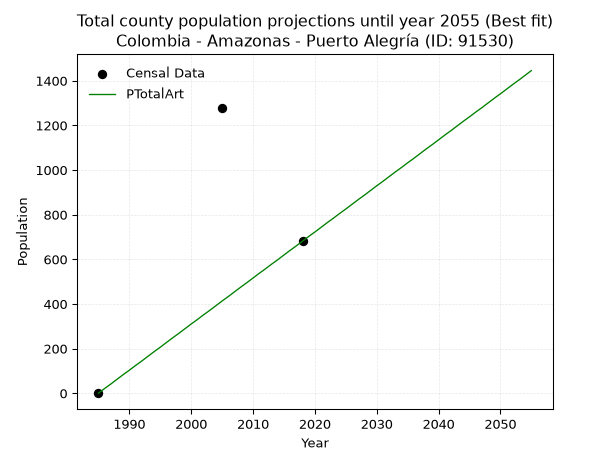
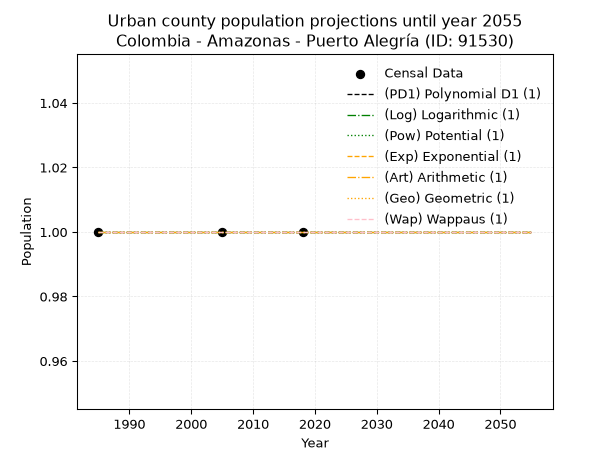
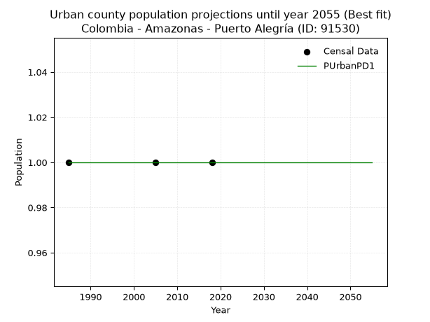
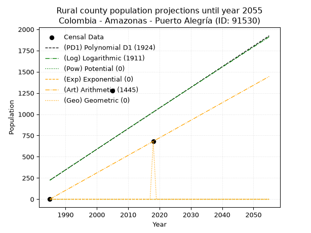

<div align="center">


</div>

# _“Population and Public Services Demand Projections (PPSD) until Year 2050 for Colombia - Amazonas - Puerto Alegría (ID: 91530)”_
Keywords: `population` `public-service` `projection` `lineal` `polynomial` `logarithmic` `potential` `exponential` `arithmetic` `geometric` `wappaus` `dane` `colombia` `south-america`

PPSD are analytical estimates used by governments and planners to anticipate future changes in population size, age distribution, and the resulting community needs for utilities, healthcare, education, and infrastructure as sizing future water treatment facilities, electrical grids, and road networks based on spatial growth.

> **General running parameters**: • app_version: _v20260806_. • Python version: _3.14.7_. • Pandas version: _3.0.5_. • NumPy version: _2.5.1_. • Creates, save and include plots into reports (create_plot): _False_. • Projection until year: _2050_. • Process polynomial degree 2 and up: _False_. • Process Wappaus: _True_. • Process Wappaus: _True_. • Set negative values to zero: _True_. • Set infinite values to zero: _True_. • Drop dataset notes: _True_. 
<div align="center">

Dynamic map: [:earth_americas:Google](http://maps.google.com/maps?q=-0.94968952,-73.7518604) [:earth_americas:OSM](https://www.openstreetmap.org/#map=18/-0.94968952/-73.7518604&layers=P) [:earth_americas:Bing](https://www.bing.com/maps?cp=-0.94968952~-73.7518604&lvl=18) [:earth_americas:Apple](https://maps.apple.com/frame?center=-0.94968952%2C-73.7518604&span=0.003%2C0.006)

</div>


<div align="center">

```geojson
{
  "type": "Feature",
  "geometry": {
    "type": "Point", 
    "coordinates": [-73.7518604, -0.94968952]
  }, 
  "properties": {
    "Name": "Colombia - Amazonas - Puerto Alegría (ID: 91530)"
  }
}
```

</div>


## 0. Census Data (3 records)

Census data are official statistics collected by a government about the people and housing in a country. They usually include counts of total population, age, sex, race, income, education, and jobs.

📅Global census file: [Population.xlsx](../data/Population.xlsx)

| Source   |   Year |   CountryID | CountryName   |   StateID | StateName   |   CountyID | CountyName     |   PTotal |   PUrban |   PRural |
|:---------|-------:|------------:|:--------------|----------:|:------------|-----------:|:---------------|---------:|---------:|---------:|
| DANE     |   1985 |          57 | Colombia      |        91 | Amazonas    |      91530 | Puerto Alegría |        0 |        1 |        0 |
| DANE     |   2005 |          57 | Colombia      |        91 | Amazonas    |      91530 | Puerto Alegría |     1277 |        1 |     1277 |
| DANE     |   2018 |          57 | Colombia      |        91 | Amazonas    |      91530 | Puerto Alegría |      681 |        1 |      681 |

> 🔥Some records could had specific notes about the registered values or the corresponding urban or rural distribution.

## 1. Total

### 1.1. Coefficients and Parameters

* (PD1) Polynomial Deg 1: 24.285283474065466, -47982.66103739512 (lineal)
* (Log) Logarithmic: 48725.638952899215, -369769.966164745
* (Pow) Potential: nan, nan
* (Exp) Exponential: nan, nan
* (Art) Arithmetic: Year diff. 2018 - 1985 = 33, Population diff. 681 - 0 = 681, Annual growth = 20.636363636363637
* (Geo) Geometric: Year diff. 2018 - 1985 = 33, Population diff. 681 - 0 = 681, Annual growth % = inf
* (Wap) Wappaus: i = 6.0606060606060606, Condition values only valid for < 200)

<sub>
Wappaus condition values: ['0.00', '6.06', '12.12', '18.18', '24.24', '30.30', '36.36', '42.42', '48.48', '54.55', '60.61', '66.67', '72.73', '78.79', '84.85', '90.91', '96.97', '103.03', '109.09', '115.15', '121.21', '127.27', '133.33', '139.39', '145.45', '151.52', '157.58', '163.64', '169.70', '175.76', '181.82', '187.88', '193.94', '200.00', '206.06', '212.12', '218.18', '224.24', '230.30', '236.36', '242.42', '248.48', '254.55', '260.61', '266.67', '272.73', '278.79', '284.85', '290.91', '296.97', '303.03', '309.09', '315.15', '321.21', '327.27', '333.33', '339.39', '345.45', '351.52', '357.58', '363.64', '369.70', '375.76', '381.82', '387.88', '393.94']
</sub>


### 1.2. Projected Dataset

|   Year |   CountyID |   PTotalPD1 |   PTotalLog |   PTotalPow |   PTotalExp |   PTotalArt |   PTotalGeo |
|-------:|-----------:|------------:|------------:|------------:|------------:|------------:|------------:|
|   1985 |      91530 |         224 |         222 |           0 |           0 |           0 |           0 |
|   1986 |      91530 |         248 |         247 |           0 |           0 |          21 |           0 |
|   1987 |      91530 |         272 |         271 |           0 |           0 |          41 |           0 |
|   1988 |      91530 |         296 |         296 |           0 |           0 |          62 |           0 |
|   1989 |      91530 |         321 |         320 |           0 |           0 |          83 |           0 |
|   1990 |      91530 |         345 |         345 |           0 |           0 |         103 |           0 |
|   1991 |      91530 |         369 |         369 |           0 |           0 |         124 |           0 |
|   1992 |      91530 |         394 |         394 |           0 |           0 |         144 |           0 |
|   1993 |      91530 |         418 |         418 |           0 |           0 |         165 |           0 |
|   1994 |      91530 |         442 |         442 |           0 |           0 |         186 |           0 |
|   1995 |      91530 |         466 |         467 |           0 |           0 |         206 |           0 |
|   1996 |      91530 |         491 |         491 |           0 |           0 |         227 |           0 |
|   1997 |      91530 |         515 |         516 |           0 |           0 |         248 |           0 |
|   1998 |      91530 |         539 |         540 |           0 |           0 |         268 |           0 |
|   1999 |      91530 |         564 |         564 |           0 |           0 |         289 |           0 |
|   2000 |      91530 |         588 |         589 |           0 |           0 |         310 |           0 |
|   2001 |      91530 |         612 |         613 |           0 |           0 |         330 |           0 |
|   2002 |      91530 |         636 |         638 |           0 |           0 |         351 |           0 |
|   2003 |      91530 |         661 |         662 |           0 |           0 |         371 |           0 |
|   2004 |      91530 |         685 |         686 |           0 |           0 |         392 |           0 |
|   2005 |      91530 |         709 |         711 |           0 |           0 |         413 |           0 |
|   2006 |      91530 |         734 |         735 |           0 |           0 |         433 |           0 |
|   2007 |      91530 |         758 |         759 |           0 |           0 |         454 |           0 |
|   2008 |      91530 |         782 |         783 |           0 |           0 |         475 |           0 |
|   2009 |      91530 |         806 |         808 |           0 |           0 |         495 |           0 |
|   2010 |      91530 |         831 |         832 |           0 |           0 |         516 |           0 |
|   2011 |      91530 |         855 |         856 |           0 |           0 |         537 |           0 |
|   2012 |      91530 |         879 |         880 |           0 |           0 |         557 |           0 |
|   2013 |      91530 |         904 |         905 |           0 |           0 |         578 |           0 |
|   2014 |      91530 |         928 |         929 |           0 |           0 |         598 |           0 |
|   2015 |      91530 |         952 |         953 |           0 |           0 |         619 |           0 |
|   2016 |      91530 |         976 |         977 |           0 |           0 |         640 |           0 |
|   2017 |      91530 |        1001 |        1001 |           0 |           0 |         660 |           0 |
|   2018 |      91530 |        1025 |        1025 |           0 |           0 |         681 |         681 |
|   2019 |      91530 |        1049 |        1050 |           0 |           0 |         702 |         inf |
|   2020 |      91530 |        1074 |        1074 |           0 |           0 |         722 |         inf |
|   2021 |      91530 |        1098 |        1098 |           0 |           0 |         743 |         inf |
|   2022 |      91530 |        1122 |        1122 |           0 |           0 |         764 |         inf |
|   2023 |      91530 |        1146 |        1146 |           0 |           0 |         784 |         inf |
|   2024 |      91530 |        1171 |        1170 |           0 |           0 |         805 |         inf |
|   2025 |      91530 |        1195 |        1194 |           0 |           0 |         825 |         inf |
|   2026 |      91530 |        1219 |        1218 |           0 |           0 |         846 |         inf |
|   2027 |      91530 |        1244 |        1242 |           0 |           0 |         867 |         inf |
|   2028 |      91530 |        1268 |        1266 |           0 |           0 |         887 |         inf |
|   2029 |      91530 |        1292 |        1290 |           0 |           0 |         908 |         inf |
|   2030 |      91530 |        1316 |        1314 |           0 |           0 |         929 |         inf |
|   2031 |      91530 |        1341 |        1338 |           0 |           0 |         949 |         inf |
|   2032 |      91530 |        1365 |        1362 |           0 |           0 |         970 |         inf |
|   2033 |      91530 |        1389 |        1386 |           0 |           0 |         991 |         inf |
|   2034 |      91530 |        1414 |        1410 |           0 |           0 |        1011 |         inf |
|   2035 |      91530 |        1438 |        1434 |           0 |           0 |        1032 |         inf |
|   2036 |      91530 |        1462 |        1458 |           0 |           0 |        1052 |         inf |
|   2037 |      91530 |        1486 |        1482 |           0 |           0 |        1073 |         inf |
|   2038 |      91530 |        1511 |        1506 |           0 |           0 |        1094 |         inf |
|   2039 |      91530 |        1535 |        1530 |           0 |           0 |        1114 |         inf |
|   2040 |      91530 |        1559 |        1554 |           0 |           0 |        1135 |         inf |
|   2041 |      91530 |        1584 |        1578 |           0 |           0 |        1156 |         inf |
|   2042 |      91530 |        1608 |        1602 |           0 |           0 |        1176 |         inf |
|   2043 |      91530 |        1632 |        1625 |           0 |           0 |        1197 |         inf |
|   2044 |      91530 |        1656 |        1649 |           0 |           0 |        1218 |         inf |
|   2045 |      91530 |        1681 |        1673 |           0 |           0 |        1238 |         inf |
|   2046 |      91530 |        1705 |        1697 |           0 |           0 |        1259 |         inf |
|   2047 |      91530 |        1729 |        1721 |           0 |           0 |        1279 |         inf |
|   2048 |      91530 |        1754 |        1744 |           0 |           0 |        1300 |         inf |
|   2049 |      91530 |        1778 |        1768 |           0 |           0 |        1321 |         inf |
|   2050 |      91530 |        1802 |        1792 |           0 |           0 |        1341 |         inf |
<div align="center">

</img>

</div>


### 1.3. Best fit with absolute and relative error (%)

Relative error puts that difference into context by dividing the absolute error by the true value, creating a unitless ratio or percentage that shows the scale of the mistake.

Absolute and relative error

|   Year | Source   |   CountryID | CountryName   |   StateID | StateName   |   CountyID_x | CountyName     |   PTotal |   PUrban |   PRural |   CountyID_y |   PTotalPD1 |   PTotalLog |   PTotalPow |   PTotalExp |   PTotalArt |   PTotalGeo |   PTotalPD1AbsError |   PTotalLogAbsError |   PTotalPowAbsError |   PTotalExpAbsError |   PTotalArtAbsError |   PTotalGeoAbsError |   PTotalPD1RelError |   PTotalLogRelError |   PTotalPowRelError |   PTotalExpRelError |   PTotalArtRelError |   PTotalGeoRelError |
|-------:|:---------|------------:|:--------------|----------:|:------------|-------------:|:---------------|---------:|---------:|---------:|-------------:|------------:|------------:|------------:|------------:|------------:|------------:|--------------------:|--------------------:|--------------------:|--------------------:|--------------------:|--------------------:|--------------------:|--------------------:|--------------------:|--------------------:|--------------------:|--------------------:|
|   1985 | DANE     |          57 | Colombia      |        91 | Amazonas    |        91530 | Puerto Alegría |        0 |        1 |        0 |        91530 |         224 |         222 |           0 |           0 |           0 |           0 |                 224 |                 222 |                   0 |                   0 |                   0 |                   0 |            inf      |            inf      |                 nan |                 nan |            nan      |                 nan |
|   2005 | DANE     |          57 | Colombia      |        91 | Amazonas    |        91530 | Puerto Alegría |     1277 |        1 |     1277 |        91530 |         709 |         711 |           0 |           0 |         413 |           0 |                 568 |                 566 |                1277 |                1277 |                 864 |                1277 |             44.4792 |             44.3226 |                 100 |                 100 |             67.6586 |                 100 |
|   2018 | DANE     |          57 | Colombia      |        91 | Amazonas    |        91530 | Puerto Alegría |      681 |        1 |      681 |        91530 |        1025 |        1025 |           0 |           0 |         681 |         681 |                 344 |                 344 |                 681 |                 681 |                   0 |                   0 |             50.514  |             50.514  |                 100 |                 100 |              0      |                   0 |

Relative error mean

| Method    |   RelError | Best   |
|:----------|-----------:|:-------|
| PTotalPD1 |   inf      |        |
| PTotalLog |   inf      |        |
| PTotalPow |   100      |        |
| PTotalExp |   100      |        |
| PTotalArt |    33.8293 | True   |
| PTotalGeo |    50      |        |

💙Best method: _**PTotalArt**_
<div align="center">

</img>

</div>


### 1.4. Fresh water supply demand in liters per capita per day (lpcd)

The fresh water supply demand typically ranges from 100 to 300 liters per capita per day (lpcd) for standard domestic and municipal planning, though absolute survival minimums set by the World Health Organization are as low as 7.5 to 20 liters per day, and total consumption in high-income nations can exceed 400 liters.

> `CZ`: Level in meters above the sea level (masl).<br> `WS`: Fresh water supply demand in liters per capita per day (lpcd or l/h/d).<br> `WSAll`: Zonal fresh water supply demand in liters per second (l/s).<br> `A`: Zonal area in square meters.

Reference values (RAS Colombia)

|    CZ |   WS |
|------:|-----:|
|  1000 |  120 |
|  2000 |  130 |
| 99999 |  140 |

County shapefile geometry properties and water supply values

|   CountyID |      ATotal |   CZTotal |   WSTotal |
|-----------:|------------:|----------:|----------:|
|      91530 | 8.29318e+09 |   180.727 |       120 |

Projected values for best method: PTotalArt

|   CountyID |   Year |   PTotalArt |   WSTotal |   WSTotalAll |
|-----------:|-------:|------------:|----------:|-------------:|
|      91530 |   1985 |           0 |       120 |    0         |
|      91530 |   1986 |          21 |       120 |    0.0291667 |
|      91530 |   1987 |          41 |       120 |    0.0569444 |
|      91530 |   1988 |          62 |       120 |    0.0861111 |
|      91530 |   1989 |          83 |       120 |    0.115278  |
|      91530 |   1990 |         103 |       120 |    0.143056  |
|      91530 |   1991 |         124 |       120 |    0.172222  |
|      91530 |   1992 |         144 |       120 |    0.2       |
|      91530 |   1993 |         165 |       120 |    0.229167  |
|      91530 |   1994 |         186 |       120 |    0.258333  |
|      91530 |   1995 |         206 |       120 |    0.286111  |
|      91530 |   1996 |         227 |       120 |    0.315278  |
|      91530 |   1997 |         248 |       120 |    0.344444  |
|      91530 |   1998 |         268 |       120 |    0.372222  |
|      91530 |   1999 |         289 |       120 |    0.401389  |
|      91530 |   2000 |         310 |       120 |    0.430556  |
|      91530 |   2001 |         330 |       120 |    0.458333  |
|      91530 |   2002 |         351 |       120 |    0.4875    |
|      91530 |   2003 |         371 |       120 |    0.515278  |
|      91530 |   2004 |         392 |       120 |    0.544444  |
|      91530 |   2005 |         413 |       120 |    0.573611  |
|      91530 |   2006 |         433 |       120 |    0.601389  |
|      91530 |   2007 |         454 |       120 |    0.630556  |
|      91530 |   2008 |         475 |       120 |    0.659722  |
|      91530 |   2009 |         495 |       120 |    0.6875    |
|      91530 |   2010 |         516 |       120 |    0.716667  |
|      91530 |   2011 |         537 |       120 |    0.745833  |
|      91530 |   2012 |         557 |       120 |    0.773611  |
|      91530 |   2013 |         578 |       120 |    0.802778  |
|      91530 |   2014 |         598 |       120 |    0.830556  |
|      91530 |   2015 |         619 |       120 |    0.859722  |
|      91530 |   2016 |         640 |       120 |    0.888889  |
|      91530 |   2017 |         660 |       120 |    0.916667  |
|      91530 |   2018 |         681 |       120 |    0.945833  |
|      91530 |   2019 |         702 |       120 |    0.975     |
|      91530 |   2020 |         722 |       120 |    1.00278   |
|      91530 |   2021 |         743 |       120 |    1.03194   |
|      91530 |   2022 |         764 |       120 |    1.06111   |
|      91530 |   2023 |         784 |       120 |    1.08889   |
|      91530 |   2024 |         805 |       120 |    1.11806   |
|      91530 |   2025 |         825 |       120 |    1.14583   |
|      91530 |   2026 |         846 |       120 |    1.175     |
|      91530 |   2027 |         867 |       120 |    1.20417   |
|      91530 |   2028 |         887 |       120 |    1.23194   |
|      91530 |   2029 |         908 |       120 |    1.26111   |
|      91530 |   2030 |         929 |       120 |    1.29028   |
|      91530 |   2031 |         949 |       120 |    1.31806   |
|      91530 |   2032 |         970 |       120 |    1.34722   |
|      91530 |   2033 |         991 |       120 |    1.37639   |
|      91530 |   2034 |        1011 |       120 |    1.40417   |
|      91530 |   2035 |        1032 |       120 |    1.43333   |
|      91530 |   2036 |        1052 |       120 |    1.46111   |
|      91530 |   2037 |        1073 |       120 |    1.49028   |
|      91530 |   2038 |        1094 |       120 |    1.51944   |
|      91530 |   2039 |        1114 |       120 |    1.54722   |
|      91530 |   2040 |        1135 |       120 |    1.57639   |
|      91530 |   2041 |        1156 |       120 |    1.60556   |
|      91530 |   2042 |        1176 |       120 |    1.63333   |
|      91530 |   2043 |        1197 |       120 |    1.6625    |
|      91530 |   2044 |        1218 |       120 |    1.69167   |
|      91530 |   2045 |        1238 |       120 |    1.71944   |
|      91530 |   2046 |        1259 |       120 |    1.74861   |
|      91530 |   2047 |        1279 |       120 |    1.77639   |
|      91530 |   2048 |        1300 |       120 |    1.80556   |
|      91530 |   2049 |        1321 |       120 |    1.83472   |
|      91530 |   2050 |        1341 |       120 |    1.8625    |

## 2. Urban

### 2.1. Coefficients and Parameters

* (PD1) Polynomial Deg 1: -1.552800494883905e-18, 1.000000000000003 (lineal)
* (Log) Logarithmic: 9.649371307553518e-15, 0.9999999999999262
* (Pow) Potential: 0.0, 0.0
* (Exp) Exponential: 0.0, 1.0
* (Art) Arithmetic: Year diff. 2018 - 1985 = 33, Population diff. 1 - 1 = 0, Annual growth = 0.0
* (Geo) Geometric: Year diff. 2018 - 1985 = 33, Population diff. 1 - 1 = 0, Annual growth % = 0.0
* (Wap) Wappaus: i = 0.0, Condition values only valid for < 200)

<sub>
Wappaus condition values: ['0.00', '0.00', '0.00', '0.00', '0.00', '0.00', '0.00', '0.00', '0.00', '0.00', '0.00', '0.00', '0.00', '0.00', '0.00', '0.00', '0.00', '0.00', '0.00', '0.00', '0.00', '0.00', '0.00', '0.00', '0.00', '0.00', '0.00', '0.00', '0.00', '0.00', '0.00', '0.00', '0.00', '0.00', '0.00', '0.00', '0.00', '0.00', '0.00', '0.00', '0.00', '0.00', '0.00', '0.00', '0.00', '0.00', '0.00', '0.00', '0.00', '0.00', '0.00', '0.00', '0.00', '0.00', '0.00', '0.00', '0.00', '0.00', '0.00', '0.00', '0.00', '0.00', '0.00', '0.00', '0.00', '0.00']
</sub>


### 2.2. Projected Dataset

|   Year |   CountyID |   PUrbanPD1 |   PUrbanLog |   PUrbanPow |   PUrbanExp |   PUrbanArt |   PUrbanGeo |   PUrbanWap |
|-------:|-----------:|------------:|------------:|------------:|------------:|------------:|------------:|------------:|
|   1985 |      91530 |           1 |           1 |           1 |           1 |           1 |           1 |           1 |
|   1986 |      91530 |           1 |           1 |           1 |           1 |           1 |           1 |           1 |
|   1987 |      91530 |           1 |           1 |           1 |           1 |           1 |           1 |           1 |
|   1988 |      91530 |           1 |           1 |           1 |           1 |           1 |           1 |           1 |
|   1989 |      91530 |           1 |           1 |           1 |           1 |           1 |           1 |           1 |
|   1990 |      91530 |           1 |           1 |           1 |           1 |           1 |           1 |           1 |
|   1991 |      91530 |           1 |           1 |           1 |           1 |           1 |           1 |           1 |
|   1992 |      91530 |           1 |           1 |           1 |           1 |           1 |           1 |           1 |
|   1993 |      91530 |           1 |           1 |           1 |           1 |           1 |           1 |           1 |
|   1994 |      91530 |           1 |           1 |           1 |           1 |           1 |           1 |           1 |
|   1995 |      91530 |           1 |           1 |           1 |           1 |           1 |           1 |           1 |
|   1996 |      91530 |           1 |           1 |           1 |           1 |           1 |           1 |           1 |
|   1997 |      91530 |           1 |           1 |           1 |           1 |           1 |           1 |           1 |
|   1998 |      91530 |           1 |           1 |           1 |           1 |           1 |           1 |           1 |
|   1999 |      91530 |           1 |           1 |           1 |           1 |           1 |           1 |           1 |
|   2000 |      91530 |           1 |           1 |           1 |           1 |           1 |           1 |           1 |
|   2001 |      91530 |           1 |           1 |           1 |           1 |           1 |           1 |           1 |
|   2002 |      91530 |           1 |           1 |           1 |           1 |           1 |           1 |           1 |
|   2003 |      91530 |           1 |           1 |           1 |           1 |           1 |           1 |           1 |
|   2004 |      91530 |           1 |           1 |           1 |           1 |           1 |           1 |           1 |
|   2005 |      91530 |           1 |           1 |           1 |           1 |           1 |           1 |           1 |
|   2006 |      91530 |           1 |           1 |           1 |           1 |           1 |           1 |           1 |
|   2007 |      91530 |           1 |           1 |           1 |           1 |           1 |           1 |           1 |
|   2008 |      91530 |           1 |           1 |           1 |           1 |           1 |           1 |           1 |
|   2009 |      91530 |           1 |           1 |           1 |           1 |           1 |           1 |           1 |
|   2010 |      91530 |           1 |           1 |           1 |           1 |           1 |           1 |           1 |
|   2011 |      91530 |           1 |           1 |           1 |           1 |           1 |           1 |           1 |
|   2012 |      91530 |           1 |           1 |           1 |           1 |           1 |           1 |           1 |
|   2013 |      91530 |           1 |           1 |           1 |           1 |           1 |           1 |           1 |
|   2014 |      91530 |           1 |           1 |           1 |           1 |           1 |           1 |           1 |
|   2015 |      91530 |           1 |           1 |           1 |           1 |           1 |           1 |           1 |
|   2016 |      91530 |           1 |           1 |           1 |           1 |           1 |           1 |           1 |
|   2017 |      91530 |           1 |           1 |           1 |           1 |           1 |           1 |           1 |
|   2018 |      91530 |           1 |           1 |           1 |           1 |           1 |           1 |           1 |
|   2019 |      91530 |           1 |           1 |           1 |           1 |           1 |           1 |           1 |
|   2020 |      91530 |           1 |           1 |           1 |           1 |           1 |           1 |           1 |
|   2021 |      91530 |           1 |           1 |           1 |           1 |           1 |           1 |           1 |
|   2022 |      91530 |           1 |           1 |           1 |           1 |           1 |           1 |           1 |
|   2023 |      91530 |           1 |           1 |           1 |           1 |           1 |           1 |           1 |
|   2024 |      91530 |           1 |           1 |           1 |           1 |           1 |           1 |           1 |
|   2025 |      91530 |           1 |           1 |           1 |           1 |           1 |           1 |           1 |
|   2026 |      91530 |           1 |           1 |           1 |           1 |           1 |           1 |           1 |
|   2027 |      91530 |           1 |           1 |           1 |           1 |           1 |           1 |           1 |
|   2028 |      91530 |           1 |           1 |           1 |           1 |           1 |           1 |           1 |
|   2029 |      91530 |           1 |           1 |           1 |           1 |           1 |           1 |           1 |
|   2030 |      91530 |           1 |           1 |           1 |           1 |           1 |           1 |           1 |
|   2031 |      91530 |           1 |           1 |           1 |           1 |           1 |           1 |           1 |
|   2032 |      91530 |           1 |           1 |           1 |           1 |           1 |           1 |           1 |
|   2033 |      91530 |           1 |           1 |           1 |           1 |           1 |           1 |           1 |
|   2034 |      91530 |           1 |           1 |           1 |           1 |           1 |           1 |           1 |
|   2035 |      91530 |           1 |           1 |           1 |           1 |           1 |           1 |           1 |
|   2036 |      91530 |           1 |           1 |           1 |           1 |           1 |           1 |           1 |
|   2037 |      91530 |           1 |           1 |           1 |           1 |           1 |           1 |           1 |
|   2038 |      91530 |           1 |           1 |           1 |           1 |           1 |           1 |           1 |
|   2039 |      91530 |           1 |           1 |           1 |           1 |           1 |           1 |           1 |
|   2040 |      91530 |           1 |           1 |           1 |           1 |           1 |           1 |           1 |
|   2041 |      91530 |           1 |           1 |           1 |           1 |           1 |           1 |           1 |
|   2042 |      91530 |           1 |           1 |           1 |           1 |           1 |           1 |           1 |
|   2043 |      91530 |           1 |           1 |           1 |           1 |           1 |           1 |           1 |
|   2044 |      91530 |           1 |           1 |           1 |           1 |           1 |           1 |           1 |
|   2045 |      91530 |           1 |           1 |           1 |           1 |           1 |           1 |           1 |
|   2046 |      91530 |           1 |           1 |           1 |           1 |           1 |           1 |           1 |
|   2047 |      91530 |           1 |           1 |           1 |           1 |           1 |           1 |           1 |
|   2048 |      91530 |           1 |           1 |           1 |           1 |           1 |           1 |           1 |
|   2049 |      91530 |           1 |           1 |           1 |           1 |           1 |           1 |           1 |
|   2050 |      91530 |           1 |           1 |           1 |           1 |           1 |           1 |           1 |
<div align="center">

</img>

</div>


### 2.3. Best fit with absolute and relative error (%)

Relative error puts that difference into context by dividing the absolute error by the true value, creating a unitless ratio or percentage that shows the scale of the mistake.

Absolute and relative error

|   Year | Source   |   CountryID | CountryName   |   StateID | StateName   |   CountyID_x | CountyName     |   PTotal |   PUrban |   PRural |   CountyID_y |   PUrbanPD1 |   PUrbanLog |   PUrbanPow |   PUrbanExp |   PUrbanArt |   PUrbanGeo |   PUrbanWap |   PUrbanPD1AbsError |   PUrbanLogAbsError |   PUrbanPowAbsError |   PUrbanExpAbsError |   PUrbanArtAbsError |   PUrbanGeoAbsError |   PUrbanWapAbsError |   PUrbanPD1RelError |   PUrbanLogRelError |   PUrbanPowRelError |   PUrbanExpRelError |   PUrbanArtRelError |   PUrbanGeoRelError |   PUrbanWapRelError |
|-------:|:---------|------------:|:--------------|----------:|:------------|-------------:|:---------------|---------:|---------:|---------:|-------------:|------------:|------------:|------------:|------------:|------------:|------------:|------------:|--------------------:|--------------------:|--------------------:|--------------------:|--------------------:|--------------------:|--------------------:|--------------------:|--------------------:|--------------------:|--------------------:|--------------------:|--------------------:|--------------------:|
|   1985 | DANE     |          57 | Colombia      |        91 | Amazonas    |        91530 | Puerto Alegría |        0 |        1 |        0 |        91530 |           1 |           1 |           1 |           1 |           1 |           1 |           1 |                   0 |                   0 |                   0 |                   0 |                   0 |                   0 |                   0 |                   0 |                   0 |                   0 |                   0 |                   0 |                   0 |                   0 |
|   2005 | DANE     |          57 | Colombia      |        91 | Amazonas    |        91530 | Puerto Alegría |     1277 |        1 |     1277 |        91530 |           1 |           1 |           1 |           1 |           1 |           1 |           1 |                   0 |                   0 |                   0 |                   0 |                   0 |                   0 |                   0 |                   0 |                   0 |                   0 |                   0 |                   0 |                   0 |                   0 |
|   2018 | DANE     |          57 | Colombia      |        91 | Amazonas    |        91530 | Puerto Alegría |      681 |        1 |      681 |        91530 |           1 |           1 |           1 |           1 |           1 |           1 |           1 |                   0 |                   0 |                   0 |                   0 |                   0 |                   0 |                   0 |                   0 |                   0 |                   0 |                   0 |                   0 |                   0 |                   0 |

Relative error mean

| Method    |   RelError | Best   |
|:----------|-----------:|:-------|
| PUrbanPD1 |          0 | True   |
| PUrbanLog |          0 | True   |
| PUrbanPow |          0 | True   |
| PUrbanExp |          0 | True   |
| PUrbanArt |          0 | True   |
| PUrbanGeo |          0 | True   |
| PUrbanWap |          0 | True   |

💙Best method: _**PUrbanPD1**_
<div align="center">

</img>

</div>


### 2.4. Fresh water supply demand in liters per capita per day (lpcd)

The fresh water supply demand typically ranges from 100 to 300 liters per capita per day (lpcd) for standard domestic and municipal planning, though absolute survival minimums set by the World Health Organization are as low as 7.5 to 20 liters per day, and total consumption in high-income nations can exceed 400 liters.

> `CZ`: Level in meters above the sea level (masl).<br> `WS`: Fresh water supply demand in liters per capita per day (lpcd or l/h/d).<br> `WSAll`: Zonal fresh water supply demand in liters per second (l/s).<br> `A`: Zonal area in square meters.

Reference values (RAS Colombia)

|    CZ |   WS |
|------:|-----:|
|  1000 |  120 |
|  2000 |  130 |
| 99999 |  140 |

County shapefile geometry properties and water supply values

|   CountyID |   AUrban |   CZUrban |   WSUrban |
|-----------:|---------:|----------:|----------:|
|      91530 |        0 |         0 |       120 |

Projected values for best method: PUrbanPD1

|   CountyID |   Year |   PUrbanPD1 |   WSUrban |   WSUrbanAll |
|-----------:|-------:|------------:|----------:|-------------:|
|      91530 |   1985 |           1 |       120 |   0.00138889 |
|      91530 |   1986 |           1 |       120 |   0.00138889 |
|      91530 |   1987 |           1 |       120 |   0.00138889 |
|      91530 |   1988 |           1 |       120 |   0.00138889 |
|      91530 |   1989 |           1 |       120 |   0.00138889 |
|      91530 |   1990 |           1 |       120 |   0.00138889 |
|      91530 |   1991 |           1 |       120 |   0.00138889 |
|      91530 |   1992 |           1 |       120 |   0.00138889 |
|      91530 |   1993 |           1 |       120 |   0.00138889 |
|      91530 |   1994 |           1 |       120 |   0.00138889 |
|      91530 |   1995 |           1 |       120 |   0.00138889 |
|      91530 |   1996 |           1 |       120 |   0.00138889 |
|      91530 |   1997 |           1 |       120 |   0.00138889 |
|      91530 |   1998 |           1 |       120 |   0.00138889 |
|      91530 |   1999 |           1 |       120 |   0.00138889 |
|      91530 |   2000 |           1 |       120 |   0.00138889 |
|      91530 |   2001 |           1 |       120 |   0.00138889 |
|      91530 |   2002 |           1 |       120 |   0.00138889 |
|      91530 |   2003 |           1 |       120 |   0.00138889 |
|      91530 |   2004 |           1 |       120 |   0.00138889 |
|      91530 |   2005 |           1 |       120 |   0.00138889 |
|      91530 |   2006 |           1 |       120 |   0.00138889 |
|      91530 |   2007 |           1 |       120 |   0.00138889 |
|      91530 |   2008 |           1 |       120 |   0.00138889 |
|      91530 |   2009 |           1 |       120 |   0.00138889 |
|      91530 |   2010 |           1 |       120 |   0.00138889 |
|      91530 |   2011 |           1 |       120 |   0.00138889 |
|      91530 |   2012 |           1 |       120 |   0.00138889 |
|      91530 |   2013 |           1 |       120 |   0.00138889 |
|      91530 |   2014 |           1 |       120 |   0.00138889 |
|      91530 |   2015 |           1 |       120 |   0.00138889 |
|      91530 |   2016 |           1 |       120 |   0.00138889 |
|      91530 |   2017 |           1 |       120 |   0.00138889 |
|      91530 |   2018 |           1 |       120 |   0.00138889 |
|      91530 |   2019 |           1 |       120 |   0.00138889 |
|      91530 |   2020 |           1 |       120 |   0.00138889 |
|      91530 |   2021 |           1 |       120 |   0.00138889 |
|      91530 |   2022 |           1 |       120 |   0.00138889 |
|      91530 |   2023 |           1 |       120 |   0.00138889 |
|      91530 |   2024 |           1 |       120 |   0.00138889 |
|      91530 |   2025 |           1 |       120 |   0.00138889 |
|      91530 |   2026 |           1 |       120 |   0.00138889 |
|      91530 |   2027 |           1 |       120 |   0.00138889 |
|      91530 |   2028 |           1 |       120 |   0.00138889 |
|      91530 |   2029 |           1 |       120 |   0.00138889 |
|      91530 |   2030 |           1 |       120 |   0.00138889 |
|      91530 |   2031 |           1 |       120 |   0.00138889 |
|      91530 |   2032 |           1 |       120 |   0.00138889 |
|      91530 |   2033 |           1 |       120 |   0.00138889 |
|      91530 |   2034 |           1 |       120 |   0.00138889 |
|      91530 |   2035 |           1 |       120 |   0.00138889 |
|      91530 |   2036 |           1 |       120 |   0.00138889 |
|      91530 |   2037 |           1 |       120 |   0.00138889 |
|      91530 |   2038 |           1 |       120 |   0.00138889 |
|      91530 |   2039 |           1 |       120 |   0.00138889 |
|      91530 |   2040 |           1 |       120 |   0.00138889 |
|      91530 |   2041 |           1 |       120 |   0.00138889 |
|      91530 |   2042 |           1 |       120 |   0.00138889 |
|      91530 |   2043 |           1 |       120 |   0.00138889 |
|      91530 |   2044 |           1 |       120 |   0.00138889 |
|      91530 |   2045 |           1 |       120 |   0.00138889 |
|      91530 |   2046 |           1 |       120 |   0.00138889 |
|      91530 |   2047 |           1 |       120 |   0.00138889 |
|      91530 |   2048 |           1 |       120 |   0.00138889 |
|      91530 |   2049 |           1 |       120 |   0.00138889 |
|      91530 |   2050 |           1 |       120 |   0.00138889 |

## 3. Rural

### 3.1. Coefficients and Parameters

* (PD1) Polynomial Deg 1: 24.285283474065466, -47982.66103739512 (lineal)
* (Log) Logarithmic: 48725.638952899215, -369769.966164745
* (Pow) Potential: nan, nan
* (Exp) Exponential: nan, nan
* (Art) Arithmetic: Year diff. 2018 - 1985 = 33, Population diff. 681 - 0 = 681, Annual growth = 20.636363636363637
* (Geo) Geometric: Year diff. 2018 - 1985 = 33, Population diff. 681 - 0 = 681, Annual growth % = inf
* (Wap) Wappaus: i = 6.0606060606060606, Condition values only valid for < 200)

<sub>
Wappaus condition values: ['0.00', '6.06', '12.12', '18.18', '24.24', '30.30', '36.36', '42.42', '48.48', '54.55', '60.61', '66.67', '72.73', '78.79', '84.85', '90.91', '96.97', '103.03', '109.09', '115.15', '121.21', '127.27', '133.33', '139.39', '145.45', '151.52', '157.58', '163.64', '169.70', '175.76', '181.82', '187.88', '193.94', '200.00', '206.06', '212.12', '218.18', '224.24', '230.30', '236.36', '242.42', '248.48', '254.55', '260.61', '266.67', '272.73', '278.79', '284.85', '290.91', '296.97', '303.03', '309.09', '315.15', '321.21', '327.27', '333.33', '339.39', '345.45', '351.52', '357.58', '363.64', '369.70', '375.76', '381.82', '387.88', '393.94']
</sub>


### 3.2. Projected Dataset

|   Year |   CountyID |   PRuralPD1 |   PRuralLog |   PRuralPow |   PRuralExp |   PRuralArt |   PRuralGeo |
|-------:|-----------:|------------:|------------:|------------:|------------:|------------:|------------:|
|   1985 |      91530 |         224 |         222 |           0 |           0 |           0 |           0 |
|   1986 |      91530 |         248 |         247 |           0 |           0 |          21 |           0 |
|   1987 |      91530 |         272 |         271 |           0 |           0 |          41 |           0 |
|   1988 |      91530 |         296 |         296 |           0 |           0 |          62 |           0 |
|   1989 |      91530 |         321 |         320 |           0 |           0 |          83 |           0 |
|   1990 |      91530 |         345 |         345 |           0 |           0 |         103 |           0 |
|   1991 |      91530 |         369 |         369 |           0 |           0 |         124 |           0 |
|   1992 |      91530 |         394 |         394 |           0 |           0 |         144 |           0 |
|   1993 |      91530 |         418 |         418 |           0 |           0 |         165 |           0 |
|   1994 |      91530 |         442 |         442 |           0 |           0 |         186 |           0 |
|   1995 |      91530 |         466 |         467 |           0 |           0 |         206 |           0 |
|   1996 |      91530 |         491 |         491 |           0 |           0 |         227 |           0 |
|   1997 |      91530 |         515 |         516 |           0 |           0 |         248 |           0 |
|   1998 |      91530 |         539 |         540 |           0 |           0 |         268 |           0 |
|   1999 |      91530 |         564 |         564 |           0 |           0 |         289 |           0 |
|   2000 |      91530 |         588 |         589 |           0 |           0 |         310 |           0 |
|   2001 |      91530 |         612 |         613 |           0 |           0 |         330 |           0 |
|   2002 |      91530 |         636 |         638 |           0 |           0 |         351 |           0 |
|   2003 |      91530 |         661 |         662 |           0 |           0 |         371 |           0 |
|   2004 |      91530 |         685 |         686 |           0 |           0 |         392 |           0 |
|   2005 |      91530 |         709 |         711 |           0 |           0 |         413 |           0 |
|   2006 |      91530 |         734 |         735 |           0 |           0 |         433 |           0 |
|   2007 |      91530 |         758 |         759 |           0 |           0 |         454 |           0 |
|   2008 |      91530 |         782 |         783 |           0 |           0 |         475 |           0 |
|   2009 |      91530 |         806 |         808 |           0 |           0 |         495 |           0 |
|   2010 |      91530 |         831 |         832 |           0 |           0 |         516 |           0 |
|   2011 |      91530 |         855 |         856 |           0 |           0 |         537 |           0 |
|   2012 |      91530 |         879 |         880 |           0 |           0 |         557 |           0 |
|   2013 |      91530 |         904 |         905 |           0 |           0 |         578 |           0 |
|   2014 |      91530 |         928 |         929 |           0 |           0 |         598 |           0 |
|   2015 |      91530 |         952 |         953 |           0 |           0 |         619 |           0 |
|   2016 |      91530 |         976 |         977 |           0 |           0 |         640 |           0 |
|   2017 |      91530 |        1001 |        1001 |           0 |           0 |         660 |           0 |
|   2018 |      91530 |        1025 |        1025 |           0 |           0 |         681 |         681 |
|   2019 |      91530 |        1049 |        1050 |           0 |           0 |         702 |         inf |
|   2020 |      91530 |        1074 |        1074 |           0 |           0 |         722 |         inf |
|   2021 |      91530 |        1098 |        1098 |           0 |           0 |         743 |         inf |
|   2022 |      91530 |        1122 |        1122 |           0 |           0 |         764 |         inf |
|   2023 |      91530 |        1146 |        1146 |           0 |           0 |         784 |         inf |
|   2024 |      91530 |        1171 |        1170 |           0 |           0 |         805 |         inf |
|   2025 |      91530 |        1195 |        1194 |           0 |           0 |         825 |         inf |
|   2026 |      91530 |        1219 |        1218 |           0 |           0 |         846 |         inf |
|   2027 |      91530 |        1244 |        1242 |           0 |           0 |         867 |         inf |
|   2028 |      91530 |        1268 |        1266 |           0 |           0 |         887 |         inf |
|   2029 |      91530 |        1292 |        1290 |           0 |           0 |         908 |         inf |
|   2030 |      91530 |        1316 |        1314 |           0 |           0 |         929 |         inf |
|   2031 |      91530 |        1341 |        1338 |           0 |           0 |         949 |         inf |
|   2032 |      91530 |        1365 |        1362 |           0 |           0 |         970 |         inf |
|   2033 |      91530 |        1389 |        1386 |           0 |           0 |         991 |         inf |
|   2034 |      91530 |        1414 |        1410 |           0 |           0 |        1011 |         inf |
|   2035 |      91530 |        1438 |        1434 |           0 |           0 |        1032 |         inf |
|   2036 |      91530 |        1462 |        1458 |           0 |           0 |        1052 |         inf |
|   2037 |      91530 |        1486 |        1482 |           0 |           0 |        1073 |         inf |
|   2038 |      91530 |        1511 |        1506 |           0 |           0 |        1094 |         inf |
|   2039 |      91530 |        1535 |        1530 |           0 |           0 |        1114 |         inf |
|   2040 |      91530 |        1559 |        1554 |           0 |           0 |        1135 |         inf |
|   2041 |      91530 |        1584 |        1578 |           0 |           0 |        1156 |         inf |
|   2042 |      91530 |        1608 |        1602 |           0 |           0 |        1176 |         inf |
|   2043 |      91530 |        1632 |        1625 |           0 |           0 |        1197 |         inf |
|   2044 |      91530 |        1656 |        1649 |           0 |           0 |        1218 |         inf |
|   2045 |      91530 |        1681 |        1673 |           0 |           0 |        1238 |         inf |
|   2046 |      91530 |        1705 |        1697 |           0 |           0 |        1259 |         inf |
|   2047 |      91530 |        1729 |        1721 |           0 |           0 |        1279 |         inf |
|   2048 |      91530 |        1754 |        1744 |           0 |           0 |        1300 |         inf |
|   2049 |      91530 |        1778 |        1768 |           0 |           0 |        1321 |         inf |
|   2050 |      91530 |        1802 |        1792 |           0 |           0 |        1341 |         inf |
<div align="center">

</img>

</div>


### 3.3. Best fit with absolute and relative error (%)

Relative error puts that difference into context by dividing the absolute error by the true value, creating a unitless ratio or percentage that shows the scale of the mistake.

Absolute and relative error

|   Year | Source   |   CountryID | CountryName   |   StateID | StateName   |   CountyID_x | CountyName     |   PTotal |   PUrban |   PRural |   CountyID_y |   PRuralPD1 |   PRuralLog |   PRuralPow |   PRuralExp |   PRuralArt |   PRuralGeo |   PRuralPD1AbsError |   PRuralLogAbsError |   PRuralPowAbsError |   PRuralExpAbsError |   PRuralArtAbsError |   PRuralGeoAbsError |   PRuralPD1RelError |   PRuralLogRelError |   PRuralPowRelError |   PRuralExpRelError |   PRuralArtRelError |   PRuralGeoRelError |
|-------:|:---------|------------:|:--------------|----------:|:------------|-------------:|:---------------|---------:|---------:|---------:|-------------:|------------:|------------:|------------:|------------:|------------:|------------:|--------------------:|--------------------:|--------------------:|--------------------:|--------------------:|--------------------:|--------------------:|--------------------:|--------------------:|--------------------:|--------------------:|--------------------:|
|   1985 | DANE     |          57 | Colombia      |        91 | Amazonas    |        91530 | Puerto Alegría |        0 |        1 |        0 |        91530 |         224 |         222 |           0 |           0 |           0 |           0 |                 224 |                 222 |                   0 |                   0 |                   0 |                   0 |            inf      |            inf      |                 nan |                 nan |            nan      |                 nan |
|   2005 | DANE     |          57 | Colombia      |        91 | Amazonas    |        91530 | Puerto Alegría |     1277 |        1 |     1277 |        91530 |         709 |         711 |           0 |           0 |         413 |           0 |                 568 |                 566 |                1277 |                1277 |                 864 |                1277 |             44.4792 |             44.3226 |                 100 |                 100 |             67.6586 |                 100 |
|   2018 | DANE     |          57 | Colombia      |        91 | Amazonas    |        91530 | Puerto Alegría |      681 |        1 |      681 |        91530 |        1025 |        1025 |           0 |           0 |         681 |         681 |                 344 |                 344 |                 681 |                 681 |                   0 |                   0 |             50.514  |             50.514  |                 100 |                 100 |              0      |                   0 |

Relative error mean

| Method    |   RelError | Best   |
|:----------|-----------:|:-------|
| PRuralPD1 |   inf      |        |
| PRuralLog |   inf      |        |
| PRuralPow |   100      |        |
| PRuralExp |   100      |        |
| PRuralArt |    33.8293 | True   |
| PRuralGeo |    50      |        |

💙Best method: _**PRuralArt**_
<div align="center">

</img>

</div>


### 3.4. Fresh water supply demand in liters per capita per day (lpcd)

The fresh water supply demand typically ranges from 100 to 300 liters per capita per day (lpcd) for standard domestic and municipal planning, though absolute survival minimums set by the World Health Organization are as low as 7.5 to 20 liters per day, and total consumption in high-income nations can exceed 400 liters.

> `CZ`: Level in meters above the sea level (masl).<br> `WS`: Fresh water supply demand in liters per capita per day (lpcd or l/h/d).<br> `WSAll`: Zonal fresh water supply demand in liters per second (l/s).<br> `A`: Zonal area in square meters.

Reference values (RAS Colombia)

|    CZ |   WS |
|------:|-----:|
|  1000 |  120 |
|  2000 |  130 |
| 99999 |  140 |

County shapefile geometry properties and water supply values

|   CountyID |      ARural |   CZRural |   WSRural |
|-----------:|------------:|----------:|----------:|
|      91530 | 8.29318e+09 |   180.727 |       120 |

Projected values for best method: PRuralArt

|   CountyID |   Year |   PRuralArt |   WSRural |   WSRuralAll |
|-----------:|-------:|------------:|----------:|-------------:|
|      91530 |   1985 |           0 |       120 |    0         |
|      91530 |   1986 |          21 |       120 |    0.0291667 |
|      91530 |   1987 |          41 |       120 |    0.0569444 |
|      91530 |   1988 |          62 |       120 |    0.0861111 |
|      91530 |   1989 |          83 |       120 |    0.115278  |
|      91530 |   1990 |         103 |       120 |    0.143056  |
|      91530 |   1991 |         124 |       120 |    0.172222  |
|      91530 |   1992 |         144 |       120 |    0.2       |
|      91530 |   1993 |         165 |       120 |    0.229167  |
|      91530 |   1994 |         186 |       120 |    0.258333  |
|      91530 |   1995 |         206 |       120 |    0.286111  |
|      91530 |   1996 |         227 |       120 |    0.315278  |
|      91530 |   1997 |         248 |       120 |    0.344444  |
|      91530 |   1998 |         268 |       120 |    0.372222  |
|      91530 |   1999 |         289 |       120 |    0.401389  |
|      91530 |   2000 |         310 |       120 |    0.430556  |
|      91530 |   2001 |         330 |       120 |    0.458333  |
|      91530 |   2002 |         351 |       120 |    0.4875    |
|      91530 |   2003 |         371 |       120 |    0.515278  |
|      91530 |   2004 |         392 |       120 |    0.544444  |
|      91530 |   2005 |         413 |       120 |    0.573611  |
|      91530 |   2006 |         433 |       120 |    0.601389  |
|      91530 |   2007 |         454 |       120 |    0.630556  |
|      91530 |   2008 |         475 |       120 |    0.659722  |
|      91530 |   2009 |         495 |       120 |    0.6875    |
|      91530 |   2010 |         516 |       120 |    0.716667  |
|      91530 |   2011 |         537 |       120 |    0.745833  |
|      91530 |   2012 |         557 |       120 |    0.773611  |
|      91530 |   2013 |         578 |       120 |    0.802778  |
|      91530 |   2014 |         598 |       120 |    0.830556  |
|      91530 |   2015 |         619 |       120 |    0.859722  |
|      91530 |   2016 |         640 |       120 |    0.888889  |
|      91530 |   2017 |         660 |       120 |    0.916667  |
|      91530 |   2018 |         681 |       120 |    0.945833  |
|      91530 |   2019 |         702 |       120 |    0.975     |
|      91530 |   2020 |         722 |       120 |    1.00278   |
|      91530 |   2021 |         743 |       120 |    1.03194   |
|      91530 |   2022 |         764 |       120 |    1.06111   |
|      91530 |   2023 |         784 |       120 |    1.08889   |
|      91530 |   2024 |         805 |       120 |    1.11806   |
|      91530 |   2025 |         825 |       120 |    1.14583   |
|      91530 |   2026 |         846 |       120 |    1.175     |
|      91530 |   2027 |         867 |       120 |    1.20417   |
|      91530 |   2028 |         887 |       120 |    1.23194   |
|      91530 |   2029 |         908 |       120 |    1.26111   |
|      91530 |   2030 |         929 |       120 |    1.29028   |
|      91530 |   2031 |         949 |       120 |    1.31806   |
|      91530 |   2032 |         970 |       120 |    1.34722   |
|      91530 |   2033 |         991 |       120 |    1.37639   |
|      91530 |   2034 |        1011 |       120 |    1.40417   |
|      91530 |   2035 |        1032 |       120 |    1.43333   |
|      91530 |   2036 |        1052 |       120 |    1.46111   |
|      91530 |   2037 |        1073 |       120 |    1.49028   |
|      91530 |   2038 |        1094 |       120 |    1.51944   |
|      91530 |   2039 |        1114 |       120 |    1.54722   |
|      91530 |   2040 |        1135 |       120 |    1.57639   |
|      91530 |   2041 |        1156 |       120 |    1.60556   |
|      91530 |   2042 |        1176 |       120 |    1.63333   |
|      91530 |   2043 |        1197 |       120 |    1.6625    |
|      91530 |   2044 |        1218 |       120 |    1.69167   |
|      91530 |   2045 |        1238 |       120 |    1.71944   |
|      91530 |   2046 |        1259 |       120 |    1.74861   |
|      91530 |   2047 |        1279 |       120 |    1.77639   |
|      91530 |   2048 |        1300 |       120 |    1.80556   |
|      91530 |   2049 |        1321 |       120 |    1.83472   |
|      91530 |   2050 |        1341 |       120 |    1.8625    |

<div align="center"><br><sub>Share this research</sub></div><br>

<sub>**APPS & TOOLS & CONTENT DISCLAIMER**: • NO WARRANTY - This content and software is provided by <a href="https://github.com/rcfdtools" target="_blank">github.com/rcfdtools</a> "as is", without any express or implied warranty, including warranties of merchantability, fitness for a particular purpose, or non-infringement. There is no guarantee that the software will be error-free or operate without interruption. • LIMITATION OF LIABILITY - Neither the authors nor copyright holders will be liable for claims or damages arising from the software or its use. You are responsible for determining if the software is appropriate for your use and assume all associated risks, including errors, legal compliance, and data loss. • NO PROFESSIONAL ADVICE - The software provides general information and does not offer professional advice. It should not replace consultation with professional advisors. [Clauses and global license for rcfdtools use.](https://github.com/rcfdtools/rcfdtools/blob/main/LICENSE.md)</sub>