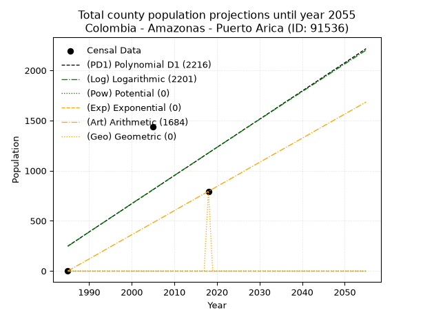
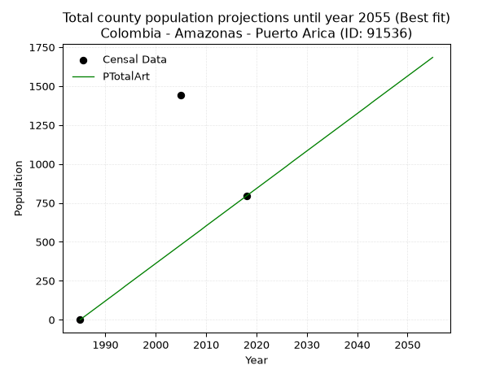
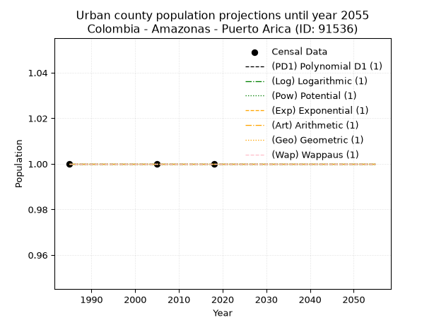
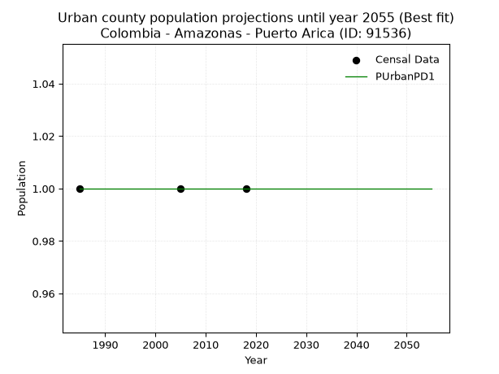
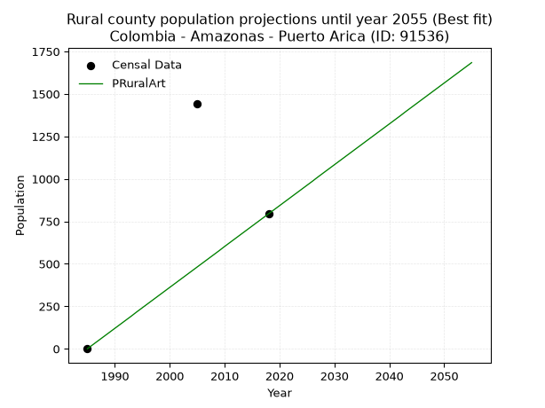

<div align="center">


</div>

# _“Population and Public Services Demand Projections (PPSD) until Year 2050 for Colombia - Amazonas - Puerto Arica (ID: 91536)”_
Keywords: `population` `public-service` `projection` `lineal` `polynomial` `logarithmic` `potential` `exponential` `arithmetic` `geometric` `wappaus` `dane` `colombia` `south-america`

PPSD are analytical estimates used by governments and planners to anticipate future changes in population size, age distribution, and the resulting community needs for utilities, healthcare, education, and infrastructure as sizing future water treatment facilities, electrical grids, and road networks based on spatial growth.

> **General running parameters**: • app_version: _v20260806_. • Python version: _3.14.7_. • Pandas version: _3.0.5_. • NumPy version: _2.5.1_. • Creates, save and include plots into reports (create_plot): _False_. • Projection until year: _2050_. • Process polynomial degree 2 and up: _False_. • Process Wappaus: _True_. • Process Wappaus: _True_. • Set negative values to zero: _True_. • Set infinite values to zero: _True_. • Drop dataset notes: _True_. 
<div align="center">

Dynamic map: [:earth_americas:Google](http://maps.google.com/maps?q=-1.90160005,-71.1522289) [:earth_americas:OSM](https://www.openstreetmap.org/#map=18/-1.90160005/-71.1522289&layers=P) [:earth_americas:Bing](https://www.bing.com/maps?cp=-1.90160005~-71.1522289&lvl=18) [:earth_americas:Apple](https://maps.apple.com/frame?center=-1.90160005%2C-71.1522289&span=0.003%2C0.006)

</div>


<div align="center">

```geojson
{
  "type": "Feature",
  "geometry": {
    "type": "Point", 
    "coordinates": [-71.1522289, -1.90160005]
  }, 
  "properties": {
    "Name": "Colombia - Amazonas - Puerto Arica (ID: 91536)"
  }
}
```

</div>


## 0. Census Data (3 records)

Census data are official statistics collected by a government about the people and housing in a country. They usually include counts of total population, age, sex, race, income, education, and jobs.

📅Global census file: [Population.xlsx](../data/Population.xlsx)

| Source   |   Year |   CountryID | CountryName   |   StateID | StateName   |   CountyID | CountyName   |   PTotal |   PUrban |   PRural |
|:---------|-------:|------------:|:--------------|----------:|:------------|-----------:|:-------------|---------:|---------:|---------:|
| DANE     |   1985 |          57 | Colombia      |        91 | Amazonas    |      91536 | Puerto Arica |        0 |        1 |        0 |
| DANE     |   2005 |          57 | Colombia      |        91 | Amazonas    |      91536 | Puerto Arica |     1440 |        1 |     1440 |
| DANE     |   2018 |          57 | Colombia      |        91 | Amazonas    |      91536 | Puerto Arica |      794 |        1 |      794 |

> 🔥Some records has specific notes about the registered values or the corresponding urban or rural distribution.

## 1. Total

### 1.1. Coefficients and Parameters

* (PD1) Polynomial Deg 1: 28.108564535585455, -55547.41857659914 (lineal)
* (Log) Logarithmic: 56390.20621057267, -427945.63066567195
* (Pow) Potential: nan, nan
* (Exp) Exponential: nan, nan
* (Art) Arithmetic: Year diff. 2018 - 1985 = 33, Population diff. 794 - 0 = 794, Annual growth = 24.060606060606062
* (Geo) Geometric: Year diff. 2018 - 1985 = 33, Population diff. 794 - 0 = 794, Annual growth % = inf
* (Wap) Wappaus: i = 6.0606060606060606, Condition values only valid for < 200)

<sub>
Wappaus condition values: ['0.00', '6.06', '12.12', '18.18', '24.24', '30.30', '36.36', '42.42', '48.48', '54.55', '60.61', '66.67', '72.73', '78.79', '84.85', '90.91', '96.97', '103.03', '109.09', '115.15', '121.21', '127.27', '133.33', '139.39', '145.45', '151.52', '157.58', '163.64', '169.70', '175.76', '181.82', '187.88', '193.94', '200.00', '206.06', '212.12', '218.18', '224.24', '230.30', '236.36', '242.42', '248.48', '254.55', '260.61', '266.67', '272.73', '278.79', '284.85', '290.91', '296.97', '303.03', '309.09', '315.15', '321.21', '327.27', '333.33', '339.39', '345.45', '351.52', '357.58', '363.64', '369.70', '375.76', '381.82', '387.88', '393.94']
</sub>


### 1.2. Projected Dataset

|   Year |   CountyID |   PTotalPD1 |   PTotalLog |   PTotalPow |   PTotalExp |   PTotalArt |   PTotalGeo |
|-------:|-----------:|------------:|------------:|------------:|------------:|------------:|------------:|
|   1985 |      91536 |         248 |         246 |           0 |         nan |           0 |           0 |
|   1986 |      91536 |         276 |         275 |           0 |         nan |          24 |           0 |
|   1987 |      91536 |         304 |         303 |           0 |         nan |          48 |           0 |
|   1988 |      91536 |         332 |         331 |           0 |         nan |          72 |           0 |
|   1989 |      91536 |         361 |         360 |           0 |         nan |          96 |           0 |
|   1990 |      91536 |         389 |         388 |           0 |         nan |         120 |           0 |
|   1991 |      91536 |         417 |         416 |           0 |         nan |         144 |           0 |
|   1992 |      91536 |         445 |         445 |           0 |         nan |         168 |           0 |
|   1993 |      91536 |         473 |         473 |           0 |         nan |         192 |           0 |
|   1994 |      91536 |         501 |         501 |           0 |         nan |         217 |           0 |
|   1995 |      91536 |         529 |         530 |           0 |         nan |         241 |           0 |
|   1996 |      91536 |         557 |         558 |           0 |         nan |         265 |           0 |
|   1997 |      91536 |         585 |         586 |           0 |         nan |         289 |           0 |
|   1998 |      91536 |         613 |         614 |           0 |         nan |         313 |           0 |
|   1999 |      91536 |         642 |         643 |           0 |         nan |         337 |           0 |
|   2000 |      91536 |         670 |         671 |           0 |         nan |         361 |           0 |
|   2001 |      91536 |         698 |         699 |           0 |         nan |         385 |           0 |
|   2002 |      91536 |         726 |         727 |           0 |         nan |         409 |           0 |
|   2003 |      91536 |         754 |         755 |           0 |         nan |         433 |           0 |
|   2004 |      91536 |         782 |         783 |           0 |         nan |         457 |           0 |
|   2005 |      91536 |         810 |         812 |           0 |         nan |         481 |           0 |
|   2006 |      91536 |         838 |         840 |           0 |         nan |         505 |           0 |
|   2007 |      91536 |         866 |         868 |           0 |         nan |         529 |           0 |
|   2008 |      91536 |         895 |         896 |           0 |         nan |         553 |           0 |
|   2009 |      91536 |         923 |         924 |           0 |         nan |         577 |           0 |
|   2010 |      91536 |         951 |         952 |           0 |         nan |         602 |           0 |
|   2011 |      91536 |         979 |         980 |           0 |         nan |         626 |           0 |
|   2012 |      91536 |        1007 |        1008 |           0 |         nan |         650 |           0 |
|   2013 |      91536 |        1035 |        1036 |           0 |         nan |         674 |           0 |
|   2014 |      91536 |        1063 |        1064 |           0 |         nan |         698 |           0 |
|   2015 |      91536 |        1091 |        1092 |           0 |         nan |         722 |           0 |
|   2016 |      91536 |        1119 |        1120 |           0 |         nan |         746 |           0 |
|   2017 |      91536 |        1148 |        1148 |           0 |         nan |         770 |           0 |
|   2018 |      91536 |        1176 |        1176 |           0 |         nan |         794 |         794 |
|   2019 |      91536 |        1204 |        1204 |           0 |         nan |         818 |         inf |
|   2020 |      91536 |        1232 |        1232 |           0 |         nan |         842 |         inf |
|   2021 |      91536 |        1260 |        1260 |           0 |         nan |         866 |         inf |
|   2022 |      91536 |        1288 |        1288 |           0 |         nan |         890 |         inf |
|   2023 |      91536 |        1316 |        1316 |           0 |         nan |         914 |         inf |
|   2024 |      91536 |        1344 |        1343 |           0 |         nan |         938 |         inf |
|   2025 |      91536 |        1372 |        1371 |           0 |         nan |         962 |         inf |
|   2026 |      91536 |        1401 |        1399 |           0 |         nan |         986 |         inf |
|   2027 |      91536 |        1429 |        1427 |           0 |         nan |        1011 |         inf |
|   2028 |      91536 |        1457 |        1455 |           0 |         nan |        1035 |         inf |
|   2029 |      91536 |        1485 |        1483 |           0 |         nan |        1059 |         inf |
|   2030 |      91536 |        1513 |        1510 |           0 |         nan |        1083 |         inf |
|   2031 |      91536 |        1541 |        1538 |           0 |         nan |        1107 |         inf |
|   2032 |      91536 |        1569 |        1566 |           0 |         nan |        1131 |         inf |
|   2033 |      91536 |        1597 |        1594 |           0 |         nan |        1155 |         inf |
|   2034 |      91536 |        1625 |        1621 |           0 |         nan |        1179 |         inf |
|   2035 |      91536 |        1654 |        1649 |           0 |         nan |        1203 |         inf |
|   2036 |      91536 |        1682 |        1677 |           0 |         nan |        1227 |         inf |
|   2037 |      91536 |        1710 |        1705 |           0 |         nan |        1251 |         inf |
|   2038 |      91536 |        1738 |        1732 |           0 |         nan |        1275 |         inf |
|   2039 |      91536 |        1766 |        1760 |           0 |         nan |        1299 |         inf |
|   2040 |      91536 |        1794 |        1788 |           0 |         nan |        1323 |         inf |
|   2041 |      91536 |        1822 |        1815 |           0 |         nan |        1347 |         inf |
|   2042 |      91536 |        1850 |        1843 |           0 |         nan |        1371 |         inf |
|   2043 |      91536 |        1878 |        1870 |           0 |         nan |        1396 |         inf |
|   2044 |      91536 |        1906 |        1898 |           0 |         nan |        1420 |         inf |
|   2045 |      91536 |        1935 |        1926 |           0 |         nan |        1444 |         inf |
|   2046 |      91536 |        1963 |        1953 |           0 |         nan |        1468 |         inf |
|   2047 |      91536 |        1991 |        1981 |           0 |         nan |        1492 |         inf |
|   2048 |      91536 |        2019 |        2008 |           0 |         nan |        1516 |         inf |
|   2049 |      91536 |        2047 |        2036 |           0 |         nan |        1540 |         inf |
|   2050 |      91536 |        2075 |        2063 |           0 |         nan |        1564 |         inf |
<div align="center">

</img>

</div>


### 1.3. Best fit with absolute error and relative error (%)

Relative error puts that difference into context by dividing the absolute error by the true value, creating a unitless ratio or percentage that shows the scale of the mistake.

Absolute and relative error

|   Year | Source   |   CountryID | CountryName   |   StateID | StateName   |   CountyID_x | CountyName   |   PTotal |   PUrban |   PRural |   CountyID_y |   PTotalPD1 |   PTotalLog |   PTotalPow |   PTotalExp |   PTotalArt |   PTotalGeo |   PTotalPD1AbsError |   PTotalLogAbsError |   PTotalPowAbsError |   PTotalExpAbsError |   PTotalArtAbsError |   PTotalGeoAbsError |   PTotalPD1RelError |   PTotalLogRelError |   PTotalPowRelError |   PTotalExpRelError |   PTotalArtRelError |   PTotalGeoRelError |
|-------:|:---------|------------:|:--------------|----------:|:------------|-------------:|:-------------|---------:|---------:|---------:|-------------:|------------:|------------:|------------:|------------:|------------:|------------:|--------------------:|--------------------:|--------------------:|--------------------:|--------------------:|--------------------:|--------------------:|--------------------:|--------------------:|--------------------:|--------------------:|--------------------:|
|   1985 | DANE     |          57 | Colombia      |        91 | Amazonas    |        91536 | Puerto Arica |        0 |        1 |        0 |        91536 |         248 |         246 |           0 |         nan |           0 |           0 |                 248 |                 246 |                   0 |                 nan |                   0 |                   0 |            inf      |            inf      |                 nan |                 nan |            nan      |                 nan |
|   2005 | DANE     |          57 | Colombia      |        91 | Amazonas    |        91536 | Puerto Arica |     1440 |        1 |     1440 |        91536 |         810 |         812 |           0 |         nan |         481 |           0 |                 630 |                 628 |                1440 |                 nan |                 959 |                1440 |             43.75   |             43.6111 |                 100 |                 nan |             66.5972 |                 100 |
|   2018 | DANE     |          57 | Colombia      |        91 | Amazonas    |        91536 | Puerto Arica |      794 |        1 |      794 |        91536 |        1176 |        1176 |           0 |         nan |         794 |         794 |                 382 |                 382 |                 794 |                 nan |                   0 |                   0 |             48.1108 |             48.1108 |                 100 |                 nan |              0      |                   0 |

Relative error mean

| Method    |   RelError | Best   |
|:----------|-----------:|:-------|
| PTotalPD1 |   inf      |        |
| PTotalLog |   inf      |        |
| PTotalPow |   100      |        |
| PTotalExp |   nan      |        |
| PTotalArt |    33.2986 | True   |
| PTotalGeo |    50      |        |

💙Best method: _**PTotalArt**_
<div align="center">

</img>

</div>


### 1.4. Fresh water supply demand in liters per capita per day (lpcd)

The fresh water supply demand typically ranges from 100 to 300 liters per capita per day (lpcd) for standard domestic and municipal planning, though absolute survival minimums set by the World Health Organization are as low as 7.5 to 20 liters per day, and total consumption in high-income nations can exceed 400 liters.

> `CZ`: Level in meters above the sea level (masl).<br> `WS`: Fresh water supply demand in liters per capita per day (lpcd or l/h/d).<br> `WSAll`: Zonal fresh water supply demand in liters per second (l/s).<br> `A`: Zonal area in square meters.

Reference values (RAS Colombia)

|    CZ |   WS |
|------:|-----:|
|  1000 |  120 |
|  2000 |  130 |
| 99999 |  140 |

County shapefile geometry properties and water supply values

|   CountyID |      ATotal |   CZTotal |   WSTotal |
|-----------:|------------:|----------:|----------:|
|      91536 | 1.35235e+10 |   125.378 |       120 |

Projected values for best method: PTotalArt

|   CountyID |   Year |   PTotalArt |   WSTotal |   WSTotalAll |
|-----------:|-------:|------------:|----------:|-------------:|
|      91536 |   1985 |           0 |       120 |    0         |
|      91536 |   1986 |          24 |       120 |    0.0333333 |
|      91536 |   1987 |          48 |       120 |    0.0666667 |
|      91536 |   1988 |          72 |       120 |    0.1       |
|      91536 |   1989 |          96 |       120 |    0.133333  |
|      91536 |   1990 |         120 |       120 |    0.166667  |
|      91536 |   1991 |         144 |       120 |    0.2       |
|      91536 |   1992 |         168 |       120 |    0.233333  |
|      91536 |   1993 |         192 |       120 |    0.266667  |
|      91536 |   1994 |         217 |       120 |    0.301389  |
|      91536 |   1995 |         241 |       120 |    0.334722  |
|      91536 |   1996 |         265 |       120 |    0.368056  |
|      91536 |   1997 |         289 |       120 |    0.401389  |
|      91536 |   1998 |         313 |       120 |    0.434722  |
|      91536 |   1999 |         337 |       120 |    0.468056  |
|      91536 |   2000 |         361 |       120 |    0.501389  |
|      91536 |   2001 |         385 |       120 |    0.534722  |
|      91536 |   2002 |         409 |       120 |    0.568056  |
|      91536 |   2003 |         433 |       120 |    0.601389  |
|      91536 |   2004 |         457 |       120 |    0.634722  |
|      91536 |   2005 |         481 |       120 |    0.668056  |
|      91536 |   2006 |         505 |       120 |    0.701389  |
|      91536 |   2007 |         529 |       120 |    0.734722  |
|      91536 |   2008 |         553 |       120 |    0.768056  |
|      91536 |   2009 |         577 |       120 |    0.801389  |
|      91536 |   2010 |         602 |       120 |    0.836111  |
|      91536 |   2011 |         626 |       120 |    0.869444  |
|      91536 |   2012 |         650 |       120 |    0.902778  |
|      91536 |   2013 |         674 |       120 |    0.936111  |
|      91536 |   2014 |         698 |       120 |    0.969444  |
|      91536 |   2015 |         722 |       120 |    1.00278   |
|      91536 |   2016 |         746 |       120 |    1.03611   |
|      91536 |   2017 |         770 |       120 |    1.06944   |
|      91536 |   2018 |         794 |       120 |    1.10278   |
|      91536 |   2019 |         818 |       120 |    1.13611   |
|      91536 |   2020 |         842 |       120 |    1.16944   |
|      91536 |   2021 |         866 |       120 |    1.20278   |
|      91536 |   2022 |         890 |       120 |    1.23611   |
|      91536 |   2023 |         914 |       120 |    1.26944   |
|      91536 |   2024 |         938 |       120 |    1.30278   |
|      91536 |   2025 |         962 |       120 |    1.33611   |
|      91536 |   2026 |         986 |       120 |    1.36944   |
|      91536 |   2027 |        1011 |       120 |    1.40417   |
|      91536 |   2028 |        1035 |       120 |    1.4375    |
|      91536 |   2029 |        1059 |       120 |    1.47083   |
|      91536 |   2030 |        1083 |       120 |    1.50417   |
|      91536 |   2031 |        1107 |       120 |    1.5375    |
|      91536 |   2032 |        1131 |       120 |    1.57083   |
|      91536 |   2033 |        1155 |       120 |    1.60417   |
|      91536 |   2034 |        1179 |       120 |    1.6375    |
|      91536 |   2035 |        1203 |       120 |    1.67083   |
|      91536 |   2036 |        1227 |       120 |    1.70417   |
|      91536 |   2037 |        1251 |       120 |    1.7375    |
|      91536 |   2038 |        1275 |       120 |    1.77083   |
|      91536 |   2039 |        1299 |       120 |    1.80417   |
|      91536 |   2040 |        1323 |       120 |    1.8375    |
|      91536 |   2041 |        1347 |       120 |    1.87083   |
|      91536 |   2042 |        1371 |       120 |    1.90417   |
|      91536 |   2043 |        1396 |       120 |    1.93889   |
|      91536 |   2044 |        1420 |       120 |    1.97222   |
|      91536 |   2045 |        1444 |       120 |    2.00556   |
|      91536 |   2046 |        1468 |       120 |    2.03889   |
|      91536 |   2047 |        1492 |       120 |    2.07222   |
|      91536 |   2048 |        1516 |       120 |    2.10556   |
|      91536 |   2049 |        1540 |       120 |    2.13889   |
|      91536 |   2050 |        1564 |       120 |    2.17222   |

## 2. Urban

### 2.1. Coefficients and Parameters

* (PD1) Polynomial Deg 1: -1.552800494883905e-18, 1.000000000000003 (lineal)
* (Log) Logarithmic: 9.649371307553518e-15, 0.9999999999999262
* (Pow) Potential: 0.0, 0.0
* (Exp) Exponential: 0.0, 1.0
* (Art) Arithmetic: Year diff. 2018 - 1985 = 33, Population diff. 1 - 1 = 0, Annual growth = 0.0
* (Geo) Geometric: Year diff. 2018 - 1985 = 33, Population diff. 1 - 1 = 0, Annual growth % = 0.0
* (Wap) Wappaus: i = 0.0, Condition values only valid for < 200)

<sub>
Wappaus condition values: ['0.00', '0.00', '0.00', '0.00', '0.00', '0.00', '0.00', '0.00', '0.00', '0.00', '0.00', '0.00', '0.00', '0.00', '0.00', '0.00', '0.00', '0.00', '0.00', '0.00', '0.00', '0.00', '0.00', '0.00', '0.00', '0.00', '0.00', '0.00', '0.00', '0.00', '0.00', '0.00', '0.00', '0.00', '0.00', '0.00', '0.00', '0.00', '0.00', '0.00', '0.00', '0.00', '0.00', '0.00', '0.00', '0.00', '0.00', '0.00', '0.00', '0.00', '0.00', '0.00', '0.00', '0.00', '0.00', '0.00', '0.00', '0.00', '0.00', '0.00', '0.00', '0.00', '0.00', '0.00', '0.00', '0.00']
</sub>


### 2.2. Projected Dataset

|   Year |   CountyID |   PUrbanPD1 |   PUrbanLog |   PUrbanPow |   PUrbanExp |   PUrbanArt |   PUrbanGeo |   PUrbanWap |
|-------:|-----------:|------------:|------------:|------------:|------------:|------------:|------------:|------------:|
|   1985 |      91536 |           1 |           1 |           1 |           1 |           1 |           1 |           1 |
|   1986 |      91536 |           1 |           1 |           1 |           1 |           1 |           1 |           1 |
|   1987 |      91536 |           1 |           1 |           1 |           1 |           1 |           1 |           1 |
|   1988 |      91536 |           1 |           1 |           1 |           1 |           1 |           1 |           1 |
|   1989 |      91536 |           1 |           1 |           1 |           1 |           1 |           1 |           1 |
|   1990 |      91536 |           1 |           1 |           1 |           1 |           1 |           1 |           1 |
|   1991 |      91536 |           1 |           1 |           1 |           1 |           1 |           1 |           1 |
|   1992 |      91536 |           1 |           1 |           1 |           1 |           1 |           1 |           1 |
|   1993 |      91536 |           1 |           1 |           1 |           1 |           1 |           1 |           1 |
|   1994 |      91536 |           1 |           1 |           1 |           1 |           1 |           1 |           1 |
|   1995 |      91536 |           1 |           1 |           1 |           1 |           1 |           1 |           1 |
|   1996 |      91536 |           1 |           1 |           1 |           1 |           1 |           1 |           1 |
|   1997 |      91536 |           1 |           1 |           1 |           1 |           1 |           1 |           1 |
|   1998 |      91536 |           1 |           1 |           1 |           1 |           1 |           1 |           1 |
|   1999 |      91536 |           1 |           1 |           1 |           1 |           1 |           1 |           1 |
|   2000 |      91536 |           1 |           1 |           1 |           1 |           1 |           1 |           1 |
|   2001 |      91536 |           1 |           1 |           1 |           1 |           1 |           1 |           1 |
|   2002 |      91536 |           1 |           1 |           1 |           1 |           1 |           1 |           1 |
|   2003 |      91536 |           1 |           1 |           1 |           1 |           1 |           1 |           1 |
|   2004 |      91536 |           1 |           1 |           1 |           1 |           1 |           1 |           1 |
|   2005 |      91536 |           1 |           1 |           1 |           1 |           1 |           1 |           1 |
|   2006 |      91536 |           1 |           1 |           1 |           1 |           1 |           1 |           1 |
|   2007 |      91536 |           1 |           1 |           1 |           1 |           1 |           1 |           1 |
|   2008 |      91536 |           1 |           1 |           1 |           1 |           1 |           1 |           1 |
|   2009 |      91536 |           1 |           1 |           1 |           1 |           1 |           1 |           1 |
|   2010 |      91536 |           1 |           1 |           1 |           1 |           1 |           1 |           1 |
|   2011 |      91536 |           1 |           1 |           1 |           1 |           1 |           1 |           1 |
|   2012 |      91536 |           1 |           1 |           1 |           1 |           1 |           1 |           1 |
|   2013 |      91536 |           1 |           1 |           1 |           1 |           1 |           1 |           1 |
|   2014 |      91536 |           1 |           1 |           1 |           1 |           1 |           1 |           1 |
|   2015 |      91536 |           1 |           1 |           1 |           1 |           1 |           1 |           1 |
|   2016 |      91536 |           1 |           1 |           1 |           1 |           1 |           1 |           1 |
|   2017 |      91536 |           1 |           1 |           1 |           1 |           1 |           1 |           1 |
|   2018 |      91536 |           1 |           1 |           1 |           1 |           1 |           1 |           1 |
|   2019 |      91536 |           1 |           1 |           1 |           1 |           1 |           1 |           1 |
|   2020 |      91536 |           1 |           1 |           1 |           1 |           1 |           1 |           1 |
|   2021 |      91536 |           1 |           1 |           1 |           1 |           1 |           1 |           1 |
|   2022 |      91536 |           1 |           1 |           1 |           1 |           1 |           1 |           1 |
|   2023 |      91536 |           1 |           1 |           1 |           1 |           1 |           1 |           1 |
|   2024 |      91536 |           1 |           1 |           1 |           1 |           1 |           1 |           1 |
|   2025 |      91536 |           1 |           1 |           1 |           1 |           1 |           1 |           1 |
|   2026 |      91536 |           1 |           1 |           1 |           1 |           1 |           1 |           1 |
|   2027 |      91536 |           1 |           1 |           1 |           1 |           1 |           1 |           1 |
|   2028 |      91536 |           1 |           1 |           1 |           1 |           1 |           1 |           1 |
|   2029 |      91536 |           1 |           1 |           1 |           1 |           1 |           1 |           1 |
|   2030 |      91536 |           1 |           1 |           1 |           1 |           1 |           1 |           1 |
|   2031 |      91536 |           1 |           1 |           1 |           1 |           1 |           1 |           1 |
|   2032 |      91536 |           1 |           1 |           1 |           1 |           1 |           1 |           1 |
|   2033 |      91536 |           1 |           1 |           1 |           1 |           1 |           1 |           1 |
|   2034 |      91536 |           1 |           1 |           1 |           1 |           1 |           1 |           1 |
|   2035 |      91536 |           1 |           1 |           1 |           1 |           1 |           1 |           1 |
|   2036 |      91536 |           1 |           1 |           1 |           1 |           1 |           1 |           1 |
|   2037 |      91536 |           1 |           1 |           1 |           1 |           1 |           1 |           1 |
|   2038 |      91536 |           1 |           1 |           1 |           1 |           1 |           1 |           1 |
|   2039 |      91536 |           1 |           1 |           1 |           1 |           1 |           1 |           1 |
|   2040 |      91536 |           1 |           1 |           1 |           1 |           1 |           1 |           1 |
|   2041 |      91536 |           1 |           1 |           1 |           1 |           1 |           1 |           1 |
|   2042 |      91536 |           1 |           1 |           1 |           1 |           1 |           1 |           1 |
|   2043 |      91536 |           1 |           1 |           1 |           1 |           1 |           1 |           1 |
|   2044 |      91536 |           1 |           1 |           1 |           1 |           1 |           1 |           1 |
|   2045 |      91536 |           1 |           1 |           1 |           1 |           1 |           1 |           1 |
|   2046 |      91536 |           1 |           1 |           1 |           1 |           1 |           1 |           1 |
|   2047 |      91536 |           1 |           1 |           1 |           1 |           1 |           1 |           1 |
|   2048 |      91536 |           1 |           1 |           1 |           1 |           1 |           1 |           1 |
|   2049 |      91536 |           1 |           1 |           1 |           1 |           1 |           1 |           1 |
|   2050 |      91536 |           1 |           1 |           1 |           1 |           1 |           1 |           1 |
<div align="center">

</img>

</div>


### 2.3. Best fit with absolute error and relative error (%)

Relative error puts that difference into context by dividing the absolute error by the true value, creating a unitless ratio or percentage that shows the scale of the mistake.

Absolute and relative error

|   Year | Source   |   CountryID | CountryName   |   StateID | StateName   |   CountyID_x | CountyName   |   PTotal |   PUrban |   PRural |   CountyID_y |   PUrbanPD1 |   PUrbanLog |   PUrbanPow |   PUrbanExp |   PUrbanArt |   PUrbanGeo |   PUrbanWap |   PUrbanPD1AbsError |   PUrbanLogAbsError |   PUrbanPowAbsError |   PUrbanExpAbsError |   PUrbanArtAbsError |   PUrbanGeoAbsError |   PUrbanWapAbsError |   PUrbanPD1RelError |   PUrbanLogRelError |   PUrbanPowRelError |   PUrbanExpRelError |   PUrbanArtRelError |   PUrbanGeoRelError |   PUrbanWapRelError |
|-------:|:---------|------------:|:--------------|----------:|:------------|-------------:|:-------------|---------:|---------:|---------:|-------------:|------------:|------------:|------------:|------------:|------------:|------------:|------------:|--------------------:|--------------------:|--------------------:|--------------------:|--------------------:|--------------------:|--------------------:|--------------------:|--------------------:|--------------------:|--------------------:|--------------------:|--------------------:|--------------------:|
|   1985 | DANE     |          57 | Colombia      |        91 | Amazonas    |        91536 | Puerto Arica |        0 |        1 |        0 |        91536 |           1 |           1 |           1 |           1 |           1 |           1 |           1 |                   0 |                   0 |                   0 |                   0 |                   0 |                   0 |                   0 |                   0 |                   0 |                   0 |                   0 |                   0 |                   0 |                   0 |
|   2005 | DANE     |          57 | Colombia      |        91 | Amazonas    |        91536 | Puerto Arica |     1440 |        1 |     1440 |        91536 |           1 |           1 |           1 |           1 |           1 |           1 |           1 |                   0 |                   0 |                   0 |                   0 |                   0 |                   0 |                   0 |                   0 |                   0 |                   0 |                   0 |                   0 |                   0 |                   0 |
|   2018 | DANE     |          57 | Colombia      |        91 | Amazonas    |        91536 | Puerto Arica |      794 |        1 |      794 |        91536 |           1 |           1 |           1 |           1 |           1 |           1 |           1 |                   0 |                   0 |                   0 |                   0 |                   0 |                   0 |                   0 |                   0 |                   0 |                   0 |                   0 |                   0 |                   0 |                   0 |

Relative error mean

| Method    |   RelError | Best   |
|:----------|-----------:|:-------|
| PUrbanPD1 |          0 | True   |
| PUrbanLog |          0 | True   |
| PUrbanPow |          0 | True   |
| PUrbanExp |          0 | True   |
| PUrbanArt |          0 | True   |
| PUrbanGeo |          0 | True   |
| PUrbanWap |          0 | True   |

💙Best method: _**PUrbanPD1**_
<div align="center">

</img>

</div>


### 2.4. Fresh water supply demand in liters per capita per day (lpcd)

The fresh water supply demand typically ranges from 100 to 300 liters per capita per day (lpcd) for standard domestic and municipal planning, though absolute survival minimums set by the World Health Organization are as low as 7.5 to 20 liters per day, and total consumption in high-income nations can exceed 400 liters.

> `CZ`: Level in meters above the sea level (masl).<br> `WS`: Fresh water supply demand in liters per capita per day (lpcd or l/h/d).<br> `WSAll`: Zonal fresh water supply demand in liters per second (l/s).<br> `A`: Zonal area in square meters.

Reference values (RAS Colombia)

|    CZ |   WS |
|------:|-----:|
|  1000 |  120 |
|  2000 |  130 |
| 99999 |  140 |

County shapefile geometry properties and water supply values

|   CountyID |   AUrban |   CZUrban |   WSUrban |
|-----------:|---------:|----------:|----------:|
|      91536 |        0 |         0 |       120 |

Projected values for best method: PUrbanPD1

|   CountyID |   Year |   PUrbanPD1 |   WSUrban |   WSUrbanAll |
|-----------:|-------:|------------:|----------:|-------------:|
|      91536 |   1985 |           1 |       120 |   0.00138889 |
|      91536 |   1986 |           1 |       120 |   0.00138889 |
|      91536 |   1987 |           1 |       120 |   0.00138889 |
|      91536 |   1988 |           1 |       120 |   0.00138889 |
|      91536 |   1989 |           1 |       120 |   0.00138889 |
|      91536 |   1990 |           1 |       120 |   0.00138889 |
|      91536 |   1991 |           1 |       120 |   0.00138889 |
|      91536 |   1992 |           1 |       120 |   0.00138889 |
|      91536 |   1993 |           1 |       120 |   0.00138889 |
|      91536 |   1994 |           1 |       120 |   0.00138889 |
|      91536 |   1995 |           1 |       120 |   0.00138889 |
|      91536 |   1996 |           1 |       120 |   0.00138889 |
|      91536 |   1997 |           1 |       120 |   0.00138889 |
|      91536 |   1998 |           1 |       120 |   0.00138889 |
|      91536 |   1999 |           1 |       120 |   0.00138889 |
|      91536 |   2000 |           1 |       120 |   0.00138889 |
|      91536 |   2001 |           1 |       120 |   0.00138889 |
|      91536 |   2002 |           1 |       120 |   0.00138889 |
|      91536 |   2003 |           1 |       120 |   0.00138889 |
|      91536 |   2004 |           1 |       120 |   0.00138889 |
|      91536 |   2005 |           1 |       120 |   0.00138889 |
|      91536 |   2006 |           1 |       120 |   0.00138889 |
|      91536 |   2007 |           1 |       120 |   0.00138889 |
|      91536 |   2008 |           1 |       120 |   0.00138889 |
|      91536 |   2009 |           1 |       120 |   0.00138889 |
|      91536 |   2010 |           1 |       120 |   0.00138889 |
|      91536 |   2011 |           1 |       120 |   0.00138889 |
|      91536 |   2012 |           1 |       120 |   0.00138889 |
|      91536 |   2013 |           1 |       120 |   0.00138889 |
|      91536 |   2014 |           1 |       120 |   0.00138889 |
|      91536 |   2015 |           1 |       120 |   0.00138889 |
|      91536 |   2016 |           1 |       120 |   0.00138889 |
|      91536 |   2017 |           1 |       120 |   0.00138889 |
|      91536 |   2018 |           1 |       120 |   0.00138889 |
|      91536 |   2019 |           1 |       120 |   0.00138889 |
|      91536 |   2020 |           1 |       120 |   0.00138889 |
|      91536 |   2021 |           1 |       120 |   0.00138889 |
|      91536 |   2022 |           1 |       120 |   0.00138889 |
|      91536 |   2023 |           1 |       120 |   0.00138889 |
|      91536 |   2024 |           1 |       120 |   0.00138889 |
|      91536 |   2025 |           1 |       120 |   0.00138889 |
|      91536 |   2026 |           1 |       120 |   0.00138889 |
|      91536 |   2027 |           1 |       120 |   0.00138889 |
|      91536 |   2028 |           1 |       120 |   0.00138889 |
|      91536 |   2029 |           1 |       120 |   0.00138889 |
|      91536 |   2030 |           1 |       120 |   0.00138889 |
|      91536 |   2031 |           1 |       120 |   0.00138889 |
|      91536 |   2032 |           1 |       120 |   0.00138889 |
|      91536 |   2033 |           1 |       120 |   0.00138889 |
|      91536 |   2034 |           1 |       120 |   0.00138889 |
|      91536 |   2035 |           1 |       120 |   0.00138889 |
|      91536 |   2036 |           1 |       120 |   0.00138889 |
|      91536 |   2037 |           1 |       120 |   0.00138889 |
|      91536 |   2038 |           1 |       120 |   0.00138889 |
|      91536 |   2039 |           1 |       120 |   0.00138889 |
|      91536 |   2040 |           1 |       120 |   0.00138889 |
|      91536 |   2041 |           1 |       120 |   0.00138889 |
|      91536 |   2042 |           1 |       120 |   0.00138889 |
|      91536 |   2043 |           1 |       120 |   0.00138889 |
|      91536 |   2044 |           1 |       120 |   0.00138889 |
|      91536 |   2045 |           1 |       120 |   0.00138889 |
|      91536 |   2046 |           1 |       120 |   0.00138889 |
|      91536 |   2047 |           1 |       120 |   0.00138889 |
|      91536 |   2048 |           1 |       120 |   0.00138889 |
|      91536 |   2049 |           1 |       120 |   0.00138889 |
|      91536 |   2050 |           1 |       120 |   0.00138889 |

## 3. Rural

### 3.1. Coefficients and Parameters

* (PD1) Polynomial Deg 1: 28.108564535585455, -55547.41857659914 (lineal)
* (Log) Logarithmic: 56390.20621057267, -427945.63066567195
* (Pow) Potential: nan, nan
* (Exp) Exponential: nan, nan
* (Art) Arithmetic: Year diff. 2018 - 1985 = 33, Population diff. 794 - 0 = 794, Annual growth = 24.060606060606062
* (Geo) Geometric: Year diff. 2018 - 1985 = 33, Population diff. 794 - 0 = 794, Annual growth % = inf
* (Wap) Wappaus: i = 6.0606060606060606, Condition values only valid for < 200)

<sub>
Wappaus condition values: ['0.00', '6.06', '12.12', '18.18', '24.24', '30.30', '36.36', '42.42', '48.48', '54.55', '60.61', '66.67', '72.73', '78.79', '84.85', '90.91', '96.97', '103.03', '109.09', '115.15', '121.21', '127.27', '133.33', '139.39', '145.45', '151.52', '157.58', '163.64', '169.70', '175.76', '181.82', '187.88', '193.94', '200.00', '206.06', '212.12', '218.18', '224.24', '230.30', '236.36', '242.42', '248.48', '254.55', '260.61', '266.67', '272.73', '278.79', '284.85', '290.91', '296.97', '303.03', '309.09', '315.15', '321.21', '327.27', '333.33', '339.39', '345.45', '351.52', '357.58', '363.64', '369.70', '375.76', '381.82', '387.88', '393.94']
</sub>


### 3.2. Projected Dataset

|   Year |   CountyID |   PRuralPD1 |   PRuralLog |   PRuralPow |   PRuralExp |   PRuralArt |   PRuralGeo |
|-------:|-----------:|------------:|------------:|------------:|------------:|------------:|------------:|
|   1985 |      91536 |         248 |         246 |           0 |         nan |           0 |           0 |
|   1986 |      91536 |         276 |         275 |           0 |         nan |          24 |           0 |
|   1987 |      91536 |         304 |         303 |           0 |         nan |          48 |           0 |
|   1988 |      91536 |         332 |         331 |           0 |         nan |          72 |           0 |
|   1989 |      91536 |         361 |         360 |           0 |         nan |          96 |           0 |
|   1990 |      91536 |         389 |         388 |           0 |         nan |         120 |           0 |
|   1991 |      91536 |         417 |         416 |           0 |         nan |         144 |           0 |
|   1992 |      91536 |         445 |         445 |           0 |         nan |         168 |           0 |
|   1993 |      91536 |         473 |         473 |           0 |         nan |         192 |           0 |
|   1994 |      91536 |         501 |         501 |           0 |         nan |         217 |           0 |
|   1995 |      91536 |         529 |         530 |           0 |         nan |         241 |           0 |
|   1996 |      91536 |         557 |         558 |           0 |         nan |         265 |           0 |
|   1997 |      91536 |         585 |         586 |           0 |         nan |         289 |           0 |
|   1998 |      91536 |         613 |         614 |           0 |         nan |         313 |           0 |
|   1999 |      91536 |         642 |         643 |           0 |         nan |         337 |           0 |
|   2000 |      91536 |         670 |         671 |           0 |         nan |         361 |           0 |
|   2001 |      91536 |         698 |         699 |           0 |         nan |         385 |           0 |
|   2002 |      91536 |         726 |         727 |           0 |         nan |         409 |           0 |
|   2003 |      91536 |         754 |         755 |           0 |         nan |         433 |           0 |
|   2004 |      91536 |         782 |         783 |           0 |         nan |         457 |           0 |
|   2005 |      91536 |         810 |         812 |           0 |         nan |         481 |           0 |
|   2006 |      91536 |         838 |         840 |           0 |         nan |         505 |           0 |
|   2007 |      91536 |         866 |         868 |           0 |         nan |         529 |           0 |
|   2008 |      91536 |         895 |         896 |           0 |         nan |         553 |           0 |
|   2009 |      91536 |         923 |         924 |           0 |         nan |         577 |           0 |
|   2010 |      91536 |         951 |         952 |           0 |         nan |         602 |           0 |
|   2011 |      91536 |         979 |         980 |           0 |         nan |         626 |           0 |
|   2012 |      91536 |        1007 |        1008 |           0 |         nan |         650 |           0 |
|   2013 |      91536 |        1035 |        1036 |           0 |         nan |         674 |           0 |
|   2014 |      91536 |        1063 |        1064 |           0 |         nan |         698 |           0 |
|   2015 |      91536 |        1091 |        1092 |           0 |         nan |         722 |           0 |
|   2016 |      91536 |        1119 |        1120 |           0 |         nan |         746 |           0 |
|   2017 |      91536 |        1148 |        1148 |           0 |         nan |         770 |           0 |
|   2018 |      91536 |        1176 |        1176 |           0 |         nan |         794 |         794 |
|   2019 |      91536 |        1204 |        1204 |           0 |         nan |         818 |         inf |
|   2020 |      91536 |        1232 |        1232 |           0 |         nan |         842 |         inf |
|   2021 |      91536 |        1260 |        1260 |           0 |         nan |         866 |         inf |
|   2022 |      91536 |        1288 |        1288 |           0 |         nan |         890 |         inf |
|   2023 |      91536 |        1316 |        1316 |           0 |         nan |         914 |         inf |
|   2024 |      91536 |        1344 |        1343 |           0 |         nan |         938 |         inf |
|   2025 |      91536 |        1372 |        1371 |           0 |         nan |         962 |         inf |
|   2026 |      91536 |        1401 |        1399 |           0 |         nan |         986 |         inf |
|   2027 |      91536 |        1429 |        1427 |           0 |         nan |        1011 |         inf |
|   2028 |      91536 |        1457 |        1455 |           0 |         nan |        1035 |         inf |
|   2029 |      91536 |        1485 |        1483 |           0 |         nan |        1059 |         inf |
|   2030 |      91536 |        1513 |        1510 |           0 |         nan |        1083 |         inf |
|   2031 |      91536 |        1541 |        1538 |           0 |         nan |        1107 |         inf |
|   2032 |      91536 |        1569 |        1566 |           0 |         nan |        1131 |         inf |
|   2033 |      91536 |        1597 |        1594 |           0 |         nan |        1155 |         inf |
|   2034 |      91536 |        1625 |        1621 |           0 |         nan |        1179 |         inf |
|   2035 |      91536 |        1654 |        1649 |           0 |         nan |        1203 |         inf |
|   2036 |      91536 |        1682 |        1677 |           0 |         nan |        1227 |         inf |
|   2037 |      91536 |        1710 |        1705 |           0 |         nan |        1251 |         inf |
|   2038 |      91536 |        1738 |        1732 |           0 |         nan |        1275 |         inf |
|   2039 |      91536 |        1766 |        1760 |           0 |         nan |        1299 |         inf |
|   2040 |      91536 |        1794 |        1788 |           0 |         nan |        1323 |         inf |
|   2041 |      91536 |        1822 |        1815 |           0 |         nan |        1347 |         inf |
|   2042 |      91536 |        1850 |        1843 |           0 |         nan |        1371 |         inf |
|   2043 |      91536 |        1878 |        1870 |           0 |         nan |        1396 |         inf |
|   2044 |      91536 |        1906 |        1898 |           0 |         nan |        1420 |         inf |
|   2045 |      91536 |        1935 |        1926 |           0 |         nan |        1444 |         inf |
|   2046 |      91536 |        1963 |        1953 |           0 |         nan |        1468 |         inf |
|   2047 |      91536 |        1991 |        1981 |           0 |         nan |        1492 |         inf |
|   2048 |      91536 |        2019 |        2008 |           0 |         nan |        1516 |         inf |
|   2049 |      91536 |        2047 |        2036 |           0 |         nan |        1540 |         inf |
|   2050 |      91536 |        2075 |        2063 |           0 |         nan |        1564 |         inf |
<div align="center">

</img>

</div>


### 3.3. Best fit with absolute error and relative error (%)

Relative error puts that difference into context by dividing the absolute error by the true value, creating a unitless ratio or percentage that shows the scale of the mistake.

Absolute and relative error

|   Year | Source   |   CountryID | CountryName   |   StateID | StateName   |   CountyID_x | CountyName   |   PTotal |   PUrban |   PRural |   CountyID_y |   PRuralPD1 |   PRuralLog |   PRuralPow |   PRuralExp |   PRuralArt |   PRuralGeo |   PRuralPD1AbsError |   PRuralLogAbsError |   PRuralPowAbsError |   PRuralExpAbsError |   PRuralArtAbsError |   PRuralGeoAbsError |   PRuralPD1RelError |   PRuralLogRelError |   PRuralPowRelError |   PRuralExpRelError |   PRuralArtRelError |   PRuralGeoRelError |
|-------:|:---------|------------:|:--------------|----------:|:------------|-------------:|:-------------|---------:|---------:|---------:|-------------:|------------:|------------:|------------:|------------:|------------:|------------:|--------------------:|--------------------:|--------------------:|--------------------:|--------------------:|--------------------:|--------------------:|--------------------:|--------------------:|--------------------:|--------------------:|--------------------:|
|   1985 | DANE     |          57 | Colombia      |        91 | Amazonas    |        91536 | Puerto Arica |        0 |        1 |        0 |        91536 |         248 |         246 |           0 |         nan |           0 |           0 |                 248 |                 246 |                   0 |                 nan |                   0 |                   0 |            inf      |            inf      |                 nan |                 nan |            nan      |                 nan |
|   2005 | DANE     |          57 | Colombia      |        91 | Amazonas    |        91536 | Puerto Arica |     1440 |        1 |     1440 |        91536 |         810 |         812 |           0 |         nan |         481 |           0 |                 630 |                 628 |                1440 |                 nan |                 959 |                1440 |             43.75   |             43.6111 |                 100 |                 nan |             66.5972 |                 100 |
|   2018 | DANE     |          57 | Colombia      |        91 | Amazonas    |        91536 | Puerto Arica |      794 |        1 |      794 |        91536 |        1176 |        1176 |           0 |         nan |         794 |         794 |                 382 |                 382 |                 794 |                 nan |                   0 |                   0 |             48.1108 |             48.1108 |                 100 |                 nan |              0      |                   0 |

Relative error mean

| Method    |   RelError | Best   |
|:----------|-----------:|:-------|
| PRuralPD1 |   inf      |        |
| PRuralLog |   inf      |        |
| PRuralPow |   100      |        |
| PRuralExp |   nan      |        |
| PRuralArt |    33.2986 | True   |
| PRuralGeo |    50      |        |

💙Best method: _**PRuralArt**_
<div align="center">

</img>

</div>


### 3.4. Fresh water supply demand in liters per capita per day (lpcd)

The fresh water supply demand typically ranges from 100 to 300 liters per capita per day (lpcd) for standard domestic and municipal planning, though absolute survival minimums set by the World Health Organization are as low as 7.5 to 20 liters per day, and total consumption in high-income nations can exceed 400 liters.

> `CZ`: Level in meters above the sea level (masl).<br> `WS`: Fresh water supply demand in liters per capita per day (lpcd or l/h/d).<br> `WSAll`: Zonal fresh water supply demand in liters per second (l/s).<br> `A`: Zonal area in square meters.

Reference values (RAS Colombia)

|    CZ |   WS |
|------:|-----:|
|  1000 |  120 |
|  2000 |  130 |
| 99999 |  140 |

County shapefile geometry properties and water supply values

|   CountyID |      ARural |   CZRural |   WSRural |
|-----------:|------------:|----------:|----------:|
|      91536 | 1.35235e+10 |   125.378 |       120 |

Projected values for best method: PRuralArt

|   CountyID |   Year |   PRuralArt |   WSRural |   WSRuralAll |
|-----------:|-------:|------------:|----------:|-------------:|
|      91536 |   1985 |           0 |       120 |    0         |
|      91536 |   1986 |          24 |       120 |    0.0333333 |
|      91536 |   1987 |          48 |       120 |    0.0666667 |
|      91536 |   1988 |          72 |       120 |    0.1       |
|      91536 |   1989 |          96 |       120 |    0.133333  |
|      91536 |   1990 |         120 |       120 |    0.166667  |
|      91536 |   1991 |         144 |       120 |    0.2       |
|      91536 |   1992 |         168 |       120 |    0.233333  |
|      91536 |   1993 |         192 |       120 |    0.266667  |
|      91536 |   1994 |         217 |       120 |    0.301389  |
|      91536 |   1995 |         241 |       120 |    0.334722  |
|      91536 |   1996 |         265 |       120 |    0.368056  |
|      91536 |   1997 |         289 |       120 |    0.401389  |
|      91536 |   1998 |         313 |       120 |    0.434722  |
|      91536 |   1999 |         337 |       120 |    0.468056  |
|      91536 |   2000 |         361 |       120 |    0.501389  |
|      91536 |   2001 |         385 |       120 |    0.534722  |
|      91536 |   2002 |         409 |       120 |    0.568056  |
|      91536 |   2003 |         433 |       120 |    0.601389  |
|      91536 |   2004 |         457 |       120 |    0.634722  |
|      91536 |   2005 |         481 |       120 |    0.668056  |
|      91536 |   2006 |         505 |       120 |    0.701389  |
|      91536 |   2007 |         529 |       120 |    0.734722  |
|      91536 |   2008 |         553 |       120 |    0.768056  |
|      91536 |   2009 |         577 |       120 |    0.801389  |
|      91536 |   2010 |         602 |       120 |    0.836111  |
|      91536 |   2011 |         626 |       120 |    0.869444  |
|      91536 |   2012 |         650 |       120 |    0.902778  |
|      91536 |   2013 |         674 |       120 |    0.936111  |
|      91536 |   2014 |         698 |       120 |    0.969444  |
|      91536 |   2015 |         722 |       120 |    1.00278   |
|      91536 |   2016 |         746 |       120 |    1.03611   |
|      91536 |   2017 |         770 |       120 |    1.06944   |
|      91536 |   2018 |         794 |       120 |    1.10278   |
|      91536 |   2019 |         818 |       120 |    1.13611   |
|      91536 |   2020 |         842 |       120 |    1.16944   |
|      91536 |   2021 |         866 |       120 |    1.20278   |
|      91536 |   2022 |         890 |       120 |    1.23611   |
|      91536 |   2023 |         914 |       120 |    1.26944   |
|      91536 |   2024 |         938 |       120 |    1.30278   |
|      91536 |   2025 |         962 |       120 |    1.33611   |
|      91536 |   2026 |         986 |       120 |    1.36944   |
|      91536 |   2027 |        1011 |       120 |    1.40417   |
|      91536 |   2028 |        1035 |       120 |    1.4375    |
|      91536 |   2029 |        1059 |       120 |    1.47083   |
|      91536 |   2030 |        1083 |       120 |    1.50417   |
|      91536 |   2031 |        1107 |       120 |    1.5375    |
|      91536 |   2032 |        1131 |       120 |    1.57083   |
|      91536 |   2033 |        1155 |       120 |    1.60417   |
|      91536 |   2034 |        1179 |       120 |    1.6375    |
|      91536 |   2035 |        1203 |       120 |    1.67083   |
|      91536 |   2036 |        1227 |       120 |    1.70417   |
|      91536 |   2037 |        1251 |       120 |    1.7375    |
|      91536 |   2038 |        1275 |       120 |    1.77083   |
|      91536 |   2039 |        1299 |       120 |    1.80417   |
|      91536 |   2040 |        1323 |       120 |    1.8375    |
|      91536 |   2041 |        1347 |       120 |    1.87083   |
|      91536 |   2042 |        1371 |       120 |    1.90417   |
|      91536 |   2043 |        1396 |       120 |    1.93889   |
|      91536 |   2044 |        1420 |       120 |    1.97222   |
|      91536 |   2045 |        1444 |       120 |    2.00556   |
|      91536 |   2046 |        1468 |       120 |    2.03889   |
|      91536 |   2047 |        1492 |       120 |    2.07222   |
|      91536 |   2048 |        1516 |       120 |    2.10556   |
|      91536 |   2049 |        1540 |       120 |    2.13889   |
|      91536 |   2050 |        1564 |       120 |    2.17222   |

<div align="center"><br><sub>Share this research</sub></div><br>

<sub>**APPS & TOOLS & CONTENT DISCLAIMER**: • NO WARRANTY - This content and software is provided by <a href="https://github.com/rcfdtools" target="_blank">github.com/rcfdtools</a> "as is", without any express or implied warranty, including warranties of merchantability, fitness for a particular purpose, or non-infringement. There is no guarantee that the software will be error-free or operate without interruption. • LIMITATION OF LIABILITY - Neither the authors nor copyright holders will be liable for claims or damages arising from the software or its use. You are responsible for determining if the software is appropriate for your use and assume all associated risks, including errors, legal compliance, and data loss. • NO PROFESSIONAL ADVICE - The software provides general information and does not offer professional advice. It should not replace consultation with professional advisors. [Clauses and global license for rcfdtools use.](https://github.com/rcfdtools/rcfdtools/blob/main/LICENSE.md)</sub>