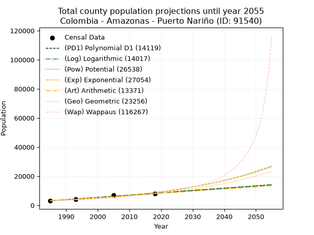
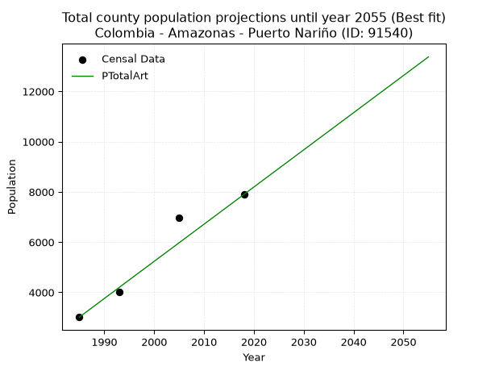
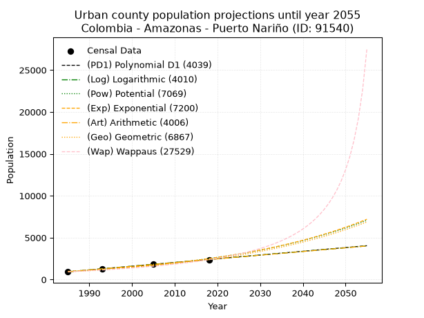
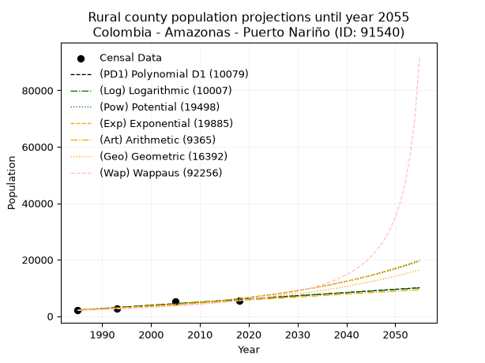

<div align="center">


</div>

# 📜 _“Population and Public Services Demand Projections (PPSD) until Year 2050 for Colombia - Amazonas - Puerto Nariño (ID: 91540)”_
Keywords: `population` `public-service` `projection` `lineal` `polynomial` `logarithmic` `potential` `exponential` `arithmetic` `geometric` `wappaus` `dane` `colombia` `south-america`

PPSD are analytical estimates used by governments and planners to anticipate future changes in population size, age distribution, and the resulting community needs for utilities, healthcare, education, and infrastructure as sizing future water treatment facilities, electrical grids, and road networks based on spatial growth.

<div align="center">

</img>

</div>


> **General running parameters**: • app_version: _v20260806_. • Python version: _3.14.7_. • Pandas version: _3.0.5_. • NumPy version: _2.5.1_. • Creates, save and include plots into reports (create_plot): _False_. • Projection until year: _2050_. • Process polynomial degree 2 and up: _False_. • Process Wappaus: _True_. • Process Wappaus: _True_. • Set negative values to zero: _True_. • Set infinite values to zero: _True_. • Drop dataset notes: _True_. 
<div align="center">

Maps & GIS Layers: [:earth_americas:Google](http://maps.google.com/maps?q=-3.77993431,-70.3649365) [:earth_americas:OSM](https://www.openstreetmap.org/#map=18/-3.77993431/-70.3649365&layers=P) [:earth_americas:Bing](https://www.bing.com/maps?cp=-3.77993431~-70.3649365&lvl=18) [:earth_americas:Apple](https://maps.apple.com/frame?center=-3.77993431%2C-70.3649365&span=0.003%2C0.006) [:earth_americas:GISMobile](https://github.com/rcfdtools/R.GISMobile/blob/main/file/gis/CountyLayer_CO/Readme.md)

</div>


<div align="center">

```geojson
{
  "type": "Feature",
  "geometry": {
    "type": "Point", 
    "coordinates": [-70.3649365, -3.77993431]
  }, 
  "properties": {
    "Name": "Colombia - Amazonas - Puerto Nariño (ID: 91540)"
  }
}
```

</div>


## 0. Census Data (4 records)

Census data are official statistics collected by a government about the people and housing in a country. They usually include counts of total population, age, sex, race, income, education, and jobs.

📅Global census file: [Population.xlsx](../data/Population.xlsx)

| Source   |   Year |   CountryID | CountryName   |   StateID | StateName   |   CountyID | CountyName    |   PTotal |   PUrban |   PRural |
|:---------|-------:|------------:|:--------------|----------:|:------------|-----------:|:--------------|---------:|---------:|---------:|
| DANE     |   1985 |          57 | Colombia      |        91 | Amazonas    |      91540 | Puerto Nariño |     3013 |      922 |     2091 |
| DANE     |   1993 |          57 | Colombia      |        91 | Amazonas    |      91540 | Puerto Nariño |     4008 |     1266 |     2742 |
| DANE     |   2005 |          57 | Colombia      |        91 | Amazonas    |      91540 | Puerto Nariño |     6983 |     1848 |     5135 |
| DANE     |   2018 |          57 | Colombia      |        91 | Amazonas    |      91540 | Puerto Nariño |     7896 |     2376 |     5520 |

> 🔥Some records could had specific notes about the registered values or the corresponding urban or rural distribution.

📅[SUI-RUPS](https://www.datos.gov.co/Hacienda-y-Cr-dito-P-blico/Registro-nico-de-Prestadores-de-Servicios-P-blicos/4qkq-csdn/about_data) - Local public utility companies: [RUPS.csv](../data/RUPS.csv)

 | SERVICIO       | ESTADO    | NOMBRE                     | NIT         | DEPARTAMENTO_DOMICILIO   | MUNICIPIO_DOMICILIO   | DIRECCION                 |   TELEFONO | EMAIL                                    | TIPO_PRESTADOR                 | CLASIFICACION                 |
|:---------------|:----------|:---------------------------|:------------|:-------------------------|:----------------------|:--------------------------|-----------:|:-----------------------------------------|:-------------------------------|:------------------------------|
| ACUEDUCTO      | OPERATIVA | MUNICIPIO DE PUERTO NARIÑO | 800103161-2 | AMAZONAS                 | PUERTO NARINO         | CALLE 5 CON CRA 6 ESQUINA |    5927323 | contactenos@puertonarino-amazonas.gov.co | MUNICIPIO (PRESTACIÓN DIRECTA) | MENOR O IGUAL A 2500 USUARIOS |
| ALCANTARILLADO | OPERATIVA | MUNICIPIO DE PUERTO NARIÑO | 800103161-2 | AMAZONAS                 | PUERTO NARINO         | CALLE 5 CON CRA 6 ESQUINA |    5927323 | contactenos@puertonarino-amazonas.gov.co | MUNICIPIO (PRESTACIÓN DIRECTA) | MENOR O IGUAL A 2500 USUARIOS |

## 1. Total

### 1.1. Coefficients and Parameters

* (PD1) Polynomial Deg 1: 157.87555198715305, -310315.5728623028 (lineal)
* (Log) Logarithmic: 316113.1553686238, -2397303.627128756
* (Pow) Potential: 61.181312309391195, -198.25830774396783
* (Exp) Exponential: 0.03054909710397244, 1.4720365101730192e-23
* (Art) Arithmetic: Year diff. 2018 - 1985 = 33, Population diff. 7896 - 3013 = 4883, Annual growth = 147.96969696969697
* (Geo) Geometric: Year diff. 2018 - 1985 = 33, Population diff. 7896 - 3013 = 4883, Annual growth % = 0.029624885142745416
* (Wap) Wappaus: i = 2.712800384447648, Condition values only valid for < 200)

<sub>
Wappaus condition values: ['0.00', '2.71', '5.43', '8.14', '10.85', '13.56', '16.28', '18.99', '21.70', '24.42', '27.13', '29.84', '32.55', '35.27', '37.98', '40.69', '43.40', '46.12', '48.83', '51.54', '54.26', '56.97', '59.68', '62.39', '65.11', '67.82', '70.53', '73.25', '75.96', '78.67', '81.38', '84.10', '86.81', '89.52', '92.24', '94.95', '97.66', '100.37', '103.09', '105.80', '108.51', '111.22', '113.94', '116.65', '119.36', '122.08', '124.79', '127.50', '130.21', '132.93', '135.64', '138.35', '141.07', '143.78', '146.49', '149.20', '151.92', '154.63', '157.34', '160.06', '162.77', '165.48', '168.19', '170.91', '173.62', '176.33']
</sub>


### 1.2. Projected Dataset

|   Year |   CountyID |   PTotalPD1 |   PTotalLog |   PTotalPow |   PTotalExp |   PTotalArt |   PTotalGeo |   PTotalWap |
|-------:|-----------:|------------:|------------:|------------:|------------:|------------:|------------:|------------:|
|   1985 |      91540 |        3067 |        3062 |        3184 |        3188 |        3013 |        3013 |        3013 |
|   1986 |      91540 |        3225 |        3221 |        3284 |        3287 |        3161 |        3102 |        3096 |
|   1987 |      91540 |        3383 |        3380 |        3387 |        3389 |        3309 |        3194 |        3181 |
|   1988 |      91540 |        3541 |        3539 |        3492 |        3494 |        3457 |        3289 |        3269 |
|   1989 |      91540 |        3699 |        3698 |        3602 |        3602 |        3605 |        3386 |        3359 |
|   1990 |      91540 |        3857 |        3857 |        3714 |        3714 |        3753 |        3487 |        3451 |
|   1991 |      91540 |        4015 |        4016 |        3830 |        3829 |        3901 |        3590 |        3547 |
|   1992 |      91540 |        4173 |        4175 |        3950 |        3948 |        4049 |        3696 |        3645 |
|   1993 |      91540 |        4330 |        4333 |        4073 |        4071 |        4197 |        3806 |        3746 |
|   1994 |      91540 |        4488 |        4492 |        4200 |        4197 |        4345 |        3918 |        3851 |
|   1995 |      91540 |        4646 |        4650 |        4330 |        4327 |        4493 |        4034 |        3959 |
|   1996 |      91540 |        4804 |        4809 |        4465 |        4461 |        4641 |        4154 |        4070 |
|   1997 |      91540 |        4962 |        4967 |        4604 |        4600 |        4789 |        4277 |        4185 |
|   1998 |      91540 |        5120 |        5125 |        4747 |        4742 |        4937 |        4404 |        4303 |
|   1999 |      91540 |        5278 |        5284 |        4895 |        4889 |        5085 |        4534 |        4426 |
|   2000 |      91540 |        5436 |        5442 |        5047 |        5041 |        5233 |        4669 |        4552 |
|   2001 |      91540 |        5593 |        5600 |        5204 |        5197 |        5381 |        4807 |        4683 |
|   2002 |      91540 |        5751 |        5758 |        5365 |        5359 |        5528 |        4949 |        4819 |
|   2003 |      91540 |        5909 |        5915 |        5532 |        5525 |        5676 |        5096 |        4960 |
|   2004 |      91540 |        6067 |        6073 |        5703 |        5696 |        5824 |        5247 |        5105 |
|   2005 |      91540 |        6225 |        6231 |        5880 |        5873 |        5972 |        5402 |        5256 |
|   2006 |      91540 |        6383 |        6389 |        6062 |        6055 |        6120 |        5562 |        5413 |
|   2007 |      91540 |        6541 |        6546 |        6250 |        6243 |        6268 |        5727 |        5576 |
|   2008 |      91540 |        6699 |        6704 |        6443 |        6437 |        6416 |        5897 |        5745 |
|   2009 |      91540 |        6856 |        6861 |        6643 |        6636 |        6564 |        6071 |        5922 |
|   2010 |      91540 |        7014 |        7018 |        6848 |        6842 |        6712 |        6251 |        6105 |
|   2011 |      91540 |        7172 |        7175 |        7060 |        7055 |        6860 |        6437 |        6296 |
|   2012 |      91540 |        7330 |        7333 |        7278 |        7273 |        7008 |        6627 |        6495 |
|   2013 |      91540 |        7488 |        7490 |        7502 |        7499 |        7156 |        6824 |        6703 |
|   2014 |      91540 |        7646 |        7647 |        7734 |        7732 |        7304 |        7026 |        6920 |
|   2015 |      91540 |        7804 |        7804 |        7972 |        7971 |        7452 |        7234 |        7148 |
|   2016 |      91540 |        7962 |        7960 |        8218 |        8219 |        7600 |        7448 |        7385 |
|   2017 |      91540 |        8119 |        8117 |        8471 |        8474 |        7748 |        7669 |        7635 |
|   2018 |      91540 |        8277 |        8274 |        8732 |        8737 |        7896 |        7896 |        7896 |
|   2019 |      91540 |        8435 |        8431 |        9001 |        9008 |        8044 |        8130 |        8171 |
|   2020 |      91540 |        8593 |        8587 |        9277 |        9287 |        8192 |        8371 |        8459 |
|   2021 |      91540 |        8751 |        8744 |        9563 |        9575 |        8340 |        8619 |        8764 |
|   2022 |      91540 |        8909 |        8900 |        9856 |        9872 |        8488 |        8874 |        9084 |
|   2023 |      91540 |        9067 |        9056 |       10159 |       10178 |        8636 |        9137 |        9423 |
|   2024 |      91540 |        9225 |        9212 |       10471 |       10494 |        8784 |        9408 |        9781 |
|   2025 |      91540 |        9382 |        9369 |       10792 |       10820 |        8932 |        9686 |       10160 |
|   2026 |      91540 |        9540 |        9525 |       11123 |       11155 |        9080 |        9973 |       10563 |
|   2027 |      91540 |        9698 |        9681 |       11464 |       11501 |        9228 |       10269 |       10991 |
|   2028 |      91540 |        9856 |        9837 |       11815 |       11858 |        9376 |       10573 |       11447 |
|   2029 |      91540 |       10014 |        9992 |       12177 |       12226 |        9524 |       10886 |       11933 |
|   2030 |      91540 |       10172 |       10148 |       12550 |       12605 |        9672 |       11209 |       12453 |
|   2031 |      91540 |       10330 |       10304 |       12934 |       12996 |        9820 |       11541 |       13011 |
|   2032 |      91540 |       10488 |       10459 |       13329 |       13399 |        9968 |       11883 |       13611 |
|   2033 |      91540 |       10645 |       10615 |       13737 |       13815 |       10116 |       12235 |       14257 |
|   2034 |      91540 |       10803 |       10770 |       14156 |       14243 |       10264 |       12597 |       14956 |
|   2035 |      91540 |       10961 |       10926 |       14588 |       14685 |       10411 |       12970 |       15713 |
|   2036 |      91540 |       11119 |       11081 |       15033 |       15141 |       10559 |       13355 |       16537 |
|   2037 |      91540 |       11277 |       11236 |       15492 |       15611 |       10707 |       13750 |       17437 |
|   2038 |      91540 |       11435 |       11391 |       15964 |       16095 |       10855 |       14158 |       18424 |
|   2039 |      91540 |       11593 |       11547 |       16451 |       16594 |       11003 |       14577 |       19510 |
|   2040 |      91540 |       11751 |       11702 |       16952 |       17109 |       11151 |       15009 |       20713 |
|   2041 |      91540 |       11908 |       11856 |       17468 |       17640 |       11299 |       15453 |       22052 |
|   2042 |      91540 |       12066 |       12011 |       17999 |       18187 |       11447 |       15911 |       23551 |
|   2043 |      91540 |       12224 |       12166 |       18546 |       18751 |       11595 |       16383 |       25240 |
|   2044 |      91540 |       12382 |       12321 |       19110 |       19333 |       11743 |       16868 |       27159 |
|   2045 |      91540 |       12540 |       12475 |       19690 |       19932 |       11891 |       17368 |       29357 |
|   2046 |      91540 |       12698 |       12630 |       20288 |       20551 |       12039 |       17882 |       31901 |
|   2047 |      91540 |       12856 |       12784 |       20904 |       21188 |       12187 |       18412 |       34879 |
|   2048 |      91540 |       13014 |       12939 |       21538 |       21845 |       12335 |       18957 |       38412 |
|   2049 |      91540 |       13171 |       13093 |       22191 |       22523 |       12483 |       19519 |       42672 |
|   2050 |      91540 |       13329 |       13247 |       22863 |       23222 |       12631 |       20097 |       47908 |
<div align="center">

</img>

</div>


### 1.3. Best fit with absolute and relative error (%)

Relative error puts that difference into context by dividing the absolute error by the true value, creating a unitless ratio or percentage that shows the scale of the mistake.

Absolute and relative error

|   Year | Source   |   CountryID | CountryName   |   StateID | StateName   |   CountyID_x | CountyName    |   PTotal |   PUrban |   PRural |   CountyID_y |   PTotalPD1 |   PTotalLog |   PTotalPow |   PTotalExp |   PTotalArt |   PTotalGeo |   PTotalWap |   PTotalPD1AbsError |   PTotalLogAbsError |   PTotalPowAbsError |   PTotalExpAbsError |   PTotalArtAbsError |   PTotalGeoAbsError |   PTotalWapAbsError |   PTotalPD1RelError |   PTotalLogRelError |   PTotalPowRelError |   PTotalExpRelError |   PTotalArtRelError |   PTotalGeoRelError |   PTotalWapRelError |
|-------:|:---------|------------:|:--------------|----------:|:------------|-------------:|:--------------|---------:|---------:|---------:|-------------:|------------:|------------:|------------:|------------:|------------:|------------:|------------:|--------------------:|--------------------:|--------------------:|--------------------:|--------------------:|--------------------:|--------------------:|--------------------:|--------------------:|--------------------:|--------------------:|--------------------:|--------------------:|--------------------:|
|   1985 | DANE     |          57 | Colombia      |        91 | Amazonas    |        91540 | Puerto Nariño |     3013 |      922 |     2091 |        91540 |        3067 |        3062 |        3184 |        3188 |        3013 |        3013 |        3013 |                  54 |                  49 |                 171 |                 175 |                   0 |                   0 |                   0 |             1.79223 |             1.62629 |             5.67541 |             5.80816 |             0       |             0       |             0       |
|   1993 | DANE     |          57 | Colombia      |        91 | Amazonas    |        91540 | Puerto Nariño |     4008 |     1266 |     2742 |        91540 |        4330 |        4333 |        4073 |        4071 |        4197 |        3806 |        3746 |                 322 |                 325 |                  65 |                  63 |                 189 |                 202 |                 262 |             8.03393 |             8.10878 |             1.62176 |             1.57186 |             4.71557 |             5.03992 |             6.53693 |
|   2005 | DANE     |          57 | Colombia      |        91 | Amazonas    |        91540 | Puerto Nariño |     6983 |     1848 |     5135 |        91540 |        6225 |        6231 |        5880 |        5873 |        5972 |        5402 |        5256 |                 758 |                 752 |                1103 |                1110 |                1011 |                1581 |                1727 |            10.8549  |            10.769   |            15.7955  |            15.8957  |            14.478   |            22.6407  |            24.7315  |
|   2018 | DANE     |          57 | Colombia      |        91 | Amazonas    |        91540 | Puerto Nariño |     7896 |     2376 |     5520 |        91540 |        8277 |        8274 |        8732 |        8737 |        7896 |        7896 |        7896 |                 381 |                 378 |                 836 |                 841 |                   0 |                   0 |                   0 |             4.82523 |             4.78723 |            10.5876  |            10.651   |             0       |             0       |             0       |

Relative error mean

| Method    |   RelError | Best   |
|:----------|-----------:|:-------|
| PTotalPD1 |    6.37658 |        |
| PTotalLog |    6.32283 |        |
| PTotalPow |    8.42008 |        |
| PTotalExp |    8.48168 |        |
| PTotalArt |    4.7984  | True   |
| PTotalGeo |    6.92015 |        |
| PTotalWap |    7.8171  |        |

💙Best method: _**PTotalArt**_
<div align="center">

</img>

</div>


### 1.4. Fresh water supply demand in liters per capita per day (lpcd)

The fresh water supply demand typically ranges from 100 to 300 liters per capita per day (lpcd) for standard domestic and municipal planning, though absolute survival minimums set by the World Health Organization are as low as 7.5 to 20 liters per day, and total consumption in high-income nations can exceed 400 liters.

> `CZ`: Level in meters above the sea level (masl)<br> `WS`: Fresh water supply demand in liters per capita per day (lpcd or l/h/d)<br> `WSAll`: Zonal fresh water supply demand in liters per second (l/s)<br> `A`: Zonal area in square meters<br> `DP`: Population density (people/hectare or p/ha)

Reference values (RAS Colombia)

|    CZ |   WS |
|------:|-----:|
|  1000 |  120 |
|  2000 |  130 |
| 99999 |  140 |

County shapefile geometry properties and water supply values

|   CountyID |      ATotal |   CZTotal |   WSTotal |
|-----------:|------------:|----------:|----------:|
|      91540 | 1.45558e+09 |   108.696 |       120 |

Projected values for best method: PTotalArt

|   CountyID |   Year |   PTotalArt |   DPTotal |   WSTotal |   WSTotalAll |
|-----------:|-------:|------------:|----------:|----------:|-------------:|
|      91540 |   1985 |        3013 |      0.02 |       120 |      4.18472 |
|      91540 |   1986 |        3161 |      0.02 |       120 |      4.39028 |
|      91540 |   1987 |        3309 |      0.02 |       120 |      4.59583 |
|      91540 |   1988 |        3457 |      0.02 |       120 |      4.80139 |
|      91540 |   1989 |        3605 |      0.02 |       120 |      5.00694 |
|      91540 |   1990 |        3753 |      0.03 |       120 |      5.2125  |
|      91540 |   1991 |        3901 |      0.03 |       120 |      5.41806 |
|      91540 |   1992 |        4049 |      0.03 |       120 |      5.62361 |
|      91540 |   1993 |        4197 |      0.03 |       120 |      5.82917 |
|      91540 |   1994 |        4345 |      0.03 |       120 |      6.03472 |
|      91540 |   1995 |        4493 |      0.03 |       120 |      6.24028 |
|      91540 |   1996 |        4641 |      0.03 |       120 |      6.44583 |
|      91540 |   1997 |        4789 |      0.03 |       120 |      6.65139 |
|      91540 |   1998 |        4937 |      0.03 |       120 |      6.85694 |
|      91540 |   1999 |        5085 |      0.03 |       120 |      7.0625  |
|      91540 |   2000 |        5233 |      0.04 |       120 |      7.26806 |
|      91540 |   2001 |        5381 |      0.04 |       120 |      7.47361 |
|      91540 |   2002 |        5528 |      0.04 |       120 |      7.67778 |
|      91540 |   2003 |        5676 |      0.04 |       120 |      7.88333 |
|      91540 |   2004 |        5824 |      0.04 |       120 |      8.08889 |
|      91540 |   2005 |        5972 |      0.04 |       120 |      8.29444 |
|      91540 |   2006 |        6120 |      0.04 |       120 |      8.5     |
|      91540 |   2007 |        6268 |      0.04 |       120 |      8.70556 |
|      91540 |   2008 |        6416 |      0.04 |       120 |      8.91111 |
|      91540 |   2009 |        6564 |      0.05 |       120 |      9.11667 |
|      91540 |   2010 |        6712 |      0.05 |       120 |      9.32222 |
|      91540 |   2011 |        6860 |      0.05 |       120 |      9.52778 |
|      91540 |   2012 |        7008 |      0.05 |       120 |      9.73333 |
|      91540 |   2013 |        7156 |      0.05 |       120 |      9.93889 |
|      91540 |   2014 |        7304 |      0.05 |       120 |     10.1444  |
|      91540 |   2015 |        7452 |      0.05 |       120 |     10.35    |
|      91540 |   2016 |        7600 |      0.05 |       120 |     10.5556  |
|      91540 |   2017 |        7748 |      0.05 |       120 |     10.7611  |
|      91540 |   2018 |        7896 |      0.05 |       120 |     10.9667  |
|      91540 |   2019 |        8044 |      0.06 |       120 |     11.1722  |
|      91540 |   2020 |        8192 |      0.06 |       120 |     11.3778  |
|      91540 |   2021 |        8340 |      0.06 |       120 |     11.5833  |
|      91540 |   2022 |        8488 |      0.06 |       120 |     11.7889  |
|      91540 |   2023 |        8636 |      0.06 |       120 |     11.9944  |
|      91540 |   2024 |        8784 |      0.06 |       120 |     12.2     |
|      91540 |   2025 |        8932 |      0.06 |       120 |     12.4056  |
|      91540 |   2026 |        9080 |      0.06 |       120 |     12.6111  |
|      91540 |   2027 |        9228 |      0.06 |       120 |     12.8167  |
|      91540 |   2028 |        9376 |      0.06 |       120 |     13.0222  |
|      91540 |   2029 |        9524 |      0.07 |       120 |     13.2278  |
|      91540 |   2030 |        9672 |      0.07 |       120 |     13.4333  |
|      91540 |   2031 |        9820 |      0.07 |       120 |     13.6389  |
|      91540 |   2032 |        9968 |      0.07 |       120 |     13.8444  |
|      91540 |   2033 |       10116 |      0.07 |       120 |     14.05    |
|      91540 |   2034 |       10264 |      0.07 |       120 |     14.2556  |
|      91540 |   2035 |       10411 |      0.07 |       120 |     14.4597  |
|      91540 |   2036 |       10559 |      0.07 |       120 |     14.6653  |
|      91540 |   2037 |       10707 |      0.07 |       120 |     14.8708  |
|      91540 |   2038 |       10855 |      0.07 |       120 |     15.0764  |
|      91540 |   2039 |       11003 |      0.08 |       120 |     15.2819  |
|      91540 |   2040 |       11151 |      0.08 |       120 |     15.4875  |
|      91540 |   2041 |       11299 |      0.08 |       120 |     15.6931  |
|      91540 |   2042 |       11447 |      0.08 |       120 |     15.8986  |
|      91540 |   2043 |       11595 |      0.08 |       120 |     16.1042  |
|      91540 |   2044 |       11743 |      0.08 |       120 |     16.3097  |
|      91540 |   2045 |       11891 |      0.08 |       120 |     16.5153  |
|      91540 |   2046 |       12039 |      0.08 |       120 |     16.7208  |
|      91540 |   2047 |       12187 |      0.08 |       120 |     16.9264  |
|      91540 |   2048 |       12335 |      0.08 |       120 |     17.1319  |
|      91540 |   2049 |       12483 |      0.09 |       120 |     17.3375  |
|      91540 |   2050 |       12631 |      0.09 |       120 |     17.5431  |

## 2. Urban

### 2.1. Coefficients and Parameters

* (PD1) Polynomial Deg 1: 44.50100361300647, -87410.13247691619 (lineal)
* (Log) Logarithmic: 89078.83134859921, -675485.9109136575
* (Pow) Potential: 57.25352815467568, -185.82081012631684
* (Exp) Exponential: 0.028593531911167726, 2.1792020556815765e-22
* (Art) Arithmetic: Year diff. 2018 - 1985 = 33, Population diff. 2376 - 922 = 1454, Annual growth = 44.06060606060606
* (Geo) Geometric: Year diff. 2018 - 1985 = 33, Population diff. 2376 - 922 = 1454, Annual growth % = 0.029101108296045952
* (Wap) Wappaus: i = 2.671959130418803, Condition values only valid for < 200)

<sub>
Wappaus condition values: ['0.00', '2.67', '5.34', '8.02', '10.69', '13.36', '16.03', '18.70', '21.38', '24.05', '26.72', '29.39', '32.06', '34.74', '37.41', '40.08', '42.75', '45.42', '48.10', '50.77', '53.44', '56.11', '58.78', '61.46', '64.13', '66.80', '69.47', '72.14', '74.81', '77.49', '80.16', '82.83', '85.50', '88.17', '90.85', '93.52', '96.19', '98.86', '101.53', '104.21', '106.88', '109.55', '112.22', '114.89', '117.57', '120.24', '122.91', '125.58', '128.25', '130.93', '133.60', '136.27', '138.94', '141.61', '144.29', '146.96', '149.63', '152.30', '154.97', '157.65', '160.32', '162.99', '165.66', '168.33', '171.01', '173.68']
</sub>


### 2.2. Projected Dataset

|   Year |   CountyID |   PUrbanPD1 |   PUrbanLog |   PUrbanPow |   PUrbanExp |   PUrbanArt |   PUrbanGeo |   PUrbanWap |
|-------:|-----------:|------------:|------------:|------------:|------------:|------------:|------------:|------------:|
|   1985 |      91540 |         924 |         923 |         972 |         973 |         922 |         922 |         922 |
|   1986 |      91540 |         969 |         968 |        1000 |        1001 |         966 |         949 |         947 |
|   1987 |      91540 |        1013 |        1013 |        1030 |        1030 |        1010 |         976 |         973 |
|   1988 |      91540 |        1058 |        1058 |        1060 |        1060 |        1054 |        1005 |         999 |
|   1989 |      91540 |        1102 |        1102 |        1091 |        1091 |        1098 |        1034 |        1026 |
|   1990 |      91540 |        1147 |        1147 |        1122 |        1122 |        1142 |        1064 |        1054 |
|   1991 |      91540 |        1191 |        1192 |        1155 |        1155 |        1186 |        1095 |        1083 |
|   1992 |      91540 |        1236 |        1237 |        1189 |        1188 |        1230 |        1127 |        1112 |
|   1993 |      91540 |        1280 |        1281 |        1224 |        1223 |        1274 |        1160 |        1143 |
|   1994 |      91540 |        1325 |        1326 |        1259 |        1258 |        1319 |        1194 |        1174 |
|   1995 |      91540 |        1369 |        1371 |        1296 |        1295 |        1363 |        1228 |        1206 |
|   1996 |      91540 |        1414 |        1415 |        1334 |        1332 |        1407 |        1264 |        1240 |
|   1997 |      91540 |        1458 |        1460 |        1372 |        1371 |        1451 |        1301 |        1274 |
|   1998 |      91540 |        1503 |        1504 |        1412 |        1411 |        1495 |        1339 |        1310 |
|   1999 |      91540 |        1547 |        1549 |        1453 |        1452 |        1539 |        1378 |        1346 |
|   2000 |      91540 |        1592 |        1594 |        1496 |        1494 |        1583 |        1418 |        1384 |
|   2001 |      91540 |        1636 |        1638 |        1539 |        1537 |        1627 |        1459 |        1423 |
|   2002 |      91540 |        1681 |        1683 |        1584 |        1582 |        1671 |        1501 |        1464 |
|   2003 |      91540 |        1725 |        1727 |        1630 |        1628 |        1715 |        1545 |        1506 |
|   2004 |      91540 |        1770 |        1772 |        1677 |        1675 |        1759 |        1590 |        1549 |
|   2005 |      91540 |        1814 |        1816 |        1725 |        1724 |        1803 |        1636 |        1594 |
|   2006 |      91540 |        1859 |        1860 |        1775 |        1774 |        1847 |        1684 |        1641 |
|   2007 |      91540 |        1903 |        1905 |        1827 |        1825 |        1891 |        1733 |        1690 |
|   2008 |      91540 |        1948 |        1949 |        1880 |        1878 |        1935 |        1783 |        1740 |
|   2009 |      91540 |        1992 |        1994 |        1934 |        1932 |        1979 |        1835 |        1792 |
|   2010 |      91540 |        2037 |        2038 |        1990 |        1988 |        2024 |        1889 |        1847 |
|   2011 |      91540 |        2081 |        2082 |        2047 |        2046 |        2068 |        1944 |        1903 |
|   2012 |      91540 |        2126 |        2126 |        2106 |        2105 |        2112 |        2000 |        1962 |
|   2013 |      91540 |        2170 |        2171 |        2167 |        2166 |        2156 |        2059 |        2024 |
|   2014 |      91540 |        2215 |        2215 |        2230 |        2229 |        2200 |        2118 |        2088 |
|   2015 |      91540 |        2259 |        2259 |        2294 |        2294 |        2244 |        2180 |        2155 |
|   2016 |      91540 |        2304 |        2303 |        2360 |        2361 |        2288 |        2244 |        2226 |
|   2017 |      91540 |        2348 |        2348 |        2428 |        2429 |        2332 |        2309 |        2299 |
|   2018 |      91540 |        2393 |        2392 |        2498 |        2499 |        2376 |        2376 |        2376 |
|   2019 |      91540 |        2437 |        2436 |        2570 |        2572 |        2420 |        2445 |        2457 |
|   2020 |      91540 |        2482 |        2480 |        2644 |        2647 |        2464 |        2516 |        2542 |
|   2021 |      91540 |        2526 |        2524 |        2720 |        2723 |        2508 |        2590 |        2631 |
|   2022 |      91540 |        2571 |        2568 |        2798 |        2802 |        2552 |        2665 |        2725 |
|   2023 |      91540 |        2615 |        2612 |        2878 |        2884 |        2596 |        2742 |        2823 |
|   2024 |      91540 |        2660 |        2656 |        2961 |        2967 |        2640 |        2822 |        2928 |
|   2025 |      91540 |        2704 |        2700 |        3046 |        3053 |        2684 |        2904 |        3038 |
|   2026 |      91540 |        2749 |        2744 |        3133 |        3142 |        2728 |        2989 |        3155 |
|   2027 |      91540 |        2793 |        2788 |        3223 |        3233 |        2773 |        3076 |        3280 |
|   2028 |      91540 |        2838 |        2832 |        3315 |        3327 |        2817 |        3165 |        3411 |
|   2029 |      91540 |        2882 |        2876 |        3410 |        3423 |        2861 |        3258 |        3552 |
|   2030 |      91540 |        2927 |        2920 |        3508 |        3523 |        2905 |        3352 |        3702 |
|   2031 |      91540 |        2971 |        2964 |        3608 |        3625 |        2949 |        3450 |        3862 |
|   2032 |      91540 |        3016 |        3008 |        3711 |        3730 |        2993 |        3550 |        4034 |
|   2033 |      91540 |        3060 |        3051 |        3817 |        3838 |        3037 |        3654 |        4218 |
|   2034 |      91540 |        3105 |        3095 |        3926 |        3949 |        3081 |        3760 |        4417 |
|   2035 |      91540 |        3149 |        3139 |        4038 |        4064 |        3125 |        3869 |        4632 |
|   2036 |      91540 |        3194 |        3183 |        4153 |        4182 |        3169 |        3982 |        4865 |
|   2037 |      91540 |        3238 |        3226 |        4272 |        4303 |        3213 |        4098 |        5118 |
|   2038 |      91540 |        3283 |        3270 |        4393 |        4428 |        3257 |        4217 |        5395 |
|   2039 |      91540 |        3327 |        3314 |        4519 |        4556 |        3301 |        4340 |        5697 |
|   2040 |      91540 |        3372 |        3358 |        4647 |        4689 |        3345 |        4466 |        6031 |
|   2041 |      91540 |        3416 |        3401 |        4779 |        4825 |        3389 |        4596 |        6400 |
|   2042 |      91540 |        3461 |        3445 |        4915 |        4965 |        3433 |        4730 |        6810 |
|   2043 |      91540 |        3505 |        3488 |        5055 |        5109 |        3478 |        4867 |        7269 |
|   2044 |      91540 |        3550 |        3532 |        5199 |        5257 |        3522 |        5009 |        7785 |
|   2045 |      91540 |        3594 |        3576 |        5346 |        5409 |        3566 |        5155 |        8372 |
|   2046 |      91540 |        3639 |        3619 |        5498 |        5566 |        3610 |        5305 |        9043 |
|   2047 |      91540 |        3683 |        3663 |        5654 |        5728 |        3654 |        5459 |        9818 |
|   2048 |      91540 |        3728 |        3706 |        5815 |        5894 |        3698 |        5618 |       10724 |
|   2049 |      91540 |        3772 |        3750 |        5979 |        6065 |        3742 |        5782 |       11798 |
|   2050 |      91540 |        3817 |        3793 |        6149 |        6241 |        3786 |        5950 |       13089 |
<div align="center">

</img>

</div>


### 2.3. Best fit with absolute and relative error (%)

Relative error puts that difference into context by dividing the absolute error by the true value, creating a unitless ratio or percentage that shows the scale of the mistake.

Absolute and relative error

|   Year | Source   |   CountryID | CountryName   |   StateID | StateName   |   CountyID_x | CountyName    |   PTotal |   PUrban |   PRural |   CountyID_y |   PUrbanPD1 |   PUrbanLog |   PUrbanPow |   PUrbanExp |   PUrbanArt |   PUrbanGeo |   PUrbanWap |   PUrbanPD1AbsError |   PUrbanLogAbsError |   PUrbanPowAbsError |   PUrbanExpAbsError |   PUrbanArtAbsError |   PUrbanGeoAbsError |   PUrbanWapAbsError |   PUrbanPD1RelError |   PUrbanLogRelError |   PUrbanPowRelError |   PUrbanExpRelError |   PUrbanArtRelError |   PUrbanGeoRelError |   PUrbanWapRelError |
|-------:|:---------|------------:|:--------------|----------:|:------------|-------------:|:--------------|---------:|---------:|---------:|-------------:|------------:|------------:|------------:|------------:|------------:|------------:|------------:|--------------------:|--------------------:|--------------------:|--------------------:|--------------------:|--------------------:|--------------------:|--------------------:|--------------------:|--------------------:|--------------------:|--------------------:|--------------------:|--------------------:|
|   1985 | DANE     |          57 | Colombia      |        91 | Amazonas    |        91540 | Puerto Nariño |     3013 |      922 |     2091 |        91540 |         924 |         923 |         972 |         973 |         922 |         922 |         922 |                   2 |                   1 |                  50 |                  51 |                   0 |                   0 |                   0 |            0.21692  |            0.10846  |             5.42299 |             5.53145 |            0        |             0       |             0       |
|   1993 | DANE     |          57 | Colombia      |        91 | Amazonas    |        91540 | Puerto Nariño |     4008 |     1266 |     2742 |        91540 |        1280 |        1281 |        1224 |        1223 |        1274 |        1160 |        1143 |                  14 |                  15 |                  42 |                  43 |                   8 |                 106 |                 123 |            1.10585  |            1.18483  |             3.31754 |             3.39652 |            0.631912 |             8.37283 |             9.71564 |
|   2005 | DANE     |          57 | Colombia      |        91 | Amazonas    |        91540 | Puerto Nariño |     6983 |     1848 |     5135 |        91540 |        1814 |        1816 |        1725 |        1724 |        1803 |        1636 |        1594 |                  34 |                  32 |                 123 |                 124 |                  45 |                 212 |                 254 |            1.83983  |            1.7316   |             6.65584 |             6.70996 |            2.43506  |            11.4719  |            13.7446  |
|   2018 | DANE     |          57 | Colombia      |        91 | Amazonas    |        91540 | Puerto Nariño |     7896 |     2376 |     5520 |        91540 |        2393 |        2392 |        2498 |        2499 |        2376 |        2376 |        2376 |                  17 |                  16 |                 122 |                 123 |                   0 |                   0 |                   0 |            0.715488 |            0.673401 |             5.13468 |             5.17677 |            0        |             0       |             0       |

Relative error mean

| Method    |   RelError | Best   |
|:----------|-----------:|:-------|
| PUrbanPD1 |   0.96952  |        |
| PUrbanLog |   0.924574 |        |
| PUrbanPow |   5.13276  |        |
| PUrbanExp |   5.20368  |        |
| PUrbanArt |   0.766744 | True   |
| PUrbanGeo |   4.96117  |        |
| PUrbanWap |   5.86506  |        |

💙Best method: _**PUrbanArt**_
<div align="center">

</img>

</div>


### 2.4. Fresh water supply demand in liters per capita per day (lpcd)

The fresh water supply demand typically ranges from 100 to 300 liters per capita per day (lpcd) for standard domestic and municipal planning, though absolute survival minimums set by the World Health Organization are as low as 7.5 to 20 liters per day, and total consumption in high-income nations can exceed 400 liters.

> `CZ`: Level in meters above the sea level (masl)<br> `WS`: Fresh water supply demand in liters per capita per day (lpcd or l/h/d)<br> `WSAll`: Zonal fresh water supply demand in liters per second (l/s)<br> `A`: Zonal area in square meters<br> `DP`: Population density (people/hectare or p/ha)

Reference values (RAS Colombia)

|    CZ |   WS |
|------:|-----:|
|  1000 |  120 |
|  2000 |  130 |
| 99999 |  140 |

County shapefile geometry properties and water supply values

|   CountyID |   AUrban |   CZUrban |   WSUrban |
|-----------:|---------:|----------:|----------:|
|      91540 |   724343 |   82.9243 |       120 |

Projected values for best method: PUrbanArt

|   CountyID |   Year |   PUrbanArt |   DPUrban |   WSUrban |   WSUrbanAll |
|-----------:|-------:|------------:|----------:|----------:|-------------:|
|      91540 |   1985 |         922 |     12.73 |       120 |      1.28056 |
|      91540 |   1986 |         966 |     13.34 |       120 |      1.34167 |
|      91540 |   1987 |        1010 |     13.94 |       120 |      1.40278 |
|      91540 |   1988 |        1054 |     14.55 |       120 |      1.46389 |
|      91540 |   1989 |        1098 |     15.16 |       120 |      1.525   |
|      91540 |   1990 |        1142 |     15.77 |       120 |      1.58611 |
|      91540 |   1991 |        1186 |     16.37 |       120 |      1.64722 |
|      91540 |   1992 |        1230 |     16.98 |       120 |      1.70833 |
|      91540 |   1993 |        1274 |     17.59 |       120 |      1.76944 |
|      91540 |   1994 |        1319 |     18.21 |       120 |      1.83194 |
|      91540 |   1995 |        1363 |     18.82 |       120 |      1.89306 |
|      91540 |   1996 |        1407 |     19.42 |       120 |      1.95417 |
|      91540 |   1997 |        1451 |     20.03 |       120 |      2.01528 |
|      91540 |   1998 |        1495 |     20.64 |       120 |      2.07639 |
|      91540 |   1999 |        1539 |     21.25 |       120 |      2.1375  |
|      91540 |   2000 |        1583 |     21.85 |       120 |      2.19861 |
|      91540 |   2001 |        1627 |     22.46 |       120 |      2.25972 |
|      91540 |   2002 |        1671 |     23.07 |       120 |      2.32083 |
|      91540 |   2003 |        1715 |     23.68 |       120 |      2.38194 |
|      91540 |   2004 |        1759 |     24.28 |       120 |      2.44306 |
|      91540 |   2005 |        1803 |     24.89 |       120 |      2.50417 |
|      91540 |   2006 |        1847 |     25.5  |       120 |      2.56528 |
|      91540 |   2007 |        1891 |     26.11 |       120 |      2.62639 |
|      91540 |   2008 |        1935 |     26.71 |       120 |      2.6875  |
|      91540 |   2009 |        1979 |     27.32 |       120 |      2.74861 |
|      91540 |   2010 |        2024 |     27.94 |       120 |      2.81111 |
|      91540 |   2011 |        2068 |     28.55 |       120 |      2.87222 |
|      91540 |   2012 |        2112 |     29.16 |       120 |      2.93333 |
|      91540 |   2013 |        2156 |     29.76 |       120 |      2.99444 |
|      91540 |   2014 |        2200 |     30.37 |       120 |      3.05556 |
|      91540 |   2015 |        2244 |     30.98 |       120 |      3.11667 |
|      91540 |   2016 |        2288 |     31.59 |       120 |      3.17778 |
|      91540 |   2017 |        2332 |     32.19 |       120 |      3.23889 |
|      91540 |   2018 |        2376 |     32.8  |       120 |      3.3     |
|      91540 |   2019 |        2420 |     33.41 |       120 |      3.36111 |
|      91540 |   2020 |        2464 |     34.02 |       120 |      3.42222 |
|      91540 |   2021 |        2508 |     34.62 |       120 |      3.48333 |
|      91540 |   2022 |        2552 |     35.23 |       120 |      3.54444 |
|      91540 |   2023 |        2596 |     35.84 |       120 |      3.60556 |
|      91540 |   2024 |        2640 |     36.45 |       120 |      3.66667 |
|      91540 |   2025 |        2684 |     37.05 |       120 |      3.72778 |
|      91540 |   2026 |        2728 |     37.66 |       120 |      3.78889 |
|      91540 |   2027 |        2773 |     38.28 |       120 |      3.85139 |
|      91540 |   2028 |        2817 |     38.89 |       120 |      3.9125  |
|      91540 |   2029 |        2861 |     39.5  |       120 |      3.97361 |
|      91540 |   2030 |        2905 |     40.11 |       120 |      4.03472 |
|      91540 |   2031 |        2949 |     40.71 |       120 |      4.09583 |
|      91540 |   2032 |        2993 |     41.32 |       120 |      4.15694 |
|      91540 |   2033 |        3037 |     41.93 |       120 |      4.21806 |
|      91540 |   2034 |        3081 |     42.54 |       120 |      4.27917 |
|      91540 |   2035 |        3125 |     43.14 |       120 |      4.34028 |
|      91540 |   2036 |        3169 |     43.75 |       120 |      4.40139 |
|      91540 |   2037 |        3213 |     44.36 |       120 |      4.4625  |
|      91540 |   2038 |        3257 |     44.96 |       120 |      4.52361 |
|      91540 |   2039 |        3301 |     45.57 |       120 |      4.58472 |
|      91540 |   2040 |        3345 |     46.18 |       120 |      4.64583 |
|      91540 |   2041 |        3389 |     46.79 |       120 |      4.70694 |
|      91540 |   2042 |        3433 |     47.39 |       120 |      4.76806 |
|      91540 |   2043 |        3478 |     48.02 |       120 |      4.83056 |
|      91540 |   2044 |        3522 |     48.62 |       120 |      4.89167 |
|      91540 |   2045 |        3566 |     49.23 |       120 |      4.95278 |
|      91540 |   2046 |        3610 |     49.84 |       120 |      5.01389 |
|      91540 |   2047 |        3654 |     50.45 |       120 |      5.075   |
|      91540 |   2048 |        3698 |     51.05 |       120 |      5.13611 |
|      91540 |   2049 |        3742 |     51.66 |       120 |      5.19722 |
|      91540 |   2050 |        3786 |     52.27 |       120 |      5.25833 |

## 3. Rural

### 3.1. Coefficients and Parameters

* (PD1) Polynomial Deg 1: 113.37454837414651, -222905.44038538658 (lineal)
* (Log) Logarithmic: 227034.32402002456, -1721817.7162150994
* (Pow) Potential: 62.821259819675234, -203.82501759870937
* (Exp) Exponential: 0.031365803935949184, 2.0198941605456276e-24
* (Art) Arithmetic: Year diff. 2018 - 1985 = 33, Population diff. 5520 - 2091 = 3429, Annual growth = 103.9090909090909
* (Geo) Geometric: Year diff. 2018 - 1985 = 33, Population diff. 5520 - 2091 = 3429, Annual growth % = 0.0298531563729707
* (Wap) Wappaus: i = 2.7304977245852293, Condition values only valid for < 200)

<sub>
Wappaus condition values: ['0.00', '2.73', '5.46', '8.19', '10.92', '13.65', '16.38', '19.11', '21.84', '24.57', '27.30', '30.04', '32.77', '35.50', '38.23', '40.96', '43.69', '46.42', '49.15', '51.88', '54.61', '57.34', '60.07', '62.80', '65.53', '68.26', '70.99', '73.72', '76.45', '79.18', '81.91', '84.65', '87.38', '90.11', '92.84', '95.57', '98.30', '101.03', '103.76', '106.49', '109.22', '111.95', '114.68', '117.41', '120.14', '122.87', '125.60', '128.33', '131.06', '133.79', '136.52', '139.26', '141.99', '144.72', '147.45', '150.18', '152.91', '155.64', '158.37', '161.10', '163.83', '166.56', '169.29', '172.02', '174.75', '177.48']
</sub>


### 3.2. Projected Dataset

|   Year |   CountyID |   PRuralPD1 |   PRuralLog |   PRuralPow |   PRuralExp |   PRuralArt |   PRuralGeo |   PRuralWap |
|-------:|-----------:|------------:|------------:|------------:|------------:|------------:|------------:|------------:|
|   1985 |      91540 |        2143 |        2139 |        2210 |        2213 |        2091 |        2091 |        2091 |
|   1986 |      91540 |        2256 |        2253 |        2281 |        2284 |        2195 |        2153 |        2149 |
|   1987 |      91540 |        2370 |        2367 |        2355 |        2356 |        2299 |        2218 |        2208 |
|   1988 |      91540 |        2483 |        2482 |        2430 |        2431 |        2403 |        2284 |        2270 |
|   1989 |      91540 |        2597 |        2596 |        2508 |        2509 |        2507 |        2352 |        2333 |
|   1990 |      91540 |        2710 |        2710 |        2589 |        2589 |        2611 |        2422 |        2397 |
|   1991 |      91540 |        2823 |        2824 |        2672 |        2671 |        2714 |        2495 |        2464 |
|   1992 |      91540 |        2937 |        2938 |        2757 |        2756 |        2818 |        2569 |        2533 |
|   1993 |      91540 |        3050 |        3052 |        2846 |        2844 |        2922 |        2646 |        2604 |
|   1994 |      91540 |        3163 |        3166 |        2937 |        2935 |        3026 |        2725 |        2677 |
|   1995 |      91540 |        3277 |        3280 |        3031 |        3028 |        3130 |        2806 |        2752 |
|   1996 |      91540 |        3390 |        3394 |        3128 |        3125 |        3234 |        2890 |        2830 |
|   1997 |      91540 |        3504 |        3507 |        3228 |        3224 |        3338 |        2976 |        2910 |
|   1998 |      91540 |        3617 |        3621 |        3331 |        3327 |        3442 |        3065 |        2993 |
|   1999 |      91540 |        3730 |        3734 |        3437 |        3433 |        3546 |        3157 |        3079 |
|   2000 |      91540 |        3844 |        3848 |        3547 |        3543 |        3650 |        3251 |        3168 |
|   2001 |      91540 |        3957 |        3962 |        3660 |        3655 |        3754 |        3348 |        3260 |
|   2002 |      91540 |        4070 |        4075 |        3777 |        3772 |        3857 |        3448 |        3355 |
|   2003 |      91540 |        4184 |        4188 |        3897 |        3892 |        3961 |        3551 |        3454 |
|   2004 |      91540 |        4297 |        4302 |        4021 |        4016 |        4065 |        3657 |        3556 |
|   2005 |      91540 |        4411 |        4415 |        4149 |        4144 |        4169 |        3766 |        3662 |
|   2006 |      91540 |        4524 |        4528 |        4281 |        4276 |        4273 |        3878 |        3772 |
|   2007 |      91540 |        4637 |        4641 |        4417 |        4412 |        4377 |        3994 |        3886 |
|   2008 |      91540 |        4751 |        4754 |        4558 |        4553 |        4481 |        4113 |        4005 |
|   2009 |      91540 |        4864 |        4867 |        4703 |        4698 |        4585 |        4236 |        4129 |
|   2010 |      91540 |        4977 |        4980 |        4852 |        4848 |        4689 |        4363 |        4258 |
|   2011 |      91540 |        5091 |        5093 |        5006 |        5002 |        4793 |        4493 |        4392 |
|   2012 |      91540 |        5204 |        5206 |        5165 |        5162 |        4897 |        4627 |        4533 |
|   2013 |      91540 |        5318 |        5319 |        5329 |        5326 |        5000 |        4765 |        4679 |
|   2014 |      91540 |        5431 |        5432 |        5497 |        5496 |        5104 |        4907 |        4832 |
|   2015 |      91540 |        5544 |        5544 |        5672 |        5671 |        5208 |        5054 |        4992 |
|   2016 |      91540 |        5658 |        5657 |        5851 |        5852 |        5312 |        5205 |        5160 |
|   2017 |      91540 |        5771 |        5770 |        6036 |        6038 |        5416 |        5360 |        5335 |
|   2018 |      91540 |        5884 |        5882 |        6227 |        6230 |        5520 |        5520 |        5520 |
|   2019 |      91540 |        5998 |        5995 |        6424 |        6429 |        5624 |        5685 |        5714 |
|   2020 |      91540 |        6111 |        6107 |        6627 |        6634 |        5728 |        5854 |        5918 |
|   2021 |      91540 |        6225 |        6219 |        6836 |        6845 |        5832 |        6029 |        6133 |
|   2022 |      91540 |        6338 |        6332 |        7052 |        7063 |        5936 |        6209 |        6360 |
|   2023 |      91540 |        6451 |        6444 |        7275 |        7288 |        6040 |        6395 |        6600 |
|   2024 |      91540 |        6565 |        6556 |        7504 |        7521 |        6143 |        6586 |        6853 |
|   2025 |      91540 |        6678 |        6668 |        7740 |        7760 |        6247 |        6782 |        7122 |
|   2026 |      91540 |        6791 |        6780 |        7984 |        8007 |        6351 |        6985 |        7408 |
|   2027 |      91540 |        6905 |        6892 |        8236 |        8263 |        6455 |        7193 |        7712 |
|   2028 |      91540 |        7018 |        7004 |        8495 |        8526 |        6559 |        7408 |        8036 |
|   2029 |      91540 |        7132 |        7116 |        8762 |        8797 |        6663 |        7629 |        8383 |
|   2030 |      91540 |        7245 |        7228 |        9038 |        9078 |        6767 |        7857 |        8753 |
|   2031 |      91540 |        7358 |        7340 |        9322 |        9367 |        6871 |        8091 |        9151 |
|   2032 |      91540 |        7472 |        7452 |        9614 |        9665 |        6975 |        8333 |        9580 |
|   2033 |      91540 |        7585 |        7564 |        9916 |        9973 |        7079 |        8582 |       10042 |
|   2034 |      91540 |        7698 |        7675 |       10227 |       10291 |        7183 |        8838 |       10542 |
|   2035 |      91540 |        7812 |        7787 |       10548 |       10619 |        7286 |        9102 |       11086 |
|   2036 |      91540 |        7925 |        7898 |       10879 |       10958 |        7390 |        9373 |       11678 |
|   2037 |      91540 |        8039 |        8010 |       11219 |       11307 |        7494 |        9653 |       12326 |
|   2038 |      91540 |        8152 |        8121 |       11571 |       11667 |        7598 |        9941 |       13038 |
|   2039 |      91540 |        8265 |        8233 |       11933 |       12039 |        7702 |       10238 |       13824 |
|   2040 |      91540 |        8379 |        8344 |       12306 |       12422 |        7806 |       10544 |       14697 |
|   2041 |      91540 |        8492 |        8455 |       12691 |       12818 |        7910 |       10859 |       15670 |
|   2042 |      91540 |        8605 |        8566 |       13087 |       13226 |        8014 |       11183 |       16763 |
|   2043 |      91540 |        8719 |        8678 |       13496 |       13648 |        8118 |       11517 |       18000 |
|   2044 |      91540 |        8832 |        8789 |       13918 |       14083 |        8222 |       11860 |       19410 |
|   2045 |      91540 |        8946 |        8900 |       14352 |       14531 |        8326 |       12214 |       21033 |
|   2046 |      91540 |        9059 |        9011 |       14799 |       14994 |        8429 |       12579 |       22921 |
|   2047 |      91540 |        9172 |        9122 |       15261 |       15472 |        8533 |       12955 |       25145 |
|   2048 |      91540 |        9286 |        9233 |       15736 |       15965 |        8637 |       13341 |       27803 |
|   2049 |      91540 |        9399 |        9343 |       16226 |       16474 |        8741 |       13740 |       31036 |
|   2050 |      91540 |        9512 |        9454 |       16731 |       16999 |        8845 |       14150 |       35053 |
<div align="center">

</img>

</div>


### 3.3. Best fit with absolute and relative error (%)

Relative error puts that difference into context by dividing the absolute error by the true value, creating a unitless ratio or percentage that shows the scale of the mistake.

Absolute and relative error

|   Year | Source   |   CountryID | CountryName   |   StateID | StateName   |   CountyID_x | CountyName    |   PTotal |   PUrban |   PRural |   CountyID_y |   PRuralPD1 |   PRuralLog |   PRuralPow |   PRuralExp |   PRuralArt |   PRuralGeo |   PRuralWap |   PRuralPD1AbsError |   PRuralLogAbsError |   PRuralPowAbsError |   PRuralExpAbsError |   PRuralArtAbsError |   PRuralGeoAbsError |   PRuralWapAbsError |   PRuralPD1RelError |   PRuralLogRelError |   PRuralPowRelError |   PRuralExpRelError |   PRuralArtRelError |   PRuralGeoRelError |   PRuralWapRelError |
|-------:|:---------|------------:|:--------------|----------:|:------------|-------------:|:--------------|---------:|---------:|---------:|-------------:|------------:|------------:|------------:|------------:|------------:|------------:|------------:|--------------------:|--------------------:|--------------------:|--------------------:|--------------------:|--------------------:|--------------------:|--------------------:|--------------------:|--------------------:|--------------------:|--------------------:|--------------------:|--------------------:|
|   1985 | DANE     |          57 | Colombia      |        91 | Amazonas    |        91540 | Puerto Nariño |     3013 |      922 |     2091 |        91540 |        2143 |        2139 |        2210 |        2213 |        2091 |        2091 |        2091 |                  52 |                  48 |                 119 |                 122 |                   0 |                   0 |                   0 |             2.48685 |             2.29555 |             5.69106 |             5.83453 |             0       |             0       |             0       |
|   1993 | DANE     |          57 | Colombia      |        91 | Amazonas    |        91540 | Puerto Nariño |     4008 |     1266 |     2742 |        91540 |        3050 |        3052 |        2846 |        2844 |        2922 |        2646 |        2604 |                 308 |                 310 |                 104 |                 102 |                 180 |                  96 |                 138 |            11.2327  |            11.3056  |             3.79285 |             3.71991 |             6.56455 |             3.50109 |             5.03282 |
|   2005 | DANE     |          57 | Colombia      |        91 | Amazonas    |        91540 | Puerto Nariño |     6983 |     1848 |     5135 |        91540 |        4411 |        4415 |        4149 |        4144 |        4169 |        3766 |        3662 |                 724 |                 720 |                 986 |                 991 |                 966 |                1369 |                1473 |            14.0993  |            14.0214  |            19.2016  |            19.2989  |            18.8121  |            26.6602  |            28.6855  |
|   2018 | DANE     |          57 | Colombia      |        91 | Amazonas    |        91540 | Puerto Nariño |     7896 |     2376 |     5520 |        91540 |        5884 |        5882 |        6227 |        6230 |        5520 |        5520 |        5520 |                 364 |                 362 |                 707 |                 710 |                   0 |                   0 |                   0 |             6.5942  |             6.55797 |            12.808   |            12.8623  |             0       |             0       |             0       |

Relative error mean

| Method    |   RelError | Best   |
|:----------|-----------:|:-------|
| PRuralPD1 |    8.60326 |        |
| PRuralLog |    8.54514 |        |
| PRuralPow |   10.3734  |        |
| PRuralExp |   10.4289  |        |
| PRuralArt |    6.34416 | True   |
| PRuralGeo |    7.54032 |        |
| PRuralWap |    8.42958 |        |

💙Best method: _**PRuralArt**_
<div align="center">

</img>

</div>


### 3.4. Fresh water supply demand in liters per capita per day (lpcd)

The fresh water supply demand typically ranges from 100 to 300 liters per capita per day (lpcd) for standard domestic and municipal planning, though absolute survival minimums set by the World Health Organization are as low as 7.5 to 20 liters per day, and total consumption in high-income nations can exceed 400 liters.

> `CZ`: Level in meters above the sea level (masl)<br> `WS`: Fresh water supply demand in liters per capita per day (lpcd or l/h/d)<br> `WSAll`: Zonal fresh water supply demand in liters per second (l/s)<br> `A`: Zonal area in square meters<br> `DP`: Population density (people/hectare or p/ha)

Reference values (RAS Colombia)

|    CZ |   WS |
|------:|-----:|
|  1000 |  120 |
|  2000 |  130 |
| 99999 |  140 |

County shapefile geometry properties and water supply values

|   CountyID |      ARural |   CZRural |   WSRural |
|-----------:|------------:|----------:|----------:|
|      91540 | 1.45486e+09 |   108.709 |       120 |

Projected values for best method: PRuralArt

|   CountyID |   Year |   PRuralArt |   DPRural |   WSRural |   WSRuralAll |
|-----------:|-------:|------------:|----------:|----------:|-------------:|
|      91540 |   1985 |        2091 |      0.01 |       120 |      2.90417 |
|      91540 |   1986 |        2195 |      0.02 |       120 |      3.04861 |
|      91540 |   1987 |        2299 |      0.02 |       120 |      3.19306 |
|      91540 |   1988 |        2403 |      0.02 |       120 |      3.3375  |
|      91540 |   1989 |        2507 |      0.02 |       120 |      3.48194 |
|      91540 |   1990 |        2611 |      0.02 |       120 |      3.62639 |
|      91540 |   1991 |        2714 |      0.02 |       120 |      3.76944 |
|      91540 |   1992 |        2818 |      0.02 |       120 |      3.91389 |
|      91540 |   1993 |        2922 |      0.02 |       120 |      4.05833 |
|      91540 |   1994 |        3026 |      0.02 |       120 |      4.20278 |
|      91540 |   1995 |        3130 |      0.02 |       120 |      4.34722 |
|      91540 |   1996 |        3234 |      0.02 |       120 |      4.49167 |
|      91540 |   1997 |        3338 |      0.02 |       120 |      4.63611 |
|      91540 |   1998 |        3442 |      0.02 |       120 |      4.78056 |
|      91540 |   1999 |        3546 |      0.02 |       120 |      4.925   |
|      91540 |   2000 |        3650 |      0.03 |       120 |      5.06944 |
|      91540 |   2001 |        3754 |      0.03 |       120 |      5.21389 |
|      91540 |   2002 |        3857 |      0.03 |       120 |      5.35694 |
|      91540 |   2003 |        3961 |      0.03 |       120 |      5.50139 |
|      91540 |   2004 |        4065 |      0.03 |       120 |      5.64583 |
|      91540 |   2005 |        4169 |      0.03 |       120 |      5.79028 |
|      91540 |   2006 |        4273 |      0.03 |       120 |      5.93472 |
|      91540 |   2007 |        4377 |      0.03 |       120 |      6.07917 |
|      91540 |   2008 |        4481 |      0.03 |       120 |      6.22361 |
|      91540 |   2009 |        4585 |      0.03 |       120 |      6.36806 |
|      91540 |   2010 |        4689 |      0.03 |       120 |      6.5125  |
|      91540 |   2011 |        4793 |      0.03 |       120 |      6.65694 |
|      91540 |   2012 |        4897 |      0.03 |       120 |      6.80139 |
|      91540 |   2013 |        5000 |      0.03 |       120 |      6.94444 |
|      91540 |   2014 |        5104 |      0.04 |       120 |      7.08889 |
|      91540 |   2015 |        5208 |      0.04 |       120 |      7.23333 |
|      91540 |   2016 |        5312 |      0.04 |       120 |      7.37778 |
|      91540 |   2017 |        5416 |      0.04 |       120 |      7.52222 |
|      91540 |   2018 |        5520 |      0.04 |       120 |      7.66667 |
|      91540 |   2019 |        5624 |      0.04 |       120 |      7.81111 |
|      91540 |   2020 |        5728 |      0.04 |       120 |      7.95556 |
|      91540 |   2021 |        5832 |      0.04 |       120 |      8.1     |
|      91540 |   2022 |        5936 |      0.04 |       120 |      8.24444 |
|      91540 |   2023 |        6040 |      0.04 |       120 |      8.38889 |
|      91540 |   2024 |        6143 |      0.04 |       120 |      8.53194 |
|      91540 |   2025 |        6247 |      0.04 |       120 |      8.67639 |
|      91540 |   2026 |        6351 |      0.04 |       120 |      8.82083 |
|      91540 |   2027 |        6455 |      0.04 |       120 |      8.96528 |
|      91540 |   2028 |        6559 |      0.05 |       120 |      9.10972 |
|      91540 |   2029 |        6663 |      0.05 |       120 |      9.25417 |
|      91540 |   2030 |        6767 |      0.05 |       120 |      9.39861 |
|      91540 |   2031 |        6871 |      0.05 |       120 |      9.54306 |
|      91540 |   2032 |        6975 |      0.05 |       120 |      9.6875  |
|      91540 |   2033 |        7079 |      0.05 |       120 |      9.83194 |
|      91540 |   2034 |        7183 |      0.05 |       120 |      9.97639 |
|      91540 |   2035 |        7286 |      0.05 |       120 |     10.1194  |
|      91540 |   2036 |        7390 |      0.05 |       120 |     10.2639  |
|      91540 |   2037 |        7494 |      0.05 |       120 |     10.4083  |
|      91540 |   2038 |        7598 |      0.05 |       120 |     10.5528  |
|      91540 |   2039 |        7702 |      0.05 |       120 |     10.6972  |
|      91540 |   2040 |        7806 |      0.05 |       120 |     10.8417  |
|      91540 |   2041 |        7910 |      0.05 |       120 |     10.9861  |
|      91540 |   2042 |        8014 |      0.06 |       120 |     11.1306  |
|      91540 |   2043 |        8118 |      0.06 |       120 |     11.275   |
|      91540 |   2044 |        8222 |      0.06 |       120 |     11.4194  |
|      91540 |   2045 |        8326 |      0.06 |       120 |     11.5639  |
|      91540 |   2046 |        8429 |      0.06 |       120 |     11.7069  |
|      91540 |   2047 |        8533 |      0.06 |       120 |     11.8514  |
|      91540 |   2048 |        8637 |      0.06 |       120 |     11.9958  |
|      91540 |   2049 |        8741 |      0.06 |       120 |     12.1403  |
|      91540 |   2050 |        8845 |      0.06 |       120 |     12.2847  |

#

<div align="center"><br><sub>Share this research</sub></div><br>

<sub>**APPS & TOOLS & CONTENT DISCLAIMER**: • NO WARRANTY - This content and software is provided by <a href="https://github.com/rcfdtools" target="_blank">github.com/rcfdtools</a> "as is", without any express or implied warranty, including warranties of merchantability, fitness for a particular purpose, or non-infringement. There is no guarantee that the software will be error-free or operate without interruption. • LIMITATION OF LIABILITY - Neither the authors nor copyright holders will be liable for claims or damages arising from the software or its use. You are responsible for determining if the software is appropriate for your use and assume all associated risks, including errors, legal compliance, and data loss. • NO PROFESSIONAL ADVICE - The software provides general information and does not offer professional advice. It should not replace consultation with professional advisors. [Clauses and global license for rcfdtools use.](https://github.com/rcfdtools/rcfdtools/blob/main/LICENSE.md)</sub>

| [:house: Home](Readme.md)  | [:beginner: Help / Collab](https://github.com/rcfdtools/R.HydroTools/discussions/31) |
|----------------------------|-------------------------------------------------------------------------------------------|