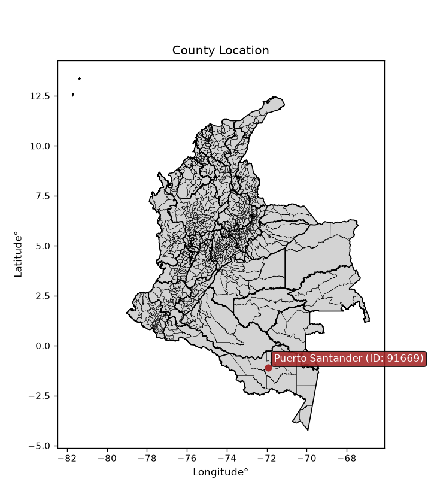
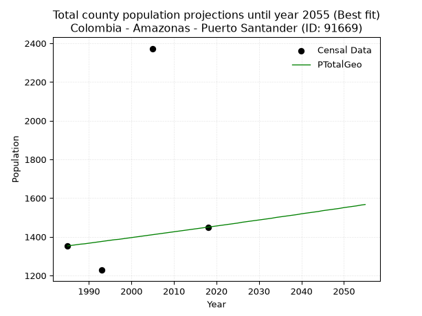
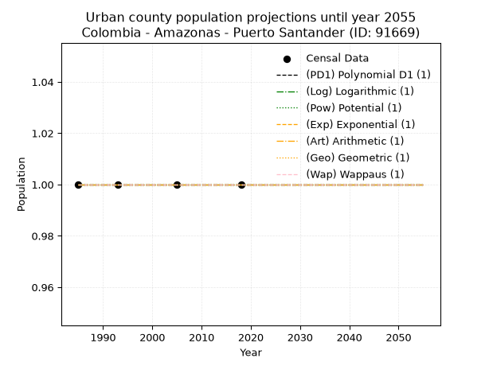
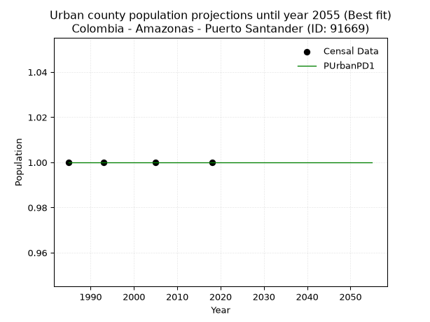
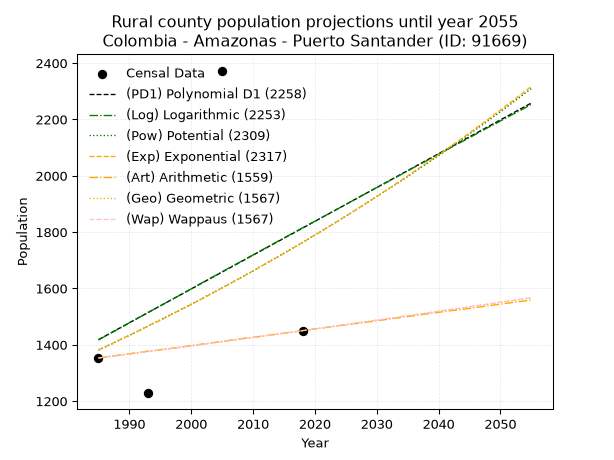

<div align="center">


</div>

# _“Population and Public Services Demand Projections (PPSD) until Year 2050 for Colombia - Amazonas - Puerto Santander (ID: 91669)”_
Keywords: `population` `public-service` `projection` `lineal` `polynomial` `logarithmic` `potential` `exponential` `arithmetic` `geometric` `wappaus` `dane` `colombia` `south-america`

PPSD are analytical estimates used by governments and planners to anticipate future changes in population size, age distribution, and the resulting community needs for utilities, healthcare, education, and infrastructure as sizing future water treatment facilities, electrical grids, and road networks based on spatial growth.

<div align="center">

</img>

</div>


> **General running parameters**: • app_version: _v20260806_. • Python version: _3.14.7_. • Pandas version: _3.0.5_. • NumPy version: _2.5.1_. • Creates, save and include plots into reports (create_plot): _False_. • Projection until year: _2050_. • Process polynomial degree 2 and up: _False_. • Process Wappaus: _True_. • Process Wappaus: _True_. • Set negative values to zero: _True_. • Set infinite values to zero: _True_. • Drop dataset notes: _True_. 
<div align="center">

Dynamic map: [:earth_americas:Google](http://maps.google.com/maps?q=-1.10102768,-71.9389381) [:earth_americas:OSM](https://www.openstreetmap.org/#map=18/-1.10102768/-71.9389381&layers=P) [:earth_americas:Bing](https://www.bing.com/maps?cp=-1.10102768~-71.9389381&lvl=18) [:earth_americas:Apple](https://maps.apple.com/frame?center=-1.10102768%2C-71.9389381&span=0.003%2C0.006)

</div>


<div align="center">

```geojson
{
  "type": "Feature",
  "geometry": {
    "type": "Point", 
    "coordinates": [-71.9389381, -1.10102768]
  }, 
  "properties": {
    "Name": "Colombia - Amazonas - Puerto Santander (ID: 91669)"
  }
}
```

</div>


## 0. Census Data (4 records)

Census data are official statistics collected by a government about the people and housing in a country. They usually include counts of total population, age, sex, race, income, education, and jobs.

📅Global census file: [Population.xlsx](../data/Population.xlsx)

| Source   |   Year |   CountryID | CountryName   |   StateID | StateName   |   CountyID | CountyName       |   PTotal |   PUrban |   PRural |
|:---------|-------:|------------:|:--------------|----------:|:------------|-----------:|:-----------------|---------:|---------:|---------:|
| DANE     |   1985 |          57 | Colombia      |        91 | Amazonas    |      91669 | Puerto Santander |     1353 |        1 |     1353 |
| DANE     |   1993 |          57 | Colombia      |        91 | Amazonas    |      91669 | Puerto Santander |     1228 |        1 |     1228 |
| DANE     |   2005 |          57 | Colombia      |        91 | Amazonas    |      91669 | Puerto Santander |     2373 |        1 |     2373 |
| DANE     |   2018 |          57 | Colombia      |        91 | Amazonas    |      91669 | Puerto Santander |     1450 |        1 |     1450 |

> 🔥Some records could had specific notes about the registered values or the corresponding urban or rural distribution.

## 1. Total

### 1.1. Coefficients and Parameters

* (PD1) Polynomial Deg 1: 12.000000000000506, -22402.00000000101 (lineal)
* (Log) Logarithmic: 24122.49380864256, -181754.26874502574
* (Pow) Potential: 14.840232261355299, -45.79944165990052
* (Exp) Exponential: 0.007387376040062069, 0.0005914187675451576
* (Art) Arithmetic: Year diff. 2018 - 1985 = 33, Population diff. 1450 - 1353 = 97, Annual growth = 2.9393939393939394
* (Geo) Geometric: Year diff. 2018 - 1985 = 33, Population diff. 1450 - 1353 = 97, Annual growth % = 0.0021003604685838617
* (Wap) Wappaus: i = 0.20973199710267137, Condition values only valid for < 200)

<sub>
Wappaus condition values: ['0.00', '0.21', '0.42', '0.63', '0.84', '1.05', '1.26', '1.47', '1.68', '1.89', '2.10', '2.31', '2.52', '2.73', '2.94', '3.15', '3.36', '3.57', '3.78', '3.98', '4.19', '4.40', '4.61', '4.82', '5.03', '5.24', '5.45', '5.66', '5.87', '6.08', '6.29', '6.50', '6.71', '6.92', '7.13', '7.34', '7.55', '7.76', '7.97', '8.18', '8.39', '8.60', '8.81', '9.02', '9.23', '9.44', '9.65', '9.86', '10.07', '10.28', '10.49', '10.70', '10.91', '11.12', '11.33', '11.54', '11.74', '11.95', '12.16', '12.37', '12.58', '12.79', '13.00', '13.21', '13.42', '13.63']
</sub>


### 1.2. Projected Dataset

|   Year |   CountyID |   PTotalPD1 |   PTotalLog |   PTotalPow |   PTotalExp |   PTotalArt |   PTotalGeo |   PTotalWap |
|-------:|-----------:|------------:|------------:|------------:|------------:|------------:|------------:|------------:|
|   1985 |      91669 |        1418 |        1417 |        1381 |        1382 |        1353 |        1353 |        1353 |
|   1986 |      91669 |        1430 |        1429 |        1391 |        1392 |        1356 |        1356 |        1356 |
|   1987 |      91669 |        1442 |        1441 |        1401 |        1402 |        1359 |        1359 |        1359 |
|   1988 |      91669 |        1454 |        1453 |        1412 |        1413 |        1362 |        1362 |        1362 |
|   1989 |      91669 |        1466 |        1465 |        1423 |        1423 |        1365 |        1364 |        1364 |
|   1990 |      91669 |        1478 |        1478 |        1433 |        1434 |        1368 |        1367 |        1367 |
|   1991 |      91669 |        1490 |        1490 |        1444 |        1444 |        1371 |        1370 |        1370 |
|   1992 |      91669 |        1502 |        1502 |        1455 |        1455 |        1374 |        1373 |        1373 |
|   1993 |      91669 |        1514 |        1514 |        1466 |        1466 |        1377 |        1376 |        1376 |
|   1994 |      91669 |        1526 |        1526 |        1477 |        1477 |        1379 |        1379 |        1379 |
|   1995 |      91669 |        1538 |        1538 |        1488 |        1487 |        1382 |        1382 |        1382 |
|   1996 |      91669 |        1550 |        1550 |        1499 |        1498 |        1385 |        1385 |        1385 |
|   1997 |      91669 |        1562 |        1562 |        1510 |        1510 |        1388 |        1387 |        1387 |
|   1998 |      91669 |        1574 |        1574 |        1521 |        1521 |        1391 |        1390 |        1390 |
|   1999 |      91669 |        1586 |        1586 |        1532 |        1532 |        1394 |        1393 |        1393 |
|   2000 |      91669 |        1598 |        1598 |        1544 |        1543 |        1397 |        1396 |        1396 |
|   2001 |      91669 |        1610 |        1611 |        1555 |        1555 |        1400 |        1399 |        1399 |
|   2002 |      91669 |        1622 |        1623 |        1567 |        1566 |        1403 |        1402 |        1402 |
|   2003 |      91669 |        1634 |        1635 |        1579 |        1578 |        1406 |        1405 |        1405 |
|   2004 |      91669 |        1646 |        1647 |        1590 |        1590 |        1409 |        1408 |        1408 |
|   2005 |      91669 |        1658 |        1659 |        1602 |        1602 |        1412 |        1411 |        1411 |
|   2006 |      91669 |        1670 |        1671 |        1614 |        1613 |        1415 |        1414 |        1414 |
|   2007 |      91669 |        1682 |        1683 |        1626 |        1625 |        1418 |        1417 |        1417 |
|   2008 |      91669 |        1694 |        1695 |        1638 |        1637 |        1421 |        1420 |        1420 |
|   2009 |      91669 |        1706 |        1707 |        1650 |        1650 |        1424 |        1423 |        1423 |
|   2010 |      91669 |        1718 |        1719 |        1662 |        1662 |        1426 |        1426 |        1426 |
|   2011 |      91669 |        1730 |        1731 |        1675 |        1674 |        1429 |        1429 |        1429 |
|   2012 |      91669 |        1742 |        1743 |        1687 |        1687 |        1432 |        1432 |        1432 |
|   2013 |      91669 |        1754 |        1755 |        1700 |        1699 |        1435 |        1435 |        1435 |
|   2014 |      91669 |        1766 |        1767 |        1712 |        1712 |        1438 |        1438 |        1438 |
|   2015 |      91669 |        1778 |        1779 |        1725 |        1724 |        1441 |        1441 |        1441 |
|   2016 |      91669 |        1790 |        1791 |        1738 |        1737 |        1444 |        1444 |        1444 |
|   2017 |      91669 |        1802 |        1803 |        1750 |        1750 |        1447 |        1447 |        1447 |
|   2018 |      91669 |        1814 |        1815 |        1763 |        1763 |        1450 |        1450 |        1450 |
|   2019 |      91669 |        1826 |        1827 |        1776 |        1776 |        1453 |        1453 |        1453 |
|   2020 |      91669 |        1838 |        1838 |        1790 |        1789 |        1456 |        1456 |        1456 |
|   2021 |      91669 |        1850 |        1850 |        1803 |        1802 |        1459 |        1459 |        1459 |
|   2022 |      91669 |        1862 |        1862 |        1816 |        1816 |        1462 |        1462 |        1462 |
|   2023 |      91669 |        1874 |        1874 |        1829 |        1829 |        1465 |        1465 |        1465 |
|   2024 |      91669 |        1886 |        1886 |        1843 |        1843 |        1468 |        1468 |        1468 |
|   2025 |      91669 |        1898 |        1898 |        1856 |        1857 |        1471 |        1471 |        1471 |
|   2026 |      91669 |        1910 |        1910 |        1870 |        1870 |        1474 |        1475 |        1475 |
|   2027 |      91669 |        1922 |        1922 |        1884 |        1884 |        1476 |        1478 |        1478 |
|   2028 |      91669 |        1934 |        1934 |        1898 |        1898 |        1479 |        1481 |        1481 |
|   2029 |      91669 |        1946 |        1946 |        1912 |        1912 |        1482 |        1484 |        1484 |
|   2030 |      91669 |        1958 |        1958 |        1926 |        1926 |        1485 |        1487 |        1487 |
|   2031 |      91669 |        1970 |        1969 |        1940 |        1941 |        1488 |        1490 |        1490 |
|   2032 |      91669 |        1982 |        1981 |        1954 |        1955 |        1491 |        1493 |        1493 |
|   2033 |      91669 |        1994 |        1993 |        1968 |        1970 |        1494 |        1496 |        1496 |
|   2034 |      91669 |        2006 |        2005 |        1983 |        1984 |        1497 |        1500 |        1500 |
|   2035 |      91669 |        2018 |        2017 |        1997 |        1999 |        1500 |        1503 |        1503 |
|   2036 |      91669 |        2030 |        2029 |        2012 |        2014 |        1503 |        1506 |        1506 |
|   2037 |      91669 |        2042 |        2041 |        2027 |        2029 |        1506 |        1509 |        1509 |
|   2038 |      91669 |        2054 |        2052 |        2041 |        2044 |        1509 |        1512 |        1512 |
|   2039 |      91669 |        2066 |        2064 |        2056 |        2059 |        1512 |        1515 |        1515 |
|   2040 |      91669 |        2078 |        2076 |        2071 |        2074 |        1515 |        1519 |        1519 |
|   2041 |      91669 |        2090 |        2088 |        2086 |        2089 |        1518 |        1522 |        1522 |
|   2042 |      91669 |        2102 |        2100 |        2102 |        2105 |        1521 |        1525 |        1525 |
|   2043 |      91669 |        2114 |        2112 |        2117 |        2121 |        1523 |        1528 |        1528 |
|   2044 |      91669 |        2126 |        2123 |        2132 |        2136 |        1526 |        1531 |        1531 |
|   2045 |      91669 |        2138 |        2135 |        2148 |        2152 |        1529 |        1535 |        1535 |
|   2046 |      91669 |        2150 |        2147 |        2164 |        2168 |        1532 |        1538 |        1538 |
|   2047 |      91669 |        2162 |        2159 |        2179 |        2184 |        1535 |        1541 |        1541 |
|   2048 |      91669 |        2174 |        2171 |        2195 |        2200 |        1538 |        1544 |        1544 |
|   2049 |      91669 |        2186 |        2182 |        2211 |        2217 |        1541 |        1547 |        1548 |
|   2050 |      91669 |        2198 |        2194 |        2227 |        2233 |        1544 |        1551 |        1551 |
<div align="center">

</img>

</div>


### 1.3. Best fit with absolute and relative error (%)

Relative error puts that difference into context by dividing the absolute error by the true value, creating a unitless ratio or percentage that shows the scale of the mistake.

Absolute and relative error

|   Year | Source   |   CountryID | CountryName   |   StateID | StateName   |   CountyID_x | CountyName       |   PTotal |   PUrban |   PRural |   CountyID_y |   PTotalPD1 |   PTotalLog |   PTotalPow |   PTotalExp |   PTotalArt |   PTotalGeo |   PTotalWap |   PTotalPD1AbsError |   PTotalLogAbsError |   PTotalPowAbsError |   PTotalExpAbsError |   PTotalArtAbsError |   PTotalGeoAbsError |   PTotalWapAbsError |   PTotalPD1RelError |   PTotalLogRelError |   PTotalPowRelError |   PTotalExpRelError |   PTotalArtRelError |   PTotalGeoRelError |   PTotalWapRelError |
|-------:|:---------|------------:|:--------------|----------:|:------------|-------------:|:-----------------|---------:|---------:|---------:|-------------:|------------:|------------:|------------:|------------:|------------:|------------:|------------:|--------------------:|--------------------:|--------------------:|--------------------:|--------------------:|--------------------:|--------------------:|--------------------:|--------------------:|--------------------:|--------------------:|--------------------:|--------------------:|--------------------:|
|   1985 | DANE     |          57 | Colombia      |        91 | Amazonas    |        91669 | Puerto Santander |     1353 |        1 |     1353 |        91669 |        1418 |        1417 |        1381 |        1382 |        1353 |        1353 |        1353 |                  65 |                  64 |                  28 |                  29 |                   0 |                   0 |                   0 |             4.80414 |             4.73023 |             2.06948 |             2.14339 |              0      |              0      |              0      |
|   1993 | DANE     |          57 | Colombia      |        91 | Amazonas    |        91669 | Puerto Santander |     1228 |        1 |     1228 |        91669 |        1514 |        1514 |        1466 |        1466 |        1377 |        1376 |        1376 |                 286 |                 286 |                 238 |                 238 |                 149 |                 148 |                 148 |            23.2899  |            23.2899  |            19.3811  |            19.3811  |             12.1336 |             12.0521 |             12.0521 |
|   2005 | DANE     |          57 | Colombia      |        91 | Amazonas    |        91669 | Puerto Santander |     2373 |        1 |     2373 |        91669 |        1658 |        1659 |        1602 |        1602 |        1412 |        1411 |        1411 |                 715 |                 714 |                 771 |                 771 |                 961 |                 962 |                 962 |            30.1306  |            30.0885  |            32.4905  |            32.4905  |             40.4973 |             40.5394 |             40.5394 |
|   2018 | DANE     |          57 | Colombia      |        91 | Amazonas    |        91669 | Puerto Santander |     1450 |        1 |     1450 |        91669 |        1814 |        1815 |        1763 |        1763 |        1450 |        1450 |        1450 |                 364 |                 365 |                 313 |                 313 |                   0 |                   0 |                   0 |            25.1034  |            25.1724  |            21.5862  |            21.5862  |              0      |              0      |              0      |

Relative error mean

| Method    |   RelError | Best   |
|:----------|-----------:|:-------|
| PTotalPD1 |    20.832  |        |
| PTotalLog |    20.8203 |        |
| PTotalPow |    18.8818 |        |
| PTotalExp |    18.9003 |        |
| PTotalArt |    13.1577 |        |
| PTotalGeo |    13.1479 | True   |
| PTotalWap |    13.1479 | True   |

💙Best method: _**PTotalGeo**_
<div align="center">

</img>

</div>


### 1.4. Fresh water supply demand in liters per capita per day (lpcd)

The fresh water supply demand typically ranges from 100 to 300 liters per capita per day (lpcd) for standard domestic and municipal planning, though absolute survival minimums set by the World Health Organization are as low as 7.5 to 20 liters per day, and total consumption in high-income nations can exceed 400 liters.

> `CZ`: Level in meters above the sea level (masl)<br> `WS`: Fresh water supply demand in liters per capita per day (lpcd or l/h/d)<br> `WSAll`: Zonal fresh water supply demand in liters per second (l/s)<br> `A`: Zonal area in square meters<br> `DP`: Population density (people/hectare or p/ha)

Reference values (RAS Colombia)

|    CZ |   WS |
|------:|-----:|
|  1000 |  120 |
|  2000 |  130 |
| 99999 |  140 |

County shapefile geometry properties and water supply values

|   CountyID |      ATotal |   CZTotal |   WSTotal |
|-----------:|------------:|----------:|----------:|
|      91669 | 1.46921e+10 |   154.091 |       120 |

Projected values for best method: PTotalGeo

|   CountyID |   Year |   PTotalGeo |   DPTotal |   WSTotal |   WSTotalAll |
|-----------:|-------:|------------:|----------:|----------:|-------------:|
|      91669 |   1985 |        1353 |         0 |       120 |      1.87917 |
|      91669 |   1986 |        1356 |         0 |       120 |      1.88333 |
|      91669 |   1987 |        1359 |         0 |       120 |      1.8875  |
|      91669 |   1988 |        1362 |         0 |       120 |      1.89167 |
|      91669 |   1989 |        1364 |         0 |       120 |      1.89444 |
|      91669 |   1990 |        1367 |         0 |       120 |      1.89861 |
|      91669 |   1991 |        1370 |         0 |       120 |      1.90278 |
|      91669 |   1992 |        1373 |         0 |       120 |      1.90694 |
|      91669 |   1993 |        1376 |         0 |       120 |      1.91111 |
|      91669 |   1994 |        1379 |         0 |       120 |      1.91528 |
|      91669 |   1995 |        1382 |         0 |       120 |      1.91944 |
|      91669 |   1996 |        1385 |         0 |       120 |      1.92361 |
|      91669 |   1997 |        1387 |         0 |       120 |      1.92639 |
|      91669 |   1998 |        1390 |         0 |       120 |      1.93056 |
|      91669 |   1999 |        1393 |         0 |       120 |      1.93472 |
|      91669 |   2000 |        1396 |         0 |       120 |      1.93889 |
|      91669 |   2001 |        1399 |         0 |       120 |      1.94306 |
|      91669 |   2002 |        1402 |         0 |       120 |      1.94722 |
|      91669 |   2003 |        1405 |         0 |       120 |      1.95139 |
|      91669 |   2004 |        1408 |         0 |       120 |      1.95556 |
|      91669 |   2005 |        1411 |         0 |       120 |      1.95972 |
|      91669 |   2006 |        1414 |         0 |       120 |      1.96389 |
|      91669 |   2007 |        1417 |         0 |       120 |      1.96806 |
|      91669 |   2008 |        1420 |         0 |       120 |      1.97222 |
|      91669 |   2009 |        1423 |         0 |       120 |      1.97639 |
|      91669 |   2010 |        1426 |         0 |       120 |      1.98056 |
|      91669 |   2011 |        1429 |         0 |       120 |      1.98472 |
|      91669 |   2012 |        1432 |         0 |       120 |      1.98889 |
|      91669 |   2013 |        1435 |         0 |       120 |      1.99306 |
|      91669 |   2014 |        1438 |         0 |       120 |      1.99722 |
|      91669 |   2015 |        1441 |         0 |       120 |      2.00139 |
|      91669 |   2016 |        1444 |         0 |       120 |      2.00556 |
|      91669 |   2017 |        1447 |         0 |       120 |      2.00972 |
|      91669 |   2018 |        1450 |         0 |       120 |      2.01389 |
|      91669 |   2019 |        1453 |         0 |       120 |      2.01806 |
|      91669 |   2020 |        1456 |         0 |       120 |      2.02222 |
|      91669 |   2021 |        1459 |         0 |       120 |      2.02639 |
|      91669 |   2022 |        1462 |         0 |       120 |      2.03056 |
|      91669 |   2023 |        1465 |         0 |       120 |      2.03472 |
|      91669 |   2024 |        1468 |         0 |       120 |      2.03889 |
|      91669 |   2025 |        1471 |         0 |       120 |      2.04306 |
|      91669 |   2026 |        1475 |         0 |       120 |      2.04861 |
|      91669 |   2027 |        1478 |         0 |       120 |      2.05278 |
|      91669 |   2028 |        1481 |         0 |       120 |      2.05694 |
|      91669 |   2029 |        1484 |         0 |       120 |      2.06111 |
|      91669 |   2030 |        1487 |         0 |       120 |      2.06528 |
|      91669 |   2031 |        1490 |         0 |       120 |      2.06944 |
|      91669 |   2032 |        1493 |         0 |       120 |      2.07361 |
|      91669 |   2033 |        1496 |         0 |       120 |      2.07778 |
|      91669 |   2034 |        1500 |         0 |       120 |      2.08333 |
|      91669 |   2035 |        1503 |         0 |       120 |      2.0875  |
|      91669 |   2036 |        1506 |         0 |       120 |      2.09167 |
|      91669 |   2037 |        1509 |         0 |       120 |      2.09583 |
|      91669 |   2038 |        1512 |         0 |       120 |      2.1     |
|      91669 |   2039 |        1515 |         0 |       120 |      2.10417 |
|      91669 |   2040 |        1519 |         0 |       120 |      2.10972 |
|      91669 |   2041 |        1522 |         0 |       120 |      2.11389 |
|      91669 |   2042 |        1525 |         0 |       120 |      2.11806 |
|      91669 |   2043 |        1528 |         0 |       120 |      2.12222 |
|      91669 |   2044 |        1531 |         0 |       120 |      2.12639 |
|      91669 |   2045 |        1535 |         0 |       120 |      2.13194 |
|      91669 |   2046 |        1538 |         0 |       120 |      2.13611 |
|      91669 |   2047 |        1541 |         0 |       120 |      2.14028 |
|      91669 |   2048 |        1544 |         0 |       120 |      2.14444 |
|      91669 |   2049 |        1547 |         0 |       120 |      2.14861 |
|      91669 |   2050 |        1551 |         0 |       120 |      2.15417 |

## 2. Urban

### 2.1. Coefficients and Parameters

* (PD1) Polynomial Deg 1: -1.3233529347183512e-19, 1.0000000000000004 (lineal)
* (Log) Logarithmic: 3.215569112241165e-17, 0.9999999999999996
* (Pow) Potential: 0.0, 0.0
* (Exp) Exponential: 0.0, 1.0
* (Art) Arithmetic: Year diff. 2018 - 1985 = 33, Population diff. 1 - 1 = 0, Annual growth = 0.0
* (Geo) Geometric: Year diff. 2018 - 1985 = 33, Population diff. 1 - 1 = 0, Annual growth % = 0.0
* (Wap) Wappaus: i = 0.0, Condition values only valid for < 200)

<sub>
Wappaus condition values: ['0.00', '0.00', '0.00', '0.00', '0.00', '0.00', '0.00', '0.00', '0.00', '0.00', '0.00', '0.00', '0.00', '0.00', '0.00', '0.00', '0.00', '0.00', '0.00', '0.00', '0.00', '0.00', '0.00', '0.00', '0.00', '0.00', '0.00', '0.00', '0.00', '0.00', '0.00', '0.00', '0.00', '0.00', '0.00', '0.00', '0.00', '0.00', '0.00', '0.00', '0.00', '0.00', '0.00', '0.00', '0.00', '0.00', '0.00', '0.00', '0.00', '0.00', '0.00', '0.00', '0.00', '0.00', '0.00', '0.00', '0.00', '0.00', '0.00', '0.00', '0.00', '0.00', '0.00', '0.00', '0.00', '0.00']
</sub>


### 2.2. Projected Dataset

|   Year |   CountyID |   PUrbanPD1 |   PUrbanLog |   PUrbanPow |   PUrbanExp |   PUrbanArt |   PUrbanGeo |   PUrbanWap |
|-------:|-----------:|------------:|------------:|------------:|------------:|------------:|------------:|------------:|
|   1985 |      91669 |           1 |           1 |           1 |           1 |           1 |           1 |           1 |
|   1986 |      91669 |           1 |           1 |           1 |           1 |           1 |           1 |           1 |
|   1987 |      91669 |           1 |           1 |           1 |           1 |           1 |           1 |           1 |
|   1988 |      91669 |           1 |           1 |           1 |           1 |           1 |           1 |           1 |
|   1989 |      91669 |           1 |           1 |           1 |           1 |           1 |           1 |           1 |
|   1990 |      91669 |           1 |           1 |           1 |           1 |           1 |           1 |           1 |
|   1991 |      91669 |           1 |           1 |           1 |           1 |           1 |           1 |           1 |
|   1992 |      91669 |           1 |           1 |           1 |           1 |           1 |           1 |           1 |
|   1993 |      91669 |           1 |           1 |           1 |           1 |           1 |           1 |           1 |
|   1994 |      91669 |           1 |           1 |           1 |           1 |           1 |           1 |           1 |
|   1995 |      91669 |           1 |           1 |           1 |           1 |           1 |           1 |           1 |
|   1996 |      91669 |           1 |           1 |           1 |           1 |           1 |           1 |           1 |
|   1997 |      91669 |           1 |           1 |           1 |           1 |           1 |           1 |           1 |
|   1998 |      91669 |           1 |           1 |           1 |           1 |           1 |           1 |           1 |
|   1999 |      91669 |           1 |           1 |           1 |           1 |           1 |           1 |           1 |
|   2000 |      91669 |           1 |           1 |           1 |           1 |           1 |           1 |           1 |
|   2001 |      91669 |           1 |           1 |           1 |           1 |           1 |           1 |           1 |
|   2002 |      91669 |           1 |           1 |           1 |           1 |           1 |           1 |           1 |
|   2003 |      91669 |           1 |           1 |           1 |           1 |           1 |           1 |           1 |
|   2004 |      91669 |           1 |           1 |           1 |           1 |           1 |           1 |           1 |
|   2005 |      91669 |           1 |           1 |           1 |           1 |           1 |           1 |           1 |
|   2006 |      91669 |           1 |           1 |           1 |           1 |           1 |           1 |           1 |
|   2007 |      91669 |           1 |           1 |           1 |           1 |           1 |           1 |           1 |
|   2008 |      91669 |           1 |           1 |           1 |           1 |           1 |           1 |           1 |
|   2009 |      91669 |           1 |           1 |           1 |           1 |           1 |           1 |           1 |
|   2010 |      91669 |           1 |           1 |           1 |           1 |           1 |           1 |           1 |
|   2011 |      91669 |           1 |           1 |           1 |           1 |           1 |           1 |           1 |
|   2012 |      91669 |           1 |           1 |           1 |           1 |           1 |           1 |           1 |
|   2013 |      91669 |           1 |           1 |           1 |           1 |           1 |           1 |           1 |
|   2014 |      91669 |           1 |           1 |           1 |           1 |           1 |           1 |           1 |
|   2015 |      91669 |           1 |           1 |           1 |           1 |           1 |           1 |           1 |
|   2016 |      91669 |           1 |           1 |           1 |           1 |           1 |           1 |           1 |
|   2017 |      91669 |           1 |           1 |           1 |           1 |           1 |           1 |           1 |
|   2018 |      91669 |           1 |           1 |           1 |           1 |           1 |           1 |           1 |
|   2019 |      91669 |           1 |           1 |           1 |           1 |           1 |           1 |           1 |
|   2020 |      91669 |           1 |           1 |           1 |           1 |           1 |           1 |           1 |
|   2021 |      91669 |           1 |           1 |           1 |           1 |           1 |           1 |           1 |
|   2022 |      91669 |           1 |           1 |           1 |           1 |           1 |           1 |           1 |
|   2023 |      91669 |           1 |           1 |           1 |           1 |           1 |           1 |           1 |
|   2024 |      91669 |           1 |           1 |           1 |           1 |           1 |           1 |           1 |
|   2025 |      91669 |           1 |           1 |           1 |           1 |           1 |           1 |           1 |
|   2026 |      91669 |           1 |           1 |           1 |           1 |           1 |           1 |           1 |
|   2027 |      91669 |           1 |           1 |           1 |           1 |           1 |           1 |           1 |
|   2028 |      91669 |           1 |           1 |           1 |           1 |           1 |           1 |           1 |
|   2029 |      91669 |           1 |           1 |           1 |           1 |           1 |           1 |           1 |
|   2030 |      91669 |           1 |           1 |           1 |           1 |           1 |           1 |           1 |
|   2031 |      91669 |           1 |           1 |           1 |           1 |           1 |           1 |           1 |
|   2032 |      91669 |           1 |           1 |           1 |           1 |           1 |           1 |           1 |
|   2033 |      91669 |           1 |           1 |           1 |           1 |           1 |           1 |           1 |
|   2034 |      91669 |           1 |           1 |           1 |           1 |           1 |           1 |           1 |
|   2035 |      91669 |           1 |           1 |           1 |           1 |           1 |           1 |           1 |
|   2036 |      91669 |           1 |           1 |           1 |           1 |           1 |           1 |           1 |
|   2037 |      91669 |           1 |           1 |           1 |           1 |           1 |           1 |           1 |
|   2038 |      91669 |           1 |           1 |           1 |           1 |           1 |           1 |           1 |
|   2039 |      91669 |           1 |           1 |           1 |           1 |           1 |           1 |           1 |
|   2040 |      91669 |           1 |           1 |           1 |           1 |           1 |           1 |           1 |
|   2041 |      91669 |           1 |           1 |           1 |           1 |           1 |           1 |           1 |
|   2042 |      91669 |           1 |           1 |           1 |           1 |           1 |           1 |           1 |
|   2043 |      91669 |           1 |           1 |           1 |           1 |           1 |           1 |           1 |
|   2044 |      91669 |           1 |           1 |           1 |           1 |           1 |           1 |           1 |
|   2045 |      91669 |           1 |           1 |           1 |           1 |           1 |           1 |           1 |
|   2046 |      91669 |           1 |           1 |           1 |           1 |           1 |           1 |           1 |
|   2047 |      91669 |           1 |           1 |           1 |           1 |           1 |           1 |           1 |
|   2048 |      91669 |           1 |           1 |           1 |           1 |           1 |           1 |           1 |
|   2049 |      91669 |           1 |           1 |           1 |           1 |           1 |           1 |           1 |
|   2050 |      91669 |           1 |           1 |           1 |           1 |           1 |           1 |           1 |
<div align="center">

</img>

</div>


### 2.3. Best fit with absolute and relative error (%)

Relative error puts that difference into context by dividing the absolute error by the true value, creating a unitless ratio or percentage that shows the scale of the mistake.

Absolute and relative error

|   Year | Source   |   CountryID | CountryName   |   StateID | StateName   |   CountyID_x | CountyName       |   PTotal |   PUrban |   PRural |   CountyID_y |   PUrbanPD1 |   PUrbanLog |   PUrbanPow |   PUrbanExp |   PUrbanArt |   PUrbanGeo |   PUrbanWap |   PUrbanPD1AbsError |   PUrbanLogAbsError |   PUrbanPowAbsError |   PUrbanExpAbsError |   PUrbanArtAbsError |   PUrbanGeoAbsError |   PUrbanWapAbsError |   PUrbanPD1RelError |   PUrbanLogRelError |   PUrbanPowRelError |   PUrbanExpRelError |   PUrbanArtRelError |   PUrbanGeoRelError |   PUrbanWapRelError |
|-------:|:---------|------------:|:--------------|----------:|:------------|-------------:|:-----------------|---------:|---------:|---------:|-------------:|------------:|------------:|------------:|------------:|------------:|------------:|------------:|--------------------:|--------------------:|--------------------:|--------------------:|--------------------:|--------------------:|--------------------:|--------------------:|--------------------:|--------------------:|--------------------:|--------------------:|--------------------:|--------------------:|
|   1985 | DANE     |          57 | Colombia      |        91 | Amazonas    |        91669 | Puerto Santander |     1353 |        1 |     1353 |        91669 |           1 |           1 |           1 |           1 |           1 |           1 |           1 |                   0 |                   0 |                   0 |                   0 |                   0 |                   0 |                   0 |                   0 |                   0 |                   0 |                   0 |                   0 |                   0 |                   0 |
|   1993 | DANE     |          57 | Colombia      |        91 | Amazonas    |        91669 | Puerto Santander |     1228 |        1 |     1228 |        91669 |           1 |           1 |           1 |           1 |           1 |           1 |           1 |                   0 |                   0 |                   0 |                   0 |                   0 |                   0 |                   0 |                   0 |                   0 |                   0 |                   0 |                   0 |                   0 |                   0 |
|   2005 | DANE     |          57 | Colombia      |        91 | Amazonas    |        91669 | Puerto Santander |     2373 |        1 |     2373 |        91669 |           1 |           1 |           1 |           1 |           1 |           1 |           1 |                   0 |                   0 |                   0 |                   0 |                   0 |                   0 |                   0 |                   0 |                   0 |                   0 |                   0 |                   0 |                   0 |                   0 |
|   2018 | DANE     |          57 | Colombia      |        91 | Amazonas    |        91669 | Puerto Santander |     1450 |        1 |     1450 |        91669 |           1 |           1 |           1 |           1 |           1 |           1 |           1 |                   0 |                   0 |                   0 |                   0 |                   0 |                   0 |                   0 |                   0 |                   0 |                   0 |                   0 |                   0 |                   0 |                   0 |

Relative error mean

| Method    |   RelError | Best   |
|:----------|-----------:|:-------|
| PUrbanPD1 |          0 | True   |
| PUrbanLog |          0 | True   |
| PUrbanPow |          0 | True   |
| PUrbanExp |          0 | True   |
| PUrbanArt |          0 | True   |
| PUrbanGeo |          0 | True   |
| PUrbanWap |          0 | True   |

💙Best method: _**PUrbanPD1**_
<div align="center">

</img>

</div>


### 2.4. Fresh water supply demand in liters per capita per day (lpcd)

The fresh water supply demand typically ranges from 100 to 300 liters per capita per day (lpcd) for standard domestic and municipal planning, though absolute survival minimums set by the World Health Organization are as low as 7.5 to 20 liters per day, and total consumption in high-income nations can exceed 400 liters.

> `CZ`: Level in meters above the sea level (masl)<br> `WS`: Fresh water supply demand in liters per capita per day (lpcd or l/h/d)<br> `WSAll`: Zonal fresh water supply demand in liters per second (l/s)<br> `A`: Zonal area in square meters<br> `DP`: Population density (people/hectare or p/ha)

Reference values (RAS Colombia)

|    CZ |   WS |
|------:|-----:|
|  1000 |  120 |
|  2000 |  130 |
| 99999 |  140 |

County shapefile geometry properties and water supply values

|   CountyID |   AUrban |   CZUrban |   WSUrban |
|-----------:|---------:|----------:|----------:|
|      91669 |        0 |         0 |       120 |

Projected values for best method: PUrbanPD1

|   CountyID |   Year |   PUrbanPD1 |   DPUrban |   WSUrban |   WSUrbanAll |
|-----------:|-------:|------------:|----------:|----------:|-------------:|
|      91669 |   1985 |           1 |       inf |       120 |   0.00138889 |
|      91669 |   1986 |           1 |       inf |       120 |   0.00138889 |
|      91669 |   1987 |           1 |       inf |       120 |   0.00138889 |
|      91669 |   1988 |           1 |       inf |       120 |   0.00138889 |
|      91669 |   1989 |           1 |       inf |       120 |   0.00138889 |
|      91669 |   1990 |           1 |       inf |       120 |   0.00138889 |
|      91669 |   1991 |           1 |       inf |       120 |   0.00138889 |
|      91669 |   1992 |           1 |       inf |       120 |   0.00138889 |
|      91669 |   1993 |           1 |       inf |       120 |   0.00138889 |
|      91669 |   1994 |           1 |       inf |       120 |   0.00138889 |
|      91669 |   1995 |           1 |       inf |       120 |   0.00138889 |
|      91669 |   1996 |           1 |       inf |       120 |   0.00138889 |
|      91669 |   1997 |           1 |       inf |       120 |   0.00138889 |
|      91669 |   1998 |           1 |       inf |       120 |   0.00138889 |
|      91669 |   1999 |           1 |       inf |       120 |   0.00138889 |
|      91669 |   2000 |           1 |       inf |       120 |   0.00138889 |
|      91669 |   2001 |           1 |       inf |       120 |   0.00138889 |
|      91669 |   2002 |           1 |       inf |       120 |   0.00138889 |
|      91669 |   2003 |           1 |       inf |       120 |   0.00138889 |
|      91669 |   2004 |           1 |       inf |       120 |   0.00138889 |
|      91669 |   2005 |           1 |       inf |       120 |   0.00138889 |
|      91669 |   2006 |           1 |       inf |       120 |   0.00138889 |
|      91669 |   2007 |           1 |       inf |       120 |   0.00138889 |
|      91669 |   2008 |           1 |       inf |       120 |   0.00138889 |
|      91669 |   2009 |           1 |       inf |       120 |   0.00138889 |
|      91669 |   2010 |           1 |       inf |       120 |   0.00138889 |
|      91669 |   2011 |           1 |       inf |       120 |   0.00138889 |
|      91669 |   2012 |           1 |       inf |       120 |   0.00138889 |
|      91669 |   2013 |           1 |       inf |       120 |   0.00138889 |
|      91669 |   2014 |           1 |       inf |       120 |   0.00138889 |
|      91669 |   2015 |           1 |       inf |       120 |   0.00138889 |
|      91669 |   2016 |           1 |       inf |       120 |   0.00138889 |
|      91669 |   2017 |           1 |       inf |       120 |   0.00138889 |
|      91669 |   2018 |           1 |       inf |       120 |   0.00138889 |
|      91669 |   2019 |           1 |       inf |       120 |   0.00138889 |
|      91669 |   2020 |           1 |       inf |       120 |   0.00138889 |
|      91669 |   2021 |           1 |       inf |       120 |   0.00138889 |
|      91669 |   2022 |           1 |       inf |       120 |   0.00138889 |
|      91669 |   2023 |           1 |       inf |       120 |   0.00138889 |
|      91669 |   2024 |           1 |       inf |       120 |   0.00138889 |
|      91669 |   2025 |           1 |       inf |       120 |   0.00138889 |
|      91669 |   2026 |           1 |       inf |       120 |   0.00138889 |
|      91669 |   2027 |           1 |       inf |       120 |   0.00138889 |
|      91669 |   2028 |           1 |       inf |       120 |   0.00138889 |
|      91669 |   2029 |           1 |       inf |       120 |   0.00138889 |
|      91669 |   2030 |           1 |       inf |       120 |   0.00138889 |
|      91669 |   2031 |           1 |       inf |       120 |   0.00138889 |
|      91669 |   2032 |           1 |       inf |       120 |   0.00138889 |
|      91669 |   2033 |           1 |       inf |       120 |   0.00138889 |
|      91669 |   2034 |           1 |       inf |       120 |   0.00138889 |
|      91669 |   2035 |           1 |       inf |       120 |   0.00138889 |
|      91669 |   2036 |           1 |       inf |       120 |   0.00138889 |
|      91669 |   2037 |           1 |       inf |       120 |   0.00138889 |
|      91669 |   2038 |           1 |       inf |       120 |   0.00138889 |
|      91669 |   2039 |           1 |       inf |       120 |   0.00138889 |
|      91669 |   2040 |           1 |       inf |       120 |   0.00138889 |
|      91669 |   2041 |           1 |       inf |       120 |   0.00138889 |
|      91669 |   2042 |           1 |       inf |       120 |   0.00138889 |
|      91669 |   2043 |           1 |       inf |       120 |   0.00138889 |
|      91669 |   2044 |           1 |       inf |       120 |   0.00138889 |
|      91669 |   2045 |           1 |       inf |       120 |   0.00138889 |
|      91669 |   2046 |           1 |       inf |       120 |   0.00138889 |
|      91669 |   2047 |           1 |       inf |       120 |   0.00138889 |
|      91669 |   2048 |           1 |       inf |       120 |   0.00138889 |
|      91669 |   2049 |           1 |       inf |       120 |   0.00138889 |
|      91669 |   2050 |           1 |       inf |       120 |   0.00138889 |

## 3. Rural

### 3.1. Coefficients and Parameters

* (PD1) Polynomial Deg 1: 12.000000000000506, -22402.00000000101 (lineal)
* (Log) Logarithmic: 24122.49380864256, -181754.26874502574
* (Pow) Potential: 14.840232261355299, -45.79944165990052
* (Exp) Exponential: 0.007387376040062069, 0.0005914187675451576
* (Art) Arithmetic: Year diff. 2018 - 1985 = 33, Population diff. 1450 - 1353 = 97, Annual growth = 2.9393939393939394
* (Geo) Geometric: Year diff. 2018 - 1985 = 33, Population diff. 1450 - 1353 = 97, Annual growth % = 0.0021003604685838617
* (Wap) Wappaus: i = 0.20973199710267137, Condition values only valid for < 200)

<sub>
Wappaus condition values: ['0.00', '0.21', '0.42', '0.63', '0.84', '1.05', '1.26', '1.47', '1.68', '1.89', '2.10', '2.31', '2.52', '2.73', '2.94', '3.15', '3.36', '3.57', '3.78', '3.98', '4.19', '4.40', '4.61', '4.82', '5.03', '5.24', '5.45', '5.66', '5.87', '6.08', '6.29', '6.50', '6.71', '6.92', '7.13', '7.34', '7.55', '7.76', '7.97', '8.18', '8.39', '8.60', '8.81', '9.02', '9.23', '9.44', '9.65', '9.86', '10.07', '10.28', '10.49', '10.70', '10.91', '11.12', '11.33', '11.54', '11.74', '11.95', '12.16', '12.37', '12.58', '12.79', '13.00', '13.21', '13.42', '13.63']
</sub>


### 3.2. Projected Dataset

|   Year |   CountyID |   PRuralPD1 |   PRuralLog |   PRuralPow |   PRuralExp |   PRuralArt |   PRuralGeo |   PRuralWap |
|-------:|-----------:|------------:|------------:|------------:|------------:|------------:|------------:|------------:|
|   1985 |      91669 |        1418 |        1417 |        1381 |        1382 |        1353 |        1353 |        1353 |
|   1986 |      91669 |        1430 |        1429 |        1391 |        1392 |        1356 |        1356 |        1356 |
|   1987 |      91669 |        1442 |        1441 |        1401 |        1402 |        1359 |        1359 |        1359 |
|   1988 |      91669 |        1454 |        1453 |        1412 |        1413 |        1362 |        1362 |        1362 |
|   1989 |      91669 |        1466 |        1465 |        1423 |        1423 |        1365 |        1364 |        1364 |
|   1990 |      91669 |        1478 |        1478 |        1433 |        1434 |        1368 |        1367 |        1367 |
|   1991 |      91669 |        1490 |        1490 |        1444 |        1444 |        1371 |        1370 |        1370 |
|   1992 |      91669 |        1502 |        1502 |        1455 |        1455 |        1374 |        1373 |        1373 |
|   1993 |      91669 |        1514 |        1514 |        1466 |        1466 |        1377 |        1376 |        1376 |
|   1994 |      91669 |        1526 |        1526 |        1477 |        1477 |        1379 |        1379 |        1379 |
|   1995 |      91669 |        1538 |        1538 |        1488 |        1487 |        1382 |        1382 |        1382 |
|   1996 |      91669 |        1550 |        1550 |        1499 |        1498 |        1385 |        1385 |        1385 |
|   1997 |      91669 |        1562 |        1562 |        1510 |        1510 |        1388 |        1387 |        1387 |
|   1998 |      91669 |        1574 |        1574 |        1521 |        1521 |        1391 |        1390 |        1390 |
|   1999 |      91669 |        1586 |        1586 |        1532 |        1532 |        1394 |        1393 |        1393 |
|   2000 |      91669 |        1598 |        1598 |        1544 |        1543 |        1397 |        1396 |        1396 |
|   2001 |      91669 |        1610 |        1611 |        1555 |        1555 |        1400 |        1399 |        1399 |
|   2002 |      91669 |        1622 |        1623 |        1567 |        1566 |        1403 |        1402 |        1402 |
|   2003 |      91669 |        1634 |        1635 |        1579 |        1578 |        1406 |        1405 |        1405 |
|   2004 |      91669 |        1646 |        1647 |        1590 |        1590 |        1409 |        1408 |        1408 |
|   2005 |      91669 |        1658 |        1659 |        1602 |        1602 |        1412 |        1411 |        1411 |
|   2006 |      91669 |        1670 |        1671 |        1614 |        1613 |        1415 |        1414 |        1414 |
|   2007 |      91669 |        1682 |        1683 |        1626 |        1625 |        1418 |        1417 |        1417 |
|   2008 |      91669 |        1694 |        1695 |        1638 |        1637 |        1421 |        1420 |        1420 |
|   2009 |      91669 |        1706 |        1707 |        1650 |        1650 |        1424 |        1423 |        1423 |
|   2010 |      91669 |        1718 |        1719 |        1662 |        1662 |        1426 |        1426 |        1426 |
|   2011 |      91669 |        1730 |        1731 |        1675 |        1674 |        1429 |        1429 |        1429 |
|   2012 |      91669 |        1742 |        1743 |        1687 |        1687 |        1432 |        1432 |        1432 |
|   2013 |      91669 |        1754 |        1755 |        1700 |        1699 |        1435 |        1435 |        1435 |
|   2014 |      91669 |        1766 |        1767 |        1712 |        1712 |        1438 |        1438 |        1438 |
|   2015 |      91669 |        1778 |        1779 |        1725 |        1724 |        1441 |        1441 |        1441 |
|   2016 |      91669 |        1790 |        1791 |        1738 |        1737 |        1444 |        1444 |        1444 |
|   2017 |      91669 |        1802 |        1803 |        1750 |        1750 |        1447 |        1447 |        1447 |
|   2018 |      91669 |        1814 |        1815 |        1763 |        1763 |        1450 |        1450 |        1450 |
|   2019 |      91669 |        1826 |        1827 |        1776 |        1776 |        1453 |        1453 |        1453 |
|   2020 |      91669 |        1838 |        1838 |        1790 |        1789 |        1456 |        1456 |        1456 |
|   2021 |      91669 |        1850 |        1850 |        1803 |        1802 |        1459 |        1459 |        1459 |
|   2022 |      91669 |        1862 |        1862 |        1816 |        1816 |        1462 |        1462 |        1462 |
|   2023 |      91669 |        1874 |        1874 |        1829 |        1829 |        1465 |        1465 |        1465 |
|   2024 |      91669 |        1886 |        1886 |        1843 |        1843 |        1468 |        1468 |        1468 |
|   2025 |      91669 |        1898 |        1898 |        1856 |        1857 |        1471 |        1471 |        1471 |
|   2026 |      91669 |        1910 |        1910 |        1870 |        1870 |        1474 |        1475 |        1475 |
|   2027 |      91669 |        1922 |        1922 |        1884 |        1884 |        1476 |        1478 |        1478 |
|   2028 |      91669 |        1934 |        1934 |        1898 |        1898 |        1479 |        1481 |        1481 |
|   2029 |      91669 |        1946 |        1946 |        1912 |        1912 |        1482 |        1484 |        1484 |
|   2030 |      91669 |        1958 |        1958 |        1926 |        1926 |        1485 |        1487 |        1487 |
|   2031 |      91669 |        1970 |        1969 |        1940 |        1941 |        1488 |        1490 |        1490 |
|   2032 |      91669 |        1982 |        1981 |        1954 |        1955 |        1491 |        1493 |        1493 |
|   2033 |      91669 |        1994 |        1993 |        1968 |        1970 |        1494 |        1496 |        1496 |
|   2034 |      91669 |        2006 |        2005 |        1983 |        1984 |        1497 |        1500 |        1500 |
|   2035 |      91669 |        2018 |        2017 |        1997 |        1999 |        1500 |        1503 |        1503 |
|   2036 |      91669 |        2030 |        2029 |        2012 |        2014 |        1503 |        1506 |        1506 |
|   2037 |      91669 |        2042 |        2041 |        2027 |        2029 |        1506 |        1509 |        1509 |
|   2038 |      91669 |        2054 |        2052 |        2041 |        2044 |        1509 |        1512 |        1512 |
|   2039 |      91669 |        2066 |        2064 |        2056 |        2059 |        1512 |        1515 |        1515 |
|   2040 |      91669 |        2078 |        2076 |        2071 |        2074 |        1515 |        1519 |        1519 |
|   2041 |      91669 |        2090 |        2088 |        2086 |        2089 |        1518 |        1522 |        1522 |
|   2042 |      91669 |        2102 |        2100 |        2102 |        2105 |        1521 |        1525 |        1525 |
|   2043 |      91669 |        2114 |        2112 |        2117 |        2121 |        1523 |        1528 |        1528 |
|   2044 |      91669 |        2126 |        2123 |        2132 |        2136 |        1526 |        1531 |        1531 |
|   2045 |      91669 |        2138 |        2135 |        2148 |        2152 |        1529 |        1535 |        1535 |
|   2046 |      91669 |        2150 |        2147 |        2164 |        2168 |        1532 |        1538 |        1538 |
|   2047 |      91669 |        2162 |        2159 |        2179 |        2184 |        1535 |        1541 |        1541 |
|   2048 |      91669 |        2174 |        2171 |        2195 |        2200 |        1538 |        1544 |        1544 |
|   2049 |      91669 |        2186 |        2182 |        2211 |        2217 |        1541 |        1547 |        1548 |
|   2050 |      91669 |        2198 |        2194 |        2227 |        2233 |        1544 |        1551 |        1551 |
<div align="center">

</img>

</div>


### 3.3. Best fit with absolute and relative error (%)

Relative error puts that difference into context by dividing the absolute error by the true value, creating a unitless ratio or percentage that shows the scale of the mistake.

Absolute and relative error

|   Year | Source   |   CountryID | CountryName   |   StateID | StateName   |   CountyID_x | CountyName       |   PTotal |   PUrban |   PRural |   CountyID_y |   PRuralPD1 |   PRuralLog |   PRuralPow |   PRuralExp |   PRuralArt |   PRuralGeo |   PRuralWap |   PRuralPD1AbsError |   PRuralLogAbsError |   PRuralPowAbsError |   PRuralExpAbsError |   PRuralArtAbsError |   PRuralGeoAbsError |   PRuralWapAbsError |   PRuralPD1RelError |   PRuralLogRelError |   PRuralPowRelError |   PRuralExpRelError |   PRuralArtRelError |   PRuralGeoRelError |   PRuralWapRelError |
|-------:|:---------|------------:|:--------------|----------:|:------------|-------------:|:-----------------|---------:|---------:|---------:|-------------:|------------:|------------:|------------:|------------:|------------:|------------:|------------:|--------------------:|--------------------:|--------------------:|--------------------:|--------------------:|--------------------:|--------------------:|--------------------:|--------------------:|--------------------:|--------------------:|--------------------:|--------------------:|--------------------:|
|   1985 | DANE     |          57 | Colombia      |        91 | Amazonas    |        91669 | Puerto Santander |     1353 |        1 |     1353 |        91669 |        1418 |        1417 |        1381 |        1382 |        1353 |        1353 |        1353 |                  65 |                  64 |                  28 |                  29 |                   0 |                   0 |                   0 |             4.80414 |             4.73023 |             2.06948 |             2.14339 |              0      |              0      |              0      |
|   1993 | DANE     |          57 | Colombia      |        91 | Amazonas    |        91669 | Puerto Santander |     1228 |        1 |     1228 |        91669 |        1514 |        1514 |        1466 |        1466 |        1377 |        1376 |        1376 |                 286 |                 286 |                 238 |                 238 |                 149 |                 148 |                 148 |            23.2899  |            23.2899  |            19.3811  |            19.3811  |             12.1336 |             12.0521 |             12.0521 |
|   2005 | DANE     |          57 | Colombia      |        91 | Amazonas    |        91669 | Puerto Santander |     2373 |        1 |     2373 |        91669 |        1658 |        1659 |        1602 |        1602 |        1412 |        1411 |        1411 |                 715 |                 714 |                 771 |                 771 |                 961 |                 962 |                 962 |            30.1306  |            30.0885  |            32.4905  |            32.4905  |             40.4973 |             40.5394 |             40.5394 |
|   2018 | DANE     |          57 | Colombia      |        91 | Amazonas    |        91669 | Puerto Santander |     1450 |        1 |     1450 |        91669 |        1814 |        1815 |        1763 |        1763 |        1450 |        1450 |        1450 |                 364 |                 365 |                 313 |                 313 |                   0 |                   0 |                   0 |            25.1034  |            25.1724  |            21.5862  |            21.5862  |              0      |              0      |              0      |

Relative error mean

| Method    |   RelError | Best   |
|:----------|-----------:|:-------|
| PRuralPD1 |    20.832  |        |
| PRuralLog |    20.8203 |        |
| PRuralPow |    18.8818 |        |
| PRuralExp |    18.9003 |        |
| PRuralArt |    13.1577 |        |
| PRuralGeo |    13.1479 | True   |
| PRuralWap |    13.1479 | True   |

💙Best method: _**PRuralGeo**_
<div align="center">

</img>

</div>


### 3.4. Fresh water supply demand in liters per capita per day (lpcd)

The fresh water supply demand typically ranges from 100 to 300 liters per capita per day (lpcd) for standard domestic and municipal planning, though absolute survival minimums set by the World Health Organization are as low as 7.5 to 20 liters per day, and total consumption in high-income nations can exceed 400 liters.

> `CZ`: Level in meters above the sea level (masl)<br> `WS`: Fresh water supply demand in liters per capita per day (lpcd or l/h/d)<br> `WSAll`: Zonal fresh water supply demand in liters per second (l/s)<br> `A`: Zonal area in square meters<br> `DP`: Population density (people/hectare or p/ha)

Reference values (RAS Colombia)

|    CZ |   WS |
|------:|-----:|
|  1000 |  120 |
|  2000 |  130 |
| 99999 |  140 |

County shapefile geometry properties and water supply values

|   CountyID |      ARural |   CZRural |   WSRural |
|-----------:|------------:|----------:|----------:|
|      91669 | 1.46921e+10 |   154.091 |       120 |

Projected values for best method: PRuralGeo

|   CountyID |   Year |   PRuralGeo |   DPRural |   WSRural |   WSRuralAll |
|-----------:|-------:|------------:|----------:|----------:|-------------:|
|      91669 |   1985 |        1353 |         0 |       120 |      1.87917 |
|      91669 |   1986 |        1356 |         0 |       120 |      1.88333 |
|      91669 |   1987 |        1359 |         0 |       120 |      1.8875  |
|      91669 |   1988 |        1362 |         0 |       120 |      1.89167 |
|      91669 |   1989 |        1364 |         0 |       120 |      1.89444 |
|      91669 |   1990 |        1367 |         0 |       120 |      1.89861 |
|      91669 |   1991 |        1370 |         0 |       120 |      1.90278 |
|      91669 |   1992 |        1373 |         0 |       120 |      1.90694 |
|      91669 |   1993 |        1376 |         0 |       120 |      1.91111 |
|      91669 |   1994 |        1379 |         0 |       120 |      1.91528 |
|      91669 |   1995 |        1382 |         0 |       120 |      1.91944 |
|      91669 |   1996 |        1385 |         0 |       120 |      1.92361 |
|      91669 |   1997 |        1387 |         0 |       120 |      1.92639 |
|      91669 |   1998 |        1390 |         0 |       120 |      1.93056 |
|      91669 |   1999 |        1393 |         0 |       120 |      1.93472 |
|      91669 |   2000 |        1396 |         0 |       120 |      1.93889 |
|      91669 |   2001 |        1399 |         0 |       120 |      1.94306 |
|      91669 |   2002 |        1402 |         0 |       120 |      1.94722 |
|      91669 |   2003 |        1405 |         0 |       120 |      1.95139 |
|      91669 |   2004 |        1408 |         0 |       120 |      1.95556 |
|      91669 |   2005 |        1411 |         0 |       120 |      1.95972 |
|      91669 |   2006 |        1414 |         0 |       120 |      1.96389 |
|      91669 |   2007 |        1417 |         0 |       120 |      1.96806 |
|      91669 |   2008 |        1420 |         0 |       120 |      1.97222 |
|      91669 |   2009 |        1423 |         0 |       120 |      1.97639 |
|      91669 |   2010 |        1426 |         0 |       120 |      1.98056 |
|      91669 |   2011 |        1429 |         0 |       120 |      1.98472 |
|      91669 |   2012 |        1432 |         0 |       120 |      1.98889 |
|      91669 |   2013 |        1435 |         0 |       120 |      1.99306 |
|      91669 |   2014 |        1438 |         0 |       120 |      1.99722 |
|      91669 |   2015 |        1441 |         0 |       120 |      2.00139 |
|      91669 |   2016 |        1444 |         0 |       120 |      2.00556 |
|      91669 |   2017 |        1447 |         0 |       120 |      2.00972 |
|      91669 |   2018 |        1450 |         0 |       120 |      2.01389 |
|      91669 |   2019 |        1453 |         0 |       120 |      2.01806 |
|      91669 |   2020 |        1456 |         0 |       120 |      2.02222 |
|      91669 |   2021 |        1459 |         0 |       120 |      2.02639 |
|      91669 |   2022 |        1462 |         0 |       120 |      2.03056 |
|      91669 |   2023 |        1465 |         0 |       120 |      2.03472 |
|      91669 |   2024 |        1468 |         0 |       120 |      2.03889 |
|      91669 |   2025 |        1471 |         0 |       120 |      2.04306 |
|      91669 |   2026 |        1475 |         0 |       120 |      2.04861 |
|      91669 |   2027 |        1478 |         0 |       120 |      2.05278 |
|      91669 |   2028 |        1481 |         0 |       120 |      2.05694 |
|      91669 |   2029 |        1484 |         0 |       120 |      2.06111 |
|      91669 |   2030 |        1487 |         0 |       120 |      2.06528 |
|      91669 |   2031 |        1490 |         0 |       120 |      2.06944 |
|      91669 |   2032 |        1493 |         0 |       120 |      2.07361 |
|      91669 |   2033 |        1496 |         0 |       120 |      2.07778 |
|      91669 |   2034 |        1500 |         0 |       120 |      2.08333 |
|      91669 |   2035 |        1503 |         0 |       120 |      2.0875  |
|      91669 |   2036 |        1506 |         0 |       120 |      2.09167 |
|      91669 |   2037 |        1509 |         0 |       120 |      2.09583 |
|      91669 |   2038 |        1512 |         0 |       120 |      2.1     |
|      91669 |   2039 |        1515 |         0 |       120 |      2.10417 |
|      91669 |   2040 |        1519 |         0 |       120 |      2.10972 |
|      91669 |   2041 |        1522 |         0 |       120 |      2.11389 |
|      91669 |   2042 |        1525 |         0 |       120 |      2.11806 |
|      91669 |   2043 |        1528 |         0 |       120 |      2.12222 |
|      91669 |   2044 |        1531 |         0 |       120 |      2.12639 |
|      91669 |   2045 |        1535 |         0 |       120 |      2.13194 |
|      91669 |   2046 |        1538 |         0 |       120 |      2.13611 |
|      91669 |   2047 |        1541 |         0 |       120 |      2.14028 |
|      91669 |   2048 |        1544 |         0 |       120 |      2.14444 |
|      91669 |   2049 |        1547 |         0 |       120 |      2.14861 |
|      91669 |   2050 |        1551 |         0 |       120 |      2.15417 |

#

<div align="center"><br><sub>Share this research</sub></div><br>

<sub>**APPS & TOOLS & CONTENT DISCLAIMER**: • NO WARRANTY - This content and software is provided by <a href="https://github.com/rcfdtools" target="_blank">github.com/rcfdtools</a> "as is", without any express or implied warranty, including warranties of merchantability, fitness for a particular purpose, or non-infringement. There is no guarantee that the software will be error-free or operate without interruption. • LIMITATION OF LIABILITY - Neither the authors nor copyright holders will be liable for claims or damages arising from the software or its use. You are responsible for determining if the software is appropriate for your use and assume all associated risks, including errors, legal compliance, and data loss. • NO PROFESSIONAL ADVICE - The software provides general information and does not offer professional advice. It should not replace consultation with professional advisors. [Clauses and global license for rcfdtools use.](https://github.com/rcfdtools/rcfdtools/blob/main/LICENSE.md)</sub>

| [:house: Home](Readme.md)  | [:beginner: Help / Collab](https://github.com/rcfdtools/R.HydroTools/discussions/31) |
|----------------------------|-------------------------------------------------------------------------------------------|