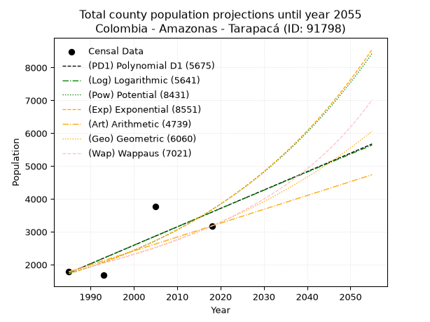
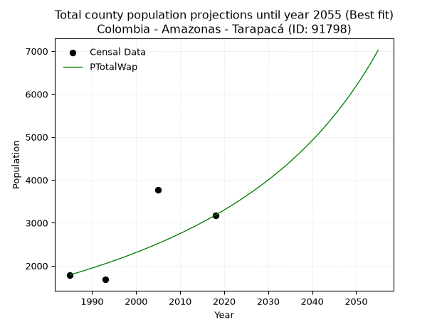
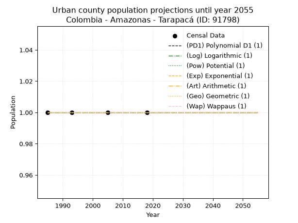
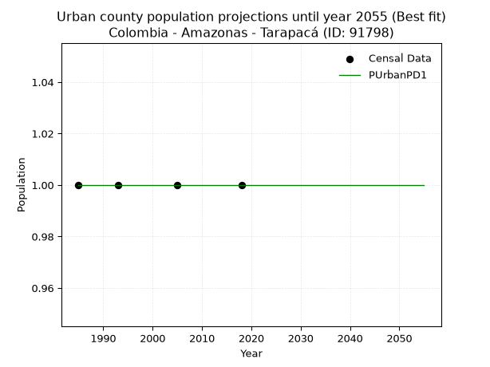
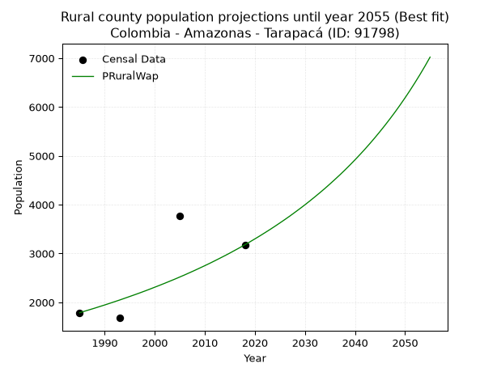

<div align="center">


</div>

# _“Population and Public Services Demand Projections (PPSD) until Year 2050 for Colombia - Amazonas - Tarapacá (ID: 91798)”_
Keywords: `population` `public-service` `projection` `lineal` `polynomial` `logarithmic` `potential` `exponential` `arithmetic` `geometric` `wappaus` `dane` `colombia` `south-america`

PPSD are analytical estimates used by governments and planners to anticipate future changes in population size, age distribution, and the resulting community needs for utilities, healthcare, education, and infrastructure as sizing future water treatment facilities, electrical grids, and road networks based on spatial growth.

> **General running parameters**: • app_version: _v20260806_. • Python version: _3.14.7_. • Pandas version: _3.0.5_. • NumPy version: _2.5.1_. • Creates, save and include plots into reports (create_plot): _False_. • Projection until year: _2050_. • Process polynomial degree 2 and up: _False_. • Process Wappaus: _True_. • Process Wappaus: _True_. • Set negative values to zero: _True_. • Set infinite values to zero: _True_. • Drop dataset notes: _True_. 
<div align="center">

Dynamic map: [:earth_americas:Google](http://maps.google.com/maps?q=-2.44975067,-70.0031501) [:earth_americas:OSM](https://www.openstreetmap.org/#map=18/-2.44975067/-70.0031501&layers=P) [:earth_americas:Bing](https://www.bing.com/maps?cp=-2.44975067~-70.0031501&lvl=18) [:earth_americas:Apple](https://maps.apple.com/frame?center=-2.44975067%2C-70.0031501&span=0.003%2C0.006)

</div>


<div align="center">

```geojson
{
  "type": "Feature",
  "geometry": {
    "type": "Point", 
    "coordinates": [-70.0031501, -2.44975067]
  }, 
  "properties": {
    "Name": "Colombia - Amazonas - Tarapacá (ID: 91798)"
  }
}
```

</div>


## 0. Census Data (4 records)

Census data are official statistics collected by a government about the people and housing in a country. They usually include counts of total population, age, sex, race, income, education, and jobs.

📅Global census file: [Population.xlsx](../data/Population.xlsx)

| Source   |   Year |   CountryID | CountryName   |   StateID | StateName   |   CountyID | CountyName   |   PTotal |   PUrban |   PRural |
|:---------|-------:|------------:|:--------------|----------:|:------------|-----------:|:-------------|---------:|---------:|---------:|
| DANE     |   1985 |          57 | Colombia      |        91 | Amazonas    |      91798 | Tarapacá     |     1788 |        1 |     1788 |
| DANE     |   1993 |          57 | Colombia      |        91 | Amazonas    |      91798 | Tarapacá     |     1680 |        1 |     1680 |
| DANE     |   2005 |          57 | Colombia      |        91 | Amazonas    |      91798 | Tarapacá     |     3775 |        1 |     3775 |
| DANE     |   2018 |          57 | Colombia      |        91 | Amazonas    |      91798 | Tarapacá     |     3179 |        1 |     3179 |

> 🔥Some records could had specific notes about the registered values or the corresponding urban or rural distribution.

## 1. Total

### 1.1. Coefficients and Parameters

* (PD1) Polynomial Deg 1: 56.060216780409725, -109528.94861501457 (lineal)
* (Log) Logarithmic: 112316.0532111924, -851109.7205026377
* (Pow) Potential: 45.7258338525163, -147.55522419470896
* (Exp) Exponential: 0.022827725169563887, 3.621032561540908e-17
* (Art) Arithmetic: Year diff. 2018 - 1985 = 33, Population diff. 3179 - 1788 = 1391, Annual growth = 42.15151515151515
* (Geo) Geometric: Year diff. 2018 - 1985 = 33, Population diff. 3179 - 1788 = 1391, Annual growth % = 0.017591392258365035
* (Wap) Wappaus: i = 1.697262538816797, Condition values only valid for < 200)

<sub>
Wappaus condition values: ['0.00', '1.70', '3.39', '5.09', '6.79', '8.49', '10.18', '11.88', '13.58', '15.28', '16.97', '18.67', '20.37', '22.06', '23.76', '25.46', '27.16', '28.85', '30.55', '32.25', '33.95', '35.64', '37.34', '39.04', '40.73', '42.43', '44.13', '45.83', '47.52', '49.22', '50.92', '52.62', '54.31', '56.01', '57.71', '59.40', '61.10', '62.80', '64.50', '66.19', '67.89', '69.59', '71.29', '72.98', '74.68', '76.38', '78.07', '79.77', '81.47', '83.17', '84.86', '86.56', '88.26', '89.95', '91.65', '93.35', '95.05', '96.74', '98.44', '100.14', '101.84', '103.53', '105.23', '106.93', '108.62', '110.32']
</sub>


### 1.2. Projected Dataset

|   Year |   CountyID |   PTotalPD1 |   PTotalLog |   PTotalPow |   PTotalExp |   PTotalArt |   PTotalGeo |   PTotalWap |
|-------:|-----------:|------------:|------------:|------------:|------------:|------------:|------------:|------------:|
|   1985 |      91798 |        1751 |        1748 |        1728 |        1730 |        1788 |        1788 |        1788 |
|   1986 |      91798 |        1807 |        1805 |        1769 |        1770 |        1830 |        1819 |        1819 |
|   1987 |      91798 |        1863 |        1861 |        1810 |        1811 |        1872 |        1851 |        1850 |
|   1988 |      91798 |        1919 |        1918 |        1852 |        1853 |        1914 |        1884 |        1881 |
|   1989 |      91798 |        1975 |        1974 |        1895 |        1895 |        1957 |        1917 |        1914 |
|   1990 |      91798 |        2031 |        2031 |        1939 |        1939 |        1999 |        1951 |        1946 |
|   1991 |      91798 |        2087 |        2087 |        1984 |        1984 |        2041 |        1985 |        1980 |
|   1992 |      91798 |        2143 |        2143 |        2030 |        2030 |        2083 |        2020 |        2014 |
|   1993 |      91798 |        2199 |        2200 |        2077 |        2077 |        2125 |        2056 |        2048 |
|   1994 |      91798 |        2255 |        2256 |        2125 |        2125 |        2167 |        2092 |        2084 |
|   1995 |      91798 |        2311 |        2313 |        2175 |        2174 |        2210 |        2129 |        2120 |
|   1996 |      91798 |        2367 |        2369 |        2225 |        2224 |        2252 |        2166 |        2156 |
|   1997 |      91798 |        2423 |        2425 |        2277 |        2275 |        2294 |        2204 |        2193 |
|   1998 |      91798 |        2479 |        2481 |        2329 |        2328 |        2336 |        2243 |        2231 |
|   1999 |      91798 |        2535 |        2537 |        2383 |        2381 |        2378 |        2282 |        2270 |
|   2000 |      91798 |        2591 |        2594 |        2439 |        2436 |        2420 |        2323 |        2310 |
|   2001 |      91798 |        2648 |        2650 |        2495 |        2493 |        2462 |        2363 |        2350 |
|   2002 |      91798 |        2704 |        2706 |        2553 |        2550 |        2505 |        2405 |        2391 |
|   2003 |      91798 |        2760 |        2762 |        2612 |        2609 |        2547 |        2447 |        2433 |
|   2004 |      91798 |        2816 |        2818 |        2672 |        2669 |        2589 |        2490 |        2475 |
|   2005 |      91798 |        2872 |        2874 |        2733 |        2731 |        2631 |        2534 |        2519 |
|   2006 |      91798 |        2928 |        2930 |        2796 |        2794 |        2673 |        2579 |        2563 |
|   2007 |      91798 |        2984 |        2986 |        2861 |        2859 |        2715 |        2624 |        2609 |
|   2008 |      91798 |        3040 |        3042 |        2927 |        2925 |        2757 |        2670 |        2655 |
|   2009 |      91798 |        3096 |        3098 |        2994 |        2992 |        2800 |        2717 |        2703 |
|   2010 |      91798 |        3152 |        3154 |        3063 |        3061 |        2842 |        2765 |        2751 |
|   2011 |      91798 |        3208 |        3210 |        3134 |        3132 |        2884 |        2814 |        2800 |
|   2012 |      91798 |        3264 |        3266 |        3206 |        3204 |        2926 |        2863 |        2851 |
|   2013 |      91798 |        3320 |        3321 |        3279 |        3278 |        2968 |        2914 |        2903 |
|   2014 |      91798 |        3376 |        3377 |        3355 |        3354 |        3010 |        2965 |        2955 |
|   2015 |      91798 |        3432 |        3433 |        3432 |        3431 |        3053 |        3017 |        3009 |
|   2016 |      91798 |        3488 |        3489 |        3510 |        3510 |        3095 |        3070 |        3065 |
|   2017 |      91798 |        3545 |        3544 |        3591 |        3592 |        3137 |        3124 |        3121 |
|   2018 |      91798 |        3601 |        3600 |        3673 |        3674 |        3179 |        3179 |        3179 |
|   2019 |      91798 |        3657 |        3656 |        3757 |        3759 |        3221 |        3235 |        3238 |
|   2020 |      91798 |        3713 |        3711 |        3843 |        3846 |        3263 |        3292 |        3299 |
|   2021 |      91798 |        3769 |        3767 |        3931 |        3935 |        3305 |        3350 |        3361 |
|   2022 |      91798 |        3825 |        3822 |        4021 |        4026 |        3348 |        3409 |        3425 |
|   2023 |      91798 |        3881 |        3878 |        4113 |        4119 |        3390 |        3469 |        3490 |
|   2024 |      91798 |        3937 |        3933 |        4207 |        4214 |        3432 |        3530 |        3557 |
|   2025 |      91798 |        3993 |        3989 |        4303 |        4311 |        3474 |        3592 |        3626 |
|   2026 |      91798 |        4049 |        4044 |        4402 |        4411 |        3516 |        3655 |        3696 |
|   2027 |      91798 |        4105 |        4100 |        4502 |        4513 |        3558 |        3719 |        3768 |
|   2028 |      91798 |        4161 |        4155 |        4605 |        4617 |        3601 |        3785 |        3843 |
|   2029 |      91798 |        4217 |        4211 |        4710 |        4723 |        3643 |        3851 |        3919 |
|   2030 |      91798 |        4273 |        4266 |        4817 |        4832 |        3685 |        3919 |        3997 |
|   2031 |      91798 |        4329 |        4321 |        4927 |        4944 |        3727 |        3988 |        4078 |
|   2032 |      91798 |        4385 |        4376 |        5039 |        5058 |        3769 |        4058 |        4161 |
|   2033 |      91798 |        4441 |        4432 |        5154 |        5175 |        3811 |        4129 |        4246 |
|   2034 |      91798 |        4498 |        4487 |        5271 |        5294 |        3853 |        4202 |        4333 |
|   2035 |      91798 |        4554 |        4542 |        5391 |        5417 |        3896 |        4276 |        4424 |
|   2036 |      91798 |        4610 |        4597 |        5513 |        5542 |        3938 |        4351 |        4517 |
|   2037 |      91798 |        4666 |        4653 |        5638 |        5670 |        3980 |        4428 |        4612 |
|   2038 |      91798 |        4722 |        4708 |        5766 |        5801 |        4022 |        4506 |        4711 |
|   2039 |      91798 |        4778 |        4763 |        5897 |        5935 |        4064 |        4585 |        4813 |
|   2040 |      91798 |        4834 |        4818 |        6031 |        6072 |        4106 |        4666 |        4918 |
|   2041 |      91798 |        4890 |        4873 |        6167 |        6212 |        4148 |        4748 |        5026 |
|   2042 |      91798 |        4946 |        4928 |        6307 |        6355 |        4191 |        4831 |        5138 |
|   2043 |      91798 |        5002 |        4983 |        6450 |        6502 |        4233 |        4916 |        5254 |
|   2044 |      91798 |        5058 |        5038 |        6596 |        6652 |        4275 |        5003 |        5374 |
|   2045 |      91798 |        5114 |        5093 |        6745 |        6806 |        4317 |        5091 |        5498 |
|   2046 |      91798 |        5170 |        5148 |        6898 |        6963 |        4359 |        5180 |        5626 |
|   2047 |      91798 |        5226 |        5203 |        7053 |        7124 |        4401 |        5271 |        5759 |
|   2048 |      91798 |        5282 |        5257 |        7213 |        7288 |        4444 |        5364 |        5896 |
|   2049 |      91798 |        5338 |        5312 |        7376 |        7456 |        4486 |        5458 |        6039 |
|   2050 |      91798 |        5394 |        5367 |        7542 |        7629 |        4528 |        5554 |        6187 |
<div align="center">

</img>

</div>


### 1.3. Best fit with absolute and relative error (%)

Relative error puts that difference into context by dividing the absolute error by the true value, creating a unitless ratio or percentage that shows the scale of the mistake.

Absolute and relative error

|   Year | Source   |   CountryID | CountryName   |   StateID | StateName   |   CountyID_x | CountyName   |   PTotal |   PUrban |   PRural |   CountyID_y |   PTotalPD1 |   PTotalLog |   PTotalPow |   PTotalExp |   PTotalArt |   PTotalGeo |   PTotalWap |   PTotalPD1AbsError |   PTotalLogAbsError |   PTotalPowAbsError |   PTotalExpAbsError |   PTotalArtAbsError |   PTotalGeoAbsError |   PTotalWapAbsError |   PTotalPD1RelError |   PTotalLogRelError |   PTotalPowRelError |   PTotalExpRelError |   PTotalArtRelError |   PTotalGeoRelError |   PTotalWapRelError |
|-------:|:---------|------------:|:--------------|----------:|:------------|-------------:|:-------------|---------:|---------:|---------:|-------------:|------------:|------------:|------------:|------------:|------------:|------------:|------------:|--------------------:|--------------------:|--------------------:|--------------------:|--------------------:|--------------------:|--------------------:|--------------------:|--------------------:|--------------------:|--------------------:|--------------------:|--------------------:|--------------------:|
|   1985 | DANE     |          57 | Colombia      |        91 | Amazonas    |        91798 | Tarapacá     |     1788 |        1 |     1788 |        91798 |        1751 |        1748 |        1728 |        1730 |        1788 |        1788 |        1788 |                  37 |                  40 |                  60 |                  58 |                   0 |                   0 |                   0 |             2.06935 |             2.23714 |              3.3557 |             3.24385 |              0      |              0      |              0      |
|   1993 | DANE     |          57 | Colombia      |        91 | Amazonas    |        91798 | Tarapacá     |     1680 |        1 |     1680 |        91798 |        2199 |        2200 |        2077 |        2077 |        2125 |        2056 |        2048 |                 519 |                 520 |                 397 |                 397 |                 445 |                 376 |                 368 |            30.8929  |            30.9524  |             23.631  |            23.631   |             26.4881 |             22.381  |             21.9048 |
|   2005 | DANE     |          57 | Colombia      |        91 | Amazonas    |        91798 | Tarapacá     |     3775 |        1 |     3775 |        91798 |        2872 |        2874 |        2733 |        2731 |        2631 |        2534 |        2519 |                 903 |                 901 |                1042 |                1044 |                1144 |                1241 |                1256 |            23.9205  |            23.8675  |             27.6026 |            27.6556  |             30.3046 |             32.8742 |             33.2715 |
|   2018 | DANE     |          57 | Colombia      |        91 | Amazonas    |        91798 | Tarapacá     |     3179 |        1 |     3179 |        91798 |        3601 |        3600 |        3673 |        3674 |        3179 |        3179 |        3179 |                 422 |                 421 |                 494 |                 495 |                   0 |                   0 |                   0 |            13.2746  |            13.2432  |             15.5395 |            15.5709  |              0      |              0      |              0      |

Relative error mean

| Method    |   RelError | Best   |
|:----------|-----------:|:-------|
| PTotalPD1 |    17.5393 |        |
| PTotalLog |    17.5751 |        |
| PTotalPow |    17.5322 |        |
| PTotalExp |    17.5253 |        |
| PTotalArt |    14.1982 |        |
| PTotalGeo |    13.8138 |        |
| PTotalWap |    13.7941 | True   |

💙Best method: _**PTotalWap**_
<div align="center">

</img>

</div>


### 1.4. Fresh water supply demand in liters per capita per day (lpcd)

The fresh water supply demand typically ranges from 100 to 300 liters per capita per day (lpcd) for standard domestic and municipal planning, though absolute survival minimums set by the World Health Organization are as low as 7.5 to 20 liters per day, and total consumption in high-income nations can exceed 400 liters.

> `CZ`: Level in meters above the sea level (masl).<br> `WS`: Fresh water supply demand in liters per capita per day (lpcd or l/h/d).<br> `WSAll`: Zonal fresh water supply demand in liters per second (l/s).<br> `A`: Zonal area in square meters.

Reference values (RAS Colombia)

|    CZ |   WS |
|------:|-----:|
|  1000 |  120 |
|  2000 |  130 |
| 99999 |  140 |

County shapefile geometry properties and water supply values

|   CountyID |      ATotal |   CZTotal |   WSTotal |
|-----------:|------------:|----------:|----------:|
|      91798 | 9.03983e+09 |   115.987 |       120 |

Projected values for best method: PTotalWap

|   CountyID |   Year |   PTotalWap |   WSTotal |   WSTotalAll |
|-----------:|-------:|------------:|----------:|-------------:|
|      91798 |   1985 |        1788 |       120 |      2.48333 |
|      91798 |   1986 |        1819 |       120 |      2.52639 |
|      91798 |   1987 |        1850 |       120 |      2.56944 |
|      91798 |   1988 |        1881 |       120 |      2.6125  |
|      91798 |   1989 |        1914 |       120 |      2.65833 |
|      91798 |   1990 |        1946 |       120 |      2.70278 |
|      91798 |   1991 |        1980 |       120 |      2.75    |
|      91798 |   1992 |        2014 |       120 |      2.79722 |
|      91798 |   1993 |        2048 |       120 |      2.84444 |
|      91798 |   1994 |        2084 |       120 |      2.89444 |
|      91798 |   1995 |        2120 |       120 |      2.94444 |
|      91798 |   1996 |        2156 |       120 |      2.99444 |
|      91798 |   1997 |        2193 |       120 |      3.04583 |
|      91798 |   1998 |        2231 |       120 |      3.09861 |
|      91798 |   1999 |        2270 |       120 |      3.15278 |
|      91798 |   2000 |        2310 |       120 |      3.20833 |
|      91798 |   2001 |        2350 |       120 |      3.26389 |
|      91798 |   2002 |        2391 |       120 |      3.32083 |
|      91798 |   2003 |        2433 |       120 |      3.37917 |
|      91798 |   2004 |        2475 |       120 |      3.4375  |
|      91798 |   2005 |        2519 |       120 |      3.49861 |
|      91798 |   2006 |        2563 |       120 |      3.55972 |
|      91798 |   2007 |        2609 |       120 |      3.62361 |
|      91798 |   2008 |        2655 |       120 |      3.6875  |
|      91798 |   2009 |        2703 |       120 |      3.75417 |
|      91798 |   2010 |        2751 |       120 |      3.82083 |
|      91798 |   2011 |        2800 |       120 |      3.88889 |
|      91798 |   2012 |        2851 |       120 |      3.95972 |
|      91798 |   2013 |        2903 |       120 |      4.03194 |
|      91798 |   2014 |        2955 |       120 |      4.10417 |
|      91798 |   2015 |        3009 |       120 |      4.17917 |
|      91798 |   2016 |        3065 |       120 |      4.25694 |
|      91798 |   2017 |        3121 |       120 |      4.33472 |
|      91798 |   2018 |        3179 |       120 |      4.41528 |
|      91798 |   2019 |        3238 |       120 |      4.49722 |
|      91798 |   2020 |        3299 |       120 |      4.58194 |
|      91798 |   2021 |        3361 |       120 |      4.66806 |
|      91798 |   2022 |        3425 |       120 |      4.75694 |
|      91798 |   2023 |        3490 |       120 |      4.84722 |
|      91798 |   2024 |        3557 |       120 |      4.94028 |
|      91798 |   2025 |        3626 |       120 |      5.03611 |
|      91798 |   2026 |        3696 |       120 |      5.13333 |
|      91798 |   2027 |        3768 |       120 |      5.23333 |
|      91798 |   2028 |        3843 |       120 |      5.3375  |
|      91798 |   2029 |        3919 |       120 |      5.44306 |
|      91798 |   2030 |        3997 |       120 |      5.55139 |
|      91798 |   2031 |        4078 |       120 |      5.66389 |
|      91798 |   2032 |        4161 |       120 |      5.77917 |
|      91798 |   2033 |        4246 |       120 |      5.89722 |
|      91798 |   2034 |        4333 |       120 |      6.01806 |
|      91798 |   2035 |        4424 |       120 |      6.14444 |
|      91798 |   2036 |        4517 |       120 |      6.27361 |
|      91798 |   2037 |        4612 |       120 |      6.40556 |
|      91798 |   2038 |        4711 |       120 |      6.54306 |
|      91798 |   2039 |        4813 |       120 |      6.68472 |
|      91798 |   2040 |        4918 |       120 |      6.83056 |
|      91798 |   2041 |        5026 |       120 |      6.98056 |
|      91798 |   2042 |        5138 |       120 |      7.13611 |
|      91798 |   2043 |        5254 |       120 |      7.29722 |
|      91798 |   2044 |        5374 |       120 |      7.46389 |
|      91798 |   2045 |        5498 |       120 |      7.63611 |
|      91798 |   2046 |        5626 |       120 |      7.81389 |
|      91798 |   2047 |        5759 |       120 |      7.99861 |
|      91798 |   2048 |        5896 |       120 |      8.18889 |
|      91798 |   2049 |        6039 |       120 |      8.3875  |
|      91798 |   2050 |        6187 |       120 |      8.59306 |

## 2. Urban

### 2.1. Coefficients and Parameters

* (PD1) Polynomial Deg 1: -1.3233529347183512e-19, 1.0000000000000004 (lineal)
* (Log) Logarithmic: 3.215569112241165e-17, 0.9999999999999996
* (Pow) Potential: 0.0, 0.0
* (Exp) Exponential: 0.0, 1.0
* (Art) Arithmetic: Year diff. 2018 - 1985 = 33, Population diff. 1 - 1 = 0, Annual growth = 0.0
* (Geo) Geometric: Year diff. 2018 - 1985 = 33, Population diff. 1 - 1 = 0, Annual growth % = 0.0
* (Wap) Wappaus: i = 0.0, Condition values only valid for < 200)

<sub>
Wappaus condition values: ['0.00', '0.00', '0.00', '0.00', '0.00', '0.00', '0.00', '0.00', '0.00', '0.00', '0.00', '0.00', '0.00', '0.00', '0.00', '0.00', '0.00', '0.00', '0.00', '0.00', '0.00', '0.00', '0.00', '0.00', '0.00', '0.00', '0.00', '0.00', '0.00', '0.00', '0.00', '0.00', '0.00', '0.00', '0.00', '0.00', '0.00', '0.00', '0.00', '0.00', '0.00', '0.00', '0.00', '0.00', '0.00', '0.00', '0.00', '0.00', '0.00', '0.00', '0.00', '0.00', '0.00', '0.00', '0.00', '0.00', '0.00', '0.00', '0.00', '0.00', '0.00', '0.00', '0.00', '0.00', '0.00', '0.00']
</sub>


### 2.2. Projected Dataset

|   Year |   CountyID |   PUrbanPD1 |   PUrbanLog |   PUrbanPow |   PUrbanExp |   PUrbanArt |   PUrbanGeo |   PUrbanWap |
|-------:|-----------:|------------:|------------:|------------:|------------:|------------:|------------:|------------:|
|   1985 |      91798 |           1 |           1 |           1 |           1 |           1 |           1 |           1 |
|   1986 |      91798 |           1 |           1 |           1 |           1 |           1 |           1 |           1 |
|   1987 |      91798 |           1 |           1 |           1 |           1 |           1 |           1 |           1 |
|   1988 |      91798 |           1 |           1 |           1 |           1 |           1 |           1 |           1 |
|   1989 |      91798 |           1 |           1 |           1 |           1 |           1 |           1 |           1 |
|   1990 |      91798 |           1 |           1 |           1 |           1 |           1 |           1 |           1 |
|   1991 |      91798 |           1 |           1 |           1 |           1 |           1 |           1 |           1 |
|   1992 |      91798 |           1 |           1 |           1 |           1 |           1 |           1 |           1 |
|   1993 |      91798 |           1 |           1 |           1 |           1 |           1 |           1 |           1 |
|   1994 |      91798 |           1 |           1 |           1 |           1 |           1 |           1 |           1 |
|   1995 |      91798 |           1 |           1 |           1 |           1 |           1 |           1 |           1 |
|   1996 |      91798 |           1 |           1 |           1 |           1 |           1 |           1 |           1 |
|   1997 |      91798 |           1 |           1 |           1 |           1 |           1 |           1 |           1 |
|   1998 |      91798 |           1 |           1 |           1 |           1 |           1 |           1 |           1 |
|   1999 |      91798 |           1 |           1 |           1 |           1 |           1 |           1 |           1 |
|   2000 |      91798 |           1 |           1 |           1 |           1 |           1 |           1 |           1 |
|   2001 |      91798 |           1 |           1 |           1 |           1 |           1 |           1 |           1 |
|   2002 |      91798 |           1 |           1 |           1 |           1 |           1 |           1 |           1 |
|   2003 |      91798 |           1 |           1 |           1 |           1 |           1 |           1 |           1 |
|   2004 |      91798 |           1 |           1 |           1 |           1 |           1 |           1 |           1 |
|   2005 |      91798 |           1 |           1 |           1 |           1 |           1 |           1 |           1 |
|   2006 |      91798 |           1 |           1 |           1 |           1 |           1 |           1 |           1 |
|   2007 |      91798 |           1 |           1 |           1 |           1 |           1 |           1 |           1 |
|   2008 |      91798 |           1 |           1 |           1 |           1 |           1 |           1 |           1 |
|   2009 |      91798 |           1 |           1 |           1 |           1 |           1 |           1 |           1 |
|   2010 |      91798 |           1 |           1 |           1 |           1 |           1 |           1 |           1 |
|   2011 |      91798 |           1 |           1 |           1 |           1 |           1 |           1 |           1 |
|   2012 |      91798 |           1 |           1 |           1 |           1 |           1 |           1 |           1 |
|   2013 |      91798 |           1 |           1 |           1 |           1 |           1 |           1 |           1 |
|   2014 |      91798 |           1 |           1 |           1 |           1 |           1 |           1 |           1 |
|   2015 |      91798 |           1 |           1 |           1 |           1 |           1 |           1 |           1 |
|   2016 |      91798 |           1 |           1 |           1 |           1 |           1 |           1 |           1 |
|   2017 |      91798 |           1 |           1 |           1 |           1 |           1 |           1 |           1 |
|   2018 |      91798 |           1 |           1 |           1 |           1 |           1 |           1 |           1 |
|   2019 |      91798 |           1 |           1 |           1 |           1 |           1 |           1 |           1 |
|   2020 |      91798 |           1 |           1 |           1 |           1 |           1 |           1 |           1 |
|   2021 |      91798 |           1 |           1 |           1 |           1 |           1 |           1 |           1 |
|   2022 |      91798 |           1 |           1 |           1 |           1 |           1 |           1 |           1 |
|   2023 |      91798 |           1 |           1 |           1 |           1 |           1 |           1 |           1 |
|   2024 |      91798 |           1 |           1 |           1 |           1 |           1 |           1 |           1 |
|   2025 |      91798 |           1 |           1 |           1 |           1 |           1 |           1 |           1 |
|   2026 |      91798 |           1 |           1 |           1 |           1 |           1 |           1 |           1 |
|   2027 |      91798 |           1 |           1 |           1 |           1 |           1 |           1 |           1 |
|   2028 |      91798 |           1 |           1 |           1 |           1 |           1 |           1 |           1 |
|   2029 |      91798 |           1 |           1 |           1 |           1 |           1 |           1 |           1 |
|   2030 |      91798 |           1 |           1 |           1 |           1 |           1 |           1 |           1 |
|   2031 |      91798 |           1 |           1 |           1 |           1 |           1 |           1 |           1 |
|   2032 |      91798 |           1 |           1 |           1 |           1 |           1 |           1 |           1 |
|   2033 |      91798 |           1 |           1 |           1 |           1 |           1 |           1 |           1 |
|   2034 |      91798 |           1 |           1 |           1 |           1 |           1 |           1 |           1 |
|   2035 |      91798 |           1 |           1 |           1 |           1 |           1 |           1 |           1 |
|   2036 |      91798 |           1 |           1 |           1 |           1 |           1 |           1 |           1 |
|   2037 |      91798 |           1 |           1 |           1 |           1 |           1 |           1 |           1 |
|   2038 |      91798 |           1 |           1 |           1 |           1 |           1 |           1 |           1 |
|   2039 |      91798 |           1 |           1 |           1 |           1 |           1 |           1 |           1 |
|   2040 |      91798 |           1 |           1 |           1 |           1 |           1 |           1 |           1 |
|   2041 |      91798 |           1 |           1 |           1 |           1 |           1 |           1 |           1 |
|   2042 |      91798 |           1 |           1 |           1 |           1 |           1 |           1 |           1 |
|   2043 |      91798 |           1 |           1 |           1 |           1 |           1 |           1 |           1 |
|   2044 |      91798 |           1 |           1 |           1 |           1 |           1 |           1 |           1 |
|   2045 |      91798 |           1 |           1 |           1 |           1 |           1 |           1 |           1 |
|   2046 |      91798 |           1 |           1 |           1 |           1 |           1 |           1 |           1 |
|   2047 |      91798 |           1 |           1 |           1 |           1 |           1 |           1 |           1 |
|   2048 |      91798 |           1 |           1 |           1 |           1 |           1 |           1 |           1 |
|   2049 |      91798 |           1 |           1 |           1 |           1 |           1 |           1 |           1 |
|   2050 |      91798 |           1 |           1 |           1 |           1 |           1 |           1 |           1 |
<div align="center">

</img>

</div>


### 2.3. Best fit with absolute and relative error (%)

Relative error puts that difference into context by dividing the absolute error by the true value, creating a unitless ratio or percentage that shows the scale of the mistake.

Absolute and relative error

|   Year | Source   |   CountryID | CountryName   |   StateID | StateName   |   CountyID_x | CountyName   |   PTotal |   PUrban |   PRural |   CountyID_y |   PUrbanPD1 |   PUrbanLog |   PUrbanPow |   PUrbanExp |   PUrbanArt |   PUrbanGeo |   PUrbanWap |   PUrbanPD1AbsError |   PUrbanLogAbsError |   PUrbanPowAbsError |   PUrbanExpAbsError |   PUrbanArtAbsError |   PUrbanGeoAbsError |   PUrbanWapAbsError |   PUrbanPD1RelError |   PUrbanLogRelError |   PUrbanPowRelError |   PUrbanExpRelError |   PUrbanArtRelError |   PUrbanGeoRelError |   PUrbanWapRelError |
|-------:|:---------|------------:|:--------------|----------:|:------------|-------------:|:-------------|---------:|---------:|---------:|-------------:|------------:|------------:|------------:|------------:|------------:|------------:|------------:|--------------------:|--------------------:|--------------------:|--------------------:|--------------------:|--------------------:|--------------------:|--------------------:|--------------------:|--------------------:|--------------------:|--------------------:|--------------------:|--------------------:|
|   1985 | DANE     |          57 | Colombia      |        91 | Amazonas    |        91798 | Tarapacá     |     1788 |        1 |     1788 |        91798 |           1 |           1 |           1 |           1 |           1 |           1 |           1 |                   0 |                   0 |                   0 |                   0 |                   0 |                   0 |                   0 |                   0 |                   0 |                   0 |                   0 |                   0 |                   0 |                   0 |
|   1993 | DANE     |          57 | Colombia      |        91 | Amazonas    |        91798 | Tarapacá     |     1680 |        1 |     1680 |        91798 |           1 |           1 |           1 |           1 |           1 |           1 |           1 |                   0 |                   0 |                   0 |                   0 |                   0 |                   0 |                   0 |                   0 |                   0 |                   0 |                   0 |                   0 |                   0 |                   0 |
|   2005 | DANE     |          57 | Colombia      |        91 | Amazonas    |        91798 | Tarapacá     |     3775 |        1 |     3775 |        91798 |           1 |           1 |           1 |           1 |           1 |           1 |           1 |                   0 |                   0 |                   0 |                   0 |                   0 |                   0 |                   0 |                   0 |                   0 |                   0 |                   0 |                   0 |                   0 |                   0 |
|   2018 | DANE     |          57 | Colombia      |        91 | Amazonas    |        91798 | Tarapacá     |     3179 |        1 |     3179 |        91798 |           1 |           1 |           1 |           1 |           1 |           1 |           1 |                   0 |                   0 |                   0 |                   0 |                   0 |                   0 |                   0 |                   0 |                   0 |                   0 |                   0 |                   0 |                   0 |                   0 |

Relative error mean

| Method    |   RelError | Best   |
|:----------|-----------:|:-------|
| PUrbanPD1 |          0 | True   |
| PUrbanLog |          0 | True   |
| PUrbanPow |          0 | True   |
| PUrbanExp |          0 | True   |
| PUrbanArt |          0 | True   |
| PUrbanGeo |          0 | True   |
| PUrbanWap |          0 | True   |

💙Best method: _**PUrbanPD1**_
<div align="center">

</img>

</div>


### 2.4. Fresh water supply demand in liters per capita per day (lpcd)

The fresh water supply demand typically ranges from 100 to 300 liters per capita per day (lpcd) for standard domestic and municipal planning, though absolute survival minimums set by the World Health Organization are as low as 7.5 to 20 liters per day, and total consumption in high-income nations can exceed 400 liters.

> `CZ`: Level in meters above the sea level (masl).<br> `WS`: Fresh water supply demand in liters per capita per day (lpcd or l/h/d).<br> `WSAll`: Zonal fresh water supply demand in liters per second (l/s).<br> `A`: Zonal area in square meters.

Reference values (RAS Colombia)

|    CZ |   WS |
|------:|-----:|
|  1000 |  120 |
|  2000 |  130 |
| 99999 |  140 |

County shapefile geometry properties and water supply values

|   CountyID |   AUrban |   CZUrban |   WSUrban |
|-----------:|---------:|----------:|----------:|
|      91798 |        0 |         0 |       120 |

Projected values for best method: PUrbanPD1

|   CountyID |   Year |   PUrbanPD1 |   WSUrban |   WSUrbanAll |
|-----------:|-------:|------------:|----------:|-------------:|
|      91798 |   1985 |           1 |       120 |   0.00138889 |
|      91798 |   1986 |           1 |       120 |   0.00138889 |
|      91798 |   1987 |           1 |       120 |   0.00138889 |
|      91798 |   1988 |           1 |       120 |   0.00138889 |
|      91798 |   1989 |           1 |       120 |   0.00138889 |
|      91798 |   1990 |           1 |       120 |   0.00138889 |
|      91798 |   1991 |           1 |       120 |   0.00138889 |
|      91798 |   1992 |           1 |       120 |   0.00138889 |
|      91798 |   1993 |           1 |       120 |   0.00138889 |
|      91798 |   1994 |           1 |       120 |   0.00138889 |
|      91798 |   1995 |           1 |       120 |   0.00138889 |
|      91798 |   1996 |           1 |       120 |   0.00138889 |
|      91798 |   1997 |           1 |       120 |   0.00138889 |
|      91798 |   1998 |           1 |       120 |   0.00138889 |
|      91798 |   1999 |           1 |       120 |   0.00138889 |
|      91798 |   2000 |           1 |       120 |   0.00138889 |
|      91798 |   2001 |           1 |       120 |   0.00138889 |
|      91798 |   2002 |           1 |       120 |   0.00138889 |
|      91798 |   2003 |           1 |       120 |   0.00138889 |
|      91798 |   2004 |           1 |       120 |   0.00138889 |
|      91798 |   2005 |           1 |       120 |   0.00138889 |
|      91798 |   2006 |           1 |       120 |   0.00138889 |
|      91798 |   2007 |           1 |       120 |   0.00138889 |
|      91798 |   2008 |           1 |       120 |   0.00138889 |
|      91798 |   2009 |           1 |       120 |   0.00138889 |
|      91798 |   2010 |           1 |       120 |   0.00138889 |
|      91798 |   2011 |           1 |       120 |   0.00138889 |
|      91798 |   2012 |           1 |       120 |   0.00138889 |
|      91798 |   2013 |           1 |       120 |   0.00138889 |
|      91798 |   2014 |           1 |       120 |   0.00138889 |
|      91798 |   2015 |           1 |       120 |   0.00138889 |
|      91798 |   2016 |           1 |       120 |   0.00138889 |
|      91798 |   2017 |           1 |       120 |   0.00138889 |
|      91798 |   2018 |           1 |       120 |   0.00138889 |
|      91798 |   2019 |           1 |       120 |   0.00138889 |
|      91798 |   2020 |           1 |       120 |   0.00138889 |
|      91798 |   2021 |           1 |       120 |   0.00138889 |
|      91798 |   2022 |           1 |       120 |   0.00138889 |
|      91798 |   2023 |           1 |       120 |   0.00138889 |
|      91798 |   2024 |           1 |       120 |   0.00138889 |
|      91798 |   2025 |           1 |       120 |   0.00138889 |
|      91798 |   2026 |           1 |       120 |   0.00138889 |
|      91798 |   2027 |           1 |       120 |   0.00138889 |
|      91798 |   2028 |           1 |       120 |   0.00138889 |
|      91798 |   2029 |           1 |       120 |   0.00138889 |
|      91798 |   2030 |           1 |       120 |   0.00138889 |
|      91798 |   2031 |           1 |       120 |   0.00138889 |
|      91798 |   2032 |           1 |       120 |   0.00138889 |
|      91798 |   2033 |           1 |       120 |   0.00138889 |
|      91798 |   2034 |           1 |       120 |   0.00138889 |
|      91798 |   2035 |           1 |       120 |   0.00138889 |
|      91798 |   2036 |           1 |       120 |   0.00138889 |
|      91798 |   2037 |           1 |       120 |   0.00138889 |
|      91798 |   2038 |           1 |       120 |   0.00138889 |
|      91798 |   2039 |           1 |       120 |   0.00138889 |
|      91798 |   2040 |           1 |       120 |   0.00138889 |
|      91798 |   2041 |           1 |       120 |   0.00138889 |
|      91798 |   2042 |           1 |       120 |   0.00138889 |
|      91798 |   2043 |           1 |       120 |   0.00138889 |
|      91798 |   2044 |           1 |       120 |   0.00138889 |
|      91798 |   2045 |           1 |       120 |   0.00138889 |
|      91798 |   2046 |           1 |       120 |   0.00138889 |
|      91798 |   2047 |           1 |       120 |   0.00138889 |
|      91798 |   2048 |           1 |       120 |   0.00138889 |
|      91798 |   2049 |           1 |       120 |   0.00138889 |
|      91798 |   2050 |           1 |       120 |   0.00138889 |

## 3. Rural

### 3.1. Coefficients and Parameters

* (PD1) Polynomial Deg 1: 56.060216780409725, -109528.94861501457 (lineal)
* (Log) Logarithmic: 112316.0532111924, -851109.7205026377
* (Pow) Potential: 45.7258338525163, -147.55522419470896
* (Exp) Exponential: 0.022827725169563887, 3.621032561540908e-17
* (Art) Arithmetic: Year diff. 2018 - 1985 = 33, Population diff. 3179 - 1788 = 1391, Annual growth = 42.15151515151515
* (Geo) Geometric: Year diff. 2018 - 1985 = 33, Population diff. 3179 - 1788 = 1391, Annual growth % = 0.017591392258365035
* (Wap) Wappaus: i = 1.697262538816797, Condition values only valid for < 200)

<sub>
Wappaus condition values: ['0.00', '1.70', '3.39', '5.09', '6.79', '8.49', '10.18', '11.88', '13.58', '15.28', '16.97', '18.67', '20.37', '22.06', '23.76', '25.46', '27.16', '28.85', '30.55', '32.25', '33.95', '35.64', '37.34', '39.04', '40.73', '42.43', '44.13', '45.83', '47.52', '49.22', '50.92', '52.62', '54.31', '56.01', '57.71', '59.40', '61.10', '62.80', '64.50', '66.19', '67.89', '69.59', '71.29', '72.98', '74.68', '76.38', '78.07', '79.77', '81.47', '83.17', '84.86', '86.56', '88.26', '89.95', '91.65', '93.35', '95.05', '96.74', '98.44', '100.14', '101.84', '103.53', '105.23', '106.93', '108.62', '110.32']
</sub>


### 3.2. Projected Dataset

|   Year |   CountyID |   PRuralPD1 |   PRuralLog |   PRuralPow |   PRuralExp |   PRuralArt |   PRuralGeo |   PRuralWap |
|-------:|-----------:|------------:|------------:|------------:|------------:|------------:|------------:|------------:|
|   1985 |      91798 |        1751 |        1748 |        1728 |        1730 |        1788 |        1788 |        1788 |
|   1986 |      91798 |        1807 |        1805 |        1769 |        1770 |        1830 |        1819 |        1819 |
|   1987 |      91798 |        1863 |        1861 |        1810 |        1811 |        1872 |        1851 |        1850 |
|   1988 |      91798 |        1919 |        1918 |        1852 |        1853 |        1914 |        1884 |        1881 |
|   1989 |      91798 |        1975 |        1974 |        1895 |        1895 |        1957 |        1917 |        1914 |
|   1990 |      91798 |        2031 |        2031 |        1939 |        1939 |        1999 |        1951 |        1946 |
|   1991 |      91798 |        2087 |        2087 |        1984 |        1984 |        2041 |        1985 |        1980 |
|   1992 |      91798 |        2143 |        2143 |        2030 |        2030 |        2083 |        2020 |        2014 |
|   1993 |      91798 |        2199 |        2200 |        2077 |        2077 |        2125 |        2056 |        2048 |
|   1994 |      91798 |        2255 |        2256 |        2125 |        2125 |        2167 |        2092 |        2084 |
|   1995 |      91798 |        2311 |        2313 |        2175 |        2174 |        2210 |        2129 |        2120 |
|   1996 |      91798 |        2367 |        2369 |        2225 |        2224 |        2252 |        2166 |        2156 |
|   1997 |      91798 |        2423 |        2425 |        2277 |        2275 |        2294 |        2204 |        2193 |
|   1998 |      91798 |        2479 |        2481 |        2329 |        2328 |        2336 |        2243 |        2231 |
|   1999 |      91798 |        2535 |        2537 |        2383 |        2381 |        2378 |        2282 |        2270 |
|   2000 |      91798 |        2591 |        2594 |        2439 |        2436 |        2420 |        2323 |        2310 |
|   2001 |      91798 |        2648 |        2650 |        2495 |        2493 |        2462 |        2363 |        2350 |
|   2002 |      91798 |        2704 |        2706 |        2553 |        2550 |        2505 |        2405 |        2391 |
|   2003 |      91798 |        2760 |        2762 |        2612 |        2609 |        2547 |        2447 |        2433 |
|   2004 |      91798 |        2816 |        2818 |        2672 |        2669 |        2589 |        2490 |        2475 |
|   2005 |      91798 |        2872 |        2874 |        2733 |        2731 |        2631 |        2534 |        2519 |
|   2006 |      91798 |        2928 |        2930 |        2796 |        2794 |        2673 |        2579 |        2563 |
|   2007 |      91798 |        2984 |        2986 |        2861 |        2859 |        2715 |        2624 |        2609 |
|   2008 |      91798 |        3040 |        3042 |        2927 |        2925 |        2757 |        2670 |        2655 |
|   2009 |      91798 |        3096 |        3098 |        2994 |        2992 |        2800 |        2717 |        2703 |
|   2010 |      91798 |        3152 |        3154 |        3063 |        3061 |        2842 |        2765 |        2751 |
|   2011 |      91798 |        3208 |        3210 |        3134 |        3132 |        2884 |        2814 |        2800 |
|   2012 |      91798 |        3264 |        3266 |        3206 |        3204 |        2926 |        2863 |        2851 |
|   2013 |      91798 |        3320 |        3321 |        3279 |        3278 |        2968 |        2914 |        2903 |
|   2014 |      91798 |        3376 |        3377 |        3355 |        3354 |        3010 |        2965 |        2955 |
|   2015 |      91798 |        3432 |        3433 |        3432 |        3431 |        3053 |        3017 |        3009 |
|   2016 |      91798 |        3488 |        3489 |        3510 |        3510 |        3095 |        3070 |        3065 |
|   2017 |      91798 |        3545 |        3544 |        3591 |        3592 |        3137 |        3124 |        3121 |
|   2018 |      91798 |        3601 |        3600 |        3673 |        3674 |        3179 |        3179 |        3179 |
|   2019 |      91798 |        3657 |        3656 |        3757 |        3759 |        3221 |        3235 |        3238 |
|   2020 |      91798 |        3713 |        3711 |        3843 |        3846 |        3263 |        3292 |        3299 |
|   2021 |      91798 |        3769 |        3767 |        3931 |        3935 |        3305 |        3350 |        3361 |
|   2022 |      91798 |        3825 |        3822 |        4021 |        4026 |        3348 |        3409 |        3425 |
|   2023 |      91798 |        3881 |        3878 |        4113 |        4119 |        3390 |        3469 |        3490 |
|   2024 |      91798 |        3937 |        3933 |        4207 |        4214 |        3432 |        3530 |        3557 |
|   2025 |      91798 |        3993 |        3989 |        4303 |        4311 |        3474 |        3592 |        3626 |
|   2026 |      91798 |        4049 |        4044 |        4402 |        4411 |        3516 |        3655 |        3696 |
|   2027 |      91798 |        4105 |        4100 |        4502 |        4513 |        3558 |        3719 |        3768 |
|   2028 |      91798 |        4161 |        4155 |        4605 |        4617 |        3601 |        3785 |        3843 |
|   2029 |      91798 |        4217 |        4211 |        4710 |        4723 |        3643 |        3851 |        3919 |
|   2030 |      91798 |        4273 |        4266 |        4817 |        4832 |        3685 |        3919 |        3997 |
|   2031 |      91798 |        4329 |        4321 |        4927 |        4944 |        3727 |        3988 |        4078 |
|   2032 |      91798 |        4385 |        4376 |        5039 |        5058 |        3769 |        4058 |        4161 |
|   2033 |      91798 |        4441 |        4432 |        5154 |        5175 |        3811 |        4129 |        4246 |
|   2034 |      91798 |        4498 |        4487 |        5271 |        5294 |        3853 |        4202 |        4333 |
|   2035 |      91798 |        4554 |        4542 |        5391 |        5417 |        3896 |        4276 |        4424 |
|   2036 |      91798 |        4610 |        4597 |        5513 |        5542 |        3938 |        4351 |        4517 |
|   2037 |      91798 |        4666 |        4653 |        5638 |        5670 |        3980 |        4428 |        4612 |
|   2038 |      91798 |        4722 |        4708 |        5766 |        5801 |        4022 |        4506 |        4711 |
|   2039 |      91798 |        4778 |        4763 |        5897 |        5935 |        4064 |        4585 |        4813 |
|   2040 |      91798 |        4834 |        4818 |        6031 |        6072 |        4106 |        4666 |        4918 |
|   2041 |      91798 |        4890 |        4873 |        6167 |        6212 |        4148 |        4748 |        5026 |
|   2042 |      91798 |        4946 |        4928 |        6307 |        6355 |        4191 |        4831 |        5138 |
|   2043 |      91798 |        5002 |        4983 |        6450 |        6502 |        4233 |        4916 |        5254 |
|   2044 |      91798 |        5058 |        5038 |        6596 |        6652 |        4275 |        5003 |        5374 |
|   2045 |      91798 |        5114 |        5093 |        6745 |        6806 |        4317 |        5091 |        5498 |
|   2046 |      91798 |        5170 |        5148 |        6898 |        6963 |        4359 |        5180 |        5626 |
|   2047 |      91798 |        5226 |        5203 |        7053 |        7124 |        4401 |        5271 |        5759 |
|   2048 |      91798 |        5282 |        5257 |        7213 |        7288 |        4444 |        5364 |        5896 |
|   2049 |      91798 |        5338 |        5312 |        7376 |        7456 |        4486 |        5458 |        6039 |
|   2050 |      91798 |        5394 |        5367 |        7542 |        7629 |        4528 |        5554 |        6187 |
<div align="center">

</img>

</div>


### 3.3. Best fit with absolute and relative error (%)

Relative error puts that difference into context by dividing the absolute error by the true value, creating a unitless ratio or percentage that shows the scale of the mistake.

Absolute and relative error

|   Year | Source   |   CountryID | CountryName   |   StateID | StateName   |   CountyID_x | CountyName   |   PTotal |   PUrban |   PRural |   CountyID_y |   PRuralPD1 |   PRuralLog |   PRuralPow |   PRuralExp |   PRuralArt |   PRuralGeo |   PRuralWap |   PRuralPD1AbsError |   PRuralLogAbsError |   PRuralPowAbsError |   PRuralExpAbsError |   PRuralArtAbsError |   PRuralGeoAbsError |   PRuralWapAbsError |   PRuralPD1RelError |   PRuralLogRelError |   PRuralPowRelError |   PRuralExpRelError |   PRuralArtRelError |   PRuralGeoRelError |   PRuralWapRelError |
|-------:|:---------|------------:|:--------------|----------:|:------------|-------------:|:-------------|---------:|---------:|---------:|-------------:|------------:|------------:|------------:|------------:|------------:|------------:|------------:|--------------------:|--------------------:|--------------------:|--------------------:|--------------------:|--------------------:|--------------------:|--------------------:|--------------------:|--------------------:|--------------------:|--------------------:|--------------------:|--------------------:|
|   1985 | DANE     |          57 | Colombia      |        91 | Amazonas    |        91798 | Tarapacá     |     1788 |        1 |     1788 |        91798 |        1751 |        1748 |        1728 |        1730 |        1788 |        1788 |        1788 |                  37 |                  40 |                  60 |                  58 |                   0 |                   0 |                   0 |             2.06935 |             2.23714 |              3.3557 |             3.24385 |              0      |              0      |              0      |
|   1993 | DANE     |          57 | Colombia      |        91 | Amazonas    |        91798 | Tarapacá     |     1680 |        1 |     1680 |        91798 |        2199 |        2200 |        2077 |        2077 |        2125 |        2056 |        2048 |                 519 |                 520 |                 397 |                 397 |                 445 |                 376 |                 368 |            30.8929  |            30.9524  |             23.631  |            23.631   |             26.4881 |             22.381  |             21.9048 |
|   2005 | DANE     |          57 | Colombia      |        91 | Amazonas    |        91798 | Tarapacá     |     3775 |        1 |     3775 |        91798 |        2872 |        2874 |        2733 |        2731 |        2631 |        2534 |        2519 |                 903 |                 901 |                1042 |                1044 |                1144 |                1241 |                1256 |            23.9205  |            23.8675  |             27.6026 |            27.6556  |             30.3046 |             32.8742 |             33.2715 |
|   2018 | DANE     |          57 | Colombia      |        91 | Amazonas    |        91798 | Tarapacá     |     3179 |        1 |     3179 |        91798 |        3601 |        3600 |        3673 |        3674 |        3179 |        3179 |        3179 |                 422 |                 421 |                 494 |                 495 |                   0 |                   0 |                   0 |            13.2746  |            13.2432  |             15.5395 |            15.5709  |              0      |              0      |              0      |

Relative error mean

| Method    |   RelError | Best   |
|:----------|-----------:|:-------|
| PRuralPD1 |    17.5393 |        |
| PRuralLog |    17.5751 |        |
| PRuralPow |    17.5322 |        |
| PRuralExp |    17.5253 |        |
| PRuralArt |    14.1982 |        |
| PRuralGeo |    13.8138 |        |
| PRuralWap |    13.7941 | True   |

💙Best method: _**PRuralWap**_
<div align="center">

</img>

</div>


### 3.4. Fresh water supply demand in liters per capita per day (lpcd)

The fresh water supply demand typically ranges from 100 to 300 liters per capita per day (lpcd) for standard domestic and municipal planning, though absolute survival minimums set by the World Health Organization are as low as 7.5 to 20 liters per day, and total consumption in high-income nations can exceed 400 liters.

> `CZ`: Level in meters above the sea level (masl).<br> `WS`: Fresh water supply demand in liters per capita per day (lpcd or l/h/d).<br> `WSAll`: Zonal fresh water supply demand in liters per second (l/s).<br> `A`: Zonal area in square meters.

Reference values (RAS Colombia)

|    CZ |   WS |
|------:|-----:|
|  1000 |  120 |
|  2000 |  130 |
| 99999 |  140 |

County shapefile geometry properties and water supply values

|   CountyID |      ARural |   CZRural |   WSRural |
|-----------:|------------:|----------:|----------:|
|      91798 | 9.03983e+09 |   115.987 |       120 |

Projected values for best method: PRuralWap

|   CountyID |   Year |   PRuralWap |   WSRural |   WSRuralAll |
|-----------:|-------:|------------:|----------:|-------------:|
|      91798 |   1985 |        1788 |       120 |      2.48333 |
|      91798 |   1986 |        1819 |       120 |      2.52639 |
|      91798 |   1987 |        1850 |       120 |      2.56944 |
|      91798 |   1988 |        1881 |       120 |      2.6125  |
|      91798 |   1989 |        1914 |       120 |      2.65833 |
|      91798 |   1990 |        1946 |       120 |      2.70278 |
|      91798 |   1991 |        1980 |       120 |      2.75    |
|      91798 |   1992 |        2014 |       120 |      2.79722 |
|      91798 |   1993 |        2048 |       120 |      2.84444 |
|      91798 |   1994 |        2084 |       120 |      2.89444 |
|      91798 |   1995 |        2120 |       120 |      2.94444 |
|      91798 |   1996 |        2156 |       120 |      2.99444 |
|      91798 |   1997 |        2193 |       120 |      3.04583 |
|      91798 |   1998 |        2231 |       120 |      3.09861 |
|      91798 |   1999 |        2270 |       120 |      3.15278 |
|      91798 |   2000 |        2310 |       120 |      3.20833 |
|      91798 |   2001 |        2350 |       120 |      3.26389 |
|      91798 |   2002 |        2391 |       120 |      3.32083 |
|      91798 |   2003 |        2433 |       120 |      3.37917 |
|      91798 |   2004 |        2475 |       120 |      3.4375  |
|      91798 |   2005 |        2519 |       120 |      3.49861 |
|      91798 |   2006 |        2563 |       120 |      3.55972 |
|      91798 |   2007 |        2609 |       120 |      3.62361 |
|      91798 |   2008 |        2655 |       120 |      3.6875  |
|      91798 |   2009 |        2703 |       120 |      3.75417 |
|      91798 |   2010 |        2751 |       120 |      3.82083 |
|      91798 |   2011 |        2800 |       120 |      3.88889 |
|      91798 |   2012 |        2851 |       120 |      3.95972 |
|      91798 |   2013 |        2903 |       120 |      4.03194 |
|      91798 |   2014 |        2955 |       120 |      4.10417 |
|      91798 |   2015 |        3009 |       120 |      4.17917 |
|      91798 |   2016 |        3065 |       120 |      4.25694 |
|      91798 |   2017 |        3121 |       120 |      4.33472 |
|      91798 |   2018 |        3179 |       120 |      4.41528 |
|      91798 |   2019 |        3238 |       120 |      4.49722 |
|      91798 |   2020 |        3299 |       120 |      4.58194 |
|      91798 |   2021 |        3361 |       120 |      4.66806 |
|      91798 |   2022 |        3425 |       120 |      4.75694 |
|      91798 |   2023 |        3490 |       120 |      4.84722 |
|      91798 |   2024 |        3557 |       120 |      4.94028 |
|      91798 |   2025 |        3626 |       120 |      5.03611 |
|      91798 |   2026 |        3696 |       120 |      5.13333 |
|      91798 |   2027 |        3768 |       120 |      5.23333 |
|      91798 |   2028 |        3843 |       120 |      5.3375  |
|      91798 |   2029 |        3919 |       120 |      5.44306 |
|      91798 |   2030 |        3997 |       120 |      5.55139 |
|      91798 |   2031 |        4078 |       120 |      5.66389 |
|      91798 |   2032 |        4161 |       120 |      5.77917 |
|      91798 |   2033 |        4246 |       120 |      5.89722 |
|      91798 |   2034 |        4333 |       120 |      6.01806 |
|      91798 |   2035 |        4424 |       120 |      6.14444 |
|      91798 |   2036 |        4517 |       120 |      6.27361 |
|      91798 |   2037 |        4612 |       120 |      6.40556 |
|      91798 |   2038 |        4711 |       120 |      6.54306 |
|      91798 |   2039 |        4813 |       120 |      6.68472 |
|      91798 |   2040 |        4918 |       120 |      6.83056 |
|      91798 |   2041 |        5026 |       120 |      6.98056 |
|      91798 |   2042 |        5138 |       120 |      7.13611 |
|      91798 |   2043 |        5254 |       120 |      7.29722 |
|      91798 |   2044 |        5374 |       120 |      7.46389 |
|      91798 |   2045 |        5498 |       120 |      7.63611 |
|      91798 |   2046 |        5626 |       120 |      7.81389 |
|      91798 |   2047 |        5759 |       120 |      7.99861 |
|      91798 |   2048 |        5896 |       120 |      8.18889 |
|      91798 |   2049 |        6039 |       120 |      8.3875  |
|      91798 |   2050 |        6187 |       120 |      8.59306 |

<div align="center"><br><sub>Share this research</sub></div><br>

<sub>**APPS & TOOLS & CONTENT DISCLAIMER**: • NO WARRANTY - This content and software is provided by <a href="https://github.com/rcfdtools" target="_blank">github.com/rcfdtools</a> "as is", without any express or implied warranty, including warranties of merchantability, fitness for a particular purpose, or non-infringement. There is no guarantee that the software will be error-free or operate without interruption. • LIMITATION OF LIABILITY - Neither the authors nor copyright holders will be liable for claims or damages arising from the software or its use. You are responsible for determining if the software is appropriate for your use and assume all associated risks, including errors, legal compliance, and data loss. • NO PROFESSIONAL ADVICE - The software provides general information and does not offer professional advice. It should not replace consultation with professional advisors. [Clauses and global license for rcfdtools use.](https://github.com/rcfdtools/rcfdtools/blob/main/LICENSE.md)</sub>

| [:house: Home](Readme.md)  | [:beginner: Help / Collaborate](https://github.com/rcfdtools/R.HydroTools/discussions/31) |
|----------------------------|-------------------------------------------------------------------------------------------|