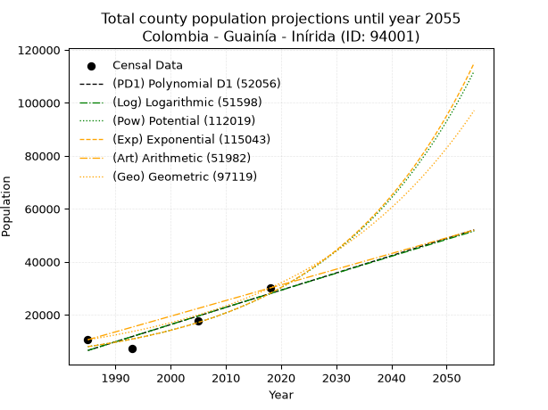
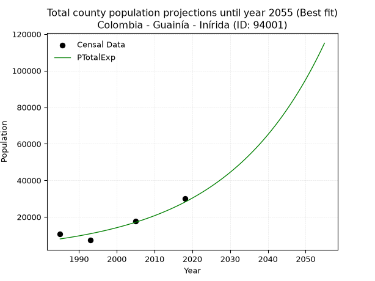
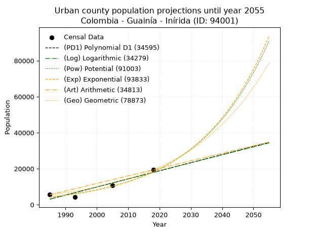
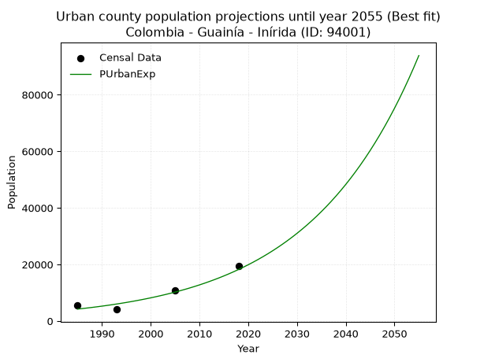
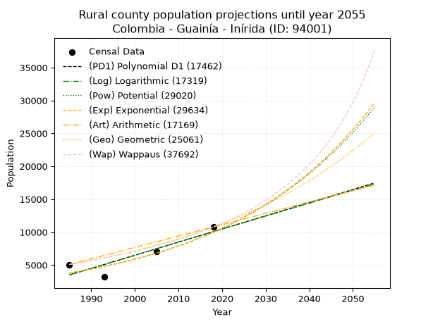
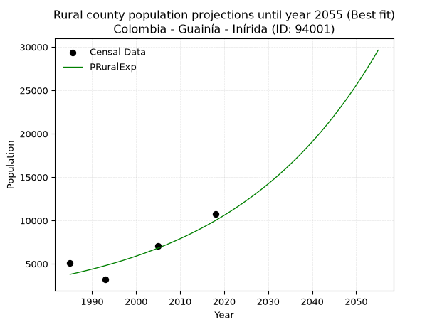

<div align="center">


</div>

# _“Population and Public Services Demand Projections (PPSD) until Year 2050 for Colombia - Guainía - Inírida (ID: 94001)”_
Keywords: `population` `public-service` `projection` `lineal` `polynomial` `logarithmic` `potential` `exponential` `arithmetic` `geometric` `wappaus` `dane` `colombia` `south-america`

PPSD are analytical estimates used by governments and planners to anticipate future changes in population size, age distribution, and the resulting community needs for utilities, healthcare, education, and infrastructure as sizing future water treatment facilities, electrical grids, and road networks based on spatial growth.

> **General running parameters**: • app_version: _v20260806_. • Python version: _3.14.7_. • Pandas version: _3.0.5_. • NumPy version: _2.5.1_. • Creates, save and include plots into reports (create_plot): _False_. • Projection until year: _2050_. • Process polynomial degree 2 and up: _False_. • Process Wappaus: _True_. • Process Wappaus: _True_. • Set negative values to zero: _True_. • Set infinite values to zero: _True_. • Drop dataset notes: _True_. 
<div align="center">

Dynamic map: [:earth_americas:Google](http://maps.google.com/maps?q=3.866763589,-67.9186133) [:earth_americas:OSM](https://www.openstreetmap.org/#map=18/3.866763589/-67.9186133&layers=P) [:earth_americas:Bing](https://www.bing.com/maps?cp=3.866763589~-67.9186133&lvl=18) [:earth_americas:Apple](https://maps.apple.com/frame?center=3.866763589%2C-67.9186133&span=0.003%2C0.006)

</div>


<div align="center">

```geojson
{
  "type": "Feature",
  "geometry": {
    "type": "Point", 
    "coordinates": [-67.9186133, 3.866763589]
  }, 
  "properties": {
    "Name": "Colombia - Guainía - Inírida (ID: 94001)"
  }
}
```

</div>


## 0. Census Data (4 records)

Census data are official statistics collected by a government about the people and housing in a country. They usually include counts of total population, age, sex, race, income, education, and jobs.

📅Global census file: [Population.xlsx](../data/Population.xlsx)

| Source   |   Year |   CountryID | CountryName   |   StateID | StateName   |   CountyID | CountyName   |   PTotal |   PUrban |   PRural |
|:---------|-------:|------------:|:--------------|----------:|:------------|-----------:|:-------------|---------:|---------:|---------:|
| DANE     |   1985 |          57 | Colombia      |        94 | Guainía     |      94001 | Inírida      |    10591 |     5513 |     5078 |
| DANE     |   1993 |          57 | Colombia      |        94 | Guainía     |      94001 | Inírida      |     7287 |     4098 |     3189 |
| DANE     |   2005 |          57 | Colombia      |        94 | Guainía     |      94001 | Inírida      |    17866 |    10793 |     7073 |
| DANE     |   2018 |          57 | Colombia      |        94 | Guainía     |      94001 | Inírida      |    30104 |    19326 |    10778 |

> 🔥Some records could had specific notes about the registered values or the corresponding urban or rural distribution.

## 1. Total

### 1.1. Coefficients and Parameters

* (PD1) Polynomial Deg 1: 650.126053793649, -1283952.6391007465 (lineal)
* (Log) Logarithmic: 1300236.0400602072, -9866642.559935343
* (Pow) Potential: 76.24059430468894, -247.52144935211385
* (Exp) Exponential: 0.038116766674618004, 1.1030443469111049e-29
* (Art) Arithmetic: Year diff. 2018 - 1985 = 33, Population diff. 30104 - 10591 = 19513, Annual growth = 591.3030303030303
* (Geo) Geometric: Year diff. 2018 - 1985 = 33, Population diff. 30104 - 10591 = 19513, Annual growth % = 0.03216255143919211
* (Wap) Wappaus: i = 2.906023001857871, Condition values only valid for < 200)

<sub>
Wappaus condition values: ['0.00', '2.91', '5.81', '8.72', '11.62', '14.53', '17.44', '20.34', '23.25', '26.15', '29.06', '31.97', '34.87', '37.78', '40.68', '43.59', '46.50', '49.40', '52.31', '55.21', '58.12', '61.03', '63.93', '66.84', '69.74', '72.65', '75.56', '78.46', '81.37', '84.27', '87.18', '90.09', '92.99', '95.90', '98.80', '101.71', '104.62', '107.52', '110.43', '113.33', '116.24', '119.15', '122.05', '124.96', '127.87', '130.77', '133.68', '136.58', '139.49', '142.40', '145.30', '148.21', '151.11', '154.02', '156.93', '159.83', '162.74', '165.64', '168.55', '171.46', '174.36', '177.27', '180.17', '183.08', '185.99', '188.89']
</sub>


### 1.2. Projected Dataset

|   Year |   CountyID |   PTotalPD1 |   PTotalLog |   PTotalPow |   PTotalExp |   PTotalArt |   PTotalGeo |   PTotalWap |
|-------:|-----------:|------------:|------------:|------------:|------------:|------------:|------------:|------------:|
|   1985 |      94001 |        6548 |        6536 |        7976 |        7982 |       10591 |       10591 |       10591 |
|   1986 |      94001 |        7198 |        7191 |        8288 |        8292 |       11182 |       10932 |       10903 |
|   1987 |      94001 |        7848 |        7846 |        8612 |        8614 |       11774 |       11283 |       11225 |
|   1988 |      94001 |        8498 |        8500 |        8949 |        8948 |       12365 |       11646 |       11556 |
|   1989 |      94001 |        9148 |        9154 |        9299 |        9296 |       12956 |       12021 |       11898 |
|   1990 |      94001 |        9798 |        9807 |        9662 |        9657 |       13548 |       12407 |       12250 |
|   1991 |      94001 |       10448 |       10460 |       10039 |       10033 |       14139 |       12806 |       12614 |
|   1992 |      94001 |       11098 |       11113 |       10431 |       10422 |       14730 |       13218 |       12989 |
|   1993 |      94001 |       11749 |       11766 |       10838 |       10827 |       15321 |       13643 |       13377 |
|   1994 |      94001 |       12399 |       12418 |       11260 |       11248 |       15913 |       14082 |       13778 |
|   1995 |      94001 |       13049 |       13070 |       11699 |       11685 |       16504 |       14535 |       14192 |
|   1996 |      94001 |       13699 |       13722 |       12155 |       12139 |       17095 |       15003 |       14621 |
|   1997 |      94001 |       14349 |       14373 |       12628 |       12611 |       17687 |       15485 |       15064 |
|   1998 |      94001 |       14999 |       15024 |       13119 |       13101 |       18278 |       15983 |       15524 |
|   1999 |      94001 |       15649 |       15674 |       13629 |       13609 |       18869 |       16497 |       16000 |
|   2000 |      94001 |       16299 |       16325 |       14159 |       14138 |       19461 |       17028 |       16494 |
|   2001 |      94001 |       16950 |       16975 |       14709 |       14688 |       20052 |       17575 |       17007 |
|   2002 |      94001 |       17600 |       17624 |       15280 |       15258 |       20643 |       18141 |       17540 |
|   2003 |      94001 |       18250 |       18274 |       15873 |       15851 |       21234 |       18724 |       18093 |
|   2004 |      94001 |       18900 |       18923 |       16489 |       16467 |       21826 |       19326 |       18669 |
|   2005 |      94001 |       19550 |       19571 |       17128 |       17107 |       22417 |       19948 |       19268 |
|   2006 |      94001 |       20200 |       20220 |       17792 |       17771 |       23008 |       20590 |       19893 |
|   2007 |      94001 |       20850 |       20868 |       18481 |       18462 |       23600 |       21252 |       20544 |
|   2008 |      94001 |       21500 |       21515 |       19196 |       19179 |       24191 |       21935 |       21223 |
|   2009 |      94001 |       22151 |       22163 |       19939 |       19924 |       24782 |       22641 |       21933 |
|   2010 |      94001 |       22801 |       22810 |       20710 |       20698 |       25374 |       23369 |       22675 |
|   2011 |      94001 |       23451 |       23456 |       21510 |       21502 |       25965 |       24121 |       23452 |
|   2012 |      94001 |       24101 |       24103 |       22341 |       22338 |       26556 |       24896 |       24266 |
|   2013 |      94001 |       24751 |       24749 |       23204 |       23206 |       27147 |       25697 |       25120 |
|   2014 |      94001 |       25401 |       25395 |       24099 |       24107 |       27739 |       26524 |       26016 |
|   2015 |      94001 |       26051 |       26040 |       25029 |       25044 |       28330 |       27377 |       26959 |
|   2016 |      94001 |       26701 |       26685 |       25994 |       26017 |       28921 |       28257 |       27952 |
|   2017 |      94001 |       27352 |       27330 |       26996 |       27028 |       29513 |       29166 |       28999 |
|   2018 |      94001 |       28002 |       27975 |       28035 |       28078 |       30104 |       30104 |       30104 |
|   2019 |      94001 |       28652 |       28619 |       29114 |       29169 |       30695 |       31072 |       31273 |
|   2020 |      94001 |       29302 |       29263 |       30235 |       30302 |       31287 |       32072 |       32510 |
|   2021 |      94001 |       29952 |       29906 |       31397 |       31479 |       31878 |       33103 |       33824 |
|   2022 |      94001 |       30602 |       30549 |       32604 |       32703 |       32469 |       34168 |       35219 |
|   2023 |      94001 |       31252 |       31192 |       33856 |       33973 |       33061 |       35267 |       36705 |
|   2024 |      94001 |       31902 |       31835 |       35156 |       35293 |       33652 |       36401 |       38291 |
|   2025 |      94001 |       32553 |       32477 |       36506 |       36664 |       34243 |       37572 |       39987 |
|   2026 |      94001 |       33203 |       33119 |       37906 |       38089 |       34834 |       38780 |       41805 |
|   2027 |      94001 |       33853 |       33761 |       39359 |       39569 |       35426 |       40027 |       43759 |
|   2028 |      94001 |       34503 |       34402 |       40867 |       41106 |       36017 |       41315 |       45863 |
|   2029 |      94001 |       35153 |       35043 |       42433 |       42703 |       36608 |       42644 |       48138 |
|   2030 |      94001 |       35803 |       35683 |       44057 |       44362 |       37200 |       44015 |       50603 |
|   2031 |      94001 |       36453 |       36324 |       45743 |       46086 |       37791 |       45431 |       53284 |
|   2032 |      94001 |       37104 |       36964 |       47492 |       47876 |       38382 |       46892 |       56211 |
|   2033 |      94001 |       37754 |       37604 |       49307 |       49736 |       38974 |       48400 |       59420 |
|   2034 |      94001 |       38404 |       38243 |       51191 |       51669 |       39565 |       49957 |       62951 |
|   2035 |      94001 |       39054 |       38882 |       53146 |       53676 |       40156 |       51563 |       66859 |
|   2036 |      94001 |       39704 |       39521 |       55174 |       55762 |       40747 |       53222 |       71204 |
|   2037 |      94001 |       40354 |       40159 |       57279 |       57928 |       41339 |       54934 |       76066 |
|   2038 |      94001 |       41004 |       40797 |       59463 |       60179 |       41930 |       56700 |       81543 |
|   2039 |      94001 |       41654 |       41435 |       61729 |       62517 |       42521 |       58524 |       87759 |
|   2040 |      94001 |       42305 |       42073 |       64080 |       64946 |       43113 |       60406 |       94874 |
|   2041 |      94001 |       42955 |       42710 |       66519 |       67469 |       43704 |       62349 |      103099 |
|   2042 |      94001 |       43605 |       43347 |       69051 |       70091 |       44295 |       64354 |      112715 |
|   2043 |      94001 |       44255 |       43984 |       71677 |       72814 |       44887 |       66424 |      124109 |
|   2044 |      94001 |       44905 |       44620 |       74401 |       75643 |       45478 |       68561 |      137822 |
|   2045 |      94001 |       45555 |       45256 |       77228 |       78582 |       46069 |       70766 |      154644 |
|   2046 |      94001 |       46205 |       45891 |       80161 |       81635 |       46660 |       73042 |      175767 |
|   2047 |      94001 |       46855 |       46527 |       83204 |       84807 |       47252 |       75391 |      203082 |
|   2048 |      94001 |       47506 |       47162 |       86360 |       88101 |       47843 |       77816 |      239779 |
|   2049 |      94001 |       48156 |       47797 |       89635 |       91524 |       48434 |       80318 |      291695 |
|   2050 |      94001 |       48806 |       48431 |       93032 |       95080 |       49026 |       82902 |      370774 |
<div align="center">

</img>

</div>


### 1.3. Best fit with absolute and relative error (%)

Relative error puts that difference into context by dividing the absolute error by the true value, creating a unitless ratio or percentage that shows the scale of the mistake.

Absolute and relative error

|   Year | Source   |   CountryID | CountryName   |   StateID | StateName   |   CountyID_x | CountyName   |   PTotal |   PUrban |   PRural |   CountyID_y |   PTotalPD1 |   PTotalLog |   PTotalPow |   PTotalExp |   PTotalArt |   PTotalGeo |   PTotalWap |   PTotalPD1AbsError |   PTotalLogAbsError |   PTotalPowAbsError |   PTotalExpAbsError |   PTotalArtAbsError |   PTotalGeoAbsError |   PTotalWapAbsError |   PTotalPD1RelError |   PTotalLogRelError |   PTotalPowRelError |   PTotalExpRelError |   PTotalArtRelError |   PTotalGeoRelError |   PTotalWapRelError |
|-------:|:---------|------------:|:--------------|----------:|:------------|-------------:|:-------------|---------:|---------:|---------:|-------------:|------------:|------------:|------------:|------------:|------------:|------------:|------------:|--------------------:|--------------------:|--------------------:|--------------------:|--------------------:|--------------------:|--------------------:|--------------------:|--------------------:|--------------------:|--------------------:|--------------------:|--------------------:|--------------------:|
|   1985 | DANE     |          57 | Colombia      |        94 | Guainía     |        94001 | Inírida      |    10591 |     5513 |     5078 |        94001 |        6548 |        6536 |        7976 |        7982 |       10591 |       10591 |       10591 |                4043 |                4055 |                2615 |                2609 |                   0 |                   0 |                   0 |            38.1739  |            38.2872  |            24.6908  |            24.6341  |               0     |              0      |             0       |
|   1993 | DANE     |          57 | Colombia      |        94 | Guainía     |        94001 | Inírida      |     7287 |     4098 |     3189 |        94001 |       11749 |       11766 |       10838 |       10827 |       15321 |       13643 |       13377 |                4462 |                4479 |                3551 |                3540 |                8034 |                6356 |                6090 |            61.2323  |            61.4656  |            48.7306  |            48.5797  |             110.251 |             87.2238 |            83.5735  |
|   2005 | DANE     |          57 | Colombia      |        94 | Guainía     |        94001 | Inírida      |    17866 |    10793 |     7073 |        94001 |       19550 |       19571 |       17128 |       17107 |       22417 |       19948 |       19268 |                1684 |                1705 |                 738 |                 759 |                4551 |                2082 |                1402 |             9.42572 |             9.54327 |             4.13075 |             4.24829 |              25.473 |             11.6534 |             7.84731 |
|   2018 | DANE     |          57 | Colombia      |        94 | Guainía     |        94001 | Inírida      |    30104 |    19326 |    10778 |        94001 |       28002 |       27975 |       28035 |       28078 |       30104 |       30104 |       30104 |                2102 |                2129 |                2069 |                2026 |                   0 |                   0 |                   0 |             6.98246 |             7.07215 |             6.87284 |             6.73    |               0     |              0      |             0       |

Relative error mean

| Method    |   RelError | Best   |
|:----------|-----------:|:-------|
| PTotalPD1 |    28.9536 |        |
| PTotalLog |    29.0921 |        |
| PTotalPow |    21.1062 |        |
| PTotalExp |    21.048  | True   |
| PTotalArt |    33.931  |        |
| PTotalGeo |    24.7193 |        |
| PTotalWap |    22.8552 |        |

💙Best method: _**PTotalExp**_
<div align="center">

</img>

</div>


### 1.4. Fresh water supply demand in liters per capita per day (lpcd)

The fresh water supply demand typically ranges from 100 to 300 liters per capita per day (lpcd) for standard domestic and municipal planning, though absolute survival minimums set by the World Health Organization are as low as 7.5 to 20 liters per day, and total consumption in high-income nations can exceed 400 liters.

> `CZ`: Level in meters above the sea level (masl).<br> `WS`: Fresh water supply demand in liters per capita per day (lpcd or l/h/d).<br> `WSAll`: Zonal fresh water supply demand in liters per second (l/s).<br> `A`: Zonal area in square meters.

Reference values (RAS Colombia)

|    CZ |   WS |
|------:|-----:|
|  1000 |  120 |
|  2000 |  130 |
| 99999 |  140 |

County shapefile geometry properties and water supply values

|   CountyID |      ATotal |   CZTotal |   WSTotal |
|-----------:|------------:|----------:|----------:|
|      94001 | 1.58789e+10 |   124.643 |       120 |

Projected values for best method: PTotalExp

|   CountyID |   Year |   PTotalExp |   WSTotal |   WSTotalAll |
|-----------:|-------:|------------:|----------:|-------------:|
|      94001 |   1985 |        7982 |       120 |      11.0861 |
|      94001 |   1986 |        8292 |       120 |      11.5167 |
|      94001 |   1987 |        8614 |       120 |      11.9639 |
|      94001 |   1988 |        8948 |       120 |      12.4278 |
|      94001 |   1989 |        9296 |       120 |      12.9111 |
|      94001 |   1990 |        9657 |       120 |      13.4125 |
|      94001 |   1991 |       10033 |       120 |      13.9347 |
|      94001 |   1992 |       10422 |       120 |      14.475  |
|      94001 |   1993 |       10827 |       120 |      15.0375 |
|      94001 |   1994 |       11248 |       120 |      15.6222 |
|      94001 |   1995 |       11685 |       120 |      16.2292 |
|      94001 |   1996 |       12139 |       120 |      16.8597 |
|      94001 |   1997 |       12611 |       120 |      17.5153 |
|      94001 |   1998 |       13101 |       120 |      18.1958 |
|      94001 |   1999 |       13609 |       120 |      18.9014 |
|      94001 |   2000 |       14138 |       120 |      19.6361 |
|      94001 |   2001 |       14688 |       120 |      20.4    |
|      94001 |   2002 |       15258 |       120 |      21.1917 |
|      94001 |   2003 |       15851 |       120 |      22.0153 |
|      94001 |   2004 |       16467 |       120 |      22.8708 |
|      94001 |   2005 |       17107 |       120 |      23.7597 |
|      94001 |   2006 |       17771 |       120 |      24.6819 |
|      94001 |   2007 |       18462 |       120 |      25.6417 |
|      94001 |   2008 |       19179 |       120 |      26.6375 |
|      94001 |   2009 |       19924 |       120 |      27.6722 |
|      94001 |   2010 |       20698 |       120 |      28.7472 |
|      94001 |   2011 |       21502 |       120 |      29.8639 |
|      94001 |   2012 |       22338 |       120 |      31.025  |
|      94001 |   2013 |       23206 |       120 |      32.2306 |
|      94001 |   2014 |       24107 |       120 |      33.4819 |
|      94001 |   2015 |       25044 |       120 |      34.7833 |
|      94001 |   2016 |       26017 |       120 |      36.1347 |
|      94001 |   2017 |       27028 |       120 |      37.5389 |
|      94001 |   2018 |       28078 |       120 |      38.9972 |
|      94001 |   2019 |       29169 |       120 |      40.5125 |
|      94001 |   2020 |       30302 |       120 |      42.0861 |
|      94001 |   2021 |       31479 |       120 |      43.7208 |
|      94001 |   2022 |       32703 |       120 |      45.4208 |
|      94001 |   2023 |       33973 |       120 |      47.1847 |
|      94001 |   2024 |       35293 |       120 |      49.0181 |
|      94001 |   2025 |       36664 |       120 |      50.9222 |
|      94001 |   2026 |       38089 |       120 |      52.9014 |
|      94001 |   2027 |       39569 |       120 |      54.9569 |
|      94001 |   2028 |       41106 |       120 |      57.0917 |
|      94001 |   2029 |       42703 |       120 |      59.3097 |
|      94001 |   2030 |       44362 |       120 |      61.6139 |
|      94001 |   2031 |       46086 |       120 |      64.0083 |
|      94001 |   2032 |       47876 |       120 |      66.4944 |
|      94001 |   2033 |       49736 |       120 |      69.0778 |
|      94001 |   2034 |       51669 |       120 |      71.7625 |
|      94001 |   2035 |       53676 |       120 |      74.55   |
|      94001 |   2036 |       55762 |       120 |      77.4472 |
|      94001 |   2037 |       57928 |       120 |      80.4556 |
|      94001 |   2038 |       60179 |       120 |      83.5819 |
|      94001 |   2039 |       62517 |       120 |      86.8292 |
|      94001 |   2040 |       64946 |       120 |      90.2028 |
|      94001 |   2041 |       67469 |       120 |      93.7069 |
|      94001 |   2042 |       70091 |       120 |      97.3486 |
|      94001 |   2043 |       72814 |       120 |     101.131  |
|      94001 |   2044 |       75643 |       120 |     105.06   |
|      94001 |   2045 |       78582 |       120 |     109.142  |
|      94001 |   2046 |       81635 |       120 |     113.382  |
|      94001 |   2047 |       84807 |       120 |     117.787  |
|      94001 |   2048 |       88101 |       120 |     122.362  |
|      94001 |   2049 |       91524 |       120 |     127.117  |
|      94001 |   2050 |       95080 |       120 |     132.056  |

## 2. Urban

### 2.1. Coefficients and Parameters

* (PD1) Polynomial Deg 1: 450.4528301886735, -891085.773584894 (lineal)
* (Log) Logarithmic: 900955.2776737699, -6838235.785400811
* (Pow) Potential: 88.67981341330533, -288.8204782781879
* (Exp) Exponential: 0.04432917908079102, 2.568397988159909e-35
* (Art) Arithmetic: Year diff. 2018 - 1985 = 33, Population diff. 19326 - 5513 = 13813, Annual growth = 418.57575757575756
* (Geo) Geometric: Year diff. 2018 - 1985 = 33, Population diff. 19326 - 5513 = 13813, Annual growth % = 0.03874201055691184
* (Wap) Wappaus: i = 3.3703108625609532, Condition values only valid for < 200)

<sub>
Wappaus condition values: ['0.00', '3.37', '6.74', '10.11', '13.48', '16.85', '20.22', '23.59', '26.96', '30.33', '33.70', '37.07', '40.44', '43.81', '47.18', '50.55', '53.92', '57.30', '60.67', '64.04', '67.41', '70.78', '74.15', '77.52', '80.89', '84.26', '87.63', '91.00', '94.37', '97.74', '101.11', '104.48', '107.85', '111.22', '114.59', '117.96', '121.33', '124.70', '128.07', '131.44', '134.81', '138.18', '141.55', '144.92', '148.29', '151.66', '155.03', '158.40', '161.77', '165.15', '168.52', '171.89', '175.26', '178.63', '182.00', '185.37', '188.74', '192.11', '195.48', '198.85', '202.22', '205.59', '208.96', '212.33', '215.70', '219.07']
</sub>


### 2.2. Projected Dataset

|   Year |   CountyID |   PUrbanPD1 |   PUrbanLog |   PUrbanPow |   PUrbanExp |   PUrbanArt |   PUrbanGeo |
|-------:|-----------:|------------:|------------:|------------:|------------:|------------:|------------:|
|   1985 |      94001 |        3063 |        3055 |        4210 |        4214 |        5513 |        5513 |
|   1986 |      94001 |        3514 |        3509 |        4403 |        4405 |        5932 |        5727 |
|   1987 |      94001 |        3964 |        3962 |        4604 |        4605 |        6350 |        5948 |
|   1988 |      94001 |        4414 |        4415 |        4814 |        4814 |        6769 |        6179 |
|   1989 |      94001 |        4865 |        4868 |        5033 |        5032 |        7187 |        6418 |
|   1990 |      94001 |        5315 |        5321 |        5263 |        5260 |        7606 |        6667 |
|   1991 |      94001 |        5766 |        5774 |        5502 |        5498 |        8024 |        6925 |
|   1992 |      94001 |        6216 |        6226 |        5753 |        5748 |        8443 |        7194 |
|   1993 |      94001 |        6667 |        6679 |        6015 |        6008 |        8862 |        7472 |
|   1994 |      94001 |        7117 |        7130 |        6288 |        6280 |        9280 |        7762 |
|   1995 |      94001 |        7568 |        7582 |        6574 |        6565 |        9699 |        8062 |
|   1996 |      94001 |        8018 |        8034 |        6873 |        6863 |       10117 |        8375 |
|   1997 |      94001 |        8469 |        8485 |        7185 |        7174 |       10536 |        8699 |
|   1998 |      94001 |        8919 |        8936 |        7511 |        7499 |       10954 |        9036 |
|   1999 |      94001 |        9369 |        9387 |        7852 |        7839 |       11373 |        9386 |
|   2000 |      94001 |        9820 |        9837 |        8208 |        8194 |       11792 |        9750 |
|   2001 |      94001 |       10270 |       10288 |        8580 |        8565 |       12210 |       10128 |
|   2002 |      94001 |       10721 |       10738 |        8969 |        8954 |       12629 |       10520 |
|   2003 |      94001 |       11171 |       11188 |        9375 |        9360 |       13047 |       10928 |
|   2004 |      94001 |       11622 |       11638 |        9799 |        9784 |       13466 |       11351 |
|   2005 |      94001 |       12072 |       12087 |       10243 |       10227 |       13885 |       11791 |
|   2006 |      94001 |       12523 |       12536 |       10706 |       10691 |       14303 |       12248 |
|   2007 |      94001 |       12973 |       12985 |       11189 |       11175 |       14722 |       12722 |
|   2008 |      94001 |       13424 |       13434 |       11695 |       11682 |       15140 |       13215 |
|   2009 |      94001 |       13874 |       13883 |       12223 |       12211 |       15559 |       13727 |
|   2010 |      94001 |       14324 |       14331 |       12774 |       12765 |       15977 |       14259 |
|   2011 |      94001 |       14775 |       14779 |       13350 |       13343 |       16396 |       14811 |
|   2012 |      94001 |       15225 |       15227 |       13952 |       13948 |       16815 |       15385 |
|   2013 |      94001 |       15676 |       15675 |       14580 |       14581 |       17233 |       15981 |
|   2014 |      94001 |       16126 |       16122 |       15237 |       15241 |       17652 |       16600 |
|   2015 |      94001 |       16577 |       16569 |       15923 |       15932 |       18070 |       17243 |
|   2016 |      94001 |       17027 |       17016 |       16639 |       16654 |       18489 |       17911 |
|   2017 |      94001 |       17478 |       17463 |       17387 |       17409 |       18907 |       18605 |
|   2018 |      94001 |       17928 |       17910 |       18168 |       18198 |       19326 |       19326 |
|   2019 |      94001 |       18378 |       18356 |       18984 |       19023 |       19745 |       20075 |
|   2020 |      94001 |       18829 |       18802 |       19836 |       19885 |       20163 |       20852 |
|   2021 |      94001 |       19279 |       19248 |       20726 |       20787 |       20582 |       21660 |
|   2022 |      94001 |       19730 |       19694 |       21656 |       21729 |       21000 |       22499 |
|   2023 |      94001 |       20180 |       20139 |       22627 |       22714 |       21419 |       23371 |
|   2024 |      94001 |       20631 |       20585 |       23640 |       23743 |       21837 |       24277 |
|   2025 |      94001 |       21081 |       21030 |       24699 |       24820 |       22256 |       25217 |
|   2026 |      94001 |       21532 |       21474 |       25804 |       25945 |       22675 |       26194 |
|   2027 |      94001 |       21982 |       21919 |       26958 |       27121 |       23093 |       27209 |
|   2028 |      94001 |       22433 |       22363 |       28164 |       28350 |       23512 |       28263 |
|   2029 |      94001 |       22883 |       22807 |       29422 |       29635 |       23930 |       29358 |
|   2030 |      94001 |       23333 |       23251 |       30736 |       30978 |       24349 |       30495 |
|   2031 |      94001 |       23784 |       23695 |       32109 |       32382 |       24767 |       31677 |
|   2032 |      94001 |       24234 |       24139 |       33541 |       33850 |       25186 |       32904 |
|   2033 |      94001 |       24685 |       24582 |       35037 |       35384 |       25605 |       34179 |
|   2034 |      94001 |       25135 |       25025 |       36599 |       36988 |       26023 |       35503 |
|   2035 |      94001 |       25586 |       25468 |       38229 |       38665 |       26442 |       36878 |
|   2036 |      94001 |       26036 |       25910 |       39932 |       40417 |       26860 |       38307 |
|   2037 |      94001 |       26487 |       26353 |       41709 |       42249 |       27279 |       39791 |
|   2038 |      94001 |       26937 |       26795 |       43564 |       44164 |       27698 |       41333 |
|   2039 |      94001 |       27388 |       27237 |       45501 |       46166 |       28116 |       42934 |
|   2040 |      94001 |       27838 |       27679 |       47523 |       48259 |       28535 |       44598 |
|   2041 |      94001 |       28288 |       28120 |       49634 |       50446 |       28953 |       46325 |
|   2042 |      94001 |       28739 |       28562 |       51838 |       52733 |       29372 |       48120 |
|   2043 |      94001 |       29189 |       29003 |       54138 |       55123 |       29790 |       49984 |
|   2044 |      94001 |       29640 |       29444 |       56539 |       57621 |       30209 |       51921 |
|   2045 |      94001 |       30090 |       29884 |       59046 |       60233 |       30628 |       53932 |
|   2046 |      94001 |       30541 |       30325 |       61662 |       62963 |       31046 |       56022 |
|   2047 |      94001 |       30991 |       30765 |       64392 |       65817 |       31465 |       58192 |
|   2048 |      94001 |       31442 |       31205 |       67243 |       68800 |       31883 |       60447 |
|   2049 |      94001 |       31892 |       31645 |       70217 |       71919 |       32302 |       62789 |
|   2050 |      94001 |       32343 |       32084 |       73322 |       75179 |       32720 |       65221 |
<div align="center">

</img>

</div>


### 2.3. Best fit with absolute and relative error (%)

Relative error puts that difference into context by dividing the absolute error by the true value, creating a unitless ratio or percentage that shows the scale of the mistake.

Absolute and relative error

|   Year | Source   |   CountryID | CountryName   |   StateID | StateName   |   CountyID_x | CountyName   |   PTotal |   PUrban |   PRural |   CountyID_y |   PUrbanPD1 |   PUrbanLog |   PUrbanPow |   PUrbanExp |   PUrbanArt |   PUrbanGeo |   PUrbanPD1AbsError |   PUrbanLogAbsError |   PUrbanPowAbsError |   PUrbanExpAbsError |   PUrbanArtAbsError |   PUrbanGeoAbsError |   PUrbanPD1RelError |   PUrbanLogRelError |   PUrbanPowRelError |   PUrbanExpRelError |   PUrbanArtRelError |   PUrbanGeoRelError |
|-------:|:---------|------------:|:--------------|----------:|:------------|-------------:|:-------------|---------:|---------:|---------:|-------------:|------------:|------------:|------------:|------------:|------------:|------------:|--------------------:|--------------------:|--------------------:|--------------------:|--------------------:|--------------------:|--------------------:|--------------------:|--------------------:|--------------------:|--------------------:|--------------------:|
|   1985 | DANE     |          57 | Colombia      |        94 | Guainía     |        94001 | Inírida      |    10591 |     5513 |     5078 |        94001 |        3063 |        3055 |        4210 |        4214 |        5513 |        5513 |                2450 |                2458 |                1303 |                1299 |                   0 |                   0 |            44.4404  |            44.5855  |            23.635   |            23.5625  |              0      |             0       |
|   1993 | DANE     |          57 | Colombia      |        94 | Guainía     |        94001 | Inírida      |     7287 |     4098 |     3189 |        94001 |        6667 |        6679 |        6015 |        6008 |        8862 |        7472 |                2569 |                2581 |                1917 |                1910 |                4764 |                3374 |            62.6891  |            62.9819  |            46.7789  |            46.6081  |            116.252  |            82.3328  |
|   2005 | DANE     |          57 | Colombia      |        94 | Guainía     |        94001 | Inírida      |    17866 |    10793 |     7073 |        94001 |       12072 |       12087 |       10243 |       10227 |       13885 |       11791 |                1279 |                1294 |                 550 |                 566 |                3092 |                 998 |            11.8503  |            11.9893  |             5.0959  |             5.24414 |             28.6482 |             9.24673 |
|   2018 | DANE     |          57 | Colombia      |        94 | Guainía     |        94001 | Inírida      |    30104 |    19326 |    10778 |        94001 |       17928 |       17910 |       18168 |       18198 |       19326 |       19326 |                1398 |                1416 |                1158 |                1128 |                   0 |                   0 |             7.23378 |             7.32692 |             5.99193 |             5.8367  |              0      |             0       |

Relative error mean

| Method    |   RelError | Best   |
|:----------|-----------:|:-------|
| PUrbanPD1 |    31.5534 |        |
| PUrbanLog |    31.7209 |        |
| PUrbanPow |    20.3754 |        |
| PUrbanExp |    20.3129 | True   |
| PUrbanArt |    36.225  |        |
| PUrbanGeo |    22.8949 |        |

💙Best method: _**PUrbanExp**_
<div align="center">

</img>

</div>


### 2.4. Fresh water supply demand in liters per capita per day (lpcd)

The fresh water supply demand typically ranges from 100 to 300 liters per capita per day (lpcd) for standard domestic and municipal planning, though absolute survival minimums set by the World Health Organization are as low as 7.5 to 20 liters per day, and total consumption in high-income nations can exceed 400 liters.

> `CZ`: Level in meters above the sea level (masl).<br> `WS`: Fresh water supply demand in liters per capita per day (lpcd or l/h/d).<br> `WSAll`: Zonal fresh water supply demand in liters per second (l/s).<br> `A`: Zonal area in square meters.

Reference values (RAS Colombia)

|    CZ |   WS |
|------:|-----:|
|  1000 |  120 |
|  2000 |  130 |
| 99999 |  140 |

County shapefile geometry properties and water supply values

|   CountyID |      AUrban |   CZUrban |   WSUrban |
|-----------:|------------:|----------:|----------:|
|      94001 | 8.68741e+06 |   95.8229 |       120 |

Projected values for best method: PUrbanExp

|   CountyID |   Year |   PUrbanExp |   WSUrban |   WSUrbanAll |
|-----------:|-------:|------------:|----------:|-------------:|
|      94001 |   1985 |        4214 |       120 |      5.85278 |
|      94001 |   1986 |        4405 |       120 |      6.11806 |
|      94001 |   1987 |        4605 |       120 |      6.39583 |
|      94001 |   1988 |        4814 |       120 |      6.68611 |
|      94001 |   1989 |        5032 |       120 |      6.98889 |
|      94001 |   1990 |        5260 |       120 |      7.30556 |
|      94001 |   1991 |        5498 |       120 |      7.63611 |
|      94001 |   1992 |        5748 |       120 |      7.98333 |
|      94001 |   1993 |        6008 |       120 |      8.34444 |
|      94001 |   1994 |        6280 |       120 |      8.72222 |
|      94001 |   1995 |        6565 |       120 |      9.11806 |
|      94001 |   1996 |        6863 |       120 |      9.53194 |
|      94001 |   1997 |        7174 |       120 |      9.96389 |
|      94001 |   1998 |        7499 |       120 |     10.4153  |
|      94001 |   1999 |        7839 |       120 |     10.8875  |
|      94001 |   2000 |        8194 |       120 |     11.3806  |
|      94001 |   2001 |        8565 |       120 |     11.8958  |
|      94001 |   2002 |        8954 |       120 |     12.4361  |
|      94001 |   2003 |        9360 |       120 |     13       |
|      94001 |   2004 |        9784 |       120 |     13.5889  |
|      94001 |   2005 |       10227 |       120 |     14.2042  |
|      94001 |   2006 |       10691 |       120 |     14.8486  |
|      94001 |   2007 |       11175 |       120 |     15.5208  |
|      94001 |   2008 |       11682 |       120 |     16.225   |
|      94001 |   2009 |       12211 |       120 |     16.9597  |
|      94001 |   2010 |       12765 |       120 |     17.7292  |
|      94001 |   2011 |       13343 |       120 |     18.5319  |
|      94001 |   2012 |       13948 |       120 |     19.3722  |
|      94001 |   2013 |       14581 |       120 |     20.2514  |
|      94001 |   2014 |       15241 |       120 |     21.1681  |
|      94001 |   2015 |       15932 |       120 |     22.1278  |
|      94001 |   2016 |       16654 |       120 |     23.1306  |
|      94001 |   2017 |       17409 |       120 |     24.1792  |
|      94001 |   2018 |       18198 |       120 |     25.275   |
|      94001 |   2019 |       19023 |       120 |     26.4208  |
|      94001 |   2020 |       19885 |       120 |     27.6181  |
|      94001 |   2021 |       20787 |       120 |     28.8708  |
|      94001 |   2022 |       21729 |       120 |     30.1792  |
|      94001 |   2023 |       22714 |       120 |     31.5472  |
|      94001 |   2024 |       23743 |       120 |     32.9764  |
|      94001 |   2025 |       24820 |       120 |     34.4722  |
|      94001 |   2026 |       25945 |       120 |     36.0347  |
|      94001 |   2027 |       27121 |       120 |     37.6681  |
|      94001 |   2028 |       28350 |       120 |     39.375   |
|      94001 |   2029 |       29635 |       120 |     41.1597  |
|      94001 |   2030 |       30978 |       120 |     43.025   |
|      94001 |   2031 |       32382 |       120 |     44.975   |
|      94001 |   2032 |       33850 |       120 |     47.0139  |
|      94001 |   2033 |       35384 |       120 |     49.1444  |
|      94001 |   2034 |       36988 |       120 |     51.3722  |
|      94001 |   2035 |       38665 |       120 |     53.7014  |
|      94001 |   2036 |       40417 |       120 |     56.1347  |
|      94001 |   2037 |       42249 |       120 |     58.6792  |
|      94001 |   2038 |       44164 |       120 |     61.3389  |
|      94001 |   2039 |       46166 |       120 |     64.1194  |
|      94001 |   2040 |       48259 |       120 |     67.0264  |
|      94001 |   2041 |       50446 |       120 |     70.0639  |
|      94001 |   2042 |       52733 |       120 |     73.2403  |
|      94001 |   2043 |       55123 |       120 |     76.5597  |
|      94001 |   2044 |       57621 |       120 |     80.0292  |
|      94001 |   2045 |       60233 |       120 |     83.6569  |
|      94001 |   2046 |       62963 |       120 |     87.4486  |
|      94001 |   2047 |       65817 |       120 |     91.4125  |
|      94001 |   2048 |       68800 |       120 |     95.5556  |
|      94001 |   2049 |       71919 |       120 |     99.8875  |
|      94001 |   2050 |       75179 |       120 |    104.415   |

## 3. Rural

### 3.1. Coefficients and Parameters

* (PD1) Polynomial Deg 1: 199.67322360497533, -392866.86551585194 (lineal)
* (Log) Logarithmic: 399280.76238643716, -3028406.7745345323
* (Pow) Potential: 58.77823270877378, -190.25853148286552
* (Exp) Exponential: 0.029394190002121116, 1.7306601500155715e-22
* (Art) Arithmetic: Year diff. 2018 - 1985 = 33, Population diff. 10778 - 5078 = 5700, Annual growth = 172.72727272727272
* (Geo) Geometric: Year diff. 2018 - 1985 = 33, Population diff. 10778 - 5078 = 5700, Annual growth % = 0.02306778269880483
* (Wap) Wappaus: i = 2.1786992019080818, Condition values only valid for < 200)

<sub>
Wappaus condition values: ['0.00', '2.18', '4.36', '6.54', '8.71', '10.89', '13.07', '15.25', '17.43', '19.61', '21.79', '23.97', '26.14', '28.32', '30.50', '32.68', '34.86', '37.04', '39.22', '41.40', '43.57', '45.75', '47.93', '50.11', '52.29', '54.47', '56.65', '58.82', '61.00', '63.18', '65.36', '67.54', '69.72', '71.90', '74.08', '76.25', '78.43', '80.61', '82.79', '84.97', '87.15', '89.33', '91.51', '93.68', '95.86', '98.04', '100.22', '102.40', '104.58', '106.76', '108.93', '111.11', '113.29', '115.47', '117.65', '119.83', '122.01', '124.19', '126.36', '128.54', '130.72', '132.90', '135.08', '137.26', '139.44', '141.62']
</sub>


### 3.2. Projected Dataset

|   Year |   CountyID |   PRuralPD1 |   PRuralLog |   PRuralPow |   PRuralExp |   PRuralArt |   PRuralGeo |   PRuralWap |
|-------:|-----------:|------------:|------------:|------------:|------------:|------------:|------------:|------------:|
|   1985 |      94001 |        3484 |        3481 |        3784 |        3786 |        5078 |        5078 |        5078 |
|   1986 |      94001 |        3684 |        3683 |        3898 |        3899 |        5251 |        5195 |        5190 |
|   1987 |      94001 |        3884 |        3884 |        4015 |        4015 |        5423 |        5315 |        5304 |
|   1988 |      94001 |        4084 |        4084 |        4136 |        4135 |        5596 |        5438 |        5421 |
|   1989 |      94001 |        4283 |        4285 |        4260 |        4259 |        5769 |        5563 |        5541 |
|   1990 |      94001 |        4483 |        4486 |        4388 |        4386 |        5942 |        5691 |        5663 |
|   1991 |      94001 |        4683 |        4687 |        4519 |        4516 |        6114 |        5823 |        5788 |
|   1992 |      94001 |        4882 |        4887 |        4654 |        4651 |        6287 |        5957 |        5916 |
|   1993 |      94001 |        5082 |        5087 |        4794 |        4790 |        6460 |        6094 |        6048 |
|   1994 |      94001 |        5282 |        5288 |        4937 |        4933 |        6633 |        6235 |        6182 |
|   1995 |      94001 |        5481 |        5488 |        5085 |        5080 |        6805 |        6379 |        6320 |
|   1996 |      94001 |        5681 |        5688 |        5237 |        5231 |        6978 |        6526 |        6461 |
|   1997 |      94001 |        5881 |        5888 |        5393 |        5387 |        7151 |        6676 |        6605 |
|   1998 |      94001 |        6080 |        6088 |        5554 |        5548 |        7323 |        6830 |        6754 |
|   1999 |      94001 |        6280 |        6288 |        5720 |        5714 |        7496 |        6988 |        6906 |
|   2000 |      94001 |        6480 |        6487 |        5891 |        5884 |        7669 |        7149 |        7062 |
|   2001 |      94001 |        6679 |        6687 |        6066 |        6060 |        7842 |        7314 |        7222 |
|   2002 |      94001 |        6879 |        6886 |        6247 |        6240 |        8014 |        7483 |        7386 |
|   2003 |      94001 |        7079 |        7086 |        6433 |        6427 |        8187 |        7655 |        7555 |
|   2004 |      94001 |        7278 |        7285 |        6625 |        6618 |        8360 |        7832 |        7729 |
|   2005 |      94001 |        7478 |        7484 |        6822 |        6816 |        8533 |        8013 |        7907 |
|   2006 |      94001 |        7678 |        7683 |        7025 |        7019 |        8705 |        8198 |        8090 |
|   2007 |      94001 |        7877 |        7882 |        7234 |        7228 |        8878 |        8387 |        8279 |
|   2008 |      94001 |        8077 |        8081 |        7449 |        7444 |        9051 |        8580 |        8473 |
|   2009 |      94001 |        8277 |        8280 |        7670 |        7666 |        9223 |        8778 |        8673 |
|   2010 |      94001 |        8476 |        8479 |        7898 |        7895 |        9396 |        8981 |        8879 |
|   2011 |      94001 |        8676 |        8677 |        8132 |        8130 |        9569 |        9188 |        9091 |
|   2012 |      94001 |        8876 |        8876 |        8373 |        8373 |        9742 |        9400 |        9310 |
|   2013 |      94001 |        9075 |        9074 |        8621 |        8623 |        9914 |        9616 |        9535 |
|   2014 |      94001 |        9275 |        9273 |        8877 |        8880 |       10087 |        9838 |        9768 |
|   2015 |      94001 |        9475 |        9471 |        9139 |        9145 |       10260 |       10065 |       10008 |
|   2016 |      94001 |        9674 |        9669 |        9410 |        9417 |       10433 |       10297 |       10256 |
|   2017 |      94001 |        9874 |        9867 |        9688 |        9698 |       10605 |       10535 |       10513 |
|   2018 |      94001 |       10074 |       10065 |        9975 |        9988 |       10778 |       10778 |       10778 |
|   2019 |      94001 |       10273 |       10263 |       10269 |       10286 |       10951 |       11027 |       11052 |
|   2020 |      94001 |       10473 |       10460 |       10573 |       10592 |       11123 |       11281 |       11336 |
|   2021 |      94001 |       10673 |       10658 |       10885 |       10908 |       11296 |       11541 |       11631 |
|   2022 |      94001 |       10872 |       10855 |       11206 |       11234 |       11469 |       11807 |       11935 |
|   2023 |      94001 |       11072 |       11053 |       11536 |       11569 |       11642 |       12080 |       12252 |
|   2024 |      94001 |       11272 |       11250 |       11876 |       11914 |       11814 |       12358 |       12580 |
|   2025 |      94001 |       11471 |       11447 |       12226 |       12269 |       11987 |       12644 |       12921 |
|   2026 |      94001 |       11671 |       11645 |       12586 |       12635 |       12160 |       12935 |       13275 |
|   2027 |      94001 |       11871 |       11842 |       12956 |       13012 |       12333 |       13234 |       13644 |
|   2028 |      94001 |       12070 |       12039 |       13338 |       13401 |       12505 |       13539 |       14027 |
|   2029 |      94001 |       12270 |       12235 |       13730 |       13800 |       12678 |       13851 |       14427 |
|   2030 |      94001 |       12470 |       12432 |       14133 |       14212 |       12851 |       14171 |       14844 |
|   2031 |      94001 |       12669 |       12629 |       14548 |       14636 |       13023 |       14498 |       15279 |
|   2032 |      94001 |       12869 |       12825 |       14975 |       15072 |       13196 |       14832 |       15733 |
|   2033 |      94001 |       13069 |       13022 |       15415 |       15522 |       13369 |       15174 |       16208 |
|   2034 |      94001 |       13268 |       13218 |       15867 |       15985 |       13542 |       15524 |       16706 |
|   2035 |      94001 |       13468 |       13414 |       16332 |       16462 |       13714 |       15882 |       17227 |
|   2036 |      94001 |       13668 |       13610 |       16810 |       16953 |       13887 |       16249 |       17774 |
|   2037 |      94001 |       13867 |       13807 |       17303 |       17459 |       14060 |       16623 |       18348 |
|   2038 |      94001 |       14067 |       14003 |       17809 |       17980 |       14233 |       17007 |       18952 |
|   2039 |      94001 |       14267 |       14198 |       18330 |       18516 |       14405 |       17399 |       19587 |
|   2040 |      94001 |       14467 |       14394 |       18866 |       19068 |       14578 |       17801 |       20258 |
|   2041 |      94001 |       14666 |       14590 |       19417 |       19637 |       14751 |       18211 |       20965 |
|   2042 |      94001 |       14866 |       14785 |       19985 |       20223 |       14923 |       18631 |       21714 |
|   2043 |      94001 |       15066 |       14981 |       20568 |       20826 |       15096 |       19061 |       22507 |
|   2044 |      94001 |       15265 |       15176 |       21168 |       21447 |       15269 |       19501 |       23348 |
|   2045 |      94001 |       15465 |       15372 |       21786 |       22087 |       15442 |       19951 |       24242 |
|   2046 |      94001 |       15665 |       15567 |       22421 |       22746 |       15614 |       20411 |       25194 |
|   2047 |      94001 |       15864 |       15762 |       23074 |       23425 |       15787 |       20882 |       26209 |
|   2048 |      94001 |       16064 |       15957 |       23746 |       24123 |       15960 |       21363 |       27296 |
|   2049 |      94001 |       16264 |       16152 |       24437 |       24843 |       16133 |       21856 |       28460 |
|   2050 |      94001 |       16463 |       16347 |       25148 |       25584 |       16305 |       22360 |       29712 |
<div align="center">

</img>

</div>


### 3.3. Best fit with absolute and relative error (%)

Relative error puts that difference into context by dividing the absolute error by the true value, creating a unitless ratio or percentage that shows the scale of the mistake.

Absolute and relative error

|   Year | Source   |   CountryID | CountryName   |   StateID | StateName   |   CountyID_x | CountyName   |   PTotal |   PUrban |   PRural |   CountyID_y |   PRuralPD1 |   PRuralLog |   PRuralPow |   PRuralExp |   PRuralArt |   PRuralGeo |   PRuralWap |   PRuralPD1AbsError |   PRuralLogAbsError |   PRuralPowAbsError |   PRuralExpAbsError |   PRuralArtAbsError |   PRuralGeoAbsError |   PRuralWapAbsError |   PRuralPD1RelError |   PRuralLogRelError |   PRuralPowRelError |   PRuralExpRelError |   PRuralArtRelError |   PRuralGeoRelError |   PRuralWapRelError |
|-------:|:---------|------------:|:--------------|----------:|:------------|-------------:|:-------------|---------:|---------:|---------:|-------------:|------------:|------------:|------------:|------------:|------------:|------------:|------------:|--------------------:|--------------------:|--------------------:|--------------------:|--------------------:|--------------------:|--------------------:|--------------------:|--------------------:|--------------------:|--------------------:|--------------------:|--------------------:|--------------------:|
|   1985 | DANE     |          57 | Colombia      |        94 | Guainía     |        94001 | Inírida      |    10591 |     5513 |     5078 |        94001 |        3484 |        3481 |        3784 |        3786 |        5078 |        5078 |        5078 |                1594 |                1597 |                1294 |                1292 |                   0 |                   0 |                   0 |            31.3903  |            31.4494  |            25.4825  |            25.4431  |              0      |              0      |              0      |
|   1993 | DANE     |          57 | Colombia      |        94 | Guainía     |        94001 | Inírida      |     7287 |     4098 |     3189 |        94001 |        5082 |        5087 |        4794 |        4790 |        6460 |        6094 |        6048 |                1893 |                1898 |                1605 |                1601 |                3271 |                2905 |                2859 |            59.3603  |            59.5171  |            50.3293  |            50.2038  |            102.571  |             91.0944 |             89.6519 |
|   2005 | DANE     |          57 | Colombia      |        94 | Guainía     |        94001 | Inírida      |    17866 |    10793 |     7073 |        94001 |        7478 |        7484 |        6822 |        6816 |        8533 |        8013 |        7907 |                 405 |                 411 |                 251 |                 257 |                1460 |                 940 |                 834 |             5.726   |             5.81083 |             3.54871 |             3.63354 |             20.6419 |             13.29   |             11.7913 |
|   2018 | DANE     |          57 | Colombia      |        94 | Guainía     |        94001 | Inírida      |    30104 |    19326 |    10778 |        94001 |       10074 |       10065 |        9975 |        9988 |       10778 |       10778 |       10778 |                 704 |                 713 |                 803 |                 790 |                   0 |                   0 |                   0 |             6.53182 |             6.61533 |             7.45036 |             7.32975 |              0      |              0      |              0      |

Relative error mean

| Method    |   RelError | Best   |
|:----------|-----------:|:-------|
| PRuralPD1 |    25.7521 |        |
| PRuralLog |    25.8482 |        |
| PRuralPow |    21.7027 |        |
| PRuralExp |    21.6525 | True   |
| PRuralArt |    30.8033 |        |
| PRuralGeo |    26.0961 |        |
| PRuralWap |    25.3608 |        |

💙Best method: _**PRuralExp**_
<div align="center">

</img>

</div>


### 3.4. Fresh water supply demand in liters per capita per day (lpcd)

The fresh water supply demand typically ranges from 100 to 300 liters per capita per day (lpcd) for standard domestic and municipal planning, though absolute survival minimums set by the World Health Organization are as low as 7.5 to 20 liters per day, and total consumption in high-income nations can exceed 400 liters.

> `CZ`: Level in meters above the sea level (masl).<br> `WS`: Fresh water supply demand in liters per capita per day (lpcd or l/h/d).<br> `WSAll`: Zonal fresh water supply demand in liters per second (l/s).<br> `A`: Zonal area in square meters.

Reference values (RAS Colombia)

|    CZ |   WS |
|------:|-----:|
|  1000 |  120 |
|  2000 |  130 |
| 99999 |  140 |

County shapefile geometry properties and water supply values

|   CountyID |      ARural |   CZRural |   WSRural |
|-----------:|------------:|----------:|----------:|
|      94001 | 1.58702e+10 |   124.659 |       120 |

Projected values for best method: PRuralExp

|   CountyID |   Year |   PRuralExp |   WSRural |   WSRuralAll |
|-----------:|-------:|------------:|----------:|-------------:|
|      94001 |   1985 |        3786 |       120 |      5.25833 |
|      94001 |   1986 |        3899 |       120 |      5.41528 |
|      94001 |   1987 |        4015 |       120 |      5.57639 |
|      94001 |   1988 |        4135 |       120 |      5.74306 |
|      94001 |   1989 |        4259 |       120 |      5.91528 |
|      94001 |   1990 |        4386 |       120 |      6.09167 |
|      94001 |   1991 |        4516 |       120 |      6.27222 |
|      94001 |   1992 |        4651 |       120 |      6.45972 |
|      94001 |   1993 |        4790 |       120 |      6.65278 |
|      94001 |   1994 |        4933 |       120 |      6.85139 |
|      94001 |   1995 |        5080 |       120 |      7.05556 |
|      94001 |   1996 |        5231 |       120 |      7.26528 |
|      94001 |   1997 |        5387 |       120 |      7.48194 |
|      94001 |   1998 |        5548 |       120 |      7.70556 |
|      94001 |   1999 |        5714 |       120 |      7.93611 |
|      94001 |   2000 |        5884 |       120 |      8.17222 |
|      94001 |   2001 |        6060 |       120 |      8.41667 |
|      94001 |   2002 |        6240 |       120 |      8.66667 |
|      94001 |   2003 |        6427 |       120 |      8.92639 |
|      94001 |   2004 |        6618 |       120 |      9.19167 |
|      94001 |   2005 |        6816 |       120 |      9.46667 |
|      94001 |   2006 |        7019 |       120 |      9.74861 |
|      94001 |   2007 |        7228 |       120 |     10.0389  |
|      94001 |   2008 |        7444 |       120 |     10.3389  |
|      94001 |   2009 |        7666 |       120 |     10.6472  |
|      94001 |   2010 |        7895 |       120 |     10.9653  |
|      94001 |   2011 |        8130 |       120 |     11.2917  |
|      94001 |   2012 |        8373 |       120 |     11.6292  |
|      94001 |   2013 |        8623 |       120 |     11.9764  |
|      94001 |   2014 |        8880 |       120 |     12.3333  |
|      94001 |   2015 |        9145 |       120 |     12.7014  |
|      94001 |   2016 |        9417 |       120 |     13.0792  |
|      94001 |   2017 |        9698 |       120 |     13.4694  |
|      94001 |   2018 |        9988 |       120 |     13.8722  |
|      94001 |   2019 |       10286 |       120 |     14.2861  |
|      94001 |   2020 |       10592 |       120 |     14.7111  |
|      94001 |   2021 |       10908 |       120 |     15.15    |
|      94001 |   2022 |       11234 |       120 |     15.6028  |
|      94001 |   2023 |       11569 |       120 |     16.0681  |
|      94001 |   2024 |       11914 |       120 |     16.5472  |
|      94001 |   2025 |       12269 |       120 |     17.0403  |
|      94001 |   2026 |       12635 |       120 |     17.5486  |
|      94001 |   2027 |       13012 |       120 |     18.0722  |
|      94001 |   2028 |       13401 |       120 |     18.6125  |
|      94001 |   2029 |       13800 |       120 |     19.1667  |
|      94001 |   2030 |       14212 |       120 |     19.7389  |
|      94001 |   2031 |       14636 |       120 |     20.3278  |
|      94001 |   2032 |       15072 |       120 |     20.9333  |
|      94001 |   2033 |       15522 |       120 |     21.5583  |
|      94001 |   2034 |       15985 |       120 |     22.2014  |
|      94001 |   2035 |       16462 |       120 |     22.8639  |
|      94001 |   2036 |       16953 |       120 |     23.5458  |
|      94001 |   2037 |       17459 |       120 |     24.2486  |
|      94001 |   2038 |       17980 |       120 |     24.9722  |
|      94001 |   2039 |       18516 |       120 |     25.7167  |
|      94001 |   2040 |       19068 |       120 |     26.4833  |
|      94001 |   2041 |       19637 |       120 |     27.2736  |
|      94001 |   2042 |       20223 |       120 |     28.0875  |
|      94001 |   2043 |       20826 |       120 |     28.925   |
|      94001 |   2044 |       21447 |       120 |     29.7875  |
|      94001 |   2045 |       22087 |       120 |     30.6764  |
|      94001 |   2046 |       22746 |       120 |     31.5917  |
|      94001 |   2047 |       23425 |       120 |     32.5347  |
|      94001 |   2048 |       24123 |       120 |     33.5042  |
|      94001 |   2049 |       24843 |       120 |     34.5042  |
|      94001 |   2050 |       25584 |       120 |     35.5333  |

<div align="center"><br><sub>Share this research</sub></div><br>

<sub>**APPS & TOOLS & CONTENT DISCLAIMER**: • NO WARRANTY - This content and software is provided by <a href="https://github.com/rcfdtools" target="_blank">github.com/rcfdtools</a> "as is", without any express or implied warranty, including warranties of merchantability, fitness for a particular purpose, or non-infringement. There is no guarantee that the software will be error-free or operate without interruption. • LIMITATION OF LIABILITY - Neither the authors nor copyright holders will be liable for claims or damages arising from the software or its use. You are responsible for determining if the software is appropriate for your use and assume all associated risks, including errors, legal compliance, and data loss. • NO PROFESSIONAL ADVICE - The software provides general information and does not offer professional advice. It should not replace consultation with professional advisors. [Clauses and global license for rcfdtools use.](https://github.com/rcfdtools/rcfdtools/blob/main/LICENSE.md)</sub>