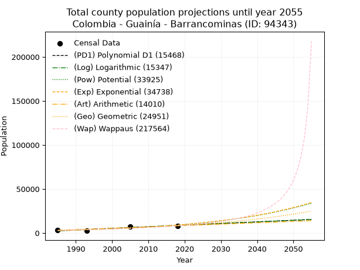
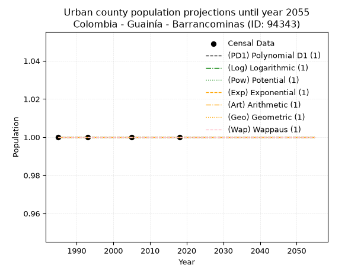
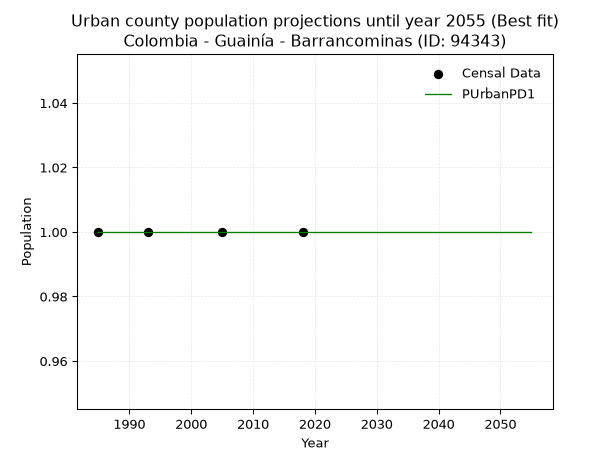
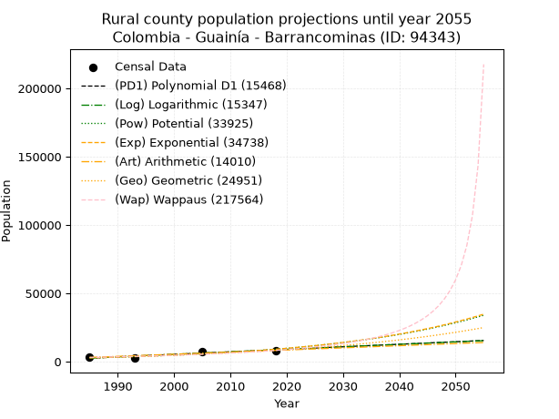
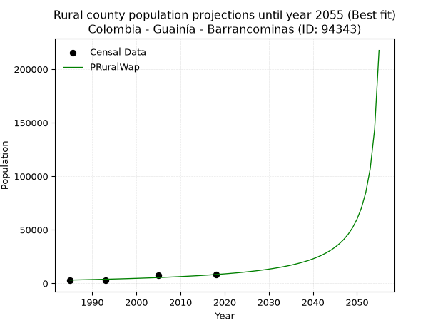

<div align="center">


</div>

# _“Population and Public Services Demand Projections (PPSD) until Year 2050 for Colombia - Guainía - Barrancominas (ID: 94343)”_
Keywords: `population` `public-service` `projection` `lineal` `polynomial` `logarithmic` `potential` `exponential` `arithmetic` `geometric` `wappaus` `dane` `colombia` `south-america`

PPSD are analytical estimates used by governments and planners to anticipate future changes in population size, age distribution, and the resulting community needs for utilities, healthcare, education, and infrastructure as sizing future water treatment facilities, electrical grids, and road networks based on spatial growth.

> **General running parameters**: • app_version: _v20260806_. • Python version: _3.14.7_. • Pandas version: _3.0.5_. • NumPy version: _2.5.1_. • Creates, save and include plots into reports (create_plot): _False_. • Projection until year: _2050_. • Process polynomial degree 2 and up: _False_. • Process Wappaus: _True_. • Process Wappaus: _True_. • Set negative values to zero: _True_. • Set infinite values to zero: _True_. • Drop dataset notes: _True_. 
<div align="center">

Dynamic map: [:earth_americas:Google](http://maps.google.com/maps?q=3.494178377,-69.8140655) [:earth_americas:OSM](https://www.openstreetmap.org/#map=18/3.494178377/-69.8140655&layers=P) [:earth_americas:Bing](https://www.bing.com/maps?cp=3.494178377~-69.8140655&lvl=18) [:earth_americas:Apple](https://maps.apple.com/frame?center=3.494178377%2C-69.8140655&span=0.003%2C0.006)

</div>


<div align="center">

```geojson
{
  "type": "Feature",
  "geometry": {
    "type": "Point", 
    "coordinates": [-69.8140655, 3.494178377]
  }, 
  "properties": {
    "Name": "Colombia - Guainía - Barrancominas (ID: 94343)"
  }
}
```

</div>


## 0. Census Data (4 records)

Census data are official statistics collected by a government about the people and housing in a country. They usually include counts of total population, age, sex, race, income, education, and jobs.

📅Global census file: [Population.xlsx](../data/Population.xlsx)

| Source   |   Year |   CountryID | CountryName   |   StateID | StateName   |   CountyID | CountyName    |   PTotal |   PUrban |   PRural |
|:---------|-------:|------------:|:--------------|----------:|:------------|-----------:|:--------------|---------:|---------:|---------:|
| DANE     |   1985 |          57 | Colombia      |        94 | Guainía     |      94343 | Barrancominas |     3052 |        1 |     3052 |
| DANE     |   1993 |          57 | Colombia      |        94 | Guainía     |      94343 | Barrancominas |     2736 |        1 |     2736 |
| DANE     |   2005 |          57 | Colombia      |        94 | Guainía     |      94343 | Barrancominas |     7456 |        1 |     7456 |
| DANE     |   2018 |          57 | Colombia      |        94 | Guainía     |      94343 | Barrancominas |     8218 |        1 |     8218 |

> 🔥Some records could had specific notes about the registered values or the corresponding urban or rural distribution.

**Local public utility companies (RUPS)**

 | SERVICIO   | ESTADO   | NOMBRE   | NIT   | DEPARTAMENTO_DOMICILIO   | MUNICIPIO_DOMICILIO   | DIRECCION   | TELEFONO   | EMAIL   | TIPO_INSCRIPCION   | REPRESENTANTE_LEGAL   | TIPO_PRESTADOR   | CLASIFICACION   |
|------------|----------|----------|-------|--------------------------|-----------------------|-------------|------------|---------|--------------------|-----------------------|------------------|-----------------|

> [📅RUPS Database: Registro Único de Prestadores de Servicios Públicos de Colombia Suramérica - RUPS](https://www.datos.gov.co/Hacienda-y-Cr-dito-P-blico/Registro-nico-de-Prestadores-de-Servicios-P-blicos/4qkq-csdn/about_data)

## 1. Total

### 1.1. Coefficients and Parameters

* (PD1) Polynomial Deg 1: 184.51465274989883, -363709.9341629852 (lineal)
* (Log) Logarithmic: 369373.49489348684, -2802245.3946588165
* (Pow) Potential: 72.7063241894728, -236.33184682624338
* (Exp) Exponential: 0.03631815871586715, 1.3419864299114356e-28
* (Art) Arithmetic: Year diff. 2018 - 1985 = 33, Population diff. 8218 - 3052 = 5166, Annual growth = 156.54545454545453
* (Geo) Geometric: Year diff. 2018 - 1985 = 33, Population diff. 8218 - 3052 = 5166, Annual growth % = 0.03047107622395373
* (Wap) Wappaus: i = 2.7780914737436477, Condition values only valid for < 200)

<sub>
Wappaus condition values: ['0.00', '2.78', '5.56', '8.33', '11.11', '13.89', '16.67', '19.45', '22.22', '25.00', '27.78', '30.56', '33.34', '36.12', '38.89', '41.67', '44.45', '47.23', '50.01', '52.78', '55.56', '58.34', '61.12', '63.90', '66.67', '69.45', '72.23', '75.01', '77.79', '80.56', '83.34', '86.12', '88.90', '91.68', '94.46', '97.23', '100.01', '102.79', '105.57', '108.35', '111.12', '113.90', '116.68', '119.46', '122.24', '125.01', '127.79', '130.57', '133.35', '136.13', '138.90', '141.68', '144.46', '147.24', '150.02', '152.80', '155.57', '158.35', '161.13', '163.91', '166.69', '169.46', '172.24', '175.02', '177.80', '180.58']
</sub>


### 1.2. Projected Dataset

|   Year |   CountyID |   PTotalPD1 |   PTotalLog |   PTotalPow |   PTotalExp |   PTotalArt |   PTotalGeo |   PTotalWap |
|-------:|-----------:|------------:|------------:|------------:|------------:|------------:|------------:|------------:|
|   1985 |      94343 |        2552 |        2546 |        2730 |        2733 |        3052 |        3052 |        3052 |
|   1986 |      94343 |        2736 |        2732 |        2832 |        2835 |        3209 |        3145 |        3138 |
|   1987 |      94343 |        2921 |        2918 |        2938 |        2939 |        3365 |        3241 |        3226 |
|   1988 |      94343 |        3105 |        3104 |        3047 |        3048 |        3522 |        3340 |        3317 |
|   1989 |      94343 |        3290 |        3289 |        3161 |        3161 |        3678 |        3441 |        3411 |
|   1990 |      94343 |        3474 |        3475 |        3278 |        3278 |        3835 |        3546 |        3508 |
|   1991 |      94343 |        3659 |        3661 |        3400 |        3399 |        3991 |        3654 |        3607 |
|   1992 |      94343 |        3843 |        3846 |        3527 |        3525 |        4148 |        3766 |        3709 |
|   1993 |      94343 |        4028 |        4031 |        3658 |        3655 |        4304 |        3880 |        3815 |
|   1994 |      94343 |        4212 |        4217 |        3793 |        3790 |        4461 |        3999 |        3924 |
|   1995 |      94343 |        4397 |        4402 |        3934 |        3930 |        4617 |        4120 |        4037 |
|   1996 |      94343 |        4581 |        4587 |        4080 |        4076 |        4774 |        4246 |        4153 |
|   1997 |      94343 |        4766 |        4772 |        4232 |        4227 |        4931 |        4375 |        4273 |
|   1998 |      94343 |        4950 |        4957 |        4389 |        4383 |        5087 |        4509 |        4397 |
|   1999 |      94343 |        5135 |        5142 |        4551 |        4545 |        5244 |        4646 |        4526 |
|   2000 |      94343 |        5319 |        5327 |        4720 |        4713 |        5400 |        4788 |        4659 |
|   2001 |      94343 |        5504 |        5511 |        4894 |        4887 |        5557 |        4934 |        4796 |
|   2002 |      94343 |        5688 |        5696 |        5075 |        5068 |        5713 |        5084 |        4939 |
|   2003 |      94343 |        5873 |        5880 |        5263 |        5256 |        5870 |        5239 |        5087 |
|   2004 |      94343 |        6057 |        6065 |        5458 |        5450 |        6026 |        5398 |        5241 |
|   2005 |      94343 |        6242 |        6249 |        5659 |        5652 |        6183 |        5563 |        5400 |
|   2006 |      94343 |        6426 |        6433 |        5868 |        5861 |        6339 |        5732 |        5566 |
|   2007 |      94343 |        6611 |        6617 |        6085 |        6077 |        6496 |        5907 |        5738 |
|   2008 |      94343 |        6795 |        6801 |        6309 |        6302 |        6653 |        6087 |        5918 |
|   2009 |      94343 |        6980 |        6985 |        6542 |        6535 |        6809 |        6273 |        6105 |
|   2010 |      94343 |        7165 |        7169 |        6783 |        6777 |        6966 |        6464 |        6299 |
|   2011 |      94343 |        7349 |        7352 |        7032 |        7027 |        7122 |        6661 |        6503 |
|   2012 |      94343 |        7534 |        7536 |        7291 |        7287 |        7279 |        6864 |        6715 |
|   2013 |      94343 |        7718 |        7720 |        7559 |        7557 |        7435 |        7073 |        6937 |
|   2014 |      94343 |        7903 |        7903 |        7837 |        7836 |        7592 |        7288 |        7169 |
|   2015 |      94343 |        8087 |        8086 |        8125 |        8126 |        7748 |        7510 |        7413 |
|   2016 |      94343 |        8272 |        8270 |        8424 |        8427 |        7905 |        7739 |        7668 |
|   2017 |      94343 |        8456 |        8453 |        8733 |        8739 |        8061 |        7975 |        7936 |
|   2018 |      94343 |        8641 |        8636 |        9054 |        9062 |        8218 |        8218 |        8218 |
|   2019 |      94343 |        8825 |        8819 |        9386 |        9397 |        8375 |        8468 |        8515 |
|   2020 |      94343 |        9010 |        9002 |        9730 |        9744 |        8531 |        8726 |        8827 |
|   2021 |      94343 |        9194 |        9185 |       10086 |       10105 |        8688 |        8992 |        9157 |
|   2022 |      94343 |        9379 |        9367 |       10456 |       10479 |        8844 |        9266 |        9506 |
|   2023 |      94343 |        9563 |        9550 |       10838 |       10866 |        9001 |        9549 |        9876 |
|   2024 |      94343 |        9748 |        9733 |       11235 |       11268 |        9157 |        9840 |       10268 |
|   2025 |      94343 |        9932 |        9915 |       11646 |       11685 |        9314 |       10140 |       10684 |
|   2026 |      94343 |       10117 |       10097 |       12071 |       12117 |        9470 |       10448 |       11127 |
|   2027 |      94343 |       10301 |       10280 |       12512 |       12565 |        9627 |       10767 |       11600 |
|   2028 |      94343 |       10486 |       10462 |       12969 |       13030 |        9783 |       11095 |       12105 |
|   2029 |      94343 |       10670 |       10644 |       13442 |       13512 |        9940 |       11433 |       12647 |
|   2030 |      94343 |       10855 |       10826 |       13933 |       14011 |       10097 |       11781 |       13228 |
|   2031 |      94343 |       11039 |       11008 |       14441 |       14530 |       10253 |       12140 |       13855 |
|   2032 |      94343 |       11224 |       11190 |       14967 |       15067 |       10410 |       12510 |       14531 |
|   2033 |      94343 |       11408 |       11371 |       15512 |       15624 |       10566 |       12891 |       15264 |
|   2034 |      94343 |       11593 |       11553 |       16076 |       16202 |       10723 |       13284 |       16061 |
|   2035 |      94343 |       11777 |       11735 |       16661 |       16801 |       10879 |       13689 |       16930 |
|   2036 |      94343 |       11962 |       11916 |       17267 |       17423 |       11036 |       14106 |       17882 |
|   2037 |      94343 |       12146 |       12097 |       17895 |       18067 |       11192 |       14536 |       18929 |
|   2038 |      94343 |       12331 |       12279 |       18545 |       18736 |       11349 |       14979 |       20086 |
|   2039 |      94343 |       12515 |       12460 |       19218 |       19428 |       11505 |       15435 |       21372 |
|   2040 |      94343 |       12700 |       12641 |       19916 |       20147 |       11662 |       15906 |       22810 |
|   2041 |      94343 |       12884 |       12822 |       20638 |       20892 |       11819 |       16390 |       24427 |
|   2042 |      94343 |       13069 |       13003 |       21386 |       21665 |       11975 |       16890 |       26260 |
|   2043 |      94343 |       13254 |       13184 |       22161 |       22466 |       12132 |       17404 |       28355 |
|   2044 |      94343 |       13438 |       13365 |       22964 |       23297 |       12288 |       17935 |       30772 |
|   2045 |      94343 |       13623 |       13545 |       23795 |       24159 |       12445 |       18481 |       33593 |
|   2046 |      94343 |       13807 |       13726 |       24656 |       25052 |       12601 |       19044 |       36926 |
|   2047 |      94343 |       13992 |       13906 |       25548 |       25979 |       12758 |       19625 |       40928 |
|   2048 |      94343 |       14176 |       14087 |       26472 |       26940 |       12914 |       20223 |       45819 |
|   2049 |      94343 |       14361 |       14267 |       27428 |       27936 |       13071 |       20839 |       51934 |
|   2050 |      94343 |       14545 |       14447 |       28419 |       28969 |       13227 |       21474 |       59798 |
<div align="center">

</img>

</div>


### 1.3. Best fit with absolute and relative error (%)

Relative error puts that difference into context by dividing the absolute error by the true value, creating a unitless ratio or percentage that shows the scale of the mistake.

Absolute and relative error

|   Year | Source   |   CountryID | CountryName   |   StateID | StateName   |   CountyID_x | CountyName    |   PTotal |   PUrban |   PRural |   CountyID_y |   PTotalPD1 |   PTotalLog |   PTotalPow |   PTotalExp |   PTotalArt |   PTotalGeo |   PTotalWap |   PTotalPD1AbsError |   PTotalLogAbsError |   PTotalPowAbsError |   PTotalExpAbsError |   PTotalArtAbsError |   PTotalGeoAbsError |   PTotalWapAbsError |   PTotalPD1RelError |   PTotalLogRelError |   PTotalPowRelError |   PTotalExpRelError |   PTotalArtRelError |   PTotalGeoRelError |   PTotalWapRelError |
|-------:|:---------|------------:|:--------------|----------:|:------------|-------------:|:--------------|---------:|---------:|---------:|-------------:|------------:|------------:|------------:|------------:|------------:|------------:|------------:|--------------------:|--------------------:|--------------------:|--------------------:|--------------------:|--------------------:|--------------------:|--------------------:|--------------------:|--------------------:|--------------------:|--------------------:|--------------------:|--------------------:|
|   1985 | DANE     |          57 | Colombia      |        94 | Guainía     |        94343 | Barrancominas |     3052 |        1 |     3052 |        94343 |        2552 |        2546 |        2730 |        2733 |        3052 |        3052 |        3052 |                 500 |                 506 |                 322 |                 319 |                   0 |                   0 |                   0 |            16.3827  |             16.5793 |             10.5505 |             10.4522 |              0      |              0      |              0      |
|   1993 | DANE     |          57 | Colombia      |        94 | Guainía     |        94343 | Barrancominas |     2736 |        1 |     2736 |        94343 |        4028 |        4031 |        3658 |        3655 |        4304 |        3880 |        3815 |                1292 |                1295 |                 922 |                 919 |                1568 |                1144 |                1079 |            47.2222  |             47.3319 |             33.6988 |             33.5892 |             57.3099 |             41.8129 |             39.4371 |
|   2005 | DANE     |          57 | Colombia      |        94 | Guainía     |        94343 | Barrancominas |     7456 |        1 |     7456 |        94343 |        6242 |        6249 |        5659 |        5652 |        6183 |        5563 |        5400 |                1214 |                1207 |                1797 |                1804 |                1273 |                1893 |                2056 |            16.2822  |             16.1883 |             24.1014 |             24.1953 |             17.0735 |             25.3889 |             27.5751 |
|   2018 | DANE     |          57 | Colombia      |        94 | Guainía     |        94343 | Barrancominas |     8218 |        1 |     8218 |        94343 |        8641 |        8636 |        9054 |        9062 |        8218 |        8218 |        8218 |                 423 |                 418 |                 836 |                 844 |                   0 |                   0 |                   0 |             5.14724 |              5.0864 |             10.1728 |             10.2701 |              0      |              0      |              0      |

Relative error mean

| Method    |   RelError | Best   |
|:----------|-----------:|:-------|
| PTotalPD1 |    21.2586 |        |
| PTotalLog |    21.2965 |        |
| PTotalPow |    19.6309 |        |
| PTotalExp |    19.6267 |        |
| PTotalArt |    18.5959 |        |
| PTotalGeo |    16.8005 |        |
| PTotalWap |    16.7531 | True   |

💙Best method: _**PTotalWap**_
<div align="center">

</img>

</div>


### 1.4. Fresh water supply demand in liters per capita per day (lpcd)

The fresh water supply demand typically ranges from 100 to 300 liters per capita per day (lpcd) for standard domestic and municipal planning, though absolute survival minimums set by the World Health Organization are as low as 7.5 to 20 liters per day, and total consumption in high-income nations can exceed 400 liters.

> `CZ`: Level in meters above the sea level (masl)<br> `WS`: Fresh water supply demand in liters per capita per day (lpcd or l/h/d)<br> `WSAll`: Zonal fresh water supply demand in liters per second (l/s)<br> `A`: Zonal area in square meters<br> `DP`: Population density (people/hectare or p/ha)

Reference values (RAS Colombia)

|    CZ |   WS |
|------:|-----:|
|  1000 |  120 |
|  2000 |  130 |
| 99999 |  140 |

County shapefile geometry properties and water supply values

|   CountyID |      ATotal |   CZTotal |   WSTotal |
|-----------:|------------:|----------:|----------:|
|      94343 | 1.43431e+10 |   171.827 |       120 |

Projected values for best method: PTotalWap

|   CountyID |   Year |   PTotalWap |   DPTotal |   WSTotal |   WSTotalAll |
|-----------:|-------:|------------:|----------:|----------:|-------------:|
|      94343 |   1985 |        3052 |      0    |       120 |      4.23889 |
|      94343 |   1986 |        3138 |      0    |       120 |      4.35833 |
|      94343 |   1987 |        3226 |      0    |       120 |      4.48056 |
|      94343 |   1988 |        3317 |      0    |       120 |      4.60694 |
|      94343 |   1989 |        3411 |      0    |       120 |      4.7375  |
|      94343 |   1990 |        3508 |      0    |       120 |      4.87222 |
|      94343 |   1991 |        3607 |      0    |       120 |      5.00972 |
|      94343 |   1992 |        3709 |      0    |       120 |      5.15139 |
|      94343 |   1993 |        3815 |      0    |       120 |      5.29861 |
|      94343 |   1994 |        3924 |      0    |       120 |      5.45    |
|      94343 |   1995 |        4037 |      0    |       120 |      5.60694 |
|      94343 |   1996 |        4153 |      0    |       120 |      5.76806 |
|      94343 |   1997 |        4273 |      0    |       120 |      5.93472 |
|      94343 |   1998 |        4397 |      0    |       120 |      6.10694 |
|      94343 |   1999 |        4526 |      0    |       120 |      6.28611 |
|      94343 |   2000 |        4659 |      0    |       120 |      6.47083 |
|      94343 |   2001 |        4796 |      0    |       120 |      6.66111 |
|      94343 |   2002 |        4939 |      0    |       120 |      6.85972 |
|      94343 |   2003 |        5087 |      0    |       120 |      7.06528 |
|      94343 |   2004 |        5241 |      0    |       120 |      7.27917 |
|      94343 |   2005 |        5400 |      0    |       120 |      7.5     |
|      94343 |   2006 |        5566 |      0    |       120 |      7.73056 |
|      94343 |   2007 |        5738 |      0    |       120 |      7.96944 |
|      94343 |   2008 |        5918 |      0    |       120 |      8.21944 |
|      94343 |   2009 |        6105 |      0    |       120 |      8.47917 |
|      94343 |   2010 |        6299 |      0    |       120 |      8.74861 |
|      94343 |   2011 |        6503 |      0    |       120 |      9.03194 |
|      94343 |   2012 |        6715 |      0    |       120 |      9.32639 |
|      94343 |   2013 |        6937 |      0    |       120 |      9.63472 |
|      94343 |   2014 |        7169 |      0    |       120 |      9.95694 |
|      94343 |   2015 |        7413 |      0.01 |       120 |     10.2958  |
|      94343 |   2016 |        7668 |      0.01 |       120 |     10.65    |
|      94343 |   2017 |        7936 |      0.01 |       120 |     11.0222  |
|      94343 |   2018 |        8218 |      0.01 |       120 |     11.4139  |
|      94343 |   2019 |        8515 |      0.01 |       120 |     11.8264  |
|      94343 |   2020 |        8827 |      0.01 |       120 |     12.2597  |
|      94343 |   2021 |        9157 |      0.01 |       120 |     12.7181  |
|      94343 |   2022 |        9506 |      0.01 |       120 |     13.2028  |
|      94343 |   2023 |        9876 |      0.01 |       120 |     13.7167  |
|      94343 |   2024 |       10268 |      0.01 |       120 |     14.2611  |
|      94343 |   2025 |       10684 |      0.01 |       120 |     14.8389  |
|      94343 |   2026 |       11127 |      0.01 |       120 |     15.4542  |
|      94343 |   2027 |       11600 |      0.01 |       120 |     16.1111  |
|      94343 |   2028 |       12105 |      0.01 |       120 |     16.8125  |
|      94343 |   2029 |       12647 |      0.01 |       120 |     17.5653  |
|      94343 |   2030 |       13228 |      0.01 |       120 |     18.3722  |
|      94343 |   2031 |       13855 |      0.01 |       120 |     19.2431  |
|      94343 |   2032 |       14531 |      0.01 |       120 |     20.1819  |
|      94343 |   2033 |       15264 |      0.01 |       120 |     21.2     |
|      94343 |   2034 |       16061 |      0.01 |       120 |     22.3069  |
|      94343 |   2035 |       16930 |      0.01 |       120 |     23.5139  |
|      94343 |   2036 |       17882 |      0.01 |       120 |     24.8361  |
|      94343 |   2037 |       18929 |      0.01 |       120 |     26.2903  |
|      94343 |   2038 |       20086 |      0.01 |       120 |     27.8972  |
|      94343 |   2039 |       21372 |      0.01 |       120 |     29.6833  |
|      94343 |   2040 |       22810 |      0.02 |       120 |     31.6806  |
|      94343 |   2041 |       24427 |      0.02 |       120 |     33.9264  |
|      94343 |   2042 |       26260 |      0.02 |       120 |     36.4722  |
|      94343 |   2043 |       28355 |      0.02 |       120 |     39.3819  |
|      94343 |   2044 |       30772 |      0.02 |       120 |     42.7389  |
|      94343 |   2045 |       33593 |      0.02 |       120 |     46.6569  |
|      94343 |   2046 |       36926 |      0.03 |       120 |     51.2861  |
|      94343 |   2047 |       40928 |      0.03 |       120 |     56.8444  |
|      94343 |   2048 |       45819 |      0.03 |       120 |     63.6375  |
|      94343 |   2049 |       51934 |      0.04 |       120 |     72.1306  |
|      94343 |   2050 |       59798 |      0.04 |       120 |     83.0528  |

## 2. Urban

### 2.1. Coefficients and Parameters

* (PD1) Polynomial Deg 1: -1.3233529347183512e-19, 1.0000000000000004 (lineal)
* (Log) Logarithmic: 3.215569112241165e-17, 0.9999999999999996
* (Pow) Potential: 0.0, 0.0
* (Exp) Exponential: 0.0, 1.0
* (Art) Arithmetic: Year diff. 2018 - 1985 = 33, Population diff. 1 - 1 = 0, Annual growth = 0.0
* (Geo) Geometric: Year diff. 2018 - 1985 = 33, Population diff. 1 - 1 = 0, Annual growth % = 0.0
* (Wap) Wappaus: i = 0.0, Condition values only valid for < 200)

<sub>
Wappaus condition values: ['0.00', '0.00', '0.00', '0.00', '0.00', '0.00', '0.00', '0.00', '0.00', '0.00', '0.00', '0.00', '0.00', '0.00', '0.00', '0.00', '0.00', '0.00', '0.00', '0.00', '0.00', '0.00', '0.00', '0.00', '0.00', '0.00', '0.00', '0.00', '0.00', '0.00', '0.00', '0.00', '0.00', '0.00', '0.00', '0.00', '0.00', '0.00', '0.00', '0.00', '0.00', '0.00', '0.00', '0.00', '0.00', '0.00', '0.00', '0.00', '0.00', '0.00', '0.00', '0.00', '0.00', '0.00', '0.00', '0.00', '0.00', '0.00', '0.00', '0.00', '0.00', '0.00', '0.00', '0.00', '0.00', '0.00']
</sub>


### 2.2. Projected Dataset

|   Year |   CountyID |   PUrbanPD1 |   PUrbanLog |   PUrbanPow |   PUrbanExp |   PUrbanArt |   PUrbanGeo |   PUrbanWap |
|-------:|-----------:|------------:|------------:|------------:|------------:|------------:|------------:|------------:|
|   1985 |      94343 |           1 |           1 |           1 |           1 |           1 |           1 |           1 |
|   1986 |      94343 |           1 |           1 |           1 |           1 |           1 |           1 |           1 |
|   1987 |      94343 |           1 |           1 |           1 |           1 |           1 |           1 |           1 |
|   1988 |      94343 |           1 |           1 |           1 |           1 |           1 |           1 |           1 |
|   1989 |      94343 |           1 |           1 |           1 |           1 |           1 |           1 |           1 |
|   1990 |      94343 |           1 |           1 |           1 |           1 |           1 |           1 |           1 |
|   1991 |      94343 |           1 |           1 |           1 |           1 |           1 |           1 |           1 |
|   1992 |      94343 |           1 |           1 |           1 |           1 |           1 |           1 |           1 |
|   1993 |      94343 |           1 |           1 |           1 |           1 |           1 |           1 |           1 |
|   1994 |      94343 |           1 |           1 |           1 |           1 |           1 |           1 |           1 |
|   1995 |      94343 |           1 |           1 |           1 |           1 |           1 |           1 |           1 |
|   1996 |      94343 |           1 |           1 |           1 |           1 |           1 |           1 |           1 |
|   1997 |      94343 |           1 |           1 |           1 |           1 |           1 |           1 |           1 |
|   1998 |      94343 |           1 |           1 |           1 |           1 |           1 |           1 |           1 |
|   1999 |      94343 |           1 |           1 |           1 |           1 |           1 |           1 |           1 |
|   2000 |      94343 |           1 |           1 |           1 |           1 |           1 |           1 |           1 |
|   2001 |      94343 |           1 |           1 |           1 |           1 |           1 |           1 |           1 |
|   2002 |      94343 |           1 |           1 |           1 |           1 |           1 |           1 |           1 |
|   2003 |      94343 |           1 |           1 |           1 |           1 |           1 |           1 |           1 |
|   2004 |      94343 |           1 |           1 |           1 |           1 |           1 |           1 |           1 |
|   2005 |      94343 |           1 |           1 |           1 |           1 |           1 |           1 |           1 |
|   2006 |      94343 |           1 |           1 |           1 |           1 |           1 |           1 |           1 |
|   2007 |      94343 |           1 |           1 |           1 |           1 |           1 |           1 |           1 |
|   2008 |      94343 |           1 |           1 |           1 |           1 |           1 |           1 |           1 |
|   2009 |      94343 |           1 |           1 |           1 |           1 |           1 |           1 |           1 |
|   2010 |      94343 |           1 |           1 |           1 |           1 |           1 |           1 |           1 |
|   2011 |      94343 |           1 |           1 |           1 |           1 |           1 |           1 |           1 |
|   2012 |      94343 |           1 |           1 |           1 |           1 |           1 |           1 |           1 |
|   2013 |      94343 |           1 |           1 |           1 |           1 |           1 |           1 |           1 |
|   2014 |      94343 |           1 |           1 |           1 |           1 |           1 |           1 |           1 |
|   2015 |      94343 |           1 |           1 |           1 |           1 |           1 |           1 |           1 |
|   2016 |      94343 |           1 |           1 |           1 |           1 |           1 |           1 |           1 |
|   2017 |      94343 |           1 |           1 |           1 |           1 |           1 |           1 |           1 |
|   2018 |      94343 |           1 |           1 |           1 |           1 |           1 |           1 |           1 |
|   2019 |      94343 |           1 |           1 |           1 |           1 |           1 |           1 |           1 |
|   2020 |      94343 |           1 |           1 |           1 |           1 |           1 |           1 |           1 |
|   2021 |      94343 |           1 |           1 |           1 |           1 |           1 |           1 |           1 |
|   2022 |      94343 |           1 |           1 |           1 |           1 |           1 |           1 |           1 |
|   2023 |      94343 |           1 |           1 |           1 |           1 |           1 |           1 |           1 |
|   2024 |      94343 |           1 |           1 |           1 |           1 |           1 |           1 |           1 |
|   2025 |      94343 |           1 |           1 |           1 |           1 |           1 |           1 |           1 |
|   2026 |      94343 |           1 |           1 |           1 |           1 |           1 |           1 |           1 |
|   2027 |      94343 |           1 |           1 |           1 |           1 |           1 |           1 |           1 |
|   2028 |      94343 |           1 |           1 |           1 |           1 |           1 |           1 |           1 |
|   2029 |      94343 |           1 |           1 |           1 |           1 |           1 |           1 |           1 |
|   2030 |      94343 |           1 |           1 |           1 |           1 |           1 |           1 |           1 |
|   2031 |      94343 |           1 |           1 |           1 |           1 |           1 |           1 |           1 |
|   2032 |      94343 |           1 |           1 |           1 |           1 |           1 |           1 |           1 |
|   2033 |      94343 |           1 |           1 |           1 |           1 |           1 |           1 |           1 |
|   2034 |      94343 |           1 |           1 |           1 |           1 |           1 |           1 |           1 |
|   2035 |      94343 |           1 |           1 |           1 |           1 |           1 |           1 |           1 |
|   2036 |      94343 |           1 |           1 |           1 |           1 |           1 |           1 |           1 |
|   2037 |      94343 |           1 |           1 |           1 |           1 |           1 |           1 |           1 |
|   2038 |      94343 |           1 |           1 |           1 |           1 |           1 |           1 |           1 |
|   2039 |      94343 |           1 |           1 |           1 |           1 |           1 |           1 |           1 |
|   2040 |      94343 |           1 |           1 |           1 |           1 |           1 |           1 |           1 |
|   2041 |      94343 |           1 |           1 |           1 |           1 |           1 |           1 |           1 |
|   2042 |      94343 |           1 |           1 |           1 |           1 |           1 |           1 |           1 |
|   2043 |      94343 |           1 |           1 |           1 |           1 |           1 |           1 |           1 |
|   2044 |      94343 |           1 |           1 |           1 |           1 |           1 |           1 |           1 |
|   2045 |      94343 |           1 |           1 |           1 |           1 |           1 |           1 |           1 |
|   2046 |      94343 |           1 |           1 |           1 |           1 |           1 |           1 |           1 |
|   2047 |      94343 |           1 |           1 |           1 |           1 |           1 |           1 |           1 |
|   2048 |      94343 |           1 |           1 |           1 |           1 |           1 |           1 |           1 |
|   2049 |      94343 |           1 |           1 |           1 |           1 |           1 |           1 |           1 |
|   2050 |      94343 |           1 |           1 |           1 |           1 |           1 |           1 |           1 |
<div align="center">

</img>

</div>


### 2.3. Best fit with absolute and relative error (%)

Relative error puts that difference into context by dividing the absolute error by the true value, creating a unitless ratio or percentage that shows the scale of the mistake.

Absolute and relative error

|   Year | Source   |   CountryID | CountryName   |   StateID | StateName   |   CountyID_x | CountyName    |   PTotal |   PUrban |   PRural |   CountyID_y |   PUrbanPD1 |   PUrbanLog |   PUrbanPow |   PUrbanExp |   PUrbanArt |   PUrbanGeo |   PUrbanWap |   PUrbanPD1AbsError |   PUrbanLogAbsError |   PUrbanPowAbsError |   PUrbanExpAbsError |   PUrbanArtAbsError |   PUrbanGeoAbsError |   PUrbanWapAbsError |   PUrbanPD1RelError |   PUrbanLogRelError |   PUrbanPowRelError |   PUrbanExpRelError |   PUrbanArtRelError |   PUrbanGeoRelError |   PUrbanWapRelError |
|-------:|:---------|------------:|:--------------|----------:|:------------|-------------:|:--------------|---------:|---------:|---------:|-------------:|------------:|------------:|------------:|------------:|------------:|------------:|------------:|--------------------:|--------------------:|--------------------:|--------------------:|--------------------:|--------------------:|--------------------:|--------------------:|--------------------:|--------------------:|--------------------:|--------------------:|--------------------:|--------------------:|
|   1985 | DANE     |          57 | Colombia      |        94 | Guainía     |        94343 | Barrancominas |     3052 |        1 |     3052 |        94343 |           1 |           1 |           1 |           1 |           1 |           1 |           1 |                   0 |                   0 |                   0 |                   0 |                   0 |                   0 |                   0 |                   0 |                   0 |                   0 |                   0 |                   0 |                   0 |                   0 |
|   1993 | DANE     |          57 | Colombia      |        94 | Guainía     |        94343 | Barrancominas |     2736 |        1 |     2736 |        94343 |           1 |           1 |           1 |           1 |           1 |           1 |           1 |                   0 |                   0 |                   0 |                   0 |                   0 |                   0 |                   0 |                   0 |                   0 |                   0 |                   0 |                   0 |                   0 |                   0 |
|   2005 | DANE     |          57 | Colombia      |        94 | Guainía     |        94343 | Barrancominas |     7456 |        1 |     7456 |        94343 |           1 |           1 |           1 |           1 |           1 |           1 |           1 |                   0 |                   0 |                   0 |                   0 |                   0 |                   0 |                   0 |                   0 |                   0 |                   0 |                   0 |                   0 |                   0 |                   0 |
|   2018 | DANE     |          57 | Colombia      |        94 | Guainía     |        94343 | Barrancominas |     8218 |        1 |     8218 |        94343 |           1 |           1 |           1 |           1 |           1 |           1 |           1 |                   0 |                   0 |                   0 |                   0 |                   0 |                   0 |                   0 |                   0 |                   0 |                   0 |                   0 |                   0 |                   0 |                   0 |

Relative error mean

| Method    |   RelError | Best   |
|:----------|-----------:|:-------|
| PUrbanPD1 |          0 | True   |
| PUrbanLog |          0 | True   |
| PUrbanPow |          0 | True   |
| PUrbanExp |          0 | True   |
| PUrbanArt |          0 | True   |
| PUrbanGeo |          0 | True   |
| PUrbanWap |          0 | True   |

💙Best method: _**PUrbanPD1**_
<div align="center">

</img>

</div>


### 2.4. Fresh water supply demand in liters per capita per day (lpcd)

The fresh water supply demand typically ranges from 100 to 300 liters per capita per day (lpcd) for standard domestic and municipal planning, though absolute survival minimums set by the World Health Organization are as low as 7.5 to 20 liters per day, and total consumption in high-income nations can exceed 400 liters.

> `CZ`: Level in meters above the sea level (masl)<br> `WS`: Fresh water supply demand in liters per capita per day (lpcd or l/h/d)<br> `WSAll`: Zonal fresh water supply demand in liters per second (l/s)<br> `A`: Zonal area in square meters<br> `DP`: Population density (people/hectare or p/ha)

Reference values (RAS Colombia)

|    CZ |   WS |
|------:|-----:|
|  1000 |  120 |
|  2000 |  130 |
| 99999 |  140 |

County shapefile geometry properties and water supply values

|   CountyID |   AUrban |   CZUrban |   WSUrban |
|-----------:|---------:|----------:|----------:|
|      94343 |   721904 |   119.081 |       120 |

Projected values for best method: PUrbanPD1

|   CountyID |   Year |   PUrbanPD1 |   DPUrban |   WSUrban |   WSUrbanAll |
|-----------:|-------:|------------:|----------:|----------:|-------------:|
|      94343 |   1985 |           1 |      0.01 |       120 |   0.00138889 |
|      94343 |   1986 |           1 |      0.01 |       120 |   0.00138889 |
|      94343 |   1987 |           1 |      0.01 |       120 |   0.00138889 |
|      94343 |   1988 |           1 |      0.01 |       120 |   0.00138889 |
|      94343 |   1989 |           1 |      0.01 |       120 |   0.00138889 |
|      94343 |   1990 |           1 |      0.01 |       120 |   0.00138889 |
|      94343 |   1991 |           1 |      0.01 |       120 |   0.00138889 |
|      94343 |   1992 |           1 |      0.01 |       120 |   0.00138889 |
|      94343 |   1993 |           1 |      0.01 |       120 |   0.00138889 |
|      94343 |   1994 |           1 |      0.01 |       120 |   0.00138889 |
|      94343 |   1995 |           1 |      0.01 |       120 |   0.00138889 |
|      94343 |   1996 |           1 |      0.01 |       120 |   0.00138889 |
|      94343 |   1997 |           1 |      0.01 |       120 |   0.00138889 |
|      94343 |   1998 |           1 |      0.01 |       120 |   0.00138889 |
|      94343 |   1999 |           1 |      0.01 |       120 |   0.00138889 |
|      94343 |   2000 |           1 |      0.01 |       120 |   0.00138889 |
|      94343 |   2001 |           1 |      0.01 |       120 |   0.00138889 |
|      94343 |   2002 |           1 |      0.01 |       120 |   0.00138889 |
|      94343 |   2003 |           1 |      0.01 |       120 |   0.00138889 |
|      94343 |   2004 |           1 |      0.01 |       120 |   0.00138889 |
|      94343 |   2005 |           1 |      0.01 |       120 |   0.00138889 |
|      94343 |   2006 |           1 |      0.01 |       120 |   0.00138889 |
|      94343 |   2007 |           1 |      0.01 |       120 |   0.00138889 |
|      94343 |   2008 |           1 |      0.01 |       120 |   0.00138889 |
|      94343 |   2009 |           1 |      0.01 |       120 |   0.00138889 |
|      94343 |   2010 |           1 |      0.01 |       120 |   0.00138889 |
|      94343 |   2011 |           1 |      0.01 |       120 |   0.00138889 |
|      94343 |   2012 |           1 |      0.01 |       120 |   0.00138889 |
|      94343 |   2013 |           1 |      0.01 |       120 |   0.00138889 |
|      94343 |   2014 |           1 |      0.01 |       120 |   0.00138889 |
|      94343 |   2015 |           1 |      0.01 |       120 |   0.00138889 |
|      94343 |   2016 |           1 |      0.01 |       120 |   0.00138889 |
|      94343 |   2017 |           1 |      0.01 |       120 |   0.00138889 |
|      94343 |   2018 |           1 |      0.01 |       120 |   0.00138889 |
|      94343 |   2019 |           1 |      0.01 |       120 |   0.00138889 |
|      94343 |   2020 |           1 |      0.01 |       120 |   0.00138889 |
|      94343 |   2021 |           1 |      0.01 |       120 |   0.00138889 |
|      94343 |   2022 |           1 |      0.01 |       120 |   0.00138889 |
|      94343 |   2023 |           1 |      0.01 |       120 |   0.00138889 |
|      94343 |   2024 |           1 |      0.01 |       120 |   0.00138889 |
|      94343 |   2025 |           1 |      0.01 |       120 |   0.00138889 |
|      94343 |   2026 |           1 |      0.01 |       120 |   0.00138889 |
|      94343 |   2027 |           1 |      0.01 |       120 |   0.00138889 |
|      94343 |   2028 |           1 |      0.01 |       120 |   0.00138889 |
|      94343 |   2029 |           1 |      0.01 |       120 |   0.00138889 |
|      94343 |   2030 |           1 |      0.01 |       120 |   0.00138889 |
|      94343 |   2031 |           1 |      0.01 |       120 |   0.00138889 |
|      94343 |   2032 |           1 |      0.01 |       120 |   0.00138889 |
|      94343 |   2033 |           1 |      0.01 |       120 |   0.00138889 |
|      94343 |   2034 |           1 |      0.01 |       120 |   0.00138889 |
|      94343 |   2035 |           1 |      0.01 |       120 |   0.00138889 |
|      94343 |   2036 |           1 |      0.01 |       120 |   0.00138889 |
|      94343 |   2037 |           1 |      0.01 |       120 |   0.00138889 |
|      94343 |   2038 |           1 |      0.01 |       120 |   0.00138889 |
|      94343 |   2039 |           1 |      0.01 |       120 |   0.00138889 |
|      94343 |   2040 |           1 |      0.01 |       120 |   0.00138889 |
|      94343 |   2041 |           1 |      0.01 |       120 |   0.00138889 |
|      94343 |   2042 |           1 |      0.01 |       120 |   0.00138889 |
|      94343 |   2043 |           1 |      0.01 |       120 |   0.00138889 |
|      94343 |   2044 |           1 |      0.01 |       120 |   0.00138889 |
|      94343 |   2045 |           1 |      0.01 |       120 |   0.00138889 |
|      94343 |   2046 |           1 |      0.01 |       120 |   0.00138889 |
|      94343 |   2047 |           1 |      0.01 |       120 |   0.00138889 |
|      94343 |   2048 |           1 |      0.01 |       120 |   0.00138889 |
|      94343 |   2049 |           1 |      0.01 |       120 |   0.00138889 |
|      94343 |   2050 |           1 |      0.01 |       120 |   0.00138889 |

## 3. Rural

### 3.1. Coefficients and Parameters

* (PD1) Polynomial Deg 1: 184.51465274989883, -363709.9341629852 (lineal)
* (Log) Logarithmic: 369373.49489348684, -2802245.3946588165
* (Pow) Potential: 72.7063241894728, -236.33184682624338
* (Exp) Exponential: 0.03631815871586715, 1.3419864299114356e-28
* (Art) Arithmetic: Year diff. 2018 - 1985 = 33, Population diff. 8218 - 3052 = 5166, Annual growth = 156.54545454545453
* (Geo) Geometric: Year diff. 2018 - 1985 = 33, Population diff. 8218 - 3052 = 5166, Annual growth % = 0.03047107622395373
* (Wap) Wappaus: i = 2.7780914737436477, Condition values only valid for < 200)

<sub>
Wappaus condition values: ['0.00', '2.78', '5.56', '8.33', '11.11', '13.89', '16.67', '19.45', '22.22', '25.00', '27.78', '30.56', '33.34', '36.12', '38.89', '41.67', '44.45', '47.23', '50.01', '52.78', '55.56', '58.34', '61.12', '63.90', '66.67', '69.45', '72.23', '75.01', '77.79', '80.56', '83.34', '86.12', '88.90', '91.68', '94.46', '97.23', '100.01', '102.79', '105.57', '108.35', '111.12', '113.90', '116.68', '119.46', '122.24', '125.01', '127.79', '130.57', '133.35', '136.13', '138.90', '141.68', '144.46', '147.24', '150.02', '152.80', '155.57', '158.35', '161.13', '163.91', '166.69', '169.46', '172.24', '175.02', '177.80', '180.58']
</sub>


### 3.2. Projected Dataset

|   Year |   CountyID |   PRuralPD1 |   PRuralLog |   PRuralPow |   PRuralExp |   PRuralArt |   PRuralGeo |   PRuralWap |
|-------:|-----------:|------------:|------------:|------------:|------------:|------------:|------------:|------------:|
|   1985 |      94343 |        2552 |        2546 |        2730 |        2733 |        3052 |        3052 |        3052 |
|   1986 |      94343 |        2736 |        2732 |        2832 |        2835 |        3209 |        3145 |        3138 |
|   1987 |      94343 |        2921 |        2918 |        2938 |        2939 |        3365 |        3241 |        3226 |
|   1988 |      94343 |        3105 |        3104 |        3047 |        3048 |        3522 |        3340 |        3317 |
|   1989 |      94343 |        3290 |        3289 |        3161 |        3161 |        3678 |        3441 |        3411 |
|   1990 |      94343 |        3474 |        3475 |        3278 |        3278 |        3835 |        3546 |        3508 |
|   1991 |      94343 |        3659 |        3661 |        3400 |        3399 |        3991 |        3654 |        3607 |
|   1992 |      94343 |        3843 |        3846 |        3527 |        3525 |        4148 |        3766 |        3709 |
|   1993 |      94343 |        4028 |        4031 |        3658 |        3655 |        4304 |        3880 |        3815 |
|   1994 |      94343 |        4212 |        4217 |        3793 |        3790 |        4461 |        3999 |        3924 |
|   1995 |      94343 |        4397 |        4402 |        3934 |        3930 |        4617 |        4120 |        4037 |
|   1996 |      94343 |        4581 |        4587 |        4080 |        4076 |        4774 |        4246 |        4153 |
|   1997 |      94343 |        4766 |        4772 |        4232 |        4227 |        4931 |        4375 |        4273 |
|   1998 |      94343 |        4950 |        4957 |        4389 |        4383 |        5087 |        4509 |        4397 |
|   1999 |      94343 |        5135 |        5142 |        4551 |        4545 |        5244 |        4646 |        4526 |
|   2000 |      94343 |        5319 |        5327 |        4720 |        4713 |        5400 |        4788 |        4659 |
|   2001 |      94343 |        5504 |        5511 |        4894 |        4887 |        5557 |        4934 |        4796 |
|   2002 |      94343 |        5688 |        5696 |        5075 |        5068 |        5713 |        5084 |        4939 |
|   2003 |      94343 |        5873 |        5880 |        5263 |        5256 |        5870 |        5239 |        5087 |
|   2004 |      94343 |        6057 |        6065 |        5458 |        5450 |        6026 |        5398 |        5241 |
|   2005 |      94343 |        6242 |        6249 |        5659 |        5652 |        6183 |        5563 |        5400 |
|   2006 |      94343 |        6426 |        6433 |        5868 |        5861 |        6339 |        5732 |        5566 |
|   2007 |      94343 |        6611 |        6617 |        6085 |        6077 |        6496 |        5907 |        5738 |
|   2008 |      94343 |        6795 |        6801 |        6309 |        6302 |        6653 |        6087 |        5918 |
|   2009 |      94343 |        6980 |        6985 |        6542 |        6535 |        6809 |        6273 |        6105 |
|   2010 |      94343 |        7165 |        7169 |        6783 |        6777 |        6966 |        6464 |        6299 |
|   2011 |      94343 |        7349 |        7352 |        7032 |        7027 |        7122 |        6661 |        6503 |
|   2012 |      94343 |        7534 |        7536 |        7291 |        7287 |        7279 |        6864 |        6715 |
|   2013 |      94343 |        7718 |        7720 |        7559 |        7557 |        7435 |        7073 |        6937 |
|   2014 |      94343 |        7903 |        7903 |        7837 |        7836 |        7592 |        7288 |        7169 |
|   2015 |      94343 |        8087 |        8086 |        8125 |        8126 |        7748 |        7510 |        7413 |
|   2016 |      94343 |        8272 |        8270 |        8424 |        8427 |        7905 |        7739 |        7668 |
|   2017 |      94343 |        8456 |        8453 |        8733 |        8739 |        8061 |        7975 |        7936 |
|   2018 |      94343 |        8641 |        8636 |        9054 |        9062 |        8218 |        8218 |        8218 |
|   2019 |      94343 |        8825 |        8819 |        9386 |        9397 |        8375 |        8468 |        8515 |
|   2020 |      94343 |        9010 |        9002 |        9730 |        9744 |        8531 |        8726 |        8827 |
|   2021 |      94343 |        9194 |        9185 |       10086 |       10105 |        8688 |        8992 |        9157 |
|   2022 |      94343 |        9379 |        9367 |       10456 |       10479 |        8844 |        9266 |        9506 |
|   2023 |      94343 |        9563 |        9550 |       10838 |       10866 |        9001 |        9549 |        9876 |
|   2024 |      94343 |        9748 |        9733 |       11235 |       11268 |        9157 |        9840 |       10268 |
|   2025 |      94343 |        9932 |        9915 |       11646 |       11685 |        9314 |       10140 |       10684 |
|   2026 |      94343 |       10117 |       10097 |       12071 |       12117 |        9470 |       10448 |       11127 |
|   2027 |      94343 |       10301 |       10280 |       12512 |       12565 |        9627 |       10767 |       11600 |
|   2028 |      94343 |       10486 |       10462 |       12969 |       13030 |        9783 |       11095 |       12105 |
|   2029 |      94343 |       10670 |       10644 |       13442 |       13512 |        9940 |       11433 |       12647 |
|   2030 |      94343 |       10855 |       10826 |       13933 |       14011 |       10097 |       11781 |       13228 |
|   2031 |      94343 |       11039 |       11008 |       14441 |       14530 |       10253 |       12140 |       13855 |
|   2032 |      94343 |       11224 |       11190 |       14967 |       15067 |       10410 |       12510 |       14531 |
|   2033 |      94343 |       11408 |       11371 |       15512 |       15624 |       10566 |       12891 |       15264 |
|   2034 |      94343 |       11593 |       11553 |       16076 |       16202 |       10723 |       13284 |       16061 |
|   2035 |      94343 |       11777 |       11735 |       16661 |       16801 |       10879 |       13689 |       16930 |
|   2036 |      94343 |       11962 |       11916 |       17267 |       17423 |       11036 |       14106 |       17882 |
|   2037 |      94343 |       12146 |       12097 |       17895 |       18067 |       11192 |       14536 |       18929 |
|   2038 |      94343 |       12331 |       12279 |       18545 |       18736 |       11349 |       14979 |       20086 |
|   2039 |      94343 |       12515 |       12460 |       19218 |       19428 |       11505 |       15435 |       21372 |
|   2040 |      94343 |       12700 |       12641 |       19916 |       20147 |       11662 |       15906 |       22810 |
|   2041 |      94343 |       12884 |       12822 |       20638 |       20892 |       11819 |       16390 |       24427 |
|   2042 |      94343 |       13069 |       13003 |       21386 |       21665 |       11975 |       16890 |       26260 |
|   2043 |      94343 |       13254 |       13184 |       22161 |       22466 |       12132 |       17404 |       28355 |
|   2044 |      94343 |       13438 |       13365 |       22964 |       23297 |       12288 |       17935 |       30772 |
|   2045 |      94343 |       13623 |       13545 |       23795 |       24159 |       12445 |       18481 |       33593 |
|   2046 |      94343 |       13807 |       13726 |       24656 |       25052 |       12601 |       19044 |       36926 |
|   2047 |      94343 |       13992 |       13906 |       25548 |       25979 |       12758 |       19625 |       40928 |
|   2048 |      94343 |       14176 |       14087 |       26472 |       26940 |       12914 |       20223 |       45819 |
|   2049 |      94343 |       14361 |       14267 |       27428 |       27936 |       13071 |       20839 |       51934 |
|   2050 |      94343 |       14545 |       14447 |       28419 |       28969 |       13227 |       21474 |       59798 |
<div align="center">

</img>

</div>


### 3.3. Best fit with absolute and relative error (%)

Relative error puts that difference into context by dividing the absolute error by the true value, creating a unitless ratio or percentage that shows the scale of the mistake.

Absolute and relative error

|   Year | Source   |   CountryID | CountryName   |   StateID | StateName   |   CountyID_x | CountyName    |   PTotal |   PUrban |   PRural |   CountyID_y |   PRuralPD1 |   PRuralLog |   PRuralPow |   PRuralExp |   PRuralArt |   PRuralGeo |   PRuralWap |   PRuralPD1AbsError |   PRuralLogAbsError |   PRuralPowAbsError |   PRuralExpAbsError |   PRuralArtAbsError |   PRuralGeoAbsError |   PRuralWapAbsError |   PRuralPD1RelError |   PRuralLogRelError |   PRuralPowRelError |   PRuralExpRelError |   PRuralArtRelError |   PRuralGeoRelError |   PRuralWapRelError |
|-------:|:---------|------------:|:--------------|----------:|:------------|-------------:|:--------------|---------:|---------:|---------:|-------------:|------------:|------------:|------------:|------------:|------------:|------------:|------------:|--------------------:|--------------------:|--------------------:|--------------------:|--------------------:|--------------------:|--------------------:|--------------------:|--------------------:|--------------------:|--------------------:|--------------------:|--------------------:|--------------------:|
|   1985 | DANE     |          57 | Colombia      |        94 | Guainía     |        94343 | Barrancominas |     3052 |        1 |     3052 |        94343 |        2552 |        2546 |        2730 |        2733 |        3052 |        3052 |        3052 |                 500 |                 506 |                 322 |                 319 |                   0 |                   0 |                   0 |            16.3827  |             16.5793 |             10.5505 |             10.4522 |              0      |              0      |              0      |
|   1993 | DANE     |          57 | Colombia      |        94 | Guainía     |        94343 | Barrancominas |     2736 |        1 |     2736 |        94343 |        4028 |        4031 |        3658 |        3655 |        4304 |        3880 |        3815 |                1292 |                1295 |                 922 |                 919 |                1568 |                1144 |                1079 |            47.2222  |             47.3319 |             33.6988 |             33.5892 |             57.3099 |             41.8129 |             39.4371 |
|   2005 | DANE     |          57 | Colombia      |        94 | Guainía     |        94343 | Barrancominas |     7456 |        1 |     7456 |        94343 |        6242 |        6249 |        5659 |        5652 |        6183 |        5563 |        5400 |                1214 |                1207 |                1797 |                1804 |                1273 |                1893 |                2056 |            16.2822  |             16.1883 |             24.1014 |             24.1953 |             17.0735 |             25.3889 |             27.5751 |
|   2018 | DANE     |          57 | Colombia      |        94 | Guainía     |        94343 | Barrancominas |     8218 |        1 |     8218 |        94343 |        8641 |        8636 |        9054 |        9062 |        8218 |        8218 |        8218 |                 423 |                 418 |                 836 |                 844 |                   0 |                   0 |                   0 |             5.14724 |              5.0864 |             10.1728 |             10.2701 |              0      |              0      |              0      |

Relative error mean

| Method    |   RelError | Best   |
|:----------|-----------:|:-------|
| PRuralPD1 |    21.2586 |        |
| PRuralLog |    21.2965 |        |
| PRuralPow |    19.6309 |        |
| PRuralExp |    19.6267 |        |
| PRuralArt |    18.5959 |        |
| PRuralGeo |    16.8005 |        |
| PRuralWap |    16.7531 | True   |

💙Best method: _**PRuralWap**_
<div align="center">

</img>

</div>


### 3.4. Fresh water supply demand in liters per capita per day (lpcd)

The fresh water supply demand typically ranges from 100 to 300 liters per capita per day (lpcd) for standard domestic and municipal planning, though absolute survival minimums set by the World Health Organization are as low as 7.5 to 20 liters per day, and total consumption in high-income nations can exceed 400 liters.

> `CZ`: Level in meters above the sea level (masl)<br> `WS`: Fresh water supply demand in liters per capita per day (lpcd or l/h/d)<br> `WSAll`: Zonal fresh water supply demand in liters per second (l/s)<br> `A`: Zonal area in square meters<br> `DP`: Population density (people/hectare or p/ha)

Reference values (RAS Colombia)

|    CZ |   WS |
|------:|-----:|
|  1000 |  120 |
|  2000 |  130 |
| 99999 |  140 |

County shapefile geometry properties and water supply values

|   CountyID |      ARural |   CZRural |   WSRural |
|-----------:|------------:|----------:|----------:|
|      94343 | 1.43424e+10 |   171.829 |       120 |

Projected values for best method: PRuralWap

|   CountyID |   Year |   PRuralWap |   DPRural |   WSRural |   WSRuralAll |
|-----------:|-------:|------------:|----------:|----------:|-------------:|
|      94343 |   1985 |        3052 |      0    |       120 |      4.23889 |
|      94343 |   1986 |        3138 |      0    |       120 |      4.35833 |
|      94343 |   1987 |        3226 |      0    |       120 |      4.48056 |
|      94343 |   1988 |        3317 |      0    |       120 |      4.60694 |
|      94343 |   1989 |        3411 |      0    |       120 |      4.7375  |
|      94343 |   1990 |        3508 |      0    |       120 |      4.87222 |
|      94343 |   1991 |        3607 |      0    |       120 |      5.00972 |
|      94343 |   1992 |        3709 |      0    |       120 |      5.15139 |
|      94343 |   1993 |        3815 |      0    |       120 |      5.29861 |
|      94343 |   1994 |        3924 |      0    |       120 |      5.45    |
|      94343 |   1995 |        4037 |      0    |       120 |      5.60694 |
|      94343 |   1996 |        4153 |      0    |       120 |      5.76806 |
|      94343 |   1997 |        4273 |      0    |       120 |      5.93472 |
|      94343 |   1998 |        4397 |      0    |       120 |      6.10694 |
|      94343 |   1999 |        4526 |      0    |       120 |      6.28611 |
|      94343 |   2000 |        4659 |      0    |       120 |      6.47083 |
|      94343 |   2001 |        4796 |      0    |       120 |      6.66111 |
|      94343 |   2002 |        4939 |      0    |       120 |      6.85972 |
|      94343 |   2003 |        5087 |      0    |       120 |      7.06528 |
|      94343 |   2004 |        5241 |      0    |       120 |      7.27917 |
|      94343 |   2005 |        5400 |      0    |       120 |      7.5     |
|      94343 |   2006 |        5566 |      0    |       120 |      7.73056 |
|      94343 |   2007 |        5738 |      0    |       120 |      7.96944 |
|      94343 |   2008 |        5918 |      0    |       120 |      8.21944 |
|      94343 |   2009 |        6105 |      0    |       120 |      8.47917 |
|      94343 |   2010 |        6299 |      0    |       120 |      8.74861 |
|      94343 |   2011 |        6503 |      0    |       120 |      9.03194 |
|      94343 |   2012 |        6715 |      0    |       120 |      9.32639 |
|      94343 |   2013 |        6937 |      0    |       120 |      9.63472 |
|      94343 |   2014 |        7169 |      0    |       120 |      9.95694 |
|      94343 |   2015 |        7413 |      0.01 |       120 |     10.2958  |
|      94343 |   2016 |        7668 |      0.01 |       120 |     10.65    |
|      94343 |   2017 |        7936 |      0.01 |       120 |     11.0222  |
|      94343 |   2018 |        8218 |      0.01 |       120 |     11.4139  |
|      94343 |   2019 |        8515 |      0.01 |       120 |     11.8264  |
|      94343 |   2020 |        8827 |      0.01 |       120 |     12.2597  |
|      94343 |   2021 |        9157 |      0.01 |       120 |     12.7181  |
|      94343 |   2022 |        9506 |      0.01 |       120 |     13.2028  |
|      94343 |   2023 |        9876 |      0.01 |       120 |     13.7167  |
|      94343 |   2024 |       10268 |      0.01 |       120 |     14.2611  |
|      94343 |   2025 |       10684 |      0.01 |       120 |     14.8389  |
|      94343 |   2026 |       11127 |      0.01 |       120 |     15.4542  |
|      94343 |   2027 |       11600 |      0.01 |       120 |     16.1111  |
|      94343 |   2028 |       12105 |      0.01 |       120 |     16.8125  |
|      94343 |   2029 |       12647 |      0.01 |       120 |     17.5653  |
|      94343 |   2030 |       13228 |      0.01 |       120 |     18.3722  |
|      94343 |   2031 |       13855 |      0.01 |       120 |     19.2431  |
|      94343 |   2032 |       14531 |      0.01 |       120 |     20.1819  |
|      94343 |   2033 |       15264 |      0.01 |       120 |     21.2     |
|      94343 |   2034 |       16061 |      0.01 |       120 |     22.3069  |
|      94343 |   2035 |       16930 |      0.01 |       120 |     23.5139  |
|      94343 |   2036 |       17882 |      0.01 |       120 |     24.8361  |
|      94343 |   2037 |       18929 |      0.01 |       120 |     26.2903  |
|      94343 |   2038 |       20086 |      0.01 |       120 |     27.8972  |
|      94343 |   2039 |       21372 |      0.01 |       120 |     29.6833  |
|      94343 |   2040 |       22810 |      0.02 |       120 |     31.6806  |
|      94343 |   2041 |       24427 |      0.02 |       120 |     33.9264  |
|      94343 |   2042 |       26260 |      0.02 |       120 |     36.4722  |
|      94343 |   2043 |       28355 |      0.02 |       120 |     39.3819  |
|      94343 |   2044 |       30772 |      0.02 |       120 |     42.7389  |
|      94343 |   2045 |       33593 |      0.02 |       120 |     46.6569  |
|      94343 |   2046 |       36926 |      0.03 |       120 |     51.2861  |
|      94343 |   2047 |       40928 |      0.03 |       120 |     56.8444  |
|      94343 |   2048 |       45819 |      0.03 |       120 |     63.6375  |
|      94343 |   2049 |       51934 |      0.04 |       120 |     72.1306  |
|      94343 |   2050 |       59798 |      0.04 |       120 |     83.0528  |

<div align="center"><br><sub>Share this research</sub></div><br>

<sub>**APPS & TOOLS & CONTENT DISCLAIMER**: • NO WARRANTY - This content and software is provided by <a href="https://github.com/rcfdtools" target="_blank">github.com/rcfdtools</a> "as is", without any express or implied warranty, including warranties of merchantability, fitness for a particular purpose, or non-infringement. There is no guarantee that the software will be error-free or operate without interruption. • LIMITATION OF LIABILITY - Neither the authors nor copyright holders will be liable for claims or damages arising from the software or its use. You are responsible for determining if the software is appropriate for your use and assume all associated risks, including errors, legal compliance, and data loss. • NO PROFESSIONAL ADVICE - The software provides general information and does not offer professional advice. It should not replace consultation with professional advisors. [Clauses and global license for rcfdtools use.](https://github.com/rcfdtools/rcfdtools/blob/main/LICENSE.md)</sub>

| [:house: Home](Readme.md)  | [:beginner: Help / Collaborate](https://github.com/rcfdtools/R.HydroTools/discussions/31) |
|----------------------------|-------------------------------------------------------------------------------------------|