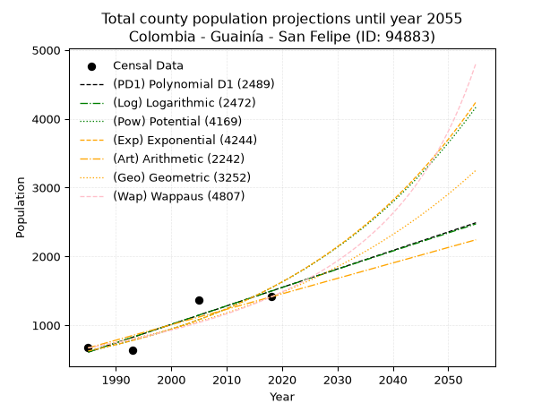
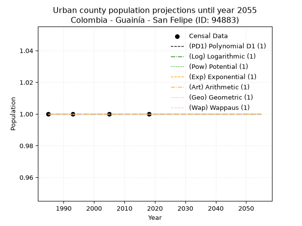
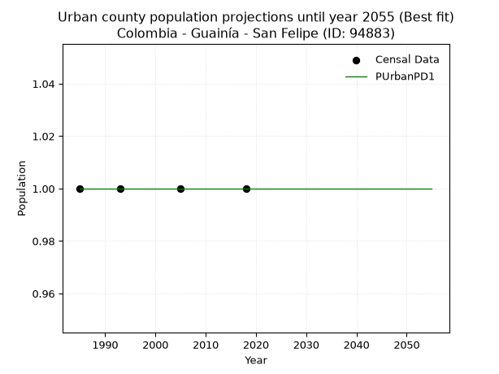
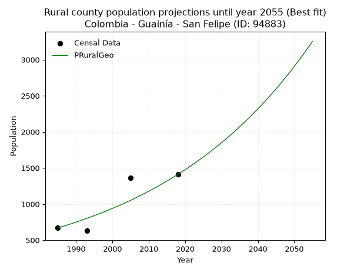

<div align="center">


</div>

# _“Population and Public Services Demand Projections (PPSD) until Year 2050 for Colombia - Guainía - San Felipe (ANM) (ID: 94883)”_
Keywords: `population` `public-service` `projection` `lineal` `polynomial` `logarithmic` `potential` `exponential` `arithmetic` `geometric` `wappaus` `dane` `colombia` `south-america`

PPSD are analytical estimates used by governments and planners to anticipate future changes in population size, age distribution, and the resulting community needs for utilities, healthcare, education, and infrastructure as sizing future water treatment facilities, electrical grids, and road networks based on spatial growth.

> **General running parameters**: • app_version: _v20260806_. • Python version: _3.14.7_. • Pandas version: _3.0.5_. • NumPy version: _2.5.1_. • Creates, save and include plots into reports (create_plot): _True_. • Projection until year: _2050_. • Process polynomial degree 2 and up: _False_. • Process Wappaus: _True_. • Process Wappaus: _True_. • Set negative values to zero: _True_. • Set infinite values to zero: _True_. • Drop dataset notes: _True_. 
<div align="center">

Dynamic map: [:earth_americas:Google](http://maps.google.com/maps?q=2.15282658,-67.3423246) [:earth_americas:OSM](https://www.openstreetmap.org/#map=18/2.15282658/-67.3423246&layers=P) [:earth_americas:Bing](https://www.bing.com/maps?cp=2.15282658~-67.3423246&lvl=18) [:earth_americas:Apple](https://maps.apple.com/frame?center=2.15282658%2C-67.3423246&span=0.003%2C0.006)

</div>


<div align="center">

```geojson
{
  "type": "Feature",
  "geometry": {
    "type": "Point", 
    "coordinates": [-67.3423246, 2.15282658]
  }, 
  "properties": {
    "Name": "Colombia - Guainía - San Felipe (ANM) (ID: 94883)"
  }
}
```

</div>


## 0. Census Data (4 records)

Census data are official statistics collected by a government about the people and housing in a country. They usually include counts of total population, age, sex, race, income, education, and jobs.

📅Global census file: [Population.xlsx](../data/Population.xlsx)

| Source   |   Year |   CountryID | CountryName   |   StateID | StateName   |   CountyID | CountyName       |   PTotal |   PUrban |   PRural |
|:---------|-------:|------------:|:--------------|----------:|:------------|-----------:|:-----------------|---------:|---------:|---------:|
| DANE     |   1985 |          57 | Colombia      |        94 | Guainía     |      94883 | San Felipe (ANM) |      670 |        1 |      670 |
| DANE     |   1993 |          57 | Colombia      |        94 | Guainía     |      94883 | San Felipe       |      630 |        1 |      630 |
| DANE     |   2005 |          57 | Colombia      |        94 | Guainía     |      94883 | San Felipe       |     1362 |        1 |     1362 |
| DANE     |   2018 |          57 | Colombia      |        94 | Guainía     |      94883 | San Felipe       |     1411 |        1 |     1411 |

> 🔥Some records could had specific notes about the registered values or the corresponding urban or rural distribution.

## 1. Total

### 1.1. Coefficients and Parameters

* (PD1) Polynomial Deg 1: 26.864311521477248, -52717.08912083486 (lineal)
* (Log) Logarithmic: 53786.07725538466, -407810.15423275187
* (Pow) Potential: 54.77029229582542, -177.82360862379727
* (Exp) Exponential: 0.027355879410422303, 1.6341608071122682e-21
* (Art) Arithmetic: Year diff. 2018 - 1985 = 33, Population diff. 1411 - 670 = 741, Annual growth = 22.454545454545453
* (Geo) Geometric: Year diff. 2018 - 1985 = 33, Population diff. 1411 - 670 = 741, Annual growth % = 0.02282558312404892
* (Wap) Wappaus: i = 2.1580533834258007, Condition values only valid for < 200)

<sub>
Wappaus condition values: ['0.00', '2.16', '4.32', '6.47', '8.63', '10.79', '12.95', '15.11', '17.26', '19.42', '21.58', '23.74', '25.90', '28.05', '30.21', '32.37', '34.53', '36.69', '38.84', '41.00', '43.16', '45.32', '47.48', '49.64', '51.79', '53.95', '56.11', '58.27', '60.43', '62.58', '64.74', '66.90', '69.06', '71.22', '73.37', '75.53', '77.69', '79.85', '82.01', '84.16', '86.32', '88.48', '90.64', '92.80', '94.95', '97.11', '99.27', '101.43', '103.59', '105.74', '107.90', '110.06', '112.22', '114.38', '116.53', '118.69', '120.85', '123.01', '125.17', '127.33', '129.48', '131.64', '133.80', '135.96', '138.12', '140.27']
</sub>


### 1.2. Projected Dataset

|   Year |   CountyID |   PTotalPD1 |   PTotalLog |   PTotalPow |   PTotalExp |   PTotalArt |   PTotalGeo |   PTotalWap |
|-------:|-----------:|------------:|------------:|------------:|------------:|------------:|------------:|------------:|
|   1985 |      94883 |         609 |         608 |         625 |         625 |         670 |         670 |         670 |
|   1986 |      94883 |         635 |         635 |         642 |         643 |         692 |         685 |         685 |
|   1987 |      94883 |         662 |         662 |         660 |         660 |         715 |         701 |         700 |
|   1988 |      94883 |         689 |         689 |         679 |         679 |         737 |         717 |         715 |
|   1989 |      94883 |         716 |         716 |         698 |         698 |         760 |         733 |         730 |
|   1990 |      94883 |         743 |         743 |         717 |         717 |         782 |         750 |         746 |
|   1991 |      94883 |         770 |         770 |         737 |         737 |         805 |         767 |         763 |
|   1992 |      94883 |         797 |         797 |         758 |         757 |         827 |         785 |         779 |
|   1993 |      94883 |         823 |         824 |         779 |         778 |         850 |         803 |         797 |
|   1994 |      94883 |         850 |         851 |         800 |         800 |         872 |         821 |         814 |
|   1995 |      94883 |         877 |         878 |         823 |         822 |         895 |         840 |         832 |
|   1996 |      94883 |         904 |         905 |         846 |         845 |         917 |         859 |         850 |
|   1997 |      94883 |         931 |         932 |         869 |         868 |         939 |         878 |         869 |
|   1998 |      94883 |         958 |         959 |         893 |         892 |         962 |         898 |         889 |
|   1999 |      94883 |         985 |         986 |         918 |         917 |         984 |         919 |         908 |
|   2000 |      94883 |        1012 |        1013 |         944 |         943 |        1007 |         940 |         929 |
|   2001 |      94883 |        1038 |        1039 |         970 |         969 |        1029 |         961 |         950 |
|   2002 |      94883 |        1065 |        1066 |         997 |         996 |        1052 |         983 |         971 |
|   2003 |      94883 |        1092 |        1093 |        1024 |        1023 |        1074 |        1006 |         993 |
|   2004 |      94883 |        1119 |        1120 |        1053 |        1052 |        1097 |        1029 |        1016 |
|   2005 |      94883 |        1146 |        1147 |        1082 |        1081 |        1119 |        1052 |        1039 |
|   2006 |      94883 |        1173 |        1174 |        1112 |        1111 |        1142 |        1076 |        1063 |
|   2007 |      94883 |        1200 |        1200 |        1143 |        1141 |        1164 |        1101 |        1087 |
|   2008 |      94883 |        1226 |        1227 |        1174 |        1173 |        1186 |        1126 |        1112 |
|   2009 |      94883 |        1253 |        1254 |        1207 |        1206 |        1209 |        1152 |        1138 |
|   2010 |      94883 |        1280 |        1281 |        1240 |        1239 |        1231 |        1178 |        1165 |
|   2011 |      94883 |        1307 |        1308 |        1274 |        1273 |        1254 |        1205 |        1193 |
|   2012 |      94883 |        1334 |        1334 |        1309 |        1309 |        1276 |        1232 |        1221 |
|   2013 |      94883 |        1361 |        1361 |        1345 |        1345 |        1299 |        1260 |        1250 |
|   2014 |      94883 |        1388 |        1388 |        1383 |        1382 |        1321 |        1289 |        1280 |
|   2015 |      94883 |        1414 |        1414 |        1421 |        1421 |        1344 |        1319 |        1311 |
|   2016 |      94883 |        1441 |        1441 |        1460 |        1460 |        1366 |        1349 |        1344 |
|   2017 |      94883 |        1468 |        1468 |        1500 |        1501 |        1389 |        1380 |        1377 |
|   2018 |      94883 |        1495 |        1494 |        1541 |        1542 |        1411 |        1411 |        1411 |
|   2019 |      94883 |        1522 |        1521 |        1584 |        1585 |        1433 |        1443 |        1446 |
|   2020 |      94883 |        1549 |        1548 |        1627 |        1629 |        1456 |        1476 |        1483 |
|   2021 |      94883 |        1576 |        1574 |        1672 |        1674 |        1478 |        1510 |        1521 |
|   2022 |      94883 |        1603 |        1601 |        1718 |        1721 |        1501 |        1544 |        1561 |
|   2023 |      94883 |        1629 |        1628 |        1765 |        1768 |        1523 |        1580 |        1601 |
|   2024 |      94883 |        1656 |        1654 |        1813 |        1817 |        1546 |        1616 |        1644 |
|   2025 |      94883 |        1683 |        1681 |        1863 |        1868 |        1568 |        1652 |        1688 |
|   2026 |      94883 |        1710 |        1707 |        1914 |        1920 |        1591 |        1690 |        1733 |
|   2027 |      94883 |        1737 |        1734 |        1967 |        1973 |        1613 |        1729 |        1781 |
|   2028 |      94883 |        1764 |        1760 |        2021 |        2028 |        1636 |        1768 |        1830 |
|   2029 |      94883 |        1791 |        1787 |        2076 |        2084 |        1658 |        1809 |        1881 |
|   2030 |      94883 |        1817 |        1813 |        2133 |        2142 |        1680 |        1850 |        1935 |
|   2031 |      94883 |        1844 |        1840 |        2191 |        2201 |        1703 |        1892 |        1991 |
|   2032 |      94883 |        1871 |        1866 |        2251 |        2262 |        1725 |        1935 |        2049 |
|   2033 |      94883 |        1898 |        1893 |        2312 |        2325 |        1748 |        1979 |        2110 |
|   2034 |      94883 |        1925 |        1919 |        2375 |        2389 |        1770 |        2025 |        2173 |
|   2035 |      94883 |        1952 |        1946 |        2440 |        2455 |        1793 |        2071 |        2240 |
|   2036 |      94883 |        1979 |        1972 |        2507 |        2524 |        1815 |        2118 |        2310 |
|   2037 |      94883 |        2006 |        1999 |        2575 |        2594 |        1838 |        2166 |        2383 |
|   2038 |      94883 |        2032 |        2025 |        2645 |        2665 |        1860 |        2216 |        2460 |
|   2039 |      94883 |        2059 |        2051 |        2717 |        2739 |        1883 |        2267 |        2541 |
|   2040 |      94883 |        2086 |        2078 |        2791 |        2815 |        1905 |        2318 |        2626 |
|   2041 |      94883 |        2113 |        2104 |        2867 |        2893 |        1927 |        2371 |        2716 |
|   2042 |      94883 |        2140 |        2130 |        2945 |        2974 |        1950 |        2425 |        2811 |
|   2043 |      94883 |        2167 |        2157 |        3025 |        3056 |        1972 |        2481 |        2911 |
|   2044 |      94883 |        2194 |        2183 |        3107 |        3141 |        1995 |        2537 |        3018 |
|   2045 |      94883 |        2220 |        2209 |        3192 |        3228 |        2017 |        2595 |        3131 |
|   2046 |      94883 |        2247 |        2236 |        3278 |        3318 |        2040 |        2654 |        3250 |
|   2047 |      94883 |        2274 |        2262 |        3367 |        3410 |        2062 |        2715 |        3378 |
|   2048 |      94883 |        2301 |        2288 |        3459 |        3504 |        2085 |        2777 |        3515 |
|   2049 |      94883 |        2328 |        2314 |        3552 |        3601 |        2107 |        2840 |        3661 |
|   2050 |      94883 |        2355 |        2341 |        3649 |        3701 |        2130 |        2905 |        3817 |
<div align="center">

</img>

</div>


### 1.3. Best fit with absolute error and relative error (%)

Relative error puts that difference into context by dividing the absolute error by the true value, creating a unitless ratio or percentage that shows the scale of the mistake.

Absolute and relative error

|   Year | Source   |   CountryID | CountryName   |   StateID | StateName   |   CountyID_x | CountyName       |   PTotal |   PUrban |   PRural |   CountyID_y |   PTotalPD1 |   PTotalLog |   PTotalPow |   PTotalExp |   PTotalArt |   PTotalGeo |   PTotalWap |   PTotalPD1AbsError |   PTotalLogAbsError |   PTotalPowAbsError |   PTotalExpAbsError |   PTotalArtAbsError |   PTotalGeoAbsError |   PTotalWapAbsError |   PTotalPD1RelError |   PTotalLogRelError |   PTotalPowRelError |   PTotalExpRelError |   PTotalArtRelError |   PTotalGeoRelError |   PTotalWapRelError |
|-------:|:---------|------------:|:--------------|----------:|:------------|-------------:|:-----------------|---------:|---------:|---------:|-------------:|------------:|------------:|------------:|------------:|------------:|------------:|------------:|--------------------:|--------------------:|--------------------:|--------------------:|--------------------:|--------------------:|--------------------:|--------------------:|--------------------:|--------------------:|--------------------:|--------------------:|--------------------:|--------------------:|
|   1985 | DANE     |          57 | Colombia      |        94 | Guainía     |        94883 | San Felipe (ANM) |      670 |        1 |      670 |        94883 |         609 |         608 |         625 |         625 |         670 |         670 |         670 |                  61 |                  62 |                  45 |                  45 |                   0 |                   0 |                   0 |             9.10448 |             9.25373 |             6.71642 |             6.71642 |              0      |              0      |              0      |
|   1993 | DANE     |          57 | Colombia      |        94 | Guainía     |        94883 | San Felipe       |      630 |        1 |      630 |        94883 |         823 |         824 |         779 |         778 |         850 |         803 |         797 |                 193 |                 194 |                 149 |                 148 |                 220 |                 173 |                 167 |            30.6349  |            30.7937  |            23.6508  |            23.4921  |             34.9206 |             27.4603 |             26.5079 |
|   2005 | DANE     |          57 | Colombia      |        94 | Guainía     |        94883 | San Felipe       |     1362 |        1 |     1362 |        94883 |        1146 |        1147 |        1082 |        1081 |        1119 |        1052 |        1039 |                 216 |                 215 |                 280 |                 281 |                 243 |                 310 |                 323 |            15.859   |            15.7856  |            20.558   |            20.6314  |             17.8414 |             22.7606 |             23.7151 |
|   2018 | DANE     |          57 | Colombia      |        94 | Guainía     |        94883 | San Felipe       |     1411 |        1 |     1411 |        94883 |        1495 |        1494 |        1541 |        1542 |        1411 |        1411 |        1411 |                  84 |                  83 |                 130 |                 131 |                   0 |                   0 |                   0 |             5.95322 |             5.88235 |             9.21332 |             9.2842  |              0      |              0      |              0      |

Relative error mean

| Method    |   RelError | Best   |
|:----------|-----------:|:-------|
| PTotalPD1 |    15.3879 |        |
| PTotalLog |    15.4288 |        |
| PTotalPow |    15.0346 |        |
| PTotalExp |    15.031  |        |
| PTotalArt |    13.1905 |        |
| PTotalGeo |    12.5552 | True   |
| PTotalWap |    12.5558 |        |

💙Best method: _**PTotalGeo**_
<div align="center">

</img>

</div>


### 1.4. Fresh water supply demand in liters per capita per day (lpcd)

The fresh water supply demand typically ranges from 100 to 300 liters per capita per day (lpcd) for standard domestic and municipal planning, though absolute survival minimums set by the World Health Organization are as low as 7.5 to 20 liters per day, and total consumption in high-income nations can exceed 400 liters.

> `CZ`: Level in meters above the sea level (masl).<br> `WS`: Fresh water supply demand in liters per capita per day (lpcd or l/h/d).<br> `WSAll`: Zonal fresh water supply demand in liters per second (l/s).<br> `A`: Zonal area in square meters.

Reference values (RAS Colombia)

|    CZ |   WS |
|------:|-----:|
|  1000 |  120 |
|  2000 |  130 |
| 99999 |  140 |

County shapefile geometry properties and water supply values

|   CountyID |      ATotal |   CZTotal |   WSTotal |
|-----------:|------------:|----------:|----------:|
|      94883 | 2.93902e+09 |   113.382 |       120 |

Projected values for best method: PTotalGeo

|   CountyID |   Year |   PTotalGeo |   WSTotal |   WSTotalAll |
|-----------:|-------:|------------:|----------:|-------------:|
|      94883 |   1985 |         670 |       120 |     0.930556 |
|      94883 |   1986 |         685 |       120 |     0.951389 |
|      94883 |   1987 |         701 |       120 |     0.973611 |
|      94883 |   1988 |         717 |       120 |     0.995833 |
|      94883 |   1989 |         733 |       120 |     1.01806  |
|      94883 |   1990 |         750 |       120 |     1.04167  |
|      94883 |   1991 |         767 |       120 |     1.06528  |
|      94883 |   1992 |         785 |       120 |     1.09028  |
|      94883 |   1993 |         803 |       120 |     1.11528  |
|      94883 |   1994 |         821 |       120 |     1.14028  |
|      94883 |   1995 |         840 |       120 |     1.16667  |
|      94883 |   1996 |         859 |       120 |     1.19306  |
|      94883 |   1997 |         878 |       120 |     1.21944  |
|      94883 |   1998 |         898 |       120 |     1.24722  |
|      94883 |   1999 |         919 |       120 |     1.27639  |
|      94883 |   2000 |         940 |       120 |     1.30556  |
|      94883 |   2001 |         961 |       120 |     1.33472  |
|      94883 |   2002 |         983 |       120 |     1.36528  |
|      94883 |   2003 |        1006 |       120 |     1.39722  |
|      94883 |   2004 |        1029 |       120 |     1.42917  |
|      94883 |   2005 |        1052 |       120 |     1.46111  |
|      94883 |   2006 |        1076 |       120 |     1.49444  |
|      94883 |   2007 |        1101 |       120 |     1.52917  |
|      94883 |   2008 |        1126 |       120 |     1.56389  |
|      94883 |   2009 |        1152 |       120 |     1.6      |
|      94883 |   2010 |        1178 |       120 |     1.63611  |
|      94883 |   2011 |        1205 |       120 |     1.67361  |
|      94883 |   2012 |        1232 |       120 |     1.71111  |
|      94883 |   2013 |        1260 |       120 |     1.75     |
|      94883 |   2014 |        1289 |       120 |     1.79028  |
|      94883 |   2015 |        1319 |       120 |     1.83194  |
|      94883 |   2016 |        1349 |       120 |     1.87361  |
|      94883 |   2017 |        1380 |       120 |     1.91667  |
|      94883 |   2018 |        1411 |       120 |     1.95972  |
|      94883 |   2019 |        1443 |       120 |     2.00417  |
|      94883 |   2020 |        1476 |       120 |     2.05     |
|      94883 |   2021 |        1510 |       120 |     2.09722  |
|      94883 |   2022 |        1544 |       120 |     2.14444  |
|      94883 |   2023 |        1580 |       120 |     2.19444  |
|      94883 |   2024 |        1616 |       120 |     2.24444  |
|      94883 |   2025 |        1652 |       120 |     2.29444  |
|      94883 |   2026 |        1690 |       120 |     2.34722  |
|      94883 |   2027 |        1729 |       120 |     2.40139  |
|      94883 |   2028 |        1768 |       120 |     2.45556  |
|      94883 |   2029 |        1809 |       120 |     2.5125   |
|      94883 |   2030 |        1850 |       120 |     2.56944  |
|      94883 |   2031 |        1892 |       120 |     2.62778  |
|      94883 |   2032 |        1935 |       120 |     2.6875   |
|      94883 |   2033 |        1979 |       120 |     2.74861  |
|      94883 |   2034 |        2025 |       120 |     2.8125   |
|      94883 |   2035 |        2071 |       120 |     2.87639  |
|      94883 |   2036 |        2118 |       120 |     2.94167  |
|      94883 |   2037 |        2166 |       120 |     3.00833  |
|      94883 |   2038 |        2216 |       120 |     3.07778  |
|      94883 |   2039 |        2267 |       120 |     3.14861  |
|      94883 |   2040 |        2318 |       120 |     3.21944  |
|      94883 |   2041 |        2371 |       120 |     3.29306  |
|      94883 |   2042 |        2425 |       120 |     3.36806  |
|      94883 |   2043 |        2481 |       120 |     3.44583  |
|      94883 |   2044 |        2537 |       120 |     3.52361  |
|      94883 |   2045 |        2595 |       120 |     3.60417  |
|      94883 |   2046 |        2654 |       120 |     3.68611  |
|      94883 |   2047 |        2715 |       120 |     3.77083  |
|      94883 |   2048 |        2777 |       120 |     3.85694  |
|      94883 |   2049 |        2840 |       120 |     3.94444  |
|      94883 |   2050 |        2905 |       120 |     4.03472  |

## 2. Urban

### 2.1. Coefficients and Parameters

* (PD1) Polynomial Deg 1: -1.3233529347183512e-19, 1.0000000000000004 (lineal)
* (Log) Logarithmic: 3.215569112241165e-17, 0.9999999999999996
* (Pow) Potential: 0.0, 0.0
* (Exp) Exponential: 0.0, 1.0
* (Art) Arithmetic: Year diff. 2018 - 1985 = 33, Population diff. 1 - 1 = 0, Annual growth = 0.0
* (Geo) Geometric: Year diff. 2018 - 1985 = 33, Population diff. 1 - 1 = 0, Annual growth % = 0.0
* (Wap) Wappaus: i = 0.0, Condition values only valid for < 200)

<sub>
Wappaus condition values: ['0.00', '0.00', '0.00', '0.00', '0.00', '0.00', '0.00', '0.00', '0.00', '0.00', '0.00', '0.00', '0.00', '0.00', '0.00', '0.00', '0.00', '0.00', '0.00', '0.00', '0.00', '0.00', '0.00', '0.00', '0.00', '0.00', '0.00', '0.00', '0.00', '0.00', '0.00', '0.00', '0.00', '0.00', '0.00', '0.00', '0.00', '0.00', '0.00', '0.00', '0.00', '0.00', '0.00', '0.00', '0.00', '0.00', '0.00', '0.00', '0.00', '0.00', '0.00', '0.00', '0.00', '0.00', '0.00', '0.00', '0.00', '0.00', '0.00', '0.00', '0.00', '0.00', '0.00', '0.00', '0.00', '0.00']
</sub>


### 2.2. Projected Dataset

|   Year |   CountyID |   PUrbanPD1 |   PUrbanLog |   PUrbanPow |   PUrbanExp |   PUrbanArt |   PUrbanGeo |   PUrbanWap |
|-------:|-----------:|------------:|------------:|------------:|------------:|------------:|------------:|------------:|
|   1985 |      94883 |           1 |           1 |           1 |           1 |           1 |           1 |           1 |
|   1986 |      94883 |           1 |           1 |           1 |           1 |           1 |           1 |           1 |
|   1987 |      94883 |           1 |           1 |           1 |           1 |           1 |           1 |           1 |
|   1988 |      94883 |           1 |           1 |           1 |           1 |           1 |           1 |           1 |
|   1989 |      94883 |           1 |           1 |           1 |           1 |           1 |           1 |           1 |
|   1990 |      94883 |           1 |           1 |           1 |           1 |           1 |           1 |           1 |
|   1991 |      94883 |           1 |           1 |           1 |           1 |           1 |           1 |           1 |
|   1992 |      94883 |           1 |           1 |           1 |           1 |           1 |           1 |           1 |
|   1993 |      94883 |           1 |           1 |           1 |           1 |           1 |           1 |           1 |
|   1994 |      94883 |           1 |           1 |           1 |           1 |           1 |           1 |           1 |
|   1995 |      94883 |           1 |           1 |           1 |           1 |           1 |           1 |           1 |
|   1996 |      94883 |           1 |           1 |           1 |           1 |           1 |           1 |           1 |
|   1997 |      94883 |           1 |           1 |           1 |           1 |           1 |           1 |           1 |
|   1998 |      94883 |           1 |           1 |           1 |           1 |           1 |           1 |           1 |
|   1999 |      94883 |           1 |           1 |           1 |           1 |           1 |           1 |           1 |
|   2000 |      94883 |           1 |           1 |           1 |           1 |           1 |           1 |           1 |
|   2001 |      94883 |           1 |           1 |           1 |           1 |           1 |           1 |           1 |
|   2002 |      94883 |           1 |           1 |           1 |           1 |           1 |           1 |           1 |
|   2003 |      94883 |           1 |           1 |           1 |           1 |           1 |           1 |           1 |
|   2004 |      94883 |           1 |           1 |           1 |           1 |           1 |           1 |           1 |
|   2005 |      94883 |           1 |           1 |           1 |           1 |           1 |           1 |           1 |
|   2006 |      94883 |           1 |           1 |           1 |           1 |           1 |           1 |           1 |
|   2007 |      94883 |           1 |           1 |           1 |           1 |           1 |           1 |           1 |
|   2008 |      94883 |           1 |           1 |           1 |           1 |           1 |           1 |           1 |
|   2009 |      94883 |           1 |           1 |           1 |           1 |           1 |           1 |           1 |
|   2010 |      94883 |           1 |           1 |           1 |           1 |           1 |           1 |           1 |
|   2011 |      94883 |           1 |           1 |           1 |           1 |           1 |           1 |           1 |
|   2012 |      94883 |           1 |           1 |           1 |           1 |           1 |           1 |           1 |
|   2013 |      94883 |           1 |           1 |           1 |           1 |           1 |           1 |           1 |
|   2014 |      94883 |           1 |           1 |           1 |           1 |           1 |           1 |           1 |
|   2015 |      94883 |           1 |           1 |           1 |           1 |           1 |           1 |           1 |
|   2016 |      94883 |           1 |           1 |           1 |           1 |           1 |           1 |           1 |
|   2017 |      94883 |           1 |           1 |           1 |           1 |           1 |           1 |           1 |
|   2018 |      94883 |           1 |           1 |           1 |           1 |           1 |           1 |           1 |
|   2019 |      94883 |           1 |           1 |           1 |           1 |           1 |           1 |           1 |
|   2020 |      94883 |           1 |           1 |           1 |           1 |           1 |           1 |           1 |
|   2021 |      94883 |           1 |           1 |           1 |           1 |           1 |           1 |           1 |
|   2022 |      94883 |           1 |           1 |           1 |           1 |           1 |           1 |           1 |
|   2023 |      94883 |           1 |           1 |           1 |           1 |           1 |           1 |           1 |
|   2024 |      94883 |           1 |           1 |           1 |           1 |           1 |           1 |           1 |
|   2025 |      94883 |           1 |           1 |           1 |           1 |           1 |           1 |           1 |
|   2026 |      94883 |           1 |           1 |           1 |           1 |           1 |           1 |           1 |
|   2027 |      94883 |           1 |           1 |           1 |           1 |           1 |           1 |           1 |
|   2028 |      94883 |           1 |           1 |           1 |           1 |           1 |           1 |           1 |
|   2029 |      94883 |           1 |           1 |           1 |           1 |           1 |           1 |           1 |
|   2030 |      94883 |           1 |           1 |           1 |           1 |           1 |           1 |           1 |
|   2031 |      94883 |           1 |           1 |           1 |           1 |           1 |           1 |           1 |
|   2032 |      94883 |           1 |           1 |           1 |           1 |           1 |           1 |           1 |
|   2033 |      94883 |           1 |           1 |           1 |           1 |           1 |           1 |           1 |
|   2034 |      94883 |           1 |           1 |           1 |           1 |           1 |           1 |           1 |
|   2035 |      94883 |           1 |           1 |           1 |           1 |           1 |           1 |           1 |
|   2036 |      94883 |           1 |           1 |           1 |           1 |           1 |           1 |           1 |
|   2037 |      94883 |           1 |           1 |           1 |           1 |           1 |           1 |           1 |
|   2038 |      94883 |           1 |           1 |           1 |           1 |           1 |           1 |           1 |
|   2039 |      94883 |           1 |           1 |           1 |           1 |           1 |           1 |           1 |
|   2040 |      94883 |           1 |           1 |           1 |           1 |           1 |           1 |           1 |
|   2041 |      94883 |           1 |           1 |           1 |           1 |           1 |           1 |           1 |
|   2042 |      94883 |           1 |           1 |           1 |           1 |           1 |           1 |           1 |
|   2043 |      94883 |           1 |           1 |           1 |           1 |           1 |           1 |           1 |
|   2044 |      94883 |           1 |           1 |           1 |           1 |           1 |           1 |           1 |
|   2045 |      94883 |           1 |           1 |           1 |           1 |           1 |           1 |           1 |
|   2046 |      94883 |           1 |           1 |           1 |           1 |           1 |           1 |           1 |
|   2047 |      94883 |           1 |           1 |           1 |           1 |           1 |           1 |           1 |
|   2048 |      94883 |           1 |           1 |           1 |           1 |           1 |           1 |           1 |
|   2049 |      94883 |           1 |           1 |           1 |           1 |           1 |           1 |           1 |
|   2050 |      94883 |           1 |           1 |           1 |           1 |           1 |           1 |           1 |
<div align="center">

</img>

</div>


### 2.3. Best fit with absolute error and relative error (%)

Relative error puts that difference into context by dividing the absolute error by the true value, creating a unitless ratio or percentage that shows the scale of the mistake.

Absolute and relative error

|   Year | Source   |   CountryID | CountryName   |   StateID | StateName   |   CountyID_x | CountyName       |   PTotal |   PUrban |   PRural |   CountyID_y |   PUrbanPD1 |   PUrbanLog |   PUrbanPow |   PUrbanExp |   PUrbanArt |   PUrbanGeo |   PUrbanWap |   PUrbanPD1AbsError |   PUrbanLogAbsError |   PUrbanPowAbsError |   PUrbanExpAbsError |   PUrbanArtAbsError |   PUrbanGeoAbsError |   PUrbanWapAbsError |   PUrbanPD1RelError |   PUrbanLogRelError |   PUrbanPowRelError |   PUrbanExpRelError |   PUrbanArtRelError |   PUrbanGeoRelError |   PUrbanWapRelError |
|-------:|:---------|------------:|:--------------|----------:|:------------|-------------:|:-----------------|---------:|---------:|---------:|-------------:|------------:|------------:|------------:|------------:|------------:|------------:|------------:|--------------------:|--------------------:|--------------------:|--------------------:|--------------------:|--------------------:|--------------------:|--------------------:|--------------------:|--------------------:|--------------------:|--------------------:|--------------------:|--------------------:|
|   1985 | DANE     |          57 | Colombia      |        94 | Guainía     |        94883 | San Felipe (ANM) |      670 |        1 |      670 |        94883 |           1 |           1 |           1 |           1 |           1 |           1 |           1 |                   0 |                   0 |                   0 |                   0 |                   0 |                   0 |                   0 |                   0 |                   0 |                   0 |                   0 |                   0 |                   0 |                   0 |
|   1993 | DANE     |          57 | Colombia      |        94 | Guainía     |        94883 | San Felipe       |      630 |        1 |      630 |        94883 |           1 |           1 |           1 |           1 |           1 |           1 |           1 |                   0 |                   0 |                   0 |                   0 |                   0 |                   0 |                   0 |                   0 |                   0 |                   0 |                   0 |                   0 |                   0 |                   0 |
|   2005 | DANE     |          57 | Colombia      |        94 | Guainía     |        94883 | San Felipe       |     1362 |        1 |     1362 |        94883 |           1 |           1 |           1 |           1 |           1 |           1 |           1 |                   0 |                   0 |                   0 |                   0 |                   0 |                   0 |                   0 |                   0 |                   0 |                   0 |                   0 |                   0 |                   0 |                   0 |
|   2018 | DANE     |          57 | Colombia      |        94 | Guainía     |        94883 | San Felipe       |     1411 |        1 |     1411 |        94883 |           1 |           1 |           1 |           1 |           1 |           1 |           1 |                   0 |                   0 |                   0 |                   0 |                   0 |                   0 |                   0 |                   0 |                   0 |                   0 |                   0 |                   0 |                   0 |                   0 |

Relative error mean

| Method    |   RelError | Best   |
|:----------|-----------:|:-------|
| PUrbanPD1 |          0 | True   |
| PUrbanLog |          0 | True   |
| PUrbanPow |          0 | True   |
| PUrbanExp |          0 | True   |
| PUrbanArt |          0 | True   |
| PUrbanGeo |          0 | True   |
| PUrbanWap |          0 | True   |

💙Best method: _**PUrbanPD1**_
<div align="center">

</img>

</div>


### 2.4. Fresh water supply demand in liters per capita per day (lpcd)

The fresh water supply demand typically ranges from 100 to 300 liters per capita per day (lpcd) for standard domestic and municipal planning, though absolute survival minimums set by the World Health Organization are as low as 7.5 to 20 liters per day, and total consumption in high-income nations can exceed 400 liters.

> `CZ`: Level in meters above the sea level (masl).<br> `WS`: Fresh water supply demand in liters per capita per day (lpcd or l/h/d).<br> `WSAll`: Zonal fresh water supply demand in liters per second (l/s).<br> `A`: Zonal area in square meters.

Reference values (RAS Colombia)

|    CZ |   WS |
|------:|-----:|
|  1000 |  120 |
|  2000 |  130 |
| 99999 |  140 |

County shapefile geometry properties and water supply values

|   CountyID |   AUrban |   CZUrban |   WSUrban |
|-----------:|---------:|----------:|----------:|
|      94883 |        0 |         0 |       120 |

Projected values for best method: PUrbanPD1

|   CountyID |   Year |   PUrbanPD1 |   WSUrban |   WSUrbanAll |
|-----------:|-------:|------------:|----------:|-------------:|
|      94883 |   1985 |           1 |       120 |   0.00138889 |
|      94883 |   1986 |           1 |       120 |   0.00138889 |
|      94883 |   1987 |           1 |       120 |   0.00138889 |
|      94883 |   1988 |           1 |       120 |   0.00138889 |
|      94883 |   1989 |           1 |       120 |   0.00138889 |
|      94883 |   1990 |           1 |       120 |   0.00138889 |
|      94883 |   1991 |           1 |       120 |   0.00138889 |
|      94883 |   1992 |           1 |       120 |   0.00138889 |
|      94883 |   1993 |           1 |       120 |   0.00138889 |
|      94883 |   1994 |           1 |       120 |   0.00138889 |
|      94883 |   1995 |           1 |       120 |   0.00138889 |
|      94883 |   1996 |           1 |       120 |   0.00138889 |
|      94883 |   1997 |           1 |       120 |   0.00138889 |
|      94883 |   1998 |           1 |       120 |   0.00138889 |
|      94883 |   1999 |           1 |       120 |   0.00138889 |
|      94883 |   2000 |           1 |       120 |   0.00138889 |
|      94883 |   2001 |           1 |       120 |   0.00138889 |
|      94883 |   2002 |           1 |       120 |   0.00138889 |
|      94883 |   2003 |           1 |       120 |   0.00138889 |
|      94883 |   2004 |           1 |       120 |   0.00138889 |
|      94883 |   2005 |           1 |       120 |   0.00138889 |
|      94883 |   2006 |           1 |       120 |   0.00138889 |
|      94883 |   2007 |           1 |       120 |   0.00138889 |
|      94883 |   2008 |           1 |       120 |   0.00138889 |
|      94883 |   2009 |           1 |       120 |   0.00138889 |
|      94883 |   2010 |           1 |       120 |   0.00138889 |
|      94883 |   2011 |           1 |       120 |   0.00138889 |
|      94883 |   2012 |           1 |       120 |   0.00138889 |
|      94883 |   2013 |           1 |       120 |   0.00138889 |
|      94883 |   2014 |           1 |       120 |   0.00138889 |
|      94883 |   2015 |           1 |       120 |   0.00138889 |
|      94883 |   2016 |           1 |       120 |   0.00138889 |
|      94883 |   2017 |           1 |       120 |   0.00138889 |
|      94883 |   2018 |           1 |       120 |   0.00138889 |
|      94883 |   2019 |           1 |       120 |   0.00138889 |
|      94883 |   2020 |           1 |       120 |   0.00138889 |
|      94883 |   2021 |           1 |       120 |   0.00138889 |
|      94883 |   2022 |           1 |       120 |   0.00138889 |
|      94883 |   2023 |           1 |       120 |   0.00138889 |
|      94883 |   2024 |           1 |       120 |   0.00138889 |
|      94883 |   2025 |           1 |       120 |   0.00138889 |
|      94883 |   2026 |           1 |       120 |   0.00138889 |
|      94883 |   2027 |           1 |       120 |   0.00138889 |
|      94883 |   2028 |           1 |       120 |   0.00138889 |
|      94883 |   2029 |           1 |       120 |   0.00138889 |
|      94883 |   2030 |           1 |       120 |   0.00138889 |
|      94883 |   2031 |           1 |       120 |   0.00138889 |
|      94883 |   2032 |           1 |       120 |   0.00138889 |
|      94883 |   2033 |           1 |       120 |   0.00138889 |
|      94883 |   2034 |           1 |       120 |   0.00138889 |
|      94883 |   2035 |           1 |       120 |   0.00138889 |
|      94883 |   2036 |           1 |       120 |   0.00138889 |
|      94883 |   2037 |           1 |       120 |   0.00138889 |
|      94883 |   2038 |           1 |       120 |   0.00138889 |
|      94883 |   2039 |           1 |       120 |   0.00138889 |
|      94883 |   2040 |           1 |       120 |   0.00138889 |
|      94883 |   2041 |           1 |       120 |   0.00138889 |
|      94883 |   2042 |           1 |       120 |   0.00138889 |
|      94883 |   2043 |           1 |       120 |   0.00138889 |
|      94883 |   2044 |           1 |       120 |   0.00138889 |
|      94883 |   2045 |           1 |       120 |   0.00138889 |
|      94883 |   2046 |           1 |       120 |   0.00138889 |
|      94883 |   2047 |           1 |       120 |   0.00138889 |
|      94883 |   2048 |           1 |       120 |   0.00138889 |
|      94883 |   2049 |           1 |       120 |   0.00138889 |
|      94883 |   2050 |           1 |       120 |   0.00138889 |

## 3. Rural

### 3.1. Coefficients and Parameters

* (PD1) Polynomial Deg 1: 26.864311521477248, -52717.08912083486 (lineal)
* (Log) Logarithmic: 53786.07725538466, -407810.15423275187
* (Pow) Potential: 54.77029229582542, -177.82360862379727
* (Exp) Exponential: 0.027355879410422303, 1.6341608071122682e-21
* (Art) Arithmetic: Year diff. 2018 - 1985 = 33, Population diff. 1411 - 670 = 741, Annual growth = 22.454545454545453
* (Geo) Geometric: Year diff. 2018 - 1985 = 33, Population diff. 1411 - 670 = 741, Annual growth % = 0.02282558312404892
* (Wap) Wappaus: i = 2.1580533834258007, Condition values only valid for < 200)

<sub>
Wappaus condition values: ['0.00', '2.16', '4.32', '6.47', '8.63', '10.79', '12.95', '15.11', '17.26', '19.42', '21.58', '23.74', '25.90', '28.05', '30.21', '32.37', '34.53', '36.69', '38.84', '41.00', '43.16', '45.32', '47.48', '49.64', '51.79', '53.95', '56.11', '58.27', '60.43', '62.58', '64.74', '66.90', '69.06', '71.22', '73.37', '75.53', '77.69', '79.85', '82.01', '84.16', '86.32', '88.48', '90.64', '92.80', '94.95', '97.11', '99.27', '101.43', '103.59', '105.74', '107.90', '110.06', '112.22', '114.38', '116.53', '118.69', '120.85', '123.01', '125.17', '127.33', '129.48', '131.64', '133.80', '135.96', '138.12', '140.27']
</sub>


### 3.2. Projected Dataset

|   Year |   CountyID |   PRuralPD1 |   PRuralLog |   PRuralPow |   PRuralExp |   PRuralArt |   PRuralGeo |   PRuralWap |
|-------:|-----------:|------------:|------------:|------------:|------------:|------------:|------------:|------------:|
|   1985 |      94883 |         609 |         608 |         625 |         625 |         670 |         670 |         670 |
|   1986 |      94883 |         635 |         635 |         642 |         643 |         692 |         685 |         685 |
|   1987 |      94883 |         662 |         662 |         660 |         660 |         715 |         701 |         700 |
|   1988 |      94883 |         689 |         689 |         679 |         679 |         737 |         717 |         715 |
|   1989 |      94883 |         716 |         716 |         698 |         698 |         760 |         733 |         730 |
|   1990 |      94883 |         743 |         743 |         717 |         717 |         782 |         750 |         746 |
|   1991 |      94883 |         770 |         770 |         737 |         737 |         805 |         767 |         763 |
|   1992 |      94883 |         797 |         797 |         758 |         757 |         827 |         785 |         779 |
|   1993 |      94883 |         823 |         824 |         779 |         778 |         850 |         803 |         797 |
|   1994 |      94883 |         850 |         851 |         800 |         800 |         872 |         821 |         814 |
|   1995 |      94883 |         877 |         878 |         823 |         822 |         895 |         840 |         832 |
|   1996 |      94883 |         904 |         905 |         846 |         845 |         917 |         859 |         850 |
|   1997 |      94883 |         931 |         932 |         869 |         868 |         939 |         878 |         869 |
|   1998 |      94883 |         958 |         959 |         893 |         892 |         962 |         898 |         889 |
|   1999 |      94883 |         985 |         986 |         918 |         917 |         984 |         919 |         908 |
|   2000 |      94883 |        1012 |        1013 |         944 |         943 |        1007 |         940 |         929 |
|   2001 |      94883 |        1038 |        1039 |         970 |         969 |        1029 |         961 |         950 |
|   2002 |      94883 |        1065 |        1066 |         997 |         996 |        1052 |         983 |         971 |
|   2003 |      94883 |        1092 |        1093 |        1024 |        1023 |        1074 |        1006 |         993 |
|   2004 |      94883 |        1119 |        1120 |        1053 |        1052 |        1097 |        1029 |        1016 |
|   2005 |      94883 |        1146 |        1147 |        1082 |        1081 |        1119 |        1052 |        1039 |
|   2006 |      94883 |        1173 |        1174 |        1112 |        1111 |        1142 |        1076 |        1063 |
|   2007 |      94883 |        1200 |        1200 |        1143 |        1141 |        1164 |        1101 |        1087 |
|   2008 |      94883 |        1226 |        1227 |        1174 |        1173 |        1186 |        1126 |        1112 |
|   2009 |      94883 |        1253 |        1254 |        1207 |        1206 |        1209 |        1152 |        1138 |
|   2010 |      94883 |        1280 |        1281 |        1240 |        1239 |        1231 |        1178 |        1165 |
|   2011 |      94883 |        1307 |        1308 |        1274 |        1273 |        1254 |        1205 |        1193 |
|   2012 |      94883 |        1334 |        1334 |        1309 |        1309 |        1276 |        1232 |        1221 |
|   2013 |      94883 |        1361 |        1361 |        1345 |        1345 |        1299 |        1260 |        1250 |
|   2014 |      94883 |        1388 |        1388 |        1383 |        1382 |        1321 |        1289 |        1280 |
|   2015 |      94883 |        1414 |        1414 |        1421 |        1421 |        1344 |        1319 |        1311 |
|   2016 |      94883 |        1441 |        1441 |        1460 |        1460 |        1366 |        1349 |        1344 |
|   2017 |      94883 |        1468 |        1468 |        1500 |        1501 |        1389 |        1380 |        1377 |
|   2018 |      94883 |        1495 |        1494 |        1541 |        1542 |        1411 |        1411 |        1411 |
|   2019 |      94883 |        1522 |        1521 |        1584 |        1585 |        1433 |        1443 |        1446 |
|   2020 |      94883 |        1549 |        1548 |        1627 |        1629 |        1456 |        1476 |        1483 |
|   2021 |      94883 |        1576 |        1574 |        1672 |        1674 |        1478 |        1510 |        1521 |
|   2022 |      94883 |        1603 |        1601 |        1718 |        1721 |        1501 |        1544 |        1561 |
|   2023 |      94883 |        1629 |        1628 |        1765 |        1768 |        1523 |        1580 |        1601 |
|   2024 |      94883 |        1656 |        1654 |        1813 |        1817 |        1546 |        1616 |        1644 |
|   2025 |      94883 |        1683 |        1681 |        1863 |        1868 |        1568 |        1652 |        1688 |
|   2026 |      94883 |        1710 |        1707 |        1914 |        1920 |        1591 |        1690 |        1733 |
|   2027 |      94883 |        1737 |        1734 |        1967 |        1973 |        1613 |        1729 |        1781 |
|   2028 |      94883 |        1764 |        1760 |        2021 |        2028 |        1636 |        1768 |        1830 |
|   2029 |      94883 |        1791 |        1787 |        2076 |        2084 |        1658 |        1809 |        1881 |
|   2030 |      94883 |        1817 |        1813 |        2133 |        2142 |        1680 |        1850 |        1935 |
|   2031 |      94883 |        1844 |        1840 |        2191 |        2201 |        1703 |        1892 |        1991 |
|   2032 |      94883 |        1871 |        1866 |        2251 |        2262 |        1725 |        1935 |        2049 |
|   2033 |      94883 |        1898 |        1893 |        2312 |        2325 |        1748 |        1979 |        2110 |
|   2034 |      94883 |        1925 |        1919 |        2375 |        2389 |        1770 |        2025 |        2173 |
|   2035 |      94883 |        1952 |        1946 |        2440 |        2455 |        1793 |        2071 |        2240 |
|   2036 |      94883 |        1979 |        1972 |        2507 |        2524 |        1815 |        2118 |        2310 |
|   2037 |      94883 |        2006 |        1999 |        2575 |        2594 |        1838 |        2166 |        2383 |
|   2038 |      94883 |        2032 |        2025 |        2645 |        2665 |        1860 |        2216 |        2460 |
|   2039 |      94883 |        2059 |        2051 |        2717 |        2739 |        1883 |        2267 |        2541 |
|   2040 |      94883 |        2086 |        2078 |        2791 |        2815 |        1905 |        2318 |        2626 |
|   2041 |      94883 |        2113 |        2104 |        2867 |        2893 |        1927 |        2371 |        2716 |
|   2042 |      94883 |        2140 |        2130 |        2945 |        2974 |        1950 |        2425 |        2811 |
|   2043 |      94883 |        2167 |        2157 |        3025 |        3056 |        1972 |        2481 |        2911 |
|   2044 |      94883 |        2194 |        2183 |        3107 |        3141 |        1995 |        2537 |        3018 |
|   2045 |      94883 |        2220 |        2209 |        3192 |        3228 |        2017 |        2595 |        3131 |
|   2046 |      94883 |        2247 |        2236 |        3278 |        3318 |        2040 |        2654 |        3250 |
|   2047 |      94883 |        2274 |        2262 |        3367 |        3410 |        2062 |        2715 |        3378 |
|   2048 |      94883 |        2301 |        2288 |        3459 |        3504 |        2085 |        2777 |        3515 |
|   2049 |      94883 |        2328 |        2314 |        3552 |        3601 |        2107 |        2840 |        3661 |
|   2050 |      94883 |        2355 |        2341 |        3649 |        3701 |        2130 |        2905 |        3817 |
<div align="center">

</img>

</div>


### 3.3. Best fit with absolute error and relative error (%)

Relative error puts that difference into context by dividing the absolute error by the true value, creating a unitless ratio or percentage that shows the scale of the mistake.

Absolute and relative error

|   Year | Source   |   CountryID | CountryName   |   StateID | StateName   |   CountyID_x | CountyName       |   PTotal |   PUrban |   PRural |   CountyID_y |   PRuralPD1 |   PRuralLog |   PRuralPow |   PRuralExp |   PRuralArt |   PRuralGeo |   PRuralWap |   PRuralPD1AbsError |   PRuralLogAbsError |   PRuralPowAbsError |   PRuralExpAbsError |   PRuralArtAbsError |   PRuralGeoAbsError |   PRuralWapAbsError |   PRuralPD1RelError |   PRuralLogRelError |   PRuralPowRelError |   PRuralExpRelError |   PRuralArtRelError |   PRuralGeoRelError |   PRuralWapRelError |
|-------:|:---------|------------:|:--------------|----------:|:------------|-------------:|:-----------------|---------:|---------:|---------:|-------------:|------------:|------------:|------------:|------------:|------------:|------------:|------------:|--------------------:|--------------------:|--------------------:|--------------------:|--------------------:|--------------------:|--------------------:|--------------------:|--------------------:|--------------------:|--------------------:|--------------------:|--------------------:|--------------------:|
|   1985 | DANE     |          57 | Colombia      |        94 | Guainía     |        94883 | San Felipe (ANM) |      670 |        1 |      670 |        94883 |         609 |         608 |         625 |         625 |         670 |         670 |         670 |                  61 |                  62 |                  45 |                  45 |                   0 |                   0 |                   0 |             9.10448 |             9.25373 |             6.71642 |             6.71642 |              0      |              0      |              0      |
|   1993 | DANE     |          57 | Colombia      |        94 | Guainía     |        94883 | San Felipe       |      630 |        1 |      630 |        94883 |         823 |         824 |         779 |         778 |         850 |         803 |         797 |                 193 |                 194 |                 149 |                 148 |                 220 |                 173 |                 167 |            30.6349  |            30.7937  |            23.6508  |            23.4921  |             34.9206 |             27.4603 |             26.5079 |
|   2005 | DANE     |          57 | Colombia      |        94 | Guainía     |        94883 | San Felipe       |     1362 |        1 |     1362 |        94883 |        1146 |        1147 |        1082 |        1081 |        1119 |        1052 |        1039 |                 216 |                 215 |                 280 |                 281 |                 243 |                 310 |                 323 |            15.859   |            15.7856  |            20.558   |            20.6314  |             17.8414 |             22.7606 |             23.7151 |
|   2018 | DANE     |          57 | Colombia      |        94 | Guainía     |        94883 | San Felipe       |     1411 |        1 |     1411 |        94883 |        1495 |        1494 |        1541 |        1542 |        1411 |        1411 |        1411 |                  84 |                  83 |                 130 |                 131 |                   0 |                   0 |                   0 |             5.95322 |             5.88235 |             9.21332 |             9.2842  |              0      |              0      |              0      |

Relative error mean

| Method    |   RelError | Best   |
|:----------|-----------:|:-------|
| PRuralPD1 |    15.3879 |        |
| PRuralLog |    15.4288 |        |
| PRuralPow |    15.0346 |        |
| PRuralExp |    15.031  |        |
| PRuralArt |    13.1905 |        |
| PRuralGeo |    12.5552 | True   |
| PRuralWap |    12.5558 |        |

💙Best method: _**PRuralGeo**_
<div align="center">

</img>

</div>


### 3.4. Fresh water supply demand in liters per capita per day (lpcd)

The fresh water supply demand typically ranges from 100 to 300 liters per capita per day (lpcd) for standard domestic and municipal planning, though absolute survival minimums set by the World Health Organization are as low as 7.5 to 20 liters per day, and total consumption in high-income nations can exceed 400 liters.

> `CZ`: Level in meters above the sea level (masl).<br> `WS`: Fresh water supply demand in liters per capita per day (lpcd or l/h/d).<br> `WSAll`: Zonal fresh water supply demand in liters per second (l/s).<br> `A`: Zonal area in square meters.

Reference values (RAS Colombia)

|    CZ |   WS |
|------:|-----:|
|  1000 |  120 |
|  2000 |  130 |
| 99999 |  140 |

County shapefile geometry properties and water supply values

|   CountyID |      ARural |   CZRural |   WSRural |
|-----------:|------------:|----------:|----------:|
|      94883 | 2.93902e+09 |   113.382 |       120 |

Projected values for best method: PRuralGeo

|   CountyID |   Year |   PRuralGeo |   WSRural |   WSRuralAll |
|-----------:|-------:|------------:|----------:|-------------:|
|      94883 |   1985 |         670 |       120 |     0.930556 |
|      94883 |   1986 |         685 |       120 |     0.951389 |
|      94883 |   1987 |         701 |       120 |     0.973611 |
|      94883 |   1988 |         717 |       120 |     0.995833 |
|      94883 |   1989 |         733 |       120 |     1.01806  |
|      94883 |   1990 |         750 |       120 |     1.04167  |
|      94883 |   1991 |         767 |       120 |     1.06528  |
|      94883 |   1992 |         785 |       120 |     1.09028  |
|      94883 |   1993 |         803 |       120 |     1.11528  |
|      94883 |   1994 |         821 |       120 |     1.14028  |
|      94883 |   1995 |         840 |       120 |     1.16667  |
|      94883 |   1996 |         859 |       120 |     1.19306  |
|      94883 |   1997 |         878 |       120 |     1.21944  |
|      94883 |   1998 |         898 |       120 |     1.24722  |
|      94883 |   1999 |         919 |       120 |     1.27639  |
|      94883 |   2000 |         940 |       120 |     1.30556  |
|      94883 |   2001 |         961 |       120 |     1.33472  |
|      94883 |   2002 |         983 |       120 |     1.36528  |
|      94883 |   2003 |        1006 |       120 |     1.39722  |
|      94883 |   2004 |        1029 |       120 |     1.42917  |
|      94883 |   2005 |        1052 |       120 |     1.46111  |
|      94883 |   2006 |        1076 |       120 |     1.49444  |
|      94883 |   2007 |        1101 |       120 |     1.52917  |
|      94883 |   2008 |        1126 |       120 |     1.56389  |
|      94883 |   2009 |        1152 |       120 |     1.6      |
|      94883 |   2010 |        1178 |       120 |     1.63611  |
|      94883 |   2011 |        1205 |       120 |     1.67361  |
|      94883 |   2012 |        1232 |       120 |     1.71111  |
|      94883 |   2013 |        1260 |       120 |     1.75     |
|      94883 |   2014 |        1289 |       120 |     1.79028  |
|      94883 |   2015 |        1319 |       120 |     1.83194  |
|      94883 |   2016 |        1349 |       120 |     1.87361  |
|      94883 |   2017 |        1380 |       120 |     1.91667  |
|      94883 |   2018 |        1411 |       120 |     1.95972  |
|      94883 |   2019 |        1443 |       120 |     2.00417  |
|      94883 |   2020 |        1476 |       120 |     2.05     |
|      94883 |   2021 |        1510 |       120 |     2.09722  |
|      94883 |   2022 |        1544 |       120 |     2.14444  |
|      94883 |   2023 |        1580 |       120 |     2.19444  |
|      94883 |   2024 |        1616 |       120 |     2.24444  |
|      94883 |   2025 |        1652 |       120 |     2.29444  |
|      94883 |   2026 |        1690 |       120 |     2.34722  |
|      94883 |   2027 |        1729 |       120 |     2.40139  |
|      94883 |   2028 |        1768 |       120 |     2.45556  |
|      94883 |   2029 |        1809 |       120 |     2.5125   |
|      94883 |   2030 |        1850 |       120 |     2.56944  |
|      94883 |   2031 |        1892 |       120 |     2.62778  |
|      94883 |   2032 |        1935 |       120 |     2.6875   |
|      94883 |   2033 |        1979 |       120 |     2.74861  |
|      94883 |   2034 |        2025 |       120 |     2.8125   |
|      94883 |   2035 |        2071 |       120 |     2.87639  |
|      94883 |   2036 |        2118 |       120 |     2.94167  |
|      94883 |   2037 |        2166 |       120 |     3.00833  |
|      94883 |   2038 |        2216 |       120 |     3.07778  |
|      94883 |   2039 |        2267 |       120 |     3.14861  |
|      94883 |   2040 |        2318 |       120 |     3.21944  |
|      94883 |   2041 |        2371 |       120 |     3.29306  |
|      94883 |   2042 |        2425 |       120 |     3.36806  |
|      94883 |   2043 |        2481 |       120 |     3.44583  |
|      94883 |   2044 |        2537 |       120 |     3.52361  |
|      94883 |   2045 |        2595 |       120 |     3.60417  |
|      94883 |   2046 |        2654 |       120 |     3.68611  |
|      94883 |   2047 |        2715 |       120 |     3.77083  |
|      94883 |   2048 |        2777 |       120 |     3.85694  |
|      94883 |   2049 |        2840 |       120 |     3.94444  |
|      94883 |   2050 |        2905 |       120 |     4.03472  |

<div align="center"><br><sub>Share this research</sub></div><br>

<sub>**APPS & TOOLS & CONTENT DISCLAIMER**: • NO WARRANTY - This content and software is provided by <a href="https://github.com/rcfdtools" target="_blank">github.com/rcfdtools</a> "as is", without any express or implied warranty, including warranties of merchantability, fitness for a particular purpose, or non-infringement. There is no guarantee that the software will be error-free or operate without interruption. • LIMITATION OF LIABILITY - Neither the authors nor copyright holders will be liable for claims or damages arising from the software or its use. You are responsible for determining if the software is appropriate for your use and assume all associated risks, including errors, legal compliance, and data loss. • NO PROFESSIONAL ADVICE - The software provides general information and does not offer professional advice. It should not replace consultation with professional advisors. [Clauses and global license for rcfdtools use.](https://github.com/rcfdtools/rcfdtools/blob/main/LICENSE.md)</sub>