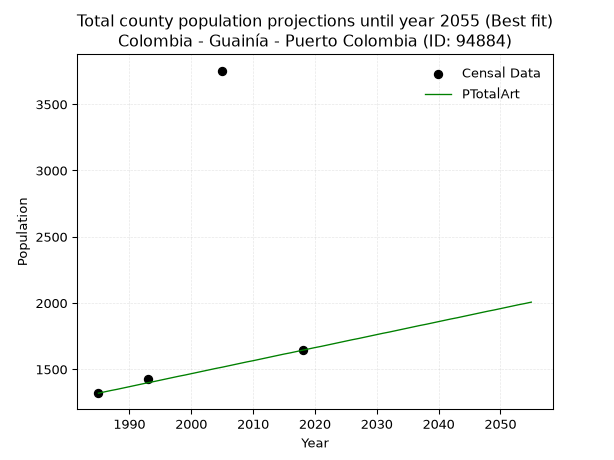
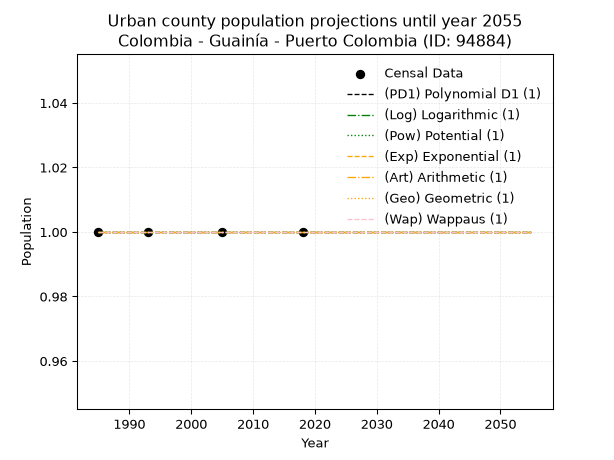
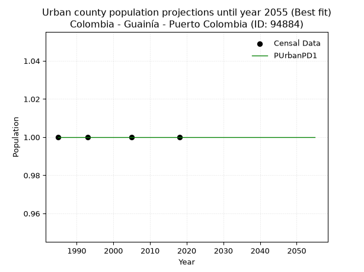
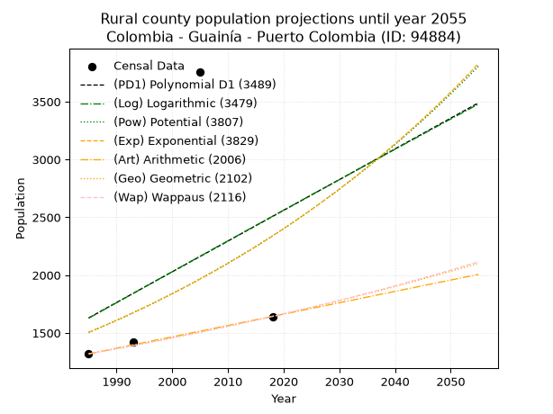
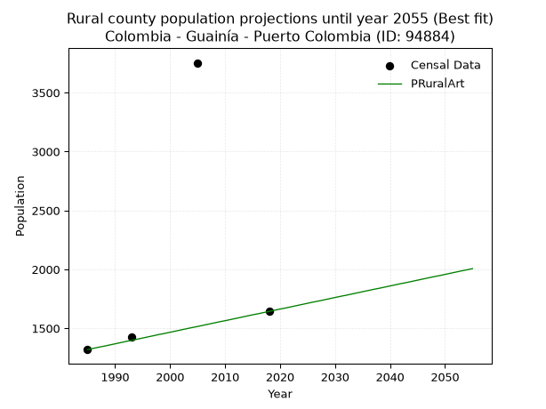

<div align="center">


</div>

# _“Population and Public Services Demand Projections (PPSD) until Year 2050 for Colombia - Guainía - Puerto Colombia (ID: 94884)”_
Keywords: `population` `public-service` `projection` `lineal` `polynomial` `logarithmic` `potential` `exponential` `arithmetic` `geometric` `wappaus` `dane` `colombia` `south-america`

PPSD are analytical estimates used by governments and planners to anticipate future changes in population size, age distribution, and the resulting community needs for utilities, healthcare, education, and infrastructure as sizing future water treatment facilities, electrical grids, and road networks based on spatial growth.

> **General running parameters**: • app_version: _v20260806_. • Python version: _3.14.7_. • Pandas version: _3.0.5_. • NumPy version: _2.5.1_. • Creates, save and include plots into reports (create_plot): _False_. • Projection until year: _2050_. • Process polynomial degree 2 and up: _False_. • Process Wappaus: _True_. • Process Wappaus: _True_. • Set negative values to zero: _True_. • Set infinite values to zero: _True_. • Drop dataset notes: _True_. 
<div align="center">

Dynamic map: [:earth_americas:Google](http://maps.google.com/maps?q=2.507156181,-68.2094899) [:earth_americas:OSM](https://www.openstreetmap.org/#map=18/2.507156181/-68.2094899&layers=P) [:earth_americas:Bing](https://www.bing.com/maps?cp=2.507156181~-68.2094899&lvl=18) [:earth_americas:Apple](https://maps.apple.com/frame?center=2.507156181%2C-68.2094899&span=0.003%2C0.006)

</div>


<div align="center">

```geojson
{
  "type": "Feature",
  "geometry": {
    "type": "Point", 
    "coordinates": [-68.2094899, 2.507156181]
  }, 
  "properties": {
    "Name": "Colombia - Guainía - Puerto Colombia (ID: 94884)"
  }
}
```

</div>


## 0. Census Data (4 records)

Census data are official statistics collected by a government about the people and housing in a country. They usually include counts of total population, age, sex, race, income, education, and jobs.

📅Global census file: [Population.xlsx](../data/Population.xlsx)

| Source   |   Year |   CountryID | CountryName   |   StateID | StateName   |   CountyID | CountyName      |   PTotal |   PUrban |   PRural |
|:---------|-------:|------------:|:--------------|----------:|:------------|-----------:|:----------------|---------:|---------:|---------:|
| DANE     |   1985 |          57 | Colombia      |        94 | Guainía     |      94884 | Puerto Colombia |     1319 |        1 |     1319 |
| DANE     |   1993 |          57 | Colombia      |        94 | Guainía     |      94884 | Puerto Colombia |     1425 |        1 |     1425 |
| DANE     |   2005 |          57 | Colombia      |        94 | Guainía     |      94884 | Puerto Colombia |     3753 |        1 |     3753 |
| DANE     |   2018 |          57 | Colombia      |        94 | Guainía     |      94884 | Puerto Colombia |     1643 |        1 |     1643 |

> 🔥Some records could had specific notes about the registered values or the corresponding urban or rural distribution.

📅   [RUPS](https://www.datos.gov.co/Hacienda-y-Cr-dito-P-blico/Registro-nico-de-Prestadores-de-Servicios-P-blicos/4qkq-csdn/about_data) - Local public utility companies: [RUPS.csv](../data/RUPS.xlsx)

 | SERVICIO   | ESTADO   | NOMBRE   | NIT   | DEPARTAMENTO_DOMICILIO   | MUNICIPIO_DOMICILIO   | DIRECCION   | TELEFONO   | EMAIL   | TIPO_PRESTADOR   | CLASIFICACION   |
|------------|----------|----------|-------|--------------------------|-----------------------|-------------|------------|---------|------------------|-----------------|

## 1. Total

### 1.1. Coefficients and Parameters

* (PD1) Polynomial Deg 1: 26.56603773585021, -51103.71698113438 (lineal)
* (Log) Logarithmic: 53439.8670188199, -404161.85745026835
* (Pow) Potential: 26.803626679398647, -85.21478543279726
* (Exp) Exponential: 0.013336595166630502, 4.792383541768008e-09
* (Art) Arithmetic: Year diff. 2018 - 1985 = 33, Population diff. 1643 - 1319 = 324, Annual growth = 9.818181818181818
* (Geo) Geometric: Year diff. 2018 - 1985 = 33, Population diff. 1643 - 1319 = 324, Annual growth % = 0.006678260348819132
* (Wap) Wappaus: i = 0.6629427291142349, Condition values only valid for < 200)

<sub>
Wappaus condition values: ['0.00', '0.66', '1.33', '1.99', '2.65', '3.31', '3.98', '4.64', '5.30', '5.97', '6.63', '7.29', '7.96', '8.62', '9.28', '9.94', '10.61', '11.27', '11.93', '12.60', '13.26', '13.92', '14.58', '15.25', '15.91', '16.57', '17.24', '17.90', '18.56', '19.23', '19.89', '20.55', '21.21', '21.88', '22.54', '23.20', '23.87', '24.53', '25.19', '25.85', '26.52', '27.18', '27.84', '28.51', '29.17', '29.83', '30.50', '31.16', '31.82', '32.48', '33.15', '33.81', '34.47', '35.14', '35.80', '36.46', '37.12', '37.79', '38.45', '39.11', '39.78', '40.44', '41.10', '41.77', '42.43', '43.09']
</sub>


### 1.2. Projected Dataset

|   Year |   CountyID |   PTotalPD1 |   PTotalLog |   PTotalPow |   PTotalExp |   PTotalArt |   PTotalGeo |   PTotalWap |
|-------:|-----------:|------------:|------------:|------------:|------------:|------------:|------------:|------------:|
|   1985 |      94884 |        1630 |        1627 |        1504 |        1506 |        1319 |        1319 |        1319 |
|   1986 |      94884 |        1656 |        1654 |        1524 |        1526 |        1329 |        1328 |        1328 |
|   1987 |      94884 |        1683 |        1681 |        1545 |        1546 |        1339 |        1337 |        1337 |
|   1988 |      94884 |        1710 |        1708 |        1566 |        1567 |        1348 |        1346 |        1345 |
|   1989 |      94884 |        1736 |        1735 |        1587 |        1588 |        1358 |        1355 |        1354 |
|   1990 |      94884 |        1763 |        1761 |        1609 |        1609 |        1368 |        1364 |        1363 |
|   1991 |      94884 |        1789 |        1788 |        1630 |        1631 |        1378 |        1373 |        1373 |
|   1992 |      94884 |        1816 |        1815 |        1652 |        1653 |        1388 |        1382 |        1382 |
|   1993 |      94884 |        1842 |        1842 |        1675 |        1675 |        1398 |        1391 |        1391 |
|   1994 |      94884 |        1869 |        1869 |        1698 |        1698 |        1407 |        1400 |        1400 |
|   1995 |      94884 |        1896 |        1896 |        1720 |        1720 |        1417 |        1410 |        1409 |
|   1996 |      94884 |        1922 |        1922 |        1744 |        1743 |        1427 |        1419 |        1419 |
|   1997 |      94884 |        1949 |        1949 |        1767 |        1767 |        1437 |        1429 |        1428 |
|   1998 |      94884 |        1975 |        1976 |        1791 |        1791 |        1447 |        1438 |        1438 |
|   1999 |      94884 |        2002 |        2003 |        1815 |        1815 |        1456 |        1448 |        1447 |
|   2000 |      94884 |        2028 |        2029 |        1840 |        1839 |        1466 |        1457 |        1457 |
|   2001 |      94884 |        2055 |        2056 |        1865 |        1864 |        1476 |        1467 |        1467 |
|   2002 |      94884 |        2081 |        2083 |        1890 |        1889 |        1486 |        1477 |        1477 |
|   2003 |      94884 |        2108 |        2109 |        1915 |        1914 |        1496 |        1487 |        1486 |
|   2004 |      94884 |        2135 |        2136 |        1941 |        1940 |        1506 |        1497 |        1496 |
|   2005 |      94884 |        2161 |        2163 |        1967 |        1966 |        1515 |        1507 |        1506 |
|   2006 |      94884 |        2188 |        2189 |        1994 |        1992 |        1525 |        1517 |        1516 |
|   2007 |      94884 |        2214 |        2216 |        2021 |        2019 |        1535 |        1527 |        1527 |
|   2008 |      94884 |        2241 |        2243 |        2048 |        2046 |        1545 |        1537 |        1537 |
|   2009 |      94884 |        2267 |        2269 |        2075 |        2073 |        1555 |        1547 |        1547 |
|   2010 |      94884 |        2294 |        2296 |        2103 |        2101 |        1564 |        1558 |        1557 |
|   2011 |      94884 |        2321 |        2322 |        2131 |        2130 |        1574 |        1568 |        1568 |
|   2012 |      94884 |        2347 |        2349 |        2160 |        2158 |        1584 |        1579 |        1578 |
|   2013 |      94884 |        2374 |        2376 |        2189 |        2187 |        1594 |        1589 |        1589 |
|   2014 |      94884 |        2400 |        2402 |        2218 |        2216 |        1604 |        1600 |        1600 |
|   2015 |      94884 |        2427 |        2429 |        2248 |        2246 |        1614 |        1611 |        1610 |
|   2016 |      94884 |        2453 |        2455 |        2278 |        2276 |        1623 |        1621 |        1621 |
|   2017 |      94884 |        2480 |        2482 |        2308 |        2307 |        1633 |        1632 |        1632 |
|   2018 |      94884 |        2507 |        2508 |        2339 |        2338 |        1643 |        1643 |        1643 |
|   2019 |      94884 |        2533 |        2535 |        2371 |        2369 |        1653 |        1654 |        1654 |
|   2020 |      94884 |        2560 |        2561 |        2402 |        2401 |        1663 |        1665 |        1665 |
|   2021 |      94884 |        2586 |        2588 |        2434 |        2433 |        1672 |        1676 |        1676 |
|   2022 |      94884 |        2613 |        2614 |        2467 |        2466 |        1682 |        1687 |        1688 |
|   2023 |      94884 |        2639 |        2640 |        2500 |        2499 |        1692 |        1699 |        1699 |
|   2024 |      94884 |        2666 |        2667 |        2533 |        2533 |        1702 |        1710 |        1711 |
|   2025 |      94884 |        2693 |        2693 |        2567 |        2567 |        1712 |        1721 |        1722 |
|   2026 |      94884 |        2719 |        2720 |        2601 |        2601 |        1722 |        1733 |        1734 |
|   2027 |      94884 |        2746 |        2746 |        2636 |        2636 |        1731 |        1744 |        1746 |
|   2028 |      94884 |        2772 |        2772 |        2671 |        2671 |        1741 |        1756 |        1758 |
|   2029 |      94884 |        2799 |        2799 |        2706 |        2707 |        1751 |        1768 |        1769 |
|   2030 |      94884 |        2825 |        2825 |        2742 |        2744 |        1761 |        1780 |        1781 |
|   2031 |      94884 |        2852 |        2851 |        2779 |        2781 |        1771 |        1791 |        1794 |
|   2032 |      94884 |        2878 |        2878 |        2816 |        2818 |        1780 |        1803 |        1806 |
|   2033 |      94884 |        2905 |        2904 |        2853 |        2856 |        1790 |        1816 |        1818 |
|   2034 |      94884 |        2932 |        2930 |        2891 |        2894 |        1800 |        1828 |        1831 |
|   2035 |      94884 |        2958 |        2956 |        2929 |        2933 |        1810 |        1840 |        1843 |
|   2036 |      94884 |        2985 |        2983 |        2968 |        2972 |        1820 |        1852 |        1856 |
|   2037 |      94884 |        3011 |        3009 |        3007 |        3012 |        1830 |        1864 |        1868 |
|   2038 |      94884 |        3038 |        3035 |        3047 |        3053 |        1839 |        1877 |        1881 |
|   2039 |      94884 |        3064 |        3061 |        3087 |        3094 |        1849 |        1889 |        1894 |
|   2040 |      94884 |        3091 |        3088 |        3128 |        3135 |        1859 |        1902 |        1907 |
|   2041 |      94884 |        3118 |        3114 |        3170 |        3177 |        1869 |        1915 |        1920 |
|   2042 |      94884 |        3144 |        3140 |        3212 |        3220 |        1879 |        1928 |        1934 |
|   2043 |      94884 |        3171 |        3166 |        3254 |        3263 |        1888 |        1940 |        1947 |
|   2044 |      94884 |        3197 |        3192 |        3297 |        3307 |        1898 |        1953 |        1960 |
|   2045 |      94884 |        3224 |        3218 |        3340 |        3351 |        1908 |        1966 |        1974 |
|   2046 |      94884 |        3250 |        3245 |        3384 |        3396 |        1918 |        1980 |        1988 |
|   2047 |      94884 |        3277 |        3271 |        3429 |        3442 |        1928 |        1993 |        2001 |
|   2048 |      94884 |        3304 |        3297 |        3474 |        3488 |        1938 |        2006 |        2015 |
|   2049 |      94884 |        3330 |        3323 |        3520 |        3535 |        1947 |        2020 |        2029 |
|   2050 |      94884 |        3357 |        3349 |        3566 |        3582 |        1957 |        2033 |        2043 |
<div align="center">

</img>

</div>


### 1.3. Best fit with absolute and relative error (%)

Relative error puts that difference into context by dividing the absolute error by the true value, creating a unitless ratio or percentage that shows the scale of the mistake.

Absolute and relative error

|   Year | Source   |   CountryID | CountryName   |   StateID | StateName   |   CountyID_x | CountyName      |   PTotal |   PUrban |   PRural |   CountyID_y |   PTotalPD1 |   PTotalLog |   PTotalPow |   PTotalExp |   PTotalArt |   PTotalGeo |   PTotalWap |   PTotalPD1AbsError |   PTotalLogAbsError |   PTotalPowAbsError |   PTotalExpAbsError |   PTotalArtAbsError |   PTotalGeoAbsError |   PTotalWapAbsError |   PTotalPD1RelError |   PTotalLogRelError |   PTotalPowRelError |   PTotalExpRelError |   PTotalArtRelError |   PTotalGeoRelError |   PTotalWapRelError |
|-------:|:---------|------------:|:--------------|----------:|:------------|-------------:|:----------------|---------:|---------:|---------:|-------------:|------------:|------------:|------------:|------------:|------------:|------------:|------------:|--------------------:|--------------------:|--------------------:|--------------------:|--------------------:|--------------------:|--------------------:|--------------------:|--------------------:|--------------------:|--------------------:|--------------------:|--------------------:|--------------------:|
|   1985 | DANE     |          57 | Colombia      |        94 | Guainía     |        94884 | Puerto Colombia |     1319 |        1 |     1319 |        94884 |        1630 |        1627 |        1504 |        1506 |        1319 |        1319 |        1319 |                 311 |                 308 |                 185 |                 187 |                   0 |                   0 |                   0 |             23.5785 |             23.351  |             14.0258 |             14.1774 |             0       |             0       |             0       |
|   1993 | DANE     |          57 | Colombia      |        94 | Guainía     |        94884 | Puerto Colombia |     1425 |        1 |     1425 |        94884 |        1842 |        1842 |        1675 |        1675 |        1398 |        1391 |        1391 |                 417 |                 417 |                 250 |                 250 |                  27 |                  34 |                  34 |             29.2632 |             29.2632 |             17.5439 |             17.5439 |             1.89474 |             2.38596 |             2.38596 |
|   2005 | DANE     |          57 | Colombia      |        94 | Guainía     |        94884 | Puerto Colombia |     3753 |        1 |     3753 |        94884 |        2161 |        2163 |        1967 |        1966 |        1515 |        1507 |        1506 |                1592 |                1590 |                1786 |                1787 |                2238 |                2246 |                2247 |             42.4194 |             42.3661 |             47.5886 |             47.6152 |            59.6323  |            59.8455  |            59.8721  |
|   2018 | DANE     |          57 | Colombia      |        94 | Guainía     |        94884 | Puerto Colombia |     1643 |        1 |     1643 |        94884 |        2507 |        2508 |        2339 |        2338 |        1643 |        1643 |        1643 |                 864 |                 865 |                 696 |                 695 |                   0 |                   0 |                   0 |             52.5867 |             52.6476 |             42.3615 |             42.3007 |             0       |             0       |             0       |

Relative error mean

| Method    |   RelError | Best   |
|:----------|-----------:|:-------|
| PTotalPD1 |    36.9619 |        |
| PTotalLog |    36.907  |        |
| PTotalPow |    30.3799 |        |
| PTotalExp |    30.4093 |        |
| PTotalArt |    15.3818 | True   |
| PTotalGeo |    15.5579 |        |
| PTotalWap |    15.5645 |        |

💙Best method: _**PTotalArt**_
<div align="center">

</img>

</div>


### 1.4. Fresh water supply demand in liters per capita per day (lpcd)

The fresh water supply demand typically ranges from 100 to 300 liters per capita per day (lpcd) for standard domestic and municipal planning, though absolute survival minimums set by the World Health Organization are as low as 7.5 to 20 liters per day, and total consumption in high-income nations can exceed 400 liters.

> `CZ`: Level in meters above the sea level (masl)<br> `WS`: Fresh water supply demand in liters per capita per day (lpcd or l/h/d)<br> `WSAll`: Zonal fresh water supply demand in liters per second (l/s)<br> `A`: Zonal area in square meters<br> `DP`: Population density (people/hectare or p/ha)

Reference values (RAS Colombia)

|    CZ |   WS |
|------:|-----:|
|  1000 |  120 |
|  2000 |  130 |
| 99999 |  140 |

County shapefile geometry properties and water supply values

|   CountyID |      ATotal |   CZTotal |   WSTotal |
|-----------:|------------:|----------:|----------:|
|      94884 | 1.56155e+10 |   139.035 |       120 |

Projected values for best method: PTotalArt

|   CountyID |   Year |   PTotalArt |   DPTotal |   WSTotal |   WSTotalAll |
|-----------:|-------:|------------:|----------:|----------:|-------------:|
|      94884 |   1985 |        1319 |         0 |       120 |      1.83194 |
|      94884 |   1986 |        1329 |         0 |       120 |      1.84583 |
|      94884 |   1987 |        1339 |         0 |       120 |      1.85972 |
|      94884 |   1988 |        1348 |         0 |       120 |      1.87222 |
|      94884 |   1989 |        1358 |         0 |       120 |      1.88611 |
|      94884 |   1990 |        1368 |         0 |       120 |      1.9     |
|      94884 |   1991 |        1378 |         0 |       120 |      1.91389 |
|      94884 |   1992 |        1388 |         0 |       120 |      1.92778 |
|      94884 |   1993 |        1398 |         0 |       120 |      1.94167 |
|      94884 |   1994 |        1407 |         0 |       120 |      1.95417 |
|      94884 |   1995 |        1417 |         0 |       120 |      1.96806 |
|      94884 |   1996 |        1427 |         0 |       120 |      1.98194 |
|      94884 |   1997 |        1437 |         0 |       120 |      1.99583 |
|      94884 |   1998 |        1447 |         0 |       120 |      2.00972 |
|      94884 |   1999 |        1456 |         0 |       120 |      2.02222 |
|      94884 |   2000 |        1466 |         0 |       120 |      2.03611 |
|      94884 |   2001 |        1476 |         0 |       120 |      2.05    |
|      94884 |   2002 |        1486 |         0 |       120 |      2.06389 |
|      94884 |   2003 |        1496 |         0 |       120 |      2.07778 |
|      94884 |   2004 |        1506 |         0 |       120 |      2.09167 |
|      94884 |   2005 |        1515 |         0 |       120 |      2.10417 |
|      94884 |   2006 |        1525 |         0 |       120 |      2.11806 |
|      94884 |   2007 |        1535 |         0 |       120 |      2.13194 |
|      94884 |   2008 |        1545 |         0 |       120 |      2.14583 |
|      94884 |   2009 |        1555 |         0 |       120 |      2.15972 |
|      94884 |   2010 |        1564 |         0 |       120 |      2.17222 |
|      94884 |   2011 |        1574 |         0 |       120 |      2.18611 |
|      94884 |   2012 |        1584 |         0 |       120 |      2.2     |
|      94884 |   2013 |        1594 |         0 |       120 |      2.21389 |
|      94884 |   2014 |        1604 |         0 |       120 |      2.22778 |
|      94884 |   2015 |        1614 |         0 |       120 |      2.24167 |
|      94884 |   2016 |        1623 |         0 |       120 |      2.25417 |
|      94884 |   2017 |        1633 |         0 |       120 |      2.26806 |
|      94884 |   2018 |        1643 |         0 |       120 |      2.28194 |
|      94884 |   2019 |        1653 |         0 |       120 |      2.29583 |
|      94884 |   2020 |        1663 |         0 |       120 |      2.30972 |
|      94884 |   2021 |        1672 |         0 |       120 |      2.32222 |
|      94884 |   2022 |        1682 |         0 |       120 |      2.33611 |
|      94884 |   2023 |        1692 |         0 |       120 |      2.35    |
|      94884 |   2024 |        1702 |         0 |       120 |      2.36389 |
|      94884 |   2025 |        1712 |         0 |       120 |      2.37778 |
|      94884 |   2026 |        1722 |         0 |       120 |      2.39167 |
|      94884 |   2027 |        1731 |         0 |       120 |      2.40417 |
|      94884 |   2028 |        1741 |         0 |       120 |      2.41806 |
|      94884 |   2029 |        1751 |         0 |       120 |      2.43194 |
|      94884 |   2030 |        1761 |         0 |       120 |      2.44583 |
|      94884 |   2031 |        1771 |         0 |       120 |      2.45972 |
|      94884 |   2032 |        1780 |         0 |       120 |      2.47222 |
|      94884 |   2033 |        1790 |         0 |       120 |      2.48611 |
|      94884 |   2034 |        1800 |         0 |       120 |      2.5     |
|      94884 |   2035 |        1810 |         0 |       120 |      2.51389 |
|      94884 |   2036 |        1820 |         0 |       120 |      2.52778 |
|      94884 |   2037 |        1830 |         0 |       120 |      2.54167 |
|      94884 |   2038 |        1839 |         0 |       120 |      2.55417 |
|      94884 |   2039 |        1849 |         0 |       120 |      2.56806 |
|      94884 |   2040 |        1859 |         0 |       120 |      2.58194 |
|      94884 |   2041 |        1869 |         0 |       120 |      2.59583 |
|      94884 |   2042 |        1879 |         0 |       120 |      2.60972 |
|      94884 |   2043 |        1888 |         0 |       120 |      2.62222 |
|      94884 |   2044 |        1898 |         0 |       120 |      2.63611 |
|      94884 |   2045 |        1908 |         0 |       120 |      2.65    |
|      94884 |   2046 |        1918 |         0 |       120 |      2.66389 |
|      94884 |   2047 |        1928 |         0 |       120 |      2.67778 |
|      94884 |   2048 |        1938 |         0 |       120 |      2.69167 |
|      94884 |   2049 |        1947 |         0 |       120 |      2.70417 |
|      94884 |   2050 |        1957 |         0 |       120 |      2.71806 |

## 2. Urban

### 2.1. Coefficients and Parameters

* (PD1) Polynomial Deg 1: -1.3233529347183512e-19, 1.0000000000000004 (lineal)
* (Log) Logarithmic: 3.215569112241165e-17, 0.9999999999999996
* (Pow) Potential: 0.0, 0.0
* (Exp) Exponential: 0.0, 1.0
* (Art) Arithmetic: Year diff. 2018 - 1985 = 33, Population diff. 1 - 1 = 0, Annual growth = 0.0
* (Geo) Geometric: Year diff. 2018 - 1985 = 33, Population diff. 1 - 1 = 0, Annual growth % = 0.0
* (Wap) Wappaus: i = 0.0, Condition values only valid for < 200)

<sub>
Wappaus condition values: ['0.00', '0.00', '0.00', '0.00', '0.00', '0.00', '0.00', '0.00', '0.00', '0.00', '0.00', '0.00', '0.00', '0.00', '0.00', '0.00', '0.00', '0.00', '0.00', '0.00', '0.00', '0.00', '0.00', '0.00', '0.00', '0.00', '0.00', '0.00', '0.00', '0.00', '0.00', '0.00', '0.00', '0.00', '0.00', '0.00', '0.00', '0.00', '0.00', '0.00', '0.00', '0.00', '0.00', '0.00', '0.00', '0.00', '0.00', '0.00', '0.00', '0.00', '0.00', '0.00', '0.00', '0.00', '0.00', '0.00', '0.00', '0.00', '0.00', '0.00', '0.00', '0.00', '0.00', '0.00', '0.00', '0.00']
</sub>


### 2.2. Projected Dataset

|   Year |   CountyID |   PUrbanPD1 |   PUrbanLog |   PUrbanPow |   PUrbanExp |   PUrbanArt |   PUrbanGeo |   PUrbanWap |
|-------:|-----------:|------------:|------------:|------------:|------------:|------------:|------------:|------------:|
|   1985 |      94884 |           1 |           1 |           1 |           1 |           1 |           1 |           1 |
|   1986 |      94884 |           1 |           1 |           1 |           1 |           1 |           1 |           1 |
|   1987 |      94884 |           1 |           1 |           1 |           1 |           1 |           1 |           1 |
|   1988 |      94884 |           1 |           1 |           1 |           1 |           1 |           1 |           1 |
|   1989 |      94884 |           1 |           1 |           1 |           1 |           1 |           1 |           1 |
|   1990 |      94884 |           1 |           1 |           1 |           1 |           1 |           1 |           1 |
|   1991 |      94884 |           1 |           1 |           1 |           1 |           1 |           1 |           1 |
|   1992 |      94884 |           1 |           1 |           1 |           1 |           1 |           1 |           1 |
|   1993 |      94884 |           1 |           1 |           1 |           1 |           1 |           1 |           1 |
|   1994 |      94884 |           1 |           1 |           1 |           1 |           1 |           1 |           1 |
|   1995 |      94884 |           1 |           1 |           1 |           1 |           1 |           1 |           1 |
|   1996 |      94884 |           1 |           1 |           1 |           1 |           1 |           1 |           1 |
|   1997 |      94884 |           1 |           1 |           1 |           1 |           1 |           1 |           1 |
|   1998 |      94884 |           1 |           1 |           1 |           1 |           1 |           1 |           1 |
|   1999 |      94884 |           1 |           1 |           1 |           1 |           1 |           1 |           1 |
|   2000 |      94884 |           1 |           1 |           1 |           1 |           1 |           1 |           1 |
|   2001 |      94884 |           1 |           1 |           1 |           1 |           1 |           1 |           1 |
|   2002 |      94884 |           1 |           1 |           1 |           1 |           1 |           1 |           1 |
|   2003 |      94884 |           1 |           1 |           1 |           1 |           1 |           1 |           1 |
|   2004 |      94884 |           1 |           1 |           1 |           1 |           1 |           1 |           1 |
|   2005 |      94884 |           1 |           1 |           1 |           1 |           1 |           1 |           1 |
|   2006 |      94884 |           1 |           1 |           1 |           1 |           1 |           1 |           1 |
|   2007 |      94884 |           1 |           1 |           1 |           1 |           1 |           1 |           1 |
|   2008 |      94884 |           1 |           1 |           1 |           1 |           1 |           1 |           1 |
|   2009 |      94884 |           1 |           1 |           1 |           1 |           1 |           1 |           1 |
|   2010 |      94884 |           1 |           1 |           1 |           1 |           1 |           1 |           1 |
|   2011 |      94884 |           1 |           1 |           1 |           1 |           1 |           1 |           1 |
|   2012 |      94884 |           1 |           1 |           1 |           1 |           1 |           1 |           1 |
|   2013 |      94884 |           1 |           1 |           1 |           1 |           1 |           1 |           1 |
|   2014 |      94884 |           1 |           1 |           1 |           1 |           1 |           1 |           1 |
|   2015 |      94884 |           1 |           1 |           1 |           1 |           1 |           1 |           1 |
|   2016 |      94884 |           1 |           1 |           1 |           1 |           1 |           1 |           1 |
|   2017 |      94884 |           1 |           1 |           1 |           1 |           1 |           1 |           1 |
|   2018 |      94884 |           1 |           1 |           1 |           1 |           1 |           1 |           1 |
|   2019 |      94884 |           1 |           1 |           1 |           1 |           1 |           1 |           1 |
|   2020 |      94884 |           1 |           1 |           1 |           1 |           1 |           1 |           1 |
|   2021 |      94884 |           1 |           1 |           1 |           1 |           1 |           1 |           1 |
|   2022 |      94884 |           1 |           1 |           1 |           1 |           1 |           1 |           1 |
|   2023 |      94884 |           1 |           1 |           1 |           1 |           1 |           1 |           1 |
|   2024 |      94884 |           1 |           1 |           1 |           1 |           1 |           1 |           1 |
|   2025 |      94884 |           1 |           1 |           1 |           1 |           1 |           1 |           1 |
|   2026 |      94884 |           1 |           1 |           1 |           1 |           1 |           1 |           1 |
|   2027 |      94884 |           1 |           1 |           1 |           1 |           1 |           1 |           1 |
|   2028 |      94884 |           1 |           1 |           1 |           1 |           1 |           1 |           1 |
|   2029 |      94884 |           1 |           1 |           1 |           1 |           1 |           1 |           1 |
|   2030 |      94884 |           1 |           1 |           1 |           1 |           1 |           1 |           1 |
|   2031 |      94884 |           1 |           1 |           1 |           1 |           1 |           1 |           1 |
|   2032 |      94884 |           1 |           1 |           1 |           1 |           1 |           1 |           1 |
|   2033 |      94884 |           1 |           1 |           1 |           1 |           1 |           1 |           1 |
|   2034 |      94884 |           1 |           1 |           1 |           1 |           1 |           1 |           1 |
|   2035 |      94884 |           1 |           1 |           1 |           1 |           1 |           1 |           1 |
|   2036 |      94884 |           1 |           1 |           1 |           1 |           1 |           1 |           1 |
|   2037 |      94884 |           1 |           1 |           1 |           1 |           1 |           1 |           1 |
|   2038 |      94884 |           1 |           1 |           1 |           1 |           1 |           1 |           1 |
|   2039 |      94884 |           1 |           1 |           1 |           1 |           1 |           1 |           1 |
|   2040 |      94884 |           1 |           1 |           1 |           1 |           1 |           1 |           1 |
|   2041 |      94884 |           1 |           1 |           1 |           1 |           1 |           1 |           1 |
|   2042 |      94884 |           1 |           1 |           1 |           1 |           1 |           1 |           1 |
|   2043 |      94884 |           1 |           1 |           1 |           1 |           1 |           1 |           1 |
|   2044 |      94884 |           1 |           1 |           1 |           1 |           1 |           1 |           1 |
|   2045 |      94884 |           1 |           1 |           1 |           1 |           1 |           1 |           1 |
|   2046 |      94884 |           1 |           1 |           1 |           1 |           1 |           1 |           1 |
|   2047 |      94884 |           1 |           1 |           1 |           1 |           1 |           1 |           1 |
|   2048 |      94884 |           1 |           1 |           1 |           1 |           1 |           1 |           1 |
|   2049 |      94884 |           1 |           1 |           1 |           1 |           1 |           1 |           1 |
|   2050 |      94884 |           1 |           1 |           1 |           1 |           1 |           1 |           1 |
<div align="center">

</img>

</div>


### 2.3. Best fit with absolute and relative error (%)

Relative error puts that difference into context by dividing the absolute error by the true value, creating a unitless ratio or percentage that shows the scale of the mistake.

Absolute and relative error

|   Year | Source   |   CountryID | CountryName   |   StateID | StateName   |   CountyID_x | CountyName      |   PTotal |   PUrban |   PRural |   CountyID_y |   PUrbanPD1 |   PUrbanLog |   PUrbanPow |   PUrbanExp |   PUrbanArt |   PUrbanGeo |   PUrbanWap |   PUrbanPD1AbsError |   PUrbanLogAbsError |   PUrbanPowAbsError |   PUrbanExpAbsError |   PUrbanArtAbsError |   PUrbanGeoAbsError |   PUrbanWapAbsError |   PUrbanPD1RelError |   PUrbanLogRelError |   PUrbanPowRelError |   PUrbanExpRelError |   PUrbanArtRelError |   PUrbanGeoRelError |   PUrbanWapRelError |
|-------:|:---------|------------:|:--------------|----------:|:------------|-------------:|:----------------|---------:|---------:|---------:|-------------:|------------:|------------:|------------:|------------:|------------:|------------:|------------:|--------------------:|--------------------:|--------------------:|--------------------:|--------------------:|--------------------:|--------------------:|--------------------:|--------------------:|--------------------:|--------------------:|--------------------:|--------------------:|--------------------:|
|   1985 | DANE     |          57 | Colombia      |        94 | Guainía     |        94884 | Puerto Colombia |     1319 |        1 |     1319 |        94884 |           1 |           1 |           1 |           1 |           1 |           1 |           1 |                   0 |                   0 |                   0 |                   0 |                   0 |                   0 |                   0 |                   0 |                   0 |                   0 |                   0 |                   0 |                   0 |                   0 |
|   1993 | DANE     |          57 | Colombia      |        94 | Guainía     |        94884 | Puerto Colombia |     1425 |        1 |     1425 |        94884 |           1 |           1 |           1 |           1 |           1 |           1 |           1 |                   0 |                   0 |                   0 |                   0 |                   0 |                   0 |                   0 |                   0 |                   0 |                   0 |                   0 |                   0 |                   0 |                   0 |
|   2005 | DANE     |          57 | Colombia      |        94 | Guainía     |        94884 | Puerto Colombia |     3753 |        1 |     3753 |        94884 |           1 |           1 |           1 |           1 |           1 |           1 |           1 |                   0 |                   0 |                   0 |                   0 |                   0 |                   0 |                   0 |                   0 |                   0 |                   0 |                   0 |                   0 |                   0 |                   0 |
|   2018 | DANE     |          57 | Colombia      |        94 | Guainía     |        94884 | Puerto Colombia |     1643 |        1 |     1643 |        94884 |           1 |           1 |           1 |           1 |           1 |           1 |           1 |                   0 |                   0 |                   0 |                   0 |                   0 |                   0 |                   0 |                   0 |                   0 |                   0 |                   0 |                   0 |                   0 |                   0 |

Relative error mean

| Method    |   RelError | Best   |
|:----------|-----------:|:-------|
| PUrbanPD1 |          0 | True   |
| PUrbanLog |          0 | True   |
| PUrbanPow |          0 | True   |
| PUrbanExp |          0 | True   |
| PUrbanArt |          0 | True   |
| PUrbanGeo |          0 | True   |
| PUrbanWap |          0 | True   |

💙Best method: _**PUrbanPD1**_
<div align="center">

</img>

</div>


### 2.4. Fresh water supply demand in liters per capita per day (lpcd)

The fresh water supply demand typically ranges from 100 to 300 liters per capita per day (lpcd) for standard domestic and municipal planning, though absolute survival minimums set by the World Health Organization are as low as 7.5 to 20 liters per day, and total consumption in high-income nations can exceed 400 liters.

> `CZ`: Level in meters above the sea level (masl)<br> `WS`: Fresh water supply demand in liters per capita per day (lpcd or l/h/d)<br> `WSAll`: Zonal fresh water supply demand in liters per second (l/s)<br> `A`: Zonal area in square meters<br> `DP`: Population density (people/hectare or p/ha)

Reference values (RAS Colombia)

|    CZ |   WS |
|------:|-----:|
|  1000 |  120 |
|  2000 |  130 |
| 99999 |  140 |

County shapefile geometry properties and water supply values

|   CountyID |   AUrban |   CZUrban |   WSUrban |
|-----------:|---------:|----------:|----------:|
|      94884 |        0 |         0 |       120 |

Projected values for best method: PUrbanPD1

|   CountyID |   Year |   PUrbanPD1 |   DPUrban |   WSUrban |   WSUrbanAll |
|-----------:|-------:|------------:|----------:|----------:|-------------:|
|      94884 |   1985 |           1 |       inf |       120 |   0.00138889 |
|      94884 |   1986 |           1 |       inf |       120 |   0.00138889 |
|      94884 |   1987 |           1 |       inf |       120 |   0.00138889 |
|      94884 |   1988 |           1 |       inf |       120 |   0.00138889 |
|      94884 |   1989 |           1 |       inf |       120 |   0.00138889 |
|      94884 |   1990 |           1 |       inf |       120 |   0.00138889 |
|      94884 |   1991 |           1 |       inf |       120 |   0.00138889 |
|      94884 |   1992 |           1 |       inf |       120 |   0.00138889 |
|      94884 |   1993 |           1 |       inf |       120 |   0.00138889 |
|      94884 |   1994 |           1 |       inf |       120 |   0.00138889 |
|      94884 |   1995 |           1 |       inf |       120 |   0.00138889 |
|      94884 |   1996 |           1 |       inf |       120 |   0.00138889 |
|      94884 |   1997 |           1 |       inf |       120 |   0.00138889 |
|      94884 |   1998 |           1 |       inf |       120 |   0.00138889 |
|      94884 |   1999 |           1 |       inf |       120 |   0.00138889 |
|      94884 |   2000 |           1 |       inf |       120 |   0.00138889 |
|      94884 |   2001 |           1 |       inf |       120 |   0.00138889 |
|      94884 |   2002 |           1 |       inf |       120 |   0.00138889 |
|      94884 |   2003 |           1 |       inf |       120 |   0.00138889 |
|      94884 |   2004 |           1 |       inf |       120 |   0.00138889 |
|      94884 |   2005 |           1 |       inf |       120 |   0.00138889 |
|      94884 |   2006 |           1 |       inf |       120 |   0.00138889 |
|      94884 |   2007 |           1 |       inf |       120 |   0.00138889 |
|      94884 |   2008 |           1 |       inf |       120 |   0.00138889 |
|      94884 |   2009 |           1 |       inf |       120 |   0.00138889 |
|      94884 |   2010 |           1 |       inf |       120 |   0.00138889 |
|      94884 |   2011 |           1 |       inf |       120 |   0.00138889 |
|      94884 |   2012 |           1 |       inf |       120 |   0.00138889 |
|      94884 |   2013 |           1 |       inf |       120 |   0.00138889 |
|      94884 |   2014 |           1 |       inf |       120 |   0.00138889 |
|      94884 |   2015 |           1 |       inf |       120 |   0.00138889 |
|      94884 |   2016 |           1 |       inf |       120 |   0.00138889 |
|      94884 |   2017 |           1 |       inf |       120 |   0.00138889 |
|      94884 |   2018 |           1 |       inf |       120 |   0.00138889 |
|      94884 |   2019 |           1 |       inf |       120 |   0.00138889 |
|      94884 |   2020 |           1 |       inf |       120 |   0.00138889 |
|      94884 |   2021 |           1 |       inf |       120 |   0.00138889 |
|      94884 |   2022 |           1 |       inf |       120 |   0.00138889 |
|      94884 |   2023 |           1 |       inf |       120 |   0.00138889 |
|      94884 |   2024 |           1 |       inf |       120 |   0.00138889 |
|      94884 |   2025 |           1 |       inf |       120 |   0.00138889 |
|      94884 |   2026 |           1 |       inf |       120 |   0.00138889 |
|      94884 |   2027 |           1 |       inf |       120 |   0.00138889 |
|      94884 |   2028 |           1 |       inf |       120 |   0.00138889 |
|      94884 |   2029 |           1 |       inf |       120 |   0.00138889 |
|      94884 |   2030 |           1 |       inf |       120 |   0.00138889 |
|      94884 |   2031 |           1 |       inf |       120 |   0.00138889 |
|      94884 |   2032 |           1 |       inf |       120 |   0.00138889 |
|      94884 |   2033 |           1 |       inf |       120 |   0.00138889 |
|      94884 |   2034 |           1 |       inf |       120 |   0.00138889 |
|      94884 |   2035 |           1 |       inf |       120 |   0.00138889 |
|      94884 |   2036 |           1 |       inf |       120 |   0.00138889 |
|      94884 |   2037 |           1 |       inf |       120 |   0.00138889 |
|      94884 |   2038 |           1 |       inf |       120 |   0.00138889 |
|      94884 |   2039 |           1 |       inf |       120 |   0.00138889 |
|      94884 |   2040 |           1 |       inf |       120 |   0.00138889 |
|      94884 |   2041 |           1 |       inf |       120 |   0.00138889 |
|      94884 |   2042 |           1 |       inf |       120 |   0.00138889 |
|      94884 |   2043 |           1 |       inf |       120 |   0.00138889 |
|      94884 |   2044 |           1 |       inf |       120 |   0.00138889 |
|      94884 |   2045 |           1 |       inf |       120 |   0.00138889 |
|      94884 |   2046 |           1 |       inf |       120 |   0.00138889 |
|      94884 |   2047 |           1 |       inf |       120 |   0.00138889 |
|      94884 |   2048 |           1 |       inf |       120 |   0.00138889 |
|      94884 |   2049 |           1 |       inf |       120 |   0.00138889 |
|      94884 |   2050 |           1 |       inf |       120 |   0.00138889 |

## 3. Rural

### 3.1. Coefficients and Parameters

* (PD1) Polynomial Deg 1: 26.56603773585021, -51103.71698113438 (lineal)
* (Log) Logarithmic: 53439.8670188199, -404161.85745026835
* (Pow) Potential: 26.803626679398647, -85.21478543279726
* (Exp) Exponential: 0.013336595166630502, 4.792383541768008e-09
* (Art) Arithmetic: Year diff. 2018 - 1985 = 33, Population diff. 1643 - 1319 = 324, Annual growth = 9.818181818181818
* (Geo) Geometric: Year diff. 2018 - 1985 = 33, Population diff. 1643 - 1319 = 324, Annual growth % = 0.006678260348819132
* (Wap) Wappaus: i = 0.6629427291142349, Condition values only valid for < 200)

<sub>
Wappaus condition values: ['0.00', '0.66', '1.33', '1.99', '2.65', '3.31', '3.98', '4.64', '5.30', '5.97', '6.63', '7.29', '7.96', '8.62', '9.28', '9.94', '10.61', '11.27', '11.93', '12.60', '13.26', '13.92', '14.58', '15.25', '15.91', '16.57', '17.24', '17.90', '18.56', '19.23', '19.89', '20.55', '21.21', '21.88', '22.54', '23.20', '23.87', '24.53', '25.19', '25.85', '26.52', '27.18', '27.84', '28.51', '29.17', '29.83', '30.50', '31.16', '31.82', '32.48', '33.15', '33.81', '34.47', '35.14', '35.80', '36.46', '37.12', '37.79', '38.45', '39.11', '39.78', '40.44', '41.10', '41.77', '42.43', '43.09']
</sub>


### 3.2. Projected Dataset

|   Year |   CountyID |   PRuralPD1 |   PRuralLog |   PRuralPow |   PRuralExp |   PRuralArt |   PRuralGeo |   PRuralWap |
|-------:|-----------:|------------:|------------:|------------:|------------:|------------:|------------:|------------:|
|   1985 |      94884 |        1630 |        1627 |        1504 |        1506 |        1319 |        1319 |        1319 |
|   1986 |      94884 |        1656 |        1654 |        1524 |        1526 |        1329 |        1328 |        1328 |
|   1987 |      94884 |        1683 |        1681 |        1545 |        1546 |        1339 |        1337 |        1337 |
|   1988 |      94884 |        1710 |        1708 |        1566 |        1567 |        1348 |        1346 |        1345 |
|   1989 |      94884 |        1736 |        1735 |        1587 |        1588 |        1358 |        1355 |        1354 |
|   1990 |      94884 |        1763 |        1761 |        1609 |        1609 |        1368 |        1364 |        1363 |
|   1991 |      94884 |        1789 |        1788 |        1630 |        1631 |        1378 |        1373 |        1373 |
|   1992 |      94884 |        1816 |        1815 |        1652 |        1653 |        1388 |        1382 |        1382 |
|   1993 |      94884 |        1842 |        1842 |        1675 |        1675 |        1398 |        1391 |        1391 |
|   1994 |      94884 |        1869 |        1869 |        1698 |        1698 |        1407 |        1400 |        1400 |
|   1995 |      94884 |        1896 |        1896 |        1720 |        1720 |        1417 |        1410 |        1409 |
|   1996 |      94884 |        1922 |        1922 |        1744 |        1743 |        1427 |        1419 |        1419 |
|   1997 |      94884 |        1949 |        1949 |        1767 |        1767 |        1437 |        1429 |        1428 |
|   1998 |      94884 |        1975 |        1976 |        1791 |        1791 |        1447 |        1438 |        1438 |
|   1999 |      94884 |        2002 |        2003 |        1815 |        1815 |        1456 |        1448 |        1447 |
|   2000 |      94884 |        2028 |        2029 |        1840 |        1839 |        1466 |        1457 |        1457 |
|   2001 |      94884 |        2055 |        2056 |        1865 |        1864 |        1476 |        1467 |        1467 |
|   2002 |      94884 |        2081 |        2083 |        1890 |        1889 |        1486 |        1477 |        1477 |
|   2003 |      94884 |        2108 |        2109 |        1915 |        1914 |        1496 |        1487 |        1486 |
|   2004 |      94884 |        2135 |        2136 |        1941 |        1940 |        1506 |        1497 |        1496 |
|   2005 |      94884 |        2161 |        2163 |        1967 |        1966 |        1515 |        1507 |        1506 |
|   2006 |      94884 |        2188 |        2189 |        1994 |        1992 |        1525 |        1517 |        1516 |
|   2007 |      94884 |        2214 |        2216 |        2021 |        2019 |        1535 |        1527 |        1527 |
|   2008 |      94884 |        2241 |        2243 |        2048 |        2046 |        1545 |        1537 |        1537 |
|   2009 |      94884 |        2267 |        2269 |        2075 |        2073 |        1555 |        1547 |        1547 |
|   2010 |      94884 |        2294 |        2296 |        2103 |        2101 |        1564 |        1558 |        1557 |
|   2011 |      94884 |        2321 |        2322 |        2131 |        2130 |        1574 |        1568 |        1568 |
|   2012 |      94884 |        2347 |        2349 |        2160 |        2158 |        1584 |        1579 |        1578 |
|   2013 |      94884 |        2374 |        2376 |        2189 |        2187 |        1594 |        1589 |        1589 |
|   2014 |      94884 |        2400 |        2402 |        2218 |        2216 |        1604 |        1600 |        1600 |
|   2015 |      94884 |        2427 |        2429 |        2248 |        2246 |        1614 |        1611 |        1610 |
|   2016 |      94884 |        2453 |        2455 |        2278 |        2276 |        1623 |        1621 |        1621 |
|   2017 |      94884 |        2480 |        2482 |        2308 |        2307 |        1633 |        1632 |        1632 |
|   2018 |      94884 |        2507 |        2508 |        2339 |        2338 |        1643 |        1643 |        1643 |
|   2019 |      94884 |        2533 |        2535 |        2371 |        2369 |        1653 |        1654 |        1654 |
|   2020 |      94884 |        2560 |        2561 |        2402 |        2401 |        1663 |        1665 |        1665 |
|   2021 |      94884 |        2586 |        2588 |        2434 |        2433 |        1672 |        1676 |        1676 |
|   2022 |      94884 |        2613 |        2614 |        2467 |        2466 |        1682 |        1687 |        1688 |
|   2023 |      94884 |        2639 |        2640 |        2500 |        2499 |        1692 |        1699 |        1699 |
|   2024 |      94884 |        2666 |        2667 |        2533 |        2533 |        1702 |        1710 |        1711 |
|   2025 |      94884 |        2693 |        2693 |        2567 |        2567 |        1712 |        1721 |        1722 |
|   2026 |      94884 |        2719 |        2720 |        2601 |        2601 |        1722 |        1733 |        1734 |
|   2027 |      94884 |        2746 |        2746 |        2636 |        2636 |        1731 |        1744 |        1746 |
|   2028 |      94884 |        2772 |        2772 |        2671 |        2671 |        1741 |        1756 |        1758 |
|   2029 |      94884 |        2799 |        2799 |        2706 |        2707 |        1751 |        1768 |        1769 |
|   2030 |      94884 |        2825 |        2825 |        2742 |        2744 |        1761 |        1780 |        1781 |
|   2031 |      94884 |        2852 |        2851 |        2779 |        2781 |        1771 |        1791 |        1794 |
|   2032 |      94884 |        2878 |        2878 |        2816 |        2818 |        1780 |        1803 |        1806 |
|   2033 |      94884 |        2905 |        2904 |        2853 |        2856 |        1790 |        1816 |        1818 |
|   2034 |      94884 |        2932 |        2930 |        2891 |        2894 |        1800 |        1828 |        1831 |
|   2035 |      94884 |        2958 |        2956 |        2929 |        2933 |        1810 |        1840 |        1843 |
|   2036 |      94884 |        2985 |        2983 |        2968 |        2972 |        1820 |        1852 |        1856 |
|   2037 |      94884 |        3011 |        3009 |        3007 |        3012 |        1830 |        1864 |        1868 |
|   2038 |      94884 |        3038 |        3035 |        3047 |        3053 |        1839 |        1877 |        1881 |
|   2039 |      94884 |        3064 |        3061 |        3087 |        3094 |        1849 |        1889 |        1894 |
|   2040 |      94884 |        3091 |        3088 |        3128 |        3135 |        1859 |        1902 |        1907 |
|   2041 |      94884 |        3118 |        3114 |        3170 |        3177 |        1869 |        1915 |        1920 |
|   2042 |      94884 |        3144 |        3140 |        3212 |        3220 |        1879 |        1928 |        1934 |
|   2043 |      94884 |        3171 |        3166 |        3254 |        3263 |        1888 |        1940 |        1947 |
|   2044 |      94884 |        3197 |        3192 |        3297 |        3307 |        1898 |        1953 |        1960 |
|   2045 |      94884 |        3224 |        3218 |        3340 |        3351 |        1908 |        1966 |        1974 |
|   2046 |      94884 |        3250 |        3245 |        3384 |        3396 |        1918 |        1980 |        1988 |
|   2047 |      94884 |        3277 |        3271 |        3429 |        3442 |        1928 |        1993 |        2001 |
|   2048 |      94884 |        3304 |        3297 |        3474 |        3488 |        1938 |        2006 |        2015 |
|   2049 |      94884 |        3330 |        3323 |        3520 |        3535 |        1947 |        2020 |        2029 |
|   2050 |      94884 |        3357 |        3349 |        3566 |        3582 |        1957 |        2033 |        2043 |
<div align="center">

</img>

</div>


### 3.3. Best fit with absolute and relative error (%)

Relative error puts that difference into context by dividing the absolute error by the true value, creating a unitless ratio or percentage that shows the scale of the mistake.

Absolute and relative error

|   Year | Source   |   CountryID | CountryName   |   StateID | StateName   |   CountyID_x | CountyName      |   PTotal |   PUrban |   PRural |   CountyID_y |   PRuralPD1 |   PRuralLog |   PRuralPow |   PRuralExp |   PRuralArt |   PRuralGeo |   PRuralWap |   PRuralPD1AbsError |   PRuralLogAbsError |   PRuralPowAbsError |   PRuralExpAbsError |   PRuralArtAbsError |   PRuralGeoAbsError |   PRuralWapAbsError |   PRuralPD1RelError |   PRuralLogRelError |   PRuralPowRelError |   PRuralExpRelError |   PRuralArtRelError |   PRuralGeoRelError |   PRuralWapRelError |
|-------:|:---------|------------:|:--------------|----------:|:------------|-------------:|:----------------|---------:|---------:|---------:|-------------:|------------:|------------:|------------:|------------:|------------:|------------:|------------:|--------------------:|--------------------:|--------------------:|--------------------:|--------------------:|--------------------:|--------------------:|--------------------:|--------------------:|--------------------:|--------------------:|--------------------:|--------------------:|--------------------:|
|   1985 | DANE     |          57 | Colombia      |        94 | Guainía     |        94884 | Puerto Colombia |     1319 |        1 |     1319 |        94884 |        1630 |        1627 |        1504 |        1506 |        1319 |        1319 |        1319 |                 311 |                 308 |                 185 |                 187 |                   0 |                   0 |                   0 |             23.5785 |             23.351  |             14.0258 |             14.1774 |             0       |             0       |             0       |
|   1993 | DANE     |          57 | Colombia      |        94 | Guainía     |        94884 | Puerto Colombia |     1425 |        1 |     1425 |        94884 |        1842 |        1842 |        1675 |        1675 |        1398 |        1391 |        1391 |                 417 |                 417 |                 250 |                 250 |                  27 |                  34 |                  34 |             29.2632 |             29.2632 |             17.5439 |             17.5439 |             1.89474 |             2.38596 |             2.38596 |
|   2005 | DANE     |          57 | Colombia      |        94 | Guainía     |        94884 | Puerto Colombia |     3753 |        1 |     3753 |        94884 |        2161 |        2163 |        1967 |        1966 |        1515 |        1507 |        1506 |                1592 |                1590 |                1786 |                1787 |                2238 |                2246 |                2247 |             42.4194 |             42.3661 |             47.5886 |             47.6152 |            59.6323  |            59.8455  |            59.8721  |
|   2018 | DANE     |          57 | Colombia      |        94 | Guainía     |        94884 | Puerto Colombia |     1643 |        1 |     1643 |        94884 |        2507 |        2508 |        2339 |        2338 |        1643 |        1643 |        1643 |                 864 |                 865 |                 696 |                 695 |                   0 |                   0 |                   0 |             52.5867 |             52.6476 |             42.3615 |             42.3007 |             0       |             0       |             0       |

Relative error mean

| Method    |   RelError | Best   |
|:----------|-----------:|:-------|
| PRuralPD1 |    36.9619 |        |
| PRuralLog |    36.907  |        |
| PRuralPow |    30.3799 |        |
| PRuralExp |    30.4093 |        |
| PRuralArt |    15.3818 | True   |
| PRuralGeo |    15.5579 |        |
| PRuralWap |    15.5645 |        |

💙Best method: _**PRuralArt**_
<div align="center">

</img>

</div>


### 3.4. Fresh water supply demand in liters per capita per day (lpcd)

The fresh water supply demand typically ranges from 100 to 300 liters per capita per day (lpcd) for standard domestic and municipal planning, though absolute survival minimums set by the World Health Organization are as low as 7.5 to 20 liters per day, and total consumption in high-income nations can exceed 400 liters.

> `CZ`: Level in meters above the sea level (masl)<br> `WS`: Fresh water supply demand in liters per capita per day (lpcd or l/h/d)<br> `WSAll`: Zonal fresh water supply demand in liters per second (l/s)<br> `A`: Zonal area in square meters<br> `DP`: Population density (people/hectare or p/ha)

Reference values (RAS Colombia)

|    CZ |   WS |
|------:|-----:|
|  1000 |  120 |
|  2000 |  130 |
| 99999 |  140 |

County shapefile geometry properties and water supply values

|   CountyID |      ARural |   CZRural |   WSRural |
|-----------:|------------:|----------:|----------:|
|      94884 | 1.56155e+10 |   139.035 |       120 |

Projected values for best method: PRuralArt

|   CountyID |   Year |   PRuralArt |   DPRural |   WSRural |   WSRuralAll |
|-----------:|-------:|------------:|----------:|----------:|-------------:|
|      94884 |   1985 |        1319 |         0 |       120 |      1.83194 |
|      94884 |   1986 |        1329 |         0 |       120 |      1.84583 |
|      94884 |   1987 |        1339 |         0 |       120 |      1.85972 |
|      94884 |   1988 |        1348 |         0 |       120 |      1.87222 |
|      94884 |   1989 |        1358 |         0 |       120 |      1.88611 |
|      94884 |   1990 |        1368 |         0 |       120 |      1.9     |
|      94884 |   1991 |        1378 |         0 |       120 |      1.91389 |
|      94884 |   1992 |        1388 |         0 |       120 |      1.92778 |
|      94884 |   1993 |        1398 |         0 |       120 |      1.94167 |
|      94884 |   1994 |        1407 |         0 |       120 |      1.95417 |
|      94884 |   1995 |        1417 |         0 |       120 |      1.96806 |
|      94884 |   1996 |        1427 |         0 |       120 |      1.98194 |
|      94884 |   1997 |        1437 |         0 |       120 |      1.99583 |
|      94884 |   1998 |        1447 |         0 |       120 |      2.00972 |
|      94884 |   1999 |        1456 |         0 |       120 |      2.02222 |
|      94884 |   2000 |        1466 |         0 |       120 |      2.03611 |
|      94884 |   2001 |        1476 |         0 |       120 |      2.05    |
|      94884 |   2002 |        1486 |         0 |       120 |      2.06389 |
|      94884 |   2003 |        1496 |         0 |       120 |      2.07778 |
|      94884 |   2004 |        1506 |         0 |       120 |      2.09167 |
|      94884 |   2005 |        1515 |         0 |       120 |      2.10417 |
|      94884 |   2006 |        1525 |         0 |       120 |      2.11806 |
|      94884 |   2007 |        1535 |         0 |       120 |      2.13194 |
|      94884 |   2008 |        1545 |         0 |       120 |      2.14583 |
|      94884 |   2009 |        1555 |         0 |       120 |      2.15972 |
|      94884 |   2010 |        1564 |         0 |       120 |      2.17222 |
|      94884 |   2011 |        1574 |         0 |       120 |      2.18611 |
|      94884 |   2012 |        1584 |         0 |       120 |      2.2     |
|      94884 |   2013 |        1594 |         0 |       120 |      2.21389 |
|      94884 |   2014 |        1604 |         0 |       120 |      2.22778 |
|      94884 |   2015 |        1614 |         0 |       120 |      2.24167 |
|      94884 |   2016 |        1623 |         0 |       120 |      2.25417 |
|      94884 |   2017 |        1633 |         0 |       120 |      2.26806 |
|      94884 |   2018 |        1643 |         0 |       120 |      2.28194 |
|      94884 |   2019 |        1653 |         0 |       120 |      2.29583 |
|      94884 |   2020 |        1663 |         0 |       120 |      2.30972 |
|      94884 |   2021 |        1672 |         0 |       120 |      2.32222 |
|      94884 |   2022 |        1682 |         0 |       120 |      2.33611 |
|      94884 |   2023 |        1692 |         0 |       120 |      2.35    |
|      94884 |   2024 |        1702 |         0 |       120 |      2.36389 |
|      94884 |   2025 |        1712 |         0 |       120 |      2.37778 |
|      94884 |   2026 |        1722 |         0 |       120 |      2.39167 |
|      94884 |   2027 |        1731 |         0 |       120 |      2.40417 |
|      94884 |   2028 |        1741 |         0 |       120 |      2.41806 |
|      94884 |   2029 |        1751 |         0 |       120 |      2.43194 |
|      94884 |   2030 |        1761 |         0 |       120 |      2.44583 |
|      94884 |   2031 |        1771 |         0 |       120 |      2.45972 |
|      94884 |   2032 |        1780 |         0 |       120 |      2.47222 |
|      94884 |   2033 |        1790 |         0 |       120 |      2.48611 |
|      94884 |   2034 |        1800 |         0 |       120 |      2.5     |
|      94884 |   2035 |        1810 |         0 |       120 |      2.51389 |
|      94884 |   2036 |        1820 |         0 |       120 |      2.52778 |
|      94884 |   2037 |        1830 |         0 |       120 |      2.54167 |
|      94884 |   2038 |        1839 |         0 |       120 |      2.55417 |
|      94884 |   2039 |        1849 |         0 |       120 |      2.56806 |
|      94884 |   2040 |        1859 |         0 |       120 |      2.58194 |
|      94884 |   2041 |        1869 |         0 |       120 |      2.59583 |
|      94884 |   2042 |        1879 |         0 |       120 |      2.60972 |
|      94884 |   2043 |        1888 |         0 |       120 |      2.62222 |
|      94884 |   2044 |        1898 |         0 |       120 |      2.63611 |
|      94884 |   2045 |        1908 |         0 |       120 |      2.65    |
|      94884 |   2046 |        1918 |         0 |       120 |      2.66389 |
|      94884 |   2047 |        1928 |         0 |       120 |      2.67778 |
|      94884 |   2048 |        1938 |         0 |       120 |      2.69167 |
|      94884 |   2049 |        1947 |         0 |       120 |      2.70417 |
|      94884 |   2050 |        1957 |         0 |       120 |      2.71806 |

<div align="center"><br><sub>Share this research</sub></div><br>

<sub>**APPS & TOOLS & CONTENT DISCLAIMER**: • NO WARRANTY - This content and software is provided by <a href="https://github.com/rcfdtools" target="_blank">github.com/rcfdtools</a> "as is", without any express or implied warranty, including warranties of merchantability, fitness for a particular purpose, or non-infringement. There is no guarantee that the software will be error-free or operate without interruption. • LIMITATION OF LIABILITY - Neither the authors nor copyright holders will be liable for claims or damages arising from the software or its use. You are responsible for determining if the software is appropriate for your use and assume all associated risks, including errors, legal compliance, and data loss. • NO PROFESSIONAL ADVICE - The software provides general information and does not offer professional advice. It should not replace consultation with professional advisors. [Clauses and global license for rcfdtools use.](https://github.com/rcfdtools/rcfdtools/blob/main/LICENSE.md)</sub>

| [:house: Home](Readme.md)  | [:beginner: Help / Collab](https://github.com/rcfdtools/R.HydroTools/discussions/31) |
|----------------------------|-------------------------------------------------------------------------------------------|