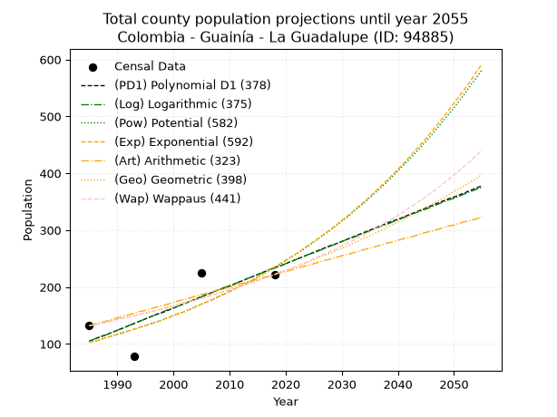
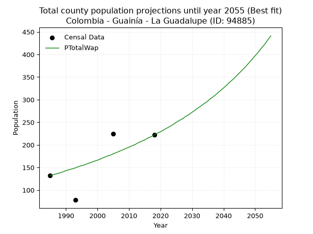
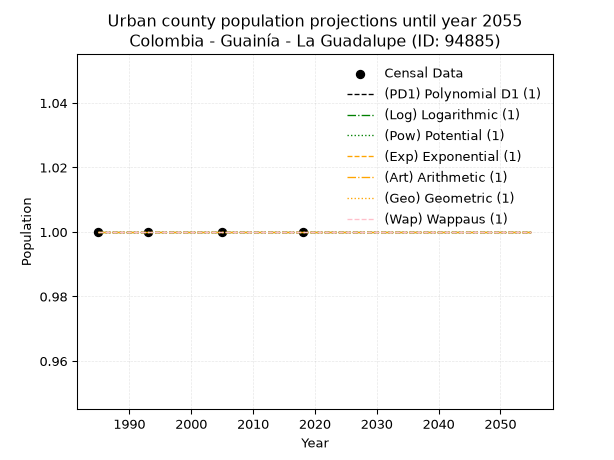
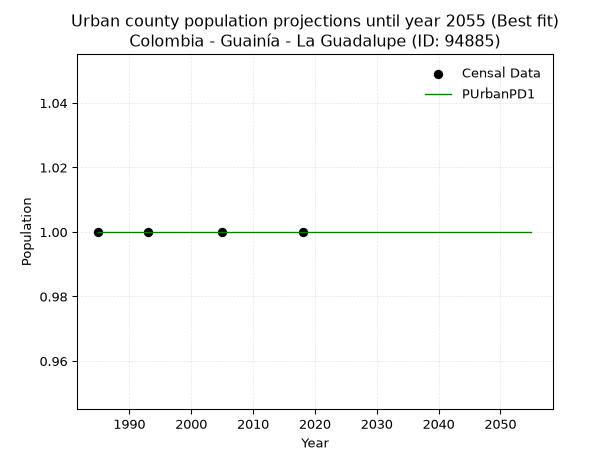
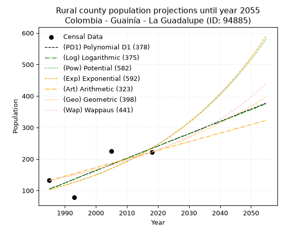
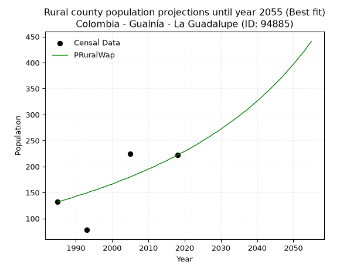

<div align="center">


</div>

# _“Population and Public Services Demand Projections (PPSD) until Year 2050 for Colombia - Guainía - La Guadalupe (ID: 94885)”_
Keywords: `population` `public-service` `projection` `lineal` `polynomial` `logarithmic` `potential` `exponential` `arithmetic` `geometric` `wappaus` `dane` `colombia` `south-america`

PPSD are analytical estimates used by governments and planners to anticipate future changes in population size, age distribution, and the resulting community needs for utilities, healthcare, education, and infrastructure as sizing future water treatment facilities, electrical grids, and road networks based on spatial growth.

> **General running parameters**: • app_version: _v20260806_. • Python version: _3.14.7_. • Pandas version: _3.0.5_. • NumPy version: _2.5.1_. • Creates, save and include plots into reports (create_plot): _False_. • Projection until year: _2050_. • Process polynomial degree 2 and up: _False_. • Process Wappaus: _True_. • Process Wappaus: _True_. • Set negative values to zero: _True_. • Set infinite values to zero: _True_. • Drop dataset notes: _True_. 
<div align="center">

Dynamic map: [:earth_americas:Google](http://maps.google.com/maps?q=1.403002218,-67.0048478) [:earth_americas:OSM](https://www.openstreetmap.org/#map=18/1.403002218/-67.0048478&layers=P) [:earth_americas:Bing](https://www.bing.com/maps?cp=1.403002218~-67.0048478&lvl=18) [:earth_americas:Apple](https://maps.apple.com/frame?center=1.403002218%2C-67.0048478&span=0.003%2C0.006)

</div>


<div align="center">

```geojson
{
  "type": "Feature",
  "geometry": {
    "type": "Point", 
    "coordinates": [-67.0048478, 1.403002218]
  }, 
  "properties": {
    "Name": "Colombia - Guainía - La Guadalupe (ID: 94885)"
  }
}
```

</div>


## 0. Census Data (4 records)

Census data are official statistics collected by a government about the people and housing in a country. They usually include counts of total population, age, sex, race, income, education, and jobs.

📅Global census file: [Population.xlsx](../data/Population.xlsx)

| Source   |   Year |   CountryID | CountryName   |   StateID | StateName   |   CountyID | CountyName   |   PTotal |   PUrban |   PRural |
|:---------|-------:|------------:|:--------------|----------:|:------------|-----------:|:-------------|---------:|---------:|---------:|
| DANE     |   1985 |          57 | Colombia      |        94 | Guainía     |      94885 | La Guadalupe |      132 |        1 |      132 |
| DANE     |   1993 |          57 | Colombia      |        94 | Guainía     |      94885 | La Guadalupe |       78 |        1 |       78 |
| DANE     |   2005 |          57 | Colombia      |        94 | Guainía     |      94885 | La Guadalupe |      225 |        1 |      225 |
| DANE     |   2018 |          57 | Colombia      |        94 | Guainía     |      94885 | La Guadalupe |      222 |        1 |      222 |

> 🔥Some records could had specific notes about the registered values or the corresponding urban or rural distribution.

📅   [RUPS](https://www.datos.gov.co/Hacienda-y-Cr-dito-P-blico/Registro-nico-de-Prestadores-de-Servicios-P-blicos/4qkq-csdn/about_data) - Local public utility companies: [RUPS.csv](../data/RUPS.xlsx)

 | SERVICIO   | ESTADO   | NOMBRE   | NIT   | DEPARTAMENTO_DOMICILIO   | MUNICIPIO_DOMICILIO   | DIRECCION   | TELEFONO   | EMAIL   | TIPO_INSCRIPCION   | REPRESENTANTE_LEGAL   | TIPO_PRESTADOR   | CLASIFICACION   |
|------------|----------|----------|-------|--------------------------|-----------------------|-------------|------------|---------|--------------------|-----------------------|------------------|-----------------|

## 1. Total

### 1.1. Coefficients and Parameters

* (PD1) Polynomial Deg 1: 3.9032517061421026, -7643.229225210742 (lineal)
* (Log) Logarithmic: 7812.298584102804, -59217.0941415973
* (Pow) Potential: 50.043242652288036, -163.0187381261973
* (Exp) Exponential: 0.02501024829508186, 2.827873005706356e-20
* (Art) Arithmetic: Year diff. 2018 - 1985 = 33, Population diff. 222 - 132 = 90, Annual growth = 2.727272727272727
* (Geo) Geometric: Year diff. 2018 - 1985 = 33, Population diff. 222 - 132 = 90, Annual growth % = 0.015878547142325505
* (Wap) Wappaus: i = 1.5408320493066257, Condition values only valid for < 200)

<sub>
Wappaus condition values: ['0.00', '1.54', '3.08', '4.62', '6.16', '7.70', '9.24', '10.79', '12.33', '13.87', '15.41', '16.95', '18.49', '20.03', '21.57', '23.11', '24.65', '26.19', '27.73', '29.28', '30.82', '32.36', '33.90', '35.44', '36.98', '38.52', '40.06', '41.60', '43.14', '44.68', '46.22', '47.77', '49.31', '50.85', '52.39', '53.93', '55.47', '57.01', '58.55', '60.09', '61.63', '63.17', '64.71', '66.26', '67.80', '69.34', '70.88', '72.42', '73.96', '75.50', '77.04', '78.58', '80.12', '81.66', '83.20', '84.75', '86.29', '87.83', '89.37', '90.91', '92.45', '93.99', '95.53', '97.07', '98.61', '100.15']
</sub>


### 1.2. Projected Dataset

|   Year |   CountyID |   PTotalPD1 |   PTotalLog |   PTotalPow |   PTotalExp |   PTotalArt |   PTotalGeo |   PTotalWap |
|-------:|-----------:|------------:|------------:|------------:|------------:|------------:|------------:|------------:|
|   1985 |      94885 |         105 |         105 |         103 |         103 |         132 |         132 |         132 |
|   1986 |      94885 |         109 |         109 |         105 |         105 |         135 |         134 |         134 |
|   1987 |      94885 |         113 |         112 |         108 |         108 |         137 |         136 |         136 |
|   1988 |      94885 |         116 |         116 |         111 |         111 |         140 |         138 |         138 |
|   1989 |      94885 |         120 |         120 |         114 |         114 |         143 |         141 |         140 |
|   1990 |      94885 |         124 |         124 |         117 |         117 |         146 |         143 |         143 |
|   1991 |      94885 |         128 |         128 |         120 |         119 |         148 |         145 |         145 |
|   1992 |      94885 |         132 |         132 |         123 |         123 |         151 |         147 |         147 |
|   1993 |      94885 |         136 |         136 |         126 |         126 |         154 |         150 |         149 |
|   1994 |      94885 |         140 |         140 |         129 |         129 |         157 |         152 |         152 |
|   1995 |      94885 |         144 |         144 |         132 |         132 |         159 |         155 |         154 |
|   1996 |      94885 |         148 |         148 |         136 |         135 |         162 |         157 |         156 |
|   1997 |      94885 |         152 |         152 |         139 |         139 |         165 |         159 |         159 |
|   1998 |      94885 |         155 |         156 |         142 |         142 |         167 |         162 |         161 |
|   1999 |      94885 |         159 |         160 |         146 |         146 |         170 |         165 |         164 |
|   2000 |      94885 |         163 |         163 |         150 |         150 |         173 |         167 |         166 |
|   2001 |      94885 |         167 |         167 |         154 |         153 |         176 |         170 |         169 |
|   2002 |      94885 |         171 |         171 |         157 |         157 |         178 |         173 |         172 |
|   2003 |      94885 |         175 |         175 |         161 |         161 |         181 |         175 |         175 |
|   2004 |      94885 |         179 |         179 |         166 |         165 |         184 |         178 |         177 |
|   2005 |      94885 |         183 |         183 |         170 |         170 |         187 |         181 |         180 |
|   2006 |      94885 |         187 |         187 |         174 |         174 |         189 |         184 |         183 |
|   2007 |      94885 |         191 |         191 |         178 |         178 |         192 |         187 |         186 |
|   2008 |      94885 |         195 |         195 |         183 |         183 |         195 |         190 |         189 |
|   2009 |      94885 |         198 |         199 |         188 |         187 |         197 |         193 |         192 |
|   2010 |      94885 |         202 |         202 |         192 |         192 |         200 |         196 |         195 |
|   2011 |      94885 |         206 |         206 |         197 |         197 |         203 |         199 |         198 |
|   2012 |      94885 |         210 |         210 |         202 |         202 |         206 |         202 |         201 |
|   2013 |      94885 |         214 |         214 |         207 |         207 |         208 |         205 |         205 |
|   2014 |      94885 |         218 |         218 |         212 |         212 |         211 |         208 |         208 |
|   2015 |      94885 |         222 |         222 |         218 |         218 |         214 |         212 |         211 |
|   2016 |      94885 |         226 |         226 |         223 |         223 |         217 |         215 |         215 |
|   2017 |      94885 |         230 |         230 |         229 |         229 |         219 |         219 |         218 |
|   2018 |      94885 |         234 |         233 |         235 |         235 |         222 |         222 |         222 |
|   2019 |      94885 |         237 |         237 |         240 |         241 |         225 |         226 |         226 |
|   2020 |      94885 |         241 |         241 |         246 |         247 |         227 |         229 |         229 |
|   2021 |      94885 |         245 |         245 |         253 |         253 |         230 |         233 |         233 |
|   2022 |      94885 |         249 |         249 |         259 |         259 |         233 |         236 |         237 |
|   2023 |      94885 |         253 |         253 |         265 |         266 |         236 |         240 |         241 |
|   2024 |      94885 |         257 |         257 |         272 |         273 |         238 |         244 |         245 |
|   2025 |      94885 |         261 |         260 |         279 |         280 |         241 |         248 |         250 |
|   2026 |      94885 |         265 |         264 |         286 |         287 |         244 |         252 |         254 |
|   2027 |      94885 |         269 |         268 |         293 |         294 |         247 |         256 |         258 |
|   2028 |      94885 |         273 |         272 |         300 |         301 |         249 |         260 |         263 |
|   2029 |      94885 |         276 |         276 |         308 |         309 |         252 |         264 |         267 |
|   2030 |      94885 |         280 |         280 |         316 |         317 |         255 |         268 |         272 |
|   2031 |      94885 |         284 |         284 |         323 |         325 |         257 |         272 |         277 |
|   2032 |      94885 |         288 |         287 |         332 |         333 |         260 |         277 |         282 |
|   2033 |      94885 |         292 |         291 |         340 |         342 |         263 |         281 |         287 |
|   2034 |      94885 |         296 |         295 |         348 |         350 |         266 |         286 |         292 |
|   2035 |      94885 |         300 |         299 |         357 |         359 |         268 |         290 |         297 |
|   2036 |      94885 |         304 |         303 |         366 |         368 |         271 |         295 |         303 |
|   2037 |      94885 |         308 |         307 |         375 |         378 |         274 |         299 |         308 |
|   2038 |      94885 |         312 |         310 |         384 |         387 |         277 |         304 |         314 |
|   2039 |      94885 |         316 |         314 |         394 |         397 |         279 |         309 |         320 |
|   2040 |      94885 |         319 |         318 |         404 |         407 |         282 |         314 |         326 |
|   2041 |      94885 |         323 |         322 |         414 |         417 |         285 |         319 |         332 |
|   2042 |      94885 |         327 |         326 |         424 |         428 |         287 |         324 |         339 |
|   2043 |      94885 |         331 |         330 |         434 |         439 |         290 |         329 |         345 |
|   2044 |      94885 |         335 |         333 |         445 |         450 |         293 |         334 |         352 |
|   2045 |      94885 |         339 |         337 |         456 |         461 |         296 |         340 |         359 |
|   2046 |      94885 |         343 |         341 |         467 |         473 |         298 |         345 |         366 |
|   2047 |      94885 |         347 |         345 |         479 |         485 |         301 |         351 |         373 |
|   2048 |      94885 |         351 |         349 |         491 |         497 |         304 |         356 |         381 |
|   2049 |      94885 |         355 |         353 |         503 |         510 |         307 |         362 |         389 |
|   2050 |      94885 |         358 |         356 |         515 |         523 |         309 |         368 |         397 |
<div align="center">

</img>

</div>


### 1.3. Best fit with absolute and relative error (%)

Relative error puts that difference into context by dividing the absolute error by the true value, creating a unitless ratio or percentage that shows the scale of the mistake.

Absolute and relative error

|   Year | Source   |   CountryID | CountryName   |   StateID | StateName   |   CountyID_x | CountyName   |   PTotal |   PUrban |   PRural |   CountyID_y |   PTotalPD1 |   PTotalLog |   PTotalPow |   PTotalExp |   PTotalArt |   PTotalGeo |   PTotalWap |   PTotalPD1AbsError |   PTotalLogAbsError |   PTotalPowAbsError |   PTotalExpAbsError |   PTotalArtAbsError |   PTotalGeoAbsError |   PTotalWapAbsError |   PTotalPD1RelError |   PTotalLogRelError |   PTotalPowRelError |   PTotalExpRelError |   PTotalArtRelError |   PTotalGeoRelError |   PTotalWapRelError |
|-------:|:---------|------------:|:--------------|----------:|:------------|-------------:|:-------------|---------:|---------:|---------:|-------------:|------------:|------------:|------------:|------------:|------------:|------------:|------------:|--------------------:|--------------------:|--------------------:|--------------------:|--------------------:|--------------------:|--------------------:|--------------------:|--------------------:|--------------------:|--------------------:|--------------------:|--------------------:|--------------------:|
|   1985 | DANE     |          57 | Colombia      |        94 | Guainía     |        94885 | La Guadalupe |      132 |        1 |      132 |        94885 |         105 |         105 |         103 |         103 |         132 |         132 |         132 |                  27 |                  27 |                  29 |                  29 |                   0 |                   0 |                   0 |            20.4545  |            20.4545  |            21.9697  |            21.9697  |              0      |              0      |              0      |
|   1993 | DANE     |          57 | Colombia      |        94 | Guainía     |        94885 | La Guadalupe |       78 |        1 |       78 |        94885 |         136 |         136 |         126 |         126 |         154 |         150 |         149 |                  58 |                  58 |                  48 |                  48 |                  76 |                  72 |                  71 |            74.359   |            74.359   |            61.5385  |            61.5385  |             97.4359 |             92.3077 |             91.0256 |
|   2005 | DANE     |          57 | Colombia      |        94 | Guainía     |        94885 | La Guadalupe |      225 |        1 |      225 |        94885 |         183 |         183 |         170 |         170 |         187 |         181 |         180 |                  42 |                  42 |                  55 |                  55 |                  38 |                  44 |                  45 |            18.6667  |            18.6667  |            24.4444  |            24.4444  |             16.8889 |             19.5556 |             20      |
|   2018 | DANE     |          57 | Colombia      |        94 | Guainía     |        94885 | La Guadalupe |      222 |        1 |      222 |        94885 |         234 |         233 |         235 |         235 |         222 |         222 |         222 |                  12 |                  11 |                  13 |                  13 |                   0 |                   0 |                   0 |             5.40541 |             4.95495 |             5.85586 |             5.85586 |              0      |              0      |              0      |

Relative error mean

| Method    |   RelError | Best   |
|:----------|-----------:|:-------|
| PTotalPD1 |    29.7214 |        |
| PTotalLog |    29.6088 |        |
| PTotalPow |    28.4521 |        |
| PTotalExp |    28.4521 |        |
| PTotalArt |    28.5812 |        |
| PTotalGeo |    27.9658 |        |
| PTotalWap |    27.7564 | True   |

💙Best method: _**PTotalWap**_
<div align="center">

</img>

</div>


### 1.4. Fresh water supply demand in liters per capita per day (lpcd)

The fresh water supply demand typically ranges from 100 to 300 liters per capita per day (lpcd) for standard domestic and municipal planning, though absolute survival minimums set by the World Health Organization are as low as 7.5 to 20 liters per day, and total consumption in high-income nations can exceed 400 liters.

> `CZ`: Level in meters above the sea level (masl)<br> `WS`: Fresh water supply demand in liters per capita per day (lpcd or l/h/d)<br> `WSAll`: Zonal fresh water supply demand in liters per second (l/s)<br> `A`: Zonal area in square meters<br> `DP`: Population density (people/hectare or p/ha)

Reference values (RAS Colombia)

|    CZ |   WS |
|------:|-----:|
|  1000 |  120 |
|  2000 |  130 |
| 99999 |  140 |

County shapefile geometry properties and water supply values

|   CountyID |      ATotal |   CZTotal |   WSTotal |
|-----------:|------------:|----------:|----------:|
|      94885 | 1.13744e+09 |    105.03 |       120 |

Projected values for best method: PTotalWap

|   CountyID |   Year |   PTotalWap |   DPTotal |   WSTotal |   WSTotalAll |
|-----------:|-------:|------------:|----------:|----------:|-------------:|
|      94885 |   1985 |         132 |         0 |       120 |     0.183333 |
|      94885 |   1986 |         134 |         0 |       120 |     0.186111 |
|      94885 |   1987 |         136 |         0 |       120 |     0.188889 |
|      94885 |   1988 |         138 |         0 |       120 |     0.191667 |
|      94885 |   1989 |         140 |         0 |       120 |     0.194444 |
|      94885 |   1990 |         143 |         0 |       120 |     0.198611 |
|      94885 |   1991 |         145 |         0 |       120 |     0.201389 |
|      94885 |   1992 |         147 |         0 |       120 |     0.204167 |
|      94885 |   1993 |         149 |         0 |       120 |     0.206944 |
|      94885 |   1994 |         152 |         0 |       120 |     0.211111 |
|      94885 |   1995 |         154 |         0 |       120 |     0.213889 |
|      94885 |   1996 |         156 |         0 |       120 |     0.216667 |
|      94885 |   1997 |         159 |         0 |       120 |     0.220833 |
|      94885 |   1998 |         161 |         0 |       120 |     0.223611 |
|      94885 |   1999 |         164 |         0 |       120 |     0.227778 |
|      94885 |   2000 |         166 |         0 |       120 |     0.230556 |
|      94885 |   2001 |         169 |         0 |       120 |     0.234722 |
|      94885 |   2002 |         172 |         0 |       120 |     0.238889 |
|      94885 |   2003 |         175 |         0 |       120 |     0.243056 |
|      94885 |   2004 |         177 |         0 |       120 |     0.245833 |
|      94885 |   2005 |         180 |         0 |       120 |     0.25     |
|      94885 |   2006 |         183 |         0 |       120 |     0.254167 |
|      94885 |   2007 |         186 |         0 |       120 |     0.258333 |
|      94885 |   2008 |         189 |         0 |       120 |     0.2625   |
|      94885 |   2009 |         192 |         0 |       120 |     0.266667 |
|      94885 |   2010 |         195 |         0 |       120 |     0.270833 |
|      94885 |   2011 |         198 |         0 |       120 |     0.275    |
|      94885 |   2012 |         201 |         0 |       120 |     0.279167 |
|      94885 |   2013 |         205 |         0 |       120 |     0.284722 |
|      94885 |   2014 |         208 |         0 |       120 |     0.288889 |
|      94885 |   2015 |         211 |         0 |       120 |     0.293056 |
|      94885 |   2016 |         215 |         0 |       120 |     0.298611 |
|      94885 |   2017 |         218 |         0 |       120 |     0.302778 |
|      94885 |   2018 |         222 |         0 |       120 |     0.308333 |
|      94885 |   2019 |         226 |         0 |       120 |     0.313889 |
|      94885 |   2020 |         229 |         0 |       120 |     0.318056 |
|      94885 |   2021 |         233 |         0 |       120 |     0.323611 |
|      94885 |   2022 |         237 |         0 |       120 |     0.329167 |
|      94885 |   2023 |         241 |         0 |       120 |     0.334722 |
|      94885 |   2024 |         245 |         0 |       120 |     0.340278 |
|      94885 |   2025 |         250 |         0 |       120 |     0.347222 |
|      94885 |   2026 |         254 |         0 |       120 |     0.352778 |
|      94885 |   2027 |         258 |         0 |       120 |     0.358333 |
|      94885 |   2028 |         263 |         0 |       120 |     0.365278 |
|      94885 |   2029 |         267 |         0 |       120 |     0.370833 |
|      94885 |   2030 |         272 |         0 |       120 |     0.377778 |
|      94885 |   2031 |         277 |         0 |       120 |     0.384722 |
|      94885 |   2032 |         282 |         0 |       120 |     0.391667 |
|      94885 |   2033 |         287 |         0 |       120 |     0.398611 |
|      94885 |   2034 |         292 |         0 |       120 |     0.405556 |
|      94885 |   2035 |         297 |         0 |       120 |     0.4125   |
|      94885 |   2036 |         303 |         0 |       120 |     0.420833 |
|      94885 |   2037 |         308 |         0 |       120 |     0.427778 |
|      94885 |   2038 |         314 |         0 |       120 |     0.436111 |
|      94885 |   2039 |         320 |         0 |       120 |     0.444444 |
|      94885 |   2040 |         326 |         0 |       120 |     0.452778 |
|      94885 |   2041 |         332 |         0 |       120 |     0.461111 |
|      94885 |   2042 |         339 |         0 |       120 |     0.470833 |
|      94885 |   2043 |         345 |         0 |       120 |     0.479167 |
|      94885 |   2044 |         352 |         0 |       120 |     0.488889 |
|      94885 |   2045 |         359 |         0 |       120 |     0.498611 |
|      94885 |   2046 |         366 |         0 |       120 |     0.508333 |
|      94885 |   2047 |         373 |         0 |       120 |     0.518056 |
|      94885 |   2048 |         381 |         0 |       120 |     0.529167 |
|      94885 |   2049 |         389 |         0 |       120 |     0.540278 |
|      94885 |   2050 |         397 |         0 |       120 |     0.551389 |

## 2. Urban

### 2.1. Coefficients and Parameters

* (PD1) Polynomial Deg 1: -1.3233529347183512e-19, 1.0000000000000004 (lineal)
* (Log) Logarithmic: 3.215569112241165e-17, 0.9999999999999996
* (Pow) Potential: 0.0, 0.0
* (Exp) Exponential: 0.0, 1.0
* (Art) Arithmetic: Year diff. 2018 - 1985 = 33, Population diff. 1 - 1 = 0, Annual growth = 0.0
* (Geo) Geometric: Year diff. 2018 - 1985 = 33, Population diff. 1 - 1 = 0, Annual growth % = 0.0
* (Wap) Wappaus: i = 0.0, Condition values only valid for < 200)

<sub>
Wappaus condition values: ['0.00', '0.00', '0.00', '0.00', '0.00', '0.00', '0.00', '0.00', '0.00', '0.00', '0.00', '0.00', '0.00', '0.00', '0.00', '0.00', '0.00', '0.00', '0.00', '0.00', '0.00', '0.00', '0.00', '0.00', '0.00', '0.00', '0.00', '0.00', '0.00', '0.00', '0.00', '0.00', '0.00', '0.00', '0.00', '0.00', '0.00', '0.00', '0.00', '0.00', '0.00', '0.00', '0.00', '0.00', '0.00', '0.00', '0.00', '0.00', '0.00', '0.00', '0.00', '0.00', '0.00', '0.00', '0.00', '0.00', '0.00', '0.00', '0.00', '0.00', '0.00', '0.00', '0.00', '0.00', '0.00', '0.00']
</sub>


### 2.2. Projected Dataset

|   Year |   CountyID |   PUrbanPD1 |   PUrbanLog |   PUrbanPow |   PUrbanExp |   PUrbanArt |   PUrbanGeo |   PUrbanWap |
|-------:|-----------:|------------:|------------:|------------:|------------:|------------:|------------:|------------:|
|   1985 |      94885 |           1 |           1 |           1 |           1 |           1 |           1 |           1 |
|   1986 |      94885 |           1 |           1 |           1 |           1 |           1 |           1 |           1 |
|   1987 |      94885 |           1 |           1 |           1 |           1 |           1 |           1 |           1 |
|   1988 |      94885 |           1 |           1 |           1 |           1 |           1 |           1 |           1 |
|   1989 |      94885 |           1 |           1 |           1 |           1 |           1 |           1 |           1 |
|   1990 |      94885 |           1 |           1 |           1 |           1 |           1 |           1 |           1 |
|   1991 |      94885 |           1 |           1 |           1 |           1 |           1 |           1 |           1 |
|   1992 |      94885 |           1 |           1 |           1 |           1 |           1 |           1 |           1 |
|   1993 |      94885 |           1 |           1 |           1 |           1 |           1 |           1 |           1 |
|   1994 |      94885 |           1 |           1 |           1 |           1 |           1 |           1 |           1 |
|   1995 |      94885 |           1 |           1 |           1 |           1 |           1 |           1 |           1 |
|   1996 |      94885 |           1 |           1 |           1 |           1 |           1 |           1 |           1 |
|   1997 |      94885 |           1 |           1 |           1 |           1 |           1 |           1 |           1 |
|   1998 |      94885 |           1 |           1 |           1 |           1 |           1 |           1 |           1 |
|   1999 |      94885 |           1 |           1 |           1 |           1 |           1 |           1 |           1 |
|   2000 |      94885 |           1 |           1 |           1 |           1 |           1 |           1 |           1 |
|   2001 |      94885 |           1 |           1 |           1 |           1 |           1 |           1 |           1 |
|   2002 |      94885 |           1 |           1 |           1 |           1 |           1 |           1 |           1 |
|   2003 |      94885 |           1 |           1 |           1 |           1 |           1 |           1 |           1 |
|   2004 |      94885 |           1 |           1 |           1 |           1 |           1 |           1 |           1 |
|   2005 |      94885 |           1 |           1 |           1 |           1 |           1 |           1 |           1 |
|   2006 |      94885 |           1 |           1 |           1 |           1 |           1 |           1 |           1 |
|   2007 |      94885 |           1 |           1 |           1 |           1 |           1 |           1 |           1 |
|   2008 |      94885 |           1 |           1 |           1 |           1 |           1 |           1 |           1 |
|   2009 |      94885 |           1 |           1 |           1 |           1 |           1 |           1 |           1 |
|   2010 |      94885 |           1 |           1 |           1 |           1 |           1 |           1 |           1 |
|   2011 |      94885 |           1 |           1 |           1 |           1 |           1 |           1 |           1 |
|   2012 |      94885 |           1 |           1 |           1 |           1 |           1 |           1 |           1 |
|   2013 |      94885 |           1 |           1 |           1 |           1 |           1 |           1 |           1 |
|   2014 |      94885 |           1 |           1 |           1 |           1 |           1 |           1 |           1 |
|   2015 |      94885 |           1 |           1 |           1 |           1 |           1 |           1 |           1 |
|   2016 |      94885 |           1 |           1 |           1 |           1 |           1 |           1 |           1 |
|   2017 |      94885 |           1 |           1 |           1 |           1 |           1 |           1 |           1 |
|   2018 |      94885 |           1 |           1 |           1 |           1 |           1 |           1 |           1 |
|   2019 |      94885 |           1 |           1 |           1 |           1 |           1 |           1 |           1 |
|   2020 |      94885 |           1 |           1 |           1 |           1 |           1 |           1 |           1 |
|   2021 |      94885 |           1 |           1 |           1 |           1 |           1 |           1 |           1 |
|   2022 |      94885 |           1 |           1 |           1 |           1 |           1 |           1 |           1 |
|   2023 |      94885 |           1 |           1 |           1 |           1 |           1 |           1 |           1 |
|   2024 |      94885 |           1 |           1 |           1 |           1 |           1 |           1 |           1 |
|   2025 |      94885 |           1 |           1 |           1 |           1 |           1 |           1 |           1 |
|   2026 |      94885 |           1 |           1 |           1 |           1 |           1 |           1 |           1 |
|   2027 |      94885 |           1 |           1 |           1 |           1 |           1 |           1 |           1 |
|   2028 |      94885 |           1 |           1 |           1 |           1 |           1 |           1 |           1 |
|   2029 |      94885 |           1 |           1 |           1 |           1 |           1 |           1 |           1 |
|   2030 |      94885 |           1 |           1 |           1 |           1 |           1 |           1 |           1 |
|   2031 |      94885 |           1 |           1 |           1 |           1 |           1 |           1 |           1 |
|   2032 |      94885 |           1 |           1 |           1 |           1 |           1 |           1 |           1 |
|   2033 |      94885 |           1 |           1 |           1 |           1 |           1 |           1 |           1 |
|   2034 |      94885 |           1 |           1 |           1 |           1 |           1 |           1 |           1 |
|   2035 |      94885 |           1 |           1 |           1 |           1 |           1 |           1 |           1 |
|   2036 |      94885 |           1 |           1 |           1 |           1 |           1 |           1 |           1 |
|   2037 |      94885 |           1 |           1 |           1 |           1 |           1 |           1 |           1 |
|   2038 |      94885 |           1 |           1 |           1 |           1 |           1 |           1 |           1 |
|   2039 |      94885 |           1 |           1 |           1 |           1 |           1 |           1 |           1 |
|   2040 |      94885 |           1 |           1 |           1 |           1 |           1 |           1 |           1 |
|   2041 |      94885 |           1 |           1 |           1 |           1 |           1 |           1 |           1 |
|   2042 |      94885 |           1 |           1 |           1 |           1 |           1 |           1 |           1 |
|   2043 |      94885 |           1 |           1 |           1 |           1 |           1 |           1 |           1 |
|   2044 |      94885 |           1 |           1 |           1 |           1 |           1 |           1 |           1 |
|   2045 |      94885 |           1 |           1 |           1 |           1 |           1 |           1 |           1 |
|   2046 |      94885 |           1 |           1 |           1 |           1 |           1 |           1 |           1 |
|   2047 |      94885 |           1 |           1 |           1 |           1 |           1 |           1 |           1 |
|   2048 |      94885 |           1 |           1 |           1 |           1 |           1 |           1 |           1 |
|   2049 |      94885 |           1 |           1 |           1 |           1 |           1 |           1 |           1 |
|   2050 |      94885 |           1 |           1 |           1 |           1 |           1 |           1 |           1 |
<div align="center">

</img>

</div>


### 2.3. Best fit with absolute and relative error (%)

Relative error puts that difference into context by dividing the absolute error by the true value, creating a unitless ratio or percentage that shows the scale of the mistake.

Absolute and relative error

|   Year | Source   |   CountryID | CountryName   |   StateID | StateName   |   CountyID_x | CountyName   |   PTotal |   PUrban |   PRural |   CountyID_y |   PUrbanPD1 |   PUrbanLog |   PUrbanPow |   PUrbanExp |   PUrbanArt |   PUrbanGeo |   PUrbanWap |   PUrbanPD1AbsError |   PUrbanLogAbsError |   PUrbanPowAbsError |   PUrbanExpAbsError |   PUrbanArtAbsError |   PUrbanGeoAbsError |   PUrbanWapAbsError |   PUrbanPD1RelError |   PUrbanLogRelError |   PUrbanPowRelError |   PUrbanExpRelError |   PUrbanArtRelError |   PUrbanGeoRelError |   PUrbanWapRelError |
|-------:|:---------|------------:|:--------------|----------:|:------------|-------------:|:-------------|---------:|---------:|---------:|-------------:|------------:|------------:|------------:|------------:|------------:|------------:|------------:|--------------------:|--------------------:|--------------------:|--------------------:|--------------------:|--------------------:|--------------------:|--------------------:|--------------------:|--------------------:|--------------------:|--------------------:|--------------------:|--------------------:|
|   1985 | DANE     |          57 | Colombia      |        94 | Guainía     |        94885 | La Guadalupe |      132 |        1 |      132 |        94885 |           1 |           1 |           1 |           1 |           1 |           1 |           1 |                   0 |                   0 |                   0 |                   0 |                   0 |                   0 |                   0 |                   0 |                   0 |                   0 |                   0 |                   0 |                   0 |                   0 |
|   1993 | DANE     |          57 | Colombia      |        94 | Guainía     |        94885 | La Guadalupe |       78 |        1 |       78 |        94885 |           1 |           1 |           1 |           1 |           1 |           1 |           1 |                   0 |                   0 |                   0 |                   0 |                   0 |                   0 |                   0 |                   0 |                   0 |                   0 |                   0 |                   0 |                   0 |                   0 |
|   2005 | DANE     |          57 | Colombia      |        94 | Guainía     |        94885 | La Guadalupe |      225 |        1 |      225 |        94885 |           1 |           1 |           1 |           1 |           1 |           1 |           1 |                   0 |                   0 |                   0 |                   0 |                   0 |                   0 |                   0 |                   0 |                   0 |                   0 |                   0 |                   0 |                   0 |                   0 |
|   2018 | DANE     |          57 | Colombia      |        94 | Guainía     |        94885 | La Guadalupe |      222 |        1 |      222 |        94885 |           1 |           1 |           1 |           1 |           1 |           1 |           1 |                   0 |                   0 |                   0 |                   0 |                   0 |                   0 |                   0 |                   0 |                   0 |                   0 |                   0 |                   0 |                   0 |                   0 |

Relative error mean

| Method    |   RelError | Best   |
|:----------|-----------:|:-------|
| PUrbanPD1 |          0 | True   |
| PUrbanLog |          0 | True   |
| PUrbanPow |          0 | True   |
| PUrbanExp |          0 | True   |
| PUrbanArt |          0 | True   |
| PUrbanGeo |          0 | True   |
| PUrbanWap |          0 | True   |

💙Best method: _**PUrbanPD1**_
<div align="center">

</img>

</div>


### 2.4. Fresh water supply demand in liters per capita per day (lpcd)

The fresh water supply demand typically ranges from 100 to 300 liters per capita per day (lpcd) for standard domestic and municipal planning, though absolute survival minimums set by the World Health Organization are as low as 7.5 to 20 liters per day, and total consumption in high-income nations can exceed 400 liters.

> `CZ`: Level in meters above the sea level (masl)<br> `WS`: Fresh water supply demand in liters per capita per day (lpcd or l/h/d)<br> `WSAll`: Zonal fresh water supply demand in liters per second (l/s)<br> `A`: Zonal area in square meters<br> `DP`: Population density (people/hectare or p/ha)

Reference values (RAS Colombia)

|    CZ |   WS |
|------:|-----:|
|  1000 |  120 |
|  2000 |  130 |
| 99999 |  140 |

County shapefile geometry properties and water supply values

|   CountyID |   AUrban |   CZUrban |   WSUrban |
|-----------:|---------:|----------:|----------:|
|      94885 |        0 |         0 |       120 |

Projected values for best method: PUrbanPD1

|   CountyID |   Year |   PUrbanPD1 |   DPUrban |   WSUrban |   WSUrbanAll |
|-----------:|-------:|------------:|----------:|----------:|-------------:|
|      94885 |   1985 |           1 |       inf |       120 |   0.00138889 |
|      94885 |   1986 |           1 |       inf |       120 |   0.00138889 |
|      94885 |   1987 |           1 |       inf |       120 |   0.00138889 |
|      94885 |   1988 |           1 |       inf |       120 |   0.00138889 |
|      94885 |   1989 |           1 |       inf |       120 |   0.00138889 |
|      94885 |   1990 |           1 |       inf |       120 |   0.00138889 |
|      94885 |   1991 |           1 |       inf |       120 |   0.00138889 |
|      94885 |   1992 |           1 |       inf |       120 |   0.00138889 |
|      94885 |   1993 |           1 |       inf |       120 |   0.00138889 |
|      94885 |   1994 |           1 |       inf |       120 |   0.00138889 |
|      94885 |   1995 |           1 |       inf |       120 |   0.00138889 |
|      94885 |   1996 |           1 |       inf |       120 |   0.00138889 |
|      94885 |   1997 |           1 |       inf |       120 |   0.00138889 |
|      94885 |   1998 |           1 |       inf |       120 |   0.00138889 |
|      94885 |   1999 |           1 |       inf |       120 |   0.00138889 |
|      94885 |   2000 |           1 |       inf |       120 |   0.00138889 |
|      94885 |   2001 |           1 |       inf |       120 |   0.00138889 |
|      94885 |   2002 |           1 |       inf |       120 |   0.00138889 |
|      94885 |   2003 |           1 |       inf |       120 |   0.00138889 |
|      94885 |   2004 |           1 |       inf |       120 |   0.00138889 |
|      94885 |   2005 |           1 |       inf |       120 |   0.00138889 |
|      94885 |   2006 |           1 |       inf |       120 |   0.00138889 |
|      94885 |   2007 |           1 |       inf |       120 |   0.00138889 |
|      94885 |   2008 |           1 |       inf |       120 |   0.00138889 |
|      94885 |   2009 |           1 |       inf |       120 |   0.00138889 |
|      94885 |   2010 |           1 |       inf |       120 |   0.00138889 |
|      94885 |   2011 |           1 |       inf |       120 |   0.00138889 |
|      94885 |   2012 |           1 |       inf |       120 |   0.00138889 |
|      94885 |   2013 |           1 |       inf |       120 |   0.00138889 |
|      94885 |   2014 |           1 |       inf |       120 |   0.00138889 |
|      94885 |   2015 |           1 |       inf |       120 |   0.00138889 |
|      94885 |   2016 |           1 |       inf |       120 |   0.00138889 |
|      94885 |   2017 |           1 |       inf |       120 |   0.00138889 |
|      94885 |   2018 |           1 |       inf |       120 |   0.00138889 |
|      94885 |   2019 |           1 |       inf |       120 |   0.00138889 |
|      94885 |   2020 |           1 |       inf |       120 |   0.00138889 |
|      94885 |   2021 |           1 |       inf |       120 |   0.00138889 |
|      94885 |   2022 |           1 |       inf |       120 |   0.00138889 |
|      94885 |   2023 |           1 |       inf |       120 |   0.00138889 |
|      94885 |   2024 |           1 |       inf |       120 |   0.00138889 |
|      94885 |   2025 |           1 |       inf |       120 |   0.00138889 |
|      94885 |   2026 |           1 |       inf |       120 |   0.00138889 |
|      94885 |   2027 |           1 |       inf |       120 |   0.00138889 |
|      94885 |   2028 |           1 |       inf |       120 |   0.00138889 |
|      94885 |   2029 |           1 |       inf |       120 |   0.00138889 |
|      94885 |   2030 |           1 |       inf |       120 |   0.00138889 |
|      94885 |   2031 |           1 |       inf |       120 |   0.00138889 |
|      94885 |   2032 |           1 |       inf |       120 |   0.00138889 |
|      94885 |   2033 |           1 |       inf |       120 |   0.00138889 |
|      94885 |   2034 |           1 |       inf |       120 |   0.00138889 |
|      94885 |   2035 |           1 |       inf |       120 |   0.00138889 |
|      94885 |   2036 |           1 |       inf |       120 |   0.00138889 |
|      94885 |   2037 |           1 |       inf |       120 |   0.00138889 |
|      94885 |   2038 |           1 |       inf |       120 |   0.00138889 |
|      94885 |   2039 |           1 |       inf |       120 |   0.00138889 |
|      94885 |   2040 |           1 |       inf |       120 |   0.00138889 |
|      94885 |   2041 |           1 |       inf |       120 |   0.00138889 |
|      94885 |   2042 |           1 |       inf |       120 |   0.00138889 |
|      94885 |   2043 |           1 |       inf |       120 |   0.00138889 |
|      94885 |   2044 |           1 |       inf |       120 |   0.00138889 |
|      94885 |   2045 |           1 |       inf |       120 |   0.00138889 |
|      94885 |   2046 |           1 |       inf |       120 |   0.00138889 |
|      94885 |   2047 |           1 |       inf |       120 |   0.00138889 |
|      94885 |   2048 |           1 |       inf |       120 |   0.00138889 |
|      94885 |   2049 |           1 |       inf |       120 |   0.00138889 |
|      94885 |   2050 |           1 |       inf |       120 |   0.00138889 |

## 3. Rural

### 3.1. Coefficients and Parameters

* (PD1) Polynomial Deg 1: 3.9032517061421026, -7643.229225210742 (lineal)
* (Log) Logarithmic: 7812.298584102804, -59217.0941415973
* (Pow) Potential: 50.043242652288036, -163.0187381261973
* (Exp) Exponential: 0.02501024829508186, 2.827873005706356e-20
* (Art) Arithmetic: Year diff. 2018 - 1985 = 33, Population diff. 222 - 132 = 90, Annual growth = 2.727272727272727
* (Geo) Geometric: Year diff. 2018 - 1985 = 33, Population diff. 222 - 132 = 90, Annual growth % = 0.015878547142325505
* (Wap) Wappaus: i = 1.5408320493066257, Condition values only valid for < 200)

<sub>
Wappaus condition values: ['0.00', '1.54', '3.08', '4.62', '6.16', '7.70', '9.24', '10.79', '12.33', '13.87', '15.41', '16.95', '18.49', '20.03', '21.57', '23.11', '24.65', '26.19', '27.73', '29.28', '30.82', '32.36', '33.90', '35.44', '36.98', '38.52', '40.06', '41.60', '43.14', '44.68', '46.22', '47.77', '49.31', '50.85', '52.39', '53.93', '55.47', '57.01', '58.55', '60.09', '61.63', '63.17', '64.71', '66.26', '67.80', '69.34', '70.88', '72.42', '73.96', '75.50', '77.04', '78.58', '80.12', '81.66', '83.20', '84.75', '86.29', '87.83', '89.37', '90.91', '92.45', '93.99', '95.53', '97.07', '98.61', '100.15']
</sub>


### 3.2. Projected Dataset

|   Year |   CountyID |   PRuralPD1 |   PRuralLog |   PRuralPow |   PRuralExp |   PRuralArt |   PRuralGeo |   PRuralWap |
|-------:|-----------:|------------:|------------:|------------:|------------:|------------:|------------:|------------:|
|   1985 |      94885 |         105 |         105 |         103 |         103 |         132 |         132 |         132 |
|   1986 |      94885 |         109 |         109 |         105 |         105 |         135 |         134 |         134 |
|   1987 |      94885 |         113 |         112 |         108 |         108 |         137 |         136 |         136 |
|   1988 |      94885 |         116 |         116 |         111 |         111 |         140 |         138 |         138 |
|   1989 |      94885 |         120 |         120 |         114 |         114 |         143 |         141 |         140 |
|   1990 |      94885 |         124 |         124 |         117 |         117 |         146 |         143 |         143 |
|   1991 |      94885 |         128 |         128 |         120 |         119 |         148 |         145 |         145 |
|   1992 |      94885 |         132 |         132 |         123 |         123 |         151 |         147 |         147 |
|   1993 |      94885 |         136 |         136 |         126 |         126 |         154 |         150 |         149 |
|   1994 |      94885 |         140 |         140 |         129 |         129 |         157 |         152 |         152 |
|   1995 |      94885 |         144 |         144 |         132 |         132 |         159 |         155 |         154 |
|   1996 |      94885 |         148 |         148 |         136 |         135 |         162 |         157 |         156 |
|   1997 |      94885 |         152 |         152 |         139 |         139 |         165 |         159 |         159 |
|   1998 |      94885 |         155 |         156 |         142 |         142 |         167 |         162 |         161 |
|   1999 |      94885 |         159 |         160 |         146 |         146 |         170 |         165 |         164 |
|   2000 |      94885 |         163 |         163 |         150 |         150 |         173 |         167 |         166 |
|   2001 |      94885 |         167 |         167 |         154 |         153 |         176 |         170 |         169 |
|   2002 |      94885 |         171 |         171 |         157 |         157 |         178 |         173 |         172 |
|   2003 |      94885 |         175 |         175 |         161 |         161 |         181 |         175 |         175 |
|   2004 |      94885 |         179 |         179 |         166 |         165 |         184 |         178 |         177 |
|   2005 |      94885 |         183 |         183 |         170 |         170 |         187 |         181 |         180 |
|   2006 |      94885 |         187 |         187 |         174 |         174 |         189 |         184 |         183 |
|   2007 |      94885 |         191 |         191 |         178 |         178 |         192 |         187 |         186 |
|   2008 |      94885 |         195 |         195 |         183 |         183 |         195 |         190 |         189 |
|   2009 |      94885 |         198 |         199 |         188 |         187 |         197 |         193 |         192 |
|   2010 |      94885 |         202 |         202 |         192 |         192 |         200 |         196 |         195 |
|   2011 |      94885 |         206 |         206 |         197 |         197 |         203 |         199 |         198 |
|   2012 |      94885 |         210 |         210 |         202 |         202 |         206 |         202 |         201 |
|   2013 |      94885 |         214 |         214 |         207 |         207 |         208 |         205 |         205 |
|   2014 |      94885 |         218 |         218 |         212 |         212 |         211 |         208 |         208 |
|   2015 |      94885 |         222 |         222 |         218 |         218 |         214 |         212 |         211 |
|   2016 |      94885 |         226 |         226 |         223 |         223 |         217 |         215 |         215 |
|   2017 |      94885 |         230 |         230 |         229 |         229 |         219 |         219 |         218 |
|   2018 |      94885 |         234 |         233 |         235 |         235 |         222 |         222 |         222 |
|   2019 |      94885 |         237 |         237 |         240 |         241 |         225 |         226 |         226 |
|   2020 |      94885 |         241 |         241 |         246 |         247 |         227 |         229 |         229 |
|   2021 |      94885 |         245 |         245 |         253 |         253 |         230 |         233 |         233 |
|   2022 |      94885 |         249 |         249 |         259 |         259 |         233 |         236 |         237 |
|   2023 |      94885 |         253 |         253 |         265 |         266 |         236 |         240 |         241 |
|   2024 |      94885 |         257 |         257 |         272 |         273 |         238 |         244 |         245 |
|   2025 |      94885 |         261 |         260 |         279 |         280 |         241 |         248 |         250 |
|   2026 |      94885 |         265 |         264 |         286 |         287 |         244 |         252 |         254 |
|   2027 |      94885 |         269 |         268 |         293 |         294 |         247 |         256 |         258 |
|   2028 |      94885 |         273 |         272 |         300 |         301 |         249 |         260 |         263 |
|   2029 |      94885 |         276 |         276 |         308 |         309 |         252 |         264 |         267 |
|   2030 |      94885 |         280 |         280 |         316 |         317 |         255 |         268 |         272 |
|   2031 |      94885 |         284 |         284 |         323 |         325 |         257 |         272 |         277 |
|   2032 |      94885 |         288 |         287 |         332 |         333 |         260 |         277 |         282 |
|   2033 |      94885 |         292 |         291 |         340 |         342 |         263 |         281 |         287 |
|   2034 |      94885 |         296 |         295 |         348 |         350 |         266 |         286 |         292 |
|   2035 |      94885 |         300 |         299 |         357 |         359 |         268 |         290 |         297 |
|   2036 |      94885 |         304 |         303 |         366 |         368 |         271 |         295 |         303 |
|   2037 |      94885 |         308 |         307 |         375 |         378 |         274 |         299 |         308 |
|   2038 |      94885 |         312 |         310 |         384 |         387 |         277 |         304 |         314 |
|   2039 |      94885 |         316 |         314 |         394 |         397 |         279 |         309 |         320 |
|   2040 |      94885 |         319 |         318 |         404 |         407 |         282 |         314 |         326 |
|   2041 |      94885 |         323 |         322 |         414 |         417 |         285 |         319 |         332 |
|   2042 |      94885 |         327 |         326 |         424 |         428 |         287 |         324 |         339 |
|   2043 |      94885 |         331 |         330 |         434 |         439 |         290 |         329 |         345 |
|   2044 |      94885 |         335 |         333 |         445 |         450 |         293 |         334 |         352 |
|   2045 |      94885 |         339 |         337 |         456 |         461 |         296 |         340 |         359 |
|   2046 |      94885 |         343 |         341 |         467 |         473 |         298 |         345 |         366 |
|   2047 |      94885 |         347 |         345 |         479 |         485 |         301 |         351 |         373 |
|   2048 |      94885 |         351 |         349 |         491 |         497 |         304 |         356 |         381 |
|   2049 |      94885 |         355 |         353 |         503 |         510 |         307 |         362 |         389 |
|   2050 |      94885 |         358 |         356 |         515 |         523 |         309 |         368 |         397 |
<div align="center">

</img>

</div>


### 3.3. Best fit with absolute and relative error (%)

Relative error puts that difference into context by dividing the absolute error by the true value, creating a unitless ratio or percentage that shows the scale of the mistake.

Absolute and relative error

|   Year | Source   |   CountryID | CountryName   |   StateID | StateName   |   CountyID_x | CountyName   |   PTotal |   PUrban |   PRural |   CountyID_y |   PRuralPD1 |   PRuralLog |   PRuralPow |   PRuralExp |   PRuralArt |   PRuralGeo |   PRuralWap |   PRuralPD1AbsError |   PRuralLogAbsError |   PRuralPowAbsError |   PRuralExpAbsError |   PRuralArtAbsError |   PRuralGeoAbsError |   PRuralWapAbsError |   PRuralPD1RelError |   PRuralLogRelError |   PRuralPowRelError |   PRuralExpRelError |   PRuralArtRelError |   PRuralGeoRelError |   PRuralWapRelError |
|-------:|:---------|------------:|:--------------|----------:|:------------|-------------:|:-------------|---------:|---------:|---------:|-------------:|------------:|------------:|------------:|------------:|------------:|------------:|------------:|--------------------:|--------------------:|--------------------:|--------------------:|--------------------:|--------------------:|--------------------:|--------------------:|--------------------:|--------------------:|--------------------:|--------------------:|--------------------:|--------------------:|
|   1985 | DANE     |          57 | Colombia      |        94 | Guainía     |        94885 | La Guadalupe |      132 |        1 |      132 |        94885 |         105 |         105 |         103 |         103 |         132 |         132 |         132 |                  27 |                  27 |                  29 |                  29 |                   0 |                   0 |                   0 |            20.4545  |            20.4545  |            21.9697  |            21.9697  |              0      |              0      |              0      |
|   1993 | DANE     |          57 | Colombia      |        94 | Guainía     |        94885 | La Guadalupe |       78 |        1 |       78 |        94885 |         136 |         136 |         126 |         126 |         154 |         150 |         149 |                  58 |                  58 |                  48 |                  48 |                  76 |                  72 |                  71 |            74.359   |            74.359   |            61.5385  |            61.5385  |             97.4359 |             92.3077 |             91.0256 |
|   2005 | DANE     |          57 | Colombia      |        94 | Guainía     |        94885 | La Guadalupe |      225 |        1 |      225 |        94885 |         183 |         183 |         170 |         170 |         187 |         181 |         180 |                  42 |                  42 |                  55 |                  55 |                  38 |                  44 |                  45 |            18.6667  |            18.6667  |            24.4444  |            24.4444  |             16.8889 |             19.5556 |             20      |
|   2018 | DANE     |          57 | Colombia      |        94 | Guainía     |        94885 | La Guadalupe |      222 |        1 |      222 |        94885 |         234 |         233 |         235 |         235 |         222 |         222 |         222 |                  12 |                  11 |                  13 |                  13 |                   0 |                   0 |                   0 |             5.40541 |             4.95495 |             5.85586 |             5.85586 |              0      |              0      |              0      |

Relative error mean

| Method    |   RelError | Best   |
|:----------|-----------:|:-------|
| PRuralPD1 |    29.7214 |        |
| PRuralLog |    29.6088 |        |
| PRuralPow |    28.4521 |        |
| PRuralExp |    28.4521 |        |
| PRuralArt |    28.5812 |        |
| PRuralGeo |    27.9658 |        |
| PRuralWap |    27.7564 | True   |

💙Best method: _**PRuralWap**_
<div align="center">

</img>

</div>


### 3.4. Fresh water supply demand in liters per capita per day (lpcd)

The fresh water supply demand typically ranges from 100 to 300 liters per capita per day (lpcd) for standard domestic and municipal planning, though absolute survival minimums set by the World Health Organization are as low as 7.5 to 20 liters per day, and total consumption in high-income nations can exceed 400 liters.

> `CZ`: Level in meters above the sea level (masl)<br> `WS`: Fresh water supply demand in liters per capita per day (lpcd or l/h/d)<br> `WSAll`: Zonal fresh water supply demand in liters per second (l/s)<br> `A`: Zonal area in square meters<br> `DP`: Population density (people/hectare or p/ha)

Reference values (RAS Colombia)

|    CZ |   WS |
|------:|-----:|
|  1000 |  120 |
|  2000 |  130 |
| 99999 |  140 |

County shapefile geometry properties and water supply values

|   CountyID |      ARural |   CZRural |   WSRural |
|-----------:|------------:|----------:|----------:|
|      94885 | 1.13744e+09 |    105.03 |       120 |

Projected values for best method: PRuralWap

|   CountyID |   Year |   PRuralWap |   DPRural |   WSRural |   WSRuralAll |
|-----------:|-------:|------------:|----------:|----------:|-------------:|
|      94885 |   1985 |         132 |         0 |       120 |     0.183333 |
|      94885 |   1986 |         134 |         0 |       120 |     0.186111 |
|      94885 |   1987 |         136 |         0 |       120 |     0.188889 |
|      94885 |   1988 |         138 |         0 |       120 |     0.191667 |
|      94885 |   1989 |         140 |         0 |       120 |     0.194444 |
|      94885 |   1990 |         143 |         0 |       120 |     0.198611 |
|      94885 |   1991 |         145 |         0 |       120 |     0.201389 |
|      94885 |   1992 |         147 |         0 |       120 |     0.204167 |
|      94885 |   1993 |         149 |         0 |       120 |     0.206944 |
|      94885 |   1994 |         152 |         0 |       120 |     0.211111 |
|      94885 |   1995 |         154 |         0 |       120 |     0.213889 |
|      94885 |   1996 |         156 |         0 |       120 |     0.216667 |
|      94885 |   1997 |         159 |         0 |       120 |     0.220833 |
|      94885 |   1998 |         161 |         0 |       120 |     0.223611 |
|      94885 |   1999 |         164 |         0 |       120 |     0.227778 |
|      94885 |   2000 |         166 |         0 |       120 |     0.230556 |
|      94885 |   2001 |         169 |         0 |       120 |     0.234722 |
|      94885 |   2002 |         172 |         0 |       120 |     0.238889 |
|      94885 |   2003 |         175 |         0 |       120 |     0.243056 |
|      94885 |   2004 |         177 |         0 |       120 |     0.245833 |
|      94885 |   2005 |         180 |         0 |       120 |     0.25     |
|      94885 |   2006 |         183 |         0 |       120 |     0.254167 |
|      94885 |   2007 |         186 |         0 |       120 |     0.258333 |
|      94885 |   2008 |         189 |         0 |       120 |     0.2625   |
|      94885 |   2009 |         192 |         0 |       120 |     0.266667 |
|      94885 |   2010 |         195 |         0 |       120 |     0.270833 |
|      94885 |   2011 |         198 |         0 |       120 |     0.275    |
|      94885 |   2012 |         201 |         0 |       120 |     0.279167 |
|      94885 |   2013 |         205 |         0 |       120 |     0.284722 |
|      94885 |   2014 |         208 |         0 |       120 |     0.288889 |
|      94885 |   2015 |         211 |         0 |       120 |     0.293056 |
|      94885 |   2016 |         215 |         0 |       120 |     0.298611 |
|      94885 |   2017 |         218 |         0 |       120 |     0.302778 |
|      94885 |   2018 |         222 |         0 |       120 |     0.308333 |
|      94885 |   2019 |         226 |         0 |       120 |     0.313889 |
|      94885 |   2020 |         229 |         0 |       120 |     0.318056 |
|      94885 |   2021 |         233 |         0 |       120 |     0.323611 |
|      94885 |   2022 |         237 |         0 |       120 |     0.329167 |
|      94885 |   2023 |         241 |         0 |       120 |     0.334722 |
|      94885 |   2024 |         245 |         0 |       120 |     0.340278 |
|      94885 |   2025 |         250 |         0 |       120 |     0.347222 |
|      94885 |   2026 |         254 |         0 |       120 |     0.352778 |
|      94885 |   2027 |         258 |         0 |       120 |     0.358333 |
|      94885 |   2028 |         263 |         0 |       120 |     0.365278 |
|      94885 |   2029 |         267 |         0 |       120 |     0.370833 |
|      94885 |   2030 |         272 |         0 |       120 |     0.377778 |
|      94885 |   2031 |         277 |         0 |       120 |     0.384722 |
|      94885 |   2032 |         282 |         0 |       120 |     0.391667 |
|      94885 |   2033 |         287 |         0 |       120 |     0.398611 |
|      94885 |   2034 |         292 |         0 |       120 |     0.405556 |
|      94885 |   2035 |         297 |         0 |       120 |     0.4125   |
|      94885 |   2036 |         303 |         0 |       120 |     0.420833 |
|      94885 |   2037 |         308 |         0 |       120 |     0.427778 |
|      94885 |   2038 |         314 |         0 |       120 |     0.436111 |
|      94885 |   2039 |         320 |         0 |       120 |     0.444444 |
|      94885 |   2040 |         326 |         0 |       120 |     0.452778 |
|      94885 |   2041 |         332 |         0 |       120 |     0.461111 |
|      94885 |   2042 |         339 |         0 |       120 |     0.470833 |
|      94885 |   2043 |         345 |         0 |       120 |     0.479167 |
|      94885 |   2044 |         352 |         0 |       120 |     0.488889 |
|      94885 |   2045 |         359 |         0 |       120 |     0.498611 |
|      94885 |   2046 |         366 |         0 |       120 |     0.508333 |
|      94885 |   2047 |         373 |         0 |       120 |     0.518056 |
|      94885 |   2048 |         381 |         0 |       120 |     0.529167 |
|      94885 |   2049 |         389 |         0 |       120 |     0.540278 |
|      94885 |   2050 |         397 |         0 |       120 |     0.551389 |

<div align="center"><br><sub>Share this research</sub></div><br>

<sub>**APPS & TOOLS & CONTENT DISCLAIMER**: • NO WARRANTY - This content and software is provided by <a href="https://github.com/rcfdtools" target="_blank">github.com/rcfdtools</a> "as is", without any express or implied warranty, including warranties of merchantability, fitness for a particular purpose, or non-infringement. There is no guarantee that the software will be error-free or operate without interruption. • LIMITATION OF LIABILITY - Neither the authors nor copyright holders will be liable for claims or damages arising from the software or its use. You are responsible for determining if the software is appropriate for your use and assume all associated risks, including errors, legal compliance, and data loss. • NO PROFESSIONAL ADVICE - The software provides general information and does not offer professional advice. It should not replace consultation with professional advisors. [Clauses and global license for rcfdtools use.](https://github.com/rcfdtools/rcfdtools/blob/main/LICENSE.md)</sub>

| [:house: Home](Readme.md)  | [:beginner: Help / Collaborate](https://github.com/rcfdtools/R.HydroTools/discussions/31) |
|----------------------------|-------------------------------------------------------------------------------------------|