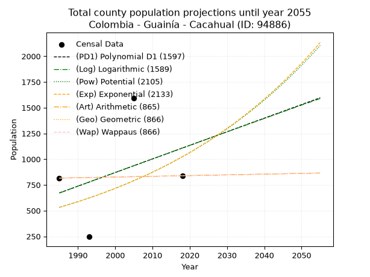
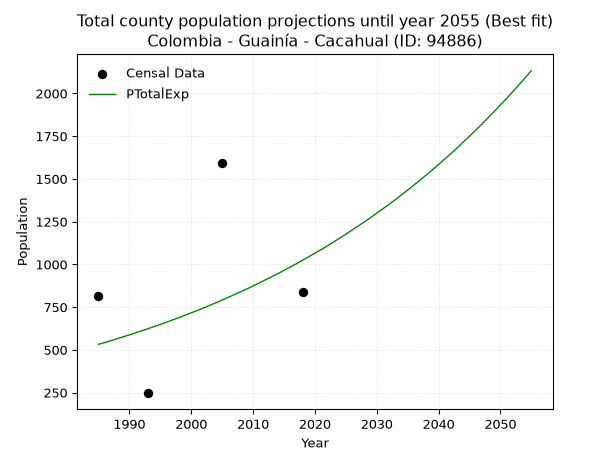
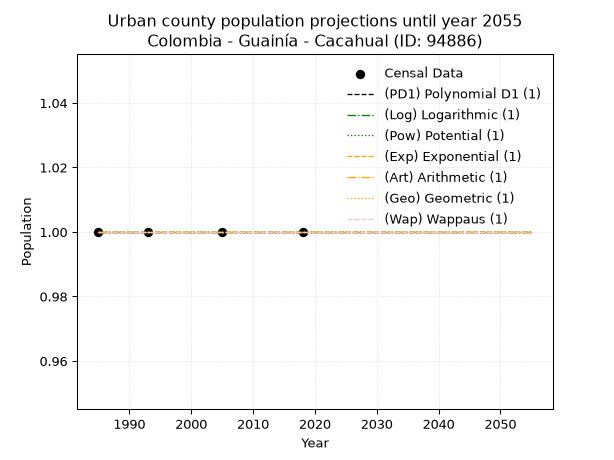
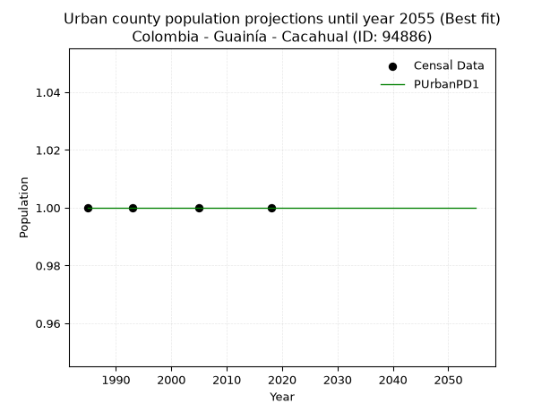

<div align="center">


</div>

# _“Population and Public Services Demand Projections (PPSD) until Year 2050 for Colombia - Guainía - Cacahual (ANM) (ID: 94886)”_
Keywords: `population` `public-service` `projection` `lineal` `polynomial` `logarithmic` `potential` `exponential` `arithmetic` `geometric` `wappaus` `dane` `colombia` `south-america`

PPSD are analytical estimates used by governments and planners to anticipate future changes in population size, age distribution, and the resulting community needs for utilities, healthcare, education, and infrastructure as sizing future water treatment facilities, electrical grids, and road networks based on spatial growth.

> **General running parameters**: • app_version: _v20260806_. • Python version: _3.14.7_. • Pandas version: _3.0.5_. • NumPy version: _2.5.1_. • Creates, save and include plots into reports (create_plot): _True_. • Projection until year: _2050_. • Process polynomial degree 2 and up: _False_. • Process Wappaus: _True_. • Process Wappaus: _True_. • Set negative values to zero: _True_. • Set infinite values to zero: _True_. • Drop dataset notes: _True_. 
<div align="center">

Dynamic map: [:earth_americas:Google](http://maps.google.com/maps?q=3.385281775,-67.5858874) [:earth_americas:OSM](https://www.openstreetmap.org/#map=18/3.385281775/-67.5858874&layers=P) [:earth_americas:Bing](https://www.bing.com/maps?cp=3.385281775~-67.5858874&lvl=18) [:earth_americas:Apple](https://maps.apple.com/frame?center=3.385281775%2C-67.5858874&span=0.003%2C0.006)

</div>


<div align="center">

```geojson
{
  "type": "Feature",
  "geometry": {
    "type": "Point", 
    "coordinates": [-67.5858874, 3.385281775]
  }, 
  "properties": {
    "Name": "Colombia - Guainía - Cacahual (ANM) (ID: 94886)"
  }
}
```

</div>


## 0. Census Data (4 records)

Census data are official statistics collected by a government about the people and housing in a country. They usually include counts of total population, age, sex, race, income, education, and jobs.

📅Global census file: [Population.xlsx](../data/Population.xlsx)

| Source   |   Year |   CountryID | CountryName   |   StateID | StateName   |   CountyID | CountyName     |   PTotal |   PUrban |   PRural |
|:---------|-------:|------------:|:--------------|----------:|:------------|-----------:|:---------------|---------:|---------:|---------:|
| DANE     |   1985 |          57 | Colombia      |        94 | Guainía     |      94886 | Cacahual (ANM) |      816 |        1 |      816 |
| DANE     |   1993 |          57 | Colombia      |        94 | Guainía     |      94886 | Cacahual       |      246 |        1 |      246 |
| DANE     |   2005 |          57 | Colombia      |        94 | Guainía     |      94886 | Cacahual       |     1592 |        1 |     1592 |
| DANE     |   2018 |          57 | Colombia      |        94 | Guainía     |      94886 | Cacahual       |      839 |        1 |      839 |

> 🔥Some records could had specific notes about the registered values or the corresponding urban or rural distribution.

## 1. Total

### 1.1. Coefficients and Parameters

* (PD1) Polynomial Deg 1: 13.210357286230826, -25550.76716178321 (lineal)
* (Log) Logarithmic: 26493.330139598944, -200502.76469531533
* (Pow) Potential: 39.72752937257949, -128.28650470953042
* (Exp) Exponential: 0.019849558782017517, 4.109791026666398e-15
* (Art) Arithmetic: Year diff. 2018 - 1985 = 33, Population diff. 839 - 816 = 23, Annual growth = 0.696969696969697
* (Geo) Geometric: Year diff. 2018 - 1985 = 33, Population diff. 839 - 816 = 23, Annual growth % = 0.0008426685277049817
* (Wap) Wappaus: i = 0.08422594525313559, Condition values only valid for < 200)

<sub>
Wappaus condition values: ['0.00', '0.08', '0.17', '0.25', '0.34', '0.42', '0.51', '0.59', '0.67', '0.76', '0.84', '0.93', '1.01', '1.09', '1.18', '1.26', '1.35', '1.43', '1.52', '1.60', '1.68', '1.77', '1.85', '1.94', '2.02', '2.11', '2.19', '2.27', '2.36', '2.44', '2.53', '2.61', '2.70', '2.78', '2.86', '2.95', '3.03', '3.12', '3.20', '3.28', '3.37', '3.45', '3.54', '3.62', '3.71', '3.79', '3.87', '3.96', '4.04', '4.13', '4.21', '4.30', '4.38', '4.46', '4.55', '4.63', '4.72', '4.80', '4.89', '4.97', '5.05', '5.14', '5.22', '5.31', '5.39', '5.47']
</sub>


### 1.2. Projected Dataset

|   Year |   CountyID |   PTotalPD1 |   PTotalLog |   PTotalPow |   PTotalExp |   PTotalArt |   PTotalGeo |   PTotalWap |
|-------:|-----------:|------------:|------------:|------------:|------------:|------------:|------------:|------------:|
|   1985 |      94886 |         672 |         671 |         531 |         532 |         816 |         816 |         816 |
|   1986 |      94886 |         685 |         684 |         542 |         542 |         817 |         817 |         817 |
|   1987 |      94886 |         698 |         698 |         553 |         553 |         817 |         817 |         817 |
|   1988 |      94886 |         711 |         711 |         564 |         564 |         818 |         818 |         818 |
|   1989 |      94886 |         725 |         724 |         576 |         576 |         819 |         819 |         819 |
|   1990 |      94886 |         738 |         738 |         587 |         587 |         819 |         819 |         819 |
|   1991 |      94886 |         751 |         751 |         599 |         599 |         820 |         820 |         820 |
|   1992 |      94886 |         764 |         764 |         611 |         611 |         821 |         821 |         821 |
|   1993 |      94886 |         777 |         778 |         623 |         623 |         822 |         822 |         822 |
|   1994 |      94886 |         791 |         791 |         636 |         636 |         822 |         822 |         822 |
|   1995 |      94886 |         804 |         804 |         649 |         648 |         823 |         823 |         823 |
|   1996 |      94886 |         817 |         817 |         662 |         661 |         824 |         824 |         824 |
|   1997 |      94886 |         830 |         831 |         675 |         675 |         824 |         824 |         824 |
|   1998 |      94886 |         844 |         844 |         689 |         688 |         825 |         825 |         825 |
|   1999 |      94886 |         857 |         857 |         702 |         702 |         826 |         826 |         826 |
|   2000 |      94886 |         870 |         870 |         717 |         716 |         826 |         826 |         826 |
|   2001 |      94886 |         883 |         884 |         731 |         730 |         827 |         827 |         827 |
|   2002 |      94886 |         896 |         897 |         746 |         745 |         828 |         828 |         828 |
|   2003 |      94886 |         910 |         910 |         761 |         760 |         829 |         828 |         828 |
|   2004 |      94886 |         923 |         923 |         776 |         775 |         829 |         829 |         829 |
|   2005 |      94886 |         936 |         937 |         791 |         791 |         830 |         830 |         830 |
|   2006 |      94886 |         949 |         950 |         807 |         807 |         831 |         831 |         831 |
|   2007 |      94886 |         962 |         963 |         823 |         823 |         831 |         831 |         831 |
|   2008 |      94886 |         976 |         976 |         840 |         839 |         832 |         832 |         832 |
|   2009 |      94886 |         989 |         989 |         857 |         856 |         833 |         833 |         833 |
|   2010 |      94886 |        1002 |        1003 |         874 |         873 |         833 |         833 |         833 |
|   2011 |      94886 |        1015 |        1016 |         891 |         891 |         834 |         834 |         834 |
|   2012 |      94886 |        1028 |        1029 |         909 |         909 |         835 |         835 |         835 |
|   2013 |      94886 |        1042 |        1042 |         927 |         927 |         836 |         835 |         835 |
|   2014 |      94886 |        1055 |        1055 |         945 |         945 |         836 |         836 |         836 |
|   2015 |      94886 |        1068 |        1068 |         964 |         964 |         837 |         837 |         837 |
|   2016 |      94886 |        1081 |        1082 |         983 |         984 |         838 |         838 |         838 |
|   2017 |      94886 |        1095 |        1095 |        1003 |        1003 |         838 |         838 |         838 |
|   2018 |      94886 |        1108 |        1108 |        1023 |        1024 |         839 |         839 |         839 |
|   2019 |      94886 |        1121 |        1121 |        1043 |        1044 |         840 |         840 |         840 |
|   2020 |      94886 |        1134 |        1134 |        1064 |        1065 |         840 |         840 |         840 |
|   2021 |      94886 |        1147 |        1147 |        1085 |        1086 |         841 |         841 |         841 |
|   2022 |      94886 |        1161 |        1160 |        1107 |        1108 |         842 |         842 |         842 |
|   2023 |      94886 |        1174 |        1173 |        1129 |        1130 |         842 |         843 |         843 |
|   2024 |      94886 |        1187 |        1186 |        1151 |        1153 |         843 |         843 |         843 |
|   2025 |      94886 |        1200 |        1200 |        1174 |        1176 |         844 |         844 |         844 |
|   2026 |      94886 |        1213 |        1213 |        1197 |        1200 |         845 |         845 |         845 |
|   2027 |      94886 |        1227 |        1226 |        1221 |        1224 |         845 |         845 |         845 |
|   2028 |      94886 |        1240 |        1239 |        1245 |        1248 |         846 |         846 |         846 |
|   2029 |      94886 |        1253 |        1252 |        1270 |        1273 |         847 |         847 |         847 |
|   2030 |      94886 |        1266 |        1265 |        1295 |        1299 |         847 |         848 |         848 |
|   2031 |      94886 |        1279 |        1278 |        1320 |        1325 |         848 |         848 |         848 |
|   2032 |      94886 |        1293 |        1291 |        1346 |        1351 |         849 |         849 |         849 |
|   2033 |      94886 |        1306 |        1304 |        1373 |        1378 |         849 |         850 |         850 |
|   2034 |      94886 |        1319 |        1317 |        1400 |        1406 |         850 |         850 |         850 |
|   2035 |      94886 |        1332 |        1330 |        1428 |        1434 |         851 |         851 |         851 |
|   2036 |      94886 |        1346 |        1343 |        1456 |        1463 |         852 |         852 |         852 |
|   2037 |      94886 |        1359 |        1356 |        1484 |        1492 |         852 |         853 |         853 |
|   2038 |      94886 |        1372 |        1369 |        1514 |        1522 |         853 |         853 |         853 |
|   2039 |      94886 |        1385 |        1382 |        1543 |        1553 |         854 |         854 |         854 |
|   2040 |      94886 |        1398 |        1395 |        1574 |        1584 |         854 |         855 |         855 |
|   2041 |      94886 |        1412 |        1408 |        1605 |        1616 |         855 |         855 |         855 |
|   2042 |      94886 |        1425 |        1421 |        1636 |        1648 |         856 |         856 |         856 |
|   2043 |      94886 |        1438 |        1434 |        1668 |        1681 |         856 |         857 |         857 |
|   2044 |      94886 |        1451 |        1447 |        1701 |        1715 |         857 |         858 |         858 |
|   2045 |      94886 |        1464 |        1460 |        1734 |        1749 |         858 |         858 |         858 |
|   2046 |      94886 |        1478 |        1473 |        1768 |        1784 |         859 |         859 |         859 |
|   2047 |      94886 |        1491 |        1486 |        1803 |        1820 |         859 |         860 |         860 |
|   2048 |      94886 |        1504 |        1499 |        1838 |        1857 |         860 |         860 |         860 |
|   2049 |      94886 |        1517 |        1512 |        1874 |        1894 |         861 |         861 |         861 |
|   2050 |      94886 |        1530 |        1525 |        1911 |        1932 |         861 |         862 |         862 |
<div align="center">

</img>

</div>


### 1.3. Best fit with absolute error and relative error (%)

Relative error puts that difference into context by dividing the absolute error by the true value, creating a unitless ratio or percentage that shows the scale of the mistake.

Absolute and relative error

|   Year | Source   |   CountryID | CountryName   |   StateID | StateName   |   CountyID_x | CountyName     |   PTotal |   PUrban |   PRural |   CountyID_y |   PTotalPD1 |   PTotalLog |   PTotalPow |   PTotalExp |   PTotalArt |   PTotalGeo |   PTotalWap |   PTotalPD1AbsError |   PTotalLogAbsError |   PTotalPowAbsError |   PTotalExpAbsError |   PTotalArtAbsError |   PTotalGeoAbsError |   PTotalWapAbsError |   PTotalPD1RelError |   PTotalLogRelError |   PTotalPowRelError |   PTotalExpRelError |   PTotalArtRelError |   PTotalGeoRelError |   PTotalWapRelError |
|-------:|:---------|------------:|:--------------|----------:|:------------|-------------:|:---------------|---------:|---------:|---------:|-------------:|------------:|------------:|------------:|------------:|------------:|------------:|------------:|--------------------:|--------------------:|--------------------:|--------------------:|--------------------:|--------------------:|--------------------:|--------------------:|--------------------:|--------------------:|--------------------:|--------------------:|--------------------:|--------------------:|
|   1985 | DANE     |          57 | Colombia      |        94 | Guainía     |        94886 | Cacahual (ANM) |      816 |        1 |      816 |        94886 |         672 |         671 |         531 |         532 |         816 |         816 |         816 |                 144 |                 145 |                 285 |                 284 |                   0 |                   0 |                   0 |             17.6471 |             17.7696 |             34.9265 |             34.8039 |              0      |              0      |              0      |
|   1993 | DANE     |          57 | Colombia      |        94 | Guainía     |        94886 | Cacahual       |      246 |        1 |      246 |        94886 |         777 |         778 |         623 |         623 |         822 |         822 |         822 |                 531 |                 532 |                 377 |                 377 |                 576 |                 576 |                 576 |            215.854  |            216.26   |            153.252  |            153.252  |            234.146  |            234.146  |            234.146  |
|   2005 | DANE     |          57 | Colombia      |        94 | Guainía     |        94886 | Cacahual       |     1592 |        1 |     1592 |        94886 |         936 |         937 |         791 |         791 |         830 |         830 |         830 |                 656 |                 655 |                 801 |                 801 |                 762 |                 762 |                 762 |             41.206  |             41.1432 |             50.3141 |             50.3141 |             47.8643 |             47.8643 |             47.8643 |
|   2018 | DANE     |          57 | Colombia      |        94 | Guainía     |        94886 | Cacahual       |      839 |        1 |      839 |        94886 |        1108 |        1108 |        1023 |        1024 |         839 |         839 |         839 |                 269 |                 269 |                 184 |                 185 |                   0 |                   0 |                   0 |             32.062  |             32.062  |             21.9309 |             22.0501 |              0      |              0      |              0      |

Relative error mean

| Method    |   RelError | Best   |
|:----------|-----------:|:-------|
| PTotalPD1 |    76.6922 |        |
| PTotalLog |    76.8087 |        |
| PTotalPow |    65.1059 |        |
| PTotalExp |    65.105  | True   |
| PTotalArt |    70.5027 |        |
| PTotalGeo |    70.5027 |        |
| PTotalWap |    70.5027 |        |

💙Best method: _**PTotalExp**_
<div align="center">

</img>

</div>


### 1.4. Fresh water supply demand in liters per capita per day (lpcd)

The fresh water supply demand typically ranges from 100 to 300 liters per capita per day (lpcd) for standard domestic and municipal planning, though absolute survival minimums set by the World Health Organization are as low as 7.5 to 20 liters per day, and total consumption in high-income nations can exceed 400 liters.

> `CZ`: Level in meters above the sea level (masl).<br> `WS`: Fresh water supply demand in liters per capita per day (lpcd or l/h/d).<br> `WSAll`: Zonal fresh water supply demand in liters per second (l/s).<br> `A`: Zonal area in square meters.

Reference values (RAS Colombia)

|    CZ |   WS |
|------:|-----:|
|  1000 |  120 |
|  2000 |  130 |
| 99999 |  140 |

County shapefile geometry properties and water supply values

|   CountyID |      ATotal |   CZTotal |   WSTotal |
|-----------:|------------:|----------:|----------:|
|      94886 | 2.31068e+09 |   101.678 |       120 |

Projected values for best method: PTotalExp

|   CountyID |   Year |   PTotalExp |   WSTotal |   WSTotalAll |
|-----------:|-------:|------------:|----------:|-------------:|
|      94886 |   1985 |         532 |       120 |     0.738889 |
|      94886 |   1986 |         542 |       120 |     0.752778 |
|      94886 |   1987 |         553 |       120 |     0.768056 |
|      94886 |   1988 |         564 |       120 |     0.783333 |
|      94886 |   1989 |         576 |       120 |     0.8      |
|      94886 |   1990 |         587 |       120 |     0.815278 |
|      94886 |   1991 |         599 |       120 |     0.831944 |
|      94886 |   1992 |         611 |       120 |     0.848611 |
|      94886 |   1993 |         623 |       120 |     0.865278 |
|      94886 |   1994 |         636 |       120 |     0.883333 |
|      94886 |   1995 |         648 |       120 |     0.9      |
|      94886 |   1996 |         661 |       120 |     0.918056 |
|      94886 |   1997 |         675 |       120 |     0.9375   |
|      94886 |   1998 |         688 |       120 |     0.955556 |
|      94886 |   1999 |         702 |       120 |     0.975    |
|      94886 |   2000 |         716 |       120 |     0.994444 |
|      94886 |   2001 |         730 |       120 |     1.01389  |
|      94886 |   2002 |         745 |       120 |     1.03472  |
|      94886 |   2003 |         760 |       120 |     1.05556  |
|      94886 |   2004 |         775 |       120 |     1.07639  |
|      94886 |   2005 |         791 |       120 |     1.09861  |
|      94886 |   2006 |         807 |       120 |     1.12083  |
|      94886 |   2007 |         823 |       120 |     1.14306  |
|      94886 |   2008 |         839 |       120 |     1.16528  |
|      94886 |   2009 |         856 |       120 |     1.18889  |
|      94886 |   2010 |         873 |       120 |     1.2125   |
|      94886 |   2011 |         891 |       120 |     1.2375   |
|      94886 |   2012 |         909 |       120 |     1.2625   |
|      94886 |   2013 |         927 |       120 |     1.2875   |
|      94886 |   2014 |         945 |       120 |     1.3125   |
|      94886 |   2015 |         964 |       120 |     1.33889  |
|      94886 |   2016 |         984 |       120 |     1.36667  |
|      94886 |   2017 |        1003 |       120 |     1.39306  |
|      94886 |   2018 |        1024 |       120 |     1.42222  |
|      94886 |   2019 |        1044 |       120 |     1.45     |
|      94886 |   2020 |        1065 |       120 |     1.47917  |
|      94886 |   2021 |        1086 |       120 |     1.50833  |
|      94886 |   2022 |        1108 |       120 |     1.53889  |
|      94886 |   2023 |        1130 |       120 |     1.56944  |
|      94886 |   2024 |        1153 |       120 |     1.60139  |
|      94886 |   2025 |        1176 |       120 |     1.63333  |
|      94886 |   2026 |        1200 |       120 |     1.66667  |
|      94886 |   2027 |        1224 |       120 |     1.7      |
|      94886 |   2028 |        1248 |       120 |     1.73333  |
|      94886 |   2029 |        1273 |       120 |     1.76806  |
|      94886 |   2030 |        1299 |       120 |     1.80417  |
|      94886 |   2031 |        1325 |       120 |     1.84028  |
|      94886 |   2032 |        1351 |       120 |     1.87639  |
|      94886 |   2033 |        1378 |       120 |     1.91389  |
|      94886 |   2034 |        1406 |       120 |     1.95278  |
|      94886 |   2035 |        1434 |       120 |     1.99167  |
|      94886 |   2036 |        1463 |       120 |     2.03194  |
|      94886 |   2037 |        1492 |       120 |     2.07222  |
|      94886 |   2038 |        1522 |       120 |     2.11389  |
|      94886 |   2039 |        1553 |       120 |     2.15694  |
|      94886 |   2040 |        1584 |       120 |     2.2      |
|      94886 |   2041 |        1616 |       120 |     2.24444  |
|      94886 |   2042 |        1648 |       120 |     2.28889  |
|      94886 |   2043 |        1681 |       120 |     2.33472  |
|      94886 |   2044 |        1715 |       120 |     2.38194  |
|      94886 |   2045 |        1749 |       120 |     2.42917  |
|      94886 |   2046 |        1784 |       120 |     2.47778  |
|      94886 |   2047 |        1820 |       120 |     2.52778  |
|      94886 |   2048 |        1857 |       120 |     2.57917  |
|      94886 |   2049 |        1894 |       120 |     2.63056  |
|      94886 |   2050 |        1932 |       120 |     2.68333  |

## 2. Urban

### 2.1. Coefficients and Parameters

* (PD1) Polynomial Deg 1: -1.3233529347183512e-19, 1.0000000000000004 (lineal)
* (Log) Logarithmic: 3.215569112241165e-17, 0.9999999999999996
* (Pow) Potential: 0.0, 0.0
* (Exp) Exponential: 0.0, 1.0
* (Art) Arithmetic: Year diff. 2018 - 1985 = 33, Population diff. 1 - 1 = 0, Annual growth = 0.0
* (Geo) Geometric: Year diff. 2018 - 1985 = 33, Population diff. 1 - 1 = 0, Annual growth % = 0.0
* (Wap) Wappaus: i = 0.0, Condition values only valid for < 200)

<sub>
Wappaus condition values: ['0.00', '0.00', '0.00', '0.00', '0.00', '0.00', '0.00', '0.00', '0.00', '0.00', '0.00', '0.00', '0.00', '0.00', '0.00', '0.00', '0.00', '0.00', '0.00', '0.00', '0.00', '0.00', '0.00', '0.00', '0.00', '0.00', '0.00', '0.00', '0.00', '0.00', '0.00', '0.00', '0.00', '0.00', '0.00', '0.00', '0.00', '0.00', '0.00', '0.00', '0.00', '0.00', '0.00', '0.00', '0.00', '0.00', '0.00', '0.00', '0.00', '0.00', '0.00', '0.00', '0.00', '0.00', '0.00', '0.00', '0.00', '0.00', '0.00', '0.00', '0.00', '0.00', '0.00', '0.00', '0.00', '0.00']
</sub>


### 2.2. Projected Dataset

|   Year |   CountyID |   PUrbanPD1 |   PUrbanLog |   PUrbanPow |   PUrbanExp |   PUrbanArt |   PUrbanGeo |   PUrbanWap |
|-------:|-----------:|------------:|------------:|------------:|------------:|------------:|------------:|------------:|
|   1985 |      94886 |           1 |           1 |           1 |           1 |           1 |           1 |           1 |
|   1986 |      94886 |           1 |           1 |           1 |           1 |           1 |           1 |           1 |
|   1987 |      94886 |           1 |           1 |           1 |           1 |           1 |           1 |           1 |
|   1988 |      94886 |           1 |           1 |           1 |           1 |           1 |           1 |           1 |
|   1989 |      94886 |           1 |           1 |           1 |           1 |           1 |           1 |           1 |
|   1990 |      94886 |           1 |           1 |           1 |           1 |           1 |           1 |           1 |
|   1991 |      94886 |           1 |           1 |           1 |           1 |           1 |           1 |           1 |
|   1992 |      94886 |           1 |           1 |           1 |           1 |           1 |           1 |           1 |
|   1993 |      94886 |           1 |           1 |           1 |           1 |           1 |           1 |           1 |
|   1994 |      94886 |           1 |           1 |           1 |           1 |           1 |           1 |           1 |
|   1995 |      94886 |           1 |           1 |           1 |           1 |           1 |           1 |           1 |
|   1996 |      94886 |           1 |           1 |           1 |           1 |           1 |           1 |           1 |
|   1997 |      94886 |           1 |           1 |           1 |           1 |           1 |           1 |           1 |
|   1998 |      94886 |           1 |           1 |           1 |           1 |           1 |           1 |           1 |
|   1999 |      94886 |           1 |           1 |           1 |           1 |           1 |           1 |           1 |
|   2000 |      94886 |           1 |           1 |           1 |           1 |           1 |           1 |           1 |
|   2001 |      94886 |           1 |           1 |           1 |           1 |           1 |           1 |           1 |
|   2002 |      94886 |           1 |           1 |           1 |           1 |           1 |           1 |           1 |
|   2003 |      94886 |           1 |           1 |           1 |           1 |           1 |           1 |           1 |
|   2004 |      94886 |           1 |           1 |           1 |           1 |           1 |           1 |           1 |
|   2005 |      94886 |           1 |           1 |           1 |           1 |           1 |           1 |           1 |
|   2006 |      94886 |           1 |           1 |           1 |           1 |           1 |           1 |           1 |
|   2007 |      94886 |           1 |           1 |           1 |           1 |           1 |           1 |           1 |
|   2008 |      94886 |           1 |           1 |           1 |           1 |           1 |           1 |           1 |
|   2009 |      94886 |           1 |           1 |           1 |           1 |           1 |           1 |           1 |
|   2010 |      94886 |           1 |           1 |           1 |           1 |           1 |           1 |           1 |
|   2011 |      94886 |           1 |           1 |           1 |           1 |           1 |           1 |           1 |
|   2012 |      94886 |           1 |           1 |           1 |           1 |           1 |           1 |           1 |
|   2013 |      94886 |           1 |           1 |           1 |           1 |           1 |           1 |           1 |
|   2014 |      94886 |           1 |           1 |           1 |           1 |           1 |           1 |           1 |
|   2015 |      94886 |           1 |           1 |           1 |           1 |           1 |           1 |           1 |
|   2016 |      94886 |           1 |           1 |           1 |           1 |           1 |           1 |           1 |
|   2017 |      94886 |           1 |           1 |           1 |           1 |           1 |           1 |           1 |
|   2018 |      94886 |           1 |           1 |           1 |           1 |           1 |           1 |           1 |
|   2019 |      94886 |           1 |           1 |           1 |           1 |           1 |           1 |           1 |
|   2020 |      94886 |           1 |           1 |           1 |           1 |           1 |           1 |           1 |
|   2021 |      94886 |           1 |           1 |           1 |           1 |           1 |           1 |           1 |
|   2022 |      94886 |           1 |           1 |           1 |           1 |           1 |           1 |           1 |
|   2023 |      94886 |           1 |           1 |           1 |           1 |           1 |           1 |           1 |
|   2024 |      94886 |           1 |           1 |           1 |           1 |           1 |           1 |           1 |
|   2025 |      94886 |           1 |           1 |           1 |           1 |           1 |           1 |           1 |
|   2026 |      94886 |           1 |           1 |           1 |           1 |           1 |           1 |           1 |
|   2027 |      94886 |           1 |           1 |           1 |           1 |           1 |           1 |           1 |
|   2028 |      94886 |           1 |           1 |           1 |           1 |           1 |           1 |           1 |
|   2029 |      94886 |           1 |           1 |           1 |           1 |           1 |           1 |           1 |
|   2030 |      94886 |           1 |           1 |           1 |           1 |           1 |           1 |           1 |
|   2031 |      94886 |           1 |           1 |           1 |           1 |           1 |           1 |           1 |
|   2032 |      94886 |           1 |           1 |           1 |           1 |           1 |           1 |           1 |
|   2033 |      94886 |           1 |           1 |           1 |           1 |           1 |           1 |           1 |
|   2034 |      94886 |           1 |           1 |           1 |           1 |           1 |           1 |           1 |
|   2035 |      94886 |           1 |           1 |           1 |           1 |           1 |           1 |           1 |
|   2036 |      94886 |           1 |           1 |           1 |           1 |           1 |           1 |           1 |
|   2037 |      94886 |           1 |           1 |           1 |           1 |           1 |           1 |           1 |
|   2038 |      94886 |           1 |           1 |           1 |           1 |           1 |           1 |           1 |
|   2039 |      94886 |           1 |           1 |           1 |           1 |           1 |           1 |           1 |
|   2040 |      94886 |           1 |           1 |           1 |           1 |           1 |           1 |           1 |
|   2041 |      94886 |           1 |           1 |           1 |           1 |           1 |           1 |           1 |
|   2042 |      94886 |           1 |           1 |           1 |           1 |           1 |           1 |           1 |
|   2043 |      94886 |           1 |           1 |           1 |           1 |           1 |           1 |           1 |
|   2044 |      94886 |           1 |           1 |           1 |           1 |           1 |           1 |           1 |
|   2045 |      94886 |           1 |           1 |           1 |           1 |           1 |           1 |           1 |
|   2046 |      94886 |           1 |           1 |           1 |           1 |           1 |           1 |           1 |
|   2047 |      94886 |           1 |           1 |           1 |           1 |           1 |           1 |           1 |
|   2048 |      94886 |           1 |           1 |           1 |           1 |           1 |           1 |           1 |
|   2049 |      94886 |           1 |           1 |           1 |           1 |           1 |           1 |           1 |
|   2050 |      94886 |           1 |           1 |           1 |           1 |           1 |           1 |           1 |
<div align="center">

</img>

</div>


### 2.3. Best fit with absolute error and relative error (%)

Relative error puts that difference into context by dividing the absolute error by the true value, creating a unitless ratio or percentage that shows the scale of the mistake.

Absolute and relative error

|   Year | Source   |   CountryID | CountryName   |   StateID | StateName   |   CountyID_x | CountyName     |   PTotal |   PUrban |   PRural |   CountyID_y |   PUrbanPD1 |   PUrbanLog |   PUrbanPow |   PUrbanExp |   PUrbanArt |   PUrbanGeo |   PUrbanWap |   PUrbanPD1AbsError |   PUrbanLogAbsError |   PUrbanPowAbsError |   PUrbanExpAbsError |   PUrbanArtAbsError |   PUrbanGeoAbsError |   PUrbanWapAbsError |   PUrbanPD1RelError |   PUrbanLogRelError |   PUrbanPowRelError |   PUrbanExpRelError |   PUrbanArtRelError |   PUrbanGeoRelError |   PUrbanWapRelError |
|-------:|:---------|------------:|:--------------|----------:|:------------|-------------:|:---------------|---------:|---------:|---------:|-------------:|------------:|------------:|------------:|------------:|------------:|------------:|------------:|--------------------:|--------------------:|--------------------:|--------------------:|--------------------:|--------------------:|--------------------:|--------------------:|--------------------:|--------------------:|--------------------:|--------------------:|--------------------:|--------------------:|
|   1985 | DANE     |          57 | Colombia      |        94 | Guainía     |        94886 | Cacahual (ANM) |      816 |        1 |      816 |        94886 |           1 |           1 |           1 |           1 |           1 |           1 |           1 |                   0 |                   0 |                   0 |                   0 |                   0 |                   0 |                   0 |                   0 |                   0 |                   0 |                   0 |                   0 |                   0 |                   0 |
|   1993 | DANE     |          57 | Colombia      |        94 | Guainía     |        94886 | Cacahual       |      246 |        1 |      246 |        94886 |           1 |           1 |           1 |           1 |           1 |           1 |           1 |                   0 |                   0 |                   0 |                   0 |                   0 |                   0 |                   0 |                   0 |                   0 |                   0 |                   0 |                   0 |                   0 |                   0 |
|   2005 | DANE     |          57 | Colombia      |        94 | Guainía     |        94886 | Cacahual       |     1592 |        1 |     1592 |        94886 |           1 |           1 |           1 |           1 |           1 |           1 |           1 |                   0 |                   0 |                   0 |                   0 |                   0 |                   0 |                   0 |                   0 |                   0 |                   0 |                   0 |                   0 |                   0 |                   0 |
|   2018 | DANE     |          57 | Colombia      |        94 | Guainía     |        94886 | Cacahual       |      839 |        1 |      839 |        94886 |           1 |           1 |           1 |           1 |           1 |           1 |           1 |                   0 |                   0 |                   0 |                   0 |                   0 |                   0 |                   0 |                   0 |                   0 |                   0 |                   0 |                   0 |                   0 |                   0 |

Relative error mean

| Method    |   RelError | Best   |
|:----------|-----------:|:-------|
| PUrbanPD1 |          0 | True   |
| PUrbanLog |          0 | True   |
| PUrbanPow |          0 | True   |
| PUrbanExp |          0 | True   |
| PUrbanArt |          0 | True   |
| PUrbanGeo |          0 | True   |
| PUrbanWap |          0 | True   |

💙Best method: _**PUrbanPD1**_
<div align="center">

</img>

</div>


### 2.4. Fresh water supply demand in liters per capita per day (lpcd)

The fresh water supply demand typically ranges from 100 to 300 liters per capita per day (lpcd) for standard domestic and municipal planning, though absolute survival minimums set by the World Health Organization are as low as 7.5 to 20 liters per day, and total consumption in high-income nations can exceed 400 liters.

> `CZ`: Level in meters above the sea level (masl).<br> `WS`: Fresh water supply demand in liters per capita per day (lpcd or l/h/d).<br> `WSAll`: Zonal fresh water supply demand in liters per second (l/s).<br> `A`: Zonal area in square meters.

Reference values (RAS Colombia)

|    CZ |   WS |
|------:|-----:|
|  1000 |  120 |
|  2000 |  130 |
| 99999 |  140 |

County shapefile geometry properties and water supply values

|   CountyID |   AUrban |   CZUrban |   WSUrban |
|-----------:|---------:|----------:|----------:|
|      94886 |        0 |         0 |       120 |

Projected values for best method: PUrbanPD1

|   CountyID |   Year |   PUrbanPD1 |   WSUrban |   WSUrbanAll |
|-----------:|-------:|------------:|----------:|-------------:|
|      94886 |   1985 |           1 |       120 |   0.00138889 |
|      94886 |   1986 |           1 |       120 |   0.00138889 |
|      94886 |   1987 |           1 |       120 |   0.00138889 |
|      94886 |   1988 |           1 |       120 |   0.00138889 |
|      94886 |   1989 |           1 |       120 |   0.00138889 |
|      94886 |   1990 |           1 |       120 |   0.00138889 |
|      94886 |   1991 |           1 |       120 |   0.00138889 |
|      94886 |   1992 |           1 |       120 |   0.00138889 |
|      94886 |   1993 |           1 |       120 |   0.00138889 |
|      94886 |   1994 |           1 |       120 |   0.00138889 |
|      94886 |   1995 |           1 |       120 |   0.00138889 |
|      94886 |   1996 |           1 |       120 |   0.00138889 |
|      94886 |   1997 |           1 |       120 |   0.00138889 |
|      94886 |   1998 |           1 |       120 |   0.00138889 |
|      94886 |   1999 |           1 |       120 |   0.00138889 |
|      94886 |   2000 |           1 |       120 |   0.00138889 |
|      94886 |   2001 |           1 |       120 |   0.00138889 |
|      94886 |   2002 |           1 |       120 |   0.00138889 |
|      94886 |   2003 |           1 |       120 |   0.00138889 |
|      94886 |   2004 |           1 |       120 |   0.00138889 |
|      94886 |   2005 |           1 |       120 |   0.00138889 |
|      94886 |   2006 |           1 |       120 |   0.00138889 |
|      94886 |   2007 |           1 |       120 |   0.00138889 |
|      94886 |   2008 |           1 |       120 |   0.00138889 |
|      94886 |   2009 |           1 |       120 |   0.00138889 |
|      94886 |   2010 |           1 |       120 |   0.00138889 |
|      94886 |   2011 |           1 |       120 |   0.00138889 |
|      94886 |   2012 |           1 |       120 |   0.00138889 |
|      94886 |   2013 |           1 |       120 |   0.00138889 |
|      94886 |   2014 |           1 |       120 |   0.00138889 |
|      94886 |   2015 |           1 |       120 |   0.00138889 |
|      94886 |   2016 |           1 |       120 |   0.00138889 |
|      94886 |   2017 |           1 |       120 |   0.00138889 |
|      94886 |   2018 |           1 |       120 |   0.00138889 |
|      94886 |   2019 |           1 |       120 |   0.00138889 |
|      94886 |   2020 |           1 |       120 |   0.00138889 |
|      94886 |   2021 |           1 |       120 |   0.00138889 |
|      94886 |   2022 |           1 |       120 |   0.00138889 |
|      94886 |   2023 |           1 |       120 |   0.00138889 |
|      94886 |   2024 |           1 |       120 |   0.00138889 |
|      94886 |   2025 |           1 |       120 |   0.00138889 |
|      94886 |   2026 |           1 |       120 |   0.00138889 |
|      94886 |   2027 |           1 |       120 |   0.00138889 |
|      94886 |   2028 |           1 |       120 |   0.00138889 |
|      94886 |   2029 |           1 |       120 |   0.00138889 |
|      94886 |   2030 |           1 |       120 |   0.00138889 |
|      94886 |   2031 |           1 |       120 |   0.00138889 |
|      94886 |   2032 |           1 |       120 |   0.00138889 |
|      94886 |   2033 |           1 |       120 |   0.00138889 |
|      94886 |   2034 |           1 |       120 |   0.00138889 |
|      94886 |   2035 |           1 |       120 |   0.00138889 |
|      94886 |   2036 |           1 |       120 |   0.00138889 |
|      94886 |   2037 |           1 |       120 |   0.00138889 |
|      94886 |   2038 |           1 |       120 |   0.00138889 |
|      94886 |   2039 |           1 |       120 |   0.00138889 |
|      94886 |   2040 |           1 |       120 |   0.00138889 |
|      94886 |   2041 |           1 |       120 |   0.00138889 |
|      94886 |   2042 |           1 |       120 |   0.00138889 |
|      94886 |   2043 |           1 |       120 |   0.00138889 |
|      94886 |   2044 |           1 |       120 |   0.00138889 |
|      94886 |   2045 |           1 |       120 |   0.00138889 |
|      94886 |   2046 |           1 |       120 |   0.00138889 |
|      94886 |   2047 |           1 |       120 |   0.00138889 |
|      94886 |   2048 |           1 |       120 |   0.00138889 |
|      94886 |   2049 |           1 |       120 |   0.00138889 |
|      94886 |   2050 |           1 |       120 |   0.00138889 |

## 3. Rural

### 3.1. Coefficients and Parameters

* (PD1) Polynomial Deg 1: 13.210357286230826, -25550.76716178321 (lineal)
* (Log) Logarithmic: 26493.330139598944, -200502.76469531533
* (Pow) Potential: 39.72752937257949, -128.28650470953042
* (Exp) Exponential: 0.019849558782017517, 4.109791026666398e-15
* (Art) Arithmetic: Year diff. 2018 - 1985 = 33, Population diff. 839 - 816 = 23, Annual growth = 0.696969696969697
* (Geo) Geometric: Year diff. 2018 - 1985 = 33, Population diff. 839 - 816 = 23, Annual growth % = 0.0008426685277049817
* (Wap) Wappaus: i = 0.08422594525313559, Condition values only valid for < 200)

<sub>
Wappaus condition values: ['0.00', '0.08', '0.17', '0.25', '0.34', '0.42', '0.51', '0.59', '0.67', '0.76', '0.84', '0.93', '1.01', '1.09', '1.18', '1.26', '1.35', '1.43', '1.52', '1.60', '1.68', '1.77', '1.85', '1.94', '2.02', '2.11', '2.19', '2.27', '2.36', '2.44', '2.53', '2.61', '2.70', '2.78', '2.86', '2.95', '3.03', '3.12', '3.20', '3.28', '3.37', '3.45', '3.54', '3.62', '3.71', '3.79', '3.87', '3.96', '4.04', '4.13', '4.21', '4.30', '4.38', '4.46', '4.55', '4.63', '4.72', '4.80', '4.89', '4.97', '5.05', '5.14', '5.22', '5.31', '5.39', '5.47']
</sub>


### 3.2. Projected Dataset

|   Year |   CountyID |   PRuralPD1 |   PRuralLog |   PRuralPow |   PRuralExp |   PRuralArt |   PRuralGeo |   PRuralWap |
|-------:|-----------:|------------:|------------:|------------:|------------:|------------:|------------:|------------:|
|   1985 |      94886 |         672 |         671 |         531 |         532 |         816 |         816 |         816 |
|   1986 |      94886 |         685 |         684 |         542 |         542 |         817 |         817 |         817 |
|   1987 |      94886 |         698 |         698 |         553 |         553 |         817 |         817 |         817 |
|   1988 |      94886 |         711 |         711 |         564 |         564 |         818 |         818 |         818 |
|   1989 |      94886 |         725 |         724 |         576 |         576 |         819 |         819 |         819 |
|   1990 |      94886 |         738 |         738 |         587 |         587 |         819 |         819 |         819 |
|   1991 |      94886 |         751 |         751 |         599 |         599 |         820 |         820 |         820 |
|   1992 |      94886 |         764 |         764 |         611 |         611 |         821 |         821 |         821 |
|   1993 |      94886 |         777 |         778 |         623 |         623 |         822 |         822 |         822 |
|   1994 |      94886 |         791 |         791 |         636 |         636 |         822 |         822 |         822 |
|   1995 |      94886 |         804 |         804 |         649 |         648 |         823 |         823 |         823 |
|   1996 |      94886 |         817 |         817 |         662 |         661 |         824 |         824 |         824 |
|   1997 |      94886 |         830 |         831 |         675 |         675 |         824 |         824 |         824 |
|   1998 |      94886 |         844 |         844 |         689 |         688 |         825 |         825 |         825 |
|   1999 |      94886 |         857 |         857 |         702 |         702 |         826 |         826 |         826 |
|   2000 |      94886 |         870 |         870 |         717 |         716 |         826 |         826 |         826 |
|   2001 |      94886 |         883 |         884 |         731 |         730 |         827 |         827 |         827 |
|   2002 |      94886 |         896 |         897 |         746 |         745 |         828 |         828 |         828 |
|   2003 |      94886 |         910 |         910 |         761 |         760 |         829 |         828 |         828 |
|   2004 |      94886 |         923 |         923 |         776 |         775 |         829 |         829 |         829 |
|   2005 |      94886 |         936 |         937 |         791 |         791 |         830 |         830 |         830 |
|   2006 |      94886 |         949 |         950 |         807 |         807 |         831 |         831 |         831 |
|   2007 |      94886 |         962 |         963 |         823 |         823 |         831 |         831 |         831 |
|   2008 |      94886 |         976 |         976 |         840 |         839 |         832 |         832 |         832 |
|   2009 |      94886 |         989 |         989 |         857 |         856 |         833 |         833 |         833 |
|   2010 |      94886 |        1002 |        1003 |         874 |         873 |         833 |         833 |         833 |
|   2011 |      94886 |        1015 |        1016 |         891 |         891 |         834 |         834 |         834 |
|   2012 |      94886 |        1028 |        1029 |         909 |         909 |         835 |         835 |         835 |
|   2013 |      94886 |        1042 |        1042 |         927 |         927 |         836 |         835 |         835 |
|   2014 |      94886 |        1055 |        1055 |         945 |         945 |         836 |         836 |         836 |
|   2015 |      94886 |        1068 |        1068 |         964 |         964 |         837 |         837 |         837 |
|   2016 |      94886 |        1081 |        1082 |         983 |         984 |         838 |         838 |         838 |
|   2017 |      94886 |        1095 |        1095 |        1003 |        1003 |         838 |         838 |         838 |
|   2018 |      94886 |        1108 |        1108 |        1023 |        1024 |         839 |         839 |         839 |
|   2019 |      94886 |        1121 |        1121 |        1043 |        1044 |         840 |         840 |         840 |
|   2020 |      94886 |        1134 |        1134 |        1064 |        1065 |         840 |         840 |         840 |
|   2021 |      94886 |        1147 |        1147 |        1085 |        1086 |         841 |         841 |         841 |
|   2022 |      94886 |        1161 |        1160 |        1107 |        1108 |         842 |         842 |         842 |
|   2023 |      94886 |        1174 |        1173 |        1129 |        1130 |         842 |         843 |         843 |
|   2024 |      94886 |        1187 |        1186 |        1151 |        1153 |         843 |         843 |         843 |
|   2025 |      94886 |        1200 |        1200 |        1174 |        1176 |         844 |         844 |         844 |
|   2026 |      94886 |        1213 |        1213 |        1197 |        1200 |         845 |         845 |         845 |
|   2027 |      94886 |        1227 |        1226 |        1221 |        1224 |         845 |         845 |         845 |
|   2028 |      94886 |        1240 |        1239 |        1245 |        1248 |         846 |         846 |         846 |
|   2029 |      94886 |        1253 |        1252 |        1270 |        1273 |         847 |         847 |         847 |
|   2030 |      94886 |        1266 |        1265 |        1295 |        1299 |         847 |         848 |         848 |
|   2031 |      94886 |        1279 |        1278 |        1320 |        1325 |         848 |         848 |         848 |
|   2032 |      94886 |        1293 |        1291 |        1346 |        1351 |         849 |         849 |         849 |
|   2033 |      94886 |        1306 |        1304 |        1373 |        1378 |         849 |         850 |         850 |
|   2034 |      94886 |        1319 |        1317 |        1400 |        1406 |         850 |         850 |         850 |
|   2035 |      94886 |        1332 |        1330 |        1428 |        1434 |         851 |         851 |         851 |
|   2036 |      94886 |        1346 |        1343 |        1456 |        1463 |         852 |         852 |         852 |
|   2037 |      94886 |        1359 |        1356 |        1484 |        1492 |         852 |         853 |         853 |
|   2038 |      94886 |        1372 |        1369 |        1514 |        1522 |         853 |         853 |         853 |
|   2039 |      94886 |        1385 |        1382 |        1543 |        1553 |         854 |         854 |         854 |
|   2040 |      94886 |        1398 |        1395 |        1574 |        1584 |         854 |         855 |         855 |
|   2041 |      94886 |        1412 |        1408 |        1605 |        1616 |         855 |         855 |         855 |
|   2042 |      94886 |        1425 |        1421 |        1636 |        1648 |         856 |         856 |         856 |
|   2043 |      94886 |        1438 |        1434 |        1668 |        1681 |         856 |         857 |         857 |
|   2044 |      94886 |        1451 |        1447 |        1701 |        1715 |         857 |         858 |         858 |
|   2045 |      94886 |        1464 |        1460 |        1734 |        1749 |         858 |         858 |         858 |
|   2046 |      94886 |        1478 |        1473 |        1768 |        1784 |         859 |         859 |         859 |
|   2047 |      94886 |        1491 |        1486 |        1803 |        1820 |         859 |         860 |         860 |
|   2048 |      94886 |        1504 |        1499 |        1838 |        1857 |         860 |         860 |         860 |
|   2049 |      94886 |        1517 |        1512 |        1874 |        1894 |         861 |         861 |         861 |
|   2050 |      94886 |        1530 |        1525 |        1911 |        1932 |         861 |         862 |         862 |
<div align="center">

</img>

</div>


### 3.3. Best fit with absolute error and relative error (%)

Relative error puts that difference into context by dividing the absolute error by the true value, creating a unitless ratio or percentage that shows the scale of the mistake.

Absolute and relative error

|   Year | Source   |   CountryID | CountryName   |   StateID | StateName   |   CountyID_x | CountyName     |   PTotal |   PUrban |   PRural |   CountyID_y |   PRuralPD1 |   PRuralLog |   PRuralPow |   PRuralExp |   PRuralArt |   PRuralGeo |   PRuralWap |   PRuralPD1AbsError |   PRuralLogAbsError |   PRuralPowAbsError |   PRuralExpAbsError |   PRuralArtAbsError |   PRuralGeoAbsError |   PRuralWapAbsError |   PRuralPD1RelError |   PRuralLogRelError |   PRuralPowRelError |   PRuralExpRelError |   PRuralArtRelError |   PRuralGeoRelError |   PRuralWapRelError |
|-------:|:---------|------------:|:--------------|----------:|:------------|-------------:|:---------------|---------:|---------:|---------:|-------------:|------------:|------------:|------------:|------------:|------------:|------------:|------------:|--------------------:|--------------------:|--------------------:|--------------------:|--------------------:|--------------------:|--------------------:|--------------------:|--------------------:|--------------------:|--------------------:|--------------------:|--------------------:|--------------------:|
|   1985 | DANE     |          57 | Colombia      |        94 | Guainía     |        94886 | Cacahual (ANM) |      816 |        1 |      816 |        94886 |         672 |         671 |         531 |         532 |         816 |         816 |         816 |                 144 |                 145 |                 285 |                 284 |                   0 |                   0 |                   0 |             17.6471 |             17.7696 |             34.9265 |             34.8039 |              0      |              0      |              0      |
|   1993 | DANE     |          57 | Colombia      |        94 | Guainía     |        94886 | Cacahual       |      246 |        1 |      246 |        94886 |         777 |         778 |         623 |         623 |         822 |         822 |         822 |                 531 |                 532 |                 377 |                 377 |                 576 |                 576 |                 576 |            215.854  |            216.26   |            153.252  |            153.252  |            234.146  |            234.146  |            234.146  |
|   2005 | DANE     |          57 | Colombia      |        94 | Guainía     |        94886 | Cacahual       |     1592 |        1 |     1592 |        94886 |         936 |         937 |         791 |         791 |         830 |         830 |         830 |                 656 |                 655 |                 801 |                 801 |                 762 |                 762 |                 762 |             41.206  |             41.1432 |             50.3141 |             50.3141 |             47.8643 |             47.8643 |             47.8643 |
|   2018 | DANE     |          57 | Colombia      |        94 | Guainía     |        94886 | Cacahual       |      839 |        1 |      839 |        94886 |        1108 |        1108 |        1023 |        1024 |         839 |         839 |         839 |                 269 |                 269 |                 184 |                 185 |                   0 |                   0 |                   0 |             32.062  |             32.062  |             21.9309 |             22.0501 |              0      |              0      |              0      |

Relative error mean

| Method    |   RelError | Best   |
|:----------|-----------:|:-------|
| PRuralPD1 |    76.6922 |        |
| PRuralLog |    76.8087 |        |
| PRuralPow |    65.1059 |        |
| PRuralExp |    65.105  | True   |
| PRuralArt |    70.5027 |        |
| PRuralGeo |    70.5027 |        |
| PRuralWap |    70.5027 |        |

💙Best method: _**PRuralExp**_
<div align="center">

</img>

</div>


### 3.4. Fresh water supply demand in liters per capita per day (lpcd)

The fresh water supply demand typically ranges from 100 to 300 liters per capita per day (lpcd) for standard domestic and municipal planning, though absolute survival minimums set by the World Health Organization are as low as 7.5 to 20 liters per day, and total consumption in high-income nations can exceed 400 liters.

> `CZ`: Level in meters above the sea level (masl).<br> `WS`: Fresh water supply demand in liters per capita per day (lpcd or l/h/d).<br> `WSAll`: Zonal fresh water supply demand in liters per second (l/s).<br> `A`: Zonal area in square meters.

Reference values (RAS Colombia)

|    CZ |   WS |
|------:|-----:|
|  1000 |  120 |
|  2000 |  130 |
| 99999 |  140 |

County shapefile geometry properties and water supply values

|   CountyID |      ARural |   CZRural |   WSRural |
|-----------:|------------:|----------:|----------:|
|      94886 | 2.31068e+09 |   101.678 |       120 |

Projected values for best method: PRuralExp

|   CountyID |   Year |   PRuralExp |   WSRural |   WSRuralAll |
|-----------:|-------:|------------:|----------:|-------------:|
|      94886 |   1985 |         532 |       120 |     0.738889 |
|      94886 |   1986 |         542 |       120 |     0.752778 |
|      94886 |   1987 |         553 |       120 |     0.768056 |
|      94886 |   1988 |         564 |       120 |     0.783333 |
|      94886 |   1989 |         576 |       120 |     0.8      |
|      94886 |   1990 |         587 |       120 |     0.815278 |
|      94886 |   1991 |         599 |       120 |     0.831944 |
|      94886 |   1992 |         611 |       120 |     0.848611 |
|      94886 |   1993 |         623 |       120 |     0.865278 |
|      94886 |   1994 |         636 |       120 |     0.883333 |
|      94886 |   1995 |         648 |       120 |     0.9      |
|      94886 |   1996 |         661 |       120 |     0.918056 |
|      94886 |   1997 |         675 |       120 |     0.9375   |
|      94886 |   1998 |         688 |       120 |     0.955556 |
|      94886 |   1999 |         702 |       120 |     0.975    |
|      94886 |   2000 |         716 |       120 |     0.994444 |
|      94886 |   2001 |         730 |       120 |     1.01389  |
|      94886 |   2002 |         745 |       120 |     1.03472  |
|      94886 |   2003 |         760 |       120 |     1.05556  |
|      94886 |   2004 |         775 |       120 |     1.07639  |
|      94886 |   2005 |         791 |       120 |     1.09861  |
|      94886 |   2006 |         807 |       120 |     1.12083  |
|      94886 |   2007 |         823 |       120 |     1.14306  |
|      94886 |   2008 |         839 |       120 |     1.16528  |
|      94886 |   2009 |         856 |       120 |     1.18889  |
|      94886 |   2010 |         873 |       120 |     1.2125   |
|      94886 |   2011 |         891 |       120 |     1.2375   |
|      94886 |   2012 |         909 |       120 |     1.2625   |
|      94886 |   2013 |         927 |       120 |     1.2875   |
|      94886 |   2014 |         945 |       120 |     1.3125   |
|      94886 |   2015 |         964 |       120 |     1.33889  |
|      94886 |   2016 |         984 |       120 |     1.36667  |
|      94886 |   2017 |        1003 |       120 |     1.39306  |
|      94886 |   2018 |        1024 |       120 |     1.42222  |
|      94886 |   2019 |        1044 |       120 |     1.45     |
|      94886 |   2020 |        1065 |       120 |     1.47917  |
|      94886 |   2021 |        1086 |       120 |     1.50833  |
|      94886 |   2022 |        1108 |       120 |     1.53889  |
|      94886 |   2023 |        1130 |       120 |     1.56944  |
|      94886 |   2024 |        1153 |       120 |     1.60139  |
|      94886 |   2025 |        1176 |       120 |     1.63333  |
|      94886 |   2026 |        1200 |       120 |     1.66667  |
|      94886 |   2027 |        1224 |       120 |     1.7      |
|      94886 |   2028 |        1248 |       120 |     1.73333  |
|      94886 |   2029 |        1273 |       120 |     1.76806  |
|      94886 |   2030 |        1299 |       120 |     1.80417  |
|      94886 |   2031 |        1325 |       120 |     1.84028  |
|      94886 |   2032 |        1351 |       120 |     1.87639  |
|      94886 |   2033 |        1378 |       120 |     1.91389  |
|      94886 |   2034 |        1406 |       120 |     1.95278  |
|      94886 |   2035 |        1434 |       120 |     1.99167  |
|      94886 |   2036 |        1463 |       120 |     2.03194  |
|      94886 |   2037 |        1492 |       120 |     2.07222  |
|      94886 |   2038 |        1522 |       120 |     2.11389  |
|      94886 |   2039 |        1553 |       120 |     2.15694  |
|      94886 |   2040 |        1584 |       120 |     2.2      |
|      94886 |   2041 |        1616 |       120 |     2.24444  |
|      94886 |   2042 |        1648 |       120 |     2.28889  |
|      94886 |   2043 |        1681 |       120 |     2.33472  |
|      94886 |   2044 |        1715 |       120 |     2.38194  |
|      94886 |   2045 |        1749 |       120 |     2.42917  |
|      94886 |   2046 |        1784 |       120 |     2.47778  |
|      94886 |   2047 |        1820 |       120 |     2.52778  |
|      94886 |   2048 |        1857 |       120 |     2.57917  |
|      94886 |   2049 |        1894 |       120 |     2.63056  |
|      94886 |   2050 |        1932 |       120 |     2.68333  |

<div align="center"><br><sub>Share this research</sub></div><br>

<sub>**APPS & TOOLS & CONTENT DISCLAIMER**: • NO WARRANTY - This content and software is provided by <a href="https://github.com/rcfdtools" target="_blank">github.com/rcfdtools</a> "as is", without any express or implied warranty, including warranties of merchantability, fitness for a particular purpose, or non-infringement. There is no guarantee that the software will be error-free or operate without interruption. • LIMITATION OF LIABILITY - Neither the authors nor copyright holders will be liable for claims or damages arising from the software or its use. You are responsible for determining if the software is appropriate for your use and assume all associated risks, including errors, legal compliance, and data loss. • NO PROFESSIONAL ADVICE - The software provides general information and does not offer professional advice. It should not replace consultation with professional advisors. [Clauses and global license for rcfdtools use.](https://github.com/rcfdtools/rcfdtools/blob/main/LICENSE.md)</sub>