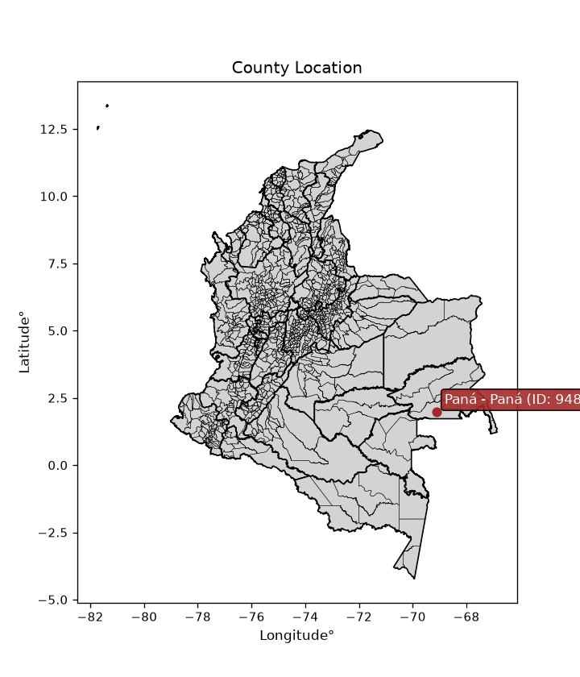
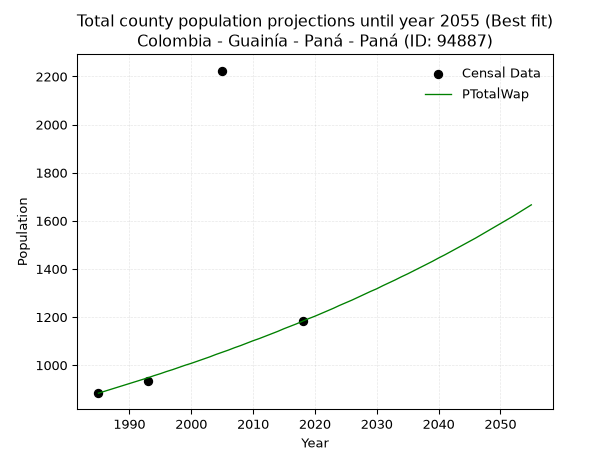
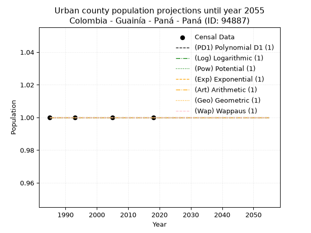
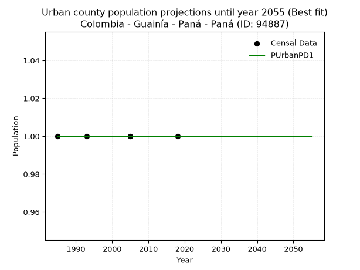
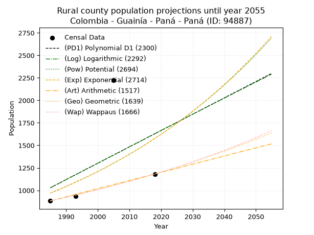
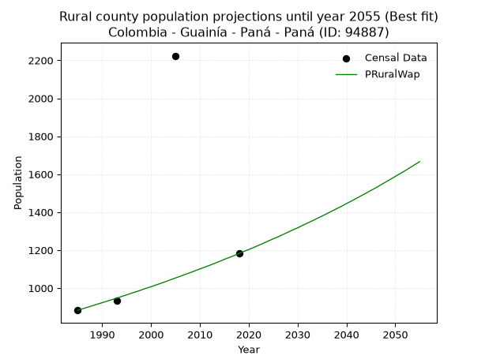

<div align="center">


</div>

# _“Population and Public Services Demand Projections (PPSD) until Year 2050 for Colombia - Guainía - Paná - Paná (ID: 94887)”_
Keywords: `population` `public-service` `projection` `lineal` `polynomial` `logarithmic` `potential` `exponential` `arithmetic` `geometric` `wappaus` `dane` `colombia` `south-america`

PPSD are analytical estimates used by governments and planners to anticipate future changes in population size, age distribution, and the resulting community needs for utilities, healthcare, education, and infrastructure as sizing future water treatment facilities, electrical grids, and road networks based on spatial growth.

> **General running parameters**: • app_version: _v20260806_. • Python version: _3.14.7_. • Pandas version: _3.0.5_. • NumPy version: _2.5.1_. • Creates, save and include plots into reports (create_plot): _False_. • Projection until year: _2050_. • Process polynomial degree 2 and up: _False_. • Process Wappaus: _True_. • Process Wappaus: _True_. • Set negative values to zero: _True_. • Set infinite values to zero: _True_. • Drop dataset notes: _True_. 
<div align="center">

Dynamic map: [:earth_americas:Google](http://maps.google.com/maps?q=1.981087468,-69.1140212) [:earth_americas:OSM](https://www.openstreetmap.org/#map=18/1.981087468/-69.1140212&layers=P) [:earth_americas:Bing](https://www.bing.com/maps?cp=1.981087468~-69.1140212&lvl=18) [:earth_americas:Apple](https://maps.apple.com/frame?center=1.981087468%2C-69.1140212&span=0.003%2C0.006)

</div>


<div align="center">

```geojson
{
  "type": "Feature",
  "geometry": {
    "type": "Point", 
    "coordinates": [-69.1140212, 1.981087468]
  }, 
  "properties": {
    "Name": "Colombia - Guainía - Paná - Paná (ID: 94887)"
  }
}
```

</div>


<div align="center">

</img>

</div>


## 0. Census Data (4 records)

Census data are official statistics collected by a government about the people and housing in a country. They usually include counts of total population, age, sex, race, income, education, and jobs.

📅Global census file: [Population.xlsx](../data/Population.xlsx)

| Source   |   Year |   CountryID | CountryName   |   StateID | StateName   |   CountyID | CountyName   |   PTotal |   PUrban |   PRural |
|:---------|-------:|------------:|:--------------|----------:|:------------|-----------:|:-------------|---------:|---------:|---------:|
| DANE     |   1985 |          57 | Colombia      |        94 | Guainía     |      94887 | Paná - Paná  |      883 |        1 |      883 |
| DANE     |   1993 |          57 | Colombia      |        94 | Guainía     |      94887 | Paná - Paná  |      934 |        1 |      934 |
| DANE     |   2005 |          57 | Colombia      |        94 | Guainía     |      94887 | Paná - Paná  |     2224 |        1 |     2224 |
| DANE     |   2018 |          57 | Colombia      |        94 | Guainía     |      94887 | Paná - Paná  |     1182 |        1 |     1182 |

> 🔥Some records could had specific notes about the registered values or the corresponding urban or rural distribution.

## 1. Total

### 1.1. Coefficients and Parameters

* (PD1) Polynomial Deg 1: 18.156965074267916, -35012.7193898044 (lineal)
* (Log) Logarithmic: 36478.194166780675, -275965.2961796024
* (Pow) Potential: 29.5196405908927, -94.36255731655105
* (Exp) Exponential: 0.014704505645183056, 2.0429000392112319e-10
* (Art) Arithmetic: Year diff. 2018 - 1985 = 33, Population diff. 1182 - 883 = 299, Annual growth = 9.06060606060606
* (Geo) Geometric: Year diff. 2018 - 1985 = 33, Population diff. 1182 - 883 = 299, Annual growth % = 0.008876681199961212
* (Wap) Wappaus: i = 0.8775405385574877, Condition values only valid for < 200)

<sub>
Wappaus condition values: ['0.00', '0.88', '1.76', '2.63', '3.51', '4.39', '5.27', '6.14', '7.02', '7.90', '8.78', '9.65', '10.53', '11.41', '12.29', '13.16', '14.04', '14.92', '15.80', '16.67', '17.55', '18.43', '19.31', '20.18', '21.06', '21.94', '22.82', '23.69', '24.57', '25.45', '26.33', '27.20', '28.08', '28.96', '29.84', '30.71', '31.59', '32.47', '33.35', '34.22', '35.10', '35.98', '36.86', '37.73', '38.61', '39.49', '40.37', '41.24', '42.12', '43.00', '43.88', '44.75', '45.63', '46.51', '47.39', '48.26', '49.14', '50.02', '50.90', '51.77', '52.65', '53.53', '54.41', '55.29', '56.16', '57.04']
</sub>


### 1.2. Projected Dataset

|   Year |   CountyID |   PTotalPD1 |   PTotalLog |   PTotalPow |   PTotalExp |   PTotalArt |   PTotalGeo |   PTotalWap |
|-------:|-----------:|------------:|------------:|------------:|------------:|------------:|------------:|------------:|
|   1985 |      94887 |        1029 |        1027 |         969 |         970 |         883 |         883 |         883 |
|   1986 |      94887 |        1047 |        1046 |         983 |         984 |         892 |         891 |         891 |
|   1987 |      94887 |        1065 |        1064 |         998 |         999 |         901 |         899 |         899 |
|   1988 |      94887 |        1083 |        1082 |        1013 |        1013 |         910 |         907 |         907 |
|   1989 |      94887 |        1101 |        1101 |        1028 |        1028 |         919 |         915 |         915 |
|   1990 |      94887 |        1120 |        1119 |        1043 |        1044 |         928 |         923 |         923 |
|   1991 |      94887 |        1138 |        1137 |        1059 |        1059 |         937 |         931 |         931 |
|   1992 |      94887 |        1156 |        1156 |        1075 |        1075 |         946 |         939 |         939 |
|   1993 |      94887 |        1174 |        1174 |        1091 |        1091 |         955 |         948 |         947 |
|   1994 |      94887 |        1192 |        1192 |        1107 |        1107 |         965 |         956 |         956 |
|   1995 |      94887 |        1210 |        1211 |        1123 |        1123 |         974 |         965 |         964 |
|   1996 |      94887 |        1229 |        1229 |        1140 |        1140 |         983 |         973 |         973 |
|   1997 |      94887 |        1247 |        1247 |        1157 |        1157 |         992 |         982 |         981 |
|   1998 |      94887 |        1265 |        1265 |        1174 |        1174 |        1001 |         991 |         990 |
|   1999 |      94887 |        1283 |        1284 |        1192 |        1191 |        1010 |         999 |         999 |
|   2000 |      94887 |        1301 |        1302 |        1210 |        1209 |        1019 |        1008 |        1007 |
|   2001 |      94887 |        1319 |        1320 |        1228 |        1227 |        1028 |        1017 |        1016 |
|   2002 |      94887 |        1338 |        1338 |        1246 |        1245 |        1037 |        1026 |        1025 |
|   2003 |      94887 |        1356 |        1357 |        1264 |        1264 |        1046 |        1035 |        1034 |
|   2004 |      94887 |        1374 |        1375 |        1283 |        1282 |        1055 |        1044 |        1044 |
|   2005 |      94887 |        1392 |        1393 |        1302 |        1301 |        1064 |        1054 |        1053 |
|   2006 |      94887 |        1410 |        1411 |        1321 |        1320 |        1073 |        1063 |        1062 |
|   2007 |      94887 |        1428 |        1429 |        1341 |        1340 |        1082 |        1073 |        1072 |
|   2008 |      94887 |        1446 |        1448 |        1361 |        1360 |        1091 |        1082 |        1081 |
|   2009 |      94887 |        1465 |        1466 |        1381 |        1380 |        1100 |        1092 |        1091 |
|   2010 |      94887 |        1483 |        1484 |        1402 |        1400 |        1110 |        1101 |        1101 |
|   2011 |      94887 |        1501 |        1502 |        1422 |        1421 |        1119 |        1111 |        1110 |
|   2012 |      94887 |        1519 |        1520 |        1443 |        1442 |        1128 |        1121 |        1120 |
|   2013 |      94887 |        1537 |        1538 |        1465 |        1464 |        1137 |        1131 |        1130 |
|   2014 |      94887 |        1555 |        1556 |        1486 |        1485 |        1146 |        1141 |        1140 |
|   2015 |      94887 |        1574 |        1574 |        1508 |        1507 |        1155 |        1151 |        1151 |
|   2016 |      94887 |        1592 |        1593 |        1530 |        1530 |        1164 |        1161 |        1161 |
|   2017 |      94887 |        1610 |        1611 |        1553 |        1552 |        1173 |        1172 |        1171 |
|   2018 |      94887 |        1628 |        1629 |        1576 |        1575 |        1182 |        1182 |        1182 |
|   2019 |      94887 |        1646 |        1647 |        1599 |        1599 |        1191 |        1192 |        1193 |
|   2020 |      94887 |        1664 |        1665 |        1623 |        1622 |        1200 |        1203 |        1203 |
|   2021 |      94887 |        1683 |        1683 |        1647 |        1646 |        1209 |        1214 |        1214 |
|   2022 |      94887 |        1701 |        1701 |        1671 |        1671 |        1218 |        1225 |        1225 |
|   2023 |      94887 |        1719 |        1719 |        1695 |        1696 |        1227 |        1235 |        1236 |
|   2024 |      94887 |        1737 |        1737 |        1720 |        1721 |        1236 |        1246 |        1248 |
|   2025 |      94887 |        1755 |        1755 |        1746 |        1746 |        1245 |        1257 |        1259 |
|   2026 |      94887 |        1773 |        1773 |        1771 |        1772 |        1254 |        1269 |        1270 |
|   2027 |      94887 |        1791 |        1791 |        1797 |        1798 |        1264 |        1280 |        1282 |
|   2028 |      94887 |        1810 |        1809 |        1823 |        1825 |        1273 |        1291 |        1294 |
|   2029 |      94887 |        1828 |        1827 |        1850 |        1852 |        1282 |        1303 |        1306 |
|   2030 |      94887 |        1846 |        1845 |        1877 |        1879 |        1291 |        1314 |        1317 |
|   2031 |      94887 |        1864 |        1863 |        1905 |        1907 |        1300 |        1326 |        1330 |
|   2032 |      94887 |        1882 |        1881 |        1933 |        1935 |        1309 |        1338 |        1342 |
|   2033 |      94887 |        1900 |        1899 |        1961 |        1964 |        1318 |        1350 |        1354 |
|   2034 |      94887 |        1919 |        1917 |        1990 |        1993 |        1327 |        1362 |        1367 |
|   2035 |      94887 |        1937 |        1935 |        2019 |        2023 |        1336 |        1374 |        1379 |
|   2036 |      94887 |        1955 |        1953 |        2048 |        2053 |        1345 |        1386 |        1392 |
|   2037 |      94887 |        1973 |        1971 |        2078 |        2083 |        1354 |        1398 |        1405 |
|   2038 |      94887 |        1991 |        1988 |        2108 |        2114 |        1363 |        1411 |        1418 |
|   2039 |      94887 |        2009 |        2006 |        2139 |        2145 |        1372 |        1423 |        1431 |
|   2040 |      94887 |        2027 |        2024 |        2170 |        2177 |        1381 |        1436 |        1445 |
|   2041 |      94887 |        2046 |        2042 |        2202 |        2209 |        1390 |        1448 |        1458 |
|   2042 |      94887 |        2064 |        2060 |        2234 |        2242 |        1399 |        1461 |        1472 |
|   2043 |      94887 |        2082 |        2078 |        2267 |        2275 |        1409 |        1474 |        1486 |
|   2044 |      94887 |        2100 |        2096 |        2300 |        2309 |        1418 |        1487 |        1500 |
|   2045 |      94887 |        2118 |        2114 |        2333 |        2343 |        1427 |        1501 |        1514 |
|   2046 |      94887 |        2136 |        2131 |        2367 |        2378 |        1436 |        1514 |        1528 |
|   2047 |      94887 |        2155 |        2149 |        2401 |        2413 |        1445 |        1527 |        1543 |
|   2048 |      94887 |        2173 |        2167 |        2436 |        2449 |        1454 |        1541 |        1558 |
|   2049 |      94887 |        2191 |        2185 |        2472 |        2485 |        1463 |        1555 |        1573 |
|   2050 |      94887 |        2209 |        2203 |        2507 |        2522 |        1472 |        1568 |        1588 |
<div align="center">

</img>

</div>


### 1.3. Best fit with absolute and relative error (%)

Relative error puts that difference into context by dividing the absolute error by the true value, creating a unitless ratio or percentage that shows the scale of the mistake.

Absolute and relative error

|   Year | Source   |   CountryID | CountryName   |   StateID | StateName   |   CountyID_x | CountyName   |   PTotal |   PUrban |   PRural |   CountyID_y |   PTotalPD1 |   PTotalLog |   PTotalPow |   PTotalExp |   PTotalArt |   PTotalGeo |   PTotalWap |   PTotalPD1AbsError |   PTotalLogAbsError |   PTotalPowAbsError |   PTotalExpAbsError |   PTotalArtAbsError |   PTotalGeoAbsError |   PTotalWapAbsError |   PTotalPD1RelError |   PTotalLogRelError |   PTotalPowRelError |   PTotalExpRelError |   PTotalArtRelError |   PTotalGeoRelError |   PTotalWapRelError |
|-------:|:---------|------------:|:--------------|----------:|:------------|-------------:|:-------------|---------:|---------:|---------:|-------------:|------------:|------------:|------------:|------------:|------------:|------------:|------------:|--------------------:|--------------------:|--------------------:|--------------------:|--------------------:|--------------------:|--------------------:|--------------------:|--------------------:|--------------------:|--------------------:|--------------------:|--------------------:|--------------------:|
|   1985 | DANE     |          57 | Colombia      |        94 | Guainía     |        94887 | Paná - Paná  |      883 |        1 |      883 |        94887 |        1029 |        1027 |         969 |         970 |         883 |         883 |         883 |                 146 |                 144 |                  86 |                  87 |                   0 |                   0 |                   0 |             16.5345 |             16.308  |             9.73952 |             9.85277 |             0       |             0       |             0       |
|   1993 | DANE     |          57 | Colombia      |        94 | Guainía     |        94887 | Paná - Paná  |      934 |        1 |      934 |        94887 |        1174 |        1174 |        1091 |        1091 |         955 |         948 |         947 |                 240 |                 240 |                 157 |                 157 |                  21 |                  14 |                  13 |             25.6959 |             25.6959 |            16.8094  |            16.8094  |             2.24839 |             1.49893 |             1.39186 |
|   2005 | DANE     |          57 | Colombia      |        94 | Guainía     |        94887 | Paná - Paná  |     2224 |        1 |     2224 |        94887 |        1392 |        1393 |        1302 |        1301 |        1064 |        1054 |        1053 |                 832 |                 831 |                 922 |                 923 |                1160 |                1170 |                1171 |             37.4101 |             37.3651 |            41.4568  |            41.5018  |            52.1583  |            52.6079  |            52.6529  |
|   2018 | DANE     |          57 | Colombia      |        94 | Guainía     |        94887 | Paná - Paná  |     1182 |        1 |     1182 |        94887 |        1628 |        1629 |        1576 |        1575 |        1182 |        1182 |        1182 |                 446 |                 447 |                 394 |                 393 |                   0 |                   0 |                   0 |             37.7327 |             37.8173 |            33.3333  |            33.2487  |             0       |             0       |             0       |

Relative error mean

| Method    |   RelError | Best   |
|:----------|-----------:|:-------|
| PTotalPD1 |    29.3433 |        |
| PTotalLog |    29.2966 |        |
| PTotalPow |    25.3348 |        |
| PTotalExp |    25.3532 |        |
| PTotalArt |    13.6017 |        |
| PTotalGeo |    13.5267 |        |
| PTotalWap |    13.5112 | True   |

💙Best method: _**PTotalWap**_
<div align="center">

</img>

</div>


### 1.4. Fresh water supply demand in liters per capita per day (lpcd)

The fresh water supply demand typically ranges from 100 to 300 liters per capita per day (lpcd) for standard domestic and municipal planning, though absolute survival minimums set by the World Health Organization are as low as 7.5 to 20 liters per day, and total consumption in high-income nations can exceed 400 liters.

> `CZ`: Level in meters above the sea level (masl)<br> `WS`: Fresh water supply demand in liters per capita per day (lpcd or l/h/d)<br> `WSAll`: Zonal fresh water supply demand in liters per second (l/s)<br> `A`: Zonal area in square meters<br> `DP`: Population density (people/hectare or p/ha)

Reference values (RAS Colombia)

|    CZ |   WS |
|------:|-----:|
|  1000 |  120 |
|  2000 |  130 |
| 99999 |  140 |

County shapefile geometry properties and water supply values

|   CountyID |      ATotal |   CZTotal |   WSTotal |
|-----------:|------------:|----------:|----------:|
|      94887 | 1.01797e+10 |   177.601 |       120 |

Projected values for best method: PTotalWap

|   CountyID |   Year |   PTotalWap |   DPTotal |   WSTotal |   WSTotalAll |
|-----------:|-------:|------------:|----------:|----------:|-------------:|
|      94887 |   1985 |         883 |         0 |       120 |      1.22639 |
|      94887 |   1986 |         891 |         0 |       120 |      1.2375  |
|      94887 |   1987 |         899 |         0 |       120 |      1.24861 |
|      94887 |   1988 |         907 |         0 |       120 |      1.25972 |
|      94887 |   1989 |         915 |         0 |       120 |      1.27083 |
|      94887 |   1990 |         923 |         0 |       120 |      1.28194 |
|      94887 |   1991 |         931 |         0 |       120 |      1.29306 |
|      94887 |   1992 |         939 |         0 |       120 |      1.30417 |
|      94887 |   1993 |         947 |         0 |       120 |      1.31528 |
|      94887 |   1994 |         956 |         0 |       120 |      1.32778 |
|      94887 |   1995 |         964 |         0 |       120 |      1.33889 |
|      94887 |   1996 |         973 |         0 |       120 |      1.35139 |
|      94887 |   1997 |         981 |         0 |       120 |      1.3625  |
|      94887 |   1998 |         990 |         0 |       120 |      1.375   |
|      94887 |   1999 |         999 |         0 |       120 |      1.3875  |
|      94887 |   2000 |        1007 |         0 |       120 |      1.39861 |
|      94887 |   2001 |        1016 |         0 |       120 |      1.41111 |
|      94887 |   2002 |        1025 |         0 |       120 |      1.42361 |
|      94887 |   2003 |        1034 |         0 |       120 |      1.43611 |
|      94887 |   2004 |        1044 |         0 |       120 |      1.45    |
|      94887 |   2005 |        1053 |         0 |       120 |      1.4625  |
|      94887 |   2006 |        1062 |         0 |       120 |      1.475   |
|      94887 |   2007 |        1072 |         0 |       120 |      1.48889 |
|      94887 |   2008 |        1081 |         0 |       120 |      1.50139 |
|      94887 |   2009 |        1091 |         0 |       120 |      1.51528 |
|      94887 |   2010 |        1101 |         0 |       120 |      1.52917 |
|      94887 |   2011 |        1110 |         0 |       120 |      1.54167 |
|      94887 |   2012 |        1120 |         0 |       120 |      1.55556 |
|      94887 |   2013 |        1130 |         0 |       120 |      1.56944 |
|      94887 |   2014 |        1140 |         0 |       120 |      1.58333 |
|      94887 |   2015 |        1151 |         0 |       120 |      1.59861 |
|      94887 |   2016 |        1161 |         0 |       120 |      1.6125  |
|      94887 |   2017 |        1171 |         0 |       120 |      1.62639 |
|      94887 |   2018 |        1182 |         0 |       120 |      1.64167 |
|      94887 |   2019 |        1193 |         0 |       120 |      1.65694 |
|      94887 |   2020 |        1203 |         0 |       120 |      1.67083 |
|      94887 |   2021 |        1214 |         0 |       120 |      1.68611 |
|      94887 |   2022 |        1225 |         0 |       120 |      1.70139 |
|      94887 |   2023 |        1236 |         0 |       120 |      1.71667 |
|      94887 |   2024 |        1248 |         0 |       120 |      1.73333 |
|      94887 |   2025 |        1259 |         0 |       120 |      1.74861 |
|      94887 |   2026 |        1270 |         0 |       120 |      1.76389 |
|      94887 |   2027 |        1282 |         0 |       120 |      1.78056 |
|      94887 |   2028 |        1294 |         0 |       120 |      1.79722 |
|      94887 |   2029 |        1306 |         0 |       120 |      1.81389 |
|      94887 |   2030 |        1317 |         0 |       120 |      1.82917 |
|      94887 |   2031 |        1330 |         0 |       120 |      1.84722 |
|      94887 |   2032 |        1342 |         0 |       120 |      1.86389 |
|      94887 |   2033 |        1354 |         0 |       120 |      1.88056 |
|      94887 |   2034 |        1367 |         0 |       120 |      1.89861 |
|      94887 |   2035 |        1379 |         0 |       120 |      1.91528 |
|      94887 |   2036 |        1392 |         0 |       120 |      1.93333 |
|      94887 |   2037 |        1405 |         0 |       120 |      1.95139 |
|      94887 |   2038 |        1418 |         0 |       120 |      1.96944 |
|      94887 |   2039 |        1431 |         0 |       120 |      1.9875  |
|      94887 |   2040 |        1445 |         0 |       120 |      2.00694 |
|      94887 |   2041 |        1458 |         0 |       120 |      2.025   |
|      94887 |   2042 |        1472 |         0 |       120 |      2.04444 |
|      94887 |   2043 |        1486 |         0 |       120 |      2.06389 |
|      94887 |   2044 |        1500 |         0 |       120 |      2.08333 |
|      94887 |   2045 |        1514 |         0 |       120 |      2.10278 |
|      94887 |   2046 |        1528 |         0 |       120 |      2.12222 |
|      94887 |   2047 |        1543 |         0 |       120 |      2.14306 |
|      94887 |   2048 |        1558 |         0 |       120 |      2.16389 |
|      94887 |   2049 |        1573 |         0 |       120 |      2.18472 |
|      94887 |   2050 |        1588 |         0 |       120 |      2.20556 |

## 2. Urban

### 2.1. Coefficients and Parameters

* (PD1) Polynomial Deg 1: -1.3233529347183512e-19, 1.0000000000000004 (lineal)
* (Log) Logarithmic: 3.215569112241165e-17, 0.9999999999999996
* (Pow) Potential: 0.0, 0.0
* (Exp) Exponential: 0.0, 1.0
* (Art) Arithmetic: Year diff. 2018 - 1985 = 33, Population diff. 1 - 1 = 0, Annual growth = 0.0
* (Geo) Geometric: Year diff. 2018 - 1985 = 33, Population diff. 1 - 1 = 0, Annual growth % = 0.0
* (Wap) Wappaus: i = 0.0, Condition values only valid for < 200)

<sub>
Wappaus condition values: ['0.00', '0.00', '0.00', '0.00', '0.00', '0.00', '0.00', '0.00', '0.00', '0.00', '0.00', '0.00', '0.00', '0.00', '0.00', '0.00', '0.00', '0.00', '0.00', '0.00', '0.00', '0.00', '0.00', '0.00', '0.00', '0.00', '0.00', '0.00', '0.00', '0.00', '0.00', '0.00', '0.00', '0.00', '0.00', '0.00', '0.00', '0.00', '0.00', '0.00', '0.00', '0.00', '0.00', '0.00', '0.00', '0.00', '0.00', '0.00', '0.00', '0.00', '0.00', '0.00', '0.00', '0.00', '0.00', '0.00', '0.00', '0.00', '0.00', '0.00', '0.00', '0.00', '0.00', '0.00', '0.00', '0.00']
</sub>


### 2.2. Projected Dataset

|   Year |   CountyID |   PUrbanPD1 |   PUrbanLog |   PUrbanPow |   PUrbanExp |   PUrbanArt |   PUrbanGeo |   PUrbanWap |
|-------:|-----------:|------------:|------------:|------------:|------------:|------------:|------------:|------------:|
|   1985 |      94887 |           1 |           1 |           1 |           1 |           1 |           1 |           1 |
|   1986 |      94887 |           1 |           1 |           1 |           1 |           1 |           1 |           1 |
|   1987 |      94887 |           1 |           1 |           1 |           1 |           1 |           1 |           1 |
|   1988 |      94887 |           1 |           1 |           1 |           1 |           1 |           1 |           1 |
|   1989 |      94887 |           1 |           1 |           1 |           1 |           1 |           1 |           1 |
|   1990 |      94887 |           1 |           1 |           1 |           1 |           1 |           1 |           1 |
|   1991 |      94887 |           1 |           1 |           1 |           1 |           1 |           1 |           1 |
|   1992 |      94887 |           1 |           1 |           1 |           1 |           1 |           1 |           1 |
|   1993 |      94887 |           1 |           1 |           1 |           1 |           1 |           1 |           1 |
|   1994 |      94887 |           1 |           1 |           1 |           1 |           1 |           1 |           1 |
|   1995 |      94887 |           1 |           1 |           1 |           1 |           1 |           1 |           1 |
|   1996 |      94887 |           1 |           1 |           1 |           1 |           1 |           1 |           1 |
|   1997 |      94887 |           1 |           1 |           1 |           1 |           1 |           1 |           1 |
|   1998 |      94887 |           1 |           1 |           1 |           1 |           1 |           1 |           1 |
|   1999 |      94887 |           1 |           1 |           1 |           1 |           1 |           1 |           1 |
|   2000 |      94887 |           1 |           1 |           1 |           1 |           1 |           1 |           1 |
|   2001 |      94887 |           1 |           1 |           1 |           1 |           1 |           1 |           1 |
|   2002 |      94887 |           1 |           1 |           1 |           1 |           1 |           1 |           1 |
|   2003 |      94887 |           1 |           1 |           1 |           1 |           1 |           1 |           1 |
|   2004 |      94887 |           1 |           1 |           1 |           1 |           1 |           1 |           1 |
|   2005 |      94887 |           1 |           1 |           1 |           1 |           1 |           1 |           1 |
|   2006 |      94887 |           1 |           1 |           1 |           1 |           1 |           1 |           1 |
|   2007 |      94887 |           1 |           1 |           1 |           1 |           1 |           1 |           1 |
|   2008 |      94887 |           1 |           1 |           1 |           1 |           1 |           1 |           1 |
|   2009 |      94887 |           1 |           1 |           1 |           1 |           1 |           1 |           1 |
|   2010 |      94887 |           1 |           1 |           1 |           1 |           1 |           1 |           1 |
|   2011 |      94887 |           1 |           1 |           1 |           1 |           1 |           1 |           1 |
|   2012 |      94887 |           1 |           1 |           1 |           1 |           1 |           1 |           1 |
|   2013 |      94887 |           1 |           1 |           1 |           1 |           1 |           1 |           1 |
|   2014 |      94887 |           1 |           1 |           1 |           1 |           1 |           1 |           1 |
|   2015 |      94887 |           1 |           1 |           1 |           1 |           1 |           1 |           1 |
|   2016 |      94887 |           1 |           1 |           1 |           1 |           1 |           1 |           1 |
|   2017 |      94887 |           1 |           1 |           1 |           1 |           1 |           1 |           1 |
|   2018 |      94887 |           1 |           1 |           1 |           1 |           1 |           1 |           1 |
|   2019 |      94887 |           1 |           1 |           1 |           1 |           1 |           1 |           1 |
|   2020 |      94887 |           1 |           1 |           1 |           1 |           1 |           1 |           1 |
|   2021 |      94887 |           1 |           1 |           1 |           1 |           1 |           1 |           1 |
|   2022 |      94887 |           1 |           1 |           1 |           1 |           1 |           1 |           1 |
|   2023 |      94887 |           1 |           1 |           1 |           1 |           1 |           1 |           1 |
|   2024 |      94887 |           1 |           1 |           1 |           1 |           1 |           1 |           1 |
|   2025 |      94887 |           1 |           1 |           1 |           1 |           1 |           1 |           1 |
|   2026 |      94887 |           1 |           1 |           1 |           1 |           1 |           1 |           1 |
|   2027 |      94887 |           1 |           1 |           1 |           1 |           1 |           1 |           1 |
|   2028 |      94887 |           1 |           1 |           1 |           1 |           1 |           1 |           1 |
|   2029 |      94887 |           1 |           1 |           1 |           1 |           1 |           1 |           1 |
|   2030 |      94887 |           1 |           1 |           1 |           1 |           1 |           1 |           1 |
|   2031 |      94887 |           1 |           1 |           1 |           1 |           1 |           1 |           1 |
|   2032 |      94887 |           1 |           1 |           1 |           1 |           1 |           1 |           1 |
|   2033 |      94887 |           1 |           1 |           1 |           1 |           1 |           1 |           1 |
|   2034 |      94887 |           1 |           1 |           1 |           1 |           1 |           1 |           1 |
|   2035 |      94887 |           1 |           1 |           1 |           1 |           1 |           1 |           1 |
|   2036 |      94887 |           1 |           1 |           1 |           1 |           1 |           1 |           1 |
|   2037 |      94887 |           1 |           1 |           1 |           1 |           1 |           1 |           1 |
|   2038 |      94887 |           1 |           1 |           1 |           1 |           1 |           1 |           1 |
|   2039 |      94887 |           1 |           1 |           1 |           1 |           1 |           1 |           1 |
|   2040 |      94887 |           1 |           1 |           1 |           1 |           1 |           1 |           1 |
|   2041 |      94887 |           1 |           1 |           1 |           1 |           1 |           1 |           1 |
|   2042 |      94887 |           1 |           1 |           1 |           1 |           1 |           1 |           1 |
|   2043 |      94887 |           1 |           1 |           1 |           1 |           1 |           1 |           1 |
|   2044 |      94887 |           1 |           1 |           1 |           1 |           1 |           1 |           1 |
|   2045 |      94887 |           1 |           1 |           1 |           1 |           1 |           1 |           1 |
|   2046 |      94887 |           1 |           1 |           1 |           1 |           1 |           1 |           1 |
|   2047 |      94887 |           1 |           1 |           1 |           1 |           1 |           1 |           1 |
|   2048 |      94887 |           1 |           1 |           1 |           1 |           1 |           1 |           1 |
|   2049 |      94887 |           1 |           1 |           1 |           1 |           1 |           1 |           1 |
|   2050 |      94887 |           1 |           1 |           1 |           1 |           1 |           1 |           1 |
<div align="center">

</img>

</div>


### 2.3. Best fit with absolute and relative error (%)

Relative error puts that difference into context by dividing the absolute error by the true value, creating a unitless ratio or percentage that shows the scale of the mistake.

Absolute and relative error

|   Year | Source   |   CountryID | CountryName   |   StateID | StateName   |   CountyID_x | CountyName   |   PTotal |   PUrban |   PRural |   CountyID_y |   PUrbanPD1 |   PUrbanLog |   PUrbanPow |   PUrbanExp |   PUrbanArt |   PUrbanGeo |   PUrbanWap |   PUrbanPD1AbsError |   PUrbanLogAbsError |   PUrbanPowAbsError |   PUrbanExpAbsError |   PUrbanArtAbsError |   PUrbanGeoAbsError |   PUrbanWapAbsError |   PUrbanPD1RelError |   PUrbanLogRelError |   PUrbanPowRelError |   PUrbanExpRelError |   PUrbanArtRelError |   PUrbanGeoRelError |   PUrbanWapRelError |
|-------:|:---------|------------:|:--------------|----------:|:------------|-------------:|:-------------|---------:|---------:|---------:|-------------:|------------:|------------:|------------:|------------:|------------:|------------:|------------:|--------------------:|--------------------:|--------------------:|--------------------:|--------------------:|--------------------:|--------------------:|--------------------:|--------------------:|--------------------:|--------------------:|--------------------:|--------------------:|--------------------:|
|   1985 | DANE     |          57 | Colombia      |        94 | Guainía     |        94887 | Paná - Paná  |      883 |        1 |      883 |        94887 |           1 |           1 |           1 |           1 |           1 |           1 |           1 |                   0 |                   0 |                   0 |                   0 |                   0 |                   0 |                   0 |                   0 |                   0 |                   0 |                   0 |                   0 |                   0 |                   0 |
|   1993 | DANE     |          57 | Colombia      |        94 | Guainía     |        94887 | Paná - Paná  |      934 |        1 |      934 |        94887 |           1 |           1 |           1 |           1 |           1 |           1 |           1 |                   0 |                   0 |                   0 |                   0 |                   0 |                   0 |                   0 |                   0 |                   0 |                   0 |                   0 |                   0 |                   0 |                   0 |
|   2005 | DANE     |          57 | Colombia      |        94 | Guainía     |        94887 | Paná - Paná  |     2224 |        1 |     2224 |        94887 |           1 |           1 |           1 |           1 |           1 |           1 |           1 |                   0 |                   0 |                   0 |                   0 |                   0 |                   0 |                   0 |                   0 |                   0 |                   0 |                   0 |                   0 |                   0 |                   0 |
|   2018 | DANE     |          57 | Colombia      |        94 | Guainía     |        94887 | Paná - Paná  |     1182 |        1 |     1182 |        94887 |           1 |           1 |           1 |           1 |           1 |           1 |           1 |                   0 |                   0 |                   0 |                   0 |                   0 |                   0 |                   0 |                   0 |                   0 |                   0 |                   0 |                   0 |                   0 |                   0 |

Relative error mean

| Method    |   RelError | Best   |
|:----------|-----------:|:-------|
| PUrbanPD1 |          0 | True   |
| PUrbanLog |          0 | True   |
| PUrbanPow |          0 | True   |
| PUrbanExp |          0 | True   |
| PUrbanArt |          0 | True   |
| PUrbanGeo |          0 | True   |
| PUrbanWap |          0 | True   |

💙Best method: _**PUrbanPD1**_
<div align="center">

</img>

</div>


### 2.4. Fresh water supply demand in liters per capita per day (lpcd)

The fresh water supply demand typically ranges from 100 to 300 liters per capita per day (lpcd) for standard domestic and municipal planning, though absolute survival minimums set by the World Health Organization are as low as 7.5 to 20 liters per day, and total consumption in high-income nations can exceed 400 liters.

> `CZ`: Level in meters above the sea level (masl)<br> `WS`: Fresh water supply demand in liters per capita per day (lpcd or l/h/d)<br> `WSAll`: Zonal fresh water supply demand in liters per second (l/s)<br> `A`: Zonal area in square meters<br> `DP`: Population density (people/hectare or p/ha)

Reference values (RAS Colombia)

|    CZ |   WS |
|------:|-----:|
|  1000 |  120 |
|  2000 |  130 |
| 99999 |  140 |

County shapefile geometry properties and water supply values

|   CountyID |   AUrban |   CZUrban |   WSUrban |
|-----------:|---------:|----------:|----------:|
|      94887 |        0 |         0 |       120 |

Projected values for best method: PUrbanPD1

|   CountyID |   Year |   PUrbanPD1 |   DPUrban |   WSUrban |   WSUrbanAll |
|-----------:|-------:|------------:|----------:|----------:|-------------:|
|      94887 |   1985 |           1 |       inf |       120 |   0.00138889 |
|      94887 |   1986 |           1 |       inf |       120 |   0.00138889 |
|      94887 |   1987 |           1 |       inf |       120 |   0.00138889 |
|      94887 |   1988 |           1 |       inf |       120 |   0.00138889 |
|      94887 |   1989 |           1 |       inf |       120 |   0.00138889 |
|      94887 |   1990 |           1 |       inf |       120 |   0.00138889 |
|      94887 |   1991 |           1 |       inf |       120 |   0.00138889 |
|      94887 |   1992 |           1 |       inf |       120 |   0.00138889 |
|      94887 |   1993 |           1 |       inf |       120 |   0.00138889 |
|      94887 |   1994 |           1 |       inf |       120 |   0.00138889 |
|      94887 |   1995 |           1 |       inf |       120 |   0.00138889 |
|      94887 |   1996 |           1 |       inf |       120 |   0.00138889 |
|      94887 |   1997 |           1 |       inf |       120 |   0.00138889 |
|      94887 |   1998 |           1 |       inf |       120 |   0.00138889 |
|      94887 |   1999 |           1 |       inf |       120 |   0.00138889 |
|      94887 |   2000 |           1 |       inf |       120 |   0.00138889 |
|      94887 |   2001 |           1 |       inf |       120 |   0.00138889 |
|      94887 |   2002 |           1 |       inf |       120 |   0.00138889 |
|      94887 |   2003 |           1 |       inf |       120 |   0.00138889 |
|      94887 |   2004 |           1 |       inf |       120 |   0.00138889 |
|      94887 |   2005 |           1 |       inf |       120 |   0.00138889 |
|      94887 |   2006 |           1 |       inf |       120 |   0.00138889 |
|      94887 |   2007 |           1 |       inf |       120 |   0.00138889 |
|      94887 |   2008 |           1 |       inf |       120 |   0.00138889 |
|      94887 |   2009 |           1 |       inf |       120 |   0.00138889 |
|      94887 |   2010 |           1 |       inf |       120 |   0.00138889 |
|      94887 |   2011 |           1 |       inf |       120 |   0.00138889 |
|      94887 |   2012 |           1 |       inf |       120 |   0.00138889 |
|      94887 |   2013 |           1 |       inf |       120 |   0.00138889 |
|      94887 |   2014 |           1 |       inf |       120 |   0.00138889 |
|      94887 |   2015 |           1 |       inf |       120 |   0.00138889 |
|      94887 |   2016 |           1 |       inf |       120 |   0.00138889 |
|      94887 |   2017 |           1 |       inf |       120 |   0.00138889 |
|      94887 |   2018 |           1 |       inf |       120 |   0.00138889 |
|      94887 |   2019 |           1 |       inf |       120 |   0.00138889 |
|      94887 |   2020 |           1 |       inf |       120 |   0.00138889 |
|      94887 |   2021 |           1 |       inf |       120 |   0.00138889 |
|      94887 |   2022 |           1 |       inf |       120 |   0.00138889 |
|      94887 |   2023 |           1 |       inf |       120 |   0.00138889 |
|      94887 |   2024 |           1 |       inf |       120 |   0.00138889 |
|      94887 |   2025 |           1 |       inf |       120 |   0.00138889 |
|      94887 |   2026 |           1 |       inf |       120 |   0.00138889 |
|      94887 |   2027 |           1 |       inf |       120 |   0.00138889 |
|      94887 |   2028 |           1 |       inf |       120 |   0.00138889 |
|      94887 |   2029 |           1 |       inf |       120 |   0.00138889 |
|      94887 |   2030 |           1 |       inf |       120 |   0.00138889 |
|      94887 |   2031 |           1 |       inf |       120 |   0.00138889 |
|      94887 |   2032 |           1 |       inf |       120 |   0.00138889 |
|      94887 |   2033 |           1 |       inf |       120 |   0.00138889 |
|      94887 |   2034 |           1 |       inf |       120 |   0.00138889 |
|      94887 |   2035 |           1 |       inf |       120 |   0.00138889 |
|      94887 |   2036 |           1 |       inf |       120 |   0.00138889 |
|      94887 |   2037 |           1 |       inf |       120 |   0.00138889 |
|      94887 |   2038 |           1 |       inf |       120 |   0.00138889 |
|      94887 |   2039 |           1 |       inf |       120 |   0.00138889 |
|      94887 |   2040 |           1 |       inf |       120 |   0.00138889 |
|      94887 |   2041 |           1 |       inf |       120 |   0.00138889 |
|      94887 |   2042 |           1 |       inf |       120 |   0.00138889 |
|      94887 |   2043 |           1 |       inf |       120 |   0.00138889 |
|      94887 |   2044 |           1 |       inf |       120 |   0.00138889 |
|      94887 |   2045 |           1 |       inf |       120 |   0.00138889 |
|      94887 |   2046 |           1 |       inf |       120 |   0.00138889 |
|      94887 |   2047 |           1 |       inf |       120 |   0.00138889 |
|      94887 |   2048 |           1 |       inf |       120 |   0.00138889 |
|      94887 |   2049 |           1 |       inf |       120 |   0.00138889 |
|      94887 |   2050 |           1 |       inf |       120 |   0.00138889 |

## 3. Rural

### 3.1. Coefficients and Parameters

* (PD1) Polynomial Deg 1: 18.156965074267916, -35012.7193898044 (lineal)
* (Log) Logarithmic: 36478.194166780675, -275965.2961796024
* (Pow) Potential: 29.5196405908927, -94.36255731655105
* (Exp) Exponential: 0.014704505645183056, 2.0429000392112319e-10
* (Art) Arithmetic: Year diff. 2018 - 1985 = 33, Population diff. 1182 - 883 = 299, Annual growth = 9.06060606060606
* (Geo) Geometric: Year diff. 2018 - 1985 = 33, Population diff. 1182 - 883 = 299, Annual growth % = 0.008876681199961212
* (Wap) Wappaus: i = 0.8775405385574877, Condition values only valid for < 200)

<sub>
Wappaus condition values: ['0.00', '0.88', '1.76', '2.63', '3.51', '4.39', '5.27', '6.14', '7.02', '7.90', '8.78', '9.65', '10.53', '11.41', '12.29', '13.16', '14.04', '14.92', '15.80', '16.67', '17.55', '18.43', '19.31', '20.18', '21.06', '21.94', '22.82', '23.69', '24.57', '25.45', '26.33', '27.20', '28.08', '28.96', '29.84', '30.71', '31.59', '32.47', '33.35', '34.22', '35.10', '35.98', '36.86', '37.73', '38.61', '39.49', '40.37', '41.24', '42.12', '43.00', '43.88', '44.75', '45.63', '46.51', '47.39', '48.26', '49.14', '50.02', '50.90', '51.77', '52.65', '53.53', '54.41', '55.29', '56.16', '57.04']
</sub>


### 3.2. Projected Dataset

|   Year |   CountyID |   PRuralPD1 |   PRuralLog |   PRuralPow |   PRuralExp |   PRuralArt |   PRuralGeo |   PRuralWap |
|-------:|-----------:|------------:|------------:|------------:|------------:|------------:|------------:|------------:|
|   1985 |      94887 |        1029 |        1027 |         969 |         970 |         883 |         883 |         883 |
|   1986 |      94887 |        1047 |        1046 |         983 |         984 |         892 |         891 |         891 |
|   1987 |      94887 |        1065 |        1064 |         998 |         999 |         901 |         899 |         899 |
|   1988 |      94887 |        1083 |        1082 |        1013 |        1013 |         910 |         907 |         907 |
|   1989 |      94887 |        1101 |        1101 |        1028 |        1028 |         919 |         915 |         915 |
|   1990 |      94887 |        1120 |        1119 |        1043 |        1044 |         928 |         923 |         923 |
|   1991 |      94887 |        1138 |        1137 |        1059 |        1059 |         937 |         931 |         931 |
|   1992 |      94887 |        1156 |        1156 |        1075 |        1075 |         946 |         939 |         939 |
|   1993 |      94887 |        1174 |        1174 |        1091 |        1091 |         955 |         948 |         947 |
|   1994 |      94887 |        1192 |        1192 |        1107 |        1107 |         965 |         956 |         956 |
|   1995 |      94887 |        1210 |        1211 |        1123 |        1123 |         974 |         965 |         964 |
|   1996 |      94887 |        1229 |        1229 |        1140 |        1140 |         983 |         973 |         973 |
|   1997 |      94887 |        1247 |        1247 |        1157 |        1157 |         992 |         982 |         981 |
|   1998 |      94887 |        1265 |        1265 |        1174 |        1174 |        1001 |         991 |         990 |
|   1999 |      94887 |        1283 |        1284 |        1192 |        1191 |        1010 |         999 |         999 |
|   2000 |      94887 |        1301 |        1302 |        1210 |        1209 |        1019 |        1008 |        1007 |
|   2001 |      94887 |        1319 |        1320 |        1228 |        1227 |        1028 |        1017 |        1016 |
|   2002 |      94887 |        1338 |        1338 |        1246 |        1245 |        1037 |        1026 |        1025 |
|   2003 |      94887 |        1356 |        1357 |        1264 |        1264 |        1046 |        1035 |        1034 |
|   2004 |      94887 |        1374 |        1375 |        1283 |        1282 |        1055 |        1044 |        1044 |
|   2005 |      94887 |        1392 |        1393 |        1302 |        1301 |        1064 |        1054 |        1053 |
|   2006 |      94887 |        1410 |        1411 |        1321 |        1320 |        1073 |        1063 |        1062 |
|   2007 |      94887 |        1428 |        1429 |        1341 |        1340 |        1082 |        1073 |        1072 |
|   2008 |      94887 |        1446 |        1448 |        1361 |        1360 |        1091 |        1082 |        1081 |
|   2009 |      94887 |        1465 |        1466 |        1381 |        1380 |        1100 |        1092 |        1091 |
|   2010 |      94887 |        1483 |        1484 |        1402 |        1400 |        1110 |        1101 |        1101 |
|   2011 |      94887 |        1501 |        1502 |        1422 |        1421 |        1119 |        1111 |        1110 |
|   2012 |      94887 |        1519 |        1520 |        1443 |        1442 |        1128 |        1121 |        1120 |
|   2013 |      94887 |        1537 |        1538 |        1465 |        1464 |        1137 |        1131 |        1130 |
|   2014 |      94887 |        1555 |        1556 |        1486 |        1485 |        1146 |        1141 |        1140 |
|   2015 |      94887 |        1574 |        1574 |        1508 |        1507 |        1155 |        1151 |        1151 |
|   2016 |      94887 |        1592 |        1593 |        1530 |        1530 |        1164 |        1161 |        1161 |
|   2017 |      94887 |        1610 |        1611 |        1553 |        1552 |        1173 |        1172 |        1171 |
|   2018 |      94887 |        1628 |        1629 |        1576 |        1575 |        1182 |        1182 |        1182 |
|   2019 |      94887 |        1646 |        1647 |        1599 |        1599 |        1191 |        1192 |        1193 |
|   2020 |      94887 |        1664 |        1665 |        1623 |        1622 |        1200 |        1203 |        1203 |
|   2021 |      94887 |        1683 |        1683 |        1647 |        1646 |        1209 |        1214 |        1214 |
|   2022 |      94887 |        1701 |        1701 |        1671 |        1671 |        1218 |        1225 |        1225 |
|   2023 |      94887 |        1719 |        1719 |        1695 |        1696 |        1227 |        1235 |        1236 |
|   2024 |      94887 |        1737 |        1737 |        1720 |        1721 |        1236 |        1246 |        1248 |
|   2025 |      94887 |        1755 |        1755 |        1746 |        1746 |        1245 |        1257 |        1259 |
|   2026 |      94887 |        1773 |        1773 |        1771 |        1772 |        1254 |        1269 |        1270 |
|   2027 |      94887 |        1791 |        1791 |        1797 |        1798 |        1264 |        1280 |        1282 |
|   2028 |      94887 |        1810 |        1809 |        1823 |        1825 |        1273 |        1291 |        1294 |
|   2029 |      94887 |        1828 |        1827 |        1850 |        1852 |        1282 |        1303 |        1306 |
|   2030 |      94887 |        1846 |        1845 |        1877 |        1879 |        1291 |        1314 |        1317 |
|   2031 |      94887 |        1864 |        1863 |        1905 |        1907 |        1300 |        1326 |        1330 |
|   2032 |      94887 |        1882 |        1881 |        1933 |        1935 |        1309 |        1338 |        1342 |
|   2033 |      94887 |        1900 |        1899 |        1961 |        1964 |        1318 |        1350 |        1354 |
|   2034 |      94887 |        1919 |        1917 |        1990 |        1993 |        1327 |        1362 |        1367 |
|   2035 |      94887 |        1937 |        1935 |        2019 |        2023 |        1336 |        1374 |        1379 |
|   2036 |      94887 |        1955 |        1953 |        2048 |        2053 |        1345 |        1386 |        1392 |
|   2037 |      94887 |        1973 |        1971 |        2078 |        2083 |        1354 |        1398 |        1405 |
|   2038 |      94887 |        1991 |        1988 |        2108 |        2114 |        1363 |        1411 |        1418 |
|   2039 |      94887 |        2009 |        2006 |        2139 |        2145 |        1372 |        1423 |        1431 |
|   2040 |      94887 |        2027 |        2024 |        2170 |        2177 |        1381 |        1436 |        1445 |
|   2041 |      94887 |        2046 |        2042 |        2202 |        2209 |        1390 |        1448 |        1458 |
|   2042 |      94887 |        2064 |        2060 |        2234 |        2242 |        1399 |        1461 |        1472 |
|   2043 |      94887 |        2082 |        2078 |        2267 |        2275 |        1409 |        1474 |        1486 |
|   2044 |      94887 |        2100 |        2096 |        2300 |        2309 |        1418 |        1487 |        1500 |
|   2045 |      94887 |        2118 |        2114 |        2333 |        2343 |        1427 |        1501 |        1514 |
|   2046 |      94887 |        2136 |        2131 |        2367 |        2378 |        1436 |        1514 |        1528 |
|   2047 |      94887 |        2155 |        2149 |        2401 |        2413 |        1445 |        1527 |        1543 |
|   2048 |      94887 |        2173 |        2167 |        2436 |        2449 |        1454 |        1541 |        1558 |
|   2049 |      94887 |        2191 |        2185 |        2472 |        2485 |        1463 |        1555 |        1573 |
|   2050 |      94887 |        2209 |        2203 |        2507 |        2522 |        1472 |        1568 |        1588 |
<div align="center">

</img>

</div>


### 3.3. Best fit with absolute and relative error (%)

Relative error puts that difference into context by dividing the absolute error by the true value, creating a unitless ratio or percentage that shows the scale of the mistake.

Absolute and relative error

|   Year | Source   |   CountryID | CountryName   |   StateID | StateName   |   CountyID_x | CountyName   |   PTotal |   PUrban |   PRural |   CountyID_y |   PRuralPD1 |   PRuralLog |   PRuralPow |   PRuralExp |   PRuralArt |   PRuralGeo |   PRuralWap |   PRuralPD1AbsError |   PRuralLogAbsError |   PRuralPowAbsError |   PRuralExpAbsError |   PRuralArtAbsError |   PRuralGeoAbsError |   PRuralWapAbsError |   PRuralPD1RelError |   PRuralLogRelError |   PRuralPowRelError |   PRuralExpRelError |   PRuralArtRelError |   PRuralGeoRelError |   PRuralWapRelError |
|-------:|:---------|------------:|:--------------|----------:|:------------|-------------:|:-------------|---------:|---------:|---------:|-------------:|------------:|------------:|------------:|------------:|------------:|------------:|------------:|--------------------:|--------------------:|--------------------:|--------------------:|--------------------:|--------------------:|--------------------:|--------------------:|--------------------:|--------------------:|--------------------:|--------------------:|--------------------:|--------------------:|
|   1985 | DANE     |          57 | Colombia      |        94 | Guainía     |        94887 | Paná - Paná  |      883 |        1 |      883 |        94887 |        1029 |        1027 |         969 |         970 |         883 |         883 |         883 |                 146 |                 144 |                  86 |                  87 |                   0 |                   0 |                   0 |             16.5345 |             16.308  |             9.73952 |             9.85277 |             0       |             0       |             0       |
|   1993 | DANE     |          57 | Colombia      |        94 | Guainía     |        94887 | Paná - Paná  |      934 |        1 |      934 |        94887 |        1174 |        1174 |        1091 |        1091 |         955 |         948 |         947 |                 240 |                 240 |                 157 |                 157 |                  21 |                  14 |                  13 |             25.6959 |             25.6959 |            16.8094  |            16.8094  |             2.24839 |             1.49893 |             1.39186 |
|   2005 | DANE     |          57 | Colombia      |        94 | Guainía     |        94887 | Paná - Paná  |     2224 |        1 |     2224 |        94887 |        1392 |        1393 |        1302 |        1301 |        1064 |        1054 |        1053 |                 832 |                 831 |                 922 |                 923 |                1160 |                1170 |                1171 |             37.4101 |             37.3651 |            41.4568  |            41.5018  |            52.1583  |            52.6079  |            52.6529  |
|   2018 | DANE     |          57 | Colombia      |        94 | Guainía     |        94887 | Paná - Paná  |     1182 |        1 |     1182 |        94887 |        1628 |        1629 |        1576 |        1575 |        1182 |        1182 |        1182 |                 446 |                 447 |                 394 |                 393 |                   0 |                   0 |                   0 |             37.7327 |             37.8173 |            33.3333  |            33.2487  |             0       |             0       |             0       |

Relative error mean

| Method    |   RelError | Best   |
|:----------|-----------:|:-------|
| PRuralPD1 |    29.3433 |        |
| PRuralLog |    29.2966 |        |
| PRuralPow |    25.3348 |        |
| PRuralExp |    25.3532 |        |
| PRuralArt |    13.6017 |        |
| PRuralGeo |    13.5267 |        |
| PRuralWap |    13.5112 | True   |

💙Best method: _**PRuralWap**_
<div align="center">

</img>

</div>


### 3.4. Fresh water supply demand in liters per capita per day (lpcd)

The fresh water supply demand typically ranges from 100 to 300 liters per capita per day (lpcd) for standard domestic and municipal planning, though absolute survival minimums set by the World Health Organization are as low as 7.5 to 20 liters per day, and total consumption in high-income nations can exceed 400 liters.

> `CZ`: Level in meters above the sea level (masl)<br> `WS`: Fresh water supply demand in liters per capita per day (lpcd or l/h/d)<br> `WSAll`: Zonal fresh water supply demand in liters per second (l/s)<br> `A`: Zonal area in square meters<br> `DP`: Population density (people/hectare or p/ha)

Reference values (RAS Colombia)

|    CZ |   WS |
|------:|-----:|
|  1000 |  120 |
|  2000 |  130 |
| 99999 |  140 |

County shapefile geometry properties and water supply values

|   CountyID |      ARural |   CZRural |   WSRural |
|-----------:|------------:|----------:|----------:|
|      94887 | 1.01797e+10 |   177.601 |       120 |

Projected values for best method: PRuralWap

|   CountyID |   Year |   PRuralWap |   DPRural |   WSRural |   WSRuralAll |
|-----------:|-------:|------------:|----------:|----------:|-------------:|
|      94887 |   1985 |         883 |         0 |       120 |      1.22639 |
|      94887 |   1986 |         891 |         0 |       120 |      1.2375  |
|      94887 |   1987 |         899 |         0 |       120 |      1.24861 |
|      94887 |   1988 |         907 |         0 |       120 |      1.25972 |
|      94887 |   1989 |         915 |         0 |       120 |      1.27083 |
|      94887 |   1990 |         923 |         0 |       120 |      1.28194 |
|      94887 |   1991 |         931 |         0 |       120 |      1.29306 |
|      94887 |   1992 |         939 |         0 |       120 |      1.30417 |
|      94887 |   1993 |         947 |         0 |       120 |      1.31528 |
|      94887 |   1994 |         956 |         0 |       120 |      1.32778 |
|      94887 |   1995 |         964 |         0 |       120 |      1.33889 |
|      94887 |   1996 |         973 |         0 |       120 |      1.35139 |
|      94887 |   1997 |         981 |         0 |       120 |      1.3625  |
|      94887 |   1998 |         990 |         0 |       120 |      1.375   |
|      94887 |   1999 |         999 |         0 |       120 |      1.3875  |
|      94887 |   2000 |        1007 |         0 |       120 |      1.39861 |
|      94887 |   2001 |        1016 |         0 |       120 |      1.41111 |
|      94887 |   2002 |        1025 |         0 |       120 |      1.42361 |
|      94887 |   2003 |        1034 |         0 |       120 |      1.43611 |
|      94887 |   2004 |        1044 |         0 |       120 |      1.45    |
|      94887 |   2005 |        1053 |         0 |       120 |      1.4625  |
|      94887 |   2006 |        1062 |         0 |       120 |      1.475   |
|      94887 |   2007 |        1072 |         0 |       120 |      1.48889 |
|      94887 |   2008 |        1081 |         0 |       120 |      1.50139 |
|      94887 |   2009 |        1091 |         0 |       120 |      1.51528 |
|      94887 |   2010 |        1101 |         0 |       120 |      1.52917 |
|      94887 |   2011 |        1110 |         0 |       120 |      1.54167 |
|      94887 |   2012 |        1120 |         0 |       120 |      1.55556 |
|      94887 |   2013 |        1130 |         0 |       120 |      1.56944 |
|      94887 |   2014 |        1140 |         0 |       120 |      1.58333 |
|      94887 |   2015 |        1151 |         0 |       120 |      1.59861 |
|      94887 |   2016 |        1161 |         0 |       120 |      1.6125  |
|      94887 |   2017 |        1171 |         0 |       120 |      1.62639 |
|      94887 |   2018 |        1182 |         0 |       120 |      1.64167 |
|      94887 |   2019 |        1193 |         0 |       120 |      1.65694 |
|      94887 |   2020 |        1203 |         0 |       120 |      1.67083 |
|      94887 |   2021 |        1214 |         0 |       120 |      1.68611 |
|      94887 |   2022 |        1225 |         0 |       120 |      1.70139 |
|      94887 |   2023 |        1236 |         0 |       120 |      1.71667 |
|      94887 |   2024 |        1248 |         0 |       120 |      1.73333 |
|      94887 |   2025 |        1259 |         0 |       120 |      1.74861 |
|      94887 |   2026 |        1270 |         0 |       120 |      1.76389 |
|      94887 |   2027 |        1282 |         0 |       120 |      1.78056 |
|      94887 |   2028 |        1294 |         0 |       120 |      1.79722 |
|      94887 |   2029 |        1306 |         0 |       120 |      1.81389 |
|      94887 |   2030 |        1317 |         0 |       120 |      1.82917 |
|      94887 |   2031 |        1330 |         0 |       120 |      1.84722 |
|      94887 |   2032 |        1342 |         0 |       120 |      1.86389 |
|      94887 |   2033 |        1354 |         0 |       120 |      1.88056 |
|      94887 |   2034 |        1367 |         0 |       120 |      1.89861 |
|      94887 |   2035 |        1379 |         0 |       120 |      1.91528 |
|      94887 |   2036 |        1392 |         0 |       120 |      1.93333 |
|      94887 |   2037 |        1405 |         0 |       120 |      1.95139 |
|      94887 |   2038 |        1418 |         0 |       120 |      1.96944 |
|      94887 |   2039 |        1431 |         0 |       120 |      1.9875  |
|      94887 |   2040 |        1445 |         0 |       120 |      2.00694 |
|      94887 |   2041 |        1458 |         0 |       120 |      2.025   |
|      94887 |   2042 |        1472 |         0 |       120 |      2.04444 |
|      94887 |   2043 |        1486 |         0 |       120 |      2.06389 |
|      94887 |   2044 |        1500 |         0 |       120 |      2.08333 |
|      94887 |   2045 |        1514 |         0 |       120 |      2.10278 |
|      94887 |   2046 |        1528 |         0 |       120 |      2.12222 |
|      94887 |   2047 |        1543 |         0 |       120 |      2.14306 |
|      94887 |   2048 |        1558 |         0 |       120 |      2.16389 |
|      94887 |   2049 |        1573 |         0 |       120 |      2.18472 |
|      94887 |   2050 |        1588 |         0 |       120 |      2.20556 |

<div align="center"><br><sub>Share this research</sub></div><br>

<sub>**APPS & TOOLS & CONTENT DISCLAIMER**: • NO WARRANTY - This content and software is provided by <a href="https://github.com/rcfdtools" target="_blank">github.com/rcfdtools</a> "as is", without any express or implied warranty, including warranties of merchantability, fitness for a particular purpose, or non-infringement. There is no guarantee that the software will be error-free or operate without interruption. • LIMITATION OF LIABILITY - Neither the authors nor copyright holders will be liable for claims or damages arising from the software or its use. You are responsible for determining if the software is appropriate for your use and assume all associated risks, including errors, legal compliance, and data loss. • NO PROFESSIONAL ADVICE - The software provides general information and does not offer professional advice. It should not replace consultation with professional advisors. [Clauses and global license for rcfdtools use.](https://github.com/rcfdtools/rcfdtools/blob/main/LICENSE.md)</sub>

| [:house: Home](Readme.md)  | [:beginner: Help / Collab](https://github.com/rcfdtools/R.HydroTools/discussions/31) |
|----------------------------|-------------------------------------------------------------------------------------------|