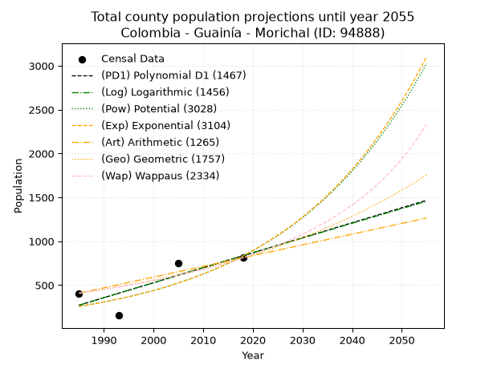
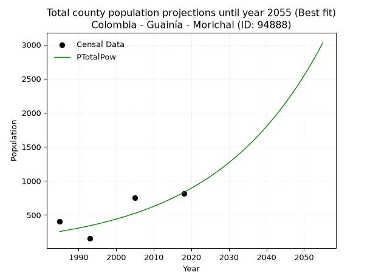
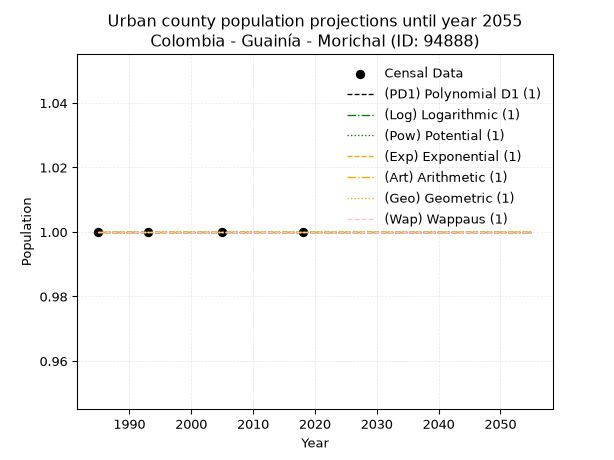
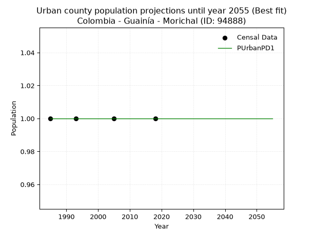

<div align="center">


</div>

# _“Population and Public Services Demand Projections (PPSD) until Year 2050 for Colombia - Guainía - Morichal (ANM) (ID: 94888)”_
Keywords: `population` `public-service` `projection` `lineal` `polynomial` `logarithmic` `potential` `exponential` `arithmetic` `geometric` `wappaus` `dane` `colombia` `south-america`

PPSD are analytical estimates used by governments and planners to anticipate future changes in population size, age distribution, and the resulting community needs for utilities, healthcare, education, and infrastructure as sizing future water treatment facilities, electrical grids, and road networks based on spatial growth.

> **General running parameters**: • app_version: _v20260806_. • Python version: _3.14.7_. • Pandas version: _3.0.5_. • NumPy version: _2.5.1_. • Creates, save and include plots into reports (create_plot): _False_. • Projection until year: _2050_. • Process polynomial degree 2 and up: _False_. • Process Wappaus: _True_. • Process Wappaus: _True_. • Set negative values to zero: _True_. • Set infinite values to zero: _True_. • Drop dataset notes: _True_. 
<div align="center">

Dynamic map: [:earth_americas:Google](http://maps.google.com/maps?q=2.421379279,-69.8394143) [:earth_americas:OSM](https://www.openstreetmap.org/#map=18/2.421379279/-69.8394143&layers=P) [:earth_americas:Bing](https://www.bing.com/maps?cp=2.421379279~-69.8394143&lvl=18) [:earth_americas:Apple](https://maps.apple.com/frame?center=2.421379279%2C-69.8394143&span=0.003%2C0.006)

</div>


<div align="center">

```geojson
{
  "type": "Feature",
  "geometry": {
    "type": "Point", 
    "coordinates": [-69.8394143, 2.421379279]
  }, 
  "properties": {
    "Name": "Colombia - Guainía - Morichal (ANM) (ID: 94888)"
  }
}
```

</div>


## 0. Census Data (4 records)

Census data are official statistics collected by a government about the people and housing in a country. They usually include counts of total population, age, sex, race, income, education, and jobs.

📅Global census file: [Population.xlsx](../data/Population.xlsx)

| Source   |   Year |   CountryID | CountryName   |   StateID | StateName   |   CountyID | CountyName     |   PTotal |   PUrban |   PRural |
|:---------|-------:|------------:|:--------------|----------:|:------------|-----------:|:---------------|---------:|---------:|---------:|
| DANE     |   1985 |          57 | Colombia      |        94 | Guainía     |      94888 | Morichal (ANM) |      408 |        1 |      408 |
| DANE     |   1993 |          57 | Colombia      |        94 | Guainía     |      94888 | Morichal       |      155 |        1 |      155 |
| DANE     |   2005 |          57 | Colombia      |        94 | Guainía     |      94888 | Morichal       |      752 |        1 |      752 |
| DANE     |   2018 |          57 | Colombia      |        94 | Guainía     |      94888 | Morichal       |      812 |        1 |      812 |

> 🔥Some records could had specific notes about the registered values or the corresponding urban or rural distribution.

## 1. Total

### 1.1. Coefficients and Parameters

* (PD1) Polynomial Deg 1: 17.084303492573188, -33641.128061019524 (lineal)
* (Log) Logarithmic: 34184.57494294398, -259305.47807930867
* (Pow) Potential: 71.10073976788907, -232.06224261950356
* (Exp) Exponential: 0.0355479278511496, 5.838402713245284e-29
* (Art) Arithmetic: Year diff. 2018 - 1985 = 33, Population diff. 812 - 408 = 404, Annual growth = 12.242424242424242
* (Geo) Geometric: Year diff. 2018 - 1985 = 33, Population diff. 812 - 408 = 404, Annual growth % = 0.021074547253528975
* (Wap) Wappaus: i = 2.00695479384004, Condition values only valid for < 200)

<sub>
Wappaus condition values: ['0.00', '2.01', '4.01', '6.02', '8.03', '10.03', '12.04', '14.05', '16.06', '18.06', '20.07', '22.08', '24.08', '26.09', '28.10', '30.10', '32.11', '34.12', '36.13', '38.13', '40.14', '42.15', '44.15', '46.16', '48.17', '50.17', '52.18', '54.19', '56.19', '58.20', '60.21', '62.22', '64.22', '66.23', '68.24', '70.24', '72.25', '74.26', '76.26', '78.27', '80.28', '82.29', '84.29', '86.30', '88.31', '90.31', '92.32', '94.33', '96.33', '98.34', '100.35', '102.35', '104.36', '106.37', '108.38', '110.38', '112.39', '114.40', '116.40', '118.41', '120.42', '122.42', '124.43', '126.44', '128.45', '130.45']
</sub>


### 1.2. Projected Dataset

|   Year |   CountyID |   PTotalPD1 |   PTotalLog |   PTotalPow |   PTotalExp |   PTotalArt |   PTotalGeo |   PTotalWap |
|-------:|-----------:|------------:|------------:|------------:|------------:|------------:|------------:|------------:|
|   1985 |      94888 |         271 |         271 |         258 |         258 |         408 |         408 |         408 |
|   1986 |      94888 |         288 |         288 |         267 |         267 |         420 |         417 |         416 |
|   1987 |      94888 |         305 |         305 |         277 |         277 |         432 |         425 |         425 |
|   1988 |      94888 |         322 |         322 |         287 |         287 |         445 |         434 |         433 |
|   1989 |      94888 |         340 |         340 |         297 |         297 |         457 |         443 |         442 |
|   1990 |      94888 |         357 |         357 |         308 |         308 |         469 |         453 |         451 |
|   1991 |      94888 |         374 |         374 |         319 |         319 |         481 |         462 |         460 |
|   1992 |      94888 |         391 |         391 |         331 |         331 |         494 |         472 |         470 |
|   1993 |      94888 |         408 |         408 |         343 |         343 |         506 |         482 |         479 |
|   1994 |      94888 |         425 |         425 |         355 |         355 |         518 |         492 |         489 |
|   1995 |      94888 |         442 |         443 |         368 |         368 |         530 |         503 |         499 |
|   1996 |      94888 |         459 |         460 |         382 |         381 |         543 |         513 |         509 |
|   1997 |      94888 |         476 |         477 |         395 |         395 |         555 |         524 |         520 |
|   1998 |      94888 |         493 |         494 |         410 |         409 |         567 |         535 |         530 |
|   1999 |      94888 |         510 |         511 |         425 |         424 |         579 |         546 |         541 |
|   2000 |      94888 |         527 |         528 |         440 |         439 |         592 |         558 |         553 |
|   2001 |      94888 |         545 |         545 |         456 |         455 |         604 |         570 |         564 |
|   2002 |      94888 |         562 |         562 |         472 |         472 |         616 |         582 |         576 |
|   2003 |      94888 |         579 |         579 |         489 |         489 |         628 |         594 |         588 |
|   2004 |      94888 |         596 |         596 |         507 |         507 |         641 |         606 |         600 |
|   2005 |      94888 |         613 |         613 |         525 |         525 |         653 |         619 |         613 |
|   2006 |      94888 |         630 |         631 |         544 |         544 |         665 |         632 |         626 |
|   2007 |      94888 |         647 |         648 |         564 |         564 |         677 |         646 |         639 |
|   2008 |      94888 |         664 |         665 |         584 |         584 |         690 |         659 |         653 |
|   2009 |      94888 |         681 |         682 |         605 |         605 |         702 |         673 |         667 |
|   2010 |      94888 |         698 |         699 |         627 |         627 |         714 |         687 |         681 |
|   2011 |      94888 |         715 |         716 |         650 |         650 |         726 |         702 |         696 |
|   2012 |      94888 |         732 |         733 |         673 |         673 |         739 |         716 |         711 |
|   2013 |      94888 |         750 |         750 |         697 |         697 |         751 |         732 |         727 |
|   2014 |      94888 |         767 |         767 |         722 |         723 |         763 |         747 |         743 |
|   2015 |      94888 |         784 |         784 |         748 |         749 |         775 |         763 |         759 |
|   2016 |      94888 |         801 |         801 |         775 |         776 |         788 |         779 |         776 |
|   2017 |      94888 |         818 |         817 |         803 |         804 |         800 |         795 |         794 |
|   2018 |      94888 |         835 |         834 |         832 |         833 |         812 |         812 |         812 |
|   2019 |      94888 |         852 |         851 |         862 |         863 |         824 |         829 |         831 |
|   2020 |      94888 |         869 |         868 |         893 |         895 |         836 |         847 |         850 |
|   2021 |      94888 |         886 |         885 |         925 |         927 |         849 |         864 |         869 |
|   2022 |      94888 |         903 |         902 |         958 |         960 |         861 |         883 |         890 |
|   2023 |      94888 |         920 |         919 |         992 |         995 |         873 |         901 |         911 |
|   2024 |      94888 |         938 |         936 |        1027 |        1031 |         885 |         920 |         933 |
|   2025 |      94888 |         955 |         953 |        1064 |        1069 |         898 |         940 |         955 |
|   2026 |      94888 |         972 |         970 |        1102 |        1107 |         910 |         959 |         978 |
|   2027 |      94888 |         989 |         987 |        1142 |        1147 |         922 |         980 |        1002 |
|   2028 |      94888 |        1006 |        1003 |        1182 |        1189 |         934 |        1000 |        1027 |
|   2029 |      94888 |        1023 |        1020 |        1224 |        1232 |         947 |        1021 |        1053 |
|   2030 |      94888 |        1040 |        1037 |        1268 |        1276 |         959 |        1043 |        1080 |
|   2031 |      94888 |        1057 |        1054 |        1313 |        1323 |         971 |        1065 |        1108 |
|   2032 |      94888 |        1074 |        1071 |        1360 |        1370 |         983 |        1087 |        1136 |
|   2033 |      94888 |        1091 |        1088 |        1409 |        1420 |         996 |        1110 |        1166 |
|   2034 |      94888 |        1108 |        1104 |        1459 |        1471 |        1008 |        1134 |        1197 |
|   2035 |      94888 |        1125 |        1121 |        1511 |        1525 |        1020 |        1158 |        1230 |
|   2036 |      94888 |        1143 |        1138 |        1564 |        1580 |        1032 |        1182 |        1263 |
|   2037 |      94888 |        1160 |        1155 |        1620 |        1637 |        1045 |        1207 |        1298 |
|   2038 |      94888 |        1177 |        1172 |        1677 |        1696 |        1057 |        1232 |        1335 |
|   2039 |      94888 |        1194 |        1188 |        1737 |        1758 |        1069 |        1258 |        1373 |
|   2040 |      94888 |        1211 |        1205 |        1799 |        1821 |        1081 |        1285 |        1413 |
|   2041 |      94888 |        1228 |        1222 |        1862 |        1887 |        1094 |        1312 |        1455 |
|   2042 |      94888 |        1245 |        1239 |        1928 |        1955 |        1106 |        1339 |        1498 |
|   2043 |      94888 |        1262 |        1255 |        1997 |        2026 |        1118 |        1368 |        1544 |
|   2044 |      94888 |        1279 |        1272 |        2067 |        2099 |        1130 |        1397 |        1592 |
|   2045 |      94888 |        1296 |        1289 |        2140 |        2175 |        1143 |        1426 |        1643 |
|   2046 |      94888 |        1313 |        1305 |        2216 |        2254 |        1155 |        1456 |        1696 |
|   2047 |      94888 |        1330 |        1322 |        2294 |        2336 |        1167 |        1487 |        1752 |
|   2048 |      94888 |        1348 |        1339 |        2376 |        2420 |        1179 |        1518 |        1811 |
|   2049 |      94888 |        1365 |        1356 |        2459 |        2508 |        1192 |        1550 |        1873 |
|   2050 |      94888 |        1382 |        1372 |        2546 |        2599 |        1204 |        1583 |        1939 |
<div align="center">

</img>

</div>


### 1.3. Best fit with absolute and relative error (%)

Relative error puts that difference into context by dividing the absolute error by the true value, creating a unitless ratio or percentage that shows the scale of the mistake.

Absolute and relative error

|   Year | Source   |   CountryID | CountryName   |   StateID | StateName   |   CountyID_x | CountyName     |   PTotal |   PUrban |   PRural |   CountyID_y |   PTotalPD1 |   PTotalLog |   PTotalPow |   PTotalExp |   PTotalArt |   PTotalGeo |   PTotalWap |   PTotalPD1AbsError |   PTotalLogAbsError |   PTotalPowAbsError |   PTotalExpAbsError |   PTotalArtAbsError |   PTotalGeoAbsError |   PTotalWapAbsError |   PTotalPD1RelError |   PTotalLogRelError |   PTotalPowRelError |   PTotalExpRelError |   PTotalArtRelError |   PTotalGeoRelError |   PTotalWapRelError |
|-------:|:---------|------------:|:--------------|----------:|:------------|-------------:|:---------------|---------:|---------:|---------:|-------------:|------------:|------------:|------------:|------------:|------------:|------------:|------------:|--------------------:|--------------------:|--------------------:|--------------------:|--------------------:|--------------------:|--------------------:|--------------------:|--------------------:|--------------------:|--------------------:|--------------------:|--------------------:|--------------------:|
|   1985 | DANE     |          57 | Colombia      |        94 | Guainía     |        94888 | Morichal (ANM) |      408 |        1 |      408 |        94888 |         271 |         271 |         258 |         258 |         408 |         408 |         408 |                 137 |                 137 |                 150 |                 150 |                   0 |                   0 |                   0 |            33.5784  |            33.5784  |            36.7647  |            36.7647  |              0      |              0      |               0     |
|   1993 | DANE     |          57 | Colombia      |        94 | Guainía     |        94888 | Morichal       |      155 |        1 |      155 |        94888 |         408 |         408 |         343 |         343 |         506 |         482 |         479 |                 253 |                 253 |                 188 |                 188 |                 351 |                 327 |                 324 |           163.226   |           163.226   |           121.29    |           121.29    |            226.452  |            210.968  |             209.032 |
|   2005 | DANE     |          57 | Colombia      |        94 | Guainía     |        94888 | Morichal       |      752 |        1 |      752 |        94888 |         613 |         613 |         525 |         525 |         653 |         619 |         613 |                 139 |                 139 |                 227 |                 227 |                  99 |                 133 |                 139 |            18.484   |            18.484   |            30.1862  |            30.1862  |             13.1649 |             17.6862 |              18.484 |
|   2018 | DANE     |          57 | Colombia      |        94 | Guainía     |        94888 | Morichal       |      812 |        1 |      812 |        94888 |         835 |         834 |         832 |         833 |         812 |         812 |         812 |                  23 |                  22 |                  20 |                  21 |                   0 |                   0 |                   0 |             2.83251 |             2.70936 |             2.46305 |             2.58621 |              0      |              0      |               0     |

Relative error mean

| Method    |   RelError | Best   |
|:----------|-----------:|:-------|
| PTotalPD1 |    54.5302 |        |
| PTotalLog |    54.4994 |        |
| PTotalPow |    47.6761 | True   |
| PTotalExp |    47.7069 |        |
| PTotalArt |    59.9041 |        |
| PTotalGeo |    57.1635 |        |
| PTotalWap |    56.8791 |        |

💙Best method: _**PTotalPow**_
<div align="center">

</img>

</div>


### 1.4. Fresh water supply demand in liters per capita per day (lpcd)

The fresh water supply demand typically ranges from 100 to 300 liters per capita per day (lpcd) for standard domestic and municipal planning, though absolute survival minimums set by the World Health Organization are as low as 7.5 to 20 liters per day, and total consumption in high-income nations can exceed 400 liters.

> `CZ`: Level in meters above the sea level (masl).<br> `WS`: Fresh water supply demand in liters per capita per day (lpcd or l/h/d).<br> `WSAll`: Zonal fresh water supply demand in liters per second (l/s).<br> `A`: Zonal area in square meters.

Reference values (RAS Colombia)

|    CZ |   WS |
|------:|-----:|
|  1000 |  120 |
|  2000 |  130 |
| 99999 |  140 |

County shapefile geometry properties and water supply values

|   CountyID |      ATotal |   CZTotal |   WSTotal |
|-----------:|------------:|----------:|----------:|
|      94888 | 8.51375e+09 |    185.05 |       120 |

Projected values for best method: PTotalPow

|   CountyID |   Year |   PTotalPow |   WSTotal |   WSTotalAll |
|-----------:|-------:|------------:|----------:|-------------:|
|      94888 |   1985 |         258 |       120 |     0.358333 |
|      94888 |   1986 |         267 |       120 |     0.370833 |
|      94888 |   1987 |         277 |       120 |     0.384722 |
|      94888 |   1988 |         287 |       120 |     0.398611 |
|      94888 |   1989 |         297 |       120 |     0.4125   |
|      94888 |   1990 |         308 |       120 |     0.427778 |
|      94888 |   1991 |         319 |       120 |     0.443056 |
|      94888 |   1992 |         331 |       120 |     0.459722 |
|      94888 |   1993 |         343 |       120 |     0.476389 |
|      94888 |   1994 |         355 |       120 |     0.493056 |
|      94888 |   1995 |         368 |       120 |     0.511111 |
|      94888 |   1996 |         382 |       120 |     0.530556 |
|      94888 |   1997 |         395 |       120 |     0.548611 |
|      94888 |   1998 |         410 |       120 |     0.569444 |
|      94888 |   1999 |         425 |       120 |     0.590278 |
|      94888 |   2000 |         440 |       120 |     0.611111 |
|      94888 |   2001 |         456 |       120 |     0.633333 |
|      94888 |   2002 |         472 |       120 |     0.655556 |
|      94888 |   2003 |         489 |       120 |     0.679167 |
|      94888 |   2004 |         507 |       120 |     0.704167 |
|      94888 |   2005 |         525 |       120 |     0.729167 |
|      94888 |   2006 |         544 |       120 |     0.755556 |
|      94888 |   2007 |         564 |       120 |     0.783333 |
|      94888 |   2008 |         584 |       120 |     0.811111 |
|      94888 |   2009 |         605 |       120 |     0.840278 |
|      94888 |   2010 |         627 |       120 |     0.870833 |
|      94888 |   2011 |         650 |       120 |     0.902778 |
|      94888 |   2012 |         673 |       120 |     0.934722 |
|      94888 |   2013 |         697 |       120 |     0.968056 |
|      94888 |   2014 |         722 |       120 |     1.00278  |
|      94888 |   2015 |         748 |       120 |     1.03889  |
|      94888 |   2016 |         775 |       120 |     1.07639  |
|      94888 |   2017 |         803 |       120 |     1.11528  |
|      94888 |   2018 |         832 |       120 |     1.15556  |
|      94888 |   2019 |         862 |       120 |     1.19722  |
|      94888 |   2020 |         893 |       120 |     1.24028  |
|      94888 |   2021 |         925 |       120 |     1.28472  |
|      94888 |   2022 |         958 |       120 |     1.33056  |
|      94888 |   2023 |         992 |       120 |     1.37778  |
|      94888 |   2024 |        1027 |       120 |     1.42639  |
|      94888 |   2025 |        1064 |       120 |     1.47778  |
|      94888 |   2026 |        1102 |       120 |     1.53056  |
|      94888 |   2027 |        1142 |       120 |     1.58611  |
|      94888 |   2028 |        1182 |       120 |     1.64167  |
|      94888 |   2029 |        1224 |       120 |     1.7      |
|      94888 |   2030 |        1268 |       120 |     1.76111  |
|      94888 |   2031 |        1313 |       120 |     1.82361  |
|      94888 |   2032 |        1360 |       120 |     1.88889  |
|      94888 |   2033 |        1409 |       120 |     1.95694  |
|      94888 |   2034 |        1459 |       120 |     2.02639  |
|      94888 |   2035 |        1511 |       120 |     2.09861  |
|      94888 |   2036 |        1564 |       120 |     2.17222  |
|      94888 |   2037 |        1620 |       120 |     2.25     |
|      94888 |   2038 |        1677 |       120 |     2.32917  |
|      94888 |   2039 |        1737 |       120 |     2.4125   |
|      94888 |   2040 |        1799 |       120 |     2.49861  |
|      94888 |   2041 |        1862 |       120 |     2.58611  |
|      94888 |   2042 |        1928 |       120 |     2.67778  |
|      94888 |   2043 |        1997 |       120 |     2.77361  |
|      94888 |   2044 |        2067 |       120 |     2.87083  |
|      94888 |   2045 |        2140 |       120 |     2.97222  |
|      94888 |   2046 |        2216 |       120 |     3.07778  |
|      94888 |   2047 |        2294 |       120 |     3.18611  |
|      94888 |   2048 |        2376 |       120 |     3.3      |
|      94888 |   2049 |        2459 |       120 |     3.41528  |
|      94888 |   2050 |        2546 |       120 |     3.53611  |

## 2. Urban

### 2.1. Coefficients and Parameters

* (PD1) Polynomial Deg 1: -1.3233529347183512e-19, 1.0000000000000004 (lineal)
* (Log) Logarithmic: 3.215569112241165e-17, 0.9999999999999996
* (Pow) Potential: 0.0, 0.0
* (Exp) Exponential: 0.0, 1.0
* (Art) Arithmetic: Year diff. 2018 - 1985 = 33, Population diff. 1 - 1 = 0, Annual growth = 0.0
* (Geo) Geometric: Year diff. 2018 - 1985 = 33, Population diff. 1 - 1 = 0, Annual growth % = 0.0
* (Wap) Wappaus: i = 0.0, Condition values only valid for < 200)

<sub>
Wappaus condition values: ['0.00', '0.00', '0.00', '0.00', '0.00', '0.00', '0.00', '0.00', '0.00', '0.00', '0.00', '0.00', '0.00', '0.00', '0.00', '0.00', '0.00', '0.00', '0.00', '0.00', '0.00', '0.00', '0.00', '0.00', '0.00', '0.00', '0.00', '0.00', '0.00', '0.00', '0.00', '0.00', '0.00', '0.00', '0.00', '0.00', '0.00', '0.00', '0.00', '0.00', '0.00', '0.00', '0.00', '0.00', '0.00', '0.00', '0.00', '0.00', '0.00', '0.00', '0.00', '0.00', '0.00', '0.00', '0.00', '0.00', '0.00', '0.00', '0.00', '0.00', '0.00', '0.00', '0.00', '0.00', '0.00', '0.00']
</sub>


### 2.2. Projected Dataset

|   Year |   CountyID |   PUrbanPD1 |   PUrbanLog |   PUrbanPow |   PUrbanExp |   PUrbanArt |   PUrbanGeo |   PUrbanWap |
|-------:|-----------:|------------:|------------:|------------:|------------:|------------:|------------:|------------:|
|   1985 |      94888 |           1 |           1 |           1 |           1 |           1 |           1 |           1 |
|   1986 |      94888 |           1 |           1 |           1 |           1 |           1 |           1 |           1 |
|   1987 |      94888 |           1 |           1 |           1 |           1 |           1 |           1 |           1 |
|   1988 |      94888 |           1 |           1 |           1 |           1 |           1 |           1 |           1 |
|   1989 |      94888 |           1 |           1 |           1 |           1 |           1 |           1 |           1 |
|   1990 |      94888 |           1 |           1 |           1 |           1 |           1 |           1 |           1 |
|   1991 |      94888 |           1 |           1 |           1 |           1 |           1 |           1 |           1 |
|   1992 |      94888 |           1 |           1 |           1 |           1 |           1 |           1 |           1 |
|   1993 |      94888 |           1 |           1 |           1 |           1 |           1 |           1 |           1 |
|   1994 |      94888 |           1 |           1 |           1 |           1 |           1 |           1 |           1 |
|   1995 |      94888 |           1 |           1 |           1 |           1 |           1 |           1 |           1 |
|   1996 |      94888 |           1 |           1 |           1 |           1 |           1 |           1 |           1 |
|   1997 |      94888 |           1 |           1 |           1 |           1 |           1 |           1 |           1 |
|   1998 |      94888 |           1 |           1 |           1 |           1 |           1 |           1 |           1 |
|   1999 |      94888 |           1 |           1 |           1 |           1 |           1 |           1 |           1 |
|   2000 |      94888 |           1 |           1 |           1 |           1 |           1 |           1 |           1 |
|   2001 |      94888 |           1 |           1 |           1 |           1 |           1 |           1 |           1 |
|   2002 |      94888 |           1 |           1 |           1 |           1 |           1 |           1 |           1 |
|   2003 |      94888 |           1 |           1 |           1 |           1 |           1 |           1 |           1 |
|   2004 |      94888 |           1 |           1 |           1 |           1 |           1 |           1 |           1 |
|   2005 |      94888 |           1 |           1 |           1 |           1 |           1 |           1 |           1 |
|   2006 |      94888 |           1 |           1 |           1 |           1 |           1 |           1 |           1 |
|   2007 |      94888 |           1 |           1 |           1 |           1 |           1 |           1 |           1 |
|   2008 |      94888 |           1 |           1 |           1 |           1 |           1 |           1 |           1 |
|   2009 |      94888 |           1 |           1 |           1 |           1 |           1 |           1 |           1 |
|   2010 |      94888 |           1 |           1 |           1 |           1 |           1 |           1 |           1 |
|   2011 |      94888 |           1 |           1 |           1 |           1 |           1 |           1 |           1 |
|   2012 |      94888 |           1 |           1 |           1 |           1 |           1 |           1 |           1 |
|   2013 |      94888 |           1 |           1 |           1 |           1 |           1 |           1 |           1 |
|   2014 |      94888 |           1 |           1 |           1 |           1 |           1 |           1 |           1 |
|   2015 |      94888 |           1 |           1 |           1 |           1 |           1 |           1 |           1 |
|   2016 |      94888 |           1 |           1 |           1 |           1 |           1 |           1 |           1 |
|   2017 |      94888 |           1 |           1 |           1 |           1 |           1 |           1 |           1 |
|   2018 |      94888 |           1 |           1 |           1 |           1 |           1 |           1 |           1 |
|   2019 |      94888 |           1 |           1 |           1 |           1 |           1 |           1 |           1 |
|   2020 |      94888 |           1 |           1 |           1 |           1 |           1 |           1 |           1 |
|   2021 |      94888 |           1 |           1 |           1 |           1 |           1 |           1 |           1 |
|   2022 |      94888 |           1 |           1 |           1 |           1 |           1 |           1 |           1 |
|   2023 |      94888 |           1 |           1 |           1 |           1 |           1 |           1 |           1 |
|   2024 |      94888 |           1 |           1 |           1 |           1 |           1 |           1 |           1 |
|   2025 |      94888 |           1 |           1 |           1 |           1 |           1 |           1 |           1 |
|   2026 |      94888 |           1 |           1 |           1 |           1 |           1 |           1 |           1 |
|   2027 |      94888 |           1 |           1 |           1 |           1 |           1 |           1 |           1 |
|   2028 |      94888 |           1 |           1 |           1 |           1 |           1 |           1 |           1 |
|   2029 |      94888 |           1 |           1 |           1 |           1 |           1 |           1 |           1 |
|   2030 |      94888 |           1 |           1 |           1 |           1 |           1 |           1 |           1 |
|   2031 |      94888 |           1 |           1 |           1 |           1 |           1 |           1 |           1 |
|   2032 |      94888 |           1 |           1 |           1 |           1 |           1 |           1 |           1 |
|   2033 |      94888 |           1 |           1 |           1 |           1 |           1 |           1 |           1 |
|   2034 |      94888 |           1 |           1 |           1 |           1 |           1 |           1 |           1 |
|   2035 |      94888 |           1 |           1 |           1 |           1 |           1 |           1 |           1 |
|   2036 |      94888 |           1 |           1 |           1 |           1 |           1 |           1 |           1 |
|   2037 |      94888 |           1 |           1 |           1 |           1 |           1 |           1 |           1 |
|   2038 |      94888 |           1 |           1 |           1 |           1 |           1 |           1 |           1 |
|   2039 |      94888 |           1 |           1 |           1 |           1 |           1 |           1 |           1 |
|   2040 |      94888 |           1 |           1 |           1 |           1 |           1 |           1 |           1 |
|   2041 |      94888 |           1 |           1 |           1 |           1 |           1 |           1 |           1 |
|   2042 |      94888 |           1 |           1 |           1 |           1 |           1 |           1 |           1 |
|   2043 |      94888 |           1 |           1 |           1 |           1 |           1 |           1 |           1 |
|   2044 |      94888 |           1 |           1 |           1 |           1 |           1 |           1 |           1 |
|   2045 |      94888 |           1 |           1 |           1 |           1 |           1 |           1 |           1 |
|   2046 |      94888 |           1 |           1 |           1 |           1 |           1 |           1 |           1 |
|   2047 |      94888 |           1 |           1 |           1 |           1 |           1 |           1 |           1 |
|   2048 |      94888 |           1 |           1 |           1 |           1 |           1 |           1 |           1 |
|   2049 |      94888 |           1 |           1 |           1 |           1 |           1 |           1 |           1 |
|   2050 |      94888 |           1 |           1 |           1 |           1 |           1 |           1 |           1 |
<div align="center">

</img>

</div>


### 2.3. Best fit with absolute and relative error (%)

Relative error puts that difference into context by dividing the absolute error by the true value, creating a unitless ratio or percentage that shows the scale of the mistake.

Absolute and relative error

|   Year | Source   |   CountryID | CountryName   |   StateID | StateName   |   CountyID_x | CountyName     |   PTotal |   PUrban |   PRural |   CountyID_y |   PUrbanPD1 |   PUrbanLog |   PUrbanPow |   PUrbanExp |   PUrbanArt |   PUrbanGeo |   PUrbanWap |   PUrbanPD1AbsError |   PUrbanLogAbsError |   PUrbanPowAbsError |   PUrbanExpAbsError |   PUrbanArtAbsError |   PUrbanGeoAbsError |   PUrbanWapAbsError |   PUrbanPD1RelError |   PUrbanLogRelError |   PUrbanPowRelError |   PUrbanExpRelError |   PUrbanArtRelError |   PUrbanGeoRelError |   PUrbanWapRelError |
|-------:|:---------|------------:|:--------------|----------:|:------------|-------------:|:---------------|---------:|---------:|---------:|-------------:|------------:|------------:|------------:|------------:|------------:|------------:|------------:|--------------------:|--------------------:|--------------------:|--------------------:|--------------------:|--------------------:|--------------------:|--------------------:|--------------------:|--------------------:|--------------------:|--------------------:|--------------------:|--------------------:|
|   1985 | DANE     |          57 | Colombia      |        94 | Guainía     |        94888 | Morichal (ANM) |      408 |        1 |      408 |        94888 |           1 |           1 |           1 |           1 |           1 |           1 |           1 |                   0 |                   0 |                   0 |                   0 |                   0 |                   0 |                   0 |                   0 |                   0 |                   0 |                   0 |                   0 |                   0 |                   0 |
|   1993 | DANE     |          57 | Colombia      |        94 | Guainía     |        94888 | Morichal       |      155 |        1 |      155 |        94888 |           1 |           1 |           1 |           1 |           1 |           1 |           1 |                   0 |                   0 |                   0 |                   0 |                   0 |                   0 |                   0 |                   0 |                   0 |                   0 |                   0 |                   0 |                   0 |                   0 |
|   2005 | DANE     |          57 | Colombia      |        94 | Guainía     |        94888 | Morichal       |      752 |        1 |      752 |        94888 |           1 |           1 |           1 |           1 |           1 |           1 |           1 |                   0 |                   0 |                   0 |                   0 |                   0 |                   0 |                   0 |                   0 |                   0 |                   0 |                   0 |                   0 |                   0 |                   0 |
|   2018 | DANE     |          57 | Colombia      |        94 | Guainía     |        94888 | Morichal       |      812 |        1 |      812 |        94888 |           1 |           1 |           1 |           1 |           1 |           1 |           1 |                   0 |                   0 |                   0 |                   0 |                   0 |                   0 |                   0 |                   0 |                   0 |                   0 |                   0 |                   0 |                   0 |                   0 |

Relative error mean

| Method    |   RelError | Best   |
|:----------|-----------:|:-------|
| PUrbanPD1 |          0 | True   |
| PUrbanLog |          0 | True   |
| PUrbanPow |          0 | True   |
| PUrbanExp |          0 | True   |
| PUrbanArt |          0 | True   |
| PUrbanGeo |          0 | True   |
| PUrbanWap |          0 | True   |

💙Best method: _**PUrbanPD1**_
<div align="center">

</img>

</div>


### 2.4. Fresh water supply demand in liters per capita per day (lpcd)

The fresh water supply demand typically ranges from 100 to 300 liters per capita per day (lpcd) for standard domestic and municipal planning, though absolute survival minimums set by the World Health Organization are as low as 7.5 to 20 liters per day, and total consumption in high-income nations can exceed 400 liters.

> `CZ`: Level in meters above the sea level (masl).<br> `WS`: Fresh water supply demand in liters per capita per day (lpcd or l/h/d).<br> `WSAll`: Zonal fresh water supply demand in liters per second (l/s).<br> `A`: Zonal area in square meters.

Reference values (RAS Colombia)

|    CZ |   WS |
|------:|-----:|
|  1000 |  120 |
|  2000 |  130 |
| 99999 |  140 |

County shapefile geometry properties and water supply values

|   CountyID |   AUrban |   CZUrban |   WSUrban |
|-----------:|---------:|----------:|----------:|
|      94888 |        0 |         0 |       120 |

Projected values for best method: PUrbanPD1

|   CountyID |   Year |   PUrbanPD1 |   WSUrban |   WSUrbanAll |
|-----------:|-------:|------------:|----------:|-------------:|
|      94888 |   1985 |           1 |       120 |   0.00138889 |
|      94888 |   1986 |           1 |       120 |   0.00138889 |
|      94888 |   1987 |           1 |       120 |   0.00138889 |
|      94888 |   1988 |           1 |       120 |   0.00138889 |
|      94888 |   1989 |           1 |       120 |   0.00138889 |
|      94888 |   1990 |           1 |       120 |   0.00138889 |
|      94888 |   1991 |           1 |       120 |   0.00138889 |
|      94888 |   1992 |           1 |       120 |   0.00138889 |
|      94888 |   1993 |           1 |       120 |   0.00138889 |
|      94888 |   1994 |           1 |       120 |   0.00138889 |
|      94888 |   1995 |           1 |       120 |   0.00138889 |
|      94888 |   1996 |           1 |       120 |   0.00138889 |
|      94888 |   1997 |           1 |       120 |   0.00138889 |
|      94888 |   1998 |           1 |       120 |   0.00138889 |
|      94888 |   1999 |           1 |       120 |   0.00138889 |
|      94888 |   2000 |           1 |       120 |   0.00138889 |
|      94888 |   2001 |           1 |       120 |   0.00138889 |
|      94888 |   2002 |           1 |       120 |   0.00138889 |
|      94888 |   2003 |           1 |       120 |   0.00138889 |
|      94888 |   2004 |           1 |       120 |   0.00138889 |
|      94888 |   2005 |           1 |       120 |   0.00138889 |
|      94888 |   2006 |           1 |       120 |   0.00138889 |
|      94888 |   2007 |           1 |       120 |   0.00138889 |
|      94888 |   2008 |           1 |       120 |   0.00138889 |
|      94888 |   2009 |           1 |       120 |   0.00138889 |
|      94888 |   2010 |           1 |       120 |   0.00138889 |
|      94888 |   2011 |           1 |       120 |   0.00138889 |
|      94888 |   2012 |           1 |       120 |   0.00138889 |
|      94888 |   2013 |           1 |       120 |   0.00138889 |
|      94888 |   2014 |           1 |       120 |   0.00138889 |
|      94888 |   2015 |           1 |       120 |   0.00138889 |
|      94888 |   2016 |           1 |       120 |   0.00138889 |
|      94888 |   2017 |           1 |       120 |   0.00138889 |
|      94888 |   2018 |           1 |       120 |   0.00138889 |
|      94888 |   2019 |           1 |       120 |   0.00138889 |
|      94888 |   2020 |           1 |       120 |   0.00138889 |
|      94888 |   2021 |           1 |       120 |   0.00138889 |
|      94888 |   2022 |           1 |       120 |   0.00138889 |
|      94888 |   2023 |           1 |       120 |   0.00138889 |
|      94888 |   2024 |           1 |       120 |   0.00138889 |
|      94888 |   2025 |           1 |       120 |   0.00138889 |
|      94888 |   2026 |           1 |       120 |   0.00138889 |
|      94888 |   2027 |           1 |       120 |   0.00138889 |
|      94888 |   2028 |           1 |       120 |   0.00138889 |
|      94888 |   2029 |           1 |       120 |   0.00138889 |
|      94888 |   2030 |           1 |       120 |   0.00138889 |
|      94888 |   2031 |           1 |       120 |   0.00138889 |
|      94888 |   2032 |           1 |       120 |   0.00138889 |
|      94888 |   2033 |           1 |       120 |   0.00138889 |
|      94888 |   2034 |           1 |       120 |   0.00138889 |
|      94888 |   2035 |           1 |       120 |   0.00138889 |
|      94888 |   2036 |           1 |       120 |   0.00138889 |
|      94888 |   2037 |           1 |       120 |   0.00138889 |
|      94888 |   2038 |           1 |       120 |   0.00138889 |
|      94888 |   2039 |           1 |       120 |   0.00138889 |
|      94888 |   2040 |           1 |       120 |   0.00138889 |
|      94888 |   2041 |           1 |       120 |   0.00138889 |
|      94888 |   2042 |           1 |       120 |   0.00138889 |
|      94888 |   2043 |           1 |       120 |   0.00138889 |
|      94888 |   2044 |           1 |       120 |   0.00138889 |
|      94888 |   2045 |           1 |       120 |   0.00138889 |
|      94888 |   2046 |           1 |       120 |   0.00138889 |
|      94888 |   2047 |           1 |       120 |   0.00138889 |
|      94888 |   2048 |           1 |       120 |   0.00138889 |
|      94888 |   2049 |           1 |       120 |   0.00138889 |
|      94888 |   2050 |           1 |       120 |   0.00138889 |

## 3. Rural

### 3.1. Coefficients and Parameters

* (PD1) Polynomial Deg 1: 17.084303492573188, -33641.128061019524 (lineal)
* (Log) Logarithmic: 34184.57494294398, -259305.47807930867
* (Pow) Potential: 71.10073976788907, -232.06224261950356
* (Exp) Exponential: 0.0355479278511496, 5.838402713245284e-29
* (Art) Arithmetic: Year diff. 2018 - 1985 = 33, Population diff. 812 - 408 = 404, Annual growth = 12.242424242424242
* (Geo) Geometric: Year diff. 2018 - 1985 = 33, Population diff. 812 - 408 = 404, Annual growth % = 0.021074547253528975
* (Wap) Wappaus: i = 2.00695479384004, Condition values only valid for < 200)

<sub>
Wappaus condition values: ['0.00', '2.01', '4.01', '6.02', '8.03', '10.03', '12.04', '14.05', '16.06', '18.06', '20.07', '22.08', '24.08', '26.09', '28.10', '30.10', '32.11', '34.12', '36.13', '38.13', '40.14', '42.15', '44.15', '46.16', '48.17', '50.17', '52.18', '54.19', '56.19', '58.20', '60.21', '62.22', '64.22', '66.23', '68.24', '70.24', '72.25', '74.26', '76.26', '78.27', '80.28', '82.29', '84.29', '86.30', '88.31', '90.31', '92.32', '94.33', '96.33', '98.34', '100.35', '102.35', '104.36', '106.37', '108.38', '110.38', '112.39', '114.40', '116.40', '118.41', '120.42', '122.42', '124.43', '126.44', '128.45', '130.45']
</sub>


### 3.2. Projected Dataset

|   Year |   CountyID |   PRuralPD1 |   PRuralLog |   PRuralPow |   PRuralExp |   PRuralArt |   PRuralGeo |   PRuralWap |
|-------:|-----------:|------------:|------------:|------------:|------------:|------------:|------------:|------------:|
|   1985 |      94888 |         271 |         271 |         258 |         258 |         408 |         408 |         408 |
|   1986 |      94888 |         288 |         288 |         267 |         267 |         420 |         417 |         416 |
|   1987 |      94888 |         305 |         305 |         277 |         277 |         432 |         425 |         425 |
|   1988 |      94888 |         322 |         322 |         287 |         287 |         445 |         434 |         433 |
|   1989 |      94888 |         340 |         340 |         297 |         297 |         457 |         443 |         442 |
|   1990 |      94888 |         357 |         357 |         308 |         308 |         469 |         453 |         451 |
|   1991 |      94888 |         374 |         374 |         319 |         319 |         481 |         462 |         460 |
|   1992 |      94888 |         391 |         391 |         331 |         331 |         494 |         472 |         470 |
|   1993 |      94888 |         408 |         408 |         343 |         343 |         506 |         482 |         479 |
|   1994 |      94888 |         425 |         425 |         355 |         355 |         518 |         492 |         489 |
|   1995 |      94888 |         442 |         443 |         368 |         368 |         530 |         503 |         499 |
|   1996 |      94888 |         459 |         460 |         382 |         381 |         543 |         513 |         509 |
|   1997 |      94888 |         476 |         477 |         395 |         395 |         555 |         524 |         520 |
|   1998 |      94888 |         493 |         494 |         410 |         409 |         567 |         535 |         530 |
|   1999 |      94888 |         510 |         511 |         425 |         424 |         579 |         546 |         541 |
|   2000 |      94888 |         527 |         528 |         440 |         439 |         592 |         558 |         553 |
|   2001 |      94888 |         545 |         545 |         456 |         455 |         604 |         570 |         564 |
|   2002 |      94888 |         562 |         562 |         472 |         472 |         616 |         582 |         576 |
|   2003 |      94888 |         579 |         579 |         489 |         489 |         628 |         594 |         588 |
|   2004 |      94888 |         596 |         596 |         507 |         507 |         641 |         606 |         600 |
|   2005 |      94888 |         613 |         613 |         525 |         525 |         653 |         619 |         613 |
|   2006 |      94888 |         630 |         631 |         544 |         544 |         665 |         632 |         626 |
|   2007 |      94888 |         647 |         648 |         564 |         564 |         677 |         646 |         639 |
|   2008 |      94888 |         664 |         665 |         584 |         584 |         690 |         659 |         653 |
|   2009 |      94888 |         681 |         682 |         605 |         605 |         702 |         673 |         667 |
|   2010 |      94888 |         698 |         699 |         627 |         627 |         714 |         687 |         681 |
|   2011 |      94888 |         715 |         716 |         650 |         650 |         726 |         702 |         696 |
|   2012 |      94888 |         732 |         733 |         673 |         673 |         739 |         716 |         711 |
|   2013 |      94888 |         750 |         750 |         697 |         697 |         751 |         732 |         727 |
|   2014 |      94888 |         767 |         767 |         722 |         723 |         763 |         747 |         743 |
|   2015 |      94888 |         784 |         784 |         748 |         749 |         775 |         763 |         759 |
|   2016 |      94888 |         801 |         801 |         775 |         776 |         788 |         779 |         776 |
|   2017 |      94888 |         818 |         817 |         803 |         804 |         800 |         795 |         794 |
|   2018 |      94888 |         835 |         834 |         832 |         833 |         812 |         812 |         812 |
|   2019 |      94888 |         852 |         851 |         862 |         863 |         824 |         829 |         831 |
|   2020 |      94888 |         869 |         868 |         893 |         895 |         836 |         847 |         850 |
|   2021 |      94888 |         886 |         885 |         925 |         927 |         849 |         864 |         869 |
|   2022 |      94888 |         903 |         902 |         958 |         960 |         861 |         883 |         890 |
|   2023 |      94888 |         920 |         919 |         992 |         995 |         873 |         901 |         911 |
|   2024 |      94888 |         938 |         936 |        1027 |        1031 |         885 |         920 |         933 |
|   2025 |      94888 |         955 |         953 |        1064 |        1069 |         898 |         940 |         955 |
|   2026 |      94888 |         972 |         970 |        1102 |        1107 |         910 |         959 |         978 |
|   2027 |      94888 |         989 |         987 |        1142 |        1147 |         922 |         980 |        1002 |
|   2028 |      94888 |        1006 |        1003 |        1182 |        1189 |         934 |        1000 |        1027 |
|   2029 |      94888 |        1023 |        1020 |        1224 |        1232 |         947 |        1021 |        1053 |
|   2030 |      94888 |        1040 |        1037 |        1268 |        1276 |         959 |        1043 |        1080 |
|   2031 |      94888 |        1057 |        1054 |        1313 |        1323 |         971 |        1065 |        1108 |
|   2032 |      94888 |        1074 |        1071 |        1360 |        1370 |         983 |        1087 |        1136 |
|   2033 |      94888 |        1091 |        1088 |        1409 |        1420 |         996 |        1110 |        1166 |
|   2034 |      94888 |        1108 |        1104 |        1459 |        1471 |        1008 |        1134 |        1197 |
|   2035 |      94888 |        1125 |        1121 |        1511 |        1525 |        1020 |        1158 |        1230 |
|   2036 |      94888 |        1143 |        1138 |        1564 |        1580 |        1032 |        1182 |        1263 |
|   2037 |      94888 |        1160 |        1155 |        1620 |        1637 |        1045 |        1207 |        1298 |
|   2038 |      94888 |        1177 |        1172 |        1677 |        1696 |        1057 |        1232 |        1335 |
|   2039 |      94888 |        1194 |        1188 |        1737 |        1758 |        1069 |        1258 |        1373 |
|   2040 |      94888 |        1211 |        1205 |        1799 |        1821 |        1081 |        1285 |        1413 |
|   2041 |      94888 |        1228 |        1222 |        1862 |        1887 |        1094 |        1312 |        1455 |
|   2042 |      94888 |        1245 |        1239 |        1928 |        1955 |        1106 |        1339 |        1498 |
|   2043 |      94888 |        1262 |        1255 |        1997 |        2026 |        1118 |        1368 |        1544 |
|   2044 |      94888 |        1279 |        1272 |        2067 |        2099 |        1130 |        1397 |        1592 |
|   2045 |      94888 |        1296 |        1289 |        2140 |        2175 |        1143 |        1426 |        1643 |
|   2046 |      94888 |        1313 |        1305 |        2216 |        2254 |        1155 |        1456 |        1696 |
|   2047 |      94888 |        1330 |        1322 |        2294 |        2336 |        1167 |        1487 |        1752 |
|   2048 |      94888 |        1348 |        1339 |        2376 |        2420 |        1179 |        1518 |        1811 |
|   2049 |      94888 |        1365 |        1356 |        2459 |        2508 |        1192 |        1550 |        1873 |
|   2050 |      94888 |        1382 |        1372 |        2546 |        2599 |        1204 |        1583 |        1939 |
<div align="center">

</img>

</div>


### 3.3. Best fit with absolute and relative error (%)

Relative error puts that difference into context by dividing the absolute error by the true value, creating a unitless ratio or percentage that shows the scale of the mistake.

Absolute and relative error

|   Year | Source   |   CountryID | CountryName   |   StateID | StateName   |   CountyID_x | CountyName     |   PTotal |   PUrban |   PRural |   CountyID_y |   PRuralPD1 |   PRuralLog |   PRuralPow |   PRuralExp |   PRuralArt |   PRuralGeo |   PRuralWap |   PRuralPD1AbsError |   PRuralLogAbsError |   PRuralPowAbsError |   PRuralExpAbsError |   PRuralArtAbsError |   PRuralGeoAbsError |   PRuralWapAbsError |   PRuralPD1RelError |   PRuralLogRelError |   PRuralPowRelError |   PRuralExpRelError |   PRuralArtRelError |   PRuralGeoRelError |   PRuralWapRelError |
|-------:|:---------|------------:|:--------------|----------:|:------------|-------------:|:---------------|---------:|---------:|---------:|-------------:|------------:|------------:|------------:|------------:|------------:|------------:|------------:|--------------------:|--------------------:|--------------------:|--------------------:|--------------------:|--------------------:|--------------------:|--------------------:|--------------------:|--------------------:|--------------------:|--------------------:|--------------------:|--------------------:|
|   1985 | DANE     |          57 | Colombia      |        94 | Guainía     |        94888 | Morichal (ANM) |      408 |        1 |      408 |        94888 |         271 |         271 |         258 |         258 |         408 |         408 |         408 |                 137 |                 137 |                 150 |                 150 |                   0 |                   0 |                   0 |            33.5784  |            33.5784  |            36.7647  |            36.7647  |              0      |              0      |               0     |
|   1993 | DANE     |          57 | Colombia      |        94 | Guainía     |        94888 | Morichal       |      155 |        1 |      155 |        94888 |         408 |         408 |         343 |         343 |         506 |         482 |         479 |                 253 |                 253 |                 188 |                 188 |                 351 |                 327 |                 324 |           163.226   |           163.226   |           121.29    |           121.29    |            226.452  |            210.968  |             209.032 |
|   2005 | DANE     |          57 | Colombia      |        94 | Guainía     |        94888 | Morichal       |      752 |        1 |      752 |        94888 |         613 |         613 |         525 |         525 |         653 |         619 |         613 |                 139 |                 139 |                 227 |                 227 |                  99 |                 133 |                 139 |            18.484   |            18.484   |            30.1862  |            30.1862  |             13.1649 |             17.6862 |              18.484 |
|   2018 | DANE     |          57 | Colombia      |        94 | Guainía     |        94888 | Morichal       |      812 |        1 |      812 |        94888 |         835 |         834 |         832 |         833 |         812 |         812 |         812 |                  23 |                  22 |                  20 |                  21 |                   0 |                   0 |                   0 |             2.83251 |             2.70936 |             2.46305 |             2.58621 |              0      |              0      |               0     |

Relative error mean

| Method    |   RelError | Best   |
|:----------|-----------:|:-------|
| PRuralPD1 |    54.5302 |        |
| PRuralLog |    54.4994 |        |
| PRuralPow |    47.6761 | True   |
| PRuralExp |    47.7069 |        |
| PRuralArt |    59.9041 |        |
| PRuralGeo |    57.1635 |        |
| PRuralWap |    56.8791 |        |

💙Best method: _**PRuralPow**_
<div align="center">

</img>

</div>


### 3.4. Fresh water supply demand in liters per capita per day (lpcd)

The fresh water supply demand typically ranges from 100 to 300 liters per capita per day (lpcd) for standard domestic and municipal planning, though absolute survival minimums set by the World Health Organization are as low as 7.5 to 20 liters per day, and total consumption in high-income nations can exceed 400 liters.

> `CZ`: Level in meters above the sea level (masl).<br> `WS`: Fresh water supply demand in liters per capita per day (lpcd or l/h/d).<br> `WSAll`: Zonal fresh water supply demand in liters per second (l/s).<br> `A`: Zonal area in square meters.

Reference values (RAS Colombia)

|    CZ |   WS |
|------:|-----:|
|  1000 |  120 |
|  2000 |  130 |
| 99999 |  140 |

County shapefile geometry properties and water supply values

|   CountyID |      ARural |   CZRural |   WSRural |
|-----------:|------------:|----------:|----------:|
|      94888 | 8.51375e+09 |    185.05 |       120 |

Projected values for best method: PRuralPow

|   CountyID |   Year |   PRuralPow |   WSRural |   WSRuralAll |
|-----------:|-------:|------------:|----------:|-------------:|
|      94888 |   1985 |         258 |       120 |     0.358333 |
|      94888 |   1986 |         267 |       120 |     0.370833 |
|      94888 |   1987 |         277 |       120 |     0.384722 |
|      94888 |   1988 |         287 |       120 |     0.398611 |
|      94888 |   1989 |         297 |       120 |     0.4125   |
|      94888 |   1990 |         308 |       120 |     0.427778 |
|      94888 |   1991 |         319 |       120 |     0.443056 |
|      94888 |   1992 |         331 |       120 |     0.459722 |
|      94888 |   1993 |         343 |       120 |     0.476389 |
|      94888 |   1994 |         355 |       120 |     0.493056 |
|      94888 |   1995 |         368 |       120 |     0.511111 |
|      94888 |   1996 |         382 |       120 |     0.530556 |
|      94888 |   1997 |         395 |       120 |     0.548611 |
|      94888 |   1998 |         410 |       120 |     0.569444 |
|      94888 |   1999 |         425 |       120 |     0.590278 |
|      94888 |   2000 |         440 |       120 |     0.611111 |
|      94888 |   2001 |         456 |       120 |     0.633333 |
|      94888 |   2002 |         472 |       120 |     0.655556 |
|      94888 |   2003 |         489 |       120 |     0.679167 |
|      94888 |   2004 |         507 |       120 |     0.704167 |
|      94888 |   2005 |         525 |       120 |     0.729167 |
|      94888 |   2006 |         544 |       120 |     0.755556 |
|      94888 |   2007 |         564 |       120 |     0.783333 |
|      94888 |   2008 |         584 |       120 |     0.811111 |
|      94888 |   2009 |         605 |       120 |     0.840278 |
|      94888 |   2010 |         627 |       120 |     0.870833 |
|      94888 |   2011 |         650 |       120 |     0.902778 |
|      94888 |   2012 |         673 |       120 |     0.934722 |
|      94888 |   2013 |         697 |       120 |     0.968056 |
|      94888 |   2014 |         722 |       120 |     1.00278  |
|      94888 |   2015 |         748 |       120 |     1.03889  |
|      94888 |   2016 |         775 |       120 |     1.07639  |
|      94888 |   2017 |         803 |       120 |     1.11528  |
|      94888 |   2018 |         832 |       120 |     1.15556  |
|      94888 |   2019 |         862 |       120 |     1.19722  |
|      94888 |   2020 |         893 |       120 |     1.24028  |
|      94888 |   2021 |         925 |       120 |     1.28472  |
|      94888 |   2022 |         958 |       120 |     1.33056  |
|      94888 |   2023 |         992 |       120 |     1.37778  |
|      94888 |   2024 |        1027 |       120 |     1.42639  |
|      94888 |   2025 |        1064 |       120 |     1.47778  |
|      94888 |   2026 |        1102 |       120 |     1.53056  |
|      94888 |   2027 |        1142 |       120 |     1.58611  |
|      94888 |   2028 |        1182 |       120 |     1.64167  |
|      94888 |   2029 |        1224 |       120 |     1.7      |
|      94888 |   2030 |        1268 |       120 |     1.76111  |
|      94888 |   2031 |        1313 |       120 |     1.82361  |
|      94888 |   2032 |        1360 |       120 |     1.88889  |
|      94888 |   2033 |        1409 |       120 |     1.95694  |
|      94888 |   2034 |        1459 |       120 |     2.02639  |
|      94888 |   2035 |        1511 |       120 |     2.09861  |
|      94888 |   2036 |        1564 |       120 |     2.17222  |
|      94888 |   2037 |        1620 |       120 |     2.25     |
|      94888 |   2038 |        1677 |       120 |     2.32917  |
|      94888 |   2039 |        1737 |       120 |     2.4125   |
|      94888 |   2040 |        1799 |       120 |     2.49861  |
|      94888 |   2041 |        1862 |       120 |     2.58611  |
|      94888 |   2042 |        1928 |       120 |     2.67778  |
|      94888 |   2043 |        1997 |       120 |     2.77361  |
|      94888 |   2044 |        2067 |       120 |     2.87083  |
|      94888 |   2045 |        2140 |       120 |     2.97222  |
|      94888 |   2046 |        2216 |       120 |     3.07778  |
|      94888 |   2047 |        2294 |       120 |     3.18611  |
|      94888 |   2048 |        2376 |       120 |     3.3      |
|      94888 |   2049 |        2459 |       120 |     3.41528  |
|      94888 |   2050 |        2546 |       120 |     3.53611  |

<div align="center"><br><sub>Share this research</sub></div><br>

<sub>**APPS & TOOLS & CONTENT DISCLAIMER**: • NO WARRANTY - This content and software is provided by <a href="https://github.com/rcfdtools" target="_blank">github.com/rcfdtools</a> "as is", without any express or implied warranty, including warranties of merchantability, fitness for a particular purpose, or non-infringement. There is no guarantee that the software will be error-free or operate without interruption. • LIMITATION OF LIABILITY - Neither the authors nor copyright holders will be liable for claims or damages arising from the software or its use. You are responsible for determining if the software is appropriate for your use and assume all associated risks, including errors, legal compliance, and data loss. • NO PROFESSIONAL ADVICE - The software provides general information and does not offer professional advice. It should not replace consultation with professional advisors. [Clauses and global license for rcfdtools use.](https://github.com/rcfdtools/rcfdtools/blob/main/LICENSE.md)</sub>

| [:house: Home](Readme.md)  | [:beginner: Help / Collaborate](https://github.com/rcfdtools/R.HydroTools/discussions/31) |
|----------------------------|-------------------------------------------------------------------------------------------|