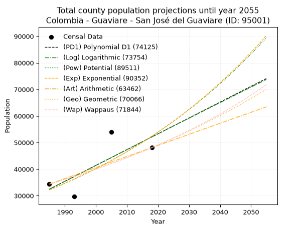
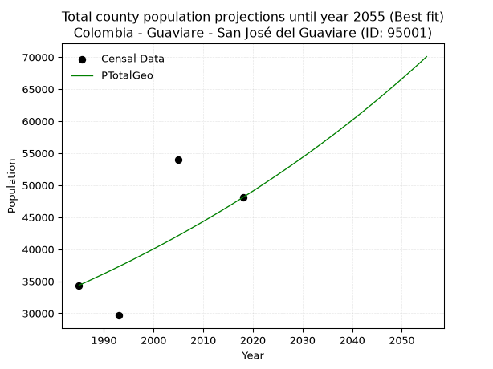
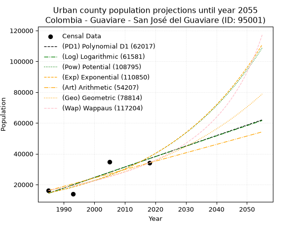
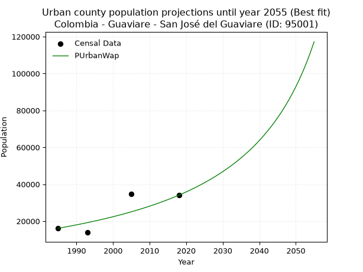
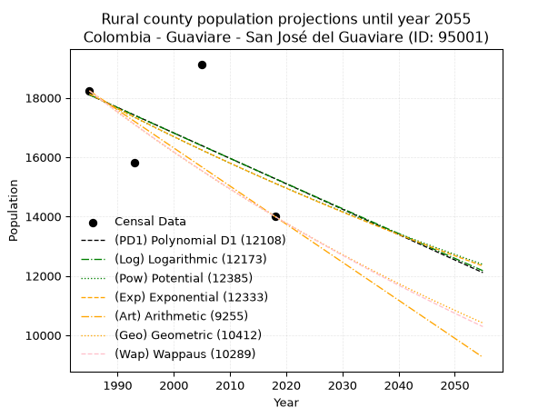
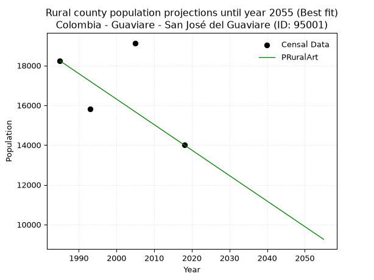

<div align="center">


</div>

# _“Population and Public Services Demand Projections (PPSD) until Year 2050 for Colombia - Guaviare - San José del Guaviare (ID: 95001)”_
Keywords: `population` `public-service` `projection` `lineal` `polynomial` `logarithmic` `potential` `exponential` `arithmetic` `geometric` `wappaus` `dane` `colombia` `south-america`

PPSD are analytical estimates used by governments and planners to anticipate future changes in population size, age distribution, and the resulting community needs for utilities, healthcare, education, and infrastructure as sizing future water treatment facilities, electrical grids, and road networks based on spatial growth.

> **General running parameters**: • app_version: _v20260806_. • Python version: _3.14.7_. • Pandas version: _3.0.5_. • NumPy version: _2.5.1_. • Creates, save and include plots into reports (create_plot): _False_. • Projection until year: _2050_. • Process polynomial degree 2 and up: _False_. • Process Wappaus: _True_. • Process Wappaus: _True_. • Set negative values to zero: _True_. • Set infinite values to zero: _True_. • Drop dataset notes: _True_. 
<div align="center">

Dynamic map: [:earth_americas:Google](http://maps.google.com/maps?q=2.565931793,-72.6392536) [:earth_americas:OSM](https://www.openstreetmap.org/#map=18/2.565931793/-72.6392536&layers=P) [:earth_americas:Bing](https://www.bing.com/maps?cp=2.565931793~-72.6392536&lvl=18) [:earth_americas:Apple](https://maps.apple.com/frame?center=2.565931793%2C-72.6392536&span=0.003%2C0.006)

</div>


<div align="center">

```geojson
{
  "type": "Feature",
  "geometry": {
    "type": "Point", 
    "coordinates": [-72.6392536, 2.565931793]
  }, 
  "properties": {
    "Name": "Colombia - Guaviare - San José del Guaviare (ID: 95001)"
  }
}
```

</div>


## 0. Census Data (4 records)

Census data are official statistics collected by a government about the people and housing in a country. They usually include counts of total population, age, sex, race, income, education, and jobs.

📅Global census file: [Population.xlsx](../data/Population.xlsx)

| Source   |   Year |   CountryID | CountryName   |   StateID | StateName   |   CountyID | CountyName            |   PTotal |   PUrban |   PRural |
|:---------|-------:|------------:|:--------------|----------:|:------------|-----------:|:----------------------|---------:|---------:|---------:|
| DANE     |   1985 |          57 | Colombia      |        95 | Guaviare    |      95001 | San José del Guaviare |    34372 |    16140 |    18232 |
| DANE     |   1993 |          57 | Colombia      |        95 | Guaviare    |      95001 | San José Del Guaviare |    29663 |    13852 |    15811 |
| DANE     |   2005 |          57 | Colombia      |        95 | Guaviare    |      95001 | San José del Guaviare |    53994 |    34863 |    19131 |
| DANE     |   2018 |          57 | Colombia      |        95 | Guaviare    |      95001 | San José Del Guaviare |    48086 |    34086 |    14000 |

> 🔥Some records could had specific notes about the registered values or the corresponding urban or rural distribution.

## 1. Total

### 1.1. Coefficients and Parameters

* (PD1) Polynomial Deg 1: 595.3725411481353, -1149365.1754315577 (lineal)
* (Log) Logarithmic: 1192503.93470097, -9022703.213788874
* (Pow) Potential: 29.497498289856456, -92.76778285414235
* (Exp) Exponential: 0.01472985107843985, 6.45521406591774e-09
* (Art) Arithmetic: Year diff. 2018 - 1985 = 33, Population diff. 48086 - 34372 = 13714, Annual growth = 415.57575757575756
* (Geo) Geometric: Year diff. 2018 - 1985 = 33, Population diff. 48086 - 34372 = 13714, Annual growth % = 0.010226139119095867
* (Wap) Wappaus: i = 1.0079695301262646, Condition values only valid for < 200)

<sub>
Wappaus condition values: ['0.00', '1.01', '2.02', '3.02', '4.03', '5.04', '6.05', '7.06', '8.06', '9.07', '10.08', '11.09', '12.10', '13.10', '14.11', '15.12', '16.13', '17.14', '18.14', '19.15', '20.16', '21.17', '22.18', '23.18', '24.19', '25.20', '26.21', '27.22', '28.22', '29.23', '30.24', '31.25', '32.26', '33.26', '34.27', '35.28', '36.29', '37.29', '38.30', '39.31', '40.32', '41.33', '42.33', '43.34', '44.35', '45.36', '46.37', '47.37', '48.38', '49.39', '50.40', '51.41', '52.41', '53.42', '54.43', '55.44', '56.45', '57.45', '58.46', '59.47', '60.48', '61.49', '62.49', '63.50', '64.51', '65.52']
</sub>


### 1.2. Projected Dataset

|   Year |   CountyID |   PTotalPD1 |   PTotalLog |   PTotalPow |   PTotalExp |   PTotalArt |   PTotalGeo |   PTotalWap |
|-------:|-----------:|------------:|------------:|------------:|------------:|------------:|------------:|------------:|
|   1985 |      95001 |       32449 |       32425 |       32203 |       32221 |       34372 |       34372 |       34372 |
|   1986 |      95001 |       33045 |       33026 |       32685 |       32699 |       34788 |       34723 |       34720 |
|   1987 |      95001 |       33640 |       33626 |       33174 |       33184 |       35203 |       35079 |       35072 |
|   1988 |      95001 |       34235 |       34226 |       33670 |       33677 |       35619 |       35437 |       35427 |
|   1989 |      95001 |       34831 |       34826 |       34174 |       34177 |       36034 |       35800 |       35786 |
|   1990 |      95001 |       35426 |       35425 |       34684 |       34684 |       36450 |       36166 |       36149 |
|   1991 |      95001 |       36022 |       36024 |       35202 |       35198 |       36865 |       36536 |       36516 |
|   1992 |      95001 |       36617 |       36623 |       35727 |       35721 |       37281 |       36909 |       36886 |
|   1993 |      95001 |       37212 |       37222 |       36260 |       36251 |       37697 |       37287 |       37260 |
|   1994 |      95001 |       37808 |       37820 |       36801 |       36789 |       38112 |       37668 |       37638 |
|   1995 |      95001 |       38403 |       38418 |       37349 |       37335 |       38528 |       38053 |       38020 |
|   1996 |      95001 |       38998 |       39015 |       37905 |       37889 |       38943 |       38442 |       38407 |
|   1997 |      95001 |       39594 |       39613 |       38469 |       38451 |       39359 |       38835 |       38797 |
|   1998 |      95001 |       40189 |       40210 |       39042 |       39021 |       39774 |       39233 |       39192 |
|   1999 |      95001 |       40785 |       40806 |       39622 |       39600 |       40190 |       39634 |       39591 |
|   2000 |      95001 |       41380 |       41403 |       40211 |       40188 |       40606 |       40039 |       39994 |
|   2001 |      95001 |       41975 |       41999 |       40808 |       40784 |       41021 |       40449 |       40402 |
|   2002 |      95001 |       42571 |       42595 |       41414 |       41390 |       41437 |       40862 |       40814 |
|   2003 |      95001 |       43166 |       43190 |       42029 |       42004 |       41852 |       41280 |       41230 |
|   2004 |      95001 |       43761 |       43786 |       42652 |       42627 |       42268 |       41702 |       41652 |
|   2005 |      95001 |       44357 |       44380 |       43284 |       43260 |       42684 |       42129 |       42078 |
|   2006 |      95001 |       44952 |       44975 |       43926 |       43901 |       43099 |       42559 |       42509 |
|   2007 |      95001 |       45548 |       45569 |       44576 |       44553 |       43515 |       42995 |       42945 |
|   2008 |      95001 |       46143 |       46163 |       45236 |       45214 |       43930 |       43434 |       43385 |
|   2009 |      95001 |       46738 |       46757 |       45905 |       45885 |       44346 |       43878 |       43831 |
|   2010 |      95001 |       47334 |       47351 |       46584 |       46566 |       44761 |       44327 |       44282 |
|   2011 |      95001 |       47929 |       47944 |       47273 |       47257 |       45177 |       44780 |       44738 |
|   2012 |      95001 |       48524 |       48537 |       47971 |       47958 |       45593 |       45238 |       45200 |
|   2013 |      95001 |       49120 |       49129 |       48679 |       48670 |       46008 |       45701 |       45667 |
|   2014 |      95001 |       49715 |       49721 |       49398 |       49392 |       46424 |       46168 |       46139 |
|   2015 |      95001 |       50310 |       50313 |       50126 |       50125 |       46839 |       46640 |       46617 |
|   2016 |      95001 |       50906 |       50905 |       50865 |       50869 |       47255 |       47117 |       47101 |
|   2017 |      95001 |       51501 |       51496 |       51615 |       51623 |       47670 |       47599 |       47591 |
|   2018 |      95001 |       52097 |       52087 |       52375 |       52390 |       48086 |       48086 |       48086 |
|   2019 |      95001 |       52692 |       52678 |       53146 |       53167 |       48502 |       48578 |       48588 |
|   2020 |      95001 |       53287 |       53269 |       53928 |       53956 |       48917 |       49074 |       49095 |
|   2021 |      95001 |       53883 |       53859 |       54721 |       54757 |       49333 |       49576 |       49609 |
|   2022 |      95001 |       54478 |       54449 |       55525 |       55569 |       49748 |       50083 |       50129 |
|   2023 |      95001 |       55073 |       55038 |       56341 |       56394 |       50164 |       50595 |       50656 |
|   2024 |      95001 |       55669 |       55628 |       57168 |       57230 |       50579 |       51113 |       51189 |
|   2025 |      95001 |       56264 |       56217 |       58007 |       58080 |       50995 |       51636 |       51730 |
|   2026 |      95001 |       56860 |       56806 |       58858 |       58941 |       51411 |       52164 |       52277 |
|   2027 |      95001 |       57455 |       57394 |       59721 |       59816 |       51826 |       52697 |       52830 |
|   2028 |      95001 |       58050 |       57982 |       60597 |       60704 |       52242 |       53236 |       53392 |
|   2029 |      95001 |       58646 |       58570 |       61484 |       61604 |       52657 |       53780 |       53960 |
|   2030 |      95001 |       59241 |       59158 |       62384 |       62519 |       53073 |       54330 |       54536 |
|   2031 |      95001 |       59836 |       59745 |       63297 |       63446 |       53488 |       54886 |       55119 |
|   2032 |      95001 |       60432 |       60332 |       64223 |       64388 |       53904 |       55447 |       55710 |
|   2033 |      95001 |       61027 |       60919 |       65162 |       65343 |       54320 |       56014 |       56309 |
|   2034 |      95001 |       61623 |       61505 |       66114 |       66313 |       54735 |       56587 |       56916 |
|   2035 |      95001 |       62218 |       62091 |       67080 |       67297 |       55151 |       57166 |       57531 |
|   2036 |      95001 |       62813 |       62677 |       68059 |       68295 |       55566 |       57750 |       58154 |
|   2037 |      95001 |       63409 |       63263 |       69052 |       69309 |       55982 |       58341 |       58786 |
|   2038 |      95001 |       64004 |       63848 |       70059 |       70337 |       56398 |       58937 |       59427 |
|   2039 |      95001 |       64599 |       64433 |       71080 |       71381 |       56813 |       59540 |       60076 |
|   2040 |      95001 |       65195 |       65018 |       72115 |       72440 |       57229 |       60149 |       60735 |
|   2041 |      95001 |       65790 |       65602 |       73165 |       73515 |       57644 |       60764 |       61403 |
|   2042 |      95001 |       66386 |       66186 |       74230 |       74606 |       58060 |       61385 |       62080 |
|   2043 |      95001 |       66981 |       66770 |       75310 |       75713 |       58475 |       62013 |       62767 |
|   2044 |      95001 |       67576 |       67354 |       76405 |       76837 |       58891 |       62647 |       63463 |
|   2045 |      95001 |       68172 |       67937 |       77515 |       77977 |       59307 |       63288 |       64170 |
|   2046 |      95001 |       68767 |       68520 |       78641 |       79134 |       59722 |       63935 |       64887 |
|   2047 |      95001 |       69362 |       69103 |       79783 |       80308 |       60138 |       64589 |       65615 |
|   2048 |      95001 |       69958 |       69685 |       80941 |       81500 |       60553 |       65249 |       66353 |
|   2049 |      95001 |       70553 |       70267 |       82115 |       82709 |       60969 |       65917 |       67103 |
|   2050 |      95001 |       71149 |       70849 |       83305 |       83937 |       61384 |       66591 |       67863 |
<div align="center">

</img>

</div>


### 1.3. Best fit with absolute and relative error (%)

Relative error puts that difference into context by dividing the absolute error by the true value, creating a unitless ratio or percentage that shows the scale of the mistake.

Absolute and relative error

|   Year | Source   |   CountryID | CountryName   |   StateID | StateName   |   CountyID_x | CountyName            |   PTotal |   PUrban |   PRural |   CountyID_y |   PTotalPD1 |   PTotalLog |   PTotalPow |   PTotalExp |   PTotalArt |   PTotalGeo |   PTotalWap |   PTotalPD1AbsError |   PTotalLogAbsError |   PTotalPowAbsError |   PTotalExpAbsError |   PTotalArtAbsError |   PTotalGeoAbsError |   PTotalWapAbsError |   PTotalPD1RelError |   PTotalLogRelError |   PTotalPowRelError |   PTotalExpRelError |   PTotalArtRelError |   PTotalGeoRelError |   PTotalWapRelError |
|-------:|:---------|------------:|:--------------|----------:|:------------|-------------:|:----------------------|---------:|---------:|---------:|-------------:|------------:|------------:|------------:|------------:|------------:|------------:|------------:|--------------------:|--------------------:|--------------------:|--------------------:|--------------------:|--------------------:|--------------------:|--------------------:|--------------------:|--------------------:|--------------------:|--------------------:|--------------------:|--------------------:|
|   1985 | DANE     |          57 | Colombia      |        95 | Guaviare    |        95001 | San José del Guaviare |    34372 |    16140 |    18232 |        95001 |       32449 |       32425 |       32203 |       32221 |       34372 |       34372 |       34372 |                1923 |                1947 |                2169 |                2151 |                   0 |                   0 |                   0 |             5.59467 |             5.66449 |             6.31037 |             6.258   |              0      |              0      |              0      |
|   1993 | DANE     |          57 | Colombia      |        95 | Guaviare    |        95001 | San José Del Guaviare |    29663 |    13852 |    15811 |        95001 |       37212 |       37222 |       36260 |       36251 |       37697 |       37287 |       37260 |                7549 |                7559 |                6597 |                6588 |                8034 |                7624 |                7597 |            25.4492  |            25.4829  |            22.2398  |            22.2095  |             27.0842 |             25.7021 |             25.611  |
|   2005 | DANE     |          57 | Colombia      |        95 | Guaviare    |        95001 | San José del Guaviare |    53994 |    34863 |    19131 |        95001 |       44357 |       44380 |       43284 |       43260 |       42684 |       42129 |       42078 |                9637 |                9614 |               10710 |               10734 |               11310 |               11865 |               11916 |            17.8483  |            17.8057  |            19.8355  |            19.88    |             20.9468 |             21.9747 |             22.0691 |
|   2018 | DANE     |          57 | Colombia      |        95 | Guaviare    |        95001 | San José Del Guaviare |    48086 |    34086 |    14000 |        95001 |       52097 |       52087 |       52375 |       52390 |       48086 |       48086 |       48086 |                4011 |                4001 |                4289 |                4304 |                   0 |                   0 |                   0 |             8.34131 |             8.32051 |             8.91944 |             8.95063 |              0      |              0      |              0      |

Relative error mean

| Method    |   RelError | Best   |
|:----------|-----------:|:-------|
| PTotalPD1 |    14.3084 |        |
| PTotalLog |    14.3184 |        |
| PTotalPow |    14.3263 |        |
| PTotalExp |    14.3245 |        |
| PTotalArt |    12.0078 |        |
| PTotalGeo |    11.9192 | True   |
| PTotalWap |    11.92   |        |

💙Best method: _**PTotalGeo**_
<div align="center">

</img>

</div>


### 1.4. Fresh water supply demand in liters per capita per day (lpcd)

The fresh water supply demand typically ranges from 100 to 300 liters per capita per day (lpcd) for standard domestic and municipal planning, though absolute survival minimums set by the World Health Organization are as low as 7.5 to 20 liters per day, and total consumption in high-income nations can exceed 400 liters.

> `CZ`: Level in meters above the sea level (masl).<br> `WS`: Fresh water supply demand in liters per capita per day (lpcd or l/h/d).<br> `WSAll`: Zonal fresh water supply demand in liters per second (l/s).<br> `A`: Zonal area in square meters.

Reference values (RAS Colombia)

|    CZ |   WS |
|------:|-----:|
|  1000 |  120 |
|  2000 |  130 |
| 99999 |  140 |

County shapefile geometry properties and water supply values

|   CountyID |      ATotal |   CZTotal |   WSTotal |
|-----------:|------------:|----------:|----------:|
|      95001 | 1.67122e+10 |    209.17 |       120 |

Projected values for best method: PTotalGeo

|   CountyID |   Year |   PTotalGeo |   WSTotal |   WSTotalAll |
|-----------:|-------:|------------:|----------:|-------------:|
|      95001 |   1985 |       34372 |       120 |      47.7389 |
|      95001 |   1986 |       34723 |       120 |      48.2264 |
|      95001 |   1987 |       35079 |       120 |      48.7208 |
|      95001 |   1988 |       35437 |       120 |      49.2181 |
|      95001 |   1989 |       35800 |       120 |      49.7222 |
|      95001 |   1990 |       36166 |       120 |      50.2306 |
|      95001 |   1991 |       36536 |       120 |      50.7444 |
|      95001 |   1992 |       36909 |       120 |      51.2625 |
|      95001 |   1993 |       37287 |       120 |      51.7875 |
|      95001 |   1994 |       37668 |       120 |      52.3167 |
|      95001 |   1995 |       38053 |       120 |      52.8514 |
|      95001 |   1996 |       38442 |       120 |      53.3917 |
|      95001 |   1997 |       38835 |       120 |      53.9375 |
|      95001 |   1998 |       39233 |       120 |      54.4903 |
|      95001 |   1999 |       39634 |       120 |      55.0472 |
|      95001 |   2000 |       40039 |       120 |      55.6097 |
|      95001 |   2001 |       40449 |       120 |      56.1792 |
|      95001 |   2002 |       40862 |       120 |      56.7528 |
|      95001 |   2003 |       41280 |       120 |      57.3333 |
|      95001 |   2004 |       41702 |       120 |      57.9194 |
|      95001 |   2005 |       42129 |       120 |      58.5125 |
|      95001 |   2006 |       42559 |       120 |      59.1097 |
|      95001 |   2007 |       42995 |       120 |      59.7153 |
|      95001 |   2008 |       43434 |       120 |      60.325  |
|      95001 |   2009 |       43878 |       120 |      60.9417 |
|      95001 |   2010 |       44327 |       120 |      61.5653 |
|      95001 |   2011 |       44780 |       120 |      62.1944 |
|      95001 |   2012 |       45238 |       120 |      62.8306 |
|      95001 |   2013 |       45701 |       120 |      63.4736 |
|      95001 |   2014 |       46168 |       120 |      64.1222 |
|      95001 |   2015 |       46640 |       120 |      64.7778 |
|      95001 |   2016 |       47117 |       120 |      65.4403 |
|      95001 |   2017 |       47599 |       120 |      66.1097 |
|      95001 |   2018 |       48086 |       120 |      66.7861 |
|      95001 |   2019 |       48578 |       120 |      67.4694 |
|      95001 |   2020 |       49074 |       120 |      68.1583 |
|      95001 |   2021 |       49576 |       120 |      68.8556 |
|      95001 |   2022 |       50083 |       120 |      69.5597 |
|      95001 |   2023 |       50595 |       120 |      70.2708 |
|      95001 |   2024 |       51113 |       120 |      70.9903 |
|      95001 |   2025 |       51636 |       120 |      71.7167 |
|      95001 |   2026 |       52164 |       120 |      72.45   |
|      95001 |   2027 |       52697 |       120 |      73.1903 |
|      95001 |   2028 |       53236 |       120 |      73.9389 |
|      95001 |   2029 |       53780 |       120 |      74.6944 |
|      95001 |   2030 |       54330 |       120 |      75.4583 |
|      95001 |   2031 |       54886 |       120 |      76.2306 |
|      95001 |   2032 |       55447 |       120 |      77.0097 |
|      95001 |   2033 |       56014 |       120 |      77.7972 |
|      95001 |   2034 |       56587 |       120 |      78.5931 |
|      95001 |   2035 |       57166 |       120 |      79.3972 |
|      95001 |   2036 |       57750 |       120 |      80.2083 |
|      95001 |   2037 |       58341 |       120 |      81.0292 |
|      95001 |   2038 |       58937 |       120 |      81.8569 |
|      95001 |   2039 |       59540 |       120 |      82.6944 |
|      95001 |   2040 |       60149 |       120 |      83.5403 |
|      95001 |   2041 |       60764 |       120 |      84.3944 |
|      95001 |   2042 |       61385 |       120 |      85.2569 |
|      95001 |   2043 |       62013 |       120 |      86.1292 |
|      95001 |   2044 |       62647 |       120 |      87.0097 |
|      95001 |   2045 |       63288 |       120 |      87.9    |
|      95001 |   2046 |       63935 |       120 |      88.7986 |
|      95001 |   2047 |       64589 |       120 |      89.7069 |
|      95001 |   2048 |       65249 |       120 |      90.6236 |
|      95001 |   2049 |       65917 |       120 |      91.5514 |
|      95001 |   2050 |       66591 |       120 |      92.4875 |

## 2. Urban

### 2.1. Coefficients and Parameters

* (PD1) Polynomial Deg 1: 680.9534323564828, -1337341.8530710547 (lineal)
* (Log) Logarithmic: 1363490.358241208, -10339165.889317425
* (Pow) Potential: 57.98587106484138, -187.05966866685776
* (Exp) Exponential: 0.028961965049887323, 1.5736258615428618e-21
* (Art) Arithmetic: Year diff. 2018 - 1985 = 33, Population diff. 34086 - 16140 = 17946, Annual growth = 543.8181818181819
* (Geo) Geometric: Year diff. 2018 - 1985 = 33, Population diff. 34086 - 16140 = 17946, Annual growth % = 0.022912677036153628
* (Wap) Wappaus: i = 2.16548473626481, Condition values only valid for < 200)

<sub>
Wappaus condition values: ['0.00', '2.17', '4.33', '6.50', '8.66', '10.83', '12.99', '15.16', '17.32', '19.49', '21.65', '23.82', '25.99', '28.15', '30.32', '32.48', '34.65', '36.81', '38.98', '41.14', '43.31', '45.48', '47.64', '49.81', '51.97', '54.14', '56.30', '58.47', '60.63', '62.80', '64.96', '67.13', '69.30', '71.46', '73.63', '75.79', '77.96', '80.12', '82.29', '84.45', '86.62', '88.78', '90.95', '93.12', '95.28', '97.45', '99.61', '101.78', '103.94', '106.11', '108.27', '110.44', '112.61', '114.77', '116.94', '119.10', '121.27', '123.43', '125.60', '127.76', '129.93', '132.09', '134.26', '136.43', '138.59', '140.76']
</sub>


### 2.2. Projected Dataset

|   Year |   CountyID |   PUrbanPD1 |   PUrbanLog |   PUrbanPow |   PUrbanExp |   PUrbanArt |   PUrbanGeo |   PUrbanWap |
|-------:|-----------:|------------:|------------:|------------:|------------:|------------:|------------:|------------:|
|   1985 |      95001 |       14351 |       14327 |       14583 |       14597 |       16140 |       16140 |       16140 |
|   1986 |      95001 |       15032 |       15013 |       15015 |       15026 |       16684 |       16510 |       16493 |
|   1987 |      95001 |       15713 |       15700 |       15460 |       15468 |       17228 |       16888 |       16854 |
|   1988 |      95001 |       16394 |       16386 |       15918 |       15922 |       17771 |       17275 |       17224 |
|   1989 |      95001 |       17075 |       17071 |       16389 |       16390 |       18315 |       17671 |       17601 |
|   1990 |      95001 |       17755 |       17757 |       16873 |       16872 |       18859 |       18076 |       17988 |
|   1991 |      95001 |       18436 |       18442 |       17372 |       17368 |       19403 |       18490 |       18383 |
|   1992 |      95001 |       19117 |       19126 |       17885 |       17878 |       19947 |       18914 |       18787 |
|   1993 |      95001 |       19798 |       19811 |       18413 |       18403 |       20491 |       19347 |       19201 |
|   1994 |      95001 |       20479 |       20495 |       18957 |       18944 |       21034 |       19790 |       19625 |
|   1995 |      95001 |       21160 |       21178 |       19516 |       19501 |       21578 |       20244 |       20059 |
|   1996 |      95001 |       21841 |       21862 |       20092 |       20074 |       22122 |       20708 |       20504 |
|   1997 |      95001 |       22522 |       22545 |       20684 |       20664 |       22666 |       21182 |       20960 |
|   1998 |      95001 |       23203 |       23227 |       21293 |       21271 |       23210 |       21667 |       21428 |
|   1999 |      95001 |       23884 |       23909 |       21920 |       21896 |       23753 |       22164 |       21907 |
|   2000 |      95001 |       24565 |       24591 |       22565 |       22540 |       24297 |       22672 |       22399 |
|   2001 |      95001 |       25246 |       25273 |       23228 |       23202 |       24841 |       23191 |       22904 |
|   2002 |      95001 |       25927 |       25954 |       23911 |       23884 |       25385 |       23722 |       23422 |
|   2003 |      95001 |       26608 |       26635 |       24614 |       24585 |       25929 |       24266 |       23954 |
|   2004 |      95001 |       27289 |       27316 |       25337 |       25308 |       26473 |       24822 |       24501 |
|   2005 |      95001 |       27970 |       27996 |       26080 |       26052 |       27016 |       25391 |       25062 |
|   2006 |      95001 |       28651 |       28676 |       26845 |       26817 |       27560 |       25972 |       25640 |
|   2007 |      95001 |       29332 |       29355 |       27632 |       27605 |       28104 |       26568 |       26234 |
|   2008 |      95001 |       30013 |       30034 |       28442 |       28416 |       28648 |       27176 |       26844 |
|   2009 |      95001 |       30694 |       30713 |       29275 |       29251 |       29192 |       27799 |       27473 |
|   2010 |      95001 |       31375 |       31392 |       30132 |       30111 |       29735 |       28436 |       28121 |
|   2011 |      95001 |       32055 |       32070 |       31014 |       30996 |       30279 |       29087 |       28788 |
|   2012 |      95001 |       32736 |       32748 |       31921 |       31907 |       30823 |       29754 |       29475 |
|   2013 |      95001 |       33417 |       33425 |       32854 |       32844 |       31367 |       30436 |       30184 |
|   2014 |      95001 |       34098 |       34103 |       33814 |       33809 |       31911 |       31133 |       30915 |
|   2015 |      95001 |       34779 |       34779 |       34802 |       34803 |       32455 |       31846 |       31670 |
|   2016 |      95001 |       35460 |       35456 |       35817 |       35826 |       32998 |       32576 |       32449 |
|   2017 |      95001 |       36141 |       36132 |       36862 |       36878 |       33542 |       33322 |       33254 |
|   2018 |      95001 |       36822 |       36808 |       37937 |       37962 |       34086 |       34086 |       34086 |
|   2019 |      95001 |       37503 |       37483 |       39043 |       39078 |       34630 |       34867 |       34947 |
|   2020 |      95001 |       38184 |       38159 |       40180 |       40226 |       35174 |       35666 |       35837 |
|   2021 |      95001 |       38865 |       38833 |       41350 |       41408 |       35717 |       36483 |       36760 |
|   2022 |      95001 |       39546 |       39508 |       42553 |       42625 |       36261 |       37319 |       37715 |
|   2023 |      95001 |       40227 |       40182 |       43791 |       43877 |       36805 |       38174 |       38706 |
|   2024 |      95001 |       40908 |       40856 |       45064 |       45167 |       37349 |       39049 |       39734 |
|   2025 |      95001 |       41589 |       41529 |       46373 |       46494 |       37893 |       39943 |       40801 |
|   2026 |      95001 |       42270 |       42202 |       47720 |       47860 |       38437 |       40859 |       41910 |
|   2027 |      95001 |       42951 |       42875 |       49105 |       49266 |       38980 |       41795 |       43062 |
|   2028 |      95001 |       43632 |       43548 |       50530 |       50714 |       39524 |       42753 |       44262 |
|   2029 |      95001 |       44313 |       44220 |       51995 |       52204 |       40068 |       43732 |       45511 |
|   2030 |      95001 |       44994 |       44892 |       53502 |       53738 |       40612 |       44734 |       46813 |
|   2031 |      95001 |       45675 |       45563 |       55052 |       55318 |       41156 |       45759 |       48171 |
|   2032 |      95001 |       46356 |       46234 |       56646 |       56943 |       41699 |       46808 |       49589 |
|   2033 |      95001 |       47036 |       46905 |       58285 |       58616 |       42243 |       47880 |       51070 |
|   2034 |      95001 |       47717 |       47576 |       59971 |       60339 |       42787 |       48977 |       52620 |
|   2035 |      95001 |       48398 |       48246 |       61705 |       62112 |       43331 |       50099 |       54244 |
|   2036 |      95001 |       49079 |       48916 |       63488 |       63937 |       43875 |       51247 |       55946 |
|   2037 |      95001 |       49760 |       49585 |       65322 |       65816 |       44419 |       52421 |       57732 |
|   2038 |      95001 |       50441 |       50255 |       67208 |       67750 |       44962 |       53623 |       59609 |
|   2039 |      95001 |       51122 |       50923 |       69147 |       69741 |       45506 |       54851 |       61583 |
|   2040 |      95001 |       51803 |       51592 |       71141 |       71790 |       46050 |       56108 |       63664 |
|   2041 |      95001 |       52484 |       52260 |       73192 |       73900 |       46594 |       57394 |       65859 |
|   2042 |      95001 |       53165 |       52928 |       75300 |       76071 |       47138 |       58709 |       68178 |
|   2043 |      95001 |       53846 |       53596 |       77469 |       78307 |       47681 |       60054 |       70632 |
|   2044 |      95001 |       54527 |       54263 |       79698 |       80608 |       48225 |       61430 |       73233 |
|   2045 |      95001 |       55208 |       54930 |       81991 |       82977 |       48769 |       62837 |       75995 |
|   2046 |      95001 |       55889 |       55596 |       84349 |       85415 |       49313 |       64277 |       78933 |
|   2047 |      95001 |       56570 |       56263 |       86773 |       87925 |       49857 |       65750 |       82065 |
|   2048 |      95001 |       57251 |       56929 |       89265 |       90509 |       50401 |       67256 |       85410 |
|   2049 |      95001 |       57932 |       57594 |       91828 |       93168 |       50944 |       68797 |       88991 |
|   2050 |      95001 |       58613 |       58259 |       94463 |       95906 |       51488 |       70374 |       92834 |
<div align="center">

</img>

</div>


### 2.3. Best fit with absolute and relative error (%)

Relative error puts that difference into context by dividing the absolute error by the true value, creating a unitless ratio or percentage that shows the scale of the mistake.

Absolute and relative error

|   Year | Source   |   CountryID | CountryName   |   StateID | StateName   |   CountyID_x | CountyName            |   PTotal |   PUrban |   PRural |   CountyID_y |   PUrbanPD1 |   PUrbanLog |   PUrbanPow |   PUrbanExp |   PUrbanArt |   PUrbanGeo |   PUrbanWap |   PUrbanPD1AbsError |   PUrbanLogAbsError |   PUrbanPowAbsError |   PUrbanExpAbsError |   PUrbanArtAbsError |   PUrbanGeoAbsError |   PUrbanWapAbsError |   PUrbanPD1RelError |   PUrbanLogRelError |   PUrbanPowRelError |   PUrbanExpRelError |   PUrbanArtRelError |   PUrbanGeoRelError |   PUrbanWapRelError |
|-------:|:---------|------------:|:--------------|----------:|:------------|-------------:|:----------------------|---------:|---------:|---------:|-------------:|------------:|------------:|------------:|------------:|------------:|------------:|------------:|--------------------:|--------------------:|--------------------:|--------------------:|--------------------:|--------------------:|--------------------:|--------------------:|--------------------:|--------------------:|--------------------:|--------------------:|--------------------:|--------------------:|
|   1985 | DANE     |          57 | Colombia      |        95 | Guaviare    |        95001 | San José del Guaviare |    34372 |    16140 |    18232 |        95001 |       14351 |       14327 |       14583 |       14597 |       16140 |       16140 |       16140 |                1789 |                1813 |                1557 |                1543 |                   0 |                   0 |                   0 |            11.0843  |            11.233   |             9.64684 |              9.5601 |              0      |              0      |              0      |
|   1993 | DANE     |          57 | Colombia      |        95 | Guaviare    |        95001 | San José Del Guaviare |    29663 |    13852 |    15811 |        95001 |       19798 |       19811 |       18413 |       18403 |       20491 |       19347 |       19201 |                5946 |                5959 |                4561 |                4551 |                6639 |                5495 |                5349 |            42.9252  |            43.0191  |            32.9267  |             32.8545 |             47.9281 |             39.6694 |             38.6154 |
|   2005 | DANE     |          57 | Colombia      |        95 | Guaviare    |        95001 | San José del Guaviare |    53994 |    34863 |    19131 |        95001 |       27970 |       27996 |       26080 |       26052 |       27016 |       25391 |       25062 |                6893 |                6867 |                8783 |                8811 |                7847 |                9472 |                9801 |            19.7717  |            19.6971  |            25.1929  |             25.2732 |             22.5081 |             27.1692 |             28.1129 |
|   2018 | DANE     |          57 | Colombia      |        95 | Guaviare    |        95001 | San José Del Guaviare |    48086 |    34086 |    14000 |        95001 |       36822 |       36808 |       37937 |       37962 |       34086 |       34086 |       34086 |                2736 |                2722 |                3851 |                3876 |                   0 |                   0 |                   0 |             8.02676 |             7.98568 |            11.2979  |             11.3712 |              0      |              0      |              0      |

Relative error mean

| Method    |   RelError | Best   |
|:----------|-----------:|:-------|
| PUrbanPD1 |    20.452  |        |
| PUrbanLog |    20.4837 |        |
| PUrbanPow |    19.7661 |        |
| PUrbanExp |    19.7648 |        |
| PUrbanArt |    17.6091 |        |
| PUrbanGeo |    16.7096 |        |
| PUrbanWap |    16.6821 | True   |

💙Best method: _**PUrbanWap**_
<div align="center">

</img>

</div>


### 2.4. Fresh water supply demand in liters per capita per day (lpcd)

The fresh water supply demand typically ranges from 100 to 300 liters per capita per day (lpcd) for standard domestic and municipal planning, though absolute survival minimums set by the World Health Organization are as low as 7.5 to 20 liters per day, and total consumption in high-income nations can exceed 400 liters.

> `CZ`: Level in meters above the sea level (masl).<br> `WS`: Fresh water supply demand in liters per capita per day (lpcd or l/h/d).<br> `WSAll`: Zonal fresh water supply demand in liters per second (l/s).<br> `A`: Zonal area in square meters.

Reference values (RAS Colombia)

|    CZ |   WS |
|------:|-----:|
|  1000 |  120 |
|  2000 |  130 |
| 99999 |  140 |

County shapefile geometry properties and water supply values

|   CountyID |      AUrban |   CZUrban |   WSUrban |
|-----------:|------------:|----------:|----------:|
|      95001 | 6.38443e+06 |   186.629 |       120 |

Projected values for best method: PUrbanWap

|   CountyID |   Year |   PUrbanWap |   WSUrban |   WSUrbanAll |
|-----------:|-------:|------------:|----------:|-------------:|
|      95001 |   1985 |       16140 |       120 |      22.4167 |
|      95001 |   1986 |       16493 |       120 |      22.9069 |
|      95001 |   1987 |       16854 |       120 |      23.4083 |
|      95001 |   1988 |       17224 |       120 |      23.9222 |
|      95001 |   1989 |       17601 |       120 |      24.4458 |
|      95001 |   1990 |       17988 |       120 |      24.9833 |
|      95001 |   1991 |       18383 |       120 |      25.5319 |
|      95001 |   1992 |       18787 |       120 |      26.0931 |
|      95001 |   1993 |       19201 |       120 |      26.6681 |
|      95001 |   1994 |       19625 |       120 |      27.2569 |
|      95001 |   1995 |       20059 |       120 |      27.8597 |
|      95001 |   1996 |       20504 |       120 |      28.4778 |
|      95001 |   1997 |       20960 |       120 |      29.1111 |
|      95001 |   1998 |       21428 |       120 |      29.7611 |
|      95001 |   1999 |       21907 |       120 |      30.4264 |
|      95001 |   2000 |       22399 |       120 |      31.1097 |
|      95001 |   2001 |       22904 |       120 |      31.8111 |
|      95001 |   2002 |       23422 |       120 |      32.5306 |
|      95001 |   2003 |       23954 |       120 |      33.2694 |
|      95001 |   2004 |       24501 |       120 |      34.0292 |
|      95001 |   2005 |       25062 |       120 |      34.8083 |
|      95001 |   2006 |       25640 |       120 |      35.6111 |
|      95001 |   2007 |       26234 |       120 |      36.4361 |
|      95001 |   2008 |       26844 |       120 |      37.2833 |
|      95001 |   2009 |       27473 |       120 |      38.1569 |
|      95001 |   2010 |       28121 |       120 |      39.0569 |
|      95001 |   2011 |       28788 |       120 |      39.9833 |
|      95001 |   2012 |       29475 |       120 |      40.9375 |
|      95001 |   2013 |       30184 |       120 |      41.9222 |
|      95001 |   2014 |       30915 |       120 |      42.9375 |
|      95001 |   2015 |       31670 |       120 |      43.9861 |
|      95001 |   2016 |       32449 |       120 |      45.0681 |
|      95001 |   2017 |       33254 |       120 |      46.1861 |
|      95001 |   2018 |       34086 |       120 |      47.3417 |
|      95001 |   2019 |       34947 |       120 |      48.5375 |
|      95001 |   2020 |       35837 |       120 |      49.7736 |
|      95001 |   2021 |       36760 |       120 |      51.0556 |
|      95001 |   2022 |       37715 |       120 |      52.3819 |
|      95001 |   2023 |       38706 |       120 |      53.7583 |
|      95001 |   2024 |       39734 |       120 |      55.1861 |
|      95001 |   2025 |       40801 |       120 |      56.6681 |
|      95001 |   2026 |       41910 |       120 |      58.2083 |
|      95001 |   2027 |       43062 |       120 |      59.8083 |
|      95001 |   2028 |       44262 |       120 |      61.475  |
|      95001 |   2029 |       45511 |       120 |      63.2097 |
|      95001 |   2030 |       46813 |       120 |      65.0181 |
|      95001 |   2031 |       48171 |       120 |      66.9042 |
|      95001 |   2032 |       49589 |       120 |      68.8736 |
|      95001 |   2033 |       51070 |       120 |      70.9306 |
|      95001 |   2034 |       52620 |       120 |      73.0833 |
|      95001 |   2035 |       54244 |       120 |      75.3389 |
|      95001 |   2036 |       55946 |       120 |      77.7028 |
|      95001 |   2037 |       57732 |       120 |      80.1833 |
|      95001 |   2038 |       59609 |       120 |      82.7903 |
|      95001 |   2039 |       61583 |       120 |      85.5319 |
|      95001 |   2040 |       63664 |       120 |      88.4222 |
|      95001 |   2041 |       65859 |       120 |      91.4708 |
|      95001 |   2042 |       68178 |       120 |      94.6917 |
|      95001 |   2043 |       70632 |       120 |      98.1    |
|      95001 |   2044 |       73233 |       120 |     101.713  |
|      95001 |   2045 |       75995 |       120 |     105.549  |
|      95001 |   2046 |       78933 |       120 |     109.629  |
|      95001 |   2047 |       82065 |       120 |     113.979  |
|      95001 |   2048 |       85410 |       120 |     118.625  |
|      95001 |   2049 |       88991 |       120 |     123.599  |
|      95001 |   2050 |       92834 |       120 |     128.936  |

## 3. Rural

### 3.1. Coefficients and Parameters

* (PD1) Polynomial Deg 1: -85.5808912083471, 187976.67763949628 (lineal)
* (Log) Logarithmic: -170986.42354023768, 1316462.6755285526
* (Pow) Potential: -10.99440519376545, 40.5152801686884
* (Exp) Exponential: -0.005502362686210837, 1004161936.5027868
* (Art) Arithmetic: Year diff. 2018 - 1985 = 33, Population diff. 14000 - 18232 = -4232, Annual growth = -128.24242424242425
* (Geo) Geometric: Year diff. 2018 - 1985 = 33, Population diff. 14000 - 18232 = -4232, Annual growth % = -0.007971721474153481
* (Wap) Wappaus: i = -0.7957459930654271, Condition values only valid for < 200)

<sub>
Wappaus condition values: ['-0.00', '-0.80', '-1.59', '-2.39', '-3.18', '-3.98', '-4.77', '-5.57', '-6.37', '-7.16', '-7.96', '-8.75', '-9.55', '-10.34', '-11.14', '-11.94', '-12.73', '-13.53', '-14.32', '-15.12', '-15.91', '-16.71', '-17.51', '-18.30', '-19.10', '-19.89', '-20.69', '-21.49', '-22.28', '-23.08', '-23.87', '-24.67', '-25.46', '-26.26', '-27.06', '-27.85', '-28.65', '-29.44', '-30.24', '-31.03', '-31.83', '-32.63', '-33.42', '-34.22', '-35.01', '-35.81', '-36.60', '-37.40', '-38.20', '-38.99', '-39.79', '-40.58', '-41.38', '-42.17', '-42.97', '-43.77', '-44.56', '-45.36', '-46.15', '-46.95', '-47.74', '-48.54', '-49.34', '-50.13', '-50.93', '-51.72']
</sub>


### 3.2. Projected Dataset

|   Year |   CountyID |   PRuralPD1 |   PRuralLog |   PRuralPow |   PRuralExp |   PRuralArt |   PRuralGeo |   PRuralWap |
|-------:|-----------:|------------:|------------:|------------:|------------:|------------:|------------:|------------:|
|   1985 |      95001 |       18099 |       18099 |       18129 |       18128 |       18232 |       18232 |       18232 |
|   1986 |      95001 |       18013 |       18013 |       18029 |       18029 |       18104 |       18087 |       18087 |
|   1987 |      95001 |       17927 |       17927 |       17929 |       17930 |       17976 |       17942 |       17944 |
|   1988 |      95001 |       17842 |       17841 |       17830 |       17832 |       17847 |       17799 |       17802 |
|   1989 |      95001 |       17756 |       17755 |       17732 |       17734 |       17719 |       17658 |       17661 |
|   1990 |      95001 |       17671 |       17669 |       17634 |       17636 |       17591 |       17517 |       17521 |
|   1991 |      95001 |       17585 |       17583 |       17537 |       17540 |       17463 |       17377 |       17382 |
|   1992 |      95001 |       17500 |       17497 |       17440 |       17443 |       17334 |       17239 |       17244 |
|   1993 |      95001 |       17414 |       17411 |       17344 |       17348 |       17206 |       17101 |       17107 |
|   1994 |      95001 |       17328 |       17325 |       17249 |       17252 |       17078 |       16965 |       16971 |
|   1995 |      95001 |       17243 |       17240 |       17154 |       17158 |       16950 |       16830 |       16837 |
|   1996 |      95001 |       17157 |       17154 |       17060 |       17064 |       16821 |       16695 |       16703 |
|   1997 |      95001 |       17072 |       17068 |       16966 |       16970 |       16693 |       16562 |       16570 |
|   1998 |      95001 |       16986 |       16983 |       16873 |       16877 |       16565 |       16430 |       16439 |
|   1999 |      95001 |       16900 |       16897 |       16781 |       16784 |       16437 |       16299 |       16308 |
|   2000 |      95001 |       16815 |       16812 |       16689 |       16692 |       16308 |       16169 |       16178 |
|   2001 |      95001 |       16729 |       16726 |       16597 |       16601 |       16180 |       16041 |       16050 |
|   2002 |      95001 |       16644 |       16641 |       16506 |       16509 |       16052 |       15913 |       15922 |
|   2003 |      95001 |       16558 |       16555 |       16416 |       16419 |       15924 |       15786 |       15795 |
|   2004 |      95001 |       16473 |       16470 |       16326 |       16329 |       15795 |       15660 |       15669 |
|   2005 |      95001 |       16387 |       16385 |       16237 |       16239 |       15667 |       15535 |       15544 |
|   2006 |      95001 |       16301 |       16299 |       16148 |       16150 |       15539 |       15411 |       15420 |
|   2007 |      95001 |       16216 |       16214 |       16060 |       16061 |       15411 |       15288 |       15297 |
|   2008 |      95001 |       16130 |       16129 |       15972 |       15973 |       15282 |       15167 |       15175 |
|   2009 |      95001 |       16045 |       16044 |       15885 |       15886 |       15154 |       15046 |       15054 |
|   2010 |      95001 |       15959 |       15959 |       15798 |       15798 |       15026 |       14926 |       14933 |
|   2011 |      95001 |       15874 |       15874 |       15712 |       15712 |       14898 |       14807 |       14814 |
|   2012 |      95001 |       15788 |       15789 |       15626 |       15626 |       14769 |       14689 |       14695 |
|   2013 |      95001 |       15702 |       15704 |       15541 |       15540 |       14641 |       14572 |       14577 |
|   2014 |      95001 |       15617 |       15619 |       15457 |       15455 |       14513 |       14455 |       14460 |
|   2015 |      95001 |       15531 |       15534 |       15372 |       15370 |       14385 |       14340 |       14344 |
|   2016 |      95001 |       15446 |       15449 |       15289 |       15285 |       14256 |       14226 |       14228 |
|   2017 |      95001 |       15360 |       15364 |       15206 |       15202 |       14128 |       14113 |       14114 |
|   2018 |      95001 |       15274 |       15280 |       15123 |       15118 |       14000 |       14000 |       14000 |
|   2019 |      95001 |       15189 |       15195 |       15041 |       15035 |       13872 |       13888 |       13887 |
|   2020 |      95001 |       15103 |       15110 |       14959 |       14953 |       13744 |       13778 |       13775 |
|   2021 |      95001 |       15018 |       15026 |       14878 |       14871 |       13615 |       13668 |       13663 |
|   2022 |      95001 |       14932 |       14941 |       14797 |       14789 |       13487 |       13559 |       13553 |
|   2023 |      95001 |       14847 |       14856 |       14717 |       14708 |       13359 |       13451 |       13443 |
|   2024 |      95001 |       14761 |       14772 |       14637 |       14627 |       13231 |       13344 |       13334 |
|   2025 |      95001 |       14675 |       14687 |       14558 |       14547 |       13102 |       13237 |       13226 |
|   2026 |      95001 |       14590 |       14603 |       14479 |       14467 |       12974 |       13132 |       13118 |
|   2027 |      95001 |       14504 |       14519 |       14401 |       14388 |       12846 |       13027 |       13011 |
|   2028 |      95001 |       14419 |       14434 |       14323 |       14309 |       12718 |       12923 |       12905 |
|   2029 |      95001 |       14333 |       14350 |       14246 |       14230 |       12589 |       12820 |       12799 |
|   2030 |      95001 |       14247 |       14266 |       14169 |       14152 |       12461 |       12718 |       12695 |
|   2031 |      95001 |       14162 |       14182 |       14092 |       14075 |       12333 |       12617 |       12591 |
|   2032 |      95001 |       14076 |       14097 |       14016 |       13997 |       12205 |       12516 |       12487 |
|   2033 |      95001 |       13991 |       14013 |       13940 |       13920 |       12076 |       12416 |       12385 |
|   2034 |      95001 |       13905 |       13929 |       13865 |       13844 |       11948 |       12317 |       12283 |
|   2035 |      95001 |       13820 |       13845 |       13791 |       13768 |       11820 |       12219 |       12182 |
|   2036 |      95001 |       13734 |       13761 |       13716 |       13693 |       11692 |       12122 |       12081 |
|   2037 |      95001 |       13648 |       13677 |       13642 |       13617 |       11563 |       12025 |       11981 |
|   2038 |      95001 |       13563 |       13593 |       13569 |       13543 |       11435 |       11929 |       11882 |
|   2039 |      95001 |       13477 |       13509 |       13496 |       13468 |       11307 |       11834 |       11783 |
|   2040 |      95001 |       13392 |       13426 |       13423 |       13394 |       11179 |       11740 |       11685 |
|   2041 |      95001 |       13306 |       13342 |       13351 |       13321 |       11050 |       11646 |       11588 |
|   2042 |      95001 |       13220 |       13258 |       13280 |       13248 |       10922 |       11553 |       11491 |
|   2043 |      95001 |       13135 |       13174 |       13208 |       13175 |       10794 |       11461 |       11395 |
|   2044 |      95001 |       13049 |       13091 |       13137 |       13103 |       10666 |       11370 |       11300 |
|   2045 |      95001 |       12964 |       13007 |       13067 |       13031 |       10537 |       11279 |       11205 |
|   2046 |      95001 |       12878 |       12923 |       12997 |       12960 |       10409 |       11189 |       11111 |
|   2047 |      95001 |       12793 |       12840 |       12927 |       12888 |       10281 |       11100 |       11017 |
|   2048 |      95001 |       12707 |       12756 |       12858 |       12818 |       10153 |       11012 |       10924 |
|   2049 |      95001 |       12621 |       12673 |       12789 |       12747 |       10024 |       10924 |       10831 |
|   2050 |      95001 |       12536 |       12589 |       12721 |       12677 |        9896 |       10837 |       10739 |
<div align="center">

</img>

</div>


### 3.3. Best fit with absolute and relative error (%)

Relative error puts that difference into context by dividing the absolute error by the true value, creating a unitless ratio or percentage that shows the scale of the mistake.

Absolute and relative error

|   Year | Source   |   CountryID | CountryName   |   StateID | StateName   |   CountyID_x | CountyName            |   PTotal |   PUrban |   PRural |   CountyID_y |   PRuralPD1 |   PRuralLog |   PRuralPow |   PRuralExp |   PRuralArt |   PRuralGeo |   PRuralWap |   PRuralPD1AbsError |   PRuralLogAbsError |   PRuralPowAbsError |   PRuralExpAbsError |   PRuralArtAbsError |   PRuralGeoAbsError |   PRuralWapAbsError |   PRuralPD1RelError |   PRuralLogRelError |   PRuralPowRelError |   PRuralExpRelError |   PRuralArtRelError |   PRuralGeoRelError |   PRuralWapRelError |
|-------:|:---------|------------:|:--------------|----------:|:------------|-------------:|:----------------------|---------:|---------:|---------:|-------------:|------------:|------------:|------------:|------------:|------------:|------------:|------------:|--------------------:|--------------------:|--------------------:|--------------------:|--------------------:|--------------------:|--------------------:|--------------------:|--------------------:|--------------------:|--------------------:|--------------------:|--------------------:|--------------------:|
|   1985 | DANE     |          57 | Colombia      |        95 | Guaviare    |        95001 | San José del Guaviare |    34372 |    16140 |    18232 |        95001 |       18099 |       18099 |       18129 |       18128 |       18232 |       18232 |       18232 |                 133 |                 133 |                 103 |                 104 |                   0 |                   0 |                   0 |            0.729487 |            0.729487 |            0.564941 |            0.570426 |             0       |             0       |             0       |
|   1993 | DANE     |          57 | Colombia      |        95 | Guaviare    |        95001 | San José Del Guaviare |    29663 |    13852 |    15811 |        95001 |       17414 |       17411 |       17344 |       17348 |       17206 |       17101 |       17107 |                1603 |                1600 |                1533 |                1537 |                1395 |                1290 |                1296 |           10.1385   |           10.1195   |            9.69578  |            9.72108  |             8.82297 |             8.15888 |             8.19682 |
|   2005 | DANE     |          57 | Colombia      |        95 | Guaviare    |        95001 | San José del Guaviare |    53994 |    34863 |    19131 |        95001 |       16387 |       16385 |       16237 |       16239 |       15667 |       15535 |       15544 |                2744 |                2746 |                2894 |                2892 |                3464 |                3596 |                3587 |           14.3432   |           14.3537   |           15.1273   |           15.1168   |            18.1067  |            18.7967  |            18.7497  |
|   2018 | DANE     |          57 | Colombia      |        95 | Guaviare    |        95001 | San José Del Guaviare |    48086 |    34086 |    14000 |        95001 |       15274 |       15280 |       15123 |       15118 |       14000 |       14000 |       14000 |                1274 |                1280 |                1123 |                1118 |                   0 |                   0 |                   0 |            9.1      |            9.14286  |            8.02143  |            7.98571  |             0       |             0       |             0       |

Relative error mean

| Method    |   RelError | Best   |
|:----------|-----------:|:-------|
| PRuralPD1 |    8.5778  |        |
| PRuralLog |    8.58639 |        |
| PRuralPow |    8.35236 |        |
| PRuralExp |    8.34851 |        |
| PRuralArt |    6.73243 | True   |
| PRuralGeo |    6.7389  |        |
| PRuralWap |    6.73662 |        |

💙Best method: _**PRuralArt**_
<div align="center">

</img>

</div>


### 3.4. Fresh water supply demand in liters per capita per day (lpcd)

The fresh water supply demand typically ranges from 100 to 300 liters per capita per day (lpcd) for standard domestic and municipal planning, though absolute survival minimums set by the World Health Organization are as low as 7.5 to 20 liters per day, and total consumption in high-income nations can exceed 400 liters.

> `CZ`: Level in meters above the sea level (masl).<br> `WS`: Fresh water supply demand in liters per capita per day (lpcd or l/h/d).<br> `WSAll`: Zonal fresh water supply demand in liters per second (l/s).<br> `A`: Zonal area in square meters.

Reference values (RAS Colombia)

|    CZ |   WS |
|------:|-----:|
|  1000 |  120 |
|  2000 |  130 |
| 99999 |  140 |

County shapefile geometry properties and water supply values

|   CountyID |      ARural |   CZRural |   WSRural |
|-----------:|------------:|----------:|----------:|
|      95001 | 1.67058e+10 |   209.179 |       120 |

Projected values for best method: PRuralArt

|   CountyID |   Year |   PRuralArt |   WSRural |   WSRuralAll |
|-----------:|-------:|------------:|----------:|-------------:|
|      95001 |   1985 |       18232 |       120 |      25.3222 |
|      95001 |   1986 |       18104 |       120 |      25.1444 |
|      95001 |   1987 |       17976 |       120 |      24.9667 |
|      95001 |   1988 |       17847 |       120 |      24.7875 |
|      95001 |   1989 |       17719 |       120 |      24.6097 |
|      95001 |   1990 |       17591 |       120 |      24.4319 |
|      95001 |   1991 |       17463 |       120 |      24.2542 |
|      95001 |   1992 |       17334 |       120 |      24.075  |
|      95001 |   1993 |       17206 |       120 |      23.8972 |
|      95001 |   1994 |       17078 |       120 |      23.7194 |
|      95001 |   1995 |       16950 |       120 |      23.5417 |
|      95001 |   1996 |       16821 |       120 |      23.3625 |
|      95001 |   1997 |       16693 |       120 |      23.1847 |
|      95001 |   1998 |       16565 |       120 |      23.0069 |
|      95001 |   1999 |       16437 |       120 |      22.8292 |
|      95001 |   2000 |       16308 |       120 |      22.65   |
|      95001 |   2001 |       16180 |       120 |      22.4722 |
|      95001 |   2002 |       16052 |       120 |      22.2944 |
|      95001 |   2003 |       15924 |       120 |      22.1167 |
|      95001 |   2004 |       15795 |       120 |      21.9375 |
|      95001 |   2005 |       15667 |       120 |      21.7597 |
|      95001 |   2006 |       15539 |       120 |      21.5819 |
|      95001 |   2007 |       15411 |       120 |      21.4042 |
|      95001 |   2008 |       15282 |       120 |      21.225  |
|      95001 |   2009 |       15154 |       120 |      21.0472 |
|      95001 |   2010 |       15026 |       120 |      20.8694 |
|      95001 |   2011 |       14898 |       120 |      20.6917 |
|      95001 |   2012 |       14769 |       120 |      20.5125 |
|      95001 |   2013 |       14641 |       120 |      20.3347 |
|      95001 |   2014 |       14513 |       120 |      20.1569 |
|      95001 |   2015 |       14385 |       120 |      19.9792 |
|      95001 |   2016 |       14256 |       120 |      19.8    |
|      95001 |   2017 |       14128 |       120 |      19.6222 |
|      95001 |   2018 |       14000 |       120 |      19.4444 |
|      95001 |   2019 |       13872 |       120 |      19.2667 |
|      95001 |   2020 |       13744 |       120 |      19.0889 |
|      95001 |   2021 |       13615 |       120 |      18.9097 |
|      95001 |   2022 |       13487 |       120 |      18.7319 |
|      95001 |   2023 |       13359 |       120 |      18.5542 |
|      95001 |   2024 |       13231 |       120 |      18.3764 |
|      95001 |   2025 |       13102 |       120 |      18.1972 |
|      95001 |   2026 |       12974 |       120 |      18.0194 |
|      95001 |   2027 |       12846 |       120 |      17.8417 |
|      95001 |   2028 |       12718 |       120 |      17.6639 |
|      95001 |   2029 |       12589 |       120 |      17.4847 |
|      95001 |   2030 |       12461 |       120 |      17.3069 |
|      95001 |   2031 |       12333 |       120 |      17.1292 |
|      95001 |   2032 |       12205 |       120 |      16.9514 |
|      95001 |   2033 |       12076 |       120 |      16.7722 |
|      95001 |   2034 |       11948 |       120 |      16.5944 |
|      95001 |   2035 |       11820 |       120 |      16.4167 |
|      95001 |   2036 |       11692 |       120 |      16.2389 |
|      95001 |   2037 |       11563 |       120 |      16.0597 |
|      95001 |   2038 |       11435 |       120 |      15.8819 |
|      95001 |   2039 |       11307 |       120 |      15.7042 |
|      95001 |   2040 |       11179 |       120 |      15.5264 |
|      95001 |   2041 |       11050 |       120 |      15.3472 |
|      95001 |   2042 |       10922 |       120 |      15.1694 |
|      95001 |   2043 |       10794 |       120 |      14.9917 |
|      95001 |   2044 |       10666 |       120 |      14.8139 |
|      95001 |   2045 |       10537 |       120 |      14.6347 |
|      95001 |   2046 |       10409 |       120 |      14.4569 |
|      95001 |   2047 |       10281 |       120 |      14.2792 |
|      95001 |   2048 |       10153 |       120 |      14.1014 |
|      95001 |   2049 |       10024 |       120 |      13.9222 |
|      95001 |   2050 |        9896 |       120 |      13.7444 |

<div align="center"><br><sub>Share this research</sub></div><br>

<sub>**APPS & TOOLS & CONTENT DISCLAIMER**: • NO WARRANTY - This content and software is provided by <a href="https://github.com/rcfdtools" target="_blank">github.com/rcfdtools</a> "as is", without any express or implied warranty, including warranties of merchantability, fitness for a particular purpose, or non-infringement. There is no guarantee that the software will be error-free or operate without interruption. • LIMITATION OF LIABILITY - Neither the authors nor copyright holders will be liable for claims or damages arising from the software or its use. You are responsible for determining if the software is appropriate for your use and assume all associated risks, including errors, legal compliance, and data loss. • NO PROFESSIONAL ADVICE - The software provides general information and does not offer professional advice. It should not replace consultation with professional advisors. [Clauses and global license for rcfdtools use.](https://github.com/rcfdtools/rcfdtools/blob/main/LICENSE.md)</sub>

| [:house: Home](Readme.md)  | [:beginner: Help / Collaborate](https://github.com/rcfdtools/R.HydroTools/discussions/31) |
|----------------------------|-------------------------------------------------------------------------------------------|