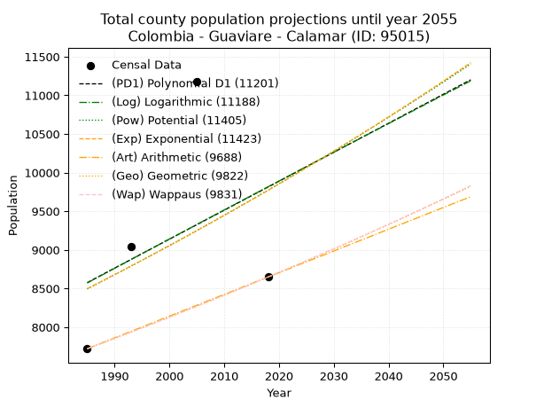
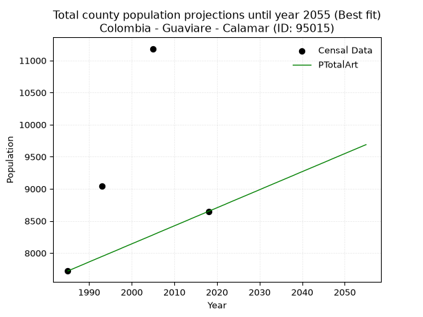
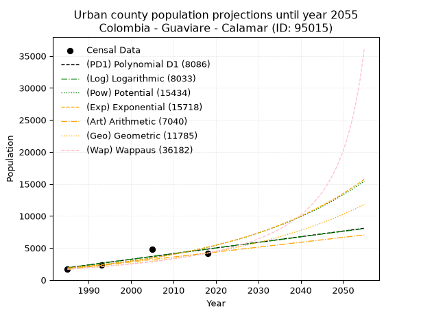
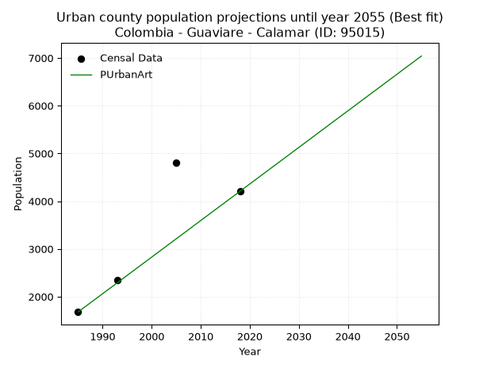
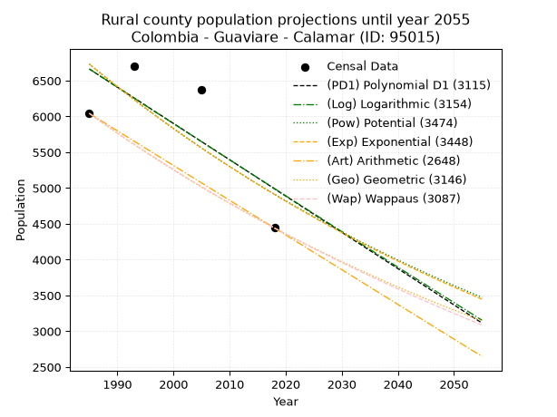
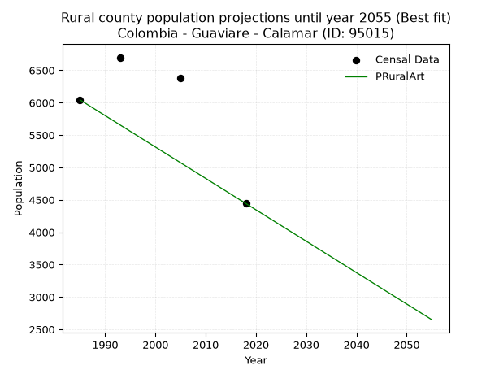

<div align="center">


</div>

# _“Population and Public Services Demand Projections (PPSD) until Year 2050 for Colombia - Guaviare - Calamar (ID: 95015)”_
Keywords: `population` `public-service` `projection` `lineal` `polynomial` `logarithmic` `potential` `exponential` `arithmetic` `geometric` `wappaus` `dane` `colombia` `south-america`

PPSD are analytical estimates used by governments and planners to anticipate future changes in population size, age distribution, and the resulting community needs for utilities, healthcare, education, and infrastructure as sizing future water treatment facilities, electrical grids, and road networks based on spatial growth.

> **General running parameters**: • app_version: _v20260806_. • Python version: _3.14.7_. • Pandas version: _3.0.5_. • NumPy version: _2.5.1_. • Creates, save and include plots into reports (create_plot): _False_. • Projection until year: _2050_. • Process polynomial degree 2 and up: _False_. • Process Wappaus: _True_. • Process Wappaus: _True_. • Set negative values to zero: _True_. • Set infinite values to zero: _True_. • Drop dataset notes: _True_. 
<div align="center">

Dynamic map: [:earth_americas:Google](http://maps.google.com/maps?q=1.960981575,-72.6551971) [:earth_americas:OSM](https://www.openstreetmap.org/#map=18/1.960981575/-72.6551971&layers=P) [:earth_americas:Bing](https://www.bing.com/maps?cp=1.960981575~-72.6551971&lvl=18) [:earth_americas:Apple](https://maps.apple.com/frame?center=1.960981575%2C-72.6551971&span=0.003%2C0.006)

</div>


<div align="center">

```geojson
{
  "type": "Feature",
  "geometry": {
    "type": "Point", 
    "coordinates": [-72.6551971, 1.960981575]
  }, 
  "properties": {
    "Name": "Colombia - Guaviare - Calamar (ID: 95015)"
  }
}
```

</div>


## 0. Census Data (4 records)

Census data are official statistics collected by a government about the people and housing in a country. They usually include counts of total population, age, sex, race, income, education, and jobs.

📅Global census file: [Population.xlsx](../data/Population.xlsx)

| Source   |   Year |   CountryID | CountryName   |   StateID | StateName   |   CountyID | CountyName   |   PTotal |   PUrban |   PRural |
|:---------|-------:|------------:|:--------------|----------:|:------------|-----------:|:-------------|---------:|---------:|---------:|
| DANE     |   1985 |          57 | Colombia      |        95 | Guaviare    |      95015 | Calamar      |     7720 |     1678 |     6042 |
| DANE     |   1993 |          57 | Colombia      |        95 | Guaviare    |      95015 | Calamar      |     9039 |     2341 |     6698 |
| DANE     |   2005 |          57 | Colombia      |        95 | Guaviare    |      95015 | Calamar      |    11183 |     4806 |     6377 |
| DANE     |   2018 |          57 | Colombia      |        95 | Guaviare    |      95015 | Calamar      |     8648 |     4206 |     4442 |

> 🔥Some records could had specific notes about the registered values or the corresponding urban or rural distribution.

## 1. Total

### 1.1. Coefficients and Parameters

* (PD1) Polynomial Deg 1: 37.5086310718601, -65879.13930148816 (lineal)
* (Log) Logarithmic: 75491.71104343141, -564665.6005937282
* (Pow) Potential: 8.502371516434174, -24.109670248350685
* (Exp) Exponential: 0.004225696577633862, 1.9339743608377526
* (Art) Arithmetic: Year diff. 2018 - 1985 = 33, Population diff. 8648 - 7720 = 928, Annual growth = 28.12121212121212
* (Geo) Geometric: Year diff. 2018 - 1985 = 33, Population diff. 8648 - 7720 = 928, Annual growth % = 0.003445732519153477
* (Wap) Wappaus: i = 0.3436120738173524, Condition values only valid for < 200)

<sub>
Wappaus condition values: ['0.00', '0.34', '0.69', '1.03', '1.37', '1.72', '2.06', '2.41', '2.75', '3.09', '3.44', '3.78', '4.12', '4.47', '4.81', '5.15', '5.50', '5.84', '6.19', '6.53', '6.87', '7.22', '7.56', '7.90', '8.25', '8.59', '8.93', '9.28', '9.62', '9.96', '10.31', '10.65', '11.00', '11.34', '11.68', '12.03', '12.37', '12.71', '13.06', '13.40', '13.74', '14.09', '14.43', '14.78', '15.12', '15.46', '15.81', '16.15', '16.49', '16.84', '17.18', '17.52', '17.87', '18.21', '18.56', '18.90', '19.24', '19.59', '19.93', '20.27', '20.62', '20.96', '21.30', '21.65', '21.99', '22.33']
</sub>


### 1.2. Projected Dataset

|   Year |   CountyID |   PTotalPD1 |   PTotalLog |   PTotalPow |   PTotalExp |   PTotalArt |   PTotalGeo |   PTotalWap |
|-------:|-----------:|------------:|------------:|------------:|------------:|------------:|------------:|------------:|
|   1985 |      95015 |        8575 |        8571 |        8494 |        8498 |        7720 |        7720 |        7720 |
|   1986 |      95015 |        8613 |        8609 |        8531 |        8534 |        7748 |        7747 |        7747 |
|   1987 |      95015 |        8651 |        8647 |        8567 |        8570 |        7776 |        7773 |        7773 |
|   1988 |      95015 |        8688 |        8685 |        8604 |        8606 |        7804 |        7800 |        7800 |
|   1989 |      95015 |        8726 |        8723 |        8641 |        8643 |        7832 |        7827 |        7827 |
|   1990 |      95015 |        8763 |        8761 |        8678 |        8679 |        7861 |        7854 |        7854 |
|   1991 |      95015 |        8801 |        8799 |        8715 |        8716 |        7889 |        7881 |        7881 |
|   1992 |      95015 |        8838 |        8837 |        8752 |        8753 |        7917 |        7908 |        7908 |
|   1993 |      95015 |        8876 |        8875 |        8790 |        8790 |        7945 |        7935 |        7935 |
|   1994 |      95015 |        8913 |        8913 |        8827 |        8827 |        7973 |        7963 |        7962 |
|   1995 |      95015 |        8951 |        8951 |        8865 |        8865 |        8001 |        7990 |        7990 |
|   1996 |      95015 |        8988 |        8988 |        8903 |        8902 |        8029 |        8018 |        8017 |
|   1997 |      95015 |        9026 |        9026 |        8941 |        8940 |        8057 |        8045 |        8045 |
|   1998 |      95015 |        9063 |        9064 |        8979 |        8978 |        8086 |        8073 |        8073 |
|   1999 |      95015 |        9101 |        9102 |        9017 |        9016 |        8114 |        8101 |        8101 |
|   2000 |      95015 |        9138 |        9140 |        9056 |        9054 |        8142 |        8129 |        8128 |
|   2001 |      95015 |        9176 |        9177 |        9094 |        9092 |        8170 |        8157 |        8156 |
|   2002 |      95015 |        9213 |        9215 |        9133 |        9131 |        8198 |        8185 |        8185 |
|   2003 |      95015 |        9251 |        9253 |        9172 |        9170 |        8226 |        8213 |        8213 |
|   2004 |      95015 |        9288 |        9290 |        9211 |        9208 |        8254 |        8241 |        8241 |
|   2005 |      95015 |        9326 |        9328 |        9250 |        9247 |        8282 |        8270 |        8269 |
|   2006 |      95015 |        9363 |        9366 |        9289 |        9287 |        8311 |        8298 |        8298 |
|   2007 |      95015 |        9401 |        9403 |        9329 |        9326 |        8339 |        8327 |        8327 |
|   2008 |      95015 |        9438 |        9441 |        9368 |        9365 |        8367 |        8356 |        8355 |
|   2009 |      95015 |        9476 |        9478 |        9408 |        9405 |        8395 |        8384 |        8384 |
|   2010 |      95015 |        9513 |        9516 |        9448 |        9445 |        8423 |        8413 |        8413 |
|   2011 |      95015 |        9551 |        9554 |        9488 |        9485 |        8451 |        8442 |        8442 |
|   2012 |      95015 |        9588 |        9591 |        9528 |        9525 |        8479 |        8471 |        8471 |
|   2013 |      95015 |        9626 |        9629 |        9568 |        9565 |        8507 |        8501 |        8500 |
|   2014 |      95015 |        9663 |        9666 |        9609 |        9606 |        8536 |        8530 |        8530 |
|   2015 |      95015 |        9701 |        9704 |        9649 |        9647 |        8564 |        8559 |        8559 |
|   2016 |      95015 |        9738 |        9741 |        9690 |        9687 |        8592 |        8589 |        8589 |
|   2017 |      95015 |        9776 |        9778 |        9731 |        9728 |        8620 |        8618 |        8618 |
|   2018 |      95015 |        9813 |        9816 |        9772 |        9770 |        8648 |        8648 |        8648 |
|   2019 |      95015 |        9851 |        9853 |        9814 |        9811 |        8676 |        8678 |        8678 |
|   2020 |      95015 |        9888 |        9891 |        9855 |        9853 |        8704 |        8708 |        8708 |
|   2021 |      95015 |        9926 |        9928 |        9897 |        9894 |        8732 |        8738 |        8738 |
|   2022 |      95015 |        9963 |        9965 |        9938 |        9936 |        8760 |        8768 |        8768 |
|   2023 |      95015 |       10001 |       10003 |        9980 |        9978 |        8789 |        8798 |        8798 |
|   2024 |      95015 |       10038 |       10040 |       10022 |       10020 |        8817 |        8828 |        8829 |
|   2025 |      95015 |       10076 |       10077 |       10064 |       10063 |        8845 |        8859 |        8859 |
|   2026 |      95015 |       10113 |       10115 |       10107 |       10106 |        8873 |        8889 |        8890 |
|   2027 |      95015 |       10151 |       10152 |       10149 |       10148 |        8901 |        8920 |        8921 |
|   2028 |      95015 |       10188 |       10189 |       10192 |       10191 |        8929 |        8951 |        8952 |
|   2029 |      95015 |       10226 |       10226 |       10235 |       10234 |        8957 |        8981 |        8983 |
|   2030 |      95015 |       10263 |       10263 |       10278 |       10278 |        8985 |        9012 |        9014 |
|   2031 |      95015 |       10301 |       10301 |       10321 |       10321 |        9014 |        9043 |        9045 |
|   2032 |      95015 |       10338 |       10338 |       10364 |       10365 |        9042 |        9075 |        9076 |
|   2033 |      95015 |       10376 |       10375 |       10407 |       10409 |        9070 |        9106 |        9108 |
|   2034 |      95015 |       10413 |       10412 |       10451 |       10453 |        9098 |        9137 |        9139 |
|   2035 |      95015 |       10451 |       10449 |       10495 |       10497 |        9126 |        9169 |        9171 |
|   2036 |      95015 |       10488 |       10486 |       10539 |       10542 |        9154 |        9200 |        9203 |
|   2037 |      95015 |       10526 |       10523 |       10583 |       10586 |        9182 |        9232 |        9235 |
|   2038 |      95015 |       10563 |       10560 |       10627 |       10631 |        9210 |        9264 |        9267 |
|   2039 |      95015 |       10601 |       10597 |       10671 |       10676 |        9239 |        9296 |        9299 |
|   2040 |      95015 |       10638 |       10634 |       10716 |       10721 |        9267 |        9328 |        9331 |
|   2041 |      95015 |       10676 |       10671 |       10761 |       10767 |        9295 |        9360 |        9364 |
|   2042 |      95015 |       10713 |       10708 |       10806 |       10812 |        9323 |        9392 |        9396 |
|   2043 |      95015 |       10751 |       10745 |       10851 |       10858 |        9351 |        9425 |        9429 |
|   2044 |      95015 |       10789 |       10782 |       10896 |       10904 |        9379 |        9457 |        9462 |
|   2045 |      95015 |       10826 |       10819 |       10941 |       10950 |        9407 |        9490 |        9495 |
|   2046 |      95015 |       10864 |       10856 |       10987 |       10997 |        9435 |        9522 |        9528 |
|   2047 |      95015 |       10901 |       10893 |       11033 |       11043 |        9464 |        9555 |        9561 |
|   2048 |      95015 |       10939 |       10930 |       11079 |       11090 |        9492 |        9588 |        9594 |
|   2049 |      95015 |       10976 |       10967 |       11125 |       11137 |        9520 |        9621 |        9627 |
|   2050 |      95015 |       11014 |       11004 |       11171 |       11184 |        9548 |        9654 |        9661 |
<div align="center">

</img>

</div>


### 1.3. Best fit with absolute and relative error (%)

Relative error puts that difference into context by dividing the absolute error by the true value, creating a unitless ratio or percentage that shows the scale of the mistake.

Absolute and relative error

|   Year | Source   |   CountryID | CountryName   |   StateID | StateName   |   CountyID_x | CountyName   |   PTotal |   PUrban |   PRural |   CountyID_y |   PTotalPD1 |   PTotalLog |   PTotalPow |   PTotalExp |   PTotalArt |   PTotalGeo |   PTotalWap |   PTotalPD1AbsError |   PTotalLogAbsError |   PTotalPowAbsError |   PTotalExpAbsError |   PTotalArtAbsError |   PTotalGeoAbsError |   PTotalWapAbsError |   PTotalPD1RelError |   PTotalLogRelError |   PTotalPowRelError |   PTotalExpRelError |   PTotalArtRelError |   PTotalGeoRelError |   PTotalWapRelError |
|-------:|:---------|------------:|:--------------|----------:|:------------|-------------:|:-------------|---------:|---------:|---------:|-------------:|------------:|------------:|------------:|------------:|------------:|------------:|------------:|--------------------:|--------------------:|--------------------:|--------------------:|--------------------:|--------------------:|--------------------:|--------------------:|--------------------:|--------------------:|--------------------:|--------------------:|--------------------:|--------------------:|
|   1985 | DANE     |          57 | Colombia      |        95 | Guaviare    |        95015 | Calamar      |     7720 |     1678 |     6042 |        95015 |        8575 |        8571 |        8494 |        8498 |        7720 |        7720 |        7720 |                 855 |                 851 |                 774 |                 778 |                   0 |                   0 |                   0 |             11.0751 |            11.0233  |            10.0259  |            10.0777  |              0      |              0      |              0      |
|   1993 | DANE     |          57 | Colombia      |        95 | Guaviare    |        95015 | Calamar      |     9039 |     2341 |     6698 |        95015 |        8876 |        8875 |        8790 |        8790 |        7945 |        7935 |        7935 |                 163 |                 164 |                 249 |                 249 |                1094 |                1104 |                1104 |              1.8033 |             1.81436 |             2.75473 |             2.75473 |             12.1031 |             12.2137 |             12.2137 |
|   2005 | DANE     |          57 | Colombia      |        95 | Guaviare    |        95015 | Calamar      |    11183 |     4806 |     6377 |        95015 |        9326 |        9328 |        9250 |        9247 |        8282 |        8270 |        8269 |                1857 |                1855 |                1933 |                1936 |                2901 |                2913 |                2914 |             16.6056 |            16.5877  |            17.2852  |            17.312   |             25.9412 |             26.0485 |             26.0574 |
|   2018 | DANE     |          57 | Colombia      |        95 | Guaviare    |        95015 | Calamar      |     8648 |     4206 |     4442 |        95015 |        9813 |        9816 |        9772 |        9770 |        8648 |        8648 |        8648 |                1165 |                1168 |                1124 |                1122 |                   0 |                   0 |                   0 |             13.4713 |            13.506   |            12.9972  |            12.9741  |              0      |              0      |              0      |

Relative error mean

| Method    |   RelError | Best   |
|:----------|-----------:|:-------|
| PTotalPD1 |   10.7388  |        |
| PTotalLog |   10.7328  |        |
| PTotalPow |   10.7658  |        |
| PTotalExp |   10.7796  |        |
| PTotalArt |    9.51107 | True   |
| PTotalGeo |    9.56555 |        |
| PTotalWap |    9.56779 |        |

💙Best method: _**PTotalArt**_
<div align="center">

</img>

</div>


### 1.4. Fresh water supply demand in liters per capita per day (lpcd)

The fresh water supply demand typically ranges from 100 to 300 liters per capita per day (lpcd) for standard domestic and municipal planning, though absolute survival minimums set by the World Health Organization are as low as 7.5 to 20 liters per day, and total consumption in high-income nations can exceed 400 liters.

> `CZ`: Level in meters above the sea level (masl).<br> `WS`: Fresh water supply demand in liters per capita per day (lpcd or l/h/d).<br> `WSAll`: Zonal fresh water supply demand in liters per second (l/s).<br> `A`: Zonal area in square meters.

Reference values (RAS Colombia)

|    CZ |   WS |
|------:|-----:|
|  1000 |  120 |
|  2000 |  130 |
| 99999 |  140 |

County shapefile geometry properties and water supply values

|   CountyID |      ATotal |   CZTotal |   WSTotal |
|-----------:|------------:|----------:|----------:|
|      95015 | 1.35103e+10 |   272.165 |       120 |

Projected values for best method: PTotalArt

|   CountyID |   Year |   PTotalArt |   WSTotal |   WSTotalAll |
|-----------:|-------:|------------:|----------:|-------------:|
|      95015 |   1985 |        7720 |       120 |      10.7222 |
|      95015 |   1986 |        7748 |       120 |      10.7611 |
|      95015 |   1987 |        7776 |       120 |      10.8    |
|      95015 |   1988 |        7804 |       120 |      10.8389 |
|      95015 |   1989 |        7832 |       120 |      10.8778 |
|      95015 |   1990 |        7861 |       120 |      10.9181 |
|      95015 |   1991 |        7889 |       120 |      10.9569 |
|      95015 |   1992 |        7917 |       120 |      10.9958 |
|      95015 |   1993 |        7945 |       120 |      11.0347 |
|      95015 |   1994 |        7973 |       120 |      11.0736 |
|      95015 |   1995 |        8001 |       120 |      11.1125 |
|      95015 |   1996 |        8029 |       120 |      11.1514 |
|      95015 |   1997 |        8057 |       120 |      11.1903 |
|      95015 |   1998 |        8086 |       120 |      11.2306 |
|      95015 |   1999 |        8114 |       120 |      11.2694 |
|      95015 |   2000 |        8142 |       120 |      11.3083 |
|      95015 |   2001 |        8170 |       120 |      11.3472 |
|      95015 |   2002 |        8198 |       120 |      11.3861 |
|      95015 |   2003 |        8226 |       120 |      11.425  |
|      95015 |   2004 |        8254 |       120 |      11.4639 |
|      95015 |   2005 |        8282 |       120 |      11.5028 |
|      95015 |   2006 |        8311 |       120 |      11.5431 |
|      95015 |   2007 |        8339 |       120 |      11.5819 |
|      95015 |   2008 |        8367 |       120 |      11.6208 |
|      95015 |   2009 |        8395 |       120 |      11.6597 |
|      95015 |   2010 |        8423 |       120 |      11.6986 |
|      95015 |   2011 |        8451 |       120 |      11.7375 |
|      95015 |   2012 |        8479 |       120 |      11.7764 |
|      95015 |   2013 |        8507 |       120 |      11.8153 |
|      95015 |   2014 |        8536 |       120 |      11.8556 |
|      95015 |   2015 |        8564 |       120 |      11.8944 |
|      95015 |   2016 |        8592 |       120 |      11.9333 |
|      95015 |   2017 |        8620 |       120 |      11.9722 |
|      95015 |   2018 |        8648 |       120 |      12.0111 |
|      95015 |   2019 |        8676 |       120 |      12.05   |
|      95015 |   2020 |        8704 |       120 |      12.0889 |
|      95015 |   2021 |        8732 |       120 |      12.1278 |
|      95015 |   2022 |        8760 |       120 |      12.1667 |
|      95015 |   2023 |        8789 |       120 |      12.2069 |
|      95015 |   2024 |        8817 |       120 |      12.2458 |
|      95015 |   2025 |        8845 |       120 |      12.2847 |
|      95015 |   2026 |        8873 |       120 |      12.3236 |
|      95015 |   2027 |        8901 |       120 |      12.3625 |
|      95015 |   2028 |        8929 |       120 |      12.4014 |
|      95015 |   2029 |        8957 |       120 |      12.4403 |
|      95015 |   2030 |        8985 |       120 |      12.4792 |
|      95015 |   2031 |        9014 |       120 |      12.5194 |
|      95015 |   2032 |        9042 |       120 |      12.5583 |
|      95015 |   2033 |        9070 |       120 |      12.5972 |
|      95015 |   2034 |        9098 |       120 |      12.6361 |
|      95015 |   2035 |        9126 |       120 |      12.675  |
|      95015 |   2036 |        9154 |       120 |      12.7139 |
|      95015 |   2037 |        9182 |       120 |      12.7528 |
|      95015 |   2038 |        9210 |       120 |      12.7917 |
|      95015 |   2039 |        9239 |       120 |      12.8319 |
|      95015 |   2040 |        9267 |       120 |      12.8708 |
|      95015 |   2041 |        9295 |       120 |      12.9097 |
|      95015 |   2042 |        9323 |       120 |      12.9486 |
|      95015 |   2043 |        9351 |       120 |      12.9875 |
|      95015 |   2044 |        9379 |       120 |      13.0264 |
|      95015 |   2045 |        9407 |       120 |      13.0653 |
|      95015 |   2046 |        9435 |       120 |      13.1042 |
|      95015 |   2047 |        9464 |       120 |      13.1444 |
|      95015 |   2048 |        9492 |       120 |      13.1833 |
|      95015 |   2049 |        9520 |       120 |      13.2222 |
|      95015 |   2050 |        9548 |       120 |      13.2611 |

## 2. Urban

### 2.1. Coefficients and Parameters

* (PD1) Polynomial Deg 1: 88.19470092332416, -173153.70052187916 (lineal)
* (Log) Logarithmic: 176723.1907480479, -1340016.639046685
* (Pow) Potential: 60.796585210617124, -197.2191768196094
* (Exp) Exponential: 0.030340934780564866, 1.3117959149692849e-23
* (Art) Arithmetic: Year diff. 2018 - 1985 = 33, Population diff. 4206 - 1678 = 2528, Annual growth = 76.60606060606061
* (Geo) Geometric: Year diff. 2018 - 1985 = 33, Population diff. 4206 - 1678 = 2528, Annual growth % = 0.028237057872558813
* (Wap) Wappaus: i = 2.603876975053046, Condition values only valid for < 200)

<sub>
Wappaus condition values: ['0.00', '2.60', '5.21', '7.81', '10.42', '13.02', '15.62', '18.23', '20.83', '23.43', '26.04', '28.64', '31.25', '33.85', '36.45', '39.06', '41.66', '44.27', '46.87', '49.47', '52.08', '54.68', '57.29', '59.89', '62.49', '65.10', '67.70', '70.30', '72.91', '75.51', '78.12', '80.72', '83.32', '85.93', '88.53', '91.14', '93.74', '96.34', '98.95', '101.55', '104.16', '106.76', '109.36', '111.97', '114.57', '117.17', '119.78', '122.38', '124.99', '127.59', '130.19', '132.80', '135.40', '138.01', '140.61', '143.21', '145.82', '148.42', '151.02', '153.63', '156.23', '158.84', '161.44', '164.04', '166.65', '169.25']
</sub>


### 2.2. Projected Dataset

|   Year |   CountyID |   PUrbanPD1 |   PUrbanLog |   PUrbanPow |   PUrbanExp |   PUrbanArt |   PUrbanGeo |   PUrbanWap |
|-------:|-----------:|------------:|------------:|------------:|------------:|------------:|------------:|------------:|
|   1985 |      95015 |        1913 |        1909 |        1877 |        1879 |        1678 |        1678 |        1678 |
|   1986 |      95015 |        2001 |        1998 |        1935 |        1937 |        1755 |        1725 |        1722 |
|   1987 |      95015 |        2089 |        2087 |        1995 |        1997 |        1831 |        1774 |        1768 |
|   1988 |      95015 |        2177 |        2176 |        2057 |        2058 |        1908 |        1824 |        1814 |
|   1989 |      95015 |        2266 |        2264 |        2121 |        2122 |        1984 |        1876 |        1862 |
|   1990 |      95015 |        2354 |        2353 |        2187 |        2187 |        2061 |        1929 |        1912 |
|   1991 |      95015 |        2442 |        2442 |        2255 |        2255 |        2138 |        1983 |        1962 |
|   1992 |      95015 |        2530 |        2531 |        2325 |        2324 |        2214 |        2039 |        2015 |
|   1993 |      95015 |        2618 |        2619 |        2397 |        2396 |        2291 |        2097 |        2068 |
|   1994 |      95015 |        2707 |        2708 |        2471 |        2469 |        2367 |        2156 |        2123 |
|   1995 |      95015 |        2795 |        2797 |        2547 |        2546 |        2444 |        2217 |        2180 |
|   1996 |      95015 |        2883 |        2885 |        2626 |        2624 |        2521 |        2279 |        2239 |
|   1997 |      95015 |        2971 |        2974 |        2707 |        2705 |        2597 |        2344 |        2299 |
|   1998 |      95015 |        3059 |        3062 |        2791 |        2788 |        2674 |        2410 |        2362 |
|   1999 |      95015 |        3148 |        3151 |        2877 |        2874 |        2750 |        2478 |        2426 |
|   2000 |      95015 |        3236 |        3239 |        2966 |        2963 |        2827 |        2548 |        2492 |
|   2001 |      95015 |        3324 |        3327 |        3058 |        3054 |        2904 |        2620 |        2561 |
|   2002 |      95015 |        3412 |        3416 |        3152 |        3148 |        2980 |        2694 |        2632 |
|   2003 |      95015 |        3500 |        3504 |        3249 |        3245 |        3057 |        2770 |        2705 |
|   2004 |      95015 |        3588 |        3592 |        3349 |        3345 |        3134 |        2848 |        2781 |
|   2005 |      95015 |        3677 |        3680 |        3452 |        3448 |        3210 |        2929 |        2860 |
|   2006 |      95015 |        3765 |        3768 |        3558 |        3554 |        3287 |        3011 |        2941 |
|   2007 |      95015 |        3853 |        3857 |        3668 |        3664 |        3363 |        3096 |        3025 |
|   2008 |      95015 |        3941 |        3945 |        3781 |        3776 |        3440 |        3184 |        3112 |
|   2009 |      95015 |        4029 |        4033 |        3897 |        3893 |        3517 |        3274 |        3203 |
|   2010 |      95015 |        4118 |        4121 |        4017 |        4013 |        3593 |        3366 |        3297 |
|   2011 |      95015 |        4206 |        4208 |        4140 |        4136 |        3670 |        3461 |        3395 |
|   2012 |      95015 |        4294 |        4296 |        4267 |        4264 |        3746 |        3559 |        3497 |
|   2013 |      95015 |        4382 |        4384 |        4398 |        4395 |        3823 |        3659 |        3603 |
|   2014 |      95015 |        4470 |        4472 |        4533 |        4530 |        3900 |        3763 |        3714 |
|   2015 |      95015 |        4559 |        4560 |        4672 |        4670 |        3976 |        3869 |        3829 |
|   2016 |      95015 |        4647 |        4647 |        4815 |        4814 |        4053 |        3978 |        3949 |
|   2017 |      95015 |        4735 |        4735 |        4962 |        4962 |        4129 |        4090 |        4075 |
|   2018 |      95015 |        4823 |        4822 |        5114 |        5115 |        4206 |        4206 |        4206 |
|   2019 |      95015 |        4911 |        4910 |        5270 |        5273 |        4283 |        4325 |        4343 |
|   2020 |      95015 |        5000 |        4998 |        5431 |        5435 |        4359 |        4447 |        4487 |
|   2021 |      95015 |        5088 |        5085 |        5597 |        5603 |        4436 |        4572 |        4639 |
|   2022 |      95015 |        5176 |        5172 |        5768 |        5775 |        4512 |        4702 |        4797 |
|   2023 |      95015 |        5264 |        5260 |        5944 |        5953 |        4589 |        4834 |        4964 |
|   2024 |      95015 |        5352 |        5347 |        6125 |        6136 |        4666 |        4971 |        5140 |
|   2025 |      95015 |        5441 |        5434 |        6312 |        6325 |        4742 |        5111 |        5325 |
|   2026 |      95015 |        5529 |        5522 |        6504 |        6520 |        4819 |        5256 |        5521 |
|   2027 |      95015 |        5617 |        5609 |        6703 |        6721 |        4895 |        5404 |        5727 |
|   2028 |      95015 |        5705 |        5696 |        6907 |        6928 |        4972 |        5557 |        5946 |
|   2029 |      95015 |        5793 |        5783 |        7117 |        7142 |        5049 |        5713 |        6179 |
|   2030 |      95015 |        5882 |        5870 |        7333 |        7362 |        5125 |        5875 |        6426 |
|   2031 |      95015 |        5970 |        5957 |        7556 |        7588 |        5202 |        6041 |        6689 |
|   2032 |      95015 |        6058 |        6044 |        7786 |        7822 |        5278 |        6211 |        6970 |
|   2033 |      95015 |        6146 |        6131 |        8022 |        8063 |        5355 |        6387 |        7270 |
|   2034 |      95015 |        6234 |        6218 |        8265 |        8312 |        5432 |        6567 |        7591 |
|   2035 |      95015 |        6323 |        6305 |        8516 |        8568 |        5508 |        6752 |        7937 |
|   2036 |      95015 |        6411 |        6392 |        8774 |        8832 |        5585 |        6943 |        8310 |
|   2037 |      95015 |        6499 |        6479 |        9040 |        9104 |        5662 |        7139 |        8712 |
|   2038 |      95015 |        6587 |        6565 |        9314 |        9384 |        5738 |        7341 |        9149 |
|   2039 |      95015 |        6675 |        6652 |        9596 |        9673 |        5815 |        7548 |        9623 |
|   2040 |      95015 |        6763 |        6739 |        9886 |        9971 |        5891 |        7761 |       10142 |
|   2041 |      95015 |        6852 |        6825 |       10185 |       10278 |        5968 |        7980 |       10710 |
|   2042 |      95015 |        6940 |        6912 |       10493 |       10595 |        6045 |        8206 |       11335 |
|   2043 |      95015 |        7028 |        6998 |       10810 |       10921 |        6121 |        8437 |       12027 |
|   2044 |      95015 |        7116 |        7085 |       11137 |       11258 |        6198 |        8675 |       12796 |
|   2045 |      95015 |        7204 |        7171 |       11473 |       11605 |        6274 |        8920 |       13658 |
|   2046 |      95015 |        7293 |        7258 |       11819 |       11962 |        6351 |        9172 |       14628 |
|   2047 |      95015 |        7381 |        7344 |       12175 |       12331 |        6428 |        9431 |       15729 |
|   2048 |      95015 |        7469 |        7430 |       12542 |       12710 |        6504 |        9698 |       16989 |
|   2049 |      95015 |        7557 |        7517 |       12920 |       13102 |        6581 |        9971 |       18447 |
|   2050 |      95015 |        7645 |        7603 |       13309 |       13506 |        6657 |       10253 |       20151 |
<div align="center">

</img>

</div>


### 2.3. Best fit with absolute and relative error (%)

Relative error puts that difference into context by dividing the absolute error by the true value, creating a unitless ratio or percentage that shows the scale of the mistake.

Absolute and relative error

|   Year | Source   |   CountryID | CountryName   |   StateID | StateName   |   CountyID_x | CountyName   |   PTotal |   PUrban |   PRural |   CountyID_y |   PUrbanPD1 |   PUrbanLog |   PUrbanPow |   PUrbanExp |   PUrbanArt |   PUrbanGeo |   PUrbanWap |   PUrbanPD1AbsError |   PUrbanLogAbsError |   PUrbanPowAbsError |   PUrbanExpAbsError |   PUrbanArtAbsError |   PUrbanGeoAbsError |   PUrbanWapAbsError |   PUrbanPD1RelError |   PUrbanLogRelError |   PUrbanPowRelError |   PUrbanExpRelError |   PUrbanArtRelError |   PUrbanGeoRelError |   PUrbanWapRelError |
|-------:|:---------|------------:|:--------------|----------:|:------------|-------------:|:-------------|---------:|---------:|---------:|-------------:|------------:|------------:|------------:|------------:|------------:|------------:|------------:|--------------------:|--------------------:|--------------------:|--------------------:|--------------------:|--------------------:|--------------------:|--------------------:|--------------------:|--------------------:|--------------------:|--------------------:|--------------------:|--------------------:|
|   1985 | DANE     |          57 | Colombia      |        95 | Guaviare    |        95015 | Calamar      |     7720 |     1678 |     6042 |        95015 |        1913 |        1909 |        1877 |        1879 |        1678 |        1678 |        1678 |                 235 |                 231 |                 199 |                 201 |                   0 |                   0 |                   0 |             14.0048 |             13.7664 |            11.8594  |            11.9785  |             0       |              0      |              0      |
|   1993 | DANE     |          57 | Colombia      |        95 | Guaviare    |        95015 | Calamar      |     9039 |     2341 |     6698 |        95015 |        2618 |        2619 |        2397 |        2396 |        2291 |        2097 |        2068 |                 277 |                 278 |                  56 |                  55 |                  50 |                 244 |                 273 |             11.8326 |             11.8753 |             2.39214 |             2.34942 |             2.13584 |             10.4229 |             11.6617 |
|   2005 | DANE     |          57 | Colombia      |        95 | Guaviare    |        95015 | Calamar      |    11183 |     4806 |     6377 |        95015 |        3677 |        3680 |        3452 |        3448 |        3210 |        2929 |        2860 |                1129 |                1126 |                1354 |                1358 |                1596 |                1877 |                1946 |             23.4915 |             23.429  |            28.1731  |            28.2563  |            33.2085  |             39.0553 |             40.4911 |
|   2018 | DANE     |          57 | Colombia      |        95 | Guaviare    |        95015 | Calamar      |     8648 |     4206 |     4442 |        95015 |        4823 |        4822 |        5114 |        5115 |        4206 |        4206 |        4206 |                 617 |                 616 |                 908 |                 909 |                   0 |                   0 |                   0 |             14.6695 |             14.6457 |            21.5882  |            21.612   |             0       |              0      |              0      |

Relative error mean

| Method    |   RelError | Best   |
|:----------|-----------:|:-------|
| PUrbanPD1 |   15.9996  |        |
| PUrbanLog |   15.9291  |        |
| PUrbanPow |   16.0032  |        |
| PUrbanExp |   16.0491  |        |
| PUrbanArt |    8.83608 | True   |
| PUrbanGeo |   12.3696  |        |
| PUrbanWap |   13.0382  |        |

💙Best method: _**PUrbanArt**_
<div align="center">

</img>

</div>


### 2.4. Fresh water supply demand in liters per capita per day (lpcd)

The fresh water supply demand typically ranges from 100 to 300 liters per capita per day (lpcd) for standard domestic and municipal planning, though absolute survival minimums set by the World Health Organization are as low as 7.5 to 20 liters per day, and total consumption in high-income nations can exceed 400 liters.

> `CZ`: Level in meters above the sea level (masl).<br> `WS`: Fresh water supply demand in liters per capita per day (lpcd or l/h/d).<br> `WSAll`: Zonal fresh water supply demand in liters per second (l/s).<br> `A`: Zonal area in square meters.

Reference values (RAS Colombia)

|    CZ |   WS |
|------:|-----:|
|  1000 |  120 |
|  2000 |  130 |
| 99999 |  140 |

County shapefile geometry properties and water supply values

|   CountyID |     AUrban |   CZUrban |   WSUrban |
|-----------:|-----------:|----------:|----------:|
|      95015 | 1.0433e+06 |   221.015 |       120 |

Projected values for best method: PUrbanArt

|   CountyID |   Year |   PUrbanArt |   WSUrban |   WSUrbanAll |
|-----------:|-------:|------------:|----------:|-------------:|
|      95015 |   1985 |        1678 |       120 |      2.33056 |
|      95015 |   1986 |        1755 |       120 |      2.4375  |
|      95015 |   1987 |        1831 |       120 |      2.54306 |
|      95015 |   1988 |        1908 |       120 |      2.65    |
|      95015 |   1989 |        1984 |       120 |      2.75556 |
|      95015 |   1990 |        2061 |       120 |      2.8625  |
|      95015 |   1991 |        2138 |       120 |      2.96944 |
|      95015 |   1992 |        2214 |       120 |      3.075   |
|      95015 |   1993 |        2291 |       120 |      3.18194 |
|      95015 |   1994 |        2367 |       120 |      3.2875  |
|      95015 |   1995 |        2444 |       120 |      3.39444 |
|      95015 |   1996 |        2521 |       120 |      3.50139 |
|      95015 |   1997 |        2597 |       120 |      3.60694 |
|      95015 |   1998 |        2674 |       120 |      3.71389 |
|      95015 |   1999 |        2750 |       120 |      3.81944 |
|      95015 |   2000 |        2827 |       120 |      3.92639 |
|      95015 |   2001 |        2904 |       120 |      4.03333 |
|      95015 |   2002 |        2980 |       120 |      4.13889 |
|      95015 |   2003 |        3057 |       120 |      4.24583 |
|      95015 |   2004 |        3134 |       120 |      4.35278 |
|      95015 |   2005 |        3210 |       120 |      4.45833 |
|      95015 |   2006 |        3287 |       120 |      4.56528 |
|      95015 |   2007 |        3363 |       120 |      4.67083 |
|      95015 |   2008 |        3440 |       120 |      4.77778 |
|      95015 |   2009 |        3517 |       120 |      4.88472 |
|      95015 |   2010 |        3593 |       120 |      4.99028 |
|      95015 |   2011 |        3670 |       120 |      5.09722 |
|      95015 |   2012 |        3746 |       120 |      5.20278 |
|      95015 |   2013 |        3823 |       120 |      5.30972 |
|      95015 |   2014 |        3900 |       120 |      5.41667 |
|      95015 |   2015 |        3976 |       120 |      5.52222 |
|      95015 |   2016 |        4053 |       120 |      5.62917 |
|      95015 |   2017 |        4129 |       120 |      5.73472 |
|      95015 |   2018 |        4206 |       120 |      5.84167 |
|      95015 |   2019 |        4283 |       120 |      5.94861 |
|      95015 |   2020 |        4359 |       120 |      6.05417 |
|      95015 |   2021 |        4436 |       120 |      6.16111 |
|      95015 |   2022 |        4512 |       120 |      6.26667 |
|      95015 |   2023 |        4589 |       120 |      6.37361 |
|      95015 |   2024 |        4666 |       120 |      6.48056 |
|      95015 |   2025 |        4742 |       120 |      6.58611 |
|      95015 |   2026 |        4819 |       120 |      6.69306 |
|      95015 |   2027 |        4895 |       120 |      6.79861 |
|      95015 |   2028 |        4972 |       120 |      6.90556 |
|      95015 |   2029 |        5049 |       120 |      7.0125  |
|      95015 |   2030 |        5125 |       120 |      7.11806 |
|      95015 |   2031 |        5202 |       120 |      7.225   |
|      95015 |   2032 |        5278 |       120 |      7.33056 |
|      95015 |   2033 |        5355 |       120 |      7.4375  |
|      95015 |   2034 |        5432 |       120 |      7.54444 |
|      95015 |   2035 |        5508 |       120 |      7.65    |
|      95015 |   2036 |        5585 |       120 |      7.75694 |
|      95015 |   2037 |        5662 |       120 |      7.86389 |
|      95015 |   2038 |        5738 |       120 |      7.96944 |
|      95015 |   2039 |        5815 |       120 |      8.07639 |
|      95015 |   2040 |        5891 |       120 |      8.18194 |
|      95015 |   2041 |        5968 |       120 |      8.28889 |
|      95015 |   2042 |        6045 |       120 |      8.39583 |
|      95015 |   2043 |        6121 |       120 |      8.50139 |
|      95015 |   2044 |        6198 |       120 |      8.60833 |
|      95015 |   2045 |        6274 |       120 |      8.71389 |
|      95015 |   2046 |        6351 |       120 |      8.82083 |
|      95015 |   2047 |        6428 |       120 |      8.92778 |
|      95015 |   2048 |        6504 |       120 |      9.03333 |
|      95015 |   2049 |        6581 |       120 |      9.14028 |
|      95015 |   2050 |        6657 |       120 |      9.24583 |

## 3. Rural

### 3.1. Coefficients and Parameters

* (PD1) Polynomial Deg 1: -50.68606985146405, 107274.56122039095 (lineal)
* (Log) Logarithmic: -101231.47970461652, 775351.0384529573
* (Pow) Potential: -19.088706094148538, 66.77809665895755
* (Exp) Exponential: -0.009556646820458784, 1165911988142.309
* (Art) Arithmetic: Year diff. 2018 - 1985 = 33, Population diff. 4442 - 6042 = -1600, Annual growth = -48.484848484848484
* (Geo) Geometric: Year diff. 2018 - 1985 = 33, Population diff. 4442 - 6042 = -1600, Annual growth % = -0.009278815677084884
* (Wap) Wappaus: i = -0.9249303411836796, Condition values only valid for < 200)

<sub>
Wappaus condition values: ['-0.00', '-0.92', '-1.85', '-2.77', '-3.70', '-4.62', '-5.55', '-6.47', '-7.40', '-8.32', '-9.25', '-10.17', '-11.10', '-12.02', '-12.95', '-13.87', '-14.80', '-15.72', '-16.65', '-17.57', '-18.50', '-19.42', '-20.35', '-21.27', '-22.20', '-23.12', '-24.05', '-24.97', '-25.90', '-26.82', '-27.75', '-28.67', '-29.60', '-30.52', '-31.45', '-32.37', '-33.30', '-34.22', '-35.15', '-36.07', '-37.00', '-37.92', '-38.85', '-39.77', '-40.70', '-41.62', '-42.55', '-43.47', '-44.40', '-45.32', '-46.25', '-47.17', '-48.10', '-49.02', '-49.95', '-50.87', '-51.80', '-52.72', '-53.65', '-54.57', '-55.50', '-56.42', '-57.35', '-58.27', '-59.20', '-60.12']
</sub>


### 3.2. Projected Dataset

|   Year |   CountyID |   PRuralPD1 |   PRuralLog |   PRuralPow |   PRuralExp |   PRuralArt |   PRuralGeo |   PRuralWap |
|-------:|-----------:|------------:|------------:|------------:|------------:|------------:|------------:|------------:|
|   1985 |      95015 |        6663 |        6663 |        6732 |        6732 |        6042 |        6042 |        6042 |
|   1986 |      95015 |        6612 |        6612 |        6667 |        6668 |        5994 |        5986 |        5986 |
|   1987 |      95015 |        6561 |        6561 |        6603 |        6604 |        5945 |        5930 |        5931 |
|   1988 |      95015 |        6511 |        6510 |        6540 |        6541 |        5897 |        5875 |        5877 |
|   1989 |      95015 |        6460 |        6459 |        6478 |        6479 |        5848 |        5821 |        5823 |
|   1990 |      95015 |        6409 |        6408 |        6416 |        6418 |        5800 |        5767 |        5769 |
|   1991 |      95015 |        6359 |        6357 |        6355 |        6357 |        5751 |        5713 |        5716 |
|   1992 |      95015 |        6308 |        6306 |        6294 |        6296 |        5703 |        5660 |        5663 |
|   1993 |      95015 |        6257 |        6255 |        6234 |        6236 |        5654 |        5608 |        5611 |
|   1994 |      95015 |        6207 |        6205 |        6175 |        6177 |        5606 |        5556 |        5559 |
|   1995 |      95015 |        6156 |        6154 |        6116 |        6118 |        5557 |        5504 |        5508 |
|   1996 |      95015 |        6105 |        6103 |        6058 |        6060 |        5509 |        5453 |        5457 |
|   1997 |      95015 |        6054 |        6052 |        6000 |        6002 |        5460 |        5403 |        5407 |
|   1998 |      95015 |        6004 |        6002 |        5943 |        5945 |        5412 |        5352 |        5357 |
|   1999 |      95015 |        5953 |        5951 |        5886 |        5889 |        5363 |        5303 |        5307 |
|   2000 |      95015 |        5902 |        5900 |        5830 |        5833 |        5315 |        5254 |        5258 |
|   2001 |      95015 |        5852 |        5850 |        5775 |        5777 |        5266 |        5205 |        5209 |
|   2002 |      95015 |        5801 |        5799 |        5720 |        5722 |        5218 |        5157 |        5161 |
|   2003 |      95015 |        5750 |        5749 |        5666 |        5668 |        5169 |        5109 |        5113 |
|   2004 |      95015 |        5700 |        5698 |        5612 |        5614 |        5121 |        5061 |        5066 |
|   2005 |      95015 |        5649 |        5648 |        5559 |        5561 |        5072 |        5014 |        5019 |
|   2006 |      95015 |        5598 |        5597 |        5506 |        5508 |        5024 |        4968 |        4972 |
|   2007 |      95015 |        5548 |        5547 |        5454 |        5455 |        4975 |        4922 |        4926 |
|   2008 |      95015 |        5497 |        5496 |        5403 |        5403 |        4927 |        4876 |        4880 |
|   2009 |      95015 |        5446 |        5446 |        5352 |        5352 |        4878 |        4831 |        4835 |
|   2010 |      95015 |        5396 |        5396 |        5301 |        5301 |        4830 |        4786 |        4790 |
|   2011 |      95015 |        5345 |        5345 |        5251 |        5251 |        4781 |        4742 |        4745 |
|   2012 |      95015 |        5294 |        5295 |        5201 |        5201 |        4733 |        4698 |        4701 |
|   2013 |      95015 |        5244 |        5245 |        5152 |        5151 |        4684 |        4654 |        4657 |
|   2014 |      95015 |        5193 |        5194 |        5104 |        5102 |        4636 |        4611 |        4613 |
|   2015 |      95015 |        5142 |        5144 |        5055 |        5054 |        4587 |        4568 |        4570 |
|   2016 |      95015 |        5091 |        5094 |        5008 |        5006 |        4539 |        4526 |        4527 |
|   2017 |      95015 |        5041 |        5044 |        4961 |        4958 |        4490 |        4484 |        4484 |
|   2018 |      95015 |        4990 |        4993 |        4914 |        4911 |        4442 |        4442 |        4442 |
|   2019 |      95015 |        4939 |        4943 |        4868 |        4864 |        4394 |        4401 |        4400 |
|   2020 |      95015 |        4889 |        4893 |        4822 |        4818 |        4345 |        4360 |        4359 |
|   2021 |      95015 |        4838 |        4843 |        4777 |        4772 |        4297 |        4319 |        4317 |
|   2022 |      95015 |        4787 |        4793 |        4732 |        4727 |        4248 |        4279 |        4276 |
|   2023 |      95015 |        4737 |        4743 |        4687 |        4682 |        4200 |        4240 |        4236 |
|   2024 |      95015 |        4686 |        4693 |        4643 |        4637 |        4151 |        4200 |        4196 |
|   2025 |      95015 |        4635 |        4643 |        4600 |        4593 |        4103 |        4161 |        4156 |
|   2026 |      95015 |        4585 |        4593 |        4556 |        4549 |        4054 |        4123 |        4116 |
|   2027 |      95015 |        4534 |        4543 |        4514 |        4506 |        4006 |        4085 |        4077 |
|   2028 |      95015 |        4483 |        4493 |        4471 |        4463 |        3957 |        4047 |        4038 |
|   2029 |      95015 |        4433 |        4443 |        4430 |        4421 |        3909 |        4009 |        3999 |
|   2030 |      95015 |        4382 |        4393 |        4388 |        4379 |        3860 |        3972 |        3960 |
|   2031 |      95015 |        4331 |        4343 |        4347 |        4337 |        3812 |        3935 |        3922 |
|   2032 |      95015 |        4280 |        4294 |        4306 |        4296 |        3763 |        3899 |        3884 |
|   2033 |      95015 |        4230 |        4244 |        4266 |        4255 |        3715 |        3862 |        3847 |
|   2034 |      95015 |        4179 |        4194 |        4226 |        4215 |        3666 |        3827 |        3810 |
|   2035 |      95015 |        4128 |        4144 |        4187 |        4174 |        3618 |        3791 |        3773 |
|   2036 |      95015 |        4078 |        4094 |        4148 |        4135 |        3569 |        3756 |        3736 |
|   2037 |      95015 |        4027 |        4045 |        4109 |        4095 |        3521 |        3721 |        3699 |
|   2038 |      95015 |        3976 |        3995 |        4071 |        4057 |        3472 |        3686 |        3663 |
|   2039 |      95015 |        3926 |        3945 |        4033 |        4018 |        3424 |        3652 |        3627 |
|   2040 |      95015 |        3875 |        3896 |        3995 |        3980 |        3375 |        3618 |        3592 |
|   2041 |      95015 |        3824 |        3846 |        3958 |        3942 |        3327 |        3585 |        3556 |
|   2042 |      95015 |        3774 |        3797 |        3921 |        3904 |        3278 |        3552 |        3521 |
|   2043 |      95015 |        3723 |        3747 |        3885 |        3867 |        3230 |        3519 |        3486 |
|   2044 |      95015 |        3672 |        3697 |        3849 |        3830 |        3181 |        3486 |        3452 |
|   2045 |      95015 |        3622 |        3648 |        3813 |        3794 |        3133 |        3454 |        3417 |
|   2046 |      95015 |        3571 |        3598 |        3777 |        3758 |        3084 |        3422 |        3383 |
|   2047 |      95015 |        3520 |        3549 |        3742 |        3722 |        3036 |        3390 |        3349 |
|   2048 |      95015 |        3469 |        3500 |        3708 |        3687 |        2987 |        3358 |        3316 |
|   2049 |      95015 |        3419 |        3450 |        3673 |        3652 |        2939 |        3327 |        3282 |
|   2050 |      95015 |        3368 |        3401 |        3639 |        3617 |        2890 |        3296 |        3249 |
<div align="center">

</img>

</div>


### 3.3. Best fit with absolute and relative error (%)

Relative error puts that difference into context by dividing the absolute error by the true value, creating a unitless ratio or percentage that shows the scale of the mistake.

Absolute and relative error

|   Year | Source   |   CountryID | CountryName   |   StateID | StateName   |   CountyID_x | CountyName   |   PTotal |   PUrban |   PRural |   CountyID_y |   PRuralPD1 |   PRuralLog |   PRuralPow |   PRuralExp |   PRuralArt |   PRuralGeo |   PRuralWap |   PRuralPD1AbsError |   PRuralLogAbsError |   PRuralPowAbsError |   PRuralExpAbsError |   PRuralArtAbsError |   PRuralGeoAbsError |   PRuralWapAbsError |   PRuralPD1RelError |   PRuralLogRelError |   PRuralPowRelError |   PRuralExpRelError |   PRuralArtRelError |   PRuralGeoRelError |   PRuralWapRelError |
|-------:|:---------|------------:|:--------------|----------:|:------------|-------------:|:-------------|---------:|---------:|---------:|-------------:|------------:|------------:|------------:|------------:|------------:|------------:|------------:|--------------------:|--------------------:|--------------------:|--------------------:|--------------------:|--------------------:|--------------------:|--------------------:|--------------------:|--------------------:|--------------------:|--------------------:|--------------------:|--------------------:|
|   1985 | DANE     |          57 | Colombia      |        95 | Guaviare    |        95015 | Calamar      |     7720 |     1678 |     6042 |        95015 |        6663 |        6663 |        6732 |        6732 |        6042 |        6042 |        6042 |                 621 |                 621 |                 690 |                 690 |                   0 |                   0 |                   0 |            10.2781  |            10.2781  |            11.4201  |            11.4201  |              0      |              0      |              0      |
|   1993 | DANE     |          57 | Colombia      |        95 | Guaviare    |        95015 | Calamar      |     9039 |     2341 |     6698 |        95015 |        6257 |        6255 |        6234 |        6236 |        5654 |        5608 |        5611 |                 441 |                 443 |                 464 |                 462 |                1044 |                1090 |                1087 |             6.58405 |             6.61391 |             6.92744 |             6.89758 |             15.5867 |             16.2735 |             16.2287 |
|   2005 | DANE     |          57 | Colombia      |        95 | Guaviare    |        95015 | Calamar      |    11183 |     4806 |     6377 |        95015 |        5649 |        5648 |        5559 |        5561 |        5072 |        5014 |        5019 |                 728 |                 729 |                 818 |                 816 |                1305 |                1363 |                1358 |            11.416   |            11.4317  |            12.8273  |            12.796   |             20.4642 |             21.3737 |             21.2953 |
|   2018 | DANE     |          57 | Colombia      |        95 | Guaviare    |        95015 | Calamar      |     8648 |     4206 |     4442 |        95015 |        4990 |        4993 |        4914 |        4911 |        4442 |        4442 |        4442 |                 548 |                 551 |                 472 |                 469 |                   0 |                   0 |                   0 |            12.3368  |            12.4043  |            10.6258  |            10.5583  |              0      |              0      |              0      |

Relative error mean

| Method    |   RelError | Best   |
|:----------|-----------:|:-------|
| PRuralPD1 |   10.1537  |        |
| PRuralLog |   10.182   |        |
| PRuralPow |   10.4502  |        |
| PRuralExp |   10.418   |        |
| PRuralArt |    9.01273 | True   |
| PRuralGeo |    9.4118  |        |
| PRuralWap |    9.381   |        |

💙Best method: _**PRuralArt**_
<div align="center">

</img>

</div>


### 3.4. Fresh water supply demand in liters per capita per day (lpcd)

The fresh water supply demand typically ranges from 100 to 300 liters per capita per day (lpcd) for standard domestic and municipal planning, though absolute survival minimums set by the World Health Organization are as low as 7.5 to 20 liters per day, and total consumption in high-income nations can exceed 400 liters.

> `CZ`: Level in meters above the sea level (masl).<br> `WS`: Fresh water supply demand in liters per capita per day (lpcd or l/h/d).<br> `WSAll`: Zonal fresh water supply demand in liters per second (l/s).<br> `A`: Zonal area in square meters.

Reference values (RAS Colombia)

|    CZ |   WS |
|------:|-----:|
|  1000 |  120 |
|  2000 |  130 |
| 99999 |  140 |

County shapefile geometry properties and water supply values

|   CountyID |      ARural |   CZRural |   WSRural |
|-----------:|------------:|----------:|----------:|
|      95015 | 1.35093e+10 |   272.169 |       120 |

Projected values for best method: PRuralArt

|   CountyID |   Year |   PRuralArt |   WSRural |   WSRuralAll |
|-----------:|-------:|------------:|----------:|-------------:|
|      95015 |   1985 |        6042 |       120 |      8.39167 |
|      95015 |   1986 |        5994 |       120 |      8.325   |
|      95015 |   1987 |        5945 |       120 |      8.25694 |
|      95015 |   1988 |        5897 |       120 |      8.19028 |
|      95015 |   1989 |        5848 |       120 |      8.12222 |
|      95015 |   1990 |        5800 |       120 |      8.05556 |
|      95015 |   1991 |        5751 |       120 |      7.9875  |
|      95015 |   1992 |        5703 |       120 |      7.92083 |
|      95015 |   1993 |        5654 |       120 |      7.85278 |
|      95015 |   1994 |        5606 |       120 |      7.78611 |
|      95015 |   1995 |        5557 |       120 |      7.71806 |
|      95015 |   1996 |        5509 |       120 |      7.65139 |
|      95015 |   1997 |        5460 |       120 |      7.58333 |
|      95015 |   1998 |        5412 |       120 |      7.51667 |
|      95015 |   1999 |        5363 |       120 |      7.44861 |
|      95015 |   2000 |        5315 |       120 |      7.38194 |
|      95015 |   2001 |        5266 |       120 |      7.31389 |
|      95015 |   2002 |        5218 |       120 |      7.24722 |
|      95015 |   2003 |        5169 |       120 |      7.17917 |
|      95015 |   2004 |        5121 |       120 |      7.1125  |
|      95015 |   2005 |        5072 |       120 |      7.04444 |
|      95015 |   2006 |        5024 |       120 |      6.97778 |
|      95015 |   2007 |        4975 |       120 |      6.90972 |
|      95015 |   2008 |        4927 |       120 |      6.84306 |
|      95015 |   2009 |        4878 |       120 |      6.775   |
|      95015 |   2010 |        4830 |       120 |      6.70833 |
|      95015 |   2011 |        4781 |       120 |      6.64028 |
|      95015 |   2012 |        4733 |       120 |      6.57361 |
|      95015 |   2013 |        4684 |       120 |      6.50556 |
|      95015 |   2014 |        4636 |       120 |      6.43889 |
|      95015 |   2015 |        4587 |       120 |      6.37083 |
|      95015 |   2016 |        4539 |       120 |      6.30417 |
|      95015 |   2017 |        4490 |       120 |      6.23611 |
|      95015 |   2018 |        4442 |       120 |      6.16944 |
|      95015 |   2019 |        4394 |       120 |      6.10278 |
|      95015 |   2020 |        4345 |       120 |      6.03472 |
|      95015 |   2021 |        4297 |       120 |      5.96806 |
|      95015 |   2022 |        4248 |       120 |      5.9     |
|      95015 |   2023 |        4200 |       120 |      5.83333 |
|      95015 |   2024 |        4151 |       120 |      5.76528 |
|      95015 |   2025 |        4103 |       120 |      5.69861 |
|      95015 |   2026 |        4054 |       120 |      5.63056 |
|      95015 |   2027 |        4006 |       120 |      5.56389 |
|      95015 |   2028 |        3957 |       120 |      5.49583 |
|      95015 |   2029 |        3909 |       120 |      5.42917 |
|      95015 |   2030 |        3860 |       120 |      5.36111 |
|      95015 |   2031 |        3812 |       120 |      5.29444 |
|      95015 |   2032 |        3763 |       120 |      5.22639 |
|      95015 |   2033 |        3715 |       120 |      5.15972 |
|      95015 |   2034 |        3666 |       120 |      5.09167 |
|      95015 |   2035 |        3618 |       120 |      5.025   |
|      95015 |   2036 |        3569 |       120 |      4.95694 |
|      95015 |   2037 |        3521 |       120 |      4.89028 |
|      95015 |   2038 |        3472 |       120 |      4.82222 |
|      95015 |   2039 |        3424 |       120 |      4.75556 |
|      95015 |   2040 |        3375 |       120 |      4.6875  |
|      95015 |   2041 |        3327 |       120 |      4.62083 |
|      95015 |   2042 |        3278 |       120 |      4.55278 |
|      95015 |   2043 |        3230 |       120 |      4.48611 |
|      95015 |   2044 |        3181 |       120 |      4.41806 |
|      95015 |   2045 |        3133 |       120 |      4.35139 |
|      95015 |   2046 |        3084 |       120 |      4.28333 |
|      95015 |   2047 |        3036 |       120 |      4.21667 |
|      95015 |   2048 |        2987 |       120 |      4.14861 |
|      95015 |   2049 |        2939 |       120 |      4.08194 |
|      95015 |   2050 |        2890 |       120 |      4.01389 |

<div align="center"><br><sub>Share this research</sub></div><br>

<sub>**APPS & TOOLS & CONTENT DISCLAIMER**: • NO WARRANTY - This content and software is provided by <a href="https://github.com/rcfdtools" target="_blank">github.com/rcfdtools</a> "as is", without any express or implied warranty, including warranties of merchantability, fitness for a particular purpose, or non-infringement. There is no guarantee that the software will be error-free or operate without interruption. • LIMITATION OF LIABILITY - Neither the authors nor copyright holders will be liable for claims or damages arising from the software or its use. You are responsible for determining if the software is appropriate for your use and assume all associated risks, including errors, legal compliance, and data loss. • NO PROFESSIONAL ADVICE - The software provides general information and does not offer professional advice. It should not replace consultation with professional advisors. [Clauses and global license for rcfdtools use.](https://github.com/rcfdtools/rcfdtools/blob/main/LICENSE.md)</sub>

| [:house: Home](Readme.md)  | [:beginner: Help / Collaborate](https://github.com/rcfdtools/R.HydroTools/discussions/31) |
|----------------------------|-------------------------------------------------------------------------------------------|