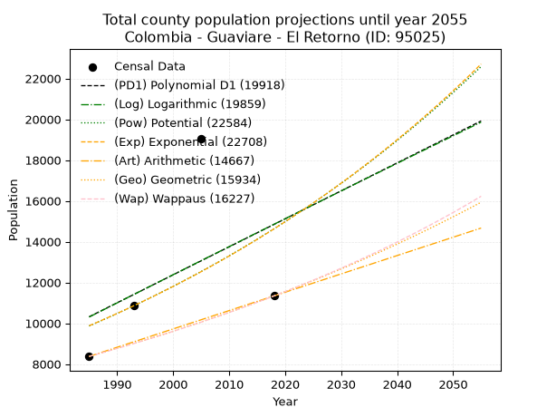
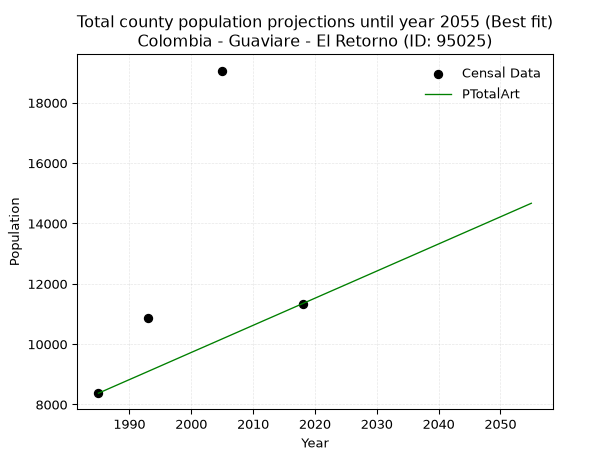
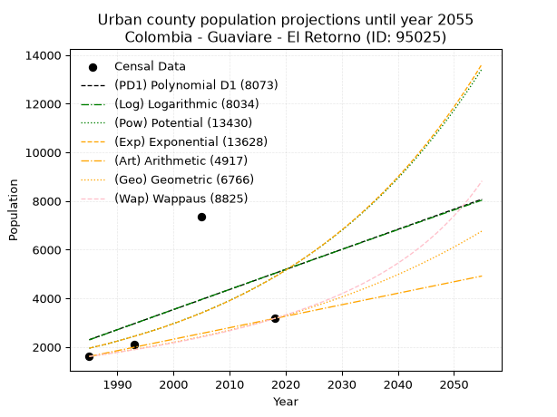
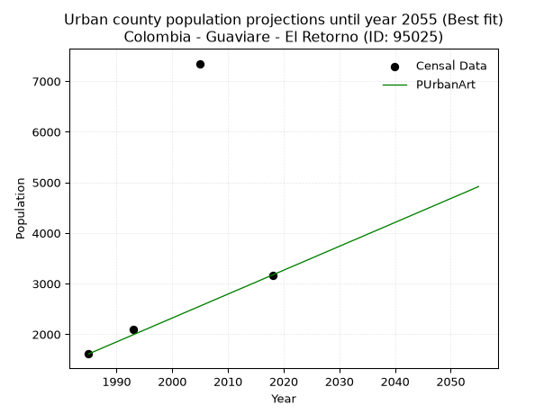
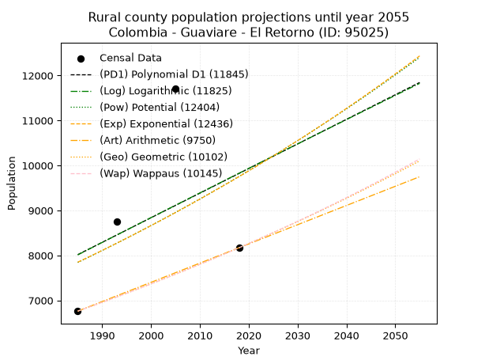
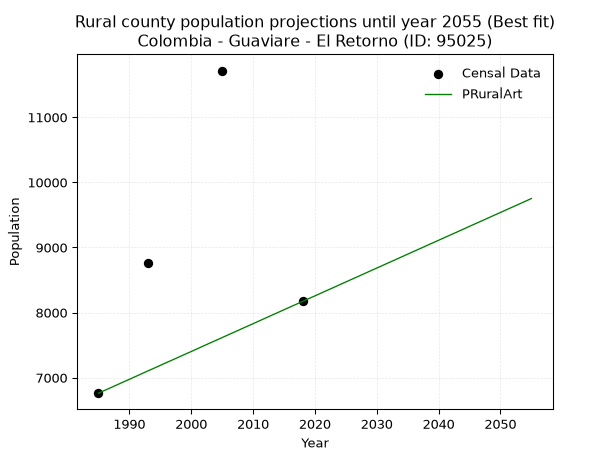

<div align="center">


</div>

# 📜 _“Population and Public Services Demand Projections (PPSD) until Year 2050 for Colombia - Guaviare - El Retorno (ID: 95025)”_
Keywords: `population` `public-service` `projection` `lineal` `polynomial` `logarithmic` `potential` `exponential` `arithmetic` `geometric` `wappaus` `dane` `colombia` `south-america`

PPSD are analytical estimates used by governments and planners to anticipate future changes in population size, age distribution, and the resulting community needs for utilities, healthcare, education, and infrastructure as sizing future water treatment facilities, electrical grids, and road networks based on spatial growth.

<div align="center">

</img>

</div>


> **General running parameters**: • app_version: _v20260806_. • Python version: _3.14.7_. • Pandas version: _3.0.5_. • NumPy version: _2.5.1_. • Creates, save and include plots into reports (create_plot): _False_. • Projection until year: _2050_. • Process polynomial degree 2 and up: _False_. • Process Wappaus: _True_. • Process Wappaus: _True_. • Set negative values to zero: _True_. • Set infinite values to zero: _True_. • Drop dataset notes: _True_. 
<div align="center">

Dynamic map: [:earth_americas:Google](http://maps.google.com/maps?q=2.330164114,-72.6273043) [:earth_americas:OSM](https://www.openstreetmap.org/#map=18/2.330164114/-72.6273043&layers=P) [:earth_americas:Bing](https://www.bing.com/maps?cp=2.330164114~-72.6273043&lvl=18) [:earth_americas:Apple](https://maps.apple.com/frame?center=2.330164114%2C-72.6273043&span=0.003%2C0.006)

</div>


<div align="center">

```geojson
{
  "type": "Feature",
  "geometry": {
    "type": "Point", 
    "coordinates": [-72.6273043, 2.330164114]
  }, 
  "properties": {
    "Name": "Colombia - Guaviare - El Retorno (ID: 95025)"
  }
}
```

</div>


## 0. Census Data (4 records)

Census data are official statistics collected by a government about the people and housing in a country. They usually include counts of total population, age, sex, race, income, education, and jobs.

📅Global census file: [Population.xlsx](../data/Population.xlsx)

| Source   |   Year |   CountryID | CountryName   |   StateID | StateName   |   CountyID | CountyName   |   PTotal |   PUrban |   PRural |
|:---------|-------:|------------:|:--------------|----------:|:------------|-----------:|:-------------|---------:|---------:|---------:|
| DANE     |   1985 |          57 | Colombia      |        95 | Guaviare    |      95025 | El Retorno   |     8373 |     1612 |     6761 |
| DANE     |   1993 |          57 | Colombia      |        95 | Guaviare    |      95025 | El Retorno   |    10859 |     2100 |     8759 |
| DANE     |   2005 |          57 | Colombia      |        95 | Guaviare    |      95025 | El Retorno   |    19063 |     7348 |    11715 |
| DANE     |   2018 |          57 | Colombia      |        95 | Guaviare    |      95025 | El Retorno   |    11340 |     3170 |     8170 |

> 🔥Some records could had specific notes about the registered values or the corresponding urban or rural distribution.

📅[SUI-RUPS](https://www.datos.gov.co/Hacienda-y-Cr-dito-P-blico/Registro-nico-de-Prestadores-de-Servicios-P-blicos/4qkq-csdn/about_data) - Local public utility companies: [RUPS.csv](../data/RUPS.xlsx)

 | SERVICIO       | ESTADO    | NOMBRE                                        | NIT         | DEPARTAMENTO_DOMICILIO   | MUNICIPIO_DOMICILIO   | DIRECCION   |   TELEFONO | EMAIL                          | TIPO_PRESTADOR          | CLASIFICACION                 |
|:---------------|:----------|:----------------------------------------------|:------------|:-------------------------|:----------------------|:------------|-----------:|:-------------------------------|:------------------------|:------------------------------|
| ACUEDUCTO      | OPERATIVA | ADMINISTRACION PUBLICA COOPERATIVA SERVIR AAA | 900176795-7 | GUAVIARE                 | EL RETORNO            | C 13 11 21  |    5840771 | serviraaaelretorno@hotmail.com | ORGANIZACION AUTORIZADA | MENOR O IGUAL A 2500 USUARIOS |
| ALCANTARILLADO | OPERATIVA | ADMINISTRACION PUBLICA COOPERATIVA SERVIR AAA | 900176795-7 | GUAVIARE                 | EL RETORNO            | C 13 11 21  |    5840771 | serviraaaelretorno@hotmail.com | ORGANIZACION AUTORIZADA | MENOR O IGUAL A 2500 USUARIOS |

## 1. Total

### 1.1. Coefficients and Parameters

* (PD1) Polynomial Deg 1: 137.1629867523126, -261951.51425131335 (lineal)
* (Log) Logarithmic: 275710.6665023442, -2083270.2354909393
* (Pow) Potential: 23.89522723097913, -74.80658842904143
* (Exp) Exponential: 0.01189423287113995, 5.506529902534933e-07
* (Art) Arithmetic: Year diff. 2018 - 1985 = 33, Population diff. 11340 - 8373 = 2967, Annual growth = 89.9090909090909
* (Geo) Geometric: Year diff. 2018 - 1985 = 33, Population diff. 11340 - 8373 = 2967, Annual growth % = 0.009234010863244713
* (Wap) Wappaus: i = 0.9121807021670056, Condition values only valid for < 200)

<sub>
Wappaus condition values: ['0.00', '0.91', '1.82', '2.74', '3.65', '4.56', '5.47', '6.39', '7.30', '8.21', '9.12', '10.03', '10.95', '11.86', '12.77', '13.68', '14.59', '15.51', '16.42', '17.33', '18.24', '19.16', '20.07', '20.98', '21.89', '22.80', '23.72', '24.63', '25.54', '26.45', '27.37', '28.28', '29.19', '30.10', '31.01', '31.93', '32.84', '33.75', '34.66', '35.58', '36.49', '37.40', '38.31', '39.22', '40.14', '41.05', '41.96', '42.87', '43.78', '44.70', '45.61', '46.52', '47.43', '48.35', '49.26', '50.17', '51.08', '51.99', '52.91', '53.82', '54.73', '55.64', '56.56', '57.47', '58.38', '59.29']
</sub>


### 1.2. Projected Dataset

|   Year |   CountyID |   PTotalPD1 |   PTotalLog |   PTotalPow |   PTotalExp |   PTotalArt |   PTotalGeo |   PTotalWap |
|-------:|-----------:|------------:|------------:|------------:|------------:|------------:|------------:|------------:|
|   1985 |      95025 |       10317 |       10304 |        9866 |        9876 |        8373 |        8373 |        8373 |
|   1986 |      95025 |       10454 |       10443 |        9986 |        9994 |        8463 |        8450 |        8450 |
|   1987 |      95025 |       10591 |       10582 |       10106 |       10114 |        8553 |        8528 |        8527 |
|   1988 |      95025 |       10729 |       10720 |       10229 |       10235 |        8643 |        8607 |        8605 |
|   1989 |      95025 |       10866 |       10859 |       10352 |       10358 |        8733 |        8687 |        8684 |
|   1990 |      95025 |       11003 |       10998 |       10477 |       10481 |        8823 |        8767 |        8764 |
|   1991 |      95025 |       11140 |       11136 |       10604 |       10607 |        8912 |        8848 |        8844 |
|   1992 |      95025 |       11277 |       11275 |       10732 |       10734 |        9002 |        8929 |        8925 |
|   1993 |      95025 |       11414 |       11413 |       10861 |       10862 |        9092 |        9012 |        9007 |
|   1994 |      95025 |       11551 |       11551 |       10992 |       10992 |        9182 |        9095 |        9090 |
|   1995 |      95025 |       11689 |       11690 |       11125 |       11124 |        9272 |        9179 |        9173 |
|   1996 |      95025 |       11826 |       11828 |       11259 |       11257 |        9362 |        9264 |        9258 |
|   1997 |      95025 |       11963 |       11966 |       11395 |       11391 |        9452 |        9349 |        9343 |
|   1998 |      95025 |       12100 |       12104 |       11532 |       11528 |        9542 |        9436 |        9428 |
|   1999 |      95025 |       12237 |       12242 |       11670 |       11666 |        9632 |        9523 |        9515 |
|   2000 |      95025 |       12374 |       12380 |       11811 |       11805 |        9722 |        9611 |        9603 |
|   2001 |      95025 |       12512 |       12517 |       11953 |       11947 |        9812 |        9700 |        9691 |
|   2002 |      95025 |       12649 |       12655 |       12096 |       12090 |        9901 |        9789 |        9781 |
|   2003 |      95025 |       12786 |       12793 |       12241 |       12234 |        9991 |        9879 |        9871 |
|   2004 |      95025 |       12923 |       12931 |       12388 |       12381 |       10081 |        9971 |        9962 |
|   2005 |      95025 |       13060 |       13068 |       12537 |       12529 |       10171 |       10063 |       10054 |
|   2006 |      95025 |       13197 |       13206 |       12687 |       12679 |       10261 |       10156 |       10147 |
|   2007 |      95025 |       13335 |       13343 |       12839 |       12830 |       10351 |       10249 |       10241 |
|   2008 |      95025 |       13472 |       13480 |       12993 |       12984 |       10441 |       10344 |       10336 |
|   2009 |      95025 |       13609 |       13618 |       13148 |       13139 |       10531 |       10440 |       10431 |
|   2010 |      95025 |       13746 |       13755 |       13306 |       13296 |       10621 |       10536 |       10528 |
|   2011 |      95025 |       13883 |       13892 |       13465 |       13455 |       10711 |       10633 |       10626 |
|   2012 |      95025 |       14020 |       14029 |       13626 |       13616 |       10801 |       10732 |       10725 |
|   2013 |      95025 |       14158 |       14166 |       13788 |       13779 |       10890 |       10831 |       10825 |
|   2014 |      95025 |       14295 |       14303 |       13953 |       13944 |       10980 |       10931 |       10926 |
|   2015 |      95025 |       14432 |       14440 |       14119 |       14111 |       11070 |       11032 |       11028 |
|   2016 |      95025 |       14569 |       14577 |       14288 |       14280 |       11160 |       11133 |       11131 |
|   2017 |      95025 |       14706 |       14713 |       14458 |       14451 |       11250 |       11236 |       11235 |
|   2018 |      95025 |       14843 |       14850 |       14630 |       14624 |       11340 |       11340 |       11340 |
|   2019 |      95025 |       14981 |       14987 |       14805 |       14799 |       11430 |       11445 |       11446 |
|   2020 |      95025 |       15118 |       15123 |       14981 |       14976 |       11520 |       11550 |       11554 |
|   2021 |      95025 |       15255 |       15260 |       15159 |       15155 |       11610 |       11657 |       11663 |
|   2022 |      95025 |       15392 |       15396 |       15339 |       15336 |       11700 |       11765 |       11773 |
|   2023 |      95025 |       15529 |       15532 |       15522 |       15520 |       11790 |       11873 |       11884 |
|   2024 |      95025 |       15666 |       15668 |       15706 |       15706 |       11879 |       11983 |       11996 |
|   2025 |      95025 |       15804 |       15805 |       15892 |       15893 |       11969 |       12094 |       12110 |
|   2026 |      95025 |       15941 |       15941 |       16081 |       16084 |       12059 |       12205 |       12225 |
|   2027 |      95025 |       16078 |       16077 |       16272 |       16276 |       12149 |       12318 |       12341 |
|   2028 |      95025 |       16215 |       16213 |       16465 |       16471 |       12239 |       12432 |       12458 |
|   2029 |      95025 |       16352 |       16349 |       16660 |       16668 |       12329 |       12547 |       12577 |
|   2030 |      95025 |       16489 |       16485 |       16857 |       16867 |       12419 |       12662 |       12698 |
|   2031 |      95025 |       16627 |       16620 |       17057 |       17069 |       12509 |       12779 |       12819 |
|   2032 |      95025 |       16764 |       16756 |       17258 |       17273 |       12599 |       12897 |       12942 |
|   2033 |      95025 |       16901 |       16892 |       17462 |       17480 |       12689 |       13016 |       13067 |
|   2034 |      95025 |       17038 |       17027 |       17669 |       17689 |       12779 |       13137 |       13193 |
|   2035 |      95025 |       17175 |       17163 |       17878 |       17901 |       12868 |       13258 |       13320 |
|   2036 |      95025 |       17312 |       17298 |       18089 |       18115 |       12958 |       13380 |       13449 |
|   2037 |      95025 |       17449 |       17434 |       18302 |       18332 |       13048 |       13504 |       13579 |
|   2038 |      95025 |       17587 |       17569 |       18518 |       18551 |       13138 |       13629 |       13711 |
|   2039 |      95025 |       17724 |       17704 |       18736 |       18773 |       13228 |       13754 |       13845 |
|   2040 |      95025 |       17861 |       17839 |       18957 |       18998 |       13318 |       13881 |       13980 |
|   2041 |      95025 |       17998 |       17975 |       19181 |       19225 |       13408 |       14010 |       14117 |
|   2042 |      95025 |       18135 |       18110 |       19406 |       19455 |       13498 |       14139 |       14256 |
|   2043 |      95025 |       18272 |       18245 |       19635 |       19688 |       13588 |       14270 |       14396 |
|   2044 |      95025 |       18410 |       18380 |       19866 |       19923 |       13678 |       14401 |       14538 |
|   2045 |      95025 |       18547 |       18514 |       20099 |       20162 |       13768 |       14534 |       14682 |
|   2046 |      95025 |       18684 |       18649 |       20335 |       20403 |       13857 |       14668 |       14828 |
|   2047 |      95025 |       18821 |       18784 |       20574 |       20647 |       13947 |       14804 |       14975 |
|   2048 |      95025 |       18958 |       18919 |       20816 |       20894 |       14037 |       14941 |       15125 |
|   2049 |      95025 |       19095 |       19053 |       21060 |       21144 |       14127 |       15079 |       15276 |
|   2050 |      95025 |       19233 |       19188 |       21307 |       21397 |       14217 |       15218 |       15429 |
<div align="center">

</img>

</div>


### 1.3. Best fit with absolute and relative error (%)

Relative error puts that difference into context by dividing the absolute error by the true value, creating a unitless ratio or percentage that shows the scale of the mistake.

Absolute and relative error

|   Year | Source   |   CountryID | CountryName   |   StateID | StateName   |   CountyID_x | CountyName   |   PTotal |   PUrban |   PRural |   CountyID_y |   PTotalPD1 |   PTotalLog |   PTotalPow |   PTotalExp |   PTotalArt |   PTotalGeo |   PTotalWap |   PTotalPD1AbsError |   PTotalLogAbsError |   PTotalPowAbsError |   PTotalExpAbsError |   PTotalArtAbsError |   PTotalGeoAbsError |   PTotalWapAbsError |   PTotalPD1RelError |   PTotalLogRelError |   PTotalPowRelError |   PTotalExpRelError |   PTotalArtRelError |   PTotalGeoRelError |   PTotalWapRelError |
|-------:|:---------|------------:|:--------------|----------:|:------------|-------------:|:-------------|---------:|---------:|---------:|-------------:|------------:|------------:|------------:|------------:|------------:|------------:|------------:|--------------------:|--------------------:|--------------------:|--------------------:|--------------------:|--------------------:|--------------------:|--------------------:|--------------------:|--------------------:|--------------------:|--------------------:|--------------------:|--------------------:|
|   1985 | DANE     |          57 | Colombia      |        95 | Guaviare    |        95025 | El Retorno   |     8373 |     1612 |     6761 |        95025 |       10317 |       10304 |        9866 |        9876 |        8373 |        8373 |        8373 |                1944 |                1931 |                1493 |                1503 |                   0 |                   0 |                   0 |            23.2175  |            23.0622  |          17.8311    |          17.9506    |              0      |              0      |              0      |
|   1993 | DANE     |          57 | Colombia      |        95 | Guaviare    |        95025 | El Retorno   |    10859 |     2100 |     8759 |        95025 |       11414 |       11413 |       10861 |       10862 |        9092 |        9012 |        9007 |                 555 |                 554 |                   2 |                   3 |                1767 |                1847 |                1852 |             5.11097 |             5.10176 |           0.0184179 |           0.0276269 |             16.2722 |             17.0089 |             17.055  |
|   2005 | DANE     |          57 | Colombia      |        95 | Guaviare    |        95025 | El Retorno   |    19063 |     7348 |    11715 |        95025 |       13060 |       13068 |       12537 |       12529 |       10171 |       10063 |       10054 |                6003 |                5995 |                6526 |                6534 |                8892 |                9000 |                9009 |            31.4903  |            31.4484  |          34.2339    |          34.2758    |             46.6453 |             47.2119 |             47.2591 |
|   2018 | DANE     |          57 | Colombia      |        95 | Guaviare    |        95025 | El Retorno   |    11340 |     3170 |     8170 |        95025 |       14843 |       14850 |       14630 |       14624 |       11340 |       11340 |       11340 |                3503 |                3510 |                3290 |                3284 |                   0 |                   0 |                   0 |            30.8907  |            30.9524  |          29.0123    |          28.9594    |              0      |              0      |              0      |

Relative error mean

| Method    |   RelError | Best   |
|:----------|-----------:|:-------|
| PTotalPD1 |    22.6774 |        |
| PTotalLog |    22.6412 |        |
| PTotalPow |    20.2739 |        |
| PTotalExp |    20.3034 |        |
| PTotalArt |    15.7294 | True   |
| PTotalGeo |    16.0552 |        |
| PTotalWap |    16.0785 |        |

💙Best method: _**PTotalArt**_
<div align="center">

</img>

</div>


### 1.4. Fresh water supply demand in liters per capita per day (lpcd)

The fresh water supply demand typically ranges from 100 to 300 liters per capita per day (lpcd) for standard domestic and municipal planning, though absolute survival minimums set by the World Health Organization are as low as 7.5 to 20 liters per day, and total consumption in high-income nations can exceed 400 liters.

> `CZ`: Level in meters above the sea level (masl)<br> `WS`: Fresh water supply demand in liters per capita per day (lpcd or l/h/d)<br> `WSAll`: Zonal fresh water supply demand in liters per second (l/s)<br> `A`: Zonal area in square meters<br> `DP`: Population density (people/hectare or p/ha)

Reference values (RAS Colombia)

|    CZ |   WS |
|------:|-----:|
|  1000 |  120 |
|  2000 |  130 |
| 99999 |  140 |

County shapefile geometry properties and water supply values

|   CountyID |      ATotal |   CZTotal |   WSTotal |
|-----------:|------------:|----------:|----------:|
|      95025 | 1.24059e+10 |   215.353 |       120 |

Projected values for best method: PTotalArt

|   CountyID |   Year |   PTotalArt |   DPTotal |   WSTotal |   WSTotalAll |
|-----------:|-------:|------------:|----------:|----------:|-------------:|
|      95025 |   1985 |        8373 |      0.01 |       120 |      11.6292 |
|      95025 |   1986 |        8463 |      0.01 |       120 |      11.7542 |
|      95025 |   1987 |        8553 |      0.01 |       120 |      11.8792 |
|      95025 |   1988 |        8643 |      0.01 |       120 |      12.0042 |
|      95025 |   1989 |        8733 |      0.01 |       120 |      12.1292 |
|      95025 |   1990 |        8823 |      0.01 |       120 |      12.2542 |
|      95025 |   1991 |        8912 |      0.01 |       120 |      12.3778 |
|      95025 |   1992 |        9002 |      0.01 |       120 |      12.5028 |
|      95025 |   1993 |        9092 |      0.01 |       120 |      12.6278 |
|      95025 |   1994 |        9182 |      0.01 |       120 |      12.7528 |
|      95025 |   1995 |        9272 |      0.01 |       120 |      12.8778 |
|      95025 |   1996 |        9362 |      0.01 |       120 |      13.0028 |
|      95025 |   1997 |        9452 |      0.01 |       120 |      13.1278 |
|      95025 |   1998 |        9542 |      0.01 |       120 |      13.2528 |
|      95025 |   1999 |        9632 |      0.01 |       120 |      13.3778 |
|      95025 |   2000 |        9722 |      0.01 |       120 |      13.5028 |
|      95025 |   2001 |        9812 |      0.01 |       120 |      13.6278 |
|      95025 |   2002 |        9901 |      0.01 |       120 |      13.7514 |
|      95025 |   2003 |        9991 |      0.01 |       120 |      13.8764 |
|      95025 |   2004 |       10081 |      0.01 |       120 |      14.0014 |
|      95025 |   2005 |       10171 |      0.01 |       120 |      14.1264 |
|      95025 |   2006 |       10261 |      0.01 |       120 |      14.2514 |
|      95025 |   2007 |       10351 |      0.01 |       120 |      14.3764 |
|      95025 |   2008 |       10441 |      0.01 |       120 |      14.5014 |
|      95025 |   2009 |       10531 |      0.01 |       120 |      14.6264 |
|      95025 |   2010 |       10621 |      0.01 |       120 |      14.7514 |
|      95025 |   2011 |       10711 |      0.01 |       120 |      14.8764 |
|      95025 |   2012 |       10801 |      0.01 |       120 |      15.0014 |
|      95025 |   2013 |       10890 |      0.01 |       120 |      15.125  |
|      95025 |   2014 |       10980 |      0.01 |       120 |      15.25   |
|      95025 |   2015 |       11070 |      0.01 |       120 |      15.375  |
|      95025 |   2016 |       11160 |      0.01 |       120 |      15.5    |
|      95025 |   2017 |       11250 |      0.01 |       120 |      15.625  |
|      95025 |   2018 |       11340 |      0.01 |       120 |      15.75   |
|      95025 |   2019 |       11430 |      0.01 |       120 |      15.875  |
|      95025 |   2020 |       11520 |      0.01 |       120 |      16      |
|      95025 |   2021 |       11610 |      0.01 |       120 |      16.125  |
|      95025 |   2022 |       11700 |      0.01 |       120 |      16.25   |
|      95025 |   2023 |       11790 |      0.01 |       120 |      16.375  |
|      95025 |   2024 |       11879 |      0.01 |       120 |      16.4986 |
|      95025 |   2025 |       11969 |      0.01 |       120 |      16.6236 |
|      95025 |   2026 |       12059 |      0.01 |       120 |      16.7486 |
|      95025 |   2027 |       12149 |      0.01 |       120 |      16.8736 |
|      95025 |   2028 |       12239 |      0.01 |       120 |      16.9986 |
|      95025 |   2029 |       12329 |      0.01 |       120 |      17.1236 |
|      95025 |   2030 |       12419 |      0.01 |       120 |      17.2486 |
|      95025 |   2031 |       12509 |      0.01 |       120 |      17.3736 |
|      95025 |   2032 |       12599 |      0.01 |       120 |      17.4986 |
|      95025 |   2033 |       12689 |      0.01 |       120 |      17.6236 |
|      95025 |   2034 |       12779 |      0.01 |       120 |      17.7486 |
|      95025 |   2035 |       12868 |      0.01 |       120 |      17.8722 |
|      95025 |   2036 |       12958 |      0.01 |       120 |      17.9972 |
|      95025 |   2037 |       13048 |      0.01 |       120 |      18.1222 |
|      95025 |   2038 |       13138 |      0.01 |       120 |      18.2472 |
|      95025 |   2039 |       13228 |      0.01 |       120 |      18.3722 |
|      95025 |   2040 |       13318 |      0.01 |       120 |      18.4972 |
|      95025 |   2041 |       13408 |      0.01 |       120 |      18.6222 |
|      95025 |   2042 |       13498 |      0.01 |       120 |      18.7472 |
|      95025 |   2043 |       13588 |      0.01 |       120 |      18.8722 |
|      95025 |   2044 |       13678 |      0.01 |       120 |      18.9972 |
|      95025 |   2045 |       13768 |      0.01 |       120 |      19.1222 |
|      95025 |   2046 |       13857 |      0.01 |       120 |      19.2458 |
|      95025 |   2047 |       13947 |      0.01 |       120 |      19.3708 |
|      95025 |   2048 |       14037 |      0.01 |       120 |      19.4958 |
|      95025 |   2049 |       14127 |      0.01 |       120 |      19.6208 |
|      95025 |   2050 |       14217 |      0.01 |       120 |      19.7458 |

## 2. Urban

### 2.1. Coefficients and Parameters

* (PD1) Polynomial Deg 1: 82.47691690084528, -161416.9530309158 (lineal)
* (Log) Logarithmic: 165657.8524792948, -1255609.1641938367
* (Pow) Potential: 55.715199193779284, -180.4458946358603
* (Exp) Exponential: 0.027766712418119524, 2.25594488634883e-21
* (Art) Arithmetic: Year diff. 2018 - 1985 = 33, Population diff. 3170 - 1612 = 1558, Annual growth = 47.21212121212121
* (Geo) Geometric: Year diff. 2018 - 1985 = 33, Population diff. 3170 - 1612 = 1558, Annual growth % = 0.02070401945347755
* (Wap) Wappaus: i = 1.974576378591435, Condition values only valid for < 200)

<sub>
Wappaus condition values: ['0.00', '1.97', '3.95', '5.92', '7.90', '9.87', '11.85', '13.82', '15.80', '17.77', '19.75', '21.72', '23.69', '25.67', '27.64', '29.62', '31.59', '33.57', '35.54', '37.52', '39.49', '41.47', '43.44', '45.42', '47.39', '49.36', '51.34', '53.31', '55.29', '57.26', '59.24', '61.21', '63.19', '65.16', '67.14', '69.11', '71.08', '73.06', '75.03', '77.01', '78.98', '80.96', '82.93', '84.91', '86.88', '88.86', '90.83', '92.81', '94.78', '96.75', '98.73', '100.70', '102.68', '104.65', '106.63', '108.60', '110.58', '112.55', '114.53', '116.50', '118.47', '120.45', '122.42', '124.40', '126.37', '128.35']
</sub>


### 2.2. Projected Dataset

|   Year |   CountyID |   PUrbanPD1 |   PUrbanLog |   PUrbanPow |   PUrbanExp |   PUrbanArt |   PUrbanGeo |   PUrbanWap |
|-------:|-----------:|------------:|------------:|------------:|------------:|------------:|------------:|------------:|
|   1985 |      95025 |        2300 |        2293 |        1948 |        1951 |        1612 |        1612 |        1612 |
|   1986 |      95025 |        2382 |        2376 |        2003 |        2006 |        1659 |        1645 |        1644 |
|   1987 |      95025 |        2465 |        2460 |        2060 |        2063 |        1706 |        1679 |        1677 |
|   1988 |      95025 |        2547 |        2543 |        2119 |        2121 |        1754 |        1714 |        1710 |
|   1989 |      95025 |        2630 |        2626 |        2179 |        2180 |        1801 |        1750 |        1745 |
|   1990 |      95025 |        2712 |        2710 |        2241 |        2242 |        1848 |        1786 |        1779 |
|   1991 |      95025 |        2795 |        2793 |        2304 |        2305 |        1895 |        1823 |        1815 |
|   1992 |      95025 |        2877 |        2876 |        2370 |        2370 |        1942 |        1861 |        1851 |
|   1993 |      95025 |        2960 |        2959 |        2437 |        2437 |        1990 |        1899 |        1888 |
|   1994 |      95025 |        3042 |        3042 |        2506 |        2505 |        2037 |        1938 |        1926 |
|   1995 |      95025 |        3124 |        3125 |        2577 |        2576 |        2084 |        1979 |        1965 |
|   1996 |      95025 |        3207 |        3208 |        2650 |        2648 |        2131 |        2020 |        2005 |
|   1997 |      95025 |        3289 |        3291 |        2725 |        2723 |        2179 |        2061 |        2045 |
|   1998 |      95025 |        3372 |        3374 |        2802 |        2799 |        2226 |        2104 |        2087 |
|   1999 |      95025 |        3454 |        3457 |        2881 |        2878 |        2273 |        2148 |        2129 |
|   2000 |      95025 |        3537 |        3540 |        2962 |        2959 |        2320 |        2192 |        2172 |
|   2001 |      95025 |        3619 |        3623 |        3046 |        3043 |        2367 |        2237 |        2217 |
|   2002 |      95025 |        3702 |        3706 |        3132 |        3128 |        2415 |        2284 |        2262 |
|   2003 |      95025 |        3784 |        3788 |        3220 |        3216 |        2462 |        2331 |        2309 |
|   2004 |      95025 |        3867 |        3871 |        3311 |        3307 |        2509 |        2379 |        2356 |
|   2005 |      95025 |        3949 |        3954 |        3405 |        3400 |        2556 |        2429 |        2405 |
|   2006 |      95025 |        4032 |        4036 |        3501 |        3496 |        2603 |        2479 |        2455 |
|   2007 |      95025 |        4114 |        4119 |        3599 |        3594 |        2651 |        2530 |        2507 |
|   2008 |      95025 |        4197 |        4201 |        3700 |        3695 |        2698 |        2583 |        2559 |
|   2009 |      95025 |        4279 |        4284 |        3804 |        3799 |        2745 |        2636 |        2613 |
|   2010 |      95025 |        4362 |        4366 |        3911 |        3906 |        2792 |        2691 |        2669 |
|   2011 |      95025 |        4444 |        4449 |        4021 |        4016 |        2840 |        2746 |        2725 |
|   2012 |      95025 |        4527 |        4531 |        4134 |        4129 |        2887 |        2803 |        2784 |
|   2013 |      95025 |        4609 |        4613 |        4250 |        4246 |        2934 |        2861 |        2844 |
|   2014 |      95025 |        4692 |        4696 |        4370 |        4365 |        2981 |        2921 |        2905 |
|   2015 |      95025 |        4774 |        4778 |        4492 |        4488 |        3028 |        2981 |        2969 |
|   2016 |      95025 |        4857 |        4860 |        4618 |        4615 |        3076 |        3043 |        3034 |
|   2017 |      95025 |        4939 |        4942 |        4747 |        4744 |        3123 |        3106 |        3101 |
|   2018 |      95025 |        5021 |        5024 |        4880 |        4878 |        3170 |        3170 |        3170 |
|   2019 |      95025 |        5104 |        5106 |        5017 |        5015 |        3217 |        3236 |        3241 |
|   2020 |      95025 |        5186 |        5188 |        5157 |        5157 |        3264 |        3303 |        3314 |
|   2021 |      95025 |        5269 |        5270 |        5301 |        5302 |        3312 |        3371 |        3390 |
|   2022 |      95025 |        5351 |        5352 |        5450 |        5451 |        3359 |        3441 |        3468 |
|   2023 |      95025 |        5434 |        5434 |        5602 |        5605 |        3406 |        3512 |        3548 |
|   2024 |      95025 |        5516 |        5516 |        5758 |        5762 |        3453 |        3585 |        3631 |
|   2025 |      95025 |        5599 |        5598 |        5919 |        5925 |        3500 |        3659 |        3716 |
|   2026 |      95025 |        5681 |        5680 |        6084 |        6091 |        3548 |        3735 |        3805 |
|   2027 |      95025 |        5764 |        5761 |        6253 |        6263 |        3595 |        3812 |        3896 |
|   2028 |      95025 |        5846 |        5843 |        6428 |        6439 |        3642 |        3891 |        3990 |
|   2029 |      95025 |        5929 |        5925 |        6607 |        6621 |        3689 |        3972 |        4088 |
|   2030 |      95025 |        6011 |        6006 |        6791 |        6807 |        3737 |        4054 |        4189 |
|   2031 |      95025 |        6094 |        6088 |        6979 |        6999 |        3784 |        4138 |        4294 |
|   2032 |      95025 |        6176 |        6170 |        7174 |        7196 |        3831 |        4223 |        4403 |
|   2033 |      95025 |        6259 |        6251 |        7373 |        7398 |        3878 |        4311 |        4516 |
|   2034 |      95025 |        6341 |        6333 |        7578 |        7607 |        3925 |        4400 |        4633 |
|   2035 |      95025 |        6424 |        6414 |        7788 |        7821 |        3973 |        4491 |        4755 |
|   2036 |      95025 |        6506 |        6495 |        8004 |        8041 |        4020 |        4584 |        4882 |
|   2037 |      95025 |        6589 |        6577 |        8226 |        8267 |        4067 |        4679 |        5013 |
|   2038 |      95025 |        6671 |        6658 |        8454 |        8500 |        4114 |        4776 |        5151 |
|   2039 |      95025 |        6753 |        6739 |        8689 |        8740 |        4161 |        4875 |        5294 |
|   2040 |      95025 |        6836 |        6820 |        8929 |        8986 |        4209 |        4976 |        5443 |
|   2041 |      95025 |        6918 |        6902 |        9176 |        9239 |        4256 |        5079 |        5599 |
|   2042 |      95025 |        7001 |        6983 |        9430 |        9499 |        4303 |        5184 |        5761 |
|   2043 |      95025 |        7083 |        7064 |        9691 |        9766 |        4350 |        5291 |        5932 |
|   2044 |      95025 |        7166 |        7145 |        9959 |       10041 |        4398 |        5401 |        6110 |
|   2045 |      95025 |        7248 |        7226 |       10234 |       10324 |        4445 |        5513 |        6297 |
|   2046 |      95025 |        7331 |        7307 |       10517 |       10614 |        4492 |        5627 |        6494 |
|   2047 |      95025 |        7413 |        7388 |       10807 |       10913 |        4539 |        5743 |        6700 |
|   2048 |      95025 |        7496 |        7469 |       11105 |       11221 |        4586 |        5862 |        6917 |
|   2049 |      95025 |        7578 |        7550 |       11411 |       11537 |        4634 |        5983 |        7146 |
|   2050 |      95025 |        7661 |        7631 |       11726 |       11861 |        4681 |        6107 |        7387 |
<div align="center">

</img>

</div>


### 2.3. Best fit with absolute and relative error (%)

Relative error puts that difference into context by dividing the absolute error by the true value, creating a unitless ratio or percentage that shows the scale of the mistake.

Absolute and relative error

|   Year | Source   |   CountryID | CountryName   |   StateID | StateName   |   CountyID_x | CountyName   |   PTotal |   PUrban |   PRural |   CountyID_y |   PUrbanPD1 |   PUrbanLog |   PUrbanPow |   PUrbanExp |   PUrbanArt |   PUrbanGeo |   PUrbanWap |   PUrbanPD1AbsError |   PUrbanLogAbsError |   PUrbanPowAbsError |   PUrbanExpAbsError |   PUrbanArtAbsError |   PUrbanGeoAbsError |   PUrbanWapAbsError |   PUrbanPD1RelError |   PUrbanLogRelError |   PUrbanPowRelError |   PUrbanExpRelError |   PUrbanArtRelError |   PUrbanGeoRelError |   PUrbanWapRelError |
|-------:|:---------|------------:|:--------------|----------:|:------------|-------------:|:-------------|---------:|---------:|---------:|-------------:|------------:|------------:|------------:|------------:|------------:|------------:|------------:|--------------------:|--------------------:|--------------------:|--------------------:|--------------------:|--------------------:|--------------------:|--------------------:|--------------------:|--------------------:|--------------------:|--------------------:|--------------------:|--------------------:|
|   1985 | DANE     |          57 | Colombia      |        95 | Guaviare    |        95025 | El Retorno   |     8373 |     1612 |     6761 |        95025 |        2300 |        2293 |        1948 |        1951 |        1612 |        1612 |        1612 |                 688 |                 681 |                 336 |                 339 |                   0 |                   0 |                   0 |             42.6799 |             42.2457 |             20.8437 |             21.0298 |              0      |             0       |              0      |
|   1993 | DANE     |          57 | Colombia      |        95 | Guaviare    |        95025 | El Retorno   |    10859 |     2100 |     8759 |        95025 |        2960 |        2959 |        2437 |        2437 |        1990 |        1899 |        1888 |                 860 |                 859 |                 337 |                 337 |                 110 |                 201 |                 212 |             40.9524 |             40.9048 |             16.0476 |             16.0476 |              5.2381 |             9.57143 |             10.0952 |
|   2005 | DANE     |          57 | Colombia      |        95 | Guaviare    |        95025 | El Retorno   |    19063 |     7348 |    11715 |        95025 |        3949 |        3954 |        3405 |        3400 |        2556 |        2429 |        2405 |                3399 |                3394 |                3943 |                3948 |                4792 |                4919 |                4943 |             46.2575 |             46.1894 |             53.6609 |             53.7289 |             65.215  |            66.9434  |             67.27   |
|   2018 | DANE     |          57 | Colombia      |        95 | Guaviare    |        95025 | El Retorno   |    11340 |     3170 |     8170 |        95025 |        5021 |        5024 |        4880 |        4878 |        3170 |        3170 |        3170 |                1851 |                1854 |                1710 |                1708 |                   0 |                   0 |                   0 |             58.3912 |             58.4858 |             53.9432 |             53.8801 |              0      |             0       |              0      |

Relative error mean

| Method    |   RelError | Best   |
|:----------|-----------:|:-------|
| PUrbanPD1 |    47.0702 |        |
| PUrbanLog |    46.9564 |        |
| PUrbanPow |    36.1238 |        |
| PUrbanExp |    36.1716 |        |
| PUrbanArt |    17.6133 | True   |
| PUrbanGeo |    19.1287 |        |
| PUrbanWap |    19.3413 |        |

💙Best method: _**PUrbanArt**_
<div align="center">

</img>

</div>


### 2.4. Fresh water supply demand in liters per capita per day (lpcd)

The fresh water supply demand typically ranges from 100 to 300 liters per capita per day (lpcd) for standard domestic and municipal planning, though absolute survival minimums set by the World Health Organization are as low as 7.5 to 20 liters per day, and total consumption in high-income nations can exceed 400 liters.

> `CZ`: Level in meters above the sea level (masl)<br> `WS`: Fresh water supply demand in liters per capita per day (lpcd or l/h/d)<br> `WSAll`: Zonal fresh water supply demand in liters per second (l/s)<br> `A`: Zonal area in square meters<br> `DP`: Population density (people/hectare or p/ha)

Reference values (RAS Colombia)

|    CZ |   WS |
|------:|-----:|
|  1000 |  120 |
|  2000 |  130 |
| 99999 |  140 |

County shapefile geometry properties and water supply values

|   CountyID |   AUrban |   CZUrban |   WSUrban |
|-----------:|---------:|----------:|----------:|
|      95025 |   837642 |   197.988 |       120 |

Projected values for best method: PUrbanArt

|   CountyID |   Year |   PUrbanArt |   DPUrban |   WSUrban |   WSUrbanAll |
|-----------:|-------:|------------:|----------:|----------:|-------------:|
|      95025 |   1985 |        1612 |     19.24 |       120 |      2.23889 |
|      95025 |   1986 |        1659 |     19.81 |       120 |      2.30417 |
|      95025 |   1987 |        1706 |     20.37 |       120 |      2.36944 |
|      95025 |   1988 |        1754 |     20.94 |       120 |      2.43611 |
|      95025 |   1989 |        1801 |     21.5  |       120 |      2.50139 |
|      95025 |   1990 |        1848 |     22.06 |       120 |      2.56667 |
|      95025 |   1991 |        1895 |     22.62 |       120 |      2.63194 |
|      95025 |   1992 |        1942 |     23.18 |       120 |      2.69722 |
|      95025 |   1993 |        1990 |     23.76 |       120 |      2.76389 |
|      95025 |   1994 |        2037 |     24.32 |       120 |      2.82917 |
|      95025 |   1995 |        2084 |     24.88 |       120 |      2.89444 |
|      95025 |   1996 |        2131 |     25.44 |       120 |      2.95972 |
|      95025 |   1997 |        2179 |     26.01 |       120 |      3.02639 |
|      95025 |   1998 |        2226 |     26.57 |       120 |      3.09167 |
|      95025 |   1999 |        2273 |     27.14 |       120 |      3.15694 |
|      95025 |   2000 |        2320 |     27.7  |       120 |      3.22222 |
|      95025 |   2001 |        2367 |     28.26 |       120 |      3.2875  |
|      95025 |   2002 |        2415 |     28.83 |       120 |      3.35417 |
|      95025 |   2003 |        2462 |     29.39 |       120 |      3.41944 |
|      95025 |   2004 |        2509 |     29.95 |       120 |      3.48472 |
|      95025 |   2005 |        2556 |     30.51 |       120 |      3.55    |
|      95025 |   2006 |        2603 |     31.08 |       120 |      3.61528 |
|      95025 |   2007 |        2651 |     31.65 |       120 |      3.68194 |
|      95025 |   2008 |        2698 |     32.21 |       120 |      3.74722 |
|      95025 |   2009 |        2745 |     32.77 |       120 |      3.8125  |
|      95025 |   2010 |        2792 |     33.33 |       120 |      3.87778 |
|      95025 |   2011 |        2840 |     33.9  |       120 |      3.94444 |
|      95025 |   2012 |        2887 |     34.47 |       120 |      4.00972 |
|      95025 |   2013 |        2934 |     35.03 |       120 |      4.075   |
|      95025 |   2014 |        2981 |     35.59 |       120 |      4.14028 |
|      95025 |   2015 |        3028 |     36.15 |       120 |      4.20556 |
|      95025 |   2016 |        3076 |     36.72 |       120 |      4.27222 |
|      95025 |   2017 |        3123 |     37.28 |       120 |      4.3375  |
|      95025 |   2018 |        3170 |     37.84 |       120 |      4.40278 |
|      95025 |   2019 |        3217 |     38.41 |       120 |      4.46806 |
|      95025 |   2020 |        3264 |     38.97 |       120 |      4.53333 |
|      95025 |   2021 |        3312 |     39.54 |       120 |      4.6     |
|      95025 |   2022 |        3359 |     40.1  |       120 |      4.66528 |
|      95025 |   2023 |        3406 |     40.66 |       120 |      4.73056 |
|      95025 |   2024 |        3453 |     41.22 |       120 |      4.79583 |
|      95025 |   2025 |        3500 |     41.78 |       120 |      4.86111 |
|      95025 |   2026 |        3548 |     42.36 |       120 |      4.92778 |
|      95025 |   2027 |        3595 |     42.92 |       120 |      4.99306 |
|      95025 |   2028 |        3642 |     43.48 |       120 |      5.05833 |
|      95025 |   2029 |        3689 |     44.04 |       120 |      5.12361 |
|      95025 |   2030 |        3737 |     44.61 |       120 |      5.19028 |
|      95025 |   2031 |        3784 |     45.17 |       120 |      5.25556 |
|      95025 |   2032 |        3831 |     45.74 |       120 |      5.32083 |
|      95025 |   2033 |        3878 |     46.3  |       120 |      5.38611 |
|      95025 |   2034 |        3925 |     46.86 |       120 |      5.45139 |
|      95025 |   2035 |        3973 |     47.43 |       120 |      5.51806 |
|      95025 |   2036 |        4020 |     47.99 |       120 |      5.58333 |
|      95025 |   2037 |        4067 |     48.55 |       120 |      5.64861 |
|      95025 |   2038 |        4114 |     49.11 |       120 |      5.71389 |
|      95025 |   2039 |        4161 |     49.68 |       120 |      5.77917 |
|      95025 |   2040 |        4209 |     50.25 |       120 |      5.84583 |
|      95025 |   2041 |        4256 |     50.81 |       120 |      5.91111 |
|      95025 |   2042 |        4303 |     51.37 |       120 |      5.97639 |
|      95025 |   2043 |        4350 |     51.93 |       120 |      6.04167 |
|      95025 |   2044 |        4398 |     52.5  |       120 |      6.10833 |
|      95025 |   2045 |        4445 |     53.07 |       120 |      6.17361 |
|      95025 |   2046 |        4492 |     53.63 |       120 |      6.23889 |
|      95025 |   2047 |        4539 |     54.19 |       120 |      6.30417 |
|      95025 |   2048 |        4586 |     54.75 |       120 |      6.36944 |
|      95025 |   2049 |        4634 |     55.32 |       120 |      6.43611 |
|      95025 |   2050 |        4681 |     55.88 |       120 |      6.50139 |

## 3. Rural

### 3.1. Coefficients and Parameters

* (PD1) Polynomial Deg 1: 54.68606985146726, -100534.56122039739 (lineal)
* (Log) Logarithmic: 110052.81402304917, -827661.0712971006
* (Pow) Potential: 13.224108500186752, -39.71542758506791
* (Exp) Exponential: 0.006574080309222448, 0.016883795275179
* (Art) Arithmetic: Year diff. 2018 - 1985 = 33, Population diff. 8170 - 6761 = 1409, Annual growth = 42.696969696969695
* (Geo) Geometric: Year diff. 2018 - 1985 = 33, Population diff. 8170 - 6761 = 1409, Annual growth % = 0.005752790191705159
* (Wap) Wappaus: i = 0.5719237786748336, Condition values only valid for < 200)

<sub>
Wappaus condition values: ['0.00', '0.57', '1.14', '1.72', '2.29', '2.86', '3.43', '4.00', '4.58', '5.15', '5.72', '6.29', '6.86', '7.44', '8.01', '8.58', '9.15', '9.72', '10.29', '10.87', '11.44', '12.01', '12.58', '13.15', '13.73', '14.30', '14.87', '15.44', '16.01', '16.59', '17.16', '17.73', '18.30', '18.87', '19.45', '20.02', '20.59', '21.16', '21.73', '22.31', '22.88', '23.45', '24.02', '24.59', '25.16', '25.74', '26.31', '26.88', '27.45', '28.02', '28.60', '29.17', '29.74', '30.31', '30.88', '31.46', '32.03', '32.60', '33.17', '33.74', '34.32', '34.89', '35.46', '36.03', '36.60', '37.18']
</sub>


### 3.2. Projected Dataset

|   Year |   CountyID |   PRuralPD1 |   PRuralLog |   PRuralPow |   PRuralExp |   PRuralArt |   PRuralGeo |   PRuralWap |
|-------:|-----------:|------------:|------------:|------------:|------------:|------------:|------------:|------------:|
|   1985 |      95025 |        8017 |        8011 |        7844 |        7849 |        6761 |        6761 |        6761 |
|   1986 |      95025 |        8072 |        8067 |        7896 |        7901 |        6804 |        6800 |        6800 |
|   1987 |      95025 |        8127 |        8122 |        7949 |        7953 |        6846 |        6839 |        6839 |
|   1988 |      95025 |        8181 |        8177 |        8002 |        8005 |        6889 |        6878 |        6878 |
|   1989 |      95025 |        8236 |        8233 |        8055 |        8058 |        6932 |        6918 |        6917 |
|   1990 |      95025 |        8291 |        8288 |        8109 |        8111 |        6974 |        6958 |        6957 |
|   1991 |      95025 |        8345 |        8343 |        8163 |        8165 |        7017 |        6998 |        6997 |
|   1992 |      95025 |        8400 |        8399 |        8217 |        8219 |        7060 |        7038 |        7037 |
|   1993 |      95025 |        8455 |        8454 |        8272 |        8273 |        7103 |        7078 |        7078 |
|   1994 |      95025 |        8509 |        8509 |        8327 |        8327 |        7145 |        7119 |        7118 |
|   1995 |      95025 |        8564 |        8564 |        8383 |        8382 |        7188 |        7160 |        7159 |
|   1996 |      95025 |        8619 |        8619 |        8438 |        8438 |        7231 |        7201 |        7200 |
|   1997 |      95025 |        8674 |        8674 |        8494 |        8493 |        7273 |        7243 |        7242 |
|   1998 |      95025 |        8728 |        8730 |        8551 |        8549 |        7316 |        7284 |        7283 |
|   1999 |      95025 |        8783 |        8785 |        8608 |        8606 |        7359 |        7326 |        7325 |
|   2000 |      95025 |        8838 |        8840 |        8665 |        8663 |        7401 |        7369 |        7367 |
|   2001 |      95025 |        8892 |        8895 |        8722 |        8720 |        7444 |        7411 |        7409 |
|   2002 |      95025 |        8947 |        8950 |        8780 |        8777 |        7487 |        7454 |        7452 |
|   2003 |      95025 |        9002 |        9005 |        8838 |        8835 |        7530 |        7496 |        7495 |
|   2004 |      95025 |        9056 |        9060 |        8897 |        8893 |        7572 |        7540 |        7538 |
|   2005 |      95025 |        9111 |        9114 |        8956 |        8952 |        7615 |        7583 |        7581 |
|   2006 |      95025 |        9166 |        9169 |        9015 |        9011 |        7658 |        7627 |        7625 |
|   2007 |      95025 |        9220 |        9224 |        9074 |        9070 |        7700 |        7670 |        7669 |
|   2008 |      95025 |        9275 |        9279 |        9134 |        9130 |        7743 |        7715 |        7713 |
|   2009 |      95025 |        9330 |        9334 |        9195 |        9191 |        7786 |        7759 |        7757 |
|   2010 |      95025 |        9384 |        9389 |        9255 |        9251 |        7828 |        7804 |        7802 |
|   2011 |      95025 |        9439 |        9443 |        9316 |        9312 |        7871 |        7848 |        7847 |
|   2012 |      95025 |        9494 |        9498 |        9378 |        9374 |        7914 |        7894 |        7892 |
|   2013 |      95025 |        9548 |        9553 |        9440 |        9435 |        7957 |        7939 |        7938 |
|   2014 |      95025 |        9603 |        9607 |        9502 |        9498 |        7999 |        7985 |        7984 |
|   2015 |      95025 |        9658 |        9662 |        9565 |        9560 |        8042 |        8031 |        8030 |
|   2016 |      95025 |        9713 |        9717 |        9628 |        9623 |        8085 |        8077 |        8076 |
|   2017 |      95025 |        9767 |        9771 |        9691 |        9687 |        8127 |        8123 |        8123 |
|   2018 |      95025 |        9822 |        9826 |        9755 |        9751 |        8170 |        8170 |        8170 |
|   2019 |      95025 |        9877 |        9880 |        9819 |        9815 |        8213 |        8217 |        8217 |
|   2020 |      95025 |        9931 |        9935 |        9883 |        9880 |        8255 |        8264 |        8265 |
|   2021 |      95025 |        9986 |        9989 |        9948 |        9945 |        8298 |        8312 |        8313 |
|   2022 |      95025 |       10041 |       10044 |       10013 |       10010 |        8341 |        8360 |        8361 |
|   2023 |      95025 |       10095 |       10098 |       10079 |       10077 |        8383 |        8408 |        8410 |
|   2024 |      95025 |       10150 |       10152 |       10145 |       10143 |        8426 |        8456 |        8458 |
|   2025 |      95025 |       10205 |       10207 |       10212 |       10210 |        8469 |        8505 |        8507 |
|   2026 |      95025 |       10259 |       10261 |       10279 |       10277 |        8512 |        8554 |        8557 |
|   2027 |      95025 |       10314 |       10315 |       10346 |       10345 |        8554 |        8603 |        8607 |
|   2028 |      95025 |       10369 |       10370 |       10414 |       10413 |        8597 |        8652 |        8657 |
|   2029 |      95025 |       10423 |       10424 |       10482 |       10482 |        8640 |        8702 |        8707 |
|   2030 |      95025 |       10478 |       10478 |       10550 |       10551 |        8682 |        8752 |        8758 |
|   2031 |      95025 |       10533 |       10532 |       10619 |       10621 |        8725 |        8803 |        8809 |
|   2032 |      95025 |       10588 |       10587 |       10688 |       10691 |        8768 |        8853 |        8861 |
|   2033 |      95025 |       10642 |       10641 |       10758 |       10761 |        8810 |        8904 |        8912 |
|   2034 |      95025 |       10697 |       10695 |       10828 |       10832 |        8853 |        8955 |        8964 |
|   2035 |      95025 |       10752 |       10749 |       10899 |       10904 |        8896 |        9007 |        9017 |
|   2036 |      95025 |       10806 |       10803 |       10970 |       10976 |        8939 |        9059 |        9070 |
|   2037 |      95025 |       10861 |       10857 |       11042 |       11048 |        8981 |        9111 |        9123 |
|   2038 |      95025 |       10916 |       10911 |       11113 |       11121 |        9024 |        9163 |        9176 |
|   2039 |      95025 |       10970 |       10965 |       11186 |       11194 |        9067 |        9216 |        9230 |
|   2040 |      95025 |       11025 |       11019 |       11259 |       11268 |        9109 |        9269 |        9285 |
|   2041 |      95025 |       11080 |       11073 |       11332 |       11342 |        9152 |        9322 |        9339 |
|   2042 |      95025 |       11134 |       11127 |       11405 |       11417 |        9195 |        9376 |        9394 |
|   2043 |      95025 |       11189 |       11181 |       11479 |       11492 |        9237 |        9430 |        9450 |
|   2044 |      95025 |       11244 |       11235 |       11554 |       11568 |        9280 |        9484 |        9505 |
|   2045 |      95025 |       11298 |       11288 |       11629 |       11645 |        9323 |        9539 |        9562 |
|   2046 |      95025 |       11353 |       11342 |       11704 |       11721 |        9366 |        9593 |        9618 |
|   2047 |      95025 |       11408 |       11396 |       11780 |       11799 |        9408 |        9649 |        9675 |
|   2048 |      95025 |       11463 |       11450 |       11857 |       11876 |        9451 |        9704 |        9732 |
|   2049 |      95025 |       11517 |       11503 |       11933 |       11955 |        9494 |        9760 |        9790 |
|   2050 |      95025 |       11572 |       11557 |       12011 |       12034 |        9536 |        9816 |        9848 |
<div align="center">

</img>

</div>


### 3.3. Best fit with absolute and relative error (%)

Relative error puts that difference into context by dividing the absolute error by the true value, creating a unitless ratio or percentage that shows the scale of the mistake.

Absolute and relative error

|   Year | Source   |   CountryID | CountryName   |   StateID | StateName   |   CountyID_x | CountyName   |   PTotal |   PUrban |   PRural |   CountyID_y |   PRuralPD1 |   PRuralLog |   PRuralPow |   PRuralExp |   PRuralArt |   PRuralGeo |   PRuralWap |   PRuralPD1AbsError |   PRuralLogAbsError |   PRuralPowAbsError |   PRuralExpAbsError |   PRuralArtAbsError |   PRuralGeoAbsError |   PRuralWapAbsError |   PRuralPD1RelError |   PRuralLogRelError |   PRuralPowRelError |   PRuralExpRelError |   PRuralArtRelError |   PRuralGeoRelError |   PRuralWapRelError |
|-------:|:---------|------------:|:--------------|----------:|:------------|-------------:|:-------------|---------:|---------:|---------:|-------------:|------------:|------------:|------------:|------------:|------------:|------------:|------------:|--------------------:|--------------------:|--------------------:|--------------------:|--------------------:|--------------------:|--------------------:|--------------------:|--------------------:|--------------------:|--------------------:|--------------------:|--------------------:|--------------------:|
|   1985 | DANE     |          57 | Colombia      |        95 | Guaviare    |        95025 | El Retorno   |     8373 |     1612 |     6761 |        95025 |        8017 |        8011 |        7844 |        7849 |        6761 |        6761 |        6761 |                1256 |                1250 |                1083 |                1088 |                   0 |                   0 |                   0 |            18.5771  |            18.4884  |             16.0183 |            16.0923  |              0      |              0      |              0      |
|   1993 | DANE     |          57 | Colombia      |        95 | Guaviare    |        95025 | El Retorno   |    10859 |     2100 |     8759 |        95025 |        8455 |        8454 |        8272 |        8273 |        7103 |        7078 |        7078 |                 304 |                 305 |                 487 |                 486 |                1656 |                1681 |                1681 |             3.47072 |             3.48213 |              5.56   |             5.54858 |             18.9063 |             19.1917 |             19.1917 |
|   2005 | DANE     |          57 | Colombia      |        95 | Guaviare    |        95025 | El Retorno   |    19063 |     7348 |    11715 |        95025 |        9111 |        9114 |        8956 |        8952 |        7615 |        7583 |        7581 |                2604 |                2601 |                2759 |                2763 |                4100 |                4132 |                4134 |            22.2279  |            22.2023  |             23.551  |            23.5851  |             34.9979 |             35.271  |             35.2881 |
|   2018 | DANE     |          57 | Colombia      |        95 | Guaviare    |        95025 | El Retorno   |    11340 |     3170 |     8170 |        95025 |        9822 |        9826 |        9755 |        9751 |        8170 |        8170 |        8170 |                1652 |                1656 |                1585 |                1581 |                   0 |                   0 |                   0 |            20.2203  |            20.2693  |             19.4002 |            19.3513  |              0      |              0      |              0      |

Relative error mean

| Method    |   RelError | Best   |
|:----------|-----------:|:-------|
| PRuralPD1 |    16.124  |        |
| PRuralLog |    16.1105 |        |
| PRuralPow |    16.1324 |        |
| PRuralExp |    16.1443 |        |
| PRuralArt |    13.476  | True   |
| PRuralGeo |    13.6157 |        |
| PRuralWap |    13.6199 |        |

💙Best method: _**PRuralArt**_
<div align="center">

</img>

</div>


### 3.4. Fresh water supply demand in liters per capita per day (lpcd)

The fresh water supply demand typically ranges from 100 to 300 liters per capita per day (lpcd) for standard domestic and municipal planning, though absolute survival minimums set by the World Health Organization are as low as 7.5 to 20 liters per day, and total consumption in high-income nations can exceed 400 liters.

> `CZ`: Level in meters above the sea level (masl)<br> `WS`: Fresh water supply demand in liters per capita per day (lpcd or l/h/d)<br> `WSAll`: Zonal fresh water supply demand in liters per second (l/s)<br> `A`: Zonal area in square meters<br> `DP`: Population density (people/hectare or p/ha)

Reference values (RAS Colombia)

|    CZ |   WS |
|------:|-----:|
|  1000 |  120 |
|  2000 |  130 |
| 99999 |  140 |

County shapefile geometry properties and water supply values

|   CountyID |      ARural |   CZRural |   WSRural |
|-----------:|------------:|----------:|----------:|
|      95025 | 1.24051e+10 |   215.354 |       120 |

Projected values for best method: PRuralArt

|   CountyID |   Year |   PRuralArt |   DPRural |   WSRural |   WSRuralAll |
|-----------:|-------:|------------:|----------:|----------:|-------------:|
|      95025 |   1985 |        6761 |      0.01 |       120 |      9.39028 |
|      95025 |   1986 |        6804 |      0.01 |       120 |      9.45    |
|      95025 |   1987 |        6846 |      0.01 |       120 |      9.50833 |
|      95025 |   1988 |        6889 |      0.01 |       120 |      9.56806 |
|      95025 |   1989 |        6932 |      0.01 |       120 |      9.62778 |
|      95025 |   1990 |        6974 |      0.01 |       120 |      9.68611 |
|      95025 |   1991 |        7017 |      0.01 |       120 |      9.74583 |
|      95025 |   1992 |        7060 |      0.01 |       120 |      9.80556 |
|      95025 |   1993 |        7103 |      0.01 |       120 |      9.86528 |
|      95025 |   1994 |        7145 |      0.01 |       120 |      9.92361 |
|      95025 |   1995 |        7188 |      0.01 |       120 |      9.98333 |
|      95025 |   1996 |        7231 |      0.01 |       120 |     10.0431  |
|      95025 |   1997 |        7273 |      0.01 |       120 |     10.1014  |
|      95025 |   1998 |        7316 |      0.01 |       120 |     10.1611  |
|      95025 |   1999 |        7359 |      0.01 |       120 |     10.2208  |
|      95025 |   2000 |        7401 |      0.01 |       120 |     10.2792  |
|      95025 |   2001 |        7444 |      0.01 |       120 |     10.3389  |
|      95025 |   2002 |        7487 |      0.01 |       120 |     10.3986  |
|      95025 |   2003 |        7530 |      0.01 |       120 |     10.4583  |
|      95025 |   2004 |        7572 |      0.01 |       120 |     10.5167  |
|      95025 |   2005 |        7615 |      0.01 |       120 |     10.5764  |
|      95025 |   2006 |        7658 |      0.01 |       120 |     10.6361  |
|      95025 |   2007 |        7700 |      0.01 |       120 |     10.6944  |
|      95025 |   2008 |        7743 |      0.01 |       120 |     10.7542  |
|      95025 |   2009 |        7786 |      0.01 |       120 |     10.8139  |
|      95025 |   2010 |        7828 |      0.01 |       120 |     10.8722  |
|      95025 |   2011 |        7871 |      0.01 |       120 |     10.9319  |
|      95025 |   2012 |        7914 |      0.01 |       120 |     10.9917  |
|      95025 |   2013 |        7957 |      0.01 |       120 |     11.0514  |
|      95025 |   2014 |        7999 |      0.01 |       120 |     11.1097  |
|      95025 |   2015 |        8042 |      0.01 |       120 |     11.1694  |
|      95025 |   2016 |        8085 |      0.01 |       120 |     11.2292  |
|      95025 |   2017 |        8127 |      0.01 |       120 |     11.2875  |
|      95025 |   2018 |        8170 |      0.01 |       120 |     11.3472  |
|      95025 |   2019 |        8213 |      0.01 |       120 |     11.4069  |
|      95025 |   2020 |        8255 |      0.01 |       120 |     11.4653  |
|      95025 |   2021 |        8298 |      0.01 |       120 |     11.525   |
|      95025 |   2022 |        8341 |      0.01 |       120 |     11.5847  |
|      95025 |   2023 |        8383 |      0.01 |       120 |     11.6431  |
|      95025 |   2024 |        8426 |      0.01 |       120 |     11.7028  |
|      95025 |   2025 |        8469 |      0.01 |       120 |     11.7625  |
|      95025 |   2026 |        8512 |      0.01 |       120 |     11.8222  |
|      95025 |   2027 |        8554 |      0.01 |       120 |     11.8806  |
|      95025 |   2028 |        8597 |      0.01 |       120 |     11.9403  |
|      95025 |   2029 |        8640 |      0.01 |       120 |     12       |
|      95025 |   2030 |        8682 |      0.01 |       120 |     12.0583  |
|      95025 |   2031 |        8725 |      0.01 |       120 |     12.1181  |
|      95025 |   2032 |        8768 |      0.01 |       120 |     12.1778  |
|      95025 |   2033 |        8810 |      0.01 |       120 |     12.2361  |
|      95025 |   2034 |        8853 |      0.01 |       120 |     12.2958  |
|      95025 |   2035 |        8896 |      0.01 |       120 |     12.3556  |
|      95025 |   2036 |        8939 |      0.01 |       120 |     12.4153  |
|      95025 |   2037 |        8981 |      0.01 |       120 |     12.4736  |
|      95025 |   2038 |        9024 |      0.01 |       120 |     12.5333  |
|      95025 |   2039 |        9067 |      0.01 |       120 |     12.5931  |
|      95025 |   2040 |        9109 |      0.01 |       120 |     12.6514  |
|      95025 |   2041 |        9152 |      0.01 |       120 |     12.7111  |
|      95025 |   2042 |        9195 |      0.01 |       120 |     12.7708  |
|      95025 |   2043 |        9237 |      0.01 |       120 |     12.8292  |
|      95025 |   2044 |        9280 |      0.01 |       120 |     12.8889  |
|      95025 |   2045 |        9323 |      0.01 |       120 |     12.9486  |
|      95025 |   2046 |        9366 |      0.01 |       120 |     13.0083  |
|      95025 |   2047 |        9408 |      0.01 |       120 |     13.0667  |
|      95025 |   2048 |        9451 |      0.01 |       120 |     13.1264  |
|      95025 |   2049 |        9494 |      0.01 |       120 |     13.1861  |
|      95025 |   2050 |        9536 |      0.01 |       120 |     13.2444  |

#

<div align="center"><br><sub>Share this research</sub></div><br>

<sub>**APPS & TOOLS & CONTENT DISCLAIMER**: • NO WARRANTY - This content and software is provided by <a href="https://github.com/rcfdtools" target="_blank">github.com/rcfdtools</a> "as is", without any express or implied warranty, including warranties of merchantability, fitness for a particular purpose, or non-infringement. There is no guarantee that the software will be error-free or operate without interruption. • LIMITATION OF LIABILITY - Neither the authors nor copyright holders will be liable for claims or damages arising from the software or its use. You are responsible for determining if the software is appropriate for your use and assume all associated risks, including errors, legal compliance, and data loss. • NO PROFESSIONAL ADVICE - The software provides general information and does not offer professional advice. It should not replace consultation with professional advisors. [Clauses and global license for rcfdtools use.](https://github.com/rcfdtools/rcfdtools/blob/main/LICENSE.md)</sub>

| [:house: Home](Readme.md)  | [:beginner: Help / Collab](https://github.com/rcfdtools/R.HydroTools/discussions/31) |
|----------------------------|-------------------------------------------------------------------------------------------|