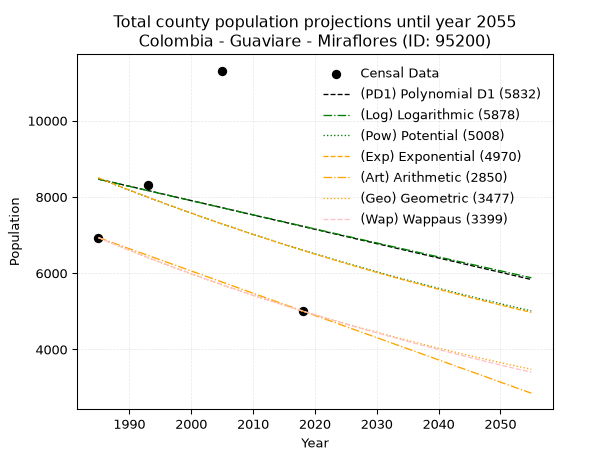
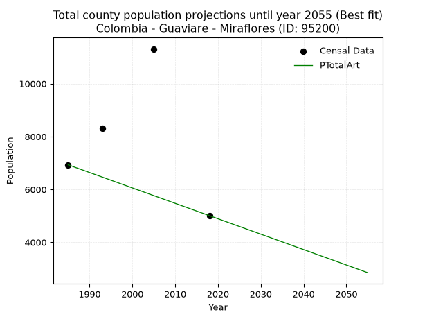
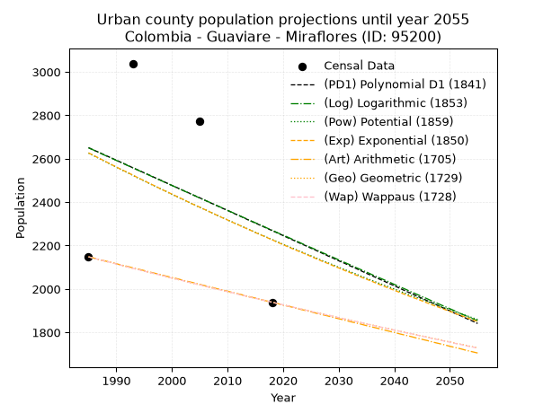
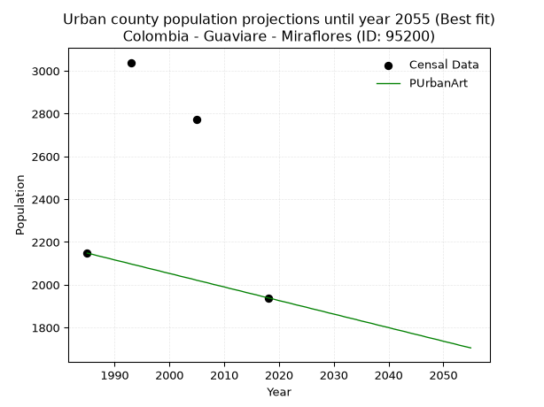
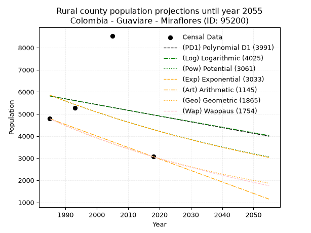
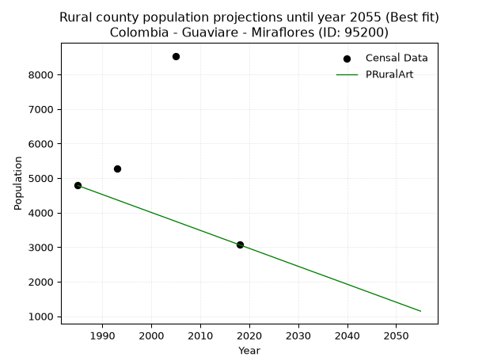

<div align="center">


</div>

# 📜 _“Population and Public Services Demand Projections (PPSD) until Year 2050 for Colombia - Guaviare - Miraflores (ID: 95200)”_
Keywords: `population` `public-service` `projection` `lineal` `polynomial` `logarithmic` `potential` `exponential` `arithmetic` `geometric` `wappaus` `dane` `colombia` `south-america`

PPSD are analytical estimates used by governments and planners to anticipate future changes in population size, age distribution, and the resulting community needs for utilities, healthcare, education, and infrastructure as sizing future water treatment facilities, electrical grids, and road networks based on spatial growth.

<div align="center">

</img>

</div>


> **General running parameters**: • app_version: _v20260806_. • Python version: _3.14.7_. • Pandas version: _3.0.5_. • NumPy version: _2.5.1_. • Creates, save and include plots into reports (create_plot): _False_. • Projection until year: _2050_. • Process polynomial degree 2 and up: _False_. • Process Wappaus: _True_. • Process Wappaus: _True_. • Set negative values to zero: _True_. • Set infinite values to zero: _True_. • Drop dataset notes: _True_. 
<div align="center">

Maps & GIS Layers: [:earth_americas:Google](http://maps.google.com/maps?q=1.337539433,-71.9504163) [:earth_americas:OSM](https://www.openstreetmap.org/#map=18/1.337539433/-71.9504163&layers=P) [:earth_americas:Bing](https://www.bing.com/maps?cp=1.337539433~-71.9504163&lvl=18) [:earth_americas:Apple](https://maps.apple.com/frame?center=1.337539433%2C-71.9504163&span=0.003%2C0.006) [:earth_americas:GISMobile](https://github.com/rcfdtools/R.GISMobile/blob/main/file/gis/CountyLayer_CO/Readme.md)

</div>


<div align="center">

```geojson
{
  "type": "Feature",
  "geometry": {
    "type": "Point", 
    "coordinates": [-71.9504163, 1.337539433]
  }, 
  "properties": {
    "Name": "Colombia - Guaviare - Miraflores (ID: 95200)"
  }
}
```

</div>


## 0. Census Data (4 records)

Census data are official statistics collected by a government about the people and housing in a country. They usually include counts of total population, age, sex, race, income, education, and jobs.

📅Global census file: [Population.xlsx](../data/Population.xlsx)

| Source   |   Year |   CountryID | CountryName   |   StateID | StateName   |   CountyID | CountyName   |   PTotal |   PUrban |   PRural |
|:---------|-------:|------------:|:--------------|----------:|:------------|-----------:|:-------------|---------:|---------:|---------:|
| DANE     |   1985 |          57 | Colombia      |        95 | Guaviare    |      95200 | Miraflores   |     6931 |     2148 |     4783 |
| DANE     |   1993 |          57 | Colombia      |        95 | Guaviare    |      95200 | Miraflores   |     8323 |     3039 |     5284 |
| DANE     |   2005 |          57 | Colombia      |        95 | Guaviare    |      95200 | Miraflores   |    11311 |     2772 |     8539 |
| DANE     |   2018 |          57 | Colombia      |        95 | Guaviare    |      95200 | Miraflores   |     5007 |     1939 |     3068 |

> 🔥Some records could had specific notes about the registered values or the corresponding urban or rural distribution.

📅[SUI-RUPS](https://www.datos.gov.co/Hacienda-y-Cr-dito-P-blico/Registro-nico-de-Prestadores-de-Servicios-P-blicos/4qkq-csdn/about_data) - Local public utility companies: [RUPS.csv](../data/RUPS.csv)

 | SERVICIO   | ESTADO    | NOMBRE                           | NIT         | DEPARTAMENTO_DOMICILIO   | MUNICIPIO_DOMICILIO   | DIRECCION       |   TELEFONO | EMAIL                              | TIPO_PRESTADOR                 | CLASIFICACION                 |
|:-----------|:----------|:---------------------------------|:------------|:-------------------------|:----------------------|:----------------|-----------:|:-----------------------------------|:-------------------------------|:------------------------------|
| ACUEDUCTO  | OPERATIVA | MUNICIPIO DE MIRAFLORES GUAVIARE | 800103198-4 | GUAVIARE                 | MIRAFLORES            | CRA  23 No 7-29 |    5600052 | u.s.p.d@miraflores-guaviare.gov.co | MUNICIPIO (PRESTACIÓN DIRECTA) | MENOR O IGUAL A 2500 USUARIOS |

## 1. Total

### 1.1. Coefficients and Parameters

* (PD1) Polynomial Deg 1: -37.63629064632304, 83174.99036530766 (lineal)
* (Log) Logarithmic: -74558.19591065514, 574610.4445887749
* (Pow) Potential: -15.240457306537932, 54.18844395876097
* (Exp) Exponential: -0.007663087065479824, 34311796674.42859
* (Art) Arithmetic: Year diff. 2018 - 1985 = 33, Population diff. 5007 - 6931 = -1924, Annual growth = -58.303030303030305
* (Geo) Geometric: Year diff. 2018 - 1985 = 33, Population diff. 5007 - 6931 = -1924, Annual growth % = -0.009805163422820229
* (Wap) Wappaus: i = -0.9767637846042939, Condition values only valid for < 200)

<sub>
Wappaus condition values: ['-0.00', '-0.98', '-1.95', '-2.93', '-3.91', '-4.88', '-5.86', '-6.84', '-7.81', '-8.79', '-9.77', '-10.74', '-11.72', '-12.70', '-13.67', '-14.65', '-15.63', '-16.60', '-17.58', '-18.56', '-19.54', '-20.51', '-21.49', '-22.47', '-23.44', '-24.42', '-25.40', '-26.37', '-27.35', '-28.33', '-29.30', '-30.28', '-31.26', '-32.23', '-33.21', '-34.19', '-35.16', '-36.14', '-37.12', '-38.09', '-39.07', '-40.05', '-41.02', '-42.00', '-42.98', '-43.95', '-44.93', '-45.91', '-46.88', '-47.86', '-48.84', '-49.81', '-50.79', '-51.77', '-52.75', '-53.72', '-54.70', '-55.68', '-56.65', '-57.63', '-58.61', '-59.58', '-60.56', '-61.54', '-62.51', '-63.49']
</sub>


### 1.2. Projected Dataset

|   Year |   CountyID |   PTotalPD1 |   PTotalLog |   PTotalPow |   PTotalExp |   PTotalArt |   PTotalGeo |   PTotalWap |
|-------:|-----------:|------------:|------------:|------------:|------------:|------------:|------------:|------------:|
|   1985 |      95200 |        8467 |        8462 |        8493 |        8497 |        6931 |        6931 |        6931 |
|   1986 |      95200 |        8429 |        8425 |        8428 |        8433 |        6873 |        6863 |        6864 |
|   1987 |      95200 |        8392 |        8387 |        8364 |        8368 |        6814 |        6796 |        6797 |
|   1988 |      95200 |        8354 |        8350 |        8300 |        8304 |        6756 |        6729 |        6731 |
|   1989 |      95200 |        8316 |        8312 |        8236 |        8241 |        6698 |        6663 |        6665 |
|   1990 |      95200 |        8279 |        8275 |        8174 |        8178 |        6639 |        6598 |        6601 |
|   1991 |      95200 |        8241 |        8237 |        8111 |        8116 |        6581 |        6533 |        6536 |
|   1992 |      95200 |        8203 |        8200 |        8049 |        8054 |        6523 |        6469 |        6473 |
|   1993 |      95200 |        8166 |        8162 |        7988 |        7992 |        6465 |        6406 |        6410 |
|   1994 |      95200 |        8128 |        8125 |        7927 |        7931 |        6406 |        6343 |        6347 |
|   1995 |      95200 |        8091 |        8087 |        7867 |        7871 |        6348 |        6281 |        6286 |
|   1996 |      95200 |        8053 |        8050 |        7807 |        7811 |        6290 |        6219 |        6224 |
|   1997 |      95200 |        8015 |        8013 |        7748 |        7751 |        6231 |        6158 |        6164 |
|   1998 |      95200 |        7978 |        7975 |        7689 |        7692 |        6173 |        6098 |        6103 |
|   1999 |      95200 |        7940 |        7938 |        7630 |        7633 |        6115 |        6038 |        6044 |
|   2000 |      95200 |        7902 |        7901 |        7572 |        7575 |        6056 |        5979 |        5985 |
|   2001 |      95200 |        7865 |        7864 |        7515 |        7517 |        5998 |        5920 |        5926 |
|   2002 |      95200 |        7827 |        7826 |        7458 |        7460 |        5940 |        5862 |        5868 |
|   2003 |      95200 |        7790 |        7789 |        7401 |        7403 |        5882 |        5805 |        5811 |
|   2004 |      95200 |        7752 |        7752 |        7345 |        7346 |        5823 |        5748 |        5754 |
|   2005 |      95200 |        7714 |        7715 |        7290 |        7290 |        5765 |        5691 |        5697 |
|   2006 |      95200 |        7677 |        7678 |        7235 |        7234 |        5707 |        5635 |        5642 |
|   2007 |      95200 |        7639 |        7640 |        7180 |        7179 |        5648 |        5580 |        5586 |
|   2008 |      95200 |        7601 |        7603 |        7125 |        7124 |        5590 |        5525 |        5531 |
|   2009 |      95200 |        7564 |        7566 |        7072 |        7070 |        5532 |        5471 |        5477 |
|   2010 |      95200 |        7526 |        7529 |        7018 |        7016 |        5473 |        5418 |        5423 |
|   2011 |      95200 |        7488 |        7492 |        6965 |        6962 |        5415 |        5365 |        5369 |
|   2012 |      95200 |        7451 |        7455 |        6913 |        6909 |        5357 |        5312 |        5316 |
|   2013 |      95200 |        7413 |        7418 |        6860 |        6857 |        5299 |        5260 |        5263 |
|   2014 |      95200 |        7376 |        7381 |        6809 |        6804 |        5240 |        5208 |        5211 |
|   2015 |      95200 |        7338 |        7344 |        6757 |        6752 |        5182 |        5157 |        5160 |
|   2016 |      95200 |        7300 |        7307 |        6707 |        6701 |        5124 |        5107 |        5108 |
|   2017 |      95200 |        7263 |        7270 |        6656 |        6650 |        5065 |        5057 |        5057 |
|   2018 |      95200 |        7225 |        7233 |        6606 |        6599 |        5007 |        5007 |        5007 |
|   2019 |      95200 |        7187 |        7196 |        6556 |        6548 |        4949 |        4958 |        4957 |
|   2020 |      95200 |        7150 |        7159 |        6507 |        6498 |        4890 |        4909 |        4907 |
|   2021 |      95200 |        7112 |        7122 |        6458 |        6449 |        4832 |        4861 |        4858 |
|   2022 |      95200 |        7074 |        7085 |        6410 |        6400 |        4774 |        4813 |        4809 |
|   2023 |      95200 |        7037 |        7048 |        6361 |        6351 |        4715 |        4766 |        4761 |
|   2024 |      95200 |        6999 |        7011 |        6314 |        6302 |        4657 |        4720 |        4713 |
|   2025 |      95200 |        6962 |        6975 |        6266 |        6254 |        4599 |        4673 |        4666 |
|   2026 |      95200 |        6924 |        6938 |        6219 |        6206 |        4541 |        4627 |        4618 |
|   2027 |      95200 |        6886 |        6901 |        6173 |        6159 |        4482 |        4582 |        4572 |
|   2028 |      95200 |        6849 |        6864 |        6127 |        6112 |        4424 |        4537 |        4525 |
|   2029 |      95200 |        6811 |        6828 |        6081 |        6065 |        4366 |        4493 |        4479 |
|   2030 |      95200 |        6773 |        6791 |        6035 |        6019 |        4307 |        4449 |        4433 |
|   2031 |      95200 |        6736 |        6754 |        5990 |        5973 |        4249 |        4405 |        4388 |
|   2032 |      95200 |        6698 |        6717 |        5945 |        5928 |        4191 |        4362 |        4343 |
|   2033 |      95200 |        6660 |        6681 |        5901 |        5882 |        4132 |        4319 |        4299 |
|   2034 |      95200 |        6623 |        6644 |        5857 |        5837 |        4074 |        4277 |        4254 |
|   2035 |      95200 |        6585 |        6607 |        5813 |        5793 |        4016 |        4235 |        4210 |
|   2036 |      95200 |        6548 |        6571 |        5770 |        5749 |        3958 |        4193 |        4167 |
|   2037 |      95200 |        6510 |        6534 |        5727 |        5705 |        3899 |        4152 |        4124 |
|   2038 |      95200 |        6472 |        6498 |        5684 |        5661 |        3841 |        4111 |        4081 |
|   2039 |      95200 |        6435 |        6461 |        5642 |        5618 |        3783 |        4071 |        4038 |
|   2040 |      95200 |        6397 |        6424 |        5600 |        5575 |        3724 |        4031 |        3996 |
|   2041 |      95200 |        6359 |        6388 |        5558 |        5532 |        3666 |        3992 |        3954 |
|   2042 |      95200 |        6322 |        6351 |        5517 |        5490 |        3608 |        3953 |        3912 |
|   2043 |      95200 |        6284 |        6315 |        5476 |        5448 |        3549 |        3914 |        3871 |
|   2044 |      95200 |        6246 |        6278 |        5435 |        5407 |        3491 |        3875 |        3830 |
|   2045 |      95200 |        6209 |        6242 |        5395 |        5365 |        3433 |        3837 |        3790 |
|   2046 |      95200 |        6171 |        6205 |        5355 |        5325 |        3375 |        3800 |        3749 |
|   2047 |      95200 |        6134 |        6169 |        5315 |        5284 |        3316 |        3763 |        3709 |
|   2048 |      95200 |        6096 |        6133 |        5275 |        5244 |        3258 |        3726 |        3669 |
|   2049 |      95200 |        6058 |        6096 |        5236 |        5204 |        3200 |        3689 |        3630 |
|   2050 |      95200 |        6021 |        6060 |        5198 |        5164 |        3141 |        3653 |        3591 |
<div align="center">

</img>

</div>


### 1.3. Best fit with absolute and relative error (%)

Relative error puts that difference into context by dividing the absolute error by the true value, creating a unitless ratio or percentage that shows the scale of the mistake.

Absolute and relative error

|   Year | Source   |   CountryID | CountryName   |   StateID | StateName   |   CountyID_x | CountyName   |   PTotal |   PUrban |   PRural |   CountyID_y |   PTotalPD1 |   PTotalLog |   PTotalPow |   PTotalExp |   PTotalArt |   PTotalGeo |   PTotalWap |   PTotalPD1AbsError |   PTotalLogAbsError |   PTotalPowAbsError |   PTotalExpAbsError |   PTotalArtAbsError |   PTotalGeoAbsError |   PTotalWapAbsError |   PTotalPD1RelError |   PTotalLogRelError |   PTotalPowRelError |   PTotalExpRelError |   PTotalArtRelError |   PTotalGeoRelError |   PTotalWapRelError |
|-------:|:---------|------------:|:--------------|----------:|:------------|-------------:|:-------------|---------:|---------:|---------:|-------------:|------------:|------------:|------------:|------------:|------------:|------------:|------------:|--------------------:|--------------------:|--------------------:|--------------------:|--------------------:|--------------------:|--------------------:|--------------------:|--------------------:|--------------------:|--------------------:|--------------------:|--------------------:|--------------------:|
|   1985 | DANE     |          57 | Colombia      |        95 | Guaviare    |        95200 | Miraflores   |     6931 |     2148 |     4783 |        95200 |        8467 |        8462 |        8493 |        8497 |        6931 |        6931 |        6931 |                1536 |                1531 |                1562 |                1566 |                   0 |                   0 |                   0 |            22.1613  |             22.0892 |            22.5364  |            22.5941  |              0      |              0      |              0      |
|   1993 | DANE     |          57 | Colombia      |        95 | Guaviare    |        95200 | Miraflores   |     8323 |     3039 |     5284 |        95200 |        8166 |        8162 |        7988 |        7992 |        6465 |        6406 |        6410 |                 157 |                 161 |                 335 |                 331 |                1858 |                1917 |                1913 |             1.88634 |              1.9344 |             4.02499 |             3.97693 |             22.3237 |             23.0326 |             22.9845 |
|   2005 | DANE     |          57 | Colombia      |        95 | Guaviare    |        95200 | Miraflores   |    11311 |     2772 |     8539 |        95200 |        7714 |        7715 |        7290 |        7290 |        5765 |        5691 |        5697 |                3597 |                3596 |                4021 |                4021 |                5546 |                5620 |                5614 |            31.8009  |             31.7921 |            35.5495  |            35.5495  |             49.0319 |             49.6861 |             49.6331 |
|   2018 | DANE     |          57 | Colombia      |        95 | Guaviare    |        95200 | Miraflores   |     5007 |     1939 |     3068 |        95200 |        7225 |        7233 |        6606 |        6599 |        5007 |        5007 |        5007 |                2218 |                2226 |                1599 |                1592 |                   0 |                   0 |                   0 |            44.298   |             44.4578 |            31.9353  |            31.7955  |              0      |              0      |              0      |

Relative error mean

| Method    |   RelError | Best   |
|:----------|-----------:|:-------|
| PTotalPD1 |    25.0366 |        |
| PTotalLog |    25.0683 |        |
| PTotalPow |    23.5115 |        |
| PTotalExp |    23.479  |        |
| PTotalArt |    17.8389 | True   |
| PTotalGeo |    18.1797 |        |
| PTotalWap |    18.1544 |        |

💙Best method: _**PTotalArt**_
<div align="center">

</img>

</div>


### 1.4. Fresh water supply demand in liters per capita per day (lpcd)

The fresh water supply demand typically ranges from 100 to 300 liters per capita per day (lpcd) for standard domestic and municipal planning, though absolute survival minimums set by the World Health Organization are as low as 7.5 to 20 liters per day, and total consumption in high-income nations can exceed 400 liters.

> `CZ`: Level in meters above the sea level (masl)<br> `WS`: Fresh water supply demand in liters per capita per day (lpcd or l/h/d)<br> `WSAll`: Zonal fresh water supply demand in liters per second (l/s)<br> `A`: Zonal area in square meters<br> `DP`: Population density (people/hectare or p/ha)

Reference values (RAS Colombia)

|    CZ |   WS |
|------:|-----:|
|  1000 |  120 |
|  2000 |  130 |
| 99999 |  140 |

County shapefile geometry properties and water supply values

|   CountyID |      ATotal |   CZTotal |   WSTotal |
|-----------:|------------:|----------:|----------:|
|      95200 | 1.27748e+10 |   231.839 |       120 |

Projected values for best method: PTotalArt

|   CountyID |   Year |   PTotalArt |   DPTotal |   WSTotal |   WSTotalAll |
|-----------:|-------:|------------:|----------:|----------:|-------------:|
|      95200 |   1985 |        6931 |      0.01 |       120 |      9.62639 |
|      95200 |   1986 |        6873 |      0.01 |       120 |      9.54583 |
|      95200 |   1987 |        6814 |      0.01 |       120 |      9.46389 |
|      95200 |   1988 |        6756 |      0.01 |       120 |      9.38333 |
|      95200 |   1989 |        6698 |      0.01 |       120 |      9.30278 |
|      95200 |   1990 |        6639 |      0.01 |       120 |      9.22083 |
|      95200 |   1991 |        6581 |      0.01 |       120 |      9.14028 |
|      95200 |   1992 |        6523 |      0.01 |       120 |      9.05972 |
|      95200 |   1993 |        6465 |      0.01 |       120 |      8.97917 |
|      95200 |   1994 |        6406 |      0.01 |       120 |      8.89722 |
|      95200 |   1995 |        6348 |      0    |       120 |      8.81667 |
|      95200 |   1996 |        6290 |      0    |       120 |      8.73611 |
|      95200 |   1997 |        6231 |      0    |       120 |      8.65417 |
|      95200 |   1998 |        6173 |      0    |       120 |      8.57361 |
|      95200 |   1999 |        6115 |      0    |       120 |      8.49306 |
|      95200 |   2000 |        6056 |      0    |       120 |      8.41111 |
|      95200 |   2001 |        5998 |      0    |       120 |      8.33056 |
|      95200 |   2002 |        5940 |      0    |       120 |      8.25    |
|      95200 |   2003 |        5882 |      0    |       120 |      8.16944 |
|      95200 |   2004 |        5823 |      0    |       120 |      8.0875  |
|      95200 |   2005 |        5765 |      0    |       120 |      8.00694 |
|      95200 |   2006 |        5707 |      0    |       120 |      7.92639 |
|      95200 |   2007 |        5648 |      0    |       120 |      7.84444 |
|      95200 |   2008 |        5590 |      0    |       120 |      7.76389 |
|      95200 |   2009 |        5532 |      0    |       120 |      7.68333 |
|      95200 |   2010 |        5473 |      0    |       120 |      7.60139 |
|      95200 |   2011 |        5415 |      0    |       120 |      7.52083 |
|      95200 |   2012 |        5357 |      0    |       120 |      7.44028 |
|      95200 |   2013 |        5299 |      0    |       120 |      7.35972 |
|      95200 |   2014 |        5240 |      0    |       120 |      7.27778 |
|      95200 |   2015 |        5182 |      0    |       120 |      7.19722 |
|      95200 |   2016 |        5124 |      0    |       120 |      7.11667 |
|      95200 |   2017 |        5065 |      0    |       120 |      7.03472 |
|      95200 |   2018 |        5007 |      0    |       120 |      6.95417 |
|      95200 |   2019 |        4949 |      0    |       120 |      6.87361 |
|      95200 |   2020 |        4890 |      0    |       120 |      6.79167 |
|      95200 |   2021 |        4832 |      0    |       120 |      6.71111 |
|      95200 |   2022 |        4774 |      0    |       120 |      6.63056 |
|      95200 |   2023 |        4715 |      0    |       120 |      6.54861 |
|      95200 |   2024 |        4657 |      0    |       120 |      6.46806 |
|      95200 |   2025 |        4599 |      0    |       120 |      6.3875  |
|      95200 |   2026 |        4541 |      0    |       120 |      6.30694 |
|      95200 |   2027 |        4482 |      0    |       120 |      6.225   |
|      95200 |   2028 |        4424 |      0    |       120 |      6.14444 |
|      95200 |   2029 |        4366 |      0    |       120 |      6.06389 |
|      95200 |   2030 |        4307 |      0    |       120 |      5.98194 |
|      95200 |   2031 |        4249 |      0    |       120 |      5.90139 |
|      95200 |   2032 |        4191 |      0    |       120 |      5.82083 |
|      95200 |   2033 |        4132 |      0    |       120 |      5.73889 |
|      95200 |   2034 |        4074 |      0    |       120 |      5.65833 |
|      95200 |   2035 |        4016 |      0    |       120 |      5.57778 |
|      95200 |   2036 |        3958 |      0    |       120 |      5.49722 |
|      95200 |   2037 |        3899 |      0    |       120 |      5.41528 |
|      95200 |   2038 |        3841 |      0    |       120 |      5.33472 |
|      95200 |   2039 |        3783 |      0    |       120 |      5.25417 |
|      95200 |   2040 |        3724 |      0    |       120 |      5.17222 |
|      95200 |   2041 |        3666 |      0    |       120 |      5.09167 |
|      95200 |   2042 |        3608 |      0    |       120 |      5.01111 |
|      95200 |   2043 |        3549 |      0    |       120 |      4.92917 |
|      95200 |   2044 |        3491 |      0    |       120 |      4.84861 |
|      95200 |   2045 |        3433 |      0    |       120 |      4.76806 |
|      95200 |   2046 |        3375 |      0    |       120 |      4.6875  |
|      95200 |   2047 |        3316 |      0    |       120 |      4.60556 |
|      95200 |   2048 |        3258 |      0    |       120 |      4.525   |
|      95200 |   2049 |        3200 |      0    |       120 |      4.44444 |
|      95200 |   2050 |        3141 |      0    |       120 |      4.3625  |

## 2. Urban

### 2.1. Coefficients and Parameters

* (PD1) Polynomial Deg 1: -11.570453633078547, 25618.299879565366 (lineal)
* (Log) Logarithmic: -23008.750291427597, 177364.19534569443
* (Pow) Potential: -9.970230211185802, 36.298770044141236
* (Exp) Exponential: -0.0050120607867627865, 54985587.024070755
* (Art) Arithmetic: Year diff. 2018 - 1985 = 33, Population diff. 1939 - 2148 = -209, Annual growth = -6.333333333333333
* (Geo) Geometric: Year diff. 2018 - 1985 = 33, Population diff. 1939 - 2148 = -209, Annual growth % = -0.0030971575295793974
* (Wap) Wappaus: i = -0.30992578093140855, Condition values only valid for < 200)

<sub>
Wappaus condition values: ['-0.00', '-0.31', '-0.62', '-0.93', '-1.24', '-1.55', '-1.86', '-2.17', '-2.48', '-2.79', '-3.10', '-3.41', '-3.72', '-4.03', '-4.34', '-4.65', '-4.96', '-5.27', '-5.58', '-5.89', '-6.20', '-6.51', '-6.82', '-7.13', '-7.44', '-7.75', '-8.06', '-8.37', '-8.68', '-8.99', '-9.30', '-9.61', '-9.92', '-10.23', '-10.54', '-10.85', '-11.16', '-11.47', '-11.78', '-12.09', '-12.40', '-12.71', '-13.02', '-13.33', '-13.64', '-13.95', '-14.26', '-14.57', '-14.88', '-15.19', '-15.50', '-15.81', '-16.12', '-16.43', '-16.74', '-17.05', '-17.36', '-17.67', '-17.98', '-18.29', '-18.60', '-18.91', '-19.22', '-19.53', '-19.84', '-20.15']
</sub>


### 2.2. Projected Dataset

|   Year |   CountyID |   PUrbanPD1 |   PUrbanLog |   PUrbanPow |   PUrbanExp |   PUrbanArt |   PUrbanGeo |   PUrbanWap |
|-------:|-----------:|------------:|------------:|------------:|------------:|------------:|------------:|------------:|
|   1985 |      95200 |        2651 |        2650 |        2626 |        2627 |        2148 |        2148 |        2148 |
|   1986 |      95200 |        2639 |        2639 |        2613 |        2614 |        2142 |        2141 |        2141 |
|   1987 |      95200 |        2628 |        2627 |        2600 |        2601 |        2135 |        2135 |        2135 |
|   1988 |      95200 |        2616 |        2615 |        2587 |        2588 |        2129 |        2128 |        2128 |
|   1989 |      95200 |        2605 |        2604 |        2574 |        2575 |        2123 |        2122 |        2122 |
|   1990 |      95200 |        2593 |        2592 |        2561 |        2562 |        2116 |        2115 |        2115 |
|   1991 |      95200 |        2582 |        2581 |        2548 |        2549 |        2110 |        2108 |        2108 |
|   1992 |      95200 |        2570 |        2569 |        2536 |        2537 |        2104 |        2102 |        2102 |
|   1993 |      95200 |        2558 |        2558 |        2523 |        2524 |        2097 |        2095 |        2095 |
|   1994 |      95200 |        2547 |        2546 |        2510 |        2511 |        2091 |        2089 |        2089 |
|   1995 |      95200 |        2535 |        2535 |        2498 |        2499 |        2085 |        2082 |        2082 |
|   1996 |      95200 |        2524 |        2523 |        2485 |        2486 |        2078 |        2076 |        2076 |
|   1997 |      95200 |        2512 |        2511 |        2473 |        2474 |        2072 |        2070 |        2070 |
|   1998 |      95200 |        2501 |        2500 |        2461 |        2461 |        2066 |        2063 |        2063 |
|   1999 |      95200 |        2489 |        2488 |        2449 |        2449 |        2059 |        2057 |        2057 |
|   2000 |      95200 |        2477 |        2477 |        2436 |        2437 |        2053 |        2050 |        2050 |
|   2001 |      95200 |        2466 |        2465 |        2424 |        2425 |        2047 |        2044 |        2044 |
|   2002 |      95200 |        2454 |        2454 |        2412 |        2413 |        2040 |        2038 |        2038 |
|   2003 |      95200 |        2443 |        2442 |        2400 |        2400 |        2034 |        2031 |        2031 |
|   2004 |      95200 |        2431 |        2431 |        2388 |        2388 |        2028 |        2025 |        2025 |
|   2005 |      95200 |        2420 |        2419 |        2376 |        2377 |        2021 |        2019 |        2019 |
|   2006 |      95200 |        2408 |        2408 |        2365 |        2365 |        2015 |        2013 |        2013 |
|   2007 |      95200 |        2396 |        2397 |        2353 |        2353 |        2009 |        2006 |        2006 |
|   2008 |      95200 |        2385 |        2385 |        2341 |        2341 |        2002 |        2000 |        2000 |
|   2009 |      95200 |        2373 |        2374 |        2330 |        2329 |        1996 |        1994 |        1994 |
|   2010 |      95200 |        2362 |        2362 |        2318 |        2318 |        1990 |        1988 |        1988 |
|   2011 |      95200 |        2350 |        2351 |        2307 |        2306 |        1983 |        1982 |        1982 |
|   2012 |      95200 |        2339 |        2339 |        2295 |        2295 |        1977 |        1975 |        1975 |
|   2013 |      95200 |        2327 |        2328 |        2284 |        2283 |        1971 |        1969 |        1969 |
|   2014 |      95200 |        2315 |        2316 |        2273 |        2272 |        1964 |        1963 |        1963 |
|   2015 |      95200 |        2304 |        2305 |        2261 |        2260 |        1958 |        1957 |        1957 |
|   2016 |      95200 |        2292 |        2294 |        2250 |        2249 |        1952 |        1951 |        1951 |
|   2017 |      95200 |        2281 |        2282 |        2239 |        2238 |        1945 |        1945 |        1945 |
|   2018 |      95200 |        2269 |        2271 |        2228 |        2227 |        1939 |        1939 |        1939 |
|   2019 |      95200 |        2258 |        2259 |        2217 |        2215 |        1933 |        1933 |        1933 |
|   2020 |      95200 |        2246 |        2248 |        2206 |        2204 |        1926 |        1927 |        1927 |
|   2021 |      95200 |        2234 |        2237 |        2195 |        2193 |        1920 |        1921 |        1921 |
|   2022 |      95200 |        2223 |        2225 |        2185 |        2182 |        1914 |        1915 |        1915 |
|   2023 |      95200 |        2211 |        2214 |        2174 |        2172 |        1907 |        1909 |        1909 |
|   2024 |      95200 |        2200 |        2202 |        2163 |        2161 |        1901 |        1903 |        1903 |
|   2025 |      95200 |        2188 |        2191 |        2153 |        2150 |        1895 |        1897 |        1897 |
|   2026 |      95200 |        2177 |        2180 |        2142 |        2139 |        1888 |        1891 |        1891 |
|   2027 |      95200 |        2165 |        2168 |        2131 |        2128 |        1882 |        1886 |        1885 |
|   2028 |      95200 |        2153 |        2157 |        2121 |        2118 |        1876 |        1880 |        1880 |
|   2029 |      95200 |        2142 |        2146 |        2111 |        2107 |        1869 |        1874 |        1874 |
|   2030 |      95200 |        2130 |        2134 |        2100 |        2097 |        1863 |        1868 |        1868 |
|   2031 |      95200 |        2119 |        2123 |        2090 |        2086 |        1857 |        1862 |        1862 |
|   2032 |      95200 |        2107 |        2112 |        2080 |        2076 |        1850 |        1857 |        1856 |
|   2033 |      95200 |        2096 |        2100 |        2070 |        2065 |        1844 |        1851 |        1851 |
|   2034 |      95200 |        2084 |        2089 |        2059 |        2055 |        1838 |        1845 |        1845 |
|   2035 |      95200 |        2072 |        2078 |        2049 |        2045 |        1831 |        1839 |        1839 |
|   2036 |      95200 |        2061 |        2066 |        2039 |        2035 |        1825 |        1834 |        1833 |
|   2037 |      95200 |        2049 |        2055 |        2029 |        2024 |        1819 |        1828 |        1828 |
|   2038 |      95200 |        2038 |        2044 |        2019 |        2014 |        1812 |        1822 |        1822 |
|   2039 |      95200 |        2026 |        2033 |        2010 |        2004 |        1806 |        1817 |        1816 |
|   2040 |      95200 |        2015 |        2021 |        2000 |        1994 |        1800 |        1811 |        1811 |
|   2041 |      95200 |        2003 |        2010 |        1990 |        1984 |        1793 |        1805 |        1805 |
|   2042 |      95200 |        1991 |        1999 |        1980 |        1974 |        1787 |        1800 |        1799 |
|   2043 |      95200 |        1980 |        1987 |        1971 |        1964 |        1781 |        1794 |        1794 |
|   2044 |      95200 |        1968 |        1976 |        1961 |        1955 |        1774 |        1789 |        1788 |
|   2045 |      95200 |        1957 |        1965 |        1952 |        1945 |        1768 |        1783 |        1783 |
|   2046 |      95200 |        1945 |        1954 |        1942 |        1935 |        1762 |        1778 |        1777 |
|   2047 |      95200 |        1934 |        1942 |        1933 |        1925 |        1755 |        1772 |        1771 |
|   2048 |      95200 |        1922 |        1931 |        1923 |        1916 |        1749 |        1767 |        1766 |
|   2049 |      95200 |        1910 |        1920 |        1914 |        1906 |        1743 |        1761 |        1760 |
|   2050 |      95200 |        1899 |        1909 |        1905 |        1897 |        1736 |        1756 |        1755 |
<div align="center">

</img>

</div>


### 2.3. Best fit with absolute and relative error (%)

Relative error puts that difference into context by dividing the absolute error by the true value, creating a unitless ratio or percentage that shows the scale of the mistake.

Absolute and relative error

|   Year | Source   |   CountryID | CountryName   |   StateID | StateName   |   CountyID_x | CountyName   |   PTotal |   PUrban |   PRural |   CountyID_y |   PUrbanPD1 |   PUrbanLog |   PUrbanPow |   PUrbanExp |   PUrbanArt |   PUrbanGeo |   PUrbanWap |   PUrbanPD1AbsError |   PUrbanLogAbsError |   PUrbanPowAbsError |   PUrbanExpAbsError |   PUrbanArtAbsError |   PUrbanGeoAbsError |   PUrbanWapAbsError |   PUrbanPD1RelError |   PUrbanLogRelError |   PUrbanPowRelError |   PUrbanExpRelError |   PUrbanArtRelError |   PUrbanGeoRelError |   PUrbanWapRelError |
|-------:|:---------|------------:|:--------------|----------:|:------------|-------------:|:-------------|---------:|---------:|---------:|-------------:|------------:|------------:|------------:|------------:|------------:|------------:|------------:|--------------------:|--------------------:|--------------------:|--------------------:|--------------------:|--------------------:|--------------------:|--------------------:|--------------------:|--------------------:|--------------------:|--------------------:|--------------------:|--------------------:|
|   1985 | DANE     |          57 | Colombia      |        95 | Guaviare    |        95200 | Miraflores   |     6931 |     2148 |     4783 |        95200 |        2651 |        2650 |        2626 |        2627 |        2148 |        2148 |        2148 |                 503 |                 502 |                 478 |                 479 |                   0 |                   0 |                   0 |             23.4171 |             23.3706 |             22.2533 |             22.2998 |              0      |              0      |              0      |
|   1993 | DANE     |          57 | Colombia      |        95 | Guaviare    |        95200 | Miraflores   |     8323 |     3039 |     5284 |        95200 |        2558 |        2558 |        2523 |        2524 |        2097 |        2095 |        2095 |                 481 |                 481 |                 516 |                 515 |                 942 |                 944 |                 944 |             15.8276 |             15.8276 |             16.9793 |             16.9464 |             30.997  |             31.0628 |             31.0628 |
|   2005 | DANE     |          57 | Colombia      |        95 | Guaviare    |        95200 | Miraflores   |    11311 |     2772 |     8539 |        95200 |        2420 |        2419 |        2376 |        2377 |        2021 |        2019 |        2019 |                 352 |                 353 |                 396 |                 395 |                 751 |                 753 |                 753 |             12.6984 |             12.7345 |             14.2857 |             14.2496 |             27.0924 |             27.1645 |             27.1645 |
|   2018 | DANE     |          57 | Colombia      |        95 | Guaviare    |        95200 | Miraflores   |     5007 |     1939 |     3068 |        95200 |        2269 |        2271 |        2228 |        2227 |        1939 |        1939 |        1939 |                 330 |                 332 |                 289 |                 288 |                   0 |                   0 |                   0 |             17.0191 |             17.1222 |             14.9046 |             14.853  |              0      |              0      |              0      |

Relative error mean

| Method    |   RelError | Best   |
|:----------|-----------:|:-------|
| PUrbanPD1 |    17.2406 |        |
| PUrbanLog |    17.2637 |        |
| PUrbanPow |    17.1057 |        |
| PUrbanExp |    17.0872 |        |
| PUrbanArt |    14.5223 | True   |
| PUrbanGeo |    14.5568 |        |
| PUrbanWap |    14.5568 |        |

💙Best method: _**PUrbanArt**_
<div align="center">

</img>

</div>


### 2.4. Fresh water supply demand in liters per capita per day (lpcd)

The fresh water supply demand typically ranges from 100 to 300 liters per capita per day (lpcd) for standard domestic and municipal planning, though absolute survival minimums set by the World Health Organization are as low as 7.5 to 20 liters per day, and total consumption in high-income nations can exceed 400 liters.

> `CZ`: Level in meters above the sea level (masl)<br> `WS`: Fresh water supply demand in liters per capita per day (lpcd or l/h/d)<br> `WSAll`: Zonal fresh water supply demand in liters per second (l/s)<br> `A`: Zonal area in square meters<br> `DP`: Population density (people/hectare or p/ha)

Reference values (RAS Colombia)

|    CZ |   WS |
|------:|-----:|
|  1000 |  120 |
|  2000 |  130 |
| 99999 |  140 |

County shapefile geometry properties and water supply values

|   CountyID |   AUrban |   CZUrban |   WSUrban |
|-----------:|---------:|----------:|----------:|
|      95200 |   875804 |   210.643 |       120 |

Projected values for best method: PUrbanArt

|   CountyID |   Year |   PUrbanArt |   DPUrban |   WSUrban |   WSUrbanAll |
|-----------:|-------:|------------:|----------:|----------:|-------------:|
|      95200 |   1985 |        2148 |     24.53 |       120 |      2.98333 |
|      95200 |   1986 |        2142 |     24.46 |       120 |      2.975   |
|      95200 |   1987 |        2135 |     24.38 |       120 |      2.96528 |
|      95200 |   1988 |        2129 |     24.31 |       120 |      2.95694 |
|      95200 |   1989 |        2123 |     24.24 |       120 |      2.94861 |
|      95200 |   1990 |        2116 |     24.16 |       120 |      2.93889 |
|      95200 |   1991 |        2110 |     24.09 |       120 |      2.93056 |
|      95200 |   1992 |        2104 |     24.02 |       120 |      2.92222 |
|      95200 |   1993 |        2097 |     23.94 |       120 |      2.9125  |
|      95200 |   1994 |        2091 |     23.88 |       120 |      2.90417 |
|      95200 |   1995 |        2085 |     23.81 |       120 |      2.89583 |
|      95200 |   1996 |        2078 |     23.73 |       120 |      2.88611 |
|      95200 |   1997 |        2072 |     23.66 |       120 |      2.87778 |
|      95200 |   1998 |        2066 |     23.59 |       120 |      2.86944 |
|      95200 |   1999 |        2059 |     23.51 |       120 |      2.85972 |
|      95200 |   2000 |        2053 |     23.44 |       120 |      2.85139 |
|      95200 |   2001 |        2047 |     23.37 |       120 |      2.84306 |
|      95200 |   2002 |        2040 |     23.29 |       120 |      2.83333 |
|      95200 |   2003 |        2034 |     23.22 |       120 |      2.825   |
|      95200 |   2004 |        2028 |     23.16 |       120 |      2.81667 |
|      95200 |   2005 |        2021 |     23.08 |       120 |      2.80694 |
|      95200 |   2006 |        2015 |     23.01 |       120 |      2.79861 |
|      95200 |   2007 |        2009 |     22.94 |       120 |      2.79028 |
|      95200 |   2008 |        2002 |     22.86 |       120 |      2.78056 |
|      95200 |   2009 |        1996 |     22.79 |       120 |      2.77222 |
|      95200 |   2010 |        1990 |     22.72 |       120 |      2.76389 |
|      95200 |   2011 |        1983 |     22.64 |       120 |      2.75417 |
|      95200 |   2012 |        1977 |     22.57 |       120 |      2.74583 |
|      95200 |   2013 |        1971 |     22.51 |       120 |      2.7375  |
|      95200 |   2014 |        1964 |     22.43 |       120 |      2.72778 |
|      95200 |   2015 |        1958 |     22.36 |       120 |      2.71944 |
|      95200 |   2016 |        1952 |     22.29 |       120 |      2.71111 |
|      95200 |   2017 |        1945 |     22.21 |       120 |      2.70139 |
|      95200 |   2018 |        1939 |     22.14 |       120 |      2.69306 |
|      95200 |   2019 |        1933 |     22.07 |       120 |      2.68472 |
|      95200 |   2020 |        1926 |     21.99 |       120 |      2.675   |
|      95200 |   2021 |        1920 |     21.92 |       120 |      2.66667 |
|      95200 |   2022 |        1914 |     21.85 |       120 |      2.65833 |
|      95200 |   2023 |        1907 |     21.77 |       120 |      2.64861 |
|      95200 |   2024 |        1901 |     21.71 |       120 |      2.64028 |
|      95200 |   2025 |        1895 |     21.64 |       120 |      2.63194 |
|      95200 |   2026 |        1888 |     21.56 |       120 |      2.62222 |
|      95200 |   2027 |        1882 |     21.49 |       120 |      2.61389 |
|      95200 |   2028 |        1876 |     21.42 |       120 |      2.60556 |
|      95200 |   2029 |        1869 |     21.34 |       120 |      2.59583 |
|      95200 |   2030 |        1863 |     21.27 |       120 |      2.5875  |
|      95200 |   2031 |        1857 |     21.2  |       120 |      2.57917 |
|      95200 |   2032 |        1850 |     21.12 |       120 |      2.56944 |
|      95200 |   2033 |        1844 |     21.05 |       120 |      2.56111 |
|      95200 |   2034 |        1838 |     20.99 |       120 |      2.55278 |
|      95200 |   2035 |        1831 |     20.91 |       120 |      2.54306 |
|      95200 |   2036 |        1825 |     20.84 |       120 |      2.53472 |
|      95200 |   2037 |        1819 |     20.77 |       120 |      2.52639 |
|      95200 |   2038 |        1812 |     20.69 |       120 |      2.51667 |
|      95200 |   2039 |        1806 |     20.62 |       120 |      2.50833 |
|      95200 |   2040 |        1800 |     20.55 |       120 |      2.5     |
|      95200 |   2041 |        1793 |     20.47 |       120 |      2.49028 |
|      95200 |   2042 |        1787 |     20.4  |       120 |      2.48194 |
|      95200 |   2043 |        1781 |     20.34 |       120 |      2.47361 |
|      95200 |   2044 |        1774 |     20.26 |       120 |      2.46389 |
|      95200 |   2045 |        1768 |     20.19 |       120 |      2.45556 |
|      95200 |   2046 |        1762 |     20.12 |       120 |      2.44722 |
|      95200 |   2047 |        1755 |     20.04 |       120 |      2.4375  |
|      95200 |   2048 |        1749 |     19.97 |       120 |      2.42917 |
|      95200 |   2049 |        1743 |     19.9  |       120 |      2.42083 |
|      95200 |   2050 |        1736 |     19.82 |       120 |      2.41111 |

## 3. Rural

### 3.1. Coefficients and Parameters

* (PD1) Polynomial Deg 1: -26.06583701324448, 57556.69048574226 (lineal)
* (Log) Logarithmic: -51549.44561922742, 397246.2492430796
* (Pow) Potential: -18.692470448847896, 65.41049392525923
* (Exp) Exponential: -0.009395380223720901, 736164809403.0822
* (Art) Arithmetic: Year diff. 2018 - 1985 = 33, Population diff. 3068 - 4783 = -1715, Annual growth = -51.96969696969697
* (Geo) Geometric: Year diff. 2018 - 1985 = 33, Population diff. 3068 - 4783 = -1715, Annual growth % = -0.013365695775189645
* (Wap) Wappaus: i = -1.3239000629142013, Condition values only valid for < 200)

<sub>
Wappaus condition values: ['-0.00', '-1.32', '-2.65', '-3.97', '-5.30', '-6.62', '-7.94', '-9.27', '-10.59', '-11.92', '-13.24', '-14.56', '-15.89', '-17.21', '-18.53', '-19.86', '-21.18', '-22.51', '-23.83', '-25.15', '-26.48', '-27.80', '-29.13', '-30.45', '-31.77', '-33.10', '-34.42', '-35.75', '-37.07', '-38.39', '-39.72', '-41.04', '-42.36', '-43.69', '-45.01', '-46.34', '-47.66', '-48.98', '-50.31', '-51.63', '-52.96', '-54.28', '-55.60', '-56.93', '-58.25', '-59.58', '-60.90', '-62.22', '-63.55', '-64.87', '-66.20', '-67.52', '-68.84', '-70.17', '-71.49', '-72.81', '-74.14', '-75.46', '-76.79', '-78.11', '-79.43', '-80.76', '-82.08', '-83.41', '-84.73', '-86.05']
</sub>


### 3.2. Projected Dataset

|   Year |   CountyID |   PRuralPD1 |   PRuralLog |   PRuralPow |   PRuralExp |   PRuralArt |   PRuralGeo |   PRuralWap |
|-------:|-----------:|------------:|------------:|------------:|------------:|------------:|------------:|------------:|
|   1985 |      95200 |        5816 |        5812 |        5851 |        5854 |        4783 |        4783 |        4783 |
|   1986 |      95200 |        5790 |        5786 |        5796 |        5799 |        4731 |        4719 |        4720 |
|   1987 |      95200 |        5764 |        5760 |        5742 |        5745 |        4679 |        4656 |        4658 |
|   1988 |      95200 |        5738 |        5734 |        5688 |        5691 |        4627 |        4594 |        4597 |
|   1989 |      95200 |        5712 |        5708 |        5635 |        5638 |        4575 |        4532 |        4536 |
|   1990 |      95200 |        5686 |        5682 |        5582 |        5585 |        4523 |        4472 |        4477 |
|   1991 |      95200 |        5660 |        5656 |        5530 |        5533 |        4471 |        4412 |        4418 |
|   1992 |      95200 |        5634 |        5631 |        5478 |        5481 |        4419 |        4353 |        4359 |
|   1993 |      95200 |        5607 |        5605 |        5427 |        5430 |        4367 |        4295 |        4302 |
|   1994 |      95200 |        5581 |        5579 |        5376 |        5379 |        4315 |        4237 |        4245 |
|   1995 |      95200 |        5555 |        5553 |        5326 |        5329 |        4263 |        4181 |        4189 |
|   1996 |      95200 |        5529 |        5527 |        5276 |        5279 |        4211 |        4125 |        4134 |
|   1997 |      95200 |        5503 |        5501 |        5227 |        5230 |        4159 |        4070 |        4079 |
|   1998 |      95200 |        5477 |        5476 |        5179 |        5181 |        4107 |        4015 |        4025 |
|   1999 |      95200 |        5451 |        5450 |        5130 |        5133 |        4055 |        3962 |        3972 |
|   2000 |      95200 |        5425 |        5424 |        5083 |        5085 |        4003 |        3909 |        3919 |
|   2001 |      95200 |        5399 |        5398 |        5035 |        5037 |        3951 |        3857 |        3867 |
|   2002 |      95200 |        5373 |        5372 |        4989 |        4990 |        3900 |        3805 |        3815 |
|   2003 |      95200 |        5347 |        5347 |        4942 |        4943 |        3848 |        3754 |        3765 |
|   2004 |      95200 |        5321 |        5321 |        4896 |        4897 |        3796 |        3704 |        3714 |
|   2005 |      95200 |        5295 |        5295 |        4851 |        4851 |        3744 |        3654 |        3665 |
|   2006 |      95200 |        5269 |        5270 |        4806 |        4806 |        3692 |        3606 |        3616 |
|   2007 |      95200 |        5243 |        5244 |        4761 |        4761 |        3640 |        3557 |        3567 |
|   2008 |      95200 |        5216 |        5218 |        4717 |        4716 |        3588 |        3510 |        3519 |
|   2009 |      95200 |        5190 |        5192 |        4673 |        4672 |        3536 |        3463 |        3472 |
|   2010 |      95200 |        5164 |        5167 |        4630 |        4629 |        3484 |        3417 |        3425 |
|   2011 |      95200 |        5138 |        5141 |        4587 |        4585 |        3432 |        3371 |        3378 |
|   2012 |      95200 |        5112 |        5116 |        4545 |        4542 |        3380 |        3326 |        3333 |
|   2013 |      95200 |        5086 |        5090 |        4503 |        4500 |        3328 |        3282 |        3287 |
|   2014 |      95200 |        5060 |        5064 |        4461 |        4458 |        3276 |        3238 |        3242 |
|   2015 |      95200 |        5034 |        5039 |        4420 |        4416 |        3224 |        3194 |        3198 |
|   2016 |      95200 |        5008 |        5013 |        4379 |        4375 |        3172 |        3152 |        3154 |
|   2017 |      95200 |        4982 |        4988 |        4339 |        4334 |        3120 |        3110 |        3111 |
|   2018 |      95200 |        4956 |        4962 |        4299 |        4293 |        3068 |        3068 |        3068 |
|   2019 |      95200 |        4930 |        4937 |        4259 |        4253 |        3016 |        3027 |        3026 |
|   2020 |      95200 |        4904 |        4911 |        4220 |        4214 |        2964 |        2987 |        2984 |
|   2021 |      95200 |        4878 |        4885 |        4181 |        4174 |        2912 |        2947 |        2942 |
|   2022 |      95200 |        4852 |        4860 |        4143 |        4135 |        2860 |        2907 |        2901 |
|   2023 |      95200 |        4826 |        4835 |        4105 |        4096 |        2808 |        2868 |        2860 |
|   2024 |      95200 |        4799 |        4809 |        4067 |        4058 |        2756 |        2830 |        2820 |
|   2025 |      95200 |        4773 |        4784 |        4029 |        4020 |        2704 |        2792 |        2780 |
|   2026 |      95200 |        4747 |        4758 |        3992 |        3983 |        2652 |        2755 |        2741 |
|   2027 |      95200 |        4721 |        4733 |        3956 |        3945 |        2600 |        2718 |        2702 |
|   2028 |      95200 |        4695 |        4707 |        3919 |        3908 |        2548 |        2682 |        2663 |
|   2029 |      95200 |        4669 |        4682 |        3883 |        3872 |        2496 |        2646 |        2625 |
|   2030 |      95200 |        4643 |        4656 |        3848 |        3836 |        2444 |        2611 |        2587 |
|   2031 |      95200 |        4617 |        4631 |        3813 |        3800 |        2392 |        2576 |        2550 |
|   2032 |      95200 |        4591 |        4606 |        3778 |        3764 |        2340 |        2541 |        2513 |
|   2033 |      95200 |        4565 |        4580 |        3743 |        3729 |        2288 |        2507 |        2476 |
|   2034 |      95200 |        4539 |        4555 |        3709 |        3694 |        2236 |        2474 |        2440 |
|   2035 |      95200 |        4513 |        4530 |        3675 |        3660 |        2185 |        2441 |        2404 |
|   2036 |      95200 |        4487 |        4504 |        3641 |        3625 |        2133 |        2408 |        2369 |
|   2037 |      95200 |        4461 |        4479 |        3608 |        3592 |        2081 |        2376 |        2333 |
|   2038 |      95200 |        4435 |        4454 |        3575 |        3558 |        2029 |        2344 |        2299 |
|   2039 |      95200 |        4408 |        4428 |        3543 |        3525 |        1977 |        2313 |        2264 |
|   2040 |      95200 |        4382 |        4403 |        3510 |        3492 |        1925 |        2282 |        2230 |
|   2041 |      95200 |        4356 |        4378 |        3478 |        3459 |        1873 |        2251 |        2196 |
|   2042 |      95200 |        4330 |        4353 |        3446 |        3427 |        1821 |        2221 |        2162 |
|   2043 |      95200 |        4304 |        4327 |        3415 |        3395 |        1769 |        2192 |        2129 |
|   2044 |      95200 |        4278 |        4302 |        3384 |        3363 |        1717 |        2162 |        2096 |
|   2045 |      95200 |        4252 |        4277 |        3353 |        3331 |        1665 |        2133 |        2064 |
|   2046 |      95200 |        4226 |        4252 |        3323 |        3300 |        1613 |        2105 |        2031 |
|   2047 |      95200 |        4200 |        4227 |        3292 |        3269 |        1561 |        2077 |        1999 |
|   2048 |      95200 |        4174 |        4201 |        3263 |        3239 |        1509 |        2049 |        1968 |
|   2049 |      95200 |        4148 |        4176 |        3233 |        3209 |        1457 |        2022 |        1936 |
|   2050 |      95200 |        4122 |        4151 |        3204 |        3179 |        1405 |        1995 |        1905 |
<div align="center">

</img>

</div>


### 3.3. Best fit with absolute and relative error (%)

Relative error puts that difference into context by dividing the absolute error by the true value, creating a unitless ratio or percentage that shows the scale of the mistake.

Absolute and relative error

|   Year | Source   |   CountryID | CountryName   |   StateID | StateName   |   CountyID_x | CountyName   |   PTotal |   PUrban |   PRural |   CountyID_y |   PRuralPD1 |   PRuralLog |   PRuralPow |   PRuralExp |   PRuralArt |   PRuralGeo |   PRuralWap |   PRuralPD1AbsError |   PRuralLogAbsError |   PRuralPowAbsError |   PRuralExpAbsError |   PRuralArtAbsError |   PRuralGeoAbsError |   PRuralWapAbsError |   PRuralPD1RelError |   PRuralLogRelError |   PRuralPowRelError |   PRuralExpRelError |   PRuralArtRelError |   PRuralGeoRelError |   PRuralWapRelError |
|-------:|:---------|------------:|:--------------|----------:|:------------|-------------:|:-------------|---------:|---------:|---------:|-------------:|------------:|------------:|------------:|------------:|------------:|------------:|------------:|--------------------:|--------------------:|--------------------:|--------------------:|--------------------:|--------------------:|--------------------:|--------------------:|--------------------:|--------------------:|--------------------:|--------------------:|--------------------:|--------------------:|
|   1985 | DANE     |          57 | Colombia      |        95 | Guaviare    |        95200 | Miraflores   |     6931 |     2148 |     4783 |        95200 |        5816 |        5812 |        5851 |        5854 |        4783 |        4783 |        4783 |                1033 |                1029 |                1068 |                1071 |                   0 |                   0 |                   0 |            21.5973  |            21.5137  |            22.3291  |            22.3918  |              0      |              0      |              0      |
|   1993 | DANE     |          57 | Colombia      |        95 | Guaviare    |        95200 | Miraflores   |     8323 |     3039 |     5284 |        95200 |        5607 |        5605 |        5427 |        5430 |        4367 |        4295 |        4302 |                 323 |                 321 |                 143 |                 146 |                 917 |                 989 |                 982 |             6.11279 |             6.07494 |             2.70628 |             2.76306 |             17.3543 |             18.7169 |             18.5844 |
|   2005 | DANE     |          57 | Colombia      |        95 | Guaviare    |        95200 | Miraflores   |    11311 |     2772 |     8539 |        95200 |        5295 |        5295 |        4851 |        4851 |        3744 |        3654 |        3665 |                3244 |                3244 |                3688 |                3688 |                4795 |                4885 |                4874 |            37.9904  |            37.9904  |            43.1901  |            43.1901  |             56.1541 |             57.2081 |             57.0793 |
|   2018 | DANE     |          57 | Colombia      |        95 | Guaviare    |        95200 | Miraflores   |     5007 |     1939 |     3068 |        95200 |        4956 |        4962 |        4299 |        4293 |        3068 |        3068 |        3068 |                1888 |                1894 |                1231 |                1225 |                   0 |                   0 |                   0 |            61.5385  |            61.734   |            40.1239  |            39.9283  |              0      |              0      |              0      |

Relative error mean

| Method    |   RelError | Best   |
|:----------|-----------:|:-------|
| PRuralPD1 |    31.8097 |        |
| PRuralLog |    31.8283 |        |
| PRuralPow |    27.0873 |        |
| PRuralExp |    27.0683 |        |
| PRuralArt |    18.3771 | True   |
| PRuralGeo |    18.9812 |        |
| PRuralWap |    18.9159 |        |

💙Best method: _**PRuralArt**_
<div align="center">

</img>

</div>


### 3.4. Fresh water supply demand in liters per capita per day (lpcd)

The fresh water supply demand typically ranges from 100 to 300 liters per capita per day (lpcd) for standard domestic and municipal planning, though absolute survival minimums set by the World Health Organization are as low as 7.5 to 20 liters per day, and total consumption in high-income nations can exceed 400 liters.

> `CZ`: Level in meters above the sea level (masl)<br> `WS`: Fresh water supply demand in liters per capita per day (lpcd or l/h/d)<br> `WSAll`: Zonal fresh water supply demand in liters per second (l/s)<br> `A`: Zonal area in square meters<br> `DP`: Population density (people/hectare or p/ha)

Reference values (RAS Colombia)

|    CZ |   WS |
|------:|-----:|
|  1000 |  120 |
|  2000 |  130 |
| 99999 |  140 |

County shapefile geometry properties and water supply values

|   CountyID |      ARural |   CZRural |   WSRural |
|-----------:|------------:|----------:|----------:|
|      95200 | 1.27739e+10 |    231.84 |       120 |

Projected values for best method: PRuralArt

|   CountyID |   Year |   PRuralArt |   DPRural |   WSRural |   WSRuralAll |
|-----------:|-------:|------------:|----------:|----------:|-------------:|
|      95200 |   1985 |        4783 |         0 |       120 |      6.64306 |
|      95200 |   1986 |        4731 |         0 |       120 |      6.57083 |
|      95200 |   1987 |        4679 |         0 |       120 |      6.49861 |
|      95200 |   1988 |        4627 |         0 |       120 |      6.42639 |
|      95200 |   1989 |        4575 |         0 |       120 |      6.35417 |
|      95200 |   1990 |        4523 |         0 |       120 |      6.28194 |
|      95200 |   1991 |        4471 |         0 |       120 |      6.20972 |
|      95200 |   1992 |        4419 |         0 |       120 |      6.1375  |
|      95200 |   1993 |        4367 |         0 |       120 |      6.06528 |
|      95200 |   1994 |        4315 |         0 |       120 |      5.99306 |
|      95200 |   1995 |        4263 |         0 |       120 |      5.92083 |
|      95200 |   1996 |        4211 |         0 |       120 |      5.84861 |
|      95200 |   1997 |        4159 |         0 |       120 |      5.77639 |
|      95200 |   1998 |        4107 |         0 |       120 |      5.70417 |
|      95200 |   1999 |        4055 |         0 |       120 |      5.63194 |
|      95200 |   2000 |        4003 |         0 |       120 |      5.55972 |
|      95200 |   2001 |        3951 |         0 |       120 |      5.4875  |
|      95200 |   2002 |        3900 |         0 |       120 |      5.41667 |
|      95200 |   2003 |        3848 |         0 |       120 |      5.34444 |
|      95200 |   2004 |        3796 |         0 |       120 |      5.27222 |
|      95200 |   2005 |        3744 |         0 |       120 |      5.2     |
|      95200 |   2006 |        3692 |         0 |       120 |      5.12778 |
|      95200 |   2007 |        3640 |         0 |       120 |      5.05556 |
|      95200 |   2008 |        3588 |         0 |       120 |      4.98333 |
|      95200 |   2009 |        3536 |         0 |       120 |      4.91111 |
|      95200 |   2010 |        3484 |         0 |       120 |      4.83889 |
|      95200 |   2011 |        3432 |         0 |       120 |      4.76667 |
|      95200 |   2012 |        3380 |         0 |       120 |      4.69444 |
|      95200 |   2013 |        3328 |         0 |       120 |      4.62222 |
|      95200 |   2014 |        3276 |         0 |       120 |      4.55    |
|      95200 |   2015 |        3224 |         0 |       120 |      4.47778 |
|      95200 |   2016 |        3172 |         0 |       120 |      4.40556 |
|      95200 |   2017 |        3120 |         0 |       120 |      4.33333 |
|      95200 |   2018 |        3068 |         0 |       120 |      4.26111 |
|      95200 |   2019 |        3016 |         0 |       120 |      4.18889 |
|      95200 |   2020 |        2964 |         0 |       120 |      4.11667 |
|      95200 |   2021 |        2912 |         0 |       120 |      4.04444 |
|      95200 |   2022 |        2860 |         0 |       120 |      3.97222 |
|      95200 |   2023 |        2808 |         0 |       120 |      3.9     |
|      95200 |   2024 |        2756 |         0 |       120 |      3.82778 |
|      95200 |   2025 |        2704 |         0 |       120 |      3.75556 |
|      95200 |   2026 |        2652 |         0 |       120 |      3.68333 |
|      95200 |   2027 |        2600 |         0 |       120 |      3.61111 |
|      95200 |   2028 |        2548 |         0 |       120 |      3.53889 |
|      95200 |   2029 |        2496 |         0 |       120 |      3.46667 |
|      95200 |   2030 |        2444 |         0 |       120 |      3.39444 |
|      95200 |   2031 |        2392 |         0 |       120 |      3.32222 |
|      95200 |   2032 |        2340 |         0 |       120 |      3.25    |
|      95200 |   2033 |        2288 |         0 |       120 |      3.17778 |
|      95200 |   2034 |        2236 |         0 |       120 |      3.10556 |
|      95200 |   2035 |        2185 |         0 |       120 |      3.03472 |
|      95200 |   2036 |        2133 |         0 |       120 |      2.9625  |
|      95200 |   2037 |        2081 |         0 |       120 |      2.89028 |
|      95200 |   2038 |        2029 |         0 |       120 |      2.81806 |
|      95200 |   2039 |        1977 |         0 |       120 |      2.74583 |
|      95200 |   2040 |        1925 |         0 |       120 |      2.67361 |
|      95200 |   2041 |        1873 |         0 |       120 |      2.60139 |
|      95200 |   2042 |        1821 |         0 |       120 |      2.52917 |
|      95200 |   2043 |        1769 |         0 |       120 |      2.45694 |
|      95200 |   2044 |        1717 |         0 |       120 |      2.38472 |
|      95200 |   2045 |        1665 |         0 |       120 |      2.3125  |
|      95200 |   2046 |        1613 |         0 |       120 |      2.24028 |
|      95200 |   2047 |        1561 |         0 |       120 |      2.16806 |
|      95200 |   2048 |        1509 |         0 |       120 |      2.09583 |
|      95200 |   2049 |        1457 |         0 |       120 |      2.02361 |
|      95200 |   2050 |        1405 |         0 |       120 |      1.95139 |

#

<div align="center"><br><sub>Share this research</sub></div><br>

<sub>**APPS & TOOLS & CONTENT DISCLAIMER**: • NO WARRANTY - This content and software is provided by <a href="https://github.com/rcfdtools" target="_blank">github.com/rcfdtools</a> "as is", without any express or implied warranty, including warranties of merchantability, fitness for a particular purpose, or non-infringement. There is no guarantee that the software will be error-free or operate without interruption. • LIMITATION OF LIABILITY - Neither the authors nor copyright holders will be liable for claims or damages arising from the software or its use. You are responsible for determining if the software is appropriate for your use and assume all associated risks, including errors, legal compliance, and data loss. • NO PROFESSIONAL ADVICE - The software provides general information and does not offer professional advice. It should not replace consultation with professional advisors. [Clauses and global license for rcfdtools use.](https://github.com/rcfdtools/rcfdtools/blob/main/LICENSE.md)</sub>

| [:house: Home](Readme.md)  | [:beginner: Help / Collab](https://github.com/rcfdtools/R.HydroTools/discussions/31) |
|----------------------------|-------------------------------------------------------------------------------------------|