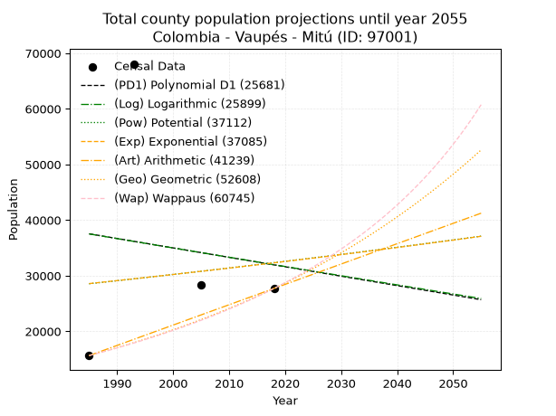
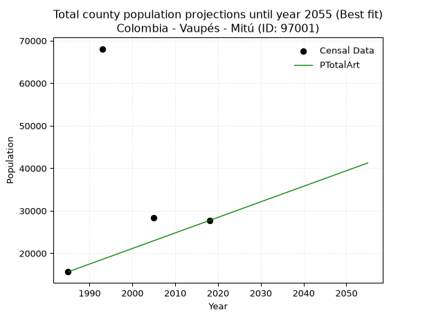
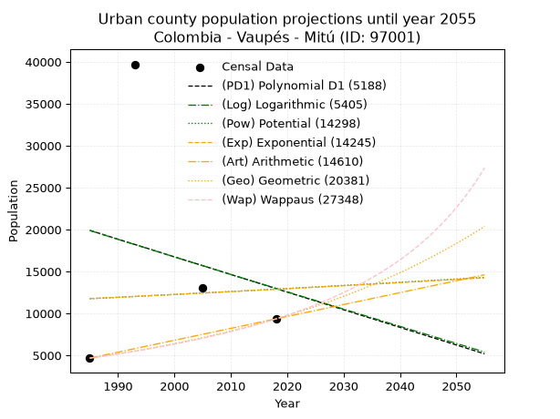
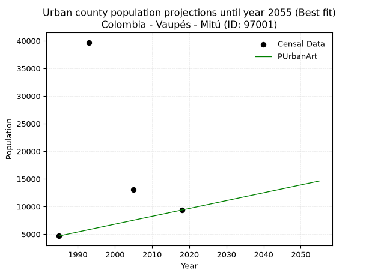
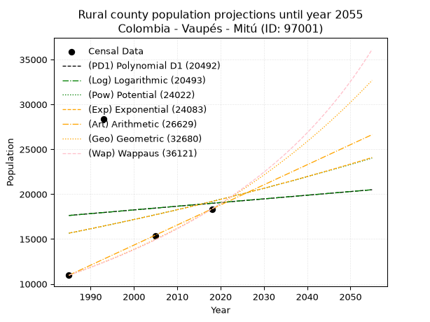
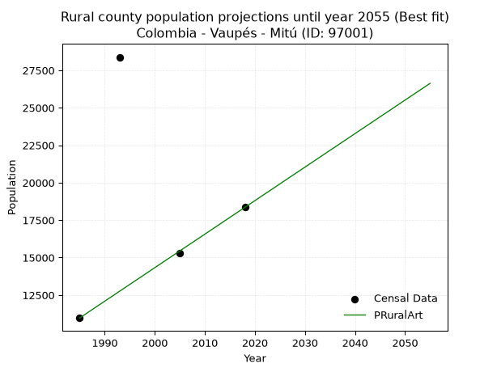

<div align="center">


</div>

# _“Population and Public Services Demand Projections (PPSD) until Year 2050 for Colombia - Vaupés - Mitú (ID: 97001)”_
Keywords: `population` `public-service` `projection` `lineal` `polynomial` `logarithmic` `potential` `exponential` `arithmetic` `geometric` `wappaus` `dane` `colombia` `south-america`

PPSD are analytical estimates used by governments and planners to anticipate future changes in population size, age distribution, and the resulting community needs for utilities, healthcare, education, and infrastructure as sizing future water treatment facilities, electrical grids, and road networks based on spatial growth.

> **General running parameters**: • app_version: _v20260806_. • Python version: _3.14.7_. • Pandas version: _3.0.5_. • NumPy version: _2.5.1_. • Creates, save and include plots into reports (create_plot): _False_. • Projection until year: _2050_. • Process polynomial degree 2 and up: _False_. • Process Wappaus: _True_. • Process Wappaus: _True_. • Set negative values to zero: _True_. • Set infinite values to zero: _True_. • Drop dataset notes: _True_. 
<div align="center">

Dynamic map: [:earth_americas:Google](http://maps.google.com/maps?q=1.253150964,-70.2326408) [:earth_americas:OSM](https://www.openstreetmap.org/#map=18/1.253150964/-70.2326408&layers=P) [:earth_americas:Bing](https://www.bing.com/maps?cp=1.253150964~-70.2326408&lvl=18) [:earth_americas:Apple](https://maps.apple.com/frame?center=1.253150964%2C-70.2326408&span=0.003%2C0.006)

</div>


<div align="center">

```geojson
{
  "type": "Feature",
  "geometry": {
    "type": "Point", 
    "coordinates": [-70.2326408, 1.253150964]
  }, 
  "properties": {
    "Name": "Colombia - Vaupés - Mitú (ID: 97001)"
  }
}
```

</div>


## 0. Census Data (4 records)

Census data are official statistics collected by a government about the people and housing in a country. They usually include counts of total population, age, sex, race, income, education, and jobs.

📅Global census file: [Population.xlsx](../data/Population.xlsx)

| Source   |   Year |   CountryID | CountryName   |   StateID | StateName   |   CountyID | CountyName   |   PTotal |   PUrban |   PRural |
|:---------|-------:|------------:|:--------------|----------:|:------------|-----------:|:-------------|---------:|---------:|---------:|
| DANE     |   1985 |          57 | Colombia      |        97 | Vaupés      |      97001 | Mitú         |    15642 |     4674 |    10968 |
| DANE     |   1993 |          57 | Colombia      |        97 | Vaupés      |      97001 | Mitú         |    68080 |    39700 |    28380 |
| DANE     |   2005 |          57 | Colombia      |        97 | Vaupés      |      97001 | Mitú         |    28382 |    13066 |    15316 |
| DANE     |   2018 |          57 | Colombia      |        97 | Vaupés      |      97001 | Mitú         |    27709 |     9358 |    18351 |

> 🔥Some records could had specific notes about the registered values or the corresponding urban or rural distribution.

📅   [RUPS](https://www.datos.gov.co/Hacienda-y-Cr-dito-P-blico/Registro-nico-de-Prestadores-de-Servicios-P-blicos/4qkq-csdn/about_data) - Local public utility companies: [RUPS.csv](../data/RUPS.xlsx)

 | SERVICIO       | ESTADO    | NOMBRE                                                                    | NIT         | DEPARTAMENTO_DOMICILIO   | MUNICIPIO_DOMICILIO   | DIRECCION        |   TELEFONO | EMAIL                            | TIPO_INSCRIPCION    | REPRESENTANTE_LEGAL          | TIPO_PRESTADOR                 | CLASIFICACION                 |
|:---------------|:----------|:--------------------------------------------------------------------------|:------------|:-------------------------|:----------------------|:-----------------|-----------:|:---------------------------------|:--------------------|:-----------------------------|:-------------------------------|:------------------------------|
| ACUEDUCTO      | OPERATIVA | UNIDAD ESPECIAL DE SERVICIOS PUBLICOS DOMICILIARIOS DEL MUNICIPIO DE MITU | 892099233-1 | VAUPES                   | MITU                  | calle 14 # 14-29 |    5642072 | servipublicos@mitu-vaupes.gov.co | Registro por la ESP | CARLOS ENRIQUE PENAGOS CELIS | MUNICIPIO (PRESTACIÓN DIRECTA) | MENOR O IGUAL A 2500 USUARIOS |
| ALCANTARILLADO | OPERATIVA | UNIDAD ESPECIAL DE SERVICIOS PUBLICOS DOMICILIARIOS DEL MUNICIPIO DE MITU | 892099233-1 | VAUPES                   | MITU                  | calle 14 # 14-29 |    5642072 | servipublicos@mitu-vaupes.gov.co | Registro por la ESP | CARLOS ENRIQUE PENAGOS CELIS | MUNICIPIO (PRESTACIÓN DIRECTA) | MENOR O IGUAL A 2500 USUARIOS |

## 1. Total

### 1.1. Coefficients and Parameters

* (PD1) Polynomial Deg 1: -169.36370935367086, 373723.0096346801 (lineal)
* (Log) Logarithmic: -335066.9062051438, 2581799.4891229724
* (Pow) Potential: 7.564219978643707, -20.489319879245368
* (Exp) Exponential: 0.003720095130545781, 17.74624366669678
* (Art) Arithmetic: Year diff. 2018 - 1985 = 33, Population diff. 27709 - 15642 = 12067, Annual growth = 365.6666666666667
* (Geo) Geometric: Year diff. 2018 - 1985 = 33, Population diff. 27709 - 15642 = 12067, Annual growth % = 0.01747818876298246
* (Wap) Wappaus: i = 1.6870045289228237, Condition values only valid for < 200)

<sub>
Wappaus condition values: ['0.00', '1.69', '3.37', '5.06', '6.75', '8.44', '10.12', '11.81', '13.50', '15.18', '16.87', '18.56', '20.24', '21.93', '23.62', '25.31', '26.99', '28.68', '30.37', '32.05', '33.74', '35.43', '37.11', '38.80', '40.49', '42.18', '43.86', '45.55', '47.24', '48.92', '50.61', '52.30', '53.98', '55.67', '57.36', '59.05', '60.73', '62.42', '64.11', '65.79', '67.48', '69.17', '70.85', '72.54', '74.23', '75.92', '77.60', '79.29', '80.98', '82.66', '84.35', '86.04', '87.72', '89.41', '91.10', '92.79', '94.47', '96.16', '97.85', '99.53', '101.22', '102.91', '104.59', '106.28', '107.97', '109.66']
</sub>


### 1.2. Projected Dataset

|   Year |   CountyID |   PTotalPD1 |   PTotalLog |   PTotalPow |   PTotalExp |   PTotalArt |   PTotalGeo |   PTotalWap |
|-------:|-----------:|------------:|------------:|------------:|------------:|------------:|------------:|------------:|
|   1985 |      97001 |       37536 |       37511 |       28554 |       28583 |       15642 |       15642 |       15642 |
|   1986 |      97001 |       37367 |       37342 |       28663 |       28689 |       16008 |       15915 |       15908 |
|   1987 |      97001 |       37197 |       37174 |       28772 |       28796 |       16373 |       16194 |       16179 |
|   1988 |      97001 |       37028 |       37005 |       28882 |       28904 |       16739 |       16477 |       16454 |
|   1989 |      97001 |       36859 |       36837 |       28992 |       29011 |       17105 |       16765 |       16734 |
|   1990 |      97001 |       36689 |       36668 |       29103 |       29119 |       17470 |       17058 |       17020 |
|   1991 |      97001 |       36520 |       36500 |       29213 |       29228 |       17836 |       17356 |       17310 |
|   1992 |      97001 |       36351 |       36332 |       29324 |       29337 |       18202 |       17659 |       17605 |
|   1993 |      97001 |       36181 |       36163 |       29436 |       29446 |       18567 |       17968 |       17906 |
|   1994 |      97001 |       36012 |       35995 |       29548 |       29556 |       18933 |       18282 |       18212 |
|   1995 |      97001 |       35842 |       35827 |       29660 |       29666 |       19299 |       18601 |       18524 |
|   1996 |      97001 |       35673 |       35659 |       29773 |       29777 |       19664 |       18926 |       18842 |
|   1997 |      97001 |       35504 |       35492 |       29886 |       29888 |       20030 |       19257 |       19165 |
|   1998 |      97001 |       35334 |       35324 |       29999 |       29999 |       20396 |       19594 |       19495 |
|   1999 |      97001 |       35165 |       35156 |       30113 |       30111 |       20761 |       19936 |       19831 |
|   2000 |      97001 |       34996 |       34989 |       30227 |       30223 |       21127 |       20285 |       20174 |
|   2001 |      97001 |       34826 |       34821 |       30342 |       30336 |       21493 |       20639 |       20523 |
|   2002 |      97001 |       34657 |       34654 |       30457 |       30449 |       21858 |       21000 |       20879 |
|   2003 |      97001 |       34487 |       34486 |       30572 |       30562 |       22224 |       21367 |       21242 |
|   2004 |      97001 |       34318 |       34319 |       30687 |       30676 |       22590 |       21740 |       21613 |
|   2005 |      97001 |       34149 |       34152 |       30803 |       30791 |       22955 |       22120 |       21991 |
|   2006 |      97001 |       33979 |       33985 |       30920 |       30905 |       23321 |       22507 |       22376 |
|   2007 |      97001 |       33810 |       33818 |       31037 |       31021 |       23687 |       22900 |       22770 |
|   2008 |      97001 |       33641 |       33651 |       31154 |       31136 |       24052 |       23301 |       23172 |
|   2009 |      97001 |       33471 |       33484 |       31271 |       31252 |       24418 |       23708 |       23583 |
|   2010 |      97001 |       33302 |       33317 |       31389 |       31369 |       24784 |       24122 |       24002 |
|   2011 |      97001 |       33133 |       33151 |       31508 |       31486 |       25149 |       24544 |       24430 |
|   2012 |      97001 |       32963 |       32984 |       31626 |       31603 |       25515 |       24973 |       24868 |
|   2013 |      97001 |       32794 |       32818 |       31745 |       31721 |       25881 |       25409 |       25315 |
|   2014 |      97001 |       32624 |       32651 |       31865 |       31839 |       26246 |       25854 |       25773 |
|   2015 |      97001 |       32455 |       32485 |       31985 |       31958 |       26612 |       26305 |       26240 |
|   2016 |      97001 |       32286 |       32319 |       32105 |       32077 |       26978 |       26765 |       26719 |
|   2017 |      97001 |       32116 |       32153 |       32226 |       32196 |       27343 |       27233 |       27208 |
|   2018 |      97001 |       31947 |       31987 |       32347 |       32316 |       27709 |       27709 |       27709 |
|   2019 |      97001 |       31778 |       31821 |       32468 |       32437 |       28075 |       28193 |       28222 |
|   2020 |      97001 |       31608 |       31655 |       32590 |       32558 |       28440 |       28686 |       28747 |
|   2021 |      97001 |       31439 |       31489 |       32712 |       32679 |       28806 |       29187 |       29284 |
|   2022 |      97001 |       31270 |       31323 |       32835 |       32801 |       29172 |       29698 |       29835 |
|   2023 |      97001 |       31100 |       31157 |       32958 |       32923 |       29537 |       30217 |       30400 |
|   2024 |      97001 |       30931 |       30992 |       33081 |       33046 |       29903 |       30745 |       30979 |
|   2025 |      97001 |       30761 |       30826 |       33205 |       33169 |       30269 |       31282 |       31572 |
|   2026 |      97001 |       30592 |       30661 |       33329 |       33292 |       30634 |       31829 |       32181 |
|   2027 |      97001 |       30423 |       30495 |       33454 |       33417 |       31000 |       32385 |       32806 |
|   2028 |      97001 |       30253 |       30330 |       33579 |       33541 |       31366 |       32951 |       33447 |
|   2029 |      97001 |       30084 |       30165 |       33705 |       33666 |       31731 |       33527 |       34105 |
|   2030 |      97001 |       29915 |       30000 |       33830 |       33792 |       32097 |       34113 |       34782 |
|   2031 |      97001 |       29745 |       29835 |       33957 |       33918 |       32463 |       34709 |       35477 |
|   2032 |      97001 |       29576 |       29670 |       34083 |       34044 |       32828 |       35316 |       36191 |
|   2033 |      97001 |       29407 |       29505 |       34210 |       34171 |       33194 |       35933 |       36926 |
|   2034 |      97001 |       29237 |       29340 |       34338 |       34298 |       33560 |       36561 |       37681 |
|   2035 |      97001 |       29068 |       29176 |       34466 |       34426 |       33925 |       37200 |       38459 |
|   2036 |      97001 |       28898 |       29011 |       34594 |       34554 |       34291 |       37851 |       39260 |
|   2037 |      97001 |       28729 |       28847 |       34723 |       34683 |       34657 |       38512 |       40085 |
|   2038 |      97001 |       28560 |       28682 |       34852 |       34812 |       35022 |       39185 |       40935 |
|   2039 |      97001 |       28390 |       28518 |       34982 |       34942 |       35388 |       39870 |       41812 |
|   2040 |      97001 |       28221 |       28353 |       35112 |       35072 |       35754 |       40567 |       42716 |
|   2041 |      97001 |       28052 |       28189 |       35242 |       35203 |       36119 |       41276 |       43649 |
|   2042 |      97001 |       27882 |       28025 |       35373 |       35334 |       36485 |       41998 |       44612 |
|   2043 |      97001 |       27713 |       27861 |       35504 |       35466 |       36851 |       42732 |       45607 |
|   2044 |      97001 |       27544 |       27697 |       35636 |       35598 |       37216 |       43478 |       46635 |
|   2045 |      97001 |       27374 |       27533 |       35768 |       35731 |       37582 |       44238 |       47699 |
|   2046 |      97001 |       27205 |       27369 |       35900 |       35864 |       37948 |       45012 |       48799 |
|   2047 |      97001 |       27035 |       27206 |       36033 |       35998 |       38313 |       45798 |       49939 |
|   2048 |      97001 |       26866 |       27042 |       36167 |       36132 |       38679 |       46599 |       51119 |
|   2049 |      97001 |       26697 |       26878 |       36300 |       36266 |       39045 |       47413 |       52343 |
|   2050 |      97001 |       26527 |       26715 |       36435 |       36402 |       39410 |       48242 |       53613 |
<div align="center">

</img>

</div>


### 1.3. Best fit with absolute and relative error (%)

Relative error puts that difference into context by dividing the absolute error by the true value, creating a unitless ratio or percentage that shows the scale of the mistake.

Absolute and relative error

|   Year | Source   |   CountryID | CountryName   |   StateID | StateName   |   CountyID_x | CountyName   |   PTotal |   PUrban |   PRural |   CountyID_y |   PTotalPD1 |   PTotalLog |   PTotalPow |   PTotalExp |   PTotalArt |   PTotalGeo |   PTotalWap |   PTotalPD1AbsError |   PTotalLogAbsError |   PTotalPowAbsError |   PTotalExpAbsError |   PTotalArtAbsError |   PTotalGeoAbsError |   PTotalWapAbsError |   PTotalPD1RelError |   PTotalLogRelError |   PTotalPowRelError |   PTotalExpRelError |   PTotalArtRelError |   PTotalGeoRelError |   PTotalWapRelError |
|-------:|:---------|------------:|:--------------|----------:|:------------|-------------:|:-------------|---------:|---------:|---------:|-------------:|------------:|------------:|------------:|------------:|------------:|------------:|------------:|--------------------:|--------------------:|--------------------:|--------------------:|--------------------:|--------------------:|--------------------:|--------------------:|--------------------:|--------------------:|--------------------:|--------------------:|--------------------:|--------------------:|
|   1985 | DANE     |          57 | Colombia      |        97 | Vaupés      |        97001 | Mitú         |    15642 |     4674 |    10968 |        97001 |       37536 |       37511 |       28554 |       28583 |       15642 |       15642 |       15642 |               21894 |               21869 |               12912 |               12941 |                   0 |                   0 |                   0 |            139.969  |            139.809  |            82.547   |            82.7324  |              0      |              0      |              0      |
|   1993 | DANE     |          57 | Colombia      |        97 | Vaupés      |        97001 | Mitú         |    68080 |    39700 |    28380 |        97001 |       36181 |       36163 |       29436 |       29446 |       18567 |       17968 |       17906 |               31899 |               31917 |               38644 |               38634 |               49513 |               50112 |               50174 |             46.8552 |             46.8816 |            56.7626  |            56.7479  |             72.7277 |             73.6075 |             73.6986 |
|   2005 | DANE     |          57 | Colombia      |        97 | Vaupés      |        97001 | Mitú         |    28382 |    13066 |    15316 |        97001 |       34149 |       34152 |       30803 |       30791 |       22955 |       22120 |       21991 |                5767 |                5770 |                2421 |                2409 |                5427 |                6262 |                6391 |             20.3192 |             20.3298 |             8.53005 |             8.48777 |             19.1213 |             22.0633 |             22.5178 |
|   2018 | DANE     |          57 | Colombia      |        97 | Vaupés      |        97001 | Mitú         |    27709 |     9358 |    18351 |        97001 |       31947 |       31987 |       32347 |       32316 |       27709 |       27709 |       27709 |                4238 |                4278 |                4638 |                4607 |                   0 |                   0 |                   0 |             15.2947 |             15.439  |            16.7382  |            16.6264  |              0      |              0      |              0      |

Relative error mean

| Method    |   RelError | Best   |
|:----------|-----------:|:-------|
| PTotalPD1 |    55.6096 |        |
| PTotalLog |    55.615  |        |
| PTotalPow |    41.1445 |        |
| PTotalExp |    41.1486 |        |
| PTotalArt |    22.9622 | True   |
| PTotalGeo |    23.9177 |        |
| PTotalWap |    24.0541 |        |

💙Best method: _**PTotalArt**_
<div align="center">

</img>

</div>


### 1.4. Fresh water supply demand in liters per capita per day (lpcd)

The fresh water supply demand typically ranges from 100 to 300 liters per capita per day (lpcd) for standard domestic and municipal planning, though absolute survival minimums set by the World Health Organization are as low as 7.5 to 20 liters per day, and total consumption in high-income nations can exceed 400 liters.

> `CZ`: Level in meters above the sea level (masl)<br> `WS`: Fresh water supply demand in liters per capita per day (lpcd or l/h/d)<br> `WSAll`: Zonal fresh water supply demand in liters per second (l/s)<br> `A`: Zonal area in square meters<br> `DP`: Population density (people/hectare or p/ha)

Reference values (RAS Colombia)

|    CZ |   WS |
|------:|-----:|
|  1000 |  120 |
|  2000 |  130 |
| 99999 |  140 |

County shapefile geometry properties and water supply values

|   CountyID |     ATotal |   CZTotal |   WSTotal |
|-----------:|-----------:|----------:|----------:|
|      97001 | 1.6154e+10 |   217.262 |       120 |

Projected values for best method: PTotalArt

|   CountyID |   Year |   PTotalArt |   DPTotal |   WSTotal |   WSTotalAll |
|-----------:|-------:|------------:|----------:|----------:|-------------:|
|      97001 |   1985 |       15642 |      0.01 |       120 |      21.725  |
|      97001 |   1986 |       16008 |      0.01 |       120 |      22.2333 |
|      97001 |   1987 |       16373 |      0.01 |       120 |      22.7403 |
|      97001 |   1988 |       16739 |      0.01 |       120 |      23.2486 |
|      97001 |   1989 |       17105 |      0.01 |       120 |      23.7569 |
|      97001 |   1990 |       17470 |      0.01 |       120 |      24.2639 |
|      97001 |   1991 |       17836 |      0.01 |       120 |      24.7722 |
|      97001 |   1992 |       18202 |      0.01 |       120 |      25.2806 |
|      97001 |   1993 |       18567 |      0.01 |       120 |      25.7875 |
|      97001 |   1994 |       18933 |      0.01 |       120 |      26.2958 |
|      97001 |   1995 |       19299 |      0.01 |       120 |      26.8042 |
|      97001 |   1996 |       19664 |      0.01 |       120 |      27.3111 |
|      97001 |   1997 |       20030 |      0.01 |       120 |      27.8194 |
|      97001 |   1998 |       20396 |      0.01 |       120 |      28.3278 |
|      97001 |   1999 |       20761 |      0.01 |       120 |      28.8347 |
|      97001 |   2000 |       21127 |      0.01 |       120 |      29.3431 |
|      97001 |   2001 |       21493 |      0.01 |       120 |      29.8514 |
|      97001 |   2002 |       21858 |      0.01 |       120 |      30.3583 |
|      97001 |   2003 |       22224 |      0.01 |       120 |      30.8667 |
|      97001 |   2004 |       22590 |      0.01 |       120 |      31.375  |
|      97001 |   2005 |       22955 |      0.01 |       120 |      31.8819 |
|      97001 |   2006 |       23321 |      0.01 |       120 |      32.3903 |
|      97001 |   2007 |       23687 |      0.01 |       120 |      32.8986 |
|      97001 |   2008 |       24052 |      0.01 |       120 |      33.4056 |
|      97001 |   2009 |       24418 |      0.02 |       120 |      33.9139 |
|      97001 |   2010 |       24784 |      0.02 |       120 |      34.4222 |
|      97001 |   2011 |       25149 |      0.02 |       120 |      34.9292 |
|      97001 |   2012 |       25515 |      0.02 |       120 |      35.4375 |
|      97001 |   2013 |       25881 |      0.02 |       120 |      35.9458 |
|      97001 |   2014 |       26246 |      0.02 |       120 |      36.4528 |
|      97001 |   2015 |       26612 |      0.02 |       120 |      36.9611 |
|      97001 |   2016 |       26978 |      0.02 |       120 |      37.4694 |
|      97001 |   2017 |       27343 |      0.02 |       120 |      37.9764 |
|      97001 |   2018 |       27709 |      0.02 |       120 |      38.4847 |
|      97001 |   2019 |       28075 |      0.02 |       120 |      38.9931 |
|      97001 |   2020 |       28440 |      0.02 |       120 |      39.5    |
|      97001 |   2021 |       28806 |      0.02 |       120 |      40.0083 |
|      97001 |   2022 |       29172 |      0.02 |       120 |      40.5167 |
|      97001 |   2023 |       29537 |      0.02 |       120 |      41.0236 |
|      97001 |   2024 |       29903 |      0.02 |       120 |      41.5319 |
|      97001 |   2025 |       30269 |      0.02 |       120 |      42.0403 |
|      97001 |   2026 |       30634 |      0.02 |       120 |      42.5472 |
|      97001 |   2027 |       31000 |      0.02 |       120 |      43.0556 |
|      97001 |   2028 |       31366 |      0.02 |       120 |      43.5639 |
|      97001 |   2029 |       31731 |      0.02 |       120 |      44.0708 |
|      97001 |   2030 |       32097 |      0.02 |       120 |      44.5792 |
|      97001 |   2031 |       32463 |      0.02 |       120 |      45.0875 |
|      97001 |   2032 |       32828 |      0.02 |       120 |      45.5944 |
|      97001 |   2033 |       33194 |      0.02 |       120 |      46.1028 |
|      97001 |   2034 |       33560 |      0.02 |       120 |      46.6111 |
|      97001 |   2035 |       33925 |      0.02 |       120 |      47.1181 |
|      97001 |   2036 |       34291 |      0.02 |       120 |      47.6264 |
|      97001 |   2037 |       34657 |      0.02 |       120 |      48.1347 |
|      97001 |   2038 |       35022 |      0.02 |       120 |      48.6417 |
|      97001 |   2039 |       35388 |      0.02 |       120 |      49.15   |
|      97001 |   2040 |       35754 |      0.02 |       120 |      49.6583 |
|      97001 |   2041 |       36119 |      0.02 |       120 |      50.1653 |
|      97001 |   2042 |       36485 |      0.02 |       120 |      50.6736 |
|      97001 |   2043 |       36851 |      0.02 |       120 |      51.1819 |
|      97001 |   2044 |       37216 |      0.02 |       120 |      51.6889 |
|      97001 |   2045 |       37582 |      0.02 |       120 |      52.1972 |
|      97001 |   2046 |       37948 |      0.02 |       120 |      52.7056 |
|      97001 |   2047 |       38313 |      0.02 |       120 |      53.2125 |
|      97001 |   2048 |       38679 |      0.02 |       120 |      53.7208 |
|      97001 |   2049 |       39045 |      0.02 |       120 |      54.2292 |
|      97001 |   2050 |       39410 |      0.02 |       120 |      54.7361 |

## 2. Urban

### 2.1. Coefficients and Parameters

* (PD1) Polynomial Deg 1: -210.25371336812162, 437259.49016458524 (lineal)
* (Log) Logarithmic: -417938.7201518254, 3193455.0610247385
* (Pow) Potential: 5.651093198420128, -14.565735983485203
* (Exp) Exponential: 0.0027220331229471026, 53.00633252270765
* (Art) Arithmetic: Year diff. 2018 - 1985 = 33, Population diff. 9358 - 4674 = 4684, Annual growth = 141.93939393939394
* (Geo) Geometric: Year diff. 2018 - 1985 = 33, Population diff. 9358 - 4674 = 4684, Annual growth % = 0.02125969384350368
* (Wap) Wappaus: i = 2.023081441553505, Condition values only valid for < 200)

<sub>
Wappaus condition values: ['0.00', '2.02', '4.05', '6.07', '8.09', '10.12', '12.14', '14.16', '16.18', '18.21', '20.23', '22.25', '24.28', '26.30', '28.32', '30.35', '32.37', '34.39', '36.42', '38.44', '40.46', '42.48', '44.51', '46.53', '48.55', '50.58', '52.60', '54.62', '56.65', '58.67', '60.69', '62.72', '64.74', '66.76', '68.78', '70.81', '72.83', '74.85', '76.88', '78.90', '80.92', '82.95', '84.97', '86.99', '89.02', '91.04', '93.06', '95.08', '97.11', '99.13', '101.15', '103.18', '105.20', '107.22', '109.25', '111.27', '113.29', '115.32', '117.34', '119.36', '121.38', '123.41', '125.43', '127.45', '129.48', '131.50']
</sub>


### 2.2. Projected Dataset

|   Year |   CountyID |   PUrbanPD1 |   PUrbanLog |   PUrbanPow |   PUrbanExp |   PUrbanArt |   PUrbanGeo |   PUrbanWap |
|-------:|-----------:|------------:|------------:|------------:|------------:|------------:|------------:|------------:|
|   1985 |      97001 |       19906 |       19890 |       11755 |       11774 |        4674 |        4674 |        4674 |
|   1986 |      97001 |       19696 |       19679 |       11788 |       11806 |        4816 |        4773 |        4770 |
|   1987 |      97001 |       19485 |       19469 |       11822 |       11838 |        4958 |        4875 |        4867 |
|   1988 |      97001 |       19275 |       19259 |       11856 |       11871 |        5100 |        4978 |        4967 |
|   1989 |      97001 |       19065 |       19049 |       11889 |       11903 |        5242 |        5084 |        5068 |
|   1990 |      97001 |       18855 |       18839 |       11923 |       11935 |        5384 |        5192 |        5172 |
|   1991 |      97001 |       18644 |       18629 |       11957 |       11968 |        5526 |        5303 |        5278 |
|   1992 |      97001 |       18434 |       18419 |       11991 |       12000 |        5668 |        5416 |        5386 |
|   1993 |      97001 |       18224 |       18209 |       12025 |       12033 |        5810 |        5531 |        5497 |
|   1994 |      97001 |       18014 |       17999 |       12059 |       12066 |        5951 |        5648 |        5610 |
|   1995 |      97001 |       17803 |       17790 |       12093 |       12099 |        6093 |        5768 |        5726 |
|   1996 |      97001 |       17593 |       17580 |       12128 |       12132 |        6235 |        5891 |        5844 |
|   1997 |      97001 |       17383 |       17371 |       12162 |       12165 |        6377 |        6016 |        5965 |
|   1998 |      97001 |       17173 |       17162 |       12197 |       12198 |        6519 |        6144 |        6089 |
|   1999 |      97001 |       16962 |       16953 |       12231 |       12231 |        6661 |        6275 |        6216 |
|   2000 |      97001 |       16752 |       16744 |       12266 |       12265 |        6803 |        6408 |        6346 |
|   2001 |      97001 |       16542 |       16535 |       12300 |       12298 |        6945 |        6544 |        6479 |
|   2002 |      97001 |       16332 |       16326 |       12335 |       12332 |        7087 |        6684 |        6615 |
|   2003 |      97001 |       16121 |       16117 |       12370 |       12365 |        7229 |        6826 |        6755 |
|   2004 |      97001 |       15911 |       15909 |       12405 |       12399 |        7371 |        6971 |        6898 |
|   2005 |      97001 |       15701 |       15700 |       12440 |       12433 |        7513 |        7119 |        7045 |
|   2006 |      97001 |       15491 |       15492 |       12475 |       12467 |        7655 |        7270 |        7195 |
|   2007 |      97001 |       15280 |       15283 |       12510 |       12501 |        7797 |        7425 |        7350 |
|   2008 |      97001 |       15070 |       15075 |       12546 |       12535 |        7939 |        7583 |        7508 |
|   2009 |      97001 |       14860 |       14867 |       12581 |       12569 |        8081 |        7744 |        7671 |
|   2010 |      97001 |       14650 |       14659 |       12616 |       12603 |        8222 |        7908 |        7838 |
|   2011 |      97001 |       14439 |       14451 |       12652 |       12637 |        8364 |        8077 |        8010 |
|   2012 |      97001 |       14229 |       14243 |       12687 |       12672 |        8506 |        8248 |        8186 |
|   2013 |      97001 |       14019 |       14036 |       12723 |       12706 |        8648 |        8424 |        8368 |
|   2014 |      97001 |       13809 |       13828 |       12759 |       12741 |        8790 |        8603 |        8555 |
|   2015 |      97001 |       13598 |       13621 |       12795 |       12776 |        8932 |        8786 |        8747 |
|   2016 |      97001 |       13388 |       13413 |       12831 |       12811 |        9074 |        8972 |        8944 |
|   2017 |      97001 |       13178 |       13206 |       12867 |       12846 |        9216 |        9163 |        9148 |
|   2018 |      97001 |       12967 |       12999 |       12903 |       12881 |        9358 |        9358 |        9358 |
|   2019 |      97001 |       12757 |       12792 |       12939 |       12916 |        9500 |        9557 |        9574 |
|   2020 |      97001 |       12547 |       12585 |       12975 |       12951 |        9642 |        9760 |        9797 |
|   2021 |      97001 |       12337 |       12378 |       13011 |       12986 |        9784 |        9968 |       10028 |
|   2022 |      97001 |       12126 |       12171 |       13048 |       13022 |        9926 |       10180 |       10265 |
|   2023 |      97001 |       11916 |       11965 |       13084 |       13057 |       10068 |       10396 |       10511 |
|   2024 |      97001 |       11706 |       11758 |       13121 |       13093 |       10210 |       10617 |       10765 |
|   2025 |      97001 |       11496 |       11552 |       13158 |       13128 |       10352 |       10843 |       11027 |
|   2026 |      97001 |       11285 |       11345 |       13194 |       13164 |       10494 |       11073 |       11298 |
|   2027 |      97001 |       11075 |       11139 |       13231 |       13200 |       10635 |       11309 |       11579 |
|   2028 |      97001 |       10865 |       10933 |       13268 |       13236 |       10777 |       11549 |       11870 |
|   2029 |      97001 |       10655 |       10727 |       13305 |       13272 |       10919 |       11795 |       12172 |
|   2030 |      97001 |       10444 |       10521 |       13342 |       13308 |       11061 |       12045 |       12484 |
|   2031 |      97001 |       10234 |       10315 |       13380 |       13345 |       11203 |       12301 |       12809 |
|   2032 |      97001 |       10024 |       10110 |       13417 |       13381 |       11345 |       12563 |       13146 |
|   2033 |      97001 |        9814 |        9904 |       13454 |       13417 |       11487 |       12830 |       13496 |
|   2034 |      97001 |        9603 |        9698 |       13492 |       13454 |       11629 |       13103 |       13861 |
|   2035 |      97001 |        9393 |        9493 |       13529 |       13491 |       11771 |       13381 |       14240 |
|   2036 |      97001 |        9183 |        9288 |       13567 |       13527 |       11913 |       13666 |       14635 |
|   2037 |      97001 |        8973 |        9082 |       13604 |       13564 |       12055 |       13956 |       15048 |
|   2038 |      97001 |        8762 |        8877 |       13642 |       13601 |       12197 |       14253 |       15478 |
|   2039 |      97001 |        8552 |        8672 |       13680 |       13638 |       12339 |       14556 |       15927 |
|   2040 |      97001 |        8342 |        8467 |       13718 |       13675 |       12481 |       14865 |       16397 |
|   2041 |      97001 |        8132 |        8263 |       13756 |       13713 |       12623 |       15182 |       16888 |
|   2042 |      97001 |        7921 |        8058 |       13794 |       13750 |       12765 |       15504 |       17403 |
|   2043 |      97001 |        7711 |        7853 |       13832 |       13788 |       12906 |       15834 |       17944 |
|   2044 |      97001 |        7501 |        7649 |       13871 |       13825 |       13048 |       16171 |       18511 |
|   2045 |      97001 |        7291 |        7444 |       13909 |       13863 |       13190 |       16514 |       19108 |
|   2046 |      97001 |        7080 |        7240 |       13948 |       13901 |       13332 |       16865 |       19736 |
|   2047 |      97001 |        6870 |        7036 |       13986 |       13939 |       13474 |       17224 |       20398 |
|   2048 |      97001 |        6660 |        6832 |       14025 |       13977 |       13616 |       17590 |       21097 |
|   2049 |      97001 |        6450 |        6628 |       14064 |       14015 |       13758 |       17964 |       21837 |
|   2050 |      97001 |        6239 |        6424 |       14102 |       14053 |       13900 |       18346 |       22620 |
<div align="center">

</img>

</div>


### 2.3. Best fit with absolute and relative error (%)

Relative error puts that difference into context by dividing the absolute error by the true value, creating a unitless ratio or percentage that shows the scale of the mistake.

Absolute and relative error

|   Year | Source   |   CountryID | CountryName   |   StateID | StateName   |   CountyID_x | CountyName   |   PTotal |   PUrban |   PRural |   CountyID_y |   PUrbanPD1 |   PUrbanLog |   PUrbanPow |   PUrbanExp |   PUrbanArt |   PUrbanGeo |   PUrbanWap |   PUrbanPD1AbsError |   PUrbanLogAbsError |   PUrbanPowAbsError |   PUrbanExpAbsError |   PUrbanArtAbsError |   PUrbanGeoAbsError |   PUrbanWapAbsError |   PUrbanPD1RelError |   PUrbanLogRelError |   PUrbanPowRelError |   PUrbanExpRelError |   PUrbanArtRelError |   PUrbanGeoRelError |   PUrbanWapRelError |
|-------:|:---------|------------:|:--------------|----------:|:------------|-------------:|:-------------|---------:|---------:|---------:|-------------:|------------:|------------:|------------:|------------:|------------:|------------:|------------:|--------------------:|--------------------:|--------------------:|--------------------:|--------------------:|--------------------:|--------------------:|--------------------:|--------------------:|--------------------:|--------------------:|--------------------:|--------------------:|--------------------:|
|   1985 | DANE     |          57 | Colombia      |        97 | Vaupés      |        97001 | Mitú         |    15642 |     4674 |    10968 |        97001 |       19906 |       19890 |       11755 |       11774 |        4674 |        4674 |        4674 |               15232 |               15216 |                7081 |                7100 |                   0 |                   0 |                   0 |            325.888  |            325.546  |           151.498   |           151.904   |              0      |              0      |              0      |
|   1993 | DANE     |          57 | Colombia      |        97 | Vaupés      |        97001 | Mitú         |    68080 |    39700 |    28380 |        97001 |       18224 |       18209 |       12025 |       12033 |        5810 |        5531 |        5497 |               21476 |               21491 |               27675 |               27667 |               33890 |               34169 |               34203 |             54.0957 |             54.1335 |            69.7103  |            69.6902  |             85.3652 |             86.068  |             86.1537 |
|   2005 | DANE     |          57 | Colombia      |        97 | Vaupés      |        97001 | Mitú         |    28382 |    13066 |    15316 |        97001 |       15701 |       15700 |       12440 |       12433 |        7513 |        7119 |        7045 |                2635 |                2634 |                 626 |                 633 |                5553 |                5947 |                6021 |             20.1668 |             20.1592 |             4.79106 |             4.84463 |             42.4996 |             45.5151 |             46.0814 |
|   2018 | DANE     |          57 | Colombia      |        97 | Vaupés      |        97001 | Mitú         |    27709 |     9358 |    18351 |        97001 |       12967 |       12999 |       12903 |       12881 |        9358 |        9358 |        9358 |                3609 |                3641 |                3545 |                3523 |                   0 |                   0 |                   0 |             38.5659 |             38.9079 |            37.882   |            37.6469  |              0      |              0      |              0      |

Relative error mean

| Method    |   RelError | Best   |
|:----------|-----------:|:-------|
| PUrbanPD1 |   109.679  |        |
| PUrbanLog |   109.687  |        |
| PUrbanPow |    65.9703 |        |
| PUrbanExp |    66.0215 |        |
| PUrbanArt |    31.9662 | True   |
| PUrbanGeo |    32.8958 |        |
| PUrbanWap |    33.0588 |        |

💙Best method: _**PUrbanArt**_
<div align="center">

</img>

</div>


### 2.4. Fresh water supply demand in liters per capita per day (lpcd)

The fresh water supply demand typically ranges from 100 to 300 liters per capita per day (lpcd) for standard domestic and municipal planning, though absolute survival minimums set by the World Health Organization are as low as 7.5 to 20 liters per day, and total consumption in high-income nations can exceed 400 liters.

> `CZ`: Level in meters above the sea level (masl)<br> `WS`: Fresh water supply demand in liters per capita per day (lpcd or l/h/d)<br> `WSAll`: Zonal fresh water supply demand in liters per second (l/s)<br> `A`: Zonal area in square meters<br> `DP`: Population density (people/hectare or p/ha)

Reference values (RAS Colombia)

|    CZ |   WS |
|------:|-----:|
|  1000 |  120 |
|  2000 |  130 |
| 99999 |  140 |

County shapefile geometry properties and water supply values

|   CountyID |      AUrban |   CZUrban |   WSUrban |
|-----------:|------------:|----------:|----------:|
|      97001 | 3.32159e+06 |   176.254 |       120 |

Projected values for best method: PUrbanArt

|   CountyID |   Year |   PUrbanArt |   DPUrban |   WSUrban |   WSUrbanAll |
|-----------:|-------:|------------:|----------:|----------:|-------------:|
|      97001 |   1985 |        4674 |     14.07 |       120 |      6.49167 |
|      97001 |   1986 |        4816 |     14.5  |       120 |      6.68889 |
|      97001 |   1987 |        4958 |     14.93 |       120 |      6.88611 |
|      97001 |   1988 |        5100 |     15.35 |       120 |      7.08333 |
|      97001 |   1989 |        5242 |     15.78 |       120 |      7.28056 |
|      97001 |   1990 |        5384 |     16.21 |       120 |      7.47778 |
|      97001 |   1991 |        5526 |     16.64 |       120 |      7.675   |
|      97001 |   1992 |        5668 |     17.06 |       120 |      7.87222 |
|      97001 |   1993 |        5810 |     17.49 |       120 |      8.06944 |
|      97001 |   1994 |        5951 |     17.92 |       120 |      8.26528 |
|      97001 |   1995 |        6093 |     18.34 |       120 |      8.4625  |
|      97001 |   1996 |        6235 |     18.77 |       120 |      8.65972 |
|      97001 |   1997 |        6377 |     19.2  |       120 |      8.85694 |
|      97001 |   1998 |        6519 |     19.63 |       120 |      9.05417 |
|      97001 |   1999 |        6661 |     20.05 |       120 |      9.25139 |
|      97001 |   2000 |        6803 |     20.48 |       120 |      9.44861 |
|      97001 |   2001 |        6945 |     20.91 |       120 |      9.64583 |
|      97001 |   2002 |        7087 |     21.34 |       120 |      9.84306 |
|      97001 |   2003 |        7229 |     21.76 |       120 |     10.0403  |
|      97001 |   2004 |        7371 |     22.19 |       120 |     10.2375  |
|      97001 |   2005 |        7513 |     22.62 |       120 |     10.4347  |
|      97001 |   2006 |        7655 |     23.05 |       120 |     10.6319  |
|      97001 |   2007 |        7797 |     23.47 |       120 |     10.8292  |
|      97001 |   2008 |        7939 |     23.9  |       120 |     11.0264  |
|      97001 |   2009 |        8081 |     24.33 |       120 |     11.2236  |
|      97001 |   2010 |        8222 |     24.75 |       120 |     11.4194  |
|      97001 |   2011 |        8364 |     25.18 |       120 |     11.6167  |
|      97001 |   2012 |        8506 |     25.61 |       120 |     11.8139  |
|      97001 |   2013 |        8648 |     26.04 |       120 |     12.0111  |
|      97001 |   2014 |        8790 |     26.46 |       120 |     12.2083  |
|      97001 |   2015 |        8932 |     26.89 |       120 |     12.4056  |
|      97001 |   2016 |        9074 |     27.32 |       120 |     12.6028  |
|      97001 |   2017 |        9216 |     27.75 |       120 |     12.8     |
|      97001 |   2018 |        9358 |     28.17 |       120 |     12.9972  |
|      97001 |   2019 |        9500 |     28.6  |       120 |     13.1944  |
|      97001 |   2020 |        9642 |     29.03 |       120 |     13.3917  |
|      97001 |   2021 |        9784 |     29.46 |       120 |     13.5889  |
|      97001 |   2022 |        9926 |     29.88 |       120 |     13.7861  |
|      97001 |   2023 |       10068 |     30.31 |       120 |     13.9833  |
|      97001 |   2024 |       10210 |     30.74 |       120 |     14.1806  |
|      97001 |   2025 |       10352 |     31.17 |       120 |     14.3778  |
|      97001 |   2026 |       10494 |     31.59 |       120 |     14.575   |
|      97001 |   2027 |       10635 |     32.02 |       120 |     14.7708  |
|      97001 |   2028 |       10777 |     32.45 |       120 |     14.9681  |
|      97001 |   2029 |       10919 |     32.87 |       120 |     15.1653  |
|      97001 |   2030 |       11061 |     33.3  |       120 |     15.3625  |
|      97001 |   2031 |       11203 |     33.73 |       120 |     15.5597  |
|      97001 |   2032 |       11345 |     34.16 |       120 |     15.7569  |
|      97001 |   2033 |       11487 |     34.58 |       120 |     15.9542  |
|      97001 |   2034 |       11629 |     35.01 |       120 |     16.1514  |
|      97001 |   2035 |       11771 |     35.44 |       120 |     16.3486  |
|      97001 |   2036 |       11913 |     35.87 |       120 |     16.5458  |
|      97001 |   2037 |       12055 |     36.29 |       120 |     16.7431  |
|      97001 |   2038 |       12197 |     36.72 |       120 |     16.9403  |
|      97001 |   2039 |       12339 |     37.15 |       120 |     17.1375  |
|      97001 |   2040 |       12481 |     37.58 |       120 |     17.3347  |
|      97001 |   2041 |       12623 |     38    |       120 |     17.5319  |
|      97001 |   2042 |       12765 |     38.43 |       120 |     17.7292  |
|      97001 |   2043 |       12906 |     38.85 |       120 |     17.925   |
|      97001 |   2044 |       13048 |     39.28 |       120 |     18.1222  |
|      97001 |   2045 |       13190 |     39.71 |       120 |     18.3194  |
|      97001 |   2046 |       13332 |     40.14 |       120 |     18.5167  |
|      97001 |   2047 |       13474 |     40.56 |       120 |     18.7139  |
|      97001 |   2048 |       13616 |     40.99 |       120 |     18.9111  |
|      97001 |   2049 |       13758 |     41.42 |       120 |     19.1083  |
|      97001 |   2050 |       13900 |     41.85 |       120 |     19.3056  |

## 3. Rural

### 3.1. Coefficients and Parameters

* (PD1) Polynomial Deg 1: 40.89000401445076, -63536.48052990513 (lineal)
* (Log) Logarithmic: 82871.81394668159, -611655.5719017658
* (Pow) Potential: 12.366130325082892, -36.586047783905336
* (Exp) Exponential: 0.0061492884682963185, 0.07827345104512476
* (Art) Arithmetic: Year diff. 2018 - 1985 = 33, Population diff. 18351 - 10968 = 7383, Annual growth = 223.72727272727272
* (Geo) Geometric: Year diff. 2018 - 1985 = 33, Population diff. 18351 - 10968 = 7383, Annual growth % = 0.015719302727164708
* (Wap) Wappaus: i = 1.526158959904995, Condition values only valid for < 200)

<sub>
Wappaus condition values: ['0.00', '1.53', '3.05', '4.58', '6.10', '7.63', '9.16', '10.68', '12.21', '13.74', '15.26', '16.79', '18.31', '19.84', '21.37', '22.89', '24.42', '25.94', '27.47', '29.00', '30.52', '32.05', '33.58', '35.10', '36.63', '38.15', '39.68', '41.21', '42.73', '44.26', '45.78', '47.31', '48.84', '50.36', '51.89', '53.42', '54.94', '56.47', '57.99', '59.52', '61.05', '62.57', '64.10', '65.62', '67.15', '68.68', '70.20', '71.73', '73.26', '74.78', '76.31', '77.83', '79.36', '80.89', '82.41', '83.94', '85.46', '86.99', '88.52', '90.04', '91.57', '93.10', '94.62', '96.15', '97.67', '99.20']
</sub>


### 3.2. Projected Dataset

|   Year |   CountyID |   PRuralPD1 |   PRuralLog |   PRuralPow |   PRuralExp |   PRuralArt |   PRuralGeo |   PRuralWap |
|-------:|-----------:|------------:|------------:|------------:|------------:|------------:|------------:|------------:|
|   1985 |      97001 |       17630 |       17621 |       15649 |       15659 |       10968 |       10968 |       10968 |
|   1986 |      97001 |       17671 |       17663 |       15747 |       15755 |       11192 |       11140 |       11137 |
|   1987 |      97001 |       17712 |       17705 |       15845 |       15853 |       11415 |       11316 |       11308 |
|   1988 |      97001 |       17753 |       17746 |       15944 |       15950 |       11639 |       11493 |       11482 |
|   1989 |      97001 |       17794 |       17788 |       16044 |       16049 |       11863 |       11674 |       11659 |
|   1990 |      97001 |       17835 |       17830 |       16144 |       16148 |       12087 |       11858 |       11838 |
|   1991 |      97001 |       17876 |       17871 |       16244 |       16247 |       12310 |       12044 |       12021 |
|   1992 |      97001 |       17916 |       17913 |       16345 |       16348 |       12534 |       12233 |       12206 |
|   1993 |      97001 |       17957 |       17954 |       16447 |       16448 |       12758 |       12426 |       12394 |
|   1994 |      97001 |       17998 |       17996 |       16549 |       16550 |       12982 |       12621 |       12586 |
|   1995 |      97001 |       18039 |       18038 |       16652 |       16652 |       13205 |       12819 |       12780 |
|   1996 |      97001 |       18080 |       18079 |       16756 |       16755 |       13429 |       13021 |       12978 |
|   1997 |      97001 |       18121 |       18121 |       16860 |       16858 |       13653 |       13225 |       13179 |
|   1998 |      97001 |       18162 |       18162 |       16965 |       16962 |       13876 |       13433 |       13384 |
|   1999 |      97001 |       18203 |       18204 |       17070 |       17067 |       14100 |       13645 |       13592 |
|   2000 |      97001 |       18244 |       18245 |       17176 |       17172 |       14324 |       13859 |       13803 |
|   2001 |      97001 |       18284 |       18286 |       17282 |       17278 |       14548 |       14077 |       14019 |
|   2002 |      97001 |       18325 |       18328 |       17390 |       17384 |       14771 |       14298 |       14238 |
|   2003 |      97001 |       18366 |       18369 |       17497 |       17492 |       14995 |       14523 |       14461 |
|   2004 |      97001 |       18407 |       18411 |       17606 |       17600 |       15219 |       14751 |       14688 |
|   2005 |      97001 |       18448 |       18452 |       17715 |       17708 |       15443 |       14983 |       14919 |
|   2006 |      97001 |       18489 |       18493 |       17824 |       17817 |       15666 |       15219 |       15154 |
|   2007 |      97001 |       18530 |       18535 |       17934 |       17927 |       15890 |       15458 |       15394 |
|   2008 |      97001 |       18571 |       18576 |       18045 |       18038 |       16114 |       15701 |       15637 |
|   2009 |      97001 |       18612 |       18617 |       18157 |       18149 |       16337 |       15948 |       15886 |
|   2010 |      97001 |       18652 |       18658 |       18269 |       18261 |       16561 |       16198 |       16139 |
|   2011 |      97001 |       18693 |       18700 |       18381 |       18374 |       16785 |       16453 |       16397 |
|   2012 |      97001 |       18734 |       18741 |       18495 |       18487 |       17009 |       16712 |       16660 |
|   2013 |      97001 |       18775 |       18782 |       18609 |       18601 |       17232 |       16974 |       16928 |
|   2014 |      97001 |       18816 |       18823 |       18723 |       18716 |       17456 |       17241 |       17202 |
|   2015 |      97001 |       18857 |       18864 |       18839 |       18831 |       17680 |       17512 |       17481 |
|   2016 |      97001 |       18898 |       18905 |       18955 |       18947 |       17904 |       17787 |       17765 |
|   2017 |      97001 |       18939 |       18946 |       19071 |       19064 |       18127 |       18067 |       18055 |
|   2018 |      97001 |       18980 |       18988 |       19188 |       19182 |       18351 |       18351 |       18351 |
|   2019 |      97001 |       19020 |       19029 |       19306 |       19300 |       18575 |       18639 |       18653 |
|   2020 |      97001 |       19061 |       19070 |       19425 |       19419 |       18798 |       18932 |       18962 |
|   2021 |      97001 |       19102 |       19111 |       19544 |       19539 |       19022 |       19230 |       19276 |
|   2022 |      97001 |       19143 |       19152 |       19664 |       19659 |       19246 |       19532 |       19598 |
|   2023 |      97001 |       19184 |       19193 |       19785 |       19781 |       19470 |       19839 |       19926 |
|   2024 |      97001 |       19225 |       19234 |       19906 |       19903 |       19693 |       20151 |       20262 |
|   2025 |      97001 |       19266 |       19274 |       20028 |       20026 |       19917 |       20468 |       20605 |
|   2026 |      97001 |       19307 |       19315 |       20151 |       20149 |       20141 |       20790 |       20956 |
|   2027 |      97001 |       19348 |       19356 |       20274 |       20273 |       20365 |       21117 |       21314 |
|   2028 |      97001 |       19388 |       19397 |       20398 |       20398 |       20588 |       21448 |       21681 |
|   2029 |      97001 |       19429 |       19438 |       20523 |       20524 |       20812 |       21786 |       22056 |
|   2030 |      97001 |       19470 |       19479 |       20648 |       20651 |       21036 |       22128 |       22440 |
|   2031 |      97001 |       19511 |       19520 |       20774 |       20778 |       21259 |       22476 |       22833 |
|   2032 |      97001 |       19552 |       19560 |       20901 |       20906 |       21483 |       22829 |       23235 |
|   2033 |      97001 |       19593 |       19601 |       21029 |       21035 |       21707 |       23188 |       23647 |
|   2034 |      97001 |       19634 |       19642 |       21157 |       21165 |       21931 |       23553 |       24068 |
|   2035 |      97001 |       19675 |       19683 |       21286 |       21296 |       22154 |       23923 |       24501 |
|   2036 |      97001 |       19716 |       19723 |       21416 |       21427 |       22378 |       24299 |       24944 |
|   2037 |      97001 |       19756 |       19764 |       21546 |       21559 |       22602 |       24681 |       25398 |
|   2038 |      97001 |       19797 |       19805 |       21677 |       21692 |       22826 |       25069 |       25864 |
|   2039 |      97001 |       19838 |       19845 |       21809 |       21826 |       23049 |       25463 |       26342 |
|   2040 |      97001 |       19879 |       19886 |       21942 |       21961 |       23273 |       25863 |       26833 |
|   2041 |      97001 |       19920 |       19927 |       22075 |       22096 |       23497 |       26270 |       27336 |
|   2042 |      97001 |       19961 |       19967 |       22209 |       22232 |       23720 |       26683 |       27854 |
|   2043 |      97001 |       20002 |       20008 |       22344 |       22369 |       23944 |       27102 |       28385 |
|   2044 |      97001 |       20043 |       20048 |       22480 |       22507 |       24168 |       27528 |       28931 |
|   2045 |      97001 |       20084 |       20089 |       22616 |       22646 |       24392 |       27961 |       29493 |
|   2046 |      97001 |       20124 |       20129 |       22753 |       22786 |       24615 |       28400 |       30071 |
|   2047 |      97001 |       20165 |       20170 |       22891 |       22926 |       24839 |       28847 |       30665 |
|   2048 |      97001 |       20206 |       20210 |       23030 |       23068 |       25063 |       29300 |       31277 |
|   2049 |      97001 |       20247 |       20251 |       23169 |       23210 |       25287 |       29761 |       31907 |
|   2050 |      97001 |       20288 |       20291 |       23309 |       23353 |       25510 |       30229 |       32556 |
<div align="center">

</img>

</div>


### 3.3. Best fit with absolute and relative error (%)

Relative error puts that difference into context by dividing the absolute error by the true value, creating a unitless ratio or percentage that shows the scale of the mistake.

Absolute and relative error

|   Year | Source   |   CountryID | CountryName   |   StateID | StateName   |   CountyID_x | CountyName   |   PTotal |   PUrban |   PRural |   CountyID_y |   PRuralPD1 |   PRuralLog |   PRuralPow |   PRuralExp |   PRuralArt |   PRuralGeo |   PRuralWap |   PRuralPD1AbsError |   PRuralLogAbsError |   PRuralPowAbsError |   PRuralExpAbsError |   PRuralArtAbsError |   PRuralGeoAbsError |   PRuralWapAbsError |   PRuralPD1RelError |   PRuralLogRelError |   PRuralPowRelError |   PRuralExpRelError |   PRuralArtRelError |   PRuralGeoRelError |   PRuralWapRelError |
|-------:|:---------|------------:|:--------------|----------:|:------------|-------------:|:-------------|---------:|---------:|---------:|-------------:|------------:|------------:|------------:|------------:|------------:|------------:|------------:|--------------------:|--------------------:|--------------------:|--------------------:|--------------------:|--------------------:|--------------------:|--------------------:|--------------------:|--------------------:|--------------------:|--------------------:|--------------------:|--------------------:|
|   1985 | DANE     |          57 | Colombia      |        97 | Vaupés      |        97001 | Mitú         |    15642 |     4674 |    10968 |        97001 |       17630 |       17621 |       15649 |       15659 |       10968 |       10968 |       10968 |                6662 |                6653 |                4681 |                4691 |                   0 |                   0 |                   0 |            60.7403  |             60.6583 |            42.6787  |            42.7699  |            0        |              0      |             0       |
|   1993 | DANE     |          57 | Colombia      |        97 | Vaupés      |        97001 | Mitú         |    68080 |    39700 |    28380 |        97001 |       17957 |       17954 |       16447 |       16448 |       12758 |       12426 |       12394 |               10423 |               10426 |               11933 |               11932 |               15622 |               15954 |               15986 |            36.7266  |             36.7371 |            42.0472  |            42.0437  |           55.0458   |             56.2156 |            56.3284  |
|   2005 | DANE     |          57 | Colombia      |        97 | Vaupés      |        97001 | Mitú         |    28382 |    13066 |    15316 |        97001 |       18448 |       18452 |       17715 |       17708 |       15443 |       14983 |       14919 |                3132 |                3136 |                2399 |                2392 |                 127 |                 333 |                 397 |            20.4492  |             20.4753 |            15.6634  |            15.6177  |            0.829198 |              2.1742 |             2.59206 |
|   2018 | DANE     |          57 | Colombia      |        97 | Vaupés      |        97001 | Mitú         |    27709 |     9358 |    18351 |        97001 |       18980 |       18988 |       19188 |       19182 |       18351 |       18351 |       18351 |                 629 |                 637 |                 837 |                 831 |                   0 |                   0 |                   0 |             3.42761 |              3.4712 |             4.56106 |             4.52836 |            0        |              0      |             0       |

Relative error mean

| Method    |   RelError | Best   |
|:----------|-----------:|:-------|
| PRuralPD1 |    30.3359 |        |
| PRuralLog |    30.3355 |        |
| PRuralPow |    26.2376 |        |
| PRuralExp |    26.2399 |        |
| PRuralArt |    13.9688 | True   |
| PRuralGeo |    14.5975 |        |
| PRuralWap |    14.7301 |        |

💙Best method: _**PRuralArt**_
<div align="center">

</img>

</div>


### 3.4. Fresh water supply demand in liters per capita per day (lpcd)

The fresh water supply demand typically ranges from 100 to 300 liters per capita per day (lpcd) for standard domestic and municipal planning, though absolute survival minimums set by the World Health Organization are as low as 7.5 to 20 liters per day, and total consumption in high-income nations can exceed 400 liters.

> `CZ`: Level in meters above the sea level (masl)<br> `WS`: Fresh water supply demand in liters per capita per day (lpcd or l/h/d)<br> `WSAll`: Zonal fresh water supply demand in liters per second (l/s)<br> `A`: Zonal area in square meters<br> `DP`: Population density (people/hectare or p/ha)

Reference values (RAS Colombia)

|    CZ |   WS |
|------:|-----:|
|  1000 |  120 |
|  2000 |  130 |
| 99999 |  140 |

County shapefile geometry properties and water supply values

|   CountyID |      ARural |   CZRural |   WSRural |
|-----------:|------------:|----------:|----------:|
|      97001 | 1.61506e+10 |    217.27 |       120 |

Projected values for best method: PRuralArt

|   CountyID |   Year |   PRuralArt |   DPRural |   WSRural |   WSRuralAll |
|-----------:|-------:|------------:|----------:|----------:|-------------:|
|      97001 |   1985 |       10968 |      0.01 |       120 |      15.2333 |
|      97001 |   1986 |       11192 |      0.01 |       120 |      15.5444 |
|      97001 |   1987 |       11415 |      0.01 |       120 |      15.8542 |
|      97001 |   1988 |       11639 |      0.01 |       120 |      16.1653 |
|      97001 |   1989 |       11863 |      0.01 |       120 |      16.4764 |
|      97001 |   1990 |       12087 |      0.01 |       120 |      16.7875 |
|      97001 |   1991 |       12310 |      0.01 |       120 |      17.0972 |
|      97001 |   1992 |       12534 |      0.01 |       120 |      17.4083 |
|      97001 |   1993 |       12758 |      0.01 |       120 |      17.7194 |
|      97001 |   1994 |       12982 |      0.01 |       120 |      18.0306 |
|      97001 |   1995 |       13205 |      0.01 |       120 |      18.3403 |
|      97001 |   1996 |       13429 |      0.01 |       120 |      18.6514 |
|      97001 |   1997 |       13653 |      0.01 |       120 |      18.9625 |
|      97001 |   1998 |       13876 |      0.01 |       120 |      19.2722 |
|      97001 |   1999 |       14100 |      0.01 |       120 |      19.5833 |
|      97001 |   2000 |       14324 |      0.01 |       120 |      19.8944 |
|      97001 |   2001 |       14548 |      0.01 |       120 |      20.2056 |
|      97001 |   2002 |       14771 |      0.01 |       120 |      20.5153 |
|      97001 |   2003 |       14995 |      0.01 |       120 |      20.8264 |
|      97001 |   2004 |       15219 |      0.01 |       120 |      21.1375 |
|      97001 |   2005 |       15443 |      0.01 |       120 |      21.4486 |
|      97001 |   2006 |       15666 |      0.01 |       120 |      21.7583 |
|      97001 |   2007 |       15890 |      0.01 |       120 |      22.0694 |
|      97001 |   2008 |       16114 |      0.01 |       120 |      22.3806 |
|      97001 |   2009 |       16337 |      0.01 |       120 |      22.6903 |
|      97001 |   2010 |       16561 |      0.01 |       120 |      23.0014 |
|      97001 |   2011 |       16785 |      0.01 |       120 |      23.3125 |
|      97001 |   2012 |       17009 |      0.01 |       120 |      23.6236 |
|      97001 |   2013 |       17232 |      0.01 |       120 |      23.9333 |
|      97001 |   2014 |       17456 |      0.01 |       120 |      24.2444 |
|      97001 |   2015 |       17680 |      0.01 |       120 |      24.5556 |
|      97001 |   2016 |       17904 |      0.01 |       120 |      24.8667 |
|      97001 |   2017 |       18127 |      0.01 |       120 |      25.1764 |
|      97001 |   2018 |       18351 |      0.01 |       120 |      25.4875 |
|      97001 |   2019 |       18575 |      0.01 |       120 |      25.7986 |
|      97001 |   2020 |       18798 |      0.01 |       120 |      26.1083 |
|      97001 |   2021 |       19022 |      0.01 |       120 |      26.4194 |
|      97001 |   2022 |       19246 |      0.01 |       120 |      26.7306 |
|      97001 |   2023 |       19470 |      0.01 |       120 |      27.0417 |
|      97001 |   2024 |       19693 |      0.01 |       120 |      27.3514 |
|      97001 |   2025 |       19917 |      0.01 |       120 |      27.6625 |
|      97001 |   2026 |       20141 |      0.01 |       120 |      27.9736 |
|      97001 |   2027 |       20365 |      0.01 |       120 |      28.2847 |
|      97001 |   2028 |       20588 |      0.01 |       120 |      28.5944 |
|      97001 |   2029 |       20812 |      0.01 |       120 |      28.9056 |
|      97001 |   2030 |       21036 |      0.01 |       120 |      29.2167 |
|      97001 |   2031 |       21259 |      0.01 |       120 |      29.5264 |
|      97001 |   2032 |       21483 |      0.01 |       120 |      29.8375 |
|      97001 |   2033 |       21707 |      0.01 |       120 |      30.1486 |
|      97001 |   2034 |       21931 |      0.01 |       120 |      30.4597 |
|      97001 |   2035 |       22154 |      0.01 |       120 |      30.7694 |
|      97001 |   2036 |       22378 |      0.01 |       120 |      31.0806 |
|      97001 |   2037 |       22602 |      0.01 |       120 |      31.3917 |
|      97001 |   2038 |       22826 |      0.01 |       120 |      31.7028 |
|      97001 |   2039 |       23049 |      0.01 |       120 |      32.0125 |
|      97001 |   2040 |       23273 |      0.01 |       120 |      32.3236 |
|      97001 |   2041 |       23497 |      0.01 |       120 |      32.6347 |
|      97001 |   2042 |       23720 |      0.01 |       120 |      32.9444 |
|      97001 |   2043 |       23944 |      0.01 |       120 |      33.2556 |
|      97001 |   2044 |       24168 |      0.01 |       120 |      33.5667 |
|      97001 |   2045 |       24392 |      0.02 |       120 |      33.8778 |
|      97001 |   2046 |       24615 |      0.02 |       120 |      34.1875 |
|      97001 |   2047 |       24839 |      0.02 |       120 |      34.4986 |
|      97001 |   2048 |       25063 |      0.02 |       120 |      34.8097 |
|      97001 |   2049 |       25287 |      0.02 |       120 |      35.1208 |
|      97001 |   2050 |       25510 |      0.02 |       120 |      35.4306 |

<div align="center"><br><sub>Share this research</sub></div><br>

<sub>**APPS & TOOLS & CONTENT DISCLAIMER**: • NO WARRANTY - This content and software is provided by <a href="https://github.com/rcfdtools" target="_blank">github.com/rcfdtools</a> "as is", without any express or implied warranty, including warranties of merchantability, fitness for a particular purpose, or non-infringement. There is no guarantee that the software will be error-free or operate without interruption. • LIMITATION OF LIABILITY - Neither the authors nor copyright holders will be liable for claims or damages arising from the software or its use. You are responsible for determining if the software is appropriate for your use and assume all associated risks, including errors, legal compliance, and data loss. • NO PROFESSIONAL ADVICE - The software provides general information and does not offer professional advice. It should not replace consultation with professional advisors. [Clauses and global license for rcfdtools use.](https://github.com/rcfdtools/rcfdtools/blob/main/LICENSE.md)</sub>

| [:house: Home](Readme.md)  | [:beginner: Help / Collaborate](https://github.com/rcfdtools/R.HydroTools/discussions/31) |
|----------------------------|-------------------------------------------------------------------------------------------|