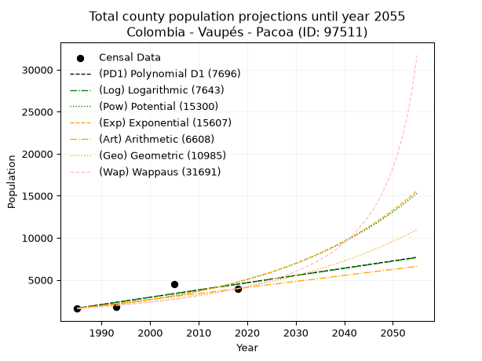
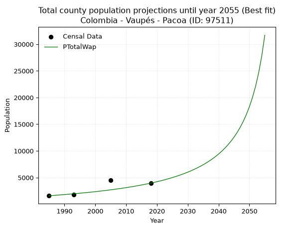
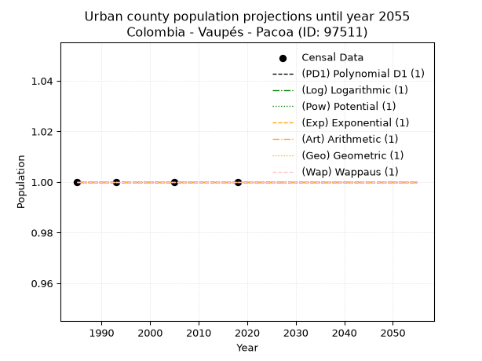
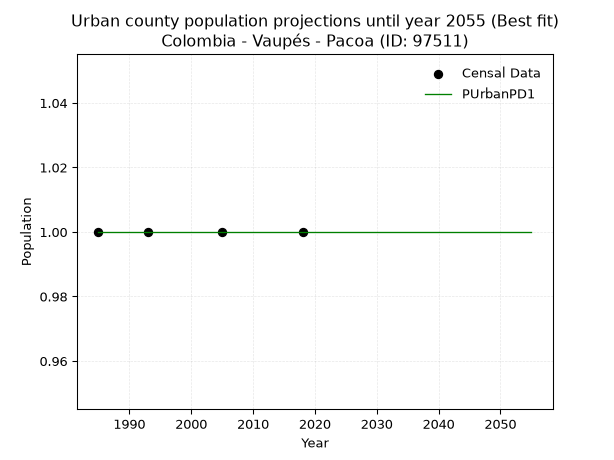
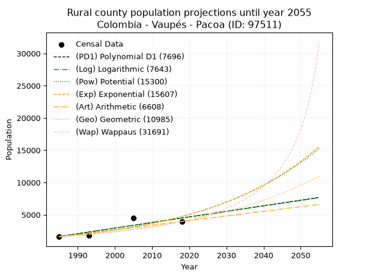
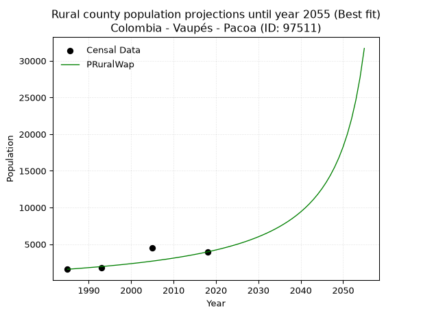

<div align="center">


</div>

# 📜 _“Population and Public Services Demand Projections (PPSD) until Year 2050 for Colombia - Vaupés - Pacoa (ID: 97511)”_
Keywords: `population` `public-service` `projection` `lineal` `polynomial` `logarithmic` `potential` `exponential` `arithmetic` `geometric` `wappaus` `dane` `colombia` `south-america`

PPSD are analytical estimates used by governments and planners to anticipate future changes in population size, age distribution, and the resulting community needs for utilities, healthcare, education, and infrastructure as sizing future water treatment facilities, electrical grids, and road networks based on spatial growth.

<div align="center">

</img>

</div>


> **General running parameters**: • app_version: _v20260806_. • Python version: _3.14.7_. • Pandas version: _3.0.5_. • NumPy version: _2.5.1_. • Creates, save and include plots into reports (create_plot): _False_. • Projection until year: _2050_. • Process polynomial degree 2 and up: _False_. • Process Wappaus: _True_. • Process Wappaus: _True_. • Set negative values to zero: _True_. • Set infinite values to zero: _True_. • Drop dataset notes: _True_. 
<div align="center">

Maps & GIS Layers: [:earth_americas:Google](http://maps.google.com/maps?q=0.194765959,-70.9364411) [:earth_americas:OSM](https://www.openstreetmap.org/#map=18/0.194765959/-70.9364411&layers=P) [:earth_americas:Bing](https://www.bing.com/maps?cp=0.194765959~-70.9364411&lvl=18) [:earth_americas:Apple](https://maps.apple.com/frame?center=0.194765959%2C-70.9364411&span=0.003%2C0.006) [:earth_americas:GISMobile](https://github.com/rcfdtools/R.GISMobile/blob/main/file/gis/CountyLayer_CO/Readme.md)

</div>


<div align="center">

```geojson
{
  "type": "Feature",
  "geometry": {
    "type": "Point", 
    "coordinates": [-70.9364411, 0.194765959]
  }, 
  "properties": {
    "Name": "Colombia - Vaupés - Pacoa (ID: 97511)"
  }
}
```

</div>


## 0. Census Data (4 records)

Census data are official statistics collected by a government about the people and housing in a country. They usually include counts of total population, age, sex, race, income, education, and jobs.

📅Global census file: [Population.xlsx](../data/Population.xlsx)

| Source   |   Year |   CountryID | CountryName   |   StateID | StateName   |   CountyID | CountyName   |   PTotal |   PUrban |   PRural |
|:---------|-------:|------------:|:--------------|----------:|:------------|-----------:|:-------------|---------:|---------:|---------:|
| DANE     |   1985 |          57 | Colombia      |        97 | Vaupés      |      97511 | Pacoa        |     1591 |        1 |     1591 |
| DANE     |   1993 |          57 | Colombia      |        97 | Vaupés      |      97511 | Pacoa        |     1828 |        1 |     1828 |
| DANE     |   2005 |          57 | Colombia      |        97 | Vaupés      |      97511 | Pacoa        |     4459 |        1 |     4459 |
| DANE     |   2018 |          57 | Colombia      |        97 | Vaupés      |      97511 | Pacoa        |     3956 |        1 |     3956 |

> 🔥Some records could had specific notes about the registered values or the corresponding urban or rural distribution.

## 1. Total

### 1.1. Coefficients and Parameters

* (PD1) Polynomial Deg 1: 86.52509032517074, -170113.3119229228 (lineal)
* (Log) Logarithmic: 173336.58331038163, -1314574.2587744151
* (Pow) Potential: 64.51529523409833, -209.5423471932155
* (Exp) Exponential: 0.03220616577102896, 2.8191496890655855e-25
* (Art) Arithmetic: Year diff. 2018 - 1985 = 33, Population diff. 3956 - 1591 = 2365, Annual growth = 71.66666666666667
* (Geo) Geometric: Year diff. 2018 - 1985 = 33, Population diff. 3956 - 1591 = 2365, Annual growth % = 0.027986609680589858
* (Wap) Wappaus: i = 2.5839793281653747, Condition values only valid for < 200)

<sub>
Wappaus condition values: ['0.00', '2.58', '5.17', '7.75', '10.34', '12.92', '15.50', '18.09', '20.67', '23.26', '25.84', '28.42', '31.01', '33.59', '36.18', '38.76', '41.34', '43.93', '46.51', '49.10', '51.68', '54.26', '56.85', '59.43', '62.02', '64.60', '67.18', '69.77', '72.35', '74.94', '77.52', '80.10', '82.69', '85.27', '87.86', '90.44', '93.02', '95.61', '98.19', '100.78', '103.36', '105.94', '108.53', '111.11', '113.70', '116.28', '118.86', '121.45', '124.03', '126.61', '129.20', '131.78', '134.37', '136.95', '139.53', '142.12', '144.70', '147.29', '149.87', '152.45', '155.04', '157.62', '160.21', '162.79', '165.37', '167.96']
</sub>


### 1.2. Projected Dataset

|   Year |   CountyID |   PTotalPD1 |   PTotalLog |   PTotalPow |   PTotalExp |   PTotalArt |   PTotalGeo |   PTotalWap |
|-------:|-----------:|------------:|------------:|------------:|------------:|------------:|------------:|------------:|
|   1985 |      97511 |        1639 |        1635 |        1635 |        1638 |        1591 |        1591 |        1591 |
|   1986 |      97511 |        1726 |        1723 |        1689 |        1691 |        1663 |        1636 |        1633 |
|   1987 |      97511 |        1812 |        1810 |        1745 |        1747 |        1734 |        1681 |        1675 |
|   1988 |      97511 |        1899 |        1897 |        1803 |        1804 |        1806 |        1728 |        1719 |
|   1989 |      97511 |        1985 |        1984 |        1862 |        1863 |        1878 |        1777 |        1764 |
|   1990 |      97511 |        2072 |        2071 |        1924 |        1924 |        1949 |        1826 |        1811 |
|   1991 |      97511 |        2158 |        2158 |        1987 |        1987 |        2021 |        1878 |        1858 |
|   1992 |      97511 |        2245 |        2245 |        2052 |        2052 |        2093 |        1930 |        1907 |
|   1993 |      97511 |        2331 |        2332 |        2120 |        2119 |        2164 |        1984 |        1958 |
|   1994 |      97511 |        2418 |        2419 |        2190 |        2188 |        2236 |        2040 |        2010 |
|   1995 |      97511 |        2504 |        2506 |        2262 |        2260 |        2308 |        2097 |        2063 |
|   1996 |      97511 |        2591 |        2593 |        2336 |        2334 |        2379 |        2155 |        2118 |
|   1997 |      97511 |        2677 |        2680 |        2413 |        2410 |        2451 |        2216 |        2175 |
|   1998 |      97511 |        2764 |        2767 |        2492 |        2489 |        2523 |        2278 |        2233 |
|   1999 |      97511 |        2850 |        2854 |        2574 |        2571 |        2594 |        2342 |        2294 |
|   2000 |      97511 |        2937 |        2940 |        2658 |        2655 |        2666 |        2407 |        2356 |
|   2001 |      97511 |        3023 |        3027 |        2745 |        2742 |        2738 |        2474 |        2420 |
|   2002 |      97511 |        3110 |        3113 |        2835 |        2831 |        2809 |        2544 |        2487 |
|   2003 |      97511 |        3196 |        3200 |        2928 |        2924 |        2881 |        2615 |        2555 |
|   2004 |      97511 |        3283 |        3287 |        3024 |        3020 |        2953 |        2688 |        2626 |
|   2005 |      97511 |        3369 |        3373 |        3123 |        3119 |        3024 |        2763 |        2700 |
|   2006 |      97511 |        3456 |        3459 |        3225 |        3221 |        3096 |        2841 |        2776 |
|   2007 |      97511 |        3543 |        3546 |        3330 |        3326 |        3168 |        2920 |        2855 |
|   2008 |      97511 |        3629 |        3632 |        3439 |        3435 |        3239 |        3002 |        2936 |
|   2009 |      97511 |        3716 |        3718 |        3551 |        3547 |        3311 |        3086 |        3021 |
|   2010 |      97511 |        3802 |        3805 |        3667 |        3664 |        3383 |        3172 |        3109 |
|   2011 |      97511 |        3889 |        3891 |        3787 |        3784 |        3454 |        3261 |        3201 |
|   2012 |      97511 |        3975 |        3977 |        3910 |        3907 |        3526 |        3352 |        3296 |
|   2013 |      97511 |        4062 |        4063 |        4037 |        4035 |        3598 |        3446 |        3395 |
|   2014 |      97511 |        4148 |        4149 |        4169 |        4167 |        3669 |        3542 |        3498 |
|   2015 |      97511 |        4235 |        4235 |        4305 |        4304 |        3741 |        3642 |        3605 |
|   2016 |      97511 |        4321 |        4321 |        4445 |        4445 |        3813 |        3744 |        3717 |
|   2017 |      97511 |        4408 |        4407 |        4589 |        4590 |        3884 |        3848 |        3834 |
|   2018 |      97511 |        4494 |        4493 |        4738 |        4740 |        3956 |        3956 |        3956 |
|   2019 |      97511 |        4581 |        4579 |        4892 |        4895 |        4028 |        4067 |        4084 |
|   2020 |      97511 |        4667 |        4665 |        5051 |        5056 |        4099 |        4181 |        4218 |
|   2021 |      97511 |        4754 |        4751 |        5215 |        5221 |        4171 |        4298 |        4358 |
|   2022 |      97511 |        4840 |        4836 |        5384 |        5392 |        4243 |        4418 |        4505 |
|   2023 |      97511 |        4927 |        4922 |        5558 |        5569 |        4314 |        4541 |        4660 |
|   2024 |      97511 |        5013 |        5008 |        5739 |        5751 |        4386 |        4669 |        4823 |
|   2025 |      97511 |        5100 |        5093 |        5924 |        5939 |        4458 |        4799 |        4994 |
|   2026 |      97511 |        5187 |        5179 |        6116 |        6133 |        4529 |        4934 |        5175 |
|   2027 |      97511 |        5273 |        5265 |        6314 |        6334 |        4601 |        5072 |        5366 |
|   2028 |      97511 |        5360 |        5350 |        6518 |        6541 |        4673 |        5214 |        5568 |
|   2029 |      97511 |        5446 |        5436 |        6729 |        6756 |        4744 |        5359 |        5783 |
|   2030 |      97511 |        5533 |        5521 |        6946 |        6977 |        4816 |        5509 |        6010 |
|   2031 |      97511 |        5619 |        5606 |        7170 |        7205 |        4888 |        5664 |        6253 |
|   2032 |      97511 |        5706 |        5692 |        7402 |        7441 |        4959 |        5822 |        6511 |
|   2033 |      97511 |        5792 |        5777 |        7640 |        7684 |        5031 |        5985 |        6786 |
|   2034 |      97511 |        5879 |        5862 |        7887 |        7936 |        5103 |        6153 |        7081 |
|   2035 |      97511 |        5965 |        5947 |        8141 |        8196 |        5174 |        6325 |        7398 |
|   2036 |      97511 |        6052 |        6033 |        8403 |        8464 |        5246 |        6502 |        7738 |
|   2037 |      97511 |        6138 |        6118 |        8673 |        8741 |        5318 |        6684 |        8105 |
|   2038 |      97511 |        6225 |        6203 |        8952 |        9027 |        5389 |        6871 |        8503 |
|   2039 |      97511 |        6311 |        6288 |        9240 |        9322 |        5461 |        7063 |        8934 |
|   2040 |      97511 |        6398 |        6373 |        9537 |        9628 |        5533 |        7261 |        9404 |
|   2041 |      97511 |        6484 |        6458 |        9844 |        9943 |        5604 |        7464 |        9918 |
|   2042 |      97511 |        6571 |        6543 |       10160 |       10268 |        5676 |        7673 |       10482 |
|   2043 |      97511 |        6657 |        6627 |       10486 |       10604 |        5748 |        7888 |       11104 |
|   2044 |      97511 |        6744 |        6712 |       10822 |       10951 |        5819 |        8108 |       11794 |
|   2045 |      97511 |        6830 |        6797 |       11169 |       11310 |        5891 |        8335 |       12563 |
|   2046 |      97511 |        6917 |        6882 |       11527 |       11680 |        5963 |        8569 |       13426 |
|   2047 |      97511 |        7004 |        6966 |       11896 |       12062 |        6034 |        8808 |       14402 |
|   2048 |      97511 |        7090 |        7051 |       12277 |       12457 |        6106 |        9055 |       15512 |
|   2049 |      97511 |        7177 |        7136 |       12670 |       12865 |        6178 |        9308 |       16789 |
|   2050 |      97511 |        7263 |        7220 |       13075 |       13286 |        6249 |        9569 |       18271 |
<div align="center">

</img>

</div>


### 1.3. Best fit with absolute and relative error (%)

Relative error puts that difference into context by dividing the absolute error by the true value, creating a unitless ratio or percentage that shows the scale of the mistake.

Absolute and relative error

|   Year | Source   |   CountryID | CountryName   |   StateID | StateName   |   CountyID_x | CountyName   |   PTotal |   PUrban |   PRural |   CountyID_y |   PTotalPD1 |   PTotalLog |   PTotalPow |   PTotalExp |   PTotalArt |   PTotalGeo |   PTotalWap |   PTotalPD1AbsError |   PTotalLogAbsError |   PTotalPowAbsError |   PTotalExpAbsError |   PTotalArtAbsError |   PTotalGeoAbsError |   PTotalWapAbsError |   PTotalPD1RelError |   PTotalLogRelError |   PTotalPowRelError |   PTotalExpRelError |   PTotalArtRelError |   PTotalGeoRelError |   PTotalWapRelError |
|-------:|:---------|------------:|:--------------|----------:|:------------|-------------:|:-------------|---------:|---------:|---------:|-------------:|------------:|------------:|------------:|------------:|------------:|------------:|------------:|--------------------:|--------------------:|--------------------:|--------------------:|--------------------:|--------------------:|--------------------:|--------------------:|--------------------:|--------------------:|--------------------:|--------------------:|--------------------:|--------------------:|
|   1985 | DANE     |          57 | Colombia      |        97 | Vaupés      |        97511 | Pacoa        |     1591 |        1 |     1591 |        97511 |        1639 |        1635 |        1635 |        1638 |        1591 |        1591 |        1591 |                  48 |                  44 |                  44 |                  47 |                   0 |                   0 |                   0 |             3.01697 |             2.76556 |             2.76556 |             2.95412 |              0      |             0       |              0      |
|   1993 | DANE     |          57 | Colombia      |        97 | Vaupés      |        97511 | Pacoa        |     1828 |        1 |     1828 |        97511 |        2331 |        2332 |        2120 |        2119 |        2164 |        1984 |        1958 |                 503 |                 504 |                 292 |                 291 |                 336 |                 156 |                 130 |            27.5164  |            27.5711  |            15.9737  |            15.919   |             18.3807 |             8.53392 |              7.1116 |
|   2005 | DANE     |          57 | Colombia      |        97 | Vaupés      |        97511 | Pacoa        |     4459 |        1 |     4459 |        97511 |        3369 |        3373 |        3123 |        3119 |        3024 |        2763 |        2700 |                1090 |                1086 |                1336 |                1340 |                1435 |                1696 |                1759 |            24.4449  |            24.3552  |            29.9619  |            30.0516  |             32.1821 |            38.0354  |             39.4483 |
|   2018 | DANE     |          57 | Colombia      |        97 | Vaupés      |        97511 | Pacoa        |     3956 |        1 |     3956 |        97511 |        4494 |        4493 |        4738 |        4740 |        3956 |        3956 |        3956 |                 538 |                 537 |                 782 |                 784 |                   0 |                   0 |                   0 |            13.5996  |            13.5743  |            19.7674  |            19.818   |              0      |             0       |              0      |

Relative error mean

| Method    |   RelError | Best   |
|:----------|-----------:|:-------|
| PTotalPD1 |    17.1445 |        |
| PTotalLog |    17.0666 |        |
| PTotalPow |    17.1172 |        |
| PTotalExp |    17.1857 |        |
| PTotalArt |    12.6407 |        |
| PTotalGeo |    11.6423 |        |
| PTotalWap |    11.64   | True   |

💙Best method: _**PTotalWap**_
<div align="center">

</img>

</div>


### 1.4. Fresh water supply demand in liters per capita per day (lpcd)

The fresh water supply demand typically ranges from 100 to 300 liters per capita per day (lpcd) for standard domestic and municipal planning, though absolute survival minimums set by the World Health Organization are as low as 7.5 to 20 liters per day, and total consumption in high-income nations can exceed 400 liters.

> `CZ`: Level in meters above the sea level (masl)<br> `WS`: Fresh water supply demand in liters per capita per day (lpcd or l/h/d)<br> `WSAll`: Zonal fresh water supply demand in liters per second (l/s)<br> `A`: Zonal area in square meters<br> `DP`: Population density (people/hectare or p/ha)

Reference values (RAS Colombia)

|    CZ |   WS |
|------:|-----:|
|  1000 |  120 |
|  2000 |  130 |
| 99999 |  140 |

County shapefile geometry properties and water supply values

|   CountyID |      ATotal |   CZTotal |   WSTotal |
|-----------:|------------:|----------:|----------:|
|      97511 | 1.39473e+10 |   191.834 |       120 |

Projected values for best method: PTotalWap

|   CountyID |   Year |   PTotalWap |   DPTotal |   WSTotal |   WSTotalAll |
|-----------:|-------:|------------:|----------:|----------:|-------------:|
|      97511 |   1985 |        1591 |      0    |       120 |      2.20972 |
|      97511 |   1986 |        1633 |      0    |       120 |      2.26806 |
|      97511 |   1987 |        1675 |      0    |       120 |      2.32639 |
|      97511 |   1988 |        1719 |      0    |       120 |      2.3875  |
|      97511 |   1989 |        1764 |      0    |       120 |      2.45    |
|      97511 |   1990 |        1811 |      0    |       120 |      2.51528 |
|      97511 |   1991 |        1858 |      0    |       120 |      2.58056 |
|      97511 |   1992 |        1907 |      0    |       120 |      2.64861 |
|      97511 |   1993 |        1958 |      0    |       120 |      2.71944 |
|      97511 |   1994 |        2010 |      0    |       120 |      2.79167 |
|      97511 |   1995 |        2063 |      0    |       120 |      2.86528 |
|      97511 |   1996 |        2118 |      0    |       120 |      2.94167 |
|      97511 |   1997 |        2175 |      0    |       120 |      3.02083 |
|      97511 |   1998 |        2233 |      0    |       120 |      3.10139 |
|      97511 |   1999 |        2294 |      0    |       120 |      3.18611 |
|      97511 |   2000 |        2356 |      0    |       120 |      3.27222 |
|      97511 |   2001 |        2420 |      0    |       120 |      3.36111 |
|      97511 |   2002 |        2487 |      0    |       120 |      3.45417 |
|      97511 |   2003 |        2555 |      0    |       120 |      3.54861 |
|      97511 |   2004 |        2626 |      0    |       120 |      3.64722 |
|      97511 |   2005 |        2700 |      0    |       120 |      3.75    |
|      97511 |   2006 |        2776 |      0    |       120 |      3.85556 |
|      97511 |   2007 |        2855 |      0    |       120 |      3.96528 |
|      97511 |   2008 |        2936 |      0    |       120 |      4.07778 |
|      97511 |   2009 |        3021 |      0    |       120 |      4.19583 |
|      97511 |   2010 |        3109 |      0    |       120 |      4.31806 |
|      97511 |   2011 |        3201 |      0    |       120 |      4.44583 |
|      97511 |   2012 |        3296 |      0    |       120 |      4.57778 |
|      97511 |   2013 |        3395 |      0    |       120 |      4.71528 |
|      97511 |   2014 |        3498 |      0    |       120 |      4.85833 |
|      97511 |   2015 |        3605 |      0    |       120 |      5.00694 |
|      97511 |   2016 |        3717 |      0    |       120 |      5.1625  |
|      97511 |   2017 |        3834 |      0    |       120 |      5.325   |
|      97511 |   2018 |        3956 |      0    |       120 |      5.49444 |
|      97511 |   2019 |        4084 |      0    |       120 |      5.67222 |
|      97511 |   2020 |        4218 |      0    |       120 |      5.85833 |
|      97511 |   2021 |        4358 |      0    |       120 |      6.05278 |
|      97511 |   2022 |        4505 |      0    |       120 |      6.25694 |
|      97511 |   2023 |        4660 |      0    |       120 |      6.47222 |
|      97511 |   2024 |        4823 |      0    |       120 |      6.69861 |
|      97511 |   2025 |        4994 |      0    |       120 |      6.93611 |
|      97511 |   2026 |        5175 |      0    |       120 |      7.1875  |
|      97511 |   2027 |        5366 |      0    |       120 |      7.45278 |
|      97511 |   2028 |        5568 |      0    |       120 |      7.73333 |
|      97511 |   2029 |        5783 |      0    |       120 |      8.03194 |
|      97511 |   2030 |        6010 |      0    |       120 |      8.34722 |
|      97511 |   2031 |        6253 |      0    |       120 |      8.68472 |
|      97511 |   2032 |        6511 |      0    |       120 |      9.04306 |
|      97511 |   2033 |        6786 |      0    |       120 |      9.425   |
|      97511 |   2034 |        7081 |      0.01 |       120 |      9.83472 |
|      97511 |   2035 |        7398 |      0.01 |       120 |     10.275   |
|      97511 |   2036 |        7738 |      0.01 |       120 |     10.7472  |
|      97511 |   2037 |        8105 |      0.01 |       120 |     11.2569  |
|      97511 |   2038 |        8503 |      0.01 |       120 |     11.8097  |
|      97511 |   2039 |        8934 |      0.01 |       120 |     12.4083  |
|      97511 |   2040 |        9404 |      0.01 |       120 |     13.0611  |
|      97511 |   2041 |        9918 |      0.01 |       120 |     13.775   |
|      97511 |   2042 |       10482 |      0.01 |       120 |     14.5583  |
|      97511 |   2043 |       11104 |      0.01 |       120 |     15.4222  |
|      97511 |   2044 |       11794 |      0.01 |       120 |     16.3806  |
|      97511 |   2045 |       12563 |      0.01 |       120 |     17.4486  |
|      97511 |   2046 |       13426 |      0.01 |       120 |     18.6472  |
|      97511 |   2047 |       14402 |      0.01 |       120 |     20.0028  |
|      97511 |   2048 |       15512 |      0.01 |       120 |     21.5444  |
|      97511 |   2049 |       16789 |      0.01 |       120 |     23.3181  |
|      97511 |   2050 |       18271 |      0.01 |       120 |     25.3764  |

## 2. Urban

### 2.1. Coefficients and Parameters

* (PD1) Polynomial Deg 1: -1.3233529347183512e-19, 1.0000000000000004 (lineal)
* (Log) Logarithmic: 3.215569112241165e-17, 0.9999999999999996
* (Pow) Potential: 0.0, 0.0
* (Exp) Exponential: 0.0, 1.0
* (Art) Arithmetic: Year diff. 2018 - 1985 = 33, Population diff. 1 - 1 = 0, Annual growth = 0.0
* (Geo) Geometric: Year diff. 2018 - 1985 = 33, Population diff. 1 - 1 = 0, Annual growth % = 0.0
* (Wap) Wappaus: i = 0.0, Condition values only valid for < 200)

<sub>
Wappaus condition values: ['0.00', '0.00', '0.00', '0.00', '0.00', '0.00', '0.00', '0.00', '0.00', '0.00', '0.00', '0.00', '0.00', '0.00', '0.00', '0.00', '0.00', '0.00', '0.00', '0.00', '0.00', '0.00', '0.00', '0.00', '0.00', '0.00', '0.00', '0.00', '0.00', '0.00', '0.00', '0.00', '0.00', '0.00', '0.00', '0.00', '0.00', '0.00', '0.00', '0.00', '0.00', '0.00', '0.00', '0.00', '0.00', '0.00', '0.00', '0.00', '0.00', '0.00', '0.00', '0.00', '0.00', '0.00', '0.00', '0.00', '0.00', '0.00', '0.00', '0.00', '0.00', '0.00', '0.00', '0.00', '0.00', '0.00']
</sub>


### 2.2. Projected Dataset

|   Year |   CountyID |   PUrbanPD1 |   PUrbanLog |   PUrbanPow |   PUrbanExp |   PUrbanArt |   PUrbanGeo |   PUrbanWap |
|-------:|-----------:|------------:|------------:|------------:|------------:|------------:|------------:|------------:|
|   1985 |      97511 |           1 |           1 |           1 |           1 |           1 |           1 |           1 |
|   1986 |      97511 |           1 |           1 |           1 |           1 |           1 |           1 |           1 |
|   1987 |      97511 |           1 |           1 |           1 |           1 |           1 |           1 |           1 |
|   1988 |      97511 |           1 |           1 |           1 |           1 |           1 |           1 |           1 |
|   1989 |      97511 |           1 |           1 |           1 |           1 |           1 |           1 |           1 |
|   1990 |      97511 |           1 |           1 |           1 |           1 |           1 |           1 |           1 |
|   1991 |      97511 |           1 |           1 |           1 |           1 |           1 |           1 |           1 |
|   1992 |      97511 |           1 |           1 |           1 |           1 |           1 |           1 |           1 |
|   1993 |      97511 |           1 |           1 |           1 |           1 |           1 |           1 |           1 |
|   1994 |      97511 |           1 |           1 |           1 |           1 |           1 |           1 |           1 |
|   1995 |      97511 |           1 |           1 |           1 |           1 |           1 |           1 |           1 |
|   1996 |      97511 |           1 |           1 |           1 |           1 |           1 |           1 |           1 |
|   1997 |      97511 |           1 |           1 |           1 |           1 |           1 |           1 |           1 |
|   1998 |      97511 |           1 |           1 |           1 |           1 |           1 |           1 |           1 |
|   1999 |      97511 |           1 |           1 |           1 |           1 |           1 |           1 |           1 |
|   2000 |      97511 |           1 |           1 |           1 |           1 |           1 |           1 |           1 |
|   2001 |      97511 |           1 |           1 |           1 |           1 |           1 |           1 |           1 |
|   2002 |      97511 |           1 |           1 |           1 |           1 |           1 |           1 |           1 |
|   2003 |      97511 |           1 |           1 |           1 |           1 |           1 |           1 |           1 |
|   2004 |      97511 |           1 |           1 |           1 |           1 |           1 |           1 |           1 |
|   2005 |      97511 |           1 |           1 |           1 |           1 |           1 |           1 |           1 |
|   2006 |      97511 |           1 |           1 |           1 |           1 |           1 |           1 |           1 |
|   2007 |      97511 |           1 |           1 |           1 |           1 |           1 |           1 |           1 |
|   2008 |      97511 |           1 |           1 |           1 |           1 |           1 |           1 |           1 |
|   2009 |      97511 |           1 |           1 |           1 |           1 |           1 |           1 |           1 |
|   2010 |      97511 |           1 |           1 |           1 |           1 |           1 |           1 |           1 |
|   2011 |      97511 |           1 |           1 |           1 |           1 |           1 |           1 |           1 |
|   2012 |      97511 |           1 |           1 |           1 |           1 |           1 |           1 |           1 |
|   2013 |      97511 |           1 |           1 |           1 |           1 |           1 |           1 |           1 |
|   2014 |      97511 |           1 |           1 |           1 |           1 |           1 |           1 |           1 |
|   2015 |      97511 |           1 |           1 |           1 |           1 |           1 |           1 |           1 |
|   2016 |      97511 |           1 |           1 |           1 |           1 |           1 |           1 |           1 |
|   2017 |      97511 |           1 |           1 |           1 |           1 |           1 |           1 |           1 |
|   2018 |      97511 |           1 |           1 |           1 |           1 |           1 |           1 |           1 |
|   2019 |      97511 |           1 |           1 |           1 |           1 |           1 |           1 |           1 |
|   2020 |      97511 |           1 |           1 |           1 |           1 |           1 |           1 |           1 |
|   2021 |      97511 |           1 |           1 |           1 |           1 |           1 |           1 |           1 |
|   2022 |      97511 |           1 |           1 |           1 |           1 |           1 |           1 |           1 |
|   2023 |      97511 |           1 |           1 |           1 |           1 |           1 |           1 |           1 |
|   2024 |      97511 |           1 |           1 |           1 |           1 |           1 |           1 |           1 |
|   2025 |      97511 |           1 |           1 |           1 |           1 |           1 |           1 |           1 |
|   2026 |      97511 |           1 |           1 |           1 |           1 |           1 |           1 |           1 |
|   2027 |      97511 |           1 |           1 |           1 |           1 |           1 |           1 |           1 |
|   2028 |      97511 |           1 |           1 |           1 |           1 |           1 |           1 |           1 |
|   2029 |      97511 |           1 |           1 |           1 |           1 |           1 |           1 |           1 |
|   2030 |      97511 |           1 |           1 |           1 |           1 |           1 |           1 |           1 |
|   2031 |      97511 |           1 |           1 |           1 |           1 |           1 |           1 |           1 |
|   2032 |      97511 |           1 |           1 |           1 |           1 |           1 |           1 |           1 |
|   2033 |      97511 |           1 |           1 |           1 |           1 |           1 |           1 |           1 |
|   2034 |      97511 |           1 |           1 |           1 |           1 |           1 |           1 |           1 |
|   2035 |      97511 |           1 |           1 |           1 |           1 |           1 |           1 |           1 |
|   2036 |      97511 |           1 |           1 |           1 |           1 |           1 |           1 |           1 |
|   2037 |      97511 |           1 |           1 |           1 |           1 |           1 |           1 |           1 |
|   2038 |      97511 |           1 |           1 |           1 |           1 |           1 |           1 |           1 |
|   2039 |      97511 |           1 |           1 |           1 |           1 |           1 |           1 |           1 |
|   2040 |      97511 |           1 |           1 |           1 |           1 |           1 |           1 |           1 |
|   2041 |      97511 |           1 |           1 |           1 |           1 |           1 |           1 |           1 |
|   2042 |      97511 |           1 |           1 |           1 |           1 |           1 |           1 |           1 |
|   2043 |      97511 |           1 |           1 |           1 |           1 |           1 |           1 |           1 |
|   2044 |      97511 |           1 |           1 |           1 |           1 |           1 |           1 |           1 |
|   2045 |      97511 |           1 |           1 |           1 |           1 |           1 |           1 |           1 |
|   2046 |      97511 |           1 |           1 |           1 |           1 |           1 |           1 |           1 |
|   2047 |      97511 |           1 |           1 |           1 |           1 |           1 |           1 |           1 |
|   2048 |      97511 |           1 |           1 |           1 |           1 |           1 |           1 |           1 |
|   2049 |      97511 |           1 |           1 |           1 |           1 |           1 |           1 |           1 |
|   2050 |      97511 |           1 |           1 |           1 |           1 |           1 |           1 |           1 |
<div align="center">

</img>

</div>


### 2.3. Best fit with absolute and relative error (%)

Relative error puts that difference into context by dividing the absolute error by the true value, creating a unitless ratio or percentage that shows the scale of the mistake.

Absolute and relative error

|   Year | Source   |   CountryID | CountryName   |   StateID | StateName   |   CountyID_x | CountyName   |   PTotal |   PUrban |   PRural |   CountyID_y |   PUrbanPD1 |   PUrbanLog |   PUrbanPow |   PUrbanExp |   PUrbanArt |   PUrbanGeo |   PUrbanWap |   PUrbanPD1AbsError |   PUrbanLogAbsError |   PUrbanPowAbsError |   PUrbanExpAbsError |   PUrbanArtAbsError |   PUrbanGeoAbsError |   PUrbanWapAbsError |   PUrbanPD1RelError |   PUrbanLogRelError |   PUrbanPowRelError |   PUrbanExpRelError |   PUrbanArtRelError |   PUrbanGeoRelError |   PUrbanWapRelError |
|-------:|:---------|------------:|:--------------|----------:|:------------|-------------:|:-------------|---------:|---------:|---------:|-------------:|------------:|------------:|------------:|------------:|------------:|------------:|------------:|--------------------:|--------------------:|--------------------:|--------------------:|--------------------:|--------------------:|--------------------:|--------------------:|--------------------:|--------------------:|--------------------:|--------------------:|--------------------:|--------------------:|
|   1985 | DANE     |          57 | Colombia      |        97 | Vaupés      |        97511 | Pacoa        |     1591 |        1 |     1591 |        97511 |           1 |           1 |           1 |           1 |           1 |           1 |           1 |                   0 |                   0 |                   0 |                   0 |                   0 |                   0 |                   0 |                   0 |                   0 |                   0 |                   0 |                   0 |                   0 |                   0 |
|   1993 | DANE     |          57 | Colombia      |        97 | Vaupés      |        97511 | Pacoa        |     1828 |        1 |     1828 |        97511 |           1 |           1 |           1 |           1 |           1 |           1 |           1 |                   0 |                   0 |                   0 |                   0 |                   0 |                   0 |                   0 |                   0 |                   0 |                   0 |                   0 |                   0 |                   0 |                   0 |
|   2005 | DANE     |          57 | Colombia      |        97 | Vaupés      |        97511 | Pacoa        |     4459 |        1 |     4459 |        97511 |           1 |           1 |           1 |           1 |           1 |           1 |           1 |                   0 |                   0 |                   0 |                   0 |                   0 |                   0 |                   0 |                   0 |                   0 |                   0 |                   0 |                   0 |                   0 |                   0 |
|   2018 | DANE     |          57 | Colombia      |        97 | Vaupés      |        97511 | Pacoa        |     3956 |        1 |     3956 |        97511 |           1 |           1 |           1 |           1 |           1 |           1 |           1 |                   0 |                   0 |                   0 |                   0 |                   0 |                   0 |                   0 |                   0 |                   0 |                   0 |                   0 |                   0 |                   0 |                   0 |

Relative error mean

| Method    |   RelError | Best   |
|:----------|-----------:|:-------|
| PUrbanPD1 |          0 | True   |
| PUrbanLog |          0 | True   |
| PUrbanPow |          0 | True   |
| PUrbanExp |          0 | True   |
| PUrbanArt |          0 | True   |
| PUrbanGeo |          0 | True   |
| PUrbanWap |          0 | True   |

💙Best method: _**PUrbanPD1**_
<div align="center">

</img>

</div>


### 2.4. Fresh water supply demand in liters per capita per day (lpcd)

The fresh water supply demand typically ranges from 100 to 300 liters per capita per day (lpcd) for standard domestic and municipal planning, though absolute survival minimums set by the World Health Organization are as low as 7.5 to 20 liters per day, and total consumption in high-income nations can exceed 400 liters.

> `CZ`: Level in meters above the sea level (masl)<br> `WS`: Fresh water supply demand in liters per capita per day (lpcd or l/h/d)<br> `WSAll`: Zonal fresh water supply demand in liters per second (l/s)<br> `A`: Zonal area in square meters<br> `DP`: Population density (people/hectare or p/ha)

Reference values (RAS Colombia)

|    CZ |   WS |
|------:|-----:|
|  1000 |  120 |
|  2000 |  130 |
| 99999 |  140 |

County shapefile geometry properties and water supply values

|   CountyID |   AUrban |   CZUrban |   WSUrban |
|-----------:|---------:|----------:|----------:|
|      97511 |        0 |         0 |       120 |

Projected values for best method: PUrbanPD1

|   CountyID |   Year |   PUrbanPD1 |   DPUrban |   WSUrban |   WSUrbanAll |
|-----------:|-------:|------------:|----------:|----------:|-------------:|
|      97511 |   1985 |           1 |       inf |       120 |   0.00138889 |
|      97511 |   1986 |           1 |       inf |       120 |   0.00138889 |
|      97511 |   1987 |           1 |       inf |       120 |   0.00138889 |
|      97511 |   1988 |           1 |       inf |       120 |   0.00138889 |
|      97511 |   1989 |           1 |       inf |       120 |   0.00138889 |
|      97511 |   1990 |           1 |       inf |       120 |   0.00138889 |
|      97511 |   1991 |           1 |       inf |       120 |   0.00138889 |
|      97511 |   1992 |           1 |       inf |       120 |   0.00138889 |
|      97511 |   1993 |           1 |       inf |       120 |   0.00138889 |
|      97511 |   1994 |           1 |       inf |       120 |   0.00138889 |
|      97511 |   1995 |           1 |       inf |       120 |   0.00138889 |
|      97511 |   1996 |           1 |       inf |       120 |   0.00138889 |
|      97511 |   1997 |           1 |       inf |       120 |   0.00138889 |
|      97511 |   1998 |           1 |       inf |       120 |   0.00138889 |
|      97511 |   1999 |           1 |       inf |       120 |   0.00138889 |
|      97511 |   2000 |           1 |       inf |       120 |   0.00138889 |
|      97511 |   2001 |           1 |       inf |       120 |   0.00138889 |
|      97511 |   2002 |           1 |       inf |       120 |   0.00138889 |
|      97511 |   2003 |           1 |       inf |       120 |   0.00138889 |
|      97511 |   2004 |           1 |       inf |       120 |   0.00138889 |
|      97511 |   2005 |           1 |       inf |       120 |   0.00138889 |
|      97511 |   2006 |           1 |       inf |       120 |   0.00138889 |
|      97511 |   2007 |           1 |       inf |       120 |   0.00138889 |
|      97511 |   2008 |           1 |       inf |       120 |   0.00138889 |
|      97511 |   2009 |           1 |       inf |       120 |   0.00138889 |
|      97511 |   2010 |           1 |       inf |       120 |   0.00138889 |
|      97511 |   2011 |           1 |       inf |       120 |   0.00138889 |
|      97511 |   2012 |           1 |       inf |       120 |   0.00138889 |
|      97511 |   2013 |           1 |       inf |       120 |   0.00138889 |
|      97511 |   2014 |           1 |       inf |       120 |   0.00138889 |
|      97511 |   2015 |           1 |       inf |       120 |   0.00138889 |
|      97511 |   2016 |           1 |       inf |       120 |   0.00138889 |
|      97511 |   2017 |           1 |       inf |       120 |   0.00138889 |
|      97511 |   2018 |           1 |       inf |       120 |   0.00138889 |
|      97511 |   2019 |           1 |       inf |       120 |   0.00138889 |
|      97511 |   2020 |           1 |       inf |       120 |   0.00138889 |
|      97511 |   2021 |           1 |       inf |       120 |   0.00138889 |
|      97511 |   2022 |           1 |       inf |       120 |   0.00138889 |
|      97511 |   2023 |           1 |       inf |       120 |   0.00138889 |
|      97511 |   2024 |           1 |       inf |       120 |   0.00138889 |
|      97511 |   2025 |           1 |       inf |       120 |   0.00138889 |
|      97511 |   2026 |           1 |       inf |       120 |   0.00138889 |
|      97511 |   2027 |           1 |       inf |       120 |   0.00138889 |
|      97511 |   2028 |           1 |       inf |       120 |   0.00138889 |
|      97511 |   2029 |           1 |       inf |       120 |   0.00138889 |
|      97511 |   2030 |           1 |       inf |       120 |   0.00138889 |
|      97511 |   2031 |           1 |       inf |       120 |   0.00138889 |
|      97511 |   2032 |           1 |       inf |       120 |   0.00138889 |
|      97511 |   2033 |           1 |       inf |       120 |   0.00138889 |
|      97511 |   2034 |           1 |       inf |       120 |   0.00138889 |
|      97511 |   2035 |           1 |       inf |       120 |   0.00138889 |
|      97511 |   2036 |           1 |       inf |       120 |   0.00138889 |
|      97511 |   2037 |           1 |       inf |       120 |   0.00138889 |
|      97511 |   2038 |           1 |       inf |       120 |   0.00138889 |
|      97511 |   2039 |           1 |       inf |       120 |   0.00138889 |
|      97511 |   2040 |           1 |       inf |       120 |   0.00138889 |
|      97511 |   2041 |           1 |       inf |       120 |   0.00138889 |
|      97511 |   2042 |           1 |       inf |       120 |   0.00138889 |
|      97511 |   2043 |           1 |       inf |       120 |   0.00138889 |
|      97511 |   2044 |           1 |       inf |       120 |   0.00138889 |
|      97511 |   2045 |           1 |       inf |       120 |   0.00138889 |
|      97511 |   2046 |           1 |       inf |       120 |   0.00138889 |
|      97511 |   2047 |           1 |       inf |       120 |   0.00138889 |
|      97511 |   2048 |           1 |       inf |       120 |   0.00138889 |
|      97511 |   2049 |           1 |       inf |       120 |   0.00138889 |
|      97511 |   2050 |           1 |       inf |       120 |   0.00138889 |

## 3. Rural

### 3.1. Coefficients and Parameters

* (PD1) Polynomial Deg 1: 86.52509032517074, -170113.3119229228 (lineal)
* (Log) Logarithmic: 173336.58331038163, -1314574.2587744151
* (Pow) Potential: 64.51529523409833, -209.5423471932155
* (Exp) Exponential: 0.03220616577102896, 2.8191496890655855e-25
* (Art) Arithmetic: Year diff. 2018 - 1985 = 33, Population diff. 3956 - 1591 = 2365, Annual growth = 71.66666666666667
* (Geo) Geometric: Year diff. 2018 - 1985 = 33, Population diff. 3956 - 1591 = 2365, Annual growth % = 0.027986609680589858
* (Wap) Wappaus: i = 2.5839793281653747, Condition values only valid for < 200)

<sub>
Wappaus condition values: ['0.00', '2.58', '5.17', '7.75', '10.34', '12.92', '15.50', '18.09', '20.67', '23.26', '25.84', '28.42', '31.01', '33.59', '36.18', '38.76', '41.34', '43.93', '46.51', '49.10', '51.68', '54.26', '56.85', '59.43', '62.02', '64.60', '67.18', '69.77', '72.35', '74.94', '77.52', '80.10', '82.69', '85.27', '87.86', '90.44', '93.02', '95.61', '98.19', '100.78', '103.36', '105.94', '108.53', '111.11', '113.70', '116.28', '118.86', '121.45', '124.03', '126.61', '129.20', '131.78', '134.37', '136.95', '139.53', '142.12', '144.70', '147.29', '149.87', '152.45', '155.04', '157.62', '160.21', '162.79', '165.37', '167.96']
</sub>


### 3.2. Projected Dataset

|   Year |   CountyID |   PRuralPD1 |   PRuralLog |   PRuralPow |   PRuralExp |   PRuralArt |   PRuralGeo |   PRuralWap |
|-------:|-----------:|------------:|------------:|------------:|------------:|------------:|------------:|------------:|
|   1985 |      97511 |        1639 |        1635 |        1635 |        1638 |        1591 |        1591 |        1591 |
|   1986 |      97511 |        1726 |        1723 |        1689 |        1691 |        1663 |        1636 |        1633 |
|   1987 |      97511 |        1812 |        1810 |        1745 |        1747 |        1734 |        1681 |        1675 |
|   1988 |      97511 |        1899 |        1897 |        1803 |        1804 |        1806 |        1728 |        1719 |
|   1989 |      97511 |        1985 |        1984 |        1862 |        1863 |        1878 |        1777 |        1764 |
|   1990 |      97511 |        2072 |        2071 |        1924 |        1924 |        1949 |        1826 |        1811 |
|   1991 |      97511 |        2158 |        2158 |        1987 |        1987 |        2021 |        1878 |        1858 |
|   1992 |      97511 |        2245 |        2245 |        2052 |        2052 |        2093 |        1930 |        1907 |
|   1993 |      97511 |        2331 |        2332 |        2120 |        2119 |        2164 |        1984 |        1958 |
|   1994 |      97511 |        2418 |        2419 |        2190 |        2188 |        2236 |        2040 |        2010 |
|   1995 |      97511 |        2504 |        2506 |        2262 |        2260 |        2308 |        2097 |        2063 |
|   1996 |      97511 |        2591 |        2593 |        2336 |        2334 |        2379 |        2155 |        2118 |
|   1997 |      97511 |        2677 |        2680 |        2413 |        2410 |        2451 |        2216 |        2175 |
|   1998 |      97511 |        2764 |        2767 |        2492 |        2489 |        2523 |        2278 |        2233 |
|   1999 |      97511 |        2850 |        2854 |        2574 |        2571 |        2594 |        2342 |        2294 |
|   2000 |      97511 |        2937 |        2940 |        2658 |        2655 |        2666 |        2407 |        2356 |
|   2001 |      97511 |        3023 |        3027 |        2745 |        2742 |        2738 |        2474 |        2420 |
|   2002 |      97511 |        3110 |        3113 |        2835 |        2831 |        2809 |        2544 |        2487 |
|   2003 |      97511 |        3196 |        3200 |        2928 |        2924 |        2881 |        2615 |        2555 |
|   2004 |      97511 |        3283 |        3287 |        3024 |        3020 |        2953 |        2688 |        2626 |
|   2005 |      97511 |        3369 |        3373 |        3123 |        3119 |        3024 |        2763 |        2700 |
|   2006 |      97511 |        3456 |        3459 |        3225 |        3221 |        3096 |        2841 |        2776 |
|   2007 |      97511 |        3543 |        3546 |        3330 |        3326 |        3168 |        2920 |        2855 |
|   2008 |      97511 |        3629 |        3632 |        3439 |        3435 |        3239 |        3002 |        2936 |
|   2009 |      97511 |        3716 |        3718 |        3551 |        3547 |        3311 |        3086 |        3021 |
|   2010 |      97511 |        3802 |        3805 |        3667 |        3664 |        3383 |        3172 |        3109 |
|   2011 |      97511 |        3889 |        3891 |        3787 |        3784 |        3454 |        3261 |        3201 |
|   2012 |      97511 |        3975 |        3977 |        3910 |        3907 |        3526 |        3352 |        3296 |
|   2013 |      97511 |        4062 |        4063 |        4037 |        4035 |        3598 |        3446 |        3395 |
|   2014 |      97511 |        4148 |        4149 |        4169 |        4167 |        3669 |        3542 |        3498 |
|   2015 |      97511 |        4235 |        4235 |        4305 |        4304 |        3741 |        3642 |        3605 |
|   2016 |      97511 |        4321 |        4321 |        4445 |        4445 |        3813 |        3744 |        3717 |
|   2017 |      97511 |        4408 |        4407 |        4589 |        4590 |        3884 |        3848 |        3834 |
|   2018 |      97511 |        4494 |        4493 |        4738 |        4740 |        3956 |        3956 |        3956 |
|   2019 |      97511 |        4581 |        4579 |        4892 |        4895 |        4028 |        4067 |        4084 |
|   2020 |      97511 |        4667 |        4665 |        5051 |        5056 |        4099 |        4181 |        4218 |
|   2021 |      97511 |        4754 |        4751 |        5215 |        5221 |        4171 |        4298 |        4358 |
|   2022 |      97511 |        4840 |        4836 |        5384 |        5392 |        4243 |        4418 |        4505 |
|   2023 |      97511 |        4927 |        4922 |        5558 |        5569 |        4314 |        4541 |        4660 |
|   2024 |      97511 |        5013 |        5008 |        5739 |        5751 |        4386 |        4669 |        4823 |
|   2025 |      97511 |        5100 |        5093 |        5924 |        5939 |        4458 |        4799 |        4994 |
|   2026 |      97511 |        5187 |        5179 |        6116 |        6133 |        4529 |        4934 |        5175 |
|   2027 |      97511 |        5273 |        5265 |        6314 |        6334 |        4601 |        5072 |        5366 |
|   2028 |      97511 |        5360 |        5350 |        6518 |        6541 |        4673 |        5214 |        5568 |
|   2029 |      97511 |        5446 |        5436 |        6729 |        6756 |        4744 |        5359 |        5783 |
|   2030 |      97511 |        5533 |        5521 |        6946 |        6977 |        4816 |        5509 |        6010 |
|   2031 |      97511 |        5619 |        5606 |        7170 |        7205 |        4888 |        5664 |        6253 |
|   2032 |      97511 |        5706 |        5692 |        7402 |        7441 |        4959 |        5822 |        6511 |
|   2033 |      97511 |        5792 |        5777 |        7640 |        7684 |        5031 |        5985 |        6786 |
|   2034 |      97511 |        5879 |        5862 |        7887 |        7936 |        5103 |        6153 |        7081 |
|   2035 |      97511 |        5965 |        5947 |        8141 |        8196 |        5174 |        6325 |        7398 |
|   2036 |      97511 |        6052 |        6033 |        8403 |        8464 |        5246 |        6502 |        7738 |
|   2037 |      97511 |        6138 |        6118 |        8673 |        8741 |        5318 |        6684 |        8105 |
|   2038 |      97511 |        6225 |        6203 |        8952 |        9027 |        5389 |        6871 |        8503 |
|   2039 |      97511 |        6311 |        6288 |        9240 |        9322 |        5461 |        7063 |        8934 |
|   2040 |      97511 |        6398 |        6373 |        9537 |        9628 |        5533 |        7261 |        9404 |
|   2041 |      97511 |        6484 |        6458 |        9844 |        9943 |        5604 |        7464 |        9918 |
|   2042 |      97511 |        6571 |        6543 |       10160 |       10268 |        5676 |        7673 |       10482 |
|   2043 |      97511 |        6657 |        6627 |       10486 |       10604 |        5748 |        7888 |       11104 |
|   2044 |      97511 |        6744 |        6712 |       10822 |       10951 |        5819 |        8108 |       11794 |
|   2045 |      97511 |        6830 |        6797 |       11169 |       11310 |        5891 |        8335 |       12563 |
|   2046 |      97511 |        6917 |        6882 |       11527 |       11680 |        5963 |        8569 |       13426 |
|   2047 |      97511 |        7004 |        6966 |       11896 |       12062 |        6034 |        8808 |       14402 |
|   2048 |      97511 |        7090 |        7051 |       12277 |       12457 |        6106 |        9055 |       15512 |
|   2049 |      97511 |        7177 |        7136 |       12670 |       12865 |        6178 |        9308 |       16789 |
|   2050 |      97511 |        7263 |        7220 |       13075 |       13286 |        6249 |        9569 |       18271 |
<div align="center">

</img>

</div>


### 3.3. Best fit with absolute and relative error (%)

Relative error puts that difference into context by dividing the absolute error by the true value, creating a unitless ratio or percentage that shows the scale of the mistake.

Absolute and relative error

|   Year | Source   |   CountryID | CountryName   |   StateID | StateName   |   CountyID_x | CountyName   |   PTotal |   PUrban |   PRural |   CountyID_y |   PRuralPD1 |   PRuralLog |   PRuralPow |   PRuralExp |   PRuralArt |   PRuralGeo |   PRuralWap |   PRuralPD1AbsError |   PRuralLogAbsError |   PRuralPowAbsError |   PRuralExpAbsError |   PRuralArtAbsError |   PRuralGeoAbsError |   PRuralWapAbsError |   PRuralPD1RelError |   PRuralLogRelError |   PRuralPowRelError |   PRuralExpRelError |   PRuralArtRelError |   PRuralGeoRelError |   PRuralWapRelError |
|-------:|:---------|------------:|:--------------|----------:|:------------|-------------:|:-------------|---------:|---------:|---------:|-------------:|------------:|------------:|------------:|------------:|------------:|------------:|------------:|--------------------:|--------------------:|--------------------:|--------------------:|--------------------:|--------------------:|--------------------:|--------------------:|--------------------:|--------------------:|--------------------:|--------------------:|--------------------:|--------------------:|
|   1985 | DANE     |          57 | Colombia      |        97 | Vaupés      |        97511 | Pacoa        |     1591 |        1 |     1591 |        97511 |        1639 |        1635 |        1635 |        1638 |        1591 |        1591 |        1591 |                  48 |                  44 |                  44 |                  47 |                   0 |                   0 |                   0 |             3.01697 |             2.76556 |             2.76556 |             2.95412 |              0      |             0       |              0      |
|   1993 | DANE     |          57 | Colombia      |        97 | Vaupés      |        97511 | Pacoa        |     1828 |        1 |     1828 |        97511 |        2331 |        2332 |        2120 |        2119 |        2164 |        1984 |        1958 |                 503 |                 504 |                 292 |                 291 |                 336 |                 156 |                 130 |            27.5164  |            27.5711  |            15.9737  |            15.919   |             18.3807 |             8.53392 |              7.1116 |
|   2005 | DANE     |          57 | Colombia      |        97 | Vaupés      |        97511 | Pacoa        |     4459 |        1 |     4459 |        97511 |        3369 |        3373 |        3123 |        3119 |        3024 |        2763 |        2700 |                1090 |                1086 |                1336 |                1340 |                1435 |                1696 |                1759 |            24.4449  |            24.3552  |            29.9619  |            30.0516  |             32.1821 |            38.0354  |             39.4483 |
|   2018 | DANE     |          57 | Colombia      |        97 | Vaupés      |        97511 | Pacoa        |     3956 |        1 |     3956 |        97511 |        4494 |        4493 |        4738 |        4740 |        3956 |        3956 |        3956 |                 538 |                 537 |                 782 |                 784 |                   0 |                   0 |                   0 |            13.5996  |            13.5743  |            19.7674  |            19.818   |              0      |             0       |              0      |

Relative error mean

| Method    |   RelError | Best   |
|:----------|-----------:|:-------|
| PRuralPD1 |    17.1445 |        |
| PRuralLog |    17.0666 |        |
| PRuralPow |    17.1172 |        |
| PRuralExp |    17.1857 |        |
| PRuralArt |    12.6407 |        |
| PRuralGeo |    11.6423 |        |
| PRuralWap |    11.64   | True   |

💙Best method: _**PRuralWap**_
<div align="center">

</img>

</div>


### 3.4. Fresh water supply demand in liters per capita per day (lpcd)

The fresh water supply demand typically ranges from 100 to 300 liters per capita per day (lpcd) for standard domestic and municipal planning, though absolute survival minimums set by the World Health Organization are as low as 7.5 to 20 liters per day, and total consumption in high-income nations can exceed 400 liters.

> `CZ`: Level in meters above the sea level (masl)<br> `WS`: Fresh water supply demand in liters per capita per day (lpcd or l/h/d)<br> `WSAll`: Zonal fresh water supply demand in liters per second (l/s)<br> `A`: Zonal area in square meters<br> `DP`: Population density (people/hectare or p/ha)

Reference values (RAS Colombia)

|    CZ |   WS |
|------:|-----:|
|  1000 |  120 |
|  2000 |  130 |
| 99999 |  140 |

County shapefile geometry properties and water supply values

|   CountyID |      ARural |   CZRural |   WSRural |
|-----------:|------------:|----------:|----------:|
|      97511 | 1.39473e+10 |   191.834 |       120 |

Projected values for best method: PRuralWap

|   CountyID |   Year |   PRuralWap |   DPRural |   WSRural |   WSRuralAll |
|-----------:|-------:|------------:|----------:|----------:|-------------:|
|      97511 |   1985 |        1591 |      0    |       120 |      2.20972 |
|      97511 |   1986 |        1633 |      0    |       120 |      2.26806 |
|      97511 |   1987 |        1675 |      0    |       120 |      2.32639 |
|      97511 |   1988 |        1719 |      0    |       120 |      2.3875  |
|      97511 |   1989 |        1764 |      0    |       120 |      2.45    |
|      97511 |   1990 |        1811 |      0    |       120 |      2.51528 |
|      97511 |   1991 |        1858 |      0    |       120 |      2.58056 |
|      97511 |   1992 |        1907 |      0    |       120 |      2.64861 |
|      97511 |   1993 |        1958 |      0    |       120 |      2.71944 |
|      97511 |   1994 |        2010 |      0    |       120 |      2.79167 |
|      97511 |   1995 |        2063 |      0    |       120 |      2.86528 |
|      97511 |   1996 |        2118 |      0    |       120 |      2.94167 |
|      97511 |   1997 |        2175 |      0    |       120 |      3.02083 |
|      97511 |   1998 |        2233 |      0    |       120 |      3.10139 |
|      97511 |   1999 |        2294 |      0    |       120 |      3.18611 |
|      97511 |   2000 |        2356 |      0    |       120 |      3.27222 |
|      97511 |   2001 |        2420 |      0    |       120 |      3.36111 |
|      97511 |   2002 |        2487 |      0    |       120 |      3.45417 |
|      97511 |   2003 |        2555 |      0    |       120 |      3.54861 |
|      97511 |   2004 |        2626 |      0    |       120 |      3.64722 |
|      97511 |   2005 |        2700 |      0    |       120 |      3.75    |
|      97511 |   2006 |        2776 |      0    |       120 |      3.85556 |
|      97511 |   2007 |        2855 |      0    |       120 |      3.96528 |
|      97511 |   2008 |        2936 |      0    |       120 |      4.07778 |
|      97511 |   2009 |        3021 |      0    |       120 |      4.19583 |
|      97511 |   2010 |        3109 |      0    |       120 |      4.31806 |
|      97511 |   2011 |        3201 |      0    |       120 |      4.44583 |
|      97511 |   2012 |        3296 |      0    |       120 |      4.57778 |
|      97511 |   2013 |        3395 |      0    |       120 |      4.71528 |
|      97511 |   2014 |        3498 |      0    |       120 |      4.85833 |
|      97511 |   2015 |        3605 |      0    |       120 |      5.00694 |
|      97511 |   2016 |        3717 |      0    |       120 |      5.1625  |
|      97511 |   2017 |        3834 |      0    |       120 |      5.325   |
|      97511 |   2018 |        3956 |      0    |       120 |      5.49444 |
|      97511 |   2019 |        4084 |      0    |       120 |      5.67222 |
|      97511 |   2020 |        4218 |      0    |       120 |      5.85833 |
|      97511 |   2021 |        4358 |      0    |       120 |      6.05278 |
|      97511 |   2022 |        4505 |      0    |       120 |      6.25694 |
|      97511 |   2023 |        4660 |      0    |       120 |      6.47222 |
|      97511 |   2024 |        4823 |      0    |       120 |      6.69861 |
|      97511 |   2025 |        4994 |      0    |       120 |      6.93611 |
|      97511 |   2026 |        5175 |      0    |       120 |      7.1875  |
|      97511 |   2027 |        5366 |      0    |       120 |      7.45278 |
|      97511 |   2028 |        5568 |      0    |       120 |      7.73333 |
|      97511 |   2029 |        5783 |      0    |       120 |      8.03194 |
|      97511 |   2030 |        6010 |      0    |       120 |      8.34722 |
|      97511 |   2031 |        6253 |      0    |       120 |      8.68472 |
|      97511 |   2032 |        6511 |      0    |       120 |      9.04306 |
|      97511 |   2033 |        6786 |      0    |       120 |      9.425   |
|      97511 |   2034 |        7081 |      0.01 |       120 |      9.83472 |
|      97511 |   2035 |        7398 |      0.01 |       120 |     10.275   |
|      97511 |   2036 |        7738 |      0.01 |       120 |     10.7472  |
|      97511 |   2037 |        8105 |      0.01 |       120 |     11.2569  |
|      97511 |   2038 |        8503 |      0.01 |       120 |     11.8097  |
|      97511 |   2039 |        8934 |      0.01 |       120 |     12.4083  |
|      97511 |   2040 |        9404 |      0.01 |       120 |     13.0611  |
|      97511 |   2041 |        9918 |      0.01 |       120 |     13.775   |
|      97511 |   2042 |       10482 |      0.01 |       120 |     14.5583  |
|      97511 |   2043 |       11104 |      0.01 |       120 |     15.4222  |
|      97511 |   2044 |       11794 |      0.01 |       120 |     16.3806  |
|      97511 |   2045 |       12563 |      0.01 |       120 |     17.4486  |
|      97511 |   2046 |       13426 |      0.01 |       120 |     18.6472  |
|      97511 |   2047 |       14402 |      0.01 |       120 |     20.0028  |
|      97511 |   2048 |       15512 |      0.01 |       120 |     21.5444  |
|      97511 |   2049 |       16789 |      0.01 |       120 |     23.3181  |
|      97511 |   2050 |       18271 |      0.01 |       120 |     25.3764  |

#

<div align="center"><br><sub>Share this research</sub></div><br>

<sub>**APPS & TOOLS & CONTENT DISCLAIMER**: • NO WARRANTY - This content and software is provided by <a href="https://github.com/rcfdtools" target="_blank">github.com/rcfdtools</a> "as is", without any express or implied warranty, including warranties of merchantability, fitness for a particular purpose, or non-infringement. There is no guarantee that the software will be error-free or operate without interruption. • LIMITATION OF LIABILITY - Neither the authors nor copyright holders will be liable for claims or damages arising from the software or its use. You are responsible for determining if the software is appropriate for your use and assume all associated risks, including errors, legal compliance, and data loss. • NO PROFESSIONAL ADVICE - The software provides general information and does not offer professional advice. It should not replace consultation with professional advisors. [Clauses and global license for rcfdtools use.](https://github.com/rcfdtools/rcfdtools/blob/main/LICENSE.md)</sub>

| [:house: Home](Readme.md)  | [:beginner: Help / Collab](https://github.com/rcfdtools/R.HydroTools/discussions/31) |
|----------------------------|-------------------------------------------------------------------------------------------|