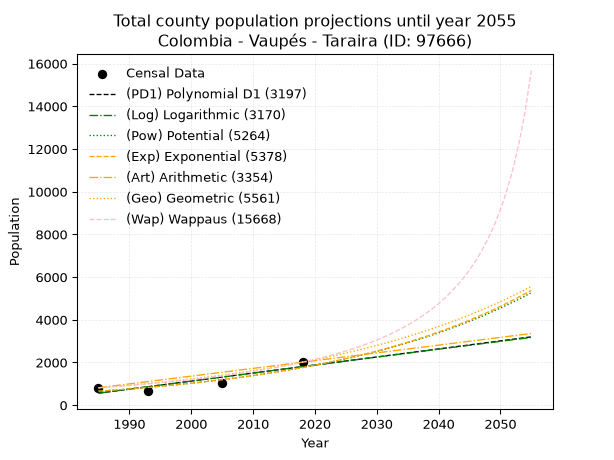
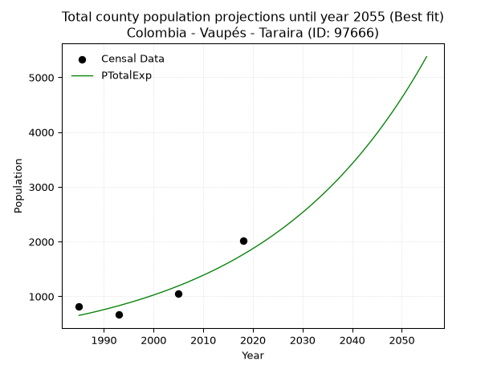
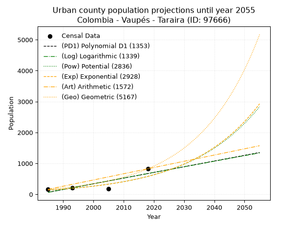
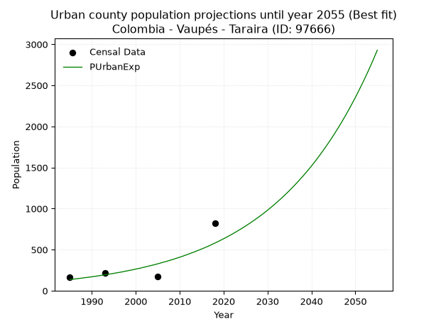
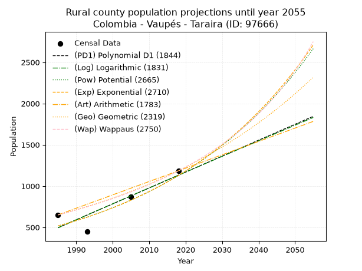
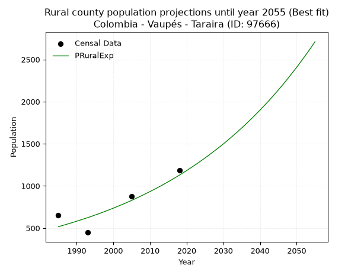

<div align="center">


</div>

# 📜 _“Population and Public Services Demand Projections (PPSD) until Year 2050 for Colombia - Vaupés - Taraira (ID: 97666)”_
Keywords: `population` `public-service` `projection` `lineal` `polynomial` `logarithmic` `potential` `exponential` `arithmetic` `geometric` `wappaus` `dane` `colombia` `south-america`

PPSD are analytical estimates used by governments and planners to anticipate future changes in population size, age distribution, and the resulting community needs for utilities, healthcare, education, and infrastructure as sizing future water treatment facilities, electrical grids, and road networks based on spatial growth.

<div align="center">

</img>

</div>


> **General running parameters**: • app_version: _v20260806_. • Python version: _3.14.7_. • Pandas version: _3.0.5_. • NumPy version: _2.5.1_. • Creates, save and include plots into reports (create_plot): _False_. • Projection until year: _2050_. • Process polynomial degree 2 and up: _False_. • Process Wappaus: _True_. • Process Wappaus: _True_. • Set negative values to zero: _True_. • Set infinite values to zero: _True_. • Drop dataset notes: _True_. 
<div align="center">

Dynamic map: [:earth_americas:Google](http://maps.google.com/maps?q=-0.564984,-69.635497) [:earth_americas:OSM](https://www.openstreetmap.org/#map=18/-0.564984/-69.635497&layers=P) [:earth_americas:Bing](https://www.bing.com/maps?cp=-0.564984~-69.635497&lvl=18) [:earth_americas:Apple](https://maps.apple.com/frame?center=-0.564984%2C-69.635497&span=0.003%2C0.006)

</div>


<div align="center">

```geojson
{
  "type": "Feature",
  "geometry": {
    "type": "Point", 
    "coordinates": [-69.635497, -0.564984]
  }, 
  "properties": {
    "Name": "Colombia - Vaupés - Taraira (ID: 97666)"
  }
}
```

</div>


## 0. Census Data (4 records)

Census data are official statistics collected by a government about the people and housing in a country. They usually include counts of total population, age, sex, race, income, education, and jobs.

📅Global census file: [Population.xlsx](../data/Population.xlsx)

| Source   |   Year |   CountryID | CountryName   |   StateID | StateName   |   CountyID | CountyName   |   PTotal |   PUrban |   PRural |
|:---------|-------:|------------:|:--------------|----------:|:------------|-----------:|:-------------|---------:|---------:|---------:|
| DANE     |   1985 |          57 | Colombia      |        97 | Vaupés      |      97666 | Taraira      |      811 |      161 |      650 |
| DANE     |   1993 |          57 | Colombia      |        97 | Vaupés      |      97666 | Taraira      |      664 |      217 |      447 |
| DANE     |   2005 |          57 | Colombia      |        97 | Vaupés      |      97666 | Taraira      |     1048 |      175 |      873 |
| DANE     |   2018 |          57 | Colombia      |        97 | Vaupés      |      97666 | Taraira      |     2010 |      826 |     1184 |

> 🔥Some records could had specific notes about the registered values or the corresponding urban or rural distribution.

📅[SUI-RUPS](https://www.datos.gov.co/Hacienda-y-Cr-dito-P-blico/Registro-nico-de-Prestadores-de-Servicios-P-blicos/4qkq-csdn/about_data) - Local public utility companies: [RUPS.csv](../data/RUPS.csv)

 | SERVICIO       | ESTADO    | NOMBRE               | NIT         | DEPARTAMENTO_DOMICILIO   | MUNICIPIO_DOMICILIO   | DIRECCION        |   TELEFONO | EMAIL                                        | TIPO_PRESTADOR                 | CLASIFICACION                 |
|:---------------|:----------|:---------------------|:------------|:-------------------------|:----------------------|:-----------------|-----------:|:---------------------------------------------|:-------------------------------|:------------------------------|
| ACUEDUCTO      | OPERATIVA | MUNICIPIO DE TARAIRA | 832000219-4 | VAUPES                   | TARAIRA               | Carrera 5 # 3-08 |    4575208 | secretariadeplaneacion@taraira-vaupes.gov.co | MUNICIPIO (PRESTACIÓN DIRECTA) | MENOR O IGUAL A 2500 USUARIOS |
| ALCANTARILLADO | OPERATIVA | MUNICIPIO DE TARAIRA | 832000219-4 | VAUPES                   | TARAIRA               | Carrera 5 # 3-08 |    4575208 | secretariadeplaneacion@taraira-vaupes.gov.co | MUNICIPIO (PRESTACIÓN DIRECTA) | MENOR O IGUAL A 2500 USUARIOS |

## 1. Total

### 1.1. Coefficients and Parameters

* (PD1) Polynomial Deg 1: 37.69369731031651, -74263.56804496062 (lineal)
* (Log) Logarithmic: 75361.80872519742, -571692.4620318597
* (Pow) Potential: 60.29293180361277, -196.0178537602819
* (Exp) Exponential: 0.030153269719651796, 6.601086406325078e-24
* (Art) Arithmetic: Year diff. 2018 - 1985 = 33, Population diff. 2010 - 811 = 1199, Annual growth = 36.333333333333336
* (Geo) Geometric: Year diff. 2018 - 1985 = 33, Population diff. 2010 - 811 = 1199, Annual growth % = 0.027885413508673684
* (Wap) Wappaus: i = 2.575918704950963, Condition values only valid for < 200)

<sub>
Wappaus condition values: ['0.00', '2.58', '5.15', '7.73', '10.30', '12.88', '15.46', '18.03', '20.61', '23.18', '25.76', '28.34', '30.91', '33.49', '36.06', '38.64', '41.21', '43.79', '46.37', '48.94', '51.52', '54.09', '56.67', '59.25', '61.82', '64.40', '66.97', '69.55', '72.13', '74.70', '77.28', '79.85', '82.43', '85.01', '87.58', '90.16', '92.73', '95.31', '97.88', '100.46', '103.04', '105.61', '108.19', '110.76', '113.34', '115.92', '118.49', '121.07', '123.64', '126.22', '128.80', '131.37', '133.95', '136.52', '139.10', '141.68', '144.25', '146.83', '149.40', '151.98', '154.56', '157.13', '159.71', '162.28', '164.86', '167.43']
</sub>


### 1.2. Projected Dataset

|   Year |   CountyID |   PTotalPD1 |   PTotalLog |   PTotalPow |   PTotalExp |   PTotalArt |   PTotalGeo |   PTotalWap |
|-------:|-----------:|------------:|------------:|------------:|------------:|------------:|------------:|------------:|
|   1985 |      97666 |         558 |         558 |         651 |         652 |         811 |         811 |         811 |
|   1986 |      97666 |         596 |         596 |         671 |         672 |         847 |         834 |         832 |
|   1987 |      97666 |         634 |         634 |         692 |         692 |         884 |         857 |         854 |
|   1988 |      97666 |         672 |         672 |         713 |         713 |         920 |         881 |         876 |
|   1989 |      97666 |         709 |         710 |         735 |         735 |         956 |         905 |         899 |
|   1990 |      97666 |         747 |         748 |         758 |         758 |         993 |         931 |         923 |
|   1991 |      97666 |         785 |         785 |         781 |         781 |        1029 |         957 |         947 |
|   1992 |      97666 |         822 |         823 |         805 |         805 |        1065 |         983 |         972 |
|   1993 |      97666 |         860 |         861 |         830 |         829 |        1102 |        1011 |         997 |
|   1994 |      97666 |         898 |         899 |         856 |         855 |        1138 |        1039 |        1024 |
|   1995 |      97666 |         935 |         937 |         882 |         881 |        1174 |        1068 |        1051 |
|   1996 |      97666 |         973 |         974 |         909 |         908 |        1211 |        1098 |        1079 |
|   1997 |      97666 |        1011 |        1012 |         937 |         936 |        1247 |        1128 |        1108 |
|   1998 |      97666 |        1048 |        1050 |         965 |         964 |        1283 |        1160 |        1137 |
|   1999 |      97666 |        1086 |        1088 |         995 |         994 |        1320 |        1192 |        1168 |
|   2000 |      97666 |        1124 |        1125 |        1025 |        1024 |        1356 |        1225 |        1199 |
|   2001 |      97666 |        1162 |        1163 |        1057 |        1056 |        1392 |        1259 |        1232 |
|   2002 |      97666 |        1199 |        1201 |        1089 |        1088 |        1429 |        1294 |        1266 |
|   2003 |      97666 |        1237 |        1238 |        1122 |        1121 |        1465 |        1331 |        1301 |
|   2004 |      97666 |        1275 |        1276 |        1157 |        1156 |        1501 |        1368 |        1337 |
|   2005 |      97666 |        1312 |        1313 |        1192 |        1191 |        1538 |        1406 |        1374 |
|   2006 |      97666 |        1350 |        1351 |        1228 |        1227 |        1574 |        1445 |        1412 |
|   2007 |      97666 |        1388 |        1389 |        1266 |        1265 |        1610 |        1485 |        1452 |
|   2008 |      97666 |        1425 |        1426 |        1305 |        1304 |        1647 |        1527 |        1494 |
|   2009 |      97666 |        1463 |        1464 |        1344 |        1344 |        1683 |        1569 |        1537 |
|   2010 |      97666 |        1501 |        1501 |        1385 |        1385 |        1719 |        1613 |        1581 |
|   2011 |      97666 |        1538 |        1539 |        1427 |        1427 |        1756 |        1658 |        1628 |
|   2012 |      97666 |        1576 |        1576 |        1471 |        1471 |        1792 |        1704 |        1676 |
|   2013 |      97666 |        1614 |        1614 |        1516 |        1516 |        1828 |        1752 |        1726 |
|   2014 |      97666 |        1652 |        1651 |        1562 |        1562 |        1865 |        1801 |        1778 |
|   2015 |      97666 |        1689 |        1688 |        1609 |        1610 |        1901 |        1851 |        1832 |
|   2016 |      97666 |        1727 |        1726 |        1658 |        1659 |        1937 |        1902 |        1889 |
|   2017 |      97666 |        1765 |        1763 |        1708 |        1710 |        1974 |        1955 |        1948 |
|   2018 |      97666 |        1802 |        1801 |        1760 |        1763 |        2010 |        2010 |        2010 |
|   2019 |      97666 |        1840 |        1838 |        1813 |        1816 |        2046 |        2066 |        2075 |
|   2020 |      97666 |        1878 |        1875 |        1868 |        1872 |        2083 |        2124 |        2142 |
|   2021 |      97666 |        1915 |        1912 |        1925 |        1929 |        2119 |        2183 |        2213 |
|   2022 |      97666 |        1953 |        1950 |        1983 |        1988 |        2155 |        2244 |        2288 |
|   2023 |      97666 |        1991 |        1987 |        2043 |        2049 |        2192 |        2306 |        2366 |
|   2024 |      97666 |        2028 |        2024 |        2105 |        2112 |        2228 |        2371 |        2448 |
|   2025 |      97666 |        2066 |        2061 |        2169 |        2177 |        2264 |        2437 |        2535 |
|   2026 |      97666 |        2104 |        2099 |        2234 |        2243 |        2301 |        2505 |        2626 |
|   2027 |      97666 |        2142 |        2136 |        2302 |        2312 |        2337 |        2575 |        2722 |
|   2028 |      97666 |        2179 |        2173 |        2371 |        2383 |        2373 |        2646 |        2824 |
|   2029 |      97666 |        2217 |        2210 |        2443 |        2456 |        2410 |        2720 |        2932 |
|   2030 |      97666 |        2255 |        2247 |        2516 |        2531 |        2446 |        2796 |        3047 |
|   2031 |      97666 |        2292 |        2284 |        2592 |        2608 |        2482 |        2874 |        3169 |
|   2032 |      97666 |        2330 |        2322 |        2670 |        2688 |        2519 |        2954 |        3299 |
|   2033 |      97666 |        2368 |        2359 |        2751 |        2771 |        2555 |        3036 |        3438 |
|   2034 |      97666 |        2405 |        2396 |        2834 |        2855 |        2591 |        3121 |        3586 |
|   2035 |      97666 |        2443 |        2433 |        2919 |        2943 |        2628 |        3208 |        3745 |
|   2036 |      97666 |        2481 |        2470 |        3006 |        3033 |        2664 |        3298 |        3916 |
|   2037 |      97666 |        2518 |        2507 |        3097 |        3126 |        2700 |        3390 |        4100 |
|   2038 |      97666 |        2556 |        2544 |        3190 |        3221 |        2737 |        3484 |        4300 |
|   2039 |      97666 |        2594 |        2581 |        3286 |        3320 |        2773 |        3581 |        4516 |
|   2040 |      97666 |        2632 |        2618 |        3384 |        3422 |        2809 |        3681 |        4751 |
|   2041 |      97666 |        2669 |        2655 |        3486 |        3526 |        2846 |        3784 |        5008 |
|   2042 |      97666 |        2707 |        2692 |        3590 |        3634 |        2882 |        3889 |        5290 |
|   2043 |      97666 |        2745 |        2728 |        3698 |        3746 |        2918 |        3998 |        5600 |
|   2044 |      97666 |        2782 |        2765 |        3808 |        3860 |        2955 |        4109 |        5944 |
|   2045 |      97666 |        2820 |        2802 |        3922 |        3978 |        2991 |        4224 |        6327 |
|   2046 |      97666 |        2858 |        2839 |        4040 |        4100 |        3027 |        4342 |        6756 |
|   2047 |      97666 |        2895 |        2876 |        4161 |        4226 |        3064 |        4463 |        7240 |
|   2048 |      97666 |        2933 |        2913 |        4285 |        4355 |        3100 |        4587 |        7790 |
|   2049 |      97666 |        2971 |        2949 |        4413 |        4488 |        3136 |        4715 |        8420 |
|   2050 |      97666 |        3009 |        2986 |        4545 |        4626 |        3173 |        4846 |        9151 |
<div align="center">

</img>

</div>


### 1.3. Best fit with absolute and relative error (%)

Relative error puts that difference into context by dividing the absolute error by the true value, creating a unitless ratio or percentage that shows the scale of the mistake.

Absolute and relative error

|   Year | Source   |   CountryID | CountryName   |   StateID | StateName   |   CountyID_x | CountyName   |   PTotal |   PUrban |   PRural |   CountyID_y |   PTotalPD1 |   PTotalLog |   PTotalPow |   PTotalExp |   PTotalArt |   PTotalGeo |   PTotalWap |   PTotalPD1AbsError |   PTotalLogAbsError |   PTotalPowAbsError |   PTotalExpAbsError |   PTotalArtAbsError |   PTotalGeoAbsError |   PTotalWapAbsError |   PTotalPD1RelError |   PTotalLogRelError |   PTotalPowRelError |   PTotalExpRelError |   PTotalArtRelError |   PTotalGeoRelError |   PTotalWapRelError |
|-------:|:---------|------------:|:--------------|----------:|:------------|-------------:|:-------------|---------:|---------:|---------:|-------------:|------------:|------------:|------------:|------------:|------------:|------------:|------------:|--------------------:|--------------------:|--------------------:|--------------------:|--------------------:|--------------------:|--------------------:|--------------------:|--------------------:|--------------------:|--------------------:|--------------------:|--------------------:|--------------------:|
|   1985 | DANE     |          57 | Colombia      |        97 | Vaupés      |        97666 | Taraira      |      811 |      161 |      650 |        97666 |         558 |         558 |         651 |         652 |         811 |         811 |         811 |                 253 |                 253 |                 160 |                 159 |                   0 |                   0 |                   0 |             31.1961 |             31.1961 |             19.7287 |             19.6054 |              0      |              0      |              0      |
|   1993 | DANE     |          57 | Colombia      |        97 | Vaupés      |        97666 | Taraira      |      664 |      217 |      447 |        97666 |         860 |         861 |         830 |         829 |        1102 |        1011 |         997 |                 196 |                 197 |                 166 |                 165 |                 438 |                 347 |                 333 |             29.5181 |             29.6687 |             25      |             24.8494 |             65.9639 |             52.259  |             50.1506 |
|   2005 | DANE     |          57 | Colombia      |        97 | Vaupés      |        97666 | Taraira      |     1048 |      175 |      873 |        97666 |        1312 |        1313 |        1192 |        1191 |        1538 |        1406 |        1374 |                 264 |                 265 |                 144 |                 143 |                 490 |                 358 |                 326 |             25.1908 |             25.2863 |             13.7405 |             13.645  |             46.7557 |             34.1603 |             31.1069 |
|   2018 | DANE     |          57 | Colombia      |        97 | Vaupés      |        97666 | Taraira      |     2010 |      826 |     1184 |        97666 |        1802 |        1801 |        1760 |        1763 |        2010 |        2010 |        2010 |                 208 |                 209 |                 250 |                 247 |                   0 |                   0 |                   0 |             10.3483 |             10.398  |             12.4378 |             12.2886 |              0      |              0      |              0      |

Relative error mean

| Method    |   RelError | Best   |
|:----------|-----------:|:-------|
| PTotalPD1 |    24.0633 |        |
| PTotalLog |    24.1372 |        |
| PTotalPow |    17.7267 |        |
| PTotalExp |    17.5971 | True   |
| PTotalArt |    28.1799 |        |
| PTotalGeo |    21.6048 |        |
| PTotalWap |    20.3144 |        |

💙Best method: _**PTotalExp**_
<div align="center">

</img>

</div>


### 1.4. Fresh water supply demand in liters per capita per day (lpcd)

The fresh water supply demand typically ranges from 100 to 300 liters per capita per day (lpcd) for standard domestic and municipal planning, though absolute survival minimums set by the World Health Organization are as low as 7.5 to 20 liters per day, and total consumption in high-income nations can exceed 400 liters.

> `CZ`: Level in meters above the sea level (masl)<br> `WS`: Fresh water supply demand in liters per capita per day (lpcd or l/h/d)<br> `WSAll`: Zonal fresh water supply demand in liters per second (l/s)<br> `A`: Zonal area in square meters<br> `DP`: Population density (people/hectare or p/ha)

Reference values (RAS Colombia)

|    CZ |   WS |
|------:|-----:|
|  1000 |  120 |
|  2000 |  130 |
| 99999 |  140 |

County shapefile geometry properties and water supply values

|   CountyID |     ATotal |   CZTotal |   WSTotal |
|-----------:|-----------:|----------:|----------:|
|      97666 | 6.4945e+09 |   127.527 |       120 |

Projected values for best method: PTotalExp

|   CountyID |   Year |   PTotalExp |   DPTotal |   WSTotal |   WSTotalAll |
|-----------:|-------:|------------:|----------:|----------:|-------------:|
|      97666 |   1985 |         652 |      0    |       120 |     0.905556 |
|      97666 |   1986 |         672 |      0    |       120 |     0.933333 |
|      97666 |   1987 |         692 |      0    |       120 |     0.961111 |
|      97666 |   1988 |         713 |      0    |       120 |     0.990278 |
|      97666 |   1989 |         735 |      0    |       120 |     1.02083  |
|      97666 |   1990 |         758 |      0    |       120 |     1.05278  |
|      97666 |   1991 |         781 |      0    |       120 |     1.08472  |
|      97666 |   1992 |         805 |      0    |       120 |     1.11806  |
|      97666 |   1993 |         829 |      0    |       120 |     1.15139  |
|      97666 |   1994 |         855 |      0    |       120 |     1.1875   |
|      97666 |   1995 |         881 |      0    |       120 |     1.22361  |
|      97666 |   1996 |         908 |      0    |       120 |     1.26111  |
|      97666 |   1997 |         936 |      0    |       120 |     1.3      |
|      97666 |   1998 |         964 |      0    |       120 |     1.33889  |
|      97666 |   1999 |         994 |      0    |       120 |     1.38056  |
|      97666 |   2000 |        1024 |      0    |       120 |     1.42222  |
|      97666 |   2001 |        1056 |      0    |       120 |     1.46667  |
|      97666 |   2002 |        1088 |      0    |       120 |     1.51111  |
|      97666 |   2003 |        1121 |      0    |       120 |     1.55694  |
|      97666 |   2004 |        1156 |      0    |       120 |     1.60556  |
|      97666 |   2005 |        1191 |      0    |       120 |     1.65417  |
|      97666 |   2006 |        1227 |      0    |       120 |     1.70417  |
|      97666 |   2007 |        1265 |      0    |       120 |     1.75694  |
|      97666 |   2008 |        1304 |      0    |       120 |     1.81111  |
|      97666 |   2009 |        1344 |      0    |       120 |     1.86667  |
|      97666 |   2010 |        1385 |      0    |       120 |     1.92361  |
|      97666 |   2011 |        1427 |      0    |       120 |     1.98194  |
|      97666 |   2012 |        1471 |      0    |       120 |     2.04306  |
|      97666 |   2013 |        1516 |      0    |       120 |     2.10556  |
|      97666 |   2014 |        1562 |      0    |       120 |     2.16944  |
|      97666 |   2015 |        1610 |      0    |       120 |     2.23611  |
|      97666 |   2016 |        1659 |      0    |       120 |     2.30417  |
|      97666 |   2017 |        1710 |      0    |       120 |     2.375    |
|      97666 |   2018 |        1763 |      0    |       120 |     2.44861  |
|      97666 |   2019 |        1816 |      0    |       120 |     2.52222  |
|      97666 |   2020 |        1872 |      0    |       120 |     2.6      |
|      97666 |   2021 |        1929 |      0    |       120 |     2.67917  |
|      97666 |   2022 |        1988 |      0    |       120 |     2.76111  |
|      97666 |   2023 |        2049 |      0    |       120 |     2.84583  |
|      97666 |   2024 |        2112 |      0    |       120 |     2.93333  |
|      97666 |   2025 |        2177 |      0    |       120 |     3.02361  |
|      97666 |   2026 |        2243 |      0    |       120 |     3.11528  |
|      97666 |   2027 |        2312 |      0    |       120 |     3.21111  |
|      97666 |   2028 |        2383 |      0    |       120 |     3.30972  |
|      97666 |   2029 |        2456 |      0    |       120 |     3.41111  |
|      97666 |   2030 |        2531 |      0    |       120 |     3.51528  |
|      97666 |   2031 |        2608 |      0    |       120 |     3.62222  |
|      97666 |   2032 |        2688 |      0    |       120 |     3.73333  |
|      97666 |   2033 |        2771 |      0    |       120 |     3.84861  |
|      97666 |   2034 |        2855 |      0    |       120 |     3.96528  |
|      97666 |   2035 |        2943 |      0    |       120 |     4.0875   |
|      97666 |   2036 |        3033 |      0    |       120 |     4.2125   |
|      97666 |   2037 |        3126 |      0    |       120 |     4.34167  |
|      97666 |   2038 |        3221 |      0    |       120 |     4.47361  |
|      97666 |   2039 |        3320 |      0.01 |       120 |     4.61111  |
|      97666 |   2040 |        3422 |      0.01 |       120 |     4.75278  |
|      97666 |   2041 |        3526 |      0.01 |       120 |     4.89722  |
|      97666 |   2042 |        3634 |      0.01 |       120 |     5.04722  |
|      97666 |   2043 |        3746 |      0.01 |       120 |     5.20278  |
|      97666 |   2044 |        3860 |      0.01 |       120 |     5.36111  |
|      97666 |   2045 |        3978 |      0.01 |       120 |     5.525    |
|      97666 |   2046 |        4100 |      0.01 |       120 |     5.69444  |
|      97666 |   2047 |        4226 |      0.01 |       120 |     5.86944  |
|      97666 |   2048 |        4355 |      0.01 |       120 |     6.04861  |
|      97666 |   2049 |        4488 |      0.01 |       120 |     6.23333  |
|      97666 |   2050 |        4626 |      0.01 |       120 |     6.425    |

## 2. Urban

### 2.1. Coefficients and Parameters

* (PD1) Polynomial Deg 1: 18.40907266158129, -36477.99759132797 (lineal)
* (Log) Logarithmic: 36795.267695337316, -279336.37461102917
* (Pow) Potential: 87.49408612063024, -286.3987876611024
* (Exp) Exponential: 0.04376815451939304, 2.5382703559908894e-36
* (Art) Arithmetic: Year diff. 2018 - 1985 = 33, Population diff. 826 - 161 = 665, Annual growth = 20.151515151515152
* (Geo) Geometric: Year diff. 2018 - 1985 = 33, Population diff. 826 - 161 = 665, Annual growth % = 0.05079941751215067
* (Wap) Wappaus: i = 4.083387062110466, Condition values only valid for < 200)

<sub>
Wappaus condition values: ['0.00', '4.08', '8.17', '12.25', '16.33', '20.42', '24.50', '28.58', '32.67', '36.75', '40.83', '44.92', '49.00', '53.08', '57.17', '61.25', '65.33', '69.42', '73.50', '77.58', '81.67', '85.75', '89.83', '93.92', '98.00', '102.08', '106.17', '110.25', '114.33', '118.42', '122.50', '126.58', '130.67', '134.75', '138.84', '142.92', '147.00', '151.09', '155.17', '159.25', '163.34', '167.42', '171.50', '175.59', '179.67', '183.75', '187.84', '191.92', '196.00', '200.09', '204.17', '208.25', '212.34', '216.42', '220.50', '224.59', '228.67', '232.75', '236.84', '240.92', '245.00', '249.09', '253.17', '257.25', '261.34', '265.42']
</sub>


### 2.2. Projected Dataset

|   Year |   CountyID |   PUrbanPD1 |   PUrbanLog |   PUrbanPow |   PUrbanExp |   PUrbanArt |   PUrbanGeo |
|-------:|-----------:|------------:|------------:|------------:|------------:|------------:|------------:|
|   1985 |      97666 |          64 |          64 |         137 |         137 |         161 |         161 |
|   1986 |      97666 |          82 |          82 |         143 |         143 |         181 |         169 |
|   1987 |      97666 |         101 |         101 |         149 |         149 |         201 |         178 |
|   1988 |      97666 |         119 |         119 |         156 |         156 |         221 |         187 |
|   1989 |      97666 |         138 |         138 |         163 |         163 |         242 |         196 |
|   1990 |      97666 |         156 |         156 |         170 |         170 |         262 |         206 |
|   1991 |      97666 |         174 |         175 |         178 |         178 |         282 |         217 |
|   1992 |      97666 |         193 |         193 |         186 |         186 |         302 |         228 |
|   1993 |      97666 |         211 |         212 |         194 |         194 |         322 |         239 |
|   1994 |      97666 |         230 |         230 |         203 |         203 |         342 |         251 |
|   1995 |      97666 |         248 |         249 |         212 |         212 |         363 |         264 |
|   1996 |      97666 |         267 |         267 |         222 |         221 |         383 |         278 |
|   1997 |      97666 |         285 |         286 |         232 |         231 |         403 |         292 |
|   1998 |      97666 |         303 |         304 |         242 |         242 |         423 |         307 |
|   1999 |      97666 |         322 |         322 |         253 |         252 |         443 |         322 |
|   2000 |      97666 |         340 |         341 |         264 |         264 |         463 |         339 |
|   2001 |      97666 |         359 |         359 |         276 |         275 |         483 |         356 |
|   2002 |      97666 |         377 |         378 |         288 |         288 |         504 |         374 |
|   2003 |      97666 |         395 |         396 |         301 |         301 |         524 |         393 |
|   2004 |      97666 |         414 |         414 |         315 |         314 |         544 |         413 |
|   2005 |      97666 |         432 |         433 |         329 |         328 |         564 |         434 |
|   2006 |      97666 |         451 |         451 |         343 |         343 |         584 |         456 |
|   2007 |      97666 |         469 |         469 |         359 |         358 |         604 |         479 |
|   2008 |      97666 |         487 |         488 |         375 |         374 |         624 |         503 |
|   2009 |      97666 |         506 |         506 |         391 |         391 |         645 |         529 |
|   2010 |      97666 |         524 |         524 |         409 |         408 |         665 |         556 |
|   2011 |      97666 |         543 |         543 |         427 |         427 |         685 |         584 |
|   2012 |      97666 |         561 |         561 |         446 |         446 |         705 |         614 |
|   2013 |      97666 |         579 |         579 |         466 |         466 |         725 |         645 |
|   2014 |      97666 |         598 |         598 |         486 |         487 |         745 |         677 |
|   2015 |      97666 |         616 |         616 |         508 |         508 |         766 |         712 |
|   2016 |      97666 |         635 |         634 |         530 |         531 |         786 |         748 |
|   2017 |      97666 |         653 |         652 |         554 |         555 |         806 |         786 |
|   2018 |      97666 |         672 |         671 |         578 |         580 |         826 |         826 |
|   2019 |      97666 |         690 |         689 |         604 |         606 |         846 |         868 |
|   2020 |      97666 |         708 |         707 |         631 |         633 |         866 |         912 |
|   2021 |      97666 |         727 |         725 |         659 |         661 |         886 |         958 |
|   2022 |      97666 |         745 |         743 |         688 |         691 |         907 |        1007 |
|   2023 |      97666 |         764 |         762 |         718 |         722 |         927 |        1058 |
|   2024 |      97666 |         782 |         780 |         750 |         754 |         947 |        1112 |
|   2025 |      97666 |         800 |         798 |         783 |         788 |         967 |        1168 |
|   2026 |      97666 |         819 |         816 |         818 |         823 |         987 |        1228 |
|   2027 |      97666 |         837 |         834 |         854 |         860 |        1007 |        1290 |
|   2028 |      97666 |         856 |         852 |         891 |         898 |        1028 |        1356 |
|   2029 |      97666 |         874 |         871 |         931 |         938 |        1048 |        1425 |
|   2030 |      97666 |         892 |         889 |         972 |         980 |        1068 |        1497 |
|   2031 |      97666 |         911 |         907 |        1015 |        1024 |        1088 |        1573 |
|   2032 |      97666 |         929 |         925 |        1059 |        1070 |        1108 |        1653 |
|   2033 |      97666 |         948 |         943 |        1106 |        1118 |        1128 |        1737 |
|   2034 |      97666 |         966 |         961 |        1154 |        1168 |        1148 |        1825 |
|   2035 |      97666 |         984 |         979 |        1205 |        1220 |        1169 |        1918 |
|   2036 |      97666 |        1003 |         997 |        1258 |        1275 |        1189 |        2015 |
|   2037 |      97666 |        1021 |        1015 |        1313 |        1332 |        1209 |        2118 |
|   2038 |      97666 |        1040 |        1033 |        1371 |        1391 |        1229 |        2225 |
|   2039 |      97666 |        1058 |        1051 |        1431 |        1453 |        1249 |        2338 |
|   2040 |      97666 |        1077 |        1070 |        1494 |        1518 |        1269 |        2457 |
|   2041 |      97666 |        1095 |        1088 |        1559 |        1586 |        1289 |        2582 |
|   2042 |      97666 |        1113 |        1106 |        1627 |        1657 |        1310 |        2713 |
|   2043 |      97666 |        1132 |        1124 |        1699 |        1732 |        1330 |        2851 |
|   2044 |      97666 |        1150 |        1142 |        1773 |        1809 |        1350 |        2996 |
|   2045 |      97666 |        1169 |        1160 |        1851 |        1890 |        1370 |        3148 |
|   2046 |      97666 |        1187 |        1178 |        1931 |        1974 |        1390 |        3308 |
|   2047 |      97666 |        1205 |        1196 |        2016 |        2063 |        1410 |        3476 |
|   2048 |      97666 |        1224 |        1214 |        2104 |        2155 |        1431 |        3652 |
|   2049 |      97666 |        1242 |        1231 |        2196 |        2252 |        1451 |        3838 |
|   2050 |      97666 |        1261 |        1249 |        2291 |        2352 |        1471 |        4033 |
<div align="center">

</img>

</div>


### 2.3. Best fit with absolute and relative error (%)

Relative error puts that difference into context by dividing the absolute error by the true value, creating a unitless ratio or percentage that shows the scale of the mistake.

Absolute and relative error

|   Year | Source   |   CountryID | CountryName   |   StateID | StateName   |   CountyID_x | CountyName   |   PTotal |   PUrban |   PRural |   CountyID_y |   PUrbanPD1 |   PUrbanLog |   PUrbanPow |   PUrbanExp |   PUrbanArt |   PUrbanGeo |   PUrbanPD1AbsError |   PUrbanLogAbsError |   PUrbanPowAbsError |   PUrbanExpAbsError |   PUrbanArtAbsError |   PUrbanGeoAbsError |   PUrbanPD1RelError |   PUrbanLogRelError |   PUrbanPowRelError |   PUrbanExpRelError |   PUrbanArtRelError |   PUrbanGeoRelError |
|-------:|:---------|------------:|:--------------|----------:|:------------|-------------:|:-------------|---------:|---------:|---------:|-------------:|------------:|------------:|------------:|------------:|------------:|------------:|--------------------:|--------------------:|--------------------:|--------------------:|--------------------:|--------------------:|--------------------:|--------------------:|--------------------:|--------------------:|--------------------:|--------------------:|
|   1985 | DANE     |          57 | Colombia      |        97 | Vaupés      |        97666 | Taraira      |      811 |      161 |      650 |        97666 |          64 |          64 |         137 |         137 |         161 |         161 |                  97 |                  97 |                  24 |                  24 |                   0 |                   0 |            60.2484  |            60.2484  |             14.9068 |             14.9068 |              0      |              0      |
|   1993 | DANE     |          57 | Colombia      |        97 | Vaupés      |        97666 | Taraira      |      664 |      217 |      447 |        97666 |         211 |         212 |         194 |         194 |         322 |         239 |                   6 |                   5 |                  23 |                  23 |                 105 |                  22 |             2.76498 |             2.30415 |             10.5991 |             10.5991 |             48.3871 |             10.1382 |
|   2005 | DANE     |          57 | Colombia      |        97 | Vaupés      |        97666 | Taraira      |     1048 |      175 |      873 |        97666 |         432 |         433 |         329 |         328 |         564 |         434 |                 257 |                 258 |                 154 |                 153 |                 389 |                 259 |           146.857   |           147.429   |             88      |             87.4286 |            222.286  |            148      |
|   2018 | DANE     |          57 | Colombia      |        97 | Vaupés      |        97666 | Taraira      |     2010 |      826 |     1184 |        97666 |         672 |         671 |         578 |         580 |         826 |         826 |                 154 |                 155 |                 248 |                 246 |                   0 |                   0 |            18.6441  |            18.7651  |             30.0242 |             29.7821 |              0      |              0      |

Relative error mean

| Method    |   RelError | Best   |
|:----------|-----------:|:-------|
| PUrbanPD1 |    57.1287 |        |
| PUrbanLog |    57.1866 |        |
| PUrbanPow |    35.8825 |        |
| PUrbanExp |    35.6791 | True   |
| PUrbanArt |    67.6682 |        |
| PUrbanGeo |    39.5346 |        |

💙Best method: _**PUrbanExp**_
<div align="center">

</img>

</div>


### 2.4. Fresh water supply demand in liters per capita per day (lpcd)

The fresh water supply demand typically ranges from 100 to 300 liters per capita per day (lpcd) for standard domestic and municipal planning, though absolute survival minimums set by the World Health Organization are as low as 7.5 to 20 liters per day, and total consumption in high-income nations can exceed 400 liters.

> `CZ`: Level in meters above the sea level (masl)<br> `WS`: Fresh water supply demand in liters per capita per day (lpcd or l/h/d)<br> `WSAll`: Zonal fresh water supply demand in liters per second (l/s)<br> `A`: Zonal area in square meters<br> `DP`: Population density (people/hectare or p/ha)

Reference values (RAS Colombia)

|    CZ |   WS |
|------:|-----:|
|  1000 |  120 |
|  2000 |  130 |
| 99999 |  140 |

County shapefile geometry properties and water supply values

|   CountyID |   AUrban |   CZUrban |   WSUrban |
|-----------:|---------:|----------:|----------:|
|      97666 |   402455 |   121.129 |       120 |

Projected values for best method: PUrbanExp

|   CountyID |   Year |   PUrbanExp |   DPUrban |   WSUrban |   WSUrbanAll |
|-----------:|-------:|------------:|----------:|----------:|-------------:|
|      97666 |   1985 |         137 |      3.4  |       120 |     0.190278 |
|      97666 |   1986 |         143 |      3.55 |       120 |     0.198611 |
|      97666 |   1987 |         149 |      3.7  |       120 |     0.206944 |
|      97666 |   1988 |         156 |      3.88 |       120 |     0.216667 |
|      97666 |   1989 |         163 |      4.05 |       120 |     0.226389 |
|      97666 |   1990 |         170 |      4.22 |       120 |     0.236111 |
|      97666 |   1991 |         178 |      4.42 |       120 |     0.247222 |
|      97666 |   1992 |         186 |      4.62 |       120 |     0.258333 |
|      97666 |   1993 |         194 |      4.82 |       120 |     0.269444 |
|      97666 |   1994 |         203 |      5.04 |       120 |     0.281944 |
|      97666 |   1995 |         212 |      5.27 |       120 |     0.294444 |
|      97666 |   1996 |         221 |      5.49 |       120 |     0.306944 |
|      97666 |   1997 |         231 |      5.74 |       120 |     0.320833 |
|      97666 |   1998 |         242 |      6.01 |       120 |     0.336111 |
|      97666 |   1999 |         252 |      6.26 |       120 |     0.35     |
|      97666 |   2000 |         264 |      6.56 |       120 |     0.366667 |
|      97666 |   2001 |         275 |      6.83 |       120 |     0.381944 |
|      97666 |   2002 |         288 |      7.16 |       120 |     0.4      |
|      97666 |   2003 |         301 |      7.48 |       120 |     0.418056 |
|      97666 |   2004 |         314 |      7.8  |       120 |     0.436111 |
|      97666 |   2005 |         328 |      8.15 |       120 |     0.455556 |
|      97666 |   2006 |         343 |      8.52 |       120 |     0.476389 |
|      97666 |   2007 |         358 |      8.9  |       120 |     0.497222 |
|      97666 |   2008 |         374 |      9.29 |       120 |     0.519444 |
|      97666 |   2009 |         391 |      9.72 |       120 |     0.543056 |
|      97666 |   2010 |         408 |     10.14 |       120 |     0.566667 |
|      97666 |   2011 |         427 |     10.61 |       120 |     0.593056 |
|      97666 |   2012 |         446 |     11.08 |       120 |     0.619444 |
|      97666 |   2013 |         466 |     11.58 |       120 |     0.647222 |
|      97666 |   2014 |         487 |     12.1  |       120 |     0.676389 |
|      97666 |   2015 |         508 |     12.62 |       120 |     0.705556 |
|      97666 |   2016 |         531 |     13.19 |       120 |     0.7375   |
|      97666 |   2017 |         555 |     13.79 |       120 |     0.770833 |
|      97666 |   2018 |         580 |     14.41 |       120 |     0.805556 |
|      97666 |   2019 |         606 |     15.06 |       120 |     0.841667 |
|      97666 |   2020 |         633 |     15.73 |       120 |     0.879167 |
|      97666 |   2021 |         661 |     16.42 |       120 |     0.918056 |
|      97666 |   2022 |         691 |     17.17 |       120 |     0.959722 |
|      97666 |   2023 |         722 |     17.94 |       120 |     1.00278  |
|      97666 |   2024 |         754 |     18.74 |       120 |     1.04722  |
|      97666 |   2025 |         788 |     19.58 |       120 |     1.09444  |
|      97666 |   2026 |         823 |     20.45 |       120 |     1.14306  |
|      97666 |   2027 |         860 |     21.37 |       120 |     1.19444  |
|      97666 |   2028 |         898 |     22.31 |       120 |     1.24722  |
|      97666 |   2029 |         938 |     23.31 |       120 |     1.30278  |
|      97666 |   2030 |         980 |     24.35 |       120 |     1.36111  |
|      97666 |   2031 |        1024 |     25.44 |       120 |     1.42222  |
|      97666 |   2032 |        1070 |     26.59 |       120 |     1.48611  |
|      97666 |   2033 |        1118 |     27.78 |       120 |     1.55278  |
|      97666 |   2034 |        1168 |     29.02 |       120 |     1.62222  |
|      97666 |   2035 |        1220 |     30.31 |       120 |     1.69444  |
|      97666 |   2036 |        1275 |     31.68 |       120 |     1.77083  |
|      97666 |   2037 |        1332 |     33.1  |       120 |     1.85     |
|      97666 |   2038 |        1391 |     34.56 |       120 |     1.93194  |
|      97666 |   2039 |        1453 |     36.1  |       120 |     2.01806  |
|      97666 |   2040 |        1518 |     37.72 |       120 |     2.10833  |
|      97666 |   2041 |        1586 |     39.41 |       120 |     2.20278  |
|      97666 |   2042 |        1657 |     41.17 |       120 |     2.30139  |
|      97666 |   2043 |        1732 |     43.04 |       120 |     2.40556  |
|      97666 |   2044 |        1809 |     44.95 |       120 |     2.5125   |
|      97666 |   2045 |        1890 |     46.96 |       120 |     2.625    |
|      97666 |   2046 |        1974 |     49.05 |       120 |     2.74167  |
|      97666 |   2047 |        2063 |     51.26 |       120 |     2.86528  |
|      97666 |   2048 |        2155 |     53.55 |       120 |     2.99306  |
|      97666 |   2049 |        2252 |     55.96 |       120 |     3.12778  |
|      97666 |   2050 |        2352 |     58.44 |       120 |     3.26667  |

## 3. Rural

### 3.1. Coefficients and Parameters

* (PD1) Polynomial Deg 1: 19.284624648735228, -37785.570453632645 (lineal)
* (Log) Logarithmic: 38566.541029860105, -292356.0874208306
* (Pow) Potential: 47.39814712038941, -153.59548147900355
* (Exp) Exponential: 0.023701197542114968, 1.9064471376032043e-18
* (Art) Arithmetic: Year diff. 2018 - 1985 = 33, Population diff. 1184 - 650 = 534, Annual growth = 16.181818181818183
* (Geo) Geometric: Year diff. 2018 - 1985 = 33, Population diff. 1184 - 650 = 534, Annual growth % = 0.01833828374218105
* (Wap) Wappaus: i = 1.7646475661742838, Condition values only valid for < 200)

<sub>
Wappaus condition values: ['0.00', '1.76', '3.53', '5.29', '7.06', '8.82', '10.59', '12.35', '14.12', '15.88', '17.65', '19.41', '21.18', '22.94', '24.71', '26.47', '28.23', '30.00', '31.76', '33.53', '35.29', '37.06', '38.82', '40.59', '42.35', '44.12', '45.88', '47.65', '49.41', '51.17', '52.94', '54.70', '56.47', '58.23', '60.00', '61.76', '63.53', '65.29', '67.06', '68.82', '70.59', '72.35', '74.12', '75.88', '77.64', '79.41', '81.17', '82.94', '84.70', '86.47', '88.23', '90.00', '91.76', '93.53', '95.29', '97.06', '98.82', '100.58', '102.35', '104.11', '105.88', '107.64', '109.41', '111.17', '112.94', '114.70']
</sub>


### 3.2. Projected Dataset

|   Year |   CountyID |   PRuralPD1 |   PRuralLog |   PRuralPow |   PRuralExp |   PRuralArt |   PRuralGeo |   PRuralWap |
|-------:|-----------:|------------:|------------:|------------:|------------:|------------:|------------:|------------:|
|   1985 |      97666 |         494 |         494 |         516 |         516 |         650 |         650 |         650 |
|   1986 |      97666 |         514 |         514 |         528 |         528 |         666 |         662 |         662 |
|   1987 |      97666 |         533 |         533 |         541 |         541 |         682 |         674 |         673 |
|   1988 |      97666 |         552 |         552 |         554 |         554 |         699 |         686 |         685 |
|   1989 |      97666 |         572 |         572 |         567 |         567 |         715 |         699 |         698 |
|   1990 |      97666 |         591 |         591 |         581 |         581 |         731 |         712 |         710 |
|   1991 |      97666 |         610 |         610 |         595 |         595 |         747 |         725 |         723 |
|   1992 |      97666 |         629 |         630 |         609 |         609 |         763 |         738 |         736 |
|   1993 |      97666 |         649 |         649 |         624 |         623 |         779 |         752 |         749 |
|   1994 |      97666 |         668 |         669 |         639 |         638 |         796 |         765 |         762 |
|   1995 |      97666 |         687 |         688 |         654 |         654 |         812 |         780 |         776 |
|   1996 |      97666 |         707 |         707 |         670 |         669 |         828 |         794 |         790 |
|   1997 |      97666 |         726 |         727 |         686 |         685 |         844 |         808 |         804 |
|   1998 |      97666 |         745 |         746 |         702 |         702 |         860 |         823 |         818 |
|   1999 |      97666 |         764 |         765 |         719 |         719 |         877 |         838 |         833 |
|   2000 |      97666 |         784 |         784 |         737 |         736 |         893 |         854 |         848 |
|   2001 |      97666 |         803 |         804 |         754 |         754 |         909 |         869 |         864 |
|   2002 |      97666 |         822 |         823 |         772 |         772 |         925 |         885 |         879 |
|   2003 |      97666 |         842 |         842 |         791 |         790 |         941 |         902 |         895 |
|   2004 |      97666 |         861 |         861 |         810 |         809 |         957 |         918 |         912 |
|   2005 |      97666 |         880 |         881 |         829 |         828 |         974 |         935 |         929 |
|   2006 |      97666 |         899 |         900 |         849 |         848 |         990 |         952 |         946 |
|   2007 |      97666 |         919 |         919 |         869 |         869 |        1006 |         969 |         963 |
|   2008 |      97666 |         938 |         938 |         890 |         890 |        1022 |         987 |         981 |
|   2009 |      97666 |         957 |         958 |         911 |         911 |        1038 |        1005 |         999 |
|   2010 |      97666 |         977 |         977 |         933 |         933 |        1055 |        1024 |        1018 |
|   2011 |      97666 |         996 |         996 |         955 |         955 |        1071 |        1043 |        1037 |
|   2012 |      97666 |        1015 |        1015 |         978 |         978 |        1087 |        1062 |        1057 |
|   2013 |      97666 |        1034 |        1034 |        1001 |        1001 |        1103 |        1081 |        1077 |
|   2014 |      97666 |        1054 |        1053 |        1025 |        1025 |        1119 |        1101 |        1097 |
|   2015 |      97666 |        1073 |        1073 |        1050 |        1050 |        1135 |        1121 |        1118 |
|   2016 |      97666 |        1092 |        1092 |        1075 |        1075 |        1152 |        1142 |        1139 |
|   2017 |      97666 |        1112 |        1111 |        1100 |        1101 |        1168 |        1163 |        1161 |
|   2018 |      97666 |        1131 |        1130 |        1126 |        1127 |        1184 |        1184 |        1184 |
|   2019 |      97666 |        1150 |        1149 |        1153 |        1155 |        1200 |        1206 |        1207 |
|   2020 |      97666 |        1169 |        1168 |        1180 |        1182 |        1216 |        1228 |        1231 |
|   2021 |      97666 |        1189 |        1187 |        1208 |        1211 |        1233 |        1250 |        1255 |
|   2022 |      97666 |        1208 |        1206 |        1237 |        1240 |        1249 |        1273 |        1280 |
|   2023 |      97666 |        1227 |        1225 |        1266 |        1269 |        1265 |        1297 |        1306 |
|   2024 |      97666 |        1247 |        1244 |        1296 |        1300 |        1281 |        1320 |        1332 |
|   2025 |      97666 |        1266 |        1264 |        1327 |        1331 |        1297 |        1345 |        1359 |
|   2026 |      97666 |        1285 |        1283 |        1359 |        1363 |        1313 |        1369 |        1387 |
|   2027 |      97666 |        1304 |        1302 |        1391 |        1396 |        1330 |        1394 |        1415 |
|   2028 |      97666 |        1324 |        1321 |        1424 |        1429 |        1346 |        1420 |        1445 |
|   2029 |      97666 |        1343 |        1340 |        1457 |        1463 |        1362 |        1446 |        1475 |
|   2030 |      97666 |        1362 |        1359 |        1492 |        1498 |        1378 |        1473 |        1506 |
|   2031 |      97666 |        1382 |        1378 |        1527 |        1534 |        1394 |        1500 |        1538 |
|   2032 |      97666 |        1401 |        1397 |        1563 |        1571 |        1411 |        1527 |        1571 |
|   2033 |      97666 |        1420 |        1416 |        1600 |        1609 |        1427 |        1555 |        1605 |
|   2034 |      97666 |        1439 |        1435 |        1638 |        1647 |        1443 |        1584 |        1640 |
|   2035 |      97666 |        1459 |        1454 |        1676 |        1687 |        1459 |        1613 |        1676 |
|   2036 |      97666 |        1478 |        1472 |        1716 |        1727 |        1475 |        1642 |        1714 |
|   2037 |      97666 |        1497 |        1491 |        1756 |        1769 |        1491 |        1672 |        1752 |
|   2038 |      97666 |        1516 |        1510 |        1797 |        1811 |        1508 |        1703 |        1792 |
|   2039 |      97666 |        1536 |        1529 |        1840 |        1855 |        1524 |        1734 |        1833 |
|   2040 |      97666 |        1555 |        1548 |        1883 |        1899 |        1540 |        1766 |        1876 |
|   2041 |      97666 |        1574 |        1567 |        1927 |        1945 |        1556 |        1798 |        1920 |
|   2042 |      97666 |        1594 |        1586 |        1973 |        1991 |        1572 |        1831 |        1965 |
|   2043 |      97666 |        1613 |        1605 |        2019 |        2039 |        1589 |        1865 |        2013 |
|   2044 |      97666 |        1632 |        1624 |        2066 |        2088 |        1605 |        1899 |        2062 |
|   2045 |      97666 |        1651 |        1643 |        2115 |        2138 |        1621 |        1934 |        2112 |
|   2046 |      97666 |        1671 |        1661 |        2164 |        2189 |        1637 |        1969 |        2165 |
|   2047 |      97666 |        1690 |        1680 |        2215 |        2242 |        1653 |        2005 |        2220 |
|   2048 |      97666 |        1709 |        1699 |        2267 |        2296 |        1669 |        2042 |        2277 |
|   2049 |      97666 |        1729 |        1718 |        2320 |        2351 |        1686 |        2080 |        2336 |
|   2050 |      97666 |        1748 |        1737 |        2374 |        2407 |        1702 |        2118 |        2398 |
<div align="center">

</img>

</div>


### 3.3. Best fit with absolute and relative error (%)

Relative error puts that difference into context by dividing the absolute error by the true value, creating a unitless ratio or percentage that shows the scale of the mistake.

Absolute and relative error

|   Year | Source   |   CountryID | CountryName   |   StateID | StateName   |   CountyID_x | CountyName   |   PTotal |   PUrban |   PRural |   CountyID_y |   PRuralPD1 |   PRuralLog |   PRuralPow |   PRuralExp |   PRuralArt |   PRuralGeo |   PRuralWap |   PRuralPD1AbsError |   PRuralLogAbsError |   PRuralPowAbsError |   PRuralExpAbsError |   PRuralArtAbsError |   PRuralGeoAbsError |   PRuralWapAbsError |   PRuralPD1RelError |   PRuralLogRelError |   PRuralPowRelError |   PRuralExpRelError |   PRuralArtRelError |   PRuralGeoRelError |   PRuralWapRelError |
|-------:|:---------|------------:|:--------------|----------:|:------------|-------------:|:-------------|---------:|---------:|---------:|-------------:|------------:|------------:|------------:|------------:|------------:|------------:|------------:|--------------------:|--------------------:|--------------------:|--------------------:|--------------------:|--------------------:|--------------------:|--------------------:|--------------------:|--------------------:|--------------------:|--------------------:|--------------------:|--------------------:|
|   1985 | DANE     |          57 | Colombia      |        97 | Vaupés      |        97666 | Taraira      |      811 |      161 |      650 |        97666 |         494 |         494 |         516 |         516 |         650 |         650 |         650 |                 156 |                 156 |                 134 |                 134 |                   0 |                   0 |                   0 |           24        |            24       |            20.6154  |            20.6154  |              0      |             0       |             0       |
|   1993 | DANE     |          57 | Colombia      |        97 | Vaupés      |        97666 | Taraira      |      664 |      217 |      447 |        97666 |         649 |         649 |         624 |         623 |         779 |         752 |         749 |                 202 |                 202 |                 177 |                 176 |                 332 |                 305 |                 302 |           45.1902   |            45.1902  |            39.5973  |            39.3736  |             74.2729 |            68.2327  |            67.5615  |
|   2005 | DANE     |          57 | Colombia      |        97 | Vaupés      |        97666 | Taraira      |     1048 |      175 |      873 |        97666 |         880 |         881 |         829 |         828 |         974 |         935 |         929 |                   7 |                   8 |                  44 |                  45 |                 101 |                  62 |                  56 |            0.801833 |             0.91638 |             5.04009 |             5.15464 |             11.5693 |             7.10195 |             6.41466 |
|   2018 | DANE     |          57 | Colombia      |        97 | Vaupés      |        97666 | Taraira      |     2010 |      826 |     1184 |        97666 |        1131 |        1130 |        1126 |        1127 |        1184 |        1184 |        1184 |                  53 |                  54 |                  58 |                  57 |                   0 |                   0 |                   0 |            4.47635  |             4.56081 |             4.89865 |             4.81419 |              0      |             0       |             0       |

Relative error mean

| Method    |   RelError | Best   |
|:----------|-----------:|:-------|
| PRuralPD1 |    18.6171 |        |
| PRuralLog |    18.6668 |        |
| PRuralPow |    17.5379 |        |
| PRuralExp |    17.4895 | True   |
| PRuralArt |    21.4606 |        |
| PRuralGeo |    18.8337 |        |
| PRuralWap |    18.494  |        |

💙Best method: _**PRuralExp**_
<div align="center">

</img>

</div>


### 3.4. Fresh water supply demand in liters per capita per day (lpcd)

The fresh water supply demand typically ranges from 100 to 300 liters per capita per day (lpcd) for standard domestic and municipal planning, though absolute survival minimums set by the World Health Organization are as low as 7.5 to 20 liters per day, and total consumption in high-income nations can exceed 400 liters.

> `CZ`: Level in meters above the sea level (masl)<br> `WS`: Fresh water supply demand in liters per capita per day (lpcd or l/h/d)<br> `WSAll`: Zonal fresh water supply demand in liters per second (l/s)<br> `A`: Zonal area in square meters<br> `DP`: Population density (people/hectare or p/ha)

Reference values (RAS Colombia)

|    CZ |   WS |
|------:|-----:|
|  1000 |  120 |
|  2000 |  130 |
| 99999 |  140 |

County shapefile geometry properties and water supply values

|   CountyID |      ARural |   CZRural |   WSRural |
|-----------:|------------:|----------:|----------:|
|      97666 | 6.49409e+09 |   127.527 |       120 |

Projected values for best method: PRuralExp

|   CountyID |   Year |   PRuralExp |   DPRural |   WSRural |   WSRuralAll |
|-----------:|-------:|------------:|----------:|----------:|-------------:|
|      97666 |   1985 |         516 |         0 |       120 |     0.716667 |
|      97666 |   1986 |         528 |         0 |       120 |     0.733333 |
|      97666 |   1987 |         541 |         0 |       120 |     0.751389 |
|      97666 |   1988 |         554 |         0 |       120 |     0.769444 |
|      97666 |   1989 |         567 |         0 |       120 |     0.7875   |
|      97666 |   1990 |         581 |         0 |       120 |     0.806944 |
|      97666 |   1991 |         595 |         0 |       120 |     0.826389 |
|      97666 |   1992 |         609 |         0 |       120 |     0.845833 |
|      97666 |   1993 |         623 |         0 |       120 |     0.865278 |
|      97666 |   1994 |         638 |         0 |       120 |     0.886111 |
|      97666 |   1995 |         654 |         0 |       120 |     0.908333 |
|      97666 |   1996 |         669 |         0 |       120 |     0.929167 |
|      97666 |   1997 |         685 |         0 |       120 |     0.951389 |
|      97666 |   1998 |         702 |         0 |       120 |     0.975    |
|      97666 |   1999 |         719 |         0 |       120 |     0.998611 |
|      97666 |   2000 |         736 |         0 |       120 |     1.02222  |
|      97666 |   2001 |         754 |         0 |       120 |     1.04722  |
|      97666 |   2002 |         772 |         0 |       120 |     1.07222  |
|      97666 |   2003 |         790 |         0 |       120 |     1.09722  |
|      97666 |   2004 |         809 |         0 |       120 |     1.12361  |
|      97666 |   2005 |         828 |         0 |       120 |     1.15     |
|      97666 |   2006 |         848 |         0 |       120 |     1.17778  |
|      97666 |   2007 |         869 |         0 |       120 |     1.20694  |
|      97666 |   2008 |         890 |         0 |       120 |     1.23611  |
|      97666 |   2009 |         911 |         0 |       120 |     1.26528  |
|      97666 |   2010 |         933 |         0 |       120 |     1.29583  |
|      97666 |   2011 |         955 |         0 |       120 |     1.32639  |
|      97666 |   2012 |         978 |         0 |       120 |     1.35833  |
|      97666 |   2013 |        1001 |         0 |       120 |     1.39028  |
|      97666 |   2014 |        1025 |         0 |       120 |     1.42361  |
|      97666 |   2015 |        1050 |         0 |       120 |     1.45833  |
|      97666 |   2016 |        1075 |         0 |       120 |     1.49306  |
|      97666 |   2017 |        1101 |         0 |       120 |     1.52917  |
|      97666 |   2018 |        1127 |         0 |       120 |     1.56528  |
|      97666 |   2019 |        1155 |         0 |       120 |     1.60417  |
|      97666 |   2020 |        1182 |         0 |       120 |     1.64167  |
|      97666 |   2021 |        1211 |         0 |       120 |     1.68194  |
|      97666 |   2022 |        1240 |         0 |       120 |     1.72222  |
|      97666 |   2023 |        1269 |         0 |       120 |     1.7625   |
|      97666 |   2024 |        1300 |         0 |       120 |     1.80556  |
|      97666 |   2025 |        1331 |         0 |       120 |     1.84861  |
|      97666 |   2026 |        1363 |         0 |       120 |     1.89306  |
|      97666 |   2027 |        1396 |         0 |       120 |     1.93889  |
|      97666 |   2028 |        1429 |         0 |       120 |     1.98472  |
|      97666 |   2029 |        1463 |         0 |       120 |     2.03194  |
|      97666 |   2030 |        1498 |         0 |       120 |     2.08056  |
|      97666 |   2031 |        1534 |         0 |       120 |     2.13056  |
|      97666 |   2032 |        1571 |         0 |       120 |     2.18194  |
|      97666 |   2033 |        1609 |         0 |       120 |     2.23472  |
|      97666 |   2034 |        1647 |         0 |       120 |     2.2875   |
|      97666 |   2035 |        1687 |         0 |       120 |     2.34306  |
|      97666 |   2036 |        1727 |         0 |       120 |     2.39861  |
|      97666 |   2037 |        1769 |         0 |       120 |     2.45694  |
|      97666 |   2038 |        1811 |         0 |       120 |     2.51528  |
|      97666 |   2039 |        1855 |         0 |       120 |     2.57639  |
|      97666 |   2040 |        1899 |         0 |       120 |     2.6375   |
|      97666 |   2041 |        1945 |         0 |       120 |     2.70139  |
|      97666 |   2042 |        1991 |         0 |       120 |     2.76528  |
|      97666 |   2043 |        2039 |         0 |       120 |     2.83194  |
|      97666 |   2044 |        2088 |         0 |       120 |     2.9      |
|      97666 |   2045 |        2138 |         0 |       120 |     2.96944  |
|      97666 |   2046 |        2189 |         0 |       120 |     3.04028  |
|      97666 |   2047 |        2242 |         0 |       120 |     3.11389  |
|      97666 |   2048 |        2296 |         0 |       120 |     3.18889  |
|      97666 |   2049 |        2351 |         0 |       120 |     3.26528  |
|      97666 |   2050 |        2407 |         0 |       120 |     3.34306  |

#

<div align="center"><br><sub>Share this research</sub></div><br>

<sub>**APPS & TOOLS & CONTENT DISCLAIMER**: • NO WARRANTY - This content and software is provided by <a href="https://github.com/rcfdtools" target="_blank">github.com/rcfdtools</a> "as is", without any express or implied warranty, including warranties of merchantability, fitness for a particular purpose, or non-infringement. There is no guarantee that the software will be error-free or operate without interruption. • LIMITATION OF LIABILITY - Neither the authors nor copyright holders will be liable for claims or damages arising from the software or its use. You are responsible for determining if the software is appropriate for your use and assume all associated risks, including errors, legal compliance, and data loss. • NO PROFESSIONAL ADVICE - The software provides general information and does not offer professional advice. It should not replace consultation with professional advisors. [Clauses and global license for rcfdtools use.](https://github.com/rcfdtools/rcfdtools/blob/main/LICENSE.md)</sub>

| [:house: Home](Readme.md)  | [:beginner: Help / Collab](https://github.com/rcfdtools/R.HydroTools/discussions/31) |
|----------------------------|-------------------------------------------------------------------------------------------|