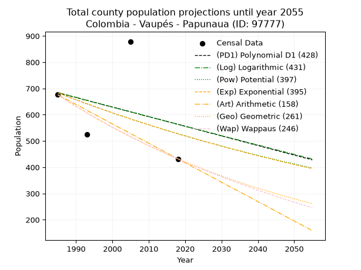
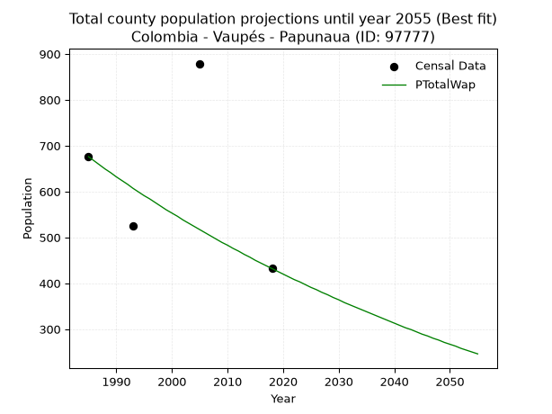
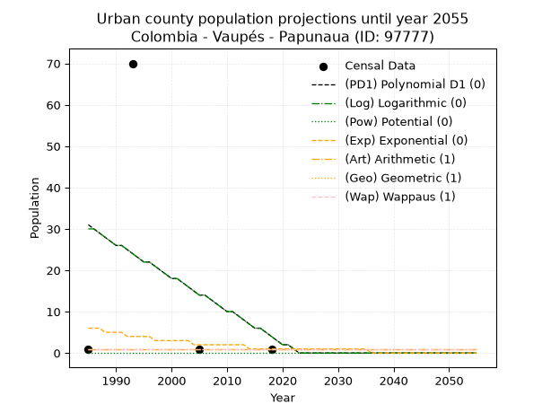
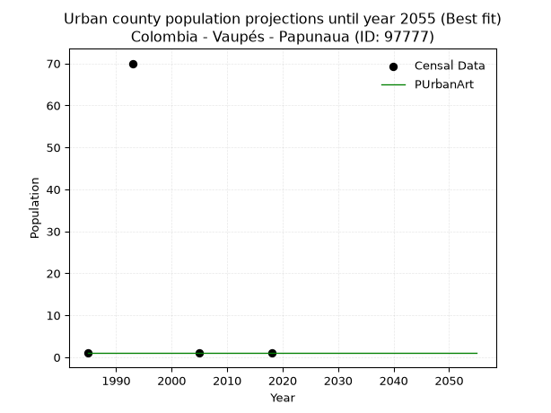
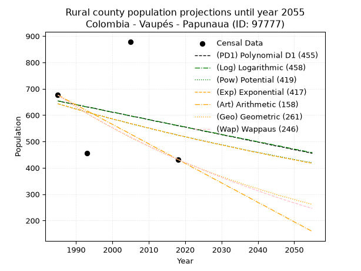
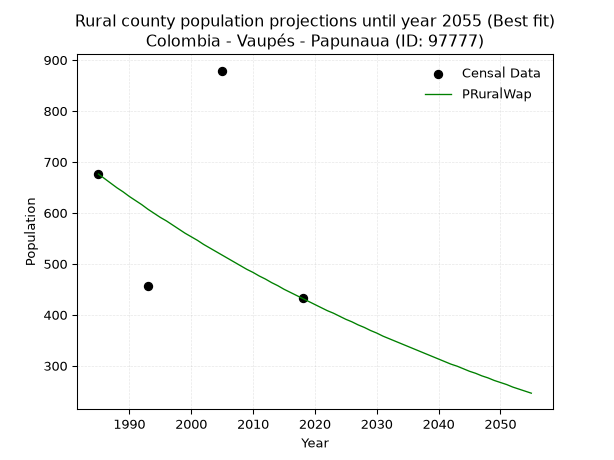

<div align="center">


</div>

# _“Population and Public Services Demand Projections (PPSD) until Year 2050 for Colombia - Vaupés - Papunaua (ANM) (ID: 97777)”_
Keywords: `population` `public-service` `projection` `lineal` `polynomial` `logarithmic` `potential` `exponential` `arithmetic` `geometric` `wappaus` `dane` `colombia` `south-america`

PPSD are analytical estimates used by governments and planners to anticipate future changes in population size, age distribution, and the resulting community needs for utilities, healthcare, education, and infrastructure as sizing future water treatment facilities, electrical grids, and road networks based on spatial growth.

> **General running parameters**: • app_version: _v20260806_. • Python version: _3.14.7_. • Pandas version: _3.0.5_. • NumPy version: _2.5.1_. • Creates, save and include plots into reports (create_plot): _True_. • Projection until year: _2050_. • Process polynomial degree 2 and up: _False_. • Process Wappaus: _True_. • Process Wappaus: _True_. • Set negative values to zero: _True_. • Set infinite values to zero: _True_. • Drop dataset notes: _True_. 
<div align="center">

Dynamic map: [:earth_americas:Google](http://maps.google.com/maps?q=1.68161138,-70.7061875) [:earth_americas:OSM](https://www.openstreetmap.org/#map=18/1.68161138/-70.7061875&layers=P) [:earth_americas:Bing](https://www.bing.com/maps?cp=1.68161138~-70.7061875&lvl=18) [:earth_americas:Apple](https://maps.apple.com/frame?center=1.68161138%2C-70.7061875&span=0.003%2C0.006)

</div>


<div align="center">

```geojson
{
  "type": "Feature",
  "geometry": {
    "type": "Point", 
    "coordinates": [-70.7061875, 1.68161138]
  }, 
  "properties": {
    "Name": "Colombia - Vaupés - Papunaua (ANM) (ID: 97777)"
  }
}
```

</div>


## 0. Census Data (4 records)

Census data are official statistics collected by a government about the people and housing in a country. They usually include counts of total population, age, sex, race, income, education, and jobs.

📅Global census file: [Population.xlsx](../data/Population.xlsx)

| Source   |   Year |   CountryID | CountryName   |   StateID | StateName   |   CountyID | CountyName     |   PTotal |   PUrban |   PRural |
|:---------|-------:|------------:|:--------------|----------:|:------------|-----------:|:---------------|---------:|---------:|---------:|
| DANE     |   1985 |          57 | Colombia      |        97 | Vaupés      |      97777 | Papunaua (ANM) |      676 |        1 |      676 |
| DANE     |   1993 |          57 | Colombia      |        97 | Vaupés      |      97777 | Papunaua       |      526 |       70 |      456 |
| DANE     |   2005 |          57 | Colombia      |        97 | Vaupés      |      97777 | Papunaua       |      879 |        1 |      879 |
| DANE     |   2018 |          57 | Colombia      |        97 | Vaupés      |      97777 | Papunaua       |      432 |        1 |      432 |

> 🔥Some records could had specific notes about the registered values or the corresponding urban or rural distribution.

## 1. Total

### 1.1. Coefficients and Parameters

* (PD1) Polynomial Deg 1: -3.659975913287577, 7949.116820553476 (lineal)
* (Log) Logarithmic: -7290.708625283807, 56044.9846848545
* (Pow) Potential: -15.63699333064664, 54.40150211519105
* (Exp) Exponential: -0.007838772776661245, 3909523905.3570843
* (Art) Arithmetic: Year diff. 2018 - 1985 = 33, Population diff. 432 - 676 = -244, Annual growth = -7.393939393939394
* (Geo) Geometric: Year diff. 2018 - 1985 = 33, Population diff. 432 - 676 = -244, Annual growth % = -0.013477071729435464
* (Wap) Wappaus: i = -1.3346460999890604, Condition values only valid for < 200)

<sub>
Wappaus condition values: ['-0.00', '-1.33', '-2.67', '-4.00', '-5.34', '-6.67', '-8.01', '-9.34', '-10.68', '-12.01', '-13.35', '-14.68', '-16.02', '-17.35', '-18.69', '-20.02', '-21.35', '-22.69', '-24.02', '-25.36', '-26.69', '-28.03', '-29.36', '-30.70', '-32.03', '-33.37', '-34.70', '-36.04', '-37.37', '-38.70', '-40.04', '-41.37', '-42.71', '-44.04', '-45.38', '-46.71', '-48.05', '-49.38', '-50.72', '-52.05', '-53.39', '-54.72', '-56.06', '-57.39', '-58.72', '-60.06', '-61.39', '-62.73', '-64.06', '-65.40', '-66.73', '-68.07', '-69.40', '-70.74', '-72.07', '-73.41', '-74.74', '-76.07', '-77.41', '-78.74', '-80.08', '-81.41', '-82.75', '-84.08', '-85.42', '-86.75']
</sub>


### 1.2. Projected Dataset

|   Year |   CountyID |   PTotalPD1 |   PTotalLog |   PTotalPow |   PTotalExp |   PTotalArt |   PTotalGeo |   PTotalWap |
|-------:|-----------:|------------:|------------:|------------:|------------:|------------:|------------:|------------:|
|   1985 |      97777 |         684 |         684 |         683 |         683 |         676 |         676 |         676 |
|   1986 |      97777 |         680 |         680 |         678 |         678 |         669 |         667 |         667 |
|   1987 |      97777 |         677 |         677 |         672 |         673 |         661 |         658 |         658 |
|   1988 |      97777 |         673 |         673 |         667 |         667 |         654 |         649 |         649 |
|   1989 |      97777 |         669 |         669 |         662 |         662 |         646 |         640 |         641 |
|   1990 |      97777 |         666 |         666 |         657 |         657 |         639 |         632 |         632 |
|   1991 |      97777 |         662 |         662 |         652 |         652 |         632 |         623 |         624 |
|   1992 |      97777 |         658 |         658 |         646 |         647 |         624 |         615 |         616 |
|   1993 |      97777 |         655 |         655 |         641 |         642 |         617 |         606 |         607 |
|   1994 |      97777 |         651 |         651 |         636 |         637 |         609 |         598 |         599 |
|   1995 |      97777 |         647 |         647 |         631 |         632 |         602 |         590 |         591 |
|   1996 |      97777 |         644 |         644 |         626 |         627 |         595 |         582 |         584 |
|   1997 |      97777 |         640 |         640 |         622 |         622 |         587 |         574 |         576 |
|   1998 |      97777 |         636 |         636 |         617 |         617 |         580 |         567 |         568 |
|   1999 |      97777 |         633 |         633 |         612 |         612 |         572 |         559 |         560 |
|   2000 |      97777 |         629 |         629 |         607 |         607 |         565 |         552 |         553 |
|   2001 |      97777 |         626 |         625 |         602 |         603 |         558 |         544 |         546 |
|   2002 |      97777 |         622 |         622 |         598 |         598 |         550 |         537 |         538 |
|   2003 |      97777 |         618 |         618 |         593 |         593 |         543 |         530 |         531 |
|   2004 |      97777 |         615 |         614 |         589 |         589 |         536 |         522 |         524 |
|   2005 |      97777 |         611 |         611 |         584 |         584 |         528 |         515 |         517 |
|   2006 |      97777 |         607 |         607 |         579 |         579 |         521 |         508 |         510 |
|   2007 |      97777 |         604 |         604 |         575 |         575 |         513 |         502 |         503 |
|   2008 |      97777 |         600 |         600 |         570 |         570 |         506 |         495 |         496 |
|   2009 |      97777 |         596 |         596 |         566 |         566 |         499 |         488 |         489 |
|   2010 |      97777 |         593 |         593 |         562 |         562 |         491 |         482 |         483 |
|   2011 |      97777 |         589 |         589 |         557 |         557 |         484 |         475 |         476 |
|   2012 |      97777 |         585 |         585 |         553 |         553 |         476 |         469 |         470 |
|   2013 |      97777 |         582 |         582 |         549 |         549 |         469 |         462 |         463 |
|   2014 |      97777 |         578 |         578 |         544 |         544 |         462 |         456 |         457 |
|   2015 |      97777 |         574 |         575 |         540 |         540 |         454 |         450 |         450 |
|   2016 |      97777 |         571 |         571 |         536 |         536 |         447 |         444 |         444 |
|   2017 |      97777 |         567 |         567 |         532 |         532 |         439 |         438 |         438 |
|   2018 |      97777 |         563 |         564 |         528 |         527 |         432 |         432 |         432 |
|   2019 |      97777 |         560 |         560 |         524 |         523 |         425 |         426 |         426 |
|   2020 |      97777 |         556 |         556 |         520 |         519 |         417 |         420 |         420 |
|   2021 |      97777 |         552 |         553 |         516 |         515 |         410 |         415 |         414 |
|   2022 |      97777 |         549 |         549 |         512 |         511 |         402 |         409 |         408 |
|   2023 |      97777 |         545 |         546 |         508 |         507 |         395 |         404 |         403 |
|   2024 |      97777 |         541 |         542 |         504 |         503 |         388 |         398 |         397 |
|   2025 |      97777 |         538 |         538 |         500 |         499 |         380 |         393 |         391 |
|   2026 |      97777 |         534 |         535 |         496 |         495 |         373 |         388 |         386 |
|   2027 |      97777 |         530 |         531 |         492 |         492 |         365 |         382 |         380 |
|   2028 |      97777 |         527 |         528 |         489 |         488 |         358 |         377 |         375 |
|   2029 |      97777 |         523 |         524 |         485 |         484 |         351 |         372 |         369 |
|   2030 |      97777 |         519 |         520 |         481 |         480 |         343 |         367 |         364 |
|   2031 |      97777 |         516 |         517 |         477 |         476 |         336 |         362 |         358 |
|   2032 |      97777 |         512 |         513 |         474 |         473 |         328 |         357 |         353 |
|   2033 |      97777 |         508 |         510 |         470 |         469 |         321 |         352 |         348 |
|   2034 |      97777 |         505 |         506 |         466 |         465 |         314 |         348 |         343 |
|   2035 |      97777 |         501 |         503 |         463 |         462 |         306 |         343 |         338 |
|   2036 |      97777 |         497 |         499 |         459 |         458 |         299 |         338 |         333 |
|   2037 |      97777 |         494 |         495 |         456 |         454 |         292 |         334 |         328 |
|   2038 |      97777 |         490 |         492 |         452 |         451 |         284 |         329 |         323 |
|   2039 |      97777 |         486 |         488 |         449 |         447 |         277 |         325 |         318 |
|   2040 |      97777 |         483 |         485 |         445 |         444 |         269 |         321 |         313 |
|   2041 |      97777 |         479 |         481 |         442 |         440 |         262 |         316 |         308 |
|   2042 |      97777 |         475 |         478 |         439 |         437 |         255 |         312 |         303 |
|   2043 |      97777 |         472 |         474 |         435 |         434 |         247 |         308 |         299 |
|   2044 |      97777 |         468 |         470 |         432 |         430 |         240 |         304 |         294 |
|   2045 |      97777 |         464 |         467 |         429 |         427 |         232 |         299 |         289 |
|   2046 |      97777 |         461 |         463 |         425 |         423 |         225 |         295 |         285 |
|   2047 |      97777 |         457 |         460 |         422 |         420 |         218 |         291 |         280 |
|   2048 |      97777 |         453 |         456 |         419 |         417 |         210 |         288 |         276 |
|   2049 |      97777 |         450 |         453 |         416 |         414 |         203 |         284 |         271 |
|   2050 |      97777 |         446 |         449 |         413 |         410 |         195 |         280 |         267 |
<div align="center">

</img>

</div>


### 1.3. Best fit with absolute error and relative error (%)

Relative error puts that difference into context by dividing the absolute error by the true value, creating a unitless ratio or percentage that shows the scale of the mistake.

Absolute and relative error

|   Year | Source   |   CountryID | CountryName   |   StateID | StateName   |   CountyID_x | CountyName     |   PTotal |   PUrban |   PRural |   CountyID_y |   PTotalPD1 |   PTotalLog |   PTotalPow |   PTotalExp |   PTotalArt |   PTotalGeo |   PTotalWap |   PTotalPD1AbsError |   PTotalLogAbsError |   PTotalPowAbsError |   PTotalExpAbsError |   PTotalArtAbsError |   PTotalGeoAbsError |   PTotalWapAbsError |   PTotalPD1RelError |   PTotalLogRelError |   PTotalPowRelError |   PTotalExpRelError |   PTotalArtRelError |   PTotalGeoRelError |   PTotalWapRelError |
|-------:|:---------|------------:|:--------------|----------:|:------------|-------------:|:---------------|---------:|---------:|---------:|-------------:|------------:|------------:|------------:|------------:|------------:|------------:|------------:|--------------------:|--------------------:|--------------------:|--------------------:|--------------------:|--------------------:|--------------------:|--------------------:|--------------------:|--------------------:|--------------------:|--------------------:|--------------------:|--------------------:|
|   1985 | DANE     |          57 | Colombia      |        97 | Vaupés      |        97777 | Papunaua (ANM) |      676 |        1 |      676 |        97777 |         684 |         684 |         683 |         683 |         676 |         676 |         676 |                   8 |                   8 |                   7 |                   7 |                   0 |                   0 |                   0 |             1.18343 |             1.18343 |              1.0355 |              1.0355 |              0      |              0      |              0      |
|   1993 | DANE     |          57 | Colombia      |        97 | Vaupés      |        97777 | Papunaua       |      526 |       70 |      456 |        97777 |         655 |         655 |         641 |         642 |         617 |         606 |         607 |                 129 |                 129 |                 115 |                 116 |                  91 |                  80 |                  81 |            24.5247  |            24.5247  |             21.8631 |             22.0532 |             17.3004 |             15.2091 |             15.3992 |
|   2005 | DANE     |          57 | Colombia      |        97 | Vaupés      |        97777 | Papunaua       |      879 |        1 |      879 |        97777 |         611 |         611 |         584 |         584 |         528 |         515 |         517 |                 268 |                 268 |                 295 |                 295 |                 351 |                 364 |                 362 |            30.4892  |            30.4892  |             33.5609 |             33.5609 |             39.9317 |             41.4107 |             41.1832 |
|   2018 | DANE     |          57 | Colombia      |        97 | Vaupés      |        97777 | Papunaua       |      432 |        1 |      432 |        97777 |         563 |         564 |         528 |         527 |         432 |         432 |         432 |                 131 |                 132 |                  96 |                  95 |                   0 |                   0 |                   0 |            30.3241  |            30.5556  |             22.2222 |             21.9907 |              0      |              0      |              0      |

Relative error mean

| Method    |   RelError | Best   |
|:----------|-----------:|:-------|
| PTotalPD1 |    21.6304 |        |
| PTotalLog |    21.6882 |        |
| PTotalPow |    19.6704 |        |
| PTotalExp |    19.6601 |        |
| PTotalArt |    14.308  |        |
| PTotalGeo |    14.155  |        |
| PTotalWap |    14.1456 | True   |

💙Best method: _**PTotalWap**_
<div align="center">

</img>

</div>


### 1.4. Fresh water supply demand in liters per capita per day (lpcd)

The fresh water supply demand typically ranges from 100 to 300 liters per capita per day (lpcd) for standard domestic and municipal planning, though absolute survival minimums set by the World Health Organization are as low as 7.5 to 20 liters per day, and total consumption in high-income nations can exceed 400 liters.

> `CZ`: Level in meters above the sea level (masl).<br> `WS`: Fresh water supply demand in liters per capita per day (lpcd or l/h/d).<br> `WSAll`: Zonal fresh water supply demand in liters per second (l/s).<br> `A`: Zonal area in square meters.

Reference values (RAS Colombia)

|    CZ |   WS |
|------:|-----:|
|  1000 |  120 |
|  2000 |  130 |
| 99999 |  140 |

County shapefile geometry properties and water supply values

|   CountyID |      ATotal |   CZTotal |   WSTotal |
|-----------:|------------:|----------:|----------:|
|      97777 | 5.53168e+09 |   216.484 |       120 |

Projected values for best method: PTotalWap

|   CountyID |   Year |   PTotalWap |   WSTotal |   WSTotalAll |
|-----------:|-------:|------------:|----------:|-------------:|
|      97777 |   1985 |         676 |       120 |     0.938889 |
|      97777 |   1986 |         667 |       120 |     0.926389 |
|      97777 |   1987 |         658 |       120 |     0.913889 |
|      97777 |   1988 |         649 |       120 |     0.901389 |
|      97777 |   1989 |         641 |       120 |     0.890278 |
|      97777 |   1990 |         632 |       120 |     0.877778 |
|      97777 |   1991 |         624 |       120 |     0.866667 |
|      97777 |   1992 |         616 |       120 |     0.855556 |
|      97777 |   1993 |         607 |       120 |     0.843056 |
|      97777 |   1994 |         599 |       120 |     0.831944 |
|      97777 |   1995 |         591 |       120 |     0.820833 |
|      97777 |   1996 |         584 |       120 |     0.811111 |
|      97777 |   1997 |         576 |       120 |     0.8      |
|      97777 |   1998 |         568 |       120 |     0.788889 |
|      97777 |   1999 |         560 |       120 |     0.777778 |
|      97777 |   2000 |         553 |       120 |     0.768056 |
|      97777 |   2001 |         546 |       120 |     0.758333 |
|      97777 |   2002 |         538 |       120 |     0.747222 |
|      97777 |   2003 |         531 |       120 |     0.7375   |
|      97777 |   2004 |         524 |       120 |     0.727778 |
|      97777 |   2005 |         517 |       120 |     0.718056 |
|      97777 |   2006 |         510 |       120 |     0.708333 |
|      97777 |   2007 |         503 |       120 |     0.698611 |
|      97777 |   2008 |         496 |       120 |     0.688889 |
|      97777 |   2009 |         489 |       120 |     0.679167 |
|      97777 |   2010 |         483 |       120 |     0.670833 |
|      97777 |   2011 |         476 |       120 |     0.661111 |
|      97777 |   2012 |         470 |       120 |     0.652778 |
|      97777 |   2013 |         463 |       120 |     0.643056 |
|      97777 |   2014 |         457 |       120 |     0.634722 |
|      97777 |   2015 |         450 |       120 |     0.625    |
|      97777 |   2016 |         444 |       120 |     0.616667 |
|      97777 |   2017 |         438 |       120 |     0.608333 |
|      97777 |   2018 |         432 |       120 |     0.6      |
|      97777 |   2019 |         426 |       120 |     0.591667 |
|      97777 |   2020 |         420 |       120 |     0.583333 |
|      97777 |   2021 |         414 |       120 |     0.575    |
|      97777 |   2022 |         408 |       120 |     0.566667 |
|      97777 |   2023 |         403 |       120 |     0.559722 |
|      97777 |   2024 |         397 |       120 |     0.551389 |
|      97777 |   2025 |         391 |       120 |     0.543056 |
|      97777 |   2026 |         386 |       120 |     0.536111 |
|      97777 |   2027 |         380 |       120 |     0.527778 |
|      97777 |   2028 |         375 |       120 |     0.520833 |
|      97777 |   2029 |         369 |       120 |     0.5125   |
|      97777 |   2030 |         364 |       120 |     0.505556 |
|      97777 |   2031 |         358 |       120 |     0.497222 |
|      97777 |   2032 |         353 |       120 |     0.490278 |
|      97777 |   2033 |         348 |       120 |     0.483333 |
|      97777 |   2034 |         343 |       120 |     0.476389 |
|      97777 |   2035 |         338 |       120 |     0.469444 |
|      97777 |   2036 |         333 |       120 |     0.4625   |
|      97777 |   2037 |         328 |       120 |     0.455556 |
|      97777 |   2038 |         323 |       120 |     0.448611 |
|      97777 |   2039 |         318 |       120 |     0.441667 |
|      97777 |   2040 |         313 |       120 |     0.434722 |
|      97777 |   2041 |         308 |       120 |     0.427778 |
|      97777 |   2042 |         303 |       120 |     0.420833 |
|      97777 |   2043 |         299 |       120 |     0.415278 |
|      97777 |   2044 |         294 |       120 |     0.408333 |
|      97777 |   2045 |         289 |       120 |     0.401389 |
|      97777 |   2046 |         285 |       120 |     0.395833 |
|      97777 |   2047 |         280 |       120 |     0.388889 |
|      97777 |   2048 |         276 |       120 |     0.383333 |
|      97777 |   2049 |         271 |       120 |     0.376389 |
|      97777 |   2050 |         267 |       120 |     0.370833 |

## 2. Urban

### 2.1. Coefficients and Parameters

* (PD1) Polynomial Deg 1: -0.8032918506623813, 1625.034524287428 (lineal)
* (Log) Logarithmic: -1603.2904378199557, 12204.873465832727
* (Pow) Potential: -98.71843183623005, 326.33830452732155
* (Exp) Exponential: -0.04946060297849491, 2.6765694524669275e+43
* (Art) Arithmetic: Year diff. 2018 - 1985 = 33, Population diff. 1 - 1 = 0, Annual growth = 0.0
* (Geo) Geometric: Year diff. 2018 - 1985 = 33, Population diff. 1 - 1 = 0, Annual growth % = 0.0
* (Wap) Wappaus: i = 0.0, Condition values only valid for < 200)

<sub>
Wappaus condition values: ['0.00', '0.00', '0.00', '0.00', '0.00', '0.00', '0.00', '0.00', '0.00', '0.00', '0.00', '0.00', '0.00', '0.00', '0.00', '0.00', '0.00', '0.00', '0.00', '0.00', '0.00', '0.00', '0.00', '0.00', '0.00', '0.00', '0.00', '0.00', '0.00', '0.00', '0.00', '0.00', '0.00', '0.00', '0.00', '0.00', '0.00', '0.00', '0.00', '0.00', '0.00', '0.00', '0.00', '0.00', '0.00', '0.00', '0.00', '0.00', '0.00', '0.00', '0.00', '0.00', '0.00', '0.00', '0.00', '0.00', '0.00', '0.00', '0.00', '0.00', '0.00', '0.00', '0.00', '0.00', '0.00', '0.00']
</sub>


### 2.2. Projected Dataset

|   Year |   CountyID |   PUrbanPD1 |   PUrbanLog |   PUrbanPow |   PUrbanExp |   PUrbanArt |   PUrbanGeo |   PUrbanWap |
|-------:|-----------:|------------:|------------:|------------:|------------:|------------:|------------:|------------:|
|   1985 |      97777 |          31 |          30 |           0 |           6 |           1 |           1 |           1 |
|   1986 |      97777 |          30 |          30 |           0 |           6 |           1 |           1 |           1 |
|   1987 |      97777 |          29 |          29 |           0 |           6 |           1 |           1 |           1 |
|   1988 |      97777 |          28 |          28 |           0 |           5 |           1 |           1 |           1 |
|   1989 |      97777 |          27 |          27 |           0 |           5 |           1 |           1 |           1 |
|   1990 |      97777 |          26 |          26 |           0 |           5 |           1 |           1 |           1 |
|   1991 |      97777 |          26 |          26 |           0 |           5 |           1 |           1 |           1 |
|   1992 |      97777 |          25 |          25 |           0 |           4 |           1 |           1 |           1 |
|   1993 |      97777 |          24 |          24 |           0 |           4 |           1 |           1 |           1 |
|   1994 |      97777 |          23 |          23 |           0 |           4 |           1 |           1 |           1 |
|   1995 |      97777 |          22 |          22 |           0 |           4 |           1 |           1 |           1 |
|   1996 |      97777 |          22 |          22 |           0 |           4 |           1 |           1 |           1 |
|   1997 |      97777 |          21 |          21 |           0 |           3 |           1 |           1 |           1 |
|   1998 |      97777 |          20 |          20 |           0 |           3 |           1 |           1 |           1 |
|   1999 |      97777 |          19 |          19 |           0 |           3 |           1 |           1 |           1 |
|   2000 |      97777 |          18 |          18 |           0 |           3 |           1 |           1 |           1 |
|   2001 |      97777 |          18 |          18 |           0 |           3 |           1 |           1 |           1 |
|   2002 |      97777 |          17 |          17 |           0 |           3 |           1 |           1 |           1 |
|   2003 |      97777 |          16 |          16 |           0 |           3 |           1 |           1 |           1 |
|   2004 |      97777 |          15 |          15 |           0 |           2 |           1 |           1 |           1 |
|   2005 |      97777 |          14 |          14 |           0 |           2 |           1 |           1 |           1 |
|   2006 |      97777 |          14 |          14 |           0 |           2 |           1 |           1 |           1 |
|   2007 |      97777 |          13 |          13 |           0 |           2 |           1 |           1 |           1 |
|   2008 |      97777 |          12 |          12 |           0 |           2 |           1 |           1 |           1 |
|   2009 |      97777 |          11 |          11 |           0 |           2 |           1 |           1 |           1 |
|   2010 |      97777 |          10 |          10 |           0 |           2 |           1 |           1 |           1 |
|   2011 |      97777 |          10 |          10 |           0 |           2 |           1 |           1 |           1 |
|   2012 |      97777 |           9 |           9 |           0 |           2 |           1 |           1 |           1 |
|   2013 |      97777 |           8 |           8 |           0 |           2 |           1 |           1 |           1 |
|   2014 |      97777 |           7 |           7 |           0 |           1 |           1 |           1 |           1 |
|   2015 |      97777 |           6 |           6 |           0 |           1 |           1 |           1 |           1 |
|   2016 |      97777 |           6 |           6 |           0 |           1 |           1 |           1 |           1 |
|   2017 |      97777 |           5 |           5 |           0 |           1 |           1 |           1 |           1 |
|   2018 |      97777 |           4 |           4 |           0 |           1 |           1 |           1 |           1 |
|   2019 |      97777 |           3 |           3 |           0 |           1 |           1 |           1 |           1 |
|   2020 |      97777 |           2 |           2 |           0 |           1 |           1 |           1 |           1 |
|   2021 |      97777 |           2 |           2 |           0 |           1 |           1 |           1 |           1 |
|   2022 |      97777 |           1 |           1 |           0 |           1 |           1 |           1 |           1 |
|   2023 |      97777 |          -0 |           0 |           0 |           1 |           1 |           1 |           1 |
|   2024 |      97777 |           0 |           0 |           0 |           1 |           1 |           1 |           1 |
|   2025 |      97777 |           0 |           0 |           0 |           1 |           1 |           1 |           1 |
|   2026 |      97777 |           0 |           0 |           0 |           1 |           1 |           1 |           1 |
|   2027 |      97777 |           0 |           0 |           0 |           1 |           1 |           1 |           1 |
|   2028 |      97777 |           0 |           0 |           0 |           1 |           1 |           1 |           1 |
|   2029 |      97777 |           0 |           0 |           0 |           1 |           1 |           1 |           1 |
|   2030 |      97777 |           0 |           0 |           0 |           1 |           1 |           1 |           1 |
|   2031 |      97777 |           0 |           0 |           0 |           1 |           1 |           1 |           1 |
|   2032 |      97777 |           0 |           0 |           0 |           1 |           1 |           1 |           1 |
|   2033 |      97777 |           0 |           0 |           0 |           1 |           1 |           1 |           1 |
|   2034 |      97777 |           0 |           0 |           0 |           1 |           1 |           1 |           1 |
|   2035 |      97777 |           0 |           0 |           0 |           1 |           1 |           1 |           1 |
|   2036 |      97777 |           0 |           0 |           0 |           0 |           1 |           1 |           1 |
|   2037 |      97777 |           0 |           0 |           0 |           0 |           1 |           1 |           1 |
|   2038 |      97777 |           0 |           0 |           0 |           0 |           1 |           1 |           1 |
|   2039 |      97777 |           0 |           0 |           0 |           0 |           1 |           1 |           1 |
|   2040 |      97777 |           0 |           0 |           0 |           0 |           1 |           1 |           1 |
|   2041 |      97777 |           0 |           0 |           0 |           0 |           1 |           1 |           1 |
|   2042 |      97777 |           0 |           0 |           0 |           0 |           1 |           1 |           1 |
|   2043 |      97777 |           0 |           0 |           0 |           0 |           1 |           1 |           1 |
|   2044 |      97777 |           0 |           0 |           0 |           0 |           1 |           1 |           1 |
|   2045 |      97777 |           0 |           0 |           0 |           0 |           1 |           1 |           1 |
|   2046 |      97777 |           0 |           0 |           0 |           0 |           1 |           1 |           1 |
|   2047 |      97777 |           0 |           0 |           0 |           0 |           1 |           1 |           1 |
|   2048 |      97777 |           0 |           0 |           0 |           0 |           1 |           1 |           1 |
|   2049 |      97777 |           0 |           0 |           0 |           0 |           1 |           1 |           1 |
|   2050 |      97777 |           0 |           0 |           0 |           0 |           1 |           1 |           1 |
<div align="center">

</img>

</div>


### 2.3. Best fit with absolute error and relative error (%)

Relative error puts that difference into context by dividing the absolute error by the true value, creating a unitless ratio or percentage that shows the scale of the mistake.

Absolute and relative error

|   Year | Source   |   CountryID | CountryName   |   StateID | StateName   |   CountyID_x | CountyName     |   PTotal |   PUrban |   PRural |   CountyID_y |   PUrbanPD1 |   PUrbanLog |   PUrbanPow |   PUrbanExp |   PUrbanArt |   PUrbanGeo |   PUrbanWap |   PUrbanPD1AbsError |   PUrbanLogAbsError |   PUrbanPowAbsError |   PUrbanExpAbsError |   PUrbanArtAbsError |   PUrbanGeoAbsError |   PUrbanWapAbsError |   PUrbanPD1RelError |   PUrbanLogRelError |   PUrbanPowRelError |   PUrbanExpRelError |   PUrbanArtRelError |   PUrbanGeoRelError |   PUrbanWapRelError |
|-------:|:---------|------------:|:--------------|----------:|:------------|-------------:|:---------------|---------:|---------:|---------:|-------------:|------------:|------------:|------------:|------------:|------------:|------------:|------------:|--------------------:|--------------------:|--------------------:|--------------------:|--------------------:|--------------------:|--------------------:|--------------------:|--------------------:|--------------------:|--------------------:|--------------------:|--------------------:|--------------------:|
|   1985 | DANE     |          57 | Colombia      |        97 | Vaupés      |        97777 | Papunaua (ANM) |      676 |        1 |      676 |        97777 |          31 |          30 |           0 |           6 |           1 |           1 |           1 |                  30 |                  29 |                   1 |                   5 |                   0 |                   0 |                   0 |           3000      |           2900      |                 100 |            500      |              0      |              0      |              0      |
|   1993 | DANE     |          57 | Colombia      |        97 | Vaupés      |        97777 | Papunaua       |      526 |       70 |      456 |        97777 |          24 |          24 |           0 |           4 |           1 |           1 |           1 |                  46 |                  46 |                  70 |                  66 |                  69 |                  69 |                  69 |             65.7143 |             65.7143 |                 100 |             94.2857 |             98.5714 |             98.5714 |             98.5714 |
|   2005 | DANE     |          57 | Colombia      |        97 | Vaupés      |        97777 | Papunaua       |      879 |        1 |      879 |        97777 |          14 |          14 |           0 |           2 |           1 |           1 |           1 |                  13 |                  13 |                   1 |                   1 |                   0 |                   0 |                   0 |           1300      |           1300      |                 100 |            100      |              0      |              0      |              0      |
|   2018 | DANE     |          57 | Colombia      |        97 | Vaupés      |        97777 | Papunaua       |      432 |        1 |      432 |        97777 |           4 |           4 |           0 |           1 |           1 |           1 |           1 |                   3 |                   3 |                   1 |                   0 |                   0 |                   0 |                   0 |            300      |            300      |                 100 |              0      |              0      |              0      |              0      |

Relative error mean

| Method    |   RelError | Best   |
|:----------|-----------:|:-------|
| PUrbanPD1 |  1166.43   |        |
| PUrbanLog |  1141.43   |        |
| PUrbanPow |   100      |        |
| PUrbanExp |   173.571  |        |
| PUrbanArt |    24.6429 | True   |
| PUrbanGeo |    24.6429 | True   |
| PUrbanWap |    24.6429 | True   |

💙Best method: _**PUrbanArt**_
<div align="center">

</img>

</div>


### 2.4. Fresh water supply demand in liters per capita per day (lpcd)

The fresh water supply demand typically ranges from 100 to 300 liters per capita per day (lpcd) for standard domestic and municipal planning, though absolute survival minimums set by the World Health Organization are as low as 7.5 to 20 liters per day, and total consumption in high-income nations can exceed 400 liters.

> `CZ`: Level in meters above the sea level (masl).<br> `WS`: Fresh water supply demand in liters per capita per day (lpcd or l/h/d).<br> `WSAll`: Zonal fresh water supply demand in liters per second (l/s).<br> `A`: Zonal area in square meters.

Reference values (RAS Colombia)

|    CZ |   WS |
|------:|-----:|
|  1000 |  120 |
|  2000 |  130 |
| 99999 |  140 |

County shapefile geometry properties and water supply values

|   CountyID |   AUrban |   CZUrban |   WSUrban |
|-----------:|---------:|----------:|----------:|
|      97777 |        0 |         0 |       120 |

Projected values for best method: PUrbanArt

|   CountyID |   Year |   PUrbanArt |   WSUrban |   WSUrbanAll |
|-----------:|-------:|------------:|----------:|-------------:|
|      97777 |   1985 |           1 |       120 |   0.00138889 |
|      97777 |   1986 |           1 |       120 |   0.00138889 |
|      97777 |   1987 |           1 |       120 |   0.00138889 |
|      97777 |   1988 |           1 |       120 |   0.00138889 |
|      97777 |   1989 |           1 |       120 |   0.00138889 |
|      97777 |   1990 |           1 |       120 |   0.00138889 |
|      97777 |   1991 |           1 |       120 |   0.00138889 |
|      97777 |   1992 |           1 |       120 |   0.00138889 |
|      97777 |   1993 |           1 |       120 |   0.00138889 |
|      97777 |   1994 |           1 |       120 |   0.00138889 |
|      97777 |   1995 |           1 |       120 |   0.00138889 |
|      97777 |   1996 |           1 |       120 |   0.00138889 |
|      97777 |   1997 |           1 |       120 |   0.00138889 |
|      97777 |   1998 |           1 |       120 |   0.00138889 |
|      97777 |   1999 |           1 |       120 |   0.00138889 |
|      97777 |   2000 |           1 |       120 |   0.00138889 |
|      97777 |   2001 |           1 |       120 |   0.00138889 |
|      97777 |   2002 |           1 |       120 |   0.00138889 |
|      97777 |   2003 |           1 |       120 |   0.00138889 |
|      97777 |   2004 |           1 |       120 |   0.00138889 |
|      97777 |   2005 |           1 |       120 |   0.00138889 |
|      97777 |   2006 |           1 |       120 |   0.00138889 |
|      97777 |   2007 |           1 |       120 |   0.00138889 |
|      97777 |   2008 |           1 |       120 |   0.00138889 |
|      97777 |   2009 |           1 |       120 |   0.00138889 |
|      97777 |   2010 |           1 |       120 |   0.00138889 |
|      97777 |   2011 |           1 |       120 |   0.00138889 |
|      97777 |   2012 |           1 |       120 |   0.00138889 |
|      97777 |   2013 |           1 |       120 |   0.00138889 |
|      97777 |   2014 |           1 |       120 |   0.00138889 |
|      97777 |   2015 |           1 |       120 |   0.00138889 |
|      97777 |   2016 |           1 |       120 |   0.00138889 |
|      97777 |   2017 |           1 |       120 |   0.00138889 |
|      97777 |   2018 |           1 |       120 |   0.00138889 |
|      97777 |   2019 |           1 |       120 |   0.00138889 |
|      97777 |   2020 |           1 |       120 |   0.00138889 |
|      97777 |   2021 |           1 |       120 |   0.00138889 |
|      97777 |   2022 |           1 |       120 |   0.00138889 |
|      97777 |   2023 |           1 |       120 |   0.00138889 |
|      97777 |   2024 |           1 |       120 |   0.00138889 |
|      97777 |   2025 |           1 |       120 |   0.00138889 |
|      97777 |   2026 |           1 |       120 |   0.00138889 |
|      97777 |   2027 |           1 |       120 |   0.00138889 |
|      97777 |   2028 |           1 |       120 |   0.00138889 |
|      97777 |   2029 |           1 |       120 |   0.00138889 |
|      97777 |   2030 |           1 |       120 |   0.00138889 |
|      97777 |   2031 |           1 |       120 |   0.00138889 |
|      97777 |   2032 |           1 |       120 |   0.00138889 |
|      97777 |   2033 |           1 |       120 |   0.00138889 |
|      97777 |   2034 |           1 |       120 |   0.00138889 |
|      97777 |   2035 |           1 |       120 |   0.00138889 |
|      97777 |   2036 |           1 |       120 |   0.00138889 |
|      97777 |   2037 |           1 |       120 |   0.00138889 |
|      97777 |   2038 |           1 |       120 |   0.00138889 |
|      97777 |   2039 |           1 |       120 |   0.00138889 |
|      97777 |   2040 |           1 |       120 |   0.00138889 |
|      97777 |   2041 |           1 |       120 |   0.00138889 |
|      97777 |   2042 |           1 |       120 |   0.00138889 |
|      97777 |   2043 |           1 |       120 |   0.00138889 |
|      97777 |   2044 |           1 |       120 |   0.00138889 |
|      97777 |   2045 |           1 |       120 |   0.00138889 |
|      97777 |   2046 |           1 |       120 |   0.00138889 |
|      97777 |   2047 |           1 |       120 |   0.00138889 |
|      97777 |   2048 |           1 |       120 |   0.00138889 |
|      97777 |   2049 |           1 |       120 |   0.00138889 |
|      97777 |   2050 |           1 |       120 |   0.00138889 |

## 3. Rural

### 3.1. Coefficients and Parameters

* (PD1) Polynomial Deg 1: -2.845042151746037, 6301.5455640300115 (lineal)
* (Log) Logarithmic: -5664.182094162105, 43664.24348763284
* (Pow) Potential: -12.318683949078064, 43.43200597008749
* (Exp) Exponential: -0.006176210073539443, 135629612.71316165
* (Art) Arithmetic: Year diff. 2018 - 1985 = 33, Population diff. 432 - 676 = -244, Annual growth = -7.393939393939394
* (Geo) Geometric: Year diff. 2018 - 1985 = 33, Population diff. 432 - 676 = -244, Annual growth % = -0.013477071729435464
* (Wap) Wappaus: i = -1.3346460999890604, Condition values only valid for < 200)

<sub>
Wappaus condition values: ['-0.00', '-1.33', '-2.67', '-4.00', '-5.34', '-6.67', '-8.01', '-9.34', '-10.68', '-12.01', '-13.35', '-14.68', '-16.02', '-17.35', '-18.69', '-20.02', '-21.35', '-22.69', '-24.02', '-25.36', '-26.69', '-28.03', '-29.36', '-30.70', '-32.03', '-33.37', '-34.70', '-36.04', '-37.37', '-38.70', '-40.04', '-41.37', '-42.71', '-44.04', '-45.38', '-46.71', '-48.05', '-49.38', '-50.72', '-52.05', '-53.39', '-54.72', '-56.06', '-57.39', '-58.72', '-60.06', '-61.39', '-62.73', '-64.06', '-65.40', '-66.73', '-68.07', '-69.40', '-70.74', '-72.07', '-73.41', '-74.74', '-76.07', '-77.41', '-78.74', '-80.08', '-81.41', '-82.75', '-84.08', '-85.42', '-86.75']
</sub>


### 3.2. Projected Dataset

|   Year |   CountyID |   PRuralPD1 |   PRuralLog |   PRuralPow |   PRuralExp |   PRuralArt |   PRuralGeo |   PRuralWap |
|-------:|-----------:|------------:|------------:|------------:|------------:|------------:|------------:|------------:|
|   1985 |      97777 |         654 |         654 |         643 |         643 |         676 |         676 |         676 |
|   1986 |      97777 |         651 |         651 |         639 |         639 |         669 |         667 |         667 |
|   1987 |      97777 |         648 |         648 |         635 |         635 |         661 |         658 |         658 |
|   1988 |      97777 |         646 |         645 |         631 |         631 |         654 |         649 |         649 |
|   1989 |      97777 |         643 |         643 |         627 |         627 |         646 |         640 |         641 |
|   1990 |      97777 |         640 |         640 |         623 |         623 |         639 |         632 |         632 |
|   1991 |      97777 |         637 |         637 |         619 |         619 |         632 |         623 |         624 |
|   1992 |      97777 |         634 |         634 |         615 |         615 |         624 |         615 |         616 |
|   1993 |      97777 |         631 |         631 |         612 |         612 |         617 |         606 |         607 |
|   1994 |      97777 |         629 |         628 |         608 |         608 |         609 |         598 |         599 |
|   1995 |      97777 |         626 |         626 |         604 |         604 |         602 |         590 |         591 |
|   1996 |      97777 |         623 |         623 |         600 |         600 |         595 |         582 |         584 |
|   1997 |      97777 |         620 |         620 |         597 |         597 |         587 |         574 |         576 |
|   1998 |      97777 |         617 |         617 |         593 |         593 |         580 |         567 |         568 |
|   1999 |      97777 |         614 |         614 |         589 |         589 |         572 |         559 |         560 |
|   2000 |      97777 |         611 |         611 |         586 |         586 |         565 |         552 |         553 |
|   2001 |      97777 |         609 |         609 |         582 |         582 |         558 |         544 |         546 |
|   2002 |      97777 |         606 |         606 |         579 |         579 |         550 |         537 |         538 |
|   2003 |      97777 |         603 |         603 |         575 |         575 |         543 |         530 |         531 |
|   2004 |      97777 |         600 |         600 |         571 |         572 |         536 |         522 |         524 |
|   2005 |      97777 |         597 |         597 |         568 |         568 |         528 |         515 |         517 |
|   2006 |      97777 |         594 |         594 |         564 |         565 |         521 |         508 |         510 |
|   2007 |      97777 |         592 |         592 |         561 |         561 |         513 |         502 |         503 |
|   2008 |      97777 |         589 |         589 |         558 |         558 |         506 |         495 |         496 |
|   2009 |      97777 |         586 |         586 |         554 |         554 |         499 |         488 |         489 |
|   2010 |      97777 |         583 |         583 |         551 |         551 |         491 |         482 |         483 |
|   2011 |      97777 |         580 |         580 |         547 |         547 |         484 |         475 |         476 |
|   2012 |      97777 |         577 |         577 |         544 |         544 |         476 |         469 |         470 |
|   2013 |      97777 |         574 |         575 |         541 |         541 |         469 |         462 |         463 |
|   2014 |      97777 |         572 |         572 |         537 |         537 |         462 |         456 |         457 |
|   2015 |      97777 |         569 |         569 |         534 |         534 |         454 |         450 |         450 |
|   2016 |      97777 |         566 |         566 |         531 |         531 |         447 |         444 |         444 |
|   2017 |      97777 |         563 |         563 |         528 |         527 |         439 |         438 |         438 |
|   2018 |      97777 |         560 |         561 |         524 |         524 |         432 |         432 |         432 |
|   2019 |      97777 |         557 |         558 |         521 |         521 |         425 |         426 |         426 |
|   2020 |      97777 |         555 |         555 |         518 |         518 |         417 |         420 |         420 |
|   2021 |      97777 |         552 |         552 |         515 |         515 |         410 |         415 |         414 |
|   2022 |      97777 |         549 |         549 |         512 |         511 |         402 |         409 |         408 |
|   2023 |      97777 |         546 |         547 |         509 |         508 |         395 |         404 |         403 |
|   2024 |      97777 |         543 |         544 |         506 |         505 |         388 |         398 |         397 |
|   2025 |      97777 |         540 |         541 |         503 |         502 |         380 |         393 |         391 |
|   2026 |      97777 |         537 |         538 |         500 |         499 |         373 |         388 |         386 |
|   2027 |      97777 |         535 |         535 |         497 |         496 |         365 |         382 |         380 |
|   2028 |      97777 |         532 |         533 |         493 |         493 |         358 |         377 |         375 |
|   2029 |      97777 |         529 |         530 |         491 |         490 |         351 |         372 |         369 |
|   2030 |      97777 |         526 |         527 |         488 |         487 |         343 |         367 |         364 |
|   2031 |      97777 |         523 |         524 |         485 |         484 |         336 |         362 |         358 |
|   2032 |      97777 |         520 |         521 |         482 |         481 |         328 |         357 |         353 |
|   2033 |      97777 |         518 |         519 |         479 |         478 |         321 |         352 |         348 |
|   2034 |      97777 |         515 |         516 |         476 |         475 |         314 |         348 |         343 |
|   2035 |      97777 |         512 |         513 |         473 |         472 |         306 |         343 |         338 |
|   2036 |      97777 |         509 |         510 |         470 |         469 |         299 |         338 |         333 |
|   2037 |      97777 |         506 |         508 |         467 |         466 |         292 |         334 |         328 |
|   2038 |      97777 |         503 |         505 |         464 |         463 |         284 |         329 |         323 |
|   2039 |      97777 |         501 |         502 |         462 |         460 |         277 |         325 |         318 |
|   2040 |      97777 |         498 |         499 |         459 |         458 |         269 |         321 |         313 |
|   2041 |      97777 |         495 |         496 |         456 |         455 |         262 |         316 |         308 |
|   2042 |      97777 |         492 |         494 |         453 |         452 |         255 |         312 |         303 |
|   2043 |      97777 |         489 |         491 |         451 |         449 |         247 |         308 |         299 |
|   2044 |      97777 |         486 |         488 |         448 |         446 |         240 |         304 |         294 |
|   2045 |      97777 |         483 |         485 |         445 |         444 |         232 |         299 |         289 |
|   2046 |      97777 |         481 |         483 |         443 |         441 |         225 |         295 |         285 |
|   2047 |      97777 |         478 |         480 |         440 |         438 |         218 |         291 |         280 |
|   2048 |      97777 |         475 |         477 |         437 |         436 |         210 |         288 |         276 |
|   2049 |      97777 |         472 |         474 |         435 |         433 |         203 |         284 |         271 |
|   2050 |      97777 |         469 |         471 |         432 |         430 |         195 |         280 |         267 |
<div align="center">

</img>

</div>


### 3.3. Best fit with absolute error and relative error (%)

Relative error puts that difference into context by dividing the absolute error by the true value, creating a unitless ratio or percentage that shows the scale of the mistake.

Absolute and relative error

|   Year | Source   |   CountryID | CountryName   |   StateID | StateName   |   CountyID_x | CountyName     |   PTotal |   PUrban |   PRural |   CountyID_y |   PRuralPD1 |   PRuralLog |   PRuralPow |   PRuralExp |   PRuralArt |   PRuralGeo |   PRuralWap |   PRuralPD1AbsError |   PRuralLogAbsError |   PRuralPowAbsError |   PRuralExpAbsError |   PRuralArtAbsError |   PRuralGeoAbsError |   PRuralWapAbsError |   PRuralPD1RelError |   PRuralLogRelError |   PRuralPowRelError |   PRuralExpRelError |   PRuralArtRelError |   PRuralGeoRelError |   PRuralWapRelError |
|-------:|:---------|------------:|:--------------|----------:|:------------|-------------:|:---------------|---------:|---------:|---------:|-------------:|------------:|------------:|------------:|------------:|------------:|------------:|------------:|--------------------:|--------------------:|--------------------:|--------------------:|--------------------:|--------------------:|--------------------:|--------------------:|--------------------:|--------------------:|--------------------:|--------------------:|--------------------:|--------------------:|
|   1985 | DANE     |          57 | Colombia      |        97 | Vaupés      |        97777 | Papunaua (ANM) |      676 |        1 |      676 |        97777 |         654 |         654 |         643 |         643 |         676 |         676 |         676 |                  22 |                  22 |                  33 |                  33 |                   0 |                   0 |                   0 |             3.25444 |             3.25444 |             4.88166 |             4.88166 |              0      |              0      |              0      |
|   1993 | DANE     |          57 | Colombia      |        97 | Vaupés      |        97777 | Papunaua       |      526 |       70 |      456 |        97777 |         631 |         631 |         612 |         612 |         617 |         606 |         607 |                 175 |                 175 |                 156 |                 156 |                 161 |                 150 |                 151 |            38.3772  |            38.3772  |            34.2105  |            34.2105  |             35.307  |             32.8947 |             33.114  |
|   2005 | DANE     |          57 | Colombia      |        97 | Vaupés      |        97777 | Papunaua       |      879 |        1 |      879 |        97777 |         597 |         597 |         568 |         568 |         528 |         515 |         517 |                 282 |                 282 |                 311 |                 311 |                 351 |                 364 |                 362 |            32.0819  |            32.0819  |            35.3811  |            35.3811  |             39.9317 |             41.4107 |             41.1832 |
|   2018 | DANE     |          57 | Colombia      |        97 | Vaupés      |        97777 | Papunaua       |      432 |        1 |      432 |        97777 |         560 |         561 |         524 |         524 |         432 |         432 |         432 |                 128 |                 129 |                  92 |                  92 |                   0 |                   0 |                   0 |            29.6296  |            29.8611  |            21.2963  |            21.2963  |              0      |              0      |              0      |

Relative error mean

| Method    |   RelError | Best   |
|:----------|-----------:|:-------|
| PRuralPD1 |    25.8358 |        |
| PRuralLog |    25.8937 |        |
| PRuralPow |    23.9424 |        |
| PRuralExp |    23.9424 |        |
| PRuralArt |    18.8097 |        |
| PRuralGeo |    18.5764 |        |
| PRuralWap |    18.5743 | True   |

💙Best method: _**PRuralWap**_
<div align="center">

</img>

</div>


### 3.4. Fresh water supply demand in liters per capita per day (lpcd)

The fresh water supply demand typically ranges from 100 to 300 liters per capita per day (lpcd) for standard domestic and municipal planning, though absolute survival minimums set by the World Health Organization are as low as 7.5 to 20 liters per day, and total consumption in high-income nations can exceed 400 liters.

> `CZ`: Level in meters above the sea level (masl).<br> `WS`: Fresh water supply demand in liters per capita per day (lpcd or l/h/d).<br> `WSAll`: Zonal fresh water supply demand in liters per second (l/s).<br> `A`: Zonal area in square meters.

Reference values (RAS Colombia)

|    CZ |   WS |
|------:|-----:|
|  1000 |  120 |
|  2000 |  130 |
| 99999 |  140 |

County shapefile geometry properties and water supply values

|   CountyID |      ARural |   CZRural |   WSRural |
|-----------:|------------:|----------:|----------:|
|      97777 | 5.53168e+09 |   216.484 |       120 |

Projected values for best method: PRuralWap

|   CountyID |   Year |   PRuralWap |   WSRural |   WSRuralAll |
|-----------:|-------:|------------:|----------:|-------------:|
|      97777 |   1985 |         676 |       120 |     0.938889 |
|      97777 |   1986 |         667 |       120 |     0.926389 |
|      97777 |   1987 |         658 |       120 |     0.913889 |
|      97777 |   1988 |         649 |       120 |     0.901389 |
|      97777 |   1989 |         641 |       120 |     0.890278 |
|      97777 |   1990 |         632 |       120 |     0.877778 |
|      97777 |   1991 |         624 |       120 |     0.866667 |
|      97777 |   1992 |         616 |       120 |     0.855556 |
|      97777 |   1993 |         607 |       120 |     0.843056 |
|      97777 |   1994 |         599 |       120 |     0.831944 |
|      97777 |   1995 |         591 |       120 |     0.820833 |
|      97777 |   1996 |         584 |       120 |     0.811111 |
|      97777 |   1997 |         576 |       120 |     0.8      |
|      97777 |   1998 |         568 |       120 |     0.788889 |
|      97777 |   1999 |         560 |       120 |     0.777778 |
|      97777 |   2000 |         553 |       120 |     0.768056 |
|      97777 |   2001 |         546 |       120 |     0.758333 |
|      97777 |   2002 |         538 |       120 |     0.747222 |
|      97777 |   2003 |         531 |       120 |     0.7375   |
|      97777 |   2004 |         524 |       120 |     0.727778 |
|      97777 |   2005 |         517 |       120 |     0.718056 |
|      97777 |   2006 |         510 |       120 |     0.708333 |
|      97777 |   2007 |         503 |       120 |     0.698611 |
|      97777 |   2008 |         496 |       120 |     0.688889 |
|      97777 |   2009 |         489 |       120 |     0.679167 |
|      97777 |   2010 |         483 |       120 |     0.670833 |
|      97777 |   2011 |         476 |       120 |     0.661111 |
|      97777 |   2012 |         470 |       120 |     0.652778 |
|      97777 |   2013 |         463 |       120 |     0.643056 |
|      97777 |   2014 |         457 |       120 |     0.634722 |
|      97777 |   2015 |         450 |       120 |     0.625    |
|      97777 |   2016 |         444 |       120 |     0.616667 |
|      97777 |   2017 |         438 |       120 |     0.608333 |
|      97777 |   2018 |         432 |       120 |     0.6      |
|      97777 |   2019 |         426 |       120 |     0.591667 |
|      97777 |   2020 |         420 |       120 |     0.583333 |
|      97777 |   2021 |         414 |       120 |     0.575    |
|      97777 |   2022 |         408 |       120 |     0.566667 |
|      97777 |   2023 |         403 |       120 |     0.559722 |
|      97777 |   2024 |         397 |       120 |     0.551389 |
|      97777 |   2025 |         391 |       120 |     0.543056 |
|      97777 |   2026 |         386 |       120 |     0.536111 |
|      97777 |   2027 |         380 |       120 |     0.527778 |
|      97777 |   2028 |         375 |       120 |     0.520833 |
|      97777 |   2029 |         369 |       120 |     0.5125   |
|      97777 |   2030 |         364 |       120 |     0.505556 |
|      97777 |   2031 |         358 |       120 |     0.497222 |
|      97777 |   2032 |         353 |       120 |     0.490278 |
|      97777 |   2033 |         348 |       120 |     0.483333 |
|      97777 |   2034 |         343 |       120 |     0.476389 |
|      97777 |   2035 |         338 |       120 |     0.469444 |
|      97777 |   2036 |         333 |       120 |     0.4625   |
|      97777 |   2037 |         328 |       120 |     0.455556 |
|      97777 |   2038 |         323 |       120 |     0.448611 |
|      97777 |   2039 |         318 |       120 |     0.441667 |
|      97777 |   2040 |         313 |       120 |     0.434722 |
|      97777 |   2041 |         308 |       120 |     0.427778 |
|      97777 |   2042 |         303 |       120 |     0.420833 |
|      97777 |   2043 |         299 |       120 |     0.415278 |
|      97777 |   2044 |         294 |       120 |     0.408333 |
|      97777 |   2045 |         289 |       120 |     0.401389 |
|      97777 |   2046 |         285 |       120 |     0.395833 |
|      97777 |   2047 |         280 |       120 |     0.388889 |
|      97777 |   2048 |         276 |       120 |     0.383333 |
|      97777 |   2049 |         271 |       120 |     0.376389 |
|      97777 |   2050 |         267 |       120 |     0.370833 |

<div align="center"><br><sub>Share this research</sub></div><br>

<sub>**APPS & TOOLS & CONTENT DISCLAIMER**: • NO WARRANTY - This content and software is provided by <a href="https://github.com/rcfdtools" target="_blank">github.com/rcfdtools</a> "as is", without any express or implied warranty, including warranties of merchantability, fitness for a particular purpose, or non-infringement. There is no guarantee that the software will be error-free or operate without interruption. • LIMITATION OF LIABILITY - Neither the authors nor copyright holders will be liable for claims or damages arising from the software or its use. You are responsible for determining if the software is appropriate for your use and assume all associated risks, including errors, legal compliance, and data loss. • NO PROFESSIONAL ADVICE - The software provides general information and does not offer professional advice. It should not replace consultation with professional advisors. [Clauses and global license for rcfdtools use.](https://github.com/rcfdtools/rcfdtools/blob/main/LICENSE.md)</sub>