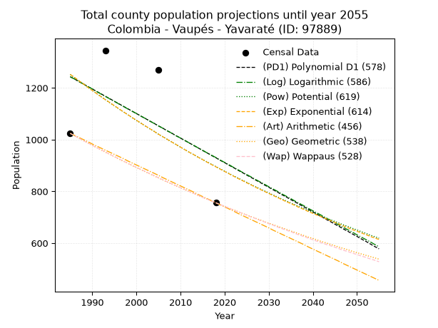
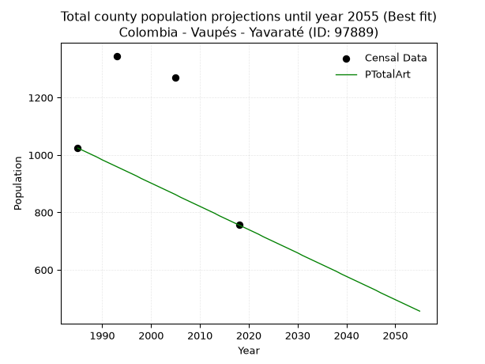
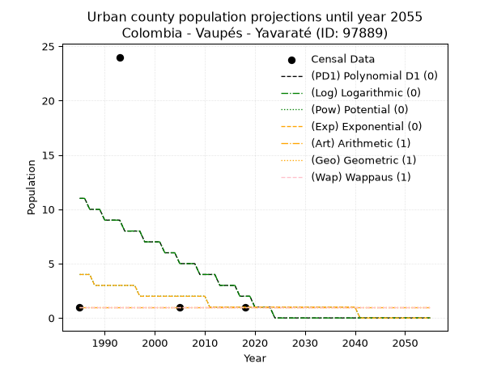
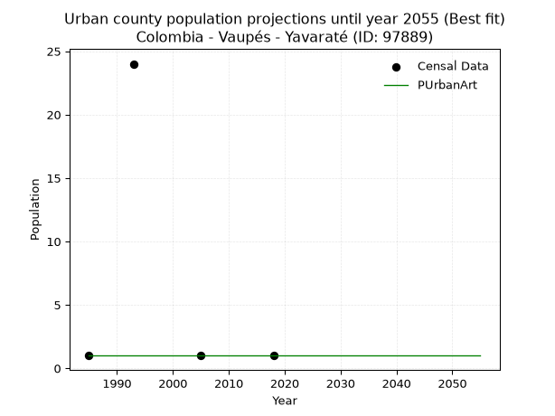
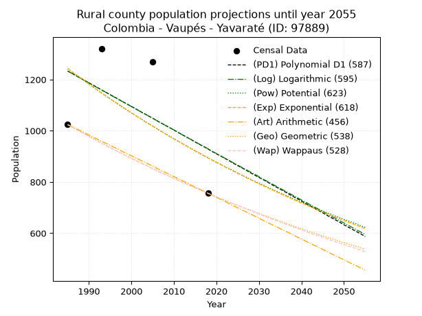
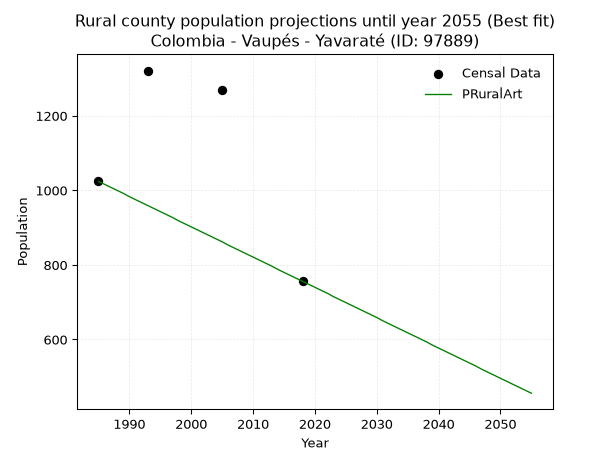

<div align="center">


</div>

# _“Population and Public Services Demand Projections (PPSD) until Year 2050 for Colombia - Vaupés - Yavaraté (ANM) (ID: 97889)”_
Keywords: `population` `public-service` `projection` `lineal` `polynomial` `logarithmic` `potential` `exponential` `arithmetic` `geometric` `wappaus` `dane` `colombia` `south-america`

PPSD are analytical estimates used by governments and planners to anticipate future changes in population size, age distribution, and the resulting community needs for utilities, healthcare, education, and infrastructure as sizing future water treatment facilities, electrical grids, and road networks based on spatial growth.

> **General running parameters**: • app_version: _v20260806_. • Python version: _3.14.7_. • Pandas version: _3.0.5_. • NumPy version: _2.5.1_. • Creates, save and include plots into reports (create_plot): _True_. • Projection until year: _2050_. • Process polynomial degree 2 and up: _False_. • Process Wappaus: _True_. • Process Wappaus: _True_. • Set negative values to zero: _True_. • Set infinite values to zero: _True_. • Drop dataset notes: _True_. 
<div align="center">

Dynamic map: [:earth_americas:Google](http://maps.google.com/maps?q=0.832435253,-69.6215929) [:earth_americas:OSM](https://www.openstreetmap.org/#map=18/0.832435253/-69.6215929&layers=P) [:earth_americas:Bing](https://www.bing.com/maps?cp=0.832435253~-69.6215929&lvl=18) [:earth_americas:Apple](https://maps.apple.com/frame?center=0.832435253%2C-69.6215929&span=0.003%2C0.006)

</div>


<div align="center">

```geojson
{
  "type": "Feature",
  "geometry": {
    "type": "Point", 
    "coordinates": [-69.6215929, 0.832435253]
  }, 
  "properties": {
    "Name": "Colombia - Vaupés - Yavaraté (ANM) (ID: 97889)"
  }
}
```

</div>


## 0. Census Data (4 records)

Census data are official statistics collected by a government about the people and housing in a country. They usually include counts of total population, age, sex, race, income, education, and jobs.

📅Global census file: [Population.xlsx](../data/Population.xlsx)

| Source   |   Year |   CountryID | CountryName   |   StateID | StateName   |   CountyID | CountyName     |   PTotal |   PUrban |   PRural |
|:---------|-------:|------------:|:--------------|----------:|:------------|-----------:|:---------------|---------:|---------:|---------:|
| DANE     |   1985 |          57 | Colombia      |        97 | Vaupés      |      97889 | Yavaraté (ANM) |     1024 |        1 |     1024 |
| DANE     |   1993 |          57 | Colombia      |        97 | Vaupés      |      97889 | Yavaraté       |     1345 |       24 |     1321 |
| DANE     |   2005 |          57 | Colombia      |        97 | Vaupés      |      97889 | Yavaraté       |     1269 |        1 |     1269 |
| DANE     |   2018 |          57 | Colombia      |        97 | Vaupés      |      97889 | Yavaraté       |      756 |        1 |      756 |

> 🔥Some records could had specific notes about the registered values or the corresponding urban or rural distribution.

## 1. Total

### 1.1. Coefficients and Parameters

* (PD1) Polynomial Deg 1: -9.507025291047452, 20114.927338417663 (lineal)
* (Log) Logarithmic: -18955.88564272442, 145182.3386732826
* (Pow) Potential: -20.32036119285508, 70.10930475082611
* (Exp) Exponential: -0.010186859500316276, 757794025042.643
* (Art) Arithmetic: Year diff. 2018 - 1985 = 33, Population diff. 756 - 1024 = -268, Annual growth = -8.121212121212121
* (Geo) Geometric: Year diff. 2018 - 1985 = 33, Population diff. 756 - 1024 = -268, Annual growth % = -0.009152718025303042
* (Wap) Wappaus: i = -0.9124957439564181, Condition values only valid for < 200)

<sub>
Wappaus condition values: ['-0.00', '-0.91', '-1.82', '-2.74', '-3.65', '-4.56', '-5.47', '-6.39', '-7.30', '-8.21', '-9.12', '-10.04', '-10.95', '-11.86', '-12.77', '-13.69', '-14.60', '-15.51', '-16.42', '-17.34', '-18.25', '-19.16', '-20.07', '-20.99', '-21.90', '-22.81', '-23.72', '-24.64', '-25.55', '-26.46', '-27.37', '-28.29', '-29.20', '-30.11', '-31.02', '-31.94', '-32.85', '-33.76', '-34.67', '-35.59', '-36.50', '-37.41', '-38.32', '-39.24', '-40.15', '-41.06', '-41.97', '-42.89', '-43.80', '-44.71', '-45.62', '-46.54', '-47.45', '-48.36', '-49.27', '-50.19', '-51.10', '-52.01', '-52.92', '-53.84', '-54.75', '-55.66', '-56.57', '-57.49', '-58.40', '-59.31']
</sub>


### 1.2. Projected Dataset

|   Year |   CountyID |   PTotalPD1 |   PTotalLog |   PTotalPow |   PTotalExp |   PTotalArt |   PTotalGeo |   PTotalWap |
|-------:|-----------:|------------:|------------:|------------:|------------:|------------:|------------:|------------:|
|   1985 |      97889 |        1243 |        1243 |        1252 |        1252 |        1024 |        1024 |        1024 |
|   1986 |      97889 |        1234 |        1234 |        1239 |        1240 |        1016 |        1015 |        1015 |
|   1987 |      97889 |        1224 |        1224 |        1227 |        1227 |        1008 |        1005 |        1005 |
|   1988 |      97889 |        1215 |        1215 |        1214 |        1215 |        1000 |         996 |         996 |
|   1989 |      97889 |        1205 |        1205 |        1202 |        1202 |         992 |         987 |         987 |
|   1990 |      97889 |        1196 |        1196 |        1190 |        1190 |         983 |         978 |         978 |
|   1991 |      97889 |        1186 |        1186 |        1178 |        1178 |         975 |         969 |         969 |
|   1992 |      97889 |        1177 |        1176 |        1166 |        1166 |         967 |         960 |         961 |
|   1993 |      97889 |        1167 |        1167 |        1154 |        1154 |         959 |         951 |         952 |
|   1994 |      97889 |        1158 |        1157 |        1142 |        1143 |         951 |         943 |         943 |
|   1995 |      97889 |        1148 |        1148 |        1131 |        1131 |         943 |         934 |         935 |
|   1996 |      97889 |        1139 |        1138 |        1119 |        1120 |         935 |         925 |         926 |
|   1997 |      97889 |        1129 |        1129 |        1108 |        1108 |         927 |         917 |         918 |
|   1998 |      97889 |        1120 |        1119 |        1097 |        1097 |         918 |         909 |         909 |
|   1999 |      97889 |        1110 |        1110 |        1085 |        1086 |         910 |         900 |         901 |
|   2000 |      97889 |        1101 |        1101 |        1074 |        1075 |         902 |         892 |         893 |
|   2001 |      97889 |        1091 |        1091 |        1064 |        1064 |         894 |         884 |         885 |
|   2002 |      97889 |        1082 |        1082 |        1053 |        1053 |         886 |         876 |         877 |
|   2003 |      97889 |        1072 |        1072 |        1042 |        1043 |         878 |         868 |         869 |
|   2004 |      97889 |        1063 |        1063 |        1032 |        1032 |         870 |         860 |         861 |
|   2005 |      97889 |        1053 |        1053 |        1021 |        1021 |         862 |         852 |         853 |
|   2006 |      97889 |        1044 |        1044 |        1011 |        1011 |         853 |         844 |         845 |
|   2007 |      97889 |        1034 |        1034 |        1001 |        1001 |         845 |         836 |         837 |
|   2008 |      97889 |        1025 |        1025 |         991 |         991 |         837 |         829 |         829 |
|   2009 |      97889 |        1015 |        1015 |         981 |         981 |         829 |         821 |         822 |
|   2010 |      97889 |        1006 |        1006 |         971 |         971 |         821 |         814 |         814 |
|   2011 |      97889 |         996 |         997 |         961 |         961 |         813 |         806 |         807 |
|   2012 |      97889 |         987 |         987 |         951 |         951 |         805 |         799 |         799 |
|   2013 |      97889 |         977 |         978 |         942 |         942 |         797 |         792 |         792 |
|   2014 |      97889 |         968 |         968 |         932 |         932 |         788 |         784 |         785 |
|   2015 |      97889 |         958 |         959 |         923 |         923 |         780 |         777 |         777 |
|   2016 |      97889 |         949 |         949 |         914 |         913 |         772 |         770 |         770 |
|   2017 |      97889 |         939 |         940 |         905 |         904 |         764 |         763 |         763 |
|   2018 |      97889 |         930 |         931 |         896 |         895 |         756 |         756 |         756 |
|   2019 |      97889 |         920 |         921 |         887 |         886 |         748 |         749 |         749 |
|   2020 |      97889 |         911 |         912 |         878 |         877 |         740 |         742 |         742 |
|   2021 |      97889 |         901 |         903 |         869 |         868 |         732 |         735 |         735 |
|   2022 |      97889 |         892 |         893 |         860 |         859 |         724 |         729 |         728 |
|   2023 |      97889 |         882 |         884 |         852 |         850 |         715 |         722 |         721 |
|   2024 |      97889 |         873 |         874 |         843 |         842 |         707 |         715 |         715 |
|   2025 |      97889 |         863 |         865 |         835 |         833 |         699 |         709 |         708 |
|   2026 |      97889 |         854 |         856 |         826 |         825 |         691 |         702 |         701 |
|   2027 |      97889 |         844 |         846 |         818 |         816 |         683 |         696 |         695 |
|   2028 |      97889 |         835 |         837 |         810 |         808 |         675 |         690 |         688 |
|   2029 |      97889 |         825 |         828 |         802 |         800 |         667 |         683 |         682 |
|   2030 |      97889 |         816 |         818 |         794 |         792 |         659 |         677 |         675 |
|   2031 |      97889 |         806 |         809 |         786 |         784 |         650 |         671 |         669 |
|   2032 |      97889 |         797 |         800 |         778 |         776 |         642 |         665 |         662 |
|   2033 |      97889 |         787 |         790 |         770 |         768 |         634 |         659 |         656 |
|   2034 |      97889 |         778 |         781 |         763 |         760 |         626 |         653 |         650 |
|   2035 |      97889 |         768 |         772 |         755 |         753 |         618 |         647 |         644 |
|   2036 |      97889 |         759 |         762 |         748 |         745 |         610 |         641 |         637 |
|   2037 |      97889 |         749 |         753 |         740 |         737 |         602 |         635 |         631 |
|   2038 |      97889 |         740 |         744 |         733 |         730 |         594 |         629 |         625 |
|   2039 |      97889 |         730 |         734 |         726 |         722 |         585 |         623 |         619 |
|   2040 |      97889 |         721 |         725 |         718 |         715 |         577 |         618 |         613 |
|   2041 |      97889 |         711 |         716 |         711 |         708 |         569 |         612 |         607 |
|   2042 |      97889 |         702 |         707 |         704 |         701 |         561 |         606 |         601 |
|   2043 |      97889 |         692 |         697 |         697 |         694 |         553 |         601 |         595 |
|   2044 |      97889 |         683 |         688 |         690 |         687 |         545 |         595 |         590 |
|   2045 |      97889 |         673 |         679 |         684 |         680 |         537 |         590 |         584 |
|   2046 |      97889 |         664 |         669 |         677 |         673 |         529 |         584 |         578 |
|   2047 |      97889 |         654 |         660 |         670 |         666 |         520 |         579 |         572 |
|   2048 |      97889 |         645 |         651 |         664 |         659 |         512 |         574 |         567 |
|   2049 |      97889 |         635 |         642 |         657 |         652 |         504 |         568 |         561 |
|   2050 |      97889 |         626 |         632 |         651 |         646 |         496 |         563 |         556 |
<div align="center">

</img>

</div>


### 1.3. Best fit with absolute error and relative error (%)

Relative error puts that difference into context by dividing the absolute error by the true value, creating a unitless ratio or percentage that shows the scale of the mistake.

Absolute and relative error

|   Year | Source   |   CountryID | CountryName   |   StateID | StateName   |   CountyID_x | CountyName     |   PTotal |   PUrban |   PRural |   CountyID_y |   PTotalPD1 |   PTotalLog |   PTotalPow |   PTotalExp |   PTotalArt |   PTotalGeo |   PTotalWap |   PTotalPD1AbsError |   PTotalLogAbsError |   PTotalPowAbsError |   PTotalExpAbsError |   PTotalArtAbsError |   PTotalGeoAbsError |   PTotalWapAbsError |   PTotalPD1RelError |   PTotalLogRelError |   PTotalPowRelError |   PTotalExpRelError |   PTotalArtRelError |   PTotalGeoRelError |   PTotalWapRelError |
|-------:|:---------|------------:|:--------------|----------:|:------------|-------------:|:---------------|---------:|---------:|---------:|-------------:|------------:|------------:|------------:|------------:|------------:|------------:|------------:|--------------------:|--------------------:|--------------------:|--------------------:|--------------------:|--------------------:|--------------------:|--------------------:|--------------------:|--------------------:|--------------------:|--------------------:|--------------------:|--------------------:|
|   1985 | DANE     |          57 | Colombia      |        97 | Vaupés      |        97889 | Yavaraté (ANM) |     1024 |        1 |     1024 |        97889 |        1243 |        1243 |        1252 |        1252 |        1024 |        1024 |        1024 |                 219 |                 219 |                 228 |                 228 |                   0 |                   0 |                   0 |             21.3867 |             21.3867 |             22.2656 |             22.2656 |              0      |              0      |              0      |
|   1993 | DANE     |          57 | Colombia      |        97 | Vaupés      |        97889 | Yavaraté       |     1345 |       24 |     1321 |        97889 |        1167 |        1167 |        1154 |        1154 |         959 |         951 |         952 |                 178 |                 178 |                 191 |                 191 |                 386 |                 394 |                 393 |             13.2342 |             13.2342 |             14.2007 |             14.2007 |             28.6989 |             29.2937 |             29.2193 |
|   2005 | DANE     |          57 | Colombia      |        97 | Vaupés      |        97889 | Yavaraté       |     1269 |        1 |     1269 |        97889 |        1053 |        1053 |        1021 |        1021 |         862 |         852 |         853 |                 216 |                 216 |                 248 |                 248 |                 407 |                 417 |                 416 |             17.0213 |             17.0213 |             19.5429 |             19.5429 |             32.0725 |             32.8605 |             32.7817 |
|   2018 | DANE     |          57 | Colombia      |        97 | Vaupés      |        97889 | Yavaraté       |      756 |        1 |      756 |        97889 |         930 |         931 |         896 |         895 |         756 |         756 |         756 |                 174 |                 175 |                 140 |                 139 |                   0 |                   0 |                   0 |             23.0159 |             23.1481 |             18.5185 |             18.3862 |              0      |              0      |              0      |

Relative error mean

| Method    |   RelError | Best   |
|:----------|-----------:|:-------|
| PTotalPD1 |    18.6645 |        |
| PTotalLog |    18.6976 |        |
| PTotalPow |    18.632  |        |
| PTotalExp |    18.5989 |        |
| PTotalArt |    15.1928 | True   |
| PTotalGeo |    15.5386 |        |
| PTotalWap |    15.5003 |        |

💙Best method: _**PTotalArt**_
<div align="center">

</img>

</div>


### 1.4. Fresh water supply demand in liters per capita per day (lpcd)

The fresh water supply demand typically ranges from 100 to 300 liters per capita per day (lpcd) for standard domestic and municipal planning, though absolute survival minimums set by the World Health Organization are as low as 7.5 to 20 liters per day, and total consumption in high-income nations can exceed 400 liters.

> `CZ`: Level in meters above the sea level (masl).<br> `WS`: Fresh water supply demand in liters per capita per day (lpcd or l/h/d).<br> `WSAll`: Zonal fresh water supply demand in liters per second (l/s).<br> `A`: Zonal area in square meters.

Reference values (RAS Colombia)

|    CZ |   WS |
|------:|-----:|
|  1000 |  120 |
|  2000 |  130 |
| 99999 |  140 |

County shapefile geometry properties and water supply values

|   CountyID |      ATotal |   CZTotal |   WSTotal |
|-----------:|------------:|----------:|----------:|
|      97889 | 4.58414e+09 |   169.683 |       120 |

Projected values for best method: PTotalArt

|   CountyID |   Year |   PTotalArt |   WSTotal |   WSTotalAll |
|-----------:|-------:|------------:|----------:|-------------:|
|      97889 |   1985 |        1024 |       120 |     1.42222  |
|      97889 |   1986 |        1016 |       120 |     1.41111  |
|      97889 |   1987 |        1008 |       120 |     1.4      |
|      97889 |   1988 |        1000 |       120 |     1.38889  |
|      97889 |   1989 |         992 |       120 |     1.37778  |
|      97889 |   1990 |         983 |       120 |     1.36528  |
|      97889 |   1991 |         975 |       120 |     1.35417  |
|      97889 |   1992 |         967 |       120 |     1.34306  |
|      97889 |   1993 |         959 |       120 |     1.33194  |
|      97889 |   1994 |         951 |       120 |     1.32083  |
|      97889 |   1995 |         943 |       120 |     1.30972  |
|      97889 |   1996 |         935 |       120 |     1.29861  |
|      97889 |   1997 |         927 |       120 |     1.2875   |
|      97889 |   1998 |         918 |       120 |     1.275    |
|      97889 |   1999 |         910 |       120 |     1.26389  |
|      97889 |   2000 |         902 |       120 |     1.25278  |
|      97889 |   2001 |         894 |       120 |     1.24167  |
|      97889 |   2002 |         886 |       120 |     1.23056  |
|      97889 |   2003 |         878 |       120 |     1.21944  |
|      97889 |   2004 |         870 |       120 |     1.20833  |
|      97889 |   2005 |         862 |       120 |     1.19722  |
|      97889 |   2006 |         853 |       120 |     1.18472  |
|      97889 |   2007 |         845 |       120 |     1.17361  |
|      97889 |   2008 |         837 |       120 |     1.1625   |
|      97889 |   2009 |         829 |       120 |     1.15139  |
|      97889 |   2010 |         821 |       120 |     1.14028  |
|      97889 |   2011 |         813 |       120 |     1.12917  |
|      97889 |   2012 |         805 |       120 |     1.11806  |
|      97889 |   2013 |         797 |       120 |     1.10694  |
|      97889 |   2014 |         788 |       120 |     1.09444  |
|      97889 |   2015 |         780 |       120 |     1.08333  |
|      97889 |   2016 |         772 |       120 |     1.07222  |
|      97889 |   2017 |         764 |       120 |     1.06111  |
|      97889 |   2018 |         756 |       120 |     1.05     |
|      97889 |   2019 |         748 |       120 |     1.03889  |
|      97889 |   2020 |         740 |       120 |     1.02778  |
|      97889 |   2021 |         732 |       120 |     1.01667  |
|      97889 |   2022 |         724 |       120 |     1.00556  |
|      97889 |   2023 |         715 |       120 |     0.993056 |
|      97889 |   2024 |         707 |       120 |     0.981944 |
|      97889 |   2025 |         699 |       120 |     0.970833 |
|      97889 |   2026 |         691 |       120 |     0.959722 |
|      97889 |   2027 |         683 |       120 |     0.948611 |
|      97889 |   2028 |         675 |       120 |     0.9375   |
|      97889 |   2029 |         667 |       120 |     0.926389 |
|      97889 |   2030 |         659 |       120 |     0.915278 |
|      97889 |   2031 |         650 |       120 |     0.902778 |
|      97889 |   2032 |         642 |       120 |     0.891667 |
|      97889 |   2033 |         634 |       120 |     0.880556 |
|      97889 |   2034 |         626 |       120 |     0.869444 |
|      97889 |   2035 |         618 |       120 |     0.858333 |
|      97889 |   2036 |         610 |       120 |     0.847222 |
|      97889 |   2037 |         602 |       120 |     0.836111 |
|      97889 |   2038 |         594 |       120 |     0.825    |
|      97889 |   2039 |         585 |       120 |     0.8125   |
|      97889 |   2040 |         577 |       120 |     0.801389 |
|      97889 |   2041 |         569 |       120 |     0.790278 |
|      97889 |   2042 |         561 |       120 |     0.779167 |
|      97889 |   2043 |         553 |       120 |     0.768056 |
|      97889 |   2044 |         545 |       120 |     0.756944 |
|      97889 |   2045 |         537 |       120 |     0.745833 |
|      97889 |   2046 |         529 |       120 |     0.734722 |
|      97889 |   2047 |         520 |       120 |     0.722222 |
|      97889 |   2048 |         512 |       120 |     0.711111 |
|      97889 |   2049 |         504 |       120 |     0.7      |
|      97889 |   2050 |         496 |       120 |     0.688889 |

## 2. Urban

### 2.1. Coefficients and Parameters

* (PD1) Polynomial Deg 1: -0.2677639502207935, 542.3448414291422 (lineal)
* (Log) Logarithmic: -534.4301459399856, 4068.9578219442437
* (Pow) Potential: -73.8455553198966, 244.11483115890925
* (Exp) Exponential: -0.036998619462099556, 3.059584311563589e+32
* (Art) Arithmetic: Year diff. 2018 - 1985 = 33, Population diff. 1 - 1 = 0, Annual growth = 0.0
* (Geo) Geometric: Year diff. 2018 - 1985 = 33, Population diff. 1 - 1 = 0, Annual growth % = 0.0
* (Wap) Wappaus: i = 0.0, Condition values only valid for < 200)

<sub>
Wappaus condition values: ['0.00', '0.00', '0.00', '0.00', '0.00', '0.00', '0.00', '0.00', '0.00', '0.00', '0.00', '0.00', '0.00', '0.00', '0.00', '0.00', '0.00', '0.00', '0.00', '0.00', '0.00', '0.00', '0.00', '0.00', '0.00', '0.00', '0.00', '0.00', '0.00', '0.00', '0.00', '0.00', '0.00', '0.00', '0.00', '0.00', '0.00', '0.00', '0.00', '0.00', '0.00', '0.00', '0.00', '0.00', '0.00', '0.00', '0.00', '0.00', '0.00', '0.00', '0.00', '0.00', '0.00', '0.00', '0.00', '0.00', '0.00', '0.00', '0.00', '0.00', '0.00', '0.00', '0.00', '0.00', '0.00', '0.00']
</sub>


### 2.2. Projected Dataset

|   Year |   CountyID |   PUrbanPD1 |   PUrbanLog |   PUrbanPow |   PUrbanExp |   PUrbanArt |   PUrbanGeo |   PUrbanWap |
|-------:|-----------:|------------:|------------:|------------:|------------:|------------:|------------:|------------:|
|   1985 |      97889 |          11 |          11 |           4 |           4 |           1 |           1 |           1 |
|   1986 |      97889 |          11 |          11 |           4 |           4 |           1 |           1 |           1 |
|   1987 |      97889 |          10 |          10 |           4 |           4 |           1 |           1 |           1 |
|   1988 |      97889 |          10 |          10 |           3 |           3 |           1 |           1 |           1 |
|   1989 |      97889 |          10 |          10 |           3 |           3 |           1 |           1 |           1 |
|   1990 |      97889 |           9 |           9 |           3 |           3 |           1 |           1 |           1 |
|   1991 |      97889 |           9 |           9 |           3 |           3 |           1 |           1 |           1 |
|   1992 |      97889 |           9 |           9 |           3 |           3 |           1 |           1 |           1 |
|   1993 |      97889 |           9 |           9 |           3 |           3 |           1 |           1 |           1 |
|   1994 |      97889 |           8 |           8 |           3 |           3 |           1 |           1 |           1 |
|   1995 |      97889 |           8 |           8 |           3 |           3 |           1 |           1 |           1 |
|   1996 |      97889 |           8 |           8 |           3 |           3 |           1 |           1 |           1 |
|   1997 |      97889 |           8 |           8 |           2 |           2 |           1 |           1 |           1 |
|   1998 |      97889 |           7 |           7 |           2 |           2 |           1 |           1 |           1 |
|   1999 |      97889 |           7 |           7 |           2 |           2 |           1 |           1 |           1 |
|   2000 |      97889 |           7 |           7 |           2 |           2 |           1 |           1 |           1 |
|   2001 |      97889 |           7 |           7 |           2 |           2 |           1 |           1 |           1 |
|   2002 |      97889 |           6 |           6 |           2 |           2 |           1 |           1 |           1 |
|   2003 |      97889 |           6 |           6 |           2 |           2 |           1 |           1 |           1 |
|   2004 |      97889 |           6 |           6 |           2 |           2 |           1 |           1 |           1 |
|   2005 |      97889 |           5 |           5 |           2 |           2 |           1 |           1 |           1 |
|   2006 |      97889 |           5 |           5 |           2 |           2 |           1 |           1 |           1 |
|   2007 |      97889 |           5 |           5 |           2 |           2 |           1 |           1 |           1 |
|   2008 |      97889 |           5 |           5 |           2 |           2 |           1 |           1 |           1 |
|   2009 |      97889 |           4 |           4 |           2 |           2 |           1 |           1 |           1 |
|   2010 |      97889 |           4 |           4 |           2 |           2 |           1 |           1 |           1 |
|   2011 |      97889 |           4 |           4 |           1 |           1 |           1 |           1 |           1 |
|   2012 |      97889 |           4 |           4 |           1 |           1 |           1 |           1 |           1 |
|   2013 |      97889 |           3 |           3 |           1 |           1 |           1 |           1 |           1 |
|   2014 |      97889 |           3 |           3 |           1 |           1 |           1 |           1 |           1 |
|   2015 |      97889 |           3 |           3 |           1 |           1 |           1 |           1 |           1 |
|   2016 |      97889 |           3 |           3 |           1 |           1 |           1 |           1 |           1 |
|   2017 |      97889 |           2 |           2 |           1 |           1 |           1 |           1 |           1 |
|   2018 |      97889 |           2 |           2 |           1 |           1 |           1 |           1 |           1 |
|   2019 |      97889 |           2 |           2 |           1 |           1 |           1 |           1 |           1 |
|   2020 |      97889 |           1 |           1 |           1 |           1 |           1 |           1 |           1 |
|   2021 |      97889 |           1 |           1 |           1 |           1 |           1 |           1 |           1 |
|   2022 |      97889 |           1 |           1 |           1 |           1 |           1 |           1 |           1 |
|   2023 |      97889 |           1 |           1 |           1 |           1 |           1 |           1 |           1 |
|   2024 |      97889 |           0 |           0 |           1 |           1 |           1 |           1 |           1 |
|   2025 |      97889 |           0 |           0 |           1 |           1 |           1 |           1 |           1 |
|   2026 |      97889 |          -0 |          -0 |           1 |           1 |           1 |           1 |           1 |
|   2027 |      97889 |          -0 |          -0 |           1 |           1 |           1 |           1 |           1 |
|   2028 |      97889 |           0 |           0 |           1 |           1 |           1 |           1 |           1 |
|   2029 |      97889 |           0 |           0 |           1 |           1 |           1 |           1 |           1 |
|   2030 |      97889 |           0 |           0 |           1 |           1 |           1 |           1 |           1 |
|   2031 |      97889 |           0 |           0 |           1 |           1 |           1 |           1 |           1 |
|   2032 |      97889 |           0 |           0 |           1 |           1 |           1 |           1 |           1 |
|   2033 |      97889 |           0 |           0 |           1 |           1 |           1 |           1 |           1 |
|   2034 |      97889 |           0 |           0 |           1 |           1 |           1 |           1 |           1 |
|   2035 |      97889 |           0 |           0 |           1 |           1 |           1 |           1 |           1 |
|   2036 |      97889 |           0 |           0 |           1 |           1 |           1 |           1 |           1 |
|   2037 |      97889 |           0 |           0 |           1 |           1 |           1 |           1 |           1 |
|   2038 |      97889 |           0 |           0 |           1 |           1 |           1 |           1 |           1 |
|   2039 |      97889 |           0 |           0 |           1 |           1 |           1 |           1 |           1 |
|   2040 |      97889 |           0 |           0 |           1 |           1 |           1 |           1 |           1 |
|   2041 |      97889 |           0 |           0 |           0 |           0 |           1 |           1 |           1 |
|   2042 |      97889 |           0 |           0 |           0 |           0 |           1 |           1 |           1 |
|   2043 |      97889 |           0 |           0 |           0 |           0 |           1 |           1 |           1 |
|   2044 |      97889 |           0 |           0 |           0 |           0 |           1 |           1 |           1 |
|   2045 |      97889 |           0 |           0 |           0 |           0 |           1 |           1 |           1 |
|   2046 |      97889 |           0 |           0 |           0 |           0 |           1 |           1 |           1 |
|   2047 |      97889 |           0 |           0 |           0 |           0 |           1 |           1 |           1 |
|   2048 |      97889 |           0 |           0 |           0 |           0 |           1 |           1 |           1 |
|   2049 |      97889 |           0 |           0 |           0 |           0 |           1 |           1 |           1 |
|   2050 |      97889 |           0 |           0 |           0 |           0 |           1 |           1 |           1 |
<div align="center">

</img>

</div>


### 2.3. Best fit with absolute error and relative error (%)

Relative error puts that difference into context by dividing the absolute error by the true value, creating a unitless ratio or percentage that shows the scale of the mistake.

Absolute and relative error

|   Year | Source   |   CountryID | CountryName   |   StateID | StateName   |   CountyID_x | CountyName     |   PTotal |   PUrban |   PRural |   CountyID_y |   PUrbanPD1 |   PUrbanLog |   PUrbanPow |   PUrbanExp |   PUrbanArt |   PUrbanGeo |   PUrbanWap |   PUrbanPD1AbsError |   PUrbanLogAbsError |   PUrbanPowAbsError |   PUrbanExpAbsError |   PUrbanArtAbsError |   PUrbanGeoAbsError |   PUrbanWapAbsError |   PUrbanPD1RelError |   PUrbanLogRelError |   PUrbanPowRelError |   PUrbanExpRelError |   PUrbanArtRelError |   PUrbanGeoRelError |   PUrbanWapRelError |
|-------:|:---------|------------:|:--------------|----------:|:------------|-------------:|:---------------|---------:|---------:|---------:|-------------:|------------:|------------:|------------:|------------:|------------:|------------:|------------:|--------------------:|--------------------:|--------------------:|--------------------:|--------------------:|--------------------:|--------------------:|--------------------:|--------------------:|--------------------:|--------------------:|--------------------:|--------------------:|--------------------:|
|   1985 | DANE     |          57 | Colombia      |        97 | Vaupés      |        97889 | Yavaraté (ANM) |     1024 |        1 |     1024 |        97889 |          11 |          11 |           4 |           4 |           1 |           1 |           1 |                  10 |                  10 |                   3 |                   3 |                   0 |                   0 |                   0 |              1000   |              1000   |               300   |               300   |              0      |              0      |              0      |
|   1993 | DANE     |          57 | Colombia      |        97 | Vaupés      |        97889 | Yavaraté       |     1345 |       24 |     1321 |        97889 |           9 |           9 |           3 |           3 |           1 |           1 |           1 |                  15 |                  15 |                  21 |                  21 |                  23 |                  23 |                  23 |                62.5 |                62.5 |                87.5 |                87.5 |             95.8333 |             95.8333 |             95.8333 |
|   2005 | DANE     |          57 | Colombia      |        97 | Vaupés      |        97889 | Yavaraté       |     1269 |        1 |     1269 |        97889 |           5 |           5 |           2 |           2 |           1 |           1 |           1 |                   4 |                   4 |                   1 |                   1 |                   0 |                   0 |                   0 |               400   |               400   |               100   |               100   |              0      |              0      |              0      |
|   2018 | DANE     |          57 | Colombia      |        97 | Vaupés      |        97889 | Yavaraté       |      756 |        1 |      756 |        97889 |           2 |           2 |           1 |           1 |           1 |           1 |           1 |                   1 |                   1 |                   0 |                   0 |                   0 |                   0 |                   0 |               100   |               100   |                 0   |                 0   |              0      |              0      |              0      |

Relative error mean

| Method    |   RelError | Best   |
|:----------|-----------:|:-------|
| PUrbanPD1 |   390.625  |        |
| PUrbanLog |   390.625  |        |
| PUrbanPow |   121.875  |        |
| PUrbanExp |   121.875  |        |
| PUrbanArt |    23.9583 | True   |
| PUrbanGeo |    23.9583 | True   |
| PUrbanWap |    23.9583 | True   |

💙Best method: _**PUrbanArt**_
<div align="center">

</img>

</div>


### 2.4. Fresh water supply demand in liters per capita per day (lpcd)

The fresh water supply demand typically ranges from 100 to 300 liters per capita per day (lpcd) for standard domestic and municipal planning, though absolute survival minimums set by the World Health Organization are as low as 7.5 to 20 liters per day, and total consumption in high-income nations can exceed 400 liters.

> `CZ`: Level in meters above the sea level (masl).<br> `WS`: Fresh water supply demand in liters per capita per day (lpcd or l/h/d).<br> `WSAll`: Zonal fresh water supply demand in liters per second (l/s).<br> `A`: Zonal area in square meters.

Reference values (RAS Colombia)

|    CZ |   WS |
|------:|-----:|
|  1000 |  120 |
|  2000 |  130 |
| 99999 |  140 |

County shapefile geometry properties and water supply values

|   CountyID |   AUrban |   CZUrban |   WSUrban |
|-----------:|---------:|----------:|----------:|
|      97889 |        0 |         0 |       120 |

Projected values for best method: PUrbanArt

|   CountyID |   Year |   PUrbanArt |   WSUrban |   WSUrbanAll |
|-----------:|-------:|------------:|----------:|-------------:|
|      97889 |   1985 |           1 |       120 |   0.00138889 |
|      97889 |   1986 |           1 |       120 |   0.00138889 |
|      97889 |   1987 |           1 |       120 |   0.00138889 |
|      97889 |   1988 |           1 |       120 |   0.00138889 |
|      97889 |   1989 |           1 |       120 |   0.00138889 |
|      97889 |   1990 |           1 |       120 |   0.00138889 |
|      97889 |   1991 |           1 |       120 |   0.00138889 |
|      97889 |   1992 |           1 |       120 |   0.00138889 |
|      97889 |   1993 |           1 |       120 |   0.00138889 |
|      97889 |   1994 |           1 |       120 |   0.00138889 |
|      97889 |   1995 |           1 |       120 |   0.00138889 |
|      97889 |   1996 |           1 |       120 |   0.00138889 |
|      97889 |   1997 |           1 |       120 |   0.00138889 |
|      97889 |   1998 |           1 |       120 |   0.00138889 |
|      97889 |   1999 |           1 |       120 |   0.00138889 |
|      97889 |   2000 |           1 |       120 |   0.00138889 |
|      97889 |   2001 |           1 |       120 |   0.00138889 |
|      97889 |   2002 |           1 |       120 |   0.00138889 |
|      97889 |   2003 |           1 |       120 |   0.00138889 |
|      97889 |   2004 |           1 |       120 |   0.00138889 |
|      97889 |   2005 |           1 |       120 |   0.00138889 |
|      97889 |   2006 |           1 |       120 |   0.00138889 |
|      97889 |   2007 |           1 |       120 |   0.00138889 |
|      97889 |   2008 |           1 |       120 |   0.00138889 |
|      97889 |   2009 |           1 |       120 |   0.00138889 |
|      97889 |   2010 |           1 |       120 |   0.00138889 |
|      97889 |   2011 |           1 |       120 |   0.00138889 |
|      97889 |   2012 |           1 |       120 |   0.00138889 |
|      97889 |   2013 |           1 |       120 |   0.00138889 |
|      97889 |   2014 |           1 |       120 |   0.00138889 |
|      97889 |   2015 |           1 |       120 |   0.00138889 |
|      97889 |   2016 |           1 |       120 |   0.00138889 |
|      97889 |   2017 |           1 |       120 |   0.00138889 |
|      97889 |   2018 |           1 |       120 |   0.00138889 |
|      97889 |   2019 |           1 |       120 |   0.00138889 |
|      97889 |   2020 |           1 |       120 |   0.00138889 |
|      97889 |   2021 |           1 |       120 |   0.00138889 |
|      97889 |   2022 |           1 |       120 |   0.00138889 |
|      97889 |   2023 |           1 |       120 |   0.00138889 |
|      97889 |   2024 |           1 |       120 |   0.00138889 |
|      97889 |   2025 |           1 |       120 |   0.00138889 |
|      97889 |   2026 |           1 |       120 |   0.00138889 |
|      97889 |   2027 |           1 |       120 |   0.00138889 |
|      97889 |   2028 |           1 |       120 |   0.00138889 |
|      97889 |   2029 |           1 |       120 |   0.00138889 |
|      97889 |   2030 |           1 |       120 |   0.00138889 |
|      97889 |   2031 |           1 |       120 |   0.00138889 |
|      97889 |   2032 |           1 |       120 |   0.00138889 |
|      97889 |   2033 |           1 |       120 |   0.00138889 |
|      97889 |   2034 |           1 |       120 |   0.00138889 |
|      97889 |   2035 |           1 |       120 |   0.00138889 |
|      97889 |   2036 |           1 |       120 |   0.00138889 |
|      97889 |   2037 |           1 |       120 |   0.00138889 |
|      97889 |   2038 |           1 |       120 |   0.00138889 |
|      97889 |   2039 |           1 |       120 |   0.00138889 |
|      97889 |   2040 |           1 |       120 |   0.00138889 |
|      97889 |   2041 |           1 |       120 |   0.00138889 |
|      97889 |   2042 |           1 |       120 |   0.00138889 |
|      97889 |   2043 |           1 |       120 |   0.00138889 |
|      97889 |   2044 |           1 |       120 |   0.00138889 |
|      97889 |   2045 |           1 |       120 |   0.00138889 |
|      97889 |   2046 |           1 |       120 |   0.00138889 |
|      97889 |   2047 |           1 |       120 |   0.00138889 |
|      97889 |   2048 |           1 |       120 |   0.00138889 |
|      97889 |   2049 |           1 |       120 |   0.00138889 |
|      97889 |   2050 |           1 |       120 |   0.00138889 |

## 3. Rural

### 3.1. Coefficients and Parameters

* (PD1) Polynomial Deg 1: -9.227619429947493, 19550.045764752474 (lineal)
* (Log) Logarithmic: -18398.219403482693, 140937.5131199494
* (Pow) Potential: -19.901995623092215, 68.72629341069951
* (Exp) Exponential: -0.009977247040302312, 496028330938.93774
* (Art) Arithmetic: Year diff. 2018 - 1985 = 33, Population diff. 756 - 1024 = -268, Annual growth = -8.121212121212121
* (Geo) Geometric: Year diff. 2018 - 1985 = 33, Population diff. 756 - 1024 = -268, Annual growth % = -0.009152718025303042
* (Wap) Wappaus: i = -0.9124957439564181, Condition values only valid for < 200)

<sub>
Wappaus condition values: ['-0.00', '-0.91', '-1.82', '-2.74', '-3.65', '-4.56', '-5.47', '-6.39', '-7.30', '-8.21', '-9.12', '-10.04', '-10.95', '-11.86', '-12.77', '-13.69', '-14.60', '-15.51', '-16.42', '-17.34', '-18.25', '-19.16', '-20.07', '-20.99', '-21.90', '-22.81', '-23.72', '-24.64', '-25.55', '-26.46', '-27.37', '-28.29', '-29.20', '-30.11', '-31.02', '-31.94', '-32.85', '-33.76', '-34.67', '-35.59', '-36.50', '-37.41', '-38.32', '-39.24', '-40.15', '-41.06', '-41.97', '-42.89', '-43.80', '-44.71', '-45.62', '-46.54', '-47.45', '-48.36', '-49.27', '-50.19', '-51.10', '-52.01', '-52.92', '-53.84', '-54.75', '-55.66', '-56.57', '-57.49', '-58.40', '-59.31']
</sub>


### 3.2. Projected Dataset

|   Year |   CountyID |   PRuralPD1 |   PRuralLog |   PRuralPow |   PRuralExp |   PRuralArt |   PRuralGeo |   PRuralWap |
|-------:|-----------:|------------:|------------:|------------:|------------:|------------:|------------:|------------:|
|   1985 |      97889 |        1233 |        1233 |        1242 |        1243 |        1024 |        1024 |        1024 |
|   1986 |      97889 |        1224 |        1224 |        1230 |        1230 |        1016 |        1015 |        1015 |
|   1987 |      97889 |        1215 |        1214 |        1218 |        1218 |        1008 |        1005 |        1005 |
|   1988 |      97889 |        1206 |        1205 |        1206 |        1206 |        1000 |         996 |         996 |
|   1989 |      97889 |        1196 |        1196 |        1194 |        1194 |         992 |         987 |         987 |
|   1990 |      97889 |        1187 |        1187 |        1182 |        1182 |         983 |         978 |         978 |
|   1991 |      97889 |        1178 |        1177 |        1170 |        1171 |         975 |         969 |         969 |
|   1992 |      97889 |        1169 |        1168 |        1158 |        1159 |         967 |         960 |         961 |
|   1993 |      97889 |        1159 |        1159 |        1147 |        1147 |         959 |         951 |         952 |
|   1994 |      97889 |        1150 |        1150 |        1135 |        1136 |         951 |         943 |         943 |
|   1995 |      97889 |        1141 |        1140 |        1124 |        1125 |         943 |         934 |         935 |
|   1996 |      97889 |        1132 |        1131 |        1113 |        1114 |         935 |         925 |         926 |
|   1997 |      97889 |        1122 |        1122 |        1102 |        1103 |         927 |         917 |         918 |
|   1998 |      97889 |        1113 |        1113 |        1091 |        1092 |         918 |         909 |         909 |
|   1999 |      97889 |        1104 |        1104 |        1080 |        1081 |         910 |         900 |         901 |
|   2000 |      97889 |        1095 |        1094 |        1070 |        1070 |         902 |         892 |         893 |
|   2001 |      97889 |        1086 |        1085 |        1059 |        1059 |         894 |         884 |         885 |
|   2002 |      97889 |        1076 |        1076 |        1049 |        1049 |         886 |         876 |         877 |
|   2003 |      97889 |        1067 |        1067 |        1038 |        1038 |         878 |         868 |         869 |
|   2004 |      97889 |        1058 |        1058 |        1028 |        1028 |         870 |         860 |         861 |
|   2005 |      97889 |        1049 |        1049 |        1018 |        1018 |         862 |         852 |         853 |
|   2006 |      97889 |        1039 |        1039 |        1008 |        1008 |         853 |         844 |         845 |
|   2007 |      97889 |        1030 |        1030 |         998 |         998 |         845 |         836 |         837 |
|   2008 |      97889 |        1021 |        1021 |         988 |         988 |         837 |         829 |         829 |
|   2009 |      97889 |        1012 |        1012 |         978 |         978 |         829 |         821 |         822 |
|   2010 |      97889 |        1003 |        1003 |         969 |         968 |         821 |         814 |         814 |
|   2011 |      97889 |         993 |         994 |         959 |         959 |         813 |         806 |         807 |
|   2012 |      97889 |         984 |         984 |         950 |         949 |         805 |         799 |         799 |
|   2013 |      97889 |         975 |         975 |         940 |         940 |         797 |         792 |         792 |
|   2014 |      97889 |         966 |         966 |         931 |         931 |         788 |         784 |         785 |
|   2015 |      97889 |         956 |         957 |         922 |         921 |         780 |         777 |         777 |
|   2016 |      97889 |         947 |         948 |         913 |         912 |         772 |         770 |         770 |
|   2017 |      97889 |         938 |         939 |         904 |         903 |         764 |         763 |         763 |
|   2018 |      97889 |         929 |         930 |         895 |         894 |         756 |         756 |         756 |
|   2019 |      97889 |         919 |         920 |         886 |         885 |         748 |         749 |         749 |
|   2020 |      97889 |         910 |         911 |         877 |         876 |         740 |         742 |         742 |
|   2021 |      97889 |         901 |         902 |         869 |         868 |         732 |         735 |         735 |
|   2022 |      97889 |         892 |         893 |         860 |         859 |         724 |         729 |         728 |
|   2023 |      97889 |         883 |         884 |         852 |         851 |         715 |         722 |         721 |
|   2024 |      97889 |         873 |         875 |         844 |         842 |         707 |         715 |         715 |
|   2025 |      97889 |         864 |         866 |         835 |         834 |         699 |         709 |         708 |
|   2026 |      97889 |         855 |         857 |         827 |         826 |         691 |         702 |         701 |
|   2027 |      97889 |         846 |         848 |         819 |         817 |         683 |         696 |         695 |
|   2028 |      97889 |         836 |         839 |         811 |         809 |         675 |         690 |         688 |
|   2029 |      97889 |         827 |         830 |         803 |         801 |         667 |         683 |         682 |
|   2030 |      97889 |         818 |         821 |         795 |         793 |         659 |         677 |         675 |
|   2031 |      97889 |         809 |         811 |         788 |         785 |         650 |         671 |         669 |
|   2032 |      97889 |         800 |         802 |         780 |         778 |         642 |         665 |         662 |
|   2033 |      97889 |         790 |         793 |         772 |         770 |         634 |         659 |         656 |
|   2034 |      97889 |         781 |         784 |         765 |         762 |         626 |         653 |         650 |
|   2035 |      97889 |         772 |         775 |         757 |         755 |         618 |         647 |         644 |
|   2036 |      97889 |         763 |         766 |         750 |         747 |         610 |         641 |         637 |
|   2037 |      97889 |         753 |         757 |         743 |         740 |         602 |         635 |         631 |
|   2038 |      97889 |         744 |         748 |         735 |         732 |         594 |         629 |         625 |
|   2039 |      97889 |         735 |         739 |         728 |         725 |         585 |         623 |         619 |
|   2040 |      97889 |         726 |         730 |         721 |         718 |         577 |         618 |         613 |
|   2041 |      97889 |         716 |         721 |         714 |         711 |         569 |         612 |         607 |
|   2042 |      97889 |         707 |         712 |         707 |         704 |         561 |         606 |         601 |
|   2043 |      97889 |         698 |         703 |         700 |         697 |         553 |         601 |         595 |
|   2044 |      97889 |         689 |         694 |         694 |         690 |         545 |         595 |         590 |
|   2045 |      97889 |         680 |         685 |         687 |         683 |         537 |         590 |         584 |
|   2046 |      97889 |         670 |         676 |         680 |         676 |         529 |         584 |         578 |
|   2047 |      97889 |         661 |         667 |         674 |         669 |         520 |         579 |         572 |
|   2048 |      97889 |         652 |         658 |         667 |         663 |         512 |         574 |         567 |
|   2049 |      97889 |         643 |         649 |         661 |         656 |         504 |         568 |         561 |
|   2050 |      97889 |         633 |         640 |         654 |         650 |         496 |         563 |         556 |
<div align="center">

</img>

</div>


### 3.3. Best fit with absolute error and relative error (%)

Relative error puts that difference into context by dividing the absolute error by the true value, creating a unitless ratio or percentage that shows the scale of the mistake.

Absolute and relative error

|   Year | Source   |   CountryID | CountryName   |   StateID | StateName   |   CountyID_x | CountyName     |   PTotal |   PUrban |   PRural |   CountyID_y |   PRuralPD1 |   PRuralLog |   PRuralPow |   PRuralExp |   PRuralArt |   PRuralGeo |   PRuralWap |   PRuralPD1AbsError |   PRuralLogAbsError |   PRuralPowAbsError |   PRuralExpAbsError |   PRuralArtAbsError |   PRuralGeoAbsError |   PRuralWapAbsError |   PRuralPD1RelError |   PRuralLogRelError |   PRuralPowRelError |   PRuralExpRelError |   PRuralArtRelError |   PRuralGeoRelError |   PRuralWapRelError |
|-------:|:---------|------------:|:--------------|----------:|:------------|-------------:|:---------------|---------:|---------:|---------:|-------------:|------------:|------------:|------------:|------------:|------------:|------------:|------------:|--------------------:|--------------------:|--------------------:|--------------------:|--------------------:|--------------------:|--------------------:|--------------------:|--------------------:|--------------------:|--------------------:|--------------------:|--------------------:|--------------------:|
|   1985 | DANE     |          57 | Colombia      |        97 | Vaupés      |        97889 | Yavaraté (ANM) |     1024 |        1 |     1024 |        97889 |        1233 |        1233 |        1242 |        1243 |        1024 |        1024 |        1024 |                 209 |                 209 |                 218 |                 219 |                   0 |                   0 |                   0 |             20.4102 |             20.4102 |             21.2891 |             21.3867 |              0      |              0      |              0      |
|   1993 | DANE     |          57 | Colombia      |        97 | Vaupés      |        97889 | Yavaraté       |     1345 |       24 |     1321 |        97889 |        1159 |        1159 |        1147 |        1147 |         959 |         951 |         952 |                 162 |                 162 |                 174 |                 174 |                 362 |                 370 |                 369 |             12.2634 |             12.2634 |             13.1718 |             13.1718 |             27.4035 |             28.0091 |             27.9334 |
|   2005 | DANE     |          57 | Colombia      |        97 | Vaupés      |        97889 | Yavaraté       |     1269 |        1 |     1269 |        97889 |        1049 |        1049 |        1018 |        1018 |         862 |         852 |         853 |                 220 |                 220 |                 251 |                 251 |                 407 |                 417 |                 416 |             17.3365 |             17.3365 |             19.7794 |             19.7794 |             32.0725 |             32.8605 |             32.7817 |
|   2018 | DANE     |          57 | Colombia      |        97 | Vaupés      |        97889 | Yavaraté       |      756 |        1 |      756 |        97889 |         929 |         930 |         895 |         894 |         756 |         756 |         756 |                 173 |                 174 |                 139 |                 138 |                   0 |                   0 |                   0 |             22.8836 |             23.0159 |             18.3862 |             18.254  |              0      |              0      |              0      |

Relative error mean

| Method    |   RelError | Best   |
|:----------|-----------:|:-------|
| PRuralPD1 |    18.2234 |        |
| PRuralLog |    18.2565 |        |
| PRuralPow |    18.1566 |        |
| PRuralExp |    18.148  |        |
| PRuralArt |    14.869  | True   |
| PRuralGeo |    15.2174 |        |
| PRuralWap |    15.1788 |        |

💙Best method: _**PRuralArt**_
<div align="center">

</img>

</div>


### 3.4. Fresh water supply demand in liters per capita per day (lpcd)

The fresh water supply demand typically ranges from 100 to 300 liters per capita per day (lpcd) for standard domestic and municipal planning, though absolute survival minimums set by the World Health Organization are as low as 7.5 to 20 liters per day, and total consumption in high-income nations can exceed 400 liters.

> `CZ`: Level in meters above the sea level (masl).<br> `WS`: Fresh water supply demand in liters per capita per day (lpcd or l/h/d).<br> `WSAll`: Zonal fresh water supply demand in liters per second (l/s).<br> `A`: Zonal area in square meters.

Reference values (RAS Colombia)

|    CZ |   WS |
|------:|-----:|
|  1000 |  120 |
|  2000 |  130 |
| 99999 |  140 |

County shapefile geometry properties and water supply values

|   CountyID |      ARural |   CZRural |   WSRural |
|-----------:|------------:|----------:|----------:|
|      97889 | 4.58414e+09 |   169.683 |       120 |

Projected values for best method: PRuralArt

|   CountyID |   Year |   PRuralArt |   WSRural |   WSRuralAll |
|-----------:|-------:|------------:|----------:|-------------:|
|      97889 |   1985 |        1024 |       120 |     1.42222  |
|      97889 |   1986 |        1016 |       120 |     1.41111  |
|      97889 |   1987 |        1008 |       120 |     1.4      |
|      97889 |   1988 |        1000 |       120 |     1.38889  |
|      97889 |   1989 |         992 |       120 |     1.37778  |
|      97889 |   1990 |         983 |       120 |     1.36528  |
|      97889 |   1991 |         975 |       120 |     1.35417  |
|      97889 |   1992 |         967 |       120 |     1.34306  |
|      97889 |   1993 |         959 |       120 |     1.33194  |
|      97889 |   1994 |         951 |       120 |     1.32083  |
|      97889 |   1995 |         943 |       120 |     1.30972  |
|      97889 |   1996 |         935 |       120 |     1.29861  |
|      97889 |   1997 |         927 |       120 |     1.2875   |
|      97889 |   1998 |         918 |       120 |     1.275    |
|      97889 |   1999 |         910 |       120 |     1.26389  |
|      97889 |   2000 |         902 |       120 |     1.25278  |
|      97889 |   2001 |         894 |       120 |     1.24167  |
|      97889 |   2002 |         886 |       120 |     1.23056  |
|      97889 |   2003 |         878 |       120 |     1.21944  |
|      97889 |   2004 |         870 |       120 |     1.20833  |
|      97889 |   2005 |         862 |       120 |     1.19722  |
|      97889 |   2006 |         853 |       120 |     1.18472  |
|      97889 |   2007 |         845 |       120 |     1.17361  |
|      97889 |   2008 |         837 |       120 |     1.1625   |
|      97889 |   2009 |         829 |       120 |     1.15139  |
|      97889 |   2010 |         821 |       120 |     1.14028  |
|      97889 |   2011 |         813 |       120 |     1.12917  |
|      97889 |   2012 |         805 |       120 |     1.11806  |
|      97889 |   2013 |         797 |       120 |     1.10694  |
|      97889 |   2014 |         788 |       120 |     1.09444  |
|      97889 |   2015 |         780 |       120 |     1.08333  |
|      97889 |   2016 |         772 |       120 |     1.07222  |
|      97889 |   2017 |         764 |       120 |     1.06111  |
|      97889 |   2018 |         756 |       120 |     1.05     |
|      97889 |   2019 |         748 |       120 |     1.03889  |
|      97889 |   2020 |         740 |       120 |     1.02778  |
|      97889 |   2021 |         732 |       120 |     1.01667  |
|      97889 |   2022 |         724 |       120 |     1.00556  |
|      97889 |   2023 |         715 |       120 |     0.993056 |
|      97889 |   2024 |         707 |       120 |     0.981944 |
|      97889 |   2025 |         699 |       120 |     0.970833 |
|      97889 |   2026 |         691 |       120 |     0.959722 |
|      97889 |   2027 |         683 |       120 |     0.948611 |
|      97889 |   2028 |         675 |       120 |     0.9375   |
|      97889 |   2029 |         667 |       120 |     0.926389 |
|      97889 |   2030 |         659 |       120 |     0.915278 |
|      97889 |   2031 |         650 |       120 |     0.902778 |
|      97889 |   2032 |         642 |       120 |     0.891667 |
|      97889 |   2033 |         634 |       120 |     0.880556 |
|      97889 |   2034 |         626 |       120 |     0.869444 |
|      97889 |   2035 |         618 |       120 |     0.858333 |
|      97889 |   2036 |         610 |       120 |     0.847222 |
|      97889 |   2037 |         602 |       120 |     0.836111 |
|      97889 |   2038 |         594 |       120 |     0.825    |
|      97889 |   2039 |         585 |       120 |     0.8125   |
|      97889 |   2040 |         577 |       120 |     0.801389 |
|      97889 |   2041 |         569 |       120 |     0.790278 |
|      97889 |   2042 |         561 |       120 |     0.779167 |
|      97889 |   2043 |         553 |       120 |     0.768056 |
|      97889 |   2044 |         545 |       120 |     0.756944 |
|      97889 |   2045 |         537 |       120 |     0.745833 |
|      97889 |   2046 |         529 |       120 |     0.734722 |
|      97889 |   2047 |         520 |       120 |     0.722222 |
|      97889 |   2048 |         512 |       120 |     0.711111 |
|      97889 |   2049 |         504 |       120 |     0.7      |
|      97889 |   2050 |         496 |       120 |     0.688889 |

<div align="center"><br><sub>Share this research</sub></div><br>

<sub>**APPS & TOOLS & CONTENT DISCLAIMER**: • NO WARRANTY - This content and software is provided by <a href="https://github.com/rcfdtools" target="_blank">github.com/rcfdtools</a> "as is", without any express or implied warranty, including warranties of merchantability, fitness for a particular purpose, or non-infringement. There is no guarantee that the software will be error-free or operate without interruption. • LIMITATION OF LIABILITY - Neither the authors nor copyright holders will be liable for claims or damages arising from the software or its use. You are responsible for determining if the software is appropriate for your use and assume all associated risks, including errors, legal compliance, and data loss. • NO PROFESSIONAL ADVICE - The software provides general information and does not offer professional advice. It should not replace consultation with professional advisors. [Clauses and global license for rcfdtools use.](https://github.com/rcfdtools/rcfdtools/blob/main/LICENSE.md)</sub>