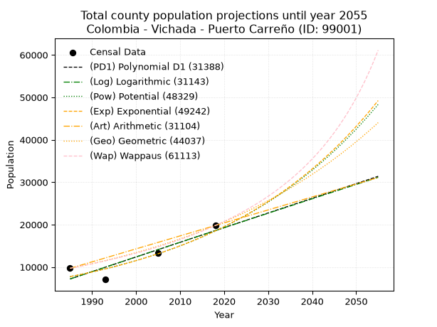
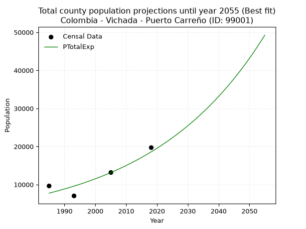
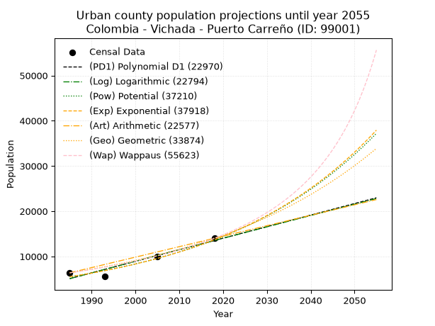
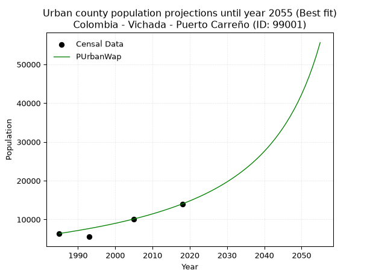
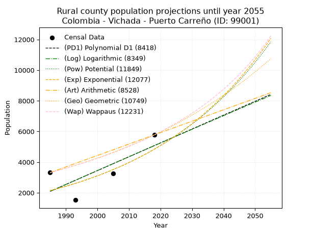
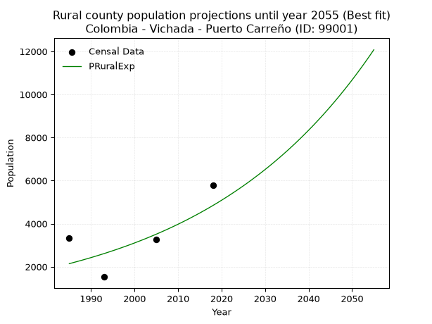

<div align="center">


</div>

# 📜 _“Population and Public Services Demand Projections (PPSD) until Year 2050 for Colombia - Vichada - Puerto Carreño (ID: 99001)”_
Keywords: `population` `public-service` `projection` `lineal` `polynomial` `logarithmic` `potential` `exponential` `arithmetic` `geometric` `wappaus` `dane` `colombia` `south-america`

PPSD are analytical estimates used by governments and planners to anticipate future changes in population size, age distribution, and the resulting community needs for utilities, healthcare, education, and infrastructure as sizing future water treatment facilities, electrical grids, and road networks based on spatial growth.

<div align="center">

</img>

</div>


> **General running parameters**: • app_version: _v20260806_. • Python version: _3.14.7_. • Pandas version: _3.0.5_. • NumPy version: _2.5.1_. • Creates, save and include plots into reports (create_plot): _False_. • Projection until year: _2050_. • Process polynomial degree 2 and up: _False_. • Process Wappaus: _True_. • Process Wappaus: _True_. • Set negative values to zero: _True_. • Set infinite values to zero: _True_. • Drop dataset notes: _True_. 
<div align="center">

Maps & GIS Layers: [:earth_americas:Google](http://maps.google.com/maps?q=6.186635736,-67.4870947) [:earth_americas:OSM](https://www.openstreetmap.org/#map=18/6.186635736/-67.4870947&layers=P) [:earth_americas:Bing](https://www.bing.com/maps?cp=6.186635736~-67.4870947&lvl=18) [:earth_americas:Apple](https://maps.apple.com/frame?center=6.186635736%2C-67.4870947&span=0.003%2C0.006) [:earth_americas:GISMobile](https://github.com/rcfdtools/R.GISMobile/blob/main/file/gis/CountyLayer_CO/Readme.md)

</div>


<div align="center">

```geojson
{
  "type": "Feature",
  "geometry": {
    "type": "Point", 
    "coordinates": [-67.4870947, 6.186635736]
  }, 
  "properties": {
    "Name": "Colombia - Vichada - Puerto Carreño (ID: 99001)"
  }
}
```

</div>


## 0. Census Data (4 records)

Census data are official statistics collected by a government about the people and housing in a country. They usually include counts of total population, age, sex, race, income, education, and jobs.

📅Global census file: [Population.xlsx](../data/Population.xlsx)

| Source   |   Year |   CountryID | CountryName   |   StateID | StateName   |   CountyID | CountyName     |   PTotal |   PUrban |   PRural |
|:---------|-------:|------------:|:--------------|----------:|:------------|-----------:|:---------------|---------:|---------:|---------:|
| DANE     |   1985 |          57 | Colombia      |        99 | Vichada     |      99001 | Puerto Carreño |     9695 |     6379 |     3316 |
| DANE     |   1993 |          57 | Colombia      |        99 | Vichada     |      99001 | Puerto Carreño |     7059 |     5534 |     1525 |
| DANE     |   2005 |          57 | Colombia      |        99 | Vichada     |      99001 | Puerto Carreño |    13288 |    10032 |     3256 |
| DANE     |   2018 |          57 | Colombia      |        99 | Vichada     |      99001 | Puerto Carreño |    19788 |    14015 |     5773 |

> 🔥Some records could had specific notes about the registered values or the corresponding urban or rural distribution.

📅[SUI-RUPS](https://www.datos.gov.co/Hacienda-y-Cr-dito-P-blico/Registro-nico-de-Prestadores-de-Servicios-P-blicos/4qkq-csdn/about_data) - Local public utility companies: [RUPS.csv](../data/RUPS.csv)

 | SERVICIO   | ESTADO    | NOMBRE                                             | NIT         | DEPARTAMENTO_DOMICILIO   | MUNICIPIO_DOMICILIO   | DIRECCION                       |   TELEFONO | EMAIL                       | TIPO_PRESTADOR                             | CLASIFICACION                  |
|:-----------|:----------|:---------------------------------------------------|:------------|:-------------------------|:----------------------|:--------------------------------|-----------:|:----------------------------|:-------------------------------------------|:-------------------------------|
| ACUEDUCTO  | OPERATIVA | SERVICIOS PUBLICOS DE PUERTO CARREÑO S.A.S.  E.S.P | 842000130-4 | VICHADA                  | PUERTO CARRENO        | Carrera 10 No 20-27 Las Acacias |    5654162 | direcciongeneral@seppca.com | SOCIEDADES (EMPRESA DE SERVICIOS PUBLICOS) | DESDE 2501 HASTA 5000 USUARIOS |

## 1. Total

### 1.1. Coefficients and Parameters

* (PD1) Polynomial Deg 1: 345.7703733440341, -679169.6892814043 (lineal)
* (Log) Logarithmic: 691466.1207658965, -5243382.02500332
* (Pow) Potential: 52.86492721122171, -170.44734572129562
* (Exp) Exponential: 0.026434248951624866, 1.2601468585515787e-19
* (Art) Arithmetic: Year diff. 2018 - 1985 = 33, Population diff. 19788 - 9695 = 10093, Annual growth = 305.8484848484849
* (Geo) Geometric: Year diff. 2018 - 1985 = 33, Population diff. 19788 - 9695 = 10093, Annual growth % = 0.02185557298634344
* (Wap) Wappaus: i = 2.074744665390122, Condition values only valid for < 200)

<sub>
Wappaus condition values: ['0.00', '2.07', '4.15', '6.22', '8.30', '10.37', '12.45', '14.52', '16.60', '18.67', '20.75', '22.82', '24.90', '26.97', '29.05', '31.12', '33.20', '35.27', '37.35', '39.42', '41.49', '43.57', '45.64', '47.72', '49.79', '51.87', '53.94', '56.02', '58.09', '60.17', '62.24', '64.32', '66.39', '68.47', '70.54', '72.62', '74.69', '76.77', '78.84', '80.92', '82.99', '85.06', '87.14', '89.21', '91.29', '93.36', '95.44', '97.51', '99.59', '101.66', '103.74', '105.81', '107.89', '109.96', '112.04', '114.11', '116.19', '118.26', '120.34', '122.41', '124.48', '126.56', '128.63', '130.71', '132.78', '134.86']
</sub>


### 1.2. Projected Dataset

|   Year |   CountyID |   PTotalPD1 |   PTotalLog |   PTotalPow |   PTotalExp |   PTotalArt |   PTotalGeo |   PTotalWap |
|-------:|-----------:|------------:|------------:|------------:|------------:|------------:|------------:|------------:|
|   1985 |      99001 |        7185 |        7179 |        7736 |        7740 |        9695 |        9695 |        9695 |
|   1986 |      99001 |        7530 |        7527 |        7945 |        7947 |       10001 |        9907 |        9898 |
|   1987 |      99001 |        7876 |        7875 |        8159 |        8160 |       10307 |       10123 |       10106 |
|   1988 |      99001 |        8222 |        8223 |        8379 |        8378 |       10613 |       10345 |       10318 |
|   1989 |      99001 |        8568 |        8571 |        8605 |        8603 |       10918 |       10571 |       10534 |
|   1990 |      99001 |        8913 |        8919 |        8837 |        8833 |       11224 |       10802 |       10756 |
|   1991 |      99001 |        9259 |        9266 |        9074 |        9070 |       11530 |       11038 |       10982 |
|   1992 |      99001 |        9605 |        9613 |        9318 |        9313 |       11836 |       11279 |       11213 |
|   1993 |      99001 |        9951 |        9960 |        9569 |        9562 |       12142 |       11526 |       11450 |
|   1994 |      99001 |       10296 |       10307 |        9826 |        9818 |       12448 |       11778 |       11692 |
|   1995 |      99001 |       10642 |       10654 |       10090 |       10081 |       12753 |       12035 |       11939 |
|   1996 |      99001 |       10988 |       11000 |       10361 |       10351 |       13059 |       12298 |       12193 |
|   1997 |      99001 |       11334 |       11347 |       10639 |       10629 |       13365 |       12567 |       12452 |
|   1998 |      99001 |       11680 |       11693 |       10924 |       10913 |       13671 |       12841 |       12718 |
|   1999 |      99001 |       12025 |       12039 |       11217 |       11206 |       13977 |       13122 |       12990 |
|   2000 |      99001 |       12371 |       12385 |       11518 |       11506 |       14283 |       13409 |       13268 |
|   2001 |      99001 |       12717 |       12730 |       11826 |       11814 |       14589 |       13702 |       13554 |
|   2002 |      99001 |       13063 |       13076 |       12143 |       12130 |       14894 |       14001 |       13847 |
|   2003 |      99001 |       13408 |       13421 |       12467 |       12455 |       15200 |       14307 |       14147 |
|   2004 |      99001 |       13754 |       13766 |       12801 |       12789 |       15506 |       14620 |       14455 |
|   2005 |      99001 |       14100 |       14111 |       13143 |       13132 |       15812 |       14940 |       14771 |
|   2006 |      99001 |       14446 |       14456 |       13494 |       13483 |       16118 |       15266 |       15096 |
|   2007 |      99001 |       14791 |       14800 |       13854 |       13845 |       16424 |       15600 |       15429 |
|   2008 |      99001 |       15137 |       15145 |       14224 |       14215 |       16730 |       15941 |       15771 |
|   2009 |      99001 |       15483 |       15489 |       14603 |       14596 |       17035 |       16289 |       16123 |
|   2010 |      99001 |       15829 |       15833 |       14992 |       14987 |       17341 |       16645 |       16484 |
|   2011 |      99001 |       16175 |       16177 |       15392 |       15389 |       17647 |       17009 |       16856 |
|   2012 |      99001 |       16520 |       16521 |       15802 |       15801 |       17953 |       17381 |       17239 |
|   2013 |      99001 |       16866 |       16864 |       16222 |       16224 |       18259 |       17760 |       17633 |
|   2014 |      99001 |       17212 |       17208 |       16654 |       16659 |       18565 |       18149 |       18038 |
|   2015 |      99001 |       17558 |       17551 |       17097 |       17105 |       18870 |       18545 |       18456 |
|   2016 |      99001 |       17903 |       17894 |       17551 |       17563 |       19176 |       18951 |       18886 |
|   2017 |      99001 |       18249 |       18237 |       18017 |       18034 |       19482 |       19365 |       19330 |
|   2018 |      99001 |       18595 |       18580 |       18496 |       18517 |       19788 |       19788 |       19788 |
|   2019 |      99001 |       18941 |       18922 |       18987 |       19013 |       20094 |       20220 |       20261 |
|   2020 |      99001 |       19286 |       19265 |       19490 |       19522 |       20400 |       20662 |       20748 |
|   2021 |      99001 |       19632 |       19607 |       20007 |       20045 |       20706 |       21114 |       21252 |
|   2022 |      99001 |       19978 |       19949 |       20537 |       20582 |       21011 |       21575 |       21773 |
|   2023 |      99001 |       20324 |       20291 |       21081 |       21133 |       21317 |       22047 |       22312 |
|   2024 |      99001 |       20670 |       20633 |       21639 |       21699 |       21623 |       22529 |       22870 |
|   2025 |      99001 |       21015 |       20974 |       22211 |       22280 |       21929 |       23021 |       23447 |
|   2026 |      99001 |       21361 |       21316 |       22799 |       22877 |       22235 |       23524 |       24046 |
|   2027 |      99001 |       21707 |       21657 |       23401 |       23490 |       22541 |       24039 |       24666 |
|   2028 |      99001 |       22053 |       21998 |       24019 |       24119 |       22846 |       24564 |       25309 |
|   2029 |      99001 |       22398 |       22339 |       24654 |       24765 |       23152 |       25101 |       25977 |
|   2030 |      99001 |       22744 |       22679 |       25304 |       25429 |       23458 |       25649 |       26672 |
|   2031 |      99001 |       23090 |       23020 |       25972 |       26110 |       23764 |       26210 |       27393 |
|   2032 |      99001 |       23436 |       23360 |       26656 |       26809 |       24070 |       26783 |       28144 |
|   2033 |      99001 |       23781 |       23701 |       27359 |       27527 |       24376 |       27368 |       28926 |
|   2034 |      99001 |       24127 |       24041 |       28079 |       28265 |       24682 |       27966 |       29741 |
|   2035 |      99001 |       24473 |       24381 |       28818 |       29022 |       24987 |       28577 |       30591 |
|   2036 |      99001 |       24819 |       24720 |       29577 |       29799 |       25293 |       29202 |       31478 |
|   2037 |      99001 |       25165 |       25060 |       30355 |       30598 |       25599 |       29840 |       32405 |
|   2038 |      99001 |       25510 |       25399 |       31152 |       31417 |       25905 |       30492 |       33375 |
|   2039 |      99001 |       25856 |       25738 |       31971 |       32259 |       26211 |       31159 |       34391 |
|   2040 |      99001 |       26202 |       26077 |       32810 |       33123 |       26517 |       31840 |       35456 |
|   2041 |      99001 |       26548 |       26416 |       33672 |       34010 |       26823 |       32536 |       36574 |
|   2042 |      99001 |       26893 |       26755 |       34555 |       34921 |       27128 |       33247 |       37748 |
|   2043 |      99001 |       27239 |       27093 |       35461 |       35857 |       27434 |       33973 |       38984 |
|   2044 |      99001 |       27585 |       27432 |       36390 |       36817 |       27740 |       34716 |       40286 |
|   2045 |      99001 |       27931 |       27770 |       37344 |       37803 |       28046 |       35475 |       41659 |
|   2046 |      99001 |       28276 |       28108 |       38321 |       38816 |       28352 |       36250 |       43110 |
|   2047 |      99001 |       28622 |       28446 |       39324 |       39856 |       28658 |       37042 |       44645 |
|   2048 |      99001 |       28968 |       28784 |       40353 |       40923 |       28963 |       37852 |       46272 |
|   2049 |      99001 |       29314 |       29121 |       41407 |       42019 |       29269 |       38679 |       47999 |
|   2050 |      99001 |       29660 |       29459 |       42489 |       43145 |       29575 |       39525 |       49837 |
<div align="center">

</img>

</div>


### 1.3. Best fit with absolute and relative error (%)

Relative error puts that difference into context by dividing the absolute error by the true value, creating a unitless ratio or percentage that shows the scale of the mistake.

Absolute and relative error

|   Year | Source   |   CountryID | CountryName   |   StateID | StateName   |   CountyID_x | CountyName     |   PTotal |   PUrban |   PRural |   CountyID_y |   PTotalPD1 |   PTotalLog |   PTotalPow |   PTotalExp |   PTotalArt |   PTotalGeo |   PTotalWap |   PTotalPD1AbsError |   PTotalLogAbsError |   PTotalPowAbsError |   PTotalExpAbsError |   PTotalArtAbsError |   PTotalGeoAbsError |   PTotalWapAbsError |   PTotalPD1RelError |   PTotalLogRelError |   PTotalPowRelError |   PTotalExpRelError |   PTotalArtRelError |   PTotalGeoRelError |   PTotalWapRelError |
|-------:|:---------|------------:|:--------------|----------:|:------------|-------------:|:---------------|---------:|---------:|---------:|-------------:|------------:|------------:|------------:|------------:|------------:|------------:|------------:|--------------------:|--------------------:|--------------------:|--------------------:|--------------------:|--------------------:|--------------------:|--------------------:|--------------------:|--------------------:|--------------------:|--------------------:|--------------------:|--------------------:|
|   1985 | DANE     |          57 | Colombia      |        99 | Vichada     |        99001 | Puerto Carreño |     9695 |     6379 |     3316 |        99001 |        7185 |        7179 |        7736 |        7740 |        9695 |        9695 |        9695 |                2510 |                2516 |                1959 |                1955 |                   0 |                   0 |                   0 |            25.8896  |            25.9515  |            20.2063  |            20.165   |              0      |              0      |              0      |
|   1993 | DANE     |          57 | Colombia      |        99 | Vichada     |        99001 | Puerto Carreño |     7059 |     5534 |     1525 |        99001 |        9951 |        9960 |        9569 |        9562 |       12142 |       11526 |       11450 |                2892 |                2901 |                2510 |                2503 |                5083 |                4467 |                4391 |            40.969   |            41.0965  |            35.5574  |            35.4583  |             72.0074 |             63.2809 |             62.2043 |
|   2005 | DANE     |          57 | Colombia      |        99 | Vichada     |        99001 | Puerto Carreño |    13288 |    10032 |     3256 |        99001 |       14100 |       14111 |       13143 |       13132 |       15812 |       14940 |       14771 |                 812 |                 823 |                 145 |                 156 |                2524 |                1652 |                1483 |             6.11078 |             6.19356 |             1.09121 |             1.17399 |             18.9946 |             12.4323 |             11.1604 |
|   2018 | DANE     |          57 | Colombia      |        99 | Vichada     |        99001 | Puerto Carreño |    19788 |    14015 |     5773 |        99001 |       18595 |       18580 |       18496 |       18517 |       19788 |       19788 |       19788 |                1193 |                1208 |                1292 |                1271 |                   0 |                   0 |                   0 |             6.02891 |             6.10471 |             6.52921 |             6.42308 |              0      |              0      |              0      |

Relative error mean

| Method    |   RelError | Best   |
|:----------|-----------:|:-------|
| PTotalPD1 |    19.7496 |        |
| PTotalLog |    19.8366 |        |
| PTotalPow |    15.846  |        |
| PTotalExp |    15.8051 | True   |
| PTotalArt |    22.7505 |        |
| PTotalGeo |    18.9283 |        |
| PTotalWap |    18.3412 |        |

💙Best method: _**PTotalExp**_
<div align="center">

</img>

</div>


### 1.4. Fresh water supply demand in liters per capita per day (lpcd)

The fresh water supply demand typically ranges from 100 to 300 liters per capita per day (lpcd) for standard domestic and municipal planning, though absolute survival minimums set by the World Health Organization are as low as 7.5 to 20 liters per day, and total consumption in high-income nations can exceed 400 liters.

> `CZ`: Level in meters above the sea level (masl)<br> `WS`: Fresh water supply demand in liters per capita per day (lpcd or l/h/d)<br> `WSAll`: Zonal fresh water supply demand in liters per second (l/s)<br> `A`: Zonal area in square meters<br> `DP`: Population density (people/hectare or p/ha)

Reference values (RAS Colombia)

|    CZ |   WS |
|------:|-----:|
|  1000 |  120 |
|  2000 |  130 |
| 99999 |  140 |

County shapefile geometry properties and water supply values

|   CountyID |      ATotal |   CZTotal |   WSTotal |
|-----------:|------------:|----------:|----------:|
|      99001 | 1.18609e+10 |    78.458 |       120 |

Projected values for best method: PTotalExp

|   CountyID |   Year |   PTotalExp |   DPTotal |   WSTotal |   WSTotalAll |
|-----------:|-------:|------------:|----------:|----------:|-------------:|
|      99001 |   1985 |        7740 |      0.01 |       120 |      10.75   |
|      99001 |   1986 |        7947 |      0.01 |       120 |      11.0375 |
|      99001 |   1987 |        8160 |      0.01 |       120 |      11.3333 |
|      99001 |   1988 |        8378 |      0.01 |       120 |      11.6361 |
|      99001 |   1989 |        8603 |      0.01 |       120 |      11.9486 |
|      99001 |   1990 |        8833 |      0.01 |       120 |      12.2681 |
|      99001 |   1991 |        9070 |      0.01 |       120 |      12.5972 |
|      99001 |   1992 |        9313 |      0.01 |       120 |      12.9347 |
|      99001 |   1993 |        9562 |      0.01 |       120 |      13.2806 |
|      99001 |   1994 |        9818 |      0.01 |       120 |      13.6361 |
|      99001 |   1995 |       10081 |      0.01 |       120 |      14.0014 |
|      99001 |   1996 |       10351 |      0.01 |       120 |      14.3764 |
|      99001 |   1997 |       10629 |      0.01 |       120 |      14.7625 |
|      99001 |   1998 |       10913 |      0.01 |       120 |      15.1569 |
|      99001 |   1999 |       11206 |      0.01 |       120 |      15.5639 |
|      99001 |   2000 |       11506 |      0.01 |       120 |      15.9806 |
|      99001 |   2001 |       11814 |      0.01 |       120 |      16.4083 |
|      99001 |   2002 |       12130 |      0.01 |       120 |      16.8472 |
|      99001 |   2003 |       12455 |      0.01 |       120 |      17.2986 |
|      99001 |   2004 |       12789 |      0.01 |       120 |      17.7625 |
|      99001 |   2005 |       13132 |      0.01 |       120 |      18.2389 |
|      99001 |   2006 |       13483 |      0.01 |       120 |      18.7264 |
|      99001 |   2007 |       13845 |      0.01 |       120 |      19.2292 |
|      99001 |   2008 |       14215 |      0.01 |       120 |      19.7431 |
|      99001 |   2009 |       14596 |      0.01 |       120 |      20.2722 |
|      99001 |   2010 |       14987 |      0.01 |       120 |      20.8153 |
|      99001 |   2011 |       15389 |      0.01 |       120 |      21.3736 |
|      99001 |   2012 |       15801 |      0.01 |       120 |      21.9458 |
|      99001 |   2013 |       16224 |      0.01 |       120 |      22.5333 |
|      99001 |   2014 |       16659 |      0.01 |       120 |      23.1375 |
|      99001 |   2015 |       17105 |      0.01 |       120 |      23.7569 |
|      99001 |   2016 |       17563 |      0.01 |       120 |      24.3931 |
|      99001 |   2017 |       18034 |      0.02 |       120 |      25.0472 |
|      99001 |   2018 |       18517 |      0.02 |       120 |      25.7181 |
|      99001 |   2019 |       19013 |      0.02 |       120 |      26.4069 |
|      99001 |   2020 |       19522 |      0.02 |       120 |      27.1139 |
|      99001 |   2021 |       20045 |      0.02 |       120 |      27.8403 |
|      99001 |   2022 |       20582 |      0.02 |       120 |      28.5861 |
|      99001 |   2023 |       21133 |      0.02 |       120 |      29.3514 |
|      99001 |   2024 |       21699 |      0.02 |       120 |      30.1375 |
|      99001 |   2025 |       22280 |      0.02 |       120 |      30.9444 |
|      99001 |   2026 |       22877 |      0.02 |       120 |      31.7736 |
|      99001 |   2027 |       23490 |      0.02 |       120 |      32.625  |
|      99001 |   2028 |       24119 |      0.02 |       120 |      33.4986 |
|      99001 |   2029 |       24765 |      0.02 |       120 |      34.3958 |
|      99001 |   2030 |       25429 |      0.02 |       120 |      35.3181 |
|      99001 |   2031 |       26110 |      0.02 |       120 |      36.2639 |
|      99001 |   2032 |       26809 |      0.02 |       120 |      37.2347 |
|      99001 |   2033 |       27527 |      0.02 |       120 |      38.2319 |
|      99001 |   2034 |       28265 |      0.02 |       120 |      39.2569 |
|      99001 |   2035 |       29022 |      0.02 |       120 |      40.3083 |
|      99001 |   2036 |       29799 |      0.03 |       120 |      41.3875 |
|      99001 |   2037 |       30598 |      0.03 |       120 |      42.4972 |
|      99001 |   2038 |       31417 |      0.03 |       120 |      43.6347 |
|      99001 |   2039 |       32259 |      0.03 |       120 |      44.8042 |
|      99001 |   2040 |       33123 |      0.03 |       120 |      46.0042 |
|      99001 |   2041 |       34010 |      0.03 |       120 |      47.2361 |
|      99001 |   2042 |       34921 |      0.03 |       120 |      48.5014 |
|      99001 |   2043 |       35857 |      0.03 |       120 |      49.8014 |
|      99001 |   2044 |       36817 |      0.03 |       120 |      51.1347 |
|      99001 |   2045 |       37803 |      0.03 |       120 |      52.5042 |
|      99001 |   2046 |       38816 |      0.03 |       120 |      53.9111 |
|      99001 |   2047 |       39856 |      0.03 |       120 |      55.3556 |
|      99001 |   2048 |       40923 |      0.03 |       120 |      56.8375 |
|      99001 |   2049 |       42019 |      0.04 |       120 |      58.3597 |
|      99001 |   2050 |       43145 |      0.04 |       120 |      59.9236 |

## 2. Urban

### 2.1. Coefficients and Parameters

* (PD1) Polynomial Deg 1: 255.3464472099531, -501766.7310317087 (lineal)
* (Log) Logarithmic: 510812.6604506764, -3873701.125481354
* (Pow) Potential: 55.10497563533154, -177.98176048167915
* (Exp) Exponential: 0.027542678916613064, 9.946854073751237e-21
* (Art) Arithmetic: Year diff. 2018 - 1985 = 33, Population diff. 14015 - 6379 = 7636, Annual growth = 231.3939393939394
* (Geo) Geometric: Year diff. 2018 - 1985 = 33, Population diff. 14015 - 6379 = 7636, Annual growth % = 0.02413876019007688
* (Wap) Wappaus: i = 2.2692354554667, Condition values only valid for < 200)

<sub>
Wappaus condition values: ['0.00', '2.27', '4.54', '6.81', '9.08', '11.35', '13.62', '15.88', '18.15', '20.42', '22.69', '24.96', '27.23', '29.50', '31.77', '34.04', '36.31', '38.58', '40.85', '43.12', '45.38', '47.65', '49.92', '52.19', '54.46', '56.73', '59.00', '61.27', '63.54', '65.81', '68.08', '70.35', '72.62', '74.88', '77.15', '79.42', '81.69', '83.96', '86.23', '88.50', '90.77', '93.04', '95.31', '97.58', '99.85', '102.12', '104.38', '106.65', '108.92', '111.19', '113.46', '115.73', '118.00', '120.27', '122.54', '124.81', '127.08', '129.35', '131.62', '133.88', '136.15', '138.42', '140.69', '142.96', '145.23', '147.50']
</sub>


### 2.2. Projected Dataset

|   Year |   CountyID |   PUrbanPD1 |   PUrbanLog |   PUrbanPow |   PUrbanExp |   PUrbanArt |   PUrbanGeo |   PUrbanWap |
|-------:|-----------:|------------:|------------:|------------:|------------:|------------:|------------:|------------:|
|   1985 |      99001 |        5096 |        5091 |        5511 |        5515 |        6379 |        6379 |        6379 |
|   1986 |      99001 |        5351 |        5348 |        5666 |        5669 |        6610 |        6533 |        6525 |
|   1987 |      99001 |        5607 |        5605 |        5826 |        5827 |        6842 |        6691 |        6675 |
|   1988 |      99001 |        5862 |        5862 |        5990 |        5990 |        7073 |        6852 |        6829 |
|   1989 |      99001 |        6117 |        6119 |        6158 |        6157 |        7305 |        7018 |        6986 |
|   1990 |      99001 |        6373 |        6376 |        6331 |        6329 |        7536 |        7187 |        7146 |
|   1991 |      99001 |        6628 |        6632 |        6509 |        6506 |        7767 |        7360 |        7311 |
|   1992 |      99001 |        6883 |        6889 |        6691 |        6687 |        7999 |        7538 |        7480 |
|   1993 |      99001 |        7139 |        7145 |        6879 |        6874 |        8230 |        7720 |        7653 |
|   1994 |      99001 |        7394 |        7401 |        7072 |        7066 |        8462 |        7906 |        7830 |
|   1995 |      99001 |        7649 |        7657 |        7270 |        7263 |        8693 |        8097 |        8012 |
|   1996 |      99001 |        7905 |        7913 |        7473 |        7466 |        8924 |        8293 |        8198 |
|   1997 |      99001 |        8160 |        8169 |        7682 |        7675 |        9156 |        8493 |        8390 |
|   1998 |      99001 |        8415 |        8425 |        7897 |        7889 |        9387 |        8698 |        8586 |
|   1999 |      99001 |        8671 |        8681 |        8118 |        8109 |        9619 |        8908 |        8788 |
|   2000 |      99001 |        8926 |        8936 |        8345 |        8336 |        9850 |        9123 |        8996 |
|   2001 |      99001 |        9182 |        9191 |        8578 |        8569 |       10081 |        9343 |        9209 |
|   2002 |      99001 |        9437 |        9447 |        8817 |        8808 |       10313 |        9569 |        9428 |
|   2003 |      99001 |        9692 |        9702 |        9063 |        9054 |       10544 |        9800 |        9653 |
|   2004 |      99001 |        9948 |        9957 |        9316 |        9307 |       10775 |       10036 |        9885 |
|   2005 |      99001 |       10203 |       10212 |        9576 |        9567 |       11007 |       10278 |       10124 |
|   2006 |      99001 |       10458 |       10466 |        9842 |        9834 |       11238 |       10527 |       10370 |
|   2007 |      99001 |       10714 |       10721 |       10117 |       10108 |       11470 |       10781 |       10623 |
|   2008 |      99001 |       10969 |       10975 |       10398 |       10391 |       11701 |       11041 |       10884 |
|   2009 |      99001 |       11224 |       11230 |       10687 |       10681 |       11932 |       11307 |       11153 |
|   2010 |      99001 |       11480 |       11484 |       10984 |       10979 |       12164 |       11580 |       11431 |
|   2011 |      99001 |       11735 |       11738 |       11290 |       11286 |       12395 |       11860 |       11717 |
|   2012 |      99001 |       11990 |       11992 |       11603 |       11601 |       12627 |       12146 |       12013 |
|   2013 |      99001 |       12246 |       12246 |       11925 |       11925 |       12858 |       12439 |       12319 |
|   2014 |      99001 |       12501 |       12499 |       12256 |       12258 |       13089 |       12740 |       12636 |
|   2015 |      99001 |       12756 |       12753 |       12596 |       12600 |       13321 |       13047 |       12963 |
|   2016 |      99001 |       13012 |       13006 |       12945 |       12952 |       13552 |       13362 |       13301 |
|   2017 |      99001 |       13267 |       13260 |       13304 |       13314 |       13784 |       13685 |       13652 |
|   2018 |      99001 |       13522 |       13513 |       13672 |       13686 |       14015 |       14015 |       14015 |
|   2019 |      99001 |       13778 |       13766 |       14051 |       14068 |       14246 |       14353 |       14392 |
|   2020 |      99001 |       14033 |       14019 |       14439 |       14461 |       14478 |       14700 |       14783 |
|   2021 |      99001 |       14288 |       14272 |       14839 |       14864 |       14709 |       15055 |       15189 |
|   2022 |      99001 |       14544 |       14524 |       15249 |       15279 |       14941 |       15418 |       15610 |
|   2023 |      99001 |       14799 |       14777 |       15670 |       15706 |       15172 |       15790 |       16049 |
|   2024 |      99001 |       15054 |       15029 |       16102 |       16145 |       15403 |       16171 |       16505 |
|   2025 |      99001 |       15310 |       15282 |       16547 |       16596 |       15635 |       16562 |       16981 |
|   2026 |      99001 |       15565 |       15534 |       17003 |       17059 |       15866 |       16961 |       17476 |
|   2027 |      99001 |       15821 |       15786 |       17472 |       17535 |       16098 |       17371 |       17993 |
|   2028 |      99001 |       16076 |       16038 |       17953 |       18025 |       16329 |       17790 |       18533 |
|   2029 |      99001 |       16331 |       16290 |       18447 |       18528 |       16560 |       18220 |       19098 |
|   2030 |      99001 |       16587 |       16541 |       18955 |       19046 |       16792 |       18659 |       19688 |
|   2031 |      99001 |       16842 |       16793 |       19477 |       19578 |       17023 |       19110 |       20307 |
|   2032 |      99001 |       17097 |       17044 |       20012 |       20124 |       17255 |       19571 |       20956 |
|   2033 |      99001 |       17353 |       17296 |       20562 |       20686 |       17486 |       20044 |       21637 |
|   2034 |      99001 |       17608 |       17547 |       21127 |       21264 |       17717 |       20527 |       22353 |
|   2035 |      99001 |       17863 |       17798 |       21707 |       21858 |       17949 |       21023 |       23106 |
|   2036 |      99001 |       18119 |       18049 |       22303 |       22468 |       18180 |       21530 |       23900 |
|   2037 |      99001 |       18374 |       18300 |       22914 |       23096 |       18411 |       22050 |       24738 |
|   2038 |      99001 |       18629 |       18550 |       23543 |       23741 |       18643 |       22582 |       25624 |
|   2039 |      99001 |       18885 |       18801 |       24188 |       24404 |       18874 |       23127 |       26561 |
|   2040 |      99001 |       19140 |       19052 |       24850 |       25085 |       19106 |       23686 |       27555 |
|   2041 |      99001 |       19395 |       19302 |       25530 |       25786 |       19337 |       24257 |       28611 |
|   2042 |      99001 |       19651 |       19552 |       26229 |       26506 |       19568 |       24843 |       29735 |
|   2043 |      99001 |       19906 |       19802 |       26946 |       27246 |       19800 |       25443 |       30934 |
|   2044 |      99001 |       20161 |       20052 |       27683 |       28007 |       20031 |       26057 |       32214 |
|   2045 |      99001 |       20417 |       20302 |       28439 |       28789 |       20263 |       26686 |       33586 |
|   2046 |      99001 |       20672 |       20552 |       29216 |       29593 |       20494 |       27330 |       35059 |
|   2047 |      99001 |       20927 |       20801 |       30013 |       30419 |       20725 |       27990 |       36644 |
|   2048 |      99001 |       21183 |       21051 |       30832 |       31269 |       20957 |       28665 |       38356 |
|   2049 |      99001 |       21438 |       21300 |       31672 |       32142 |       21188 |       29357 |       40209 |
|   2050 |      99001 |       21693 |       21549 |       32535 |       33040 |       21420 |       30066 |       42223 |
<div align="center">

</img>

</div>


### 2.3. Best fit with absolute and relative error (%)

Relative error puts that difference into context by dividing the absolute error by the true value, creating a unitless ratio or percentage that shows the scale of the mistake.

Absolute and relative error

|   Year | Source   |   CountryID | CountryName   |   StateID | StateName   |   CountyID_x | CountyName     |   PTotal |   PUrban |   PRural |   CountyID_y |   PUrbanPD1 |   PUrbanLog |   PUrbanPow |   PUrbanExp |   PUrbanArt |   PUrbanGeo |   PUrbanWap |   PUrbanPD1AbsError |   PUrbanLogAbsError |   PUrbanPowAbsError |   PUrbanExpAbsError |   PUrbanArtAbsError |   PUrbanGeoAbsError |   PUrbanWapAbsError |   PUrbanPD1RelError |   PUrbanLogRelError |   PUrbanPowRelError |   PUrbanExpRelError |   PUrbanArtRelError |   PUrbanGeoRelError |   PUrbanWapRelError |
|-------:|:---------|------------:|:--------------|----------:|:------------|-------------:|:---------------|---------:|---------:|---------:|-------------:|------------:|------------:|------------:|------------:|------------:|------------:|------------:|--------------------:|--------------------:|--------------------:|--------------------:|--------------------:|--------------------:|--------------------:|--------------------:|--------------------:|--------------------:|--------------------:|--------------------:|--------------------:|--------------------:|
|   1985 | DANE     |          57 | Colombia      |        99 | Vichada     |        99001 | Puerto Carreño |     9695 |     6379 |     3316 |        99001 |        5096 |        5091 |        5511 |        5515 |        6379 |        6379 |        6379 |                1283 |                1288 |                 868 |                 864 |                   0 |                   0 |                   0 |            20.1129  |            20.1913  |            13.6071  |            13.5444  |              0      |             0       |            0        |
|   1993 | DANE     |          57 | Colombia      |        99 | Vichada     |        99001 | Puerto Carreño |     7059 |     5534 |     1525 |        99001 |        7139 |        7145 |        6879 |        6874 |        8230 |        7720 |        7653 |                1605 |                1611 |                1345 |                1340 |                2696 |                2186 |                2119 |            29.0025  |            29.111   |            24.3043  |            24.214   |             48.717  |            39.5013  |           38.2906   |
|   2005 | DANE     |          57 | Colombia      |        99 | Vichada     |        99001 | Puerto Carreño |    13288 |    10032 |     3256 |        99001 |       10203 |       10212 |        9576 |        9567 |       11007 |       10278 |       10124 |                 171 |                 180 |                 456 |                 465 |                 975 |                 246 |                  92 |             1.70455 |             1.79426 |             4.54545 |             4.63517 |              9.7189 |             2.45215 |            0.917065 |
|   2018 | DANE     |          57 | Colombia      |        99 | Vichada     |        99001 | Puerto Carreño |    19788 |    14015 |     5773 |        99001 |       13522 |       13513 |       13672 |       13686 |       14015 |       14015 |       14015 |                 493 |                 502 |                 343 |                 329 |                   0 |                   0 |                   0 |             3.51766 |             3.58188 |             2.44738 |             2.34748 |              0      |             0       |            0        |

Relative error mean

| Method    |   RelError | Best   |
|:----------|-----------:|:-------|
| PUrbanPD1 |   13.5844  |        |
| PUrbanLog |   13.6696  |        |
| PUrbanPow |   11.2261  |        |
| PUrbanExp |   11.1853  |        |
| PUrbanArt |   14.609   |        |
| PUrbanGeo |   10.4884  |        |
| PUrbanWap |    9.80191 | True   |

💙Best method: _**PUrbanWap**_
<div align="center">

</img>

</div>


### 2.4. Fresh water supply demand in liters per capita per day (lpcd)

The fresh water supply demand typically ranges from 100 to 300 liters per capita per day (lpcd) for standard domestic and municipal planning, though absolute survival minimums set by the World Health Organization are as low as 7.5 to 20 liters per day, and total consumption in high-income nations can exceed 400 liters.

> `CZ`: Level in meters above the sea level (masl)<br> `WS`: Fresh water supply demand in liters per capita per day (lpcd or l/h/d)<br> `WSAll`: Zonal fresh water supply demand in liters per second (l/s)<br> `A`: Zonal area in square meters<br> `DP`: Population density (people/hectare or p/ha)

Reference values (RAS Colombia)

|    CZ |   WS |
|------:|-----:|
|  1000 |  120 |
|  2000 |  130 |
| 99999 |  140 |

County shapefile geometry properties and water supply values

|   CountyID |     AUrban |   CZUrban |   WSUrban |
|-----------:|-----------:|----------:|----------:|
|      99001 | 7.1087e+06 |    53.709 |       120 |

Projected values for best method: PUrbanWap

|   CountyID |   Year |   PUrbanWap |   DPUrban |   WSUrban |   WSUrbanAll |
|-----------:|-------:|------------:|----------:|----------:|-------------:|
|      99001 |   1985 |        6379 |      8.97 |       120 |      8.85972 |
|      99001 |   1986 |        6525 |      9.18 |       120 |      9.0625  |
|      99001 |   1987 |        6675 |      9.39 |       120 |      9.27083 |
|      99001 |   1988 |        6829 |      9.61 |       120 |      9.48472 |
|      99001 |   1989 |        6986 |      9.83 |       120 |      9.70278 |
|      99001 |   1990 |        7146 |     10.05 |       120 |      9.925   |
|      99001 |   1991 |        7311 |     10.28 |       120 |     10.1542  |
|      99001 |   1992 |        7480 |     10.52 |       120 |     10.3889  |
|      99001 |   1993 |        7653 |     10.77 |       120 |     10.6292  |
|      99001 |   1994 |        7830 |     11.01 |       120 |     10.875   |
|      99001 |   1995 |        8012 |     11.27 |       120 |     11.1278  |
|      99001 |   1996 |        8198 |     11.53 |       120 |     11.3861  |
|      99001 |   1997 |        8390 |     11.8  |       120 |     11.6528  |
|      99001 |   1998 |        8586 |     12.08 |       120 |     11.925   |
|      99001 |   1999 |        8788 |     12.36 |       120 |     12.2056  |
|      99001 |   2000 |        8996 |     12.65 |       120 |     12.4944  |
|      99001 |   2001 |        9209 |     12.95 |       120 |     12.7903  |
|      99001 |   2002 |        9428 |     13.26 |       120 |     13.0944  |
|      99001 |   2003 |        9653 |     13.58 |       120 |     13.4069  |
|      99001 |   2004 |        9885 |     13.91 |       120 |     13.7292  |
|      99001 |   2005 |       10124 |     14.24 |       120 |     14.0611  |
|      99001 |   2006 |       10370 |     14.59 |       120 |     14.4028  |
|      99001 |   2007 |       10623 |     14.94 |       120 |     14.7542  |
|      99001 |   2008 |       10884 |     15.31 |       120 |     15.1167  |
|      99001 |   2009 |       11153 |     15.69 |       120 |     15.4903  |
|      99001 |   2010 |       11431 |     16.08 |       120 |     15.8764  |
|      99001 |   2011 |       11717 |     16.48 |       120 |     16.2736  |
|      99001 |   2012 |       12013 |     16.9  |       120 |     16.6847  |
|      99001 |   2013 |       12319 |     17.33 |       120 |     17.1097  |
|      99001 |   2014 |       12636 |     17.78 |       120 |     17.55    |
|      99001 |   2015 |       12963 |     18.24 |       120 |     18.0042  |
|      99001 |   2016 |       13301 |     18.71 |       120 |     18.4736  |
|      99001 |   2017 |       13652 |     19.2  |       120 |     18.9611  |
|      99001 |   2018 |       14015 |     19.72 |       120 |     19.4653  |
|      99001 |   2019 |       14392 |     20.25 |       120 |     19.9889  |
|      99001 |   2020 |       14783 |     20.8  |       120 |     20.5319  |
|      99001 |   2021 |       15189 |     21.37 |       120 |     21.0958  |
|      99001 |   2022 |       15610 |     21.96 |       120 |     21.6806  |
|      99001 |   2023 |       16049 |     22.58 |       120 |     22.2903  |
|      99001 |   2024 |       16505 |     23.22 |       120 |     22.9236  |
|      99001 |   2025 |       16981 |     23.89 |       120 |     23.5847  |
|      99001 |   2026 |       17476 |     24.58 |       120 |     24.2722  |
|      99001 |   2027 |       17993 |     25.31 |       120 |     24.9903  |
|      99001 |   2028 |       18533 |     26.07 |       120 |     25.7403  |
|      99001 |   2029 |       19098 |     26.87 |       120 |     26.525   |
|      99001 |   2030 |       19688 |     27.7  |       120 |     27.3444  |
|      99001 |   2031 |       20307 |     28.57 |       120 |     28.2042  |
|      99001 |   2032 |       20956 |     29.48 |       120 |     29.1056  |
|      99001 |   2033 |       21637 |     30.44 |       120 |     30.0514  |
|      99001 |   2034 |       22353 |     31.44 |       120 |     31.0458  |
|      99001 |   2035 |       23106 |     32.5  |       120 |     32.0917  |
|      99001 |   2036 |       23900 |     33.62 |       120 |     33.1944  |
|      99001 |   2037 |       24738 |     34.8  |       120 |     34.3583  |
|      99001 |   2038 |       25624 |     36.05 |       120 |     35.5889  |
|      99001 |   2039 |       26561 |     37.36 |       120 |     36.8903  |
|      99001 |   2040 |       27555 |     38.76 |       120 |     38.2708  |
|      99001 |   2041 |       28611 |     40.25 |       120 |     39.7375  |
|      99001 |   2042 |       29735 |     41.83 |       120 |     41.2986  |
|      99001 |   2043 |       30934 |     43.52 |       120 |     42.9639  |
|      99001 |   2044 |       32214 |     45.32 |       120 |     44.7417  |
|      99001 |   2045 |       33586 |     47.25 |       120 |     46.6472  |
|      99001 |   2046 |       35059 |     49.32 |       120 |     48.6931  |
|      99001 |   2047 |       36644 |     51.55 |       120 |     50.8944  |
|      99001 |   2048 |       38356 |     53.96 |       120 |     53.2722  |
|      99001 |   2049 |       40209 |     56.56 |       120 |     55.8458  |
|      99001 |   2050 |       42223 |     59.4  |       120 |     58.6431  |

## 3. Rural

### 3.1. Coefficients and Parameters

* (PD1) Polynomial Deg 1: 90.423926134081, -177402.95824969554 (lineal)
* (Log) Logarithmic: 180653.46031522023, -1369680.8995219655
* (Pow) Potential: 49.3507932368028, -159.41621851907587
* (Exp) Exponential: 0.02470652804130127, 1.0764466535641096e-18
* (Art) Arithmetic: Year diff. 2018 - 1985 = 33, Population diff. 5773 - 3316 = 2457, Annual growth = 74.45454545454545
* (Geo) Geometric: Year diff. 2018 - 1985 = 33, Population diff. 5773 - 3316 = 2457, Annual growth % = 0.016942919414022706
* (Wap) Wappaus: i = 1.6383440522509727, Condition values only valid for < 200)

<sub>
Wappaus condition values: ['0.00', '1.64', '3.28', '4.92', '6.55', '8.19', '9.83', '11.47', '13.11', '14.75', '16.38', '18.02', '19.66', '21.30', '22.94', '24.58', '26.21', '27.85', '29.49', '31.13', '32.77', '34.41', '36.04', '37.68', '39.32', '40.96', '42.60', '44.24', '45.87', '47.51', '49.15', '50.79', '52.43', '54.07', '55.70', '57.34', '58.98', '60.62', '62.26', '63.90', '65.53', '67.17', '68.81', '70.45', '72.09', '73.73', '75.36', '77.00', '78.64', '80.28', '81.92', '83.56', '85.19', '86.83', '88.47', '90.11', '91.75', '93.39', '95.02', '96.66', '98.30', '99.94', '101.58', '103.22', '104.85', '106.49']
</sub>


### 3.2. Projected Dataset

|   Year |   CountyID |   PRuralPD1 |   PRuralLog |   PRuralPow |   PRuralExp |   PRuralArt |   PRuralGeo |   PRuralWap |
|-------:|-----------:|------------:|------------:|------------:|------------:|------------:|------------:|------------:|
|   1985 |      99001 |        2089 |        2088 |        2142 |        2142 |        3316 |        3316 |        3316 |
|   1986 |      99001 |        2179 |        2179 |        2196 |        2196 |        3390 |        3372 |        3371 |
|   1987 |      99001 |        2269 |        2270 |        2251 |        2251 |        3465 |        3429 |        3426 |
|   1988 |      99001 |        2360 |        2361 |        2308 |        2307 |        3539 |        3487 |        3483 |
|   1989 |      99001 |        2450 |        2452 |        2366 |        2365 |        3614 |        3547 |        3541 |
|   1990 |      99001 |        2541 |        2543 |        2425 |        2424 |        3688 |        3607 |        3599 |
|   1991 |      99001 |        2631 |        2634 |        2486 |        2485 |        3763 |        3668 |        3659 |
|   1992 |      99001 |        2722 |        2724 |        2549 |        2547 |        3837 |        3730 |        3719 |
|   1993 |      99001 |        2812 |        2815 |        2613 |        2610 |        3912 |        3793 |        3781 |
|   1994 |      99001 |        2902 |        2906 |        2678 |        2676 |        3986 |        3857 |        3844 |
|   1995 |      99001 |        2993 |        2996 |        2745 |        2743 |        4061 |        3923 |        3908 |
|   1996 |      99001 |        3083 |        3087 |        2814 |        2811 |        4135 |        3989 |        3973 |
|   1997 |      99001 |        3174 |        3177 |        2884 |        2882 |        4209 |        4057 |        4039 |
|   1998 |      99001 |        3264 |        3268 |        2957 |        2954 |        4284 |        4125 |        4106 |
|   1999 |      99001 |        3354 |        3358 |        3030 |        3027 |        4358 |        4195 |        4175 |
|   2000 |      99001 |        3445 |        3448 |        3106 |        3103 |        4433 |        4266 |        4245 |
|   2001 |      99001 |        3535 |        3539 |        3184 |        3181 |        4507 |        4339 |        4316 |
|   2002 |      99001 |        3626 |        3629 |        3263 |        3260 |        4582 |        4412 |        4389 |
|   2003 |      99001 |        3716 |        3719 |        3345 |        3342 |        4656 |        4487 |        4463 |
|   2004 |      99001 |        3807 |        3809 |        3428 |        3426 |        4731 |        4563 |        4538 |
|   2005 |      99001 |        3897 |        3900 |        3514 |        3511 |        4805 |        4640 |        4615 |
|   2006 |      99001 |        3987 |        3990 |        3601 |        3599 |        4880 |        4719 |        4694 |
|   2007 |      99001 |        4078 |        4080 |        3691 |        3689 |        4954 |        4799 |        4774 |
|   2008 |      99001 |        4168 |        4170 |        3783 |        3781 |        5028 |        4880 |        4856 |
|   2009 |      99001 |        4259 |        4260 |        3877 |        3876 |        5103 |        4963 |        4939 |
|   2010 |      99001 |        4349 |        4349 |        3973 |        3973 |        5177 |        5047 |        5024 |
|   2011 |      99001 |        4440 |        4439 |        4072 |        4072 |        5252 |        5132 |        5111 |
|   2012 |      99001 |        4530 |        4529 |        4173 |        4174 |        5326 |        5219 |        5199 |
|   2013 |      99001 |        4620 |        4619 |        4277 |        4279 |        5401 |        5308 |        5290 |
|   2014 |      99001 |        4711 |        4709 |        4383 |        4386 |        5475 |        5398 |        5382 |
|   2015 |      99001 |        4801 |        4798 |        4491 |        4495 |        5550 |        5489 |        5477 |
|   2016 |      99001 |        4892 |        4888 |        4603 |        4608 |        5624 |        5582 |        5573 |
|   2017 |      99001 |        4982 |        4977 |        4717 |        4723 |        5699 |        5677 |        5672 |
|   2018 |      99001 |        5073 |        5067 |        4834 |        4841 |        5773 |        5773 |        5773 |
|   2019 |      99001 |        5163 |        5157 |        4953 |        4962 |        5847 |        5871 |        5876 |
|   2020 |      99001 |        5253 |        5246 |        5076 |        5086 |        5922 |        5970 |        5982 |
|   2021 |      99001 |        5344 |        5335 |        5201 |        5214 |        5996 |        6071 |        6090 |
|   2022 |      99001 |        5434 |        5425 |        5330 |        5344 |        6071 |        6174 |        6200 |
|   2023 |      99001 |        5525 |        5514 |        5461 |        5478 |        6145 |        6279 |        6314 |
|   2024 |      99001 |        5615 |        5603 |        5596 |        5615 |        6220 |        6385 |        6429 |
|   2025 |      99001 |        5705 |        5693 |        5734 |        5755 |        6294 |        6493 |        6548 |
|   2026 |      99001 |        5796 |        5782 |        5876 |        5899 |        6369 |        6603 |        6670 |
|   2027 |      99001 |        5886 |        5871 |        6021 |        6047 |        6443 |        6715 |        6795 |
|   2028 |      99001 |        5977 |        5960 |        6169 |        6198 |        6518 |        6829 |        6922 |
|   2029 |      99001 |        6067 |        6049 |        6321 |        6353 |        6592 |        6945 |        7054 |
|   2030 |      99001 |        6158 |        6138 |        6476 |        6512 |        6666 |        7063 |        7188 |
|   2031 |      99001 |        6248 |        6227 |        6636 |        6675 |        6741 |        7182 |        7326 |
|   2032 |      99001 |        6338 |        6316 |        6799 |        6842 |        6815 |        7304 |        7468 |
|   2033 |      99001 |        6429 |        6405 |        6966 |        7013 |        6890 |        7428 |        7614 |
|   2034 |      99001 |        6519 |        6494 |        7137 |        7188 |        6964 |        7553 |        7763 |
|   2035 |      99001 |        6610 |        6583 |        7312 |        7368 |        7039 |        7681 |        7917 |
|   2036 |      99001 |        6700 |        6671 |        7492 |        7552 |        7113 |        7812 |        8075 |
|   2037 |      99001 |        6791 |        6760 |        7676 |        7741 |        7188 |        7944 |        8237 |
|   2038 |      99001 |        6881 |        6849 |        7864 |        7935 |        7262 |        8079 |        8405 |
|   2039 |      99001 |        6971 |        6937 |        8057 |        8133 |        7337 |        8215 |        8577 |
|   2040 |      99001 |        7062 |        7026 |        8254 |        8337 |        7411 |        8355 |        8754 |
|   2041 |      99001 |        7152 |        7114 |        8456 |        8545 |        7485 |        8496 |        8937 |
|   2042 |      99001 |        7243 |        7203 |        8663 |        8759 |        7560 |        8640 |        9125 |
|   2043 |      99001 |        7333 |        7291 |        8875 |        8978 |        7634 |        8787 |        9319 |
|   2044 |      99001 |        7424 |        7380 |        9092 |        9203 |        7709 |        8935 |        9520 |
|   2045 |      99001 |        7514 |        7468 |        9314 |        9433 |        7783 |        9087 |        9726 |
|   2046 |      99001 |        7604 |        7556 |        9541 |        9669 |        7858 |        9241 |        9940 |
|   2047 |      99001 |        7695 |        7645 |        9774 |        9911 |        7932 |        9397 |       10161 |
|   2048 |      99001 |        7785 |        7733 |       10012 |       10159 |        8007 |        9556 |       10389 |
|   2049 |      99001 |        7876 |        7821 |       10257 |       10413 |        8081 |        9718 |       10625 |
|   2050 |      99001 |        7966 |        7909 |       10507 |       10673 |        8156 |        9883 |       10869 |
<div align="center">

</img>

</div>


### 3.3. Best fit with absolute and relative error (%)

Relative error puts that difference into context by dividing the absolute error by the true value, creating a unitless ratio or percentage that shows the scale of the mistake.

Absolute and relative error

|   Year | Source   |   CountryID | CountryName   |   StateID | StateName   |   CountyID_x | CountyName     |   PTotal |   PUrban |   PRural |   CountyID_y |   PRuralPD1 |   PRuralLog |   PRuralPow |   PRuralExp |   PRuralArt |   PRuralGeo |   PRuralWap |   PRuralPD1AbsError |   PRuralLogAbsError |   PRuralPowAbsError |   PRuralExpAbsError |   PRuralArtAbsError |   PRuralGeoAbsError |   PRuralWapAbsError |   PRuralPD1RelError |   PRuralLogRelError |   PRuralPowRelError |   PRuralExpRelError |   PRuralArtRelError |   PRuralGeoRelError |   PRuralWapRelError |
|-------:|:---------|------------:|:--------------|----------:|:------------|-------------:|:---------------|---------:|---------:|---------:|-------------:|------------:|------------:|------------:|------------:|------------:|------------:|------------:|--------------------:|--------------------:|--------------------:|--------------------:|--------------------:|--------------------:|--------------------:|--------------------:|--------------------:|--------------------:|--------------------:|--------------------:|--------------------:|--------------------:|
|   1985 | DANE     |          57 | Colombia      |        99 | Vichada     |        99001 | Puerto Carreño |     9695 |     6379 |     3316 |        99001 |        2089 |        2088 |        2142 |        2142 |        3316 |        3316 |        3316 |                1227 |                1228 |                1174 |                1174 |                   0 |                   0 |                   0 |             37.0024 |             37.0326 |            35.4041  |             35.4041 |              0      |              0      |              0      |
|   1993 | DANE     |          57 | Colombia      |        99 | Vichada     |        99001 | Puerto Carreño |     7059 |     5534 |     1525 |        99001 |        2812 |        2815 |        2613 |        2610 |        3912 |        3793 |        3781 |                1287 |                1290 |                1088 |                1085 |                2387 |                2268 |                2256 |             84.3934 |             84.5902 |            71.3443  |             71.1475 |            156.525  |            148.721  |            147.934  |
|   2005 | DANE     |          57 | Colombia      |        99 | Vichada     |        99001 | Puerto Carreño |    13288 |    10032 |     3256 |        99001 |        3897 |        3900 |        3514 |        3511 |        4805 |        4640 |        4615 |                 641 |                 644 |                 258 |                 255 |                1549 |                1384 |                1359 |             19.6867 |             19.7789 |             7.92383 |              7.8317 |             47.5737 |             42.5061 |             41.7383 |
|   2018 | DANE     |          57 | Colombia      |        99 | Vichada     |        99001 | Puerto Carreño |    19788 |    14015 |     5773 |        99001 |        5073 |        5067 |        4834 |        4841 |        5773 |        5773 |        5773 |                 700 |                 706 |                 939 |                 932 |                   0 |                   0 |                   0 |             12.1254 |             12.2293 |            16.2654  |             16.1441 |              0      |              0      |              0      |

Relative error mean

| Method    |   RelError | Best   |
|:----------|-----------:|:-------|
| PRuralPD1 |    38.302  |        |
| PRuralLog |    38.4077 |        |
| PRuralPow |    32.7344 |        |
| PRuralExp |    32.6319 | True   |
| PRuralArt |    51.0246 |        |
| PRuralGeo |    47.8069 |        |
| PRuralWap |    47.4182 |        |

💙Best method: _**PRuralExp**_
<div align="center">

</img>

</div>


### 3.4. Fresh water supply demand in liters per capita per day (lpcd)

The fresh water supply demand typically ranges from 100 to 300 liters per capita per day (lpcd) for standard domestic and municipal planning, though absolute survival minimums set by the World Health Organization are as low as 7.5 to 20 liters per day, and total consumption in high-income nations can exceed 400 liters.

> `CZ`: Level in meters above the sea level (masl)<br> `WS`: Fresh water supply demand in liters per capita per day (lpcd or l/h/d)<br> `WSAll`: Zonal fresh water supply demand in liters per second (l/s)<br> `A`: Zonal area in square meters<br> `DP`: Population density (people/hectare or p/ha)

Reference values (RAS Colombia)

|    CZ |   WS |
|------:|-----:|
|  1000 |  120 |
|  2000 |  130 |
| 99999 |  140 |

County shapefile geometry properties and water supply values

|   CountyID |      ARural |   CZRural |   WSRural |
|-----------:|------------:|----------:|----------:|
|      99001 | 1.18538e+10 |   78.4728 |       120 |

Projected values for best method: PRuralExp

|   CountyID |   Year |   PRuralExp |   DPRural |   WSRural |   WSRuralAll |
|-----------:|-------:|------------:|----------:|----------:|-------------:|
|      99001 |   1985 |        2142 |      0    |       120 |      2.975   |
|      99001 |   1986 |        2196 |      0    |       120 |      3.05    |
|      99001 |   1987 |        2251 |      0    |       120 |      3.12639 |
|      99001 |   1988 |        2307 |      0    |       120 |      3.20417 |
|      99001 |   1989 |        2365 |      0    |       120 |      3.28472 |
|      99001 |   1990 |        2424 |      0    |       120 |      3.36667 |
|      99001 |   1991 |        2485 |      0    |       120 |      3.45139 |
|      99001 |   1992 |        2547 |      0    |       120 |      3.5375  |
|      99001 |   1993 |        2610 |      0    |       120 |      3.625   |
|      99001 |   1994 |        2676 |      0    |       120 |      3.71667 |
|      99001 |   1995 |        2743 |      0    |       120 |      3.80972 |
|      99001 |   1996 |        2811 |      0    |       120 |      3.90417 |
|      99001 |   1997 |        2882 |      0    |       120 |      4.00278 |
|      99001 |   1998 |        2954 |      0    |       120 |      4.10278 |
|      99001 |   1999 |        3027 |      0    |       120 |      4.20417 |
|      99001 |   2000 |        3103 |      0    |       120 |      4.30972 |
|      99001 |   2001 |        3181 |      0    |       120 |      4.41806 |
|      99001 |   2002 |        3260 |      0    |       120 |      4.52778 |
|      99001 |   2003 |        3342 |      0    |       120 |      4.64167 |
|      99001 |   2004 |        3426 |      0    |       120 |      4.75833 |
|      99001 |   2005 |        3511 |      0    |       120 |      4.87639 |
|      99001 |   2006 |        3599 |      0    |       120 |      4.99861 |
|      99001 |   2007 |        3689 |      0    |       120 |      5.12361 |
|      99001 |   2008 |        3781 |      0    |       120 |      5.25139 |
|      99001 |   2009 |        3876 |      0    |       120 |      5.38333 |
|      99001 |   2010 |        3973 |      0    |       120 |      5.51806 |
|      99001 |   2011 |        4072 |      0    |       120 |      5.65556 |
|      99001 |   2012 |        4174 |      0    |       120 |      5.79722 |
|      99001 |   2013 |        4279 |      0    |       120 |      5.94306 |
|      99001 |   2014 |        4386 |      0    |       120 |      6.09167 |
|      99001 |   2015 |        4495 |      0    |       120 |      6.24306 |
|      99001 |   2016 |        4608 |      0    |       120 |      6.4     |
|      99001 |   2017 |        4723 |      0    |       120 |      6.55972 |
|      99001 |   2018 |        4841 |      0    |       120 |      6.72361 |
|      99001 |   2019 |        4962 |      0    |       120 |      6.89167 |
|      99001 |   2020 |        5086 |      0    |       120 |      7.06389 |
|      99001 |   2021 |        5214 |      0    |       120 |      7.24167 |
|      99001 |   2022 |        5344 |      0    |       120 |      7.42222 |
|      99001 |   2023 |        5478 |      0    |       120 |      7.60833 |
|      99001 |   2024 |        5615 |      0    |       120 |      7.79861 |
|      99001 |   2025 |        5755 |      0    |       120 |      7.99306 |
|      99001 |   2026 |        5899 |      0    |       120 |      8.19306 |
|      99001 |   2027 |        6047 |      0.01 |       120 |      8.39861 |
|      99001 |   2028 |        6198 |      0.01 |       120 |      8.60833 |
|      99001 |   2029 |        6353 |      0.01 |       120 |      8.82361 |
|      99001 |   2030 |        6512 |      0.01 |       120 |      9.04444 |
|      99001 |   2031 |        6675 |      0.01 |       120 |      9.27083 |
|      99001 |   2032 |        6842 |      0.01 |       120 |      9.50278 |
|      99001 |   2033 |        7013 |      0.01 |       120 |      9.74028 |
|      99001 |   2034 |        7188 |      0.01 |       120 |      9.98333 |
|      99001 |   2035 |        7368 |      0.01 |       120 |     10.2333  |
|      99001 |   2036 |        7552 |      0.01 |       120 |     10.4889  |
|      99001 |   2037 |        7741 |      0.01 |       120 |     10.7514  |
|      99001 |   2038 |        7935 |      0.01 |       120 |     11.0208  |
|      99001 |   2039 |        8133 |      0.01 |       120 |     11.2958  |
|      99001 |   2040 |        8337 |      0.01 |       120 |     11.5792  |
|      99001 |   2041 |        8545 |      0.01 |       120 |     11.8681  |
|      99001 |   2042 |        8759 |      0.01 |       120 |     12.1653  |
|      99001 |   2043 |        8978 |      0.01 |       120 |     12.4694  |
|      99001 |   2044 |        9203 |      0.01 |       120 |     12.7819  |
|      99001 |   2045 |        9433 |      0.01 |       120 |     13.1014  |
|      99001 |   2046 |        9669 |      0.01 |       120 |     13.4292  |
|      99001 |   2047 |        9911 |      0.01 |       120 |     13.7653  |
|      99001 |   2048 |       10159 |      0.01 |       120 |     14.1097  |
|      99001 |   2049 |       10413 |      0.01 |       120 |     14.4625  |
|      99001 |   2050 |       10673 |      0.01 |       120 |     14.8236  |

#

<div align="center"><br><sub>Share this research</sub></div><br>

<sub>**APPS & TOOLS & CONTENT DISCLAIMER**: • NO WARRANTY - This content and software is provided by <a href="https://github.com/rcfdtools" target="_blank">github.com/rcfdtools</a> "as is", without any express or implied warranty, including warranties of merchantability, fitness for a particular purpose, or non-infringement. There is no guarantee that the software will be error-free or operate without interruption. • LIMITATION OF LIABILITY - Neither the authors nor copyright holders will be liable for claims or damages arising from the software or its use. You are responsible for determining if the software is appropriate for your use and assume all associated risks, including errors, legal compliance, and data loss. • NO PROFESSIONAL ADVICE - The software provides general information and does not offer professional advice. It should not replace consultation with professional advisors. [Clauses and global license for rcfdtools use.](https://github.com/rcfdtools/rcfdtools/blob/main/LICENSE.md)</sub>

| [:house: Home](Readme.md)  | [:beginner: Help / Collab](https://github.com/rcfdtools/R.HydroTools/discussions/31) |
|----------------------------|-------------------------------------------------------------------------------------------|