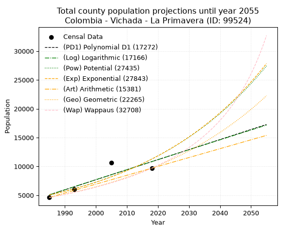
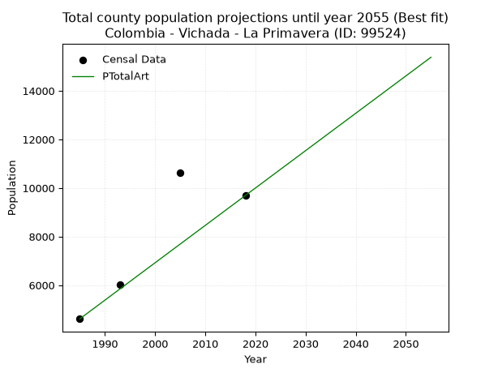
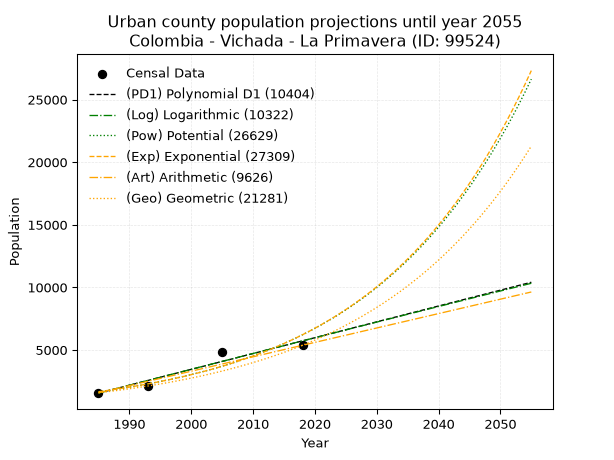
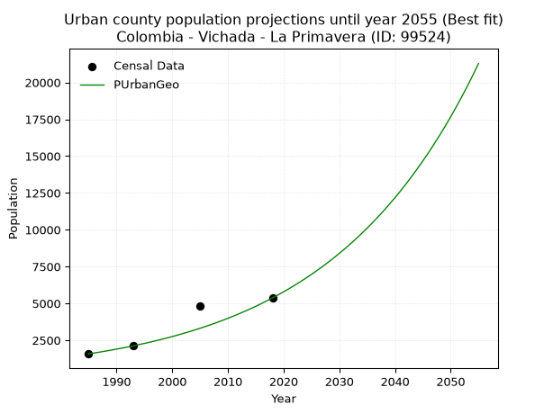
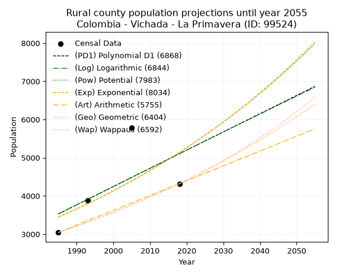
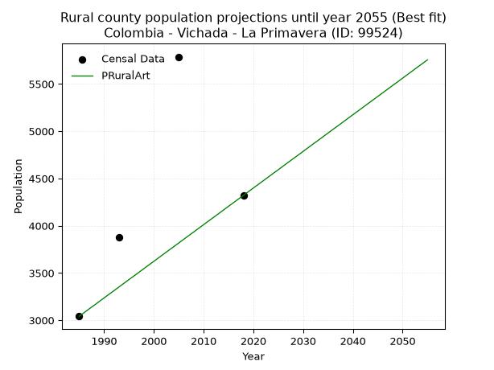

<div align="center">


</div>

# _“Population and Public Services Demand Projections (PPSD) until Year 2050 for Colombia - Vichada - La Primavera (ID: 99524)”_
Keywords: `population` `public-service` `projection` `lineal` `polynomial` `logarithmic` `potential` `exponential` `arithmetic` `geometric` `wappaus` `dane` `colombia` `south-america`

PPSD are analytical estimates used by governments and planners to anticipate future changes in population size, age distribution, and the resulting community needs for utilities, healthcare, education, and infrastructure as sizing future water treatment facilities, electrical grids, and road networks based on spatial growth.

> **General running parameters**: • app_version: _v20260806_. • Python version: _3.14.7_. • Pandas version: _3.0.5_. • NumPy version: _2.5.1_. • Creates, save and include plots into reports (create_plot): _False_. • Projection until year: _2050_. • Process polynomial degree 2 and up: _False_. • Process Wappaus: _True_. • Process Wappaus: _True_. • Set negative values to zero: _True_. • Set infinite values to zero: _True_. • Drop dataset notes: _True_. 
<div align="center">

Dynamic map: [:earth_americas:Google](http://maps.google.com/maps?q=5.486309071,-70.4105151) [:earth_americas:OSM](https://www.openstreetmap.org/#map=18/5.486309071/-70.4105151&layers=P) [:earth_americas:Bing](https://www.bing.com/maps?cp=5.486309071~-70.4105151&lvl=18) [:earth_americas:Apple](https://maps.apple.com/frame?center=5.486309071%2C-70.4105151&span=0.003%2C0.006)

</div>


<div align="center">

```geojson
{
  "type": "Feature",
  "geometry": {
    "type": "Point", 
    "coordinates": [-70.4105151, 5.486309071]
  }, 
  "properties": {
    "Name": "Colombia - Vichada - La Primavera (ID: 99524)"
  }
}
```

</div>


## 0. Census Data (4 records)

Census data are official statistics collected by a government about the people and housing in a country. They usually include counts of total population, age, sex, race, income, education, and jobs.

📅Global census file: [Population.xlsx](../data/Population.xlsx)

| Source   |   Year |   CountryID | CountryName   |   StateID | StateName   |   CountyID | CountyName   |   PTotal |   PUrban |   PRural |
|:---------|-------:|------------:|:--------------|----------:|:------------|-----------:|:-------------|---------:|---------:|---------:|
| DANE     |   1985 |          57 | Colombia      |        99 | Vichada     |      99524 | La Primavera |     4614 |     1572 |     3042 |
| DANE     |   1993 |          57 | Colombia      |        99 | Vichada     |      99524 | La Primavera |     6007 |     2133 |     3874 |
| DANE     |   2005 |          57 | Colombia      |        99 | Vichada     |      99524 | La Primavera |    10616 |     4829 |     5787 |
| DANE     |   2018 |          57 | Colombia      |        99 | Vichada     |      99524 | La Primavera |     9690 |     5369 |     4321 |

> 🔥Some records has specific notes about the registered values or the corresponding urban or rural distribution.

## 1. Total

### 1.1. Coefficients and Parameters

* (PD1) Polynomial Deg 1: 174.2420714572463, -340795.95343235694 (lineal)
* (Log) Logarithmic: 349121.11228264094, -2645940.6221413678
* (Pow) Potential: 48.95653318351248, -157.74547378615944
* (Exp) Exponential: 0.0244331372611963, 4.35260049231077e-18
* (Art) Arithmetic: Year diff. 2018 - 1985 = 33, Population diff. 9690 - 4614 = 5076, Annual growth = 153.8181818181818
* (Geo) Geometric: Year diff. 2018 - 1985 = 33, Population diff. 9690 - 4614 = 5076, Annual growth % = 0.022739515249921904
* (Wap) Wappaus: i = 2.150701647345943, Condition values only valid for < 200)

<sub>
Wappaus condition values: ['0.00', '2.15', '4.30', '6.45', '8.60', '10.75', '12.90', '15.05', '17.21', '19.36', '21.51', '23.66', '25.81', '27.96', '30.11', '32.26', '34.41', '36.56', '38.71', '40.86', '43.01', '45.16', '47.32', '49.47', '51.62', '53.77', '55.92', '58.07', '60.22', '62.37', '64.52', '66.67', '68.82', '70.97', '73.12', '75.27', '77.43', '79.58', '81.73', '83.88', '86.03', '88.18', '90.33', '92.48', '94.63', '96.78', '98.93', '101.08', '103.23', '105.38', '107.54', '109.69', '111.84', '113.99', '116.14', '118.29', '120.44', '122.59', '124.74', '126.89', '129.04', '131.19', '133.34', '135.49', '137.64', '139.80']
</sub>


### 1.2. Projected Dataset

|   Year |   CountyID |   PTotalPD1 |   PTotalLog |   PTotalPow |   PTotalExp |   PTotalArt |   PTotalGeo |   PTotalWap |
|-------:|-----------:|------------:|------------:|------------:|------------:|------------:|------------:|------------:|
|   1985 |      99524 |        5075 |        5067 |        5029 |        5034 |        4614 |        4614 |        4614 |
|   1986 |      99524 |        5249 |        5242 |        5154 |        5159 |        4768 |        4719 |        4714 |
|   1987 |      99524 |        5423 |        5418 |        5283 |        5286 |        4922 |        4826 |        4817 |
|   1988 |      99524 |        5597 |        5594 |        5414 |        5417 |        5075 |        4936 |        4922 |
|   1989 |      99524 |        5772 |        5769 |        5549 |        5551 |        5229 |        5048 |        5029 |
|   1990 |      99524 |        5946 |        5945 |        5688 |        5688 |        5383 |        5163 |        5138 |
|   1991 |      99524 |        6120 |        6120 |        5829 |        5829 |        5537 |        5280 |        5250 |
|   1992 |      99524 |        6294 |        6296 |        5974 |        5973 |        5691 |        5400 |        5365 |
|   1993 |      99524 |        6468 |        6471 |        6123 |        6121 |        5845 |        5523 |        5483 |
|   1994 |      99524 |        6643 |        6646 |        6275 |        6272 |        5998 |        5649 |        5603 |
|   1995 |      99524 |        6817 |        6821 |        6431 |        6428 |        6152 |        5777 |        5726 |
|   1996 |      99524 |        6991 |        6996 |        6591 |        6587 |        6306 |        5909 |        5852 |
|   1997 |      99524 |        7165 |        7171 |        6755 |        6749 |        6460 |        6043 |        5981 |
|   1998 |      99524 |        7340 |        7346 |        6922 |        6916 |        6614 |        6180 |        6114 |
|   1999 |      99524 |        7514 |        7520 |        7094 |        7087 |        6767 |        6321 |        6249 |
|   2000 |      99524 |        7688 |        7695 |        7270 |        7263 |        6921 |        6465 |        6389 |
|   2001 |      99524 |        7862 |        7869 |        7450 |        7442 |        7075 |        6612 |        6532 |
|   2002 |      99524 |        8037 |        8044 |        7634 |        7626 |        7229 |        6762 |        6678 |
|   2003 |      99524 |        8211 |        8218 |        7823 |        7815 |        7383 |        6916 |        6829 |
|   2004 |      99524 |        8385 |        8392 |        8017 |        8008 |        7537 |        7073 |        6984 |
|   2005 |      99524 |        8559 |        8567 |        8215 |        8207 |        7690 |        7234 |        7142 |
|   2006 |      99524 |        8734 |        8741 |        8418 |        8409 |        7844 |        7398 |        7306 |
|   2007 |      99524 |        8908 |        8915 |        8626 |        8617 |        7998 |        7567 |        7474 |
|   2008 |      99524 |        9082 |        9089 |        8839 |        8831 |        8152 |        7739 |        7646 |
|   2009 |      99524 |        9256 |        9262 |        9057 |        9049 |        8306 |        7915 |        7824 |
|   2010 |      99524 |        9431 |        9436 |        9280 |        9273 |        8459 |        8095 |        8007 |
|   2011 |      99524 |        9605 |        9610 |        9509 |        9502 |        8613 |        8279 |        8195 |
|   2012 |      99524 |        9779 |        9783 |        9743 |        9737 |        8767 |        8467 |        8389 |
|   2013 |      99524 |        9953 |        9957 |        9983 |        9978 |        8921 |        8660 |        8590 |
|   2014 |      99524 |       10128 |       10130 |       10229 |       10225 |        9075 |        8857 |        8796 |
|   2015 |      99524 |       10302 |       10304 |       10480 |       10478 |        9229 |        9058 |        9009 |
|   2016 |      99524 |       10476 |       10477 |       10738 |       10737 |        9382 |        9264 |        9229 |
|   2017 |      99524 |       10650 |       10650 |       11002 |       11003 |        9536 |        9475 |        9455 |
|   2018 |      99524 |       10825 |       10823 |       11272 |       11275 |        9690 |        9690 |        9690 |
|   2019 |      99524 |       10999 |       10996 |       11549 |       11554 |        9844 |        9910 |        9932 |
|   2020 |      99524 |       11173 |       11169 |       11832 |       11839 |        9998 |       10136 |       10183 |
|   2021 |      99524 |       11347 |       11342 |       12123 |       12132 |       10151 |       10366 |       10443 |
|   2022 |      99524 |       11522 |       11514 |       12420 |       12432 |       10305 |       10602 |       10712 |
|   2023 |      99524 |       11696 |       11687 |       12724 |       12740 |       10459 |       10843 |       10991 |
|   2024 |      99524 |       11870 |       11859 |       13036 |       13055 |       10613 |       11090 |       11280 |
|   2025 |      99524 |       12044 |       12032 |       13355 |       13378 |       10767 |       11342 |       11579 |
|   2026 |      99524 |       12218 |       12204 |       13681 |       13709 |       10921 |       11600 |       11891 |
|   2027 |      99524 |       12393 |       12377 |       14016 |       14048 |       11074 |       11863 |       12215 |
|   2028 |      99524 |       12567 |       12549 |       14358 |       14395 |       11228 |       12133 |       12551 |
|   2029 |      99524 |       12741 |       12721 |       14709 |       14751 |       11382 |       12409 |       12902 |
|   2030 |      99524 |       12915 |       12893 |       15068 |       15116 |       11536 |       12691 |       13267 |
|   2031 |      99524 |       13090 |       13065 |       15436 |       15490 |       11690 |       12980 |       13647 |
|   2032 |      99524 |       13264 |       13237 |       15813 |       15873 |       11843 |       13275 |       14044 |
|   2033 |      99524 |       13438 |       13408 |       16198 |       16266 |       11997 |       13577 |       14459 |
|   2034 |      99524 |       13612 |       13580 |       16593 |       16668 |       12151 |       13886 |       14892 |
|   2035 |      99524 |       13787 |       13752 |       16997 |       17080 |       12305 |       14201 |       15346 |
|   2036 |      99524 |       13961 |       13923 |       17411 |       17503 |       12459 |       14524 |       15821 |
|   2037 |      99524 |       14135 |       14095 |       17834 |       17936 |       12613 |       14855 |       16320 |
|   2038 |      99524 |       14309 |       14266 |       18268 |       18379 |       12766 |       15192 |       16843 |
|   2039 |      99524 |       14484 |       14437 |       18712 |       18834 |       12920 |       15538 |       17394 |
|   2040 |      99524 |       14658 |       14608 |       19167 |       19300 |       13074 |       15891 |       17973 |
|   2041 |      99524 |       14832 |       14780 |       19632 |       19777 |       13228 |       16252 |       18583 |
|   2042 |      99524 |       15006 |       14951 |       20109 |       20266 |       13382 |       16622 |       19228 |
|   2043 |      99524 |       15181 |       15121 |       20596 |       20767 |       13535 |       17000 |       19909 |
|   2044 |      99524 |       15355 |       15292 |       21096 |       21281 |       13689 |       17387 |       20631 |
|   2045 |      99524 |       15529 |       15463 |       21607 |       21807 |       13843 |       17782 |       21396 |
|   2046 |      99524 |       15703 |       15634 |       22130 |       22347 |       13997 |       18186 |       22209 |
|   2047 |      99524 |       15878 |       15804 |       22666 |       22900 |       14151 |       18600 |       23074 |
|   2048 |      99524 |       16052 |       15975 |       23215 |       23466 |       14305 |       19023 |       23997 |
|   2049 |      99524 |       16226 |       16145 |       23776 |       24046 |       14458 |       19455 |       24984 |
|   2050 |      99524 |       16400 |       16316 |       24351 |       24641 |       14612 |       19898 |       26042 |
<div align="center">

</img>

</div>


### 1.3. Best fit with absolute error and relative error (%)

Relative error puts that difference into context by dividing the absolute error by the true value, creating a unitless ratio or percentage that shows the scale of the mistake.

Absolute and relative error

|   Year | Source   |   CountryID | CountryName   |   StateID | StateName   |   CountyID_x | CountyName   |   PTotal |   PUrban |   PRural |   CountyID_y |   PTotalPD1 |   PTotalLog |   PTotalPow |   PTotalExp |   PTotalArt |   PTotalGeo |   PTotalWap |   PTotalPD1AbsError |   PTotalLogAbsError |   PTotalPowAbsError |   PTotalExpAbsError |   PTotalArtAbsError |   PTotalGeoAbsError |   PTotalWapAbsError |   PTotalPD1RelError |   PTotalLogRelError |   PTotalPowRelError |   PTotalExpRelError |   PTotalArtRelError |   PTotalGeoRelError |   PTotalWapRelError |
|-------:|:---------|------------:|:--------------|----------:|:------------|-------------:|:-------------|---------:|---------:|---------:|-------------:|------------:|------------:|------------:|------------:|------------:|------------:|------------:|--------------------:|--------------------:|--------------------:|--------------------:|--------------------:|--------------------:|--------------------:|--------------------:|--------------------:|--------------------:|--------------------:|--------------------:|--------------------:|--------------------:|
|   1985 | DANE     |          57 | Colombia      |        99 | Vichada     |        99524 | La Primavera |     4614 |     1572 |     3042 |        99524 |        5075 |        5067 |        5029 |        5034 |        4614 |        4614 |        4614 |                 461 |                 453 |                 415 |                 420 |                   0 |                   0 |                   0 |             9.99133 |             9.81795 |             8.99436 |             9.10273 |             0       |             0       |             0       |
|   1993 | DANE     |          57 | Colombia      |        99 | Vichada     |        99524 | La Primavera |     6007 |     2133 |     3874 |        99524 |        6468 |        6471 |        6123 |        6121 |        5845 |        5523 |        5483 |                 461 |                 464 |                 116 |                 114 |                 162 |                 484 |                 524 |             7.67438 |             7.72432 |             1.93108 |             1.89779 |             2.69685 |             8.05727 |             8.72316 |
|   2005 | DANE     |          57 | Colombia      |        99 | Vichada     |        99524 | La Primavera |    10616 |     4829 |     5787 |        99524 |        8559 |        8567 |        8215 |        8207 |        7690 |        7234 |        7142 |                2057 |                2049 |                2401 |                2409 |                2926 |                3382 |                3474 |            19.3764  |            19.3011  |            22.6168  |            22.6922  |            27.5622  |            31.8576  |            32.7242  |
|   2018 | DANE     |          57 | Colombia      |        99 | Vichada     |        99524 | La Primavera |     9690 |     5369 |     4321 |        99524 |       10825 |       10823 |       11272 |       11275 |        9690 |        9690 |        9690 |                1135 |                1133 |                1582 |                1585 |                   0 |                   0 |                   0 |            11.7131  |            11.6925  |            16.3261  |            16.3571  |             0       |             0       |             0       |

Relative error mean

| Method    |   RelError | Best   |
|:----------|-----------:|:-------|
| PTotalPD1 |   12.1888  |        |
| PTotalLog |   12.1339  |        |
| PTotalPow |   12.4671  |        |
| PTotalExp |   12.5124  |        |
| PTotalArt |    7.56476 | True   |
| PTotalGeo |    9.97871 |        |
| PTotalWap |   10.3618  |        |

💙Best method: _**PTotalArt**_
<div align="center">

</img>

</div>


### 1.4. Fresh water supply demand in liters per capita per day (lpcd)

The fresh water supply demand typically ranges from 100 to 300 liters per capita per day (lpcd) for standard domestic and municipal planning, though absolute survival minimums set by the World Health Organization are as low as 7.5 to 20 liters per day, and total consumption in high-income nations can exceed 400 liters.

> `CZ`: Level in meters above the sea level (masl).<br> `WS`: Fresh water supply demand in liters per capita per day (lpcd or l/h/d).<br> `WSAll`: Zonal fresh water supply demand in liters per second (l/s).<br> `A`: Zonal area in square meters.

Reference values (RAS Colombia)

|    CZ |   WS |
|------:|-----:|
|  1000 |  120 |
|  2000 |  130 |
| 99999 |  140 |

County shapefile geometry properties and water supply values

|   CountyID |      ATotal |   CZTotal |   WSTotal |
|-----------:|------------:|----------:|----------:|
|      99524 | 1.83683e+10 |    110.03 |       120 |

Projected values for best method: PTotalArt

|   CountyID |   Year |   PTotalArt |   WSTotal |   WSTotalAll |
|-----------:|-------:|------------:|----------:|-------------:|
|      99524 |   1985 |        4614 |       120 |      6.40833 |
|      99524 |   1986 |        4768 |       120 |      6.62222 |
|      99524 |   1987 |        4922 |       120 |      6.83611 |
|      99524 |   1988 |        5075 |       120 |      7.04861 |
|      99524 |   1989 |        5229 |       120 |      7.2625  |
|      99524 |   1990 |        5383 |       120 |      7.47639 |
|      99524 |   1991 |        5537 |       120 |      7.69028 |
|      99524 |   1992 |        5691 |       120 |      7.90417 |
|      99524 |   1993 |        5845 |       120 |      8.11806 |
|      99524 |   1994 |        5998 |       120 |      8.33056 |
|      99524 |   1995 |        6152 |       120 |      8.54444 |
|      99524 |   1996 |        6306 |       120 |      8.75833 |
|      99524 |   1997 |        6460 |       120 |      8.97222 |
|      99524 |   1998 |        6614 |       120 |      9.18611 |
|      99524 |   1999 |        6767 |       120 |      9.39861 |
|      99524 |   2000 |        6921 |       120 |      9.6125  |
|      99524 |   2001 |        7075 |       120 |      9.82639 |
|      99524 |   2002 |        7229 |       120 |     10.0403  |
|      99524 |   2003 |        7383 |       120 |     10.2542  |
|      99524 |   2004 |        7537 |       120 |     10.4681  |
|      99524 |   2005 |        7690 |       120 |     10.6806  |
|      99524 |   2006 |        7844 |       120 |     10.8944  |
|      99524 |   2007 |        7998 |       120 |     11.1083  |
|      99524 |   2008 |        8152 |       120 |     11.3222  |
|      99524 |   2009 |        8306 |       120 |     11.5361  |
|      99524 |   2010 |        8459 |       120 |     11.7486  |
|      99524 |   2011 |        8613 |       120 |     11.9625  |
|      99524 |   2012 |        8767 |       120 |     12.1764  |
|      99524 |   2013 |        8921 |       120 |     12.3903  |
|      99524 |   2014 |        9075 |       120 |     12.6042  |
|      99524 |   2015 |        9229 |       120 |     12.8181  |
|      99524 |   2016 |        9382 |       120 |     13.0306  |
|      99524 |   2017 |        9536 |       120 |     13.2444  |
|      99524 |   2018 |        9690 |       120 |     13.4583  |
|      99524 |   2019 |        9844 |       120 |     13.6722  |
|      99524 |   2020 |        9998 |       120 |     13.8861  |
|      99524 |   2021 |       10151 |       120 |     14.0986  |
|      99524 |   2022 |       10305 |       120 |     14.3125  |
|      99524 |   2023 |       10459 |       120 |     14.5264  |
|      99524 |   2024 |       10613 |       120 |     14.7403  |
|      99524 |   2025 |       10767 |       120 |     14.9542  |
|      99524 |   2026 |       10921 |       120 |     15.1681  |
|      99524 |   2027 |       11074 |       120 |     15.3806  |
|      99524 |   2028 |       11228 |       120 |     15.5944  |
|      99524 |   2029 |       11382 |       120 |     15.8083  |
|      99524 |   2030 |       11536 |       120 |     16.0222  |
|      99524 |   2031 |       11690 |       120 |     16.2361  |
|      99524 |   2032 |       11843 |       120 |     16.4486  |
|      99524 |   2033 |       11997 |       120 |     16.6625  |
|      99524 |   2034 |       12151 |       120 |     16.8764  |
|      99524 |   2035 |       12305 |       120 |     17.0903  |
|      99524 |   2036 |       12459 |       120 |     17.3042  |
|      99524 |   2037 |       12613 |       120 |     17.5181  |
|      99524 |   2038 |       12766 |       120 |     17.7306  |
|      99524 |   2039 |       12920 |       120 |     17.9444  |
|      99524 |   2040 |       13074 |       120 |     18.1583  |
|      99524 |   2041 |       13228 |       120 |     18.3722  |
|      99524 |   2042 |       13382 |       120 |     18.5861  |
|      99524 |   2043 |       13535 |       120 |     18.7986  |
|      99524 |   2044 |       13689 |       120 |     19.0125  |
|      99524 |   2045 |       13843 |       120 |     19.2264  |
|      99524 |   2046 |       13997 |       120 |     19.4403  |
|      99524 |   2047 |       14151 |       120 |     19.6542  |
|      99524 |   2048 |       14305 |       120 |     19.8681  |
|      99524 |   2049 |       14458 |       120 |     20.0806  |
|      99524 |   2050 |       14612 |       120 |     20.2944  |

## 2. Urban

### 2.1. Coefficients and Parameters

* (PD1) Polynomial Deg 1: 126.53592934564381, -249627.74267362402 (lineal)
* (Log) Logarithmic: 253365.30427096182, -1922355.9581057068
* (Pow) Potential: 80.14353801640212, -261.07509834916465
* (Exp) Exponential: 0.04001689414837102, 5.274983426542334e-32
* (Art) Arithmetic: Year diff. 2018 - 1985 = 33, Population diff. 5369 - 1572 = 3797, Annual growth = 115.06060606060606
* (Geo) Geometric: Year diff. 2018 - 1985 = 33, Population diff. 5369 - 1572 = 3797, Annual growth % = 0.03792237562884315
* (Wap) Wappaus: i = 3.3153898879298676, Condition values only valid for < 200)

<sub>
Wappaus condition values: ['0.00', '3.32', '6.63', '9.95', '13.26', '16.58', '19.89', '23.21', '26.52', '29.84', '33.15', '36.47', '39.78', '43.10', '46.42', '49.73', '53.05', '56.36', '59.68', '62.99', '66.31', '69.62', '72.94', '76.25', '79.57', '82.88', '86.20', '89.52', '92.83', '96.15', '99.46', '102.78', '106.09', '109.41', '112.72', '116.04', '119.35', '122.67', '125.98', '129.30', '132.62', '135.93', '139.25', '142.56', '145.88', '149.19', '152.51', '155.82', '159.14', '162.45', '165.77', '169.08', '172.40', '175.72', '179.03', '182.35', '185.66', '188.98', '192.29', '195.61', '198.92', '202.24', '205.55', '208.87', '212.18', '215.50']
</sub>


### 2.2. Projected Dataset

|   Year |   CountyID |   PUrbanPD1 |   PUrbanLog |   PUrbanPow |   PUrbanExp |   PUrbanArt |   PUrbanGeo |
|-------:|-----------:|------------:|------------:|------------:|------------:|------------:|------------:|
|   1985 |      99524 |        1546 |        1542 |        1656 |        1659 |        1572 |        1572 |
|   1986 |      99524 |        1673 |        1669 |        1724 |        1726 |        1687 |        1632 |
|   1987 |      99524 |        1799 |        1797 |        1795 |        1797 |        1802 |        1693 |
|   1988 |      99524 |        1926 |        1924 |        1869 |        1870 |        1917 |        1758 |
|   1989 |      99524 |        2052 |        2052 |        1946 |        1947 |        2032 |        1824 |
|   1990 |      99524 |        2179 |        2179 |        2026 |        2026 |        2147 |        1894 |
|   1991 |      99524 |        2305 |        2306 |        2109 |        2109 |        2262 |        1965 |
|   1992 |      99524 |        2432 |        2434 |        2196 |        2195 |        2377 |        2040 |
|   1993 |      99524 |        2558 |        2561 |        2286 |        2285 |        2492 |        2117 |
|   1994 |      99524 |        2685 |        2688 |        2380 |        2378 |        2608 |        2198 |
|   1995 |      99524 |        2811 |        2815 |        2477 |        2475 |        2723 |        2281 |
|   1996 |      99524 |        2938 |        2942 |        2579 |        2576 |        2838 |        2367 |
|   1997 |      99524 |        3065 |        3069 |        2685 |        2681 |        2953 |        2457 |
|   1998 |      99524 |        3191 |        3196 |        2794 |        2791 |        3068 |        2550 |
|   1999 |      99524 |        3318 |        3322 |        2909 |        2905 |        3183 |        2647 |
|   2000 |      99524 |        3444 |        3449 |        3028 |        3023 |        3298 |        2747 |
|   2001 |      99524 |        3571 |        3576 |        3152 |        3147 |        3413 |        2852 |
|   2002 |      99524 |        3697 |        3702 |        3280 |        3275 |        3528 |        2960 |
|   2003 |      99524 |        3824 |        3829 |        3414 |        3409 |        3643 |        3072 |
|   2004 |      99524 |        3950 |        3955 |        3554 |        3548 |        3758 |        3188 |
|   2005 |      99524 |        4077 |        4082 |        3699 |        3693 |        3873 |        3309 |
|   2006 |      99524 |        4203 |        4208 |        3849 |        3844 |        3988 |        3435 |
|   2007 |      99524 |        4330 |        4334 |        4006 |        4000 |        4103 |        3565 |
|   2008 |      99524 |        4456 |        4460 |        4169 |        4164 |        4218 |        3700 |
|   2009 |      99524 |        4583 |        4587 |        4339 |        4334 |        4333 |        3841 |
|   2010 |      99524 |        4709 |        4713 |        4516 |        4511 |        4449 |        3986 |
|   2011 |      99524 |        4836 |        4839 |        4699 |        4695 |        4564 |        4138 |
|   2012 |      99524 |        4963 |        4965 |        4890 |        4887 |        4679 |        4294 |
|   2013 |      99524 |        5089 |        5091 |        5089 |        5086 |        4794 |        4457 |
|   2014 |      99524 |        5216 |        5216 |        5296 |        5294 |        4909 |        4626 |
|   2015 |      99524 |        5342 |        5342 |        5511 |        5510 |        5024 |        4802 |
|   2016 |      99524 |        5469 |        5468 |        5734 |        5735 |        5139 |        4984 |
|   2017 |      99524 |        5595 |        5594 |        5967 |        5969 |        5254 |        5173 |
|   2018 |      99524 |        5722 |        5719 |        6208 |        6213 |        5369 |        5369 |
|   2019 |      99524 |        5848 |        5845 |        6460 |        6466 |        5484 |        5573 |
|   2020 |      99524 |        5975 |        5970 |        6721 |        6730 |        5599 |        5784 |
|   2021 |      99524 |        6101 |        6095 |        6993 |        7005 |        5714 |        6003 |
|   2022 |      99524 |        6228 |        6221 |        7276 |        7291 |        5829 |        6231 |
|   2023 |      99524 |        6354 |        6346 |        7570 |        7589 |        5944 |        6467 |
|   2024 |      99524 |        6481 |        6471 |        7876 |        7899 |        6059 |        6712 |
|   2025 |      99524 |        6608 |        6596 |        8194 |        8221 |        6174 |        6967 |
|   2026 |      99524 |        6734 |        6722 |        8525 |        8557 |        6289 |        7231 |
|   2027 |      99524 |        6861 |        6847 |        8869 |        8906 |        6405 |        7505 |
|   2028 |      99524 |        6987 |        6972 |        9226 |        9270 |        6520 |        7790 |
|   2029 |      99524 |        7114 |        7096 |        9598 |        9648 |        6635 |        8086 |
|   2030 |      99524 |        7240 |        7221 |        9985 |       10042 |        6750 |        8392 |
|   2031 |      99524 |        7367 |        7346 |       10387 |       10452 |        6865 |        8710 |
|   2032 |      99524 |        7493 |        7471 |       10805 |       10879 |        6980 |        9041 |
|   2033 |      99524 |        7620 |        7595 |       11239 |       11323 |        7095 |        9384 |
|   2034 |      99524 |        7746 |        7720 |       11691 |       11785 |        7210 |        9739 |
|   2035 |      99524 |        7873 |        7845 |       12161 |       12267 |        7325 |       10109 |
|   2036 |      99524 |        7999 |        7969 |       12649 |       12767 |        7440 |       10492 |
|   2037 |      99524 |        8126 |        8093 |       13157 |       13289 |        7555 |       10890 |
|   2038 |      99524 |        8252 |        8218 |       13685 |       13831 |        7670 |       11303 |
|   2039 |      99524 |        8379 |        8342 |       14233 |       14396 |        7785 |       11732 |
|   2040 |      99524 |        8506 |        8466 |       14804 |       14984 |        7900 |       12176 |
|   2041 |      99524 |        8632 |        8590 |       15397 |       15595 |        8015 |       12638 |
|   2042 |      99524 |        8759 |        8715 |       16013 |       16232 |        8130 |       13117 |
|   2043 |      99524 |        8885 |        8839 |       16654 |       16895 |        8246 |       13615 |
|   2044 |      99524 |        9012 |        8963 |       17320 |       17585 |        8361 |       14131 |
|   2045 |      99524 |        9138 |        9087 |       18013 |       18303 |        8476 |       14667 |
|   2046 |      99524 |        9265 |        9210 |       18732 |       19050 |        8591 |       15223 |
|   2047 |      99524 |        9391 |        9334 |       19481 |       19828 |        8706 |       15801 |
|   2048 |      99524 |        9518 |        9458 |       20258 |       20637 |        8821 |       16400 |
|   2049 |      99524 |        9644 |        9582 |       21066 |       21480 |        8936 |       17022 |
|   2050 |      99524 |        9771 |        9705 |       21907 |       22357 |        9051 |       17667 |
<div align="center">

</img>

</div>


### 2.3. Best fit with absolute error and relative error (%)

Relative error puts that difference into context by dividing the absolute error by the true value, creating a unitless ratio or percentage that shows the scale of the mistake.

Absolute and relative error

|   Year | Source   |   CountryID | CountryName   |   StateID | StateName   |   CountyID_x | CountyName   |   PTotal |   PUrban |   PRural |   CountyID_y |   PUrbanPD1 |   PUrbanLog |   PUrbanPow |   PUrbanExp |   PUrbanArt |   PUrbanGeo |   PUrbanPD1AbsError |   PUrbanLogAbsError |   PUrbanPowAbsError |   PUrbanExpAbsError |   PUrbanArtAbsError |   PUrbanGeoAbsError |   PUrbanPD1RelError |   PUrbanLogRelError |   PUrbanPowRelError |   PUrbanExpRelError |   PUrbanArtRelError |   PUrbanGeoRelError |
|-------:|:---------|------------:|:--------------|----------:|:------------|-------------:|:-------------|---------:|---------:|---------:|-------------:|------------:|------------:|------------:|------------:|------------:|------------:|--------------------:|--------------------:|--------------------:|--------------------:|--------------------:|--------------------:|--------------------:|--------------------:|--------------------:|--------------------:|--------------------:|--------------------:|
|   1985 | DANE     |          57 | Colombia      |        99 | Vichada     |        99524 | La Primavera |     4614 |     1572 |     3042 |        99524 |        1546 |        1542 |        1656 |        1659 |        1572 |        1572 |                  26 |                  30 |                  84 |                  87 |                   0 |                   0 |             1.65394 |              1.9084 |             5.34351 |             5.53435 |              0      |            0        |
|   1993 | DANE     |          57 | Colombia      |        99 | Vichada     |        99524 | La Primavera |     6007 |     2133 |     3874 |        99524 |        2558 |        2561 |        2286 |        2285 |        2492 |        2117 |                 425 |                 428 |                 153 |                 152 |                 359 |                  16 |            19.925   |             20.0656 |             7.173   |             7.12611 |             16.8308 |            0.750117 |
|   2005 | DANE     |          57 | Colombia      |        99 | Vichada     |        99524 | La Primavera |    10616 |     4829 |     5787 |        99524 |        4077 |        4082 |        3699 |        3693 |        3873 |        3309 |                 752 |                 747 |                1130 |                1136 |                 956 |                1520 |            15.5726  |             15.469  |            23.4003  |            23.5245  |             19.7971 |           31.4765   |
|   2018 | DANE     |          57 | Colombia      |        99 | Vichada     |        99524 | La Primavera |     9690 |     5369 |     4321 |        99524 |        5722 |        5719 |        6208 |        6213 |        5369 |        5369 |                 353 |                 350 |                 839 |                 844 |                   0 |                   0 |             6.57478 |              6.5189 |            15.6267  |            15.7199  |              0      |            0        |

Relative error mean

| Method    |   RelError | Best   |
|:----------|-----------:|:-------|
| PUrbanPD1 |   10.9316  |        |
| PUrbanLog |   10.9905  |        |
| PUrbanPow |   12.8859  |        |
| PUrbanExp |   12.9762  |        |
| PUrbanArt |    9.15695 |        |
| PUrbanGeo |    8.05665 | True   |

💙Best method: _**PUrbanGeo**_
<div align="center">

</img>

</div>


### 2.4. Fresh water supply demand in liters per capita per day (lpcd)

The fresh water supply demand typically ranges from 100 to 300 liters per capita per day (lpcd) for standard domestic and municipal planning, though absolute survival minimums set by the World Health Organization are as low as 7.5 to 20 liters per day, and total consumption in high-income nations can exceed 400 liters.

> `CZ`: Level in meters above the sea level (masl).<br> `WS`: Fresh water supply demand in liters per capita per day (lpcd or l/h/d).<br> `WSAll`: Zonal fresh water supply demand in liters per second (l/s).<br> `A`: Zonal area in square meters.

Reference values (RAS Colombia)

|    CZ |   WS |
|------:|-----:|
|  1000 |  120 |
|  2000 |  130 |
| 99999 |  140 |

County shapefile geometry properties and water supply values

|   CountyID |      AUrban |   CZUrban |   WSUrban |
|-----------:|------------:|----------:|----------:|
|      99524 | 5.50112e+06 |   116.683 |       120 |

Projected values for best method: PUrbanGeo

|   CountyID |   Year |   PUrbanGeo |   WSUrban |   WSUrbanAll |
|-----------:|-------:|------------:|----------:|-------------:|
|      99524 |   1985 |        1572 |       120 |      2.18333 |
|      99524 |   1986 |        1632 |       120 |      2.26667 |
|      99524 |   1987 |        1693 |       120 |      2.35139 |
|      99524 |   1988 |        1758 |       120 |      2.44167 |
|      99524 |   1989 |        1824 |       120 |      2.53333 |
|      99524 |   1990 |        1894 |       120 |      2.63056 |
|      99524 |   1991 |        1965 |       120 |      2.72917 |
|      99524 |   1992 |        2040 |       120 |      2.83333 |
|      99524 |   1993 |        2117 |       120 |      2.94028 |
|      99524 |   1994 |        2198 |       120 |      3.05278 |
|      99524 |   1995 |        2281 |       120 |      3.16806 |
|      99524 |   1996 |        2367 |       120 |      3.2875  |
|      99524 |   1997 |        2457 |       120 |      3.4125  |
|      99524 |   1998 |        2550 |       120 |      3.54167 |
|      99524 |   1999 |        2647 |       120 |      3.67639 |
|      99524 |   2000 |        2747 |       120 |      3.81528 |
|      99524 |   2001 |        2852 |       120 |      3.96111 |
|      99524 |   2002 |        2960 |       120 |      4.11111 |
|      99524 |   2003 |        3072 |       120 |      4.26667 |
|      99524 |   2004 |        3188 |       120 |      4.42778 |
|      99524 |   2005 |        3309 |       120 |      4.59583 |
|      99524 |   2006 |        3435 |       120 |      4.77083 |
|      99524 |   2007 |        3565 |       120 |      4.95139 |
|      99524 |   2008 |        3700 |       120 |      5.13889 |
|      99524 |   2009 |        3841 |       120 |      5.33472 |
|      99524 |   2010 |        3986 |       120 |      5.53611 |
|      99524 |   2011 |        4138 |       120 |      5.74722 |
|      99524 |   2012 |        4294 |       120 |      5.96389 |
|      99524 |   2013 |        4457 |       120 |      6.19028 |
|      99524 |   2014 |        4626 |       120 |      6.425   |
|      99524 |   2015 |        4802 |       120 |      6.66944 |
|      99524 |   2016 |        4984 |       120 |      6.92222 |
|      99524 |   2017 |        5173 |       120 |      7.18472 |
|      99524 |   2018 |        5369 |       120 |      7.45694 |
|      99524 |   2019 |        5573 |       120 |      7.74028 |
|      99524 |   2020 |        5784 |       120 |      8.03333 |
|      99524 |   2021 |        6003 |       120 |      8.3375  |
|      99524 |   2022 |        6231 |       120 |      8.65417 |
|      99524 |   2023 |        6467 |       120 |      8.98194 |
|      99524 |   2024 |        6712 |       120 |      9.32222 |
|      99524 |   2025 |        6967 |       120 |      9.67639 |
|      99524 |   2026 |        7231 |       120 |     10.0431  |
|      99524 |   2027 |        7505 |       120 |     10.4236  |
|      99524 |   2028 |        7790 |       120 |     10.8194  |
|      99524 |   2029 |        8086 |       120 |     11.2306  |
|      99524 |   2030 |        8392 |       120 |     11.6556  |
|      99524 |   2031 |        8710 |       120 |     12.0972  |
|      99524 |   2032 |        9041 |       120 |     12.5569  |
|      99524 |   2033 |        9384 |       120 |     13.0333  |
|      99524 |   2034 |        9739 |       120 |     13.5264  |
|      99524 |   2035 |       10109 |       120 |     14.0403  |
|      99524 |   2036 |       10492 |       120 |     14.5722  |
|      99524 |   2037 |       10890 |       120 |     15.125   |
|      99524 |   2038 |       11303 |       120 |     15.6986  |
|      99524 |   2039 |       11732 |       120 |     16.2944  |
|      99524 |   2040 |       12176 |       120 |     16.9111  |
|      99524 |   2041 |       12638 |       120 |     17.5528  |
|      99524 |   2042 |       13117 |       120 |     18.2181  |
|      99524 |   2043 |       13615 |       120 |     18.9097  |
|      99524 |   2044 |       14131 |       120 |     19.6264  |
|      99524 |   2045 |       14667 |       120 |     20.3708  |
|      99524 |   2046 |       15223 |       120 |     21.1431  |
|      99524 |   2047 |       15801 |       120 |     21.9458  |
|      99524 |   2048 |       16400 |       120 |     22.7778  |
|      99524 |   2049 |       17022 |       120 |     23.6417  |
|      99524 |   2050 |       17667 |       120 |     24.5375  |

## 3. Rural

### 3.1. Coefficients and Parameters

* (PD1) Polynomial Deg 1: 47.706142111602546, -91168.210758733 (lineal)
* (Log) Logarithmic: 95755.80801167912, -723584.664035661
* (Pow) Potential: 24.268855875245993, -76.49599458170076
* (Exp) Exponential: 0.012094125678063396, 1.291819838801301e-07
* (Art) Arithmetic: Year diff. 2018 - 1985 = 33, Population diff. 4321 - 3042 = 1279, Annual growth = 38.75757575757576
* (Geo) Geometric: Year diff. 2018 - 1985 = 33, Population diff. 4321 - 3042 = 1279, Annual growth % = 0.010692262963777566
* (Wap) Wappaus: i = 1.0527658768864798, Condition values only valid for < 200)

<sub>
Wappaus condition values: ['0.00', '1.05', '2.11', '3.16', '4.21', '5.26', '6.32', '7.37', '8.42', '9.47', '10.53', '11.58', '12.63', '13.69', '14.74', '15.79', '16.84', '17.90', '18.95', '20.00', '21.06', '22.11', '23.16', '24.21', '25.27', '26.32', '27.37', '28.42', '29.48', '30.53', '31.58', '32.64', '33.69', '34.74', '35.79', '36.85', '37.90', '38.95', '40.01', '41.06', '42.11', '43.16', '44.22', '45.27', '46.32', '47.37', '48.43', '49.48', '50.53', '51.59', '52.64', '53.69', '54.74', '55.80', '56.85', '57.90', '58.95', '60.01', '61.06', '62.11', '63.17', '64.22', '65.27', '66.32', '67.38', '68.43']
</sub>


### 3.2. Projected Dataset

|   Year |   CountyID |   PRuralPD1 |   PRuralLog |   PRuralPow |   PRuralExp |   PRuralArt |   PRuralGeo |   PRuralWap |
|-------:|-----------:|------------:|------------:|------------:|------------:|------------:|------------:|------------:|
|   1985 |      99524 |        3528 |        3525 |        3443 |        3445 |        3042 |        3042 |        3042 |
|   1986 |      99524 |        3576 |        3573 |        3485 |        3487 |        3081 |        3075 |        3074 |
|   1987 |      99524 |        3624 |        3621 |        3528 |        3530 |        3120 |        3107 |        3107 |
|   1988 |      99524 |        3672 |        3670 |        3571 |        3573 |        3158 |        3141 |        3140 |
|   1989 |      99524 |        3719 |        3718 |        3615 |        3616 |        3197 |        3174 |        3173 |
|   1990 |      99524 |        3767 |        3766 |        3659 |        3660 |        3236 |        3208 |        3206 |
|   1991 |      99524 |        3815 |        3814 |        3704 |        3705 |        3275 |        3242 |        3240 |
|   1992 |      99524 |        3862 |        3862 |        3750 |        3750 |        3313 |        3277 |        3275 |
|   1993 |      99524 |        3910 |        3910 |        3796 |        3795 |        3352 |        3312 |        3309 |
|   1994 |      99524 |        3958 |        3958 |        3842 |        3842 |        3391 |        3348 |        3345 |
|   1995 |      99524 |        4006 |        4006 |        3889 |        3888 |        3430 |        3383 |        3380 |
|   1996 |      99524 |        4053 |        4054 |        3937 |        3936 |        3468 |        3420 |        3416 |
|   1997 |      99524 |        4101 |        4102 |        3985 |        3984 |        3507 |        3456 |        3452 |
|   1998 |      99524 |        4149 |        4150 |        4033 |        4032 |        3546 |        3493 |        3489 |
|   1999 |      99524 |        4196 |        4198 |        4083 |        4081 |        3585 |        3530 |        3526 |
|   2000 |      99524 |        4244 |        4246 |        4133 |        4131 |        3623 |        3568 |        3564 |
|   2001 |      99524 |        4292 |        4294 |        4183 |        4181 |        3662 |        3606 |        3602 |
|   2002 |      99524 |        4339 |        4342 |        4234 |        4232 |        3701 |        3645 |        3640 |
|   2003 |      99524 |        4387 |        4389 |        4286 |        4283 |        3740 |        3684 |        3679 |
|   2004 |      99524 |        4435 |        4437 |        4338 |        4335 |        3778 |        3723 |        3718 |
|   2005 |      99524 |        4483 |        4485 |        4391 |        4388 |        3817 |        3763 |        3758 |
|   2006 |      99524 |        4530 |        4533 |        4444 |        4442 |        3856 |        3803 |        3798 |
|   2007 |      99524 |        4578 |        4580 |        4498 |        4496 |        3895 |        3844 |        3839 |
|   2008 |      99524 |        4626 |        4628 |        4553 |        4550 |        3933 |        3885 |        3880 |
|   2009 |      99524 |        4673 |        4676 |        4608 |        4606 |        3972 |        3927 |        3922 |
|   2010 |      99524 |        4721 |        4723 |        4664 |        4662 |        4011 |        3969 |        3964 |
|   2011 |      99524 |        4769 |        4771 |        4721 |        4718 |        4050 |        4011 |        4007 |
|   2012 |      99524 |        4817 |        4819 |        4778 |        4776 |        4088 |        4054 |        4050 |
|   2013 |      99524 |        4864 |        4866 |        4836 |        4834 |        4127 |        4097 |        4094 |
|   2014 |      99524 |        4912 |        4914 |        4895 |        4893 |        4166 |        4141 |        4138 |
|   2015 |      99524 |        4960 |        4961 |        4954 |        4952 |        4205 |        4185 |        4183 |
|   2016 |      99524 |        5007 |        5009 |        5014 |        5013 |        4243 |        4230 |        4228 |
|   2017 |      99524 |        5055 |        5056 |        5075 |        5074 |        4282 |        4275 |        4274 |
|   2018 |      99524 |        5103 |        5104 |        5136 |        5135 |        4321 |        4321 |        4321 |
|   2019 |      99524 |        5150 |        5151 |        5199 |        5198 |        4360 |        4367 |        4368 |
|   2020 |      99524 |        5198 |        5199 |        5261 |        5261 |        4399 |        4414 |        4416 |
|   2021 |      99524 |        5246 |        5246 |        5325 |        5325 |        4437 |        4461 |        4464 |
|   2022 |      99524 |        5294 |        5293 |        5389 |        5390 |        4476 |        4509 |        4514 |
|   2023 |      99524 |        5341 |        5341 |        5454 |        5455 |        4515 |        4557 |        4563 |
|   2024 |      99524 |        5389 |        5388 |        5520 |        5522 |        4554 |        4606 |        4614 |
|   2025 |      99524 |        5437 |        5435 |        5587 |        5589 |        4592 |        4655 |        4665 |
|   2026 |      99524 |        5484 |        5483 |        5654 |        5657 |        4631 |        4705 |        4716 |
|   2027 |      99524 |        5532 |        5530 |        5722 |        5726 |        4670 |        4755 |        4769 |
|   2028 |      99524 |        5580 |        5577 |        5791 |        5796 |        4709 |        4806 |        4822 |
|   2029 |      99524 |        5628 |        5624 |        5861 |        5866 |        4747 |        4857 |        4876 |
|   2030 |      99524 |        5675 |        5672 |        5931 |        5937 |        4786 |        4909 |        4930 |
|   2031 |      99524 |        5723 |        5719 |        6003 |        6010 |        4825 |        4962 |        4986 |
|   2032 |      99524 |        5771 |        5766 |        6075 |        6083 |        4864 |        5015 |        5042 |
|   2033 |      99524 |        5818 |        5813 |        6148 |        6157 |        4902 |        5068 |        5099 |
|   2034 |      99524 |        5866 |        5860 |        6222 |        6232 |        4941 |        5123 |        5157 |
|   2035 |      99524 |        5914 |        5907 |        6296 |        6308 |        4980 |        5177 |        5215 |
|   2036 |      99524 |        5961 |        5954 |        6372 |        6384 |        5019 |        5233 |        5275 |
|   2037 |      99524 |        6009 |        6001 |        6448 |        6462 |        5057 |        5289 |        5335 |
|   2038 |      99524 |        6057 |        6048 |        6525 |        6541 |        5096 |        5345 |        5396 |
|   2039 |      99524 |        6105 |        6095 |        6604 |        6620 |        5135 |        5402 |        5458 |
|   2040 |      99524 |        6152 |        6142 |        6683 |        6701 |        5174 |        5460 |        5521 |
|   2041 |      99524 |        6200 |        6189 |        6763 |        6782 |        5212 |        5518 |        5585 |
|   2042 |      99524 |        6248 |        6236 |        6843 |        6865 |        5251 |        5577 |        5650 |
|   2043 |      99524 |        6295 |        6283 |        6925 |        6948 |        5290 |        5637 |        5716 |
|   2044 |      99524 |        6343 |        6330 |        7008 |        7033 |        5329 |        5697 |        5783 |
|   2045 |      99524 |        6391 |        6377 |        7092 |        7118 |        5367 |        5758 |        5851 |
|   2046 |      99524 |        6439 |        6423 |        7176 |        7205 |        5406 |        5820 |        5919 |
|   2047 |      99524 |        6486 |        6470 |        7262 |        7293 |        5445 |        5882 |        5989 |
|   2048 |      99524 |        6534 |        6517 |        7348 |        7381 |        5484 |        5945 |        6061 |
|   2049 |      99524 |        6582 |        6564 |        7436 |        7471 |        5522 |        6009 |        6133 |
|   2050 |      99524 |        6629 |        6610 |        7525 |        7562 |        5561 |        6073 |        6206 |
<div align="center">

</img>

</div>


### 3.3. Best fit with absolute error and relative error (%)

Relative error puts that difference into context by dividing the absolute error by the true value, creating a unitless ratio or percentage that shows the scale of the mistake.

Absolute and relative error

|   Year | Source   |   CountryID | CountryName   |   StateID | StateName   |   CountyID_x | CountyName   |   PTotal |   PUrban |   PRural |   CountyID_y |   PRuralPD1 |   PRuralLog |   PRuralPow |   PRuralExp |   PRuralArt |   PRuralGeo |   PRuralWap |   PRuralPD1AbsError |   PRuralLogAbsError |   PRuralPowAbsError |   PRuralExpAbsError |   PRuralArtAbsError |   PRuralGeoAbsError |   PRuralWapAbsError |   PRuralPD1RelError |   PRuralLogRelError |   PRuralPowRelError |   PRuralExpRelError |   PRuralArtRelError |   PRuralGeoRelError |   PRuralWapRelError |
|-------:|:---------|------------:|:--------------|----------:|:------------|-------------:|:-------------|---------:|---------:|---------:|-------------:|------------:|------------:|------------:|------------:|------------:|------------:|------------:|--------------------:|--------------------:|--------------------:|--------------------:|--------------------:|--------------------:|--------------------:|--------------------:|--------------------:|--------------------:|--------------------:|--------------------:|--------------------:|--------------------:|
|   1985 | DANE     |          57 | Colombia      |        99 | Vichada     |        99524 | La Primavera |     4614 |     1572 |     3042 |        99524 |        3528 |        3525 |        3443 |        3445 |        3042 |        3042 |        3042 |                 486 |                 483 |                 401 |                 403 |                   0 |                   0 |                   0 |           15.9763   |           15.8777   |            13.1821  |            13.2479  |              0      |              0      |              0      |
|   1993 | DANE     |          57 | Colombia      |        99 | Vichada     |        99524 | La Primavera |     6007 |     2133 |     3874 |        99524 |        3910 |        3910 |        3796 |        3795 |        3352 |        3312 |        3309 |                  36 |                  36 |                  78 |                  79 |                 522 |                 562 |                 565 |            0.929272 |            0.929272 |             2.01342 |             2.03924 |             13.4744 |             14.507  |             14.5844 |
|   2005 | DANE     |          57 | Colombia      |        99 | Vichada     |        99524 | La Primavera |    10616 |     4829 |     5787 |        99524 |        4483 |        4485 |        4391 |        4388 |        3817 |        3763 |        3758 |                1304 |                1302 |                1396 |                1399 |                1970 |                2024 |                2029 |           22.5333   |           22.4987   |            24.123   |            24.1749  |             34.0418 |             34.9749 |             35.0613 |
|   2018 | DANE     |          57 | Colombia      |        99 | Vichada     |        99524 | La Primavera |     9690 |     5369 |     4321 |        99524 |        5103 |        5104 |        5136 |        5135 |        4321 |        4321 |        4321 |                 782 |                 783 |                 815 |                 814 |                   0 |                   0 |                   0 |           18.0977   |           18.1208   |            18.8614  |            18.8382  |              0      |              0      |              0      |

Relative error mean

| Method    |   RelError | Best   |
|:----------|-----------:|:-------|
| PRuralPD1 |    14.3841 |        |
| PRuralLog |    14.3566 |        |
| PRuralPow |    14.545  |        |
| PRuralExp |    14.5751 |        |
| PRuralArt |    11.8791 | True   |
| PRuralGeo |    12.3705 |        |
| PRuralWap |    12.4114 |        |

💙Best method: _**PRuralArt**_
<div align="center">

</img>

</div>


### 3.4. Fresh water supply demand in liters per capita per day (lpcd)

The fresh water supply demand typically ranges from 100 to 300 liters per capita per day (lpcd) for standard domestic and municipal planning, though absolute survival minimums set by the World Health Organization are as low as 7.5 to 20 liters per day, and total consumption in high-income nations can exceed 400 liters.

> `CZ`: Level in meters above the sea level (masl).<br> `WS`: Fresh water supply demand in liters per capita per day (lpcd or l/h/d).<br> `WSAll`: Zonal fresh water supply demand in liters per second (l/s).<br> `A`: Zonal area in square meters.

Reference values (RAS Colombia)

|    CZ |   WS |
|------:|-----:|
|  1000 |  120 |
|  2000 |  130 |
| 99999 |  140 |

County shapefile geometry properties and water supply values

|   CountyID |      ARural |   CZRural |   WSRural |
|-----------:|------------:|----------:|----------:|
|      99524 | 1.83628e+10 |   110.028 |       120 |

Projected values for best method: PRuralArt

|   CountyID |   Year |   PRuralArt |   WSRural |   WSRuralAll |
|-----------:|-------:|------------:|----------:|-------------:|
|      99524 |   1985 |        3042 |       120 |      4.225   |
|      99524 |   1986 |        3081 |       120 |      4.27917 |
|      99524 |   1987 |        3120 |       120 |      4.33333 |
|      99524 |   1988 |        3158 |       120 |      4.38611 |
|      99524 |   1989 |        3197 |       120 |      4.44028 |
|      99524 |   1990 |        3236 |       120 |      4.49444 |
|      99524 |   1991 |        3275 |       120 |      4.54861 |
|      99524 |   1992 |        3313 |       120 |      4.60139 |
|      99524 |   1993 |        3352 |       120 |      4.65556 |
|      99524 |   1994 |        3391 |       120 |      4.70972 |
|      99524 |   1995 |        3430 |       120 |      4.76389 |
|      99524 |   1996 |        3468 |       120 |      4.81667 |
|      99524 |   1997 |        3507 |       120 |      4.87083 |
|      99524 |   1998 |        3546 |       120 |      4.925   |
|      99524 |   1999 |        3585 |       120 |      4.97917 |
|      99524 |   2000 |        3623 |       120 |      5.03194 |
|      99524 |   2001 |        3662 |       120 |      5.08611 |
|      99524 |   2002 |        3701 |       120 |      5.14028 |
|      99524 |   2003 |        3740 |       120 |      5.19444 |
|      99524 |   2004 |        3778 |       120 |      5.24722 |
|      99524 |   2005 |        3817 |       120 |      5.30139 |
|      99524 |   2006 |        3856 |       120 |      5.35556 |
|      99524 |   2007 |        3895 |       120 |      5.40972 |
|      99524 |   2008 |        3933 |       120 |      5.4625  |
|      99524 |   2009 |        3972 |       120 |      5.51667 |
|      99524 |   2010 |        4011 |       120 |      5.57083 |
|      99524 |   2011 |        4050 |       120 |      5.625   |
|      99524 |   2012 |        4088 |       120 |      5.67778 |
|      99524 |   2013 |        4127 |       120 |      5.73194 |
|      99524 |   2014 |        4166 |       120 |      5.78611 |
|      99524 |   2015 |        4205 |       120 |      5.84028 |
|      99524 |   2016 |        4243 |       120 |      5.89306 |
|      99524 |   2017 |        4282 |       120 |      5.94722 |
|      99524 |   2018 |        4321 |       120 |      6.00139 |
|      99524 |   2019 |        4360 |       120 |      6.05556 |
|      99524 |   2020 |        4399 |       120 |      6.10972 |
|      99524 |   2021 |        4437 |       120 |      6.1625  |
|      99524 |   2022 |        4476 |       120 |      6.21667 |
|      99524 |   2023 |        4515 |       120 |      6.27083 |
|      99524 |   2024 |        4554 |       120 |      6.325   |
|      99524 |   2025 |        4592 |       120 |      6.37778 |
|      99524 |   2026 |        4631 |       120 |      6.43194 |
|      99524 |   2027 |        4670 |       120 |      6.48611 |
|      99524 |   2028 |        4709 |       120 |      6.54028 |
|      99524 |   2029 |        4747 |       120 |      6.59306 |
|      99524 |   2030 |        4786 |       120 |      6.64722 |
|      99524 |   2031 |        4825 |       120 |      6.70139 |
|      99524 |   2032 |        4864 |       120 |      6.75556 |
|      99524 |   2033 |        4902 |       120 |      6.80833 |
|      99524 |   2034 |        4941 |       120 |      6.8625  |
|      99524 |   2035 |        4980 |       120 |      6.91667 |
|      99524 |   2036 |        5019 |       120 |      6.97083 |
|      99524 |   2037 |        5057 |       120 |      7.02361 |
|      99524 |   2038 |        5096 |       120 |      7.07778 |
|      99524 |   2039 |        5135 |       120 |      7.13194 |
|      99524 |   2040 |        5174 |       120 |      7.18611 |
|      99524 |   2041 |        5212 |       120 |      7.23889 |
|      99524 |   2042 |        5251 |       120 |      7.29306 |
|      99524 |   2043 |        5290 |       120 |      7.34722 |
|      99524 |   2044 |        5329 |       120 |      7.40139 |
|      99524 |   2045 |        5367 |       120 |      7.45417 |
|      99524 |   2046 |        5406 |       120 |      7.50833 |
|      99524 |   2047 |        5445 |       120 |      7.5625  |
|      99524 |   2048 |        5484 |       120 |      7.61667 |
|      99524 |   2049 |        5522 |       120 |      7.66944 |
|      99524 |   2050 |        5561 |       120 |      7.72361 |

<div align="center"><br><sub>Share this research</sub></div><br>

<sub>**APPS & TOOLS & CONTENT DISCLAIMER**: • NO WARRANTY - This content and software is provided by <a href="https://github.com/rcfdtools" target="_blank">github.com/rcfdtools</a> "as is", without any express or implied warranty, including warranties of merchantability, fitness for a particular purpose, or non-infringement. There is no guarantee that the software will be error-free or operate without interruption. • LIMITATION OF LIABILITY - Neither the authors nor copyright holders will be liable for claims or damages arising from the software or its use. You are responsible for determining if the software is appropriate for your use and assume all associated risks, including errors, legal compliance, and data loss. • NO PROFESSIONAL ADVICE - The software provides general information and does not offer professional advice. It should not replace consultation with professional advisors. [Clauses and global license for rcfdtools use.](https://github.com/rcfdtools/rcfdtools/blob/main/LICENSE.md)</sub>