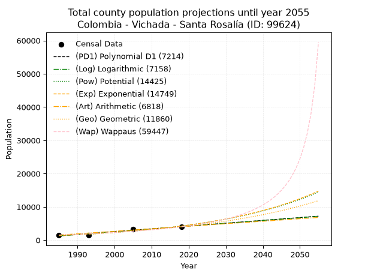
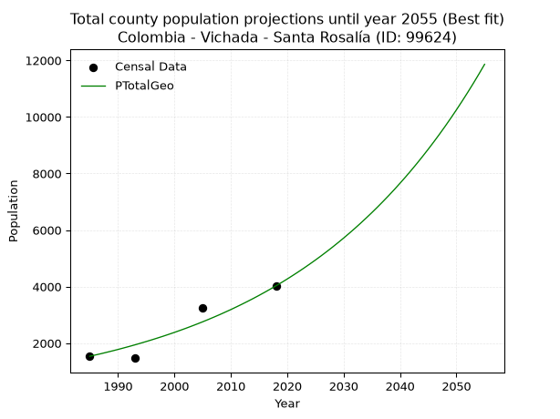
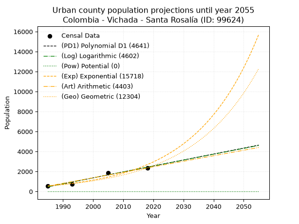
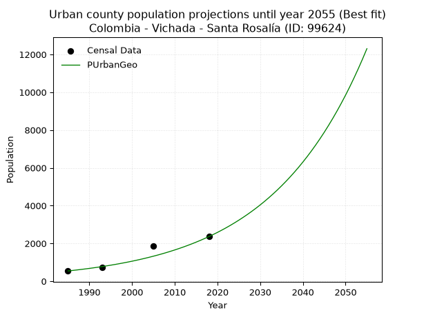
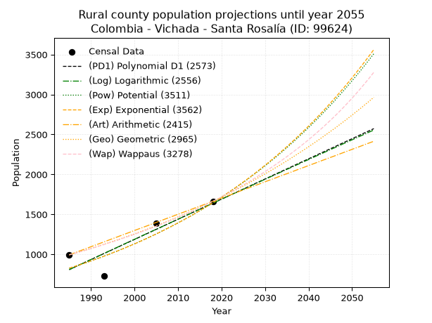
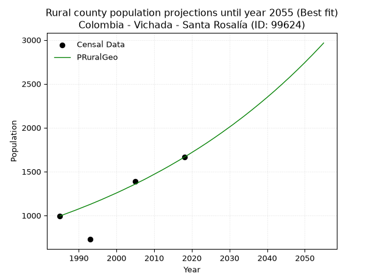

<div align="center">


</div>

# _“Population and Public Services Demand Projections (PPSD) until Year 2050 for Colombia - Vichada - Santa Rosalía (ID: 99624)”_
Keywords: `population` `public-service` `projection` `lineal` `polynomial` `logarithmic` `potential` `exponential` `arithmetic` `geometric` `wappaus` `dane` `colombia` `south-america`

PPSD are analytical estimates used by governments and planners to anticipate future changes in population size, age distribution, and the resulting community needs for utilities, healthcare, education, and infrastructure as sizing future water treatment facilities, electrical grids, and road networks based on spatial growth.

> **General running parameters**: • app_version: _v20260806_. • Python version: _3.14.7_. • Pandas version: _3.0.5_. • NumPy version: _2.5.1_. • Creates, save and include plots into reports (create_plot): _False_. • Projection until year: _2050_. • Process polynomial degree 2 and up: _False_. • Process Wappaus: _True_. • Process Wappaus: _True_. • Set negative values to zero: _True_. • Set infinite values to zero: _True_. • Drop dataset notes: _True_. 
<div align="center">

Dynamic map: [:earth_americas:Google](http://maps.google.com/maps?q=5.136393314,-70.8594986) [:earth_americas:OSM](https://www.openstreetmap.org/#map=18/5.136393314/-70.8594986&layers=P) [:earth_americas:Bing](https://www.bing.com/maps?cp=5.136393314~-70.8594986&lvl=18) [:earth_americas:Apple](https://maps.apple.com/frame?center=5.136393314%2C-70.8594986&span=0.003%2C0.006)

</div>


<div align="center">

```geojson
{
  "type": "Feature",
  "geometry": {
    "type": "Point", 
    "coordinates": [-70.8594986, 5.136393314]
  }, 
  "properties": {
    "Name": "Colombia - Vichada - Santa Rosalía (ID: 99624)"
  }
}
```

</div>


## 0. Census Data (4 records)

Census data are official statistics collected by a government about the people and housing in a country. They usually include counts of total population, age, sex, race, income, education, and jobs.

📅Global census file: [Population.xlsx](../data/Population.xlsx)

| Source   |   Year |   CountryID | CountryName   |   StateID | StateName   |   CountyID | CountyName    |   PTotal |   PUrban |   PRural |
|:---------|-------:|------------:|:--------------|----------:|:------------|-----------:|:--------------|---------:|---------:|---------:|
| DANE     |   1985 |          57 | Colombia      |        99 | Vichada     |      99624 | Santa Rosalía |     1536 |      542 |      994 |
| DANE     |   1993 |          57 | Colombia      |        99 | Vichada     |      99624 | Santa Rosalía |     1470 |      742 |      728 |
| DANE     |   2005 |          57 | Colombia      |        99 | Vichada     |      99624 | Santa Rosalía |     3250 |     1862 |     1388 |
| DANE     |   2018 |          57 | Colombia      |        99 | Vichada     |      99624 | Santa Rosalía |     4026 |     2362 |     1664 |

> 🔥Some records could had specific notes about the registered values or the corresponding urban or rural distribution.

## 1. Total

### 1.1. Coefficients and Parameters

* (PD1) Polynomial Deg 1: 84.81332798073005, -167077.3592934553 (lineal)
* (Log) Logarithmic: 169743.5999686751, -1287651.9636017422
* (Pow) Potential: 67.44108680161975, -219.26052565242514
* (Exp) Exponential: 0.033692758659878516, 1.2554515104612969e-26
* (Art) Arithmetic: Year diff. 2018 - 1985 = 33, Population diff. 4026 - 1536 = 2490, Annual growth = 75.45454545454545
* (Geo) Geometric: Year diff. 2018 - 1985 = 33, Population diff. 4026 - 1536 = 2490, Annual growth % = 0.02963024078199905
* (Wap) Wappaus: i = 2.7132163054493152, Condition values only valid for < 200)

<sub>
Wappaus condition values: ['0.00', '2.71', '5.43', '8.14', '10.85', '13.57', '16.28', '18.99', '21.71', '24.42', '27.13', '29.85', '32.56', '35.27', '37.99', '40.70', '43.41', '46.12', '48.84', '51.55', '54.26', '56.98', '59.69', '62.40', '65.12', '67.83', '70.54', '73.26', '75.97', '78.68', '81.40', '84.11', '86.82', '89.54', '92.25', '94.96', '97.68', '100.39', '103.10', '105.82', '108.53', '111.24', '113.96', '116.67', '119.38', '122.09', '124.81', '127.52', '130.23', '132.95', '135.66', '138.37', '141.09', '143.80', '146.51', '149.23', '151.94', '154.65', '157.37', '160.08', '162.79', '165.51', '168.22', '170.93', '173.65', '176.36']
</sub>


### 1.2. Projected Dataset

|   Year |   CountyID |   PTotalPD1 |   PTotalLog |   PTotalPow |   PTotalExp |   PTotalArt |   PTotalGeo |   PTotalWap |
|-------:|-----------:|------------:|------------:|------------:|------------:|------------:|------------:|------------:|
|   1985 |      99624 |        1277 |        1275 |        1393 |        1395 |        1536 |        1536 |        1536 |
|   1986 |      99624 |        1362 |        1360 |        1441 |        1442 |        1611 |        1582 |        1578 |
|   1987 |      99624 |        1447 |        1446 |        1491 |        1492 |        1687 |        1628 |        1622 |
|   1988 |      99624 |        1532 |        1531 |        1543 |        1543 |        1762 |        1677 |        1666 |
|   1989 |      99624 |        1616 |        1616 |        1596 |        1596 |        1838 |        1726 |        1712 |
|   1990 |      99624 |        1701 |        1702 |        1651 |        1651 |        1913 |        1777 |        1760 |
|   1991 |      99624 |        1786 |        1787 |        1708 |        1707 |        1989 |        1830 |        1808 |
|   1992 |      99624 |        1871 |        1872 |        1767 |        1766 |        2064 |        1884 |        1858 |
|   1993 |      99624 |        1956 |        1957 |        1827 |        1826 |        2140 |        1940 |        1910 |
|   1994 |      99624 |        2040 |        2043 |        1890 |        1889 |        2215 |        1998 |        1963 |
|   1995 |      99624 |        2125 |        2128 |        1955 |        1953 |        2291 |        2057 |        2018 |
|   1996 |      99624 |        2210 |        2213 |        2022 |        2020 |        2366 |        2118 |        2075 |
|   1997 |      99624 |        2295 |        2298 |        2092 |        2090 |        2441 |        2181 |        2133 |
|   1998 |      99624 |        2380 |        2383 |        2164 |        2161 |        2517 |        2245 |        2194 |
|   1999 |      99624 |        2464 |        2468 |        2238 |        2235 |        2592 |        2312 |        2256 |
|   2000 |      99624 |        2549 |        2553 |        2315 |        2312 |        2668 |        2380 |        2321 |
|   2001 |      99624 |        2634 |        2637 |        2394 |        2391 |        2743 |        2451 |        2388 |
|   2002 |      99624 |        2719 |        2722 |        2476 |        2473 |        2819 |        2523 |        2457 |
|   2003 |      99624 |        2804 |        2807 |        2561 |        2558 |        2894 |        2598 |        2529 |
|   2004 |      99624 |        2889 |        2892 |        2649 |        2645 |        2970 |        2675 |        2603 |
|   2005 |      99624 |        2973 |        2976 |        2739 |        2736 |        3045 |        2754 |        2680 |
|   2006 |      99624 |        3058 |        3061 |        2833 |        2830 |        3121 |        2836 |        2760 |
|   2007 |      99624 |        3143 |        3146 |        2930 |        2927 |        3196 |        2920 |        2843 |
|   2008 |      99624 |        3228 |        3230 |        3030 |        3027 |        3271 |        3006 |        2929 |
|   2009 |      99624 |        3313 |        3315 |        3134 |        3131 |        3347 |        3096 |        3019 |
|   2010 |      99624 |        3397 |        3399 |        3240 |        3238 |        3422 |        3187 |        3113 |
|   2011 |      99624 |        3482 |        3484 |        3351 |        3349 |        3498 |        3282 |        3210 |
|   2012 |      99624 |        3567 |        3568 |        3465 |        3464 |        3573 |        3379 |        3312 |
|   2013 |      99624 |        3652 |        3652 |        3583 |        3582 |        3649 |        3479 |        3418 |
|   2014 |      99624 |        3737 |        3737 |        3705 |        3705 |        3724 |        3582 |        3528 |
|   2015 |      99624 |        3821 |        3821 |        3832 |        3832 |        3800 |        3688 |        3644 |
|   2016 |      99624 |        3906 |        3905 |        3962 |        3964 |        3875 |        3798 |        3766 |
|   2017 |      99624 |        3991 |        3989 |        4097 |        4099 |        3951 |        3910 |        3893 |
|   2018 |      99624 |        4076 |        4073 |        4236 |        4240 |        4026 |        4026 |        4026 |
|   2019 |      99624 |        4161 |        4158 |        4380 |        4385 |        4101 |        4145 |        4166 |
|   2020 |      99624 |        4246 |        4242 |        4529 |        4535 |        4177 |        4268 |        4313 |
|   2021 |      99624 |        4330 |        4326 |        4682 |        4691 |        4252 |        4395 |        4468 |
|   2022 |      99624 |        4415 |        4410 |        4841 |        4851 |        4328 |        4525 |        4632 |
|   2023 |      99624 |        4500 |        4493 |        5005 |        5018 |        4403 |        4659 |        4805 |
|   2024 |      99624 |        4585 |        4577 |        5175 |        5190 |        4479 |        4797 |        4987 |
|   2025 |      99624 |        4670 |        4661 |        5350 |        5368 |        4554 |        4939 |        5181 |
|   2026 |      99624 |        4754 |        4745 |        5531 |        5551 |        4630 |        5085 |        5386 |
|   2027 |      99624 |        4839 |        4829 |        5719 |        5742 |        4705 |        5236 |        5604 |
|   2028 |      99624 |        4924 |        4913 |        5912 |        5938 |        4781 |        5391 |        5837 |
|   2029 |      99624 |        5009 |        4996 |        6112 |        6142 |        4856 |        5551 |        6085 |
|   2030 |      99624 |        5094 |        5080 |        6318 |        6352 |        4931 |        5715 |        6351 |
|   2031 |      99624 |        5179 |        5163 |        6532 |        6570 |        5007 |        5885 |        6635 |
|   2032 |      99624 |        5263 |        5247 |        6752 |        6795 |        5082 |        6059 |        6941 |
|   2033 |      99624 |        5348 |        5330 |        6980 |        7028 |        5158 |        6239 |        7271 |
|   2034 |      99624 |        5433 |        5414 |        7215 |        7269 |        5233 |        6424 |        7627 |
|   2035 |      99624 |        5518 |        5497 |        7459 |        7518 |        5309 |        6614 |        8013 |
|   2036 |      99624 |        5603 |        5581 |        7710 |        7776 |        5384 |        6810 |        8434 |
|   2037 |      99624 |        5687 |        5664 |        7969 |        8042 |        5460 |        7012 |        8893 |
|   2038 |      99624 |        5772 |        5747 |        8238 |        8318 |        5535 |        7219 |        9396 |
|   2039 |      99624 |        5857 |        5831 |        8515 |        8603 |        5611 |        7433 |        9951 |
|   2040 |      99624 |        5942 |        5914 |        8801 |        8897 |        5686 |        7654 |       10565 |
|   2041 |      99624 |        6027 |        5997 |        9097 |        9202 |        5761 |        7880 |       11248 |
|   2042 |      99624 |        6111 |        6080 |        9402 |        9518 |        5837 |        8114 |       12013 |
|   2043 |      99624 |        6196 |        6163 |        9718 |        9844 |        5912 |        8354 |       12875 |
|   2044 |      99624 |        6281 |        6246 |       10044 |       10181 |        5988 |        8602 |       13855 |
|   2045 |      99624 |        6366 |        6329 |       10381 |       10530 |        6063 |        8857 |       14977 |
|   2046 |      99624 |        6451 |        6412 |       10729 |       10891 |        6139 |        9119 |       16276 |
|   2047 |      99624 |        6536 |        6495 |       11088 |       11264 |        6214 |        9389 |       17797 |
|   2048 |      99624 |        6620 |        6578 |       11459 |       11650 |        6290 |        9667 |       19601 |
|   2049 |      99624 |        6705 |        6661 |       11843 |       12049 |        6365 |        9954 |       21777 |
|   2050 |      99624 |        6790 |        6744 |       12239 |       12462 |        6441 |       10249 |       24453 |
<div align="center">

</img>

</div>


### 1.3. Best fit with absolute and relative error (%)

Relative error puts that difference into context by dividing the absolute error by the true value, creating a unitless ratio or percentage that shows the scale of the mistake.

Absolute and relative error

|   Year | Source   |   CountryID | CountryName   |   StateID | StateName   |   CountyID_x | CountyName    |   PTotal |   PUrban |   PRural |   CountyID_y |   PTotalPD1 |   PTotalLog |   PTotalPow |   PTotalExp |   PTotalArt |   PTotalGeo |   PTotalWap |   PTotalPD1AbsError |   PTotalLogAbsError |   PTotalPowAbsError |   PTotalExpAbsError |   PTotalArtAbsError |   PTotalGeoAbsError |   PTotalWapAbsError |   PTotalPD1RelError |   PTotalLogRelError |   PTotalPowRelError |   PTotalExpRelError |   PTotalArtRelError |   PTotalGeoRelError |   PTotalWapRelError |
|-------:|:---------|------------:|:--------------|----------:|:------------|-------------:|:--------------|---------:|---------:|---------:|-------------:|------------:|------------:|------------:|------------:|------------:|------------:|------------:|--------------------:|--------------------:|--------------------:|--------------------:|--------------------:|--------------------:|--------------------:|--------------------:|--------------------:|--------------------:|--------------------:|--------------------:|--------------------:|--------------------:|
|   1985 | DANE     |          57 | Colombia      |        99 | Vichada     |        99624 | Santa Rosalía |     1536 |      542 |      994 |        99624 |        1277 |        1275 |        1393 |        1395 |        1536 |        1536 |        1536 |                 259 |                 261 |                 143 |                 141 |                   0 |                   0 |                   0 |            16.862   |            16.9922  |              9.3099 |             9.17969 |             0       |              0      |              0      |
|   1993 | DANE     |          57 | Colombia      |        99 | Vichada     |        99624 | Santa Rosalía |     1470 |      742 |      728 |        99624 |        1956 |        1957 |        1827 |        1826 |        2140 |        1940 |        1910 |                 486 |                 487 |                 357 |                 356 |                 670 |                 470 |                 440 |            33.0612  |            33.1293  |             24.2857 |            24.2177  |            45.5782  |             31.9728 |             29.932  |
|   2005 | DANE     |          57 | Colombia      |        99 | Vichada     |        99624 | Santa Rosalía |     3250 |     1862 |     1388 |        99624 |        2973 |        2976 |        2739 |        2736 |        3045 |        2754 |        2680 |                 277 |                 274 |                 511 |                 514 |                 205 |                 496 |                 570 |             8.52308 |             8.43077 |             15.7231 |            15.8154  |             6.30769 |             15.2615 |             17.5385 |
|   2018 | DANE     |          57 | Colombia      |        99 | Vichada     |        99624 | Santa Rosalía |     4026 |     2362 |     1664 |        99624 |        4076 |        4073 |        4236 |        4240 |        4026 |        4026 |        4026 |                  50 |                  47 |                 210 |                 214 |                   0 |                   0 |                   0 |             1.24193 |             1.16741 |              5.2161 |             5.31545 |             0       |              0      |              0      |

Relative error mean

| Method    |   RelError | Best   |
|:----------|-----------:|:-------|
| PTotalPD1 |    14.9221 |        |
| PTotalLog |    14.9299 |        |
| PTotalPow |    13.6337 |        |
| PTotalExp |    13.6321 |        |
| PTotalArt |    12.9715 |        |
| PTotalGeo |    11.8086 | True   |
| PTotalWap |    11.8676 |        |

💙Best method: _**PTotalGeo**_
<div align="center">

</img>

</div>


### 1.4. Fresh water supply demand in liters per capita per day (lpcd)

The fresh water supply demand typically ranges from 100 to 300 liters per capita per day (lpcd) for standard domestic and municipal planning, though absolute survival minimums set by the World Health Organization are as low as 7.5 to 20 liters per day, and total consumption in high-income nations can exceed 400 liters.

> `CZ`: Level in meters above the sea level (masl)<br> `WS`: Fresh water supply demand in liters per capita per day (lpcd or l/h/d)<br> `WSAll`: Zonal fresh water supply demand in liters per second (l/s)<br> `A`: Zonal area in square meters<br> `DP`: Population density (people/hectare)

Reference values (RAS Colombia)

|    CZ |   WS |
|------:|-----:|
|  1000 |  120 |
|  2000 |  130 |
| 99999 |  140 |

County shapefile geometry properties and water supply values

|   CountyID |      ATotal |   CZTotal |   WSTotal |
|-----------:|------------:|----------:|----------:|
|      99624 | 3.67802e+09 |   133.549 |       120 |

Projected values for best method: PTotalGeo

|   CountyID |   Year |   PTotalGeo |   DPTotal |   WSTotal |   WSTotalAll |
|-----------:|-------:|------------:|----------:|----------:|-------------:|
|      99624 |   1985 |        1536 |      0    |       120 |      2.13333 |
|      99624 |   1986 |        1582 |      0    |       120 |      2.19722 |
|      99624 |   1987 |        1628 |      0    |       120 |      2.26111 |
|      99624 |   1988 |        1677 |      0    |       120 |      2.32917 |
|      99624 |   1989 |        1726 |      0    |       120 |      2.39722 |
|      99624 |   1990 |        1777 |      0    |       120 |      2.46806 |
|      99624 |   1991 |        1830 |      0    |       120 |      2.54167 |
|      99624 |   1992 |        1884 |      0.01 |       120 |      2.61667 |
|      99624 |   1993 |        1940 |      0.01 |       120 |      2.69444 |
|      99624 |   1994 |        1998 |      0.01 |       120 |      2.775   |
|      99624 |   1995 |        2057 |      0.01 |       120 |      2.85694 |
|      99624 |   1996 |        2118 |      0.01 |       120 |      2.94167 |
|      99624 |   1997 |        2181 |      0.01 |       120 |      3.02917 |
|      99624 |   1998 |        2245 |      0.01 |       120 |      3.11806 |
|      99624 |   1999 |        2312 |      0.01 |       120 |      3.21111 |
|      99624 |   2000 |        2380 |      0.01 |       120 |      3.30556 |
|      99624 |   2001 |        2451 |      0.01 |       120 |      3.40417 |
|      99624 |   2002 |        2523 |      0.01 |       120 |      3.50417 |
|      99624 |   2003 |        2598 |      0.01 |       120 |      3.60833 |
|      99624 |   2004 |        2675 |      0.01 |       120 |      3.71528 |
|      99624 |   2005 |        2754 |      0.01 |       120 |      3.825   |
|      99624 |   2006 |        2836 |      0.01 |       120 |      3.93889 |
|      99624 |   2007 |        2920 |      0.01 |       120 |      4.05556 |
|      99624 |   2008 |        3006 |      0.01 |       120 |      4.175   |
|      99624 |   2009 |        3096 |      0.01 |       120 |      4.3     |
|      99624 |   2010 |        3187 |      0.01 |       120 |      4.42639 |
|      99624 |   2011 |        3282 |      0.01 |       120 |      4.55833 |
|      99624 |   2012 |        3379 |      0.01 |       120 |      4.69306 |
|      99624 |   2013 |        3479 |      0.01 |       120 |      4.83194 |
|      99624 |   2014 |        3582 |      0.01 |       120 |      4.975   |
|      99624 |   2015 |        3688 |      0.01 |       120 |      5.12222 |
|      99624 |   2016 |        3798 |      0.01 |       120 |      5.275   |
|      99624 |   2017 |        3910 |      0.01 |       120 |      5.43056 |
|      99624 |   2018 |        4026 |      0.01 |       120 |      5.59167 |
|      99624 |   2019 |        4145 |      0.01 |       120 |      5.75694 |
|      99624 |   2020 |        4268 |      0.01 |       120 |      5.92778 |
|      99624 |   2021 |        4395 |      0.01 |       120 |      6.10417 |
|      99624 |   2022 |        4525 |      0.01 |       120 |      6.28472 |
|      99624 |   2023 |        4659 |      0.01 |       120 |      6.47083 |
|      99624 |   2024 |        4797 |      0.01 |       120 |      6.6625  |
|      99624 |   2025 |        4939 |      0.01 |       120 |      6.85972 |
|      99624 |   2026 |        5085 |      0.01 |       120 |      7.0625  |
|      99624 |   2027 |        5236 |      0.01 |       120 |      7.27222 |
|      99624 |   2028 |        5391 |      0.01 |       120 |      7.4875  |
|      99624 |   2029 |        5551 |      0.02 |       120 |      7.70972 |
|      99624 |   2030 |        5715 |      0.02 |       120 |      7.9375  |
|      99624 |   2031 |        5885 |      0.02 |       120 |      8.17361 |
|      99624 |   2032 |        6059 |      0.02 |       120 |      8.41528 |
|      99624 |   2033 |        6239 |      0.02 |       120 |      8.66528 |
|      99624 |   2034 |        6424 |      0.02 |       120 |      8.92222 |
|      99624 |   2035 |        6614 |      0.02 |       120 |      9.18611 |
|      99624 |   2036 |        6810 |      0.02 |       120 |      9.45833 |
|      99624 |   2037 |        7012 |      0.02 |       120 |      9.73889 |
|      99624 |   2038 |        7219 |      0.02 |       120 |     10.0264  |
|      99624 |   2039 |        7433 |      0.02 |       120 |     10.3236  |
|      99624 |   2040 |        7654 |      0.02 |       120 |     10.6306  |
|      99624 |   2041 |        7880 |      0.02 |       120 |     10.9444  |
|      99624 |   2042 |        8114 |      0.02 |       120 |     11.2694  |
|      99624 |   2043 |        8354 |      0.02 |       120 |     11.6028  |
|      99624 |   2044 |        8602 |      0.02 |       120 |     11.9472  |
|      99624 |   2045 |        8857 |      0.02 |       120 |     12.3014  |
|      99624 |   2046 |        9119 |      0.02 |       120 |     12.6653  |
|      99624 |   2047 |        9389 |      0.03 |       120 |     13.0403  |
|      99624 |   2048 |        9667 |      0.03 |       120 |     13.4264  |
|      99624 |   2049 |        9954 |      0.03 |       120 |     13.825   |
|      99624 |   2050 |       10249 |      0.03 |       120 |     14.2347  |

## 2. Urban

### 2.1. Coefficients and Parameters

* (PD1) Polynomial Deg 1: 59.61461260537897, -117867.1288639093 (lineal)
* (Log) Logarithmic: 119335.27634334806, -905691.391778677
* (Pow) Potential: 95.53988971605992, -312.3225057365807
* (Exp) Exponential: 0.04771261032878325, 4.112336018680455e-39
* (Art) Arithmetic: Year diff. 2018 - 1985 = 33, Population diff. 2362 - 542 = 1820, Annual growth = 55.15151515151515
* (Geo) Geometric: Year diff. 2018 - 1985 = 33, Population diff. 2362 - 542 = 1820, Annual growth % = 0.045615805963479916
* (Wap) Wappaus: i = 3.7983137156690874, Condition values only valid for < 200)

<sub>
Wappaus condition values: ['0.00', '3.80', '7.60', '11.39', '15.19', '18.99', '22.79', '26.59', '30.39', '34.18', '37.98', '41.78', '45.58', '49.38', '53.18', '56.97', '60.77', '64.57', '68.37', '72.17', '75.97', '79.76', '83.56', '87.36', '91.16', '94.96', '98.76', '102.55', '106.35', '110.15', '113.95', '117.75', '121.55', '125.34', '129.14', '132.94', '136.74', '140.54', '144.34', '148.13', '151.93', '155.73', '159.53', '163.33', '167.13', '170.92', '174.72', '178.52', '182.32', '186.12', '189.92', '193.71', '197.51', '201.31', '205.11', '208.91', '212.71', '216.50', '220.30', '224.10', '227.90', '231.70', '235.50', '239.29', '243.09', '246.89']
</sub>


### 2.2. Projected Dataset

|   Year |   CountyID |   PUrbanPD1 |   PUrbanLog |   PUrbanPow |   PUrbanExp |   PUrbanArt |   PUrbanGeo |
|-------:|-----------:|------------:|------------:|------------:|------------:|------------:|------------:|
|   1985 |      99624 |         468 |         466 |           0 |         557 |         542 |         542 |
|   1986 |      99624 |         527 |         526 |           0 |         584 |         597 |         567 |
|   1987 |      99624 |         587 |         586 |           0 |         613 |         652 |         593 |
|   1988 |      99624 |         647 |         646 |           0 |         643 |         707 |         620 |
|   1989 |      99624 |         706 |         706 |           0 |         674 |         763 |         648 |
|   1990 |      99624 |         766 |         766 |           0 |         707 |         818 |         677 |
|   1991 |      99624 |         826 |         826 |           0 |         742 |         873 |         708 |
|   1992 |      99624 |         885 |         886 |           0 |         778 |         928 |         741 |
|   1993 |      99624 |         945 |         946 |           0 |         816 |         983 |         774 |
|   1994 |      99624 |        1004 |        1006 |           0 |         856 |        1038 |         810 |
|   1995 |      99624 |        1064 |        1066 |           0 |         898 |        1094 |         847 |
|   1996 |      99624 |        1124 |        1125 |           0 |         942 |        1149 |         885 |
|   1997 |      99624 |        1183 |        1185 |           0 |         988 |        1204 |         926 |
|   1998 |      99624 |        1243 |        1245 |           0 |        1036 |        1259 |         968 |
|   1999 |      99624 |        1302 |        1305 |           0 |        1086 |        1314 |        1012 |
|   2000 |      99624 |        1362 |        1364 |           0 |        1140 |        1369 |        1058 |
|   2001 |      99624 |        1422 |        1424 |           0 |        1195 |        1424 |        1107 |
|   2002 |      99624 |        1481 |        1484 |           0 |        1254 |        1480 |        1157 |
|   2003 |      99624 |        1541 |        1543 |           0 |        1315 |        1535 |        1210 |
|   2004 |      99624 |        1601 |        1603 |           0 |        1379 |        1590 |        1265 |
|   2005 |      99624 |        1660 |        1662 |           0 |        1447 |        1645 |        1323 |
|   2006 |      99624 |        1720 |        1722 |           0 |        1517 |        1700 |        1383 |
|   2007 |      99624 |        1779 |        1781 |           0 |        1591 |        1755 |        1446 |
|   2008 |      99624 |        1839 |        1841 |           0 |        1669 |        1810 |        1512 |
|   2009 |      99624 |        1899 |        1900 |           0 |        1751 |        1866 |        1581 |
|   2010 |      99624 |        1958 |        1960 |           0 |        1836 |        1921 |        1653 |
|   2011 |      99624 |        2018 |        2019 |           0 |        1926 |        1976 |        1729 |
|   2012 |      99624 |        2077 |        2078 |           0 |        2020 |        2031 |        1807 |
|   2013 |      99624 |        2137 |        2138 |           0 |        2119 |        2086 |        1890 |
|   2014 |      99624 |        2197 |        2197 |           0 |        2222 |        2141 |        1976 |
|   2015 |      99624 |        2256 |        2256 |           0 |        2331 |        2197 |        2066 |
|   2016 |      99624 |        2316 |        2315 |           0 |        2445 |        2252 |        2160 |
|   2017 |      99624 |        2376 |        2374 |           0 |        2564 |        2307 |        2259 |
|   2018 |      99624 |        2435 |        2434 |           0 |        2690 |        2362 |        2362 |
|   2019 |      99624 |        2495 |        2493 |           0 |        2821 |        2417 |        2470 |
|   2020 |      99624 |        2554 |        2552 |           0 |        2959 |        2472 |        2582 |
|   2021 |      99624 |        2614 |        2611 |           0 |        3104 |        2527 |        2700 |
|   2022 |      99624 |        2674 |        2670 |           0 |        3255 |        2583 |        2823 |
|   2023 |      99624 |        2733 |        2729 |           0 |        3414 |        2638 |        2952 |
|   2024 |      99624 |        2793 |        2788 |           0 |        3581 |        2693 |        3087 |
|   2025 |      99624 |        2852 |        2847 |           0 |        3756 |        2748 |        3228 |
|   2026 |      99624 |        2912 |        2906 |           0 |        3940 |        2803 |        3375 |
|   2027 |      99624 |        2972 |        2965 |           0 |        4132 |        2858 |        3529 |
|   2028 |      99624 |        3031 |        3024 |           0 |        4334 |        2914 |        3690 |
|   2029 |      99624 |        3091 |        3082 |           0 |        4546 |        2969 |        3858 |
|   2030 |      99624 |        3151 |        3141 |           0 |        4768 |        3024 |        4034 |
|   2031 |      99624 |        3210 |        3200 |           0 |        5001 |        3079 |        4218 |
|   2032 |      99624 |        3270 |        3259 |           0 |        5246 |        3134 |        4411 |
|   2033 |      99624 |        3329 |        3317 |           0 |        5502 |        3189 |        4612 |
|   2034 |      99624 |        3389 |        3376 |           0 |        5771 |        3244 |        4822 |
|   2035 |      99624 |        3449 |        3435 |           0 |        6053 |        3300 |        5042 |
|   2036 |      99624 |        3508 |        3493 |           0 |        6349 |        3355 |        5272 |
|   2037 |      99624 |        3568 |        3552 |           0 |        6659 |        3410 |        5513 |
|   2038 |      99624 |        3627 |        3611 |           0 |        6985 |        3465 |        5764 |
|   2039 |      99624 |        3687 |        3669 |           0 |        7326 |        3520 |        6027 |
|   2040 |      99624 |        3747 |        3728 |           0 |        7684 |        3575 |        6302 |
|   2041 |      99624 |        3806 |        3786 |           0 |        8060 |        3630 |        6589 |
|   2042 |      99624 |        3866 |        3844 |           0 |        8453 |        3686 |        6890 |
|   2043 |      99624 |        3926 |        3903 |           0 |        8867 |        3741 |        7204 |
|   2044 |      99624 |        3985 |        3961 |           0 |        9300 |        3796 |        7533 |
|   2045 |      99624 |        4045 |        4020 |           0 |        9754 |        3851 |        7876 |
|   2046 |      99624 |        4104 |        4078 |           0 |       10231 |        3906 |        8236 |
|   2047 |      99624 |        4164 |        4136 |           0 |       10731 |        3961 |        8611 |
|   2048 |      99624 |        4224 |        4195 |           0 |       11255 |        4017 |        9004 |
|   2049 |      99624 |        4283 |        4253 |           0 |       11805 |        4072 |        9415 |
|   2050 |      99624 |        4343 |        4311 |           0 |       12382 |        4127 |        9844 |
<div align="center">

</img>

</div>


### 2.3. Best fit with absolute and relative error (%)

Relative error puts that difference into context by dividing the absolute error by the true value, creating a unitless ratio or percentage that shows the scale of the mistake.

Absolute and relative error

|   Year | Source   |   CountryID | CountryName   |   StateID | StateName   |   CountyID_x | CountyName    |   PTotal |   PUrban |   PRural |   CountyID_y |   PUrbanPD1 |   PUrbanLog |   PUrbanPow |   PUrbanExp |   PUrbanArt |   PUrbanGeo |   PUrbanPD1AbsError |   PUrbanLogAbsError |   PUrbanPowAbsError |   PUrbanExpAbsError |   PUrbanArtAbsError |   PUrbanGeoAbsError |   PUrbanPD1RelError |   PUrbanLogRelError |   PUrbanPowRelError |   PUrbanExpRelError |   PUrbanArtRelError |   PUrbanGeoRelError |
|-------:|:---------|------------:|:--------------|----------:|:------------|-------------:|:--------------|---------:|---------:|---------:|-------------:|------------:|------------:|------------:|------------:|------------:|------------:|--------------------:|--------------------:|--------------------:|--------------------:|--------------------:|--------------------:|--------------------:|--------------------:|--------------------:|--------------------:|--------------------:|--------------------:|
|   1985 | DANE     |          57 | Colombia      |        99 | Vichada     |        99624 | Santa Rosalía |     1536 |      542 |      994 |        99624 |         468 |         466 |           0 |         557 |         542 |         542 |                  74 |                  76 |                 542 |                  15 |                   0 |                   0 |             13.6531 |            14.0221  |                 100 |             2.76753 |              0      |             0       |
|   1993 | DANE     |          57 | Colombia      |        99 | Vichada     |        99624 | Santa Rosalía |     1470 |      742 |      728 |        99624 |         945 |         946 |           0 |         816 |         983 |         774 |                 203 |                 204 |                 742 |                  74 |                 241 |                  32 |             27.3585 |            27.4933  |                 100 |             9.97305 |             32.4798 |             4.31267 |
|   2005 | DANE     |          57 | Colombia      |        99 | Vichada     |        99624 | Santa Rosalía |     3250 |     1862 |     1388 |        99624 |        1660 |        1662 |           0 |        1447 |        1645 |        1323 |                 202 |                 200 |                1862 |                 415 |                 217 |                 539 |             10.8485 |            10.7411  |                 100 |            22.2879  |             11.6541 |            28.9474  |
|   2018 | DANE     |          57 | Colombia      |        99 | Vichada     |        99624 | Santa Rosalía |     4026 |     2362 |     1664 |        99624 |        2435 |        2434 |           0 |        2690 |        2362 |        2362 |                  73 |                  72 |                2362 |                 328 |                   0 |                   0 |              3.0906 |             3.04826 |                 100 |            13.8865  |              0      |             0       |

Relative error mean

| Method    |   RelError | Best   |
|:----------|-----------:|:-------|
| PUrbanPD1 |   13.7377  |        |
| PUrbanLog |   13.8262  |        |
| PUrbanPow |  100       |        |
| PUrbanExp |   12.2287  |        |
| PUrbanArt |   11.0335  |        |
| PUrbanGeo |    8.31501 | True   |

💙Best method: _**PUrbanGeo**_
<div align="center">

</img>

</div>


### 2.4. Fresh water supply demand in liters per capita per day (lpcd)

The fresh water supply demand typically ranges from 100 to 300 liters per capita per day (lpcd) for standard domestic and municipal planning, though absolute survival minimums set by the World Health Organization are as low as 7.5 to 20 liters per day, and total consumption in high-income nations can exceed 400 liters.

> `CZ`: Level in meters above the sea level (masl)<br> `WS`: Fresh water supply demand in liters per capita per day (lpcd or l/h/d)<br> `WSAll`: Zonal fresh water supply demand in liters per second (l/s)<br> `A`: Zonal area in square meters<br> `DP`: Population density (people/hectare)

Reference values (RAS Colombia)

|    CZ |   WS |
|------:|-----:|
|  1000 |  120 |
|  2000 |  130 |
| 99999 |  140 |

County shapefile geometry properties and water supply values

|   CountyID |      AUrban |   CZUrban |   WSUrban |
|-----------:|------------:|----------:|----------:|
|      99624 | 1.64557e+06 |   117.125 |       120 |

Projected values for best method: PUrbanGeo

|   CountyID |   Year |   PUrbanGeo |   DPUrban |   WSUrban |   WSUrbanAll |
|-----------:|-------:|------------:|----------:|----------:|-------------:|
|      99624 |   1985 |         542 |      3.29 |       120 |     0.752778 |
|      99624 |   1986 |         567 |      3.45 |       120 |     0.7875   |
|      99624 |   1987 |         593 |      3.6  |       120 |     0.823611 |
|      99624 |   1988 |         620 |      3.77 |       120 |     0.861111 |
|      99624 |   1989 |         648 |      3.94 |       120 |     0.9      |
|      99624 |   1990 |         677 |      4.11 |       120 |     0.940278 |
|      99624 |   1991 |         708 |      4.3  |       120 |     0.983333 |
|      99624 |   1992 |         741 |      4.5  |       120 |     1.02917  |
|      99624 |   1993 |         774 |      4.7  |       120 |     1.075    |
|      99624 |   1994 |         810 |      4.92 |       120 |     1.125    |
|      99624 |   1995 |         847 |      5.15 |       120 |     1.17639  |
|      99624 |   1996 |         885 |      5.38 |       120 |     1.22917  |
|      99624 |   1997 |         926 |      5.63 |       120 |     1.28611  |
|      99624 |   1998 |         968 |      5.88 |       120 |     1.34444  |
|      99624 |   1999 |        1012 |      6.15 |       120 |     1.40556  |
|      99624 |   2000 |        1058 |      6.43 |       120 |     1.46944  |
|      99624 |   2001 |        1107 |      6.73 |       120 |     1.5375   |
|      99624 |   2002 |        1157 |      7.03 |       120 |     1.60694  |
|      99624 |   2003 |        1210 |      7.35 |       120 |     1.68056  |
|      99624 |   2004 |        1265 |      7.69 |       120 |     1.75694  |
|      99624 |   2005 |        1323 |      8.04 |       120 |     1.8375   |
|      99624 |   2006 |        1383 |      8.4  |       120 |     1.92083  |
|      99624 |   2007 |        1446 |      8.79 |       120 |     2.00833  |
|      99624 |   2008 |        1512 |      9.19 |       120 |     2.1      |
|      99624 |   2009 |        1581 |      9.61 |       120 |     2.19583  |
|      99624 |   2010 |        1653 |     10.05 |       120 |     2.29583  |
|      99624 |   2011 |        1729 |     10.51 |       120 |     2.40139  |
|      99624 |   2012 |        1807 |     10.98 |       120 |     2.50972  |
|      99624 |   2013 |        1890 |     11.49 |       120 |     2.625    |
|      99624 |   2014 |        1976 |     12.01 |       120 |     2.74444  |
|      99624 |   2015 |        2066 |     12.55 |       120 |     2.86944  |
|      99624 |   2016 |        2160 |     13.13 |       120 |     3        |
|      99624 |   2017 |        2259 |     13.73 |       120 |     3.1375   |
|      99624 |   2018 |        2362 |     14.35 |       120 |     3.28056  |
|      99624 |   2019 |        2470 |     15.01 |       120 |     3.43056  |
|      99624 |   2020 |        2582 |     15.69 |       120 |     3.58611  |
|      99624 |   2021 |        2700 |     16.41 |       120 |     3.75     |
|      99624 |   2022 |        2823 |     17.16 |       120 |     3.92083  |
|      99624 |   2023 |        2952 |     17.94 |       120 |     4.1      |
|      99624 |   2024 |        3087 |     18.76 |       120 |     4.2875   |
|      99624 |   2025 |        3228 |     19.62 |       120 |     4.48333  |
|      99624 |   2026 |        3375 |     20.51 |       120 |     4.6875   |
|      99624 |   2027 |        3529 |     21.45 |       120 |     4.90139  |
|      99624 |   2028 |        3690 |     22.42 |       120 |     5.125    |
|      99624 |   2029 |        3858 |     23.44 |       120 |     5.35833  |
|      99624 |   2030 |        4034 |     24.51 |       120 |     5.60278  |
|      99624 |   2031 |        4218 |     25.63 |       120 |     5.85833  |
|      99624 |   2032 |        4411 |     26.81 |       120 |     6.12639  |
|      99624 |   2033 |        4612 |     28.03 |       120 |     6.40556  |
|      99624 |   2034 |        4822 |     29.3  |       120 |     6.69722  |
|      99624 |   2035 |        5042 |     30.64 |       120 |     7.00278  |
|      99624 |   2036 |        5272 |     32.04 |       120 |     7.32222  |
|      99624 |   2037 |        5513 |     33.5  |       120 |     7.65694  |
|      99624 |   2038 |        5764 |     35.03 |       120 |     8.00556  |
|      99624 |   2039 |        6027 |     36.63 |       120 |     8.37083  |
|      99624 |   2040 |        6302 |     38.3  |       120 |     8.75278  |
|      99624 |   2041 |        6589 |     40.04 |       120 |     9.15139  |
|      99624 |   2042 |        6890 |     41.87 |       120 |     9.56944  |
|      99624 |   2043 |        7204 |     43.78 |       120 |    10.0056   |
|      99624 |   2044 |        7533 |     45.78 |       120 |    10.4625   |
|      99624 |   2045 |        7876 |     47.86 |       120 |    10.9389   |
|      99624 |   2046 |        8236 |     50.05 |       120 |    11.4389   |
|      99624 |   2047 |        8611 |     52.33 |       120 |    11.9597   |
|      99624 |   2048 |        9004 |     54.72 |       120 |    12.5056   |
|      99624 |   2049 |        9415 |     57.21 |       120 |    13.0764   |
|      99624 |   2050 |        9844 |     59.82 |       120 |    13.6722   |

## 3. Rural

### 3.1. Coefficients and Parameters

* (PD1) Polynomial Deg 1: 25.198715375351053, -49210.23042954594 (lineal)
* (Log) Logarithmic: 50408.323625327066, -381960.5718230652
* (Pow) Potential: 41.72355879101739, -134.67686662758058
* (Exp) Exponential: 0.020858136007456802, 8.636817700906621e-16
* (Art) Arithmetic: Year diff. 2018 - 1985 = 33, Population diff. 1664 - 994 = 670, Annual growth = 20.303030303030305
* (Geo) Geometric: Year diff. 2018 - 1985 = 33, Population diff. 1664 - 994 = 670, Annual growth % = 0.015735932590801527
* (Wap) Wappaus: i = 1.5276922726132658, Condition values only valid for < 200)

<sub>
Wappaus condition values: ['0.00', '1.53', '3.06', '4.58', '6.11', '7.64', '9.17', '10.69', '12.22', '13.75', '15.28', '16.80', '18.33', '19.86', '21.39', '22.92', '24.44', '25.97', '27.50', '29.03', '30.55', '32.08', '33.61', '35.14', '36.66', '38.19', '39.72', '41.25', '42.78', '44.30', '45.83', '47.36', '48.89', '50.41', '51.94', '53.47', '55.00', '56.52', '58.05', '59.58', '61.11', '62.64', '64.16', '65.69', '67.22', '68.75', '70.27', '71.80', '73.33', '74.86', '76.38', '77.91', '79.44', '80.97', '82.50', '84.02', '85.55', '87.08', '88.61', '90.13', '91.66', '93.19', '94.72', '96.24', '97.77', '99.30']
</sub>


### 3.2. Projected Dataset

|   Year |   CountyID |   PRuralPD1 |   PRuralLog |   PRuralPow |   PRuralExp |   PRuralArt |   PRuralGeo |   PRuralWap |
|-------:|-----------:|------------:|------------:|------------:|------------:|------------:|------------:|------------:|
|   1985 |      99624 |         809 |         809 |         827 |         827 |         994 |         994 |         994 |
|   1986 |      99624 |         834 |         834 |         844 |         845 |        1014 |        1010 |        1009 |
|   1987 |      99624 |         860 |         859 |         862 |         862 |        1035 |        1026 |        1025 |
|   1988 |      99624 |         885 |         885 |         881 |         881 |        1055 |        1042 |        1041 |
|   1989 |      99624 |         910 |         910 |         899 |         899 |        1075 |        1058 |        1057 |
|   1990 |      99624 |         935 |         936 |         918 |         918 |        1096 |        1075 |        1073 |
|   1991 |      99624 |         960 |         961 |         938 |         938 |        1116 |        1092 |        1089 |
|   1992 |      99624 |         986 |         986 |         958 |         957 |        1136 |        1109 |        1106 |
|   1993 |      99624 |        1011 |        1011 |         978 |         977 |        1156 |        1126 |        1123 |
|   1994 |      99624 |        1036 |        1037 |         999 |         998 |        1177 |        1144 |        1141 |
|   1995 |      99624 |        1061 |        1062 |        1020 |        1019 |        1197 |        1162 |        1158 |
|   1996 |      99624 |        1086 |        1087 |        1041 |        1041 |        1217 |        1180 |        1176 |
|   1997 |      99624 |        1112 |        1113 |        1063 |        1062 |        1238 |        1199 |        1195 |
|   1998 |      99624 |        1137 |        1138 |        1086 |        1085 |        1258 |        1218 |        1213 |
|   1999 |      99624 |        1162 |        1163 |        1109 |        1108 |        1278 |        1237 |        1232 |
|   2000 |      99624 |        1187 |        1188 |        1132 |        1131 |        1299 |        1256 |        1251 |
|   2001 |      99624 |        1212 |        1213 |        1156 |        1155 |        1319 |        1276 |        1271 |
|   2002 |      99624 |        1238 |        1239 |        1180 |        1179 |        1339 |        1296 |        1291 |
|   2003 |      99624 |        1263 |        1264 |        1205 |        1204 |        1359 |        1317 |        1311 |
|   2004 |      99624 |        1288 |        1289 |        1230 |        1230 |        1380 |        1337 |        1332 |
|   2005 |      99624 |        1313 |        1314 |        1256 |        1255 |        1400 |        1358 |        1352 |
|   2006 |      99624 |        1338 |        1339 |        1283 |        1282 |        1420 |        1380 |        1374 |
|   2007 |      99624 |        1364 |        1364 |        1310 |        1309 |        1441 |        1401 |        1396 |
|   2008 |      99624 |        1389 |        1389 |        1337 |        1337 |        1461 |        1423 |        1418 |
|   2009 |      99624 |        1414 |        1415 |        1365 |        1365 |        1481 |        1446 |        1440 |
|   2010 |      99624 |        1439 |        1440 |        1394 |        1393 |        1502 |        1469 |        1463 |
|   2011 |      99624 |        1464 |        1465 |        1423 |        1423 |        1522 |        1492 |        1487 |
|   2012 |      99624 |        1490 |        1490 |        1453 |        1453 |        1542 |        1515 |        1511 |
|   2013 |      99624 |        1515 |        1515 |        1483 |        1483 |        1562 |        1539 |        1535 |
|   2014 |      99624 |        1540 |        1540 |        1514 |        1515 |        1583 |        1563 |        1560 |
|   2015 |      99624 |        1565 |        1565 |        1546 |        1547 |        1603 |        1588 |        1585 |
|   2016 |      99624 |        1590 |        1590 |        1578 |        1579 |        1623 |        1613 |        1611 |
|   2017 |      99624 |        1616 |        1615 |        1611 |        1612 |        1644 |        1638 |        1637 |
|   2018 |      99624 |        1641 |        1640 |        1645 |        1646 |        1664 |        1664 |        1664 |
|   2019 |      99624 |        1666 |        1665 |        1680 |        1681 |        1684 |        1690 |        1691 |
|   2020 |      99624 |        1691 |        1690 |        1715 |        1717 |        1705 |        1717 |        1719 |
|   2021 |      99624 |        1716 |        1715 |        1750 |        1753 |        1725 |        1744 |        1748 |
|   2022 |      99624 |        1742 |        1740 |        1787 |        1790 |        1745 |        1771 |        1777 |
|   2023 |      99624 |        1767 |        1765 |        1824 |        1827 |        1766 |        1799 |        1807 |
|   2024 |      99624 |        1792 |        1789 |        1862 |        1866 |        1786 |        1827 |        1838 |
|   2025 |      99624 |        1817 |        1814 |        1901 |        1905 |        1806 |        1856 |        1869 |
|   2026 |      99624 |        1842 |        1839 |        1940 |        1945 |        1826 |        1885 |        1900 |
|   2027 |      99624 |        1868 |        1864 |        1981 |        1986 |        1847 |        1915 |        1933 |
|   2028 |      99624 |        1893 |        1889 |        2022 |        2028 |        1867 |        1945 |        1966 |
|   2029 |      99624 |        1918 |        1914 |        2064 |        2071 |        1887 |        1976 |        2000 |
|   2030 |      99624 |        1943 |        1939 |        2107 |        2115 |        1908 |        2007 |        2035 |
|   2031 |      99624 |        1968 |        1964 |        2151 |        2159 |        1928 |        2038 |        2071 |
|   2032 |      99624 |        1994 |        1988 |        2195 |        2205 |        1948 |        2071 |        2107 |
|   2033 |      99624 |        2019 |        2013 |        2241 |        2251 |        1969 |        2103 |        2145 |
|   2034 |      99624 |        2044 |        2038 |        2287 |        2299 |        1989 |        2136 |        2183 |
|   2035 |      99624 |        2069 |        2063 |        2335 |        2347 |        2009 |        2170 |        2222 |
|   2036 |      99624 |        2094 |        2087 |        2383 |        2397 |        2029 |        2204 |        2263 |
|   2037 |      99624 |        2120 |        2112 |        2432 |        2447 |        2050 |        2239 |        2304 |
|   2038 |      99624 |        2145 |        2137 |        2483 |        2499 |        2070 |        2274 |        2346 |
|   2039 |      99624 |        2170 |        2162 |        2534 |        2551 |        2090 |        2310 |        2390 |
|   2040 |      99624 |        2195 |        2186 |        2586 |        2605 |        2111 |        2346 |        2434 |
|   2041 |      99624 |        2220 |        2211 |        2640 |        2660 |        2131 |        2383 |        2480 |
|   2042 |      99624 |        2246 |        2236 |        2694 |        2716 |        2151 |        2420 |        2527 |
|   2043 |      99624 |        2271 |        2260 |        2750 |        2773 |        2172 |        2459 |        2575 |
|   2044 |      99624 |        2296 |        2285 |        2807 |        2832 |        2192 |        2497 |        2625 |
|   2045 |      99624 |        2321 |        2310 |        2864 |        2892 |        2212 |        2537 |        2676 |
|   2046 |      99624 |        2346 |        2334 |        2923 |        2953 |        2232 |        2576 |        2728 |
|   2047 |      99624 |        2372 |        2359 |        2984 |        3015 |        2253 |        2617 |        2782 |
|   2048 |      99624 |        2397 |        2384 |        3045 |        3078 |        2273 |        2658 |        2838 |
|   2049 |      99624 |        2422 |        2408 |        3108 |        3143 |        2293 |        2700 |        2895 |
|   2050 |      99624 |        2447 |        2433 |        3172 |        3209 |        2314 |        2742 |        2954 |
<div align="center">

</img>

</div>


### 3.3. Best fit with absolute and relative error (%)

Relative error puts that difference into context by dividing the absolute error by the true value, creating a unitless ratio or percentage that shows the scale of the mistake.

Absolute and relative error

|   Year | Source   |   CountryID | CountryName   |   StateID | StateName   |   CountyID_x | CountyName    |   PTotal |   PUrban |   PRural |   CountyID_y |   PRuralPD1 |   PRuralLog |   PRuralPow |   PRuralExp |   PRuralArt |   PRuralGeo |   PRuralWap |   PRuralPD1AbsError |   PRuralLogAbsError |   PRuralPowAbsError |   PRuralExpAbsError |   PRuralArtAbsError |   PRuralGeoAbsError |   PRuralWapAbsError |   PRuralPD1RelError |   PRuralLogRelError |   PRuralPowRelError |   PRuralExpRelError |   PRuralArtRelError |   PRuralGeoRelError |   PRuralWapRelError |
|-------:|:---------|------------:|:--------------|----------:|:------------|-------------:|:--------------|---------:|---------:|---------:|-------------:|------------:|------------:|------------:|------------:|------------:|------------:|------------:|--------------------:|--------------------:|--------------------:|--------------------:|--------------------:|--------------------:|--------------------:|--------------------:|--------------------:|--------------------:|--------------------:|--------------------:|--------------------:|--------------------:|
|   1985 | DANE     |          57 | Colombia      |        99 | Vichada     |        99624 | Santa Rosalía |     1536 |      542 |      994 |        99624 |         809 |         809 |         827 |         827 |         994 |         994 |         994 |                 185 |                 185 |                 167 |                 167 |                   0 |                   0 |                   0 |            18.6117  |            18.6117  |            16.8008  |            16.8008  |            0        |             0       |             0       |
|   1993 | DANE     |          57 | Colombia      |        99 | Vichada     |        99624 | Santa Rosalía |     1470 |      742 |      728 |        99624 |        1011 |        1011 |         978 |         977 |        1156 |        1126 |        1123 |                 283 |                 283 |                 250 |                 249 |                 428 |                 398 |                 395 |            38.8736  |            38.8736  |            34.3407  |            34.2033  |           58.7912   |            54.6703  |            54.2582  |
|   2005 | DANE     |          57 | Colombia      |        99 | Vichada     |        99624 | Santa Rosalía |     3250 |     1862 |     1388 |        99624 |        1313 |        1314 |        1256 |        1255 |        1400 |        1358 |        1352 |                  75 |                  74 |                 132 |                 133 |                  12 |                  30 |                  36 |             5.40346 |             5.33141 |             9.51009 |             9.58213 |            0.864553 |             2.16138 |             2.59366 |
|   2018 | DANE     |          57 | Colombia      |        99 | Vichada     |        99624 | Santa Rosalía |     4026 |     2362 |     1664 |        99624 |        1641 |        1640 |        1645 |        1646 |        1664 |        1664 |        1664 |                  23 |                  24 |                  19 |                  18 |                   0 |                   0 |                   0 |             1.38221 |             1.44231 |             1.14183 |             1.08173 |            0        |             0       |             0       |

Relative error mean

| Method    |   RelError | Best   |
|:----------|-----------:|:-------|
| PRuralPD1 |    16.0677 |        |
| PRuralLog |    16.0648 |        |
| PRuralPow |    15.4483 |        |
| PRuralExp |    15.417  |        |
| PRuralArt |    14.9139 |        |
| PRuralGeo |    14.2079 | True   |
| PRuralWap |    14.213  |        |

💙Best method: _**PRuralGeo**_
<div align="center">

</img>

</div>


### 3.4. Fresh water supply demand in liters per capita per day (lpcd)

The fresh water supply demand typically ranges from 100 to 300 liters per capita per day (lpcd) for standard domestic and municipal planning, though absolute survival minimums set by the World Health Organization are as low as 7.5 to 20 liters per day, and total consumption in high-income nations can exceed 400 liters.

> `CZ`: Level in meters above the sea level (masl)<br> `WS`: Fresh water supply demand in liters per capita per day (lpcd or l/h/d)<br> `WSAll`: Zonal fresh water supply demand in liters per second (l/s)<br> `A`: Zonal area in square meters<br> `DP`: Population density (people/hectare)

Reference values (RAS Colombia)

|    CZ |   WS |
|------:|-----:|
|  1000 |  120 |
|  2000 |  130 |
| 99999 |  140 |

County shapefile geometry properties and water supply values

|   CountyID |      ARural |   CZRural |   WSRural |
|-----------:|------------:|----------:|----------:|
|      99624 | 3.67638e+09 |   133.557 |       120 |

Projected values for best method: PRuralGeo

|   CountyID |   Year |   PRuralGeo |   DPRural |   WSRural |   WSRuralAll |
|-----------:|-------:|------------:|----------:|----------:|-------------:|
|      99624 |   1985 |         994 |      0    |       120 |      1.38056 |
|      99624 |   1986 |        1010 |      0    |       120 |      1.40278 |
|      99624 |   1987 |        1026 |      0    |       120 |      1.425   |
|      99624 |   1988 |        1042 |      0    |       120 |      1.44722 |
|      99624 |   1989 |        1058 |      0    |       120 |      1.46944 |
|      99624 |   1990 |        1075 |      0    |       120 |      1.49306 |
|      99624 |   1991 |        1092 |      0    |       120 |      1.51667 |
|      99624 |   1992 |        1109 |      0    |       120 |      1.54028 |
|      99624 |   1993 |        1126 |      0    |       120 |      1.56389 |
|      99624 |   1994 |        1144 |      0    |       120 |      1.58889 |
|      99624 |   1995 |        1162 |      0    |       120 |      1.61389 |
|      99624 |   1996 |        1180 |      0    |       120 |      1.63889 |
|      99624 |   1997 |        1199 |      0    |       120 |      1.66528 |
|      99624 |   1998 |        1218 |      0    |       120 |      1.69167 |
|      99624 |   1999 |        1237 |      0    |       120 |      1.71806 |
|      99624 |   2000 |        1256 |      0    |       120 |      1.74444 |
|      99624 |   2001 |        1276 |      0    |       120 |      1.77222 |
|      99624 |   2002 |        1296 |      0    |       120 |      1.8     |
|      99624 |   2003 |        1317 |      0    |       120 |      1.82917 |
|      99624 |   2004 |        1337 |      0    |       120 |      1.85694 |
|      99624 |   2005 |        1358 |      0    |       120 |      1.88611 |
|      99624 |   2006 |        1380 |      0    |       120 |      1.91667 |
|      99624 |   2007 |        1401 |      0    |       120 |      1.94583 |
|      99624 |   2008 |        1423 |      0    |       120 |      1.97639 |
|      99624 |   2009 |        1446 |      0    |       120 |      2.00833 |
|      99624 |   2010 |        1469 |      0    |       120 |      2.04028 |
|      99624 |   2011 |        1492 |      0    |       120 |      2.07222 |
|      99624 |   2012 |        1515 |      0    |       120 |      2.10417 |
|      99624 |   2013 |        1539 |      0    |       120 |      2.1375  |
|      99624 |   2014 |        1563 |      0    |       120 |      2.17083 |
|      99624 |   2015 |        1588 |      0    |       120 |      2.20556 |
|      99624 |   2016 |        1613 |      0    |       120 |      2.24028 |
|      99624 |   2017 |        1638 |      0    |       120 |      2.275   |
|      99624 |   2018 |        1664 |      0    |       120 |      2.31111 |
|      99624 |   2019 |        1690 |      0    |       120 |      2.34722 |
|      99624 |   2020 |        1717 |      0    |       120 |      2.38472 |
|      99624 |   2021 |        1744 |      0    |       120 |      2.42222 |
|      99624 |   2022 |        1771 |      0    |       120 |      2.45972 |
|      99624 |   2023 |        1799 |      0    |       120 |      2.49861 |
|      99624 |   2024 |        1827 |      0    |       120 |      2.5375  |
|      99624 |   2025 |        1856 |      0.01 |       120 |      2.57778 |
|      99624 |   2026 |        1885 |      0.01 |       120 |      2.61806 |
|      99624 |   2027 |        1915 |      0.01 |       120 |      2.65972 |
|      99624 |   2028 |        1945 |      0.01 |       120 |      2.70139 |
|      99624 |   2029 |        1976 |      0.01 |       120 |      2.74444 |
|      99624 |   2030 |        2007 |      0.01 |       120 |      2.7875  |
|      99624 |   2031 |        2038 |      0.01 |       120 |      2.83056 |
|      99624 |   2032 |        2071 |      0.01 |       120 |      2.87639 |
|      99624 |   2033 |        2103 |      0.01 |       120 |      2.92083 |
|      99624 |   2034 |        2136 |      0.01 |       120 |      2.96667 |
|      99624 |   2035 |        2170 |      0.01 |       120 |      3.01389 |
|      99624 |   2036 |        2204 |      0.01 |       120 |      3.06111 |
|      99624 |   2037 |        2239 |      0.01 |       120 |      3.10972 |
|      99624 |   2038 |        2274 |      0.01 |       120 |      3.15833 |
|      99624 |   2039 |        2310 |      0.01 |       120 |      3.20833 |
|      99624 |   2040 |        2346 |      0.01 |       120 |      3.25833 |
|      99624 |   2041 |        2383 |      0.01 |       120 |      3.30972 |
|      99624 |   2042 |        2420 |      0.01 |       120 |      3.36111 |
|      99624 |   2043 |        2459 |      0.01 |       120 |      3.41528 |
|      99624 |   2044 |        2497 |      0.01 |       120 |      3.46806 |
|      99624 |   2045 |        2537 |      0.01 |       120 |      3.52361 |
|      99624 |   2046 |        2576 |      0.01 |       120 |      3.57778 |
|      99624 |   2047 |        2617 |      0.01 |       120 |      3.63472 |
|      99624 |   2048 |        2658 |      0.01 |       120 |      3.69167 |
|      99624 |   2049 |        2700 |      0.01 |       120 |      3.75    |
|      99624 |   2050 |        2742 |      0.01 |       120 |      3.80833 |

<div align="center"><br><sub>Share this research</sub></div><br>

<sub>**APPS & TOOLS & CONTENT DISCLAIMER**: • NO WARRANTY - This content and software is provided by <a href="https://github.com/rcfdtools" target="_blank">github.com/rcfdtools</a> "as is", without any express or implied warranty, including warranties of merchantability, fitness for a particular purpose, or non-infringement. There is no guarantee that the software will be error-free or operate without interruption. • LIMITATION OF LIABILITY - Neither the authors nor copyright holders will be liable for claims or damages arising from the software or its use. You are responsible for determining if the software is appropriate for your use and assume all associated risks, including errors, legal compliance, and data loss. • NO PROFESSIONAL ADVICE - The software provides general information and does not offer professional advice. It should not replace consultation with professional advisors. [Clauses and global license for rcfdtools use.](https://github.com/rcfdtools/rcfdtools/blob/main/LICENSE.md)</sub>

| [:house: Home](Readme.md)  | [:beginner: Help / Collaborate](https://github.com/rcfdtools/R.HydroTools/discussions/31) |
|----------------------------|-------------------------------------------------------------------------------------------|