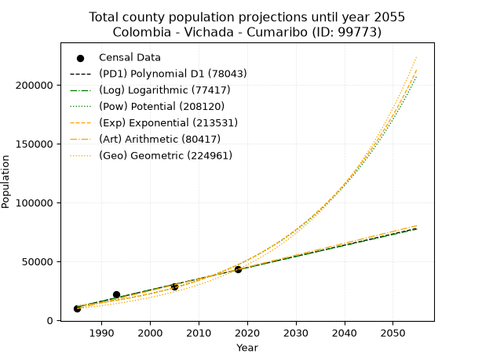
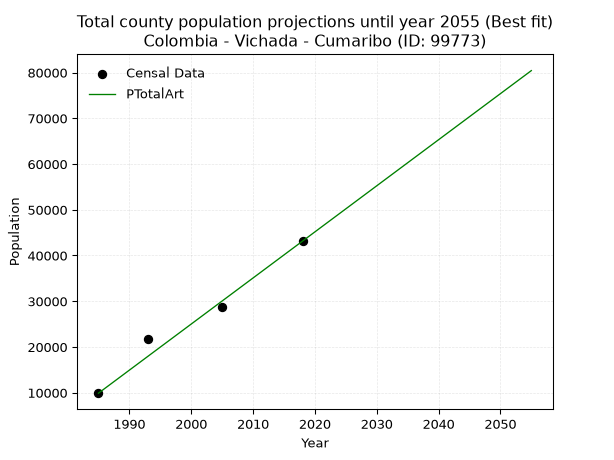
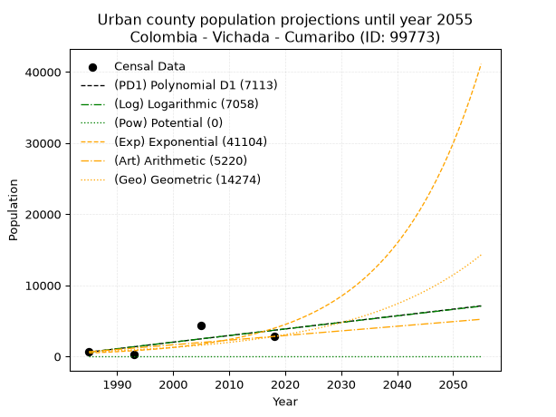
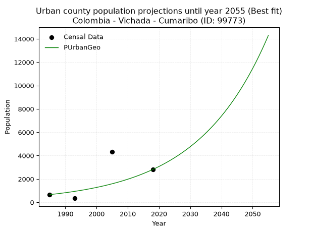
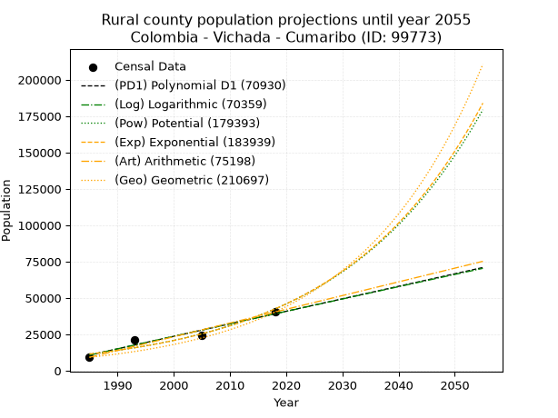
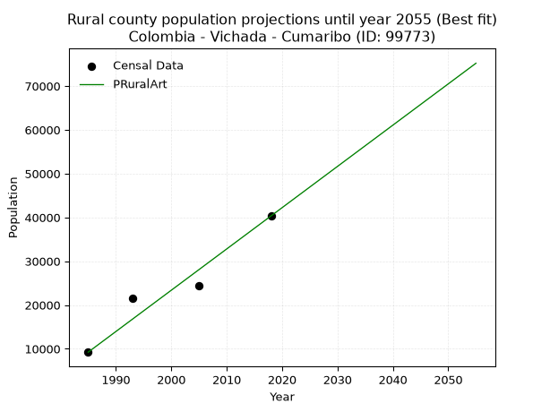

<div align="center">


</div>

# _“Population and Public Services Demand Projections (PPSD) until Year 2050 for Colombia - Vichada - Cumaribo (ID: 99773)”_
Keywords: `population` `public-service` `projection` `lineal` `polynomial` `logarithmic` `potential` `exponential` `arithmetic` `geometric` `wappaus` `dane` `colombia` `south-america`

PPSD are analytical estimates used by governments and planners to anticipate future changes in population size, age distribution, and the resulting community needs for utilities, healthcare, education, and infrastructure as sizing future water treatment facilities, electrical grids, and road networks based on spatial growth.

> **General running parameters**: • app_version: _v20260806_. • Python version: _3.14.7_. • Pandas version: _3.0.5_. • NumPy version: _2.5.1_. • Creates, save and include plots into reports (create_plot): _False_. • Projection until year: _2050_. • Process polynomial degree 2 and up: _False_. • Process Wappaus: _True_. • Process Wappaus: _True_. • Set negative values to zero: _True_. • Set infinite values to zero: _True_. • Drop dataset notes: _True_. 
<div align="center">

Dynamic map: [:earth_americas:Google](http://maps.google.com/maps?q=4.446352173,-69.7955329) [:earth_americas:OSM](https://www.openstreetmap.org/#map=18/4.446352173/-69.7955329&layers=P) [:earth_americas:Bing](https://www.bing.com/maps?cp=4.446352173~-69.7955329&lvl=18) [:earth_americas:Apple](https://maps.apple.com/frame?center=4.446352173%2C-69.7955329&span=0.003%2C0.006)

</div>


<div align="center">

```geojson
{
  "type": "Feature",
  "geometry": {
    "type": "Point", 
    "coordinates": [-69.7955329, 4.446352173]
  }, 
  "properties": {
    "Name": "Colombia - Vichada - Cumaribo (ID: 99773)"
  }
}
```

</div>


## 0. Census Data (4 records)

Census data are official statistics collected by a government about the people and housing in a country. They usually include counts of total population, age, sex, race, income, education, and jobs.

📅Global census file: [Population.xlsx](../data/Population.xlsx)

| Source   |   Year |   CountryID | CountryName   |   StateID | StateName   |   CountyID | CountyName   |   PTotal |   PUrban |   PRural |
|:---------|-------:|------------:|:--------------|----------:|:------------|-----------:|:-------------|---------:|---------:|---------:|
| DANE     |   1985 |          57 | Colombia      |        99 | Vichada     |      99773 | Cumaribo     |     9889 |      659 |     9230 |
| DANE     |   1993 |          57 | Colombia      |        99 | Vichada     |      99773 | Cumaribo     |    21800 |      342 |    21458 |
| DANE     |   2005 |          57 | Colombia      |        99 | Vichada     |      99773 | Cumaribo     |    28718 |     4312 |    24406 |
| DANE     |   2018 |          57 | Colombia      |        99 | Vichada     |      99773 | Cumaribo     |    43138 |     2809 |    40329 |

> 🔥Some records could had specific notes about the registered values or the corresponding urban or rural distribution.

## 1. Total

### 1.1. Coefficients and Parameters

* (PD1) Polynomial Deg 1: 952.633881975101, -1879619.6724206957 (lineal)
* (Log) Logarithmic: 1906912.9162502273, -14468574.107459065
* (Pow) Potential: 81.94089147883538, -266.13644116953196
* (Exp) Exponential: 0.04091267280095074, 6.545120629498734e-32
* (Art) Arithmetic: Year diff. 2018 - 1985 = 33, Population diff. 43138 - 9889 = 33249, Annual growth = 1007.5454545454545
* (Geo) Geometric: Year diff. 2018 - 1985 = 33, Population diff. 43138 - 9889 = 33249, Annual growth % = 0.04564696120311007
* (Wap) Wappaus: i = 3.8001224076242464, Condition values only valid for < 200)

<sub>
Wappaus condition values: ['0.00', '3.80', '7.60', '11.40', '15.20', '19.00', '22.80', '26.60', '30.40', '34.20', '38.00', '41.80', '45.60', '49.40', '53.20', '57.00', '60.80', '64.60', '68.40', '72.20', '76.00', '79.80', '83.60', '87.40', '91.20', '95.00', '98.80', '102.60', '106.40', '110.20', '114.00', '117.80', '121.60', '125.40', '129.20', '133.00', '136.80', '140.60', '144.40', '148.20', '152.00', '155.81', '159.61', '163.41', '167.21', '171.01', '174.81', '178.61', '182.41', '186.21', '190.01', '193.81', '197.61', '201.41', '205.21', '209.01', '212.81', '216.61', '220.41', '224.21', '228.01', '231.81', '235.61', '239.41', '243.21', '247.01']
</sub>


### 1.2. Projected Dataset

|   Year |   CountyID |   PTotalPD1 |   PTotalLog |   PTotalPow |   PTotalExp |   PTotalArt |   PTotalGeo |
|-------:|-----------:|------------:|------------:|------------:|------------:|------------:|------------:|
|   1985 |      99773 |       11359 |       11329 |       12162 |       12181 |        9889 |        9889 |
|   1986 |      99773 |       12311 |       12290 |       12674 |       12690 |       10897 |       10340 |
|   1987 |      99773 |       13264 |       13250 |       13208 |       13220 |       11904 |       10812 |
|   1988 |      99773 |       14216 |       14209 |       13764 |       13772 |       12912 |       11306 |
|   1989 |      99773 |       15169 |       15168 |       14343 |       14347 |       13919 |       11822 |
|   1990 |      99773 |       16122 |       16126 |       14946 |       14946 |       14927 |       12362 |
|   1991 |      99773 |       17074 |       17084 |       15574 |       15570 |       15934 |       12926 |
|   1992 |      99773 |       18027 |       18042 |       16228 |       16221 |       16942 |       13516 |
|   1993 |      99773 |       18980 |       18999 |       16909 |       16898 |       17949 |       14133 |
|   1994 |      99773 |       19932 |       19956 |       17619 |       17604 |       18957 |       14778 |
|   1995 |      99773 |       20885 |       20912 |       18358 |       18339 |       19964 |       15453 |
|   1996 |      99773 |       21838 |       21867 |       19127 |       19105 |       20972 |       16158 |
|   1997 |      99773 |       22790 |       22822 |       19929 |       19903 |       21980 |       16896 |
|   1998 |      99773 |       23743 |       23777 |       20763 |       20734 |       22987 |       17667 |
|   1999 |      99773 |       24695 |       24731 |       21632 |       21600 |       23995 |       18473 |
|   2000 |      99773 |       25648 |       25685 |       22537 |       22502 |       25002 |       19317 |
|   2001 |      99773 |       26601 |       26638 |       23479 |       23441 |       26010 |       20198 |
|   2002 |      99773 |       27553 |       27591 |       24461 |       24420 |       27017 |       21120 |
|   2003 |      99773 |       28506 |       28543 |       25482 |       25440 |       28025 |       22084 |
|   2004 |      99773 |       29459 |       29495 |       26546 |       26502 |       29032 |       23092 |
|   2005 |      99773 |       30411 |       30446 |       27654 |       27609 |       30040 |       24146 |
|   2006 |      99773 |       31364 |       31397 |       28807 |       28762 |       31047 |       25249 |
|   2007 |      99773 |       32317 |       32348 |       30008 |       29963 |       32055 |       26401 |
|   2008 |      99773 |       33269 |       33297 |       31258 |       31215 |       33063 |       27606 |
|   2009 |      99773 |       34222 |       34247 |       32560 |       32518 |       34070 |       28867 |
|   2010 |      99773 |       35174 |       35196 |       33915 |       33876 |       35078 |       30184 |
|   2011 |      99773 |       36127 |       36144 |       35326 |       35291 |       36085 |       31562 |
|   2012 |      99773 |       37080 |       37092 |       36794 |       36765 |       37093 |       33003 |
|   2013 |      99773 |       38032 |       38040 |       38323 |       38300 |       38100 |       34509 |
|   2014 |      99773 |       38985 |       38987 |       39915 |       39900 |       39108 |       36084 |
|   2015 |      99773 |       39938 |       39933 |       41572 |       41566 |       40115 |       37732 |
|   2016 |      99773 |       40890 |       40880 |       43297 |       43302 |       41123 |       39454 |
|   2017 |      99773 |       41843 |       41825 |       45093 |       45110 |       42130 |       41255 |
|   2018 |      99773 |       42796 |       42770 |       46962 |       46994 |       43138 |       43138 |
|   2019 |      99773 |       43748 |       43715 |       48907 |       48956 |       44146 |       45107 |
|   2020 |      99773 |       44701 |       44659 |       50933 |       51001 |       45153 |       47166 |
|   2021 |      99773 |       45653 |       45603 |       53041 |       53131 |       46161 |       49319 |
|   2022 |      99773 |       46606 |       46546 |       55235 |       55349 |       47168 |       51570 |
|   2023 |      99773 |       47559 |       47489 |       57519 |       57661 |       48176 |       53924 |
|   2024 |      99773 |       48511 |       48432 |       59896 |       60069 |       49183 |       56386 |
|   2025 |      99773 |       49464 |       49374 |       62370 |       62577 |       50191 |       58960 |
|   2026 |      99773 |       50417 |       50315 |       64945 |       65191 |       51198 |       61651 |
|   2027 |      99773 |       51369 |       51256 |       67624 |       67913 |       52206 |       64465 |
|   2028 |      99773 |       52322 |       52197 |       70413 |       70749 |       53213 |       67408 |
|   2029 |      99773 |       53274 |       53137 |       73316 |       73704 |       54221 |       70485 |
|   2030 |      99773 |       54227 |       54076 |       76337 |       76782 |       55229 |       73702 |
|   2031 |      99773 |       55180 |       55015 |       79480 |       79988 |       56236 |       77067 |
|   2032 |      99773 |       56132 |       55954 |       82752 |       83329 |       57244 |       80584 |
|   2033 |      99773 |       57085 |       56892 |       86156 |       86809 |       58251 |       84263 |
|   2034 |      99773 |       58038 |       57830 |       89698 |       90434 |       59259 |       88109 |
|   2035 |      99773 |       58990 |       58767 |       93385 |       94210 |       60266 |       92131 |
|   2036 |      99773 |       59943 |       59704 |       97221 |       98145 |       61274 |       96337 |
|   2037 |      99773 |       60896 |       60641 |      101212 |      102243 |       62281 |      100734 |
|   2038 |      99773 |       61848 |       61576 |      105366 |      106513 |       63289 |      105332 |
|   2039 |      99773 |       62801 |       62512 |      109687 |      110961 |       64296 |      110140 |
|   2040 |      99773 |       63753 |       63447 |      114184 |      115595 |       65304 |      115168 |
|   2041 |      99773 |       64706 |       64381 |      118863 |      120423 |       66312 |      120425 |
|   2042 |      99773 |       65659 |       65315 |      123731 |      125452 |       67319 |      125922 |
|   2043 |      99773 |       66611 |       66249 |      128795 |      130691 |       68327 |      131670 |
|   2044 |      99773 |       67564 |       67182 |      134065 |      136148 |       69334 |      137680 |
|   2045 |      99773 |       68517 |       68115 |      139547 |      141834 |       70342 |      143965 |
|   2046 |      99773 |       69469 |       69047 |      145251 |      147757 |       71349 |      150537 |
|   2047 |      99773 |       70422 |       69979 |      151184 |      153928 |       72357 |      157408 |
|   2048 |      99773 |       71375 |       70910 |      157357 |      160356 |       73364 |      164593 |
|   2049 |      99773 |       72327 |       71841 |      163779 |      167053 |       74372 |      172107 |
|   2050 |      99773 |       73280 |       72772 |      170460 |      174029 |       75379 |      179963 |
<div align="center">

</img>

</div>


### 1.3. Best fit with absolute and relative error (%)

Relative error puts that difference into context by dividing the absolute error by the true value, creating a unitless ratio or percentage that shows the scale of the mistake.

Absolute and relative error

|   Year | Source   |   CountryID | CountryName   |   StateID | StateName   |   CountyID_x | CountyName   |   PTotal |   PUrban |   PRural |   CountyID_y |   PTotalPD1 |   PTotalLog |   PTotalPow |   PTotalExp |   PTotalArt |   PTotalGeo |   PTotalPD1AbsError |   PTotalLogAbsError |   PTotalPowAbsError |   PTotalExpAbsError |   PTotalArtAbsError |   PTotalGeoAbsError |   PTotalPD1RelError |   PTotalLogRelError |   PTotalPowRelError |   PTotalExpRelError |   PTotalArtRelError |   PTotalGeoRelError |
|-------:|:---------|------------:|:--------------|----------:|:------------|-------------:|:-------------|---------:|---------:|---------:|-------------:|------------:|------------:|------------:|------------:|------------:|------------:|--------------------:|--------------------:|--------------------:|--------------------:|--------------------:|--------------------:|--------------------:|--------------------:|--------------------:|--------------------:|--------------------:|--------------------:|
|   1985 | DANE     |          57 | Colombia      |        99 | Vichada     |        99773 | Cumaribo     |     9889 |      659 |     9230 |        99773 |       11359 |       11329 |       12162 |       12181 |        9889 |        9889 |                1470 |                1440 |                2273 |                2292 |                   0 |                   0 |           14.865    |           14.5616   |            22.9851  |            23.1773  |             0       |              0      |
|   1993 | DANE     |          57 | Colombia      |        99 | Vichada     |        99773 | Cumaribo     |    21800 |      342 |    21458 |        99773 |       18980 |       18999 |       16909 |       16898 |       17949 |       14133 |                2820 |                2801 |                4891 |                4902 |                3851 |                7667 |           12.9358   |           12.8486   |            22.4358  |            22.4862  |            17.6651  |             35.1697 |
|   2005 | DANE     |          57 | Colombia      |        99 | Vichada     |        99773 | Cumaribo     |    28718 |     4312 |    24406 |        99773 |       30411 |       30446 |       27654 |       27609 |       30040 |       24146 |                1693 |                1728 |                1064 |                1109 |                1322 |                4572 |            5.89526  |            6.01713  |             3.70499 |             3.86169 |             4.60338 |             15.9203 |
|   2018 | DANE     |          57 | Colombia      |        99 | Vichada     |        99773 | Cumaribo     |    43138 |     2809 |    40329 |        99773 |       42796 |       42770 |       46962 |       46994 |       43138 |       43138 |                 342 |                 368 |                3824 |                3856 |                   0 |                   0 |            0.792804 |            0.853076 |             8.86457 |             8.93875 |             0       |              0      |

Relative error mean

| Method    |   RelError | Best   |
|:----------|-----------:|:-------|
| PTotalPD1 |    8.62221 |        |
| PTotalLog |    8.57012 |        |
| PTotalPow |   14.4976  |        |
| PTotalExp |   14.616   |        |
| PTotalArt |    5.56713 | True   |
| PTotalGeo |   12.7725  |        |

💙Best method: _**PTotalArt**_
<div align="center">

</img>

</div>


### 1.4. Fresh water supply demand in liters per capita per day (lpcd)

The fresh water supply demand typically ranges from 100 to 300 liters per capita per day (lpcd) for standard domestic and municipal planning, though absolute survival minimums set by the World Health Organization are as low as 7.5 to 20 liters per day, and total consumption in high-income nations can exceed 400 liters.

> `CZ`: Level in meters above the sea level (masl).<br> `WS`: Fresh water supply demand in liters per capita per day (lpcd or l/h/d).<br> `WSAll`: Zonal fresh water supply demand in liters per second (l/s).<br> `A`: Zonal area in square meters.

Reference values (RAS Colombia)

|    CZ |   WS |
|------:|-----:|
|  1000 |  120 |
|  2000 |  130 |
| 99999 |  140 |

County shapefile geometry properties and water supply values

|   CountyID |      ATotal |   CZTotal |   WSTotal |
|-----------:|------------:|----------:|----------:|
|      99773 | 6.51875e+10 |   140.971 |       120 |

Projected values for best method: PTotalArt

|   CountyID |   Year |   PTotalArt |   WSTotal |   WSTotalAll |
|-----------:|-------:|------------:|----------:|-------------:|
|      99773 |   1985 |        9889 |       120 |      13.7347 |
|      99773 |   1986 |       10897 |       120 |      15.1347 |
|      99773 |   1987 |       11904 |       120 |      16.5333 |
|      99773 |   1988 |       12912 |       120 |      17.9333 |
|      99773 |   1989 |       13919 |       120 |      19.3319 |
|      99773 |   1990 |       14927 |       120 |      20.7319 |
|      99773 |   1991 |       15934 |       120 |      22.1306 |
|      99773 |   1992 |       16942 |       120 |      23.5306 |
|      99773 |   1993 |       17949 |       120 |      24.9292 |
|      99773 |   1994 |       18957 |       120 |      26.3292 |
|      99773 |   1995 |       19964 |       120 |      27.7278 |
|      99773 |   1996 |       20972 |       120 |      29.1278 |
|      99773 |   1997 |       21980 |       120 |      30.5278 |
|      99773 |   1998 |       22987 |       120 |      31.9264 |
|      99773 |   1999 |       23995 |       120 |      33.3264 |
|      99773 |   2000 |       25002 |       120 |      34.725  |
|      99773 |   2001 |       26010 |       120 |      36.125  |
|      99773 |   2002 |       27017 |       120 |      37.5236 |
|      99773 |   2003 |       28025 |       120 |      38.9236 |
|      99773 |   2004 |       29032 |       120 |      40.3222 |
|      99773 |   2005 |       30040 |       120 |      41.7222 |
|      99773 |   2006 |       31047 |       120 |      43.1208 |
|      99773 |   2007 |       32055 |       120 |      44.5208 |
|      99773 |   2008 |       33063 |       120 |      45.9208 |
|      99773 |   2009 |       34070 |       120 |      47.3194 |
|      99773 |   2010 |       35078 |       120 |      48.7194 |
|      99773 |   2011 |       36085 |       120 |      50.1181 |
|      99773 |   2012 |       37093 |       120 |      51.5181 |
|      99773 |   2013 |       38100 |       120 |      52.9167 |
|      99773 |   2014 |       39108 |       120 |      54.3167 |
|      99773 |   2015 |       40115 |       120 |      55.7153 |
|      99773 |   2016 |       41123 |       120 |      57.1153 |
|      99773 |   2017 |       42130 |       120 |      58.5139 |
|      99773 |   2018 |       43138 |       120 |      59.9139 |
|      99773 |   2019 |       44146 |       120 |      61.3139 |
|      99773 |   2020 |       45153 |       120 |      62.7125 |
|      99773 |   2021 |       46161 |       120 |      64.1125 |
|      99773 |   2022 |       47168 |       120 |      65.5111 |
|      99773 |   2023 |       48176 |       120 |      66.9111 |
|      99773 |   2024 |       49183 |       120 |      68.3097 |
|      99773 |   2025 |       50191 |       120 |      69.7097 |
|      99773 |   2026 |       51198 |       120 |      71.1083 |
|      99773 |   2027 |       52206 |       120 |      72.5083 |
|      99773 |   2028 |       53213 |       120 |      73.9069 |
|      99773 |   2029 |       54221 |       120 |      75.3069 |
|      99773 |   2030 |       55229 |       120 |      76.7069 |
|      99773 |   2031 |       56236 |       120 |      78.1056 |
|      99773 |   2032 |       57244 |       120 |      79.5056 |
|      99773 |   2033 |       58251 |       120 |      80.9042 |
|      99773 |   2034 |       59259 |       120 |      82.3042 |
|      99773 |   2035 |       60266 |       120 |      83.7028 |
|      99773 |   2036 |       61274 |       120 |      85.1028 |
|      99773 |   2037 |       62281 |       120 |      86.5014 |
|      99773 |   2038 |       63289 |       120 |      87.9014 |
|      99773 |   2039 |       64296 |       120 |      89.3    |
|      99773 |   2040 |       65304 |       120 |      90.7    |
|      99773 |   2041 |       66312 |       120 |      92.1    |
|      99773 |   2042 |       67319 |       120 |      93.4986 |
|      99773 |   2043 |       68327 |       120 |      94.8986 |
|      99773 |   2044 |       69334 |       120 |      96.2972 |
|      99773 |   2045 |       70342 |       120 |      97.6972 |
|      99773 |   2046 |       71349 |       120 |      99.0958 |
|      99773 |   2047 |       72357 |       120 |     100.496  |
|      99773 |   2048 |       73364 |       120 |     101.894  |
|      99773 |   2049 |       74372 |       120 |     103.294  |
|      99773 |   2050 |       75379 |       120 |     104.693  |

## 2. Urban

### 2.1. Coefficients and Parameters

* (PD1) Polynomial Deg 1: 92.83420313127327, -183661.11481332936 (lineal)
* (Log) Logarithmic: 186039.1518411576, -1412054.5839688391
* (Pow) Potential: 126.73005782015832, -415.23649620953626
* (Exp) Exponential: 0.06328855475075114, 1.350280026955842e-52
* (Art) Arithmetic: Year diff. 2018 - 1985 = 33, Population diff. 2809 - 659 = 2150, Annual growth = 65.15151515151516
* (Geo) Geometric: Year diff. 2018 - 1985 = 33, Population diff. 2809 - 659 = 2150, Annual growth % = 0.044914600828198425
* (Wap) Wappaus: i = 3.7572961448393976, Condition values only valid for < 200)

<sub>
Wappaus condition values: ['0.00', '3.76', '7.51', '11.27', '15.03', '18.79', '22.54', '26.30', '30.06', '33.82', '37.57', '41.33', '45.09', '48.84', '52.60', '56.36', '60.12', '63.87', '67.63', '71.39', '75.15', '78.90', '82.66', '86.42', '90.18', '93.93', '97.69', '101.45', '105.20', '108.96', '112.72', '116.48', '120.23', '123.99', '127.75', '131.51', '135.26', '139.02', '142.78', '146.53', '150.29', '154.05', '157.81', '161.56', '165.32', '169.08', '172.84', '176.59', '180.35', '184.11', '187.86', '191.62', '195.38', '199.14', '202.89', '206.65', '210.41', '214.17', '217.92', '221.68', '225.44', '229.20', '232.95', '236.71', '240.47', '244.22']
</sub>


### 2.2. Projected Dataset

|   Year |   CountyID |   PUrbanPD1 |   PUrbanLog |   PUrbanPow |   PUrbanExp |   PUrbanArt |   PUrbanGeo |
|-------:|-----------:|------------:|------------:|------------:|------------:|------------:|------------:|
|   1985 |      99773 |         615 |         610 |           0 |         490 |         659 |         659 |
|   1986 |      99773 |         708 |         704 |           0 |         522 |         724 |         689 |
|   1987 |      99773 |         800 |         798 |           0 |         556 |         789 |         720 |
|   1988 |      99773 |         893 |         891 |           0 |         592 |         854 |         752 |
|   1989 |      99773 |         986 |         985 |           0 |         631 |         920 |         786 |
|   1990 |      99773 |        1079 |        1078 |           0 |         672 |         985 |         821 |
|   1991 |      99773 |        1172 |        1172 |           0 |         716 |        1050 |         858 |
|   1992 |      99773 |        1265 |        1265 |           0 |         763 |        1115 |         896 |
|   1993 |      99773 |        1357 |        1359 |           0 |         812 |        1180 |         937 |
|   1994 |      99773 |        1450 |        1452 |           0 |         865 |        1245 |         979 |
|   1995 |      99773 |        1543 |        1545 |           0 |         922 |        1311 |        1023 |
|   1996 |      99773 |        1636 |        1638 |           0 |         982 |        1376 |        1068 |
|   1997 |      99773 |        1729 |        1732 |           0 |        1046 |        1441 |        1116 |
|   1998 |      99773 |        1822 |        1825 |           0 |        1115 |        1506 |        1167 |
|   1999 |      99773 |        1914 |        1918 |           0 |        1188 |        1571 |        1219 |
|   2000 |      99773 |        2007 |        2011 |           0 |        1265 |        1636 |        1274 |
|   2001 |      99773 |        2100 |        2104 |           0 |        1348 |        1701 |        1331 |
|   2002 |      99773 |        2193 |        2197 |           0 |        1436 |        1767 |        1391 |
|   2003 |      99773 |        2286 |        2290 |           0 |        1530 |        1832 |        1453 |
|   2004 |      99773 |        2379 |        2383 |           0 |        1630 |        1897 |        1519 |
|   2005 |      99773 |        2471 |        2475 |           0 |        1736 |        1962 |        1587 |
|   2006 |      99773 |        2564 |        2568 |           0 |        1850 |        2027 |        1658 |
|   2007 |      99773 |        2657 |        2661 |           0 |        1970 |        2092 |        1732 |
|   2008 |      99773 |        2750 |        2754 |           0 |        2099 |        2157 |        1810 |
|   2009 |      99773 |        2843 |        2846 |           0 |        2236 |        2223 |        1892 |
|   2010 |      99773 |        2936 |        2939 |           0 |        2382 |        2288 |        1977 |
|   2011 |      99773 |        3028 |        3031 |           0 |        2538 |        2353 |        2065 |
|   2012 |      99773 |        3121 |        3124 |           0 |        2704 |        2418 |        2158 |
|   2013 |      99773 |        3214 |        3216 |           0 |        2881 |        2483 |        2255 |
|   2014 |      99773 |        3307 |        3309 |           0 |        3069 |        2548 |        2356 |
|   2015 |      99773 |        3400 |        3401 |           0 |        3269 |        2614 |        2462 |
|   2016 |      99773 |        3493 |        3493 |           0 |        3483 |        2679 |        2573 |
|   2017 |      99773 |        3585 |        3586 |           0 |        3710 |        2744 |        2688 |
|   2018 |      99773 |        3678 |        3678 |           0 |        3953 |        2809 |        2809 |
|   2019 |      99773 |        3771 |        3770 |           0 |        4211 |        2874 |        2935 |
|   2020 |      99773 |        3864 |        3862 |           0 |        4486 |        2939 |        3067 |
|   2021 |      99773 |        3957 |        3954 |           0 |        4779 |        3004 |        3205 |
|   2022 |      99773 |        4050 |        4046 |           0 |        5092 |        3070 |        3349 |
|   2023 |      99773 |        4142 |        4138 |           0 |        5424 |        3135 |        3499 |
|   2024 |      99773 |        4235 |        4230 |           0 |        5779 |        3200 |        3656 |
|   2025 |      99773 |        4328 |        4322 |           0 |        6156 |        3265 |        3820 |
|   2026 |      99773 |        4421 |        4414 |           0 |        6558 |        3330 |        3992 |
|   2027 |      99773 |        4514 |        4506 |           0 |        6987 |        3395 |        4171 |
|   2028 |      99773 |        4607 |        4597 |           0 |        7443 |        3461 |        4359 |
|   2029 |      99773 |        4699 |        4689 |           0 |        7930 |        3526 |        4554 |
|   2030 |      99773 |        4792 |        4781 |           0 |        8448 |        3591 |        4759 |
|   2031 |      99773 |        4885 |        4872 |           0 |        9000 |        3656 |        4973 |
|   2032 |      99773 |        4978 |        4964 |           0 |        9588 |        3721 |        5196 |
|   2033 |      99773 |        5071 |        5055 |           0 |       10214 |        3786 |        5430 |
|   2034 |      99773 |        5164 |        5147 |           0 |       10881 |        3851 |        5673 |
|   2035 |      99773 |        5256 |        5238 |           0 |       11592 |        3917 |        5928 |
|   2036 |      99773 |        5349 |        5330 |           0 |       12350 |        3982 |        6194 |
|   2037 |      99773 |        5442 |        5421 |           0 |       13157 |        4047 |        6473 |
|   2038 |      99773 |        5535 |        5512 |           0 |       14016 |        4112 |        6763 |
|   2039 |      99773 |        5628 |        5604 |           0 |       14932 |        4177 |        7067 |
|   2040 |      99773 |        5721 |        5695 |           0 |       15907 |        4242 |        7385 |
|   2041 |      99773 |        5813 |        5786 |           0 |       16947 |        4307 |        7716 |
|   2042 |      99773 |        5906 |        5877 |           0 |       18054 |        4373 |        8063 |
|   2043 |      99773 |        5999 |        5968 |           0 |       19233 |        4438 |        8425 |
|   2044 |      99773 |        6092 |        6059 |           0 |       20490 |        4503 |        8803 |
|   2045 |      99773 |        6185 |        6150 |           0 |       21829 |        4568 |        9199 |
|   2046 |      99773 |        6278 |        6241 |           0 |       23255 |        4633 |        9612 |
|   2047 |      99773 |        6370 |        6332 |           0 |       24774 |        4698 |       10044 |
|   2048 |      99773 |        6463 |        6423 |           0 |       26393 |        4764 |       10495 |
|   2049 |      99773 |        6556 |        6514 |           0 |       28117 |        4829 |       10966 |
|   2050 |      99773 |        6649 |        6605 |           0 |       29954 |        4894 |       11459 |
<div align="center">

</img>

</div>


### 2.3. Best fit with absolute and relative error (%)

Relative error puts that difference into context by dividing the absolute error by the true value, creating a unitless ratio or percentage that shows the scale of the mistake.

Absolute and relative error

|   Year | Source   |   CountryID | CountryName   |   StateID | StateName   |   CountyID_x | CountyName   |   PTotal |   PUrban |   PRural |   CountyID_y |   PUrbanPD1 |   PUrbanLog |   PUrbanPow |   PUrbanExp |   PUrbanArt |   PUrbanGeo |   PUrbanPD1AbsError |   PUrbanLogAbsError |   PUrbanPowAbsError |   PUrbanExpAbsError |   PUrbanArtAbsError |   PUrbanGeoAbsError |   PUrbanPD1RelError |   PUrbanLogRelError |   PUrbanPowRelError |   PUrbanExpRelError |   PUrbanArtRelError |   PUrbanGeoRelError |
|-------:|:---------|------------:|:--------------|----------:|:------------|-------------:|:-------------|---------:|---------:|---------:|-------------:|------------:|------------:|------------:|------------:|------------:|------------:|--------------------:|--------------------:|--------------------:|--------------------:|--------------------:|--------------------:|--------------------:|--------------------:|--------------------:|--------------------:|--------------------:|--------------------:|
|   1985 | DANE     |          57 | Colombia      |        99 | Vichada     |        99773 | Cumaribo     |     9889 |      659 |     9230 |        99773 |         615 |         610 |           0 |         490 |         659 |         659 |                  44 |                  49 |                 659 |                 169 |                   0 |                   0 |             6.67678 |             7.43551 |                 100 |             25.6449 |              0      |              0      |
|   1993 | DANE     |          57 | Colombia      |        99 | Vichada     |        99773 | Cumaribo     |    21800 |      342 |    21458 |        99773 |        1357 |        1359 |           0 |         812 |        1180 |         937 |                1015 |                1017 |                 342 |                 470 |                 838 |                 595 |           296.784   |           297.368   |                 100 |            137.427  |            245.029  |            173.977  |
|   2005 | DANE     |          57 | Colombia      |        99 | Vichada     |        99773 | Cumaribo     |    28718 |     4312 |    24406 |        99773 |        2471 |        2475 |           0 |        1736 |        1962 |        1587 |                1841 |                1837 |                4312 |                2576 |                2350 |                2725 |            42.6948  |            42.602   |                 100 |             59.7403 |             54.4991 |             63.1957 |
|   2018 | DANE     |          57 | Colombia      |        99 | Vichada     |        99773 | Cumaribo     |    43138 |     2809 |    40329 |        99773 |        3678 |        3678 |           0 |        3953 |        2809 |        2809 |                 869 |                 869 |                2809 |                1144 |                   0 |                   0 |            30.9363  |            30.9363  |                 100 |             40.7262 |              0      |              0      |

Relative error mean

| Method    |   RelError | Best   |
|:----------|-----------:|:-------|
| PUrbanPD1 |    94.2729 |        |
| PUrbanLog |    94.5856 |        |
| PUrbanPow |   100      |        |
| PUrbanExp |    65.8846 |        |
| PUrbanArt |    74.8821 |        |
| PUrbanGeo |    59.2931 | True   |

💙Best method: _**PUrbanGeo**_
<div align="center">

</img>

</div>


### 2.4. Fresh water supply demand in liters per capita per day (lpcd)

The fresh water supply demand typically ranges from 100 to 300 liters per capita per day (lpcd) for standard domestic and municipal planning, though absolute survival minimums set by the World Health Organization are as low as 7.5 to 20 liters per day, and total consumption in high-income nations can exceed 400 liters.

> `CZ`: Level in meters above the sea level (masl).<br> `WS`: Fresh water supply demand in liters per capita per day (lpcd or l/h/d).<br> `WSAll`: Zonal fresh water supply demand in liters per second (l/s).<br> `A`: Zonal area in square meters.

Reference values (RAS Colombia)

|    CZ |   WS |
|------:|-----:|
|  1000 |  120 |
|  2000 |  130 |
| 99999 |  140 |

County shapefile geometry properties and water supply values

|   CountyID |   AUrban |   CZUrban |   WSUrban |
|-----------:|---------:|----------:|----------:|
|      99773 |   954478 |   160.705 |       120 |

Projected values for best method: PUrbanGeo

|   CountyID |   Year |   PUrbanGeo |   WSUrban |   WSUrbanAll |
|-----------:|-------:|------------:|----------:|-------------:|
|      99773 |   1985 |         659 |       120 |     0.915278 |
|      99773 |   1986 |         689 |       120 |     0.956944 |
|      99773 |   1987 |         720 |       120 |     1        |
|      99773 |   1988 |         752 |       120 |     1.04444  |
|      99773 |   1989 |         786 |       120 |     1.09167  |
|      99773 |   1990 |         821 |       120 |     1.14028  |
|      99773 |   1991 |         858 |       120 |     1.19167  |
|      99773 |   1992 |         896 |       120 |     1.24444  |
|      99773 |   1993 |         937 |       120 |     1.30139  |
|      99773 |   1994 |         979 |       120 |     1.35972  |
|      99773 |   1995 |        1023 |       120 |     1.42083  |
|      99773 |   1996 |        1068 |       120 |     1.48333  |
|      99773 |   1997 |        1116 |       120 |     1.55     |
|      99773 |   1998 |        1167 |       120 |     1.62083  |
|      99773 |   1999 |        1219 |       120 |     1.69306  |
|      99773 |   2000 |        1274 |       120 |     1.76944  |
|      99773 |   2001 |        1331 |       120 |     1.84861  |
|      99773 |   2002 |        1391 |       120 |     1.93194  |
|      99773 |   2003 |        1453 |       120 |     2.01806  |
|      99773 |   2004 |        1519 |       120 |     2.10972  |
|      99773 |   2005 |        1587 |       120 |     2.20417  |
|      99773 |   2006 |        1658 |       120 |     2.30278  |
|      99773 |   2007 |        1732 |       120 |     2.40556  |
|      99773 |   2008 |        1810 |       120 |     2.51389  |
|      99773 |   2009 |        1892 |       120 |     2.62778  |
|      99773 |   2010 |        1977 |       120 |     2.74583  |
|      99773 |   2011 |        2065 |       120 |     2.86806  |
|      99773 |   2012 |        2158 |       120 |     2.99722  |
|      99773 |   2013 |        2255 |       120 |     3.13194  |
|      99773 |   2014 |        2356 |       120 |     3.27222  |
|      99773 |   2015 |        2462 |       120 |     3.41944  |
|      99773 |   2016 |        2573 |       120 |     3.57361  |
|      99773 |   2017 |        2688 |       120 |     3.73333  |
|      99773 |   2018 |        2809 |       120 |     3.90139  |
|      99773 |   2019 |        2935 |       120 |     4.07639  |
|      99773 |   2020 |        3067 |       120 |     4.25972  |
|      99773 |   2021 |        3205 |       120 |     4.45139  |
|      99773 |   2022 |        3349 |       120 |     4.65139  |
|      99773 |   2023 |        3499 |       120 |     4.85972  |
|      99773 |   2024 |        3656 |       120 |     5.07778  |
|      99773 |   2025 |        3820 |       120 |     5.30556  |
|      99773 |   2026 |        3992 |       120 |     5.54444  |
|      99773 |   2027 |        4171 |       120 |     5.79306  |
|      99773 |   2028 |        4359 |       120 |     6.05417  |
|      99773 |   2029 |        4554 |       120 |     6.325    |
|      99773 |   2030 |        4759 |       120 |     6.60972  |
|      99773 |   2031 |        4973 |       120 |     6.90694  |
|      99773 |   2032 |        5196 |       120 |     7.21667  |
|      99773 |   2033 |        5430 |       120 |     7.54167  |
|      99773 |   2034 |        5673 |       120 |     7.87917  |
|      99773 |   2035 |        5928 |       120 |     8.23333  |
|      99773 |   2036 |        6194 |       120 |     8.60278  |
|      99773 |   2037 |        6473 |       120 |     8.99028  |
|      99773 |   2038 |        6763 |       120 |     9.39306  |
|      99773 |   2039 |        7067 |       120 |     9.81528  |
|      99773 |   2040 |        7385 |       120 |    10.2569   |
|      99773 |   2041 |        7716 |       120 |    10.7167   |
|      99773 |   2042 |        8063 |       120 |    11.1986   |
|      99773 |   2043 |        8425 |       120 |    11.7014   |
|      99773 |   2044 |        8803 |       120 |    12.2264   |
|      99773 |   2045 |        9199 |       120 |    12.7764   |
|      99773 |   2046 |        9612 |       120 |    13.35     |
|      99773 |   2047 |       10044 |       120 |    13.95     |
|      99773 |   2048 |       10495 |       120 |    14.5764   |
|      99773 |   2049 |       10966 |       120 |    15.2306   |
|      99773 |   2050 |       11459 |       120 |    15.9153   |

## 3. Rural

### 3.1. Coefficients and Parameters

* (PD1) Polynomial Deg 1: 859.7996788438275, -1695958.5576073658 (lineal)
* (Log) Logarithmic: 1720873.7644090701, -13056519.523490226
* (Pow) Potential: 79.35670591040508, -257.64002814721476
* (Exp) Exponential: 0.039625430868653506, 7.942588003440174e-31
* (Art) Arithmetic: Year diff. 2018 - 1985 = 33, Population diff. 40329 - 9230 = 31099, Annual growth = 942.3939393939394
* (Geo) Geometric: Year diff. 2018 - 1985 = 33, Population diff. 40329 - 9230 = 31099, Annual growth % = 0.045698627379782586
* (Wap) Wappaus: i = 3.803119269533039, Condition values only valid for < 200)

<sub>
Wappaus condition values: ['0.00', '3.80', '7.61', '11.41', '15.21', '19.02', '22.82', '26.62', '30.42', '34.23', '38.03', '41.83', '45.64', '49.44', '53.24', '57.05', '60.85', '64.65', '68.46', '72.26', '76.06', '79.87', '83.67', '87.47', '91.27', '95.08', '98.88', '102.68', '106.49', '110.29', '114.09', '117.90', '121.70', '125.50', '129.31', '133.11', '136.91', '140.72', '144.52', '148.32', '152.12', '155.93', '159.73', '163.53', '167.34', '171.14', '174.94', '178.75', '182.55', '186.35', '190.16', '193.96', '197.76', '201.57', '205.37', '209.17', '212.97', '216.78', '220.58', '224.38', '228.19', '231.99', '235.79', '239.60', '243.40', '247.20']
</sub>


### 3.2. Projected Dataset

|   Year |   CountyID |   PRuralPD1 |   PRuralLog |   PRuralPow |   PRuralExp |   PRuralArt |   PRuralGeo |
|-------:|-----------:|------------:|------------:|------------:|------------:|------------:|------------:|
|   1985 |      99773 |       10744 |       10719 |       11465 |       11483 |        9230 |        9230 |
|   1986 |      99773 |       11604 |       11586 |       11933 |       11947 |       10172 |        9652 |
|   1987 |      99773 |       12463 |       12452 |       12419 |       12430 |       11115 |       10093 |
|   1988 |      99773 |       13323 |       13318 |       12925 |       12932 |       12057 |       10554 |
|   1989 |      99773 |       14183 |       14183 |       13451 |       13455 |       13000 |       11036 |
|   1990 |      99773 |       15043 |       15048 |       13999 |       13999 |       13942 |       11541 |
|   1991 |      99773 |       15903 |       15913 |       14568 |       14564 |       14884 |       12068 |
|   1992 |      99773 |       16762 |       16777 |       15160 |       15153 |       15827 |       12620 |
|   1993 |      99773 |       17622 |       17640 |       15776 |       15766 |       16769 |       13196 |
|   1994 |      99773 |       18482 |       18504 |       16417 |       16403 |       17712 |       13799 |
|   1995 |      99773 |       19342 |       19367 |       17083 |       17066 |       18654 |       14430 |
|   1996 |      99773 |       20202 |       20229 |       17776 |       17756 |       19596 |       15089 |
|   1997 |      99773 |       21061 |       21091 |       18497 |       18473 |       20539 |       15779 |
|   1998 |      99773 |       21921 |       21952 |       19247 |       19220 |       21481 |       16500 |
|   1999 |      99773 |       22781 |       22813 |       20026 |       19997 |       22424 |       17254 |
|   2000 |      99773 |       23641 |       23674 |       20837 |       20805 |       23366 |       18043 |
|   2001 |      99773 |       24501 |       24534 |       21680 |       21646 |       24308 |       18867 |
|   2002 |      99773 |       25360 |       25394 |       22557 |       22521 |       25251 |       19729 |
|   2003 |      99773 |       26220 |       26253 |       23469 |       23432 |       26193 |       20631 |
|   2004 |      99773 |       27080 |       27112 |       24417 |       24379 |       27135 |       21574 |
|   2005 |      99773 |       27940 |       27971 |       25403 |       25364 |       28078 |       22560 |
|   2006 |      99773 |       28800 |       28829 |       26429 |       26389 |       29020 |       23591 |
|   2007 |      99773 |       29659 |       29687 |       27495 |       27456 |       29963 |       24669 |
|   2008 |      99773 |       30519 |       30544 |       28604 |       28566 |       30905 |       25796 |
|   2009 |      99773 |       31379 |       31401 |       29756 |       29720 |       31847 |       26975 |
|   2010 |      99773 |       32239 |       32257 |       30955 |       30922 |       32790 |       28208 |
|   2011 |      99773 |       33099 |       33113 |       32201 |       32172 |       33732 |       29497 |
|   2012 |      99773 |       33958 |       33968 |       33497 |       33472 |       34675 |       30845 |
|   2013 |      99773 |       34818 |       34824 |       34844 |       34825 |       35617 |       32254 |
|   2014 |      99773 |       35678 |       35678 |       36245 |       36233 |       36559 |       33728 |
|   2015 |      99773 |       36538 |       36532 |       37701 |       37697 |       37502 |       35269 |
|   2016 |      99773 |       37398 |       37386 |       39215 |       39221 |       38444 |       36881 |
|   2017 |      99773 |       38257 |       38240 |       40789 |       40806 |       39387 |       38567 |
|   2018 |      99773 |       39117 |       39093 |       42426 |       42456 |       40329 |       40329 |
|   2019 |      99773 |       39977 |       39945 |       44127 |       44172 |       41271 |       42172 |
|   2020 |      99773 |       40837 |       40797 |       45895 |       45957 |       42214 |       44099 |
|   2021 |      99773 |       41697 |       41649 |       47734 |       47815 |       43156 |       46114 |
|   2022 |      99773 |       42556 |       42500 |       49645 |       49748 |       44099 |       48222 |
|   2023 |      99773 |       43416 |       43351 |       51632 |       51759 |       45041 |       50425 |
|   2024 |      99773 |       44276 |       44202 |       53697 |       53851 |       45983 |       52730 |
|   2025 |      99773 |       45136 |       45052 |       55843 |       56028 |       46926 |       55140 |
|   2026 |      99773 |       45996 |       45901 |       58075 |       58292 |       47868 |       57659 |
|   2027 |      99773 |       46855 |       46750 |       60394 |       60648 |       48811 |       60294 |
|   2028 |      99773 |       47715 |       47599 |       62804 |       63100 |       49753 |       63050 |
|   2029 |      99773 |       48575 |       48448 |       65310 |       65651 |       50695 |       65931 |
|   2030 |      99773 |       49435 |       49296 |       67914 |       68304 |       51638 |       68944 |
|   2031 |      99773 |       50295 |       50143 |       70621 |       71065 |       52580 |       72095 |
|   2032 |      99773 |       51154 |       50990 |       73435 |       73938 |       53523 |       75389 |
|   2033 |      99773 |       52014 |       51837 |       76358 |       76926 |       54465 |       78834 |
|   2034 |      99773 |       52874 |       52683 |       79397 |       80036 |       55407 |       82437 |
|   2035 |      99773 |       53734 |       53529 |       82555 |       83271 |       56350 |       86204 |
|   2036 |      99773 |       54594 |       54374 |       85837 |       86637 |       57292 |       90144 |
|   2037 |      99773 |       55453 |       55219 |       89248 |       90139 |       58234 |       94263 |
|   2038 |      99773 |       56313 |       56064 |       92793 |       93782 |       59177 |       98571 |
|   2039 |      99773 |       57173 |       56908 |       96476 |       97573 |       60119 |      103075 |
|   2040 |      99773 |       58033 |       57752 |      100304 |      101517 |       61062 |      107786 |
|   2041 |      99773 |       58893 |       58595 |      104282 |      105620 |       62004 |      112711 |
|   2042 |      99773 |       59752 |       59438 |      108416 |      109890 |       62946 |      117862 |
|   2043 |      99773 |       60612 |       60281 |      112711 |      114331 |       63889 |      123248 |
|   2044 |      99773 |       61472 |       61123 |      117174 |      118953 |       64831 |      128881 |
|   2045 |      99773 |       62332 |       61965 |      121811 |      123761 |       65774 |      134770 |
|   2046 |      99773 |       63192 |       62806 |      126630 |      128764 |       66716 |      140929 |
|   2047 |      99773 |       64051 |       63647 |      131637 |      133968 |       67658 |      147369 |
|   2048 |      99773 |       64911 |       64487 |      136839 |      139383 |       68601 |      154104 |
|   2049 |      99773 |       65771 |       65327 |      142244 |      145017 |       69543 |      161146 |
|   2050 |      99773 |       66631 |       66167 |      147859 |      150879 |       70486 |      168510 |
<div align="center">

</img>

</div>


### 3.3. Best fit with absolute and relative error (%)

Relative error puts that difference into context by dividing the absolute error by the true value, creating a unitless ratio or percentage that shows the scale of the mistake.

Absolute and relative error

|   Year | Source   |   CountryID | CountryName   |   StateID | StateName   |   CountyID_x | CountyName   |   PTotal |   PUrban |   PRural |   CountyID_y |   PRuralPD1 |   PRuralLog |   PRuralPow |   PRuralExp |   PRuralArt |   PRuralGeo |   PRuralPD1AbsError |   PRuralLogAbsError |   PRuralPowAbsError |   PRuralExpAbsError |   PRuralArtAbsError |   PRuralGeoAbsError |   PRuralPD1RelError |   PRuralLogRelError |   PRuralPowRelError |   PRuralExpRelError |   PRuralArtRelError |   PRuralGeoRelError |
|-------:|:---------|------------:|:--------------|----------:|:------------|-------------:|:-------------|---------:|---------:|---------:|-------------:|------------:|------------:|------------:|------------:|------------:|------------:|--------------------:|--------------------:|--------------------:|--------------------:|--------------------:|--------------------:|--------------------:|--------------------:|--------------------:|--------------------:|--------------------:|--------------------:|
|   1985 | DANE     |          57 | Colombia      |        99 | Vichada     |        99773 | Cumaribo     |     9889 |      659 |     9230 |        99773 |       10744 |       10719 |       11465 |       11483 |        9230 |        9230 |                1514 |                1489 |                2235 |                2253 |                   0 |                   0 |            16.403   |            16.1322  |            24.2145  |            24.4095  |              0      |             0       |
|   1993 | DANE     |          57 | Colombia      |        99 | Vichada     |        99773 | Cumaribo     |    21800 |      342 |    21458 |        99773 |       17622 |       17640 |       15776 |       15766 |       16769 |       13196 |                3836 |                3818 |                5682 |                5692 |                4689 |                8262 |            17.8768  |            17.7929  |            26.4796  |            26.5262  |             21.852  |            38.5031  |
|   2005 | DANE     |          57 | Colombia      |        99 | Vichada     |        99773 | Cumaribo     |    28718 |     4312 |    24406 |        99773 |       27940 |       27971 |       25403 |       25364 |       28078 |       22560 |                3534 |                3565 |                 997 |                 958 |                3672 |                1846 |            14.48    |            14.6071  |             4.08506 |             3.92526 |             15.0455 |             7.56371 |
|   2018 | DANE     |          57 | Colombia      |        99 | Vichada     |        99773 | Cumaribo     |    43138 |     2809 |    40329 |        99773 |       39117 |       39093 |       42426 |       42456 |       40329 |       40329 |                1212 |                1236 |                2097 |                2127 |                   0 |                   0 |             3.00528 |             3.06479 |             5.19973 |             5.27412 |              0      |             0       |

Relative error mean

| Method    |   RelError | Best   |
|:----------|-----------:|:-------|
| PRuralPD1 |   12.9413  |        |
| PRuralLog |   12.8992  |        |
| PRuralPow |   14.9947  |        |
| PRuralExp |   15.0338  |        |
| PRuralArt |    9.22437 | True   |
| PRuralGeo |   11.5167  |        |

💙Best method: _**PRuralArt**_
<div align="center">

</img>

</div>


### 3.4. Fresh water supply demand in liters per capita per day (lpcd)

The fresh water supply demand typically ranges from 100 to 300 liters per capita per day (lpcd) for standard domestic and municipal planning, though absolute survival minimums set by the World Health Organization are as low as 7.5 to 20 liters per day, and total consumption in high-income nations can exceed 400 liters.

> `CZ`: Level in meters above the sea level (masl).<br> `WS`: Fresh water supply demand in liters per capita per day (lpcd or l/h/d).<br> `WSAll`: Zonal fresh water supply demand in liters per second (l/s).<br> `A`: Zonal area in square meters.

Reference values (RAS Colombia)

|    CZ |   WS |
|------:|-----:|
|  1000 |  120 |
|  2000 |  130 |
| 99999 |  140 |

County shapefile geometry properties and water supply values

|   CountyID |      ARural |   CZRural |   WSRural |
|-----------:|------------:|----------:|----------:|
|      99773 | 6.51866e+10 |   140.971 |       120 |

Projected values for best method: PRuralArt

|   CountyID |   Year |   PRuralArt |   WSRural |   WSRuralAll |
|-----------:|-------:|------------:|----------:|-------------:|
|      99773 |   1985 |        9230 |       120 |      12.8194 |
|      99773 |   1986 |       10172 |       120 |      14.1278 |
|      99773 |   1987 |       11115 |       120 |      15.4375 |
|      99773 |   1988 |       12057 |       120 |      16.7458 |
|      99773 |   1989 |       13000 |       120 |      18.0556 |
|      99773 |   1990 |       13942 |       120 |      19.3639 |
|      99773 |   1991 |       14884 |       120 |      20.6722 |
|      99773 |   1992 |       15827 |       120 |      21.9819 |
|      99773 |   1993 |       16769 |       120 |      23.2903 |
|      99773 |   1994 |       17712 |       120 |      24.6    |
|      99773 |   1995 |       18654 |       120 |      25.9083 |
|      99773 |   1996 |       19596 |       120 |      27.2167 |
|      99773 |   1997 |       20539 |       120 |      28.5264 |
|      99773 |   1998 |       21481 |       120 |      29.8347 |
|      99773 |   1999 |       22424 |       120 |      31.1444 |
|      99773 |   2000 |       23366 |       120 |      32.4528 |
|      99773 |   2001 |       24308 |       120 |      33.7611 |
|      99773 |   2002 |       25251 |       120 |      35.0708 |
|      99773 |   2003 |       26193 |       120 |      36.3792 |
|      99773 |   2004 |       27135 |       120 |      37.6875 |
|      99773 |   2005 |       28078 |       120 |      38.9972 |
|      99773 |   2006 |       29020 |       120 |      40.3056 |
|      99773 |   2007 |       29963 |       120 |      41.6153 |
|      99773 |   2008 |       30905 |       120 |      42.9236 |
|      99773 |   2009 |       31847 |       120 |      44.2319 |
|      99773 |   2010 |       32790 |       120 |      45.5417 |
|      99773 |   2011 |       33732 |       120 |      46.85   |
|      99773 |   2012 |       34675 |       120 |      48.1597 |
|      99773 |   2013 |       35617 |       120 |      49.4681 |
|      99773 |   2014 |       36559 |       120 |      50.7764 |
|      99773 |   2015 |       37502 |       120 |      52.0861 |
|      99773 |   2016 |       38444 |       120 |      53.3944 |
|      99773 |   2017 |       39387 |       120 |      54.7042 |
|      99773 |   2018 |       40329 |       120 |      56.0125 |
|      99773 |   2019 |       41271 |       120 |      57.3208 |
|      99773 |   2020 |       42214 |       120 |      58.6306 |
|      99773 |   2021 |       43156 |       120 |      59.9389 |
|      99773 |   2022 |       44099 |       120 |      61.2486 |
|      99773 |   2023 |       45041 |       120 |      62.5569 |
|      99773 |   2024 |       45983 |       120 |      63.8653 |
|      99773 |   2025 |       46926 |       120 |      65.175  |
|      99773 |   2026 |       47868 |       120 |      66.4833 |
|      99773 |   2027 |       48811 |       120 |      67.7931 |
|      99773 |   2028 |       49753 |       120 |      69.1014 |
|      99773 |   2029 |       50695 |       120 |      70.4097 |
|      99773 |   2030 |       51638 |       120 |      71.7194 |
|      99773 |   2031 |       52580 |       120 |      73.0278 |
|      99773 |   2032 |       53523 |       120 |      74.3375 |
|      99773 |   2033 |       54465 |       120 |      75.6458 |
|      99773 |   2034 |       55407 |       120 |      76.9542 |
|      99773 |   2035 |       56350 |       120 |      78.2639 |
|      99773 |   2036 |       57292 |       120 |      79.5722 |
|      99773 |   2037 |       58234 |       120 |      80.8806 |
|      99773 |   2038 |       59177 |       120 |      82.1903 |
|      99773 |   2039 |       60119 |       120 |      83.4986 |
|      99773 |   2040 |       61062 |       120 |      84.8083 |
|      99773 |   2041 |       62004 |       120 |      86.1167 |
|      99773 |   2042 |       62946 |       120 |      87.425  |
|      99773 |   2043 |       63889 |       120 |      88.7347 |
|      99773 |   2044 |       64831 |       120 |      90.0431 |
|      99773 |   2045 |       65774 |       120 |      91.3528 |
|      99773 |   2046 |       66716 |       120 |      92.6611 |
|      99773 |   2047 |       67658 |       120 |      93.9694 |
|      99773 |   2048 |       68601 |       120 |      95.2792 |
|      99773 |   2049 |       69543 |       120 |      96.5875 |
|      99773 |   2050 |       70486 |       120 |      97.8972 |

<div align="center"><br><sub>Share this research</sub></div><br>

<sub>**APPS & TOOLS & CONTENT DISCLAIMER**: • NO WARRANTY - This content and software is provided by <a href="https://github.com/rcfdtools" target="_blank">github.com/rcfdtools</a> "as is", without any express or implied warranty, including warranties of merchantability, fitness for a particular purpose, or non-infringement. There is no guarantee that the software will be error-free or operate without interruption. • LIMITATION OF LIABILITY - Neither the authors nor copyright holders will be liable for claims or damages arising from the software or its use. You are responsible for determining if the software is appropriate for your use and assume all associated risks, including errors, legal compliance, and data loss. • NO PROFESSIONAL ADVICE - The software provides general information and does not offer professional advice. It should not replace consultation with professional advisors. [Clauses and global license for rcfdtools use.](https://github.com/rcfdtools/rcfdtools/blob/main/LICENSE.md)</sub>