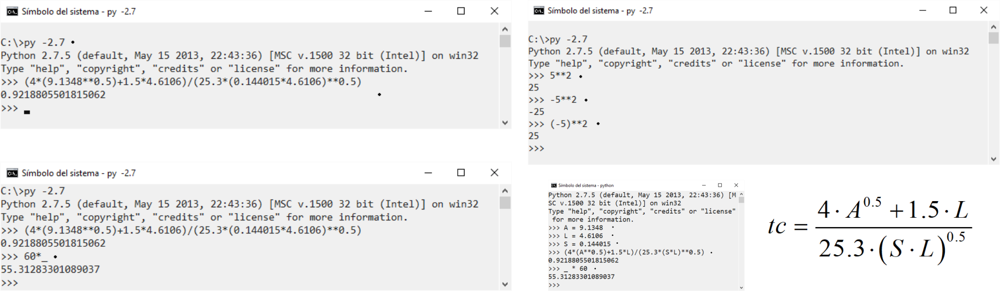

## Usar Python como una calculadora
Keywords: `command` `cmd` `calculator` 

Desde la consola de Python, es posible realizar operaciones matemáticas simples o complejas, definir variables, listas, tuplas, funciones, llamar módulos y en general utilizar cualquier elemento integrado al lenguaje y sin necesidad de que sea almacenado en un script .py. 

> Tenga presente que las definiciones realizadas y resultados obtenidos desaparecerán una vez cierre la ventana del CMD o la consola de Python.

### Objetivos

* Realizar operaciones matemáticas básicas desde la consola de Python.
* Definir variables temporales.

### Requerimientos

* Python 2.7.5 de ArcGIS for Desktop 10.2.2.
* Python 3.10.0+ como instalación independiente o standalone.
* Sistema operativo Microsoft Windows.

> Nota: en caso de no disponer de ArcGIS en su equipo, puede realizar las pruebas de funcionamiento realizando la instalación independiente de la versión 2.7 de Python.

### Caso de estudio

Tiempo de concentración en una cuenca hidrográfica: el tiempo de concentración tc, es el tiempo que tarda una gota de agua que cae en una cuenca desde el punto más lejano hasta su punto de salida. Para este ejemplo utilizaremos la expresión de Giandotti.

 

    

#### Parámetros

* tc, tiempo de concentración en horas.
* A, área de la cuenca = 9.1348 km².
* L, longitud del cauce principal = 4.6106 km.
* S, pendiente media del cauce principal = 0.144015 m/m

### Procedimiento

1. Ingrese al command o CMD de Windows oprimiendo `Windows+R` y digitando CMD o busque en la lista de programas el _Command Promt_. En el CMD ejecute Python, p.ej, 2.7 ingresando el comando `C:\py -2.7`.

2. En Python ingrese la siguiente expresión correspondiente al cálculo del Tc para los parámetros indicados y presione enter: `(4*(9.1348**0.5)+1.5*4.6106)/(25.3*(0.144015*4.6106)**0.5)`.

3. El valor obtenido es de 0.92188 horas. Para conocer el valor en minutos, multiplicar el resultado obtenido por 60. Esto puede ser realizado llamando el resultado anterior mediante el uso del underscore o guion bajo. `>>> 60*_`.

4. Como observa en las operaciones anteriores, el cálculo de las potencias se realiza con `**`, es recomendable colocar la operación de potenciación entre paréntesis debido a que la potenciación de valores negativos arroja un valor negativo debido a que la preferencia de operación es **. En el siguiente ejemplo podrá observar que número negativo elevado al cuadrado arroja un valor negativo, lo cual no es correcto.

5. Para definir en la consola de Python, las variables numéricas de la ecuación, basta con indicar el nombre de la variable y el valor asignado. Para obtener el resultado ingrese la expresión de cálculo reemplazando los valores por los nombres de las variables así `(4*(A**0.5)+1.5*L)/(25.3*(S*L)**0.5)`

> En Python no es necesario definir los tipos debido a que las variables son manejadas dinámicamente en memoria y sin perder precisión en los valores almacenados. Esta particularidad facilita la ejecución de operaciones y la escritura de scripts o secuencias de comandos.

### Variables en memoria

1. Para conocer el listado de variables alojadas en memoria, ingresar el comando `dir()`.

2. Para eliminar una variable de la memoria, ingresar el comando `del nombrevariable`.

### Referencias

* [Conceptos básicos de Morfometría de Cuencas Hidrográficas, usac.edu.gt](http://www.repositorio.usac.edu.gt/4482/1/Conceptos%20b%C3%A1sicos%20de%20Morfometr%C3%ADa%20de%20Cuencas%20Hidrogr%C3%A1ficas.pdf)
* [Tiempo de concentración de una cuenca, aguaysig.com](https://www.aguaysig.com/tiempo-de-concentracion-de-la-cuenca/)

### Compatibilidad

* Compatible con cualquier versión de Python.

### Control de versiones

| Versión    | Descripción     | Autor                                     | Horas |
|------------|:----------------|-------------------------------------------|:-----:|
| 2021.12.05 | Versión inicial | [rcfdtools](https://github.com/rcfdtools) |   4   |

### Licencia, cláusulas y condiciones de uso

_R.HydroTools es de uso libre para fines académicos, conoce nuestra [licencia, cláusulas, condiciones de uso](../../LICENSE.md) y como referenciar los contenidos publicados en este repositorio._

_¡Encontraste útil este repositorio!, apoya su difusión marcando este repositorio con una ⭐ o síguenos dando clic en el botón Follow de [r.cfdtools](https://github.com/rcfdtools) en GitHub._

| [:house: Inicio](../../README.md) | [:beginner: Ayuda / Colabora](https://github.com/rcfdtools/R.HydroTools/discussions/xxx) |
|-----------------------------------|------------------------------|
