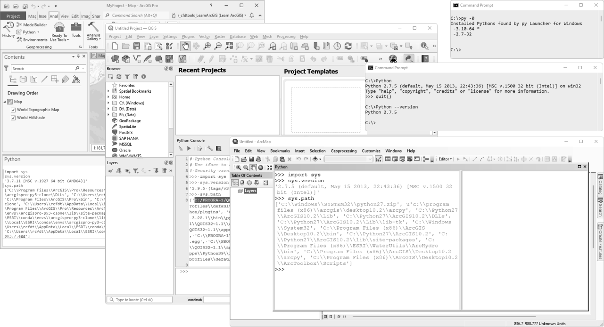

## Identificar y ejecutar cualquier versión de Python instalada
Keywords: `import` `sys` `sys.version` `sys.path` 

En el sistema operativo pueden existir y convivir, además de las versiones integradas a las herramientas GIS, otras versiones de Python registradas y una como versión por defecto. Identificar las versiones instaladas le permitirá realizar la ejecución de comandos por consola o a través de scripts.

### Objetivos

* Identificar las versiones instaladas de Python en su sistema operativo SO.
* Identificar los directorios de instalación de Python.
* Identificar la versión instalada de Python en ArcGIS for Desktop.
* Identificar la versión instalada de Python en ArcGIS Pro.
* Identificar la versión instalada de Python en QGIS.

### Requerimientos

* Python 2.7.5 de ArcGIS for Desktop 10.2.2.
* Python 3.10.0+ como instalación independiente o standalone.
* ArcGIS Pro 2.9+ (opcional).
* QGIS 3.22.1.
* PyCharm 2021.3+ for Anaconda. 

> Nota: en caso de no disponer de ArcGIS en su equipo, puede realizar las pruebas de funcionamiento realizando la instalación independiente de la versión 2.7 de Python.

> Nota: para la instalación de versiones independientes de Python, p.ej, la versión 3.10.0, se recomienda modificar la ruta de instalación a una ruta de fácil acceso como _C:\Python310\_

### Consulta de versiones desde el Command CMD de Microsoft Windows

#### Identificar la versión asociada en las rutas por defecto del sistema operativo Microsoft Windows

1. Ir a Inicio, en el cuadro de búsqueda digitar `CMD` y dar Enter o presionar la combinación de teclas `Windows+R` ingresando `CMD` y dando clic en Ok. 
2. En el prompt del sistema digitar `C:\Python` y dar Enter o utilizar el comando `Python.exe --version` de esta forma podrá conocer la versión por defecto definida en las variables de entorno.
3. Para salir de la consola de Python usar `Ctrl+Z` y enter o usar el comando `quit()`. 

>Es posible que al ingresar Python y dar Enter no se ejecute ninguna instrucción o el SO devuelva un error indicado que el comando ingresado no existe, esto significa que su sistema operativo no dispone por defecto de una versión de Python definida en el entorno de trabajo.

#### Identificar las versiones instaladas que pueden ser lanzadas directamente desde el CMD

1. Utilizando la instrucción `py -0` en el `CMD`, python devuelve las versiones instaladas y registradas en el sistema operativo que pueden ser ejecutadas desde cualquier directorio del S.O. sin necesidad de ingresar su ruta completa de localización. 
> Asterisco (*) indica cuál es la versión por defecto.
> Si dispone de ArcGIS Pro, en los resultados desplegados no aparecerá la versión asociada.

2. Para verificar las versiones instaladas, también podrá utilizar el comando `py -` seguido de los dos primeros dígitos de la versión separados por punto (p.ej, -2.7) y el comando `--version` (p.ej, `py -2.7 --version`).

#### Verificación de rutas o path asociado a cada versión de Python

1. En el Command o CMD de Microsoft Windows, ejecutar el comando `py -` indicando el número de la versión, p.ej, `py -2.7`.

2. Importar la librería de sistema usando el comando `import sys`, para finalizar ingresar el comando `sys.path`, para salir ingrese el comando `quit()`.

> En la ilustración podrá observar que la versión 2.7.5 de Python se encuentra instalada en C:\Python27 y corresponde a ArcGIS for Desktop 10.2. También podrá observar que la versión 3.10.0 se encuentra instalada en C:\Python310 y corresponde a una instalación independiente o standalone.

### Consulta de versiones desde las interfaces gráficas GUI de ArcGIS y QGIS

#### Verificación de versión y rutas de Python en ArcGIS for Desktop

Para conocer la versión instalada de Python en ArcGIS Desktop y su localización, abrir ArcMAP y dar clic en el ícono de la consola de Python, importar la librería sys con el comando `import sys` y ejecutar el comando `sys.version` y `sys.path`. La versión instalada en ArcGIS 10.2.2 es Python 2.7.5. y está localizada en C:\Python27\.

#### Verificación de versión y rutas de Python en ArcGIS Pro

En el menú _Analysis_ dar clic en el botón de opciones de Python y seleccionar _Python Window_, luego en la ventana de comandos importar la librería sys y ejecutar los comandos `sys.version` y `sys.path`. La versión instalada en ArcGIS Pro 2.9 es Python 3.7.11 y está localizada en c:\Progra~1\ArcGIS\Pro\bin\Python\scripts\.

#### Verificación de versión y rutas de Python en QGIS

En cuanto a QGIS (p.ej, la versión 3.22.1), dar clic en el botón Python para ingresar a la consola de comandos e ingresar los mismos comandos que utilizó en ArcGIS para consultar la versión y rutas asociadas. La versión instalada en QGIS 3.22.1 es Python 3.9.5. y está en localizada en _C:\Program Files\QGIS 3.22.1\apps\Python39_.

### Compatibilidad

* Compatible con cualquier versión de Python.

### Control de versiones

| Versión    | Descripción                                                              | Autor                                     | Horas |
|------------|:-------------------------------------------------------------------------|-------------------------------------------|:-----:|
| 2021.12.04 | Inclusión de verificación de versión y ruta asociada en ArcGIS Pro 2.9.  | [rcfdtools](https://github.com/rcfdtools) |   1   |
| 2021.12.01 | Versión inicial.                                                         | [rcfdtools](https://github.com/rcfdtools) |   5   |

### Licencia, cláusulas y condiciones de uso

_R.HydroTools es de uso libre para fines académicos, conoce nuestra [licencia, cláusulas, condiciones de uso](../../LICENSE.md) y como referenciar los contenidos publicados en este repositorio._

_¡Encontraste útil este repositorio!, apoya su difusión marcando este repositorio con una ⭐ o síguenos dando clic en el botón Follow de [r.cfdtools](https://github.com/rcfdtools) en GitHub._

| [:house: Inicio](../../README.md) | [:beginner: Ayuda / Colabora](https://github.com/rcfdtools/R.HydroTools/discussions/xxx) |
|-----------------------------------|------------------------------------------------------------------------------------------|
