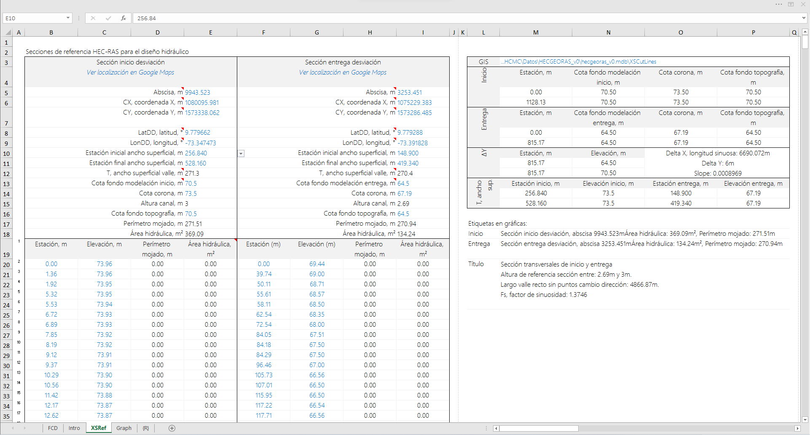
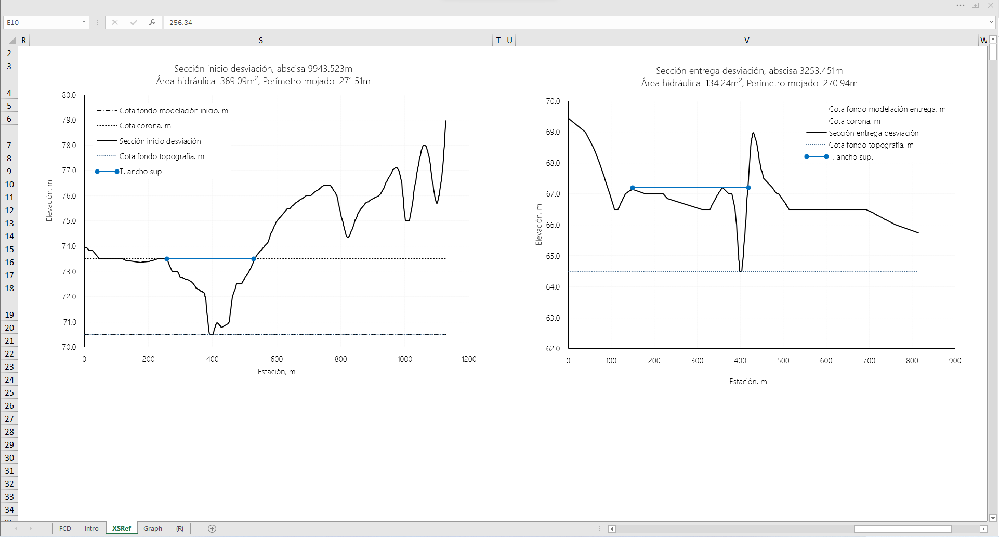
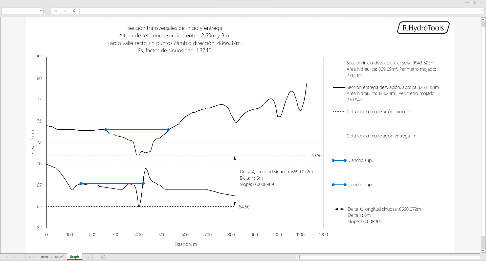
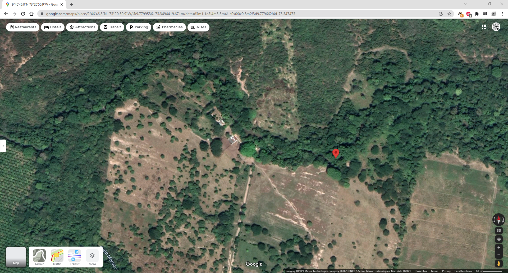

## Secciones transversales de referencia inicio y entrega para diseño hidráulico
Keywords: `hydraulics` `xs-cross-section` `river-cross-section` `hydraulic-area` `wet-perimeter`

Secciones topográficas sobre el cauce actual donde inicia y entrega el canal de realineamiento a diseñar. Los datos de estación y elevación son extraídos del modelo de muestreo HEC-RAS, construido a partir del modelo de terreno de puntos topográficos y líneas de secciones transversales de la topografía. Las cotas de inicio y entrega para el diseño y modelación pueden ser más altas o bajas dependiendo si se considera rellenar,  dragar o rectificar el cauce natural antes de su intervención.

Se puede considerar que el canal artificial a diseñar deberá tener una profundidad similar a la del cauce natural a reemplazar, sin embargo, cuando se plantea realizar dragado o rectificación de fondo para rehabilitación o realce de los taludes de protección, las profundidades pueden variar y será necesario realizar un nuevo levantamiento topobatimétrico de las zonas de inicio y entrega para realizar un nuevo análisis.

Para el correcto cálculo del área hidráulica y perímetro mojado, la línea que describe el ancho superficial a partir de la selección de estaciones, no debe cruzar la línea de terreno. Tenga en cuenca que cuando existen bancos de arena o sobre elevaciones por encima de la lámina de agua dentro del ancho superficial, la hoja de cálculo sobre estima o sub estima el valor del área y perímetro hidráulico calculado.

### Requerimientos

* [Microsoft Excel](https://www.microsoft.com/en-us/microsoft-365/excel) 2013 o superior

### Ilustraciones

### Control de versiones

| Versión     | Descripción                                                                                                                                                                                                                                                                                                                                                                                                                                                            | Autor                                      | Horas |
|-------------|:-----------------------------------------------------------------------------------------------------------------------------------------------------------------------------------------------------------------------------------------------------------------------------------------------------------------------------------------------------------------------------------------------------------------------------------------------------------------------|--------------------------------------------|:-----:|
| 2022.07.25  | Actualización general de documentación.                                                                                                                                                                                                                                                                                                                                                                                                                                | [rcfdtools](https://github.com/rcfdtools)  |  0.5  |
| 2021.10.18  | Hoja de análisis ahora incluye de cálculo de área hidráulica y perímetro mojado. Actualización general de gráficas.                                                                                                                                                                                                                                                                                                                                                    | [rcfdtools](https://github.com/rcfdtools)  |   2   |
| 2021.10.16  | Inclusión de coordenadas de localización de secciones de inicio y entrega en intersección con red de drenaje. Inclusión de selectores de estación inicial y final para estimación del ancho superficial T. Inclusión de localización geográfica e hipervinculación para visualización en Google Maps. Estimación de largo del valle recto sin puntos de cambio de dirección. Estimación del factor de sinuosidad característico Fs. Actualización general de gráficas. | [rcfdtools](https://github.com/rcfdtools)  |   3   |
| 2016.05.20  | Versión inicial.                                                                                                                                                                                                                                                                                                                                                                                                                                                       | [rcfdtools](https://github.com/rcfdtools)  |   6   |

_R.HydroTools es de uso libre para fines académicos, conoce nuestra [licencia, cláusulas, condiciones de uso](https://github.com/rcfdtools/R.HydroTools/wiki/License) y como referenciar los contenidos publicados en este repositorio._

_¡Encontraste útil este repositorio!, apoya su difusión marcando este repositorio con una ⭐ o síguenos dando clic en el botón Follow de [r.cfdtools](https://github.com/rcfdtools) en GitHub._

| [:house: Inicio](../../README.md) | [:beginner: Ayuda / Colabora](https://github.com/rcfdtools/R.HydroTools/discussions/23) |
|------------------------------------------------------------------|-------------------------------------------------------------------------------|

