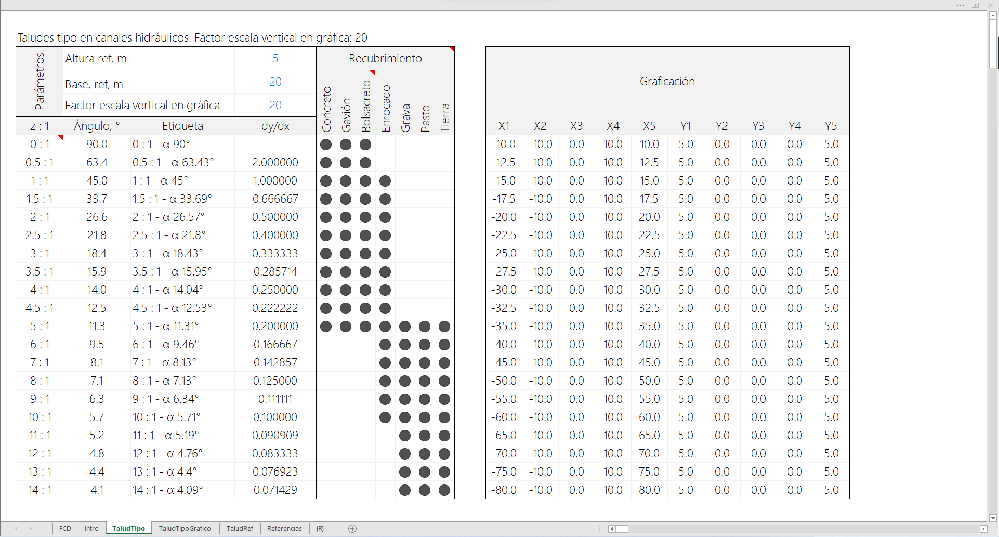
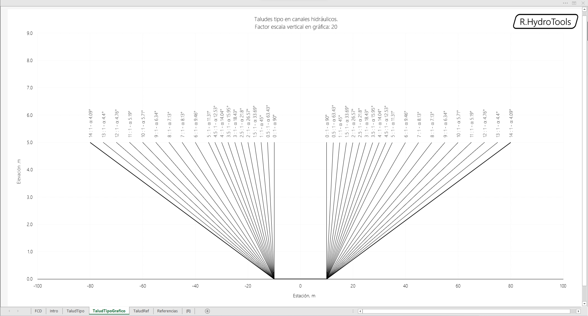
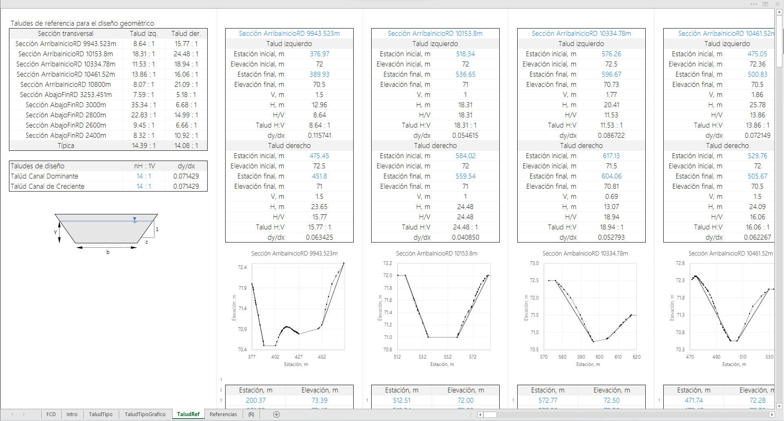

## Evaluación de taludes de referencia para diseño de sección a partir de secciones transversales de cauces naturales
Keywords: `gydraulics` `side-slope` `#v:1h`

A partir de la información topográfica disponible y de las secciones transversales trazadas en el modelo de muestreo HEC-GeoRAS arriba del punto de inicio y abajo del punto de entrega sobre cauces naturales existentes y en cauces laterales, estudiar la inclinación actual de los taludes que será utilizada como referencia para el diseño del canal artificial compuesto, correspondiente al talud estable del cauce natural luego de todos los procesos erosivos y de sedimentación.

Para el diseño geométrico del canal de realineamiento, se consideran válidos, taludes de diseño con relación H:V mayor a la encontrada en las secciones naturales, obteniendo taludes más tendidos en los que existirá menor riesgo de arrastre de material, erosión, socavación, volcamiento o falla.

Para el estudio de los taludes de referencia, en el libro de análisis se pueden utilizar las columnas del talud izquierdo para el análisis de las secciones del cauce dominante y las columnas derechas para el talud del valle o de creciente.

### Requerimientos

* [Microsoft Excel](https://www.microsoft.com/en-us/microsoft-365/excel) 2013 o superior
* [HEC-RAS](https://www.hec.usace.army.mil/software/hec-ras/)

### Referencias

* INVIAS. Manual de drenaje para carreteras. Tabla 4.8.
* RAS Título B Sistemas de Acueducto. Tabla B 4.4.
* Dado el contenido de material cohesivo, en el ángulo de reposo del material solo debe ser considerado materiales gruesos no cohesivos. Ref: Ven Te Chow. Hidráulicas de Canales Abiertos. página 169.

### Ilustraciones

### Control de versiones

| Versión    | Descripción                                                                                                                      | Autor                                      | Horas |
|------------|:---------------------------------------------------------------------------------------------------------------------------------|--------------------------------------------|:-----:|
| 2022.07.25 | Actualización general de documentación.                                                                                          | [rcfdtools](https://github.com/rcfdtools)  |  0.5  |
| 2021.10.18 | Actualización general de formato.                                                                                                | [rcfdtools](https://github.com/rcfdtools)  |   2   |
| 2020.10.11 | Inclusión de tabla y gráfico con taludes de referencia y recubrimientos típicos en canales con relación y ángulo de inclinación. | [rcfdtools](https://github.com/rcfdtools)  |   3   |
| 2016.05.22 | Versión inicial.                                                                                                                 | [rcfdtools](https://github.com/rcfdtools)  |  12   |

_R.HydroTools es de uso libre para fines académicos, conoce nuestra [licencia, cláusulas, condiciones de uso](https://github.com/rcfdtools/R.HydroTools/wiki/License) y como referenciar los contenidos publicados en este repositorio._

_¡Encontraste útil este repositorio!, apoya su difusión marcando este repositorio con una ⭐ o síguenos dando clic en el botón Follow de [r.cfdtools](https://github.com/rcfdtools) en GitHub._

| [:house: Inicio](../../README.md)  | [:beginner: Ayuda / Colabora](https://github.com/rcfdtools/R.HydroTools/discussions/25) |
|------------------------------------|-----------------------------------------------------------------------------------------|
